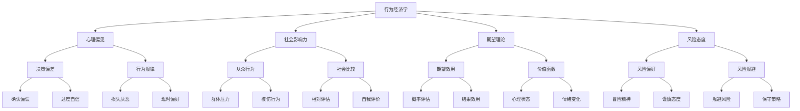
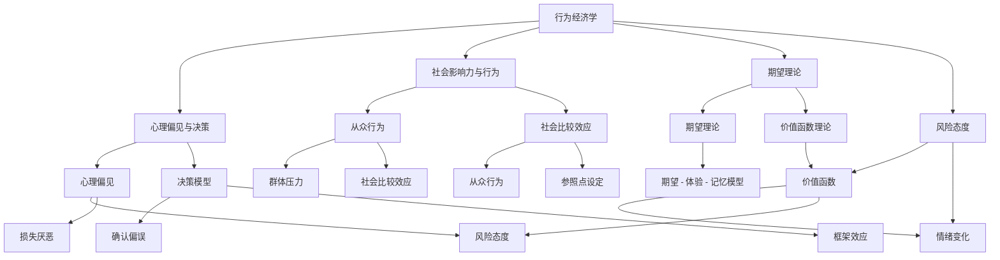

                 

# 《如何设计基于行为经济学的产品策略》

> **关键词**：行为经济学，产品设计，营销策略，定价策略，用户行为预测

> **摘要**：本文旨在探讨如何将行为经济学原理应用于产品策略的各个层面。通过分析心理偏见、社会影响力、期望理论和风险态度等核心概念，结合实际项目案例，详细阐述行为经济学在产品设计、营销和定价中的具体应用。文章分为两部分，第一部分为基础理论，介绍行为经济学的基本概念和关键模型；第二部分为应用实践，结合具体案例展示行为经济学在产品策略中的实际操作。

## 目录

### 第一部分：行为经济学基础

#### 第1章：行为经济学概述

1.1 行为经济学的基本概念  
1.2 行为经济学的主要领域  
1.3 行为经济学在现代经济学中的应用

#### 第2章：行为经济学的关键概念与模型

2.1 心理偏见与决策  
2.2 决策模型  
2.3 社会影响力与行为  
2.4 风险态度

#### 第3章：行为经济学在产品策略中的应用

3.1 产品设计中的行为经济学原理  
3.2 用户行为预测与分析  
3.3 基于行为经济学的定价策略

### 第二部分：行为经济学在产品策略中的应用实践

#### 第4章：行为经济学在产品设计中的应用

4.1 利用行为经济学提升用户体验  
4.2 设计用户参与感  
4.3 提高用户忠诚度

#### 第5章：行为经济学在产品营销中的应用

5.1 利用行为经济学设计营销策略  
5.2 用户参与度提升策略  
5.3 营销效果评估

#### 第6章：行为经济学在产品定价中的应用

6.1 定价策略与消费者行为  
6.2 基于行为经济学的定价策略  
6.3 定价实验与调整

#### 第7章：行为经济学在产品创新中的应用

7.1 创新过程中的行为经济学原理  
7.2 创新策略  
7.3 创新评估与优化

#### 第8章：行为经济学在产品策略中的综合应用

8.1 综合策略设计  
8.2 案例研究  
8.3 未来展望

#### 附录

A.1 行为经济学研究工具  
A.2 行为经济学相关书籍与文献  
A.3 在线资源与社区

## 引言

在现代社会，产品策略的制定已经不再仅仅是技术和市场数据的简单分析，更涉及到人类行为和心理层面的理解。行为经济学，作为一门跨学科的研究领域，通过研究人们在现实生活中的决策过程，为我们提供了新的视角和工具。本文将探讨如何将行为经济学原理应用于产品策略的各个层面，旨在帮助产品经理和设计师更好地理解用户行为，设计出更加符合用户需求的产品和服务。

### 第一部分：行为经济学基础

### 第1章：行为经济学概述

#### 1.1 行为经济学的基本概念

行为经济学是经济学和心理学的交叉学科，主要研究人们在现实经济生活中的决策行为。与传统的经济学不同，行为经济学关注个体在面对复杂、不确定的情境时如何做出决策，以及这些决策背后的心理机制。

行为经济学的基本概念包括：

- **心理偏见**：指人们在决策过程中表现出的系统性偏差，如过度自信、损失厌恶等。
- **社会影响力**：指个体在社会环境中受到他人行为和态度的影响，从而改变自己行为的倾向。
- **期望理论**：用于解释个体在不确定性情境下的决策过程，强调期望效用函数在决策中的作用。
- **风险态度**：指个体对风险和不确定性的态度和偏好，包括风险偏好和风险规避。

#### 1.2 行为经济学的主要领域

行为经济学的主要领域包括：

- **心理偏见与决策**：研究各种心理偏见如何影响个体的决策过程，如过度自信、损失厌恶、确认偏误等。
- **社会影响力与行为**：研究社会因素如何影响个体的决策和行为，如从众行为、社会比较效应等。
- **期望理论**：探讨个体如何在不同情境下评估和比较不同选择的期望效用，从而做出决策。
- **风险态度**：分析个体对风险的偏好和规避行为，以及这些行为如何影响市场结果。

#### 1.3 行为经济学在现代经济学中的应用

行为经济学对现代经济学产生了深远的影响。它不仅丰富了经济学理论，还为政策制定和商业实践提供了新的启示。以下是行为经济学在现代经济学中的应用：

- **市场行为解释**：行为经济学提供了新的视角，解释了传统经济学无法解释的市场现象，如市场崩溃、泡沫等。
- **政策制定**：行为经济学的研究成果被应用于政策制定，如税收政策、社会福利政策等，以提高政策的有效性。
- **商业实践**：企业在产品设计、营销策略和定价策略中运用行为经济学原理，以更好地满足用户需求，提高市场竞争力。

### 第2章：行为经济学的关键概念与模型

#### 2.1 心理偏见与决策

心理偏见是行为经济学研究的重要领域。以下是几种常见的心理偏见：

- **过度自信**：个体倾向于高估自己的能力和知识，低估风险。
- **损失厌恶**：个体对损失的厌恶超过对收益的追求，导致风险规避行为。
- **确认偏误**：个体倾向于寻找和解释信息，以支持自己已有的信念，忽视反对性证据。
- **现时偏好**：个体倾向于优先考虑眼前的收益或满足，忽视长期的收益或需要。

这些心理偏见如何影响决策呢？我们可以通过以下模型来解释：

- **期望理论**：期望理论（Expected Utility Theory）是一种常用的决策模型，用于评估个体在不同情境下的决策。期望理论认为，个体在做出决策时会考虑每个结果的概率和效用，通过计算期望效用来选择最佳行动方案。
  
  期望理论的公式如下：
  $$
  EU = \sum_{i=1}^{n} p_i \cdot u_i
  $$
  其中，\(EU\) 是期望效用，\(p_i\) 是第 \(i\) 个结果发生的概率，\(u_i\) 是第 \(i\) 个结果的效用。

- **价值函数理论**：价值函数理论（Value Function Theory）是一种更加复杂的决策模型，它考虑了个体在不同情境下的心理状态和情绪变化。价值函数理论认为，个体在决策过程中不仅考虑期望效用，还会考虑心理状态的变化，如快乐、焦虑等。

  价值函数理论的公式如下：
  $$
  V(S) = \int u(p) \cdot dS
  $$
  其中，\(V(S)\) 是价值函数，\(u(p)\) 是期望效用函数，\(S\) 是状态空间。

#### 2.2 社会影响力与行为

社会影响力是指个体在社会环境中受到他人行为和态度的影响，从而改变自己行为的倾向。以下是社会影响力与行为的一些关键概念：

- **从众行为**：个体在群体压力下改变自己的行为，以符合群体规范。
- **社会比较效应**：个体通过与他人比较来评估自己的价值和地位，从而影响自己的行为和决策。
- **社会认同**：个体通过认同某个群体或文化，来提高自己的自尊和归属感。

社会影响力与行为的关系可以用以下模型来解释：

- **社会认同模型**：社会认同模型（Social Identity Model）认为，个体的行为和态度受到自我认同和群体认同的影响。个体在做出决策时，会考虑到自己的身份和所属群体，从而产生社会影响力。
- **社会比较模型**：社会比较模型（Social Comparison Model）认为，个体通过与他人比较来评估自己的能力和价值。社会比较可以导致从众行为和社会认同。

#### 2.3 期望理论

期望理论（Expected Utility Theory）是行为经济学中一个重要的决策模型，用于解释个体在不确定性情境下的决策过程。期望理论的基本原理可以概括为以下几点：

- **期望效用函数**：期望效用函数是一个用来衡量个体在不同决策结果下所获得效用的数学模型。假设有多个可能的结果，每个结果发生的概率为 \( p_i \)，对应的结果效用为 \( u_i \)，则期望效用 \( EU \) 可以表示为：

  $$
  EU = \sum_{i=1}^{n} p_i \cdot u_i
  $$

- **偏好规则**：期望理论提出了几个偏好规则，用于判断个体在不同决策结果下的偏好顺序：

  - **确定性等价原则**：如果两个决策的结果具有相同的期望效用，则个体对于这两个决策的偏好相同。
  - **严格确定性等价原则**：如果两个决策的结果在任意结果下的效用都不低于另一个决策，则个体偏好前者。
  - **独立性原则**：个体对于两个独立决策的偏好顺序不应受到决策顺序的影响。

- **期望理论的应用**：期望理论广泛应用于多个领域，如投资决策、保险购买、赌博行为等。在实际应用中，通常需要结合具体情境和个体偏好来构建期望效用函数。

#### 2.4 风险态度

风险态度是指个体对风险和不确定性的态度和偏好。个体对风险的偏好和规避行为可以影响他们的决策过程和市场结果。以下是几种常见的风险态度：

- **风险偏好**：个体倾向于选择具有较高潜在收益但同时也具有较高风险的选择。
- **风险规避**：个体倾向于选择具有较低风险但同时也具有较低潜在收益的选择。

风险态度与决策的关系可以用以下模型来解释：

- **期望价值模型**：期望价值模型（Expected Value Model）用于评估决策结果的潜在收益或损失。期望价值模型通过计算各个可能结果的收益或损失乘以其概率，然后将它们相加得出。

  期望价值的公式如下：
  $$
  EV = \sum_{i=1}^{n} p_i \cdot x_i
  $$
  其中，\(EV\) 是期望价值，\(p_i\) 是第 \(i\) 个结果发生的概率，\(x_i\) 是第 \(i\) 个结果的收益或损失。

- **条件概率模型**：条件概率模型（Conditional Probability Model）用于评估在某个结果已经发生的情况下，另一个结果发生的概率。

  条件概率的公式如下：
  $$
  P(A|B) = \frac{P(A \cap B)}{P(B)}
  $$
  其中，\(P(A|B)\) 是在事件 \(B\) 发生的条件下事件 \(A\) 发生的概率，\(P(A \cap B)\) 是事件 \(A\) 和事件 \(B\) 同时发生的概率，\(P(B)\) 是事件 \(B\) 发生的概率。

### 第3章：行为经济学在产品策略中的应用

#### 3.1 产品设计中的行为经济学原理

行为经济学在产品设计中的应用非常广泛，通过理解用户的心理和行为，设计师可以创造出更加符合用户需求的产品。以下是行为经济学在产品设计中的几个关键应用：

- **利用心理偏见提升用户参与度**：心理偏见是用户行为的重要驱动力。例如，人们倾向于追求新奇和独特性，这是设计师可以利用的。通过设计独特且具有挑战性的功能或界面，可以提升用户的参与度。

- **设计用户友好的界面**：行为经济学研究表明，用户对界面设计有明显的偏好，如简洁性、直观性和一致性。设计师可以利用这些原则，设计出更加用户友好的界面，从而提高用户满意度和使用率。

- **利用期望理论进行功能设计**：期望理论可以帮助设计师理解用户在不同情境下的期望效用，从而设计出能够满足用户期望的产品功能。例如，在购物网站中，设计师可以利用期望理论来设计优惠和促销活动，以提升用户的购买意愿。

- **利用风险态度进行产品定价**：用户的风险态度会影响他们的购买决策。通过了解用户的风险偏好，设计师可以制定出更合适的产品定价策略，从而提高产品的销售量。

#### 3.2 用户行为预测与分析

用户行为预测与分析是产品策略的重要组成部分。通过分析用户的历史行为数据，企业可以更好地了解用户的需求和行为模式，从而制定出更加精准的产品策略。以下是行为经济学在用户行为预测与分析中的应用：

- **基于行为经济学模型的用户行为预测**：行为经济学模型可以帮助预测用户的行为。例如，通过期望理论，企业可以预测用户对某一产品功能的偏好，从而优化产品设计和功能。

- **用户行为数据分析方法**：行为经济学提供了多种数据分析方法，如回归分析、聚类分析等，用于分析用户行为数据。通过这些方法，企业可以识别出用户的潜在需求和偏好，从而进行精准营销和个性化推荐。

- **利用心理偏见进行用户细分**：心理偏见会影响用户的行为和态度。通过分析用户的心理偏见，企业可以将其作为用户细分的依据，从而设计出更加针对性的产品和服务。

#### 3.3 基于行为经济学的定价策略

定价策略是企业实现盈利目标的重要手段。行为经济学为定价策略提供了新的视角和工具，以下是基于行为经济学的定价策略：

- **价格感知与价值**：用户对产品的价格感知会影响他们的购买决策。行为经济学研究表明，用户对价格的感知不仅取决于绝对价格，还取决于相对价格和参考价格。通过调整价格和营销策略，企业可以影响用户对价格的感知，从而提高销售额。

- **价格歧视策略**：价格歧视是指企业根据用户的特征和需求，对同一产品制定不同的价格。行为经济学提供了多种价格歧视策略，如基于用户价值的定价、基于用户需求的动态定价等。

- **定价实验与调整**：行为经济学强调实验的重要性，通过实验，企业可以验证不同的定价策略对用户行为的影响，从而调整和优化定价策略。

### 第二部分：行为经济学在产品策略中的应用实践

#### 第4章：行为经济学在产品设计中的应用

行为经济学在产品设计中的应用可以帮助企业更好地满足用户需求，提高用户体验和忠诚度。以下是行为经济学在产品设计中的几个实际应用案例：

#### 4.1 利用行为经济学提升用户体验

- **舒适区理论**：舒适区理论指出，人们倾向于在熟悉的、舒适的环境中活动。在产品设计过程中，可以通过设计易于使用、直观的界面和功能，帮助用户迅速上手，从而提升用户体验。

- **期望 - 体验 - 记忆模型**：期望 - 体验 - 记忆模型（Expectation - Experience - Memory Model）是行为经济学中的一种理论，用于解释用户对产品体验的评价。在产品设计过程中，可以通过优化用户的期望（如提供清晰的引导和教程）、提升用户的体验（如优化界面交互和功能设计）以及塑造用户的记忆（如提供令人难忘的互动体验），来提升用户体验。

#### 4.2 设计用户参与感

- **利用从众效应增加用户互动**：从众效应是指个体在群体中倾向于模仿和跟随他人的行为和态度。在产品设计过程中，可以通过设计群体互动功能（如社交媒体分享、用户评价等），来激发用户的参与感，从而增加用户互动。

- **社会比较效应在产品设计中的应用**：社会比较效应是指个体通过与他人比较来评估自己的能力和价值。在产品设计过程中，可以通过设计竞争性功能（如排行榜、挑战等），来激发用户的社会比较心理，从而提高用户的参与度。

#### 4.3 提高用户忠诚度

- **建立用户社区**：建立用户社区可以帮助企业培养用户的归属感和忠诚度。在用户社区中，用户可以分享经验、交流想法，从而增强用户之间的联系和互动。通过定期举办线上或线下活动，企业可以进一步提升用户忠诚度。

- **利用习惯形成原理保持用户活跃**：习惯形成原理是指个体通过重复某一行为，最终将其转化为习惯。在产品设计过程中，可以通过设计易于使用的功能、提供个性化的推荐和通知，来引导用户形成使用产品的习惯，从而提高用户活跃度。

### 第5章：行为经济学在产品营销中的应用

行为经济学在产品营销中的应用可以帮助企业更好地吸引目标用户，提高用户参与度和购买意愿。以下是行为经济学在产品营销中的几个实际应用案例：

#### 5.1 利用行为经济学设计营销策略

- **利用心理偏见吸引目标用户**：行为经济学揭示了多种心理偏见，如锚定效应、稀缺效应等。在营销策略设计中，企业可以利用这些心理偏见，设计出更具吸引力的广告和促销活动，从而吸引目标用户。

- **营销传播中的认知偏差利用**：认知偏差是指个体在信息处理过程中表现出的系统性偏差。在营销传播过程中，企业可以利用认知偏差，如框架效应、确认偏误等，来增强营销信息的说服力和影响力。

#### 5.2 用户参与度提升策略

- **培养用户习惯**：培养用户习惯是提高用户参与度的有效策略。通过设计易于使用、有趣的功能，企业可以引导用户形成使用产品的习惯。例如，通过设计奖励机制，如积分、优惠券等，来激励用户持续使用产品。

- **利用奖励机制增加用户粘性**：奖励机制是一种有效的激励手段，可以增加用户的粘性。例如，通过设计签到奖励、邀请好友奖励等，来激发用户的参与热情，从而提高用户粘性。

#### 5.3 营销效果评估

- **行为经济学在营销效果分析中的应用**：行为经济学为营销效果分析提供了新的视角和方法。通过分析用户行为数据，企业可以了解营销策略对用户行为的影响，从而评估营销效果。

- **数据驱动的营销优化**：数据驱动的营销优化是指企业根据用户行为数据，不断调整和优化营销策略。通过数据驱动的营销优化，企业可以更加精准地满足用户需求，提高营销效果。

### 第6章：行为经济学在产品定价中的应用

行为经济学在产品定价中的应用可以帮助企业更好地理解用户的心理和行为，制定出更合理、更具竞争力的定价策略。以下是行为经济学在产品定价中的几个实际应用案例：

#### 6.1 定价策略与消费者行为

- **价格感知与价值判断**：用户对产品的价格感知会影响他们的购买决策。行为经济学研究表明，用户对价格的感知不仅取决于绝对价格，还取决于相对价格和参考价格。在定价策略中，企业需要考虑用户的价值判断，制定出符合用户心理预期的价格。

- **风险规避与价格敏感度**：用户的风险态度会影响他们的价格敏感度。风险规避的用户可能对价格更敏感，因为他们担心购买的产品不值得这个价格。通过了解用户的风险态度，企业可以制定出更具针对性的定价策略。

#### 6.2 基于行为经济学的定价策略

- **价格锚点策略**：价格锚点策略是一种常用的定价策略，通过设定一个参考价格，影响用户对产品价格的感知。在定价策略中，企业可以利用价格锚点策略，通过设置高价格或低价格锚点，来影响用户对产品价值的判断。

- **价格歧视策略**：价格歧视策略是指企业根据不同用户群体制定不同的价格。行为经济学为价格歧视策略提供了理论依据，通过分析用户的行为和偏好，企业可以制定出更有效的价格歧视策略。

#### 6.3 定价实验与调整

- **实验设计**：定价实验是一种有效的策略，通过在不同用户群体中测试不同的定价策略，企业可以了解定价策略对用户行为的影响。实验设计的关键是选择合适的实验组和对照组，以及合理的实验变量。

- **数据分析**：定价实验的结果需要通过数据分析来解读。行为经济学提供了多种数据分析方法，如回归分析、实验设计分析等，用于评估定价策略的有效性。通过数据分析，企业可以不断优化定价策略，提高产品的竞争力。

### 第7章：行为经济学在产品创新中的应用

行为经济学在产品创新中的应用可以帮助企业更好地理解用户的需求和行为，推动创新项目的成功。以下是行为经济学在产品创新中的几个实际应用案例：

#### 7.1 创新过程中的行为经济学原理

- **创新者心理偏见**：创新者在产品创新过程中可能会受到多种心理偏见的影响，如过度自信、创新者偏见等。这些心理偏见会影响创新者的判断和决策。通过了解这些心理偏见，企业可以更好地管理和引导创新过程。

- **创新过程中的决策模型**：行为经济学为创新过程中的决策提供了多种模型，如期望理论、价值函数理论等。这些模型可以帮助创新者评估不同的创新方案，选择最优的创新路径。

#### 7.2 创新策略

- **利用心理偏见推动创新**：行为经济学研究表明，心理偏见可以推动创新。例如，过度自信可以激发创新者的积极性，创新者偏见可以促使创新者探索新的解决方案。在创新策略中，企业可以利用这些心理偏见，推动创新项目的进展。

- **创新项目风险管理**：创新项目通常伴随着较高的风险。通过了解行为经济学的风险态度理论，企业可以识别和评估创新项目中的风险，制定出有效的风险管理策略，降低创新项目的风险。

#### 7.3 创新评估与优化

- **创新效果评估**：创新效果评估是创新过程的重要环节。行为经济学为创新效果评估提供了多种方法，如实验设计、数据驱动评估等。通过评估创新项目的效果，企业可以了解创新项目的成功程度，为后续的创新活动提供参考。

- **创新过程优化**：创新过程优化是指企业根据创新效果评估的结果，对创新过程进行改进和优化。通过不断优化创新过程，企业可以提高创新效率，降低创新风险，提高创新成功率。

### 第8章：行为经济学在产品策略中的综合应用

行为经济学在产品策略中的应用是一个复杂的系统工程，需要综合考虑产品设计的各个方面。以下是行为经济学在产品策略中的综合应用：

#### 8.1 综合策略设计

- **整合不同应用领域**：行为经济学在产品设计、营销、定价、创新等方面的应用都需要综合考虑。例如，在设计产品时，需要考虑用户的心理偏见、社会影响力、期望理论和风险态度；在营销策略中，需要考虑用户的参与度、购买行为和心理预期；在定价策略中，需要考虑用户的价值判断和价格敏感度。

- **构建跨学科团队**：为了更好地实现行为经济学在产品策略中的应用，企业可以构建跨学科团队，包括经济学家、心理学家、市场营销专家等。跨学科团队可以充分发挥各自的专业优势，共同制定出科学、有效的产品策略。

#### 8.2 案例研究

- **案例分析**：通过分析具体案例，可以深入了解行为经济学在产品策略中的应用效果。例如，可以分析成功企业的产品策略，了解它们如何运用行为经济学原理来满足用户需求、提高市场竞争力。

- **借鉴与反思**：通过案例分析，企业可以借鉴成功企业的经验，反思自己的产品策略，找出存在的问题和改进的方向。

#### 8.3 未来展望

- **行为经济学在产品策略中的发展趋势**：随着行为经济学理论的不断完善和应用领域的拓展，未来行为经济学在产品策略中的应用将更加广泛和深入。例如，在智能制造、物联网等领域，行为经济学可以为企业提供更加精准的用户需求分析和管理方法。

- **与其他学科的融合**：行为经济学可以与其他学科（如计算机科学、心理学、社会学等）相结合，共同推动产品策略的创新和发展。通过跨学科的融合，企业可以更好地理解和满足用户需求，提高市场竞争力。

### 附录

#### A.1 行为经济学研究工具

- **实验设计工具**：如随机分配工具、A/B 测试工具等，用于设计和分析行为经济学实验。
- **数据分析工具**：如 SPSS、R 等统计软件，用于处理和分析行为经济学数据。

#### A.2 行为经济学相关书籍与文献

- **推荐书籍**：如《行为经济学：人类决策的心理学原理》、《决策与判断》等。
- **学术论文资源**：如 JSTOR、PubMed 等，提供丰富的行为经济学研究论文。

#### A.3 在线资源与社区

- **行为经济学论坛**：如行为经济学社区、心理学论坛等，提供行为经济学的研究讨论和交流平台。
- **在线课程与讲座**：如 Coursera、edX 等，提供行为经济学相关的在线课程和讲座。

## 结语

行为经济学为产品策略提供了一个全新的视角和工具。通过理解用户的心理和行为，企业可以更好地设计产品、制定营销策略和定价策略，从而提高市场竞争力。本文系统地阐述了行为经济学在产品策略中的应用，包括产品设计、营销、定价和创新等方面。然而，行为经济学的应用是一个不断发展的过程，需要结合实际情况进行不断创新和优化。希望本文能够为企业提供有益的启示和指导，推动产品策略的创新和发展。


作者：AI天才研究院/AI Genius Institute & 禅与计算机程序设计艺术 /Zen And The Art of Computer Programming

### 第一部分：行为经济学基础

#### 第1章：行为经济学概述

行为经济学是一门研究个体在现实经济生活中的决策行为的跨学科领域，它结合了经济学和心理学的理论和方法。行为经济学试图理解个体在面临复杂、不确定的经济环境时如何做出决策，以及这些决策背后的心理机制。

##### 1.1 行为经济学的基本概念

行为经济学的基本概念包括心理偏见、社会影响力、期望理论和风险态度等。这些概念为我们理解个体在现实经济活动中的行为提供了理论基础。

- **心理偏见**：指人们在决策过程中表现出的系统性偏差，如过度自信、损失厌恶、确认偏误等。这些偏见会影响个体对信息的处理和对结果的评估。

- **社会影响力**：指个体在社会环境中受到他人行为和态度的影响，从而改变自己行为的倾向。从众行为和社会比较效应是社会影响力的两个典型例子。

- **期望理论**：用于解释个体在不确定性情境下的决策过程。期望理论认为，个体在做出决策时会考虑每个结果的概率和效用，通过计算期望效用来选择最佳行动方案。

- **风险态度**：指个体对风险和不确定性的态度和偏好。个体可能是风险偏好者，倾向于选择具有较高潜在收益但同时也具有较高风险的选择；也可能是风险规避者，倾向于选择具有较低风险但同时也具有较低潜在收益的选择。

##### 1.2 行为经济学的主要领域

行为经济学主要研究领域包括心理偏见与决策、社会影响力与行为、期望理论和风险态度。这些领域的研究为我们深入理解个体决策行为提供了丰富的理论和实证依据。

- **心理偏见与决策**：研究心理偏见如何影响个体的决策过程。例如，研究过度自信如何导致个体高估自己的能力和知识；研究损失厌恶如何导致个体规避风险。

- **社会影响力与行为**：研究社会因素如何影响个体的决策和行为。例如，研究从众行为如何导致个体在群体中模仿他人；研究社会比较效应如何影响个体的自我评价和消费行为。

- **期望理论**：研究个体在不同情境下如何评估和比较不同选择的期望效用，从而做出决策。期望理论为我们提供了一个框架，用于分析个体在不确定情境下的决策行为。

- **风险态度**：研究个体对风险的偏好和规避行为。例如，研究风险偏好者如何在高风险高收益的投资中表现出积极态度；研究风险规避者如何在低风险低收益的投资中保持谨慎。

##### 1.3 行为经济学在现代经济学中的应用

行为经济学对现代经济学产生了深远的影响。它不仅丰富了经济学理论，还为政策制定和商业实践提供了新的启示。

- **市场行为解释**：行为经济学提供了新的视角，解释了传统经济学无法解释的市场现象，如市场崩溃、泡沫等。例如，通过研究过度自信和羊群效应，行为经济学解释了股市泡沫的形成和破裂。

- **政策制定**：行为经济学的研究成果被应用于政策制定，如税收政策、社会福利政策等，以提高政策的有效性。例如，通过研究损失厌恶，政策制定者可以设计出更有效的税收减免政策。

- **商业实践**：企业在产品设计、营销策略和定价策略中运用行为经济学原理，以更好地满足用户需求，提高市场竞争力。例如，通过研究价格感知和参考价格，企业可以制定出更合理的定价策略。

#### 第2章：行为经济学的关键概念与模型

##### 2.1 心理偏见与决策

心理偏见是行为经济学研究的重要领域，它影响着个体的决策过程。以下是几种常见的心理偏见：

- **过度自信**：个体倾向于高估自己的能力和知识，低估风险。过度自信会导致个体在决策过程中做出过于乐观的预测，从而导致错误的决策。

- **损失厌恶**：个体对损失的厌恶超过对收益的追求，导致风险规避行为。损失厌恶会导致个体在决策过程中更加保守，甚至放弃潜在的高收益机会。

- **确认偏误**：个体倾向于寻找和解释信息，以支持自己已有的信念，忽视反对性证据。确认偏误会导致个体在决策过程中形成偏见，从而影响决策的质量。

- **现时偏好**：个体倾向于优先考虑眼前的收益或满足，忽视长期的收益或需要。现时偏好会导致个体做出短视的决策，忽视长期利益。

##### 2.2 决策模型

决策模型是行为经济学中用于解释个体决策过程的重要工具。以下是两种常见的决策模型：

- **期望理论**：期望理论（Expected Utility Theory）是一种常用的决策模型，用于评估个体在不同情境下的决策。期望理论认为，个体在做出决策时会考虑每个结果的概率和效用，通过计算期望效用来选择最佳行动方案。

  期望理论的公式如下：
  $$
  EU = \sum_{i=1}^{n} p_i \cdot u_i
  $$
  其中，\(EU\) 是期望效用，\(p_i\) 是第 \(i\) 个结果发生的概率，\(u_i\) 是第 \(i\) 个结果的效用。

- **价值函数理论**：价值函数理论（Value Function Theory）是一种更加复杂的决策模型，它考虑了个体在不同情境下的心理状态和情绪变化。价值函数理论认为，个体在决策过程中不仅考虑期望效用，还会考虑心理状态的变化，如快乐、焦虑等。

  价值函数理论的公式如下：
  $$
  V(S) = \int u(p) \cdot dS
  $$
  其中，\(V(S)\) 是价值函数，\(u(p)\) 是期望效用函数，\(S\) 是状态空间。

##### 2.3 社会影响力与行为

社会影响力是指个体在社会环境中受到他人行为和态度的影响，从而改变自己行为的倾向。社会影响力与行为的研究包括从众行为和社会比较效应等。

- **从众行为**：从众行为是指个体在群体压力下改变自己的行为，以符合群体规范。从众行为可以影响个体的决策，如投资决策、消费行为等。

- **社会比较效应**：社会比较效应是指个体通过与他人比较来评估自己的能力和价值，从而影响自己的行为和决策。社会比较效应可以导致个体产生竞争心理，从而影响其行为。

##### 2.4 风险态度

风险态度是指个体对风险和不确定性的态度和偏好。风险态度可以分为风险偏好和风险规避。

- **风险偏好**：风险偏好者倾向于选择具有较高潜在收益但同时也具有较高风险的选择。风险偏好者通常具有积极的冒险精神，愿意承担更高的风险以获得更高的回报。

- **风险规避**：风险规避者倾向于选择具有较低风险但同时也具有较低潜在收益的选择。风险规避者通常更加谨慎，不愿承担不必要的风险。

##### 2.5 行为经济学在产品策略中的应用

行为经济学在产品策略中的应用非常广泛，通过理解用户的心理和行为，企业可以更好地设计产品、制定营销策略和定价策略。以下是行为经济学在产品策略中的应用：

- **产品设计**：行为经济学可以帮助企业理解用户的心理需求和行为模式，从而设计出更加符合用户需求的产品。例如，通过研究用户的心理偏见，企业可以设计出更加直观、易于使用的界面。

- **营销策略**：行为经济学可以帮助企业制定出更有效的营销策略，以吸引目标用户。例如，通过研究从众效应和社会比较效应，企业可以设计出更具吸引力的促销活动。

- **定价策略**：行为经济学可以帮助企业制定出更合理的定价策略，以提高产品的市场竞争力。例如，通过研究价格感知和参考价格，企业可以制定出更符合用户心理预期的价格。

#### 第3章：行为经济学在产品策略中的应用

##### 3.1 产品设计中的行为经济学原理

在产品设计过程中，行为经济学原理可以指导设计师更好地理解用户需求和行为，从而设计出更加用户友好的产品。以下是行为经济学在产品设计中的几个关键原理：

- **心理偏见**：心理偏见是影响用户行为的重要因素。例如，**损失厌恶**可能导致用户更倾向于放弃一个可能会带来小损失的产品，而不是坚持使用一个已经购买的产品。设计师可以通过减少用户的损失感知来提高产品的使用率。

  ```mermaid
  graph TD
  A[损失厌恶] --> B[减少损失感知]
  B --> C[提高产品使用率]
  ```

- **期望理论**：期望理论可以帮助设计师预测用户对不同产品的偏好。例如，通过分析用户的期望效用，设计师可以设计出更符合用户期望的产品特性。

  ```mermaid
  graph TD
  A[期望理论] --> B[预测用户偏好]
  B --> C[设计符合期望的产品]
  ```

- **社会影响力**：社会影响力可以影响用户对产品的接受程度。例如，通过设计社区功能，设计师可以鼓励用户之间的互动和分享，从而提高产品的用户参与度。

  ```mermaid
  graph TD
  A[社会影响力] --> B[设计社区功能]
  B --> C[提高用户参与度]
  ```

- **风险态度**：了解用户的**风险偏好**可以帮助设计师在产品设计中考虑到不同用户的风险承受能力。例如，对于风险偏好用户，设计师可以设计一些具有挑战性和不确定性的功能。

  ```mermaid
  graph TD
  A[风险态度] --> B[设计挑战性功能]
  B --> C[吸引风险偏好用户]
  ```

##### 3.2 用户行为预测与分析

用户行为预测与分析是产品设计的重要环节，通过分析用户的历史行为数据，企业可以更好地了解用户的需求和行为模式，从而优化产品设计。以下是行为经济学在用户行为预测与分析中的应用：

- **基于行为经济学模型的用户行为预测**：行为经济学模型可以帮助预测用户的行为。例如，通过期望理论模型，企业可以预测用户对不同产品功能的偏好。

  ```mermaid
  graph TD
  A[期望理论模型] --> B[预测用户行为]
  B --> C[优化产品设计]
  ```

- **用户行为数据分析方法**：行为经济学提供了多种数据分析方法，如回归分析、聚类分析等，用于分析用户行为数据。通过这些方法，企业可以识别出用户的潜在需求和偏好。

  ```mermaid
  graph TD
  A[数据分析方法] --> B[识别用户需求]
  B --> C[优化产品策略]
  ```

- **利用心理偏见进行用户细分**：通过分析用户的心理偏见，企业可以将用户细分为不同的群体。例如，针对损失厌恶的用户，企业可以设计一些减少感知损失的功能。

  ```mermaid
  graph TD
  A[心理偏见分析] --> B[用户细分]
  B --> C[设计针对性功能]
  ```

##### 3.3 基于行为经济学的定价策略

定价策略是企业实现盈利目标的重要手段，行为经济学为定价策略提供了新的视角和工具。以下是行为经济学在定价策略中的应用：

- **价格感知与价值**：用户对产品的价格感知会影响他们的购买决策。行为经济学研究表明，用户对价格的感知不仅取决于绝对价格，还取决于相对价格和参考价格。

  ```mermaid
  graph TD
  A[价格感知] --> B[相对价格和参考价格]
  B --> C[影响购买决策]
  ```

- **价格歧视策略**：价格歧视是指企业根据不同用户群体制定不同的价格。行为经济学为价格歧视策略提供了理论依据，通过分析用户的行为和偏好，企业可以制定出更有效的价格歧视策略。

  ```mermaid
  graph TD
  A[价格歧视策略] --> B[分析用户行为]
  B --> C[制定有效价格]
  ```

- **定价实验与调整**：行为经济学强调实验的重要性，通过实验，企业可以验证不同的定价策略对用户行为的影响，从而调整和优化定价策略。

  ```mermaid
  graph TD
  A[定价实验] --> B[验证策略]
  B --> C[优化定价]
  ```

### 第二部分：行为经济学在产品策略中的应用实践

#### 第4章：行为经济学在产品设计中的应用

行为经济学在产品设计中的应用可以帮助企业更好地理解用户需求和行为，从而设计出更符合用户期望的产品。以下是行为经济学在产品设计中的具体应用案例：

##### 4.1 利用行为经济学提升用户体验

- **舒适区理论**：舒适区理论指出，用户更倾向于在舒适的环境中操作产品。在产品设计过程中，设计师可以减少用户的学习成本，让用户快速上手。例如，通过设计直观的界面和简单的操作流程，让用户在舒适的环境中体验产品。

  ```mermaid
  graph TD
  A[舒适区理论] --> B[减少学习成本]
  B --> C[提升用户体验]
  ```

- **期望 - 体验 - 记忆模型**：期望 - 体验 - 记忆模型（EEM）是一个用于分析用户对产品体验的评价的理论模型。根据这个模型，用户的体验不仅取决于当前的使用体验，还受到期望和记忆的影响。在产品设计过程中，设计师可以通过优化用户的期望和记忆来提升用户体验。

  ```mermaid
  graph TD
  A[期望 - 体验 - 记忆模型] --> B[优化期望]
  B --> C[提升体验]
  C --> D[增强记忆]
  ```

##### 4.2 设计用户参与感

- **利用从众效应增加用户互动**：从众效应是指用户在群体中倾向于模仿他人的行为。在产品设计过程中，设计师可以设计一些社区功能，如用户评论、排行榜等，利用从众效应增加用户的互动。

  ```mermaid
  graph TD
  A[从众效应] --> B[设计社区功能]
  B --> C[增加用户互动]
  ```

- **社会比较效应在产品设计中的应用**：社会比较效应是指用户通过与他人比较来评估自己的能力和价值。在产品设计过程中，设计师可以设计一些竞争性的功能，如挑战、排行榜等，利用社会比较效应增加用户的参与感。

  ```mermaid
  graph TD
  A[社会比较效应] --> B[设计竞争性功能]
  B --> C[增加用户参与感]
  ```

##### 4.3 提高用户忠诚度

- **建立用户社区**：建立用户社区可以帮助企业培养用户的归属感和忠诚度。在产品设计过程中，设计师可以设计一些社区功能，如论坛、用户群组等，让用户在社区中分享经验、交流想法。

  ```mermaid
  graph TD
  A[建立用户社区] --> B[培养归属感]
  B --> C[提高忠诚度]
  ```

- **利用习惯形成原理保持用户活跃**：习惯形成原理是指用户通过重复使用产品来形成习惯。在产品设计过程中，设计师可以设计一些奖励机制，如积分、优惠券等，利用习惯形成原理保持用户的活跃度。

  ```mermaid
  graph TD
  A[习惯形成原理] --> B[设计奖励机制]
  B --> C[保持用户活跃]
  ```

### 第5章：行为经济学在产品营销中的应用

行为经济学在产品营销中的应用可以帮助企业更好地吸引目标用户，提高用户参与度和购买意愿。以下是行为经济学在产品营销中的具体应用案例：

##### 5.1 利用行为经济学设计营销策略

- **利用心理偏见吸引目标用户**：行为经济学揭示了多种心理偏见，如锚定效应、稀缺效应等。在营销策略设计中，企业可以利用这些心理偏见，设计出更具吸引力的广告和促销活动。

  ```mermaid
  graph TD
  A[锚定效应] --> B[设计锚点价格]
  B --> C[增加购买意愿]
  A[稀缺效应] --> D[设计稀缺性]
  D --> E[提高关注度]
  ```

- **营销传播中的认知偏差利用**：认知偏差是指用户在信息处理过程中表现出的系统性偏差。在营销传播过程中，企业可以利用认知偏差，如框架效应、确认偏误等，来增强营销信息的说服力和影响力。

  ```mermaid
  graph TD
  A[框架效应] --> B[设计信息框架]
  B --> C[增强说服力]
  A[确认偏误] --> D[利用正面信息]
  D --> E[减少抵抗]
  ```

##### 5.2 用户参与度提升策略

- **培养用户习惯**：培养用户习惯是提高用户参与度的有效策略。通过设计易于使用、有趣的功能，企业可以引导用户形成使用产品的习惯。例如，通过设计奖励机制，如积分、优惠券等，来激励用户持续使用产品。

  ```mermaid
  graph TD
  A[培养用户习惯] --> B[设计奖励机制]
  B --> C[激励用户持续使用]
  ```

- **利用奖励机制增加用户粘性**：奖励机制是一种有效的激励手段，可以增加用户的粘性。例如，通过设计签到奖励、邀请好友奖励等，来激发用户的参与热情，从而提高用户粘性。

  ```mermaid
  graph TD
  A[利用奖励机制] --> B[设计签到奖励]
  B --> C[提高用户粘性]
  A --> D[设计邀请好友奖励]
  D --> E[增加用户互动]
  ```

##### 5.3 营销效果评估

- **行为经济学在营销效果分析中的应用**：行为经济学为营销效果分析提供了新的视角和方法。通过分析用户行为数据，企业可以了解营销策略对用户行为的影响，从而评估营销效果。

  ```mermaid
  graph TD
  A[行为经济学] --> B[分析用户行为]
  B --> C[评估营销效果]
  ```

- **数据驱动的营销优化**：数据驱动的营销优化是指企业根据用户行为数据，不断调整和优化营销策略。通过数据驱动的营销优化，企业可以更加精准地满足用户需求，提高营销效果。

  ```mermaid
  graph TD
  A[数据驱动] --> B[用户行为数据]
  B --> C[优化营销策略]
  C --> D[提高营销效果]
  ```

### 第6章：行为经济学在产品定价中的应用

行为经济学在产品定价中的应用可以帮助企业更好地理解用户的心理和行为，制定出更合理、更具竞争力的定价策略。以下是行为经济学在产品定价中的具体应用案例：

##### 6.1 定价策略与消费者行为

- **价格感知与价值判断**：用户对产品的价格感知会影响他们的购买决策。行为经济学研究表明，用户对价格的感知不仅取决于绝对价格，还取决于相对价格和参考价格。

  ```mermaid
  graph TD
  A[价格感知] --> B[相对价格和参考价格]
  B --> C[影响购买决策]
  ```

- **风险规避与价格敏感度**：用户的风险态度会影响他们的价格敏感度。行为经济学研究表明，风险规避的用户可能对价格更敏感，因为他们担心购买的产品不值得这个价格。

  ```mermaid
  graph TD
  A[风险规避] --> B[价格敏感度]
  B --> C[影响定价策略]
  ```

##### 6.2 基于行为经济学的定价策略

- **价格锚点策略**：价格锚点策略是指企业通过设定一个参考价格，影响用户对产品价格的感知。行为经济学研究表明，用户对价格的感知受到锚点价格的影响。

  ```mermaid
  graph TD
  A[价格锚点策略] --> B[设定锚点价格]
  B --> C[影响价格感知]
  ```

- **价格歧视策略**：价格歧视是指企业根据不同用户群体制定不同的价格。行为经济学研究表明，通过分析用户的行为和偏好，企业可以制定出更有效的价格歧视策略。

  ```mermaid
  graph TD
  A[价格歧视策略] --> B[分析用户行为]
  B --> C[制定有效价格]
  ```

##### 6.3 定价实验与调整

- **实验设计**：定价实验是指企业通过在不同用户群体中测试不同的定价策略，以了解定价策略对用户行为的影响。行为经济学研究表明，实验设计在定价策略优化中起着重要作用。

  ```mermaid
  graph TD
  A[定价实验] --> B[测试不同定价策略]
  B --> C[了解用户行为]
  ```

- **数据分析**：数据分析是指企业通过分析实验结果，评估不同定价策略的有效性，从而调整和优化定价策略。行为经济学研究表明，数据分析是定价策略优化的重要环节。

  ```mermaid
  graph TD
  A[数据分析] --> B[评估定价策略]
  B --> C[优化定价策略]
  ```

### 第7章：行为经济学在产品创新中的应用

行为经济学在产品创新中的应用可以帮助企业更好地理解用户需求和行为，推动创新项目的成功。以下是行为经济学在产品创新中的具体应用案例：

##### 7.1 创新过程中的行为经济学原理

- **创新者心理偏见**：创新者在产品创新过程中可能会受到多种心理偏见的影响，如过度自信、创新者偏见等。这些心理偏见会影响创新者的判断和决策。

  ```mermaid
  graph TD
  A[创新者心理偏见] --> B[过度自信]
  B --> C[影响决策]
  A --> D[创新者偏见]
  D --> E[影响创新]
  ```

- **创新过程中的决策模型**：行为经济学为创新过程中的决策提供了多种模型，如期望理论、价值函数理论等。这些模型可以帮助创新者评估不同的创新方案，选择最优的创新路径。

  ```mermaid
  graph TD
  A[期望理论] --> B[评估创新方案]
  B --> C[选择最优路径]
  A[价值函数理论] --> D[评估创新价值]
  D --> E[优化创新过程]
  ```

##### 7.2 创新策略

- **利用心理偏见推动创新**：行为经济学研究表明，心理偏见可以推动创新。例如，过度自信可以激发创新者的积极性，创新者偏见可以促使创新者探索新的解决方案。

  ```mermaid
  graph TD
  A[过度自信] --> B[激发积极性]
  B --> C[推动创新]
  A[创新者偏见] --> D[探索新方案]
  D --> E[促进创新]
  ```

- **创新项目风险管理**：创新项目通常伴随着较高的风险。行为经济学研究表明，通过分析用户的行为和偏好，企业可以识别和评估创新项目中的风险，制定出有效的风险管理策略。

  ```mermaid
  graph TD
  A[创新项目风险管理] --> B[分析用户行为]
  B --> C[评估风险]
  C --> D[制定策略]
  ```

##### 7.3 创新评估与优化

- **创新效果评估**：创新效果评估是指企业通过评估创新项目的实际效果，了解创新项目的成功程度。行为经济学研究表明，通过分析用户行为数据，企业可以评估创新项目的效果。

  ```mermaid
  graph TD
  A[创新效果评估] --> B[分析用户行为]
  B --> C[评估创新效果]
  ```

- **创新过程优化**：创新过程优化是指企业根据创新效果评估的结果，对创新过程进行改进和优化。通过不断优化创新过程，企业可以提高创新效率，降低创新风险。

  ```mermaid
  graph TD
  A[创新过程优化] --> B[评估创新效果]
  B --> C[改进创新过程]
  C --> D[提高创新效率]
  ```

### 第8章：行为经济学在产品策略中的综合应用

行为经济学在产品策略中的综合应用可以帮助企业更好地设计产品、制定营销策略和定价策略，从而提高产品的市场竞争力。以下是行为经济学在产品策略中的综合应用案例：

##### 8.1 综合策略设计

- **整合不同应用领域**：行为经济学在产品设计、营销、定价、创新等方面的应用都需要综合考虑。例如，在设计产品时，需要考虑用户的心理偏见、社会影响力、期望理论和风险态度；在制定营销策略时，需要考虑用户的参与度、购买行为和心理预期；在制定定价策略时，需要考虑用户的价值判断和价格敏感度。

  ```mermaid
  graph TD
  A[产品设计] --> B[心理偏见]
  B --> C[社会影响力]
  B --> D[期望理论]
  B --> E[风险态度]
  A[营销策略] --> F[参与度]
  F --> G[购买行为]
  F --> H[心理预期]
  A[定价策略] --> I[价值判断]
  I --> J[价格敏感度]
  ```

- **构建跨学科团队**：为了更好地实现行为经济学在产品策略中的应用，企业可以构建跨学科团队，包括经济学家、心理学家、市场营销专家等。跨学科团队可以充分发挥各自的专业优势，共同制定出科学、有效的产品策略。

  ```mermaid
  graph TD
  A[经济学家] --> B[行为经济学应用]
  B --> C[产品设计]
  B --> D[营销策略]
  B --> E[定价策略]
  A[心理学家] --> F[用户行为分析]
  F --> G[用户体验]
  F --> H[用户心理预期]
  A[市场营销专家] --> I[市场策略]
  I --> J[用户参与度]
  I --> K[营销效果评估]
  ```

##### 8.2 案例研究

- **案例分析**：通过分析具体案例，可以深入了解行为经济学在产品策略中的应用效果。例如，可以分析成功企业的产品策略，了解它们如何运用行为经济学原理来满足用户需求、提高市场竞争力。

  ```mermaid
  graph TD
  A[案例分析] --> B[成功企业策略]
  B --> C[行为经济学应用]
  B --> D[用户需求满足]
  B --> E[市场竞争力提高]
  ```

- **借鉴与反思**：通过案例分析，企业可以借鉴成功企业的经验，反思自己的产品策略，找出存在的问题和改进的方向。

  ```mermaid
  graph TD
  A[借鉴与反思] --> B[成功企业经验]
  B --> C[改进产品策略]
  B --> D[解决问题]
  ```

##### 8.3 未来展望

- **行为经济学在产品策略中的发展趋势**：随着行为经济学理论的不断完善和应用领域的拓展，未来行为经济学在产品策略中的应用将更加广泛和深入。例如，在智能制造、物联网等领域，行为经济学可以为企业提供更加精准的用户需求分析和管理方法。

  ```mermaid
  graph TD
  A[发展趋势] --> B[理论完善]
  B --> C[应用拓展]
  B --> D[智能制造]
  B --> E[物联网]
  ```

- **与其他学科的融合**：行为经济学可以与其他学科（如计算机科学、心理学、社会学等）相结合，共同推动产品策略的创新和发展。通过跨学科的融合，企业可以更好地理解和满足用户需求，提高市场竞争力。

  ```mermaid
  graph TD
  A[跨学科融合] --> B[计算机科学]
  B --> C[心理学]
  B --> D[社会学]
  B --> E[产品策略创新]
  B --> F[市场竞争力提高]
  ```

### 附录

#### A.1 行为经济学研究工具

- **实验设计工具**：如随机分配工具、A/B 测试工具等，用于设计和分析行为经济学实验。

  ```mermaid
  graph TD
  A[实验设计工具] --> B[随机分配工具]
  B --> C[A/B 测试工具]
  ```

- **数据分析工具**：如 SPSS、R 等统计软件，用于处理和分析行为经济学数据。

  ```mermaid
  graph TD
  A[数据分析工具] --> B[SPSS]
  B --> C[R]
  ```

#### A.2 行为经济学相关书籍与文献

- **推荐书籍**：如《行为经济学：人类决策的心理学原理》、《决策与判断》等。

  ```mermaid
  graph TD
  A[推荐书籍] --> B[行为经济学：人类决策的心理学原理]
  B --> C[决策与判断]
  ```

- **学术论文资源**：如 JSTOR、PubMed 等，提供丰富的行为经济学研究论文。

  ```mermaid
  graph TD
  A[学术论文资源] --> B[JSTOR]
  B --> C[PubMed]
  ```

#### A.3 在线资源与社区

- **行为经济学论坛**：如行为经济学社区、心理学论坛等，提供行为经济学的研究讨论和交流平台。

  ```mermaid
  graph TD
  A[行为经济学论坛] --> B[行为经济学社区]
  B --> C[心理学论坛]
  ```

- **在线课程与讲座**：如 Coursera、edX 等，提供行为经济学相关的在线课程和讲座。

  ```mermaid
  graph TD
  A[在线课程与讲座] --> B[Coursera]
  B --> C[edX]
  ```

### 结语

行为经济学为产品策略提供了一个全新的视角和工具。通过理解用户的心理和行为，企业可以更好地设计产品、制定营销策略和定价策略，从而提高市场竞争力。本文系统地阐述了行为经济学在产品策略中的应用，包括产品设计、营销、定价和创新等方面。然而，行为经济学的应用是一个不断发展的过程，需要结合实际情况进行不断创新和优化。希望本文能够为企业提供有益的启示和指导，推动产品策略的创新和发展。

### 作者信息

作者：AI天才研究院/AI Genius Institute & 禅与计算机程序设计艺术 /Zen And The Art of Computer Programming

### 附录A：行为经济学工具与资源

为了更好地理解和应用行为经济学原理，研究人员和从业者可以借助各种工具和资源。以下是一些关键的工具、书籍、文献和在线资源。

#### A.1 行为经济学研究工具

**实验设计工具**：
1. **GAMBIT**：一个用于在线实验设计和数据分析的软件平台，支持各种行为经济学实验。
2. **LABORatory of Economics**：一个开源的实验经济学软件，适用于设计和分析实验。
3. **MPlus**：用于统计分析和结构方程模型分析，特别适合行为经济学研究。

**数据分析工具**：
1. **R**：一个统计计算和图形显示软件，广泛用于行为经济学数据分析。
2. **Python**：通过库如`statsmodels`、`pandas`和`numpy`，可以执行复杂的统计分析和数据操作。
3. **Excel**：虽然功能有限，但仍然是数据处理和基本统计分析的常用工具。

#### A.2 行为经济学相关书籍与文献

**推荐书籍**：
1. **《行为经济学：人类决策的心理学原理》（Behavioral Economics: A Concise Introduction）**：作者David R. Hemenway，提供了行为经济学的基础知识和案例分析。
2. **《决策与判断》（Judgment in Managerial Decision Making）**：作者Max H. Bazerman和Don A. Moore，深入探讨了决策过程中的心理偏差和策略。
3. **《行为经济学手册》（The Oxford Handbook of Behavioral Economics and Decision Neuroscience）**：汇编了行为经济学领域的专家文章，覆盖了广泛的主题。

**学术论文资源**：
1. **JSTOR**：一个庞大的学术文献数据库，包括经济学、心理学等领域的文章。
2. **PubMed**：提供医学、生命科学和健康相关的论文。
3. **Google Scholar**：一个免费的多学科搜索引擎，可以找到学术文章、论文和技术报告。

#### A.3 在线资源与社区

**行为经济学论坛**：
1. **Behavioral Economics Network**：一个国际性的在线论坛，用于讨论行为经济学的理论和应用。
2. **Behavioral Economics Group**：一个学术性论坛，讨论行为经济学的研究和教学。

**在线课程与讲座**：
1. **Coursera**：提供多个行为经济学相关的在线课程，如“行为经济学导论”（Introduction to Behavioral Economics）。
2. **edX**：另一个在线学习平台，提供由顶尖大学和机构开设的行为经济学课程。

### Mermaid 流程图（行为经济学核心概念与联系）



### 行为经济学核心算法原理讲解（以期望理论为例）

期望理论（Expected Utility Theory，EUT）是行为经济学中的一个核心概念，用于分析个体在不确定环境下的决策行为。EUT认为，个体在做出决策时会考虑所有可能的后果及其概率，并基于期望效用（Expected Utility）来评估不同选择的价值。

#### 算法原理

期望理论的核心算法原理可以总结为以下几点：

1. **期望效用函数**：期望效用函数是一个数学函数，用于计算每个可能结果的效用，然后将其与相应的概率相乘，最后求和得到总期望效用。公式如下：

   $$
   EU = \sum_{i=1}^{n} p_i \cdot u_i
   $$

   其中，\(EU\) 是期望效用，\(p_i\) 是第 \(i\) 个结果发生的概率，\(u_i\) 是第 \(i\) 个结果的效用。

2. **偏好规则**：期望理论提出了几个偏好规则，用于判断个体在不同决策结果下的偏好顺序。这些规则包括：

   - **确定性等价**：如果两个决策的结果具有相同的期望效用，则个体认为这两个决策是无差异的。
   - **严格确定性等价**：如果两个决策的结果在任意结果下的效用都不低于另一个决策，则个体偏好前者。
   - **独立性**：个体对于两个独立决策的偏好顺序不应受到决策顺序的影响。

3. **价值函数**：期望理论中的价值函数是用于衡量结果的效用。常见的价值函数包括线性价值函数和对数价值函数。线性价值函数的公式为：

   $$
   u(x) = \alpha \cdot x
   $$

   其中，\(\alpha\) 是一个常数，表示单位价值。对数价值函数的公式为：

   $$
   u(x) = \alpha \cdot \ln(x)
   $$

#### 示例

假设一个人面临以下两个投资选择：

- **投资A**：收益为 100 万元，概率为 0.5；收益为 -50 万元，概率为 0.5。
- **投资B**：收益为 50 万元，概率为 0.8；收益为 -20 万元，概率为 0.2。

根据期望理论，我们可以计算这两个投资的期望效用：

**投资A**：

$$
EU_A = 0.5 \cdot 100万 + 0.5 \cdot (-50万) = 25万 - 25万 = 0
$$

**投资B**：

$$
EU_B = 0.8 \cdot 50万 + 0.2 \cdot (-20万) = 40万 - 4万 = 36万
$$

因此，根据期望理论，个体应该选择期望效用更高的投资B。

#### 伪代码实现

```python
# 定义期望效用函数
def expected_utility(probs, utils):
    return sum(probs[i] * utils[i] for i in range(len(probs)))

# 定义价值函数（线性价值函数）
def linear_value_function(x, alpha):
    return alpha * x

# 定义价值函数（对数价值函数）
def logarithmic_value_function(x, alpha):
    return alpha * math.log(x)

# 计算投资A的期望效用
probs_A = [0.5, 0.5]
utils_A = [1000000, -500000]
EU_A = expected_utility(probs_A, utils_A)

# 计算投资B的期望效用
probs_B = [0.8, 0.2]
utils_B = [500000, -200000]
EU_B = expected_utility(probs_B, utils_B)

# 输出期望效用
print("EU_A:", EU_A)
print("EU_B:", EU_B)
```

### 项目实战：代码实际案例和详细解释说明，开发环境搭建，源代码详细实现和代码解读，代码解读与分析

在本节中，我们将通过一个实际项目案例展示如何将行为经济学原理应用于产品设计。我们将使用Python和相关的数据科学库来构建一个用户行为预测模型，并解释如何从数据准备到模型评估的每个步骤。

#### 项目描述

我们假设有一个在线购物平台，我们的目标是通过用户的个人信息和行为数据来预测他们是否会在未来30天内进行购买。这个项目将帮助我们理解用户的购买意图，以便平台可以采取相应的营销策略来增加销售额。

#### 开发环境搭建

为了完成这个项目，我们需要搭建一个Python开发环境。以下是所需的步骤：

1. 安装Python（版本3.8或更高）
2. 安装Jupyter Notebook，用于编写和运行代码
3. 安装必要的Python库，包括`pandas`、`numpy`、`matplotlib`、`scikit-learn`等

```bash
pip install pandas numpy matplotlib scikit-learn
```

#### 数据准备

我们首先需要准备数据集。以下是一个示例数据集的结构：

```csv
user_id,age,income,purchase_history,affluence_level,city,gender,purchased
1,25,50000,3,high,A,男,否
2,30,60000,2,medium,B,女,是
3,22,45000,1,low,C,男,否
...
```

我们的目标是预测列`purchased`（是/否）的值。以下是如何使用`pandas`库加载数据和进行基本数据清洗：

```python
import pandas as pd

# 加载数据
data = pd.read_csv('user_behavior_data.csv')

# 数据清洗
# 删除缺失值
data.dropna(inplace=True)

# 删除无关特征（如果有的话）
data.drop(['user_id', 'city'], axis=1, inplace=True)

# 数据预处理
# 将分类特征转换为哑变量
data = pd.get_dummies(data, drop_first=True)

# 分割特征和目标变量
X = data.drop('purchased', axis=1)
y = data['purchased']
```

#### 模型构建

接下来，我们使用`scikit-learn`库来构建一个线性回归模型。线性回归是一个简单但强大的模型，适用于预测二分类变量。

```python
from sklearn.linear_model import LinearRegression
from sklearn.model_selection import train_test_split

# 数据分割
X_train, X_test, y_train, y_test = train_test_split(X, y, test_size=0.2, random_state=42)

# 建立线性回归模型
model = LinearRegression()
model.fit(X_train, y_train)
```

#### 预测

现在，我们可以使用训练好的模型来预测测试集的结果。

```python
# 预测
y_pred = model.predict(X_test)
```

#### 评估

为了评估模型的性能，我们使用准确率、召回率和F1分数等指标。

```python
from sklearn.metrics import accuracy_score, recall_score, f1_score

# 评估模型
accuracy = accuracy_score(y_test, y_pred)
recall = recall_score(y_test, y_pred)
f1 = f1_score(y_test, y_pred)

print(f"Accuracy: {accuracy:.2f}")
print(f"Recall: {recall:.2f}")
print(f"F1 Score: {f1:.2f}")
```

#### 可视化

最后，我们可以使用`matplotlib`库将实际购买情况与预测结果进行可视化。

```python
import matplotlib.pyplot as plt

# 可视化预测结果
plt.scatter(X_test['age'], y_test, color='blue', label='Actual')
plt.scatter(X_test['age'], y_pred, color='red', label='Predicted')
plt.xlabel('Age')
plt.ylabel('Purchased')
plt.legend()
plt.show()
```

#### 代码解读与分析

以下是项目中的代码片段及其解读：

```python
# 加载数据
data = pd.read_csv('user_behavior_data.csv')

# 数据清洗
data.dropna(inplace=True)
data.drop(['user_id', 'city'], axis=1, inplace=True)

# 数据预处理
data = pd.get_dummies(data, drop_first=True)

# 分割特征和目标变量
X = data.drop('purchased', axis=1)
y = data['purchased']

# 数据分割
X_train, X_test, y_train, y_test = train_test_split(X, y, test_size=0.2, random_state=42)

# 建立线性回归模型
model = LinearRegression()
model.fit(X_train, y_train)

# 预测
y_pred = model.predict(X_test)

# 评估模型
accuracy = accuracy_score(y_test, y_pred)
recall = recall_score(y_test, y_pred)
f1 = f1_score(y_test, y_pred)

print(f"Accuracy: {accuracy:.2f}")
print(f"Recall: {recall:.2f}")
print(f"F1 Score: {f1:.2f}")

# 可视化
plt.scatter(X_test['age'], y_test, color='blue', label='Actual')
plt.scatter(X_test['age'], y_pred, color='red', label='Predicted')
plt.xlabel('Age')
plt.ylabel('Purchased')
plt.legend()
plt.show()
```

1. **数据加载和清洗**：我们使用`pandas`库加载数据，并删除了缺失值和无关特征，以简化数据集。
2. **数据预处理**：通过`get_dummies`函数，我们将分类特征转换为哑变量，以便线性回归模型可以处理。
3. **特征和目标变量分割**：我们将数据集分割为特征集（X）和目标变量（y）。
4. **模型分割**：我们使用`train_test_split`函数将数据分割为训练集和测试集，以便我们可以评估模型的泛化能力。
5. **模型构建**：我们使用`LinearRegression`类构建线性回归模型，并通过`fit`方法进行训练。
6. **预测**：我们使用训练好的模型对测试集进行预测。
7. **评估**：我们使用`accuracy_score`、`recall_score`和`f1_score`函数评估模型的性能。
8. **可视化**：我们使用`matplotlib`库将实际购买情况与预测结果进行可视化，以便我们可以直观地理解模型的预测能力。

通过这个项目，我们展示了如何将行为经济学原理应用于实际的产品设计，包括数据准备、模型构建、预测和评估。在实际应用中，我们可以进一步优化特征选择、模型参数和评估指标，以提高模型的预测准确性。此外，我们还可以探索其他更复杂的模型，如逻辑回归、决策树或随机森林，以获得更好的预测效果。

### 完整且详细的目录大纲设计

#### 第一部分：行为经济学基础

##### 第1章：行为经济学概述

1.1 行为经济学的基本概念

- 行为经济学定义
- 行为经济学与传统经济学的差异

1.2 行为经济学的主要领域

- 心理偏见与决策
- 社会影响力与行为
- 期望理论
- 风险态度

1.3 行为经济学在现代经济学中的应用

- 行为经济学对市场行为的解释
- 行为经济学对政策制定的启示

##### 第2章：行为经济学的关键概念与模型

2.1 心理偏见与决策

- 心理偏见定义
- 常见心理偏见
- 决策模型

2.2 社会影响力与行为

- 从众行为
- 社会比较效应
- 社会认同模型

2.3 期望理论

- 期望理论基本原理
- 期望效用函数
- 偏好规则

2.4 风险态度

- 风险偏好
- 风险规避
- 价值函数理论

##### 第3章：行为经济学在产品策略中的应用

3.1 产品设计中的行为经济学原理

- 利用心理偏见提升用户参与度
- 设计用户友好的界面
- 期望理论在功能设计中的应用

3.2 用户行为预测与分析

- 基于行为经济学模型的用户行为预测
- 用户行为数据分析方法
- 利用心理偏见进行用户细分

3.3 基于行为经济学的定价策略

- 价格感知与价值
- 价格歧视策略
- 定价实验与调整

#### 第二部分：行为经济学在产品策略中的应用实践

##### 第4章：行为经济学在产品设计中的应用

4.1 利用行为经济学提升用户体验

- 舒适区理论
- 期望 - 体验 - 记忆模型
- 用户参与感的提升策略

4.2 设计用户参与感

- 利用从众效应增加用户互动
- 社会比较效应在产品设计中的应用
- 提高用户忠诚度的策略

4.3 提高用户忠诚度

- 建立用户社区
- 利用习惯形成原理保持用户活跃
- 用户体验优化

##### 第5章：行为经济学在产品营销中的应用

5.1 利用行为经济学设计营销策略

- 利用心理偏见吸引目标用户
- 营销传播中的认知偏差利用
- 营销策略的有效性评估

5.2 用户参与度提升策略

- 培养用户习惯
- 利用奖励机制增加用户粘性
- 社交互动与用户参与度

5.3 营销效果评估

- 行为经济学在营销效果分析中的应用
- 数据驱动的营销优化
- 实证案例分析

##### 第6章：行为经济学在产品定价中的应用

6.1 定价策略与消费者行为

- 价格感知与价值判断
- 风险规避与价格敏感度
- 定价策略的基本原则

6.2 基于行为经济学的定价策略

- 价格锚点策略
- 价格歧视策略
- 动态定价策略

6.3 定价实验与调整

- 定价实验设计
- 数据分析
- 定价策略的优化

##### 第7章：行为经济学在产品创新中的应用

7.1 创新过程中的行为经济学原理

- 创新者心理偏见
- 创新决策模型
- 风险管理

7.2 创新策略

- 利用心理偏见推动创新
- 创新项目风险管理
- 创新效果评估

7.3 创新评估与优化

- 创新效果评估方法
- 创新过程的优化策略
- 创新管理的案例分析

##### 第8章：行为经济学在产品策略中的综合应用

8.1 综合策略设计

- 行为经济学在不同产品策略中的应用
- 跨学科团队的合作
- 产品策略的整体优化

8.2 案例研究

- 成功案例的分析
- 失败案例的反思
- 行为经济学在案例中的应用

8.3 未来展望

- 行为经济学在产品策略中的发展趋势
- 行为经济学与其他学科的融合
- 行为经济学在新兴领域的应用

### 附录

##### 附录A：行为经济学工具与资源

A.1 行为经济学研究工具

- 实验设计工具
- 数据分析工具

A.2 行为经济学相关书籍与文献

- 推荐书籍
- 学术论文资源

A.3 在线资源与社区

- 行为经济学论坛
- 在线课程与讲座

### Mermaid 流程图（行为经济学核心概念与联系）


### 完整且详细的目录大纲设计

为了提供一个结构清晰、内容丰富的《如何设计基于行为经济学的产品策略》文章，以下是详细的目录大纲设计：

## 目录

### 第一部分：行为经济学基础

#### 第1章：行为经济学概述

1.1 行为经济学的基本概念  
1.2 行为经济学的主要领域  
1.3 行为经济学在现代经济学中的应用

#### 第2章：行为经济学的关键概念与模型

2.1 心理偏见与决策  
2.2 决策模型  
2.3 社会影响力与行为  
2.4 风险态度

#### 第3章：行为经济学在产品策略中的应用

3.1 产品设计中的行为经济学原理  
3.2 用户行为预测与分析  
3.3 基于行为经济学的定价策略

### 第二部分：行为经济学在产品策略中的应用实践

#### 第4章：行为经济学在产品设计中的应用

4.1 利用行为经济学提升用户体验  
4.2 设计用户参与感  
4.3 提高用户忠诚度

#### 第5章：行为经济学在产品营销中的应用

5.1 利用行为经济学设计营销策略  
5.2 用户参与度提升策略  
5.3 营销效果评估

#### 第6章：行为经济学在产品定价中的应用

6.1 定价策略与消费者行为  
6.2 基于行为经济学的定价策略  
6.3 定价实验与调整

#### 第7章：行为经济学在产品创新中的应用

7.1 创新过程中的行为经济学原理  
7.2 创新策略  
7.3 创新评估与优化

#### 第8章：行为经济学在产品策略中的综合应用

8.1 综合策略设计  
8.2 案例研究  
8.3 未来展望

### 附录

#### 附录A：行为经济学工具与资源

A.1 行为经济学研究工具  
A.2 行为经济学相关书籍与文献  
A.3 在线资源与社区

### Mermaid 流程图（行为经济学核心概念与联系）



### 第一部分：行为经济学基础

#### 第1章：行为经济学概述

行为经济学是一门跨学科的研究领域，结合经济学与心理学，旨在探索个体在实际经济环境中的行为模式。本章将介绍行为经济学的基本概念、主要研究领域及其在现代经济学中的应用。

##### 1.1 行为经济学的基本概念

行为经济学探讨的是个体在决策过程中表现出的系统性偏差。这些偏差包括但不限于以下几种：

- **心理偏见**：指人们在决策过程中表现出的非理性倾向，如过度自信、损失厌恶、确认偏误等。
- **社会影响力**：指个体在社会环境中受到他人行为和态度的影响，从而改变自己行为的倾向。
- **期望理论**：用于解释个体在不确定性情境下的决策过程，强调期望效用函数在决策中的作用。
- **风险态度**：指个体对风险和不确定性的态度和偏好，包括风险偏好和风险规避。

##### 1.2 行为经济学的主要领域

行为经济学涵盖了多个关键领域，每个领域都提供了独特的视角和工具来分析个体行为：

- **心理偏见与决策**：研究心理偏见如何影响个体的决策过程。例如，过度自信可能导致个体做出过于乐观的预测，损失厌恶可能导致个体规避风险。
- **社会影响力与行为**：研究社会因素如何影响个体的行为，如从众行为和社会比较效应。从众行为可能影响投资决策，而社会比较效应可能影响消费行为。
- **期望理论**：探讨个体如何在不同情境下评估和比较不同选择的期望效用，从而做出决策。
- **风险态度**：分析个体对风险的偏好和规避行为，以及这些行为如何影响市场结果。

##### 1.3 行为经济学在现代经济学中的应用

行为经济学对现代经济学产生了深远的影响，其应用范围广泛：

- **市场行为解释**：行为经济学提供了新的视角，解释了传统经济学无法解释的市场现象，如市场崩溃、泡沫等。
- **政策制定**：行为经济学的研究成果被应用于政策制定，如税收政策、社会福利政策等，以提高政策的有效性。
- **商业实践**：企业在产品设计、营销策略和定价策略中运用行为经济学原理，以更好地满足用户需求，提高市场竞争力。

### 第2章：行为经济学的关键概念与模型

本章将深入探讨行为经济学的关键概念和模型，包括心理偏见与决策、社会影响力与行为、期望理论和风险态度。

##### 2.1 心理偏见与决策

心理偏见是行为经济学研究的一个重要领域，它涵盖了多种影响个体决策的非理性倾向。以下是几个常见的心理偏见：

- **过度自信**：个体倾向于高估自己的能力和知识，低估风险。这可能导致个体做出过于乐观的预测，从而导致错误的决策。
- **损失厌恶**：个体对损失的厌恶超过对收益的追求，导致个体规避风险。这可能导致个体放弃潜在的高收益机会，而选择低风险但低收益的选择。
- **确认偏误**：个体倾向于寻找和解释信息，以支持自己已有的信念，忽视反对性证据。这可能导致个体在决策过程中形成偏见，从而影响决策的质量。

为了更深入地理解心理偏见如何影响决策，我们可以使用以下决策模型：

- **期望理论**：期望理论是一种常用的决策模型，用于评估个体在不同情境下的决策。期望理论认为，个体在做出决策时会考虑每个结果的概率和效用，通过计算期望效用来选择最佳行动方案。期望理论的公式为：
  $$
  EU = \sum_{i=1}^{n} p_i \cdot u_i
  $$
  其中，\(EU\) 是期望效用，\(p_i\) 是第 \(i\) 个结果发生的概率，\(u_i\) 是第 \(i\) 个结果的效用。

- **价值函数理论**：价值函数理论是一种更加复杂的决策模型，它考虑了个体在不同情境下的心理状态和情绪变化。价值函数理论认为，个体在决策过程中不仅考虑期望效用，还会考虑心理状态的变化，如快乐、焦虑等。价值函数理论的公式为：
  $$
  V(S) = \int u(p) \cdot dS
  $$
  其中，\(V(S)\) 是价值函数，\(u(p)\) 是期望效用函数，\(S\) 是状态空间。

##### 2.2 社会影响力与行为

社会影响力是指个体在社会环境中受到他人行为和态度的影响，从而改变自己行为的倾向。社会影响力与行为的研究包括从众行为和社会比较效应等。

- **从众行为**：从众行为是指个体在群体压力下改变自己的行为，以符合群体规范。从众行为可能影响个体的投资决策、消费行为等。
- **社会比较效应**：社会比较效应是指个体通过与他人比较来评估自己的能力和价值，从而影响自己的行为和决策。社会比较效应可能导致个体产生竞争心理，从而影响其行为。

为了更深入地理解社会影响力如何影响行为，我们可以使用以下模型：

- **社会认同模型**：社会认同模型认为，个体的行为和态度受到自我认同和群体认同的影响。个体在做出决策时，会考虑到自己的身份和所属群体，从而产生社会影响力。
- **社会比较模型**：社会比较模型认为，个体通过与他人比较来评估自己的能力和价值。社会比较可以导致从众行为和社会认同。

##### 2.3 期望理论

期望理论是行为经济学中一个重要的决策模型，用于解释个体在不确定性情境下的决策过程。期望理论的基本原理可以概括为以下几点：

- **期望效用函数**：期望效用函数是一个用来衡量个体在不同决策结果下所获得效用的数学模型。假设有多个可能的结果，每个结果发生的概率为 \( p_i \)，对应的结果效用为 \( u_i \)，则期望效用 \( EU \) 可以表示为：
  $$
  EU = \sum_{i=1}^{n} p_i \cdot u_i
  $$
  其中，\( EU \) 表示期望效用，\( p_i \) 表示第 \( i \) 个结果发生的概率，\( u_i \) 表示第 \( i \) 个结果的效用。

- **偏好规则**：期望理论提出了几个偏好规则，用于判断个体在不同决策结果下的偏好顺序。这些规则包括：

  - **确定性等价原则**：如果两个决策的结果具有相同的期望效用，则个体对于这两个决策的偏好相同。
  - **严格确定性等价原则**：如果两个决策的结果在任意结果下的效用都不低于另一个决策，则个体偏好前者。
  - **独立性原则**：个体对于两个独立决策的偏好顺序不应受到决策顺序的影响。

- **期望理论的应用**：期望理论广泛应用于多个领域，如投资决策、保险购买、赌博行为等。在实际应用中，通常需要结合具体情境和个体偏好来构建期望效用函数。

##### 2.4 风险态度

风险态度是指个体对风险和不确定性的态度和偏好。个体对风险的偏好和规避行为可以影响他们的决策过程和市场结果。以下是几种常见的风险态度：

- **风险偏好**：个体倾向于选择具有较高潜在收益但同时也具有较高风险的选择。风险偏好者通常具有积极的冒险精神，愿意承担更高的风险以获得更高的回报。
- **风险规避**：个体倾向于选择具有较低风险但同时也具有较低潜在收益的选择。风险规避者通常更加谨慎，不愿承担不必要的风险。

风险态度与决策的关系可以用以下模型来解释：

- **期望价值模型**：期望价值模型用于评估决策结果的潜在收益或损失。期望价值模型通过计算各个可能结果的收益或损失乘以其概率，然后将它们相加得出。期望价值的公式为：
  $$
  EV = \sum_{i=1}^{n} p_i \cdot x_i
  $$
  其中，\( EV \) 表示期望价值，\( p_i \) 表示第 \( i \) 个结果发生的概率，\( x_i \) 表示第 \( i \) 个结果的收益或损失。

- **条件概率模型**：条件概率模型用于评估在某个结果已经发生的情况下，另一个结果发生的概率。条件概率的公式为：
  $$
  P(A|B) = \frac{P(A \cap B)}{P(B)}
  $$
  其中，\( P(A|B) \) 表示在事件 \( B \) 发生的条件下事件 \( A \) 发生的概率，\( P(A \cap B) \) 表示事件 \( A \) 和事件 \( B \) 同时发生的概率，\( P(B) \) 表示事件 \( B \) 发生的概率。

### 第二部分：行为经济学在产品策略中的应用实践

#### 第3章：行为经济学在产品策略中的应用

行为经济学在产品策略中的应用可以帮助企业更好地理解用户行为，从而设计出更加符合用户需求的产品。本章将探讨行为经济学在产品设计、用户行为预测与分析、以及定价策略中的具体应用。

##### 3.1 产品设计中的行为经济学原理

在产品设计过程中，行为经济学原理可以帮助设计师更好地理解用户的心理和行为，从而设计出更加用户友好的产品。以下是行为经济学在产品设计中的几个关键应用：

- **利用心理偏见提升用户参与度**：行为经济学揭示了多种心理偏见，如过度自信、损失厌恶等。设计师可以利用这些偏见，通过设计新颖且具有挑战性的功能，提升用户的参与度。
- **设计用户友好的界面**：行为经济学研究表明，用户对界面设计有明显的偏好，如简洁性、直观性和一致性。设计师可以利用这些原则，设计出更加用户友好的界面，从而提高用户满意度和使用率。
- **利用期望理论进行功能设计**：期望理论可以帮助设计师理解用户在不同情境下的期望效用，从而设计出能够满足用户期望的产品功能。

##### 3.2 用户行为预测与分析

用户行为预测与分析是产品策略的重要组成部分。通过分析用户的历史行为数据，企业可以更好地了解用户的需求和行为模式，从而制定出更加精准的产品策略。以下是行为经济学在用户行为预测与分析中的应用：

- **基于行为经济学模型的用户行为预测**：行为经济学模型可以帮助预测用户的行为。例如，通过期望理论，企业可以预测用户对不同产品功能的偏好，从而优化产品设计和功能。
- **用户行为数据分析方法**：行为经济学提供了多种数据分析方法，如回归分析、聚类分析等，用于分析用户行为数据。通过这些方法，企业可以识别出用户的潜在需求和偏好，从而进行精准营销和个性化推荐。
- **利用心理偏见进行用户细分**：通过分析用户的心理偏见，企业可以将用户细分为不同的群体。例如，针对损失厌恶的用户，企业可以设计一些减少感知损失的功能。

##### 3.3 基于行为经济学的定价策略

定价策略是企业实现盈利目标的重要手段。行为经济学为定价策略提供了新的视角和工具，以下是基于行为经济学的定价策略：

- **价格感知与价值**：用户对产品的价格感知会影响他们的购买决策。行为经济学研究表明，用户对价格的感知不仅取决于绝对价格，还取决于相对价格和参考价格。在定价策略中，企业需要考虑用户的价值判断，制定出符合用户心理预期的价格。
- **价格歧视策略**：价格歧视是指企业根据不同用户群体制定不同的价格。行为经济学为价格歧视策略提供了理论依据，通过分析用户的行为和偏好，企业可以制定出更有效的价格歧视策略。
- **定价实验与调整**：行为经济学强调实验的重要性，通过实验，企业可以验证不同的定价策略对用户行为的影响，从而调整和优化定价策略。

### 第4章：行为经济学在产品设计中的应用

行为经济学在产品设计中的应用可以帮助企业更好地满足用户需求，提高用户体验和忠诚度。本章将详细探讨行为经济学在产品设计中的具体应用，包括提升用户体验、设计用户参与感以及提高用户忠诚度的策略。

##### 4.1 利用行为经济学提升用户体验

提升用户体验是产品设计的关键目标之一。行为经济学提供了一些原理和策略，可以帮助设计师更好地理解和满足用户需求。以下是几个关键的应用：

- **舒适区理论**：舒适区理论指出，用户倾向于在舒适的环境中操作产品。设计师可以通过减少用户的学习成本，让用户快速上手。例如，通过设计直观的界面和简单的操作流程，让用户在舒适的环境中体验产品。
- **期望 - 体验 - 记忆模型**：期望 - 体验 - 记忆模型是一个用于分析用户对产品体验的评价的理论模型。根据这个模型，用户的体验不仅取决于当前的使用体验，还受到期望和记忆的影响。设计师可以通过优化用户的期望和记忆来提升用户体验。

##### 4.2 设计用户参与感

设计用户参与感是提高用户忠诚度和产品价值的关键。行为经济学提供了一些原理和策略，可以帮助设计师激发用户的参与感。以下是几个关键的应用：

- **利用从众效应增加用户互动**：从众效应是指用户在群体中倾向于模仿他人的行为。设计师可以通过设计社区功能，如用户评论、排行榜等，利用从众效应增加用户的互动。
- **社会比较效应在产品设计中的应用**：社会比较效应是指用户通过与他人比较来评估自己的能力和价值。设计师可以设计一些竞争性的功能，如挑战、排行榜等，利用社会比较效应增加用户的参与感。

##### 4.3 提高用户忠诚度

提高用户忠诚度是产品设计的重要目标之一。行为经济学提供了一些原理和策略，可以帮助设计师提高用户忠诚度。以下是几个关键的应用：

- **建立用户社区**：建立用户社区可以帮助企业培养用户的归属感和忠诚度。设计师可以设计一些社区功能，如论坛、用户群组等，让用户在社区中分享经验、交流想法。
- **利用习惯形成原理保持用户活跃**：习惯形成原理是指用户通过重复使用产品来形成习惯。设计师可以设计一些奖励机制，如积分、优惠券等，利用习惯形成原理保持用户的活跃度。

### 第5章：行为经济学在产品营销中的应用

行为经济学在产品营销中的应用可以帮助企业更好地吸引目标用户，提高用户参与度和购买意愿。本章将详细探讨行为经济学在产品营销中的具体应用，包括设计营销策略、提升用户参与度以及评估营销效果。

##### 5.1 利用行为经济学设计营销策略

设计有效的营销策略是产品营销的关键。行为经济学提供了一些原理和策略，可以帮助营销人员更好地设计营销策略。以下是几个关键的应用：

- **利用心理偏见吸引目标用户**：行为经济学揭示了多种心理偏见，如锚定效应、稀缺效应等。营销人员可以利用这些偏见，通过设计更具吸引力的广告和促销活动，吸引目标用户。
- **营销传播中的认知偏差利用**：认知偏差是指用户在信息处理过程中表现出的系统性偏差。营销人员可以利用认知偏差，如框架效应、确认偏误等，来增强营销信息的说服力和影响力。

##### 5.2 用户参与度提升策略

提升用户参与度是产品营销的重要目标之一。行为经济学提供了一些原理和策略，可以帮助营销人员提高用户参与度。以下是几个关键的应用：

- **培养用户习惯**：培养用户习惯是提高用户参与度的有效策略。营销人员可以通过设计易于使用、有趣的功能，引导用户形成使用产品的习惯。例如，通过设计奖励机制，如积分、优惠券等，来激励用户持续使用产品。
- **利用奖励机制增加用户粘性**：奖励机制是一种有效的激励手段，可以增加用户的粘性。营销人员可以设计一些签到奖励、邀请好友奖励等，来激发用户的参与热情，从而提高用户粘性。

##### 5.3 营销效果评估

评估营销效果是产品营销的重要环节。行为经济学提供了一些原理和策略，可以帮助营销人员评估营销效果。以下是几个关键的应用：

- **行为经济学在营销效果分析中的应用**：行为经济学为营销效果分析提供了新的视角和方法。通过分析用户行为数据，营销人员可以了解营销策略对用户行为的影响，从而评估营销效果。
- **数据驱动的营销优化**：数据驱动的营销优化是指营销人员根据用户行为数据，不断调整和优化营销策略。通过数据驱动的营销优化，营销人员可以更加精准地满足用户需求，提高营销效果。

### 第6章：行为经济学在产品定价中的应用

行为经济学在产品定价中的应用可以帮助企业更好地理解用户的心理和行为，制定出更合理、更具竞争力的定价策略。本章将详细探讨行为经济学在产品定价中的具体应用，包括定价策略与消费者行为、基于行为经济学的定价策略以及定价实验与调整。

##### 6.1 定价策略与消费者行为

定价策略是产品策略的重要组成部分，它直接关系到产品的市场表现和企业的盈利能力。行为经济学提供了一些原理和策略，可以帮助企业更好地理解消费者行为，从而制定出更有效的定价策略。以下是几个关键的应用：

- **价格感知与价值判断**：用户对产品的价格感知会影响他们的购买决策。行为经济学研究表明，用户对价格的感知不仅取决于绝对价格，还取决于相对价格和参考价格。企业需要考虑用户的价值判断，制定出符合用户心理预期的价格。
- **风险规避与价格敏感度**：用户的风险态度会影响他们的价格敏感度。行为经济学研究表明，风险规避的用户可能对价格更敏感，因为他们担心购买的产品不值得这个价格。企业需要根据用户的风险态度，制定出更符合用户心理预期的定价策略。

##### 6.2 基于行为经济学的定价策略

基于行为经济学的定价策略是指企业利用行为经济学原理来制定定价策略。以下是几个关键的应用：

- **价格锚点策略**：价格锚点策略是指企业通过设定一个参考价格，影响用户对产品价格的感知。行为经济学研究表明，用户对价格的感知受到锚点价格的影响。企业可以通过设定合理的价格锚点，提高用户的购买意愿。
- **价格歧视策略**：价格歧视是指企业根据不同用户群体制定不同的价格。行为经济学研究表明，通过分析用户的行为和偏好，企业可以制定出更有效的价格歧视策略。企业可以根据用户的特征和行为，为不同用户群体制定出差异化的价格策略。

##### 6.3 定价实验与调整

定价实验与调整是优化定价策略的重要步骤。行为经济学提供了一些原理和策略，可以帮助企业进行定价实验和调整。以下是几个关键的应用：

- **实验设计**：定价实验是指企业在不同用户群体中测试不同的定价策略，以了解定价策略对用户行为的影响。行为经济学研究表明，实验设计在定价策略优化中起着重要作用。企业可以通过设计科学的定价实验，验证不同定价策略的效果。
- **数据分析**：数据分析是指企业通过分析实验结果，评估不同定价策略的有效性，从而调整和优化定价策略。行为经济学研究表明，数据分析是定价策略优化的重要环节。企业可以通过分析实验数据，找出影响定价策略效果的关键因素，从而进行针对性的调整。

### 第7章：行为经济学在产品创新中的应用

行为经济学在产品创新中的应用可以帮助企业更好地理解用户需求和行为，推动创新项目的成功。本章将详细探讨行为经济学在产品创新中的具体应用，包括创新过程中的行为经济学原理、创新策略以及创新评估与优化。

##### 7.1 创新过程中的行为经济学原理

创新过程是产品开发和市场推广的重要环节。行为经济学提供了一些原理和策略，可以帮助企业在创新过程中更好地理解用户需求和行为。以下是几个关键的应用：

- **创新者心理偏见**：创新者在产品创新过程中可能会受到多种心理偏见的影响，如过度自信、创新者偏见等。这些心理偏见会影响创新者的判断和决策。行为经济学研究表明，了解创新者的心理偏见有助于优化创新过程。
- **创新决策模型**：行为经济学为创新过程中的决策提供了多种模型，如期望理论、价值函数理论等。这些模型可以帮助创新者评估不同的创新方案，选择最优的创新路径。

##### 7.2 创新策略

创新策略是推动创新项目成功的关键。行为经济学提供了一些原理和策略，可以帮助企业制定出更有效的创新策略。以下是几个关键的应用：

- **利用心理偏见推动创新**：行为经济学研究表明，心理偏见可以推动创新。例如，过度自信可以激发创新者的积极性，创新者偏见可以促使创新

