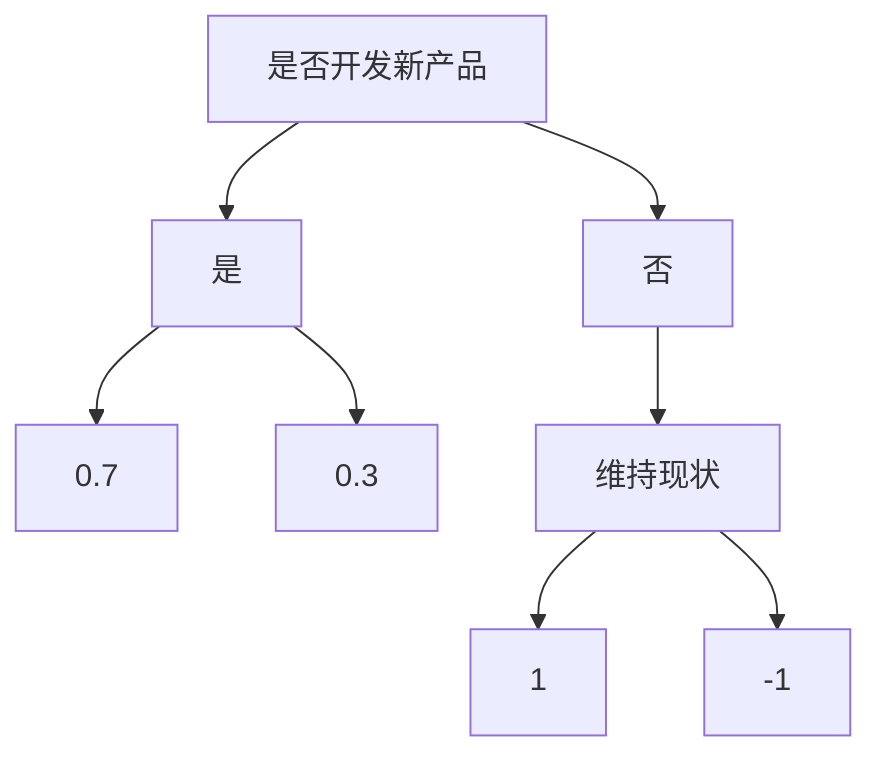
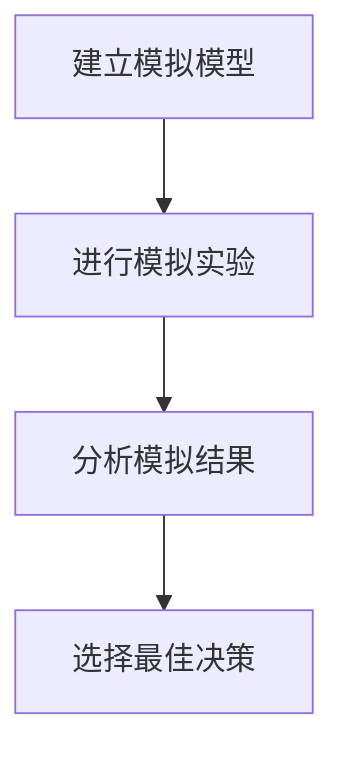
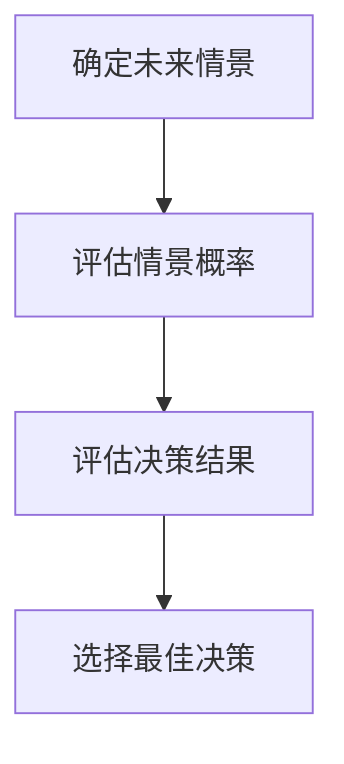

                 

### 《如何进行决策分析：如何做出明智的决策？》

#### 关键词：
- 决策分析
- 决策理论
- 决策工具
- 组织决策
- 个人决策
- 社会决策
- 案例分析

> 在这个复杂多变的世界中，决策无处不在。无论是企业战略、个人职业规划，还是社会公共政策的制定，都需要进行科学的决策分析。本文将系统地介绍决策分析的基础理论、方法与工具，并通过案例分析帮助读者理解如何在实际情境中做出明智的决策。

---

### 《如何进行决策分析：如何做出明智的决策？》目录大纲

#### 第一部分：决策分析的基础理论

##### 第1章：决策分析概述
- 1.1 决策分析的定义与重要性
- 1.2 决策分析的分类与特点
- 1.3 决策分析的基本步骤
- 1.4 决策分析的应用领域

##### 第2章：决策理论
- 2.1 决策理论的起源与发展
- 2.2 决策者行为的心理学分析
- 2.3 决策理论的数学模型
- 2.4 决策理论的局限性与改进

##### 第3章：决策分析的方法与工具
- 3.1 决策树分析法
- 3.2 效用理论分析法
- 3.3 模拟决策分析法
- 3.4 情景分析法
- 3.5 费用效益分析法

##### 第4章：决策制定的步骤与策略
- 4.1 确定决策目标
- 4.2 收集信息与评估
- 4.3 制定备选方案
- 4.4 评估备选方案
- 4.5 选择最佳方案
- 4.6 执行与监控

#### 第二部分：决策分析的实践应用

##### 第5章：组织决策分析
- 5.1 组织决策的特点与类型
- 5.2 组织决策中的沟通与协作
- 5.3 企业战略决策分析
- 5.4 风险管理决策分析

##### 第6章：个人决策分析
- 6.1 个人决策的特点与类型
- 6.2 影响个人决策的因素
- 6.3 个人决策的策略与方法
- 6.4 个人决策的心理学分析

##### 第7章：社会决策分析
- 7.1 社会决策的特点与类型
- 7.2 社会决策的心理学分析
- 7.3 社会决策的伦理问题
- 7.4 社会决策的改进方法

#### 第三部分：决策分析的案例分析

##### 第8章：商业案例分析
- 8.1 某公司新产品开发决策分析
- 8.2 某电商公司定价决策分析
- 8.3 某制药公司临床试验决策分析

##### 第9章：政策制定案例分析
- 9.1 某城市交通管理政策决策分析
- 9.2 某国家环境保护政策决策分析
- 9.3 某教育改革政策决策分析

##### 第10章：个人决策案例分析
- 10.1 个人职业发展规划决策分析
- 10.2 个人理财决策分析
- 10.3 个人健康决策分析

#### 附录

##### 附录A：决策分析工具与应用软件
- A.1 决策树软件介绍
- A.2 效用理论软件介绍
- A.3 模拟决策软件介绍
- A.4 其他决策分析工具与应用软件介绍

##### 附录B：常见决策分析术语解释
- B.1 决策树
- B.2 效用函数
- B.3 概率分布
- B.4 风险分析
- B.5 效益分析
- B.6 决策模型

---

### 第一部分：决策分析的基础理论

#### 第1章：决策分析概述

**1.1 决策分析的定义与重要性**

决策分析是一种系统性的方法，用于确定和评估各种可能的行动方案，以便做出最佳决策。它涉及对决策问题的理解、信息的收集与分析、备选方案的制定与评估，以及最终决策的选择。在现代社会，决策分析已经成为各个领域解决问题的重要工具。

决策分析的重要性体现在以下几个方面：

1. **提高决策效率**：通过系统化的方法，减少主观臆断和不确定性，提高决策的效率和准确性。
2. **降低风险**：通过全面的风险评估，识别潜在问题，降低决策错误带来的风险。
3. **优化资源分配**：合理利用资源，确保项目或计划的最大效益。
4. **增强决策透明度**：决策分析过程公开透明，有助于增强决策者的信心和接受度。

**1.2 决策分析的分类与特点**

决策分析可以根据不同的分类标准分为多种类型。以下是几种常见的分类方式：

1. **结构化决策与非结构化决策**：
   - **结构化决策**：问题明确、规则清晰、数据充足，如财务预算、生产计划等。
   - **非结构化决策**：问题复杂、不确定性高、规则模糊，如战略规划、市场预测等。

2. **确定型决策、风险型决策和不确定型决策**：
   - **确定型决策**：所有决策结果已知，如线性规划问题。
   - **风险型决策**：决策结果有概率分布，如博弈论问题。
   - **不确定型决策**：决策结果完全未知，如探索性数据分析。

3. **个人决策、组织决策和社会决策**：
   - **个人决策**：针对个人生活、职业发展的选择，如购房、职业晋升等。
   - **组织决策**：企业或团体为达成特定目标所做的决策，如产品开发、市场营销等。
   - **社会决策**：政府或公共机构为维护社会利益所作的决策，如政策制定、环境保护等。

**1.3 决策分析的基本步骤**

决策分析通常包括以下基本步骤：

1. **明确决策问题**：确定决策的目标和约束条件。
2. **收集信息**：获取与决策相关的数据和信息。
3. **构建决策模型**：将决策问题转化为数学模型或算法模型。
4. **分析模型**：使用决策分析方法，如决策树、效用理论等，对模型进行分析。
5. **评估备选方案**：比较不同方案的优劣，选择最佳方案。
6. **制定决策**：根据分析结果做出最终决策。
7. **执行与监控**：实施决策并监控决策效果，必要时进行调整。

**1.4 决策分析的应用领域**

决策分析广泛应用于各个领域，包括但不限于：

1. **商业管理**：企业战略规划、产品开发、市场分析等。
2. **公共政策**：环境保护、交通管理、公共卫生等。
3. **金融投资**：风险评估、投资组合优化、股票交易策略等。
4. **工程管理**：项目计划、资源分配、成本控制等。
5. **个人生活**：职业规划、健康决策、财务规划等。

通过以上对决策分析基础理论的介绍，读者可以对决策分析有一个整体的了解。接下来，我们将深入探讨决策理论的起源与发展，为后续的决策分析方法与工具的学习奠定基础。

---

### 第一部分：决策分析的基础理论

#### 第2章：决策理论

**2.1 决策理论的起源与发展**

决策理论是20世纪中叶发展起来的一个跨学科领域，其起源可以追溯到经济学、心理学和工程学的理论研究。1940年代，美国数学家Von Neumann和Oskar Morgenstern发表了经典著作《博弈论与经济行为》，开创了决策理论的研究。随后，决策理论逐渐形成了自己独特的理论框架和研究方法。

在决策理论的发展历程中，有两个重要的里程碑：

1. **期望效用理论**：1950年代，以色列心理学家Daniel Kahneman和Amos Tversky提出了期望效用理论，该理论基于概率论和效用论，为理性决策提供了数学模型。
2. **行为决策理论**：1970年代，行为经济学家如Richard Thaler等人提出了行为决策理论，该理论强调人类决策的非理性因素，如情感、直觉和认知偏差。

**2.2 决策者行为的心理学分析**

决策者行为的心理学分析是决策理论的重要组成部分。心理学研究揭示了人类在决策过程中的一些典型行为特点：

1. **认知偏差**：人们在决策时常常受到各种认知偏差的影响，如确认偏误、过度自信、代表性偏差等。这些偏差可能导致决策者做出非理性的决策。
2. **情感作用**：情感在决策过程中扮演着重要角色。决策者可能因为情绪波动而改变决策，甚至放弃原本合理的方案。
3. **有限理性**：与经典经济学中的完全理性假设不同，人类决策者在信息处理和认知能力上存在限制。这导致他们在面对复杂决策时可能无法实现最优解。

**2.3 决策理论的数学模型**

决策理论的数学模型为决策提供了量化的分析工具。以下是一些常见的决策模型：

1. **期望效用模型**：该模型将决策者的偏好转化为期望效用函数，通过比较不同决策的期望效用值来选择最佳方案。数学表达式为：

   $$
   U(X) = \sum_{i=1}^{n} p_i u(x_i)
   $$

   其中，$U(X)$ 表示总效用，$p_i$ 表示第$i$种结果的概率，$u(x_i)$ 表示第$i$种结果的效用值。

2. **线性规划模型**：线性规划是一种解决资源优化问题的数学方法，其目标是在一组线性约束条件下最大化或最小化线性目标函数。数学表达式为：

   $$
   \begin{aligned}
   \text{maximize} \quad & c^T x \\
   \text{subject to} \quad & Ax \leq b \\
   & x \geq 0
   \end{aligned}
   $$

   其中，$c$ 是目标函数系数向量，$A$ 是约束矩阵，$b$ 是约束向量，$x$ 是决策变量。

3. **博弈论模型**：博弈论研究在具有冲突和合作情境下的决策问题。常见的博弈模型包括零和博弈、非零和博弈和合作博弈。数学表达通常基于博弈矩阵或博弈图。

**2.4 决策理论的局限性与改进**

尽管决策理论为决策过程提供了有力的分析工具，但其也存在一定的局限性：

1. **理性假设**：决策理论中的理性假设与现实存在差距。在实际决策中，人类行为常常受到情绪、认知偏差和其他非理性因素的影响。
2. **信息成本**：收集和分析大量信息需要投入时间和资源。在某些情况下，信息成本可能远高于决策带来的收益。
3. **不确定性处理**：决策理论对不确定性的处理较为简化，可能无法全面反映实际情境中的复杂性和不确定性。

为改进决策理论，研究者提出了一些新的方法和模型：

1. **基于数据的决策**：利用大数据和机器学习技术，构建更精确的预测模型和决策支持系统。
2. **行为经济学**：结合心理学和行为经济学的成果，研究人类在决策过程中的实际行为，为决策理论提供更符合现实的假设和模型。
3. **混合智能系统**：结合人类专家的知识和机器学习算法，构建更加智能和适应性的决策支持系统。

通过以上对决策理论的介绍，读者可以对决策理论的基本概念和数学模型有更深入的了解。在接下来的章节中，我们将探讨决策分析的方法与工具，帮助读者掌握实际应用决策分析的方法。

---

### 第一部分：决策分析的基础理论

#### 第3章：决策分析的方法与工具

决策分析的过程不仅仅是理论上的探讨，它需要一系列的方法和工具来辅助决策者做出合理的决策。以下是一些常见且重要的决策分析方法与工具：

**3.1 决策树分析法**

决策树分析法是一种图形化的方法，用于表示决策问题及其可能的结果。它通过一系列的决策节点和结果节点来展示不同选择及其可能的结果。以下是决策树分析法的步骤：

1. **确定决策问题**：明确需要决策的问题。
2. **绘制决策树**：从根节点开始，逐步绘制出所有可能的决策路径和结果。
3. **计算每个节点的概率和效用**：对于每个结果节点，计算其概率和预期效用。
4. **选择最佳路径**：根据预期效用值，选择最佳决策路径。

**示例：** 某公司需要决定是否开发新产品。根节点是“是否开发新产品”，有两个子节点：“是”和“否”。每个子节点又分别有两个结果节点，分别表示新产品成功和失败的概率及其对应的效用值。通过计算，选择预期效用最高的路径作为决策。

**Mermaid流程图表示：**


**3.2 效用理论分析法**

效用理论分析法是基于决策者的偏好和风险态度，计算不同决策结果的效用值，从而做出决策。它通常包括以下步骤：

1. **定义效用函数**：根据决策者的风险偏好，定义效用函数。
2. **计算预期效用**：对于每个决策结果，计算其概率乘以效用值。
3. **选择最佳决策**：选择预期效用最高的决策。

**示例：** 某投资者面临两个投资选择，A和B。根据历史数据和预测，选择A的概率为0.6，预期收益为1万元；选择B的概率为0.4，预期收益为2万元。通过计算，投资者选择B。

**伪代码表示：**
```python
def calculate_expected_utility(probability, utility):
    return probability * utility

# 投资选择A和B
probability_A = 0.6
probability_B = 0.4

# 效用值
utility_A = 10000
utility_B = 20000

# 计算预期效用
expected_utility_A = calculate_expected_utility(probability_A, utility_A)
expected_utility_B = calculate_expected_utility(probability_B, utility_B)

# 选择最佳决策
if expected_utility_A > expected_utility_B:
    print("选择A")
else:
    print("选择B")
```

**3.3 模拟决策分析法**

模拟决策分析法是一种通过模拟实际决策过程，评估不同决策结果的效用和风险的方法。它通常包括以下步骤：

1. **建立模拟模型**：根据决策问题，建立模拟模型。
2. **进行模拟实验**：运行模拟模型，多次重复实验以获取大量数据。
3. **分析模拟结果**：分析模拟数据，评估不同决策结果的概率和效用。
4. **选择最佳决策**：基于模拟结果，选择最佳决策。

**示例：** 某公司考虑是否进行市场扩张。通过模拟不同市场条件下的扩张效果，评估收益和风险，最终决定是否扩张。

**Mermaid流程图表示：**


**3.4 情景分析法**

情景分析法是一种通过构建不同未来情景，评估决策结果的可行性和风险的方法。它通常包括以下步骤：

1. **确定未来情景**：根据历史数据和预测，确定可能出现的未来情景。
2. **评估每个情景的概率**：根据专家意见和数据分析，评估每个情景出现的概率。
3. **评估每个情景下的决策结果**：分析每个情景下的决策结果，评估其效用和风险。
4. **选择最佳决策**：综合考虑不同情景下的决策结果，选择最佳决策。

**示例：** 某企业需要决定是否进行新产品的研发。通过分析市场增长、竞争加剧等情景，评估不同决策的结果。

**Mermaid流程图表示：**


**3.5 费用效益分析法**

费用效益分析法是一种通过计算决策的收益和成本，评估其经济效益的方法。它通常包括以下步骤：

1. **确定决策的成本**：计算实施决策所需的成本。
2. **确定决策的收益**：计算决策实施后的收益。
3. **计算净现值（NPV）**：使用折现率计算决策的净现值。
4. **选择最佳决策**：根据净现值，选择最佳决策。

**示例：** 某公司考虑是否投资一个新项目。通过计算项目的成本和收益，评估其经济效益。

**伪代码表示：**
```python
def calculate_npv(cash_flows, discount_rate):
    npv = 0
    for t, cf in enumerate(cash_flows):
        npv += cf / ((1 + discount_rate) ** t)
    return npv

# 投资项目的现金流量和折现率
cash_flows = [10000, 15000, 20000]
discount_rate = 0.1

# 计算净现值
npv = calculate_npv(cash_flows, discount_rate)

if npv > 0:
    print("投资该项目")
else:
    print("不投资该项目")
```

通过以上对决策分析的方法与工具的介绍，读者可以了解如何在实际决策过程中运用这些方法。这些工具和方法不仅帮助决策者分析问题，还能提高决策的准确性和效率。在接下来的章节中，我们将进一步探讨决策制定的步骤与策略，帮助读者在实际应用中更好地运用决策分析。

---

### 第一部分：决策分析的基础理论

#### 第4章：决策制定的步骤与策略

制定决策是一个复杂的过程，涉及到信息的收集、分析、评估和选择。以下是我们推荐的步骤与策略，以帮助决策者制定明智的决策。

**4.1 确定决策目标**

决策的第一步是明确决策目标。这一步至关重要，因为明确的决策目标可以帮助决策者集中精力，减少不确定性，提高决策的效率。

1. **具体化目标**：将抽象的目标转化为具体的、可衡量的指标。
2. **设置优先级**：根据目标的重要性，设置优先级，确保关键目标的优先考虑。

**示例：** 如果一家公司的决策目标是增加市场份额，具体化为在下一季度将市场份额提高5%。

**4.2 收集信息与评估**

收集与决策相关的信息是制定决策的基础。信息的来源可以是内部数据、外部市场研究、竞争对手分析等。

1. **数据来源**：确定数据的可信度和可靠性。
2. **数据整理**：将收集到的信息进行分类、整理和筛选，确保数据的准确性。
3. **评估信息**：对收集到的信息进行分析和评估，识别关键信息。

**示例：** 在制定是否推出新产品的决策时，需要收集市场趋势、竞争对手情况、潜在客户需求等数据。

**4.3 制定备选方案**

在明确决策目标和收集信息后，需要制定多个备选方案。这些方案应该是全面、多样和具有可行性的。

1. **生成方案**：基于已有信息和目标，提出多个可能的行动方案。
2. **评估方案**：对每个方案进行评估，考虑其可行性、成本和潜在收益。

**示例：** 对于新产品推出的决策，可以制定以下备选方案：
   - 方案A：增加广告投入，提高品牌知名度。
   - 方案B：降低产品价格，吸引更多消费者。
   - 方案C：改进产品质量，提升客户满意度。

**4.4 评估备选方案**

评估备选方案是决策过程中的关键步骤，需要综合考虑各种因素，包括风险、成本、潜在收益等。

1. **量化评估**：使用数学模型或评分系统，量化每个方案的优缺点。
2. **情景分析**：考虑不同情境下每个方案的表现，评估其适应性和可靠性。
3. **比较分析**：通过比较不同方案的优劣，选择最佳方案。

**示例：** 使用决策树或效用理论分析每个方案，考虑市场变化、竞争压力等因素。

**4.5 选择最佳方案**

在评估备选方案后，决策者需要选择最佳方案。这一步需要综合考虑各种因素，包括风险评估、成本效益分析等。

1. **确定最佳方案**：基于评估结果，选择最符合决策目标的方案。
2. **制定决策计划**：为最佳方案制定详细的实施计划，确保决策的有效执行。

**示例：** 基于成本效益分析，选择方案B作为最佳方案，并制定详细的实施计划。

**4.6 执行与监控**

决策制定完成后，需要进入执行阶段。执行过程中，需要持续监控决策的效果，并根据实际情况进行调整。

1. **执行决策**：按照决策计划，实施决策方案。
2. **监控效果**：跟踪决策执行的效果，识别潜在问题。
3. **调整决策**：根据监控结果，对决策进行调整和优化。

**示例：** 在新产品推出后，监控市场反馈和销售数据，根据实际情况调整市场策略。

通过以上步骤与策略，决策者可以系统化地进行决策分析，提高决策的科学性和有效性。在接下来的章节中，我们将探讨决策分析在组织决策、个人决策和社会决策中的具体应用。

---

### 第二部分：决策分析的实践应用

#### 第5章：组织决策分析

组织决策分析是决策分析的一个重要领域，涉及到企业在日常运营和长期战略规划中的决策过程。组织决策具有复杂性、多元性和长期性等特点，因此，科学地进行组织决策分析至关重要。

**5.1 组织决策的特点与类型**

组织决策的特点主要包括以下几个方面：

1. **复杂性**：组织决策通常涉及多个部门和职能，决策因素多样，如市场需求、财务状况、人力资源等。
2. **多元性**：组织决策需要考虑不同利益相关者的需求和期望，如股东、员工、客户等。
3. **长期性**：组织决策往往关系到企业的长期发展和战略规划，需要考虑未来市场趋势和竞争环境。

组织决策的类型可以根据决策的内容和目标进行分类：

1. **战略决策**：涉及企业的长期发展目标，如市场扩张、新产品开发、并购等。
2. **战术决策**：涉及企业日常运营和短期目标，如生产计划、库存管理、市场营销等。
3. **操作决策**：涉及具体的执行层面，如设备采购、员工培训、工作流程优化等。

**5.2 组织决策中的沟通与协作**

组织决策的成功在很大程度上取决于决策过程中各方的沟通与协作。以下是组织决策中沟通与协作的关键要素：

1. **明确沟通目标**：在决策过程中，明确沟通的目标和内容，确保信息传递的准确性和及时性。
2. **建立有效的沟通渠道**：搭建多个沟通渠道，包括正式会议、邮件、即时通讯等，以满足不同沟通需求。
3. **促进跨部门协作**：通过跨部门团队的形式，促进不同部门和职能之间的协作，共同解决问题。
4. **培养沟通文化**：营造开放、透明、尊重的沟通文化，鼓励员工积极表达意见和反馈。

**5.3 企业战略决策分析**

企业战略决策是企业长期发展的关键，通常包括以下步骤：

1. **确定战略方向**：根据企业愿景、市场环境和竞争态势，明确企业的发展方向。
2. **制定战略目标**：将战略方向转化为具体的、可衡量的目标。
3. **评估战略方案**：分析不同战略方案的优缺点，评估其可行性。
4. **选择最佳战略**：综合考虑各种因素，选择最佳战略方案。
5. **制定实施计划**：为最佳战略方案制定详细的实施计划，确保战略的有效执行。

**示例：** 某公司决定进入新市场。首先，分析新市场的潜力、竞争态势和市场需求，然后制定进入新市场的战略方案，如市场开拓、品牌建设等。通过评估不同方案，选择最佳方案，并制定实施计划。

**5.4 风险管理决策分析**

风险管理是组织决策的重要组成部分，涉及到对企业面临的各种风险进行识别、评估和控制。以下是风险管理决策分析的关键步骤：

1. **风险识别**：识别企业面临的潜在风险，如市场风险、财务风险、运营风险等。
2. **风险评估**：评估每种风险的概率和影响，确定其优先级。
3. **风险控制**：制定风险控制策略，包括风险规避、风险转移、风险接受等。
4. **监控与调整**：持续监控风险状况，根据实际情况调整风险控制策略。

**示例：** 某公司在扩展业务时，识别出市场风险和财务风险。通过分析市场趋势和财务状况，评估风险的概率和影响，制定相应的风险控制策略，如增加市场调研、优化财务结构等。

通过以上对组织决策分析的内容介绍，读者可以了解如何在实际决策过程中运用决策分析的方法与工具，提高组织决策的科学性和有效性。在接下来的章节中，我们将探讨个人决策分析，帮助读者掌握在个人生活中运用决策分析的技巧。

---

### 第二部分：决策分析的实践应用

#### 第6章：个人决策分析

个人决策分析是决策分析在日常生活和个人发展中的具体应用。个人决策涉及职业规划、财务规划、健康决策等多个方面，影响个人的生活质量和发展。因此，掌握科学决策的方法对于个人成功至关重要。

**6.1 个人决策的特点与类型**

个人决策的特点主要包括以下几个方面：

1. **个体性**：个人决策主要关注个体自身的利益和目标，而非组织或集体的利益。
2. **灵活性**：个人决策通常可以根据个人需求和偏好进行调整，具有较强的灵活性。
3. **长期性**：个人决策往往涉及长期目标，如职业发展、财务规划等，需要长期规划和持续调整。

个人决策的类型可以根据决策的内容和目标进行分类：

1. **职业决策**：涉及个人的职业选择、职业晋升、职业技能提升等。
2. **财务决策**：涉及个人的收入管理、支出规划、投资决策等。
3. **健康决策**：涉及个人的健康管理、疾病预防、健康生活方式选择等。
4. **教育决策**：涉及个人的学习规划、专业选择、教育投资等。

**6.2 影响个人决策的因素**

个人决策受到多种因素的影响，以下是一些主要因素：

1. **信息**：决策所需的信息质量和数量直接影响决策的质量。信息不全或质量低下可能导致决策失误。
2. **价值观**：个人的价值观和道德观念会影响决策的选择。例如，追求财富和追求健康的生活方式之间的取舍。
3. **情绪**：情绪状态对决策有显著影响。情绪高昂时可能做出乐观的决策，而情绪低落时可能过于谨慎。
4. **经验**：个人过去的经验和知识积累对决策有重要影响。丰富的经验有助于更好地预测决策结果。
5. **社会环境**：社会环境、文化背景和家庭环境等都会影响个人决策。例如，社会压力可能影响职业选择。

**6.3 个人决策的策略与方法**

以下是一些个人决策的策略与方法：

1. **决策树分析法**：使用决策树来可视化不同决策路径和结果，帮助分析不同选择的后果。
2. **效用理论分析法**：根据个人偏好和风险态度，计算不同决策结果的效用值，选择效用最高的方案。
3. **情景分析法**：构建不同的未来情景，评估每个情景下决策的结果，选择适应性强、风险较低的方案。
4. **成本效益分析法**：计算不同决策的成本和收益，选择净收益最高的方案。
5. **专家咨询法**：向专业人士或领域专家咨询意见，获取外部视角和建议，提高决策质量。

**示例：** 某人在选择职业时，可以使用决策树分析不同职业的薪资、工作稳定性和工作满意度。通过计算效用值，选择最符合个人偏好的职业。

**6.4 个人决策的心理学分析**

心理学研究揭示了个人决策过程中的一些心理现象和机制：

1. **认知偏差**：如确认偏误、过度自信等，影响决策的理性程度。
2. **情感作用**：情感在决策过程中扮演重要角色，可能导致决策者做出非理性行为。
3. **情绪波动**：情绪状态影响决策过程和结果，需要自我调节和情绪管理。

**示例：** 某人在购买高价电子产品时，可能会受到情感的影响，导致决策过程中过度乐观或过度谨慎。

通过以上对个人决策分析的内容介绍，读者可以了解如何在实际生活中运用决策分析的方法与工具，提高个人决策的科学性和有效性。在接下来的章节中，我们将探讨社会决策分析，帮助读者了解在更广泛的社区和公共领域如何进行决策。

---

### 第二部分：决策分析的实践应用

#### 第7章：社会决策分析

社会决策分析涉及政府、非政府组织和社会团体在维护社会利益、解决社会问题、制定公共政策等方面的决策过程。社会决策分析不仅关注决策的结果，还强调决策过程的公正性、透明度和可持续性。

**7.1 社会决策的特点与类型**

社会决策的特点主要包括以下几个方面：

1. **广泛性**：社会决策通常涉及广泛的社会利益，影响众多社会成员。
2. **复杂性**：社会问题通常具有多重影响因素，决策过程复杂，需要综合考虑各种因素。
3. **长期性**：社会决策往往关系到社会的长远发展，需要长期规划和持续评估。
4. **伦理性**：社会决策常常涉及伦理道德问题，需要平衡不同利益群体的需求。

社会决策的类型可以根据决策的内容和目标进行分类：

1. **公共安全决策**：涉及公共安全、治安、反恐等方面的决策。
2. **经济决策**：涉及经济发展、财政政策、税收政策等方面的决策。
3. **教育决策**：涉及教育改革、教育资源分配、教育政策等方面的决策。
4. **环保决策**：涉及环境保护、资源管理、气候变化等方面的决策。
5. **社会服务决策**：涉及医疗保健、社会福利、公共住房等方面的决策。

**7.2 社会决策的心理学分析**

社会决策的心理学分析关注决策者在决策过程中的心理机制和认知过程：

1. **群体思维**：群体成员倾向于遵循群体共识，可能导致决策偏差。
2. **社会认同**：个体受到社会认同的影响，可能改变自己的观点和决策。
3. **道德判断**：决策者需要考虑道德准则和社会价值观，这对决策有重要影响。
4. **情感因素**：情感在社会决策中扮演关键角色，可能影响决策的公正性和合理性。

**7.3 社会决策的伦理问题**

社会决策的伦理问题涉及决策过程中如何平衡不同利益群体的需求和权利，以下是一些常见伦理问题：

1. **公平性**：社会决策需要确保公平性，避免利益冲突和不公正待遇。
2. **透明度**：决策过程需要公开透明，接受公众监督和审查。
3. **责任**：决策者需要承担决策后果的责任，确保决策的科学性和合理性。
4. **可持续性**：决策需要考虑长远影响，促进社会的可持续发展。

**7.4 社会决策的改进方法**

为提高社会决策的质量和效果，可以采取以下改进方法：

1. **基于数据的决策**：利用大数据和统计分析技术，提供更准确和全面的决策依据。
2. **公众参与**：通过公众咨询、意见征集等方式，增加决策的透明度和公众参与度。
3. **跨学科合作**：整合不同学科领域的知识，提供多元化的决策视角。
4. **道德审查**：设立独立的道德审查委员会，确保决策过程符合伦理准则。
5. **持续评估**：对决策效果进行持续评估和监控，及时调整和优化决策方案。

**示例：** 在制定城市交通管理政策时，政府可以采取以下改进方法：
   - 利用交通流量数据，分析交通拥堵的原因和解决方案。
   - 通过公众意见征集，了解居民对交通管理政策的期望和需求。
   - 跨学科合作，邀请交通规划专家、环境学家和社会学家共同参与决策。
   - 设立道德审查委员会，确保决策符合公众利益和伦理标准。

通过以上对社会决策分析的内容介绍，读者可以了解如何在实际社会决策过程中运用决策分析的方法与工具，提高决策的科学性和公正性。在接下来的章节中，我们将通过实际案例，深入探讨决策分析在商业、政策和个人决策中的应用。

---

### 第三部分：决策分析的案例分析

#### 第8章：商业案例分析

商业环境中的决策分析对于企业的生存与发展至关重要。本章节将通过具体商业案例，展示如何在实际情境中运用决策分析的方法，帮助企业做出明智的决策。

**8.1 某公司新产品开发决策分析**

**案例背景：** 某公司计划开发一款智能健康监测设备，以提高市场竞争力。为了确保新产品开发的成功，公司需要进行全面的决策分析。

**决策分析过程：**

1. **确定决策目标**：明确新产品的目标市场、功能需求和预期收益。
2. **收集信息**：收集市场调研数据、竞争对手信息、技术可行性报告等。
3. **制定备选方案**：
   - 方案A：完全自主研发，确保技术领先。
   - 方案B：与合作伙伴共同开发，分担技术风险。
   - 方案C：收购现有技术，快速上市。
4. **评估备选方案**：
   - 成本效益分析：计算每个方案的成本和预期收益。
   - 风险评估：评估技术、市场、财务等方面的风险。
   - 效用分析：基于公司战略和市场需求，评估每个方案的效用。
5. **选择最佳方案**：综合评估结果，选择方案B作为最佳方案。

**决策执行与监控：** 公司与合作伙伴签订合作协议，制定详细的项目计划，并设立监控机制，确保项目按计划推进。

**案例结果：** 通过决策分析，公司成功研发并推出新产品，市场份额显著提升。

**8.2 某电商公司定价决策分析**

**案例背景：** 某电商公司面临激烈的竞争，希望通过合理的定价策略提升市场份额。

**决策分析过程：**

1. **确定决策目标**：明确定价策略的目标，如提升销售额、提高利润率等。
2. **收集信息**：收集竞争对手价格、消费者购买行为数据、市场供需状况等。
3. **制定备选方案**：
   - 方案A：采用市场领先定价策略，提高品牌形象。
   - 方案B：采用渗透定价策略，快速占领市场。
   - 方案C：采用动态定价策略，根据市场供需实时调整价格。
4. **评估备选方案**：
   - 费用效益分析：计算每个方案的预期收益和成本。
   - 情景分析：模拟不同市场状况下的定价效果。
   - 效用分析：评估每个方案对消费者和公司的综合效用。
5. **选择最佳方案**：综合评估结果，选择方案C作为最佳方案。

**决策执行与监控：** 公司采用动态定价策略，实时监控市场数据，并根据实际销售情况调整价格。

**案例结果：** 通过动态定价策略，公司成功提升了销售额和市场份额。

**8.3 某制药公司临床试验决策分析**

**案例背景：** 某制药公司计划开展一项新药的临床试验，以确保药物的安全性和有效性。

**决策分析过程：**

1. **确定决策目标**：明确临床试验的目标，如确定药物的有效性、安全性等。
2. **收集信息**：收集药物研发数据、相关法规和标准、临床试验资源等。
3. **制定备选方案**：
   - 方案A：采用单中心临床试验，简化管理流程。
   - 方案B：采用多中心临床试验，提高样本量。
   - 方案C：采用随机对照试验，确保试验结果的可靠性。
4. **评估备选方案**：
   - 风险评估：评估每个方案的风险，如试验失败的可能性、资源投入等。
   - 效益分析：评估每个方案的成本和预期收益。
   - 效用分析：基于药物研发目标，评估每个方案的有效性。
5. **选择最佳方案**：综合评估结果，选择方案C作为最佳方案。

**决策执行与监控：** 公司按照随机对照试验方案，开展多中心临床试验，并设立监控机制，确保试验过程符合规范。

**案例结果：** 通过决策分析，公司成功完成了临床试验，新药得到了监管机构的批准。

通过以上商业案例分析，我们可以看到决策分析在商业决策中的重要作用。通过科学的决策分析方法，企业能够更好地应对市场变化，制定有效的战略和策略，实现可持续发展。

---

### 第三部分：决策分析的案例分析

#### 第9章：政策制定案例分析

政策制定是政府和社会组织在维护社会利益、解决公共问题、实现公共利益的过程中至关重要的环节。本章节将通过对具体政策制定案例的分析，展示如何运用决策分析的方法来提高政策制定的科学性和有效性。

**9.1 某城市交通管理政策决策分析**

**案例背景：** 某城市面临交通拥堵问题，政府希望通过制定交通管理政策来缓解交通压力。

**决策分析过程：**

1. **确定决策目标**：明确政策的目标，如减少交通拥堵、提高公共交通效率等。
2. **收集信息**：收集交通流量数据、公共交通使用情况、市民出行需求等。
3. **制定备选方案**：
   - 方案A：实施交通拥堵收费，通过经济手段调节交通流量。
   - 方案B：增加公共交通线路和班次，提高公共交通服务质量。
   - 方案C：限制车辆出行，如实行车辆限号政策。
4. **评估备选方案**：
   - 费用效益分析：计算每个方案的成本和预期效益。
   - 情景分析：模拟不同交通管理措施下的交通状况变化。
   - 公众参与：通过问卷调查、公众听证会等方式，收集市民对政策方案的意见。
5. **选择最佳方案**：综合评估结果，选择方案B作为最佳方案。

**决策执行与监控：** 政府逐步增加公共交通线路和班次，并设立监测系统，实时评估政策效果。

**案例结果：** 通过实施增加公共交通线路和班次的政策，该城市的公共交通效率显著提升，交通拥堵问题得到缓解。

**9.2 某国家环境保护政策决策分析**

**案例背景：** 某国家面临环境污染问题，政府需要制定环境保护政策以改善环境质量。

**决策分析过程：**

1. **确定决策目标**：明确政策的目标，如减少污染物排放、提高资源利用效率等。
2. **收集信息**：收集空气质量、水资源状况、污染源分布等数据。
3. **制定备选方案**：
   - 方案A：实施严格的排放标准，限制工业排放。
   - 方案B：推广清洁能源技术，减少对化石燃料的依赖。
   - 方案C：实行生态补偿机制，激励企业和个人参与环境保护。
4. **评估备选方案**：
   - 效益分析：计算每个方案的环保效益和经济效益。
   - 风险评估：评估每个方案的技术可行性和社会接受度。
   - 情景分析：模拟不同政策下的环境状况变化。
5. **选择最佳方案**：综合评估结果，选择方案A和B作为最佳方案。

**决策执行与监控：** 政府实施严格的排放标准和清洁能源技术推广政策，并设立环保监测系统，实时监控环境质量变化。

**案例结果：** 通过实施严格的排放标准和推广清洁能源技术，该国的空气质量显著改善，环境污染问题得到有效控制。

**9.3 某教育改革政策决策分析**

**案例背景：** 某国家教育体系存在诸多问题，政府希望通过教育改革政策提高教育质量和公平性。

**决策分析过程：**

1. **确定决策目标**：明确教育改革的目标，如提高教育质量、促进教育公平等。
2. **收集信息**：收集教育数据、教师和学生的反馈、教育专家的意见等。
3. **制定备选方案**：
   - 方案A：提高教师薪酬，激励教师提高教学质量。
   - 方案B：实施教育信息化，利用现代技术提高教学效率。
   - 方案C：改革考试制度，减轻学生学业负担。
4. **评估备选方案**：
   - 成本效益分析：计算每个方案的实施成本和预期效益。
   - 社会参与：通过教育论坛、公开讨论等方式，收集公众对政策方案的意见。
   - 效益分析：评估每个方案的教育质量和公平性。
5. **选择最佳方案**：综合评估结果，选择方案B和C作为最佳方案。

**决策执行与监控：** 政府逐步实施教育信息化和考试制度改革，并设立教育质量监测系统，实时评估改革效果。

**案例结果：** 通过实施教育信息化和考试制度改革，该国的教育质量显著提升，学生的学习负担得到减轻，教育公平性得到改善。

通过以上政策制定案例分析，我们可以看到决策分析在政策制定过程中的重要性。通过科学的决策分析方法，政府和社会组织能够制定出更加符合实际需求、更具可操作性的政策，从而实现社会的可持续发展。

---

### 第三部分：决策分析的案例分析

#### 第10章：个人决策案例分析

个人决策在我们的日常生活中无处不在，从职业选择到财务规划，从健康决策到教育投资，每一个决策都可能影响我们的生活质量和长远发展。本章节将通过具体案例，展示如何运用决策分析的方法，帮助个人做出明智的决策。

**10.1 个人职业发展规划决策分析**

**案例背景：** 小李是一名年轻的软件开发工程师，他在职业发展的道路上面临重要的决策，是继续在现有的公司工作，还是跳槽到其他公司。

**决策分析过程：**

1. **确定决策目标**：明确小李的职业目标，如晋升、学习新技术、薪资待遇等。
2. **收集信息**：收集小李当前公司的薪资待遇、职业发展前景、市场需求等数据，以及目标公司的薪资待遇、培训机会、团队氛围等。
3. **制定备选方案**：
   - 方案A：留在当前公司，争取晋升机会。
   - 方案B：跳槽到其他公司，追求更高的薪资和更好的发展机会。
   - 方案C：继续深造，提高自身技术水平和学历。
4. **评估备选方案**：
   - 成本效益分析：计算每个方案的成本和预期收益。
   - 风险评估：评估每个方案的风险，如职业发展不确定性、经济风险等。
   - 效用分析：评估每个方案对小李职业发展和生活质量的效用。
5. **选择最佳方案**：综合评估结果，选择方案B作为最佳方案。

**决策执行与监控：** 小李选择跳槽，并制定了详细的职业发展计划，包括新岗位适应期、技能提升计划等。

**案例结果：** 小李成功跳槽，在新公司得到了更好的职业发展机会和薪资待遇。

**10.2 个人理财决策分析**

**案例背景：** 小王在获得一笔意外收入后，需要决定如何进行理财投资。

**决策分析过程：**

1. **确定决策目标**：明确小王的理财目标，如保值、增值、风险控制等。
2. **收集信息**：收集小王的财务状况、投资偏好、市场情况等数据。
3. **制定备选方案**：
   - 方案A：投资股票市场，追求高回报。
   - 方案B：投资债券市场，追求稳定收益。
   - 方案C：投资房地产，长期增值。
4. **评估备选方案**：
   - 费用效益分析：计算每个方案的成本和预期收益。
   - 风险评估：评估每个方案的市场波动风险和投资风险。
   - 效用分析：评估每个方案对实现小王理财目标的效用。
5. **选择最佳方案**：综合评估结果，选择方案B作为最佳方案。

**决策执行与监控：** 小王选择投资债券市场，并定期监控市场动态，调整投资策略。

**案例结果：** 小王通过投资债券市场，实现了稳定收益，风险较低，符合其理财目标。

**10.3 个人健康决策分析**

**案例背景：** 小李在体检中发现高血压，需要制定健康管理计划。

**决策分析过程：**

1. **确定决策目标**：明确小李的健康目标，如控制血压、改善生活方式等。
2. **收集信息**：收集小李的病史、生活习惯、医疗建议等数据。
3. **制定备选方案**：
   - 方案A：服用药物控制血压。
   - 方案B：通过饮食和运动控制血压。
   - 方案C：结合药物和饮食运动控制血压。
4. **评估备选方案**：
   - 成本效益分析：计算每个方案的治疗成本和预期效果。
   - 风险评估：评估每个方案的健康风险和生活质量影响。
   - 效用分析：评估每个方案对改善小李健康状态的效用。
5. **选择最佳方案**：综合评估结果，选择方案C作为最佳方案。

**决策执行与监控：** 小李开始服用药物，并调整饮食和运动习惯，定期进行血压监测。

**案例结果：** 通过药物和饮食运动的综合管理，小李的血压逐渐稳定，生活质量得到提高。

通过以上个人决策案例分析，我们可以看到决策分析在帮助个人做出明智决策中的重要作用。通过科学的决策分析方法，个人可以更好地评估各种选择的优缺点，做出符合自身利益和发展目标的决策。

---

### 附录

#### 附录A：决策分析工具与应用软件

**A.1 决策树软件介绍**

决策树软件是进行决策树分析的重要工具，以下是一些常用的决策树软件及其特点：

1. **TreePlan**：TreePlan是一款易于使用的决策树软件，提供了直观的图形界面，支持多种决策树算法。
2. **RapidMiner**：RapidMiner是一款强大的数据挖掘和机器学习平台，内置了决策树模型生成工具。
3. **Microsoft Excel**：Excel提供了决策树功能，可以通过宏和自定义函数实现复杂的决策树分析。

**A.2 效用理论软件介绍**

效用理论软件用于计算不同决策结果的效用值，以下是一些常用的效用理论软件：

1. **Stochastic Dynamic Programming Toolkit (SDPT3)**：SDPT3是一款开源软件，用于解决基于效用理论的动态规划问题。
2. **DecisionLab**：DecisionLab是一款专业的决策分析软件，支持效用理论的建模和分析。
3. **Excel**：Excel可以通过自定义公式和VBA脚本实现效用理论的计算。

**A.3 模拟决策软件介绍**

模拟决策软件用于进行模拟决策分析，以下是一些常用的模拟决策软件：

1. **AnyLogic**：AnyLogic是一款功能强大的模拟软件，支持多种决策模型和模拟分析。
2. **FlexSim**：FlexSim是一款用于离散事件模拟和决策分析的软件，广泛应用于制造、物流等领域。
3. **Simul8**：Simul8是一款易用的模拟软件，提供了丰富的决策模拟工具。

**A.4 其他决策分析工具与应用软件介绍**

除了上述特定类型的决策分析工具，还有一些通用的决策分析工具和应用软件：

1. **Python**：Python是一款流行的编程语言，可以通过内置库和第三方库（如Pandas、NumPy、SciPy等）实现复杂的决策分析。
2. **MATLAB**：MATLAB是一款功能强大的数学软件，提供了丰富的决策分析工具和算法。
3. **SAS**：SAS是一款全面的统计分析软件，支持多种决策分析方法和模型。

#### 附录B：常见决策分析术语解释

**B.1 决策树**

决策树是一种用于表示决策过程的树形结构，每个节点表示一个决策或事件，每个分支表示一个结果或概率。

**B.2 效用函数**

效用函数是一种数学函数，用于表示决策者在不同结果上的偏好，通常用于计算预期效用。

**B.3 概率分布**

概率分布是一种数学函数，用于描述随机变量的概率分布，如正态分布、二项分布等。

**B.4 风险分析**

风险分析是一种评估和管理决策风险的方法，包括识别、评估和应对潜在风险。

**B.5 效益分析**

效益分析是一种评估决策结果效益的方法，通常通过计算成本和收益的差额来衡量。

**B.6 决策模型**

决策模型是一种数学或算法模型，用于表示和分析决策问题，如线性规划、博弈论等。

通过附录部分的内容，读者可以更好地理解决策分析的工具和应用，以及相关术语的含义。这些工具和术语在实际的决策分析过程中发挥着重要作用，有助于提高决策的科学性和有效性。

---

### 作者信息

作者：AI天才研究院/AI Genius Institute & 禅与计算机程序设计艺术 /Zen And The Art of Computer Programming

---

至此，我们通过详细的理论讲解、方法介绍和案例分析，完整地探讨了《如何进行决策分析：如何做出明智的决策？》这一主题。希望本文能够帮助读者理解和掌握决策分析的方法与技巧，在实际应用中做出更明智的决策。感谢您的阅读，祝您在决策分析的旅程中不断进步。

