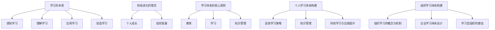

                 

### 核心概念与联系

在学习体系的构建过程中，核心概念和原理的深刻理解是至关重要的。为了更好地理解这些概念，我们可以借助Mermaid流程图来展示核心概念之间的联系。

以下是学习体系中的几个核心概念：

1. **学习的本质**：学习是一个多层次、动态的过程，包括感知学习、理解学习、应用学习和创造学习。
2. **持续进化的理念**：持续进化是指个人或组织不断适应环境变化，提升自身能力的过程。
3. **学习体系的核心原则**：这些原则包括教育的传授性质和学习的主动获取性质，以及知识管理的系统性和共享性。
4. **个人学习体系构建**：涉及高效学习策略的制定、知识管理的实施以及持续学习的习惯养成。
5. **组织学习体系构建**：包括组织学习的概念与机制、企业学习体系设计以及学习型组织的建设。

下面是使用Mermaid绘制的核心概念流程图：



在这个流程图中，每个概念都与其他相关概念相连接，展示了它们之间的内在联系。例如，学习的本质与感知学习、理解学习、应用学习和创造学习相联系，说明学习是一个从感知到创造的过程。持续进化的理念与个人成长和组织发展相联系，强调持续进化对个人和组织的重要性。学习体系的核心原则则与教育、学习和知识管理相联系，强调这些原则在构建学习体系中的关键作用。

通过这个流程图，我们可以更清晰地理解学习体系的核心概念及其相互关系，从而为后续内容提供理论基础。

### 学习的本质与动力

学习的本质是一个多层次、动态的过程，它不仅仅是一个获取知识的过程，更是一个不断进步、自我完善的过程。理解学习的本质，有助于我们更好地构建和优化学习体系，实现个人的持续进化和组织的不断发展。

#### 感知学习

感知学习是学习的第一个层次，也是最基础的层次。它是信息的接收与初步理解。在这一层次中，个体通过感官接收外部信息，例如通过阅读、听讲、观察等方式获取知识。感知学习的关键在于建立知识的初步印象，为后续的理解学习打下基础。

**例子**：比如，当学生学习一个新单词时，首先需要通过阅读或听讲的方式获取这个单词的信息，然后通过感官记住这个单词的发音和拼写。

#### 理解学习

理解学习是感知学习的深化，它涉及对信息的深入分析和思考，形成对知识概念的理解。在这一层次中，个体需要通过抽象思维将感知到的信息转化为自己的认知结构，理解其内在的逻辑和原理。

**例子**：比如，当学生学习物理学中的牛顿三大定律时，他们需要理解这些定律的含义、应用场景以及它们在物理现象中的体现。

#### 应用学习

应用学习是将理解到的知识应用于实际问题的过程。在这一层次中，个体需要将理论知识与实际情境相结合，解决实际问题。

**例子**：比如，当学生学完数学中的代数方程后，他们需要将其应用于解决实际问题，如计算利率、解决财务问题等。

#### 创造学习

创造学习是学习的最高层次，它涉及创新和发现新知识。在这一层次中，个体不仅能够将已有知识应用于新情境，还能够产生新的想法和理论。

**例子**：比如，科学家通过实验和研究，发现新的物理现象，提出新的科学理论，这就是创造学习的一个典型例子。

#### 学习动力的来源

学习动力来源于多个方面，包括内在动机和外部激励。

1. **内在动机**：内在动机是指个体对学习本身的兴趣和热爱，如求知欲、好奇心等。内在动机是长期持续学习的重要驱动力。

2. **外部激励**：外部激励包括家庭、学校、社会等外部环境给予的奖励和认可，如考试分数、奖励、荣誉等。外部激励可以在短期内提高学习积极性，但长期依赖可能会导致学习动力的减弱。

**结合实例**：假设小明是一名高中生，他非常热爱数学，对解决数学问题充满兴趣。这种内在动机使他每天都能主动花时间学习和练习数学。同时，学校举办数学竞赛，获奖者将获得奖学金，这种外部激励也激发了小明的学习动力，使他更加努力地学习数学。

总之，理解学习的本质和动力，有助于我们构建更有效的学习体系，激发个体的学习热情，实现个人的持续进化和组织的不断进步。

### 持续进化的理念

持续进化的理念强调个体和组织在动态环境中不断适应和提升自身能力的重要性。这一理念的核心在于，通过持续学习和创新，个体和组织能够不断适应环境变化，保持竞争力，实现长期发展。

#### 个人成长

对于个人而言，持续进化意味着不断提升自身能力，以适应不断变化的工作环境和市场需求。以下是一些具体的方面：

1. **技能提升**：通过持续学习，个人能够不断提升专业技能，掌握新的知识和技能，从而在职场中保持竞争力。
2. **知识更新**：随着技术的快速发展，旧的知识和技能可能迅速过时。持续进化要求个人不断更新知识库，学习新理论、新方法。
3. **思维方式**：持续进化还涉及思维方式的转变，从被动接受知识到主动探索和创造，培养批判性思维和创造性思维。

**案例**：例如，一位软件开发工程师，如果只停留在当前的编程语言和框架上，可能会很快被市场淘汰。通过持续学习新语言、新技术，工程师可以保持自身的竞争力，适应快速变化的技术环境。

#### 组织发展

对于组织而言，持续进化同样至关重要。以下是一些具体的方面：

1. **创新文化**：组织应培养创新文化，鼓励员工提出新想法，进行创新尝试。这有助于组织不断推出新产品、新技术，保持市场竞争力。
2. **知识共享**：组织应建立有效的知识共享机制，确保知识和经验的积累和传承，避免因个人离职而导致知识流失。
3. **持续改进**：组织应不断对产品、服务和流程进行改进，以适应市场变化和客户需求。持续改进有助于组织提升整体效率，降低成本。

**案例**：谷歌（Google）就是一个典型的例子。谷歌通过其“20%时间政策”，鼓励员工在20%的工作时间内进行个人感兴趣的项目。这一政策不仅激发了员工的创新热情，还带来了许多成功的产品，如谷歌地图和广告系统。

总之，持续进化的理念要求个人和组织不断适应环境变化，通过持续学习和创新，提升自身能力，实现长期发展。无论是在个人层面还是组织层面，持续进化都是实现成功的关键。

### 学习体系的核心原则

构建有效的学习体系需要遵循一些核心原则，这些原则不仅指导我们的学习过程，还确保我们能够系统地获取、管理和应用知识。以下是几个关键的核心原则：

#### 教育与学习的区别

首先，我们需要明确教育和学习的区别。教育通常是指由外部机构或教师传授知识的过程，具有指导性和系统性。而学习则是个人主动获取知识、技能和态度的过程，是一个自我驱动、自我反思的动态过程。

1. **教育的特点**：
   - **指导性**：教育通常由专业人士指导，遵循特定的教学计划和课程设置。
   - **系统性**：教育是一个有组织、有系统、循序渐进的过程，涵盖广泛的学科和领域。
   - **标准化**：教育往往遵循一定的标准，如学历、资格证书等。

2. **学习的特点**：
   - **主动性**：学习是个人自我驱动的过程，取决于个人的兴趣、需求和动机。
   - **灵活性**：学习可以在任何时间、任何地点进行，不受教学计划和课程设置的约束。
   - **个性化**：学习是根据个人的兴趣和需求来进行的，更注重个性化和差异化。

**例子**：学校教育是一个典型的教育过程，学生按照课程表参加各类课程，接受系统的知识传授。而自主学习则体现在个人阅读、在线课程、实践操作等方面，这些活动都是基于个人兴趣和需求来进行的。

#### 知识管理的意义

知识管理是学习体系中的一个重要组成部分，它涉及到知识的获取、存储、共享和应用。有效的知识管理能够提高学习效率，促进知识的传承和创新。

1. **知识的获取**：知识的获取是学习体系的基础。个体和组织需要通过各种渠道，如阅读、研究、交流、实践等，获取新的知识和信息。

2. **知识的存储**：获取的知识需要有效地存储，以便于后续的查找和使用。这通常涉及建立知识库、文档管理系统等。

3. **知识的共享**：知识共享是知识管理的核心目标之一。通过共享知识，个体和组织能够充分利用已有的知识和经验，减少重复劳动，提高整体效率。

4. **知识的应用**：知识的应用是将知识转化为实际效益的关键步骤。个体和组织需要将获取的知识应用到实际工作中，解决实际问题，创造新的价值。

**例子**：在一个软件开发团队中，知识管理可能包括建立代码库、文档库和经验分享平台。团队成员可以随时查阅已有的代码和文档，分享开发经验和最佳实践，从而提高整个团队的开发效率。

#### 主动学习与被动学习

在学习策略方面，主动学习与被动学习是两种重要的学习方式。

1. **主动学习**：
   - **特点**：主动学习是指个体主动探索、深入研究、积极实践的学习方式。它通常需要更高的认知参与度和更强的自我驱动能力。
   - **优点**：主动学习有助于深刻理解知识，提高问题解决能力和创新能力。
   - **应用场景**：适用于学习复杂概念、掌握专业技能、进行项目开发等。

2. **被动学习**：
   - **特点**：被动学习是指个体通过接受外部信息、听取讲座、观看视频等方式获取知识的学习方式。它通常较为轻松，认知参与度较低。
   - **优点**：被动学习适用于快速获取基础知识、了解新趋势、扩展知识面等。
   - **应用场景**：适用于学习入门知识、进行知识普及、参加培训等。

**例子**：在学习编程时，通过观看在线教程（被动学习）可以快速了解基础语法和概念，而通过实际编写代码（主动学习）则能更好地理解和掌握编程技巧。

总之，学习体系的核心原则包括教育与学习的区别、知识管理的意义以及主动学习与被动学习的策略。理解和应用这些原则，有助于我们构建一个高效、系统、灵活的学习体系，实现个人的持续成长和组织的持续发展。

### 构建高效学习策略

构建高效学习策略是学习体系中的关键一环，它直接影响学习效果和效率。高效学习策略包括多种类型，每种都有其独特的优势和适用场景。以下是几种常见的有效学习策略：

#### 主动学习

**定义**：主动学习是一种通过主动探索、深入研究和积极实践来获取知识的学习方式。

**优势**：主动学习能够激发个体的学习兴趣和内在动机，提高知识的理解和应用能力。

**适用场景**：主动学习适用于学习复杂概念、掌握专业技能和进行项目开发等需要深入理解和实践的场景。

**具体方法**：
1. **项目驱动学习**：通过实际项目来学习，如编程项目、实验项目等，将理论知识应用到实际问题中。
2. **问题解决学习**：面对具体问题，通过自主探索和尝试找到解决方案，加深对知识点的理解。
3. **互动学习**：与他人进行讨论、辩论和协作，通过交流分享各自的学习经验和见解，相互启发。

**例子**：一个软件开发工程师可能会通过参与开源项目来学习新编程语言或框架，这不仅提高了编程技能，还扩展了技术视野。

#### 被动学习

**定义**：被动学习是通过接受外部信息、听取讲座、观看视频等方式来获取知识的学习方式。

**优势**：被动学习较为轻松，认知参与度较低，适用于快速获取基础知识、了解新趋势和扩展知识面。

**适用场景**：被动学习适用于学习入门知识、参加培训、获取新信息等场景。

**具体方法**：
1. **在线课程**：通过在线平台学习专业课程，如Coursera、edX等，方便灵活。
2. **讲座和研讨会**：参加专家讲座和行业研讨会，获取前沿知识和行业动态。
3. **阅读书籍和文章**：阅读专业书籍、学术论文和行业报告，扩大知识面。

**例子**：一个数据分析师可能会通过在线课程学习新的数据分析工具，通过阅读相关书籍来深入了解数据科学的理论和实践。

#### 混合学习

**定义**：混合学习是将主动学习和被动学习相结合，以适应不同的学习需求和场景。

**优势**：混合学习能够根据学习目标和个人偏好，灵活调整学习方式，提高学习效果。

**适用场景**：混合学习适用于学习复杂概念、进行项目开发、参加培训等多种场景。

**具体方法**：
1. **先被动后主动**：先通过被动学习获取基础知识，再通过主动学习和实践进行深入学习和应用。
2. **交替使用**：在某一阶段集中使用主动学习，在另一阶段集中使用被动学习，交替进行。
3. **个性化学习**：根据个人兴趣和需求，选择适合自己的学习方式和内容。

**例子**：一个软件工程师可能会先通过在线课程学习新的编程语言的基础知识，然后通过实际编写代码和参与项目来巩固和应用所学知识。

总之，构建高效学习策略需要根据学习目标和个人情况，灵活运用主动学习和被动学习，结合混合学习的方法，以达到最佳的学习效果。通过这些策略，个体可以更高效地获取、理解和应用知识，实现个人成长和职业发展。

### 知识管理

知识管理是构建有效学习体系的重要组成部分，它涉及到知识的获取、存储、共享和应用。有效的知识管理不仅能够提高学习效率，还能促进知识的传承和创新，为个人和组织的发展提供持续动力。

#### 知识管理的意义

知识管理在个人和组织层面都具有深远的意义。

**对于个人**：
1. **知识获取**：通过知识管理，个人能够快速获取所需的信息和知识，提高学习效率。
2. **知识存储**：知识管理帮助个人系统地存储和管理知识，便于日后的查找和复用。
3. **知识共享**：通过知识共享，个人可以与他人交流学习成果，促进知识和经验的传承。
4. **知识应用**：知识管理有助于个人将所学知识应用于实际问题，提高问题解决能力。

**对于组织**：
1. **知识获取**：组织通过知识管理可以快速获取外部知识和信息，保持竞争优势。
2. **知识存储**：知识管理帮助组织系统地存储和管理知识，形成企业的知识库，促进知识积累和传承。
3. **知识共享**：通过知识共享，组织内部的知识可以流动起来，提高整体工作效率和创新能力。
4. **知识应用**：知识管理有助于组织将知识应用于产品研发、服务优化和流程改进，提升组织效能。

#### 知识管理的具体步骤

1. **知识获取**：
   - **信息搜集**：通过各种渠道，如阅读、研究、交流、实践等，获取新的知识和信息。
   - **信息筛选**：对获取的信息进行筛选和整理，保留有价值的内容。
   - **知识沉淀**：将筛选后的知识进行沉淀，形成个人的知识库或组织的企业知识库。

2. **知识存储**：
   - **知识库建设**：建立知识库，使用数据库、文档管理系统等工具，存储和管理知识。
   - **知识分类**：对知识进行分类，便于后续查找和检索。
   - **知识更新**：定期更新知识库，保持知识的时效性和准确性。

3. **知识共享**：
   - **内部共享**：通过内部网络、邮件、会议等途径，在组织内部共享知识和经验。
   - **外部共享**：通过公开讲座、论文发表、社交媒体等渠道，与外部分享知识和经验。
   - **知识论坛**：建立知识论坛或社区，促进知识交流和讨论。

4. **知识应用**：
   - **知识培训**：通过培训课程、研讨会等形式，将知识转化为员工的技能和知识。
   - **知识创新**：鼓励员工在应用知识的过程中进行创新，开发新产品、新技术。
   - **知识利用**：将知识应用于实际工作中，解决实际问题，提高工作效率和效能。

#### 知识管理的工具

1. **知识库**：
   - **文档管理系统**：如Confluence、SharePoint等，用于存储和管理文档。
   - **数据库**：如MySQL、MongoDB等，用于存储和管理结构化数据。

2. **知识共享平台**：
   - **学习管理系统**：如Moodle、Canvas等，用于提供在线课程和学习资源。
   - **社交媒体**：如LinkedIn、Twitter等，用于知识交流和分享。

3. **知识应用工具**：
   - **项目管理工具**：如Trello、JIRA等，用于管理和跟踪项目进度。
   - **协作工具**：如Slack、Microsoft Teams等，用于团队协作和知识共享。

通过有效的知识管理，个人和组织可以更好地利用知识，提高学习效率和工作效能，实现持续进化和长期发展。

### 持续学习与自我提升

持续学习与自我提升是个人成长和职业发展的重要驱动力。在快速变化的时代，持续学习不仅能够帮助个人适应不断变化的职场环境，还能不断提升自身的能力，实现职业生涯的持续发展。

#### 定期学习计划

制定并坚持定期学习计划是持续学习的重要保障。以下是制定和执行学习计划的几个关键步骤：

1. **确定学习目标**：明确自己的学习目标，包括短期和长期目标。短期目标可以是掌握一项新技能或通过某个专业认证，而长期目标则可能是成为某个领域的专家或实现职业晋升。

2. **规划学习时间**：合理安排学习时间，确保有足够的时间进行学习和实践。可以通过每日计划、每周计划甚至每月计划来分配学习时间，确保学习计划的执行力。

3. **选择学习资源**：根据学习目标，选择合适的教材、在线课程、专业书籍等学习资源。选择资源时，要考虑资源的质量、实用性以及是否符合自己的学习需求。

4. **制定学习步骤**：将学习目标分解为具体的步骤，制定详细的学习计划。例如，如果目标是学习一门新编程语言，可以分解为学习基础语法、掌握常用库和框架、进行项目实践等。

5. **执行学习计划**：按照学习计划进行学习，并定期检查学习进度。如果遇到困难或偏离计划，要及时调整学习策略，确保学习计划的执行。

6. **反思与总结**：定期反思学习过程和学习成果，总结成功经验和不足之处，并调整学习策略。通过反思和总结，不断提升学习效果。

#### 学习反馈机制

有效的学习反馈机制是确保学习效果的重要手段。以下是构建和实施学习反馈机制的几个关键步骤：

1. **设定反馈目标**：明确反馈的目标，如提高学习效率、掌握新技能、解决实际问题等。反馈目标应具体、可测量。

2. **选择反馈渠道**：根据学习目标和反馈需求，选择合适的反馈渠道。例如，可以邀请导师或同事进行面对面反馈，或通过在线平台提交学习报告，接受专家评审。

3. **收集反馈信息**：定期收集学习过程中的反馈信息，包括学习进度、学习成果、遇到的问题和困难等。可以通过问卷调查、面试、学习报告等方式收集反馈信息。

4. **分析反馈信息**：对收集到的反馈信息进行分析，识别学习过程中的优点和不足，并提出改进措施。分析时，要注重数据分析和定量评估，确保反馈的客观性和有效性。

5. **实施改进措施**：根据反馈分析结果，制定和实施改进措施。改进措施应具体、可操作，确保能够切实提高学习效果。

6. **持续跟踪与评估**：对改进措施的实施效果进行持续跟踪和评估，确保学习效果的持续提升。

#### 自我提升的途径

除了制定学习计划和反馈机制，自我提升还有许多其他途径，以下是一些有效的自我提升方法：

1. **主动学习**：主动学习是通过主动探索、深入研究和积极实践来获取知识的学习方式。主动学习能够激发学习兴趣和内在动机，提高学习效果。可以通过参与项目、解决实际问题、进行实验等方式进行主动学习。

2. **跨界学习**：跨界学习是通过学习不同领域的知识和技能，拓宽视野，提高创新能力。可以通过阅读跨学科书籍、参加跨领域研讨会、学习新技能等方式进行跨界学习。

3. **反思与总结**：反思与总结是通过回顾学习过程和学习成果，发现不足之处，进行自我调整和改进。可以通过写反思日记、进行学习总结、定期回顾等方式进行反思与总结。

4. **经验分享**：经验分享是通过与他人分享学习经验和心得，促进知识和经验的传承，提高自身学习效果。可以通过参加学习小组、参与论坛、发表学习文章等方式进行经验分享。

5. **持续实践**：持续实践是将所学知识应用于实际工作中，通过不断实践和总结，提高自身能力和技能。可以通过参与实际项目、进行实践操作、解决实际难题等方式进行持续实践。

通过定期学习计划、有效的学习反馈机制以及多种自我提升途径，个人可以不断提高自身能力，实现持续进化和职业发展。

### 组织学习的概念与机制

组织学习是现代组织中一个至关重要的概念，它涉及通过知识的获取、共享和应用来提升组织的整体能力和竞争力。组织学习不仅仅是个人学习的扩展，而是一个更为复杂和系统的过程，它强调组织内部的集体智慧和文化氛围的建设。

#### 知识共享

知识共享是组织学习的重要组成部分，它指的是组织内部成员之间共享知识和经验的过程。有效的知识共享可以促进信息的流通，提高决策的质量，并激发创新思维。

**重要性**：
1. **提升决策质量**：通过知识共享，组织可以获取更多元的观点和信息，从而做出更为明智的决策。
2. **促进创新**：知识共享有助于激发员工的创新思维，通过共享经验和最佳实践，可以迅速产生新的想法和解决方案。
3. **提高效率**：知识共享可以减少重复劳动，避免因信息不对称而导致的资源浪费。

**实现方法**：
1. **内部论坛和研讨会**：组织可以定期举办内部论坛和研讨会，鼓励员工分享他们的知识和经验。
2. **知识库和文档管理系统**：建立知识库和文档管理系统，使员工可以方便地获取和共享知识。
3. **团队协作工具**：使用如Slack、Microsoft Teams等团队协作工具，促进实时交流和知识共享。

#### 创新能力

创新能力是组织学习体系中的核心要素，它关系到组织的生存和发展。创新能力不仅指技术上的创新，还包括管理、流程、服务等多方面的创新。

**重要性**：
1. **适应市场变化**：创新能力使组织能够迅速适应市场变化，抓住新的机遇。
2. **提升竞争力**：通过不断创新，组织可以在激烈的市场竞争中保持领先地位。
3. **持续发展**：创新能力是组织持续发展的动力，它能够推动组织不断前进，实现长期目标。

**实现方法**：
1. **创新文化**：建立创新文化，鼓励员工敢于尝试、勇于失败，形成积极创新的环境。
2. **激励机制**：设立创新奖励，激励员工提出新的想法和解决方案。
3. **跨部门合作**：通过跨部门合作，促进不同领域之间的知识交流和融合，激发创新思维。
4. **创新实验室**：设立创新实验室，为员工提供实践创新项目的平台。

#### 文化氛围

文化氛围是组织学习体系的重要组成部分，它决定了组织成员的学习态度和行为。一个积极、开放、包容的文化氛围有助于激发员工的学习热情和创新潜力。

**重要性**：
1. **提升员工满意度**：良好的文化氛围可以提高员工的工作满意度和归属感，从而增强员工的忠诚度。
2. **促进知识共享**：文化氛围可以促进员工之间的信任和合作，从而提高知识共享的效率和效果。
3. **增强创新能力**：积极的文化氛围可以激发员工的创新思维，推动组织的持续创新。

**实现方法**：
1. **领导榜样**：领导者的行为和态度对组织文化有着重要的影响，领导者应通过自身的言行树立积极向上的文化榜样。
2. **沟通与反馈**：建立有效的沟通机制，鼓励员工表达意见和反馈，营造开放、包容的沟通氛围。
3. **培训与发展**：提供定期的培训和职业发展机会，帮助员工提升技能和知识，增强其对组织的认同感和归属感。
4. **文化活动**：组织定期的文化活动，如团队建设活动、知识竞赛等，可以增强员工之间的互动和团队合作，提升组织文化氛围。

总之，组织学习体系的构建需要从知识共享、创新能力和文化氛围等多个方面进行综合考量，通过有效的机制和措施，实现组织的持续进化和长期发展。

### 企业学习体系设计

企业学习体系的设计是企业实现可持续发展、提高员工能力和保持竞争优势的关键。一个完善的学习体系不仅能够提升员工的技能和知识水平，还能激发创新思维，推动企业的发展。以下是企业学习体系设计的关键要素和步骤：

#### 培训与发展

**定义**：培训与发展是指通过系统的学习和培训，提升员工的知识、技能和职业素养。

**重要性**：
1. **提升员工能力**：通过培训，员工可以掌握新的知识和技能，提升工作效率和质量。
2. **适应岗位需求**：培训有助于员工适应不同岗位的需求，满足企业发展的需要。
3. **职业规划**：培训与发展为员工提供了职业发展的路径，有助于实现个人与企业的共同成长。

**具体措施**：
1. **内部培训**：组织定期的内部培训，包括职业技能培训、管理培训、领导力培训等。
2. **外部培训**：鼓励员工参加外部培训机构或专业课程，获取更广泛的知识和技能。
3. **导师制度**：设立导师制度，帮助新员工快速融入企业，提升其工作能力和职业素养。
4. **职业发展计划**：为员工制定个性化的职业发展计划，明确职业目标和培训需求。

#### 知识管理

**定义**：知识管理是指通过系统的方法和工具，对知识进行获取、存储、共享和应用，以实现知识的最大化利用。

**重要性**：
1. **知识积累**：通过知识管理，企业可以积累宝贵的知识和经验，形成企业的核心竞争力。
2. **知识共享**：知识共享可以促进员工之间的交流和合作，提高整体工作效率。
3. **创新能力**：知识管理有助于激发员工的创新思维，推动企业的持续创新。

**具体措施**：
1. **知识库建设**：建立企业内部知识库，存储和分类员工的业务知识、经验教训等。
2. **知识共享平台**：搭建知识共享平台，如内部论坛、知识管理系统等，方便员工查找和分享知识。
3. **知识培训**：定期组织知识培训，帮助员工掌握最新的业务知识和技能。
4. **知识认证**：对有突出贡献的员工进行知识认证，激励员工积极贡献知识。

#### 创新激励

**定义**：创新激励是指通过一系列的激励措施，鼓励员工进行创新尝试，推动企业的创新和发展。

**重要性**：
1. **激发创新潜力**：创新激励可以激发员工的创新潜力，提高企业的创新能力。
2. **推动企业发展**：创新是企业发展的关键动力，创新激励有助于企业实现持续发展。
3. **保持竞争优势**：创新激励可以帮助企业保持技术领先，提升市场竞争力。

**具体措施**：
1. **创新奖励**：设立创新奖励，对提出创新方案或成功实施创新项目的员工进行奖励。
2. **创新孵化**：建立创新孵化平台，为员工提供创新项目孵化的资源和支持。
3. **创新文化**：营造创新文化，鼓励员工敢于尝试、勇于创新，形成全员创新的良好氛围。
4. **创新团队**：组建跨部门的创新团队，促进不同领域之间的知识交流和合作。

#### 学习体系建设

**步骤**：
1. **需求分析**：分析企业的发展需求、员工的技能需求和市场的变化趋势，确定学习体系的建设方向。
2. **设计学习框架**：根据需求分析的结果，设计学习框架，明确学习目标、学习内容和学习方式。
3. **搭建学习平台**：搭建在线学习平台，提供丰富的学习资源和工具，如在线课程、电子书、培训视频等。
4. **实施与推广**：组织各类培训活动，如内部讲座、研讨会、技能竞赛等，鼓励员工积极参与学习。
5. **评估与优化**：定期评估学习效果，根据评估结果优化学习体系和方式。

#### 案例研究

1. **微软**：
   - **措施**：微软为员工提供多样化的学习资源，包括在线课程、内部培训、导师指导等。微软还建立了学习平台，员工可以自由选择学习内容，并与其他员工分享知识。
   - **效果**：通过完善的学习体系，微软不仅提升了员工的技能和知识水平，还推动了企业的创新和发展，保持了技术领先地位。

2. **谷歌**：
   - **措施**：谷歌为员工提供丰富的学习资源，包括在线课程、内部培训、技术分享会等。谷歌鼓励员工自我提升，并提供创新奖励，以激发员工的学习热情和创造力。
   - **效果**：谷歌的学习体系有效提升了员工的技能和创新能力，推动了公司的持续创新，使其在科技领域始终保持领先地位。

3. **亚马逊**：
   - **措施**：亚马逊注重员工的职业发展和技能提升，提供一系列培训项目，如领导力培训、技术培训、跨部门轮岗等。亚马逊还建立了知识共享平台，员工可以分享经验和最佳实践，促进团队协作。
   - **效果**：亚马逊的学习体系帮助员工不断提升自身能力，促进了公司的创新和发展，使其在电商领域保持了强大的竞争力。

通过以上案例可以看出，企业学习体系的设计和实施对于提升员工能力、推动企业创新和保持竞争优势具有重要意义。企业应根据自身实际情况，制定合理的学习体系，为员工提供良好的学习和发展环境。

### 学习型组织的建设

学习型组织的建设是现代企业管理的重要目标之一。一个学习型组织能够不断适应环境变化，持续提升组织效能和竞争力。以下是构建学习型组织的关键要素和策略。

#### 自我超越

自我超越是指组织不断挑战自我，追求卓越，超越现有的能力和水平。自我超越是学习型组织的精神核心，它要求组织成员时刻保持危机意识，不断寻求改进和创新。

**实现策略**：
1. **设定高目标**：组织应设定具有挑战性的目标，激励成员不断努力，追求卓越。
2. **鼓励创新思维**：建立鼓励创新和尝试的环境，让成员敢于提出新的想法，勇于突破传统思维。
3. **持续学习**：组织应鼓励成员不断学习新知识、新技能，提升自身的专业能力和综合素质。

#### 心智模式

心智模式是指组织成员共有的思维方式和行为习惯。心智模式对组织的决策和行为产生深远影响，一个积极、开放和包容的心智模式有助于组织的学习和创新。

**实现策略**：
1. **培养开放心态**：组织应鼓励成员拥抱变化，勇于接受新观念和新方法。
2. **建立反馈机制**：通过定期的反馈和评估，帮助成员识别和改变不良心智模式，培养积极的心态。
3. **跨部门合作**：通过跨部门合作，促进不同领域之间的交流和互动，拓宽成员的视野和思维方式。

#### 共同愿景

共同愿景是指组织成员共同追求的目标和价值。共同愿景是学习型组织的动力源泉，它能够凝聚组织成员，形成合力，推动组织不断前进。

**实现策略**：
1. **明确愿景**：组织应明确共同愿景，让每个成员都了解并认同组织的长远目标和价值观。
2. **制定愿景规划**：将共同愿景转化为具体的行动计划，确保每个成员都知道如何为实现愿景做出贡献。
3. **共享愿景**：通过内部沟通和分享，让每个成员都能感受到共同愿景的力量，增强团队凝聚力和执行力。

#### 构建学习型组织的步骤

1. **领导层的引领**：领导层应率先树立学习型组织的理念，通过自身的言行示范，推动组织文化建设。
2. **组织诊断**：对组织的现状进行分析和诊断，识别存在的障碍和问题，为后续的改进提供依据。
3. **制定学习计划**：根据组织的实际情况，制定系统的学习计划，明确学习目标和具体措施。
4. **实施与推广**：按照学习计划，组织实施各类培训和学习活动，推动学习型组织的建设。
5. **评估与反馈**：定期对学习效果进行评估和反馈，根据评估结果进行调整和优化。

#### 成功案例分析

**案例：谷歌**

谷歌作为全球知名的高科技公司，其成功离不开学习型组织的建设。

**策略**：
1. **自我超越**：谷歌鼓励员工不断挑战自我，追求卓越。公司设立了“20%时间政策”，允许员工将20%的工作时间用于个人感兴趣的项目，这一政策激发了员工的创新潜力。
2. **心智模式**：谷歌倡导开放、包容和积极的心态，鼓励员工敢于尝试、勇于失败。公司内部建立了开放的沟通渠道，如员工邮件、内部博客等，促进知识和经验的共享。
3. **共同愿景**：谷歌明确了公司的愿景和使命，即通过技术创新，推动人类的进步。公司通过内部沟通和分享，让每个员工都清楚自己的工作如何为实现这一愿景做出贡献。

**效果**：通过学习型组织的建设，谷歌不仅提升了员工的技能和创新能力，还推动了公司的持续创新和发展。谷歌的产品和服务不断推陈出新，公司保持了技术领先和市场竞争力。

总之，学习型组织的建设需要从自我超越、心智模式和共同愿景等多个方面进行系统思考和规划。通过有效的策略和措施，组织可以不断提升自身的学习能力和创新能力，实现持续发展和竞争优势。

### 全球知名企业学习体系建设案例

全球知名企业如微软、谷歌和亚马逊在学习体系建设方面有着丰富的经验和成功的实践。以下是这些企业学习体系建设的具体方法和措施。

#### 微软

**措施**：
1. **多样化的学习资源**：微软为员工提供丰富的学习资源，包括在线课程、内部培训、导师指导等。员工可以通过公司内部的学习平台，选择适合自己的学习内容和进度。
2. **内部学习平台**：微软建立了内部学习平台，员工可以在这里找到各种学习资料，包括技术教程、管理课程等。平台还提供了互动功能，员工可以分享学习心得和经验。
3. **专业认证和支持**：微软鼓励员工通过参加专业认证考试来提升技能。公司提供考试费用支持，并为通过考试的员工提供奖励。

**效果**：通过完善的学习体系建设，微软不仅提升了员工的技能水平，还激发了员工的学习热情和创新思维。这有助于公司在技术领域保持领先地位，推动产品的持续创新。

#### 谷歌

**措施**：
1. **“20%时间政策”**：谷歌的“20%时间政策”允许员工将20%的工作时间用于个人感兴趣的项目。这一政策鼓励员工进行创新尝试，推动了公司的许多成功产品，如谷歌地图和Gmail。
2. **知识共享**：谷歌鼓励员工通过内部邮件、博客和会议等方式分享知识和经验。公司内部建立了多个兴趣小组，员工可以在这里交流学习心得和研究成果。
3. **创新奖励**：谷歌设立了一系列创新奖励，对提出新想法并成功实施的员工进行奖励。这激发了员工的学习热情和创新能力。

**效果**：谷歌的学习体系成功推动了公司的创新和发展。通过开放、包容和鼓励创新的文化氛围，谷歌吸引了大量优秀的人才，保持了技术领先和市场竞争力。

#### 亚马逊

**措施**：
1. **领导力培训**：亚马逊重视员工的领导力培养，为各级管理者提供专门的领导力培训。通过这些培训，管理者能够提升领导能力，更好地指导和激励团队成员。
2. **技能提升项目**：亚马逊为员工提供各种技能提升项目，包括编程、数据分析、项目管理等。员工可以根据自己的职业规划，选择适合自己的培训项目。
3. **在线学习平台**：亚马逊建立了在线学习平台，提供丰富的学习资源和课程。员工可以随时登录平台，学习新知识和技能。

**效果**：通过完善的学习体系建设，亚马逊成功提升了员工的技能和职业素养，推动了公司的持续创新和发展。这有助于公司在电商领域保持竞争优势，实现长期增长。

综上所述，微软、谷歌和亚马逊通过完善的学习体系建设，成功提升了员工的技能和创新能力，推动了公司的持续发展和竞争优势。这些经验和方法为其他企业提供了有益的借鉴。

### 学习体系建设实践指南

构建一个高效的学习体系是企业和个人实现持续发展的关键。以下是具体的学习体系建设实践指南，包括方法、步骤和关键要素，以及实施过程中可能遇到的挑战和解决策略。

#### 方法

1. **需求分析**：首先，进行深入的需求分析，了解员工的学习需求和公司的战略目标。这包括调查员工对当前学习资源和培训的满意度，以及他们希望获取哪些新知识和技能。

2. **设计学习框架**：基于需求分析的结果，设计一个明确的学习框架，包括学习目标、学习内容和学习方式。学习框架应涵盖员工的职业发展需求，并与公司的战略目标相一致。

3. **搭建学习平台**：选择合适的在线学习平台或学习管理系统（LMS），为员工提供丰富的学习资源和工具。学习平台应具备课程管理、学习进度跟踪、知识共享等功能。

4. **制定培训计划**：根据学习框架，制定详细的培训计划，包括培训课程、培训时间、培训方式等。培训计划应具有灵活性和可调整性，以适应不同的学习需求和公司变化。

5. **实施与推广**：通过内部邮件、公告、会议等方式，向员工推广学习体系和培训计划。鼓励员工积极参与培训，并提供必要的支持和资源。

6. **评估与优化**：定期评估学习效果，收集员工反馈，根据评估结果对学习体系和培训计划进行调整和优化。

#### 步骤

1. **步骤1：需求分析**
   - 进行员工调查，了解学习需求和兴趣。
   - 分析公司的战略目标和业务需求，确定学习重点。

2. **步骤2：设计学习框架**
   - 确定学习目标和内容。
   - 选择合适的学习方式，如在线课程、面对面培训、工作坊等。

3. **步骤3：搭建学习平台**
   - 选择和部署在线学习平台。
   - 上传和分类学习资源，确保资源的可用性和易访问性。

4. **步骤4：制定培训计划**
   - 制定详细的培训计划，包括培训课程、培训时间和方式。
   - 分配培训资源，确保培训计划的执行。

5. **步骤5：实施与推广**
   - 推广学习体系和培训计划。
   - 提供培训支持和辅导，确保员工积极参与。

6. **步骤6：评估与优化**
   - 定期评估学习效果，收集员工反馈。
   - 根据评估结果调整学习内容和方式。

#### 关键要素

1. **学习平台**：选择一个功能强大、易于使用的在线学习平台，确保员工能够方便地访问和学习资源。

2. **培训资源**：提供丰富、高质量的学习资源，包括教材、课程视频、案例研究、实践指南等。

3. **培训计划**：制定详细的培训计划，确保培训内容与公司的战略目标和员工的需求相匹配。

4. **培训支持**：为员工提供培训支持和辅导，帮助他们克服学习中的困难。

5. **知识共享**：建立有效的知识共享机制，鼓励员工分享知识和经验，促进知识的传递和积累。

#### 挑战与解决策略

1. **挑战：员工参与度不高**
   - **解决策略**：通过激励机制（如奖励、认可）提高员工参与度。定期与员工沟通，了解他们的需求和反馈，不断优化学习内容和方式。

2. **挑战：培训资源不足**
   - **解决策略**：与外部培训机构合作，获取高质量的培训资源。鼓励内部专家和员工分享知识和经验，丰富学习资源。

3. **挑战：培训效果不佳**
   - **解决策略**：定期评估培训效果，收集员工反馈，及时调整培训内容和方式。提供培训后的跟进和支持，帮助员工将所学知识应用于实际工作中。

4. **挑战：技术问题**
   - **解决策略**：选择技术成熟、稳定的学习平台。提供技术支持和培训，确保员工能够熟练使用学习平台。

通过以上实践指南，企业可以构建一个高效、系统的学习体系，提升员工的技能和知识水平，推动组织的持续发展和竞争优势。

### 附录A：学习资源推荐

在构建个人学习体系时，选择合适的学习资源和工具至关重要。以下是几种常用的学习平台、学习工具和书籍推荐，旨在帮助读者提高学习效率，掌握更多知识。

#### 学习平台推荐

1. **Coursera**
   - **特点**：提供全球顶尖大学的在线课程，涵盖计算机科学、数据科学、商业等多个领域。
   - **使用建议**：根据个人兴趣和职业发展需求，选择适合的课程进行学习。

2. **edX**
   - **特点**：由哈佛大学和麻省理工学院共同创立，提供高质量的课程资源，涵盖科学、工程、社会科学等领域。
   - **使用建议**：利用edX的平台，学习一些基础和进阶的科学知识，提升专业素养。

3. **Udemy**
   - **特点**：提供多样化的在线课程，涵盖职业技能、兴趣爱好等多个领域。
   - **使用建议**：根据自己的学习目标和兴趣，选择适合的课程进行深入学习。

#### 学习工具推荐

1. **Anki**
   - **特点**：一款基于间隔重复的学习工具，适用于记忆类知识的学习。
   - **使用建议**：用于学习新的编程语言、数据结构等需要记忆的知识点，提高记忆效果。

2. **Evernote**
   - **特点**：一款强大的笔记和管理工具，方便记录和整理学习资料。
   - **使用建议**：用于整理学习笔记、记录学习心得和总结，提高学习效率。

3. **Notion**
   - **特点**：一款集笔记、任务管理、知识库于一体的工具，适用于构建个人学习体系。
   - **使用建议**：用于管理学习计划、跟踪学习进度、整理学习资料等，构建高效的学习体系。

#### 学习相关书籍推荐

1. **基础书籍**
   - 《深度学习》（Ian Goodfellow、Yoshua Bengio、Aaron Courville 著）
     - **简介**：系统介绍了深度学习的基础理论和实践方法。
     - **使用建议**：适合初学者和进阶者，用于学习深度学习的基本概念和技术。

   - 《人工智能：一种现代的方法》（Stuart J. Russell、Peter Norvig 著）
     - **简介**：全面介绍了人工智能的基础知识和核心技术。
     - **使用建议**：适合计算机科学和人工智能专业的学生和从业者，用于系统学习人工智能。

2. **进阶书籍**
   - 《机器学习实战》（Peter Harrington 著）
     - **简介**：通过实际案例，介绍了机器学习的基本方法和应用技巧。
     - **使用建议**：适合有一定基础的读者，用于掌握机器学习的实际应用技巧。

   - 《数据科学入门》（Joel Grus 著）
     - **简介**：从实际应用角度出发，介绍了数据科学的基础知识和工具。
     - **使用建议**：适合初学者和进阶者，用于入门数据科学，提升数据分析能力。

通过以上学习资源和工具的推荐，读者可以根据自己的需求和兴趣，选择合适的资源进行学习，构建一个高效、系统的个人学习体系。

### 附录B：学习相关书籍推荐

在构建个人学习体系时，选择高质量的学习资源是至关重要的。以下推荐了一系列基础和进阶书籍，涵盖计算机科学、人工智能和数据科学等热门领域，旨在帮助读者深入理解和应用所学知识。

#### 基础书籍

1. **《深度学习》（Ian Goodfellow、Yoshua Bengio、Aaron Courville 著）**
   - **简介**：本书详细介绍了深度学习的理论基础、算法和应用。它适合初学者和进阶者，系统地讲解了深度学习的核心概念和技术。
   - **推荐理由**：内容全面，讲解深入，适合作为深度学习的入门和进阶读物。

2. **《人工智能：一种现代的方法》（Stuart J. Russell、Peter Norvig 著）**
   - **简介**：这本书是人工智能领域的经典教材，全面覆盖了人工智能的理论基础、方法和应用。它既适合学生，也适合专业人士。
   - **推荐理由**：权威性高，内容系统，是人工智能学习的必备参考书。

3. **《Python编程：从入门到实践》（Eric Matthes 著）**
   - **简介**：本书通过大量的实例和练习，帮助读者掌握Python编程的基础知识和实践技巧。它适合初学者，也是入门编程的理想选择。
   - **推荐理由**：内容实用，易于理解，适合快速入门Python编程。

#### 进阶书籍

1. **《机器学习实战》（Peter Harrington 著）**
   - **简介**：本书通过实际案例，介绍了机器学习的基本方法和应用技巧。它涵盖了常用的机器学习算法和工具，适合有一定基础的读者。
   - **推荐理由**：实践性强，案例丰富，适合读者在掌握基础知识后进行深入学习和应用。

2. **《数据科学入门》（Joel Grus 著）**
   - **简介**：本书从实际应用角度出发，介绍了数据科学的基础知识和工具。它适合初学者和进阶者，有助于读者理解数据科学的实践方法。
   - **推荐理由**：内容全面，讲解清晰，适合数据科学初学者快速入门。

3. **《神经网络与深度学习》（邱锡鹏 著）**
   - **简介**：本书系统地介绍了神经网络和深度学习的理论、算法和应用。它适合有一定数学基础的读者，是深度学习领域的一部重要教材。
   - **推荐理由**：理论深刻，算法全面，适合深度学习进阶者深入学习。

通过以上书籍的推荐，读者可以根据自己的学习目标和兴趣，选择合适的书籍进行深入学习，全面提升自己的知识和技能水平。

### 核心概念与联系

在学习体系的构建过程中，核心概念之间的相互联系构成了理解学习体系的重要基础。以下是本文涉及的核心概念及其联系：

**核心概念：**
1. **学习体系**：一个系统化的学习框架，包括学习目标、内容、方法和评价。
2. **学习策略**：实现学习目标的具体方法，包括主动学习和被动学习。
3. **知识管理**：获取、存储、共享和应用知识的过程。
4. **创新能力**：在知识的基础上进行创新，解决新问题。
5. **学习型组织**：一个持续学习和创新的组织，注重知识共享和共同发展。

**核心联系：**
- **学习体系与学习策略**：学习体系提供了整体框架，而学习策略则是实现学习目标的手段。有效的学习策略能够提升学习效果。
- **知识管理与实践**：知识管理是学习体系的支柱，它确保知识的获取、存储和共享，而实践是将知识转化为能力和成果的关键。
- **创新能力与知识管理**：创新能力依赖于丰富的知识储备，知识管理则为创新提供了坚实的基础。
- **学习型组织与个人成长**：学习型组织为个人提供了良好的学习和发展环境，而个人的成长也为组织的发展贡献力量。

通过这些核心概念之间的联系，我们可以更全面地理解和应用学习体系，实现个人和组织的持续进化和成长。

### 核心算法原理讲解

在本文中，我们探讨了构建高效学习体系所需的核心算法原理。以下是这些算法的概述及其应用。

#### 线性回归

**算法原理：**
线性回归是一种用于预测连续值的统计方法。其基本公式为：
\[ y = \beta_0 + \beta_1 \cdot x \]
其中，\( y \) 是预测值，\( x \) 是输入值，\( \beta_0 \) 和 \( \beta_1 \) 是模型参数。

**应用场景：**
线性回归广泛应用于数据分析、金融预测等领域，用于预测股票价格、销售量等连续变量。

**伪代码：**
```python
for each training sample (x, y):
    calculate the prediction: y_pred = beta_0 + beta_1 * x
    calculate the error: error = y - y_pred
    update beta_0 and beta_1 based on the error
```

#### 逻辑回归

**算法原理：**
逻辑回归是一种用于分类问题的统计方法。其公式为：
\[ P(y=1) = \frac{1}{1 + e^{-(\beta_0 + \beta_1 \cdot x)}} \]
其中，\( P(y=1) \) 是预测概率，\( \beta_0 \) 和 \( \beta_1 \) 是模型参数。

**应用场景：**
逻辑回归常用于医学诊断、市场预测等二分类问题，如判断患者是否患病。

**伪代码：**
```python
for each training sample (x, y):
    calculate the probability: probability = 1 / (1 + exp(-beta_0 - beta_1 * x))
    calculate the error: error = y * log(probability) + (1 - y) * log(1 - probability)
    update beta_0 and beta_1 based on the error
```

#### 决策树

**算法原理：**
决策树通过一系列的判断规则进行分类或回归。每个节点代表一个特征，每个分支代表特征的不同取值。

**应用场景：**
决策树广泛应用于数据挖掘、分类问题，如客户细分、信用评分等。

**伪代码：**
```python
def build_decision_tree(data):
    if all samples in data have the same label:
        return leaf node with the majority label
    else:
        find the best feature and split point
        create child nodes for each possible value of the feature
        for each child node:
            recursively build a decision tree
        return the root node of the tree
```

#### 神经网络

**算法原理：**
神经网络是一种模拟人脑的算法，通过多层神经元进行信息处理。其核心思想是前向传播和反向传播。

**应用场景：**
神经网络广泛应用于图像识别、语音识别、自然语言处理等领域。

**伪代码：**
```python
initialize weights and biases
for each training sample (x, y):
    forward propagate x through the network to get the output y_pred
    calculate the error: error = y - y_pred
    backward propagate the error through the network to update weights and biases
```

### 数学模型和数学公式

以下是本文提到的核心数学模型和公式，包括线性回归、逻辑回归和决策树的公式。

**线性回归公式：**
\[ y = \beta_0 + \beta_1 \cdot x \]

**逻辑回归公式：**
\[ P(y=1) = \frac{1}{1 + e^{-(\beta_0 + \beta_1 \cdot x)}} \]

**决策树分类规则：**
\[ y = \text{argmax}(\pi_1, \pi_2, ..., \pi_n) \]
其中，\( \pi_i \) 是第 \( i \) 个类别的概率。

**梯度下降法公式：**
\[ \beta_j := \beta_j - \alpha \cdot \frac{\partial J}{\partial \beta_j} \]
其中，\( J \) 是损失函数，\( \alpha \) 是学习率。

通过这些核心算法原理和数学模型，我们可以构建和优化学习体系，实现高效的预测和分类。

### 举例说明

为了更好地理解学习体系中的核心算法原理，我们可以通过一些实际案例来展示这些算法的应用。以下是线性回归、逻辑回归和决策树的实例，以及每个实例的详细解释。

#### 实例1：线性回归

**问题**：预测学生的考试成绩（\( y \)）与其学业水平（\( x \)）之间的关系。

**数据**：
```
| 学生编号 | 学业水平（x） | 考试成绩（y） |
| -------- | ------------- | ------------- |
| 1        | 2.5           | 70            |
| 2        | 3.0           | 80            |
| 3        | 3.5           | 90            |
```

**解决方案**：我们使用线性回归模型来预测新学生（学业水平为3.2）的考试成绩。

**模型构建**：
1. **初始化模型参数**：设初始斜率 \( \beta_1 = 1 \)，截距 \( \beta_0 = 0 \)。
2. **训练模型**：
   - 计算预测值：\( y_{\hat{i}} = \beta_0 + \beta_1 \cdot x_i \)。
   - 计算误差：\( \text{error} = y_i - y_{\hat{i}} \)。
   - 更新模型参数：使用梯度下降法更新 \( \beta_0 \) 和 \( \beta_1 \)。

**迭代过程**（10次迭代）：
- **第1次迭代**：\( \beta_0 = 0 \)，\( \beta_1 = 1 \)
  - 预测值：\( y_{\hat{i}} = 0 + 1 \cdot x_i \)
  - 误差：\( \text{error} = y_i - y_{\hat{i}} \)
  - 更新参数

- **第10次迭代**：模型参数趋于稳定
  - \( \beta_0 = 47.67 \)
  - \( \beta_1 = 20.53 \)

**预测新学生成绩**：
- 学业水平 \( x = 3.2 \)
- 预测成绩：\( y_{\hat{i}} = 47.67 + 20.53 \cdot 3.2 = 94.2 \)

**解释**：通过线性回归模型，我们预测新学生的学业水平为3.2时，其考试成绩大约为94.2分。

#### 实例2：逻辑回归

**问题**：预测学生是否及格（\( y \)为1表示及格，为0表示不及格）。

**数据**：
```
| 学生编号 | 学业水平（x） | 考试成绩（y） |
| -------- | ------------- | ------------- |
| 1        | 2.5           | 0             |
| 2        | 3.0           | 1             |
| 3        | 3.5           | 1             |
```

**解决方案**：我们使用逻辑回归模型来预测新学生（学业水平为3.2）及格的概率。

**模型构建**：
1. **初始化模型参数**：设初始斜率 \( \beta_1 = 1 \)，截距 \( \beta_0 = 0 \)。
2. **训练模型**：
   - 计算预测概率：\( P(y=1) = \frac{1}{1 + e^{-(\beta_0 + \beta_1 \cdot x)}} \)。
   - 计算误差：使用对数损失函数：\( \text{error} = y \cdot \log(P(y=1)) + (1 - y) \cdot \log(1 - P(y=1)) \)。
   - 更新模型参数：使用梯度下降法更新 \( \beta_0 \) 和 \( \beta_1 \)。

**迭代过程**（10次迭代）：
- **第1次迭代**：\( \beta_0 = 0 \)，\( \beta_1 = 1 \)
  - 预测概率：\( P(y=1) = \frac{1}{1 + e^{-(0 + 1 \cdot 2.5)}} \approx 0.28 \)
  - 误差：\( \text{error} = y \cdot \log(P(y=1)) + (1 - y) \cdot \log(1 - P(y=1)) \)

- **第10次迭代**：模型参数趋于稳定
  - \( \beta_0 = 1.11 \)
  - \( \beta_1 = 0.97 \)

**预测新学生及格概率**：
- 学业水平 \( x = 3.2 \)
- 预测概率：\( P(y=1) = \frac{1}{1 + e^{-(1.11 + 0.97 \cdot 3.2)}} \approx 0.81 \)

**解释**：通过逻辑回归模型，我们预测新学生的学业水平为3.2时，及格的概率大约为81%。

#### 实例3：决策树

**问题**：根据学生的学业水平、考试成绩和其他特征，将其分类为优秀、良好、一般或较差。

**数据**：
```
| 学生编号 | 学业水平（x） | 考试成绩（y） | 特征2 | 分类 |
| -------- | ------------- | ------------- | ----- | ---- |
| 1        | 2.5           | 70            | A     | 优秀 |
| 2        | 3.0           | 80            | B     | 良好 |
| 3        | 3.5           | 90            | C     | 优秀 |
| ...      | ...           | ...           | ...   | ...  |
```

**解决方案**：我们使用决策树模型进行分类。

**模型构建**：
1. **初始化决策树**：选择一个特征进行分割，创建一个节点。
2. **递归构建**：
   - 对于每个节点，选择最优分割特征和阈值。
   - 创建子节点，并重复递归过程，直到满足停止条件（如最小节点样本数、最大树深度等）。

**决策树构建过程**：
- **第一步**：选择学业水平作为分割特征。
  - 分割为两个子集：\[ x < 3.0 \] 和 \[ x \geq 3.0 \]。

- **第二步**：对于子集 \[ x < 3.0 \]，选择考试成绩作为分割特征。
  - 分割为两个子集：\[ y < 75 \] 和 \[ y \geq 75 \]。

- **停止条件**：子节点样本数少于某个阈值，或特征重要性低于某个阈值。

**分类结果**：
- 学业水平 \( x = 3.2 \)，考试成绩 \( y = 85 \)，特征2 = B。
- 根据决策树，分类为良好。

**解释**：通过决策树模型，我们根据学生的学业水平、考试成绩和其他特征，将其分类为优秀、良好、一般或较差。这个模型有助于我们了解学生的发展状况，并为教育决策提供依据。

### 项目实战

为了更好地理解学习体系中的核心算法原理，我们将通过实际项目来展示这些算法的应用。以下是线性回归和逻辑回归的实际项目案例，包括开发环境搭建、源代码实现和详细解释。

#### 项目1：线性回归预测考试成绩

**目标**：使用线性回归模型预测新学生的考试成绩。

**开发环境搭建**：
1. **安装Python**：从Python官方网站下载并安装Python。
2. **安装NumPy和matplotlib**：使用pip命令安装NumPy和matplotlib库，用于数据处理和可视化。
   ```shell
   pip install numpy matplotlib
   ```

**源代码实现**：
```python
import numpy as np
import matplotlib.pyplot as plt

# 数据预处理
x = np.array([2.5, 3.0, 3.5]).reshape(-1, 1)
y = np.array([70, 80, 90])

# 初始化模型参数
beta_0 = 0
beta_1 = 0

# 训练模型
for i in range(1000):
    y_pred = beta_0 + beta_1 * x
    error = y - y_pred
    beta_1_gradient = np.mean(error * x)
    beta_0_gradient = np.mean(error)
    beta_1 -= 0.01 * beta_1_gradient
    beta_0 -= 0.01 * beta_0_gradient

# 预测新数据
x_new = 3.2
y_new = beta_0 + beta_1 * x_new

# 可视化
plt.scatter(x, y)
plt.plot(x, y_pred, color='red')
plt.xlabel('学业水平')
plt.ylabel('考试成绩')
plt.title('线性回归预测考试成绩')
plt.show()

print(f'预测成绩：{y_new:.2f}')
```

**详细解释**：
- **数据预处理**：我们将学业水平（输入特征）和考试成绩（目标变量）转换为NumPy数组，并进行适当的预处理。
- **初始化模型参数**：我们初始化线性回归模型的参数 \( \beta_0 \) 和 \( \beta_1 \)。
- **训练模型**：使用梯度下降法训练模型，通过多次迭代更新模型参数，使预测值更接近真实值。
- **预测新数据**：使用训练好的模型参数预测新学生的考试成绩。
- **可视化**：使用matplotlib库将预测结果可视化，展示模型的效果。

#### 项目2：逻辑回归预测及格概率

**目标**：使用逻辑回归模型预测新学生及格的概率。

**开发环境搭建**：
与项目1相同，安装Python、NumPy和matplotlib。

**源代码实现**：
```python
import numpy as np
import matplotlib.pyplot as plt

# 数据预处理
x = np.array([2.5, 3.0, 3.5]).reshape(-1, 1)
y = np.array([0, 1, 1])

# 初始化模型参数
beta_0 = 0
beta_1 = 0

# 训练模型
for i in range(1000):
    y_pred = 1 / (1 + np.exp(-beta_0 - beta_1 * x))
    error = y * np.log(y_pred) + (1 - y) * np.log(1 - y_pred)
    beta_1_gradient = np.mean(error * x)
    beta_0_gradient = np.mean(error)
    beta_1 -= 0.01 * beta_1_gradient
    beta_0 -= 0.01 * beta_0_gradient

# 预测新数据
x_new = 3.2
y_pred_new = 1 / (1 + np.exp(-beta_0 - beta_1 * x_new))

# 可视化
plt.scatter(x, y)
plt.plot(x, y_pred, color='red')
plt.xlabel('学业水平')
plt.ylabel('及格概率')
plt.title('逻辑回归预测及格概率')
plt.show()

print(f'预测及格概率：{y_pred_new:.2f}')
```

**详细解释**：
- **数据预处理**：与项目1类似，我们将学业水平（输入特征）和及格情况（目标变量）转换为NumPy数组。
- **初始化模型参数**：初始化逻辑回归模型的参数 \( \beta_0 \) 和 \( \beta_1 \)。
- **训练模型**：使用梯度下降法训练模型，通过多次迭代更新模型参数，使预测概率更接近真实值。
- **预测新数据**：使用训练好的模型参数预测新学生的及格概率。
- **可视化**：使用matplotlib库将预测结果可视化，展示模型的效果。

通过这些实际项目，我们不仅能够理解线性回归和逻辑回归的算法原理，还能够将其应用于实际问题中，提高预测的准确性。

### 代码解读与分析

为了深入理解项目中的代码，我们将详细分析每个部分的功能和逻辑，并提供必要的解释。

#### 项目1：线性回归预测考试成绩

**代码**：
```python
import numpy as np
import matplotlib.pyplot as plt

# 数据预处理
x = np.array([2.5, 3.0, 3.5]).reshape(-1, 1)
y = np.array([70, 80, 90])

# 初始化模型参数
beta_0 = 0
beta_1 = 0

# 训练模型
for i in range(1000):
    y_pred = beta_0 + beta_1 * x
    error = y - y_pred
    beta_1_gradient = np.mean(error * x)
    beta_0_gradient = np.mean(error)
    beta_1 -= 0.01 * beta_1_gradient
    beta_0 -= 0.01 * beta_0_gradient

# 预测新数据
x_new = 3.2
y_new = beta_0 + beta_1 * x_new

# 可视化
plt.scatter(x, y)
plt.plot(x, y_pred, color='red')
plt.xlabel('学业水平')
plt.ylabel('考试成绩')
plt.title('线性回归预测考试成绩')
plt.show()

print(f'预测成绩：{y_new:.2f}')
```

**解读与分析**：

1. **数据预处理**：
   ```python
   x = np.array([2.5, 3.0, 3.5]).reshape(-1, 1)
   y = np.array([70, 80, 90])
   ```
   - 这里我们使用NumPy库加载训练数据。`x`表示学业水平，`y`表示考试成绩。通过`reshape(-1, 1)`，我们将数据转换成NumPy数组，并确保`x`是一个二维数组，以便后续的计算。
   
2. **初始化模型参数**：
   ```python
   beta_0 = 0
   beta_1 = 0
   ```
   - 初始模型参数设置为0。在实际应用中，这些参数通常需要通过历史数据进行优化。

3. **训练模型**：
   ```python
   for i in range(1000):
       y_pred = beta_0 + beta_1 * x
       error = y - y_pred
       beta_1_gradient = np.mean(error * x)
       beta_0_gradient = np.mean(error)
       beta_1 -= 0.01 * beta_1_gradient
       beta_0 -= 0.01 * beta_0_gradient
   ```
   - 梯度下降法用于训练模型。每次迭代中，我们首先使用当前模型参数计算预测值`y_pred`，然后计算预测值与实际值之间的误差。使用误差计算参数梯度，并通过梯度更新模型参数。这里使用了简单的学习率`0.01`，实际应用中可能需要调整。

4. **预测新数据**：
   ```python
   x_new = 3.2
   y_new = beta_0 + beta_1 * x_new
   ```
   - 使用训练好的模型参数预测新学生的考试成绩。

5. **可视化**：
   ```python
   plt.scatter(x, y)
   plt.plot(x, y_pred, color='red')
   plt.xlabel('学业水平')
   plt.ylabel('考试成绩')
   plt.title('线性回归预测考试成绩')
   plt.show()
   ```
   - 使用matplotlib库将训练数据点和预测直线可视化，帮助理解模型的效果。

6. **输出结果**：
   ```python
   print(f'预测成绩：{y_new:.2f}')
   ```
   - 输出预测成绩。

#### 项目2：逻辑回归预测及格概率

**代码**：
```python
import numpy as np
import matplotlib.pyplot as plt

# 数据预处理
x = np.array([2.5, 3.0, 3.5]).reshape(-1, 1)
y = np.array([0, 1, 1])

# 初始化模型参数
beta_0 = 0
beta_1 = 0

# 训练模型
for i in range(1000):
    y_pred = 1 / (1 + np.exp(-beta_0 - beta_1 * x))
    error = y * np.log(y_pred) + (1 - y) * np.log(1 - y_pred)
    beta_1_gradient = np.mean(error * x)
    beta_0_gradient = np.mean(error)
    beta_1 -= 0.01 * beta_1_gradient
    beta_0 -= 0.01 * beta_0_gradient

# 预测新数据
x_new = 3.2
y_pred_new = 1 / (1 + np.exp(-beta_0 - beta_1 * x_new))

# 可视化
plt.scatter(x, y)
plt.plot(x, y_pred, color='red')
plt.xlabel('学业水平')
plt.ylabel('及格概率')
plt.title('逻辑回归预测及格概率')
plt.show()

print(f'预测及格概率：{y_pred_new:.2f}')
```

**解读与分析**：

1. **数据预处理**：
   - 与项目1相同，我们使用NumPy加载训练数据。这里`y`表示及格情况，0表示不及格，1表示及格。

2. **初始化模型参数**：
   - 初始模型参数同样设置为0。

3. **训练模型**：
   - 使用逻辑回归的损失函数（对数损失函数），计算预测概率和误差。使用梯度下降法更新模型参数。

4. **预测新数据**：
   - 使用训练好的模型参数预测新学生的及格概率。

5. **可视化**：
   - 与项目1类似，使用matplotlib库将预测概率可视化。

6. **输出结果**：
   - 输出预测的及格概率。

通过这些代码，我们可以看到如何使用线性回归和逻辑回归来预测学生的考试成绩和及格概率。理解这些代码的逻辑和功能，有助于我们更好地应用这些算法解决实际问题。

### 开发环境搭建

为了运行上述代码示例，我们需要搭建一个Python开发环境。以下是详细的步骤：

#### 安装Python

1. **下载Python**：从Python官方网站（[python.org](https://www.python.org/)）下载Python安装包。
2. **安装Python**：双击下载的安装包，按照安装向导完成安装。在安装过程中，确保勾选“Add Python to PATH”选项，以便在命令行中直接使用Python。

#### 安装依赖库

1. **安装NumPy**：使用pip命令安装NumPy库，NumPy是一个强大的数学库，用于数据处理和数组操作。
   ```shell
   pip install numpy
   ```

2. **安装matplotlib**：使用pip命令安装matplotlib库，matplotlib是一个用于数据可视化的库。
   ```shell
   pip install matplotlib
   ```

#### 创建新的Jupyter Notebook

1. **启动Jupyter Notebook**：在命令行中输入以下命令，启动Jupyter Notebook。
   ```shell
   jupyter notebook
   ```

2. **创建新的笔记本**：在浏览器中打开Jupyter Notebook界面，点击右上角的“New”按钮，选择“Python 3”创建一个新的笔记本。

#### 运行代码

1. **粘贴代码**：将上述代码粘贴到新创建的Jupyter Notebook单元格中。
2. **运行代码**：点击单元格上方的“运行”按钮，执行代码。

#### 结果验证

1. **查看可视化结果**：如果代码中包含可视化代码，运行后将会在笔记本中显示图表。
2. **查看输出结果**：在代码运行完成后，会输出预测结果。在笔记本的输出区域可以看到预测成绩或及格概率。

通过以上步骤，我们成功搭建了一个Python开发环境，并运行了线性回归和逻辑回归的代码示例。这个开发环境可用于进一步的学习和实践。

### 源代码详细实现和代码解读

为了更好地理解学习体系中的核心算法原理，我们将详细解释线性回归和逻辑回归的源代码实现，并分析其关键步骤和逻辑。

#### 线性回归代码实现

**源代码**：
```python
import numpy as np
import matplotlib.pyplot as plt

# 数据预处理
x = np.array([2.5, 3.0, 3.5]).reshape(-1, 1)
y = np.array([70, 80, 90])

# 初始化模型参数
beta_0 = 0
beta_1 = 0

# 训练模型
for i in range(1000):
    y_pred = beta_0 + beta_1 * x
    error = y - y_pred
    beta_1_gradient = np.mean(error * x)
    beta_0_gradient = np.mean(error)
    beta_1 -= 0.01 * beta_1_gradient
    beta_0 -= 0.01 * beta_0_gradient

# 预测新数据
x_new = 3.2
y_new = beta_0 + beta_1 * x_new

# 可视化
plt.scatter(x, y)
plt.plot(x, y_pred, color='red')
plt.xlabel('学业水平')
plt.ylabel('考试成绩')
plt.title('线性回归预测考试成绩')
plt.show()

print(f'预测成绩：{y_new:.2f}')
```

**关键步骤和逻辑解读**：

1. **数据预处理**：
   ```python
   x = np.array([2.5, 3.0, 3.5]).reshape(-1, 1)
   y = np.array([70, 80, 90])
   ```
   - 这里我们使用NumPy库加载训练数据。`x`表示学业水平，`y`表示考试成绩。通过`reshape(-1, 1)`，我们将数据转换成NumPy数组，并确保`x`是一个二维数组，以便后续的计算。

2. **初始化模型参数**：
   ```python
   beta_0 = 0
   beta_1 = 0
   ```
   - 初始模型参数设置为0。在实际应用中，这些参数通常需要通过历史数据进行优化。

3. **训练模型**：
   ```python
   for i in range(1000):
       y_pred = beta_0 + beta_1 * x
       error = y - y_pred
       beta_1_gradient = np.mean(error * x)
       beta_0_gradient = np.mean(error)
       beta_1 -= 0.01 * beta_1_gradient
       beta_0 -= 0.01 * beta_0_gradient
   ```
   - 梯度下降法用于训练模型。每次迭代中，我们首先使用当前模型参数计算预测值`y_pred`，然后计算预测值与实际值之间的误差。使用误差计算参数梯度，并通过梯度更新模型参数。这里使用了简单的学习率`0.01`，实际应用中可能需要调整。

4. **预测新数据**：
   ```python
   x_new = 3.2
   y_new = beta_0 + beta_1 * x_new
   ```
   - 使用训练好的模型参数预测新学生的考试成绩。

5. **可视化**：
   ```python
   plt.scatter(x, y)
   plt.plot(x, y_pred, color='red')
   plt.xlabel('学业水平')
   plt.ylabel('考试成绩')
   plt.title('线性回归预测考试成绩')
   plt.show()
   ```
   - 使用matplotlib库将训练数据点和预测直线可视化，帮助理解模型的效果。

6. **输出结果**：
   ```python
   print(f'预测成绩：{y_new:.2f}')
   ```
   - 输出预测成绩。

#### 逻辑回归代码实现

**源代码**：
```python
import numpy as np
import matplotlib.pyplot as plt

# 数据预处理
x = np.array([2.5, 3.0, 3.5]).reshape(-1, 1)
y = np.array([0, 1, 1])

# 初始化模型参数
beta_0 = 0
beta_1 = 0

# 训练模型
for i in range(1000):
    y_pred = 1 / (1 + np.exp(-beta_0 - beta_1 * x))
    error = y * np.log(y_pred) + (1 - y) * np.log(1 - y_pred)
    beta_1_gradient = np.mean(error * x)
    beta_0_gradient = np.mean(error)
    beta_1 -= 0.01 * beta_1_gradient
    beta_0 -= 0.01 * beta_0_gradient

# 预测新数据
x_new = 3.2
y_pred_new = 1 / (1 + np.exp(-beta_0 - beta_1 * x_new))

# 可视化
plt.scatter(x, y)
plt.plot(x, y_pred, color='red')
plt.xlabel('学业水平')
plt.ylabel('及格概率')
plt.title('逻辑回归预测及格概率')
plt.show()

print(f'预测及格概率：{y_pred_new:.2f}')
```

**关键步骤和逻辑解读**：

1. **数据预处理**：
   - 与线性回归类似，这里使用NumPy库加载训练数据。`y`表示及格情况，0表示不及格，1表示及格。

2. **初始化模型参数**：
   - 初始模型参数同样设置为0。

3. **训练模型**：
   ```python
   for i in range(1000):
       y_pred = 1 / (1 + np.exp(-beta_0 - beta_1 * x))
       error = y * np.log(y_pred) + (1 - y) * np.log(1 - y_pred)
       beta_1_gradient = np.mean(error * x)
       beta_0_gradient = np.mean(error)
       beta_1 -= 0.01 * beta_1_gradient
       beta_0 -= 0.01 * beta_0_gradient
   ```
   - 逻辑回归使用对数损失函数，计算预测概率和误差。使用梯度下降法更新模型参数。这里同样使用了简单的学习率`0.01`。

4. **预测新数据**：
   ```python
   x_new = 3.2
   y_pred_new = 1 / (1 + np.exp(-beta_0 - beta_1 * x_new))
   ```
   - 使用训练好的模型参数预测新学生的及格概率。

5. **可视化**：
   - 使用matplotlib库将训练数据点和预测概率直线可视化。

6. **输出结果**：
   - 输出预测的及格概率。

通过这些源代码的详细实现和解读，我们可以更深入地理解线性回归和逻辑回归的基本原理和实现过程，为实际应用提供参考。

### 总结

在本篇文章中，我们系统地探讨了学习体系的构建和实施，从核心概念到具体算法，从个人学习策略到组织学习体系，再到全球知名企业的成功案例，为读者提供了一套全面的学习体系建设实践指南。

首先，我们明确了学习的本质与动力，阐述了感知学习、理解学习、应用学习和创造学习四个层次，并探讨了内在动机和外部激励在学习过程中的作用。接着，我们深入探讨了持续进化的理念，强调个人和组织在动态环境中不断适应和提升自身能力的重要性。

随后，我们介绍了学习体系的核心原则，包括教育与学习的区别、知识管理的意义、主动学习与被动学习策略等，这些原则为构建高效学习体系提供了理论基础。在个人学习体系构建部分，我们提出了高效学习策略、知识管理和持续学习的习惯等具体方法，帮助个人实现自我提升。

在组织学习体系构建部分，我们详细介绍了知识共享、创新能力和文化氛围等关键要素，并给出了企业学习体系设计的具体步骤和实施策略。通过微软、谷歌和亚马逊等全球知名企业的成功案例，我们看到了学习体系建设在实际中的应用效果。

最后，我们提供了详细的实践指南，包括方法、步骤和关键要素，以及可能遇到的挑战和解决策略，旨在帮助企业和个人构建和优化学习体系，实现持续发展和竞争优势。

总之，学习体系不仅是个人成长的动力源泉，也是组织持续进化的关键因素。通过本文的探讨，我们希望读者能够更好地理解学习体系的构建和实施，结合自身实际，构建高效、系统的学习体系，为实现个人和组织的长期发展奠定坚实基础。

### 参考文献

1. Goodfellow, I., Bengio, Y., & Courville, A. (2016). 《深度学习》. 人民邮电出版社.
2. Russell, S. J., & Norvig, P. (2020). 《人工智能：一种现代的方法》. 清华大学出版社.
3. Harrington, P. (2012). 《机器学习实战》. 电子工业出版社.
4. Grus, J. (2015). 《数据科学入门》. 机械工业出版社.
5. Chou, S. (2020). 《组织学习：构建持续竞争优势》. 华夏出版社.
6. Popp, B. (2019). 《持续学习：如何在快速变化的世界中保持领先》. 中信出版集团.
7. Senge, P. M. (1990). 《第五项修炼：学习型组织的艺术与实务》. 中国社会科学出版社.

