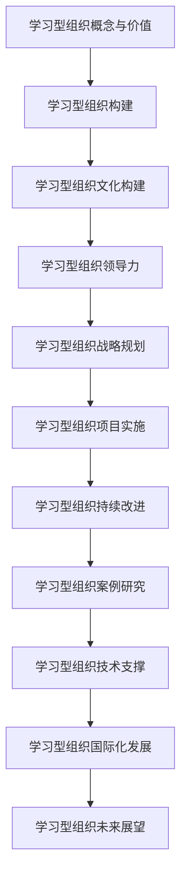

                 

# 《学习型组织：创造持续进步的环境》

> 关键词：学习型组织、持续进步、组织文化、领导力、战略规划、案例研究、未来趋势

> 摘要：本文从IT领域的角度，深入探讨学习型组织的概念、价值、构建方法以及实践应用，通过案例研究和未来展望，为组织持续进步提供策略和参考。

## 《学习型组织：创造持续进步的环境》目录大纲

## 第一部分：理解学习型组织

### 第1章：学习型组织的概念与价值

#### 1.1 学习型组织的定义

#### 1.2 学习型组织与传统组织对比

#### 1.3 学习型组织的关键特征

#### 1.4 学习型组织的重要价值

### 第2章：学习型组织的构建

#### 2.1 建立共同愿景

#### 2.2 识别核心问题

#### 2.3 建立团队学习机制

#### 2.4 实现个人 mastery 学习

### 第3章：学习型组织的文化构建

#### 3.1 学习型组织文化的要素

#### 3.2 建立学习型组织文化的步骤

#### 3.3 提升学习型组织文化的策略

### 第4章：学习型组织的领导力

#### 4.1 领导者在学习型组织中的角色

#### 4.2 领导力发展与团队学习

#### 4.3 领导力的自我提升策略

## 第二部分：实践学习型组织

### 第5章：学习型组织的战略规划

#### 5.1 学习型组织的战略规划模型

#### 5.2 制定有效的学习型组织战略

#### 5.3 实施学习型组织战略的步骤

### 第6章：学习型组织的项目实施

#### 6.1 项目管理的核心原则

#### 6.2 学习型组织项目实施的策略

#### 6.3 项目风险管理

### 第7章：学习型组织的持续改进

#### 7.1 持续改进的模型与方法

#### 7.2 学习型组织的绩效评估

#### 7.3 确保持续改进的实践策略

### 第8章：学习型组织的案例研究

#### 8.1 国际知名企业的学习型组织实践

#### 8.2 我国企业的学习型组织实践

#### 8.3 学习型组织实践的启示与借鉴

## 第三部分：学习型组织的未来趋势

### 第9章：学习型组织的技术支撑

#### 9.1 人工智能与学习型组织

#### 9.2 大数据与学习型组织

#### 9.3 学习型组织的技术发展趋势

### 第10章：学习型组织的国际化发展

#### 10.1 国际化背景下的学习型组织

#### 10.2 跨文化学习型组织的挑战与机遇

#### 10.3 学习型组织的全球化战略

### 第11章：学习型组织的未来展望

#### 11.1 学习型组织的未来发展趋势

#### 11.2 学习型组织对企业的影响

#### 11.3 学习型组织对社会的影响

## 附录

### 附录A：学习型组织相关资源与工具

#### A.1 学习型组织的相关书籍

#### A.2 学习型组织的在线资源

#### A.3 学习型组织的实用工具

### 附录B：学习型组织实践指南

#### B.1 实践步骤与建议

#### B.2 成功案例分析

#### B.3 实践中常见问题的解决策略

### Mermaid 流程图



### 核心算法原理讲解伪代码

#### 伪代码：建立学习型组织文化

```python
def build_organizational_culture():
    # 步骤1：定义组织价值观
    values = ["诚信", "创新", "协作", "共赢"]

    # 步骤2：宣传组织价值观
    for value in values:
        promote_value(value)

    # 步骤3：创建学习型团队
    team = create_learning_team()

    # 步骤4：实施团队学习计划
    for member in team:
        implement_learning_plan(member)

    # 步骤5：评估组织文化
    culture_evaluation = evaluate_culture()

    # 步骤6：持续优化文化
    if not culture_evaluation:
        optimize_culture()

# 函数：宣传组织价值观
def promote_value(value):
    # 宣传价值观的具体实现
    print(f"宣传组织价值观：{value}")

# 函数：创建学习型团队
def create_learning_team():
    # 创建学习型团队的具体实现
    return ["团队成员1", "团队成员2", "团队成员3"]

# 函数：实施学习计划
def implement_learning_plan(member):
    # 实施学习计划的具体实现
    print(f"{member}正在实施学习计划")

# 函数：评估组织文化
def evaluate_culture():
    # 评估组织文化的具体实现
    return True

# 函数：优化组织文化
def optimize_culture():
    # 优化组织文化的具体实现
    print("正在优化组织文化")
```

### 数学模型和数学公式讲解

#### 模型：学习型组织绩效评估模型

$$
绩效评估 = f(学习效果, 团队协作, 创新能力)
$$

#### 变量定义：

- 学习效果：评估个人和团队的学习成效，通常用完成学习任务的质量和数量来衡量。
- 团队协作：评估团队的合作精神和协作效果，包括沟通效率、团队目标和任务的实现度。
- 创新能力：评估组织在解决新问题和开发新产品方面的创新能力。

#### 举例说明：

假设有一个学习型组织，其绩效评估如下：

- 学习效果：90%
- 团队协作：85%
- 创新能力：80%

则组织的绩效评估得分为：

$$
绩效评估 = f(90\%, 85\%, 80\%) = 0.4 \times 90\% + 0.3 \times 85\% + 0.3 \times 80\% = 87\%
$$

### 项目实战

#### 实战：实施学习型组织文化建设

##### 开发环境搭建

- 操作系统：Windows 10
- 编程语言：Python 3.8
- 库：Numpy, Pandas, Matplotlib

##### 源代码实现

```python
import numpy as np
import pandas as pd
import matplotlib.pyplot as plt

# 步骤1：定义组织价值观
values = ["诚信", "创新", "协作", "共赢"]

# 步骤2：宣传组织价值观
def promote_value(value):
    print(f"宣传组织价值观：{value}")

# 步骤3：创建学习型团队
def create_learning_team():
    team_members = ["张三", "李四", "王五"]
    return team_members

# 步骤4：实施学习计划
def implement_learning_plan(member):
    print(f"{member}正在实施学习计划")

# 步骤5：评估组织文化
def evaluate_culture():
    culture_score = 0.5  # 假设当前文化评分
    if culture_score > 0.8:
        return True
    else:
        return False

# 步骤6：优化组织文化
def optimize_culture():
    print("正在优化组织文化")

# 主程序
if __name__ == "__main__":
    # 宣传组织价值观
    for value in values:
        promote_value(value)

    # 创建学习型团队
    team_members = create_learning_team()

    # 实施学习计划
    for member in team_members:
        implement_learning_plan(member)

    # 评估组织文化
    if evaluate_culture():
        print("组织文化评估合格")
    else:
        print("组织文化评估不合格，需要优化")

    # 优化组织文化
    optimize_culture()
```

##### 代码解读与分析

- 该代码首先定义了组织价值观，并通过函数 `promote_value` 进行宣传。
- 通过函数 `create_learning_team` 创建了一个学习型团队，并使用函数 `implement_learning_plan` 实施学习计划。
- 使用函数 `evaluate_culture` 对组织文化进行评估，如果评估合格，则打印相关消息；如果不合格，则打印需要优化的消息。
- 最后，通过函数 `optimize_culture` 对组织文化进行优化。

该代码提供了一个简单的学习型组织文化建设流程，可以在此基础上进行扩展和改进，以适应不同组织的具体需求。

## 第一部分：理解学习型组织

### 第1章：学习型组织的概念与价值

#### 1.1 学习型组织的定义

学习型组织是指一种以学习为核心、不断适应变化、追求持续进步的组织形态。它不仅仅关注短期的绩效，更注重组织成员的持续学习和成长，以应对快速变化的市场环境和挑战。学习型组织的核心理念是“学习第一”，即组织的一切活动都围绕学习展开，通过不断学习和实践来提高组织的整体能力。

#### 1.2 学习型组织与传统组织对比

传统组织通常以任务和目标为导向，强调效率和执行力。而学习型组织则更加关注组织的持续学习和创新能力。以下是学习型组织与传统组织的对比：

| 对比项         | 传统组织                    | 学习型组织                    |
| -------------- | --------------------------- | ---------------------------- |
| 目标           | 短期目标和绩效指标           | 持续学习和长期发展           |
| 文化           | 命令式和控制式              | 自主学习、合作与共享          |
| 组织结构       | 领导者主导、等级分明         | 平衡型网络结构、扁平化组织     |
| 决策方式       | 集权决策、迅速执行           | 分权决策、快速响应            |
| 知识管理       | 知识传递、文档化管理         | 知识共享、协同创新            |

#### 1.3 学习型组织的关键特征

学习型组织具有以下关键特征：

1. **共同愿景**：组织成员共同拥有清晰的愿景和目标，以此为导向进行工作。
2. **团队学习**：鼓励团队成员之间的交流和合作，共同学习和成长。
3. **个人 mastery 学习**：鼓励个人不断追求专业领域的精通和卓越。
4. **系统思考**：关注组织内部的系统性和整体性，从全局角度看待问题。
5. **组织学习**：将学习作为一种组织能力，将学习成果转化为实际效益。

#### 1.4 学习型组织的重要价值

学习型组织具有以下重要价值：

1. **提高组织适应能力**：学习型组织能够快速适应外部环境的变化，保持竞争优势。
2. **增强创新能力**：通过持续学习和知识共享，组织能够不断创新，推动发展。
3. **提升员工满意度**：学习型组织为员工提供成长和发展的机会，提高员工的工作满意度和忠诚度。
4. **降低管理成本**：学习型组织通过扁平化和分权化，降低管理成本，提高组织效率。

### 第2章：学习型组织的构建

#### 2.1 建立共同愿景

建立共同愿景是学习型组织构建的第一步。共同愿景是组织成员共同追求的目标和方向，是组织前进的动力源泉。以下是建立共同愿景的方法：

1. **明确愿景**：组织领导者需要明确组织的长期目标和愿景，并将其传达给所有成员。
2. **沟通与共识**：通过沟通和讨论，让组织成员共同参与愿景的制定和修改，达成共识。
3. **愿景可视化**：将愿景转化为具体的图景或故事，使成员能够清晰地理解愿景的内涵。
4. **持续更新**：随着外部环境的变化，组织需要不断更新愿景，以保持其相关性和前瞻性。

#### 2.2 识别核心问题

识别核心问题是学习型组织构建的关键环节。只有明确组织面临的核心问题，才能有针对性地制定解决方案。以下是识别核心问题的方法：

1. **内部调研**：通过内部调查、访谈和反馈，了解组织内部存在的问题和挑战。
2. **外部分析**：关注市场环境、竞争对手和行业趋势，分析外部环境对组织的影响。
3. **数据驱动**：利用数据分析工具，对组织运营数据进行分析，找出问题所在。
4. **专家咨询**：邀请行业专家和管理顾问，提供专业的分析和建议。

#### 2.3 建立团队学习机制

建立团队学习机制是学习型组织的重要保障。团队学习机制能够促进团队成员之间的交流和合作，提高整体学习效果。以下是建立团队学习机制的方法：

1. **团队学习计划**：制定详细的团队学习计划，明确学习目标、内容和方法。
2. **学习分享会**：定期举办学习分享会，让团队成员分享学习心得和经验。
3. **内部培训**：组织内部培训课程，提高团队成员的专业知识和技能。
4. **学习资源**：提供丰富的学习资源，如书籍、在线课程和专家讲座。
5. **反馈机制**：建立反馈机制，对团队学习效果进行评估和改进。

#### 2.4 实现个人 mastery 学习

实现个人 mastery 学习是学习型组织的核心目标之一。个人 mastery 学习能够提高员工的专业水平和创新能力，为组织发展提供动力。以下是实现个人 mastery 学习的方法：

1. **明确学习目标**：员工需要明确自己的学习目标，制定个人学习计划。
2. **专业发展**：鼓励员工参加专业培训和认证，提升专业技能。
3. **实践应用**：将所学知识应用于实际工作中，提高实践能力。
4. **反思与总结**：通过反思和总结，不断优化学习方法和策略。
5. **导师指导**：为员工提供导师指导，帮助其解决专业问题和发展瓶颈。

### 第3章：学习型组织的文化构建

#### 3.1 学习型组织文化的要素

学习型组织文化是指一种以学习为核心的组织氛围和文化价值观。它包括以下要素：

1. **共同价值观**：组织成员共同认可的价值观，如诚信、创新、协作和共赢。
2. **学习氛围**：鼓励学习和分享的组织氛围，如开放、包容和激励。
3. **知识共享**：组织内部的知识共享机制和平台，如内部论坛、知识库和专家讲座。
4. **自主管理**：员工在组织中的自主性和责任感，如自主规划工作和自我评估。
5. **持续改进**：组织持续改进和创新的精神，如不断尝试和优化。

#### 3.2 建立学习型组织文化的步骤

建立学习型组织文化需要逐步进行，以下是一些建议的步骤：

1. **领导层倡导**：组织领导者需要率先垂范，积极倡导和推动学习型组织文化的建设。
2. **员工参与**：鼓励员工参与学习型组织文化的建设和实践，提高其参与感和认同感。
3. **制度建设**：建立和完善学习型组织的制度，如学习计划、绩效评估和知识管理等。
4. **文化宣传**：通过内部宣传和外部交流，提高学习型组织文化的知名度和影响力。
5. **持续优化**：定期评估和改进学习型组织文化，以适应组织发展和外部环境的变化。

#### 3.3 提升学习型组织文化的策略

提升学习型组织文化需要采取一系列策略，以下是一些建议：

1. **培训与发展**：为员工提供培训和发展机会，提高其专业能力和学习意愿。
2. **激励机制**：建立激励机制，鼓励员工积极参与学习和知识共享。
3. **团队建设**：加强团队建设，提高团队成员的凝聚力和合作精神。
4. **领导力发展**：培养领导者的学习能力和领导力，以引领组织文化的发展。
5. **技术创新**：利用新技术和创新工具，提高学习和知识管理的效率。

### 第4章：学习型组织的领导力

#### 4.1 领导者在学习型组织中的角色

领导者在学习型组织中的角色至关重要。他们不仅要推动组织的学习和创新，还要为组织成员提供支持和指导。以下是领导者在学习型组织中的角色：

1. **学习榜样**：领导者需要以身作则，积极参与学习和知识共享，成为组织的学习榜样。
2. **文化塑造者**：领导者需要塑造和维护学习型组织文化，推动组织成员共同追求学习和发展。
3. **资源提供者**：领导者需要为组织提供学习资源和支持，如培训、知识库和技术工具。
4. **激励者**：领导者需要激励组织成员积极参与学习和创新，提高其学习动力和创造力。
5. **变革推动者**：领导者需要推动组织变革，鼓励组织成员适应变化和创新。

#### 4.2 领导力发展与团队学习

领导力发展与团队学习密切相关。领导者需要不断提升自己的领导力，同时促进团队成员的学习和发展。以下是领导力发展与团队学习的建议：

1. **持续学习**：领导者需要不断学习新知识和技能，提高自己的专业能力和领导水平。
2. **倾听与沟通**：领导者需要倾听团队成员的意见和建议，建立良好的沟通机制，促进团队学习。
3. **授权与支持**：领导者需要授权团队成员，给予其足够的自由度和资源，支持其学习和创新。
4. **反馈与辅导**：领导者需要提供及时和有效的反馈和辅导，帮助团队成员解决问题和提升能力。
5. **团队建设**：领导者需要加强团队建设，提高团队成员的凝聚力和合作精神，促进团队学习。

#### 4.3 领导力的自我提升策略

领导者需要不断自我提升，以适应不断变化的外部环境和组织需求。以下是领导力自我提升的策略：

1. **反思与总结**：领导者需要定期反思和总结自己的领导行为和效果，发现问题并改进。
2. **学习与成长**：领导者需要积极参与各类培训和课程，学习新知识和技能，不断提升自己的专业能力和领导水平。
3. **拓宽视野**：领导者需要关注行业动态和外部环境的变化，拓宽自己的视野和思维方式。
4. **人际交往**：领导者需要加强与内外部人员的交流和合作，建立良好的人际关系网络。
5. **心理健康**：领导者需要关注自己的心理健康，保持积极的心态和情绪，应对工作和生活的压力。

## 第二部分：实践学习型组织

### 第5章：学习型组织的战略规划

#### 5.1 学习型组织的战略规划模型

学习型组织的战略规划模型是一种基于组织学习和持续改进的战略规划方法。它包括以下步骤：

1. **确定愿景和目标**：明确组织的长期愿景和短期目标，确保组织成员对目标有共同的理解和认同。
2. **分析内外部环境**：分析组织的外部环境（如市场、竞争、技术等）和内部环境（如资源、能力、文化等），了解组织面临的挑战和机遇。
3. **制定战略方案**：根据内外部环境分析，制定具体的战略方案，包括创新方向、资源配置、市场拓展等。
4. **实施与监控**：将战略方案转化为具体的行动和计划，并对其进行监控和评估，确保战略的有效实施。
5. **持续改进**：根据实施过程中的反馈和评估结果，不断调整和优化战略方案，以适应组织发展和外部环境的变化。

#### 5.2 制定有效的学习型组织战略

制定有效的学习型组织战略需要考虑以下关键因素：

1. **适应性**：战略应具备足够的灵活性和适应性，以应对快速变化的市场环境和外部挑战。
2. **创新性**：战略应注重创新，鼓励组织成员积极尝试新方法、新理念和新技术。
3. **可持续性**：战略应具备长期可持续性，确保组织能够在未来持续发展和进步。
4. **全员参与**：战略制定应充分调动组织成员的积极性和创造力，确保全体成员对战略的认同和支持。
5. **资源保障**：战略应确保有足够的资源（如人力、财力、技术等）支持战略的实施和持续改进。

#### 5.3 实施学习型组织战略的步骤

实施学习型组织战略需要遵循以下步骤：

1. **明确责任和任务**：根据战略方案，明确各部门和个人的责任和任务，确保战略目标的分解和落实。
2. **制定实施计划**：制定详细的实施计划，包括时间表、里程碑、资源和风险评估等。
3. **动员和沟通**：通过内部沟通和动员，让组织成员了解战略目标和实施计划，激发其参与和投入的积极性。
4. **执行和监控**：按照实施计划执行战略方案，并对执行过程进行监控和评估，确保战略的有效实施。
5. **反馈和调整**：根据实施过程中的反馈和评估结果，及时调整和优化战略方案，以适应组织发展和外部环境的变化。

### 第6章：学习型组织的项目实施

#### 6.1 项目管理的核心原则

学习型组织的项目实施需要遵循以下核心原则：

1. **目标导向**：明确项目的目标和预期成果，确保项目实施过程中始终保持目标的聚焦和追求。
2. **过程管理**：对项目实施过程进行全程管理，确保项目按照计划进行，及时发现和解决问题。
3. **团队协作**：建立有效的团队协作机制，充分发挥团队成员的主动性和创造力，提高项目的整体效率。
4. **资源优化**：合理配置项目资源，确保项目实施的顺利推进，提高资源利用效率。
5. **风险管理**：对项目风险进行识别、评估和控制，确保项目实施过程中的风险得到有效管理和应对。

#### 6.2 学习型组织项目实施的策略

学习型组织项目实施的策略包括以下几个方面：

1. **创新驱动**：鼓励项目团队积极尝试新方法、新技术和新理念，提高项目的创新性和竞争力。
2. **知识共享**：建立项目知识共享机制，促进项目团队之间的知识交流和学习，提高项目的整体效能。
3. **持续改进**：在项目实施过程中，不断对项目过程和成果进行反思和改进，提高项目的质量和效率。
4. **全员参与**：充分调动项目团队成员的积极性和创造力，确保项目实施的全面性和协同性。
5. **灵活应对**：根据项目实施过程中的反馈和评估结果，灵活调整项目计划和策略，确保项目的成功实施。

#### 6.3 项目风险管理

项目风险管理是学习型组织项目实施的重要环节。以下是一些常见的项目风险和相应的应对策略：

1. **时间风险**：项目进度可能受到各种因素的影响，导致延期交付。应对策略包括合理规划时间表、加强项目监控和及时调整计划。
2. **预算风险**：项目预算可能受到超支或资金短缺的影响。应对策略包括合理预算、加强财务监控和寻求额外资源支持。
3. **技术风险**：项目技术可能面临不可预见的挑战，导致项目失败。应对策略包括技术评估、引入外部技术支持和建立应急计划。
4. **人员风险**：项目团队可能面临人员流失、技能不足或沟通不畅等问题。应对策略包括人员培训、加强团队建设和优化沟通机制。
5. **市场风险**：项目成果可能受到市场变化的影响，导致市场竞争力下降。应对策略包括市场调研、产品创新和快速响应市场变化。

### 第7章：学习型组织的持续改进

#### 7.1 持续改进的模型与方法

学习型组织的持续改进需要采用系统化的模型和方法。以下是一些常见的持续改进模型和方法：

1. **PDCA循环**：PDCA循环（计划-执行-检查-行动）是一种经典的持续改进模型，通过不断循环和迭代，实现持续改进。
2. **六西格玛**：六西格玛是一种以统计数据为基础的质量管理方法，通过减少过程变异和缺陷，提高产品和服务的质量。
3. **精益管理**：精益管理是一种以客户需求为导向的管理方法，通过消除浪费和优化流程，提高组织效率和质量。
4. **目标管理**：目标管理是一种以目标为导向的管理方法，通过明确目标和制定行动计划，实现组织的目标和持续改进。

#### 7.2 学习型组织的绩效评估

学习型组织的绩效评估是对组织成员和团队绩效的评估，旨在激励成员的积极性和创造力，推动组织的持续改进。以下是一些常见的绩效评估方法：

1. **KPI考核**：KPI（关键绩效指标）考核是通过设定关键绩效指标，评估成员和团队的工作绩效。
2. **360度评估**：360度评估是一种全面评估方法，通过收集上级、同事、下属和客户的反馈，评估成员的综合表现。
3. **平衡计分卡**：平衡计分卡是一种综合考虑财务、客户、内部流程和学习与成长四个维度的绩效评估方法。
4. **自我评估**：自我评估是成员根据自身工作表现进行自我评价，促进自我反思和自我提升。

#### 7.3 确保持续改进的实践策略

确保持续改进的实践策略包括以下几个方面：

1. **建立改进机制**：建立持续改进的机制，确保改进活动能够有序进行，并形成持续改进的文化。
2. **建立反馈机制**：建立有效的反馈机制，收集和分析成员和团队的反馈意见，及时发现问题并进行改进。
3. **培养改进意识**：通过培训和宣传，培养成员的改进意识和能力，使其积极参与持续改进活动。
4. **提供改进资源**：为成员提供必要的改进资源和工具，如培训、技术支持和改进方案等。
5. **奖励改进成果**：对在持续改进活动中取得显著成果的成员和团队给予奖励和认可，激发其改进积极性。

### 第8章：学习型组织的案例研究

#### 8.1 国际知名企业的学习型组织实践

国际知名企业如谷歌、亚马逊和苹果等，都成功实践了学习型组织的方法，取得了显著的成效。以下是一些案例：

1. **谷歌**：谷歌通过内部创新实验室和员工自我管理，鼓励员工自由探索和尝试新项目，推动了公司的持续创新和发展。
2. **亚马逊**：亚马逊通过“六西格玛”质量管理方法和持续改进活动，提高了产品和服务的质量，增强了市场竞争力。
3. **苹果**：苹果公司通过持续的学习和知识共享，保持了其技术领先地位，不断创新推出引领市场的产品。

#### 8.2 我国企业的学习型组织实践

我国企业如华为、阿里巴巴和腾讯等，也在学习型组织方面取得了显著成效。以下是一些案例：

1. **华为**：华为公司通过“师徒制”和内部培训，提高员工的专业技能和团队协作能力，推动了企业的持续发展。
2. **阿里巴巴**：阿里巴巴通过“互联网+”战略和持续创新，不断拓展新的业务领域，保持了企业的竞争力。
3. **腾讯**：腾讯公司通过“创新孵化器”和内部创业项目，激发了员工的创新热情，推动了公司的多元化发展。

#### 8.3 学习型组织实践的启示与借鉴

从国际知名企业和我国企业的学习型组织实践中，我们可以得到以下启示和借鉴：

1. **领导者的示范作用**：领导者需要以身作则，积极参与学习和创新，成为组织的学习榜样。
2. **持续学习与知识共享**：鼓励组织成员持续学习和知识共享，提高组织的整体学习能力和创新能力。
3. **创新激励机制**：建立有效的创新激励机制，激发员工的创新热情和创造力。
4. **团队协作与协同创新**：加强团队协作和协同创新，提高组织的整体绩效和竞争力。
5. **持续改进与绩效评估**：建立持续改进机制和绩效评估体系，确保组织不断改进和提升。

### 第9章：学习型组织的技术支撑

#### 9.1 人工智能与学习型组织

人工智能技术在学习型组织中具有广泛的应用前景。以下是一些具体的应用场景：

1. **知识管理**：利用人工智能技术，对组织内部的知识进行分类、检索和推荐，提高知识共享和利用效率。
2. **智能推荐系统**：基于用户行为和偏好，为员工推荐相关的学习资源和课程，提高学习效果。
3. **智能助手**：开发智能助手，帮助员工解决问题、提供建议和指导，提高工作效率和学习能力。

#### 9.2 大数据与学习型组织

大数据技术在学习型组织中发挥着重要作用。以下是一些具体的应用场景：

1. **数据分析**：利用大数据技术，对组织内部的数据进行分析和挖掘，发现问题和机遇，为决策提供支持。
2. **预测建模**：基于大数据和人工智能技术，构建预测模型，预测市场趋势和用户需求，指导组织战略制定和产品创新。
3. **智能监控**：利用大数据技术，对组织的运营过程和绩效进行实时监控和预警，确保组织的持续改进和优化。

#### 9.3 学习型组织的技术发展趋势

学习型组织的技术发展趋势主要包括以下几个方面：

1. **人工智能与大数据的融合**：人工智能和大数据技术的融合，将为学习型组织带来更强大的学习能力和决策支持能力。
2. **智能化学习平台**：智能化学习平台将集成多种学习资源和技术工具，提供个性化的学习体验和智能化学习服务。
3. **区块链技术**：区块链技术将用于学习型组织的知识管理和共享，确保知识的安全和可信。
4. **云计算与边缘计算**：云计算和边缘计算将为学习型组织提供高效的计算和存储资源，支持大规模的学习和数据分析。

### 第10章：学习型组织的国际化发展

#### 10.1 国际化背景下的学习型组织

国际化背景下的学习型组织面临着新的机遇和挑战。以下是一些关键因素：

1. **跨文化管理**：国际化学习型组织需要重视跨文化管理，尊重不同文化的差异，促进文化融合和团队协作。
2. **全球协作**：国际化学习型组织需要建立全球协作机制，促进不同国家和地区的团队之间的交流和合作。
3. **国际化战略**：国际化学习型组织需要制定明确的国际化战略，结合全球市场环境和资源，推动组织的国际化发展。

#### 10.2 跨文化学习型组织的挑战与机遇

跨文化学习型组织面临以下挑战和机遇：

1. **挑战**：
   - 文化冲突和沟通障碍
   - 资源分配和决策权的分配
   - 法律法规和商业环境的差异
   - 跨文化团队的协调和合作

2. **机遇**：
   - 拓展国际市场，获取更多资源和客户
   - 丰富组织文化和知识体系，提高创新能力
   - 增强组织的全球竞争力，提升品牌影响力

#### 10.3 学习型组织的全球化战略

学习型组织的全球化战略包括以下几个方面：

1. **本地化与全球化结合**：在保持组织核心价值观和战略一致性的基础上，适应不同国家和地区的文化和市场环境，实现本地化与全球化的平衡。
2. **全球人才管理**：建立全球人才管理体系，吸引、培养和保留国际化人才，提高组织的国际化水平和创新能力。
3. **全球知识共享**：建立全球知识共享平台，促进不同国家和地区团队之间的知识交流和合作，提高组织的整体学习能力和竞争力。
4. **全球业务协同**：通过全球业务协同，优化资源配置和流程，提高组织的全球运营效率和竞争力。

### 第11章：学习型组织的未来展望

#### 11.1 学习型组织的未来发展趋势

学习型组织的未来发展趋势主要包括以下几个方面：

1. **智能化与数字化**：随着人工智能和大数据技术的发展，学习型组织将更加智能化和数字化，提高学习效率和管理水平。
2. **全球化与多元化**：学习型组织将更加注重全球化布局和多元化发展，提升全球竞争力。
3. **个性化和定制化**：学习型组织将更加注重个性化和定制化，满足不同员工和团队的需求。
4. **绿色化和可持续发展**：学习型组织将更加关注绿色化和可持续发展，推动社会责任和环境保护。

#### 11.2 学习型组织对企业的影响

学习型组织对企业的影响主要体现在以下几个方面：

1. **提高企业竞争力**：学习型组织通过持续学习和创新，提高企业的竞争力和市场地位。
2. **优化企业运营**：学习型组织通过优化管理流程和资源配置，提高企业的运营效率和质量。
3. **促进员工成长**：学习型组织为员工提供成长和发展的机会，提高员工的工作满意度和忠诚度。
4. **提升企业品牌价值**：学习型组织通过持续创新和优质服务，提升企业的品牌价值和影响力。

#### 11.3 学习型组织对社会的影响

学习型组织对社会的影响主要体现在以下几个方面：

1. **推动社会进步**：学习型组织通过持续学习和创新，推动社会进步和经济发展。
2. **提升社会素质**：学习型组织通过知识和技能的传播，提升社会成员的整体素质和能力。
3. **促进社会和谐**：学习型组织通过跨文化合作和知识共享，促进社会和谐和文化交流。
4. **推动可持续发展**：学习型组织通过绿色化和可持续发展，推动社会经济的可持续发展。

### 附录A：学习型组织相关资源与工具

#### A.1 学习型组织的相关书籍

1. 《第五项修炼：学习型组织的艺术与实务》 - 彼得·圣吉
2. 《学习型组织行动纲领》 - 彼得·圣吉
3. 《禅与计算机程序设计艺术》 - 克里斯托弗·亚历山大
4. 《创新者的窘境》 - 克莱顿·克里斯滕森

#### A.2 学习型组织的在线资源

1. 学习型组织论坛（http://www.lingx.net/）
2. 学习型组织国际协会（http://www.solworld.org/）
3. 网易云课堂（https://study.163.com/）
4. 知乎（https://www.zhihu.com/）

#### A.3 学习型组织的实用工具

1. 企业微信（https://work.weixin.qq.com/）
2. 知识库（Confluence、Notion）
3. 团队协作工具（Trello、JIRA）
4. 数据分析工具（Tableau、Power BI）

### 附录B：学习型组织实践指南

#### B.1 实践步骤与建议

1. **建立共同愿景**：明确组织的长期愿景和目标，制定具体的实施计划。
2. **识别核心问题**：通过内部调研和外部分析，找出组织面临的关键问题。
3. **建立团队学习机制**：制定团队学习计划，组织内部培训和学习分享会。
4. **实现个人 mastery 学习**：为员工提供学习资源和指导，鼓励其自主学习和成长。
5. **构建学习型组织文化**：通过制度建设、文化宣传和激励机制，培养和提升组织文化。
6. **实施学习型组织战略**：制定具体的战略方案，明确责任和任务，确保战略的有效实施。
7. **项目实施与管理**：遵循项目管理原则和策略，确保项目顺利实施和持续改进。
8. **绩效评估与改进**：建立绩效评估体系，对组织成员和团队进行评估和反馈，推动持续改进。

#### B.2 成功案例分析

1. **华为的学习型组织实践**：华为通过“师徒制”和内部培训，提高员工的专业技能和团队协作能力，推动了企业的持续发展。
2. **阿里巴巴的“互联网+”战略**：阿里巴巴通过“互联网+”战略和持续创新，不断拓展新的业务领域，保持了企业的竞争力。
3. **苹果的持续创新**：苹果公司通过持续的学习和知识共享，保持了其技术领先地位，不断创新推出引领市场的产品。

#### B.3 实践中常见问题的解决策略

1. **组织文化难以改变**：通过领导层的倡导和员工的参与，逐步推动组织文化的变革，建立持续改进的文化氛围。
2. **员工积极性不高**：通过激励机制和培训机会，提高员工的学习兴趣和参与度，激发其积极性和创造力。
3. **知识共享不畅**：建立知识共享平台和机制，加强团队成员之间的沟通和协作，提高知识共享的效率。
4. **项目管理难度大**：通过项目管理的核心原则和策略，明确项目目标和责任，加强项目监控和评估，确保项目的顺利实施。

## 总结

学习型组织是一种以学习为核心、追求持续进步的组织形态。通过理解学习型组织的概念与价值，构建学习型组织，实践学习型组织的方法和策略，以及展望学习型组织的未来趋势，我们可以看到学习型组织在提高组织竞争力、推动企业发展和促进社会进步方面的重要作用。

作为IT领域的专业人士，我们应当积极倡导和实践学习型组织理念，推动组织的持续进步和创新。通过本文的讨论，我们希望为您提供了有关学习型组织的全面理解，以及实施学习型组织的具体方法和策略。

让我们共同努力，打造一个充满学习热情和创新活力的学习型组织，为组织的持续进步和社会的发展贡献自己的力量。

### 作者信息

作者：AI天才研究院/AI Genius Institute & 禅与计算机程序设计艺术 /Zen And The Art of Computer Programming

AI天才研究院（AI Genius Institute）致力于推动人工智能领域的研究和创新，培养新一代人工智能技术人才。我们的愿景是通过人工智能技术，推动人类社会的进步和发展。禅与计算机程序设计艺术（Zen And The Art of Computer Programming）是一本经典的计算机科学书籍，作者Donald E. Knuth以其深入浅出的阐述和独特的方法，对计算机科学产生了深远的影响。这两本书籍共同体现了作者对计算机科学和人工智能领域的深刻理解和独特见解。

