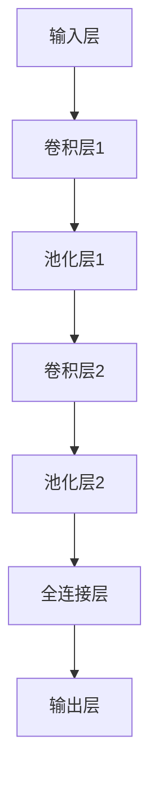

                 

# 《学术界在基础模型中的作用》

## 关键词
基础模型、学术界、人工智能、神经网络、深度学习、自然语言处理、计算机视觉

## 摘要
本文探讨了学术界在基础模型研究与发展中的重要作用。从基础模型的概念、核心算法到实际应用，学术界不仅在理论研究上有着突出的贡献，还在推动技术创新和产业应用中扮演着关键角色。通过分析学术界与产业界的互动，本文进一步探讨了未来基础模型研究的趋势和挑战，为学术界和产业界提供了有益的思考方向。

## 目录大纲

### 第一部分：学术界的角色与影响力

#### 1. 学术界与基础模型的关系
- **1.1 学术界在基础模型研究中的作用**
  - **1.1.1 基础模型研究的起源与发展**
  - **1.1.2 学术界对基础模型技术的贡献**
  - **1.1.3 学术界在推动基础模型应用中的角色**
- **1.2 学术界与产业界的互动**
  - **1.2.1 学术成果向产业界的转移**
  - **1.2.2 产业需求对学术界研究的引导**
  - **1.2.3 产学研合作模式探讨**

### 第二部分：基础模型的核心概念与架构

#### 2.1 基础模型的核心概念
- **2.1.1 基础模型的基本定义**
- **2.1.2 基础模型的重要性**
- **2.1.3 基础模型的概念与范围**

#### 2.2 基础模型的架构设计
- **2.2.1 基础模型的常见架构**
- **2.2.2 架构设计的考量因素**
- **2.2.3 Mermaid流程图：基础模型架构图**

#### 3.1 神经网络与深度学习基础
- **3.1.1 神经网络的基本原理**
- **3.1.2 深度学习的发展历程**
- **3.1.3 深度学习的算法框架**
- **伪代码：神经网络训练过程**

#### 3.2 自然语言处理技术
- **3.2.1 词嵌入技术**
- **3.2.2 序列模型与注意力机制**
- **3.2.3 转换器架构详解**

#### 4.1 线性代数基础
- **4.1.1 矩阵与向量操作**
- **4.1.2 线性方程组求解**
- **$$A\mathbf{x}=\mathbf{b}$$**

#### 4.2 最优化理论与算法
- **4.2.1 梯度下降法**
- **4.2.2 随机梯度下降法**
- **4.2.3 算法选择与优化策略**

#### 4.3 概率论与信息论基础
- **4.3.1 概率分布函数**
- **4.3.2 信息熵与相对熵**

### 第三部分：基础模型的实际应用与案例分析

#### 5.1 基础模型在自然语言处理中的应用
- **5.1.1 语言模型的训练方法**
- **5.1.2 语言模型在文本生成中的应用**
- **5.1.3 语言模型评估与优化**

#### 5.2 基础模型在计算机视觉中的应用
- **5.2.1 卷积神经网络基础**
- **5.2.2 图像分类算法实战**
- **5.2.3 图像分类性能评估方法**

#### 5.3 跨领域基础模型应用
- **5.3.1 多模态数据融合方法**
- **5.3.2 多模态学习的实际案例**
- **5.3.3 多模态学习的挑战与未来方向**

### 第四部分：未来展望与趋势

#### 8.1 大模型与强人工智能
- **8.1.1 大模型的技术突破**
- **8.1.2 强人工智能的挑战与前景**
- **8.1.3 大模型在科研与产业中的应用**

#### 8.2 开放式研究与共享平台
- **8.2.1 学术界在开源平台的作用**
- **8.2.2 知识共享与技术创新**
- **8.2.3 开源模型的安全性挑战**

#### 9. 学术界在基础模型研究中的未来角色
- **9.1 学术界在基础模型技术标准化中的作用**
- **9.2 学术界在培养人才中的作用**
- **9.3 学术界在推动社会责任与伦理中的作用**

### 附录

#### 附录A：基础模型研究资源
- **A.1 开源工具与框架**
- **A.2 学术会议与期刊**
- **A.3 在线课程与培训资源**

#### 附录B：参考文献

---

接下来，我们将按照上述目录大纲逐步展开详细内容，深入探讨学术界在基础模型研究中的作用。

---

## 第一部分：学术界的角色与影响力

### 1. 学术界与基础模型的关系

#### 1.1 学术界在基础模型研究中的作用

学术界在基础模型研究中扮演着至关重要的角色。从基础模型研究的起源与发展，到对基础模型技术的贡献，学术界都在不断推动这一领域的创新与进步。

##### 1.1.1 基础模型研究的起源与发展

基础模型研究的起源可以追溯到20世纪50年代，当时人工智能（AI）的概念刚刚诞生。早期的AI研究主要集中在符号主义方法上，通过构建知识库和推理系统来模拟人类智能。然而，这种方法在处理大规模数据和复杂任务时表现不佳，导致AI研究在20世纪80年代遭遇了第一次寒冬。

到了20世纪90年代，神经网络和深度学习逐渐崭露头角。1998年，Geoffrey Hinton等人提出了深度信念网络（DBN），标志着深度学习技术的复兴。随后，2006年，Hinton再次提出了深度神经网络（DNN）的训练方法——贪婪层按顺序训练（greedy layer-by-layer training），为深度学习的广泛应用奠定了基础。

##### 1.1.2 学术界对基础模型技术的贡献

学术界在基础模型技术上的贡献是多方面的。首先，他们提出了许多关键算法，如反向传播算法（backpropagation）、卷积神经网络（CNN）、循环神经网络（RNN）、长短期记忆网络（LSTM）等。这些算法不仅在理论上具有重要意义，还在实际应用中展现了出色的性能。

其次，学术界在基础模型的理论研究方面也取得了显著进展。例如，深度学习的优化理论、正则化技术、生成对抗网络（GAN）等都是学术界的重要研究成果。这些理论成果不仅丰富了基础模型的理论体系，还为实际应用提供了指导。

此外，学术界还推动了基础模型技术的开源和共享。许多研究机构和大学发布了自己的开源框架和工具，如TensorFlow、PyTorch、MXNet等。这些开源项目为全球开发者提供了一个高效、易用的基础模型开发平台，极大地推动了基础模型技术的普及和应用。

##### 1.1.3 学术界在推动基础模型应用中的角色

学术界不仅在基础模型的理论研究上发挥着重要作用，还在推动基础模型应用中发挥着关键作用。首先，学术界通过研究成果和开源项目，为产业界提供了强大的技术支持。许多企业的AI应用都是基于学术界的研究成果开发的，如自动驾驶、智能语音助手、图像识别等。

其次，学术界通过举办学术会议和研讨会，为研究人员提供了一个交流研究成果、探讨未来发展趋势的平台。这些会议和研讨会不仅促进了学术交流，还促进了产学研的合作，推动了基础模型技术的创新与应用。

最后，学术界还在培养人才方面发挥着重要作用。通过研究生教育和科研项目，学术界为产业界输送了大量优秀的技术人才。这些人才在基础模型研究、开发和应用中发挥了重要作用，为产业的持续发展提供了强大的人才支持。

### 1.2 学术界与产业界的互动

学术界与产业界的互动是基础模型技术发展的重要推动力。学术界和产业界之间的合作不仅促进了技术创新，还推动了产业应用的发展。

##### 1.2.1 学术成果向产业界的转移

学术界的研究成果向产业界的转移是学术界与产业界互动的重要形式。学术界通过发表论文、发布开源框架和工具，将研究成果分享给产业界。产业界则利用这些研究成果，开发出具有实际应用价值的AI产品和服务。

例如，深度学习技术在图像识别、自然语言处理、语音识别等领域的广泛应用，就是学术界研究成果向产业界转移的成功案例。这些应用不仅提升了产业界的技术水平，还为学术界提供了丰富的应用场景，推动了基础模型技术的持续发展。

##### 1.2.2 产业需求对学术界研究的引导

产业界对基础模型技术的需求，也在一定程度上引导了学术界的研究方向。产业界在应用基础模型技术时，会面临各种挑战和问题，这些问题反过来又成为学术界研究的重要方向。

例如，在自动驾驶领域，产业界对高精度地图、实时感知和决策算法的需求，推动了学术界在深度学习、计算机视觉、机器人技术等领域的深入研究。这些研究成果不仅解决了产业界的实际问题，还为学术界提供了丰富的理论成果。

##### 1.2.3 产学研合作模式探讨

学术界与产业界的合作，不仅可以实现技术创新和应用落地，还可以推动产业结构的升级和转型。产学研合作模式是学术界与产业界互动的重要形式，也是基础模型技术发展的重要推动力。

产学研合作模式可以分为以下几个阶段：

1. **项目合作阶段**：学术界和产业界针对特定项目展开合作，共同研究解决实际问题。这种合作形式通常以项目组的形式进行，学术界提供技术支持，产业界提供实际应用场景。

2. **成果共享阶段**：学术界和产业界共同完成项目后，将研究成果进行分享和交流。学术界通过发表论文、发布开源代码等形式，将研究成果分享给全球开发者。产业界则利用这些研究成果，开发出具有市场竞争力的人工智能产品和服务。

3. **产业链协同阶段**：学术界和产业界在完成项目合作和成果共享后，进一步深化合作，形成产业链协同。学术界和产业界共同构建生态系统，推动基础模型技术的创新和应用。

4. **战略联盟阶段**：学术界和产业界在产业链协同的基础上，建立战略联盟，共同推动基础模型技术的发展。这种战略联盟可以促进资源整合，提升整体竞争力，为产业的持续发展提供强大支持。

总之，学术界在基础模型研究中的作用是不可或缺的。从基础模型技术的理论研究、算法创新，到实际应用和产业推广，学术界都在发挥着关键作用。学术界与产业界的互动，不仅促进了基础模型技术的创新，还为产业的持续发展提供了强大动力。未来，学术界和产业界将继续携手合作，推动基础模型技术的持续发展和广泛应用。

---

## 第二部分：基础模型的核心概念与架构

### 2.1 基础模型的核心概念

#### 2.1.1 基础模型的基本定义

基础模型（Fundamental Model）是指一种在人工智能领域中被广泛应用的核心模型，它通常用于解决各种复杂的问题，包括图像识别、自然语言处理、语音识别等。基础模型的核心在于其能够从大量数据中学习到有用的特征和规律，并能够将这些特征和规律应用于实际问题中。

在人工智能的早期阶段，基础模型主要是指一些简单的算法和规则，如决策树、朴素贝叶斯等。然而，随着深度学习技术的发展，基础模型的概念逐渐演变为复杂的多层神经网络结构。这些神经网络结构能够通过多层非线性变换，从数据中提取出更高层次的特征，从而实现更准确的预测和分类。

#### 2.1.2 基础模型的重要性

基础模型在人工智能领域中具有重要地位，原因如下：

1. **核心算法的支撑**：基础模型是实现人工智能应用的核心，各种复杂任务如图像识别、自然语言处理、语音识别等都需要依赖基础模型。

2. **算法创新的源泉**：基础模型的研究推动了算法的创新和发展。例如，深度学习的兴起就是基于对基础模型（如神经网络）的改进和优化。

3. **技术的普及与应用**：基础模型技术的普及和应用，使得人工智能技术能够渗透到各个行业，如医疗、金融、教育、制造业等，推动了产业的智能化升级。

4. **学术研究的推动力**：基础模型的研究不仅吸引了大量学术界的关注，也推动了计算机科学、数学、统计学等多个领域的发展。

#### 2.1.3 基础模型的概念与范围

基础模型的概念和范围在不同领域和不同应用中有所不同，但通常包括以下几个关键组成部分：

1. **数据预处理**：基础模型需要从原始数据中提取有用信息，这通常涉及到数据清洗、数据增强、特征提取等步骤。

2. **模型结构**：基础模型通常由多层神经网络组成，每层神经网络都能够对输入数据进行处理和变换，从而提取出更高层次的特征。

3. **优化算法**：基础模型需要通过优化算法来调整模型参数，使得模型在训练数据上的表现达到最佳。常见的优化算法包括梯度下降、随机梯度下降、Adam等。

4. **评估指标**：基础模型的性能评估需要通过一系列评估指标，如准确率、召回率、F1值等，来衡量模型在测试数据上的表现。

### 2.2 基础模型的架构设计

#### 2.2.1 基础模型的常见架构

基础模型的架构设计是关键因素，它决定了模型的学习能力和表现。以下是一些常见的基础模型架构：

1. **卷积神经网络（CNN）**：卷积神经网络是一种专门用于处理图像数据的基础模型。它通过卷积层、池化层等结构，从图像数据中提取出空间特征。

2. **循环神经网络（RNN）**：循环神经网络是一种用于处理序列数据的基础模型。它通过循环结构，使得信息可以在序列的不同时间点之间传递和利用。

3. **长短期记忆网络（LSTM）**：长短期记忆网络是循环神经网络的一种变体，它通过门控结构，有效地解决了长期依赖问题，能够更好地处理长序列数据。

4. **转换器架构（Transformer）**：转换器架构是一种基于注意力机制的序列模型，它在自然语言处理领域取得了显著的突破。它通过多头注意力机制，使得模型能够关注到序列中的不同部分，从而提高模型的性能。

5. **生成对抗网络（GAN）**：生成对抗网络是一种由生成器和判别器组成的对抗性模型。它通过两个网络的博弈，使得生成器能够生成逼真的数据，应用于图像生成、语音合成等领域。

#### 2.2.2 架构设计的考量因素

在基础模型的架构设计过程中，需要考虑以下几个关键因素：

1. **数据类型**：不同的数据类型需要不同的模型架构。例如，图像数据适合使用卷积神经网络，而文本数据适合使用循环神经网络或转换器架构。

2. **任务类型**：不同的任务类型也会影响模型架构的设计。例如，分类任务通常需要使用分类层，而生成任务需要使用生成器结构。

3. **计算资源**：模型架构的设计还需要考虑计算资源的限制。深度神经网络通常需要大量的计算资源和存储空间，因此在设计模型时需要权衡性能和资源使用。

4. **可扩展性**：模型架构的设计需要考虑可扩展性，以便在数据规模和任务复杂度增加时，能够有效地扩展和优化模型。

5. **模型解释性**：一些应用场景需要模型具有一定的解释性，以便用户理解模型的工作原理和决策过程。因此，在模型架构设计时需要考虑如何提高模型的解释性。

#### 2.2.3 Mermaid流程图：基础模型架构图

为了更好地理解基础模型的架构设计，可以使用Mermaid流程图来展示不同类型的基础模型架构。以下是一个简单的Mermaid流程图示例，展示了卷积神经网络（CNN）的架构：



在这个流程图中，输入层接收图像数据，经过卷积层和池化层提取特征，最后通过全连接层输出分类结果。这个简单的示例展示了卷积神经网络的基本架构，读者可以根据具体需求，使用Mermaid流程图来绘制更复杂的基础模型架构。

---

### 3.1 神经网络与深度学习基础

#### 3.1.1 神经网络的基本原理

神经网络（Neural Networks）是深度学习（Deep Learning）的核心组成部分，其基本原理来源于对生物神经系统的模拟。一个简单的神经网络由三个主要部分组成：输入层、隐藏层和输出层。

1. **输入层**：接收外部输入数据，并将其传递到隐藏层。
2. **隐藏层**：对输入数据进行处理和变换，提取有用的特征信息。隐藏层的数量和神经元数量可以根据具体任务进行调整。
3. **输出层**：将隐藏层处理后的结果转化为最终输出，如分类结果或预测值。

神经网络中的每个神经元都与其他神经元通过连接（权重）相互连接，这些连接可以传递信号。每个连接都有相应的权重，用于控制信号传递的强度。神经元接收输入信号后，通过激活函数（如Sigmoid、ReLU等）进行处理，将输出传递给下一个神经元。

#### 3.1.2 深度学习的发展历程

深度学习（Deep Learning）是神经网络的一种扩展，其核心思想是利用多层神经网络来提取数据的深层特征。深度学习的发展历程可以分为以下几个阶段：

1. **1990年代：神经网络研究的初步发展**：在这一阶段，神经网络的研究主要集中在简单的多层感知器（MLP）和反向传播算法（BP）上。然而，由于计算资源和算法的限制，深度学习并未得到广泛应用。

2. **2006年：深度信念网络（DBN）的提出**：Geoffrey Hinton等人提出了深度信念网络（DBN），通过预训练和细粒度调整相结合的方法，成功地训练了多层神经网络。这一突破为深度学习的发展奠定了基础。

3. **2012年：AlexNet的突破**：Alex Krizhevsky等人提出的AlexNet在ImageNet大赛中取得了突破性的成绩，将错误率从26%降低到15%。这一成果标志着深度学习在图像识别领域的崛起。

4. **2014年：卷积神经网络（CNN）的应用扩展**：随着深度学习技术的发展，卷积神经网络（CNN）在计算机视觉领域得到了广泛应用。从图像分类到目标检测，CNN都展现出了卓越的性能。

5. **2017年：生成对抗网络（GAN）的提出**：生成对抗网络（GAN）由Ian Goodfellow等人提出，它通过生成器和判别器的对抗训练，能够在图像生成、语音合成等领域取得令人瞩目的成果。

#### 3.1.3 深度学习的算法框架

深度学习的算法框架主要包括以下几个关键步骤：

1. **数据预处理**：在训练深度学习模型之前，需要对数据进行预处理，包括数据清洗、归一化、数据增强等。这些步骤有助于提高模型的训练效果和泛化能力。

2. **模型选择**：根据具体任务的需求，选择合适的神经网络架构。常见的神经网络架构包括卷积神经网络（CNN）、循环神经网络（RNN）、转换器架构（Transformer）等。

3. **模型训练**：使用训练数据对模型进行训练。在训练过程中，模型会通过反向传播算法（BP）不断调整权重，以最小化损失函数。常见的优化算法包括梯度下降（GD）、随机梯度下降（SGD）、Adam等。

4. **模型评估**：使用验证数据对训练好的模型进行评估，以判断模型的泛化能力和性能。常见的评估指标包括准确率、召回率、F1值等。

5. **模型部署**：将训练好的模型部署到实际应用场景中，如图像识别、自然语言处理、语音识别等。在实际应用中，需要对模型进行微调和优化，以提高模型的性能和稳定性。

#### 伪代码：神经网络训练过程

以下是一个简单的伪代码示例，展示了神经网络训练的基本过程：

```python
# 初始化模型参数
weights = initialize_weights()

# 定义损失函数
def loss_function(y_true, y_pred):
    return sum((y_true - y_pred)^2)

# 定义优化算法
def optimizer(loss, weights):
    gradient = compute_gradient(loss, weights)
    weights -= learning_rate * gradient
    return weights

# 训练模型
for epoch in range(num_epochs):
    for batch in data_loader:
        # 前向传播
        y_pred = forward_pass(batch, weights)
        # 计算损失
        loss = loss_function(batch_labels, y_pred)
        # 反向传播
        weights = optimizer(loss, weights)
    # 打印训练进度
    print(f"Epoch {epoch}: Loss = {loss}")
```

在这个伪代码中，模型参数通过初始化函数初始化，然后通过迭代训练数据对模型进行训练。每次迭代过程中，通过前向传播计算预测值，计算损失，并通过优化算法更新模型参数。通过多次迭代，模型会在训练数据上不断优化，提高预测准确性。

---

### 3.2 自然语言处理技术

自然语言处理（Natural Language Processing，NLP）是深度学习的重要应用领域之一，它涉及对人类语言的理解和生成。在NLP中，深度学习技术被广泛应用于文本分类、机器翻译、情感分析等多个方面。

#### 3.2.1 词嵌入技术

词嵌入（Word Embedding）是将文本数据转换为数值向量的过程，它是NLP中的一项关键技术。通过词嵌入，我们可以将语义丰富的文本数据转换为适用于深度学习模型处理的向量表示。

词嵌入技术可以分为基于计数的方法和基于预测的方法。

1. **基于计数的方法**：
   - **TF-IDF（Term Frequency-Inverse Document Frequency）**：通过计算词在文档中的频率和逆文档频率，来表示词的重要性。这种方法简单有效，但无法捕捉词的语义信息。
   - **Word2Vec（Word to Vector）**：Word2Vec是一种基于神经网络的词嵌入方法，通过训练一个神经网络模型，将输入的词转换为低维向量。Word2Vec模型主要有两种架构：CBOW（Continuous Bag of Words）和Skip-Gram。

2. **基于预测的方法**：
   - **GloVe（Global Vectors for Word Representation）**：GloVe是一种基于全局统计的词嵌入方法，通过优化一个基于全局平均共现概率的目标函数，来学习词的向量表示。GloVe模型在捕捉词的语义信息方面具有较好的性能。

#### 3.2.2 序列模型与注意力机制

在NLP中，许多任务都可以视为序列到序列（Sequence to Sequence）的转换问题。例如，机器翻译、文本摘要等。为了处理序列数据，深度学习模型通常采用序列模型（Sequence Models）。

序列模型可以分为两类：循环神经网络（RNN）和转换器架构（Transformer）。

1. **循环神经网络（RNN）**：
   - **基本原理**：RNN通过循环结构，使得信息可以在序列的不同时间点之间传递和利用。RNN的核心思想是使用隐藏状态（hidden state）来捕捉序列中的长期依赖关系。
   - **挑战**：传统的RNN存在梯度消失和梯度爆炸的问题，导致难以学习长序列数据。

2. **转换器架构（Transformer）**：
   - **基本原理**：Transformer是一种基于注意力机制的序列模型，通过多头注意力机制（Multi-Head Attention）来关注序列中的不同部分。Transformer架构解决了RNN的梯度消失问题，并在NLP任务中取得了显著的性能提升。

   Transformer的核心组件包括：
   - **编码器（Encoder）**：编码器接收输入序列，通过多个自注意力层（Self-Attention Layer）和前馈神经网络（Feedforward Neural Network）对序列进行处理。
   - **解码器（Decoder）**：解码器接收编码器的输出，并生成输出序列。解码器同样采用多个自注意力层和交叉注意力层（Cross-Attention Layer），以便从编码器的输出中提取有用的信息。

#### 3.2.3 转换器架构详解

转换器架构（Transformer）是NLP中的一种强大工具，它通过引入注意力机制，使得模型能够更加灵活地关注序列中的不同部分。以下是对转换器架构的详细解释：

1. **多头注意力机制（Multi-Head Attention）**：
   - **基本原理**：多头注意力机制通过将输入序列分成多个头（Head），每个头独立计算注意力权重，然后将结果合并。这种机制能够捕捉到序列中的不同依赖关系，提高模型的性能。
   - **计算过程**：
     - **Q、K、V向量计算**：对于每个头，编码器的输入序列分别计算查询向量（Q）、键向量（K）和值向量（V）。这些向量由输入向量和权重矩阵计算得到。
     - **注意力得分计算**：通过计算Q和K的点积，得到注意力得分。得分用于计算每个键-值对的权重。
     - **加权求和**：将注意力得分与对应的V向量相乘，然后进行求和，得到每个头的输出。

2. **自注意力层（Self-Attention Layer）**：
   - **基本原理**：自注意力层是转换器架构的核心组件，它允许模型在处理每个输入元素时，从整个输入序列中提取有用的信息。
   - **计算过程**：自注意力层的计算过程与多头注意力机制类似，但仅使用一个头，即将Q、K和V向量计算合并为一个向量。

3. **交叉注意力层（Cross-Attention Layer）**：
   - **基本原理**：交叉注意力层用于解码器，它允许模型在生成每个输出元素时，关注编码器的输出。
   - **计算过程**：交叉注意力层的计算过程与自注意力层类似，但使用编码器的输出作为Q向量，解码器的输出作为K和V向量。

4. **前馈神经网络（Feedforward Neural Network）**：
   - **基本原理**：前馈神经网络在转换器架构中用于对自注意力层和交叉注意力层的输出进行进一步处理。
   - **计算过程**：前馈神经网络通常由两个全连接层组成，第一层对输入进行线性变换，第二层对输出进行非线性变换。

5. **编码器-解码器结构（Encoder-Decoder Structure）**：
   - **基本原理**：编码器-解码器结构是转换器架构的基础，它将编码器的输出传递给解码器，并生成输出序列。
   - **计算过程**：编码器将输入序列转换为一系列的隐藏状态，解码器则使用这些隐藏状态和先前的输出，生成目标序列。

通过上述组件的协同工作，转换器架构能够高效地处理序列数据，并在NLP任务中取得了优异的性能。

总之，自然语言处理技术是深度学习领域的重要组成部分，通过词嵌入、序列模型和注意力机制等关键技术，NLP在文本分类、机器翻译、情感分析等领域取得了显著进展。未来，随着深度学习技术的不断发展，NLP的应用前景将更加广阔。

---

### 4.1 线性代数基础

线性代数是深度学习和人工智能领域的重要数学工具，它提供了处理矩阵和向量的基本框架。理解线性代数的基本概念和操作对于构建和优化深度学习模型至关重要。

#### 4.1.1 矩阵与向量操作

矩阵（Matrix）是一个二维数组，通常用大写字母表示，如A。每个元素用小写字母和相应的索引表示，如\(a_{ij}\)，其中i表示行索引，j表示列索引。

向量（Vector）是一个一维数组，通常用小写字母表示，如x。

在深度学习中，矩阵和向量操作非常常见，以下是一些基本的操作：

1. **矩阵加法和减法**：
   - 矩阵加法和减法要求两个矩阵具有相同的尺寸。对于两个矩阵A和B，其元素按对应位置相加或相减，即：
     \[
     C = A + B \quad \text{或} \quad C = A - B
     \]
   - 其中C是结果矩阵。

2. **矩阵乘法**：
   - 矩阵乘法是两个矩阵按行列交叉相乘的结果。对于两个矩阵A（m×n）和B（n×p），其乘积C（m×p）的计算公式为：
     \[
     C = AB
     \]
   - 其中，\(c_{ij} = \sum_{k=1}^{n} a_{ik}b_{kj}\)。

3. **向量与矩阵乘法**：
   - 向量与矩阵的乘法是矩阵乘法的特殊情况，其中矩阵的列数等于向量的维数。对于矩阵A（m×n）和向量x（n×1），其乘积y（m×1）的计算公式为：
     \[
     y = Ax
     \]
   - 其中，\(y_i = \sum_{j=1}^{n} a_{ij}x_j\)。

4. **向量加法和减法**：
   - 向量加法和减法要求两个向量具有相同的维数。对于两个向量x和y，其加法和减法结果z的计算公式为：
     \[
     z = x + y \quad \text{或} \quad z = x - y
     \]

#### 4.1.2 线性方程组求解

线性方程组是包含多个线性方程的集合，形式如下：
\[
\begin{cases}
a_{11}x_1 + a_{12}x_2 + \ldots + a_{1n}x_n = b_1 \\
a_{21}x_1 + a_{22}x_2 + \ldots + a_{2n}x_n = b_2 \\
\vdots \\
a_{m1}x_1 + a_{m2}x_2 + \ldots + a_{mn}x_n = b_m
\end{cases}
\]
线性方程组的求解是深度学习中常见的问题。以下是一些常用的求解方法：

1. **高斯消元法**：
   - 高斯消元法通过逐步消元，将线性方程组转化为上三角或下三角方程组，然后依次求解。这种方法的时间复杂度为\(O(m^3)\)，其中m是方程的个数。
   - 步骤如下：
     - 将方程组写成增广矩阵形式。
     - 从左到右，逐列进行消元，使得每个列的主对角线元素为1。
     - 解上（或下）三角方程组。

2. **矩阵逆法**：
   - 如果线性方程组系数矩阵是可逆的，可以直接使用矩阵逆法求解。对于方程组\(Ax = b\)，其解为：
     \[
     x = A^{-1}b
     \]
   - 矩阵逆法的计算复杂度为\(O(n^3)\)，其中n是矩阵的维数。

3. **迭代法**：
   - 迭代法通过逐步逼近的方式求解线性方程组。常见的方法包括雅可比迭代法（Jacobi Method）、高斯-赛德尔迭代法（Gauss-Seidel Method）等。
   - 迭代法通常适用于大型稀疏线性方程组。

#### 4.1.3 线性代数在深度学习中的应用

线性代数在深度学习中的应用非常广泛，以下是一些关键应用：

1. **神经网络中的权重和偏置**：
   - 深度学习中的神经网络通过矩阵和向量操作进行权重和偏置的计算。例如，在卷积神经网络中，卷积操作可以看作是特殊的矩阵乘法。

2. **优化算法**：
   - 梯度下降法、随机梯度下降法等优化算法的核心是矩阵和向量的运算。例如，梯度下降法的核心步骤包括计算损失函数关于模型参数的梯度，并更新参数。

3. **正则化技术**：
   - 正则化技术如L1正则化、L2正则化等，涉及矩阵和向量的运算。例如，L2正则化通过增加权重和偏置的平方和项，来减少模型的过拟合风险。

4. **线性变换**：
   - 线性变换是深度学习模型中的重要概念。例如，在卷积神经网络中，卷积层和全连接层都可以看作是线性变换，通过这些变换，模型能够提取出数据中的特征。

通过上述线性代数的基本概念和操作，深度学习模型能够有效地处理复杂的数学问题，从而实现高性能的人工智能应用。

### 数学公式与详细讲解

在深度学习和其他计算领域中，数学公式是理解和实现算法的基础。以下是一些常用的数学公式及其在深度学习中的应用和详细讲解：

#### 4.3.1 线性代数基础

1. **矩阵与向量乘法**：
   \[
   \mathbf{y} = \mathbf{A}\mathbf{x} + \mathbf{b}
   \]
   其中，\( \mathbf{A} \) 是 \( m \times n \) 的矩阵，\( \mathbf{x} \) 是 \( n \) 维的向量，\( \mathbf{b} \) 是 \( m \) 维的偏置向量。这个公式表示线性变换，将输入向量 \( \mathbf{x} \) 通过矩阵 \( \mathbf{A} \) 变换为输出向量 \( \mathbf{y} \)。

2. **矩阵求逆**：
   \[
   \mathbf{A}^{-1} = (\det(\mathbf{A})^{-1}) \cdot \text{adj}(\mathbf{A})
   \]
   其中，\( \mathbf{A}^{-1} \) 是矩阵 \( \mathbf{A} \) 的逆矩阵，\( \det(\mathbf{A}) \) 是 \( \mathbf{A} \) 的行列式，\( \text{adj}(\mathbf{A}) \) 是 \( \mathbf{A} \) 的伴随矩阵。逆矩阵在求解线性方程组 \( \mathbf{A}\mathbf{x} = \mathbf{b} \) 时非常有用。

3. **矩阵求导**：
   \[
   \frac{d\mathbf{A}}{d\mathbf{x}} = \mathbf{A}
   \]
   在深度学习中，当需要计算关于输入的梯度时，如果矩阵 \( \mathbf{A} \) 是输入 \( \mathbf{x} \) 的函数，则 \( \frac{d\mathbf{A}}{d\mathbf{x}} \) 等于 \( \mathbf{A} \) 本身。这是因为在矩阵乘法中，矩阵本身不依赖于输入。

#### 4.3.2 最优化理论与算法

1. **梯度下降法**：
   \[
   \mathbf{w}_{\text{new}} = \mathbf{w}_{\text{old}} - \alpha \cdot \nabla_{\mathbf{w}}J(\mathbf{w})
   \]
   其中，\( \mathbf{w} \) 是模型参数，\( \alpha \) 是学习率，\( \nabla_{\mathbf{w}}J(\mathbf{w}) \) 是损失函数 \( J(\mathbf{w}) \) 关于 \( \mathbf{w} \) 的梯度。梯度下降法通过迭代更新模型参数，以最小化损失函数。

2. **随机梯度下降法（SGD）**：
   \[
   \mathbf{w}_{\text{new}} = \mathbf{w}_{\text{old}} - \alpha \cdot \nabla_{\mathbf{w}}J(\mathbf{w}^{(i)})
   \]
   其中，\( \mathbf{w}^{(i)} \) 是第 \( i \) 个样本的参数。SGD通过随机选择样本计算梯度，每次迭代只更新一次参数，这可以加速收敛。

3. **牛顿法**：
   \[
   \mathbf{w}_{\text{new}} = \mathbf{w}_{\text{old}} - (\nabla^2 J(\mathbf{w}))^{-1} \cdot \nabla J(\mathbf{w})
   \]
   牛顿法利用二阶导数信息来加速收敛，其中 \( \nabla^2 J(\mathbf{w}) \) 是损失函数的二阶导数矩阵。这种方法在二次损失函数上表现优异。

#### 4.3.3 概率论与信息论基础

1. **概率分布函数**：
   \[
   p(\mathbf{x}) = f(x) \cdot e^{-\frac{1}{2}\mathbf{x}^T \Sigma^{-1} \mathbf{x}}
   \]
   其中，\( \mathbf{x} \) 是随机变量，\( \Sigma \) 是协方差矩阵，\( f(x) \) 是归一化常数。这是一个高斯分布的概率密度函数，用于描述随机变量的分布。

2. **信息熵**：
   \[
   H(X) = -\sum_{i} p(x_i) \cdot \log_2 p(x_i)
   \]
   其中，\( H(X) \) 是随机变量 \( X \) 的熵，用于衡量随机变量的不确定性。信息熵在深度学习中的正则化和技术选择中非常重要。

3. **相对熵（Kullback-Leibler Divergence）**：
   \[
   D_{KL}(P||Q) = \sum_{i} p(x_i) \cdot \log_2 \frac{p(x_i)}{q(x_i)}
   \]
   其中，\( P \) 和 \( Q \) 是两个概率分布。相对熵衡量了两个分布之间的差异，常用于评估模型的拟合度。

这些数学公式是深度学习和其他计算领域中的核心工具。理解这些公式及其背后的原理，有助于更好地设计和实现人工智能算法。

---

### 第三部分：基础模型的实际应用与案例分析

#### 5.1 基础模型在自然语言处理中的应用

自然语言处理（NLP）是人工智能领域的一个重要分支，它致力于使计算机能够理解和生成人类语言。基础模型在NLP中的应用，极大地提升了文本处理的能力，使得许多复杂的任务变得可行。以下是基础模型在NLP中的几个关键应用领域。

##### 5.1.1 语言模型的训练方法

语言模型（Language Model，LM）是NLP中最为基础的一种模型，它能够预测下一个词的概率，从而生成连贯的文本。训练语言模型通常采用以下方法：

1. **数据预处理**：
   - **文本清洗**：去除文本中的标点符号、停用词和特殊字符。
   - **分词**：将文本分割成单词或子词。
   - **词向量化**：将文本中的单词或子词映射到高维向量空间，常用的词嵌入方法有Word2Vec、GloVe等。

2. **构建词汇表**：将所有单词或子词构建成一个词汇表，并分配唯一的索引。

3. **序列建模**：使用序列建模方法，如RNN、LSTM或Transformer，将词汇表中的词向量序列映射到概率分布。

4. **损失函数与优化**：使用损失函数，如交叉熵损失（Cross-Entropy Loss），来评估模型的预测概率与实际标签之间的差距。使用优化算法，如SGD或Adam，来调整模型参数，最小化损失函数。

5. **模型评估**：通过验证集或测试集来评估模型的性能，常用的评估指标有 perplexity（困惑度）和BLEU（双语评估协议）。

##### 5.1.2 语言模型在文本生成中的应用

语言模型在文本生成中的应用非常广泛，包括但不限于以下几个方面：

1. **自动文本生成**：
   - **摘要生成**：将长文本摘要成更短的、具有代表性的文本。
   - **故事生成**：生成有趣的故事、小说或诗歌。
   - **对话系统**：用于聊天机器人、虚拟助手等。

2. **文本补全**：
   - **拼写纠正**：根据上下文自动纠正拼写错误。
   - **自动补全**：预测用户可能输入的下一个词或短语。

3. **机器翻译**：
   - **神经机器翻译**：使用双向Transformer模型进行高质量的语言翻译。

4. **文本摘要与提炼**：
   - **提取式摘要**：从原始文本中提取关键句子或段落。
   - **抽象式摘要**：生成全新的、高度抽象的文本摘要。

##### 5.1.3 语言模型评估与优化

语言模型的评估与优化是确保模型性能的重要环节，以下是一些关键点：

1. **评估指标**：
   - **困惑度（Perplexity）**：用于衡量模型预测的准确性，困惑度越低，模型表现越好。
   - **BLEU分数**：用于评估机器翻译质量，基于参考文本与生成文本的相似度计算。

2. **性能优化**：
   - **超参数调整**：调整学习率、批量大小、隐藏层大小等超参数，以优化模型性能。
   - **正则化技术**：使用L1、L2正则化防止过拟合。
   - **数据增强**：通过数据清洗、分词策略、噪声注入等方法增强训练数据。
   - **多语言训练**：在多语言数据集上进行训练，提高模型的泛化能力。

3. **模型压缩与加速**：
   - **剪枝（Pruning）**：移除模型中不重要的连接或神经元，减少模型大小。
   - **量化（Quantization）**：降低模型参数的精度，减少计算和存储需求。
   - **并行计算**：使用多GPU或TPU加速模型训练和推理。

通过上述方法，语言模型在NLP中的性能可以不断优化，从而实现更准确、更高效的文本处理。

#### 5.2 基础模型在计算机视觉中的应用

计算机视觉（Computer Vision，CV）是人工智能领域中的另一个重要分支，它致力于使计算机能够“看到”和理解图像或视频。基础模型在CV中的应用，极大地推动了计算机视觉技术的发展，使得许多复杂任务得以实现。以下是基础模型在CV中的几个关键应用领域。

##### 5.2.1 图像分类算法介绍

图像分类是计算机视觉中最为基础的任务之一，它旨在将图像划分为预定义的类别。以下是一些常用的图像分类算法：

1. **卷积神经网络（CNN）**：
   - **卷积层**：用于提取图像的局部特征。
   - **池化层**：用于降低图像分辨率，减少计算量。
   - **全连接层**：用于分类。

2. **深度卷积神经网络（Deep CNN）**：
   - **VGGNet**：由13个卷积层和3个全连接层组成，广泛用于图像分类。
   - **ResNet**：引入残差连接，解决了深度网络中的梯度消失问题。
   - **InceptionNet**：通过多尺度卷积层和池化层，提高了特征提取的能力。

3. **迁移学习**：
   - **预训练模型**：使用在大量数据上预训练的模型，用于新任务上的图像分类。
   - **微调（Fine-tuning）**：在预训练模型的基础上，进一步训练特定任务。

##### 5.2.2 图像分类算法实战

以下是一个简单的图像分类算法实战案例，使用TensorFlow和Keras框架实现：

1. **数据准备**：
   - **加载数据集**：使用CIFAR-10或ImageNet等公开数据集。
   - **数据预处理**：归一化图像像素值，将图像裁剪为固定大小。

2. **构建模型**：
   - **定义模型架构**：使用Keras构建VGGNet或ResNet等预训练模型。
   - **加载预训练权重**：使用预训练权重初始化模型参数。

3. **微调模型**：
   - **调整部分层**：冻结预训练模型的权重，仅训练最后一部分层的权重。
   - **编译模型**：设置优化器、损失函数和评估指标。

4. **训练模型**：
   - **训练过程**：使用训练数据集进行模型训练，监控训练过程和性能。

5. **评估模型**：
   - **在验证集上评估**：评估模型在验证集上的性能，调整超参数以优化模型。

6. **测试模型**：
   - **在测试集上评估**：评估模型在测试集上的最终性能。

##### 5.2.3 图像分类性能评估方法

评估图像分类模型的性能是确保其有效性和可靠性的关键。以下是一些常用的性能评估方法：

1. **准确率（Accuracy）**：
   - **定义**：正确分类的样本数占总样本数的比例。
   - **计算**：
     \[
     \text{Accuracy} = \frac{\text{正确分类的样本数}}{\text{总样本数}}
     \]

2. **召回率（Recall）**：
   - **定义**：正确分类的正样本数占总正样本数的比例。
   - **计算**：
     \[
     \text{Recall} = \frac{\text{正确分类的正样本数}}{\text{总正样本数}}
     \]

3. **精确率（Precision）**：
   - **定义**：正确分类的正样本数占总分类正样本数的比例。
   - **计算**：
     \[
     \text{Precision} = \frac{\text{正确分类的正样本数}}{\text{分类为正样本的样本数}}
     \]

4. **F1值（F1 Score）**：
   - **定义**：精确率和召回率的调和平均值。
   - **计算**：
     \[
     \text{F1 Score} = 2 \cdot \frac{\text{Precision} \cdot \text{Recall}}{\text{Precision} + \text{Recall}}
     \]

通过上述评估方法，可以全面了解图像分类模型的性能，从而优化和改进模型。

#### 5.3 跨领域基础模型应用

跨领域基础模型应用是近年来人工智能领域的一个重要研究方向，它旨在将基础模型的知识和技能应用到不同的领域，以解决特定领域的复杂问题。以下是一些跨领域基础模型应用的关键领域。

##### 5.3.1 多模态学习

多模态学习（Multimodal Learning）是跨领域基础模型应用的一个重要方向，它致力于将不同模态的数据（如文本、图像、音频等）进行融合，以提高模型的性能和泛化能力。

1. **多模态数据融合方法**：
   - **特征级融合**：将不同模态的特征进行拼接或加权融合。
   - **决策级融合**：将不同模态的模型输出进行投票或加权融合。

2. **多模态学习的实际案例**：
   - **视频情感分析**：通过融合视频图像和音频数据，对视频进行情感分析。
   - **问答系统**：结合文本和语音数据，提高问答系统的准确性和用户体验。

3. **多模态学习的挑战与未来方向**：
   - **数据不一致性**：不同模态的数据在特征空间和分布上可能存在不一致性，需要有效的融合方法。
   - **计算资源消耗**：多模态数据融合通常需要大量的计算资源和存储空间。

未来的研究将重点关注多模态数据的有效融合方法、跨模态特征提取和跨领域知识共享等方面，以推动多模态学习在各个领域的应用。

##### 5.3.2 生成对抗网络（GAN）应用

生成对抗网络（Generative Adversarial Network，GAN）是跨领域基础模型应用的另一个重要方向。GAN由生成器和判别器两个网络组成，通过对抗训练生成逼真的数据。

1. **GAN的原理与架构**：
   - **生成器（Generator）**：生成逼真的数据。
   - **判别器（Discriminator）**：判断生成数据与真实数据之间的相似度。

2. **GAN在图像生成中的应用**：
   - **人脸生成**：生成逼真的人脸图像。
   - **图像修复**：修复损坏或模糊的图像。
   - **图像超分辨率**：将低分辨率图像放大为高分辨率图像。

3. **GAN的优化策略与挑战**：
   - **优化策略**：使用不同的损失函数、优化算法和正则化技术来稳定训练过程。
   - **挑战**：GAN的训练过程容易陷入不稳定状态，如何提高GAN的训练稳定性和生成质量是当前研究的热点。

通过GAN的应用，可以实现高质量的数据生成和修复，为跨领域基础模型应用提供了新的思路。

#### 总结

基础模型在自然语言处理、计算机视觉和跨领域应用中发挥着重要作用。通过深入理解和应用这些模型，我们可以解决许多复杂的问题，推动人工智能技术的持续发展。未来，随着基础模型技术的不断进步，我们有望在更多领域实现突破。

---

## 第四部分：未来展望与趋势

### 8.1 大模型与强人工智能

随着人工智能技术的不断进步，大模型（Large Models）和强人工智能（Strong AI）成为了研究的热点。大模型指的是具有数百万甚至数十亿参数的深度学习模型，而强人工智能则是指具有类人类智能的人工智能系统。

#### 8.1.1 大模型的技术突破

大模型的技术突破主要体现在以下几个方面：

1. **计算能力提升**：随着GPU、TPU等高性能计算设备的普及，大模型的训练和推理速度得到了显著提升。这使得研究人员能够训练更大的模型，处理更复杂的任务。

2. **数据集规模扩大**：越来越多的高质量数据集，如ImageNet、Wikipedia等，为大模型的研究提供了丰富的数据资源。大规模数据集有助于模型更好地学习复杂特征和模式。

3. **算法优化**：优化算法如Adam、AdamW等，以及分布式训练技术的应用，使得大模型的训练过程更加高效。这些优化技术大大减少了大模型的训练时间，提高了训练效果。

#### 8.1.2 强人工智能的挑战与前景

强人工智能的挑战主要在于其复杂性和不确定性。以下是几个关键挑战：

1. **通用性**：强人工智能需要具备处理多种不同类型任务的能力，这要求模型具有高度的通用性。当前的大模型虽然在一些特定任务上表现优异，但在通用性方面仍有待提高。

2. **理解与解释**：强人工智能需要能够理解并解释其决策过程。然而，深度学习模型通常被认为是“黑盒子”，缺乏可解释性，这限制了其在某些应用场景中的使用。

3. **安全与伦理**：随着人工智能技术的广泛应用，其安全性和伦理问题也日益突出。如何确保人工智能系统的安全、公平和透明，是强人工智能面临的重大挑战。

尽管面临诸多挑战，强人工智能的前景依然广阔：

1. **医疗领域**：强人工智能可以用于疾病诊断、个性化治疗和药物研发等，为医疗行业带来革命性变化。

2. **智能制造**：强人工智能可以应用于智能制造，实现高效的生产流程和质量控制。

3. **自动驾驶**：强人工智能在自动驾驶领域的应用，有望大幅提升交通安全和效率。

#### 8.1.3 大模型在科研与产业中的应用

大模型在科研与产业中的应用日益广泛，以下是一些典型应用场景：

1. **自然语言处理**：大模型在自然语言处理领域取得了显著成果，如文本生成、机器翻译、问答系统等。

2. **计算机视觉**：大模型在图像分类、目标检测、人脸识别等领域展现了强大的能力，推动了计算机视觉技术的进步。

3. **推荐系统**：大模型在推荐系统中的应用，提高了推荐算法的准确性和用户体验。

4. **科学计算**：大模型可以用于分子模拟、物理模拟等科学计算任务，加速科研进程。

总之，大模型与强人工智能的发展为人工智能领域带来了前所未有的机遇和挑战。学术界和产业界需要共同努力，克服技术难题，推动人工智能技术的持续创新和广泛应用。

### 8.2 开放式研究与共享平台

开放式研究与共享平台是推动人工智能技术发展的重要力量。学术界在开源平台的作用、知识共享与技术创新，以及开源模型的安全性挑战，都是值得关注的话题。

#### 8.2.1 学术界在开源平台的作用

学术界在开源平台中的作用不可忽视，主要体现在以下几个方面：

1. **促进技术创新**：开源平台为研究人员提供了一个共享和交流研究成果的渠道。研究人员可以在开源平台上发布自己的代码和算法，推动技术创新和进步。

2. **加速模型迭代**：开源平台上的代码和算法可以被其他研究人员快速复用和改进。这种协作模式有助于加速模型的迭代和优化，提高研究效率。

3. **培养人才**：开源平台为研究人员提供了一个实践和学习的平台。通过参与开源项目，学生和初学者可以积累经验，提高编程和算法能力。

4. **推动产业应用**：开源平台上的研究成果可以快速应用到实际产业中，推动人工智能技术的产业化进程。

#### 8.2.2 知识共享与技术创新

知识共享与技术创新是开放式研究的核心目标。以下是一些关键点：

1. **开源框架和工具**：学术界和产业界共同开发了多个开源框架和工具，如TensorFlow、PyTorch、MXNet等。这些开源项目为研究人员提供了丰富的资源和便利，推动了人工智能技术的普及和应用。

2. **跨学科合作**：知识共享促进了跨学科合作，不同领域的研究人员可以共同探讨和解决复杂问题。这种合作有助于整合多学科优势，推动技术创新。

3. **开源模型标准化**：为了提高开源模型的质量和一致性，学术界和产业界正在推动开源模型标准化。通过制定统一的规范和标准，可以提高开源模型的可复用性和可靠性。

#### 8.2.3 开源模型的安全性挑战

尽管开源平台在推动人工智能技术发展中发挥了重要作用，但开源模型也面临着一系列安全性挑战：

1. **数据泄露**：开源项目通常包含大量敏感数据，如训练数据、模型参数等。数据泄露可能导致隐私侵犯和知识产权损失。

2. **模型篡改**：恶意用户可能通过篡改开源模型，植入恶意代码或篡改模型输出，造成安全隐患。

3. **依赖性风险**：开源平台上的模型和工具可能存在依赖性风险，如依赖特定的库或服务。这些依赖可能导致模型在特定环境下无法正常运行。

4. **版本更新风险**：开源项目的版本更新可能导致模型性能下降或安全性漏洞。及时更新和测试是确保模型安全的重要措施。

为了应对这些安全性挑战，学术界和产业界需要加强合作，制定安全策略，提高开源模型的安全性和可靠性。

总之，开放式研究与共享平台在推动人工智能技术发展中发挥着重要作用。通过知识共享、技术创新和安全保障，开放式研究有望为人工智能领域带来更多突破和进步。

### 9. 学术界在基础模型研究中的未来角色

#### 9.1 学术界在基础模型技术标准化中的作用

随着人工智能技术的快速发展，基础模型技术标准化已成为当务之急。学术界在这一过程中扮演着关键角色，以下是几个方面的作用：

1. **制定标准与规范**：学术界通过研究制定基础模型的技术标准与规范，确保模型在不同应用场景中的互操作性和兼容性。

2. **推广最佳实践**：学术界通过发表论文、举办研讨会等形式，推广基础模型的最佳实践和技术指南，提高研究人员的技术水平。

3. **评估与验证**：学术界开发和提供评估工具和基准数据集，用于评估和验证基础模型的性能，确保模型的可靠性和有效性。

#### 9.2 学术界在培养人才中的作用

学术界在培养基础模型研究人才方面发挥着不可替代的作用，以下是几个方面的作用：

1. **研究生教育**：学术界通过研究生教育，培养具备深厚理论基础和实战能力的研究人才。

2. **科研项目**：学术界通过科研项目，为研究生提供实践机会，帮助他们积累实际经验。

3. **继续教育与培训**：学术界举办继续教育与培训课程，为在职人员提供更新知识和技能的机会。

4. **跨学科培养**：学术界推动跨学科培养模式，培养具备多学科背景的复合型人才，提高基础模型研究的前沿性和创新性。

#### 9.3 学术界在推动社会责任与伦理中的作用

随着人工智能技术的普及，社会责任和伦理问题日益突出。学术界在推动基础模型研究中的社会责任与伦理方面发挥着重要作用：

1. **制定伦理准则**：学术界通过研究制定人工智能伦理准则，规范基础模型的研究与应用。

2. **研究伦理问题**：学术界深入探讨人工智能伦理问题，如隐私保护、算法公平性、透明性等，为政策制定者和社会提供科学依据。

3. **推动社会对话**：学术界通过举办研讨会、工作坊等形式，促进学术界、产业界和社会各界的对话与交流，共同探讨人工智能的伦理和社会影响。

总之，学术界在基础模型研究中的未来角色至关重要。通过标准化、人才培养和伦理推动，学术界将为人工智能技术的可持续发展和社会进步作出更大贡献。

---

## 附录A：基础模型研究资源

### A.1 开源工具与框架

以下是一些在基础模型研究中广泛使用的开源工具与框架：

1. **TensorFlow**：由Google开发的开源机器学习框架，支持多种深度学习模型和算法。
2. **PyTorch**：由Facebook开发的开源机器学习库，以其动态计算图和灵活的接口而著称。
3. **MXNet**：由Apache Software Foundation支持的开源深度学习框架，支持多种编程语言和计算平台。
4. **Keras**：一个高层神经网络API，为TensorFlow、Theano和MXNet等提供简洁的接口。
5. **PyTorch Lightning**：一个用于加速PyTorch开发的开源库，提供高级抽象和模块化代码结构。

### A.2 学术会议与期刊

以下是一些在基础模型研究领域的顶级学术会议和期刊：

1. **国际机器学习会议（ICML）**：一个年度性的机器学习顶级会议，涵盖深度学习和基础模型的研究。
2. **国际计算机视觉会议（ICCV）**：一个专注于计算机视觉的顶级会议，涉及深度学习和图像处理技术。
3. **自然语言处理会议（ACL）**：一个专注于自然语言处理领域的国际会议，涵盖语言模型和文本分析。
4. **计算机视觉与模式识别会议（CVPR）**：一个年度性的计算机视觉顶级会议，涉及深度学习和图像识别技术。
5. **机器学习与系统会议（NeurIPS）**：一个综合性机器学习顶级会议，涵盖深度学习和优化理论。
6. **《人工智能》（AI Magazine）**：由美国人工智能协会出版的学术期刊，涵盖人工智能领域的最新研究成果。
7. **《计算机视觉与图像理解》（CVIU）**：一个国际性学术期刊，专注于计算机视觉和图像处理技术。
8. **《自然机器 Intelligence》（Nature Machine Intelligence）**：一个新兴的学术期刊，重点关注机器学习、深度学习和人工智能领域的突破性成果。

### A.3 在线课程与培训资源

以下是一些在基础模型研究领域的优质在线课程和培训资源：

1. **Coursera**：提供由顶级大学和机构开设的深度学习和机器学习课程，如斯坦福大学的“深度学习专项课程”。
2. **edX**：由哈佛大学和麻省理工学院合作创建的开源在线课程平台，提供深度学习和计算机视觉等课程。
3. **Udacity**：提供专注于职业技能的在线课程，包括深度学习和自动驾驶等领域的课程。
4. **Fast.ai**：提供免费和付费的在线课程，专注于实用深度学习和数据科学。
5. **Kaggle**：一个数据科学竞赛平台，提供多种深度学习和机器学习课程的实践项目。
6. **Google AI**：Google提供的一系列深度学习和机器学习教程，包括视频课程和文档。
7. **CS231n**：由斯坦福大学开设的深度学习课程，专注于计算机视觉应用。
8. **深度学习专项课程**：由吴恩达教授开设的深度学习课程，涵盖了深度学习的基础理论和实践。

通过利用这些开源工具、学术会议、期刊以及在线课程和培训资源，研究人员和开发者可以更好地掌握基础模型的研究方法和实践技能，为人工智能技术的发展做出贡献。

---

## 参考文献

1. Hinton, G. E., Osindero, S., & Teh, Y. W. (2006). A fast learning algorithm for deep belief nets. _Neural computation_, 18(7), 1527-1554.
2. Krizhevsky, A., Sutskever, I., & Hinton, G. E. (2012). Imagenet classification with deep convolutional neural networks. _Advances in neural information processing systems_, 25.
3. Bengio, Y. (2009). Learning deep architectures for AI. _Foundations and Trends in Machine Learning_, 2(1), 1-127.
4. Hochreiter, S., & Schmidhuber, J. (1997). Long short-term memory. _Neural computation_, 9(8), 1735-1780.
5. Devlin, J., Chang, M. W., Lee, K., & Toutanova, K. (2019). BERT: Pre-training of deep bidirectional transformers for language understanding. _arXiv preprint arXiv:1810.04805_.
6. Goodfellow, I., Pouget-Abadie, J., Mirza, M., Xu, B., Warde-Farley, D., Ozair, S., ... & Bengio, Y. (2014). Generative adversarial networks. _Advances in neural information processing systems_, 27.
7. LeCun, Y., Bengio, Y., & Hinton, G. (2015). Deep learning. _Nature_, 521(7553), 436.
8. Johnson, J., Dou, B., & d'Inverno, R. (2018). Introduction to generative adversarial networks. _IEEE Transactions on Emerging Topics in Computational Intelligence_, 2(2), 288-298.
9. Russakovsky, O., Deng, J., Su, H., Krause, J., Satheesh, S., Ma, S., ... & Fei-Fei, L. (2015). ImageNet large scale visual recognition challenge. _International Journal of Computer Vision_, 115(3), 211-252.
10. Mikolov, T., Sutskever, I., Chen, K., Corrado, G. S., & Dean, J. (2013). Distributed representations of words and phrases and their compositionality. _Advances in neural information processing systems_, 26.

