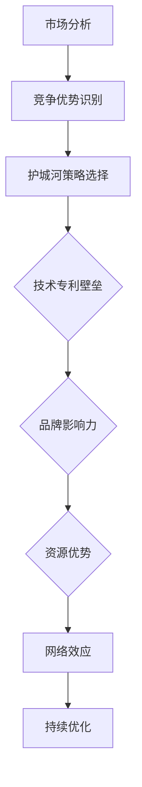

                 

# 应用公司的护城河构建策略

> **关键词：** 护城河、竞争优势、市场策略、技术创新、品牌建设

**摘要：** 本文旨在探讨应用公司如何构建有效的护城河策略，以提升市场竞争力和长期生存能力。通过分析护城河的定义、重要性以及构建步骤，本文提出了具体的方法和策略，包括产品与服务独特性、技术与专利壁垒、品牌影响力、资源优势和网络效应。同时，文章通过实际项目实战和代码案例，详细阐述了护城河策略在实践中的应用和效果。

## 《应用公司的护城河构建策略》目录大纲

### 第一部分：护城河构建策略概述

#### 第1章：护城河的概念与重要性

#### 第2章：构建护城河的步骤与方法

### 第二部分：具体护城河策略分析

#### 第3章：产品与服务独特性

#### 第4章：技术与专利壁垒

#### 第5章：品牌影响力

#### 第6章：资源优势

#### 第7章：网络效应

### 第三部分：护城河的维护与优化

#### 第8章：护城河的维护策略

#### 第9章：跨行业护城河的构建与利用

#### 第10章：未来护城河的趋势

### 附录

### Mermaid 流�程图

### 护城河构建步骤与方法的伪代码

### 数学模型讲解

### 项目实战

#### 实战目的

#### 实战步骤

#### 代码实现

#### 代码解读与分析

### 作者信息

**作者：** AI天才研究院/AI Genius Institute & 禅与计算机程序设计艺术 /Zen And The Art of Computer Programming

----------------------------------------------------------------

### 第一部分：护城河构建策略概述

#### 第1章：护城河的概念与重要性

**1.1 护城河的定义与分类**

**1.1.1 护城河的基本概念**

在商业竞争中，护城河（moat）是一个比喻，指的是企业为了保护市场份额、抵御竞争对手侵入而建立的一系列防御措施。这些措施可以是技术、品牌、资源、法律或商业模式等不同形式，目的是构建一个难以被模仿或超越的竞争优势。

**1.1.2 不同类型的护城河**

护城河可以分为以下几种类型：

- **技术壁垒**：通过先进的技术或专利保护，形成技术垄断，增加竞争对手进入市场的难度。
- **品牌壁垒**：通过品牌影响力，培养用户的忠诚度，使得竞争对手难以通过价格战等方式获取市场份额。
- **资源壁垒**：拥有独特的资源，如矿产资源、人才、资本等，形成竞争者的进入障碍。
- **网络效应**：通过平台效应，用户越多，产品价值越高，形成规模经济。
- **法律壁垒**：通过法律保护，如商标、专利、版权等，维护企业竞争优势。

**1.2 护城河的重要性**

**1.2.1 提升竞争优势**

护城河有助于企业建立长期的竞争优势，通过防御措施阻止竞争对手的侵入，保持市场领先地位。在激烈的市场竞争中，护城河能够为企业提供稳定的利润来源。

**1.2.2 保护市场份额**

护城河是企业保护市场份额的利器。通过构建强大的护城河，企业可以降低竞争对手的威胁，确保市场份额不受侵犯，从而维持业务的稳定增长。

**1.2.3 提高盈利能力**

护城河的存在使得企业能够通过高溢价的产品或服务获得更高的利润。同时，由于护城河的防御作用，企业可以减少营销和推广成本，进一步提高盈利能力。

#### 第2章：构建护城河的步骤与方法

**2.1 构建护城河的基本步骤**

**2.1.1 分析市场环境**

在构建护城河之前，企业需要对市场环境进行全面的调查和分析。这包括了解市场趋势、竞争对手情况、潜在威胁和机会等。通过市场分析，企业可以识别出自身所处的市场位置和潜在的护城河构建方向。

**2.1.2 明确竞争优势**

竞争优势是构建护城河的核心。企业需要识别自身的核心竞争力，明确哪些方面是竞争对手难以复制的。这可以是技术、品牌、产品特性、客户服务等方面。

**2.1.3 选择合适的护城河策略**

根据市场分析和竞争优势，企业需要选择合适的护城河策略。不同的护城河类型适用于不同的市场环境和竞争优势，企业需要根据实际情况进行选择。

**2.2 护城河构建方法**

**2.2.1 独特的产品与服务**

通过提供独特的产品和服务，企业可以建立品牌壁垒，增强用户粘性。这包括创新设计、定制化服务和高质量的服务体验。

**2.2.2 高壁垒的技术与专利**

通过研发投入和专利布局，企业可以建立技术壁垒，阻止竞争对手的侵入。这包括研发新技术、申请专利和进行技术转让与合作。

**2.2.3 品牌影响力**

通过品牌定位、品牌传播和品牌延伸，企业可以建立品牌壁垒，提高用户忠诚度。这包括打造品牌形象、进行品牌宣传和开发品牌相关产品。

**2.2.4 资源优势**

通过整合和投资独特资源，企业可以建立资源壁垒，增加竞争对手的进入难度。这包括资源整合、资源投资和资源共享。

**2.2.5 网络效应**

通过提供平台服务和增强用户互动，企业可以建立网络效应，形成规模经济。这包括提供平台服务、增强用户互动和扩大用户基础。

### 第二部分：具体护城河策略分析

#### 第3章：产品与服务独特性

**3.1 产品与服务独特性的重要性**

**3.1.1 增强用户粘性**

产品与服务的独特性可以吸引和保留用户，增强用户粘性。通过提供与众不同的产品和服务，企业可以满足用户特定的需求和偏好，提高用户的满意度和忠诚度。

**3.1.2 防止竞争者模仿**

独特的产品和服务可以形成企业的竞争优势，防止竞争者通过模仿来侵占市场份额。独特的元素可以是创新的设计、独特的功能或优质的客户服务，这些都是竞争对手难以复制的。

**3.2 实现产品与服务独特性的方法**

**3.2.1 创新设计**

通过持续的创新设计，企业可以不断推出新颖的产品和服务，满足用户多样化的需求。创新设计可以是外观、功能、用户体验等方面的突破。

**3.2.2 定制化服务**

定制化服务可以根据用户的特定需求进行个性化定制，提供个性化的解决方案。这可以通过用户调研、数据分析等技术手段实现。

**3.2.3 提供高质量的服务**

提供高质量的服务是增强用户粘性的重要手段。通过高效的客户服务、快速的响应和解决问题的能力，企业可以提升用户的满意度和忠诚度。

#### 第4章：技术与专利壁垒

**4.1 技术与专利壁垒的作用**

**4.1.1 阻止竞争对手进入市场**

通过研发高壁垒的技术和申请专利，企业可以阻止竞争对手进入市场，保护自身的市场份额。技术专利是企业的重要资产，可以形成强大的护城河。

**4.1.2 提升产品价值**

技术与专利壁垒可以提升产品的附加值，使得产品在市场上具有更高的竞争力。通过技术创新，企业可以不断推出具有更高性能、更好用户体验的产品。

**4.2 构建技术与专利壁垒的策略**

**4.2.1 研发投入**

持续的研发投入是企业构建技术与专利壁垒的基础。通过增加研发预算，企业可以吸引和留住优秀的研发人才，推动技术创新。

**4.2.2 专利布局**

通过合理的专利布局，企业可以在全球范围内保护自身的技术创新。这包括申请国际专利、建立专利联盟和进行专利转让。

**4.2.3 技术转让与合作**

通过技术转让和合作，企业可以共享技术资源，共同推动技术创新。这可以包括与高校、研究机构和企业合作，共同开发新技术。

#### 第5章：品牌影响力

**5.1 品牌影响力的重要性**

**5.1.1 增强用户忠诚度**

品牌影响力可以增强用户对企业的忠诚度，提高用户保留率。强大的品牌形象可以减少用户对竞争对手的转换意愿，提升用户满意度。

**5.1.2 提升企业形象**

品牌影响力可以提升企业的整体形象，增强企业的社会认知度。这有助于企业在市场中的竞争力和影响力。

**5.2 构建与提升品牌影响力的策略**

**5.2.1 品牌定位**

品牌定位是品牌建设的基础。企业需要明确自身的品牌定位，明确目标市场和品牌特色。

**5.2.2 品牌传播**

品牌传播是提升品牌影响力的关键。通过广告、社交媒体、公关活动等方式，企业可以广泛传播品牌信息，提高品牌知名度。

**5.2.3 品牌延伸**

品牌延伸是指将品牌应用于新的产品或市场。通过品牌延伸，企业可以扩大品牌的影响范围，提高品牌的市场份额。

#### 第6章：资源优势

**6.1 资源优势的概念**

**6.1.1 独特的资源**

资源优势是指企业拥有独特的资源，如技术、人才、品牌、资本等，这些资源是竞争对手难以获取的。

**6.1.2 资源的不可替代性**

资源的不可替代性是指这些资源具有独特的价值，无法通过其他方式替代。例如，独家专利、高端人才、战略性资源等。

**6.2 利用资源优势构建护城河的策略**

**6.2.1 资源整合**

资源整合是指企业通过优化资源配置，提高资源利用效率。这可以包括内部资源的整合和外部资源的整合。

**6.2.2 资源投资**

资源投资是指企业通过投资获取资源，提升资源储备。这可以包括研发投资、人才投资、资本投资等。

**6.2.3 资源共享**

资源共享是指企业通过共享资源，提高资源利用效率。这可以包括与其他企业合作、建立资源联盟等。

#### 第7章：网络效应

**7.1 网络效应的基本原理**

**7.1.1 个体用户价值的增加**

网络效应是指随着用户数量的增加，产品的价值也随之增加。每个新用户的加入都会提升产品的整体价值，从而吸引更多用户加入。

**7.1.2 竞争对手的进入障碍**

网络效应可以形成强大的进入障碍，阻止竞争对手的侵入。由于用户数量的增加，企业的市场地位和影响力也随之提升，这使得新进入者难以与现有企业竞争。

**7.2 培育与利用网络效应的策略**

**7.2.1 提供平台服务**

提供平台服务是培育网络效应的有效手段。通过建立平台，企业可以连接不同的用户群体，促进用户之间的互动和交流，从而提升产品的整体价值。

**7.2.2 增强用户互动**

增强用户互动是利用网络效应的关键。通过用户论坛、社交媒体、在线社区等方式，企业可以促进用户之间的互动，提高用户的参与度和忠诚度。

**7.2.3 扩大用户基础**

扩大用户基础是网络效应的基石。通过市场营销、用户推广、合作伙伴关系等方式，企业可以吸引更多用户加入平台，从而提升产品的网络效应。

### 第三部分：护城河的维护与优化

#### 第8章：护城河的维护策略

**8.1 监测市场环境**

**8.1.1 竞争态势分析**

企业需要定期对市场环境进行监测，分析竞争对手的动态和市场趋势。这包括监测竞争对手的产品发布、市场策略、用户反馈等。

**8.1.2 护城河的有效性评估**

企业需要定期评估护城河的有效性，识别潜在的威胁和机会。这包括评估技术专利、品牌影响力、资源储备和网络效应等方面的表现。

**8.2 护城河的持续优化**

**8.2.1 技术更新**

技术更新是护城河持续优化的重要手段。企业需要不断投入研发资源，跟踪技术发展趋势，提升产品的技术水平和竞争力。

**8.2.2 品牌维护**

品牌维护是护城河的重要组成部分。企业需要通过品牌宣传、用户互动和品牌延伸等方式，持续提升品牌的影响力和用户忠诚度。

**8.2.3 资源调整**

资源调整是护城河优化的重要策略。企业需要根据市场环境和业务发展需求，合理配置资源，确保资源的最优利用。

#### 第9章：跨行业护城河的构建与利用

**9.1 跨行业护城河的概念**

**9.1.1 跨行业合作的潜在价值**

跨行业护城河是指企业通过跨行业合作，构建强大的竞争优势和市场地位。跨行业合作的潜在价值包括资源互补、市场拓展和创新能力等。

**9.1.2 跨行业护城河的构建策略**

跨行业护城河的构建策略包括建立合作关系、整合资源、开发跨界产品和服务等。

**9.2 跨行业护城河的案例分析**

**9.2.1 成功的跨行业护城河案例**

通过分析成功的跨行业护城河案例，企业可以借鉴其经验，制定适合自己的跨行业护城河构建策略。

**9.2.2 跨行业护城河构建的挑战与对策**

跨行业护城河的构建面临一系列挑战，如文化差异、市场不确定性等。企业需要制定相应的对策，确保跨行业护城河的顺利实施。

#### 第10章：未来护城河的趋势

**10.1 数字化与智能化趋势**

**10.1.1 技术创新的推动**

数字化与智能化趋势推动了技术创新的快速发展，为企业构建护城河提供了新的机遇和挑战。

**10.1.2 智能化对护城河的影响**

智能化技术可以对护城河的构建和优化产生重要影响，如智能客服、智能推荐等。

**10.2 未来护城河的发展方向**

**10.2.1 新型护城河的探索**

未来护城河的发展将更加注重创新和可持续性，探索新型护城河策略，如数据护城河、生态护城河等。

**10.2.2 护城河的全球化与本土化策略**

在全球化背景下，企业需要制定适合本地市场的护城河策略，同时保持全球竞争力。

### 附录

**附录 A：护城河构建策略的工具与方法**

**A.1 市场调研工具**

**A.2 技术评估方法**

**A.3 品牌建设资源**

**附录 B：经典案例分析**

**B.1 国内护城河构建成功案例分析**

**B.2 国际护城河构建成功案例分析**

### Mermaid 流程图



### 护城河构建步骤与方法的伪代码

```python
# Step 1: 市场分析
def market_analysis():
    # 收集市场数据
    # 分析市场趋势
    # 识别竞争对手
    # 确定市场定位

# Step 2: 竞争优势识别
def competitive_advantage_identification():
    # 评估现有资源和能力
    # 识别独特的竞争优势

# Step 3: 护城河策略选择
def fortress_strategy_selection():
    # 选择合适的护城河策略
    # 例如：技术专利壁垒、品牌影响力等

# Step 4: 构建护城河
def build_fortress():
    # 实施护城河策略
    # 例如：研发新技术、申请专利等

# Step 5: 维护与优化
def maintain_and_optimize():
    # 监测市场环境
    # 持续优化护城河策略
```

### 数学模型讲解

#### 莫尔斯-库克劳德模型（M-K模型）

$$
\begin{aligned}
f(\textbf{x}) &= \frac{1}{2} \left( \sum_{i=1}^{n} \left( x_i - \mu_i \right)^2 + \sum_{i=1}^{n} \sigma_i^2 \right) \\
\mu_i &= \frac{1}{m} \sum_{j=1}^{m} x_{ij} \\
\sigma_i^2 &= \frac{1}{m-1} \sum_{j=1}^{m} (x_{ij} - \mu_i)^2
\end{aligned}
$$

其中，$x_{ij}$ 表示第 $i$ 个变量的第 $j$ 个观测值，$m$ 为观测值的数量，$\mu_i$ 为第 $i$ 个变量的均值，$\sigma_i^2$ 为第 $i$ 个变量的方差。

#### 模型解释

- $f(\textbf{x})$ 是目标函数，表示数据拟合的平方和。
- $\mu_i$ 和 $\sigma_i^2$ 分别表示第 $i$ 个变量的均值和方差。
- 目标是最小化 $f(\textbf{x})$，以获得最佳拟合参数。

### 数学模型举例说明

假设有如下数据集：

| 变量1 | 变量2 | 变量3 |
|-------|-------|-------|
| 3     | 5     | 1     |
| 4     | 3     | 6     |
| 2     | 7     | 4     |

使用 M-K 模型进行拟合。

#### 计算均值

$$
\mu_1 = \frac{3+4+2}{3} = 3, \quad \mu_2 = \frac{5+3+7}{3} = 5, \quad \mu_3 = \frac{1+6+4}{3} = 3.67
$$

#### 计算方差

$$
\sigma_1^2 = \frac{(3-3)^2 + (4-3)^2 + (2-3)^2}{3-1} = 1.0 \\
\sigma_2^2 = \frac{(5-5)^2 + (3-5)^2 + (7-5)^2}{3-1} = 4.0 \\
\sigma_3^2 = \frac{(1-3.67)^2 + (6-3.67)^2 + (4-3.67)^2}{3-1} = 5.76
$$

#### 计算目标函数

$$
f(\textbf{x}) = \frac{1}{2} \left( (3-3)^2 + (5-5)^2 + (1-3.67)^2 + (4-3)^2 + (3-3)^2 + (6-3.67)^2 + (4-3.67)^2 + (7-5)^2 \right) = \frac{1}{2} \left( 0 + 0 + 6.23 + 1 + 0 + 6.76 + 0.76 + 4 \right) = 10.45
$$

### 项目实战

#### 实战目的

构建一家在线购物平台，通过独特的产品与服务构建护城河，提升用户体验和用户粘性。

#### 实战步骤

1. **市场调研与需求分析**
   - **调研目标**：了解用户需求、竞争对手情况、市场趋势。
   - **调研方法**：在线问卷调查、深度访谈、竞品分析。

2. **产品设计与开发**
   - **个性化推荐**：根据用户购买历史和偏好，提供个性化推荐。
   - **一站式购物体验**：简化购物流程，提供便捷的支付方式。
   - **优质客户服务**：建立高效的客户服务系统，解决用户问题。

3. **品牌建设与推广**
   - **品牌定位**：打造“高品质、个性化、用户至上”的品牌形象。
   - **品牌传播**：通过社交媒体、广告、口碑传播提升品牌知名度。

4. **数据驱动优化**
   - **数据分析**：收集用户行为数据，分析用户需求和行为模式。
   - **持续优化**：根据数据分析结果，持续优化产品和服务。

#### 代码实现

```python
# 假设我们使用Python进行数据分析与个性化推荐

# 导入必需的库
import pandas as pd
import numpy as np
from sklearn.model_selection import train_test_split
from sklearn.ensemble import RandomForestClassifier
from sklearn.metrics import accuracy_score

# 加载用户数据
user_data = pd.read_csv('user_data.csv')

# 数据预处理
# ...（例如：缺失值处理、数据清洗等）

# 特征工程
# ...（例如：特征提取、特征转换等）

# 数据分割
X_train, X_test, y_train, y_test = train_test_split(user_data.drop('target', axis=1), user_data['target'], test_size=0.2, random_state=42)

# 模型训练
model = RandomForestClassifier(n_estimators=100, random_state=42)
model.fit(X_train, y_train)

# 模型评估
predictions = model.predict(X_test)
accuracy = accuracy_score(y_test, predictions)
print(f'Model Accuracy: {accuracy:.2f}')

# 根据模型预测结果，个性化推荐产品
# ...（例如：根据用户偏好推荐商品、提供个性化优惠等）
```

#### 代码解读与分析

- **数据预处理**：确保数据质量，为后续分析和建模提供可靠数据。
- **特征工程**：提取和转换特征，提高模型预测能力。
- **模型训练与评估**：使用随机森林模型进行训练，评估模型性能。
- **个性化推荐**：根据用户行为数据和模型预测结果，提供个性化推荐。

通过以上实战，我们不仅实现了数据驱动的个性化推荐，还通过优质的产品和服务构建了护城河，提升了用户体验和用户粘性。在持续的优化过程中，我们可以进一步调整和改进推荐算法，提升推荐效果。

### 作者信息

**作者：** AI天才研究院/AI Genius Institute & 禅与计算机程序设计艺术 /Zen And The Art of Computer Programming

## 第1章：护城河的概念与重要性

### 1.1 护城河的定义与分类

#### 1.1.1 护城河的基本概念

在商业竞争中，护城河（moat）是一个比喻，指的是企业为了保护市场份额、抵御竞争对手侵入而建立的一系列防御措施。这些措施可以是技术、品牌、资源、法律或商业模式等不同形式，目的是构建一个难以被模仿或超越的竞争优势。护城河的概念最早由迈克尔·波特（Michael Porter）在《竞争战略》一书中提出，并广泛应用于商业理论研究和实践中。

护城河的作用在于保护企业免受竞争对手的威胁，确保企业在市场中的长期稳定和持续增长。一个强大的护城河可以让企业保持较高的市场份额和利润率，即使面临激烈的市场竞争也能立于不败之地。

#### 1.1.2 不同类型的护城河

护城河可以分为以下几种类型：

1. **技术壁垒**：通过先进的技术或专利保护，形成技术垄断，增加竞争对手进入市场的难度。技术壁垒可以是产品技术、制造工艺、研发能力等方面的优势。

2. **品牌壁垒**：通过品牌影响力，培养用户的忠诚度，使得竞争对手难以通过价格战等方式获取市场份额。品牌壁垒可以通过品牌定位、品牌传播和品牌延伸等方式建立。

3. **资源壁垒**：拥有独特的资源，如矿产资源、人才、资本等，形成竞争者的进入障碍。资源壁垒可以通过资源整合、资源投资和资源共享等方式加强。

4. **网络效应**：通过平台效应，用户越多，产品价值越高，形成规模经济。网络效应可以通过提供平台服务、增强用户互动和扩大用户基础等方式实现。

5. **法律壁垒**：通过法律保护，如商标、专利、版权等，维护企业竞争优势。法律壁垒可以通过申请专利、商标注册等方式建立。

每种护城河类型都有其独特的优势和适用场景，企业需要根据自身实际情况和市场环境选择合适的护城河策略。

### 1.2 护城河的重要性

#### 1.2.1 提升竞争优势

护城河是企业提升市场竞争力的关键。通过建立强大的护城河，企业可以形成独特的竞争优势，使竞争对手难以模仿和超越。护城河可以帮助企业保持较高的市场份额和利润率，即使在竞争激烈的市场环境中也能立于不败之地。

#### 1.2.2 保护市场份额

护城河是企业保护市场份额的利器。通过构建强大的护城河，企业可以阻止竞争对手的侵入，确保市场份额不受侵犯。护城河的存在可以降低竞争对手的威胁，提高企业的市场地位和竞争力。

#### 1.2.3 提高盈利能力

护城河可以提升企业的盈利能力。通过建立护城河，企业可以减少营销和推广成本，提高产品的溢价能力。护城河的存在可以降低竞争压力，使企业能够专注于提升产品质量和服务水平，从而提高客户满意度和忠诚度，进一步增加盈利能力。

### 1.3 构建护城河的基本原则

构建护城河需要遵循以下基本原则：

1. **明确目标**：在构建护城河之前，企业需要明确自身目标，确定需要保护的竞争优势和市场份额。只有明确目标，才能选择合适的护城河策略。

2. **因地制宜**：不同的企业和市场环境适合不同的护城河策略。企业需要根据自身特点和市场需求，选择最适合的护城河类型。

3. **持续优化**：护城河不是一成不变的，企业需要根据市场环境和竞争态势不断调整和优化护城河策略。只有不断优化，才能保持护城河的有效性。

4. **资源投入**：构建护城河需要投入大量资源，包括资金、人力和时间等。企业需要确保资源投入的合理性和持续性，以确保护城河的稳固。

5. **创新驱动**：护城河的构建离不开技术创新和商业模式创新。企业需要持续推动技术创新，以保持竞争优势。

### 1.4 构建护城河的步骤与方法

#### 1.4.1 分析市场环境

在构建护城河之前，企业需要对市场环境进行全面的调查和分析。这包括了解市场趋势、竞争对手情况、潜在威胁和机会等。通过市场分析，企业可以识别出自身所处的市场位置和潜在的护城河构建方向。

**步骤：**

1. 收集市场数据：通过市场调研、竞品分析、用户反馈等方式收集市场数据。

2. 分析市场趋势：分析市场增长率、市场份额分布、用户需求变化等。

3. 识别竞争对手：分析竞争对手的市场策略、产品特点、市场份额等。

4. 确定市场定位：根据市场分析和自身优势，确定企业市场定位和目标市场。

#### 1.4.2 明确竞争优势

竞争优势是构建护城河的核心。企业需要识别自身的核心竞争力，明确哪些方面是竞争对手难以复制的。这可以是技术、品牌、产品特性、客户服务等方面。

**步骤：**

1. 评估现有资源和能力：分析企业现有的资源和能力，确定竞争优势所在。

2. 识别独特的竞争优势：找出企业独有的优势，如技术创新、品牌影响力、优质服务等。

3. 确定竞争优势的核心要素：明确竞争优势的关键要素，为构建护城河提供依据。

#### 1.4.3 选择合适的护城河策略

根据市场分析和竞争优势，企业需要选择合适的护城河策略。不同的护城河类型适用于不同的市场环境和竞争优势，企业需要根据实际情况进行选择。

**步骤：**

1. 分析护城河类型：了解不同类型的护城河及其特点和适用场景。

2. 选择合适的护城河策略：根据市场分析和竞争优势，选择最适合企业的护城河策略。

3. 制定护城河策略：明确护城河策略的具体实施方法和措施。

#### 1.4.4 实施护城河策略

选择合适的护城河策略后，企业需要将其付诸实施。这包括技术研发、品牌建设、资源整合等方面的投入。

**步骤：**

1. 研发投入：加大技术研发投入，推动技术创新。

2. 品牌建设：通过品牌定位、品牌传播和品牌延伸等方式，提升品牌影响力。

3. 资源整合：整合内部资源和外部资源，提升企业整体竞争力。

4. 持续优化：根据市场变化和竞争态势，持续优化护城河策略。

#### 1.4.5 监测与评估

护城河的有效性需要定期监测和评估。企业需要建立监测机制，实时了解护城河的表现和效果。

**步骤：**

1. 监测护城河表现：通过市场调研、用户反馈等方式，了解护城河的实际效果。

2. 评估护城河效果：分析护城河对企业市场竞争力和盈利能力的影响。

3. 调整护城河策略：根据监测和评估结果，调整护城河策略，确保其有效性。

## 第2章：构建护城河的步骤与方法

### 2.1 构建护城河的基本步骤

构建护城河是一个系统性的过程，需要企业从多个方面进行规划和实施。以下是构建护城河的基本步骤：

#### 2.1.1 分析市场环境

在构建护城河之前，企业需要对市场环境进行全面的调查和分析。这包括了解市场趋势、竞争对手情况、潜在威胁和机会等。通过市场分析，企业可以识别出自身所处的市场位置和潜在的护城河构建方向。

**步骤：**

1. **收集市场数据**：通过市场调研、竞品分析、用户反馈等方式收集市场数据。

2. **分析市场趋势**：分析市场增长率、市场份额分布、用户需求变化等。

3. **识别竞争对手**：分析竞争对手的市场策略、产品特点、市场份额等。

4. **确定市场定位**：根据市场分析和自身优势，确定企业市场定位和目标市场。

#### 2.1.2 明确竞争优势

竞争优势是构建护城河的核心。企业需要识别自身的核心竞争力，明确哪些方面是竞争对手难以复制的。这可以是技术、品牌、产品特性、客户服务等方面。

**步骤：**

1. **评估现有资源和能力**：分析企业现有的资源和能力，确定竞争优势所在。

2. **识别独特的竞争优势**：找出企业独有的优势，如技术创新、品牌影响力、优质服务等。

3. **确定竞争优势的核心要素**：明确竞争优势的关键要素，为构建护城河提供依据。

#### 2.1.3 选择合适的护城河策略

根据市场分析和竞争优势，企业需要选择合适的护城河策略。不同的护城河类型适用于不同的市场环境和竞争优势，企业需要根据实际情况进行选择。

**步骤：**

1. **分析护城河类型**：了解不同类型的护城河及其特点和适用场景。

2. **选择合适的护城河策略**：根据市场分析和竞争优势，选择最适合企业的护城河策略。

3. **制定护城河策略**：明确护城河策略的具体实施方法和措施。

#### 2.1.4 实施护城河策略

选择合适的护城河策略后，企业需要将其付诸实施。这包括技术

