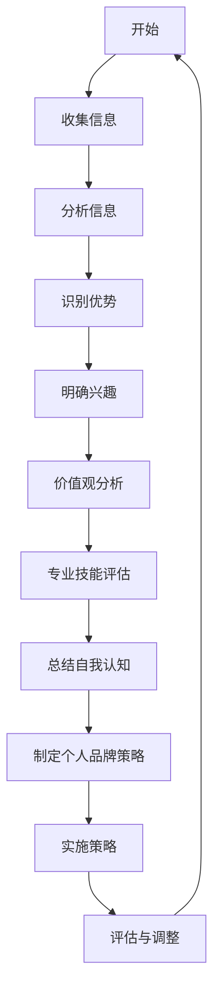
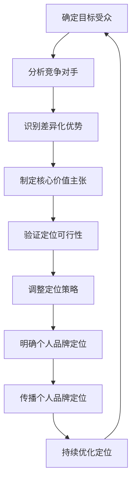
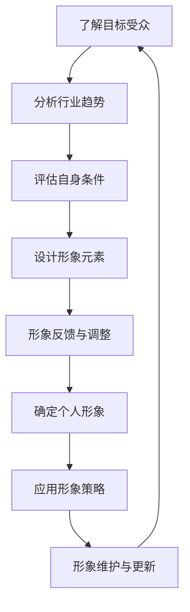
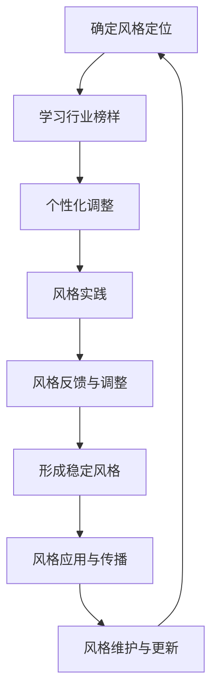
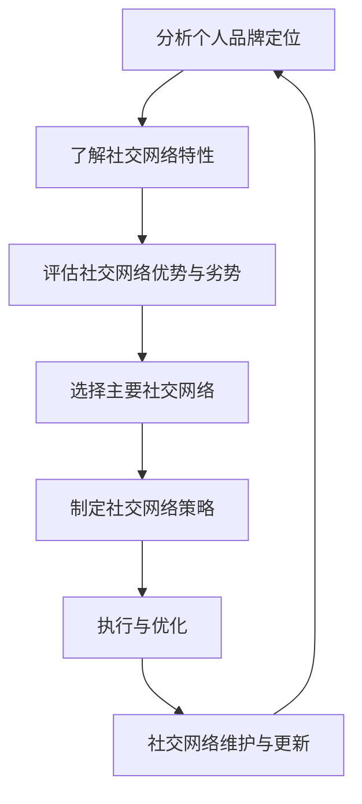
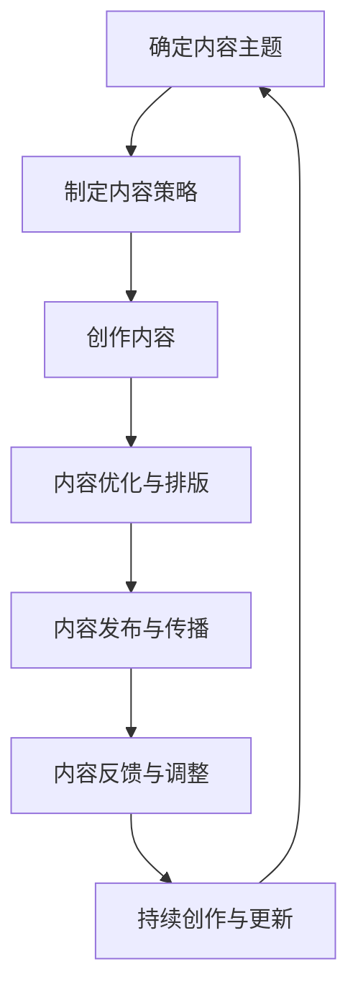

                 

# 建立个人品牌的步骤和技巧

## 关键词
- 个人品牌建设
- 自我认知
- 社交网络
- 内容创作
- 个人品牌平台
- 危机公关
- 成功案例分析

## 摘要
在信息技术飞速发展的今天，建立个人品牌成为许多专业人士追求的目标。个人品牌不仅能够提升个人知名度，还能为职业发展带来巨大的助力。本文将详细探讨建立个人品牌的步骤和技巧，从自我认知与定位、建立个人形象与风格、利用社交网络与内容创作、选择合适的品牌建设工具与平台，到维护与提升个人品牌，并分析成功案例及未来趋势，为读者提供一套完整的个人品牌建设指南。

### 第一部分：个人品牌建设的基础

#### 第1章：个人品牌概述

##### 1.1 什么是个人品牌

个人品牌是指个人在职业和社会中所形成的独特形象、声誉和认知度。它不仅仅是一个名字，更是一个人专业能力、价值观和人格特征的集中体现。在信息化时代，个人品牌的作用日益凸显，它能够帮助个人在竞争激烈的职场中脱颖而出，建立强大的影响力。

##### 1.2 个人品牌的重要性

- 提升职业竞争力：个人品牌有助于雇主和客户更快地认识和信任个人，从而提高求职和业务拓展的成功率。
- 增加收入潜力：强大的个人品牌能够吸引高薪工作机会和商业合作，为个人带来更多的收入来源。
- 塑造个人价值观：通过个人品牌的建设，个人可以更加明确自己的价值观和使命，实现自我价值最大化。

##### 1.3 个人品牌与职业发展的关系

- 个人品牌是职业发展的加速器：有了个人品牌，个人能够更快地获得职业认可，提升职位和收入水平。
- 个人品牌有助于建立人脉：通过个人品牌的影响力，个人可以结识更多行业内的专家和意见领袖，拓展人脉资源。
- 个人品牌促进持续发展：持续的个人品牌建设能够帮助个人在职业生涯中不断成长，保持竞争优势。

#### 第2章：自我认知与定位

##### 2.1 自我分析

自我分析是建立个人品牌的第一步，需要深入了解自己的优势、兴趣、价值观和专业技能。以下是一个自我分析流程的 Mermaid 流程图：

##### 2.2 明确个人品牌定位

个人品牌定位是个人在市场中独特的价值主张和差异化特征。以下是一个个人品牌定位流程的 Mermaid 流程图：

##### 2.3 个人品牌定位案例解析

以下是一个个人品牌定位案例：

- 个人：XX，AI领域专家
- 目标受众：科技公司管理层和人工智能从业者
- 竞争对手：众多AI专家和咨询公司
- 差异化优势：实战经验丰富、对AI技术的深刻理解、卓越的沟通能力
- 核心价值主张：通过AI技术帮助企业解决实际问题，推动产业升级
- 定位策略：专注于为企业提供定制化的AI解决方案，成为AI领域内的战略合作伙伴

通过以上分析，XX明确了其个人品牌定位，为其品牌建设奠定了基础。

### 第二部分：构建个人品牌

#### 第3章：建立个人形象与风格

##### 3.1 确定个人形象

个人形象是个人品牌的外在表现，需要根据个人品牌定位和目标受众来设计。以下是一个确定个人形象的流程图：

##### 3.2 塑造个人风格

个人风格是个人形象的核心，需要通过言行举止、着装打扮等方面来体现。以下是一个塑造个人风格的流程图：

##### 3.3 个人形象与风格的重要性

- 形象与风格有助于建立信任：专业、整洁、自信的形象和风格能够增强他人对个人的信任感。
- 形象与风格体现专业度：清晰的个人形象和风格能够彰显个人的专业能力和行业地位。
- 形象与风格提升个人影响力：独特的形象和风格有助于个人在社交场合中脱颖而出，增强个人影响力。

#### 第4章：社交网络与内容创作

##### 4.1 社交网络选择与策略

选择合适的社交网络是构建个人品牌的重要一环。以下是一个社交网络选择与策略的流程图：

##### 4.2 内容创作与传播

内容创作是个人品牌建设的关键，需要结合个人品牌定位和目标受众来制定内容策略。以下是一个内容创作与传播的流程图：

##### 4.3 增强个人影响力的技巧

- 定期发布高质量内容：通过持续发布有深度、有见解的高质量内容，吸引更多关注和转发。
- 与行业专家互动：积极参与行业讨论，与专家交流互动，提升个人专业形象。
- 利用社交媒体推广：通过社交媒体平台进行内容推广，扩大个人影响力。
- 参与线下活动：积极参加行业会议、论坛等活动，扩大人脉资源，提升个人知名度。

#### 第5章：个人品牌塑造工具与平台

##### 5.1 个人品牌建设工具

个人品牌建设工具可以帮助个人更高效地管理个人品牌，以下是一些常用的个人品牌建设工具：

- 个人网站：建立个人网站，展示个人品牌和成果，提升专业形象。
- 社交媒体管理工具：如Hootsuite、Buffer等，帮助个人管理多个社交媒体账号，优化内容发布策略。
- 内容管理系统（CMS）：如WordPress、Joomla等，帮助个人创建和维护个人博客或网站。
- 个人品牌分析工具：如Google Analytics、SEMrush等，帮助个人分析品牌表现和优化策略。

##### 5.2 个人品牌平台选择

选择合适的个人品牌平台是个人品牌建设的重要一环，以下是一些常见的个人品牌平台：

- LinkedIn：专业社交平台，适合建立职业形象和拓展人脉。
- Twitter：实时信息分享平台，适合传播个人观点和行业动态。
- Medium：内容创作平台，适合撰写和分享专业文章。
- Instagram：图片和短视频分享平台，适合展示个人生活和兴趣爱好。

##### 5.3 平台案例分析

以下是一个个人品牌平台案例分析：

- 平台：LinkedIn
- 个人：XX，AI领域专家
- 内容策略：定期发布专业文章、行业动态和个人见解，积极参与讨论和互动。
- 结果：通过LinkedIn，XX在AI领域内建立了广泛的联系和影响力，吸引了众多潜在客户和合作伙伴。

#### 第6章：维护与提升个人品牌

##### 6.1 个人品牌管理策略

个人品牌管理策略包括以下几个方面：

- 定期评估品牌表现：通过数据分析、客户反馈等方式，定期评估个人品牌的表现，了解品牌现状和问题。
- 制定品牌提升计划：根据评估结果，制定具体的品牌提升计划，包括内容创作、社交互动、活动参与等方面。
- 保持品牌一致性：在各个渠道和场合中，保持个人品牌形象的一致性，确保品牌认知度。
- 持续学习与成长：通过不断学习和实践，提升个人专业能力和行业影响力。

##### 6.2 应对危机公关

个人品牌建设过程中，可能会面临各种危机，如负面评论、争议事件等。以下是一些应对危机公关的策略：

- 及时回应：在危机发生时，及时回应，表达关切和态度，避免问题扩大。
- 保持透明：公开透明地处理危机，接受公众监督，赢得信任。
- 求助专业：必要时，寻求专业公关团队的帮助，制定应对方案。
- 事后反思：危机结束后，反思问题根源，制定预防措施，避免类似事件再次发生。

##### 6.3 个人品牌提升技巧

以下是一些个人品牌提升技巧：

- 建立专业形象：通过专业知识和经验分享，展示个人专业能力。
- 积极参与行业活动：通过参与行业会议、论坛等活动，提升个人知名度。
- 建立个人品牌故事：通过讲述个人成长经历、专业历程等，建立个人品牌故事，增强情感共鸣。
- 利用社交媒体：通过社交媒体平台，与粉丝互动，提升个人影响力。

### 第三部分：个人品牌案例研究

#### 第7章：成功个人品牌案例分析

##### 7.1 案例一：XX

XX是一位知名的数据科学家，其在数据科学领域内建立了强大的个人品牌。以下是其个人品牌建设的关键要素：

- 专业形象：通过在LinkedIn上发布专业文章、参与行业讨论，展示其在数据科学领域的专业能力。
- 内容创作：定期发布高质量的数据科学文章，分享实战经验和见解，吸引读者关注。
- 行业活动：积极参加数据科学领域的会议和论坛，结识行业专家，拓展人脉资源。
- 社交互动：在社交媒体上与读者互动，回答问题，提供帮助，提升个人影响力。

##### 7.2 案例二：YY

YY是一位AI领域的创业者，通过个人品牌建设，成功吸引了众多投资和合作伙伴。以下是其个人品牌建设的关键要素：

- 个人网站：建立个人网站，展示创业经历、团队介绍和产品信息，提升品牌形象。
- 社交媒体：通过Twitter、LinkedIn等社交媒体平台，发布创业心得、行业动态和个人见解，扩大影响力。
- 内容营销：通过撰写专业文章、发布案例研究，分享AI技术在实际应用中的成果，树立行业权威。
- 活动参与：积极参与AI领域的会议和活动，结识行业专家，拓展商业合作机会。

##### 7.3 案例三：ZZ

ZZ是一位知名的技术博主，通过个人品牌建设，成功实现了职业转型和收入增长。以下是其个人品牌建设的关键要素：

- 内容创作：定期发布高质量的技术博客文章，分享技术见解和实战经验，吸引读者关注。
- 社交媒体：通过Twitter、GitHub等社交媒体平台，与读者互动，建立个人技术社区。
- 个人网站：建立个人网站，展示技术博客、开源项目和联系方式，提升品牌形象。
- 线下活动：参加技术沙龙、分享会等活动，结识同行，扩大人脉资源。

### 第8章：个人品牌建设反思与未来趋势

##### 8.1 反思个人品牌建设过程中的挑战

在个人品牌建设过程中，许多专业人士会遇到以下挑战：

- 时间管理：个人品牌建设需要投入大量时间和精力，与工作生活平衡存在一定难度。
- 内容创作：高质量的内容创作需要深厚的技术积累和写作能力，对许多专业人士来说是一大挑战。
- 持续更新：个人品牌建设需要不断更新和优化，保持品牌的活力和竞争力。
- 网络舆论：在社交媒体上，个人品牌可能会面临负面评论和争议，需要妥善应对。

##### 8.2 个人品牌建设未来趋势分析

随着信息技术的发展，个人品牌建设未来将呈现以下趋势：

- 专业化：个人品牌建设将更加注重专业领域的深耕，打造专业化的个人品牌。
- 数字化：数字化工具和平台将更加普及，助力个人品牌建设。
- 社交化：社交媒体将发挥更大作用，成为个人品牌建设的重要渠道。
- 多元化：个人品牌建设将涵盖更多领域，如创业、艺术、教育等，实现多元化发展。

##### 8.3 个人品牌建设策略建议

以下是一些个人品牌建设策略建议：

- 确定个人品牌定位：明确个人品牌的核心价值和差异化优势，制定清晰的个人品牌定位。
- 建立专业形象：通过高质量的内容创作和专业的社交互动，树立良好的专业形象。
- 拓展人脉资源：积极参与行业活动，与行业专家和同行建立良好的关系。
- 持续更新内容：定期发布高质量的内容，保持个人品牌的活力和竞争力。
- 妥善应对危机：在面对网络舆论和负面评论时，保持冷静和理性，妥善应对。

### 附录

#### 附录A：个人品牌建设资源指南

##### A.1 相关书籍推荐

- 《个人品牌：打造自己的影响力》（《Personal Branding: How to Stand Out in a Noisy World》）
- 《个人品牌营销》（《Your Brand: The Next Chapter of Business Strategy》）
- 《打造个人品牌：在数字时代赢得影响力》（《Building Your Personal Brand: How to Leverage Social Media to Create a Bigger Business and a Brighter Future》）

##### A.2 个人品牌建设工具推荐

- LinkedIn
- Twitter
- Medium
- WordPress
- Hootsuite
- Buffer
- Canva

##### A.3 个人品牌相关平台推荐

- LinkedIn：专业社交平台，适合建立职业形象和拓展人脉。
- Medium：内容创作平台，适合撰写和分享专业文章。
- Twitter：实时信息分享平台，适合传播个人观点和行业动态。
- GitHub：开源代码平台，适合展示技术能力和开源项目。
- SlideShare：演示文稿分享平台，适合分享技术见解和行业报告。

---

作者：AI天才研究院/AI Genius Institute & 禅与计算机程序设计艺术 /Zen And The Art of Computer Programming

