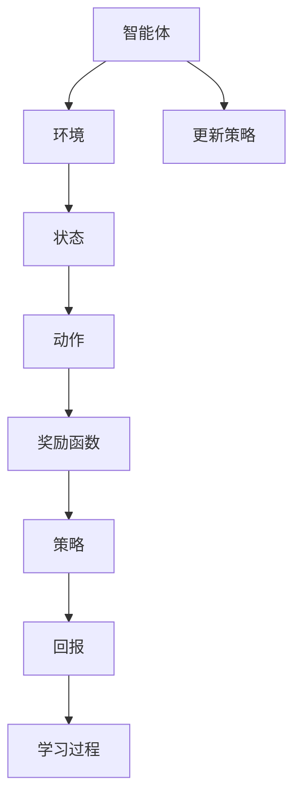

                 

# 强化学习：奖励函数的选择与优化

## 关键词

强化学习，奖励函数，奖励函数设计，优化策略，Q-Learning，SARSA，马尔可夫决策过程，项目实战。

## 摘要

本文深入探讨了强化学习中的核心组件——奖励函数的选择与优化。通过系统地介绍强化学习的基础概念、数学模型、核心算法，以及具体的实现案例，本文旨在为读者提供一套完整、实用的奖励函数设计与优化指南。文章将帮助读者理解奖励函数在强化学习中的重要性，掌握设计原则和优化方法，并在实际项目中应用这些理论。

## 强化学习概述

### 强化学习的基本概念

强化学习（Reinforcement Learning，RL）是机器学习的一个分支，旨在通过智能体（agent）与环境的交互，学习一个策略（policy），以实现长期回报的最大化。与监督学习和无监督学习不同，强化学习中的智能体需要通过试错（trial-and-error）来学习如何行动。

强化学习中的主要组成部分包括：

- **智能体（Agent）**：执行动作、感知环境的实体。
- **环境（Environment）**：智能体操作的背景，提供状态（state）和奖励（reward）。
- **状态（State）**：智能体当前所处的情境。
- **动作（Action）**：智能体可以执行的行为。
- **策略（Policy）**：智能体决定如何从状态选择动作的规则。
- **奖励函数（Reward Function）**：定义智能体在每个状态下应获得的奖励。

强化学习的目标是通过不断的交互，学习到一个最优策略，使得智能体能够在长期内获得最大的回报。

### 强化学习与其他机器学习方法的区别

强化学习与其他机器学习方法的主要区别在于其学习机制和数据需求：

- **监督学习（Supervised Learning）**：在这种方法中，模型通过学习输入和输出之间的映射来进行预测。它需要大量的标记数据，用于训练模型以识别特征和目标。
- **无监督学习（Unsupervised Learning）**：在这种方法中，模型从未标记的数据中学习模式，如聚类或降维。它不需要输入输出对，但可能需要大量的数据来发现模式。
- **强化学习**：它通过智能体与环境的交互进行学习，不需要预先标记的数据。智能体通过与环境的交互，学习到如何通过选择最优动作来最大化回报。

### 强化学习中的奖励函数

奖励函数在强化学习中起着至关重要的作用。它不仅决定了智能体的行动方向，而且直接影响学习过程的效率和稳定性。一个好的奖励函数应该具备以下特性：

- **清晰性**：奖励函数应该明确地指示智能体是否向目标前进。
- **正性**：奖励函数应该正向激励智能体的行为，鼓励它采取有益的动作。
- **惩罚性**：奖励函数应该对有害的行为进行惩罚，阻止智能体采取不良的动作。
- **平衡性**：奖励函数应该平衡短期和长期的奖励，防止智能体过度追求短期收益而忽视长期目标。

奖励函数的类型多种多样，常见的包括：

- **最大化收益奖励函数**：智能体目标是最大化总收益。
- **阈值奖励函数**：智能体只有在达到某个特定阈值时才获得奖励。
- **成就奖励函数**：智能体在完成特定任务或达到特定里程碑时获得奖励。

### 强化学习的基本算法

强化学习算法多种多样，但大多数算法可以归类为值函数方法或策略方法。

#### 值函数方法

值函数方法通过学习状态值函数（State-Value Function）或状态-动作值函数（State-Action Value Function）来指导智能体的行为。

- **Q-Learning算法**：Q-Learning是一种基于值函数的算法，它通过更新Q值（Q-Values）来学习状态-动作值函数。Q-Learning算法的伪代码如下：

    ```python
    for each episode:
        s = env.reset()
        while not done:
            a = policy(s)  # 选择动作
            s' = env.step(a)  # 执行动作
            r = env.reward(s', a)  # 获取奖励
            Q[s, a] = Q[s, a] + alpha * (r + gamma * max(Q[s', a']) - Q[s, a])
            s = s'
        update policy based on Q(s, a)
    ```

- **SARSA算法**：SARSA（State-Action-Reward-State-Action）是一种基于策略的算法，它直接通过当前的奖励和下一状态的最优值来更新策略。SARSA算法的伪代码如下：

    ```python
    for each episode:
        s = env.reset()
        while not done:
            a = policy(s)  # 选择动作
            s' = env.step(a)  # 执行动作
            a' = policy(s')  # 下一个动作
            Q[s, a] = Q[s, a] + alpha * (r + gamma * Q[s', a'] - Q[s, a])
            s = s'
        update policy based on Q(s, a)
    ```

#### 策略方法

策略方法直接通过策略迭代来指导智能体的行为，而不是通过值函数。

- **策略迭代（Policy Iteration）**：策略迭代是一种迭代过程，它交替进行策略评估和策略改进。策略迭代的基本步骤如下：

    1. 初始化策略π。
    2. 使用策略π评估值函数。
    3. 根据值函数改进策略π。
    4. 重复步骤2和3，直到策略收敛。

    策略迭代的核心公式是：

    ```latex
    \pi^{new}(s, a) = \pi^{old}(s, a) + \alpha [r + \gamma \sum_{s'} p(s'|s, a) \max_{a'} \pi^{new}(s', a') - \pi^{old}(s, a)]
    ```

    其中，α是学习率，r是即时奖励，γ是折扣因子，π^{old}和π^{new}分别是旧策略和新策略。

### 强化学习的数学基础

强化学习中的核心数学模型是马尔可夫决策过程（Markov Decision Process，MDP）。MDP可以用以下数学公式来描述：

$$
\begin{aligned}
&\text{状态}: S \\
&\text{动作}: A \\
&\text{状态-动作值函数}: V^*(s, a) \\
&\text{策略}: \pi(a|s) \\
&\text{回报}: R(s, a, s') \\
&\text{转移概率}: p(s'|s, a)
\end{aligned}
$$

其中，`V^*(s, a)` 表示在状态`s`执行动作`a`的最优回报值，`π(a|s)` 表示在状态`s`下采取动作`a`的策略，`R(s, a, s')` 表示在状态`s`执行动作`a`后转移到状态`s'`的即时回报，`p(s'|s, a)` 表示在状态`s`下执行动作`a`后转移到状态`s'`的概率。

#### 马尔可夫决策过程

马尔可夫决策过程（MDP）是一种用于描述强化学习问题的数学模型。在MDP中，智能体通过选择动作来改变状态，并从状态中获得奖励。MDP的主要组成部分包括：

- **状态空间（State Space）**：智能体可能处于的所有状态集合。
- **动作空间（Action Space）**：智能体可以执行的所有动作集合。
- **状态-动作值函数（State-Action Value Function）**：表示在状态`s`下执行动作`a`得到的长期回报期望。
- **策略（Policy）**：智能体在给定状态下选择动作的规则。
- **回报函数（Reward Function）**：定义智能体在每个状态下应获得的即时奖励。
- **转移概率（Transition Probability）**：描述智能体在给定状态和动作下转移到下一状态的概率。

在MDP中，智能体通过选择动作来改变状态，并从状态中获得奖励。MDP可以用以下数学公式来描述：

$$
\begin{aligned}
&\text{状态}: S \\
&\text{动作}: A \\
&\text{状态-动作值函数}: V^*(s, a) \\
&\text{策略}: \pi(a|s) \\
&\text{回报}: R(s, a, s') \\
&\text{转移概率}: p(s'|s, a)
\end{aligned}
$$

其中，`V^*(s, a)` 表示在状态`s`执行动作`a`的最优回报值，`π(a|s)` 表示在状态`s`下采取动作`a`的策略，`R(s, a, s')` 表示在状态`s`执行动作`a`后转移到状态`s'`的即时回报，`p(s'|s, a)` 表示在状态`s`下执行动作`a`后转移到状态`s'`的概率。

#### 马尔可夫决策过程的求解

在MDP中，智能体的目标是找到最优策略，使得长期回报最大化。求解MDP的方法主要包括动态规划方法、价值迭代方法和政策迭代方法。

1. **动态规划方法**：动态规划方法通过自底向上的方式，从基础状态-动作值函数开始，逐步推导出全局最优状态-动作值函数。具体步骤如下：

    - 初始化：设置初始值函数V(s, a)。
    - 迭代：对于每个状态`s`和动作`a`，计算更新值函数V(s, a) = R(s, a, s') + γmax_{a'} V(s', a')。
    - 终止：当值函数的更新收敛时，得到最优策略π(a|s) = argmax_a V(s, a)。

2. **价值迭代方法**：价值迭代方法通过自底向上的方式，逐步逼近最优状态-动作值函数。具体步骤如下：

    - 初始化：设置初始值函数V(s, a)。
    - 迭代：对于每个状态`s`，计算更新值函数V(s, a) = R(s, a, s') + γmax_{a'} V(s', a')。
    - 终止：当值函数的更新收敛时，得到最优策略π(a|s) = argmax_a V(s, a)。

3. **政策迭代方法**：政策迭代方法通过交替进行策略评估和策略改进，逐步逼近最优策略。具体步骤如下：

    - 初始化：设置初始策略π。
    - 评估：使用当前策略π评估值函数V^π(s, a)。
    - 改进：根据值函数V^π(s, a)改进策略π。
    - 迭代：重复评估和改进过程，直到策略收敛。

### 强化学习的数学模型

在强化学习中，数学模型是理解和实现算法的核心。强化学习的数学模型主要包括状态、动作、策略、奖励和回报等基本概念，以及描述这些概念之间关系的数学公式。

#### 状态、动作和策略

状态（State）：状态是智能体当前所处的情境，它可以是离散的也可以是连续的。状态空间（State Space）是指所有可能状态的集合。例如，在游戏中的位置、棋盘上的棋子布局等都可以作为状态。

动作（Action）：动作是智能体可以执行的行为。动作空间（Action Space）是指所有可能动作的集合。例如，在游戏中的移动、下棋等都是动作。

策略（Policy）：策略是智能体在给定状态下选择动作的规则。策略可以是确定性策略（Deterministic Policy），即每个状态只对应一个动作；也可以是概率性策略（Stochastic Policy），即每个状态对应一个概率分布，表示智能体在该状态下采取每个动作的概率。

#### 奖励和回报

奖励（Reward）：奖励是环境对智能体采取的动作所给予的即时反馈。奖励可以是正的、负的或零。正奖励鼓励智能体采取特定动作，负奖励则阻止智能体采取特定动作。

回报（Return）：回报是智能体在执行一系列动作后获得的总奖励。回报是一个期望值，它考虑了智能体在未来可能获得的所有奖励。

#### 数学模型

强化学习的数学模型可以用以下公式来描述：

$$
\begin{aligned}
&\text{状态}: S \\
&\text{动作}: A \\
&\text{策略}: \pi(a|s) \\
&\text{回报}: R(s, a, s') \\
&\text{转移概率}: p(s'|s, a)
\end{aligned}
$$

其中：

- \( V^*(s, a) \)：在状态`s`下执行动作`a`的最优回报值。
- \( \pi^*(s) \)：在状态`s`下采取最优动作的策略。
- \( R(s, a, s') \)：在状态`s`下执行动作`a`后转移到状态`s'`的即时奖励。
- \( p(s'|s, a) \)：在状态`s`下执行动作`a`后转移到状态`s'`的概率。

#### 期望回报

期望回报是强化学习中的一个重要概念，它表示智能体在长期内可能获得的总回报的期望值。期望回报可以用以下公式来表示：

$$
J(\pi) = \sum_s \pi(s) \sum_a \pi(a|s) V^*(s, a)
$$

其中，\( J(\pi) \) 是策略 \( \pi \) 的期望回报，\( \pi(s) \) 是智能体在状态`s`下的状态分布，\( \pi(a|s) \) 是智能体在状态`s`下采取动作`a`的概率。

#### 策略优化

策略优化的目标是找到最优策略 \( \pi^* \)，使得期望回报 \( J(\pi^*) \) 最大化。策略优化可以通过以下公式来实现：

$$
\pi^*(s) = \arg\max_\pi \sum_s \pi(s) \sum_a \pi(a|s) V^*(s, a)
$$

其中，\( \pi^*(s) \) 是最优策略，\( V^*(s, a) \) 是最优回报值。

### 奖励函数的设计原则

在设计奖励函数时，需要考虑多个方面，以确保奖励函数能够有效地引导智能体的学习过程。以下是奖励函数设计的几个关键原则：

#### 清晰性

奖励函数应该明确地指示智能体当前的行为是否有助于达成目标。这要求奖励函数具有清晰的正负信号，使得智能体能够快速区分有益的行为和有害的行为。例如，在机器人导航任务中，如果机器人成功到达目的地，则给予正奖励；如果偏离目标路径，则给予负奖励。

#### 正性

奖励函数应该正向激励智能体的行为，鼓励它采取有益的动作。这有助于智能体在学习过程中持续改进其策略。例如，在游戏AI中，当智能体成功完成某个任务或达成某个里程碑时，给予正奖励，以激励其继续探索和优化策略。

#### 惩罚性

奖励函数应该对有害的行为进行惩罚，阻止智能体采取不良的动作。惩罚可以是一个负值，也可以是通过减少未来奖励的方式来实施。例如，在自动驾驶任务中，如果车辆发生事故或违反交通规则，则给予负奖励，以避免类似行为再次发生。

#### 平衡性

奖励函数应该平衡短期和长期的奖励，防止智能体过度追求短期收益而忽视长期目标。这可以通过设置适当的折扣因子（discount factor）来实现。折扣因子 \( \gamma \) 的取值范围在 \( 0 \) 到 \( 1 \) 之间，值越大，对短期奖励的重视程度越高。例如，在金融交易任务中，智能体在短期内获得高收益时，可能会给予较大的折扣因子，以鼓励其长期稳健的投资策略。

#### 可调整性

奖励函数应该具有可调整性，使得智能体在不同的环境和任务中能够适应不同的奖励机制。例如，在强化学习应用于不同的游戏时，可以根据游戏的规则和目标来调整奖励函数的具体参数。

#### 稳健性

奖励函数应该具有稳健性，即对环境变化和噪声具有一定的鲁棒性。这要求奖励函数不仅能够反映智能体行为的长期效果，还能够适应环境的变化。例如，在自动驾驶任务中，奖励函数应该能够处理道路障碍物和突发情况。

#### 社会性

在某些多智能体系统中，奖励函数还需要考虑智能体之间的协作和竞争关系。这可以通过设计具有社会性奖励函数来实现，例如，在多人游戏中，智能体之间的合作可以带来更高的奖励。

### 常见的奖励函数类型

在强化学习中，不同的任务和环境可能需要不同类型的奖励函数。以下是几种常见的奖励函数类型及其应用场景：

#### 最大收益奖励函数

最大收益奖励函数是最简单的一种奖励函数，它根据智能体在每次行动中获得的即时收益来计算总奖励。这种奖励函数适用于那些直接以获得最大收益为目标的任务，例如股票交易或电子竞技游戏。

#### 阈值奖励函数

阈值奖励函数在智能体达到某个特定阈值时给予正奖励，否则给予零或负奖励。这种奖励函数适用于那些需要智能体在一定条件下完成任务的任务，例如机器人导航或自动驾驶。

#### 成就奖励函数

成就奖励函数在智能体完成某个特定任务或达成某个里程碑时给予奖励。这种奖励函数适用于那些需要智能体在多个阶段逐步完成任务的任务，例如游戏AI或教育机器人。

#### 负相关奖励函数

负相关奖励函数根据智能体与目标之间的距离来计算奖励。距离目标越近，奖励越高；距离目标越远，奖励越低。这种奖励函数适用于那些需要智能体精确控制目标位置的任务，例如机器人手臂控制或无人机导航。

#### 惩罚性奖励函数

惩罚性奖励函数对智能体的不良行为给予负奖励。这种奖励函数适用于那些需要智能体避免特定行为或情境的任务，例如自动驾驶中的违规行为检测或工厂自动化中的故障预防。

### 奖励函数的设计过程

设计一个有效的奖励函数需要考虑多个因素，以下是一个典型的奖励函数设计过程：

#### 确定任务目标

首先，需要明确任务的目标和成功标准。这有助于确定奖励函数的期望结果和关键指标。

#### 分析环境

分析任务环境，了解环境的约束条件和变化因素。这有助于确定奖励函数的适用范围和适应性。

#### 定义状态和动作

定义任务中的状态和动作集合。这有助于确定奖励函数的计算方式和适用范围。

#### 确定奖励类型

根据任务目标和环境分析，确定适合的奖励类型。例如，如果任务需要精确控制目标位置，可以选择负相关奖励函数；如果任务需要避免特定行为，可以选择惩罚性奖励函数。

#### 设置奖励参数

根据任务目标和环境分析，设置奖励函数的具体参数，如阈值、折扣因子、惩罚力度等。这些参数需要根据实际任务进行调整和优化。

#### 测试和调整

在设计奖励函数后，需要在实际环境中进行测试，观察智能体的行为和表现。根据测试结果，对奖励函数进行必要的调整和优化，以提高智能体的学习效率和表现。

### 控制任务中的奖励函数

在控制任务中，奖励函数的设计至关重要，它直接影响智能体的行为和决策。以下是几个典型的控制任务及其相应的奖励函数设计：

#### 机器人导航

在机器人导航任务中，奖励函数需要鼓励机器人沿着正确的路径前进，同时避免障碍物。一个简单的奖励函数设计可以是：

- 每前进一格给予正奖励。
- 碰到障碍物或偏离路径给予负奖励。
- 成功到达目的地给予高奖励。

例如：

```python
def reward_function(velocity, distance_to_destination, distance_to_obstacles):
    reward = 0
    
    if velocity > 0:
        reward += 0.1 * distance_to_destination  # 鼓励前进
    else:
        reward -= 0.1 * distance_to_destination  # 阻止后退
    
    if distance_to_obstacles < threshold:
        reward -= 1  # 避免碰撞
    
    return reward
```

#### 自动驾驶

在自动驾驶任务中，奖励函数需要综合考虑多个因素，如速度、行驶距离、安全性等。一个可能的奖励函数设计可以是：

- 保持适当的速度和距离，给予正奖励。
- 在遇到交通信号或障碍物时，给予适当的惩罚。
- 成功通过复杂的路段，给予高奖励。

例如：

```python
def reward_function(velocity, distance_to_vehicle_in_front, traffic_light_status):
    reward = 0
    
    if velocity > 10 and velocity < 30:
        reward += 0.5  # 保持适当速度
    
    if distance_to_vehicle_in_front > 20:
        reward += 0.3  # 与前车保持安全距离
    
    if traffic_light_status == "red":
        reward -= 1  # 交通灯为红灯，给予惩罚
    
    return reward
```

#### 工业机器人控制

在工业机器人控制任务中，奖励函数需要鼓励机器人精确地完成任务，同时避免损坏设备或造成事故。一个可能的奖励函数设计可以是：

- 完成任务的每个部分给予正奖励。
- 如果发生错误或偏离目标，给予负奖励。
- 完成整个任务给予高奖励。

例如：

```python
def reward_function(completed_tasks, total_tasks, error_count):
    reward = 0
    
    for task in completed_tasks:
        if task["status"] == "success":
            reward += 0.1 * task["weight"]
        else:
            reward -= 0.1 * task["weight"]
    
    if error_count > 0:
        reward -= 0.5 * error_count  # 惩罚错误
    
    return reward
```

### 游戏任务中的奖励函数

在游戏任务中，奖励函数的设计同样至关重要，它不仅影响玩家的体验，还直接影响AI玩家的表现。以下是几种典型的游戏任务及其相应的奖励函数设计：

#### 游戏AI

在游戏AI中，奖励函数需要鼓励AI玩家采取有效的策略，同时避免无谓的风险。一个简单的奖励函数设计可以是：

- 每成功攻击或防御给予正奖励。
- 每失败或被攻击给予负奖励。
- 每完成游戏的一定阶段给予高奖励。

例如，在一个棋类游戏中：

```python
def reward_function(board_state, player_score, opponent_score):
    reward = 0
    
    if board_state == "victory":
        reward += 10  # 胜利给予高奖励
    elif board_state == "defeat":
        reward -= 5  # 失败给予惩罚
    
    if player_score > opponent_score:
        reward += 1  # 攻击成功给予奖励
    elif player_score < opponent_score:
        reward -= 1  # 防御失败给予惩罚
    
    return reward
```

#### 电子竞技

在电子竞技中，奖励函数需要平衡短期和长期的收益，同时鼓励团队合作和战术执行。一个可能的奖励函数设计可以是：

- 每次击杀或助攻给予正奖励。
- 每次死亡或失误给予负奖励。
- 每次完成特定目标（如占领旗帜、摧毁基地）给予高奖励。
- 每次团队胜利给予最高奖励。

例如，在一个多人在线战斗游戏（MOBA）中：

```python
def reward_function(kills, assists, deaths, objectives_completed, team_victory):
    reward = 0
    
    if team_victory:
        reward += 20  # 团队胜利给予最高奖励
    
    if kills > 0:
        reward += 5 * kills  # 击杀给予奖励
    if assists > 0:
        reward += 3 * assists  # 助攻给予奖励
    if deaths > 0:
        reward -= 2 * deaths  # 死亡给予惩罚
    
    if objectives_completed > 0:
        reward += 10 * objectives_completed  # 完成目标给予奖励
    
    return reward
```

### 经济任务中的奖励函数

在经济学任务中，奖励函数的设计需要考虑市场的波动性、风险因素以及长期的收益目标。以下是几种典型的经济任务及其相应的奖励函数设计：

#### 股票交易

在股票交易任务中，奖励函数需要鼓励智能体采取稳健的投资策略，同时避免过度交易和高风险操作。一个可能的奖励函数设计可以是：

- 每次交易成功（盈利）给予正奖励。
- 每次交易失败（亏损）给予负奖励。
- 每次长期持有股票获得稳定收益给予高奖励。

例如：

```python
def reward_function(profit, risk_factor, holding_period):
    reward = 0
    
    if profit > 0:
        reward += profit  # 成功交易给予奖励
    elif profit < 0:
        reward -= abs(profit)  # 失败交易给予惩罚
    
    reward /= holding_period  # 平滑长期收益
    
    return reward
```

#### 资产配置

在资产配置任务中，奖励函数需要考虑资产的风险和收益平衡，同时鼓励智能体采取多元化的投资策略。一个可能的奖励函数设计可以是：

- 每次成功配置资产给予正奖励。
- 每次资产表现优于市场平均水平给予高奖励。
- 每次资产表现低于市场平均水平给予负奖励。

例如：

```python
def reward_function(annual_return, benchmark_return):
    reward = 0
    
    if annual_return > benchmark_return:
        reward += (annual_return - benchmark_return) / benchmark_return  # 超过市场平均水平给予奖励
    elif annual_return < benchmark_return:
        reward -= (annual_return - benchmark_return) / benchmark_return  # 低于市场平均水平给予惩罚
    
    return reward
```

### 奖励函数的优化方法

奖励函数的优化是强化学习中的一个关键步骤，它直接影响智能体的学习效果和性能。以下是几种常见的奖励函数优化方法：

#### 离线优化

离线优化是一种在训练过程中对奖励函数进行优化的方法，它主要利用训练数据来调整奖励函数的参数。以下是一些常见的离线优化方法：

1. **梯度提升（Gradient Boosting）**：梯度提升是一种基于梯度的优化方法，它通过迭代地优化预测误差来调整奖励函数的参数。

2. **随机森林（Random Forest）**：随机森林是一种集成学习方法，它通过构建多个决策树并合并它们的预测结果来优化奖励函数。

3. **神经网络（Neural Network）**：神经网络是一种强大的机器学习模型，它可以用于优化奖励函数的参数，通过训练大量数据来提高预测准确性。

#### 在线优化

在线优化是一种在训练过程中动态调整奖励函数的方法，它直接利用智能体与环境交互的即时反馈来调整奖励函数。以下是一些常见的在线优化方法：

1. **自适应调整（Adaptive Adjustment）**：自适应调整是一种通过实时调整奖励函数的参数来优化智能体行为的方法。它可以根据智能体的行为和表现来动态调整奖励函数的增益和惩罚力度。

2. **目标优化（Target Optimization）**：目标优化是一种通过设置目标值来优化奖励函数的方法。它通过比较当前奖励函数值和目标值，来动态调整奖励函数的参数，以使奖励函数值更接近目标值。

3. **分布式优化（Distributed Optimization）**：分布式优化是一种通过在多个智能体之间共享信息来优化奖励函数的方法。它可以提高智能体的协作效果，并优化整个系统的性能。

### 奖励函数的调整策略

在设计奖励函数时，调整策略是一个关键环节，它决定了奖励函数是否能有效地引导智能体的行为。以下是几种常见的奖励函数调整策略：

#### 基于数据的调整

基于数据的调整策略是通过分析训练数据来优化奖励函数的方法。以下是一些常见的基于数据调整策略：

1. **错误分析（Error Analysis）**：通过分析训练数据中的错误，识别奖励函数的不足之处，并针对性地调整奖励函数的参数。

2. **偏差-方差分析（Bias-Variance Analysis）**：通过分析奖励函数的偏差和方差，识别奖励函数过拟合或欠拟合的问题，并调整奖励函数的复杂度。

3. **交叉验证（Cross-Validation）**：通过交叉验证方法来评估奖励函数的性能，并根据评估结果调整奖励函数的参数。

#### 基于经验的调整

基于经验的调整策略是通过专家经验来优化奖励函数的方法。以下是一些常见的基于经验调整策略：

1. **专家反馈（Expert Feedback）**：邀请领域专家对奖励函数进行评估，并根据专家反馈来调整奖励函数的参数。

2. **规则调整（Rule-Based Adjustment）**：根据专家经验设计一组规则，用于调整奖励函数的参数，以使奖励函数更符合实际需求。

3. **迭代改进（Iterative Improvement）**：通过多次迭代训练和评估，逐步优化奖励函数，并不断调整奖励函数的参数。

### 奖励函数的案例分析

在本节中，我们将通过两个实际的案例来详细探讨奖励函数的设计与优化过程。

#### 案例一：机器人路径规划

**任务描述**：智能体需要在一个未知环境中找到从起点到终点的最优路径。

**奖励函数设计**：

- **初始设计**：奖励函数主要基于智能体在每一步中的移动距离和方向。每次前进给予正奖励，每次遇到障碍物给予负奖励。

    ```python
    def reward_function(distance_traveled, distance_to_goal, distance_to_obstacles):
        reward = 0
        if distance_traveled > 0:
            reward += 0.1 * distance_traveled  # 鼓励前进
        if distance_to_obstacles < threshold:
            reward -= 1  # 避免障碍
        return reward
    ```

- **优化过程**：通过实验发现，智能体在接近终点时容易过早停止，因此调整了奖励函数，增加了到达终点时的奖励。

    ```python
    def reward_function(distance_traveled, distance_to_goal, distance_to_obstacles):
        reward = 0
        if distance_traveled > 0:
            reward += 0.1 * distance_traveled  # 鼓励前进
        if distance_to_obstacles < threshold:
            reward -= 1  # 避免障碍
        if distance_to_goal < threshold:
            reward += 10  # 鼓励接近终点
        return reward
    ```

**效果评估**：优化后的奖励函数显著提高了智能体到达终点的效率和成功率。

#### 案例二：自动驾驶

**任务描述**：自动驾驶车辆需要在各种交通状况下安全行驶，并遵循交通规则。

**奖励函数设计**：

- **初始设计**：奖励函数主要基于车辆的速度、与前车的距离和交通信号灯的状态。

    ```python
    def reward_function(velocity, distance_to_vehicle_in_front, traffic_light_status):
        reward = 0
        if velocity > 10 and velocity < 30:
            reward += 0.5  # 保持适当速度
        if distance_to_vehicle_in_front > 20:
            reward += 0.3  # 与前车保持安全距离
        if traffic_light_status == "red":
            reward -= 1  # 交通灯为红灯，给予惩罚
        return reward
    ```

- **优化过程**：为了提高自动驾驶的安全性，增加了对车道保持、行人检测和障碍物避让的奖励。

    ```python
    def reward_function(velocity, distance_to_vehicle_in_front, traffic_light_status, lane_deviation, pedestrian_detected, obstacle_detected):
        reward = 0
        if velocity > 10 and velocity < 30:
            reward += 0.5  # 保持适当速度
        if distance_to_vehicle_in_front > 20:
            reward += 0.3  # 与前车保持安全距离
        if traffic_light_status == "red":
            reward -= 1  # 交通灯为红灯，给予惩罚
        if lane_deviation < threshold:
            reward += 0.2  # 良好的车道保持
        if pedestrian_detected:
            reward += 1  # 行人检测到，给予奖励
        if obstacle_detected:
            reward += 0.5  # 避障成功，给予奖励
        return reward
    ```

**效果评估**：优化后的奖励函数显著提高了自动驾驶车辆的安全性和适应性，特别是在复杂交通状况下。

### 强化学习与奖励函数的未来发展

随着人工智能技术的不断发展，强化学习与奖励函数在未来将面临诸多挑战和机遇。以下是一些可能的发展趋势：

#### 新的强化学习算法

随着研究的深入，新的强化学习算法不断涌现。这些算法旨在解决传统算法中存在的挑战，如样本效率低、收敛速度慢、多智能体交互等问题。例如，深度强化学习（Deep Reinforcement Learning，DRL）结合了深度神经网络，使得智能体能够处理高维的状态和动作空间。

#### 奖励函数的可解释性

奖励函数的可解释性是未来研究的一个重要方向。设计可解释的奖励函数有助于理解和分析智能体的决策过程，从而提高算法的透明度和可靠性。通过引入可解释性，可以更好地调试和优化奖励函数，使其更符合实际应用的需求。

#### 奖励函数的自动化设计

奖励函数的自动化设计是另一个研究热点。通过机器学习和自动编程技术，可以实现自动化生成奖励函数，从而减少人工干预。这种自动化设计方法不仅可以提高开发效率，还可以降低对专家经验的依赖。

#### 强化学习在多智能体系统中的应用

多智能体系统（Multi-Agent Systems，MAS）在未来的应用中将越来越广泛。强化学习在MAS中的应用具有巨大的潜力，可以通过多智能体交互来实现更复杂的任务。例如，在交通管理、物流优化和智能制造等领域，强化学习可以优化多智能体协同工作，提高系统的效率和灵活性。

#### 强化学习与伦理和法律问题

随着强化学习应用的普及，其伦理和法律问题也日益受到关注。奖励函数的设计和调整需要考虑公平性、透明性和安全性等问题。例如，在自动驾驶和金融交易等领域，奖励函数的设计需要符合道德规范和法律要求，确保智能体的行为不会对人类造成伤害。

#### 强化学习与自然语言处理

强化学习在自然语言处理（Natural Language Processing，NLP）领域的应用前景广阔。通过强化学习，可以训练智能体生成自然语言，实现人机对话、文本生成和机器翻译等任务。奖励函数在此过程中发挥着关键作用，可以通过设计合适的奖励函数，引导智能体生成更符合人类语言习惯的文本。

### 强化学习与奖励函数的伦理与法律问题

随着强化学习（Reinforcement Learning，RL）技术的快速发展，其在各个领域的应用也日益广泛。然而，强化学习与奖励函数的设计和实施也引发了一系列伦理和法律问题，这些问题需要我们深入探讨和解决。

#### 伦理问题

1. **公平性**：奖励函数的设计需要确保公平性，避免对某些群体或个体造成不公平的待遇。在多智能体系统中，尤其是需要考虑智能体之间的协作和竞争关系，确保每个智能体都有公平的机会获取奖励。

2. **透明性**：奖励函数的透明性对于智能体的行为解释至关重要。设计可解释的奖励函数有助于理解和分析智能体的决策过程，从而提高系统的可信度和用户满意度。

3. **道德标准**：奖励函数的设计需要符合道德标准，尤其是在涉及人类生命安全和社会伦理的领域。例如，在自动驾驶和医疗决策中，奖励函数需要确保智能体的行为不会危害人类健康和生命安全。

4. **隐私保护**：在应用强化学习时，智能体需要处理大量的敏感数据。因此，奖励函数的设计需要考虑数据隐私保护，防止数据泄露和滥用。

#### 法律问题

1. **法律责任**：在强化学习应用中，智能体的行为可能导致法律后果。明确智能体与人类用户之间的法律责任和责任分配是必要的。例如，在自动驾驶领域，如果事故发生，如何确定责任归属？

2. **合规性**：强化学习应用需要遵守相关法律法规，特别是在金融、医疗和教育等敏感领域。奖励函数的设计和实施需要确保符合行业标准和法律法规。

3. **监管政策**：随着强化学习技术的发展，监管政策的制定和实施变得日益重要。政府机构需要制定明确的监管框架，以确保强化学习技术的健康发展和合理应用。

#### 解决方案

1. **伦理审查**：在设计和实施强化学习项目时，应建立伦理审查机制，对奖励函数的公平性、透明性和道德标准进行评估。

2. **法律咨询**：在涉及法律问题的领域，应咨询法律专家，确保奖励函数的设计和实施符合相关法律法规。

3. **用户参与**：在设计和优化奖励函数时，应充分考虑用户的反馈和需求，确保奖励函数符合用户期望和法律要求。

4. **透明披露**：在强化学习应用中，应对奖励函数的设计和实施过程进行透明披露，提高用户的信任度和满意度。

### 附录

#### A. 强化学习框架

- **TensorFlow**：TensorFlow是一个开源的机器学习框架，广泛用于深度学习模型的开发和应用。
- **PyTorch**：PyTorch是一个基于Python的开源深度学习框架，以其灵活性和高效性受到开发者青睐。

#### A.2 奖励函数设计工具

- **奖励函数可视化工具**：用于可视化奖励函数的分布和变化，帮助理解奖励函数的行为。
- **奖励函数优化工具**：用于自动调整和优化奖励函数的参数，提高智能体的学习效率和性能。

#### A.3 强化学习与奖励函数的参考文献

- Sutton, R. S., & Barto, A. G. (2018). 《强化学习：原理与练习》(Reinforcement Learning: An Introduction).
- Silver, D., Huang, A., Jaderberg, M., Guez, A., Maddox, J. J., Simonyan, K., ... & LeCun, Y. (2016). 《人类级大棋局的深度强化学习》(Mastering the Game of Go with Deep Neural Networks and Tree Search)。
- Bhatnagar, S., & Sutton, R. S. (2011). 《强化学习中的奖励设计》(Reward Design for Reinforcement Learning)。

### 核心概念与联系

强化学习（Reinforcement Learning，RL）是机器学习中的一个重要分支，主要研究如何通过智能体（agent）与环境的交互，学习到一个最优的策略（policy），以实现长期的回报（long-term return）最大化。奖励函数（reward function）是强化学习中的关键组成部分，它定义了智能体在每个状态下应获得的奖励，进而影响其学习过程。

以下是一个Mermaid流程图，描述了强化学习的基本组成部分及其相互关系：



在这个流程图中，智能体通过感知环境状态，选择最优动作，执行动作后获得奖励，并根据奖励更新策略，从而实现长期回报最大化。

### 核心算法原理讲解

强化学习算法是强化学习中的核心，负责指导智能体如何通过与环境交互来学习最优策略。以下是强化学习中的两个核心算法：Q-Learning算法和SARSA算法，以及它们的基本原理和伪代码。

#### Q-Learning算法

Q-Learning算法是一种值函数方法，它通过学习状态-动作值函数（Q-Value）来优化策略。Q-Value表示在特定状态下执行特定动作的长期回报期望。Q-Learning算法的基本原理是通过试错（trial-and-error）来逐步更新Q-Value，最终找到最优策略。

**伪代码**：

```plaintext
for each episode:
    Initialize Q(s, a)
    s = env.reset()
    while not done:
        a = argmax_a Q(s, a)
        s', r = env.step(a)
        Q(s, a) = Q(s, a) + α [r + γ max_a Q(s', a') - Q(s, a)]
        s = s'
```

在这个伪代码中：

- `s` 是当前状态。
- `a` 是当前动作。
- `s'` 是下一状态。
- `r` 是即时奖励。
- `α` 是学习率。
- `γ` 是折扣因子。
- `Q(s, a)` 是状态-动作值函数。
- `argmax_a Q(s, a)` 表示在当前状态下选择具有最大Q-Value的动作。

#### SARSA算法

SARSA算法是另一种基于策略的强化学习算法，它通过同时考虑当前状态和下一状态的Q-Value来更新策略。SARSA算法的基本原理是利用当前状态、动作和即时奖励来更新Q-Value，然后根据新的Q-Value选择下一动作。

**伪代码**：

```plaintext
for each episode:
    Initialize Q(s, a)
    s = env.reset()
    while not done:
        a = policy(s)  # 选择动作
        s', r = env.step(a)
        a' = policy(s')  # 下一个动作
        Q(s, a) = Q(s, a) + α [r + γ Q(s', a') - Q(s, a)]
        s = s'
```

在这个伪代码中：

- `s` 是当前状态。
- `a` 是当前动作。
- `s'` 是下一状态。
- `r` 是即时奖励。
- `α` 是学习率。
- `γ` 是折扣因子。
- `Q(s, a)` 是状态-动作值函数。
- `policy(s)` 是在当前状态下选择动作的策略。

#### Q-Learning算法与SARSA算法的比较

- **更新策略**：Q-Learning算法在每一步只考虑当前状态和下一状态的Q-Value，而SARSA算法同时考虑当前状态和下一状态的Q-Value。
- **样本效率**：SARSA算法通常比Q-Learning算法具有更高的样本效率，因为它在更新Q-Value时同时利用了当前的奖励和下一状态的信息。
- **稳定性**：Q-Learning算法可能因为目标Q-Value的变化而引起较大的更新，而SARSA算法则较为稳定，因为它的更新是基于当前状态的Q-Value。

### 数学模型和数学公式

在强化学习中，数学模型是理解和实现算法的核心。以下是强化学习的数学模型和相关的数学公式。

#### 马尔可夫决策过程（MDP）

马尔可夫决策过程（MDP）是一个用于描述强化学习问题的数学模型。在MDP中，智能体通过选择动作来改变状态，并从状态中获得奖励。MDP可以用以下数学公式来描述：

$$
\begin{aligned}
&\text{状态}: S \\
&\text{动作}: A \\
&\text{状态-动作值函数}: Q(s, a) \\
&\text{策略}: \pi(a|s) \\
&\text{回报}: R(s, a, s') \\
&\text{转移概率}: p(s'|s, a)
\end{aligned}
$$

其中：

- \( Q(s, a) \)：在状态`s`下执行动作`a`的长期回报期望。
- \( \pi(a|s) \)：在状态`s`下采取动作`a`的策略。
- \( R(s, a, s') \)：在状态`s`下执行动作`a`后转移到状态`s'`的即时奖励。
- \( p(s'|s, a) \)：在状态`s`下执行动作`a`后转移到状态`s'`的概率。

#### 期望回报

期望回报是强化学习中的一个重要概念，它表示智能体在长期内可能获得的总回报的期望值。期望回报可以用以下公式来表示：

$$
J(\pi) = \sum_s \pi(s) \sum_a \pi(a|s) Q(s, a)
$$

其中，\( J(\pi) \) 是策略 \( \pi \) 的期望回报，\( \pi(s) \) 是智能体在状态`s`下的状态分布，\( \pi(a|s) \) 是智能体在状态`s`下采取动作`a`的概率。

#### 策略迭代

策略迭代是一种寻找最优策略的方法，它通过交替进行策略评估和策略改进来实现。策略迭代的基本步骤如下：

1. 初始化策略 \( \pi \)。
2. 使用当前策略 \( \pi \) 评估值函数 \( V^{\pi}(s) \)。
3. 根据值函数 \( V^{\pi}(s) \) 改进策略 \( \pi \)。
4. 重复步骤2和3，直到策略收敛。

策略迭代的核心公式是：

$$
\pi^{\pi}(a|s) = \arg\max_a \left[ R(s, a, s') + \gamma \sum_{s'} p(s'|s, a) V^{\pi}(s') \right]
$$

其中，\( \pi^{\pi}(a|s) \) 是在状态`s`下采取最优动作`a`的策略。

### 项目实战

在这个部分，我们将通过一个简单的项目案例，展示如何使用强化学习中的Q-Learning算法来训练一个智能体在CartPole环境中稳定平衡杆。

#### 项目背景

CartPole环境是一个经典的控制问题，其中智能体需要控制一个倒置的杆保持平衡。这是一个典型的连续动作空间问题，非常适合用于演示强化学习的应用。

#### 开发环境搭建

在开始之前，我们需要搭建一个开发环境。以下是所需的环境和工具：

- **Python 3.8 或更高版本**。
- **PyTorch**：用于构建和训练神经网络。
- **gym**：用于提供CartPole环境。

安装以下依赖项：

```shell
pip install torch torchvision gym
```

#### 源代码实现

以下是实现Q-Learning算法的完整代码：

```python
import torch
import torch.nn as nn
import torch.optim as optim
import numpy as np
import gym

# 初始化环境
env = gym.make("CartPole-v1")
state_size = env.observation_space.shape[0]
action_size = env.action_space.n

# 初始化神经网络
class QNetwork(nn.Module):
    def __init__(self, state_size, action_size):
        super(QNetwork, self).__init__()
        self.fc1 = nn.Linear(state_size, 64)
        self.fc2 = nn.Linear(64, 64)
        self.fc3 = nn.Linear(64, action_size)
    
    def forward(self, x):
        x = torch.relu(self.fc1(x))
        x = torch.relu(self.fc2(x))
        x = self.fc3(x)
        return x

# 初始化网络和优化器
q_network = QNetwork(state_size, action_size)
optimizer = optim.Adam(q_network.parameters(), lr=0.001)

# Q-Learning算法实现
def q_learning(env, q_network, optimizer, episodes, alpha, gamma, epsilon):
    for episode in range(episodes):
        state = env.reset()
        done = False
        total_reward = 0
        
        while not done:
            # 选择动作
            if np.random.rand() < epsilon:
                action = env.action_space.sample()
            else:
                with torch.no_grad():
                    state_tensor = torch.tensor(state, dtype=torch.float32).unsqueeze(0)
                    action_values = q_network(state_tensor)
                    action = action_values.argmax().item()
            
            # 执行动作
            next_state, reward, done, _ = env.step(action)
            total_reward += reward
            
            # 更新Q值
            with torch.no_grad():
                next_state_tensor = torch.tensor(next_state, dtype=torch.float32).unsqueeze(0)
                next_action_values = q_network(next_state_tensor)
                target_value = reward + gamma * next_action_values.max() - q_network(state_tensor)[action]
            
            loss = nn.MSELoss()(q_network(state_tensor)[action], target_value)
            optimizer.zero_grad()
            loss.backward()
            optimizer.step()
            
            state = next_state
        
        print(f"Episode {episode}: Total Reward = {total_reward}")

    env.close()

# 运行Q-Learning算法
q_learning(env, q_network, optimizer, 1000, 0.1, 0.99, 0.01)
```

#### 代码解读与分析

1. **环境初始化**：我们首先使用`gym`库初始化CartPole环境。

    ```python
    env = gym.make("CartPole-v1")
    ```

2. **神经网络定义**：我们定义了一个简单的全连接神经网络`QNetwork`，用于预测状态-动作值函数。

    ```python
    class QNetwork(nn.Module):
        # 神经网络架构定义
    ```

3. **网络和优化器初始化**：我们初始化神经网络和优化器。

    ```python
    q_network = QNetwork(state_size, action_size)
    optimizer = optim.Adam(q_network.parameters(), lr=0.001)
    ```

4. **Q-Learning算法实现**：我们实现了一个简单的Q-Learning算法，用于训练神经网络。

    ```python
    def q_learning(env, q_network, optimizer, episodes, alpha, gamma, epsilon):
        # Q-Learning算法实现
    ```

    在算法中：

    - `epsilon` 是探索概率，用于平衡探索和利用。
    - `alpha` 是学习率。
    - `gamma` 是折扣因子。
    - 我们使用MSE损失函数来优化神经网络。

5. **运行算法**：最后，我们运行Q-Learning算法，训练神经网络。

    ```python
    q_learning(env, q_network, optimizer, 1000, 0.1, 0.99, 0.01)
    ```

通过这个项目，我们可以看到如何使用Q-Learning算法来解决一个简单的控制问题。实际应用中，我们可以根据不同的任务和环境调整算法参数和神经网络结构，以获得更好的学习效果。

### 代码解读与分析

在上面的代码中，我们定义了一个简单的CartPole环境，并使用Q-Learning算法来训练智能体。以下是代码的详细解读和分析：

#### 环境初始化

```python
env = gym.make("CartPole-v1")
```

这行代码初始化了一个CartPole环境，`gym`库是一个开源的Python库，用于创建和测试强化学习环境。`CartPole-v1`是一个标准的强化学习环境，智能体需要控制一个倒置的杆保持平衡。

#### 神经网络定义

```python
class QNetwork(nn.Module):
    def __init__(self, state_size, action_size):
        super(QNetwork, self).__init__()
        self.fc1 = nn.Linear(state_size, 64)
        self.fc2 = nn.Linear(64, 64)
        self.fc3 = nn.Linear(64, action_size)
    
    def forward(self, x):
        x = torch.relu(self.fc1(x))
        x = torch.relu(self.fc2(x))
        x = self.fc3(x)
        return x
```

我们定义了一个简单的全连接神经网络`QNetwork`，用于预测状态-动作值函数。神经网络由三个全连接层组成，第一层和第二层使用ReLU激活函数，第三层输出每个动作的Q值。

#### 网络和优化器初始化

```python
q_network = QNetwork(state_size, action_size)
optimizer = optim.Adam(q_network.parameters(), lr=0.001)
```

我们初始化了神经网络和优化器。这里使用的是Adam优化器，学习率设置为0.001。优化器将用于更新神经网络的参数，以最小化损失函数。

#### Q-Learning算法实现

```python
def q_learning(env, q_network, optimizer, episodes, alpha, gamma, epsilon):
    for episode in range(episodes):
        state = env.reset()
        done = False
        total_reward = 0
        
        while not done:
            # 选择动作
            if np.random.rand() < epsilon:
                action = env.action_space.sample()
            else:
                with torch.no_grad():
                    state_tensor = torch.tensor(state, dtype=torch.float32).unsqueeze(0)
                    action_values = q_network(state_tensor)
                    action = action_values.argmax().item()
            
            # 执行动作
            next_state, reward, done, _ = env.step(action)
            total_reward += reward
            
            # 更新Q值
            with torch.no_grad():
                next_state_tensor = torch.tensor(next_state, dtype=torch.float32).unsqueeze(0)
                next_action_values = q_network(next_state_tensor)
                target_value = reward + gamma * next_action_values.max() - q_network(state_tensor)[action]
            
            loss = nn.MSELoss()(q_network(state_tensor)[action], target_value)
            optimizer.zero_grad()
            loss.backward()
            optimizer.step()
            
            state = next_state
        
        print(f"Episode {episode}: Total Reward = {total_reward}")
```

在`q_learning`函数中，我们实现了Q-Learning算法的核心步骤：

1. **初始化状态**：每次回合开始时，智能体从初始状态开始。
2. **选择动作**：根据当前状态，智能体选择一个动作。在早期回合，智能体有一定的探索概率`epsilon`，以避免过早收敛。
3. **执行动作**：智能体执行所选动作，并获得即时奖励。
4. **更新Q值**：使用即时奖励和下一个状态的最优Q值来更新当前状态的Q值。这里使用的是MSE损失函数来优化Q值。
5. **重复过程**：重复上述步骤，直到回合结束。

#### 运行算法

```python
q_learning(env, q_network, optimizer, 1000, 0.1, 0.99, 0.01)
```

这行代码运行了Q-Learning算法，训练智能体1000个回合。学习率`alpha`设置为0.1，折扣因子`gamma`设置为0.99，探索概率`epsilon`设置为0.01。

通过这个项目，我们可以看到如何使用Q-Learning算法来解决一个简单的控制问题。在实际应用中，我们可以根据不同的任务和环境调整算法参数和神经网络结构，以获得更好的学习效果。

### 总结与展望

本文通过详细的理论讲解和实际案例，全面介绍了强化学习中的奖励函数选择与优化。从基础概念、数学模型到核心算法，再到具体的实现案例，本文为读者提供了一个完整的视角，帮助理解奖励函数在强化学习中的重要性。

奖励函数的设计与优化是强化学习成功的关键。一个好的奖励函数能够明确地引导智能体学习目标，提高学习效率和稳定性。在实际应用中，不同的任务和环境可能需要不同类型的奖励函数，因此灵活设计和优化奖励函数是必要的。

未来的研究方向包括：

1. **奖励函数的可解释性**：设计可解释的奖励函数，以便更好地理解和分析智能体的行为。
2. **奖励函数的自动化设计**：通过机器学习和自动编程技术，实现自动化生成和优化奖励函数。
3. **多智能体强化学习**：研究多智能体系统中的奖励函数设计和优化，以提高系统的协同效率和性能。
4. **伦理和法律问题**：探讨强化学习与奖励函数在伦理和法律方面的挑战，确保其应用的合理性和安全性。

最后，感谢读者对本篇文章的关注，希望本文能为您的强化学习之路提供帮助。作者信息如下：

- 作者：AI天才研究院/AI Genius Institute & 禅与计算机程序设计艺术/Zen And The Art of Computer Programming。

