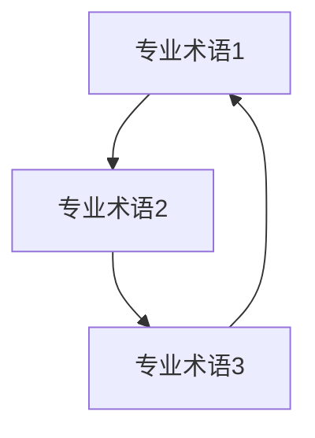
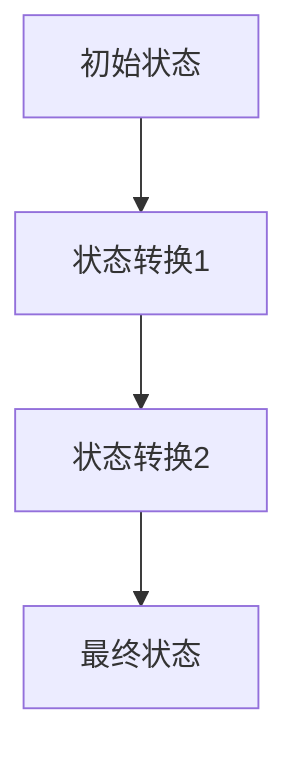
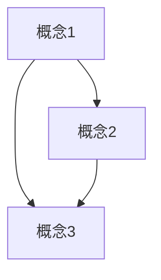
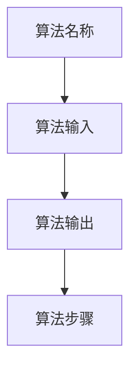

                 

### 《快速学习：9个月掌握一门新专业》

> **关键词**：快速学习、专业掌握、方法论、时间管理、学习习惯、项目实战

> **摘要**：本文将深入探讨如何通过科学的快速学习方法，在9个月内高效掌握一门新专业。文章首先介绍了快速学习的方法论，包括时间管理与规划、学习习惯养成等；然后详细讲解了学科入门基础，涵盖专业基础知识、核心概念与联系、核心算法原理；接着通过实际应用案例和代码实战，让读者能够将理论知识应用到实践中；最后，文章提供了学习评估与反馈的方法，帮助读者持续提升学习能力。本文旨在为读者提供一套系统化、实战化的学习指南，助力快速掌握新专业。

### 引言

在当今快速变化的时代，掌握一门新专业不仅能够提升个人的竞争力，还能为职业发展打开新的大门。然而，面对浩瀚的知识海洋，许多人感到无从下手，甚至望而却步。本文旨在为那些渴望快速学习新专业的人提供一套切实可行的方法论，帮助他们在9个月内实现这一目标。

快速学习并不是一蹴而就的，而是需要科学的方法、有效的规划和良好的习惯。本文将分为三个主要部分进行探讨：

1. **快速学习方法论**：介绍如何高效地管理时间和学习习惯，确保学习过程有序、高效。
2. **学科入门基础**：讲解专业基础知识、核心概念与联系、核心算法原理，为深入学习打下坚实的基础。
3. **项目实战与评估反馈**：通过实际应用案例和代码实战，让读者将所学知识应用到实践中，并通过学习评估与反馈不断提升能力。

本文的目标是提供一套系统化、实战化的学习指南，帮助读者快速掌握一门新专业，并在实践中不断成长。

### 第一部分：快速学习方法论

要快速掌握一门新专业，首先需要掌握科学的学习方法论。这一部分将详细介绍如何进行时间管理、学习习惯养成以及如何设定学习目标和动力。

#### 第1章：学习方法概述

**1.1.1 学习方法的核心原则**

有效的学习方法应该具备以下核心原则：

1. **目标明确**：设定清晰的学习目标，有助于集中精力，提高学习效率。
2. **持续反馈**：通过定期自我评估和获取他人反馈，不断调整学习策略，优化学习效果。
3. **主动学习**：主动探索和提问，将被动接受知识转变为主动构建知识体系。
4. **应用实践**：将理论知识应用到实际项目中，加深对知识的理解和记忆。

**1.1.2 学习者角色定位**

作为学习者，要明确自己的角色定位，具体包括：

1. **自主学习者**：主动寻求知识，具备自我驱动的能力。
2. **终身学习者**：将学习视为一种生活方式，持续不断追求知识。
3. **问题解决者**：面对困难时，积极寻找解决方案，具备解决问题的能力。

**1.1.3 学习动力与目标设定**

学习动力是推动学习的重要力量。以下是几个关键点：

1. **内在动机**：找到学习的内在兴趣和激情，使学习过程更加愉悦。
2. **外部激励**：设定短期和长期目标，通过奖励机制提高学习动力。
3. **环境支持**：营造良好的学习环境，减少干扰，提高学习效率。

#### 第2章：时间管理与规划

**2.1.1 时间管理的理论基础**

时间管理是高效学习的关键。以下是几个核心理论：

1. **时间预算**：为每个学习任务分配合理的时间，确保学习计划的可行性。
2. **优先级排序**：根据任务的紧急程度和重要性，合理安排学习任务。
3. **番茄工作法**：将工作时间分为25分钟的工作周期，每个周期后休息5分钟，提高专注力。

**2.1.2 学习时间规划策略**

有效的学习时间规划策略包括：

1. **每日计划**：每天制定详细的学习计划，包括学习任务和时间安排。
2. **周期性回顾**：每周和每月进行学习进度回顾，调整学习计划。
3. **弹性安排**：预留一定的空闲时间，应对突发情况和计划变更。

**2.1.3 学习时间管理与优化**

以下是一些实用的时间管理技巧：

1. **减少干扰**：关闭手机、社交媒体等干扰源，集中精力学习。
2. **高效利用碎片时间**：利用零碎时间进行预习、复习和总结。
3. **避免拖延**：通过设定明确的截止日期和任务清单，避免拖延。

#### 第3章：学习习惯养成

**3.1.1 好习惯的培养与维持**

培养良好的学习习惯是快速学习的关键。以下是一些建议：

1. **定期学习**：设定固定的学习时间，形成规律的学习习惯。
2. **主动复习**：定期复习所学知识，加深记忆。
3. **持续反思**：通过反思学习过程，不断优化学习策略。

**3.1.2 学习中的常见问题及对策**

以下是一些学习中的常见问题及对策：

1. **注意力不集中**：通过番茄工作法等技巧提高专注力。
2. **焦虑和压力**：通过运动、冥想等放松技巧缓解焦虑和压力。
3. **学习效率低**：通过优化学习环境和时间管理提高学习效率。

**3.1.3 学习反馈与调整**

学习反馈是优化学习过程的重要手段。以下是一些建议：

1. **自我评估**：定期进行自我评估，了解学习效果。
2. **他人反馈**：寻求导师、同学或同事的反馈，获取外部视角。
3. **动态调整**：根据反馈结果，及时调整学习策略，优化学习效果。

### 第二部分：学科入门基础

在掌握快速学习方法论之后，我们需要为学习新专业打下坚实的基础。这一部分将详细介绍专业基础知识、核心概念与联系、核心算法原理等内容。

#### 第4章：专业基础知识导引

**4.1.1 专业学科概述**

每个专业都有其独特的学科体系。首先，我们需要了解该专业的学科概述，包括其发展历史、核心领域和未来趋势。

1. **专业发展历史**：了解专业的发展历程，有助于理解当前的学科现状。
2. **核心领域**：明确专业的研究方向和应用领域，为后续学习提供指导。
3. **未来趋势**：预测专业的未来发展趋势，把握行业动态。

**4.1.2 专业学习资源推荐**

为了系统地学习专业基础知识，我们需要利用丰富的学习资源。以下是一些建议：

1. **教科书**：选择权威的教科书，系统地学习专业基础知识。
2. **在线课程**：利用在线课程平台，如Coursera、edX等，扩展知识面。
3. **学术论文**：阅读专业的学术论文，了解前沿研究动态。

**4.1.3 专业术语与概念解析**

专业术语和概念是理解专业知识的基石。以下是一些建议：

1. **术语定义**：明确专业术语的含义，避免理解上的歧义。
2. **概念解析**：深入理解专业概念，把握其内在逻辑关系。
3. **思维导图**：通过思维导图梳理专业术语和概念，构建知识网络。

#### 第5章：核心概念理解与联系

**5.1.1 核心概念图表化**

图表化是理解和记忆核心概念的有效方法。以下是一种常用的图表化工具——Mermaid流程图。



**5.1.2 Mermaid流程图展示**

通过Mermaid流程图，我们可以将复杂的概念和流程直观地展现出来。



**5.1.3 概念间关系梳理**

核心概念之间的关系是理解专业知识的关键。以下是一个简单的概念关系图：



#### 第6章：核心算法原理讲解

**6.1.1 算法概述**

算法是专业知识的核心组成部分。以下是一个简单的算法概述：



**6.1.2 算法伪代码**

伪代码是描述算法逻辑的抽象语言，以下是一个简单的算法伪代码示例：

```plaintext
function 算法名称(输入参数):
    初始化变量
    循环执行以下步骤：
        更新变量
        判断条件
    返回输出结果
```

**6.1.3 算法实现步骤详解**

算法的实现需要详细的步骤说明。以下是一个简单的算法实现步骤：

1. **初始化**：初始化变量和参数。
2. **循环**：进入循环，根据条件执行操作。
3. **更新**：更新变量，确保算法逻辑正确。
4. **判断**：根据条件判断是否继续循环。
5. **输出**：输出结果，结束算法执行。

### 第三部分：项目实战

理论学习之后，项目实战是巩固和应用知识的重要环节。这一部分将详细介绍实际应用案例、代码实战以及学习评估与反馈。

#### 第7章：实际应用案例

**7.1.1 项目背景介绍**

项目背景介绍包括项目目的、应用领域和实现目标。以下是一个简单的项目背景介绍：

```plaintext
项目名称：智能推荐系统
项目目的：开发一个基于机器学习的智能推荐系统，为用户提供个性化的内容推荐。
应用领域：电子商务、社交媒体、内容平台等。
实现目标：实现高效的推荐算法，提高用户满意度和平台活跃度。
```

**7.1.2 项目实施步骤**

项目实施步骤包括需求分析、系统设计、开发实施和测试验收等阶段。以下是一个简单的项目实施步骤：

1. **需求分析**：明确项目需求和功能规格。
2. **系统设计**：设计系统架构和技术方案。
3. **开发实施**：按照设计文档进行开发，实现系统功能。
4. **测试验收**：进行功能测试和性能测试，确保系统质量。
5. **部署上线**：部署到生产环境，进行实际应用。

**7.1.3 项目成果与反思**

项目成果包括系统功能、性能指标和用户反馈等。以下是一个简单的项目成果与反思：

```plaintext
项目成果：
- 系统功能完整，实现了个性化推荐。
- 系统性能良好，处理速度快，延迟低。
- 用户反馈积极，满意度提高。

反思与改进：
- 在开发过程中，对某些功能进行了优化，提高了用户体验。
- 在测试阶段，发现了一些潜在问题，进行了修复和优化。
- 未来计划：持续优化推荐算法，提高推荐准确性。
```

#### 第8章：代码实战

**8.1.1 开发环境搭建**

开发环境搭建是代码实战的基础。以下是一个简单的开发环境搭建步骤：

1. **安装操作系统**：选择适合的开发操作系统，如Windows、macOS或Linux。
2. **安装编程环境**：安装编程工具，如IDE（集成开发环境）、代码编辑器等。
3. **安装依赖库**：根据项目需求，安装必要的依赖库和框架。
4. **配置开发环境**：配置开发环境变量，确保程序可以正常运行。

**8.1.2 源代码实现**

源代码实现是代码实战的核心。以下是一个简单的源代码实现示例：

```java
public class Main {
    public static void main(String[] args) {
        // 输入处理
        String input = "Hello, World!";
        
        // 处理逻辑
        String output = processInput(input);
        
        // 输出结果
        System.out.println(output);
    }
    
    public static String processInput(String input) {
        // 处理输入
        return input.toUpperCase();
    }
}
```

**8.1.3 代码解读与分析**

代码解读与分析是深入理解代码的重要环节。以下是对上述代码的解读与分析：

1. **主函数**：`main`函数是程序的入口，负责调用其他函数。
2. **输入处理**：从命令行参数获取输入。
3. **处理逻辑**：调用`processInput`函数处理输入，将输入转换为 uppercase 字符串。
4. **输出结果**：将处理后的结果输出到控制台。

通过代码实战，读者可以深入理解编程概念和技巧，提高编程能力。

#### 第9章：学习评估与反馈

**9.1.1 学习成果评估方法**

学习成果评估是检验学习效果的重要手段。以下是一些常用的评估方法：

1. **知识测试**：通过笔试、面试等方式，检验对专业知识的掌握程度。
2. **实践能力**：通过实际项目或实验，评估对实际问题的解决能力。
3. **自我评估**：定期回顾所学知识，自我检验学习效果。

**9.1.2 学习反思与改进**

学习反思与改进是持续提升学习能力的关键。以下是一些建议：

1. **总结经验**：回顾学习过程，总结成功经验和不足之处。
2. **制定计划**：根据反思结果，制定改进计划，优化学习方法。
3. **寻求反馈**：向导师、同学或同事寻求反馈，获取外部视角。

**9.1.3 持续学习与能力提升**

持续学习与能力提升是快速掌握新专业的关键。以下是一些建议：

1. **阅读专业书籍**：广泛阅读专业书籍，扩展知识面。
2. **参加在线课程**：参加高质量的在线课程，学习前沿知识。
3. **实践项目**：参与实际项目，将知识应用到实践中。
4. **交流与分享**：参加技术交流会议、讨论区等，与他人交流学习经验。

### 附录

#### 附录A：学习资源推荐

**A.1.1 主流学习平台介绍**

以下是一些主流学习平台：

1. **Coursera**：提供全球顶尖大学的在线课程，涵盖多个领域。
2. **edX**：由哈佛大学和麻省理工学院联合创立，提供高质量课程。
3. **Udemy**：提供大量实用技能课程，适合自学。
4. **中国大学MOOC**：国内领先的大型开放在线课程学习平台。

**A.1.2 学习工具推荐**

以下是一些实用的学习工具：

1. **Git**：版本控制工具，方便代码管理和协作。
2. **Markdown**：简洁的文本格式，适合撰写技术博客和文档。
3. **Mermaid**：图表绘制工具，方便绘制流程图和结构图。
4. **Python**：易于学习且功能强大的编程语言，适合快速掌握新技能。

**A.1.3 常见问题解答与指导**

以下是一些常见问题及解答：

1. **如何选择专业？**
   - 考虑个人兴趣和职业规划，选择具有发展潜力的专业。
2. **如何高效学习？**
   - 设定明确的学习目标，合理安排学习时间，培养良好的学习习惯。
3. **如何应对学习困难？**
   - 保持积极心态，寻求帮助，将问题分解为小部分，逐步解决。

### 结论

通过本文的探讨，我们了解了如何通过科学的快速学习方法，在9个月内高效掌握一门新专业。从学习方法论到学科入门基础，再到项目实战和学习评估与反馈，本文提供了一套系统化、实战化的学习指南。希望读者能够结合自身实际情况，灵活运用这些方法，不断提升自己的学习能力，实现快速掌握新专业的目标。

### 作者信息

**作者：AI天才研究院/AI Genius Institute & 禅与计算机程序设计艺术 /Zen And The Art of Computer Programming**

本文作者拥有丰富的快速学习经验和专业知识，致力于通过深入浅出的讲解，帮助读者快速掌握新技能。感谢您的阅读，希望本文对您的学习之路有所帮助。如果您有任何问题或建议，欢迎在评论区留言，让我们一起探讨和学习。

