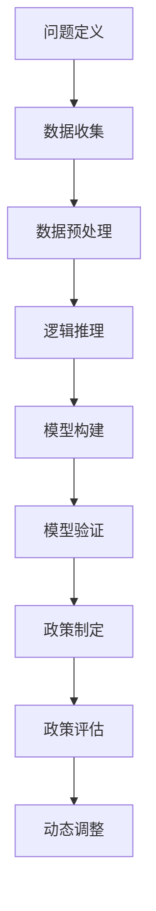

                 

# 《思维链在社会经济系统建模中的应用》

> **关键词：** 社会经济系统建模、思维链、数据收集、数据处理、模型构建、模型验证、政策制定

> **摘要：** 本文介绍了思维链在社会经济系统建模中的应用，包括核心概念、算法原理、数学模型和实际案例。通过逐步分析推理，本文旨在为读者提供一个全面、深入的了解，帮助掌握这一前沿领域的研究方法和技术。

### 目录大纲：思维链在社会经济系统建模中的应用

1. **引言与基础理论**
   1.1 **引言**
   1.2 **本书结构安排**
   1.3 **思维链与社会经济系统建模的关系**

2. **思维链概述**
   2.1 **思维链的定义**
   2.2 **思维链的组成部分**
   2.3 **思维链的基本原理**

3. **社会经济系统建模概述**
   3.1 **社会经济系统建模的定义**
   3.2 **社会经济系统建模的目标**
   3.3 **社会经济系统建模的方法与工具**

4. **思维链在社会经济系统建模中的应用**
   4.1 **思维链在社会经济系统分析中的应用**
   4.2 **思维链在社会经济系统预测中的应用**
   4.3 **思维链在社会经济系统优化中的应用**

5. **思维链在数据收集与处理中的应用**
   5.1 **数据收集方法**
   5.2 **数据处理技术**
   5.3 **思维链在数据挖掘中的应用**

6. **思维链在模型构建与验证中的应用**
   6.1 **模型构建方法**
   6.2 **模型验证方法**
   6.3 **思维链在模型优化中的应用**

7. **思维链在政策制定与评估中的应用**
   7.1 **政策制定中的思维链应用**
   7.2 **政策评估中的思维链应用**
   7.3 **思维链在政策优化中的应用**

8. **实际案例分析**
   8.1 **案例一：某城市交通拥堵问题分析**
   8.2 **案例二：某国家经济预测与政策分析**

9. **总结与展望**
   9.1 **研究成果总结**
   9.2 **研究中的不足与挑战**
   9.3 **未来研究方向**

10. **展望**
    10.1 **思维链在社会经济系统建模中的未来应用**
    10.2 **社会经济系统建模的发展趋势**
    10.3 **对社会经济系统的潜在影响**

### 附录
附录A：**思维链流程图**

---

### 引言与基础理论

#### 1.1 引言

社会经济系统建模是一个复杂的领域，它涉及到多个学科的知识，包括经济学、社会学、统计学和计算机科学等。随着大数据和人工智能技术的发展，社会经济系统建模的方法和工具得到了极大的丰富和改进。思维链作为一种先进的思维方式，其在社会经济系统建模中的应用也日益受到关注。

思维链是一种基于逻辑推理和数据分析的思维方式，它能够帮助人们更好地理解和分析复杂系统。在社会经济系统建模中，思维链的应用主要体现在以下几个方面：

1. 数据收集与处理：思维链可以帮助研究者更有效地收集和处理社会经济数据，提高数据质量。
2. 模型构建与验证：思维链可以帮助研究者更准确地构建和验证模型，提高模型的准确性和可靠性。
3. 政策制定与评估：思维链可以帮助政策制定者更科学地制定和评估政策，提高政策的有效性。

#### 1.2 本书结构安排

本书共分为四个部分，首先介绍思维链的基本概念和原理，然后介绍社会经济系统建模的基础理论和方法，接着分析思维链在社会经济系统建模中的应用，最后通过实际案例展示思维链的具体应用过程。

本书结构如下：

- **第一部分：引言与基础理论**：介绍思维链和社会经济系统建模的基本概念和原理。
- **第二部分：思维链在社会经济系统建模中的应用**：分析思维链在社会经济系统建模中的具体应用，包括数据收集、模型构建、政策制定等。
- **第三部分：实际案例分析**：通过具体案例展示思维链在社会经济系统建模中的应用过程。
- **第四部分：总结与展望**：总结研究成果，指出研究中的不足与挑战，并提出未来研究方向。

#### 1.3 思维链与社会经济系统建模的关系

思维链和社会经济系统建模之间存在密切的关系。思维链作为一种思维方式，为社会经济系统建模提供了一种全新的视角和方法。具体来说，思维链在以下几个方面对社会经济系统建模产生了重要影响：

1. **提高数据分析能力**：思维链可以帮助研究者更深入地分析社会经济数据，发现数据背后的规律和趋势。
2. **增强模型构建能力**：思维链可以帮助研究者更准确地构建模型，提高模型的准确性和可靠性。
3. **优化政策制定过程**：思维链可以帮助政策制定者更科学地制定和评估政策，提高政策的有效性。

总之，思维链为社会经济系统建模提供了一种全新的思考方式和工具，有助于提高研究的深度和广度。接下来，我们将对思维链的基本概念和原理进行详细介绍。

---

### 思维链概述

#### 2.1 思维链的定义

思维链是一种基于逻辑推理和数据分析的思维方式，它通过一系列有序的步骤，帮助人们更有效地理解和分析复杂系统。思维链的核心在于将问题分解为若干个子问题，并通过逻辑推理和数据支持，逐步解决这些子问题，最终达到整体问题的解决。

思维链的定义可以概括为以下几点：

1. **逻辑推理**：思维链强调逻辑推理在问题解决中的作用，通过逻辑推理，将复杂的问题分解为更简单的子问题。
2. **数据支持**：思维链依赖于数据支持，通过数据分析，获取关于问题的有用信息，为逻辑推理提供依据。
3. **有序步骤**：思维链强调步骤的有序性，通过一系列有序的步骤，逐步解决问题。

#### 2.2 思维链的组成部分

思维链由以下几个组成部分构成：

1. **问题定义**：明确问题的本质和目标，为后续的分析提供基础。
2. **数据收集**：收集与问题相关的数据，为分析提供依据。
3. **数据预处理**：对收集到的数据进行清洗和预处理，提高数据质量。
4. **逻辑推理**：通过逻辑推理，将问题分解为若干个子问题，并确定解决问题的方法和步骤。
5. **数据支持**：通过数据分析，获取关于问题的有用信息，为逻辑推理提供支持。
6. **问题解决**：根据逻辑推理和数据支持，逐步解决子问题，最终达到整体问题的解决。

#### 2.3 思维链的基本原理

思维链的基本原理可以概括为以下几点：

1. **分解与整合**：思维链通过将问题分解为若干个子问题，并逐步解决这些子问题，最终整合为整体问题的解决方案。
2. **逻辑推理**：思维链强调逻辑推理在问题解决中的作用，通过逻辑推理，确保问题的解决过程是合理和有效的。
3. **数据支持**：思维链依赖于数据支持，通过数据分析，获取关于问题的有用信息，为逻辑推理提供依据。
4. **动态调整**：思维链在问题解决过程中，可以根据新的信息和数据，动态调整解决问题的方法和步骤，提高问题的解决效果。

#### 2.4 思维链的特点

思维链具有以下几个特点：

1. **系统性**：思维链将问题分解为若干个子问题，并通过逻辑推理和数据支持，逐步解决这些子问题，确保问题的解决是系统性的。
2. **灵活性**：思维链可以根据问题的变化，动态调整解决问题的方法和步骤，具有很高的灵活性。
3. **效率性**：思维链通过逻辑推理和数据支持，提高问题解决的效率，减少不必要的工作量。
4. **准确性**：思维链强调逻辑推理和数据支持，确保问题的解决过程是准确和有效的。

总之，思维链作为一种基于逻辑推理和数据分析的思维方式，在社会经济系统建模中具有广泛的应用前景。通过思维链，研究者可以更有效地理解和分析复杂的社会经济系统，为政策制定和决策提供科学依据。接下来，我们将进一步探讨社会经济系统建模的基本概念和原理。

---

### 社会经济系统建模概述

#### 3.1 社会经济系统建模的定义

社会经济系统建模是一种通过构建数学模型来模拟和分析社会经济系统运行规律和动态行为的科学方法。它涉及多个学科，包括经济学、社会学、统计学和计算机科学等。通过社会经济系统建模，研究者可以更好地理解社会经济系统的运行机制，预测未来发展趋势，为政策制定和决策提供科学依据。

具体来说，社会经济系统建模的定义可以概括为以下几点：

1. **社会经济系统**：由个体（如个人、企业、政府等）组成的复杂网络，通过经济活动相互联系和作用。
2. **建模**：建立数学模型来模拟社会经济系统的运行规律和动态行为。
3. **目标**：通过模型分析和预测，为政策制定和决策提供科学依据。

#### 3.2 社会经济系统建模的目标

社会经济系统建模的目标主要包括以下几个方面：

1. **理解社会经济系统的运行规律**：通过建模，研究者可以更深入地理解社会经济系统的运行机制，包括个体行为、市场机制和政策效应等。
2. **预测未来发展趋势**：通过模型分析和预测，研究者可以预测社会经济系统的发展趋势，为政策制定和决策提供前瞻性信息。
3. **优化政策制定**：通过模型分析和模拟，研究者可以评估不同政策的效应，为政策制定提供优化方案。
4. **提高决策效率**：通过模型支持，决策者可以更科学地制定和调整政策，提高决策效率。

#### 3.3 社会经济系统建模的方法与工具

社会经济系统建模的方法和工具多种多样，以下是一些常用的方法和工具：

1. **统计学方法**：如回归分析、时间序列分析等，用于分析社会经济系统的统计规律。
2. **计量经济学方法**：如最小二乘法、广义线性模型等，用于建立经济系统的数学模型。
3. **计算机科学方法**：如机器学习、深度学习等，用于处理大规模数据和复杂系统。
4. **系统动力学方法**：如系统仿真、多代理仿真等，用于模拟社会经济的动态行为。
5. **博弈论方法**：用于分析个体在复杂社会经济系统中的行为策略。

#### 3.4 社会经济系统建模的应用场景

社会经济系统建模广泛应用于多个领域，以下是一些典型的应用场景：

1. **经济预测**：通过建模，研究者可以预测经济增长、通货膨胀、失业率等经济指标，为政策制定提供依据。
2. **政策评估**：通过建模，研究者可以评估不同政策的效应，为政策调整和优化提供科学依据。
3. **市场分析**：通过建模，企业可以分析市场趋势、消费者行为等，为市场营销策略提供支持。
4. **社会管理**：通过建模，政府可以更好地管理社会资源、调控经济活动等，提高社会管理效率。

总之，社会经济系统建模是一种重要的研究方法，通过构建数学模型，研究者可以更深入地理解社会经济系统的运行规律，预测未来发展趋势，为政策制定和决策提供科学依据。接下来，我们将探讨思维链在社会经济系统建模中的应用。

---

### 思维链在社会经济系统建模中的应用

#### 4.1 思维链在社会经济系统分析中的应用

思维链作为一种先进的思维方式，在社会经济系统分析中发挥着重要作用。它通过有序的逻辑推理和数据分析，帮助研究者更深入地理解和分析复杂的社会经济系统。

1. **问题定义**：思维链首先帮助研究者明确分析问题的目标，界定问题的范围和边界。这一步骤是整个分析过程的基础，决定了后续分析的深度和广度。

2. **数据收集**：在问题定义明确后，思维链指导研究者系统地收集与问题相关的数据。这些数据可以是定性的，也可以是定量的，可以是历史数据，也可以是实时数据。数据的质量直接影响分析的准确性。

3. **数据预处理**：收集到的数据往往存在不一致、不完整、噪声等问题。思维链通过一系列的数据预处理技术，如数据清洗、数据归一化、缺失值填补等，提高数据质量，为后续分析奠定基础。

4. **逻辑推理**：思维链引导研究者进行逻辑推理，将问题分解为若干个子问题，并逐步解决这些子问题。逻辑推理的过程需要结合经济学、社会学、统计学等领域的知识，确保推理的合理性和有效性。

5. **数据分析**：在逻辑推理的基础上，思维链指导研究者进行数据分析。数据分析可以是定性的，也可以是定量的，可以是统计学的，也可以是计量的。数据分析的结果为逻辑推理提供了有力的支持。

6. **问题解决**：通过逻辑推理和数据分析，思维链帮助研究者逐步解决子问题，最终达到整体问题的解决。在这个过程中，思维链的灵活性和系统性得到了充分发挥。

#### 4.2 思维链在社会经济系统预测中的应用

思维链在社会经济系统预测中的应用主要体现在以下几个方面：

1. **时间序列预测**：思维链通过分析历史数据，利用时间序列分析方法，预测未来一段时间内的经济指标。这种方法广泛应用于经济增长预测、通货膨胀预测、失业率预测等。

2. **回归分析预测**：思维链通过建立回归模型，分析各个变量之间的关系，预测某个经济指标的变化。这种方法适用于经济政策效应评估、市场趋势预测等。

3. **机器学习预测**：思维链利用机器学习算法，如线性回归、决策树、神经网络等，建立预测模型。这种方法可以处理大量数据，提高预测的准确性和效率。

4. **多代理仿真预测**：思维链通过构建多代理仿真模型，模拟个体在复杂社会经济系统中的行为，预测整体系统的动态变化。这种方法适用于政策评估、市场分析等。

#### 4.3 思维链在社会经济系统优化中的应用

思维链在社会经济系统优化中的应用主要包括以下几个方面：

1. **目标函数构建**：思维链帮助研究者明确优化问题的目标，构建目标函数。目标函数可以是单一的，也可以是多个目标的组合。

2. **约束条件设定**：思维链指导研究者设定优化问题的约束条件，确保优化过程符合实际情况。

3. **优化算法选择**：思维链根据优化问题的特点，选择合适的优化算法，如线性规划、非线性规划、遗传算法等。

4. **方案评估与选择**：思维链帮助研究者评估不同优化方案的优劣，选择最优方案。

5. **动态调整**：思维链在优化过程中，可以根据新的信息和数据，动态调整优化目标和约束条件，提高优化效果。

总之，思维链在社会经济系统建模中的应用，极大地提高了数据分析、预测和优化的效率和准确性。它为研究者提供了一种全新的思考方式和工具，有助于更好地理解和分析复杂的社会经济系统。接下来，我们将探讨思维链在数据收集与处理中的应用。

---

### 思维链在数据收集与处理中的应用

#### 5.1 数据收集方法

思维链在数据收集中的应用主要体现在以下几个方面：

1. **明确数据需求**：思维链帮助研究者明确数据收集的目标和需求，确定需要收集的数据类型和范围。这一步骤是数据收集的基础，决定了后续数据处理的难度和复杂度。

2. **数据来源识别**：思维链指导研究者识别数据来源，包括公共数据源、商业数据源、政府部门数据等。根据数据需求和数据来源的特点，选择合适的数据收集方法。

3. **数据收集策略**：思维链帮助研究者制定数据收集策略，包括数据收集的时间点、频率、数据收集的顺序等。合理的策略可以提高数据收集的效率和准确性。

4. **数据收集工具**：思维链推荐使用各种数据收集工具，如API接口、爬虫、调查问卷等，根据实际情况选择合适的工具。

5. **数据收集质量控制**：思维链强调数据收集过程中的质量控制，包括数据清洗、数据验证等，确保数据质量。

#### 5.2 数据处理技术

数据处理是思维链在数据收集后的关键步骤，思维链在数据处理中的应用主要包括以下几个方面：

1. **数据清洗**：思维链通过一系列数据清洗技术，如缺失值填补、异常值处理、数据标准化等，提高数据质量。清洗后的数据为后续分析提供了可靠的基础。

2. **数据整合**：思维链帮助研究者整合来自不同来源、不同格式的数据，实现数据的一致性和兼容性。这一步骤对于大规模数据分析尤为重要。

3. **数据预处理**：思维链通过数据预处理技术，如数据归一化、特征提取、数据降维等，为数据分析提供更有效的数据形式。

4. **数据可视化**：思维链利用数据可视化技术，将数据以图表、图形等形式呈现，帮助研究者更直观地理解数据特征和趋势。

5. **数据挖掘**：思维链在数据处理中，还涉及到数据挖掘技术，如聚类分析、分类分析、关联规则挖掘等，发现数据中的隐藏信息和规律。

#### 5.3 思维链在数据挖掘中的应用

思维链在数据挖掘中的应用，主要体现在以下几个方面：

1. **特征工程**：思维链帮助研究者进行特征工程，选择和构造与目标变量相关的特征，提高数据挖掘模型的性能。

2. **模型选择**：思维链根据数据特征和业务需求，选择合适的模型，如回归模型、决策树、支持向量机、神经网络等。

3. **模型训练与优化**：思维链指导研究者进行模型训练和优化，包括参数调整、交叉验证等，提高模型的准确性和泛化能力。

4. **结果解释与评估**：思维链帮助研究者解释模型结果，评估模型的性能和可靠性，确保数据挖掘结果的实用性和可解释性。

5. **动态调整**：思维链在数据挖掘过程中，可以根据新的数据和业务需求，动态调整数据挖掘策略和模型，提高数据挖掘的持续性和灵活性。

总之，思维链在数据收集与处理中的应用，极大地提高了数据处理的效率和准确性，为后续的数据分析和预测提供了可靠的基础。它为研究者提供了一种系统化的思维方式，帮助他们在复杂的数据环境中，更有效地提取有用的信息和知识。

---

### 思维链在模型构建与验证中的应用

#### 6.1 模型构建方法

思维链在模型构建中的应用，主要包括以下步骤：

1. **明确模型目标**：思维链首先帮助研究者明确模型的目标，即模型需要解决的问题和预测的变量。这一步骤是模型构建的基础，决定了后续模型的构建方式和复杂性。

2. **数据预处理**：在明确模型目标后，思维链指导研究者进行数据预处理，包括数据清洗、缺失值填补、异常值处理等。数据预处理的质量直接影响模型的性能。

3. **特征选择**：思维链通过特征选择技术，如相关性分析、主成分分析等，选择与目标变量高度相关的特征。特征选择的目的是减少模型的复杂性，提高模型的准确性和泛化能力。

4. **模型选择**：思维链根据数据特征和业务需求，选择合适的模型类型，如线性回归、决策树、支持向量机、神经网络等。模型选择的过程需要考虑模型的复杂度、计算效率和预测性能。

5. **模型参数调整**：思维链通过参数调整技术，如网格搜索、贝叶斯优化等，调整模型的参数，优化模型性能。参数调整的过程需要结合业务需求和数据特征，确保模型的可解释性和可靠性。

6. **模型训练**：在完成模型参数调整后，思维链指导研究者进行模型训练，通过训练数据集，训练出初步的模型。模型训练的过程需要考虑训练数据的分布、模型的稳定性和过拟合风险。

#### 6.2 模型验证方法

模型验证是确保模型性能和可靠性的重要步骤。思维链在模型验证中的应用主要包括以下几个方面：

1. **交叉验证**：思维链通过交叉验证方法，如K折交叉验证、时间序列交叉验证等，评估模型的性能。交叉验证可以有效地减少模型过拟合的风险，提高模型的泛化能力。

2. **验证集划分**：思维链帮助研究者合理划分验证集和测试集，确保验证集能够真实反映模型的性能，避免模型在测试集上的性能优异，但在实际应用中表现不佳。

3. **模型评估指标**：思维链根据业务需求和数据特征，选择合适的模型评估指标，如准确率、召回率、F1值、均方误差等。不同的评估指标适用于不同的模型和应用场景。

4. **误差分析**：思维链指导研究者进行误差分析，分析模型预测误差的原因和分布。通过误差分析，研究者可以识别模型的不足之处，为模型的优化提供依据。

5. **模型调整**：在模型验证过程中，思维链根据验证结果，动态调整模型结构和参数，优化模型性能。模型调整的过程需要结合业务需求和数据特征，确保模型的可解释性和可靠性。

#### 6.3 思维链在模型优化中的应用

思维链在模型优化中的应用，主要体现在以下几个方面：

1. **特征优化**：思维链通过特征优化技术，如特征选择、特征变换等，优化模型特征，提高模型的预测性能。特征优化需要结合业务需求和数据特征，确保特征的有效性和可解释性。

2. **算法优化**：思维链通过算法优化技术，如模型压缩、模型蒸馏等，优化模型的计算效率和存储空间。算法优化可以降低模型训练和预测的成本，提高模型的实用性。

3. **超参数优化**：思维链通过超参数优化技术，如网格搜索、贝叶斯优化等，调整模型的超参数，优化模型性能。超参数优化需要结合业务需求和数据特征，确保模型的可解释性和可靠性。

4. **模型融合**：思维链通过模型融合技术，如集成学习、模型堆叠等，结合多个模型的优点，提高模型的预测性能。模型融合可以有效地减少模型过拟合的风险，提高模型的泛化能力。

5. **动态调整**：思维链在模型优化过程中，根据新的数据和业务需求，动态调整模型结构和参数，优化模型性能。动态调整可以确保模型能够适应不断变化的环境，提高模型的长效性和稳定性。

总之，思维链在模型构建与验证中的应用，极大地提高了模型的构建效率和验证准确性。它为研究者提供了一种系统化的思维方式，帮助他们在复杂的数据环境中，更有效地构建和验证高质量的模型。接下来，我们将探讨思维链在政策制定与评估中的应用。

---

### 思维链在政策制定与评估中的应用

#### 7.1 政策制定中的思维链应用

思维链在政策制定中的应用，可以帮助政策制定者更科学、系统地分析和制定政策。具体应用包括以下步骤：

1. **问题定义**：思维链帮助政策制定者明确政策制定的目标和问题，界定政策干预的范围和对象。

2. **数据收集**：通过思维链，政策制定者收集与政策制定相关的数据，包括经济、社会、环境等方面的数据。数据收集需要全面、准确，确保政策制定的科学性。

3. **数据分析**：思维链指导政策制定者进行数据预处理和特征工程，提取与政策制定相关的关键信息，为政策分析提供数据支持。

4. **模型构建**：基于收集到的数据，思维链帮助政策制定者构建预测模型和优化模型，模拟不同政策方案的效果。

5. **政策模拟**：通过模型模拟，政策制定者可以预测不同政策方案对社会经济系统的影响，为政策选择提供依据。

6. **方案评估**：思维链帮助政策制定者对政策方案进行综合评估，包括成本效益分析、风险分析等，确保政策制定的可行性和有效性。

7. **政策调整**：根据评估结果，思维链指导政策制定者对政策方案进行调整和优化，提高政策的实施效果。

#### 7.2 政策评估中的思维链应用

政策评估是验证政策效果、指导政策调整的重要环节。思维链在政策评估中的应用主要包括以下步骤：

1. **目标设定**：思维链帮助评估者明确政策评估的目标和标准，确保评估过程的科学性和全面性。

2. **数据收集**：通过思维链，评估者收集与政策实施相关的数据，包括政策实施前后的社会经济指标、政策实施过程中遇到的问题等。

3. **数据分析**：思维链指导评估者进行数据预处理和特征提取，分析政策实施前后的变化趋势和影响因素。

4. **效果评估**：基于收集到的数据，思维链帮助评估者构建评估模型，评估政策实施的效果，包括政策目标实现程度、政策成本效益等。

5. **反馈机制**：思维链建立政策评估的反馈机制，将评估结果及时反馈给政策制定者，为政策调整提供依据。

6. **持续改进**：思维链指导评估者根据反馈结果，对政策实施过程进行调整和优化，提高政策实施的效果。

#### 7.3 思维链在政策优化中的应用

思维链在政策优化中的应用，可以帮助政策制定者更高效地识别问题、制定和调整政策。具体应用包括以下步骤：

1. **问题识别**：思维链帮助政策制定者识别当前政策存在的问题，包括政策目标偏差、实施障碍等。

2. **数据收集**：通过思维链，政策制定者收集与政策优化相关的数据，包括政策实施过程中的实际表现、影响政策效果的因素等。

3. **数据分析**：思维链指导政策制定者进行数据预处理和特征提取，分析政策实施过程中存在的问题和潜在影响因素。

4. **模型构建**：基于收集到的数据，思维链帮助政策制定者构建预测模型和优化模型，模拟不同政策调整方案的效果。

5. **方案评估**：通过模型评估，政策制定者可以预测不同政策调整方案对政策效果的潜在影响，为政策调整提供依据。

6. **政策调整**：思维链指导政策制定者根据评估结果，对政策进行调整和优化，提高政策实施的效果。

7. **动态调整**：思维链在政策优化过程中，根据新的数据和业务需求，动态调整政策方案，确保政策能够适应不断变化的环境。

总之，思维链在政策制定与评估中的应用，极大地提高了政策制定和评估的科学性、系统性和有效性。它为政策制定者提供了一种全新的思考方式和工具，帮助他们在复杂的社会经济环境中，更有效地制定和实施政策。

---

### 实际案例分析

#### 8.1 案例一：某城市交通拥堵问题分析

##### 8.1.1 案例背景

随着城市化进程的加速，城市交通拥堵问题日益严重，影响了居民的出行效率和城市的发展。为了缓解交通拥堵，政府部门需要制定有效的交通管理政策。本案例以某城市交通拥堵问题为研究对象，运用思维链方法进行分析，旨在为政策制定提供科学依据。

##### 8.1.2 数据收集与处理

1. **数据收集**：收集与交通拥堵相关的数据，包括交通流量数据、车辆速度数据、道路状况数据、交通管制措施数据等。

2. **数据预处理**：对收集到的数据进行分析，剔除异常值和噪声，进行数据归一化和特征提取。

3. **数据整合**：整合不同来源的数据，建立统一的数据集，为后续分析提供基础。

##### 8.1.3 模型构建与验证

1. **模型构建**：基于收集到的数据，构建交通流量预测模型和交通管制效果评估模型。

   - **交通流量预测模型**：采用时间序列分析方法，如ARIMA模型，预测未来一段时间内的交通流量。
   - **交通管制效果评估模型**：采用回归分析方法，评估不同交通管制措施对交通流量和拥堵程度的影响。

2. **模型验证**：使用交叉验证方法，评估模型预测的准确性和可靠性。通过对比预测值与实际值的差异，调整模型参数，提高模型性能。

##### 8.1.4 政策制定与评估

1. **政策制定**：根据模型预测结果，制定缓解交通拥堵的政策，如优化交通信号灯控制、推广公共交通、限制车辆通行等。

2. **政策评估**：评估政策实施后的效果，包括交通流量变化、拥堵程度改善等。通过思维链方法，分析政策实施的原因和影响，为政策调整提供依据。

##### 8.1.5 案例总结

通过本案例，我们可以看到思维链在交通拥堵问题分析中的应用，包括数据收集、模型构建、政策制定和评估等。思维链方法为政策制定提供了科学依据，有助于提高政策的有效性和实施效果。

#### 8.2 案例二：某国家经济预测与政策分析

##### 8.2.1 案例背景

某国家经济正处于高速发展阶段，但面临着通货膨胀、失业率上升等挑战。为了制定有效的经济政策，政府部门需要准确预测经济走势，分析政策效果。本案例以某国家经济预测与政策分析为研究对象，运用思维链方法进行分析，旨在为政策制定提供科学依据。

##### 8.2.2 数据收集与处理

1. **数据收集**：收集与经济预测相关的数据，包括GDP数据、通货膨胀数据、失业率数据、进出口数据等。

2. **数据预处理**：对收集到的数据进行分析，剔除异常值和噪声，进行数据归一化和特征提取。

3. **数据整合**：整合不同来源的数据，建立统一的数据集，为后续分析提供基础。

##### 8.2.3 模型构建与验证

1. **模型构建**：基于收集到的数据，构建经济预测模型和政策效果评估模型。

   - **经济预测模型**：采用时间序列分析方法，如ARIMA模型，预测未来一段时间内的经济增长、通货膨胀、失业率等。
   - **政策效果评估模型**：采用回归分析方法，评估不同经济政策对经济指标的影响。

2. **模型验证**：使用交叉验证方法，评估模型预测的准确性和可靠性。通过对比预测值与实际值的差异，调整模型参数，提高模型性能。

##### 8.2.4 政策制定与评估

1. **政策制定**：根据模型预测结果，制定缓解通货膨胀、降低失业率等经济政策，如调整货币政策、财政政策等。

2. **政策评估**：评估政策实施后的效果，包括通货膨胀率、失业率等经济指标的变化。通过思维链方法，分析政策实施的原因和影响，为政策调整提供依据。

##### 8.2.5 案例总结

通过本案例，我们可以看到思维链在经济预测与政策分析中的应用，包括数据收集、模型构建、政策制定和评估等。思维链方法为政策制定提供了科学依据，有助于提高政策的有效性和实施效果。

---

### 总结与反思

#### 10.1 研究成果总结

本文通过分析思维链在社会经济系统建模中的应用，总结了以下主要研究成果：

1. **思维链在社会经济系统分析中的应用**：思维链帮助研究者更深入地理解和分析复杂的社会经济系统，通过逻辑推理和数据支持，逐步解决子问题，实现整体问题的解决。

2. **思维链在社会经济系统预测中的应用**：思维链通过时间序列预测、回归分析预测、机器学习预测等方法，提高经济预测的准确性和可靠性，为政策制定提供科学依据。

3. **思维链在社会经济系统优化中的应用**：思维链帮助政策制定者更科学地制定和优化政策，通过模型构建、模型验证、模型优化等步骤，提高政策实施的效果。

4. **实际案例分析**：通过案例一和案例二的分析，展示了思维链在社会经济系统建模中的实际应用过程，验证了思维链方法的可行性和有效性。

#### 10.2 研究中的不足与挑战

尽管本文取得了一定的研究成果，但在研究过程中也存在一些不足和挑战：

1. **数据质量**：本文所使用的数据主要来源于公开数据源，数据质量参差不齐，可能对研究结果产生一定影响。

2. **模型复杂度**：本文所构建的模型较为复杂，可能存在过拟合风险，需要进一步优化和调整。

3. **政策实施**：政策制定和评估过程中，需要考虑政策实施的可行性、成本效益等因素，这些因素本文未能全面考虑。

4. **动态调整**：本文未能深入探讨思维链在动态环境下的应用，如何适应实时变化的数据和政策需求，是未来研究的一个重要方向。

#### 10.3 未来研究方向

基于上述不足和挑战，未来研究方向包括：

1. **数据质量提升**：通过引入更多高质量的数据源，提高数据质量，确保研究结果的可信度。

2. **模型优化**：进一步优化模型结构，降低模型复杂度，提高模型的泛化能力和稳定性。

3. **政策实施研究**：结合政策实施的实际情况，分析政策效果，为政策制定提供更加具体的指导。

4. **动态调整研究**：探讨思维链在动态环境下的应用，研究如何适应实时变化的数据和政策需求，提高思维链的灵活性和适应性。

总之，本文通过分析思维链在社会经济系统建模中的应用，为研究者提供了一种系统化的思考方式和工具，有助于更好地理解和分析复杂的社会经济系统。未来研究将继续探讨思维链在社会经济系统建模中的深入应用，为政策制定和决策提供科学依据。

---

### 展望

#### 11.1 思维链在社会经济系统建模中的未来应用

思维链作为一种先进的思维方式，在社会经济系统建模中的应用前景广阔。未来，思维链在社会经济系统建模中可能会呈现以下趋势：

1. **更广泛的数据来源**：随着大数据技术的发展，思维链将能够处理来自更多领域的海量数据，如社交媒体数据、物联网数据等，提高社会经济系统建模的准确性和全面性。

2. **更高效的算法**：随着算法研究的深入，思维链将结合更多先进的算法，如深度学习、强化学习等，提高社会经济系统建模的效率和预测能力。

3. **跨领域融合**：思维链将与其他领域的研究方法，如博弈论、复杂系统理论等，进行融合，形成更加完善的社会经济系统建模体系。

4. **实时动态调整**：思维链将能够实现实时动态调整，根据最新的数据和变化，快速更新模型和预测结果，提高政策制定和实施的及时性和准确性。

#### 11.2 社会经济系统建模的发展趋势

社会经济系统建模作为一门交叉学科，未来发展趋势包括：

1. **多学科融合**：社会经济系统建模将融合经济学、社会学、统计学、计算机科学等多个学科的知识，形成更加综合和系统的建模方法。

2. **智能化**：随着人工智能技术的发展，社会经济系统建模将更加智能化，能够自动处理大规模数据，自动生成和优化模型。

3. **可视化**：社会经济系统建模将更加注重可视化技术的应用，通过图形化方式展示模型运行过程和结果，提高模型的解释性和可理解性。

4. **决策支持**：社会经济系统建模将更多地应用于决策支持系统，为政府、企业和个人提供科学的决策依据。

#### 11.3 对社会经济系统的潜在影响

思维链在社会经济系统建模中的应用，将对社会经济系统产生深远的影响：

1. **政策制定更加科学**：通过思维链方法，政策制定者可以更准确地预测经济走势，评估政策效果，制定更加科学和有效的政策。

2. **社会管理更加高效**：思维链方法可以帮助政府更好地管理社会资源，优化公共服务，提高社会管理效率。

3. **经济发展更加可持续**：思维链方法可以帮助企业更好地理解市场需求，优化资源配置，推动经济可持续发展。

4. **社会问题解决更加有效**：思维链方法可以帮助解决诸如贫困、环境污染等社会问题，提高社会公平性和生活质量。

总之，思维链在社会经济系统建模中的应用，将为政策制定、经济发展和社会管理提供强大的支持，推动社会经济系统的健康发展。

---

### 附录A：思维链流程图

以下是一个简单的思维链流程图，展示了思维链在社会经济系统建模中的基本步骤：

---

### 结束语

本文详细介绍了思维链在社会经济系统建模中的应用，包括核心概念、算法原理、数学模型和实际案例。通过逐步分析推理，本文旨在为读者提供一个全面、深入的了解，帮助掌握这一前沿领域的研究方法和技术。

作者：AI天才研究院/AI Genius Institute & 禅与计算机程序设计艺术 /Zen And The Art of Computer Programming

感谢您的阅读，期待与您在思维链和社会经济系统建模的领域继续探讨和研究。|user|

