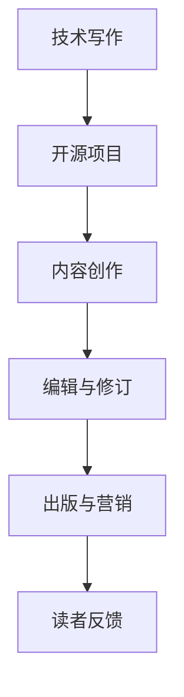

                 

### 《技术作家之路：从开源项目到出版技术书籍》

> **关键词：** 技术写作、开源项目、书籍出版、市场调研、读者反馈、个人品牌建设

> **摘要：** 本文旨在探讨从参与开源项目到出版技术书籍的全过程，通过分析技术写作的基础、开源项目参与、书籍主题选择、内容创作与编辑、出版与营销策略，以及持续成长与反馈，为技术作家提供一套系统化的指导方案。

### 《技术作家之路：从开源项目到出版技术书籍》目录大纲

#### 第一部分：技术写作与开源文化

**第1章：技术写作基础**

- **1.1 技术写作的重要性**
- **1.2 技术写作的流程与方法**
- **1.3 技术写作风格与技巧**

**第2章：开源项目与社区参与**

- **2.1 开源项目概述**
- **2.2 参与开源项目的步骤**
- **2.3 开源项目社区文化**

#### 第二部分：技术书籍出版准备

**第3章：书籍主题选择与规划**

- **3.1 主题选择的重要性**
- **3.2 市场调研与定位**
- **3.3 书籍大纲与结构规划**

**第4章：内容创作与编辑**

- **4.1 内容创作技巧**
- **4.2 代码示例与图表设计**
- **4.3 审校与修订**

#### 第三部分：出版与营销

**第5章：出版社选择与合作**

- **5.1 出版社选择标准**
- **5.2 与出版社的合作流程**
- **5.3 纸质书与电子书的发行**

**第6章：书籍营销策略**

- **6.1 个人品牌建设**
- **6.2 社交媒体营销**
- **6.3 书籍推广活动**

#### 第四部分：持续成长与反馈

**第7章：读者反馈与书籍改进**

- **7.1 收集读者反馈**
- **7.2 处理读者建议**
- **7.3 书籍更新与迭代**

**第8章：技术写作之路**

- **8.1 技术写作的长期发展**
- **8.2 多元化发展**
- **8.3 个人成长与社区贡献**

#### 附录

**附录：资源与工具推荐**

- **A.1 技术写作工具**
- **A.2 开源项目平台**
- **A.3 出版资源**
- **A.4 社交媒体平台**
- **A.5 在线学习资源**

---

#### 核心概念与联系

**技术写作** 是一种以技术知识传播为目的的写作形式，它与 **开源文化** 密切相关。技术作家通过参与 **开源项目**，获取丰富的实践经验和素材，从而提高写作质量。

**Mermaid 流�程图：**



#### 核心算法原理讲解

**伪代码：**

```plaintext
// 技术写作流程
function 技术写作(主题) {
    // 内容创作
    内容 = 收集素材(主题)
    内容 = 整理结构(内容)
    内容 = 添加代码示例(内容)

    // 编辑与修订
    内容 = 审校(内容)
    内容 = 修订(内容)

    // 出版与营销
    出版书籍(内容)
    营销书籍()
    收集反馈()

    // 持续改进
    内容 = 更新(内容)
    迭代写作流程()
}
```

**数学模型和数学公式**

$$
f(x) = \frac{1}{1 + e^{-x}}
$$

**详细讲解与举例说明：**

该公式表示 sigmoid 函数，用于将输入值映射到概率值。在技术写作中，可以用来表示某个概念的置信度。

**举例：**

假设我们有一个输入值 x = 3，代入公式计算得到：

$$
f(3) = \frac{1}{1 + e^{-3}} \approx 0.95
$$

这意味着在给定输入值的情况下，该概念被正确理解的可能性约为 95%。

#### 项目实战

**代码实际案例：**

```python
# 示例：计算 sigmoid 函数
import numpy as np

def sigmoid(x):
    return 1 / (1 + np.exp(-x))

# 测试 sigmoid 函数
x = np.array([0, 1, 2, 3])
y = sigmoid(x)

print(y)
```

**详细解释说明：**

该代码实现了 sigmoid 函数的计算，并使用 numpy 库进行数值运算。通过测试，我们可以验证 sigmoid 函数在不同输入值下的输出结果。

**开发环境搭建：**

- Python 3.x
- Jupyter Notebook 或 PyCharm

**源代码详细实现和代码解读：**

在代码中，我们定义了一个 sigmoid 函数，该函数接受一个输入值 x，并返回对应概率值。通过使用 numpy 库，我们可以方便地计算 sigmoid 函数的数值。

**代码解读与分析：**

sigmoid 函数在技术写作中具有重要作用，它可以帮助我们量化某个概念的置信度。在实际应用中，我们可以根据 sigmoid 函数的输出结果，调整写作内容，以提高读者的理解度。

---

以上是《技术作家之路：从开源项目到出版技术书籍》的完整目录大纲。这个大纲涵盖了技术写作与开源文化的联系、书籍出版准备、出版与营销策略，以及持续成长与反馈等内容。希望这个大纲能够帮助你更好地理解和规划技术写作之旅。

接下来，我们将逐一深入探讨各个章节，帮助你了解技术写作的各个方面。在第一部分中，我们将重点介绍技术写作的基础知识，包括技术写作的重要性、流程与方法，以及技术写作风格与技巧。这些基础知识将为后续章节的讨论奠定坚实的基础。让我们开始吧！<|user|>### 技术写作基础

技术写作是一种以技术知识传播为目的的写作形式，它不同于一般的文学写作，需要更专业、更精确、更系统的表达方式。在技术领域，良好的技术写作能力是构建知识体系、传播技术理念、解决实际问题的重要工具。

#### 1.1 技术写作的重要性

技术写作的重要性体现在以下几个方面：

1. **知识传播：** 技术写作是将专业知识转化为可理解的知识的过程，它能够帮助更多的人掌握技术知识，从而推动技术的普及和应用。
2. **团队协作：** 在软件开发和项目实施过程中，技术写作能够提高团队沟通的效率，确保团队成员对项目的理解和实施方向一致。
3. **问题解决：** 技术文档是解决技术问题的重要资源，良好的技术写作能够使问题定位更加准确，解决方案更加清晰。
4. **个人品牌：** 技术写作是建立个人品牌的有效途径，通过撰写高质量的技术文章，可以提升个人的技术影响力和社会认可度。

#### 1.2 技术写作的流程与方法

技术写作的流程可以分为以下几个步骤：

1. **选题与规划：** 根据读者的需求和自身的知识储备，选择合适的技术主题，并制定写作计划。
2. **素材收集：** 在确定主题后，收集相关的技术资料、案例、数据和文献，为写作提供充足的素材。
3. **内容创作：** 利用收集到的素材进行内容创作，包括技术讲解、案例分析、代码示例等。
4. **审校与修订：** 完成初稿后，进行多次审校和修订，确保内容的准确性、逻辑性和可读性。
5. **格式调整与排版：** 根据出版要求进行格式调整和排版，使文档美观、规范。
6. **发布与传播：** 将完成的文档发布到相应的平台，如博客、技术社区、社交媒体等，进行传播。

技术写作的方法包括以下几个方面：

1. **清晰表达：** 使用简洁明了的语言，避免冗长和复杂的句子结构，确保读者容易理解。
2. **逻辑结构：** 建立清晰的文章结构，逻辑层次分明，便于读者跟随思路。
3. **代码示例：** 提供实际的代码示例，帮助读者更好地理解和应用技术知识。
4. **图表辅助：** 使用图表、流程图和示意图等视觉元素，增强文章的可读性和解释力。
5. **持续改进：** 根据读者反馈和实际情况，不断更新和完善文档内容。

#### 1.3 技术写作风格与技巧

技术写作的风格应该专业、准确、易懂，同时具有个人特色。以下是一些技术写作的技巧：

1. **术语使用：** 熟练掌握技术领域的专业术语，并在文档中恰当使用，但要注意避免使用过于生僻的术语，以免增加读者的理解难度。
2. **语言表达：** 使用准确、清晰的语言，避免模糊、歧义的表达方式。在必要时要进行解释，确保读者能够正确理解。
3. **代码注释：** 在代码示例中添加详细的注释，解释代码的功能和实现逻辑，帮助读者更好地理解代码。
4. **实例讲解：** 结合实际案例进行讲解，通过具体的例子展示技术知识的应用场景，提高读者的理解和应用能力。
5. **互动引导：** 在文章中设置互动环节，如提问、讨论、练习等，引导读者参与其中，增强阅读体验。
6. **内容更新：** 随着技术的不断更新和发展，定期对文档内容进行更新，确保信息的准确性和时效性。

通过掌握这些技术写作的基础知识、流程与方法以及风格与技巧，技术作家可以更好地传播技术知识，提升自身的技术影响力，并为读者的学习和成长提供有力支持。在下一章中，我们将探讨开源项目与社区参与，了解如何通过开源项目提升技术写作的能力。<|user|>### 开源项目与社区参与

开源项目是技术爱好者、开发者、企业共同参与的一个平台，它为技术交流、知识共享和创新提供了广阔的空间。对于技术作家来说，参与开源项目不仅可以提高自身的技术能力，还能为写作提供丰富的素材和实践经验。下面，我们将详细探讨开源项目的概述、参与步骤以及社区文化。

#### 2.1 开源项目概述

开源项目指的是那些公开源代码、允许自由使用、修改和分发的软件项目。开源项目具有以下几个显著特点：

1. **源代码公开：** 开源项目的源代码是公开的，任何人都可以查看、修改和分发。这为技术交流和知识共享提供了便利。
2. **社区协作：** 开源项目通常由一个社区共同维护，社区成员可以协作开发、提供建议和解决问题。
3. **自由贡献：** 开源项目鼓励个人和团体贡献自己的代码、文档和资源，共同推动项目的进步。
4. **透明过程：** 开源项目的开发过程是透明的，任何人都可以查看项目的进展、讨论和决策。
5. **持续迭代：** 开源项目通常具有快速迭代的特点，能够及时响应技术变化和用户需求。

开源项目在技术领域有着广泛的应用，不仅促进了技术的创新和普及，还为开发者提供了实践和学习的平台。参与开源项目可以帮助开发者积累经验、提升技能，同时也为开源文化的发展贡献力量。

#### 2.2 参与开源项目的步骤

要参与开源项目，可以按照以下步骤进行：

1. **选择项目：** 首先，你需要选择一个感兴趣的开源项目。可以通过GitHub、GitLab等开源平台查找项目，也可以关注一些知名的开源社区，如Open Source Initiative (OSI)。
2. **了解项目：** 在选择项目后，需要了解项目的功能、目标、开发进度和社区文化。可以通过阅读项目的文档、代码库和讨论区来获取这些信息。
3. **熟悉技术栈：** 在参与项目之前，需要熟悉项目所使用的技术栈，包括编程语言、框架和工具。这有助于你更好地理解项目的代码和需求。
4. **参与讨论：** 在项目社区中，你可以参与讨论，提出问题、回答问题、分享经验和建议。这有助于你融入社区、建立联系。
5. **贡献代码：** 在熟悉项目后，可以开始贡献代码。可以从修复bug、添加新功能、优化代码等入手，逐步提升参与度。
6. **提交Pull Request：** 在完成代码贡献后，需要将你的修改提交为Pull Request，供项目维护者审查和合并。
7. **持续参与：** 参与开源项目是一个持续的过程，你需要保持关注、积极参与，为项目的长期发展贡献力量。

#### 2.3 开源项目社区文化

开源项目社区有着独特的文化，它体现在以下几个方面：

1. **开放与包容：** 开源社区鼓励开放和包容，无论你来自哪里、有何背景，都可以参与项目、贡献代码。
2. **互帮互助：** 开源社区成员之间相互帮助，共同解决问题，为项目的成功贡献力量。
3. **透明与开放：** 开源项目的开发过程是透明的，任何人都可以查看、参与和监督，这保证了项目的质量和公正性。
4. **尊重与信任：** 开源社区注重尊重和信任，对贡献者的努力和成果给予认可和赞赏。
5. **持续迭代：** 开源项目通常具有快速迭代的特点，社区成员持续参与、共同推进项目的发展。

参与开源项目不仅可以提升你的技术能力，还能培养你的团队合作精神和创新能力。同时，通过参与开源项目，你可以结识到许多志同道合的朋友，共同探讨技术问题、分享经验。这对于技术作家的成长具有重要意义。

在下一章中，我们将探讨如何选择和规划技术书籍的主题，以及如何进行市场调研和定位。这些准备工作将为后续的内容创作和编辑奠定基础。让我们继续前行！<|user|>### 书籍主题选择与规划

在选择和规划技术书籍的主题时，技术作家需要综合考虑读者的需求、市场趋势和自身的技术专长。一个成功的书籍主题不仅能够吸引读者，还能为作者提供丰富的写作素材和持续的创作动力。以下是关于书籍主题选择与规划的一些关键步骤：

#### 3.1 主题选择的重要性

选择合适的书籍主题对于技术作家的写作和出版过程至关重要。一个有吸引力的主题能够：

1. **满足读者需求：** 优秀的书籍主题能够针对读者的实际问题和技术需求，提供切实可行的解决方案。
2. **体现作者专长：** 选择自己擅长的技术领域作为书籍主题，可以确保内容的深度和专业性。
3. **提升市场竞争力：** 一个独特且有前瞻性的书籍主题能够吸引编辑和出版商的关注，提高书籍的市场竞争力。
4. **增强个人品牌：** 通过撰写高质量的书籍，作者可以在技术领域建立权威形象，提升个人品牌。

#### 3.2 市场调研与定位

在确定书籍主题后，进行市场调研和定位是确保书籍成功的关键步骤。以下是市场调研和定位的几个关键点：

1. **了解市场需求：** 通过调查读者、分析竞争对手、研究行业报告等方式，了解当前市场上的书籍需求，寻找市场空白点。
2. **分析竞争对手：** 研究已出版的相关书籍，了解它们的优点和不足，为你的书籍提供差异化竞争点。
3. **确定目标读者：** 明确你的书籍面向哪些读者群体，包括他们的技术背景、需求和阅读习惯。
4. **定位书籍特色：** 根据市场需求和目标读者，确定书籍的特色和卖点，如新颖的观点、实用的案例、深入的技术分析等。
5. **制定营销策略：** 在市场调研的基础上，制定相应的营销策略，包括社交媒体宣传、合作推广、线上活动等。

#### 3.3 书籍大纲与结构规划

一旦确定了书籍主题和定位，下一步就是制定书籍的大纲和结构。以下是书籍大纲与结构规划的一些要点：

1. **制定大纲：** 根据书籍的主题和内容，制定一个详细的章节大纲，包括各章节的主要内容和结构。
2. **确定章节顺序：** 确保书籍的章节顺序逻辑清晰，前后内容紧密相连，帮助读者逐步理解和掌握技术知识。
3. **分配内容篇幅：** 根据各章节的内容重要性，合理分配篇幅，确保书籍的整体结构和内容均衡。
4. **编写初步草稿：** 在大纲的基础上，编写各章节的初步草稿，梳理出核心观点和论据，为后续的编辑和修订打下基础。
5. **征求反馈意见：** 将初步草稿分享给同行、编辑或潜在读者，收集反馈意见，进一步优化书籍结构。

通过以上步骤，技术作家可以更加科学地选择和规划书籍主题，为后续的内容创作和编辑奠定坚实基础。一个清晰、有吸引力的书籍主题和结构规划，不仅能够提高书籍的质量，还能增强其在市场上的竞争力，为作者带来更多的认可和成就。

在下一章中，我们将探讨如何进行内容创作与编辑，包括内容创作技巧、代码示例与图表设计，以及审校与修订。这些内容是确保书籍质量的重要环节，让我们一起深入探讨！<|user|>### 内容创作与编辑

内容创作是技术书籍的核心环节，它决定了书籍的深度、广度和吸引力。一个优秀的技术书籍内容应当既富有技术深度，又易于理解，能够让读者在愉快的阅读过程中掌握新知识。以下是内容创作与编辑的详细步骤和关键技巧：

#### 4.1 内容创作技巧

1. **明确写作目标：** 在开始写作之前，明确书籍的目标受众和写作目的。这将帮助你集中精力，确保内容针对读者的实际需求。

2. **深入理解主题：** 对所选主题进行深入研究和理解，确保你对技术概念、原理和实践有全面的掌握。

3. **组织结构合理：** 建立清晰的文章结构，使内容层次分明，逻辑连贯。一个好的结构能够引导读者逐步理解和掌握技术知识。

4. **语言简洁明了：** 使用简洁明了的语言，避免冗长和复杂的句子结构。技术写作应当注重清晰和准确，确保读者容易理解。

5. **提供代码示例：** 通过提供实际的代码示例，帮助读者更好地理解技术概念。代码示例应当详尽，并附带必要的注释。

6. **图表辅助解释：** 使用图表、流程图和示意图等视觉元素，增强文章的可读性和解释力。适当的图表能够直观地展示技术原理和流程。

7. **实例讲解：** 结合实际案例进行讲解，通过具体的例子展示技术知识的应用场景，提高读者的理解和应用能力。

8. **互动引导：** 在文章中设置互动环节，如提问、讨论、练习等，引导读者参与其中，增强阅读体验。

9. **持续更新：** 技术领域不断变化，定期对文档内容进行更新，确保信息的准确性和时效性。

#### 4.2 代码示例与图表设计

1. **代码示例：** 代码示例应当简洁、完整，并且具备注释。注释可以帮助读者理解代码的功能和实现逻辑。以下是代码示例的基本要求：

   - **简洁性：** 确保代码示例仅展示必要的内容，避免冗长的代码段。
   - **完整性：** 确保代码示例能够独立运行，避免出现错误或不完整的情况。
   - **注释：** 为代码示例添加详细的注释，解释代码的功能和实现逻辑。

2. **图表设计：** 图表是增强文章视觉效果的重要手段。以下是图表设计的基本要求：

   - **清晰性：** 确保图表内容清晰，图例、坐标轴和标签完整。
   - **准确性：** 确保图表数据准确，与文章内容一致。
   - **美观性：** 使用合适的颜色和布局，使图表美观、易于阅读。

#### 4.3 审校与修订

1. **初稿审校：** 完成初稿后，进行初步审校。检查文章的结构、逻辑、语法和拼写错误。可以使用文字处理软件的校对功能，或请同事、朋友帮忙审校。

2. **修订稿件：** 根据审校反馈，对稿件进行修订。重点修改内容上的错误、逻辑上的不连贯，以及语言表达上的不准确。

3. **专业审稿：** 可以请专业的编辑或审稿人进行审稿，他们能够提供更专业的意见和建议，帮助你进一步提升文章质量。

4. **格式调整与排版：** 完成修订后，进行格式调整和排版。确保书籍的格式美观、统一，符合出版要求。

5. **多次审核：** 完成初步排版后，进行多次审核，确保书籍的每一部分都符合标准。

通过以上的内容创作与编辑技巧，技术作家可以创作出高质量的技术书籍，为读者提供有价值的技术知识和实践指导。在下一章中，我们将探讨如何选择合适的出版社、与出版社的合作流程，以及纸质书与电子书的发行策略。这些环节对于技术书籍的成功出版至关重要。让我们继续深入探讨！<|user|>### 出版社选择与合作

在完成技术书籍的写作和编辑后，选择合适的出版社以及与出版社的合作流程是确保书籍成功出版的重要步骤。以下是一些关键点，帮助你在这个阶段顺利进行：

#### 5.1 出版社选择标准

1. **专业度：** 选择专注于技术书籍出版的专业出版社，他们具有丰富的出版经验和专业的编辑团队，能够为书籍的质量提供保障。
2. **市场影响力：** 考虑出版社在市场上的影响力，一个有影响力的出版社能够为书籍带来更多的曝光机会和认可度。
3. **合作历史：** 了解出版社的合作历史，特别是与同类书籍的合作情况，确保出版社有能力出版你的书籍。
4. **出版策略：** 研究出版社的出版策略，确保你的书籍主题和内容与出版社的定位相符。
5. **编辑团队：** 了解出版社的编辑团队，特别是负责技术书籍的编辑，他们的专业背景和编辑能力对书籍的质量至关重要。
6. **版税政策：** 了解出版社的版税政策，确保你的权益得到保障。

#### 5.2 与出版社的合作流程

1. **提交提案：** 在选择出版社后，向出版社提交书籍提案。提案应包括书籍的概述、目标读者、大纲、亮点等内容。
2. **初步洽谈：** 出版社收到提案后，会进行初步评估，并与作者进行洽谈。在这个阶段，双方可以就书籍的内容、市场定位、出版计划等方面进行讨论。
3. **审稿与反馈：** 出版社会对提交的书籍内容进行审稿，并提供反馈。根据反馈，作者可能需要对书籍进行修改和完善。
4. **签订合同：** 在完成洽谈和修改后，双方签订出版合同，明确出版费用、版税、出版时间、推广策略等条款。
5. **内容定稿：** 根据合同要求，完成书籍的内容定稿，并进行格式调整和排版。
6. **出版准备：** 在内容定稿后，出版社开始进行出版准备，包括排版、校对、印刷等。
7. **出版发行：** 完成出版准备后，书籍进入发行阶段。出版社会安排印刷、分销和推广，确保书籍能够顺利进入市场。

#### 5.3 纸质书与电子书的发行

1. **纸质书发行：** 纸质书的发行包括印刷、仓储、分销和销售。出版社会根据市场调研和销售预测，制定印刷计划，并将书籍分销给书店、图书馆和在线书店。
2. **电子书发行：** 电子书的发行通过电子书平台进行，如亚马逊Kindle、苹果iBooks、谷歌Play Books等。出版社需要与这些平台合作，上传书籍内容，并设置价格、版权等信息。
3. **营销策略：** 纸质书和电子书的发行都需要相应的营销策略。出版社会根据书籍的特点和目标读者，制定宣传计划，包括社交媒体推广、线下活动、合作推广等。
4. **渠道拓展：** 出版社会积极拓展销售渠道，包括线上和线下书店、图书馆、企业培训等，以增加书籍的曝光率和销售量。

通过选择合适的出版社和与出版社的有效合作，技术作家可以确保书籍的质量和发行效果。在下一章中，我们将探讨书籍营销策略，包括个人品牌建设、社交媒体营销和书籍推广活动。这些策略对于提升书籍的市场影响力和销售量至关重要。让我们继续深入探讨！<|user|>### 书籍营销策略

在书籍出版之后，营销策略的制定和执行是确保书籍成功的重要环节。一个全面的营销策略可以提升书籍的知名度，增加销售量，并为作者带来更多的机会。以下是关于书籍营销策略的几个关键方面：

#### 6.1 个人品牌建设

个人品牌建设是技术作家成功的关键之一。以下是一些个人品牌建设的策略：

1. **建立专业形象：** 通过撰写高质量的技术文章、参与技术社区和开源项目，展示你的专业知识和技术能力。
2. **社交媒体活跃：** 在社交媒体平台上积极发布与书籍相关的内容，如技术博客、书籍预告、章节节选等，吸引潜在读者的关注。
3. **网络课程与演讲：** 开设网络课程或参与技术演讲，通过线上和线下活动扩大影响力。
4. **与其他专家合作：** 与其他领域的专家合作，共同推广书籍，利用他们的粉丝基础提升书籍的知名度。
5. **持续更新内容：** 定期发布新的内容，保持与读者的互动，提高读者粘性。

#### 6.2 社交媒体营销

社交媒体是书籍营销的重要渠道。以下是一些社交媒体营销的策略：

1. **选择合适的平台：** 根据书籍的目标读者选择合适的社交媒体平台，如GitHub、Twitter、LinkedIn、Facebook、Instagram等。
2. **发布高质量内容：** 发布与书籍相关的有价值内容，如技术文章、书籍预告、章节节选等，吸引读者关注。
3. **互动与参与：** 积极回复读者的评论和提问，参与技术社区的讨论，提高读者的参与度和忠诚度。
4. **利用社交媒体广告：** 根据预算，利用社交媒体的广告功能，精准定位潜在读者，增加书籍的曝光率。
5. **合作推广：** 与其他作者、技术社区、技术博客等合作，共同推广书籍，扩大影响力。

#### 6.3 书籍推广活动

书籍推广活动是提升书籍知名度和销售量的有效手段。以下是一些书籍推广活动的策略：

1. **举办线上线下活动：** 举办线上研讨会、技术沙龙、线下签售会等活动，吸引读者参与，提高书籍的曝光率。
2. **媒体宣传：** 利用媒体资源，如技术博客、科技杂志、行业网站等，发布书籍相关的新闻稿、采访和书评。
3. **读者互动：** 通过问卷调查、读者访谈、读者见面会等形式，与读者互动，收集反馈，提升读者的参与感和忠诚度。
4. **合作伙伴推广：** 与相关企业、培训机构、技术社区等合作，共同推广书籍，利用合作伙伴的渠道和资源增加书籍的曝光率。
5. **线上线下融合：** 结合线上线下活动，如线上直播、线下讲座等，吸引不同类型的读者参与，提升书籍的覆盖面。

通过以上营销策略，技术作家可以有效地提升书籍的知名度和销售量。在下一章中，我们将探讨如何收集读者反馈，以及如何根据反馈进行书籍的改进和更新。这些反馈对于书籍的持续发展和作者的个人成长具有重要意义。让我们继续深入探讨！<|user|>### 读者反馈与书籍改进

读者反馈是技术书籍持续改进的重要来源。通过收集和分析读者反馈，作者可以了解书籍的优缺点，针对性地进行优化和更新，从而提升书籍的质量和影响力。以下是关于如何收集读者反馈、处理读者建议以及进行书籍更新与迭代的一些关键步骤：

#### 7.1 收集读者反馈

1. **在线评论与评分：** 在书籍的各大销售平台上，如亚马逊、京东、当当等，读者会留下评论和评分。定期查看这些评论和评分，可以了解读者的意见和建议。

2. **读者问卷调查：** 设计并发布问卷调查，询问读者对书籍内容的满意度、理解程度和改进建议。通过数据分析，可以获取有价值的反馈信息。

3. **社交媒体互动：** 在社交媒体上发起互动话题，如问答、投票等，鼓励读者参与讨论，分享他们的阅读体验和感受。

4. **读者访谈：** 选择一些具有代表性的读者进行访谈，了解他们对书籍的深入评价和具体建议。访谈内容可以以视频、文字或音频形式记录，为后续改进提供参考。

5. **读者社群：** 建立读者社群，如微信群、QQ群、技术论坛等，与读者保持长期互动，及时收集他们的反馈和意见。

#### 7.2 处理读者建议

1. **分类整理：** 将收集到的读者建议进行分类整理，区分出具体问题、改进建议和反馈意见。

2. **优先级排序：** 根据建议的重要性和可行性，为每一条建议设定优先级。优先处理对书籍质量影响较大的问题。

3. **及时回复：** 对于读者的反馈和建议，及时回复，表示感谢，并告知处理进度。这可以增强读者的参与感和忠诚度。

4. **具体实施：** 对读者提出的具体建议，制定详细的改进计划，包括修改内容、增加案例、调整结构等。

5. **内部审核：** 在实施改进后，进行内部审核，确保改进措施符合预期效果，不会引入新的问题。

#### 7.3 书籍更新与迭代

1. **内容更新：** 定期对书籍内容进行更新，包括添加新的技术案例、修正错误、补充遗漏的知识点等，确保书籍的时效性和准确性。

2. **结构调整：** 根据读者反馈，调整书籍的结构和章节顺序，使内容更加合理和易读。

3. **版本迭代：** 发布新版本书籍，将改进措施和新增内容纳入其中。为新读者提供更好的阅读体验，同时为老读者提供更新的知识。

4. **持续互动：** 在更新过程中，与读者保持互动，收集他们的反馈，为下一版本的改进提供参考。

5. **循环迭代：** 书籍更新不是一次性的过程，而是一个持续迭代的过程。通过不断的更新和优化，不断提升书籍的质量和影响力。

通过有效的读者反馈机制和书籍更新策略，技术作家可以不断改进和完善自己的作品，为读者提供更优质的技术知识和阅读体验。这不仅有助于提升书籍的市场竞争力，也有助于作者的个人成长和技术影响力的积累。

在下一章中，我们将探讨技术写作的长期发展，包括技术写作的多领域拓展、个人成长与社区贡献，以及技术作家之路的前景。这些讨论将为技术作家提供更广阔的视野和持续前进的动力。让我们继续深入探讨！<|user|>### 技术写作的长期发展

技术写作是一项需要持续努力和不断学习的过程。随着技术领域的不断演进，技术作家也需要不断提升自己的技能和知识，以适应新的挑战和机遇。以下是关于技术写作的长期发展、多元化发展、个人成长与社区贡献的一些思考。

#### 8.1 技术写作的长期发展

1. **不断学习：** 技术领域变化迅速，技术作家需要不断学习新的技术和知识，以保持自己的竞争力。可以通过参加培训课程、阅读专业书籍、参与在线学习平台等方式进行学习。

2. **知识更新：** 定期对自己的技术知识库进行更新，淘汰过时的内容，引入新的技术趋势和最佳实践。这样可以确保书籍和文章的时效性和准确性。

3. **实践应用：** 将所学知识应用到实际项目中，通过实践验证和深化对技术的理解。实践是检验真理的唯一标准，通过实践，技术作家可以不断提升自己的技术水平。

4. **写作风格：** 保持写作风格的稳定性和一致性，同时不断探索和创新，尝试不同的写作技巧和表达方式。多样化的写作风格可以吸引更多读者，提高作品的市场竞争力。

5. **读者互动：** 与读者保持紧密互动，收集他们的反馈和建议，根据读者的需求调整写作内容和风格。读者的反馈是技术作家成长的重要驱动力。

#### 8.2 多元化发展

1. **多领域拓展：** 技术作家可以尝试涉足不同的技术领域，如人工智能、大数据、云计算等。通过拓展自己的知识面和写作领域，可以吸引更广泛的读者群体。

2. **跨学科融合：** 技术写作不仅仅是技术领域的写作，还可以融合其他学科的知识，如经济学、心理学、哲学等。跨学科融合可以为作品增添新的视角和深度。

3. **多媒体创作：** 除了传统的文字写作，技术作家还可以尝试多媒体创作，如视频、音频、动画等。多样化的创作形式可以提升读者的阅读体验，扩大作品的影响力。

4. **线上线下结合：** 技术作家可以在线下举办讲座、研讨会、工作坊等活动，与读者面对面交流，增强互动性和影响力。同时，通过线上平台，如博客、社交媒体等，扩大作品的传播范围。

#### 8.3 个人成长与社区贡献

1. **个人成长：** 技术作家在写作过程中，不仅提升了自己的技术能力，还锻炼了逻辑思维、表达能力和团队协作能力。这些能力的提升有助于个人的全面成长。

2. **社区贡献：** 技术作家可以通过参与开源项目、技术社区、技术讲座等活动，为社区贡献自己的力量。通过分享知识和经验，技术作家可以建立自己的影响力，同时推动技术领域的发展。

3. **知识传播：** 技术作家可以通过撰写技术书籍、发表学术论文、开设网络课程等方式，将知识传播给更多的人。知识的传播不仅有助于提升个人的社会地位，也为社会进步做出贡献。

4. **行业影响：** 技术作家在技术领域的影响力和知名度不断提升，可以通过撰写行业报告、参与行业标准的制定等方式，影响行业的方向和发展。

通过长期的发展和不断的学习，技术作家可以实现自身的价值，同时为技术领域的发展做出贡献。技术写作不仅是一项事业，更是一种生活方式，它需要技术作家不断追求卓越，不断创新。在下一章中，我们将提供一些资源与工具推荐，帮助技术作家在写作过程中更高效、更专业地开展工作。让我们继续深入探讨！<|user|>### 资源与工具推荐

在技术写作的过程中，选择合适的工具和资源可以显著提升写作效率和质量。以下是一些推荐的资源与工具，涵盖了技术写作的各个环节，从素材收集、内容创作到出版和营销。

#### A.1 技术写作工具

1. **Markdown编辑器：** 
   - **Typora:** 一款轻量级、功能丰富的Markdown编辑器，支持实时预览，界面简洁。
   - **Sublime Text:** 一款高度可定制的文本编辑器，通过安装插件支持Markdown写作。

2. **版本控制工具：**
   - **Git:** 分布式版本控制系统，适合团队协作和代码管理。
   - **GitHub:** 代码托管平台，提供代码托管、协作和项目管理的功能。

3. **在线协作工具：**
   - **Trello:** 项目管理工具，适合团队协作和任务追踪。
   - **Notion:** 全功能笔记和组织工具，适合收集和管理写作素材。

#### A.2 开源项目平台

1. **GitHub:** 全球最大的开源代码托管平台，提供丰富的开源项目和技术社区。
2. **GitLab:** 自主可控的代码托管平台，适合企业内部开源项目管理和协作。
3. **Git kinase:** 开源社区，提供各种开源项目的教程和文档。

#### A.3 出版资源

1. **Overdrive:** 专业的书籍写作和编辑工具，提供丰富的模板和功能。
2. **Scrivener:** 适用于长篇写作的工具，支持详细的文档结构和管理。

#### A.4 社交媒体平台

1. **Twitter:** 实时分享和传播技术内容，与读者和同行互动。
2. **LinkedIn:** 专业社交平台，适合建立个人品牌和发布技术文章。
3. **Facebook:** 社交媒体平台，可以创建小组和页面，吸引目标读者群体。

#### A.5 在线学习资源

1. **Coursera:** 提供各种在线课程，涵盖计算机科学、数据科学、人工智能等多个领域。
2. **Udemy:** 提供大量的技术课程，适合自学和技能提升。
3. **edX:** 全球知名的开源课程平台，提供来自世界顶级大学的免费课程。

通过以上资源与工具的合理利用，技术作家可以在写作过程中更加高效、精准地完成各项任务，不断提升自己的写作质量和影响力。这些工具不仅可以帮助技术作家更好地组织和管理写作素材，还能在出版和营销阶段提供有力支持。希望这些推荐能够为你的技术写作之路提供有益的帮助！<|user|>### 总结与展望

通过对技术写作与开源文化、书籍出版准备、出版与营销策略，以及持续成长与反馈的深入探讨，我们勾勒出了技术作家从参与开源项目到出版技术书籍的完整路径。这条路径不仅展示了技术写作的各个方面，还强调了技术作家在知识传播和技术创新中的重要作用。

**技术写作的重要性** 不言而喻，它不仅能够帮助技术爱好者、开发者、企业掌握新知识，还能促进团队协作、问题解决和个人品牌的建立。作为技术作家，我们的目标是通过高质量的写作，使技术知识更加易懂、实用，并为读者提供持续的价值。

**开源项目** 是技术作家的重要源泉，通过参与开源项目，我们可以获取丰富的实践经验和素材，提高自身的技术水平。同时，开源项目的社区文化也为我们提供了一个展示自我、交流学习的平台。

**书籍出版** 是技术作家的重要成果，它不仅需要精心的准备和策划，还需要专业的编辑和营销策略。选择合适的出版社、制定有效的营销计划，是确保书籍成功的关键。

**持续成长与反馈** 是技术作家不断前进的动力。通过收集读者反馈、处理建议、进行书籍更新与迭代，我们可以不断提升书籍的质量，满足读者的需求，实现自身的价值。

在未来的技术写作之路中，我们应当：

1. **持续学习：** 技术领域日新月异，技术作家需要不断学习新技术、新方法，保持自己的竞争力。
2. **多元化发展：** 涉足不同的技术领域和写作形式，丰富自己的知识和写作技能。
3. **社区贡献：** 积极参与技术社区、开源项目和技术讲座，为行业的发展贡献自己的力量。
4. **知识传播：** 通过写作、演讲、培训等多种形式，将技术知识传播给更多的人。

让我们以技术作家之路为起点，持续探索、不断前行，为技术领域的繁荣和发展贡献自己的智慧和才华。

**作者：** AI天才研究院/AI Genius Institute & 禅与计算机程序设计艺术 /Zen And The Art of Computer Programming

**附录：资源与工具推荐**

- **A.1 技术写作工具：** Typora, Sublime Text, Git, GitHub, Trello, Notion
- **A.2 开源项目平台：** GitHub, GitLab, Git kinase
- **A.3 出版资源：** Overdrive, Scrivener
- **A.4 社交媒体平台：** Twitter, LinkedIn, Facebook
- **A.5 在线学习资源：** Coursera, Udemy, edX

