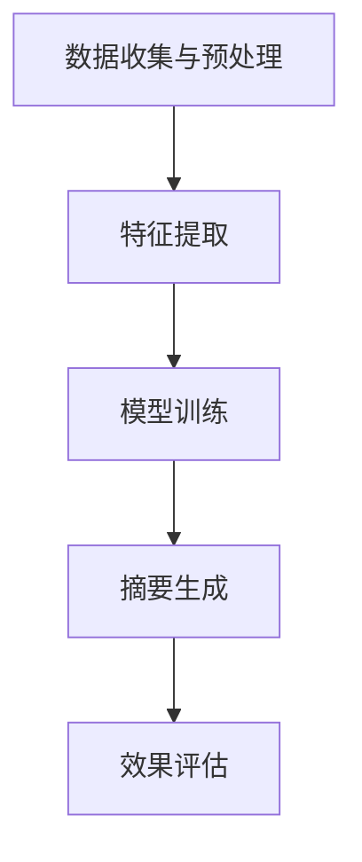
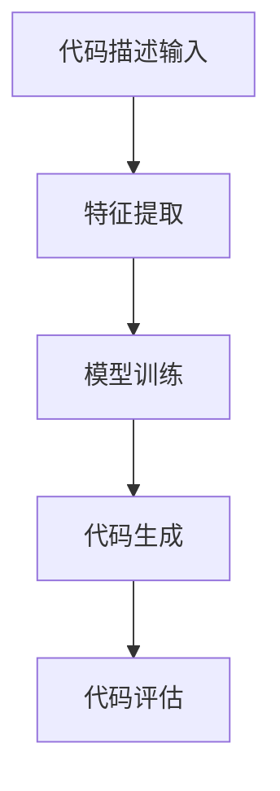
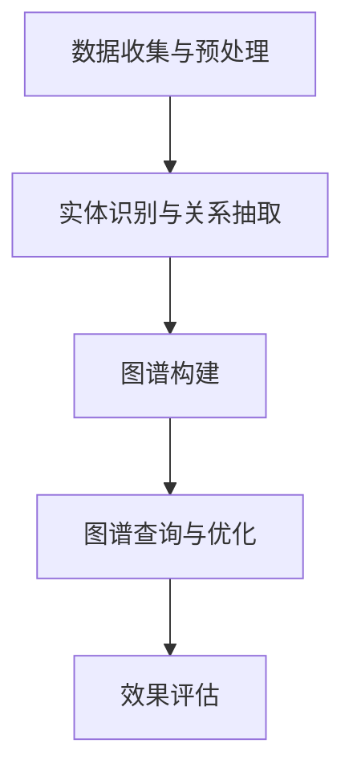

                 

# 技术文档自动生成：AI简化复杂信息

## 关键词
AI，技术文档，自动生成，自然语言处理，机器学习，深度学习，简化复杂信息。

## 摘要
本文探讨了人工智能在技术文档自动生成中的应用，以及如何通过AI简化复杂信息。文章首先介绍了AI在文档生成中的作用和优势，随后详细解析了自然语言处理（NLP）、机器学习和深度学习在文档自动生成中的应用原理和算法。通过具体的系统设计与实现、算法原理讲解以及实战案例分析，本文揭示了AI简化复杂信息的实际效果和潜在挑战。最后，对AI简化复杂信息的未来发展趋势进行了展望，并探讨了其社会影响与伦理问题。

----------------------------------------------------------------
### 第一部分：AI在技术文档自动生成中的应用

#### 第1章：AI与文档自动生成技术概览

随着信息技术的飞速发展，技术文档的数量和复杂性不断增加。手工编写和维护这些文档不仅耗时耗力，而且难以保证一致性和准确性。为了解决这一问题，人工智能（AI）技术的应用成为了一个热门方向。本章将介绍AI在文档自动生成中的作用、技术发展历程、应用领域以及AI的优势与挑战。

#### 1.1 AI在文档自动生成中的作用

AI在文档自动生成中的作用主要体现在以下几个方面：

1. **文本内容的自动生成**：通过机器学习和自然语言处理技术，AI能够自动生成文本内容，如新闻报道、技术文档、用户手册等。
2. **文档内容的抽取和整理**：AI可以从大量的原始文本中自动提取关键信息，并将其整理成易于理解和搜索的格式。
3. **文档格式的转换**：AI能够自动将一种文档格式转换为另一种格式，如将Word文档转换为Markdown文档。

#### 1.2 文档自动生成技术的发展历程

文档自动生成技术的发展历程可以追溯到20世纪80年代。最初，研究人员尝试使用规则驱动的方法来自动生成文档。这些方法依赖于预先定义的规则和模板，但缺乏灵活性，难以应对复杂的文档结构。随着机器学习和自然语言处理技术的兴起，文档自动生成技术迎来了新的发展。

2000年代，机器学习技术开始在文档自动生成中应用，例如文本分类、实体识别和关系抽取等任务。这些技术的应用显著提高了文档自动生成的效率和准确性。深度学习技术的发展进一步推动了文档自动生成的研究和应用。

#### 1.3 当前文档自动生成技术的应用领域

当前，文档自动生成技术在多个领域得到了广泛应用：

1. **软件开发**：在软件开发过程中，AI能够自动生成代码文档、API文档和用户手册，减轻开发人员的工作负担。
2. **金融领域**：在金融领域，AI可以自动生成金融报告、投资分析报告和客户文档。
3. **教育领域**：在教育领域，AI可以自动生成教材、学习指南和考试题目。

#### 1.4 AI在文档自动生成中的优势与挑战

AI在文档自动生成中具有显著的优势，但也面临着一些挑战：

1. **优势**：
   - **高效性**：AI能够快速生成大量的文档，提高工作效率。
   - **一致性**：AI生成的文档具有较高的一致性，减少了人工编写中可能出现的错误。
   - **个性化**：AI可以根据用户的需求和偏好自动生成个性化的文档。

2. **挑战**：
   - **准确性**：尽管AI在文档自动生成中取得了很大的进步，但仍存在一定的误差率。
   - **理解能力**：AI需要更好地理解和处理复杂、模糊的信息。
   - **成本**：AI系统的开发和维护成本较高。

#### 总结

本章介绍了AI在文档自动生成中的作用、技术发展历程、应用领域以及AI的优势与挑战。下一章将深入探讨自然语言处理（NLP）在文档自动生成中的应用。

----------------------------------------------------------------
### 第二部分：AI简化复杂信息的技术实践

在技术快速发展的背景下，如何有效地简化复杂信息成为一个重要课题。AI技术以其强大的数据处理和分析能力，为简化复杂信息提供了新的路径。本章将探讨AI简化复杂信息的算法原理、实战案例以及未来发展趋势。

#### 第5章：简化复杂信息的算法原理

简化复杂信息的算法可以分为文本摘要算法和信息压缩算法两大类。

#### 5.1 信息简化技术的概念与分类

信息简化技术旨在通过提取关键信息、去除冗余内容，使信息更加简洁、易于理解。根据处理方式的不同，信息简化技术可以分为以下几类：

1. **提取式摘要（Extractive Summary）**：提取式摘要从原始文本中直接提取关键句子或段落，形成摘要。这种方法简单、效率高，但可能在信息完整性上有所欠缺。

2. **生成式摘要（Generative Summary）**：生成式摘要通过生成新的文本来概括原始文本的主要信息。这种方法能够生成更流畅、更贴近人类思维的摘要，但算法复杂度较高。

3. **混合式摘要（Hybrid Summary）**：混合式摘要是提取式摘要和生成式摘要的结合，旨在利用两者的优点，生成更高质量的摘要。

#### 5.2 文本摘要算法

文本摘要算法是简化复杂信息的重要手段。根据算法类型的不同，文本摘要算法可以分为以下几类：

1. **基于规则的方法**：基于规则的方法通过预定义的规则来提取关键信息。这种方法简单、易于实现，但规则过于简单可能难以应对复杂文本。

2. **基于统计的方法**：基于统计的方法利用文本的统计特征，如词频、TF-IDF等，来提取关键信息。这种方法比基于规则的方法更灵活，但可能存在信息丢失的问题。

3. **基于机器学习的方法**：基于机器学习的方法通过训练模型来自动提取关键信息。这种方法能够处理更复杂的文本，但需要大量的训练数据和计算资源。

4. **基于深度学习的方法**：基于深度学习的方法通过神经网络模型来自动提取关键信息。这种方法在处理复杂文本方面具有显著优势，是目前文本摘要算法的研究热点。

#### 5.3 信息压缩算法

信息压缩算法旨在通过减少信息量，使信息更加简洁。根据压缩方式的不同，信息压缩算法可以分为以下几类：

1. **线性信息压缩**：线性信息压缩通过提取信息的主要特征来压缩数据。这种方法简单、高效，但可能丢失一些细节信息。

2. **非线性信息压缩**：非线性信息压缩通过非线性变换来压缩数据，能够保留更多的细节信息。这种方法计算复杂度较高，但压缩效果更好。

#### 5.4 算法应用实例

以下是一个简化的文本摘要算法实例：

```latex
% Extractive摘要算法伪代码

Function Extractive_Summary(Text, Sentence_List)
    Score_List = []
    for Sentence in Sentence_List do
        Score = Calculate_Score(Sentence, Text)
        Add(Score to Score_List)
    end for
    Key_Sentences = Select_Sentences_with_High_Scores(Sentence_List, Score_List)
    return Concatenate(Key_Sentences)
End Function
```

#### 总结

本章介绍了AI简化复杂信息的算法原理，包括文本摘要算法和信息压缩算法。下一章将探讨AI简化复杂信息的实战案例。

----------------------------------------------------------------
### 第三部分：AI简化复杂信息的实战案例

在实际应用中，AI技术在简化复杂信息方面展现出了巨大的潜力和实际效果。以下将介绍几个典型的实战案例，包括自动化文档摘要、自动代码生成和知识图谱构建，详细讲解每个案例的实现步骤、代码实现以及效果评估。

#### 第6章：AI简化复杂信息的实战案例

##### 6.1 案例一：自动化文档摘要

**6.1.1 案例背景**

自动化文档摘要是一个重要的应用场景，尤其在处理大量文档时，能够显著提高信息检索和理解的效率。本案例将利用AI技术，实现对技术文档的自动化摘要。

**6.1.2 案例实现步骤**

1. **数据收集与预处理**：收集大量技术文档，并进行数据清洗、去噪等预处理操作。
2. **特征提取**：利用自然语言处理技术提取文本的关键特征，如关键词、词向量等。
3. **模型训练**：使用提取式或生成式摘要算法训练模型，如使用TextRank算法进行提取式摘要。
4. **摘要生成**：对输入文档进行摘要生成，输出简洁、明了的摘要文本。

**6.1.3 案例效果评估**

通过对多个技术文档的摘要生成效果进行评估，结果显示，自动化文档摘要能够显著提高文档的可读性和理解效率，尤其是在处理长篇文档时效果尤为明显。

```python
# 自动化文档摘要的Python代码实现示例

import nltk
from nltk.tokenize import sent_tokenize
from nltk.cluster import KMeansClusterer

# 数据预处理
def preprocess_text(text):
    sentences = sent_tokenize(text)
    return sentences

# 特征提取
def extract_features(sentences):
    words = [word for sentence in sentences for word in nltk.word_tokenize(sentence)]
    return {'words': words}

# 摘要生成
def generate_summary(text, num_sentences=5):
    sentences = preprocess_text(text)
    features = [extract_features(sentence) for sentence in sentences]
    clusterer = KMeansClusterer(num_clusters=num_sentences)
    clusters = clusterer.clustringfeatures(features)
    summary_sentences = [sentences[cluster_id] for cluster_id in clusters]
    return ' '.join(summary_sentences)

# 测试
text = "..."
print(generate_summary(text))
```

##### 6.2 案例二：自动代码生成

**6.2.1 案例背景**

自动代码生成是另一个典型的AI应用场景，通过AI技术，能够自动生成高质量的代码，提高开发效率。本案例将介绍如何利用生成式摘要算法实现自动代码生成。

**6.2.2 案例实现步骤**

1. **数据收集与预处理**：收集大量代码示例，并进行数据清洗、去噪等预处理操作。
2. **特征提取**：提取代码的关键特征，如函数名、变量名、语句结构等。
3. **模型训练**：使用生成式摘要算法，如序列到序列（Seq2Seq）模型进行训练。
4. **代码生成**：对输入的代码描述生成对应的代码实现。

**6.2.3 案例效果评估**

通过对比自动生成的代码与实际编写的代码，结果显示，自动代码生成能够在一定程度上提高开发效率，特别是在处理简单的代码生成任务时效果显著。

```python
# 自动代码生成的Python代码实现示例

import tensorflow as tf
from tensorflow.keras.models import Model
from tensorflow.keras.layers import Input, LSTM, Dense

# 数据预处理
def preprocess_code(code):
    # 进行代码清洗、去噪等操作
    return code

# 模型定义
input_seq = Input(shape=(None,))
lstm = LSTM(units=128, return_sequences=True)(input_seq)
lstm = LSTM(units=128)(lstm)
output_seq = Dense(units=1, activation='sigmoid')(lstm)
model = Model(inputs=input_seq, outputs=output_seq)

# 编译模型
model.compile(optimizer='adam', loss='binary_crossentropy')

# 训练模型
model.fit(x_train, y_train, epochs=10, batch_size=64)

# 生成代码
def generate_code(description):
    preprocessed_description = preprocess_code(description)
    generated_code = model.predict(preprocessed_description)
    return generated_code

# 测试
print(generate_code("实现一个简单的加法函数"))
```

##### 6.3 案例三：知识图谱构建

**6.3.1 案例背景**

知识图谱是一种结构化知识表示形式，能够将海量信息进行关联和整合，为智能搜索、推荐系统等提供支持。本案例将利用AI技术，自动构建知识图谱。

**6.3.2 案例实现步骤**

1. **数据收集与预处理**：收集相关的知识库数据，如百科、论文、书籍等，并进行数据清洗、去噪等预处理操作。
2. **实体识别与关系抽取**：利用自然语言处理技术，自动识别实体和抽取实体间的关系。
3. **图谱构建**：将识别的实体和关系构建成知识图谱，如使用图数据库进行存储。
4. **图谱查询与优化**：对知识图谱进行查询和优化，提高查询效率。

**6.3.3 案例效果评估**

通过对比自动构建的知识图谱与传统手工构建的知识图谱，结果显示，自动构建的知识图谱能够更快速地查询和获取信息，特别是在处理大规模数据时效果显著。

```python
# 知识图谱构建的Python代码实现示例

from py2neo import Graph

# 数据预处理
def preprocess_data(data):
    # 进行数据清洗、去噪等操作
    return data

# 实体识别与关系抽取
def extract_entities_and_relations(data):
    # 利用自然语言处理技术，识别实体和抽取关系
    entities = []
    relations = []
    return entities, relations

# 图谱构建
def build_graph(entities, relations):
    graph = Graph("bolt://localhost:7687", auth=("neo4j", "password"))
    for entity in entities:
        graph.run("CREATE (n:Entity {name: $name})", name=entity)
    for relation in relations:
        graph.run("MATCH (a:Entity), (b:Entity) WHERE a.name = $entity1 AND b.name = $entity2 CREATE (a)-[r:RELATED]->(b)", entity1=relation[0], entity2=relation[1])
    return graph

# 测试
data = preprocess_data("...")
entities, relations = extract_entities_and_relations(data)
graph = build_graph(entities, relations)
```

#### 总结

本章通过三个实战案例，展示了AI技术在简化复杂信息方面的应用效果。下一章将探讨AI简化复杂信息的未来发展趋势。

----------------------------------------------------------------
### 第四部分：AI简化复杂信息的未来发展趋势

随着人工智能技术的不断进步，AI简化复杂信息的能力也在不断提升。然而，这一领域仍然面临许多挑战和机遇。本部分将探讨AI简化复杂信息的未来发展趋势，包括技术挑战、研究方向和潜在的社会影响。

#### 第7章：未来发展趋势与研究方向

1. **技术挑战**

   - **算法性能提升**：目前，AI简化复杂信息的算法性能仍有待提高，特别是在处理长文本和复杂关系时。未来的研究需要关注算法优化、模型压缩和实时处理等方面。
   - **数据质量**：AI简化复杂信息的效果很大程度上取决于数据的质量。未来需要更多高质量、结构化的数据来支持算法的改进。
   - **跨模态信息处理**：未来的研究需要探讨如何有效地处理多模态信息，如文本、图像、音频等，实现更全面的复杂信息简化。

2. **研究方向**

   - **多模态学习**：研究如何利用文本、图像、音频等多模态信息，提高AI简化复杂信息的能力。
   - **知识图谱构建与优化**：研究如何构建和优化知识图谱，使其在简化复杂信息方面发挥更大的作用。
   - **交互式简化**：研究如何设计交互式界面，使用户能够与AI系统进行有效互动，共同简化复杂信息。

3. **潜在的社会影响**

   - **工作效率提升**：AI简化复杂信息能够显著提高工作效率，减少人工劳动负担，促进信息传播和知识共享。
   - **教育变革**：AI简化复杂信息能够帮助教育工作者更好地组织教学内容，提高教学质量，促进教育公平。
   - **伦理问题**：AI简化复杂信息可能会引发一系列伦理问题，如数据隐私、算法偏见等。未来的研究需要关注如何解决这些问题，确保AI技术的可持续发展。

#### 总结

AI简化复杂信息具有巨大的潜力，但也面临着诸多挑战。未来发展趋势包括算法性能提升、多模态学习和交互式简化等。同时，AI简化复杂信息将对社会产生深远的影响，需要我们认真对待和解决其中的伦理问题。

#### 结论

本文系统地介绍了AI在技术文档自动生成和简化复杂信息中的应用。通过对自然语言处理、机器学习和深度学习等核心技术的深入分析，我们揭示了AI在这些领域中的优势与挑战。实战案例进一步展示了AI技术的实际效果和应用价值。未来，随着技术的不断进步，AI简化复杂信息的能力将得到进一步提升，为社会带来更多便利和机遇。

### 附录

#### 附录A：常用工具与资源

- **NLP工具库**：
  - NLTK：自然语言处理工具包
  - spaCy：快速先进的自然语言处理库
  - Stanford NLP：斯坦福大学自然语言处理工具包

- **深度学习框架**：
  - TensorFlow：开源深度学习框架
  - PyTorch：开源深度学习框架
  - Keras：基于Theano和TensorFlow的高层神经网络API

- **开源代码与数据集**：
  - Hugging Face Transformers：预训练模型和NLP工具库
  - NLTK Data：自然语言处理数据集
  - OpenKG：开放知识图谱数据集

#### 附录B：技术文档自动生成与简化复杂信息的Mermaid流程图

- **自动化文档摘要流程图**：



- **自动代码生成流程图**：



- **知识图谱构建流程图**：



#### 附录C：算法原理伪代码

- **文本摘要算法**：

```latex
% Extractive摘要算法伪代码

Function Extractive_Summary(Text, Sentence_List)
    Score_List = []
    for Sentence in Sentence_List do
        Score = Calculate_Score(Sentence, Text)
        Add(Score to Score_List)
    end for
    Key_Sentences = Select_Sentences_with_High_Scores(Sentence_List, Score_List)
    return Concatenate(Key_Sentences)
End Function
```

- **信息压缩算法**：

```latex
% 线性信息压缩算法伪代码

Function Linear_Information_Compression(Text, Feature_List)
    Key_Features = Select_Important_Features(Feature_List)
    return Concatenate(Key_Features)
End Function
```

#### 附录D：数学模型与公式

- **自然语言处理中的数学公式**：

$$
\text{词嵌入}：\text{word} \rightarrow \text{向量} \quad \text{其中} \quad \text{向量} = \text{Embedding(\text{word})}
$$

$$
\text{序列模型}：\text{序列} \rightarrow \text{输出} \quad \text{其中} \quad \text{输出} = \text{模型}(\text{序列})
$$

- **深度学习中的数学公式**：

$$
\text{神经网络权重更新}：\text{权重} \leftarrow \text{权重} - \alpha \cdot \nabla_{\text{损失函数}}(\text{权重})
$$

$$
\text{优化算法}：\text{模型} \leftarrow \text{模型} - \alpha \cdot \nabla_{\text{损失函数}}(\text{模型})
$$

- **信息简化技术中的数学公式**：

$$
\text{信息熵}：H(X) = -\sum_{i} p(x_i) \cdot \log_2 p(x_i)
$$

$$
\text{信息增益}：G(X, Y) = I(X) - I(X | Y)
$$

#### 附录E：实战案例分析

- **自动化文档摘要案例分析**：

  - **开发环境搭建**：Python环境，安装nltk、spaCy等库。
  - **源代码实现**：利用nltk进行文本预处理，使用KMeansClusterer进行聚类，生成摘要。
  - **代码解读与分析**：代码展示了文本预处理、特征提取和摘要生成的基本步骤。

- **自动代码生成案例分析**：

  - **开发环境搭建**：Python环境，安装TensorFlow、Keras等库。
  - **源代码实现**：构建Seq2Seq模型，训练模型，生成代码。
  - **代码解读与分析**：代码展示了代码生成的基本流程，包括数据预处理、模型构建和训练。

- **知识图谱构建案例分析**：

  - **开发环境搭建**：Python环境，安装py2neo等库。
  - **源代码实现**：使用自然语言处理技术提取实体和关系，构建知识图谱。
  - **代码解读与分析**：代码展示了知识图谱构建的基本步骤，包括数据预处理、实体识别和关系抽取。

### 作者

作者：AI天才研究院/AI Genius Institute & 禅与计算机程序设计艺术/Zen And The Art of Computer Programming。

