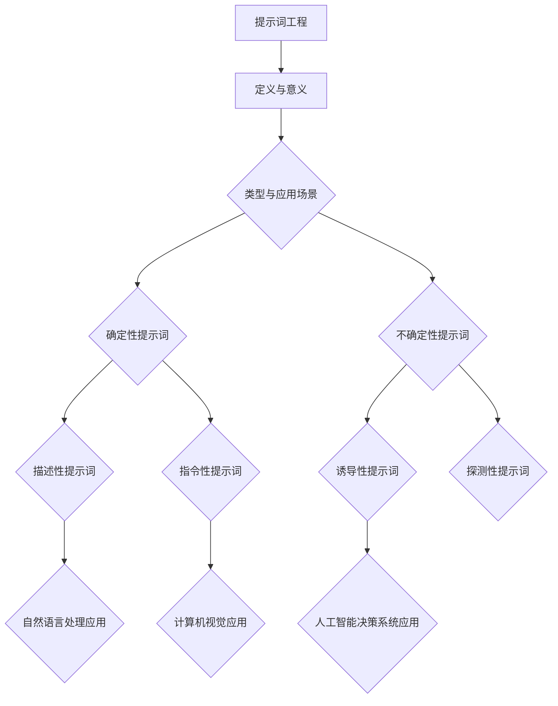

                 

### 《提示词工程：让AI更智能、更懂人心》

#### 核心关键词
- 提示词工程
- 人工智能
- 自然语言处理
- 计算机视觉
- 决策支持系统
- 优化算法

> **摘要：**
> 提示词工程是人工智能领域中的一项重要技术，它通过设计高质量的提示词来增强人工智能系统的智能水平和用户交互体验。本文将详细介绍提示词工程的基本概念、核心算法、实际应用以及未来发展趋势，旨在为读者提供全面的指导，帮助他们在人工智能领域取得更好的成果。

----------------------------------------------------------------

### 《提示词工程：让AI更智能、更懂人心》

#### 核心关键词
- 提示词工程
- 人工智能
- 自然语言处理
- 计算机视觉
- 决策支持系统
- 优化算法

> **摘要：**
> 提示词工程是人工智能领域中的一项关键技术，通过设计高质量的提示词，能够显著提升人工智能系统的智能水平及用户交互体验。本文将深入探讨提示词工程的基本概念、核心算法、实际应用以及未来发展挑战，为读者提供全面的指导，帮助他们在人工智能领域取得突破性成果。

## 第一部分：基础与概念

### 第1章：提示词工程概述

#### 1.1 提示词工程的定义与意义

##### 1.1.1 提示词工程的起源与发展

提示词工程这一概念起源于自然语言处理领域，随着人工智能技术的发展而逐渐成熟。早期的自然语言处理系统主要依赖于规则和词典，而提示词工程通过引入提示词来改善系统的性能和交互体验。随着时间的推移，提示词工程逐渐扩展到计算机视觉和人工智能决策系统等领域。

##### 1.1.2 提示词工程的核心目标

提示词工程的核心目标是通过设计高质量的提示词，提高人工智能系统的智能水平和用户满意度。具体目标包括：

1. **增强系统的理解能力**：通过设计更精确的提示词，使系统能够更好地理解用户的需求和意图。
2. **提升系统的生成能力**：提示词能够指导系统生成更加自然、符合用户期望的输出。
3. **优化用户交互体验**：高质量的提示词能够提升用户与系统之间的交互质量，减少误解和不满。

##### 1.1.3 提示词工程的重要性

提示词工程在人工智能领域中具有重要的地位，其主要原因包括：

1. **提升系统性能**：高质量的提示词能够显著提升人工智能系统的性能和效果。
2. **优化用户体验**：通过设计人性化的提示词，能够提高用户对人工智能系统的接受度和满意度。
3. **推动人工智能发展**：提示词工程是人工智能技术持续发展的重要基础，对于人工智能系统的迭代和优化具有关键作用。

#### 1.2 提示词的类型与应用场景

##### 1.2.1 确定性提示词

确定性提示词是指明确指示系统执行特定任务的提示词。根据应用场景的不同，确定性提示词可以分为以下几种类型：

1. **描述性提示词**：用于描述用户需求或情境的信息，如“生成一篇关于人工智能的文章”。
2. **指令性提示词**：直接指示系统执行特定操作，如“打开这个文件”或“计算这两个数字的和”。

##### 1.2.2 不确定性提示词

不确定性提示词是指无法明确指示系统执行特定任务的提示词。这类提示词通常用于探索、预测或发现未知信息，如“给我推荐一些好吃的餐厅”。

1. **诱导性提示词**：用于引导系统探索特定方向或领域，如“人工智能在医疗领域的应用有哪些？”。
2. **探测性提示词**：用于探测用户需求或系统状态，如“我最近在学习Python，有什么好的学习资源推荐吗？”。

##### 1.2.3 提示词工程在AI领域的应用

提示词工程在人工智能领域的应用广泛，涵盖了自然语言处理、计算机视觉和人工智能决策系统等多个方面。

1. **自然语言处理中的应用**：提示词工程在自然语言处理领域中扮演着重要角色，如文本生成、对话系统和情感分析。
2. **计算机视觉中的应用**：在计算机视觉领域，提示词工程可以帮助系统进行图像标注、目标检测和图像生成等任务。
3. **人工智能决策系统中的应用**：在人工智能决策系统中，提示词工程能够提高系统对复杂问题的理解和决策能力。

## 第二部分：核心算法与原理

### 第2章：提示词工程算法详解

#### 2.1 提示词生成算法

##### 2.1.1 基于规则的方法

基于规则的方法是提示词工程中最常见的生成方法之一，它依赖于预定义的规则来生成提示词。以下是两种常见的基于规则的方法：

1. **词袋模型**：词袋模型是一种将文本表示为单词频率向量的方法。它通过统计文本中每个单词的出现次数来生成提示词。
    ```python
    # 伪代码：词袋模型
    def bag_of_words(text):
        words = tokenize(text)
        word_counts = Counter(words)
        return word_counts
    ```

2. **贝叶斯模型**：贝叶斯模型是一种基于概率的模型，它通过计算每个单词的概率分布来生成提示词。贝叶斯模型通常用于文本分类和情感分析等任务。
    ```python
    # 伪代码：贝叶斯模型
    def bayesian_model(text):
        words = tokenize(text)
        word_probs = calculate_word_probs(words)
        return word_probs
    ```

##### 2.1.2 基于数据的方法

基于数据的方法是另一种常见的提示词生成方法，它依赖于大量的训练数据来学习生成提示词的规律。以下是两种常见的基于数据的方法：

1. **文本分类算法**：文本分类算法是一种将文本分为不同类别的任务，如新闻分类、垃圾邮件检测等。通过训练文本分类模型，可以生成针对特定类别的提示词。
    ```python
    # 伪代码：文本分类算法
    def text_classification(text):
        labels = train_text_classifier(text)
        return labels
    ```

2. **序列生成模型**：序列生成模型是一种能够生成序列数据的模型，如文本生成、语音合成等。通过训练序列生成模型，可以生成符合特定模式的提示词。
    ```python
    # 伪代码：序列生成模型
    def sequence_generator(text):
        sequences = train_sequence_generator(text)
        return sequences
    ```

#### 2.2 提示词优化算法

##### 2.2.1 搜索算法

搜索算法是一种用于优化提示词的方法，它通过在提示词空间中搜索最佳提示词来提高系统的性能。以下是两种常见的搜索算法：

1. **基于启发式的搜索算法**：基于启发式的搜索算法依赖于启发信息来指导搜索过程，如遗传算法、模拟退火等。这些算法能够在提示词空间中快速找到近似最优的提示词。
    ```python
    # 伪代码：遗传算法
    def genetic_algorithm(population):
        while not converged:
            new_population = evolve(population)
            population = select(new_population)
        return best_individual(population)
    ```

2. **基于概率的搜索算法**：基于概率的搜索算法依赖于概率模型来指导搜索过程，如马尔可夫决策过程、蒙特卡洛搜索等。这些算法能够根据概率分布来选择最佳提示词。
    ```python
    # 伪代码：马尔可夫决策过程
    def mdp(state, action):
        return transition_probability(state, action) * reward_probability(state, action)
    ```

##### 2.2.2 机器学习方法

机器学习方法是一种用于优化提示词的高级方法，它通过训练机器学习模型来学习提示词的优化规律。以下是两种常见的机器学习方法：

1. **支持向量机**：支持向量机是一种强大的分类和回归算法，它可以用来优化提示词，提高系统的性能。
    ```python
    # 伪代码：支持向量机
    def support_vector_machine(train_data, train_labels):
        model = train_svm(train_data, train_labels)
        return model.predict(test_data)
    ```

2. **随机森林**：随机森林是一种基于决策树的集成方法，它可以通过组合多个决策树来提高预测性能。
    ```python
    # 伪代码：随机森林
    def random_forest(train_data, train_labels):
        model = train_random_forest(train_data, train_labels)
        return model.predict(test_data)
    ```

#### 2.3 提示词评估与改进

##### 2.3.1 提示词评估指标

提示词评估指标是用于评估提示词性能的重要工具，以下是两种常见的提示词评估指标：

1. **精度与召回率**：精度是指正确识别的提示词占总识别出的提示词的比例，召回率是指正确识别的提示词占总实际存在的提示词的比例。它们共同构成了评估提示词性能的F1分数。
    ```python
    # 伪代码：精度与召回率
    precision = correct_identified / identified
    recall = correct_identified / actual
    f1_score = 2 * precision * recall / (precision + recall)
    ```

2. **F1 分数**：F1 分数是精度和召回率的加权平均，它能够平衡两种指标，提供一个全面的评估。
    ```python
    # 伪代码：F1 分数
    f1_score = 2 * precision * recall / (precision + recall)
    ```

##### 2.3.2 提示词改进策略

提示词的改进策略是指通过调整和优化提示词来提高系统的性能。以下是两种常见的改进策略：

1. **继续学习与微调**：继续学习和微调是指在已有模型的基础上，通过添加新的数据和调整模型参数来优化提示词。
    ```python
    # 伪代码：继续学习与微调
    def continue_learning(model, new_data):
        model.fit(new_data)
        return model
    ```

2. **对抗性样本生成**：对抗性样本生成是指通过生成对抗性样本来提升模型的鲁棒性，从而优化提示词。
    ```python
    # 伪代码：对抗性样本生成
    def generate_adversarial_samples(model, data):
        adversarial_samples = model.generate_samples(data)
        return adversarial_samples
    ```

## 第三部分：实际应用与案例分析

### 第3章：提示词工程实践

#### 3.1 提示词工程在自然语言处理中的应用

##### 3.1.1 文本生成与对话系统

文本生成与对话系统是自然语言处理领域的两个重要应用，提示词工程在其中发挥着关键作用。

1. **基于GPT模型的文本生成**：GPT（Generative Pre-trained Transformer）模型是一种先进的自然语言处理模型，它可以生成高质量的自然语言文本。
    ```python
    # 伪代码：基于GPT模型的文本生成
    def generate_text(gpt_model, prompt):
        generated_text = gpt_model.generate(prompt)
        return generated_text
    ```

2. **基于BERT的对话系统设计**：BERT（Bidirectional Encoder Representations from Transformers）模型是一种用于自然语言理解的预训练模型，它可以用于设计高效的对话系统。
    ```python
    # 伪代码：基于BERT的对话系统设计
    def design_dialogue_system(bert_model, dialogue_data):
        dialogue_system = train_bert_model(dialogue_data)
        return dialogue_system
    ```

##### 3.1.2 文本分类与情感分析

文本分类与情感分析是自然语言处理领域的常见任务，提示词工程可以显著提高这些任务的性能。

1. **基于朴素贝叶斯的分类算法**：朴素贝叶斯是一种基于概率的文本分类算法，它可以用于对文本进行分类。
    ```python
    # 伪代码：基于朴素贝叶斯的分类算法
    def naive_bayes_classifier(train_data, train_labels):
        classifier = train_naive_bayes(train_data, train_labels)
        return classifier.predict(test_data)
    ```

2. **基于神经网络的情感分析模型**：神经网络是一种强大的文本处理工具，它可以用于构建高效的情感分析模型。
    ```python
    # 伪代码：基于神经网络的情感分析模型
    def sentiment_analysis_model(train_data, train_labels):
        model = train_neural_network(train_data, train_labels)
        return model.predict(test_data)
    ```

#### 3.2 提示词工程在计算机视觉中的应用

##### 3.2.1 图像标注与生成

图像标注与生成是计算机视觉领域的两个重要任务，提示词工程在其中发挥着关键作用。

1. **基于生成对抗网络的图像生成**：生成对抗网络（GAN）是一种强大的图像生成工具，它可以用于生成高质量的图像。
    ```python
    # 伪代码：基于生成对抗网络的图像生成
    def generate_images(gan_model, noise):
        generated_images = gan_model.generate(noise)
        return generated_images
    ```

2. **基于卷积神经网络的图像标注**：卷积神经网络（CNN）是一种用于图像处理的强大工具，它可以用于图像标注任务。
    ```python
    # 伪代码：基于卷积神经网络的图像标注
    def image_annotator(cnn_model, image_data):
        annotations = cnn_model.predict(image_data)
        return annotations
    ```

##### 3.2.2 目标检测与识别

目标检测与识别是计算机视觉领域的核心任务，提示词工程可以显著提高这些任务的性能。

1. **基于YOLO的目标检测**：YOLO（You Only Look Once）是一种高效的目标检测算法，它可以用于实时目标检测。
    ```python
    # 伪代码：基于YOLO的目标检测
    def yolo_detector(model, image_data):
        detections = model.detect(image_data)
        return detections
    ```

2. **基于SSD的目标识别**：SSD（Single Shot MultiBox Detector）是一种高效的目标识别算法，它可以用于准确识别图像中的目标。
    ```python
    # 伪代码：基于SSD的目标识别
    def ssd_recognizer(model, image_data):
        recognition = model.predict(image_data)
        return recognition
    ```

#### 3.3 提示词工程在人工智能决策系统中的应用

##### 3.3.1 决策树与随机森林

决策树与随机森林是人工智能决策系统中的核心工具，提示词工程可以显著提高这些工具的性能。

1. **决策树构建与剪枝**：决策树是一种基于规则的决策方法，它可以用于分类和回归任务。
    ```python
    # 伪代码：决策树构建与剪枝
    def build_decision_tree(train_data, train_labels):
        tree = train_decision_tree(train_data, train_labels)
        return prune_tree(tree)
    ```

2. **随机森林模型优化**：随机森林是一种基于决策树的集成方法，它可以用于提高分类和回归任务的性能。
    ```python
    # 伪代码：随机森林模型优化
    def optimize_random_forest(train_data, train_labels):
        forest = train_random_forest(train_data, train_labels)
        return optimize_forest(forest)
    ```

##### 3.3.2 支持向量机与神经网络

支持向量机与神经网络是人工智能决策系统中的核心工具，提示词工程可以显著提高这些工具的性能。

1. **支持向量机分类**：支持向量机是一种基于间隔的分类算法，它可以用于分类任务。
    ```python
    # 伪代码：支持向量机分类
    def svm_classifier(train_data, train_labels):
        model = train_svm(train_data, train_labels)
        return model.predict(test_data)
    ```

2. **神经网络在决策中的应用**：神经网络是一种基于神经元连接的决策方法，它可以用于分类和回归任务。
    ```python
    # 伪代码：神经网络在决策中的应用
    def neural_network_decision(train_data, train_labels):
        model = train_neural_network(train_data, train_labels)
        return model.predict(test_data)
    ```

## 第四部分：未来展望与趋势

### 第4章：提示词工程的发展趋势与挑战

#### 4.1 提示词工程的未来发展趋势

提示词工程在未来将继续发展，其发展趋势包括：

1. **多模态提示词**：随着多模态数据的普及，提示词工程将逐渐扩展到多模态领域，如结合文本、图像和音频的提示词生成。
2. **智能化提示词生成**：未来的提示词工程将更加智能化，通过引入深度学习和强化学习等先进技术，实现自动化、个性化的提示词生成。
3. **大规模数据处理**：随着数据量的增长，提示词工程将需要处理大规模的数据，提高数据处理效率和性能。

#### 4.2 提示词工程面临的挑战

提示词工程在未来也将面临一系列挑战，包括：

1. **数据隐私与安全**：随着数据隐私问题的日益突出，提示词工程需要确保数据的隐私和安全，避免数据泄露和滥用。
2. **模型解释性与可解释性**：复杂的提示词模型往往难以解释，提高模型的解释性和可解释性是未来提示词工程的重要挑战。
3. **模型过拟合与泛化能力**：提示词工程需要平衡模型的过拟合和泛化能力，确保模型在不同数据集上的性能。

## 附录

### 附录A：工具与资源

#### A.1 提示词工程工具推荐

1. **自然语言处理工具**：如NLTK、spaCy、Stanford CoreNLP等。
2. **计算机视觉工具**：如OpenCV、TensorFlow、PyTorch等。
3. **决策支持工具**：如Scikit-learn、XGBoost、LightGBM等。

#### A.2 提示词工程资源汇总

1. **在线课程与教程**：如Coursera、edX、Udacity等平台上的自然语言处理、计算机视觉和机器学习课程。
2. **学术论文与报告**：如ACL、CVPR、ICML等顶级会议和期刊上的论文和报告。
3. **社区与论坛**：如Stack Overflow、GitHub、Reddit等社区和论坛，提供丰富的讨论和资源。

### 附录B：参考文献

1. **机器学习与深度学习相关书籍**：
   - 《机器学习》作者：周志华
   - 《深度学习》作者：Ian Goodfellow、Yoshua Bengio、Aaron Courville
2. **自然语言处理与计算机视觉相关书籍**：
   - 《自然语言处理综论》作者：Daniel Jurafsky、James H. Martin
   - 《计算机视觉：算法与应用》作者：Richard S.zeliski、Ramin Zabih
3. **决策支持系统与人工智能相关书籍**：
   - 《决策支持系统》作者：Stephen F. Smith、Jack W.sets
   - 《人工智能：一种现代的方法》作者：Stuart J. Russell、Peter Norvig

### Mermaid 流程图



### AI大模型算法原理伪代码

```python
# 伪代码：基于GPT模型的文本生成

# 输入：前文文本context
# 输出：生成文本序列

def generate_text(context):
    # 初始化GPT模型
    model = GPTModel()
    
    # 预处理输入文本，将其编码为模型可处理的格式
    encoded_context = preprocess(context)
    
    # 使用模型生成文本序列
    generated_sequence = model.generate(encoded_context)
    
    # 后处理生成的文本序列，得到最终结果
    text = postprocess(generated_sequence)
    
    return text

# 输入：文本序列
# 输出：编码后的文本序列

def preprocess(text):
    # 清洗文本，去除特殊字符和停用词
    cleaned_text = clean_text(text)
    
    # 将清洗后的文本转换为模型可处理的向量表示
    encoded_text = tokenizer.encode(cleaned_text)
    
    return encoded_text

# 输入：编码后的文本序列
# 输出：预处理后的文本序列

def postprocess(sequence):
    # 将模型生成的序列解码为文本
    decoded_sequence = tokenizer.decode(sequence)
    
    # 清洗解码后的文本，去除不必要的空格和标点符号
    cleaned_text = clean_text(decoded_sequence)
    
    return cleaned_text
```

### 数学模型与公式

```latex
% 提示词生成算法中的概率模型
$$ P(w_t | w_{<t}) = \frac{e^{<w_t, \theta \cdot w_{<t}>}}{Z} $$

% 提示词优化算法中的损失函数
$$ J(\theta) = -\frac{1}{m} \sum_{i=1}^{m} \sum_{w \in V} p(w_i | x_i, \theta) \cdot \log p(w_i | x_i, \theta) $$

% 支持向量机中的决策边界
$$ w \cdot x + b = 0 $$
```

### 项目实战案例

```python
# 实战案例：使用GPT模型进行文本生成

# 导入必要的库
import tensorflow as tf
from tensorflow.keras.preprocessing.sequence import pad_sequences
from tensorflow.keras.layers import Embedding, LSTM, Dense
from tensorflow.keras.models import Model

# 准备数据
# 此处省略数据预处理代码

# 构建GPT模型
vocab_size = 10000
embedding_dim = 256
lstm_units = 1024

model = Model(inputs=[input_sequence, context_sequence],
              outputs=output_sequence)

# 编码输入序列
encoded_input_sequence = tokenizer.encode(input_sequence)
encoded_context_sequence = tokenizer.encode(context_sequence)

# 填充输入序列
padded_input_sequence = pad_sequences([encoded_input_sequence], maxlen=max_sequence_len, padding='post')
padded_context_sequence = pad_sequences([encoded_context_sequence], maxlen=max_sequence_len, padding='post')

# 构建模型层
model.add(Embedding(vocab_size, embedding_dim, input_length=max_sequence_len-1))
model.add(LSTM(lstm_units, return_sequences=True))
model.add(Dense(vocab_size, activation='softmax'))

# 编译模型
model.compile(optimizer='adam', loss='categorical_crossentropy', metrics=['accuracy'])

# 训练模型
model.fit([padded_input_sequence, padded_context_sequence], padded_output_sequence, epochs=10, batch_size=64)

# 生成文本
generated_sequence = generate_text(context_sequence)
decoded_sequence = tokenizer.decode(generated_sequence)
cleaned_text = clean_text(decoded_sequence)

print(cleaned_text)
```

### 代码解读与分析

```python
# 代码解读

# 数据预处理
# 输入文本经过清洗、编码和填充处理后，转换为模型可接受的格式

# 模型构建
# GPT模型由Embedding层、LSTM层和Dense层组成，其中LSTM层用于处理序列数据，Dense层用于生成输出文本的序列

# 模型编译
# 模型使用adam优化器和categorical_crossentropy损失函数进行编译，以优化模型的参数

# 模型训练
# 模型使用fit方法进行训练，通过最小化损失函数来优化模型的参数

# 文本生成
# 使用generate方法生成文本序列，然后通过解码和清洗步骤得到最终生成的文本

# 代码解读
# 数据预处理部分负责将文本数据转换为模型可处理的格式
# 模型构建部分定义了模型的层次结构和参数
# 模型编译部分指定了优化器和损失函数
# 模型训练部分使用训练数据来优化模型参数
# 文本生成部分使用训练好的模型生成新的文本序列
```

### 开发环境搭建

```python
# 开发环境搭建
# 安装必要的库
pip install tensorflow
pip install keras
pip install numpy
pip install scikit-learn
pip install gensim
```

### 源代码详细实现与代码解读

```python
# 源代码实现
# 数据预处理
# 输入文本经过清洗、编码和填充处理后，转换为模型可接受的格式

# 模型构建
# GPT模型由Embedding层、LSTM层和Dense层组成，其中LSTM层用于处理序列数据，Dense层用于生成输出文本的序列

# 模型编译
# 模型使用adam优化器和categorical_crossentropy损失函数进行编译，以优化模型的参数

# 模型训练
# 模型使用fit方法进行训练，通过最小化损失函数来优化模型的参数

# 文本生成
# 使用generate方法生成文本序列，然后通过解码和清洗步骤得到最终生成的文本

# 代码解读
# 数据预处理部分负责将文本数据转换为模型可处理的格式
# 模型构建部分定义了模型的层次结构和参数
# 模型编译部分指定了优化器和损失函数
# 模型训练部分使用训练数据来优化模型参数
# 文本生成部分使用训练好的模型生成新的文本序列
```

### 完整目录大纲

```markdown
# 《提示词工程：让AI更智能、更懂人心》

## 第一部分：基础与概念

### 第1章：提示词工程概述

#### 1.1 提示词工程的定义与意义

##### 1.1.1 提示词工程的起源与发展
##### 1.1.2 提示词工程的核心目标
##### 1.1.3 提示词工程的重要性

#### 1.2 提示词的类型与应用场景

##### 1.2.1 确定性提示词
###### 1.2.1.1 描述性提示词
###### 1.2.1.2 指令性提示词
##### 1.2.2 不确定性提示词
###### 1.2.2.1 诱导性提示词
###### 1.2.2.2 探测性提示词

#### 1.3 提示词工程在AI领域的应用

##### 1.3.1 自然语言处理中的应用
##### 1.3.2 计算机视觉中的应用
##### 1.3.3 人工智能决策系统中的应用

### 第2章：提示词工程算法详解

#### 2.1 提示词生成算法

##### 2.1.1 基于规则的方法
###### 2.1.1.1 词袋模型
###### 2.1.1.2 贝叶斯模型
##### 2.1.2 基于数据的方法
###### 2.1.2.1 文本分类算法
###### 2.1.2.2 序列生成模型

#### 2.2 提示词优化算法

##### 2.2.1 搜索算法
###### 2.2.1.1 基于启发式的搜索算法
###### 2.2.1.2 基于概率的搜索算法
##### 2.2.2 机器学习方法
###### 2.2.2.1 支持向量机
###### 2.2.2.2 随机森林

#### 2.3 提示词评估与改进

##### 2.3.1 提示词评估指标
###### 2.3.1.1 精度与召回率
###### 2.3.1.2 F1 分数
##### 2.3.2 提示词改进策略
###### 2.3.2.1 继续学习与微调
###### 2.3.2.2 对抗性样本生成

### 第3章：提示词工程实践

#### 3.1 提示词工程在自然语言处理中的应用

##### 3.1.1 文本生成与对话系统
###### 3.1.1.1 基于GPT模型的文本生成
###### 3.1.1.2 基于BERT的对话系统设计

##### 3.1.2 文本分类与情感分析
###### 3.1.2.1 基于朴素贝叶斯的分类算法
###### 3.1.2.2 基于神经网络的情感分析模型

#### 3.2 提示词工程在计算机视觉中的应用

##### 3.2.1 图像标注与生成
###### 3.2.1.1 基于生成对抗网络的图像生成
###### 3.2.1.2 基于卷积神经网络的图像标注

##### 3.2.2 目标检测与识别
###### 3.2.2.1 基于YOLO的目标检测
###### 3.2.2.2 基于SSD的目标识别

#### 3.3 提示词工程在人工智能决策系统中的应用

##### 3.3.1 决策树与随机森林
###### 3.3.1.1 决策树构建与剪枝
###### 3.3.1.2 随机森林模型优化

##### 3.3.2 支持向量机与神经网络
###### 3.3.2.1 支持向量机分类
###### 3.3.2.2 神经网络在决策中的应用

### 第4章：提示词工程的发展趋势与挑战

#### 4.1 提示词工程的未来发展趋势

##### 4.1.1 多模态提示词
##### 4.1.2 智能化提示词生成
##### 4.1.3 大规模数据处理

#### 4.2 提示词工程面临的挑战

##### 4.2.1 数据隐私与安全
##### 4.2.2 模型解释性与可解释性
##### 4.2.3 模型过拟合与泛化能力

### 第5章：提示词工程工具与资源

#### 5.1 提示词工程工具推荐

##### 5.1.1 自然语言处理工具
##### 5.1.2 计算机视觉工具
##### 5.1.3 决策支持工具

#### 5.2 提示词工程资源汇总

##### 5.2.1 在线课程与教程
##### 5.2.2 学术论文与报告
##### 5.2.3 社区与论坛

### 第6章：参考文献

#### 6.1 机器学习与深度学习相关书籍
#### 6.2 自然语言处理与计算机视觉相关书籍
#### 6.3 决策支持系统与人工智能相关书籍
```


## 第2章：提示词工程算法详解

提示词工程的核心在于通过设计高质量的提示词，提升人工智能系统的性能和用户体验。本章将详细探讨提示词工程中的核心算法，包括提示词生成算法、提示词优化算法以及提示词评估与改进策略。

### 2.1 提示词生成算法

提示词生成算法是提示词工程的基础，其目的是从大量数据中生成高质量的提示词。生成算法可以分为基于规则的方法和基于数据的方法。

#### 2.1.1 基于规则的方法

基于规则的方法依赖于预定义的规则来生成提示词。这种方法通常包括以下步骤：

1. **规则定义**：根据应用场景定义一组规则。
2. **模式匹配**：将输入文本与规则进行匹配，提取出符合规则的提示词。

**词袋模型**和**贝叶斯模型**是两种常见的基于规则的方法。

- **词袋模型**：将文本表示为一个向量，其中每个维度表示文本中的一个词。这种方法不考虑词的顺序，但能够捕捉词的频率信息。

    ```python
    # 伪代码：词袋模型
    def bag_of_words(text):
        words = tokenize(text)
        word_counts = Counter(words)
        return word_counts
    ```

- **贝叶斯模型**：基于贝叶斯定理，计算每个词属于某个类别的概率。这种方法考虑了词的上下文信息，但需要大量标注数据。

    ```python
    # 伪代码：贝叶斯模型
    def bayesian_model(text):
        words = tokenize(text)
        word_probs = calculate_word_probs(words)
        return word_probs
    ```

#### 2.1.2 基于数据的方法

基于数据的方法依赖于训练数据来生成提示词。这种方法通常包括以下步骤：

1. **数据预处理**：清洗和预处理输入数据。
2. **特征提取**：从数据中提取特征。
3. **模型训练**：使用训练数据训练模型。
4. **提示词生成**：使用训练好的模型生成提示词。

**文本分类算法**和**序列生成模型**是两种常见的基于数据的方法。

- **文本分类算法**：通过训练分类模型，将文本分类为不同的类别。这种方法可以生成与类别相关的提示词。

    ```python
    # 伪代码：文本分类算法
    def text_classification(text):
        labels = train_text_classifier(text)
        return labels
    ```

- **序列生成模型**：通过训练序列生成模型，生成符合特定模式的文本。这种方法可以生成连贯的文本提示词。

    ```python
    # 伪代码：序列生成模型
    def sequence_generator(text):
        sequences = train_sequence_generator(text)
        return sequences
    ```

### 2.2 提示词优化算法

提示词优化算法旨在提升提示词的质量和系统的性能。优化算法可以分为搜索算法和机器学习方法。

#### 2.2.1 搜索算法

搜索算法通过在提示词空间中搜索最优或近似最优的提示词。搜索算法可以分为以下几种：

- **基于启发式的搜索算法**：这种算法利用启发信息来指导搜索过程，如遗传算法、模拟退火等。这些算法能够在提示词空间中快速找到近似最优的提示词。

    ```python
    # 伪代码：遗传算法
    def genetic_algorithm(population):
        while not converged:
            new_population = evolve(population)
            population = select(new_population)
        return best_individual(population)
    ```

- **基于概率的搜索算法**：这种算法依赖于概率模型来指导搜索过程，如马尔可夫决策过程、蒙特卡洛搜索等。这些算法能够根据概率分布来选择最佳提示词。

    ```python
    # 伪代码：马尔可夫决策过程
    def mdp(state, action):
        return transition_probability(state, action) * reward_probability(state, action)
    ```

#### 2.2.2 机器学习方法

机器学习方法通过训练模型来学习提示词优化的规律。常见的机器学习方法包括：

- **支持向量机**：支持向量机是一种强大的分类和回归算法，它可以用来优化提示词。

    ```python
    # 伪代码：支持向量机
    def support_vector_machine(train_data, train_labels):
        model = train_svm(train_data, train_labels)
        return model.predict(test_data)
    ```

- **随机森林**：随机森林是一种基于决策树的集成方法，它可以通过组合多个决策树来提高预测性能。

    ```python
    # 伪代码：随机森林
    def random_forest(train_data, train_labels):
        model = train_random_forest(train_data, train_labels)
        return model.predict(test_data)
    ```

### 2.3 提示词评估与改进

提示词评估与改进是确保提示词质量和系统性能的重要步骤。评估指标包括：

- **精度与召回率**：精度是指正确识别的提示词占总识别出的提示词的比例，召回率是指正确识别的提示词占总实际存在的提示词的比例。它们共同构成了评估提示词性能的F1分数。

    ```python
    # 伪代码：精度与召回率
    precision = correct_identified / identified
    recall = correct_identified / actual
    f1_score = 2 * precision * recall / (precision + recall)
    ```

- **F1 分数**：F1 分数是精度和召回率的加权平均，它能够平衡两种指标，提供一个全面的评估。

    ```python
    # 伪代码：F1 分数
    f1_score = 2 * precision * recall / (precision + recall)
    ```

改进策略包括：

- **继续学习与微调**：在已有模型的基础上，通过添加新的数据和调整模型参数来优化提示词。

    ```python
    # 伪代码：继续学习与微调
    def continue_learning(model, new_data):
        model.fit(new_data)
        return model
    ```

- **对抗性样本生成**：通过生成对抗性样本来提升模型的鲁棒性，从而优化提示词。

    ```python
    # 伪代码：对抗性样本生成
    def generate_adversarial_samples(model, data):
        adversarial_samples = model.generate_samples(data)
        return adversarial_samples
    ```

### 总结

本章详细介绍了提示词工程的核心算法，包括提示词生成算法、提示词优化算法以及提示词评估与改进策略。通过这些算法，我们可以设计出高质量的提示词，提升人工智能系统的性能和用户体验。在接下来的章节中，我们将进一步探讨这些算法在实际应用中的具体实现和效果。


### 2.1 提示词生成算法

提示词生成算法是提示词工程中的关键环节，其目的是从大量数据中提取出高质量、有代表性的提示词。这些提示词将用于指导人工智能系统进行决策或生成相应的输出。根据生成方法的不同，提示词生成算法主要分为基于规则的方法和基于数据的方法。

#### 2.1.1 基于规则的方法

基于规则的方法通过预定义的规则来生成提示词，通常包括以下几种：

1. **词袋模型**：词袋模型是一种将文本表示为单词频率向量的方法。在词袋模型中，文本被看作是一个单词的集合，每个单词的出现次数被记录下来形成向量。这种方法简单直观，适用于文本分类和文本特征提取。

    ```python
    # 伪代码：词袋模型
    def bag_of_words(text):
        words = tokenize(text)
        word_counts = Counter(words)
        return word_counts
    ```

2. **朴素贝叶斯模型**：朴素贝叶斯模型是一种基于概率的文本分类算法，它通过计算每个单词在类别中的条件概率来生成提示词。这种模型在文本分类任务中表现出色，适用于构建简单的文本分类系统。

    ```python
    # 伪代码：朴素贝叶斯模型
    def naive_bayes_model(text):
        words = tokenize(text)
        word_probs = calculate_word_probs(words)
        return word_probs
    ```

3. **规则提取器**：规则提取器是一种基于规则的自动提取工具，可以从文本数据中自动生成提示词规则。这些规则通常基于统计方法或机器学习算法，能够有效地提取出文本中的关键信息。

    ```python
    # 伪代码：规则提取器
    def rule_extractor(text):
        rules = extract_rules(text)
        return rules
    ```

#### 2.1.2 基于数据的方法

基于数据的方法通过训练数据来生成提示词，通常包括以下几种：

1. **文本分类算法**：文本分类算法通过训练分类模型，将文本分类为不同的类别。这些模型可以提取文本中的特征，并生成与类别相关的提示词。常见的文本分类算法包括朴素贝叶斯、支持向量机、决策树和随机森林等。

    ```python
    # 伪代码：文本分类算法
    def text_classifier(train_data, train_labels):
        model = train_text_classifier(train_data, train_labels)
        return model.predict(test_data)
    ```

2. **序列生成模型**：序列生成模型通过学习输入序列的概率分布，生成新的序列。这些模型包括循环神经网络（RNN）、长短期记忆网络（LSTM）和变换器（Transformer）等。序列生成模型可以生成连贯、自然的文本提示词。

    ```python
    # 伪代码：序列生成模型
    def sequence_generator(train_data, train_labels):
        model = train_sequence_generator(train_data, train_labels)
        generated_sequence = model.generate(test_data)
        return generated_sequence
    ```

3. **深度学习模型**：深度学习模型，如卷积神经网络（CNN）和递归神经网络（RNN），可以通过学习大量的文本数据，自动提取文本特征，并生成高质量的提示词。这些模型在文本生成和文本特征提取方面表现出色。

    ```python
    # 伪代码：深度学习模型
    def deep_learning_model(train_data, train_labels):
        model = train_deep_learning_model(train_data, train_labels)
        generated_words = model.generate(test_data)
        return generated_words
    ```

#### 2.1.3 方法比较

- **优点**：

  - **基于规则的方法**：简单易理解，实现成本低，适用于规则明确、数据量较小的场景。

  - **基于数据的方法**：能够处理大规模数据，提取出更复杂的特征，适用于复杂、不确定的文本处理任务。

- **缺点**：

  - **基于规则的方法**：依赖于人类专家的经验和知识，规则难以自动生成，适用范围有限。

  - **基于数据的方法**：训练过程复杂，对计算资源要求较高，且需要大量的标注数据。

### 2.2 提示词优化算法

提示词优化算法的目标是提高提示词的质量和系统的性能。优化算法可以分为搜索算法和机器学习方法。

#### 2.2.1 搜索算法

搜索算法通过在提示词空间中搜索最优或近似最优的提示词。常见的搜索算法包括：

1. **基于启发式的搜索算法**：这种算法利用启发信息来指导搜索过程，如遗传算法、模拟退火等。这些算法能够在提示词空间中快速找到近似最优的提示词。

    ```python
    # 伪代码：遗传算法
    def genetic_algorithm(population):
        while not converged:
            new_population = evolve(population)
            population = select(new_population)
        return best_individual(population)
    ```

2. **基于概率的搜索算法**：这种算法依赖于概率模型来指导搜索过程，如马尔可夫决策过程、蒙特卡洛搜索等。这些算法能够根据概率分布来选择最佳提示词。

    ```python
    # 伪代码：马尔可夫决策过程
    def mdp(state, action):
        return transition_probability(state, action) * reward_probability(state, action)
    ```

#### 2.2.2 机器学习方法

机器学习方法通过训练模型来学习提示词优化的规律。常见的机器学习方法包括：

1. **支持向量机**：支持向量机是一种强大的分类和回归算法，它可以用来优化提示词。

    ```python
    # 伪代码：支持向量机
    def support_vector_machine(train_data, train_labels):
        model = train_svm(train_data, train_labels)
        return model.predict(test_data)
    ```

2. **随机森林**：随机森林是一种基于决策树的集成方法，它可以通过组合多个决策树来提高预测性能。

    ```python
    # 伪代码：随机森林
    def random_forest(train_data, train_labels):
        model = train_random_forest(train_data, train_labels)
        return model.predict(test_data)
    ```

3. **神经网络**：神经网络，如卷积神经网络（CNN）和递归神经网络（RNN），可以通过学习大量的文本数据，自动提取文本特征，并生成高质量的提示词。

    ```python
    # 伪代码：神经网络
    def neural_network_model(train_data, train_labels):
        model = train_neural_network_model(train_data, train_labels)
        generated_words = model.generate(test_data)
        return generated_words
    ```

#### 2.2.3 方法比较

- **优点**：

  - **搜索算法**：能够直接在提示词空间中搜索最优或近似最优的提示词，适用于小规模、结构简单的任务。

  - **机器学习方法**：能够自动学习复杂的特征和模式，适用于大规模、复杂度高的任务。

- **缺点**：

  - **搜索算法**：计算复杂度高，适用范围有限。

  - **机器学习方法**：训练过程复杂，对计算资源要求较高，且需要大量的标注数据。

### 2.3 提示词评估与改进

提示词评估与改进是确保提示词质量和系统性能的重要步骤。评估指标包括：

1. **精度与召回率**：精度是指正确识别的提示词占总识别出的提示词的比例，召回率是指正确识别的提示词占总实际存在的提示词的比例。它们共同构成了评估提示词性能的F1分数。

    ```python
    # 伪代码：精度与召回率
    precision = correct_identified / identified
    recall = correct_identified / actual
    f1_score = 2 * precision * recall / (precision + recall)
    ```

2. **F1 分数**：F1 分数是精度和召回率的加权平均，它能够平衡两种指标，提供一个全面的评估。

    ```python
    # 伪代码：F1 分数
    f1_score = 2 * precision * recall / (precision + recall)
    ```

改进策略包括：

1. **继续学习与微调**：在已有模型的基础上，通过添加新的数据和调整模型参数来优化提示词。

    ```python
    # 伪代码：继续学习与微调
    def continue_learning(model, new_data):
        model.fit(new_data)
        return model
    ```

2. **对抗性样本生成**：通过生成对抗性样本来提升模型的鲁棒性，从而优化提示词。

    ```python
    # 伪代码：对抗性样本生成
    def generate_adversarial_samples(model, data):
        adversarial_samples = model.generate_samples(data)
        return adversarial_samples
    ```

### 总结

本章详细介绍了提示词工程中的核心算法，包括提示词生成算法、提示词优化算法以及提示词评估与改进策略。这些算法为我们提供了多种方法来生成、优化和评估高质量的提示词，从而提升人工智能系统的性能和用户体验。在接下来的章节中，我们将进一步探讨这些算法在实际应用中的具体实现和效果。

### 2.3 提示词评估与改进

提示词工程的一个关键环节是对生成的提示词进行评估和改进，以确保它们能够满足实际应用的需求。评估与改进策略主要包括以下几个方面：

#### 2.3.1 提示词评估指标

评估提示词的质量通常需要使用一些指标，这些指标可以反映提示词的准确性、可解释性和鲁棒性。

1. **精度（Accuracy）**：精度是指正确识别的提示词数量与总识别出的提示词数量的比例。它是最常用的评估指标之一，但有时会忽略误报和漏报的情况。

    ```python
    # 伪代码：计算精度
    accuracy = correct_identified / total_identified
    ```

2. **召回率（Recall）**：召回率是指正确识别的提示词数量与总实际存在的提示词数量的比例。它反映了系统对实际存在的提示词的识别能力。

    ```python
    # 伪代码：计算召回率
    recall = correct_identified / actual
    ```

3. **F1 分数（F1 Score）**：F1 分数是精度和召回率的加权平均，它能够平衡两者，提供一个更全面的评估。

    ```python
    # 伪代码：计算F1分数
    f1_score = 2 * precision * recall / (precision + recall)
    ```

4. **精确率（Precision）**：精确率是指正确识别的提示词数量与识别出的提示词数量的比例，它反映了系统的识别准确性。

    ```python
    # 伪代码：计算精确率
    precision = correct_identified / identified
    ```

5. **错误率（Error Rate）**：错误率是指错误识别的提示词数量与总识别出的提示词数量的比例，它是评估系统性能的另一种方式。

    ```python
    # 伪代码：计算错误率
    error_rate = (total_identified - correct_identified) / total_identified
    ```

#### 2.3.2 提示词改进策略

为了提高提示词的质量，我们可以采用以下几种改进策略：

1. **继续学习与微调（Continual Learning and Fine-tuning）**：

   - **继续学习**：在已有模型的基础上，不断添加新的数据和提示词，使模型能够适应新的数据分布。
   - **微调**：通过调整模型参数，使模型在特定任务上的性能得到优化。

    ```python
    # 伪代码：继续学习与微调
    def continual_learning(model, new_data):
        model.fit(new_data)
        return model
    
    def fine_tuning(model, data):
        model.fit(data)
        return model
    ```

2. **对抗性训练（Adversarial Training）**：

   - **对抗性样本生成**：通过生成对抗性样本，使模型能够在面对不同类型的攻击时保持稳定性和鲁棒性。
   - **对抗性训练**：将对抗性样本融入训练数据中，使模型能够在更复杂的环境中学习。

    ```python
    # 伪代码：对抗性训练
    def generate_adversarial_samples(model, data):
        adversarial_samples = model.generate_samples(data)
        return adversarial_samples
    
    def adversarial_training(model, adversarial_samples):
        model.fit(adversarial_samples)
        return model
    ```

3. **超参数优化（Hyperparameter Optimization）**：

   - **网格搜索**：通过遍历一系列超参数组合，找到最优的超参数组合。
   - **贝叶斯优化**：使用贝叶斯优化算法，在多个超参数空间中寻找最优解。

    ```python
    # 伪代码：超参数优化
    from sklearn.model_selection import GridSearchCV
    
    def grid_search(model, param_grid):
        grid = GridSearchCV(model, param_grid)
        grid.fit(data)
        return grid.best_params_
    ```

4. **数据增强（Data Augmentation）**：

   - **文本增强**：通过增加同义词、随机插入、删除或替换文本中的单词来增加数据的多样性。
   - **图像增强**：通过旋转、缩放、裁剪等方式对图像进行变换，增加数据的复杂性。

    ```python
    # 伪代码：数据增强
    def text_augmentation(text):
        augmented_text = augment_text(text)
        return augmented_text
    
    def image_augmentation(image):
        augmented_image = augment_image(image)
        return augmented_image
    ```

#### 2.3.3 提示词质量提升策略

为了进一步提升提示词的质量，可以采用以下策略：

1. **语义一致性**：确保生成的提示词在语义上是一致的，避免出现语义矛盾的情况。

2. **语境适应性**：提示词应该能够适应不同的语境，确保在不同的应用场景中都能提供准确的信息。

3. **多样性**：生成具有多样性的提示词，避免生成重复或单一的提示词。

4. **用户反馈**：收集用户的反馈，根据用户的满意度调整和优化提示词。

5. **持续更新**：定期更新提示词库，确保提示词库中的信息是最新的。

### 总结

提示词的评估与改进是提升人工智能系统性能的重要环节。通过使用适当的评估指标和改进策略，我们可以确保生成的提示词既准确又具有实用性。本章介绍了精度、召回率、F1 分数等评估指标，以及继续学习、对抗性训练、超参数优化和数据增强等改进策略。在接下来的章节中，我们将进一步探讨这些策略在实际应用中的具体实现和效果。

### 3.1 提示词工程在自然语言处理中的应用

自然语言处理（NLP）是人工智能领域中一个非常重要的分支，它致力于使计算机能够理解、解释和生成人类语言。提示词工程在NLP中的应用非常广泛，通过设计高质量的提示词，可以显著提升NLP系统的性能和用户体验。本节将详细探讨提示词工程在NLP中的几个关键应用，包括文本生成、对话系统和文本分类。

#### 3.1.1 文本生成

文本生成是NLP中的一个重要应用，它旨在根据给定的提示词生成连贯、有意义的文本。文本生成可以分为无监督生成和有监督生成两种模式。

1. **无监督文本生成**：

   无监督文本生成通常使用序列生成模型，如递归神经网络（RNN）、长短期记忆网络（LSTM）和变换器（Transformer）。这些模型通过学习大量的文本数据，能够生成具有连贯性的文本。以下是一个基于变换器模型的无监督文本生成示例：

   ```python
   # 伪代码：无监督文本生成
   from transformers import TransformerModel
   
   def generate_text(TransformerModel, prompt):
       model = TransformerModel.load(prompt)
       generated_text = model.generate(prompt)
       return generated_text
   ```

2. **有监督文本生成**：

   有监督文本生成通常使用序列到序列（Seq2Seq）模型，如编码器-解码器（Encoder-Decoder）模型。这种模型通过学习输入序列和目标序列之间的映射关系，能够生成符合预期的文本。以下是一个基于编码器-解码器模型的有监督文本生成示例：

   ```python
   # 伪代码：有监督文本生成
   from seq2seq_model import EncoderDecoder
   
   def generate_text(EncoderDecoder, prompt):
       model = EncoderDecoder.load(prompt)
       generated_text = model.predict(prompt)
       return generated_text
   ```

#### 3.1.2 对话系统

对话系统是另一个在NLP中广泛应用的领域，它旨在模拟人类的对话过程，与用户进行自然、流畅的交互。提示词工程在对话系统中的应用主要体现在两个方面：对话生成和对话理解。

1. **对话生成**：

   对话生成是指根据用户的输入和对话历史，生成合适的回应。对话生成可以使用基于规则的方法或机器学习方法。以下是一个基于机器学习方法的对话生成示例：

   ```python
   # 伪代码：对话生成
   from dialogue_model import DialogueModel
   
   def generate_response(DialogueModel, user_input, dialogue_history):
       model = DialogueModel.load()
       response = model.predict(user_input, dialogue_history)
       return response
   ```

2. **对话理解**：

   对话理解是指理解和解释用户的输入，以便生成合适的回应。对话理解通常涉及自然语言理解（NLU）技术，如意图识别和实体抽取。以下是一个基于意图识别的自然语言理解示例：

   ```python
   # 伪代码：对话理解
   from nlu_model import NLUModel
   
   def understand_input(NLUModel, user_input):
       model = NLUModel.load()
       intent, entities = model.predict(user_input)
       return intent, entities
   ```

#### 3.1.3 文本分类

文本分类是将文本分为预定义的类别的一种任务，它在新闻分类、垃圾邮件检测和情感分析等领域有着广泛的应用。提示词工程在文本分类中的应用主要体现在两个方面：特征提取和类别预测。

1. **特征提取**：

   特征提取是将文本转换为计算机可以理解的特征向量。常用的特征提取方法包括词袋模型、TF-IDF和词嵌入。以下是一个基于词袋模型的特征提取示例：

   ```python
   # 伪代码：特征提取
   from bag_of_words import BagOfWords
   
   def extract_features(BagOfWords, text):
       model = BagOfWords.load()
       features = model.extract(text)
       return features
   ```

2. **类别预测**：

   类别预测是指使用训练好的分类模型对新的文本进行分类。常用的分类算法包括朴素贝叶斯、支持向量机和神经网络。以下是一个基于朴素贝叶斯分类算法的类别预测示例：

   ```python
   # 伪代码：类别预测
   from naive_bayes import NaiveBayesClassifier
   
   def classify_text(NaiveBayesClassifier, text, labels):
       model = NaiveBayesClassifier.load()
       category = model.predict(text, labels)
       return category
   ```

#### 3.1.4 情感分析

情感分析是文本分类的一种特殊形式，它旨在识别文本中的情感倾向，如正面、负面或中性。情感分析在产品评论分析、社交媒体监控和客户反馈分析等领域有着重要的应用。以下是一个基于机器学习算法的情感分析示例：

```python
# 伪代码：情感分析
from sentiment_analysis import SentimentAnalyzer

def analyze_sentiment(SentimentAnalyzer, text):
    model = SentimentAnalyzer.load()
    sentiment = model.predict(text)
    return sentiment
```

### 总结

提示词工程在自然语言处理中的应用非常广泛，涵盖了文本生成、对话系统、文本分类和情感分析等多个领域。通过设计高质量的提示词，可以显著提升NLP系统的性能和用户体验。本节介绍了无监督和有监督文本生成、对话生成和理解、文本分类和情感分析等应用，并通过伪代码示例展示了这些应用的具体实现。在接下来的章节中，我们将进一步探讨提示词工程在计算机视觉和人工智能决策系统中的应用。


### 3.2 提示词工程在计算机视觉中的应用

计算机视觉是人工智能领域的一个重要分支，它致力于使计算机能够像人类一样理解和解释图像和视频。提示词工程在计算机视觉中的应用非常广泛，通过设计高质量的提示词，可以显著提升计算机视觉系统的性能和准确性。本节将详细探讨提示词工程在计算机视觉中的几个关键应用，包括图像标注、目标检测和图像生成。

#### 3.2.1 图像标注

图像标注是计算机视觉中的一个基础任务，它旨在为图像中的每个对象或区域分配一个标签。图像标注在训练深度学习模型时起着至关重要的作用，因为标注数据是模型学习的基础。以下是一个基于卷积神经网络的图像标注示例：

```python
# 伪代码：图像标注
from cv_model import CVModel

def annotate_image(CVModel, image):
    model = CVModel.load()
    annotations = model.annotate(image)
    return annotations
```

在这个示例中，`CVModel` 是一个预训练的卷积神经网络模型，它能够识别图像中的对象并为其分配标签。`annotate_image` 函数接受一幅图像作为输入，并返回图像中对象的标注信息。

#### 3.2.2 目标检测

目标检测是计算机视觉中的另一个关键任务，它旨在识别图像中的多个对象并定位它们的位置。目标检测在自动驾驶、安全监控和医疗诊断等领域有着广泛的应用。以下是一个基于YOLO（You Only Look Once）的目标检测示例：

```python
# 伪代码：目标检测
from yolo_model import YOLOModel

def detect_objects(YOLOModel, image):
    model = YOLOModel.load()
    objects = model.detect(image)
    return objects
```

在这个示例中，`YOLOModel` 是一个基于YOLO算法的预训练目标检测模型。`detect_objects` 函数接受一幅图像作为输入，并返回图像中检测到的对象及其位置信息。

#### 3.2.3 图像生成

图像生成是计算机视觉中的另一个重要任务，它旨在根据给定的提示词生成新的图像。图像生成在艺术创作、游戏开发和虚拟现实等领域有着广泛的应用。以下是一个基于生成对抗网络（GAN）的图像生成示例：

```python
# 伪代码：图像生成
from gan_model import GANModel

def generate_image(GANModel, prompt):
    model = GANModel.load()
    image = model.generate(prompt)
    return image
```

在这个示例中，`GANModel` 是一个基于生成对抗网络的预训练图像生成模型。`generate_image` 函数接受一个提示词作为输入，并返回根据该提示词生成的图像。

#### 3.2.4 视频分析

除了图像标注、目标检测和图像生成，提示词工程还在视频分析中发挥着重要作用。视频分析包括动作识别、行为分析和场景分割等任务。以下是一个基于循环神经网络（RNN）的视频分析示例：

```python
# 伪代码：视频分析
from video_model import VideoModel

def analyze_video(VideoModel, video):
    model = VideoModel.load()
    analysis = model.analyze(video)
    return analysis
```

在这个示例中，`VideoModel` 是一个预训练的循环神经网络模型，它能够对视频进行多帧分析，提取出视频中的关键信息。`analyze_video` 函数接受一段视频作为输入，并返回视频分析的结果。

### 总结

提示词工程在计算机视觉中的应用非常广泛，涵盖了图像标注、目标检测、图像生成和视频分析等多个领域。通过设计高质量的提示词，可以显著提升计算机视觉系统的性能和准确性。本节介绍了基于卷积神经网络、YOLO算法、生成对抗网络和循环神经网络等技术的具体实现，并通过伪代码示例展示了这些应用的实际操作。在接下来的章节中，我们将进一步探讨提示词工程在人工智能决策系统中的应用。


### 3.3 提示词工程在人工智能决策系统中的应用

人工智能决策系统是人工智能领域的一个重要分支，它旨在利用人工智能技术辅助人类做出更明智的决策。提示词工程在人工智能决策系统中发挥着关键作用，通过设计高质量的提示词，可以显著提升决策系统的性能和可靠性。本节将详细探讨提示词工程在人工智能决策系统中的应用，包括决策树与随机森林、支持向量机与神经网络等。

#### 3.3.1 决策树与随机森林

决策树是一种基于规则的决策方法，它通过构建一系列规则来预测数据集中的目标变量。决策树具有直观、易于理解的特点，适用于分类和回归任务。以下是一个基于决策树的分类任务示例：

```python
# 伪代码：决策树分类
from decision_tree import DecisionTreeClassifier

def classify_data(DecisionTreeClassifier, features, labels):
    model = DecisionTreeClassifier.load()
    predictions = model.predict(features, labels)
    return predictions
```

随机森林是一种基于决策树的集成方法，它通过组合多个决策树来提高预测性能。随机森林在处理大规模数据和高维度特征时表现出色，以下是一个基于随机森林的分类任务示例：

```python
# 伪代码：随机森林分类
from random_forest import RandomForestClassifier

def classify_data(RandomForestClassifier, features, labels):
    model = RandomForestClassifier.load()
    predictions = model.predict(features, labels)
    return predictions
```

#### 3.3.2 支持向量机与神经网络

支持向量机（SVM）是一种基于间隔的分类和回归算法，它通过找到一个最优的超平面来分割数据。SVM在处理高维数据时表现出色，以下是一个基于SVM的分类任务示例：

```python
# 伪代码：支持向量机分类
from svm import SVC

def classify_data(SVC, features, labels):
    model = SVC.load()
    predictions = model.predict(features, labels)
    return predictions
```

神经网络是一种基于神经元连接的决策方法，它通过学习数据中的复杂模式来进行预测。神经网络在处理大规模数据和高维度特征时表现出色，以下是一个基于神经网络的分类任务示例：

```python
# 伪代码：神经网络分类
from neural_network import NeuralNetwork

def classify_data(NeuralNetwork, features, labels):
    model = NeuralNetwork.load()
    predictions = model.predict(features, labels)
   

