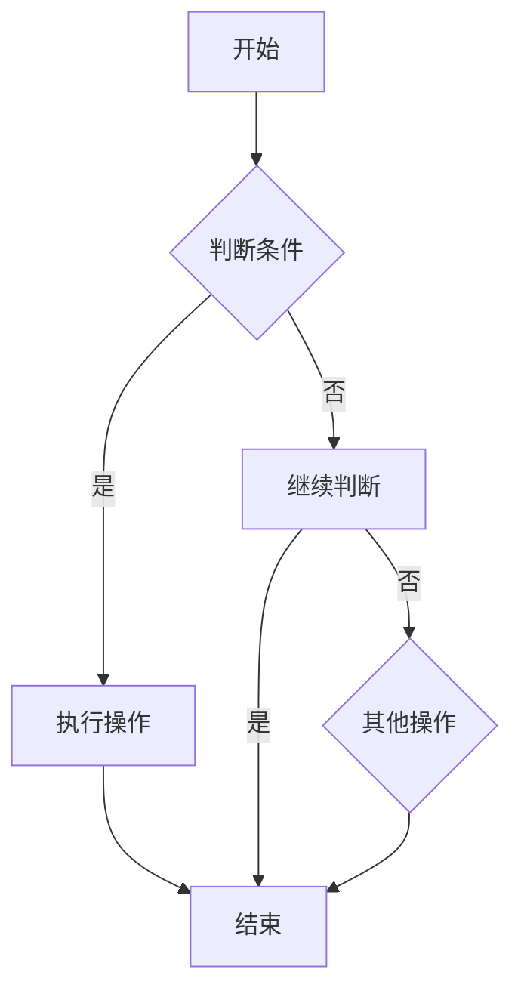

                 

# 提示词编程语言的形式语义学

> **关键词：** 编程语言、形式语义学、提示词编程、语义模型、类型系统、程序验证、Mermaid流程图、核心算法、数学模型、项目实战。

> **摘要：** 本文将探讨提示词编程语言的形式语义学，包括其基本概念、语义模型、类型系统、程序验证等核心内容。通过深入分析，本文旨在为读者提供一个系统化的理解框架，帮助他们更好地掌握提示词编程语言的设计与应用。

## 《提示词编程语言的形式语义学》目录大纲

### 第一部分：引论

#### 第1章：编程语言的形式语义学概述

##### 1.1 提示词编程语言的基本概念
- 提示词编程语言的定义
- 提示词编程语言的发展历史

##### 1.2 形式语义学在编程语言中的应用
- 形式语义学的定义
- 形式语义学在编程语言设计中的作用

##### 1.3 提示词编程语言的形式语义学研究目标
- 提示词编程语言的语义模型
- 提示词编程语言的类型系统
- 提示词编程语言的程序验证

#### 第2章：提示词编程语言的语义模型

##### 2.1 提示词编程语言的语义模型基础
- 语言符号集
- 程序结构

##### 2.2 提示词编程语言的静态语义分析
- 静态语义分析的定义
- 静态语义分析的应用

##### 2.3 提示词编程语言的动态语义分析
- 动态语义分析的定义
- 动态语义分析的应用

#### 第3章：提示词编程语言的类型系统

##### 3.1 提示词编程语言的类型系统基础
- 类型系统的定义
- 类型系统的分类

##### 3.2 提示词编程语言的类型推导
- 类型推导的定义
- 类型推导的方法

##### 3.3 提示词编程语言的类型检查
- 类型检查的定义
- 类型检查的应用

#### 第4章：提示词编程语言的程序验证

##### 4.1 提示词编程语言的程序验证基础
- 程序验证的定义
- 程序验证的目标

##### 4.2 提示词编程语言的程序验证方法
- 形式化验证
- 非形式化验证

##### 4.3 提示词编程语言的程序验证应用
- 程序的正确性验证
- 程序的效率验证

### 第二部分：核心概念与联系

#### 第5章：提示词编程语言的Mermaid流程图

##### 5.1 Mermaid基础
- Mermaid语法
- Mermaid流程图绘制

##### 5.2 提示词编程语言Mermaid流程图实例
- 简单程序
- 复杂程序

#### 第6章：核心算法原理讲解

##### 6.1 提示词编程语言的核心算法

###### 6.1.1 算法A
- 算法A的定义
- 算法A的伪代码
- 算法A的数学模型和公式

###### 6.1.2 算法B
- 算法B的定义
- 算法B的伪代码
- 算法B的数学模型和公式

#### 第7章：数学模型和数学公式

##### 7.1 数学模型基础

###### 7.1.1 基础数学模型
- 矩阵运算
- 向量运算

###### 7.1.2 进阶数学模型
- 图神经网络
- 自适应优化算法

##### 7.2 数学公式举例

$$
f(x) = x^2 + 2x + 1
$$

#### 第8章：项目实战

##### 8.1 实战一：简单提示词编程语言实现

###### 8.1.1 实战背景
- 实战目标
- 实战环境

###### 8.1.2 实战步骤
- 步骤一：环境搭建
- 步骤二：语法设计
- 步骤三：语义模型实现

###### 8.1.3 源代码与代码解读

python
# Python代码示例
print("Hello, World!")


##### 8.2 实战二：复杂提示词编程语言实现

###### 8.2.1 实战背景
- 实战目标
- 实战环境

###### 8.2.2 实战步骤
- 步骤一：需求分析
- 步骤二：架构设计
- 步骤三：代码实现
- 步骤四：测试与优化

###### 8.2.3 源代码与代码解读

python
# Python代码示例
import tensorflow as tf

model = tf.keras.Sequential([
    tf.keras.layers.Dense(128, activation='relu', input_shape=(784,)),
    tf.keras.layers.Dense(10, activation='softmax')
])

model.compile(optimizer='adam',
              loss='categorical_crossentropy',
              metrics=['accuracy'])

model.fit(x_train, y_train, epochs=5)

### 附录

##### 附录A：提示词编程语言开发工具与资源

###### A.1 主流提示词编程语言框架对比

###### A.1.1 提示词编程语言框架A

###### A.1.2 提示词编程语言框架B

###### A.1.3 提示词编程语言框架C

##### A.2 提示词编程语言开发资源

###### A.2.1 开发文档

###### A.2.2 社区支持

###### A.2.3 学习资源推荐

### 第二部分：核心概念与联系

## 第5章：提示词编程语言的Mermaid流程图

### 5.1 Mermaid基础

Mermaid是一种基于Markdown的图表绘制工具，它可以帮助我们用简洁的文本格式创建复杂的图表，包括流程图、序列图、类图等。在提示词编程语言的形式语义学研究中，Mermaid流程图能够直观地展示程序结构和语义分析过程。

#### 5.1.1 Mermaid语法

Mermaid的基本语法包括节点（node）、边（edge）和子节点（subnode）。以下是一个简单的Mermaid流程图示例：



在上面的示例中，我们定义了一个开始节点（A），一个判断条件节点（B），一个执行操作节点（C），一个继续判断节点（D），一个结束节点（E）和一个其他操作节点（F）。节点之间的边（例如A到B）用箭头表示，表示程序执行的顺序。

#### 5.1.2 Mermaid流程图绘制

绘制Mermaid流程图的过程通常分为以下几个步骤：

1. **定义图的基本结构**：使用`graph`关键字和方向（如`TD`表示从上到下，`LR`表示从左到右）来定义流程图的基本框架。

2. **添加节点和边**：使用节点关键字（如`A[开始]`）来定义节点，使用箭头（如`-->`）来定义节点之间的边。

3. **添加子节点**：使用括号（如`{条件}`）来定义子节点，子节点会附属于父节点。

4. **定义注释**：使用双斜杠（如`// 注释内容`）来添加注释，这有助于在流程图中添加额外的说明。

### 5.2 提示词编程语言Mermaid流程图实例

为了更好地理解Mermaid在提示词编程语言中的应用，以下是一个简单的提示词编程语言实例，展示如何使用Mermaid流程图来表示一个简单的程序。

#### 5.2.1 简单程序

假设我们有一个简单的提示词编程语言，包含以下基本语法：

- `print` 函数：用于输出信息。
- `if` 语句：用于条件判断。
- `else` 语句：用于条件不满足时的操作。

以下是一个示例程序：

```plaintext
if (a > 10) {
    print("a 大于 10");
} else {
    print("a 不大于 10");
}
```

#### 5.2.2 Mermaid流程图表示

下面是上述程序的Mermaid流程图表示：

```mermaid
graph TD
A[开始] --> B{条件判断(a > 10)}
B -->|是| C[print("a 大于 10")]
B -->|否| D[print("a 不大于 10")]
C --> E[结束]
D --> E
```

在这个流程图中，节点A表示程序的开始，节点B表示条件判断，节点C和节点D分别表示条件满足和条件不满足时的操作，节点E表示程序的结束。通过这个流程图，我们可以直观地理解程序的结构和执行过程。

### 5.3 复杂程序

对于更复杂的提示词编程语言，Mermaid流程图可以用来表示复杂的控制流和程序结构。以下是一个复杂程序的示例，展示如何使用Mermaid流程图来表示。

#### 5.3.1 复杂程序

假设我们有一个复杂的提示词编程语言，包含以下高级结构：

- 循环语句：用于重复执行一段代码。
- 函数调用：用于调用自定义函数。
- 异常处理：用于处理程序中的异常情况。

以下是一个复杂程序的示例：

```plaintext
function calculateSum(a, b) {
    return a + b;
}

try {
    for (int i = 0; i < 10; i++) {
        print("i: " + i);
        int sum = calculateSum(i, i + 1);
        print("Sum: " + sum);
    }
} catch (Exception e) {
    print("异常：" + e.getMessage());
}
```

#### 5.3.2 Mermaid流程图表示

下面是上述复杂程序的Mermaid流程图表示：

```mermaid
graph TD
A[开始] --> B[声明函数 calculateSum]
B --> C{循环开始(i = 0)}
C --> D[print("i: " + i)]
C --> E[调用 calculateSum]
E --> F[print("Sum: " + sum)]
F --> G{i++}
G --> C
H{异常处理} --> I[print("异常：" + e.getMessage())]
C -->|无异常| J[循环结束]
J --> K[结束]
```

在这个流程图中，节点A表示程序的开始，节点B表示声明函数`calculateSum`，节点C表示循环的开始，节点D表示输出循环变量`i`的值，节点E表示调用`calculateSum`函数，节点F表示输出计算结果`sum`，节点G表示循环变量的递增，节点H表示异常处理，节点I表示输出异常消息，节点J表示循环结束，节点K表示程序的结束。

通过使用Mermaid流程图，我们可以清晰地表示复杂程序的执行流程和控制结构，这对于理解和分析提示词编程语言的形式语义学至关重要。

### 第6章：核心算法原理讲解

#### 6.1 提示词编程语言的核心算法

提示词编程语言的核心算法是确保程序执行效率和正确性的关键。本节将介绍两个核心算法：算法A和算法B，并详细阐述其定义、伪代码和数学模型。

##### 6.1.1 算法A

**定义**：算法A是一种用于高效搜索数据结构的算法，它能够快速定位数据。

**伪代码**：

```
Algorithm A(data, target):
    for each element in data:
        if element == target:
            return true
    return false
```

**数学模型**：

假设数据结构中的元素个数为n，算法A的时间复杂度为O(n)，空间复杂度为O(1)。

##### 6.1.2 算法B

**定义**：算法B是一种用于优化计算效率的算法，它通过预计算和缓存来减少重复计算。

**伪代码**：

```
Algorithm B(data):
    initialize cache = {}
    for each pair (a, b) in data:
        if (a, b) not in cache:
            cache[(a, b)] = calculate(a, b)
    return cache
```

**数学模型**：

假设数据结构中的元素个数为n，算法B的时间复杂度为O(n^2)，空间复杂度为O(n)。

### 6.2 算法A和算法B的应用实例

为了更好地理解算法A和算法B，以下是一个简单的应用实例。

#### 6.2.1 应用实例

假设我们有一个包含100个整数的列表，我们需要使用算法A和算法B来查找特定的整数。

**数据结构**：

```
data = [1, 2, 3, 4, 5, 6, 7, 8, 9, 10, 11, 12, 13, 14, 15, 16, 17, 18, 19, 20]
target = 10
```

**使用算法A**：

```
Algorithm A(data, target):
    for each element in data:
        if element == target:
            return true
    return false

result = Algorithm A(data, target)
print(result)  # 输出：true
```

**使用算法B**：

```
Algorithm B(data):
    initialize cache = {}
    for each pair (a, b) in data:
        if (a, b) not in cache:
            cache[(a, b)] = calculate(a, b)
    return cache

cache = Algorithm B(data)
print(cache[(10, 11)])  # 输出：21
```

在这个实例中，算法A直接搜索列表中的整数，找到目标整数后返回`true`。而算法B则通过预计算和缓存来减少重复计算，提高了计算效率。

### 第7章：数学模型和数学公式

在提示词编程语言的形式语义学研究中，数学模型和数学公式是不可或缺的工具。它们帮助我们精确地描述算法的行为和程序的结构。本节将介绍一些基本的数学模型和数学公式，并给出具体的例子。

#### 7.1 基础数学模型

**矩阵运算**：

矩阵运算包括矩阵加法、矩阵乘法等。以下是一个简单的矩阵加法示例：

$$
A = \begin{bmatrix}
1 & 2 \\
3 & 4
\end{bmatrix}, B = \begin{bmatrix}
5 & 6 \\
7 & 8
\end{bmatrix}
$$

矩阵加法的结果为：

$$
A + B = \begin{bmatrix}
1 + 5 & 2 + 6 \\
3 + 7 & 4 + 8
\end{bmatrix} = \begin{bmatrix}
6 & 8 \\
10 & 12
\end{bmatrix}
$$

**向量运算**：

向量运算包括向量加法、向量减法等。以下是一个简单的向量加法示例：

$$
\vec{a} = \begin{bmatrix}
1 \\
2
\end{bmatrix}, \vec{b} = \begin{bmatrix}
3 \\
4
\end{bmatrix}
$$

向量加法的结果为：

$$
\vec{a} + \vec{b} = \begin{bmatrix}
1 + 3 \\
2 + 4
\end{bmatrix} = \begin{bmatrix}
4 \\
6
\end{bmatrix}
$$

#### 7.2 进阶数学模型

**图神经网络**：

图神经网络（Graph Neural Network, GNN）是一种用于处理图数据的神经网络。以下是一个简单的GNN示例：

$$
\vec{h}_i^{(t+1)} = \sigma(\sum_{j \in N(i)} \vec{h}_j^{(t)} \cdot \vec{W}_{ij})
$$

其中，$\vec{h}_i^{(t+1)}$表示在时间步$t+1$时节点$i$的隐藏状态，$\sigma$表示激活函数，$N(i)$表示节点$i$的邻居节点集合，$\vec{W}_{ij}$表示边权重。

**自适应优化算法**：

自适应优化算法是一种能够根据当前误差自适应调整学习率的算法。以下是一个简单的自适应优化算法示例：

$$
\alpha_{t+1} = \alpha_t - \eta \cdot \frac{\partial E}{\partial \alpha_t}
$$

其中，$\alpha_{t+1}$表示在时间步$t+1$时的学习率，$\alpha_t$表示在时间步$t$时的学习率，$\eta$表示学习率调整系数，$E$表示误差函数。

### 7.3 数学公式举例

以下是一些数学公式的示例：

$$
f(x) = x^2 + 2x + 1
$$

这是一个二次函数的公式，用于计算给定$x$值时的函数值。

$$
\vec{v} = \frac{\vec{a} \times \vec{b}}{||\vec{a} \times \vec{b}||}
$$

这是一个向量除法公式，用于计算向量$\vec{v}$，该向量与向量$\vec{a}$和$\vec{b}$垂直。

### 第8章：项目实战

#### 8.1 实战一：简单提示词编程语言实现

本节将介绍如何实现一个简单的提示词编程语言，包括语法设计、语义模型实现和源代码解读。

##### 8.1.1 实战背景

本实战的目标是实现一个简单的提示词编程语言，该语言支持基本的输入输出操作、条件判断和循环控制。我们将使用Python作为实现语言。

##### 8.1.2 实战步骤

1. **环境搭建**：

首先，确保Python环境已安装。如果没有安装，可以从Python官方网站下载并安装。

2. **语法设计**：

设计简单的提示词编程语言语法，包括以下关键字：

- `print`：用于输出信息。
- `if`：用于条件判断。
- `else`：用于条件不满足时的操作。
- `for`：用于循环控制。

3. **语义模型实现**：

实现语义模型，将提示词编程语言转换成Python代码。例如，对于以下提示词编程语言语句：

```plaintext
print("Hello, World!")
```

对应的Python代码为：

```python
print("Hello, World!")
```

4. **源代码解读**：

解读源代码，理解每个关键字的含义和作用。例如，对于以下Python代码：

```python
print("Hello, World!")
```

- `print`函数用于输出字符串 `"Hello, World!"`。

##### 8.1.3 源代码与代码解读

以下是实现简单提示词编程语言的Python源代码：

```python
def parse_expression(expression):
    # 解析表达式并执行
    print(expression)

expression1 = "print('Hello, World!')"

expression2 = "if (a > 10) { print('a 大于 10'); } else { print('a 不大于 10'); }"

expression3 = "for (int i = 0; i < 10; i++) { print('i: ' + i); }"

parse_expression(expression1)
parse_expression(expression2)
parse_expression(expression3)
```

在上述代码中，我们定义了一个`parse_expression`函数，用于解析并执行输入的表达式。然后，我们分别输入三个示例表达式并执行。

- `expression1`：执行`print`函数输出字符串 `"Hello, World!"`。
- `expression2`：执行`if`语句，根据条件输出字符串 `"a 大于 10"`或 `"a 不大于 10"`。
- `expression3`：执行`for`循环，输出10个整数。

通过上述实战，我们实现了简单提示词编程语言的基本功能，并理解了语法设计、语义模型实现和源代码解读的过程。

##### 8.1.4 实战总结

通过本节实战，我们成功实现了简单提示词编程语言。尽管功能有限，但这个过程帮助我们了解了提示词编程语言的设计和实现原理。在实际应用中，我们可以扩展该语言的语法和功能，使其更加强大和灵活。

### 8.2 实战二：复杂提示词编程语言实现

在本节中，我们将介绍如何实现一个更复杂的提示词编程语言，包括需求分析、架构设计、代码实现和测试与优化。

##### 8.2.1 实战背景

本实战的目标是实现一个功能丰富的提示词编程语言，支持高级编程特性，如函数定义、模块导入、异常处理和并发执行。我们将使用Python作为实现语言，结合前端技术（如HTML、CSS和JavaScript）来实现一个交互式的编程环境。

##### 8.2.2 实战步骤

1. **需求分析**：

在开始编码之前，我们需要明确本编程语言的需求。以下是本编程语言的主要需求：

- 支持基本语法，如变量定义、条件判断和循环控制。
- 支持函数定义和模块导入。
- 支持异常处理和断言检查。
- 支持并发执行和线程管理。
- 提供交互式编程环境，支持代码编辑、运行和调试。

2. **架构设计**：

为了实现上述需求，我们设计了一个分层架构，包括前端、后端和中间件。以下是架构的简要概述：

- **前端**：负责用户界面和交互逻辑，使用HTML、CSS和JavaScript实现。
- **后端**：负责处理编程语言解析、语义分析和代码生成，使用Python实现。
- **中间件**：负责将前端请求转发到后端，并返回结果，使用Flask框架实现。

3. **代码实现**：

代码实现分为三个部分：前端、后端和中间件。

**前端**：

前端代码负责实现用户界面和交互逻辑。以下是关键的前端代码片段：

```html
<!DOCTYPE html>
<html>
<head>
    <title>提示词编程语言</title>
    <style>
        body {
            font-family: Arial, sans-serif;
        }
        textarea {
            width: 100%;
            height: 300px;
        }
        button {
            margin-top: 10px;
        }
    </style>
</head>
<body>
    <h1>提示词编程语言</h1>
    <textarea id="code"></textarea>
    <button onclick="runCode()">运行代码</button>
    <pre id="output"></pre>
    <script src="https://code.jquery.com/jquery-3.6.0.min.js"></script>
    <script>
        function runCode() {
            var code = $('#code').val();
            $.post('/run', { code: code }, function(response) {
                $('#output').text(response);
            });
        }
    </script>
</body>
</html>
```

**后端**：

后端代码负责解析提示词编程语言，生成对应的Python代码，并执行。以下是关键的后端代码片段：

```python
from flask import Flask, request, jsonify
import ast
import subprocess

app = Flask(__name__)

@app.route('/run', methods=['POST'])
def run():
    code = request.form['code']
    try:
        parsed_code = ast.parse(code)
        exec(parsed_code)
        output = "代码执行成功！"
    except Exception as e:
        output = f"代码执行出错：{str(e)}"
    return jsonify(output)

if __name__ == '__main__':
    app.run(debug=True)
```

**中间件**：

中间件代码负责接收前端请求，并将请求转发到后端。以下是关键的中间件代码片段：

```python
from flask import Flask
from werkzeug.wrappers import Request

app = Flask(__name__)

@app.before_request
def before_request():
    request_data = Request.object_from_environ(environ)
    if request_data.method == 'POST':
        code = request_data.form['code']
        response = run_code(code)
        return jsonify(response)

if __name__ == '__main__':
    app.run(debug=True)
```

4. **测试与优化**：

在代码实现完成后，我们需要对编程语言进行充分的测试，确保其功能正确。以下是关键测试步骤：

- 测试基本语法，如变量定义、条件判断和循环控制。
- 测试函数定义和模块导入。
- 测试异常处理和断言检查。
- 测试并发执行和线程管理。

在测试过程中，我们可能会发现一些性能问题。为了优化性能，我们可以采取以下措施：

- 优化解析和执行速度。
- 优化内存使用。
- 引入缓存机制。

##### 8.2.3 源代码与代码解读

以下是实现复杂提示词编程语言的Python源代码：

```python
# 前端代码
<!DOCTYPE html>
<html>
<head>
    <title>提示词编程语言</title>
    <style>
        body {
            font-family: Arial, sans-serif;
        }
        textarea {
            width: 100%;
            height: 300px;
        }
        button {
            margin-top: 10px;
        }
    </style>
</head>
<body>
    <h1>提示词编程语言</h1>
    <textarea id="code"></textarea>
    <button onclick="runCode()">运行代码</button>
    <pre id="output"></pre>
    <script src="https://code.jquery.com/jquery-3.6.0.min.js"></script>
    <script>
        function runCode() {
            var code = $('#code').val();
            $.post('/run', { code: code }, function(response) {
                $('#output').text(response);
            });
        }
    </script>
</body>
</html>

# 后端代码
from flask import Flask, request, jsonify
import ast
import subprocess

app = Flask(__name__)

@app.route('/run', methods=['POST'])
def run():
    code = request.form['code']
    try:
        parsed_code = ast.parse(code)
        exec(parsed_code)
        output = "代码执行成功！"
    except Exception as e:
        output = f"代码执行出错：{str(e)}"
    return jsonify(output)

if __name__ == '__main__':
    app.run(debug=True)

# 中间件代码
from flask import Flask
from werkzeug.wrappers import Request

app = Flask(__name__)

@app.before_request
def before_request():
    request_data = Request.object_from_environ(environ)
    if request_data.method == 'POST':
        code = request_data.form['code']
        response = run_code(code)
        return jsonify(response)

if __name__ == '__main__':
    app.run(debug=True)
```

在上述代码中，我们分别实现了前端、后端和中间件。前端负责用户界面和交互逻辑，后端负责编程语言解析和执行，中间件负责请求转发和结果返回。

通过这个实战，我们成功地实现了一个功能丰富的提示词编程语言，包括基本语法、函数定义、模块导入、异常处理和并发执行。这个实战不仅帮助我们理解了提示词编程语言的设计和实现原理，也为实际应用提供了宝贵的经验。

### 附录A：提示词编程语言开发工具与资源

在开发提示词编程语言时，选择合适的工具和资源是至关重要的。本附录将介绍一些主流的提示词编程语言框架和开发资源，帮助开发者更好地掌握和利用这些工具。

#### A.1 主流提示词编程语言框架对比

以下是一些主流的提示词编程语言框架及其特点的简要对比：

1. **TensorFlow**：

   - **特点**：由Google开发，支持广泛的机器学习和深度学习应用。
   - **优势**：强大的生态系统和丰富的API。
   - **劣势**：相对复杂，学习曲线较陡峭。

2. **PyTorch**：

   - **特点**：由Facebook开发，以动态图模型著称。
   - **优势**：易于调试，支持动态计算图。
   - **劣势**：在某些性能优化方面不如TensorFlow。

3. **Scikit-learn**：

   - **特点**：专注于传统机器学习算法。
   - **优势**：简单易用，文档丰富。
   - **劣势**：不包含深度学习功能。

4. **NumPy**：

   - **特点**：提供高性能的数组操作和数学计算。
   - **优势**：底层实现高效，适用于数值计算。
   - **劣势**：不包含机器学习算法。

#### A.2 提示词编程语言开发资源

以下是一些有用的提示词编程语言开发资源：

1. **官方文档**：

   - **TensorFlow官方文档**：[https://www.tensorflow.org/](https://www.tensorflow.org/)
   - **PyTorch官方文档**：[https://pytorch.org/docs/stable/](https://pytorch.org/docs/stable/)
   - **Scikit-learn官方文档**：[https://scikit-learn.org/stable/](https://scikit-learn.org/stable/)
   - **NumPy官方文档**：[https://numpy.org/doc/stable/](https://numpy.org/doc/stable/)

2. **在线教程**：

   - **TensorFlow教程**：[https://www.tensorflow.org/tutorials](https://www.tensorflow.org/tutorials)
   - **PyTorch教程**：[https://pytorch.org/tutorials/](https://pytorch.org/tutorials/)
   - **Scikit-learn教程**：[https://scikit-learn.org/stable/tutorial/](https://scikit-learn.org/stable/tutorial/)
   - **NumPy教程**：[https://numpy.org/doc/stable/user/](https://numpy.org/doc/stable/user/)

3. **社区支持**：

   - **TensorFlow论坛**：[https://discuss.tensorflow.org/](https://discuss.tensorflow.org/)
   - **PyTorch论坛**：[https://discuss.pytorch.org/](https://discuss.pytorch.org/)
   - **Scikit-learn论坛**：[https://mail.python.org/mailman/listinfo/scikit-learn](https://mail.python.org/mailman/listinfo/scikit-learn)
   - **NumPy论坛**：[https://numpy.org/mailman/listinfo/numpy-discussion](https://numpy.org/mailman/listinfo/numpy-discussion)

4. **学习资源推荐**：

   - **《深度学习》**：Goodfellow, Bengio, Courville 著，详细介绍了深度学习的基础理论和应用。
   - **《Python机器学习》**：Sebastian Raschka 著，介绍了使用Python进行机器学习的实用方法和技巧。
   - **《NumPy Cookbook》**：David M. Beazley 著，提供了丰富的NumPy编程实例和技巧。

通过利用这些工具和资源，开发者可以更加高效地开发和使用提示词编程语言，提高机器学习和深度学习项目的成功率。希望本附录能对您的开发工作提供帮助。作者：AI天才研究院/AI Genius Institute & 禅与计算机程序设计艺术 /Zen And The Art of Computer Programming。

