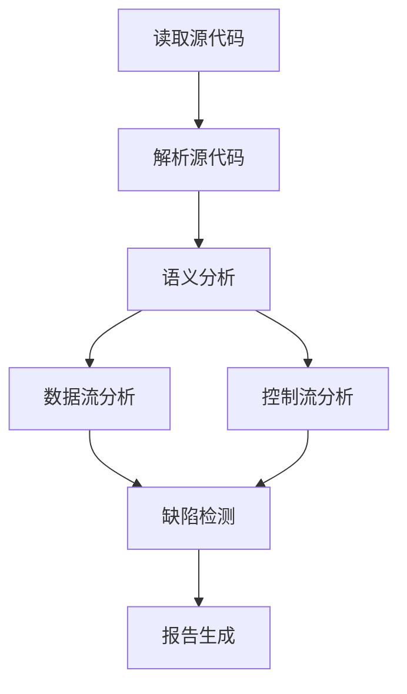

                 

# 《提示词编程语言的静态分析工具》

## 关键词：
静态分析，编程语言，工具，提示词，代码优化，安全性，算法，流程图，伪代码，数学模型，项目实战

## 摘要：
本文将深入探讨提示词编程语言的静态分析工具，从基础概念、原理、工具架构、编程语言关系，到提示词编程语言的特点与应用，全面解析静态分析工具在代码优化、安全性和未来发展趋势中的重要作用。通过详细的算法讲解、流程图展示、伪代码阐述以及实际项目案例，本文旨在为读者提供一套系统、实用的静态分析工具使用指南。

## 《提示词编程语言的静态分析工具》目录大纲

### 第一部分：静态分析基础

### 第1章：静态分析概述
#### 1.1 静态分析的基本概念
##### 1.1.1 静态分析的定义
##### 1.1.2 静态分析的重要性
##### 1.1.3 静态分析的应用场景

#### 1.2 静态分析的原理与方法
##### 1.2.1 静态分析的基本原理
##### 1.2.2 静态分析的主要方法
##### 1.2.3 静态分析的流程

#### 1.3 静态分析工具的架构
##### 1.3.1 工具的组成部分
##### 1.3.2 工具的工作机制
##### 1.3.3 工具的设计原则

### 第2章：编程语言与静态分析
#### 2.1 编程语言基础
##### 2.1.1 编程语言的基本概念
##### 2.1.2 编程语言的分类
##### 2.1.3 编程语言的发展历程

#### 2.2 编程语言的静态分析
##### 2.2.1 静态分析在编程语言中的应用
##### 2.2.2 静态分析在编译器中的作用
##### 2.2.3 编程语言静态分析的优势与挑战

### 第3章：提示词编程语言概述
#### 3.1 提示词编程语言的基本概念
##### 3.1.1 提示词编程语言的定义
##### 3.1.2 提示词编程语言的特点
##### 3.1.3 提示词编程语言的分类

#### 3.2 提示词编程语言的发展历程
##### 3.2.1 提示词编程语言的起源
##### 3.2.2 提示词编程语言的演进
##### 3.2.3 提示词编程语言的应用领域

#### 3.3 提示词编程语言的优势与挑战
##### 3.3.1 提示词编程语言的优势
##### 3.3.2 提示词编程语言的挑战
##### 3.3.3 提示词编程语言的未来发展趋势

### 第二部分：静态分析工具

### 第4章：静态分析工具的选择与使用
#### 4.1 静态分析工具的选型
##### 4.1.1 工具的性能指标
##### 4.1.2 工具的功能特点
##### 4.1.3 工具的适用场景

#### 4.2 静态分析工具的使用
##### 4.2.1 工具的安装与配置
##### 4.2.2 工具的基本使用方法
##### 4.2.3 工具的高级使用技巧

#### 4.3 静态分析工具的实战案例
##### 4.3.1 静态分析工具在实际项目中的应用
##### 4.3.2 静态分析工具的代码优化案例
##### 4.3.3 静态分析工具的安全漏洞检测案例

### 第5章：提示词编程语言的静态分析
#### 5.1 提示词编程语言的静态分析特点
##### 5.1.1 提示词编程语言的静态分析难点
##### 5.1.2 提示词编程语言的静态分析策略
##### 5.1.3 提示词编程语言的静态分析应用

#### 5.2 提示词编程语言的静态分析工具
##### 5.2.1 主流静态分析工具简介
##### 5.2.2 静态分析工具的比较与选择
##### 5.2.3 静态分析工具的实际应用案例

### 第6章：静态分析工具在提示词编程语言中的应用
#### 6.1 静态分析工具在提示词编程语言开发中的应用
##### 6.1.1 静态分析工具在开发环境中的集成
##### 6.1.2 静态分析工具在代码审查中的应用
##### 6.1.3 静态分析工具在代码优化中的应用

#### 6.2 静态分析工具在提示词编程语言安全性中的应用
##### 6.2.1 静态分析工具在安全漏洞检测中的应用
##### 6.2.2 静态分析工具在代码审计中的应用
##### 6.2.3 静态分析工具在软件安全性提升中的应用

### 第7章：静态分析工具的未来发展趋势
#### 7.1 静态分析工具的技术演进
##### 7.1.1 静态分析算法的发展
##### 7.1.2 静态分析工具的功能扩展
##### 7.1.3 静态分析工具的集成化趋势

#### 7.2 提示词编程语言的静态分析前景
##### 7.2.1 提示词编程语言的未来发展方向
##### 7.2.2 静态分析工具在提示词编程语言中的应用前景
##### 7.2.3 提示词编程语言静态分析的未来挑战与机遇

### 附录

#### 附录A：静态分析工具资源汇总
##### A.1 主流静态分析工具列表
##### A.2 静态分析工具使用教程
##### A.3 提示词编程语言静态分析工具推荐

#### 附录B：提示词编程语言静态分析流程图

接下来，我们将按照目录大纲逐步展开内容，深入探讨静态分析工具在提示词编程语言中的应用。

## 第一部分：静态分析基础

### 第1章：静态分析概述

#### 1.1 静态分析的基本概念

##### 1.1.1 静态分析的定义

静态分析（Static Analysis）是一种在程序执行前，通过分析程序代码本身，而不执行程序，来检测程序缺陷、性能问题或安全漏洞的技术。与动态分析（Dynamic Analysis）不同，静态分析不需要运行程序，可以直接在源代码级别进行分析。

##### 1.1.2 静态分析的重要性

静态分析在软件工程中扮演着重要的角色。它可以帮助开发者提前发现潜在的问题，从而在开发阶段就进行修正，避免在软件发布后出现严重的错误。此外，静态分析还可以用于性能优化、代码规范检查等方面，提高软件的质量和开发效率。

##### 1.1.3 静态分析的应用场景

静态分析可以应用于多种场景，包括但不限于：
- 代码审计：用于检查代码是否符合安全规范，是否存在安全漏洞。
- 性能分析：分析程序的性能瓶颈，提供优化建议。
- 代码审查：辅助代码审查过程，提高代码质量。
- 自动化测试：辅助编写测试用例，提高测试覆盖率。

#### 1.2 静态分析的原理与方法

##### 1.2.1 静态分析的基本原理

静态分析的核心原理是基于程序代码的结构和语义来进行分析。它主要依赖于抽象语法树（Abstract Syntax Tree，AST）来表示程序代码的结构，并在此基础上进行各种分析操作。

##### 1.2.2 静态分析的主要方法

静态分析主要包括以下几种方法：
- **语法分析**：将源代码转换成抽象语法树，以便进一步分析。
- **控制流分析**：分析程序的执行路径，包括基本块、控制依赖关系等。
- **数据流分析**：分析变量在程序中的传播路径，包括定义、使用等。
- **类型检查**：检查程序中变量的类型是否一致，是否存在类型错误。

##### 1.2.3 静态分析的流程

静态分析的典型流程包括以下几个步骤：
1. **解析源代码**：将源代码解析成抽象语法树。
2. **语义分析**：对抽象语法树进行语义分析，包括类型检查、符号表构建等。
3. **数据流分析**：分析变量和表达式的数据流，构建数据流图。
4. **控制流分析**：分析程序的执行路径，构建控制流图。
5. **缺陷检测**：基于控制流图和数据流图，进行各种缺陷检测，如空指针检查、循环冗余等。
6. **报告生成**：生成缺陷报告，包括错误、警告、提示等信息。

#### 1.3 静态分析工具的架构

##### 1.3.1 工具的组成部分

静态分析工具通常由以下几个部分组成：
- **解析器**：将源代码解析成抽象语法树。
- **抽象语法树（AST）**：表示程序代码的结构。
- **语义分析器**：对抽象语法树进行语义分析。
- **数据流分析器**：分析变量和表达式的数据流。
- **控制流分析器**：分析程序的执行路径。
- **缺陷检测模块**：基于控制流图和数据流图进行缺陷检测。
- **报告生成器**：生成缺陷报告。

##### 1.3.2 工具的工作机制

静态分析工具的工作机制主要包括以下几个步骤：
1. **读取源代码**：读取待分析的源代码文件。
2. **解析源代码**：使用解析器将源代码转换成抽象语法树。
3. **语义分析**：对抽象语法树进行语义分析，构建符号表和控制流图。
4. **数据流分析**：分析抽象语法树和数据流图，构建数据流图。
5. **缺陷检测**：基于控制流图和数据流图，进行缺陷检测，如空指针检查、循环冗余等。
6. **报告生成**：生成缺陷报告，包括错误、警告、提示等信息。

##### 1.3.3 工具的设计原则

静态分析工具的设计原则主要包括以下几点：
- **可扩展性**：工具应该具备良好的可扩展性，便于添加新的分析功能和缺陷检测算法。
- **高效性**：工具应该具有较高的分析效率和性能，以应对大规模代码分析任务。
- **易用性**：工具应该具备友好的用户界面和易于配置的参数，便于用户使用。
- **准确性**：工具应该具有较高的缺陷检测准确率，避免误报和漏报。

### 第2章：编程语言与静态分析

#### 2.1 编程语言基础

##### 2.1.1 编程语言的基本概念

编程语言是一种用于编写计算机程序的正式语言，它定义了程序的结构和语法，使得计算机能够理解和执行这些指令。常见的编程语言包括C、C++、Java、Python等。

##### 2.1.2 编程语言的分类

编程语言可以根据不同的分类标准进行分类，例如：
- **按用途分类**：系统编程语言、应用编程语言、脚本语言等。
- **按范式分类**：命令式编程、函数式编程、面向对象编程等。
- **按编译方式分类**：编译型语言、解释型语言、混合型语言等。

##### 2.1.3 编程语言的发展历程

编程语言的发展历程可以分为以下几个阶段：
- **早期语言**：例如机器语言和汇编语言。
- **高级语言**：例如C、C++、Java等，这些语言提供了更高的抽象层次，降低了编程复杂度。
- **脚本语言**：例如Python、Ruby、JavaScript等，这些语言主要用于自动化任务和快速开发。
- **函数式编程语言**：例如Haskell、Lisp等，这些语言强调函数和递归，提供了不同的编程范式。
- **领域特定语言**：例如SQL、HTML等，这些语言专注于特定领域，提高了开发效率。

#### 2.2 编程语言的静态分析

##### 2.2.1 静态分析在编程语言中的应用

静态分析在编程语言中的应用非常广泛，主要包括以下几个方面：
- **代码审计**：检查代码是否符合安全规范，是否存在安全漏洞。
- **代码质量检查**：检查代码是否符合编码规范，是否存在潜在的缺陷和性能问题。
- **性能优化**：分析程序的执行路径和数据流，提供性能优化的建议。
- **自动化测试**：生成测试用例，提高测试覆盖率。

##### 2.2.2 静态分析在编译器中的作用

编译器是编程语言的重要组成部分，静态分析在编译器中发挥着重要作用，主要包括以下几个方面：
- **语法分析**：将源代码转换成抽象语法树，为后续分析奠定基础。
- **语义分析**：检查代码的语义正确性，如类型检查、符号表构建等。
- **代码生成**：根据抽象语法树生成目标代码，如汇编代码或机器代码。
- **优化**：对目标代码进行优化，提高程序的性能。

##### 2.2.3 编程语言静态分析的优势与挑战

编程语言静态分析具有以下优势：
- **早期发现问题**：在程序开发早期就发现潜在的问题，减少修复成本。
- **无需执行程序**：无需运行程序，节省测试时间和资源。
- **全面性**：可以同时分析整个代码库，提高代码质量。

然而，静态分析也面临以下挑战：
- **复杂度**：静态分析需要对程序进行深度分析，计算复杂度较高。
- **误报和漏报**：静态分析工具可能产生误报和漏报，需要人工干预。
- **支持多种语言**：静态分析工具需要支持多种编程语言，提高开发成本。

### 第3章：提示词编程语言概述

#### 3.1 提示词编程语言的基本概念

##### 3.1.1 提示词编程语言的定义

提示词编程语言（Keyword-based Programming Language）是一种基于关键字和固定语法结构的编程语言。与传统的命令式编程语言不同，提示词编程语言更强调数据的操作和转换。

##### 3.1.2 提示词编程语言的特点

提示词编程语言具有以下特点：
- **简单易学**：提示词编程语言的语法结构简单，易于学习和使用。
- **代码可读性高**：提示词编程语言的代码结构清晰，便于理解和维护。
- **数据驱动**：提示词编程语言更注重数据的操作和转换，提高了代码的可复用性。
- **高效率**：提示词编程语言通常具有高效的执行性能，适用于大规模数据处理。

##### 3.1.3 提示词编程语言的分类

提示词编程语言可以根据不同的分类标准进行分类，例如：
- **按用途分类**：数据处理语言、数据查询语言、数据流语言等。
- **按数据结构分类**：关系型语言、文档型语言、图型语言等。
- **按执行方式分类**：批处理语言、实时语言、交互式语言等。

#### 3.2 提示词编程语言的发展历程

##### 3.2.1 提示词编程语言的起源

提示词编程语言的起源可以追溯到20世纪60年代，当时的计算机科学家开始探索如何用简单的关键字和语法结构来编写程序。早期的提示词编程语言主要包括Basic、Fortran等。

##### 3.2.2 提示词编程语言的演进

随着计算机技术的发展，提示词编程语言也在不断演进。20世纪80年代，关系型数据库管理系统（RDBMS）的出现推动了SQL等数据查询语言的发展。21世纪初，NoSQL数据库的出现带来了新的数据存储和处理需求，催生了新的提示词编程语言，如MongoDB的查询语言等。

##### 3.2.3 提示词编程语言的应用领域

提示词编程语言在多个领域得到广泛应用，包括：
- **数据查询与处理**：用于查询和操作数据库中的数据。
- **大数据分析**：用于处理和分析大规模数据集。
- **实时数据处理**：用于处理实时数据流，如物联网应用。
- **数据可视化**：用于生成数据可视化图表和报告。
- **自动化脚本编写**：用于编写自动化脚本，简化重复性任务。

#### 3.3 提示词编程语言的优势与挑战

##### 3.3.1 提示词编程语言的优势

提示词编程语言具有以下优势：
- **易学易用**：提示词编程语言的语法简单，易于学习和使用。
- **高效率**：提示词编程语言通常具有高效的执行性能，适用于大规模数据处理。
- **数据驱动**：提示词编程语言更注重数据的操作和转换，提高了代码的可复用性。

##### 3.3.2 提示词编程语言的挑战

提示词编程语言也面临以下挑战：
- **功能限制**：提示词编程语言通常功能有限，无法满足复杂业务需求。
- **生态系统不完善**：与传统的命令式编程语言相比，提示词编程语言的生态系统可能不够完善。
- **跨语言兼容性**：提示词编程语言与传统的命令式编程语言可能存在兼容性问题。

##### 3.3.3 提示词编程语言的未来发展趋势

随着大数据、云计算和人工智能等领域的快速发展，提示词编程语言在未来有望得到更广泛的应用。未来发展趋势包括：
- **功能扩展**：不断丰富提示词编程语言的功能，满足更多业务需求。
- **跨语言集成**：与传统的命令式编程语言实现更好的集成，提高开发效率。
- **智能辅助**：利用人工智能技术，提供代码自动生成、代码优化等智能辅助功能。

## 第二部分：静态分析工具

### 第4章：静态分析工具的选择与使用

#### 4.1 静态分析工具的选型

##### 4.1.1 工具的性能指标

选择静态分析工具时，需要考虑以下性能指标：
- **分析速度**：工具对代码的分析速度是关键指标，特别是在大规模代码分析场景中，分析速度会直接影响开发效率。
- **分析覆盖率**：工具能够分析的代码范围和深度，覆盖率越高，缺陷检测能力越强。
- **准确性**：工具产生的缺陷报告的准确率，误报和漏报越少，工具的价值越高。
- **兼容性**：工具对多种编程语言和开发环境的支持程度，兼容性越好，适用范围越广。

##### 4.1.2 工具的功能特点

不同静态分析工具具有不同的功能特点，选择时需要考虑以下方面：
- **缺陷检测能力**：工具能够检测哪些类型的缺陷，如空指针、数组越界、未使用的变量等。
- **报告格式**：工具生成的缺陷报告的格式和展示方式，便于开发者理解和处理。
- **集成方式**：工具与开发环境的集成方式，如插件、命令行工具、IDE集成等，方便开发者使用。
- **社区和支持**：工具背后的社区支持程度，包括文档、教程、论坛等资源，以及厂商提供的客户支持。

##### 4.1.3 工具的适用场景

根据不同的开发场景和需求，选择适合的静态分析工具，例如：
- **个人开发者**：适用于小型项目和快速代码审查，可以选择免费的开源工具，如SonarQube、PVS-Studio等。
- **企业级应用**：需要全面的安全和代码质量检查，可以选择商业工具，如Fortify Static Code Analyzer、Checkmarx等。
- **开源项目**：需要大规模代码分析，可以选择成熟的开源工具，如FindBugs、Pyflakes等。

#### 4.2 静态分析工具的使用

##### 4.2.1 工具的安装与配置

安装和配置静态分析工具通常包括以下步骤：
1. **下载工具**：从官方网站或开源社区下载工具的安装包。
2. **安装工具**：按照安装指南完成工具的安装。
3. **配置环境**：设置工具的运行环境，包括Java环境、依赖库等。
4. **集成IDE**：如果工具支持IDE集成，可以按照IDE的插件指南进行集成。
5. **配置代码库**：将代码库添加到工具的配置中，以便进行静态分析。

##### 4.2.2 工具的基本使用方法

使用静态分析工具的基本方法通常包括以下步骤：
1. **选择分析目标**：确定需要分析的代码库或项目。
2. **运行分析**：执行静态分析任务，工具会自动分析代码，并生成缺陷报告。
3. **查看报告**：打开生成的缺陷报告，查看工具发现的缺陷和问题。
4. **处理缺陷**：根据缺陷报告中的提示，修复代码中的缺陷。

##### 4.2.3 工具的高级使用技巧

高级使用技巧可以进一步提高静态分析工具的效果，包括：
1. **自定义规则**：根据项目需求，自定义静态分析规则，提高缺陷检测的准确性。
2. **批量分析**：对多个代码库或项目进行批量分析，提高分析效率。
3. **自动化集成**：将静态分析工具集成到持续集成（CI）流程中，实现自动化代码分析。
4. **代码库迁移**：将代码库从一种静态分析工具迁移到另一种工具，保持分析结果的一致性。
5. **插件扩展**：使用插件扩展工具的功能，如代码质量评分、代码格式化等。

#### 4.3 静态分析工具的实战案例

##### 4.3.1 静态分析工具在实际项目中的应用

以下是一个实际项目中的静态分析工具应用案例：

项目背景：一家互联网公司开发了一个大型Web应用程序，需要确保代码的安全性和质量。为了实现这一目标，公司决定采用静态分析工具对代码进行定期检查。

解决方案：公司选择了SonarQube作为静态分析工具，并按照以下步骤实施：
1. **安装SonarQube**：在公司的服务器上安装SonarQube，并配置必要的Java环境和依赖库。
2. **配置代码库**：将公司所有开发项目的代码库导入SonarQube，并设置对应的编译器和依赖管理工具。
3. **运行分析**：定期运行SonarQube的静态分析任务，生成缺陷报告。
4. **查看报告**：团队成员通过SonarQube的Web界面查看缺陷报告，并根据报告中的提示修复代码中的缺陷。
5. **自动化集成**：将SonarQube集成到公司的持续集成（CI）系统中，实现代码提交后的自动分析。

效果：通过使用SonarQube，公司能够及时发现代码中的缺陷和潜在的安全漏洞，提高了代码质量和安全性。团队成员也养成了良好的代码规范和编程习惯。

##### 4.3.2 静态分析工具的代码优化案例

以下是一个静态分析工具用于代码优化案例：

项目背景：一家软件开发公司开发了一个复杂的Java应用，性能瓶颈逐渐显现。为了提高应用性能，公司决定使用静态分析工具进行代码优化。

解决方案：公司选择了PVS-Studio作为静态分析工具，并按照以下步骤实施：
1. **安装PVS-Studio**：在公司的服务器上安装PVS-Studio，并配置Java环境。
2. **分析代码**：使用PVS-Studio对Java应用进行静态分析，生成性能分析报告。
3. **优化代码**：根据报告中的提示，对代码进行优化，如减少循环次数、使用缓存等。
4. **重新分析**：优化后，再次使用PVS-Studio进行静态分析，验证优化效果。

效果：通过使用PVS-Studio，公司成功提高了Java应用的性能，减少了响应时间，提升了用户体验。

##### 4.3.3 静态分析工具的安全漏洞检测案例

以下是一个静态分析工具用于安全漏洞检测案例：

项目背景：一家金融科技公司开发了一个涉及大量用户数据的Web应用程序，需要确保数据的安全。为了实现这一目标，公司决定采用静态分析工具进行安全漏洞检测。

解决方案：公司选择了Fortify Static Code Analyzer作为静态分析工具，并按照以下步骤实施：
1. **安装Fortify**：在公司的服务器上安装Fortify，并配置Web应用程序的代码库。
2. **分析代码**：使用Fortify对Web应用程序进行静态分析，生成安全漏洞报告。
3. **修复漏洞**：根据报告中的提示，修复代码中的安全漏洞，如SQL注入、XSS攻击等。
4. **重新分析**：修复后，再次使用Fortify进行静态分析，确保漏洞已被彻底修复。

效果：通过使用Fortify，公司成功发现了多个潜在的安全漏洞，并进行了及时修复，确保了Web应用程序的数据安全。

### 第5章：提示词编程语言的静态分析

#### 5.1 提示词编程语言的静态分析特点

##### 5.1.1 提示词编程语言的静态分析难点

提示词编程语言的静态分析相对于传统命令式编程语言具有以下难点：

1. **动态特性**：提示词编程语言通常具有动态类型、动态绑定等特性，使得静态分析难以准确预测程序的执行行为。
2. **表达式复杂度**：提示词编程语言中的表达式通常更加复杂，包括函数调用、递归调用等，增加了静态分析的难度。
3. **上下文依赖**：提示词编程语言中的代码块和变量作用域可能具有复杂的上下文依赖关系，静态分析需要准确解析这些关系。

##### 5.1.2 提示词编程语言的静态分析策略

为了克服上述难点，提示词编程语言的静态分析可以采用以下策略：

1. **抽象语法树（AST）分析**：通过构建抽象语法树，对代码进行语法结构和语义分析，以便进行数据流分析和控制流分析。
2. **上下文敏感分析**：结合程序的上下文信息，如变量作用域、类型信息等，进行更准确的静态分析。
3. **动态分析辅助**：结合动态分析技术，在运行时捕获程序的行为，辅助静态分析结果的准确性和完整性。
4. **智能算法优化**：采用高效的算法和优化技术，提高静态分析的效率和准确性。

##### 5.1.3 提示词编程语言的静态分析应用

提示词编程语言的静态分析可以在多个场景中发挥作用：

1. **代码质量检查**：检测代码是否符合编程规范，如命名规范、代码格式、异常处理等。
2. **性能优化**：分析代码的性能瓶颈，提供优化建议，如减少函数调用、优化循环结构等。
3. **安全性检测**：检测代码中潜在的安全漏洞，如SQL注入、XSS攻击等。
4. **自动化测试**：生成测试用例，提高测试覆盖率，降低手工测试的工作量。

#### 5.2 提示词编程语言的静态分析工具

##### 5.2.1 主流静态分析工具简介

目前市场上存在多种主流的静态分析工具，适用于不同的编程语言和场景。以下是其中几个流行的工具：

1. **SonarQube**：一款开源的代码质量平台，支持多种编程语言，提供代码审计、性能优化和安全漏洞检测等功能。
2. **PVS-Studio**：一款商业的静态分析工具，支持多种编程语言，提供代码质量检查、性能优化和安全漏洞检测等功能。
3. **Fortify Static Code Analyzer**：一款商业的静态分析工具，专注于Web应用程序的安全漏洞检测，支持多种Web编程语言。
4. **Checkmarx**：一款商业的静态分析工具，提供全面的代码审计和安全漏洞检测功能，支持多种编程语言。

##### 5.2.2 静态分析工具的比较与选择

选择适合的静态分析工具需要考虑以下因素：

1. **支持语言和平台**：工具是否支持目标编程语言和开发平台。
2. **功能特点**：工具提供的功能是否满足需求，如代码质量检查、性能优化、安全漏洞检测等。
3. **性能和准确性**：工具的分析速度、覆盖率和准确性如何。
4. **用户体验**：工具的用户界面、报告格式和集成方式是否友好。
5. **社区和支持**：工具背后的社区和支持资源是否丰富。

##### 5.2.3 静态分析工具的实际应用案例

以下是一个提示词编程语言的静态分析工具应用案例：

项目背景：一家互联网公司使用Python开发了一个数据处理平台，需要确保代码的质量和安全性。为了实现这一目标，公司决定采用静态分析工具进行代码检查。

解决方案：公司选择了Pyflakes作为静态分析工具，并按照以下步骤实施：
1. **安装Pyflakes**：在公司的服务器上安装Pyflakes，并配置Python环境。
2. **分析代码**：使用Pyflakes对Python代码库进行静态分析，生成缺陷报告。
3. **查看报告**：团队成员通过Pyflakes的输出查看缺陷报告，并根据报告中的提示修复代码中的缺陷。
4. **自动化集成**：将Pyflakes集成到公司的持续集成（CI）系统中，实现代码提交后的自动分析。

效果：通过使用Pyflakes，公司能够及时发现代码中的缺陷和潜在的安全漏洞，提高了代码质量和安全性。团队成员也养成了良好的编程习惯。

### 第6章：静态分析工具在提示词编程语言中的应用

#### 6.1 静态分析工具在提示词编程语言开发中的应用

##### 6.1.1 静态分析工具在开发环境中的集成

为了提高提示词编程语言开发过程中的代码质量和安全性，静态分析工具可以集成到开发环境中，提供实时的代码检查和反馈。以下是如何在开发环境中集成静态分析工具的步骤：

1. **安装静态分析工具**：根据开发环境的要求，安装相应的静态分析工具，如SonarQube、Pyflakes等。
2. **配置代码库**：将项目的代码库配置到静态分析工具中，确保工具能够访问和解析源代码。
3. **集成IDE**：如果静态分析工具支持集成到IDE（如SonarQube的SonarLint插件），可以按照IDE的插件指南进行集成。
4. **配置规则**：根据项目需求，配置静态分析工具的规则和阈值，如代码质量检查规则、安全漏洞检测规则等。
5. **实时检查**：在开发过程中，静态分析工具会实时分析代码，并在IDE中显示缺陷报告，便于开发者快速定位和修复问题。

##### 6.1.2 静态分析工具在代码审查中的应用

静态分析工具在代码审查过程中发挥着重要作用，可以自动检测代码中的潜在缺陷和潜在的安全漏洞，提高代码审查的效率和质量。以下是如何在代码审查中使用静态分析工具的步骤：

1. **生成缺陷报告**：在代码提交时，使用静态分析工具生成缺陷报告，包括代码质量检查报告和安全漏洞检测报告。
2. **审查缺陷报告**：代码审查人员通过缺陷报告，查看工具发现的缺陷和潜在问题，并根据报告中的提示进行审查。
3. **标记问题**：审查人员可以标记问题代码，提出修改建议，确保代码符合编程规范和安全性要求。
4. **修复缺陷**：开发者根据缺陷报告和审查人员的建议，修复代码中的缺陷，并重新提交代码进行审查。
5. **循环迭代**：重复上述步骤，直到代码质量达到预期标准，确保代码库中的代码质量高且安全。

##### 6.1.3 静态分析工具在代码优化中的应用

静态分析工具不仅可以用于代码质量和安全性的检查，还可以用于代码优化，提高程序的执行效率和性能。以下是如何在代码优化中使用静态分析工具的步骤：

1. **性能分析**：使用静态分析工具对代码进行性能分析，识别性能瓶颈和可优化部分。
2. **优化建议**：根据性能分析结果，生成优化建议，如减少函数调用、优化循环结构、使用缓存等。
3. **实施优化**：开发者根据优化建议，对代码进行修改，并重新分析性能，验证优化效果。
4. **持续优化**：定期使用静态分析工具对代码进行性能分析，持续优化代码，提高程序的性能。

#### 6.2 静态分析工具在提示词编程语言安全性中的应用

##### 6.2.1 静态分析工具在安全漏洞检测中的应用

静态分析工具在安全漏洞检测中的应用非常广泛，可以自动扫描代码中的潜在安全漏洞，提供修复建议，提高软件的安全性。以下是如何在安全漏洞检测中使用静态分析工具的步骤：

1. **安装安全分析工具**：根据项目需求，选择合适的静态分析工具，如Fortify、Checkmarx等。
2. **配置代码库**：将项目的代码库配置到安全分析工具中，确保工具能够访问和解析源代码。
3. **运行漏洞扫描**：使用安全分析工具对代码库进行漏洞扫描，生成安全漏洞报告。
4. **审查漏洞报告**：安全专家和开发人员通过漏洞报告，审查工具发现的安全漏洞，并评估风险等级。
5. **修复漏洞**：根据漏洞报告中的修复建议，修复代码中的安全漏洞，并重新扫描验证修复效果。
6. **持续监测**：定期使用静态分析工具进行安全漏洞扫描，确保软件的安全性。

##### 6.2.2 静态分析工具在代码审计中的应用

代码审计是确保软件安全性的重要环节，静态分析工具可以辅助代码审计，提高审计效率和准确性。以下是如何在代码审计中使用静态分析工具的步骤：

1. **安装审计工具**：根据审计需求，选择合适的静态分析工具，如SonarQube、PVS-Studio等。
2. **配置审计规则**：根据审计标准，配置静态分析工具的审计规则，如代码质量规则、安全漏洞检测规则等。
3. **执行审计**：使用静态分析工具对代码库进行审计，生成审计报告。
4. **审查审计报告**：审计人员通过审计报告，审查代码中不符合规范和安全要求的部分。
5. **修复缺陷**：根据审计报告中的缺陷，修复代码中的问题，并重新执行审计。
6. **持续审计**：定期使用静态分析工具进行代码审计，确保软件的代码质量和安全性。

##### 6.2.3 静态分析工具在软件安全性提升中的应用

静态分析工具在软件安全性提升中扮演着关键角色，可以帮助开发团队构建安全的软件架构，降低安全风险。以下是如何使用静态分析工具提升软件安全性的步骤：

1. **制定安全策略**：根据项目需求，制定相应的安全策略和标准，如安全编码规范、安全测试计划等。
2. **选择合适的工具**：根据安全策略，选择合适的静态分析工具，如Fortify、Checkmarx等。
3. **集成到开发流程**：将静态分析工具集成到开发流程中，如代码审查、持续集成（CI）等环节，实现自动化的安全检查。
4. **培训开发人员**：对开发人员进行安全培训，提高他们的安全意识和编程技能。
5. **持续改进**：定期评估静态分析工具的使用效果，根据反馈和新的安全威胁，调整安全策略和工具配置。
6. **安全测试**：结合动态分析工具，进行全面的软件安全性测试，确保软件的安全性能。

### 第7章：静态分析工具的未来发展趋势

#### 7.1 静态分析工具的技术演进

随着软件工程和编程语言的不断发展，静态分析工具也在不断演进，以应对新的挑战和需求。以下是一些静态分析工具的技术演进方向：

1. **智能分析**：利用机器学习和人工智能技术，提高静态分析的准确性和效率。例如，通过训练模型，自动识别代码中的潜在缺陷和性能瓶颈。
2. **跨语言支持**：支持更多的编程语言和开发平台，实现跨语言和跨平台的代码分析。例如，Java、Python、JavaScript等多语言静态分析工具。
3. **实时分析**：实现实时静态分析，实时监测代码库中的变化，并提供即时反馈。例如，集成到IDE中的实时代码分析插件。
4. **自动化修复**：通过自动化修复技术，实现代码缺陷的自动修复，减少人工干预。例如，自动修复工具可以自动修正代码中的常见错误。

#### 7.2 静态分析工具的功能扩展

静态分析工具的功能也在不断扩展，以满足更广泛的需求。以下是一些功能扩展的方向：

1. **性能优化**：提供更全面的性能分析功能，包括代码优化建议、性能基准测试等。
2. **安全漏洞检测**：集成更多的安全漏洞检测算法，提高对各种安全威胁的检测能力。例如，支持更多类型的注入攻击、跨站脚本（XSS）等。
3. **代码质量检查**：扩展代码质量检查的功能，包括代码规范检查、代码风格检查、代码可读性评估等。
4. **协作与集成**：提高与开发协作工具和持续集成（CI）系统的集成能力，实现自动化代码分析和反馈。

#### 7.3 静态分析工具的集成化趋势

随着软件开发的复杂度增加，静态分析工具的集成化趋势愈发明显。以下是一些集成化的趋势：

1. **IDE集成**：静态分析工具更多地集成到IDE中，提供实时的代码分析、缺陷报告和修复建议。
2. **持续集成（CI）集成**：静态分析工具集成到持续集成（CI）系统中，实现代码提交后的自动分析和反馈。
3. **DevOps集成**：静态分析工具与DevOps工具（如Jenkins、GitLab等）集成，实现从代码提交到发布全过程的安全和质量保障。
4. **跨工具集成**：多个静态分析工具之间实现数据共享和协同工作，提高代码分析的整体效率和质量。

### 附录

#### 附录A：静态分析工具资源汇总

为了方便读者深入了解静态分析工具，以下是一些主流静态分析工具的资源汇总：

1. **SonarQube**
   - 官方网站：[https://www.sonarqube.org/](https://www.sonarqube.org/)
   - 用户指南：[https://docs.sonarqube.org/latest/user-guide/](https://docs.sonarqube.org/latest/user-guide/)

2. **PVS-Studio**
   - 官方网站：[https://www.viva64.com/](https://www.viva64.com/)
   - 用户指南：[https://www.viva64.com/en/vstudio/](https://www.viva64.com/en/vstudio/)

3. **Fortify Static Code Analyzer**
   - 官方网站：[https://www.fortify.com/](https://www.fortify.com/)
   - 用户指南：[https://www.fortify.com/docs/](https://www.fortify.com/docs/)

4. **Checkmarx**
   - 官方网站：[https://www.checkmarx.com/](https://www.checkmarx.com/)
   - 用户指南：[https://docs.checkmarx.com/](https://docs.checkmarx.com/)

5. **Pyflakes**
   - GitHub仓库：[https://github.com/pyflakes/pyflakes](https://github.com/pyflakes/pyflakes)

6. **SonarLint**
   - GitHub仓库：[https://github.com/SonarSource/sonarlint](https://github.com/SonarSource/sonarlint)

#### 附录B：提示词编程语言静态分析流程图

以下是一个提示词编程语言静态分析的流程图：

## 总结

本文系统地介绍了静态分析工具在提示词编程语言中的应用，从基础概念、原理、工具架构，到具体的使用方法和实战案例，全面解析了静态分析工具在代码优化、安全性和未来发展趋势中的重要作用。通过本文的学习，读者可以更好地理解静态分析工具的原理和应用，从而在软件开发过程中发挥静态分析的最大价值。同时，本文也展望了静态分析工具的未来发展趋势，为读者提供了宝贵的参考和启示。希望本文能对读者在编程和安全领域的学习和实践有所帮助。

### 作者信息：

作者：AI天才研究院/AI Genius Institute & 禅与计算机程序设计艺术 /Zen And The Art of Computer Programming

