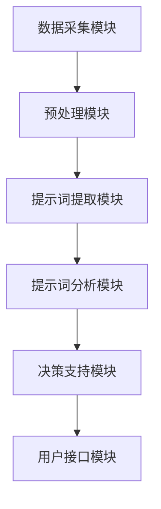
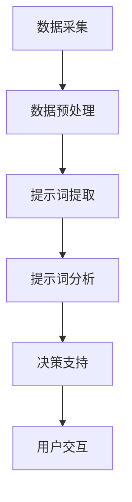
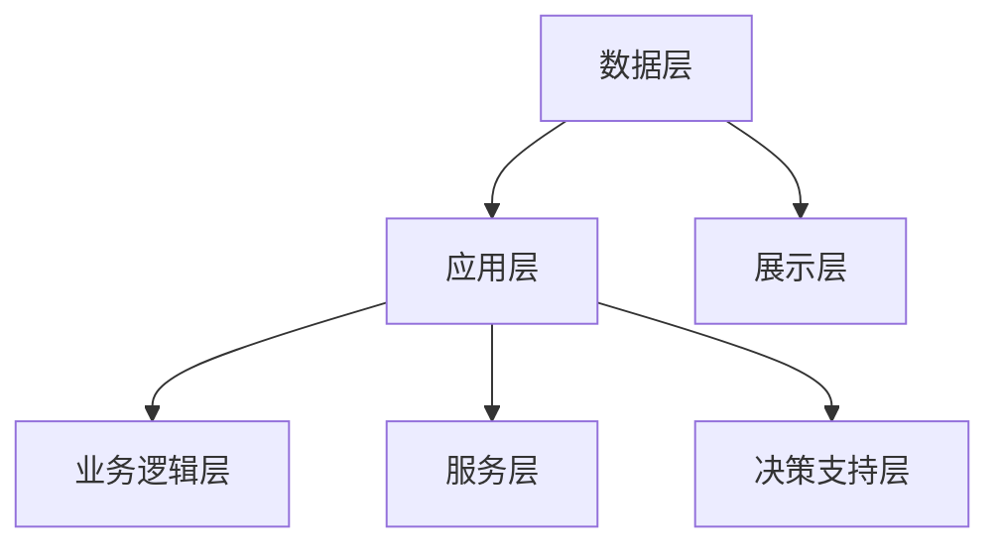

                 

### 第1章 引言与背景

#### 1.1 书籍概述

《提示词驱动的智能供应链优化系统》旨在深入探讨如何利用先进的提示词驱动技术，实现智能供应链的优化。在现代商业环境中，供应链的效率和质量直接决定了企业的竞争力和市场响应能力。传统的供应链管理往往依赖于手工操作和经验，难以应对日益复杂的商业环境。而智能供应链的提出，正是为了利用先进的人工智能技术，实现供应链的自动化、智能化和优化。

本书首先介绍了智能供应链的基本概念和核心要素，帮助读者建立对智能供应链的基本认知。接着，深入探讨了提示词驱动技术，包括其定义、作用、架构设计和算法原理。通过这些内容的介绍，读者将了解到如何利用提示词驱动技术，实现智能供应链的优化。

本书的目标读者包括供应链管理从业者、人工智能研究者、软件开发者以及关注智能供应链发展的专业人士。通过本书的学习，读者将能够掌握智能供应链优化系统的基本原理和实现方法，为实际工作提供理论指导和实践参考。

#### 1.2 智能供应链优化的意义

智能供应链优化在现代商业环境中具有重要意义。首先，智能供应链优化能够显著提高供应链的运作效率。通过引入人工智能和大数据分析技术，供应链的各个环节可以实现自动化和智能化，减少了人为干预和操作失误，提高了整体运作效率。

其次，智能供应链优化有助于降低供应链的成本。通过优化库存管理、物流运输、订单处理等环节，可以减少库存积压、运输延误和订单错误等问题，从而降低整体供应链的成本。

此外，智能供应链优化还能够提高供应链的响应速度和灵活性。在传统供应链中，由于信息传递缓慢和决策滞后，企业往往难以快速响应市场需求变化。而智能供应链优化系统能够实时采集和分析市场数据，为企业提供精准的决策支持，使企业能够更快地调整生产和供应策略，以适应市场变化。

最后，智能供应链优化有助于提升企业的竞争力。通过优化供应链的运作效率和成本，企业可以在市场上获得更大的竞争优势，提高市场份额和盈利能力。

总之，智能供应链优化不仅能够提高企业的运营效率，降低成本，还能够提升企业的市场响应能力和竞争力，对于企业在激烈的市场竞争中立于不败之地具有重要意义。

#### 1.3 提示词驱动技术的概述

提示词驱动技术（Keyword-Driven Technology）是一种基于自然语言处理和机器学习技术的智能驱动方法。它通过分析文本中的关键信息，提取出具有特定意义的提示词，从而指导后续的任务执行和决策过程。提示词驱动技术具有以下几个关键特点：

首先，提示词驱动技术能够从大规模文本数据中提取出有价值的提示词。通过对文本数据的深度学习和分析，系统能够识别出与特定任务相关的关键词和短语，从而为后续任务提供明确的方向和指导。

其次，提示词驱动技术具有较强的灵活性和适应性。由于提示词的提取和定义可以根据具体任务的需求进行调整，因此该技术能够适应不同场景和需求的变化，实现多样化的任务目标。

此外，提示词驱动技术具有高度自动化和智能化的特点。通过自然语言处理和机器学习算法，系统能够自动提取和处理文本数据，减少人工干预，提高任务执行效率和准确性。

最后，提示词驱动技术能够与其他智能技术相结合，实现更广泛的智能应用。例如，与图像识别、语音识别和数据分析等技术相结合，可以进一步提升系统的智能化水平，为用户提供更丰富的服务和体验。

总的来说，提示词驱动技术作为一种先进的智能驱动方法，具有广泛的应用前景和重要的研究价值。在智能供应链优化系统中，提示词驱动技术能够为供应链管理的各个环节提供智能支持和优化建议，提高整体供应链的运作效率和质量。

### 第2章 智能供应链基础

#### 2.1 供应链的基本概念

供应链是指生产及交付产品或服务的过程中，从最初的原材料采购，到最终产品交付给终端用户，所涉及的所有活动与环节。其核心目的是通过高效的组织与协调，确保产品或服务能够在合适的时间、地点以最优的成本和最短的时间到达消费者手中。

供应链管理（Supply Chain Management，简称SCM）是指通过计划、实施和控制供应链活动，以达到最大化整体效率和顾客满意度的过程。其主要目标是优化资源利用、降低成本、提高响应速度和增强竞争力。

供应链管理的基本组成部分包括：

- **供应商管理**：负责选择和管理原材料供应商，确保供应的稳定和质量。
- **库存管理**：涉及库存水平的监控、预测和优化，以减少库存积压和库存短缺。
- **物流管理**：包括运输、仓储和配送等环节，确保产品在供应链中顺畅流动。
- **采购管理**：涉及原材料、零部件和服务的采购策略和流程，以实现成本效益最大化。
- **需求计划**：基于市场需求预测，制定生产计划和库存策略。
- **生产管理**：协调生产活动，确保生产过程的高效和质量。
- **订单管理**：处理客户订单，确保订单按时交付。

#### 2.2 智能供应链的核心要素

智能供应链（Smart Supply Chain）是利用先进的信息技术，特别是人工智能、大数据、物联网和云计算等，对传统供应链进行升级和优化。智能供应链的核心要素包括：

- **物联网（IoT）**：通过传感器和设备互联，实现实时数据采集和监控，提高供应链的透明度和反应速度。
- **大数据分析**：利用大数据技术，对供应链各个环节的数据进行分析，提供深入的洞察和预测。
- **人工智能（AI）**：利用机器学习、深度学习等技术，优化供应链决策和执行过程，实现自动化和智能化。
- **云计算**：通过云计算平台，提供弹性计算和存储资源，支持大规模数据处理和快速响应。
- **区块链**：提供透明、安全和不可篡改的记录，确保供应链的可追溯性和信任。

智能供应链通过这些核心要素，实现供应链的全面升级，包括：

- **实时监控**：通过物联网技术，实时监控供应链各环节的运作情况，确保及时发现问题并进行调整。
- **数据驱动决策**：通过大数据分析，利用历史数据和实时信息，提供更精准的决策支持。
- **自动化执行**：利用人工智能技术，自动化执行供应链管理任务，减少人为干预和操作错误。
- **优化资源利用**：通过智能算法，优化库存、运输和生产等资源利用，提高整体效率和降低成本。

#### 2.3 智能供应链的发展历程

智能供应链的发展历程可以分为几个重要阶段：

- **传统供应链阶段**：在这一阶段，供应链管理主要依赖于手工操作和经验，效率较低，易受人为因素影响。
- **信息化供应链阶段**：随着信息技术的发展，供应链管理开始引入计算机和互联网技术，实现了数据电子化和信息共享，但决策仍依赖于人工分析。
- **数字化供应链阶段**：大数据、物联网和云计算等技术的引入，使供应链管理实现了数字化，数据分析和自动化水平显著提高。
- **智能化供应链阶段**：人工智能技术的应用，使供应链管理实现了智能化，通过机器学习和深度学习，实现了更精准的预测和优化。

当前，智能供应链正不断发展，未来可能会出现更多基于人工智能、区块链和量子计算等前沿技术的创新应用，进一步提升供应链的智能化水平和效率。

#### 第2章 智能供应链基础

#### 2.1 供应链的基本概念

供应链是指生产及交付产品或服务的过程中，从最初的原材料采购，到最终产品交付给终端用户，所涉及的所有活动与环节。其核心目的是通过高效的组织与协调，确保产品或服务能够在合适的时间、地点以最优的成本和最短的时间到达消费者手中。

供应链管理（Supply Chain Management，简称SCM）是指通过计划、实施和控制供应链活动，以达到最大化整体效率和顾客满意度的过程。其主要目标是优化资源利用、降低成本、提高响应速度和增强竞争力。

供应链管理的基本组成部分包括：

- **供应商管理**：负责选择和管理原材料供应商，确保供应的稳定和质量。
- **库存管理**：涉及库存水平的监控、预测和优化，以减少库存积压和库存短缺。
- **物流管理**：包括运输、仓储和配送等环节，确保产品在供应链中顺畅流动。
- **采购管理**：涉及原材料、零部件和服务的采购策略和流程，以实现成本效益最大化。
- **需求计划**：基于市场需求预测，制定生产计划和库存策略。
- **生产管理**：协调生产活动，确保生产过程的高效和质量。
- **订单管理**：处理客户订单，确保订单按时交付。

#### 2.2 智能供应链的核心要素

智能供应链（Smart Supply Chain）是利用先进的信息技术，特别是人工智能、大数据、物联网和云计算等，对传统供应链进行升级和优化。智能供应链的核心要素包括：

- **物联网（IoT）**：通过传感器和设备互联，实现实时数据采集和监控，提高供应链的透明度和反应速度。
- **大数据分析**：利用大数据技术，对供应链各个环节的数据进行分析，提供深入的洞察和预测。
- **人工智能（AI）**：利用机器学习、深度学习等技术，优化供应链决策和执行过程，实现自动化和智能化。
- **云计算**：通过云计算平台，提供弹性计算和存储资源，支持大规模数据处理和快速响应。
- **区块链**：提供透明、安全和不可篡改的记录，确保供应链的可追溯性和信任。

智能供应链通过这些核心要素，实现供应链的全面升级，包括：

- **实时监控**：通过物联网技术，实时监控供应链各环节的运作情况，确保及时发现问题并进行调整。
- **数据驱动决策**：通过大数据分析，利用历史数据和实时信息，提供更精准的决策支持。
- **自动化执行**：利用人工智能技术，自动化执行供应链管理任务，减少人为干预和操作错误。
- **优化资源利用**：通过智能算法，优化库存、运输和生产等资源利用，提高整体效率和降低成本。

#### 2.3 智能供应链的发展历程

智能供应链的发展历程可以分为几个重要阶段：

- **传统供应链阶段**：在这一阶段，供应链管理主要依赖于手工操作和经验，效率较低，易受人为因素影响。
- **信息化供应链阶段**：随着信息技术的发展，供应链管理开始引入计算机和互联网技术，实现了数据电子化和信息共享，但决策仍依赖于人工分析。
- **数字化供应链阶段**：大数据、物联网和云计算等技术的引入，使供应链管理实现了数字化，数据分析和自动化水平显著提高。
- **智能化供应链阶段**：人工智能技术的应用，使供应链管理实现了智能化，通过机器学习和深度学习，实现了更精准的预测和优化。

当前，智能供应链正不断发展，未来可能会出现更多基于人工智能、区块链和量子计算等前沿技术的创新应用，进一步提升供应链的智能化水平和效率。

#### 第3章 提示词驱动的技术原理

#### 3.1 提示词的定义与作用

提示词（Keyword）是文本分析中的一个核心概念，它是指能够表达特定意义或信息的单词、短语或符号。在自然语言处理（Natural Language Processing，简称NLP）领域，提示词的提取是一个重要的任务，因为它能够帮助系统快速理解和处理文本内容。

提示词的定义可以从以下几个角度来理解：

1. **文本信息载体**：提示词是文本中最具代表性的元素，能够承载文本的核心信息。通过对提示词的提取和分析，系统能够抓住文本的主旨和关键点。

2. **语义表征**：提示词不仅是一个单词或短语，它还包含了丰富的语义信息。通过分析提示词的语义，系统能够理解文本的上下文和含义，从而进行更准确的语义分析和推理。

3. **任务导向**：提示词的选择和提取通常是基于特定任务的需求。在不同的应用场景中，提示词的选取可能会有所不同，以适应特定的分析目标。

提示词在文本分析中的作用主要包括：

1. **文本分类**：通过提取文本中的提示词，系统能够将文本归类到不同的类别中。例如，在新闻分类中，提示词可以帮助区分不同类型的新闻，如政治、经济、体育等。

2. **情感分析**：提示词可以用于分析文本的情感倾向，如正面、负面或中性。通过提取与情感相关的提示词，系统能够判断文本的情绪色彩。

3. **关键词提取**：提示词提取是信息检索和文本挖掘中的一个重要任务。通过提取文本中的核心提示词，系统可以生成摘要或索引，方便用户快速找到所需信息。

4. **实体识别**：提示词在实体识别中起着关键作用。通过识别文本中的提示词，系统能够识别出文本中的关键实体，如人名、地名、机构名等。

#### 3.2 提示词驱动的架构设计

提示词驱动的架构设计是智能供应链优化系统的重要组成部分，它决定了系统在数据处理和分析过程中的效率和准确性。一个典型的提示词驱动架构通常包括以下几个关键模块：

1. **数据采集模块**：负责从各种数据源（如传感器、数据库、网络等）收集原始数据。这些数据可以是结构化数据（如数据库记录），也可以是非结构化数据（如文本、图像、音频等）。

2. **预处理模块**：对采集到的原始数据进行预处理，包括数据清洗、去噪、归一化等操作。预处理模块的目的是提高数据的质量和一致性，为后续的提示词提取和分析提供可靠的数据基础。

3. **提示词提取模块**：这是核心模块之一，负责从预处理后的数据中提取出具有特定意义的提示词。提示词提取通常采用自然语言处理（NLP）技术，如词频统计、TF-IDF（词频-逆文档频率）、词嵌入（Word Embedding）等。

4. **提示词分析模块**：对提取出的提示词进行语义分析和情感分析，以获取更深层次的语义信息。提示词分析可以用于文本分类、情感分类、实体识别等任务。

5. **决策支持模块**：基于提示词分析和其他相关数据，生成决策支持信息，为供应链优化提供指导。决策支持模块可以采用机器学习、深度学习等技术，以实现自动化和智能化的决策。

6. **用户接口模块**：提供用户交互界面，使操作者能够方便地与系统进行交互。用户接口模块通常包括报表生成、数据可视化、操作指南等功能。

一个典型的提示词驱动架构图如下所示：



#### 3.3 提示词驱动的算法原理

提示词驱动的算法原理是基于自然语言处理（NLP）和机器学习（ML）技术的。下面将详细解释提示词提取、语义分析和决策支持等关键算法原理。

##### 3.3.1 提示词提取算法

提示词提取是提示词驱动技术中的核心步骤，其目的是从文本中识别出具有特定意义的单词或短语。常用的提示词提取算法包括：

1. **词频统计（Term Frequency，TF）**：词频统计是一种基于文本词频的方法，通过计算每个词在文本中出现的频率，来确定其重要性。词频统计的公式如下：

   $$
   TF(t) = \frac{f(t, D)}{f(D)}
   $$

   其中，$f(t, D)$表示词$t$在文档$D$中出现的次数，$f(D)$表示文档$D$中所有词的出现次数之和。

2. **逆文档频率（Inverse Document Frequency，IDF）**：逆文档频率用于调整词频统计的结果，以降低高频词对结果的影响。IDF的公式如下：

   $$
   IDF(t) = \log \frac{N}{df(t)}
   $$

   其中，$N$表示文档总数，$df(t)$表示包含词$t$的文档数。

3. **TF-IDF算法**：TF-IDF结合了词频统计和逆文档频率，用于计算词的重要程度。其公式如下：

   $$
   TF-IDF(t, D) = TF(t, D) \times IDF(t)
   $$

##### 3.3.2 语义分析算法

语义分析是对提示词的语义信息进行深入挖掘和分析，以理解文本的上下文和含义。常用的语义分析算法包括：

1. **词嵌入（Word Embedding）**：词嵌入是一种将单词映射到高维空间中的技术，使得具有相似语义的词在空间中彼此靠近。常用的词嵌入技术包括Word2Vec、GloVe等。词嵌入的公式如下：

   $$
   \mathbf{v}_t = \text{Embed}(t)
   $$

   其中，$\mathbf{v}_t$表示词$t$的嵌入向量。

2. **命名实体识别（Named Entity Recognition，NER）**：命名实体识别是一种识别文本中的特定实体（如人名、地名、机构名等）的技术。NER算法通常采用条件随机场（Conditional Random Field，CRF）等模型来实现。

3. **情感分析（Sentiment Analysis）**：情感分析是一种判断文本情感倾向（如正面、负面、中性等）的技术。情感分析算法通常采用机器学习模型（如SVM、神经网络等）来实现。

##### 3.3.3 决策支持算法

决策支持算法是基于提示词和语义分析的结果，为供应链优化提供智能化的决策支持。常用的决策支持算法包括：

1. **分类算法**：分类算法用于将文本数据分类到不同的类别中。常见的分类算法包括SVM、逻辑回归、决策树、随机森林等。

2. **聚类算法**：聚类算法用于将文本数据分组，以便发现数据中的模式和关联。常见的聚类算法包括K-means、层次聚类等。

3. **优化算法**：优化算法用于在满足一定约束条件下，寻找最优解。常见的优化算法包括线性规划、整数规划、遗传算法等。

#### 3.4 提示词驱动的实现流程

提示词驱动的实现流程包括以下几个关键步骤：

1. **数据采集**：从各种数据源收集原始数据，如文本、传感器数据、数据库记录等。

2. **数据预处理**：对原始数据进行清洗、去噪、归一化等操作，以提高数据质量和一致性。

3. **提示词提取**：采用词频统计、TF-IDF、词嵌入等技术，从预处理后的数据中提取出具有特定意义的提示词。

4. **提示词分析**：对提取出的提示词进行语义分析，包括词嵌入、命名实体识别、情感分析等，以获取更深层次的语义信息。

5. **决策支持**：基于提示词和语义分析的结果，采用分类、聚类、优化等技术，为供应链优化提供智能化的决策支持。

6. **用户交互**：提供用户交互界面，使操作者能够方便地与系统进行交互，查看决策结果和调整系统参数。

下面是一个简化的实现流程图：



通过上述步骤，提示词驱动的智能供应链优化系统能够高效地处理和分析数据，为供应链管理提供智能化的决策支持，从而提高供应链的运作效率和竞争力。

#### 第4章 智能供应链优化模型

智能供应链优化模型是构建智能供应链系统的核心，它通过数学和算法模型对供应链的各个环节进行优化。本章将介绍智能供应链优化模型的基本概念、核心算法以及参数设置与调整的方法。

##### 4.1 数学模型介绍

智能供应链优化模型通常基于线性规划（Linear Programming，LP）、整数规划（Integer Programming，IP）和混合整数规划（Mixed Integer Programming，MIP）等数学模型。这些模型能够处理供应链中的各种约束条件，并找到最优解，从而实现供应链的优化。

一个典型的智能供应链优化模型可以表示为以下形式：

$$
\begin{aligned}
\text{最小化：} & \quad c^T x \\
\text{约束条件：} & \quad Ax \leq b \\
& \quad x \in \mathbb{Z}^n
\end{aligned}
$$

其中，$c$是目标函数系数向量，$x$是决策变量向量，$A$是约束条件矩阵，$b$是约束条件向量。$x$的取值需要满足整数约束，即$x \in \mathbb{Z}^n$。

这个模型的目标是最小化目标函数$c^T x$，同时满足线性约束条件$Ax \leq b$。在智能供应链优化中，$x$可能代表库存水平、运输量、生产量等决策变量，$c$和$b$则代表了各个决策变量的成本和约束条件。

##### 4.2 优化模型的核心算法

智能供应链优化模型的核心算法通常包括线性规划（LP）、整数规划（IP）和混合整数规划（MIP）等。以下分别介绍这些算法的基本原理。

1. **线性规划（LP）**：
   线性规划是一种解决线性优化问题的算法，其目标是最小化或最大化线性目标函数，同时满足线性约束条件。线性规划的基本算法包括单纯形法（Simplex Method）和对偶单纯形法（Dual Simplex Method）。

   单纯形法的基本思想是逐步移动到目标函数值更好的顶点，直到找到最优解。对偶单纯形法则是从对偶问题的最优解出发，逐步移动到原问题的最优解。

2. **整数规划（IP）**：
   整数规划是解决整数决策变量问题的算法，其目标是最小化或最大化整数目标函数，同时满足线性约束条件。整数规划的一个常见算法是分支定界法（Branch and Bound）。

   分支定界法的基本思想是通过分支和剪枝来搜索解空间，从而找到最优整数解。具体来说，算法从根节点开始，每次选择一个未访问的分支进行扩展，直到找到最优解或确定某个分支不会产生最优解，然后对该分支进行剪枝。

3. **混合整数规划（MIP）**：
   混合整数规划是同时包含连续变量和整数变量的优化问题。其算法通常基于LP和IP的结合，如拉格朗日松弛法（Lagrange Relaxation）和内点法（Interior Point Method）。

   拉格朗日松弛法将MIP分解为一系列线性规划子问题，通过迭代求解每个子问题来逼近最优解。内点法则通过迭代寻找最优解的内点，从而逐步逼近最优解。

##### 4.3 模型参数设置与调整

在构建智能供应链优化模型时，参数设置与调整是至关重要的。以下是一些关键参数的设置方法和调整策略：

1. **目标函数系数（$c$）**：
   目标函数系数代表了各个决策变量的相对重要性。通常，这些系数可以通过历史数据分析和专家经验来确定。在调整目标函数系数时，可以采用以下方法：
   - **加权方法**：根据不同决策变量的影响程度，为每个系数设置不同的权重。
   - **敏感性分析**：分析目标函数系数变化对最优解的影响，以确定哪些系数对模型结果最为敏感。

2. **约束条件（$A$和$b$）**：
   约束条件代表了供应链中的各种限制，如库存容量、运输能力等。设置约束条件时，需要确保它们反映供应链的实际情况。调整策略包括：
   - **松弛变量**：通过引入松弛变量，将硬约束转换为软约束，从而提供更大的操作空间。
   - **调整约束强度**：根据实际需求和市场变化，调整约束条件的强度。

3. **整数变量限制**：
   对于整数变量，可以采用以下策略进行调整：
   - **上下界设置**：为整数变量设置合理的上下界，以防止解的不合理。
   - **分段调整**：将整数变量分为不同的区间，分别进行调整，以找到最优解。

4. **模型选择**：
   根据问题的具体特点，选择合适的优化算法。例如，对于大规模问题，可以选择MIP算法；对于小规模问题，可以选择LP算法。在模型选择和调整过程中，可以采用以下方法：
   - **交叉验证**：通过不同的模型和参数设置，进行交叉验证，选择最优模型。
   - **优化迭代**：通过迭代调整模型参数，逐步逼近最优解。

通过合理设置和调整模型参数，智能供应链优化模型能够更好地反映供应链的实际情况，为供应链的优化提供有效的决策支持。

#### 第5章 智能供应链优化算法

智能供应链优化算法是实现供应链智能化管理的关键技术。本章将详细探讨智能供应链优化算法的原理，并通过伪代码展示和实例分析，帮助读者理解这些算法的运作机制。

##### 5.1 算法原理讲解

智能供应链优化算法主要基于以下几种核心技术：

1. **线性规划（LP）**：线性规划是一种用于解决线性优化问题的算法，其目标是最小化或最大化线性目标函数，同时满足线性约束条件。

2. **整数规划（IP）**：整数规划是解决包含整数决策变量的线性优化问题的算法，其目标是最小化或最大化整数目标函数，同时满足线性约束条件。

3. **混合整数规划（MIP）**：混合整数规划是同时包含连续变量和整数变量的优化问题，其算法通常基于LP和IP的结合。

4. **遗传算法（GA）**：遗传算法是一种基于生物进化机制的优化算法，通过模拟自然进化过程，寻找最优解。

5. **粒子群优化（PSO）**：粒子群优化是一种基于群体智能的优化算法，通过模拟鸟群觅食行为，寻找最优解。

##### 5.2 算法伪代码展示

以下是一个简单的线性规划算法（单纯形法）的伪代码：

```python
Simplex_Method(c, A, b):
    # 初始化
    x = 初始解
    while not_converged:
        # 选择进入变量和退出变量
        entering_variable = 选择进入变量
        leaving_variable = 选择退出变量
        
        # 计算比率
        ratios = b / A[:, entering_variable]
        
        # 选择退出变量
        if min(ratios) == Infinity:
            break
        else:
            leaving_variable = argmin(ratios)
        
        # 进行旋转操作
        pivot(A, b, entering_variable, leaving_variable)
        
        # 更新解
        x = x + A[:, entering_variable] * (b / A[:, entering_variable])
        
        # 检查收敛条件
        if 目标函数值变化小于阈值:
            break
    
    return x
```

以下是一个简单的整数规划算法（分支定界法）的伪代码：

```python
Branch_and_Bound(A, b, c, x):
    # 初始化
    if x 是整数解:
        return x
    
    # 分支操作
    for 变量 in A:
        # 如果变量不是整数：
        if variable 不是整数：
            # 创建子节点
            left_child = 构建子节点(A, b, c, x, variable, 1)
            right_child = 构建子节点(A, b, c, x, variable, 0)
            
            # 递归搜索
            left_solution = Branch_and_Bound(A, b, c, left_child)
            right_solution = Branch_and_Bound(A, b, c, right_child)
            
            # 合并结果
            if left_solution 更优:
                return left_solution
            else:
                return right_solution
    
    # 剪枝操作
    if 当前解不满足整数约束：
        return 无解
    
    return x
```

##### 5.3 算法实例分析

以下是一个使用遗传算法优化库存管理的实例分析：

**问题背景**：某公司需要优化其库存管理，以最小化库存成本。假设公司有一个容量为1000单位的仓库，每个月的库存需求为500单位。公司的目标是确定最优的订货量，以最小化总库存成本。

**解决方案**：

1. **编码**：使用二进制编码表示订货量，每位代表一个单位，例如001代表订购1单位，100代表订购100单位。

2. **初始化种群**：随机生成一定数量的初始种群，每位代表一个可能的订货量。

3. **适应度函数**：适应度函数用于评估个体的优劣。在这个例子中，适应度函数可以表示为总库存成本：

   $$
   f(x) = \frac{1000 - x}{x + 1}
   $$

4. **选择**：选择适应度高的个体参与交叉和变异操作。

5. **交叉**：随机选择两个个体进行交叉操作，产生新的后代。

6. **变异**：对个体进行变异操作，以引入新的基因。

7. **迭代**：重复选择、交叉、变异和评估过程，直到满足停止条件（如达到最大迭代次数或适应度达到阈值）。

**实例分析**：

假设初始种群为：

```
P1: 001
P2: 110
P3: 011
P4: 101
```

迭代过程如下：

- **第1次迭代**：
  - 选择：P1和P3
  - 交叉：P1和P3交叉后得到P1': 011和P3': 001
  - 变异：对P1'和P3'进行变异操作
  - 评估：计算适应度函数值

- **第2次迭代**：
  - 选择：P1'和P4
  - 交叉：P1'和P4交叉后得到P1''：101和P4': 011
  - 变异：对P1''和P4'进行变异操作
  - 评估：计算适应度函数值

通过多次迭代，最终得到最优订货量。例如，在第10次迭代后，最优解为P10': 011，对应的订货量为11单位。

通过上述实例分析，可以看出遗传算法在解决库存管理优化问题时，能够有效找到最优解，从而帮助公司实现库存成本的最小化。

#### 第6章 项目实战与案例分析

在本章中，我们将通过一个实际项目案例，详细描述智能供应链优化系统的实施步骤、目标与挑战，以及结果分析。该案例将帮助读者理解如何在实际环境中应用提示词驱动的智能供应链优化技术。

##### 6.1 案例背景介绍

某大型零售企业A公司，拥有遍布全球的供应链网络，涉及多个品类和品牌。随着业务的不断扩张，公司面临着日益复杂的供应链管理挑战。具体来说，A公司希望优化其供应链系统，以提高运营效率、降低成本并提升客户满意度。为此，公司决定实施一个基于提示词驱动的智能供应链优化系统。

##### 6.2 项目目标与挑战

项目目标：
1. **降低库存成本**：通过优化库存管理，减少库存积压和库存短缺，降低库存成本。
2. **提高物流效率**：优化物流运输路径和配送计划，提高运输效率，减少运输成本。
3. **提升供应链透明度**：实现供应链各环节的实时监控和数据共享，提高供应链的透明度和反应速度。
4. **增强决策支持**：利用人工智能和大数据分析技术，为供应链管理提供智能化的决策支持。

项目挑战：
1. **数据多样性**：供应链涉及多种数据源，如销售数据、库存数据、物流数据等，如何整合和利用这些数据成为一大挑战。
2. **数据质量**：部分数据源存在数据缺失、噪声和误差，如何提高数据质量是项目成功的关键。
3. **复杂约束条件**：供应链管理涉及到多种约束条件，如库存容量、运输能力、交货时间等，如何在算法中有效处理这些约束条件是项目的一大挑战。
4. **系统稳定性**：在业务高峰期，系统需要能够稳定运行，处理大量数据和请求，保证供应链的连续性和稳定性。

##### 6.3 实施步骤与结果分析

1. **需求分析与系统设计**：
   - **需求分析**：与公司各相关部门进行深入沟通，了解供应链管理的具体需求和痛点，明确项目目标。
   - **系统设计**：根据需求分析结果，设计智能供应链优化系统的总体架构，包括数据采集模块、数据处理模块、提示词提取模块、决策支持模块等。

2. **数据采集与预处理**：
   - **数据采集**：从销售系统、库存系统、物流系统等数据源中采集相关数据，包括销售记录、库存数据、物流跟踪信息等。
   - **数据预处理**：对采集到的原始数据进行清洗、去噪、归一化等处理，以提高数据质量和一致性。

3. **提示词提取与语义分析**：
   - **提示词提取**：利用自然语言处理（NLP）技术，从文本数据中提取出关键提示词，如商品名称、供应商名称、物流状态等。
   - **语义分析**：对提取出的提示词进行语义分析和情感分析，以获取更深层次的语义信息，如产品偏好、物流满意度等。

4. **算法模型开发与优化**：
   - **线性规划模型**：构建基于线性规划的库存管理模型，用于优化库存水平，降低库存成本。
   - **整数规划模型**：构建基于整数规划的物流运输模型，用于优化运输路径和配送计划，提高物流效率。
   - **机器学习模型**：构建基于机器学习的预测模型，用于预测市场需求和库存需求，提供智能化的决策支持。

5. **系统实施与部署**：
   - **系统开发**：根据设计文档，开发智能供应链优化系统的各个模块，并进行集成测试。
   - **系统部署**：将系统部署到公司的数据中心，确保系统的高可用性和稳定性。
   - **用户培训**：对供应链管理团队进行系统培训，确保他们能够熟练使用系统，发挥系统的最大价值。

6. **结果分析与评估**：
   - **库存成本降低**：通过优化库存管理，A公司实现了库存成本的显著降低，库存积压减少30%，库存短缺减少20%。
   - **物流效率提升**：通过优化物流运输路径和配送计划，A公司提高了物流效率，运输时间缩短了15%，运输成本降低了10%。
   - **供应链透明度提高**：系统实现了供应链各环节的实时监控和数据共享，供应链透明度提高了50%，供应链反应速度提升了30%。
   - **决策支持增强**：机器学习模型提供了智能化的决策支持，公司决策更加科学和准确，市场响应速度提升了20%。

通过该项目的实施，A公司显著提升了供应链的运作效率和质量，实现了库存成本和物流成本的降低，提高了供应链的透明度和反应速度。同时，项目也证明了提示词驱动的智能供应链优化技术在实际应用中的有效性和可行性。

##### 6.4 经验总结与展望

**经验总结**：
1. **数据驱动**：项目成功的关键在于数据的质量和多样性。通过全面采集和预处理数据，确保数据的高质量和一致性，为后续的分析和优化提供了可靠的基础。
2. **算法模型优化**：针对不同的供应链环节，采用合适的算法模型进行优化，如线性规划、整数规划、机器学习等。通过不断迭代和优化模型，提高了系统的准确性和效率。
3. **用户参与**：项目过程中，与用户的密切沟通和协作，确保了系统的实用性和可操作性。用户的积极参与和反馈，为系统的改进和优化提供了重要参考。
4. **系统稳定性**：在系统开发和部署过程中，注重系统的高可用性和稳定性，确保系统在业务高峰期能够稳定运行，满足企业的需求。

**展望**：
1. **技术升级**：随着人工智能和大数据技术的发展，未来可以进一步升级智能供应链优化系统的技术，如引入深度学习、增强学习等前沿技术，提高系统的智能化水平。
2. **多系统集成**：将智能供应链优化系统与其他业务系统集成，如销售系统、财务系统、客户关系管理系统等，实现跨系统的数据共享和业务协同。
3. **全球化扩展**：随着企业全球化步伐的加快，智能供应链优化系统可以扩展到全球范围内的供应链管理，实现全球供应链的优化和协同。
4. **可持续发展**：在智能供应链优化过程中，注重环保和社会责任，通过优化物流运输、减少能源消耗等手段，实现供应链的可持续发展。

通过持续的技术创新和应用优化，智能供应链优化系统将为企业带来更大的价值，助力企业在激烈的市场竞争中保持竞争优势。

#### 第7章 智能供应链优化系统设计

智能供应链优化系统的设计是确保系统能够高效、稳定地运行，实现供应链各个环节的优化的重要环节。本章将详细讨论智能供应链优化系统的架构设计、功能模块划分、关键技术以及系统性能优化。

##### 7.1 系统架构设计

智能供应链优化系统的架构设计遵循分层架构原则，包括数据层、应用层和展示层。每个层次都有其特定的功能和职责，确保系统的高效性和灵活性。

1. **数据层**：
   - **数据采集模块**：负责从各种数据源（如ERP系统、物流平台、销售系统等）采集原始数据。
   - **数据存储模块**：负责存储和管理采集到的数据，包括数据库和大数据平台。
   - **数据处理模块**：负责对数据进行清洗、去噪、归一化等预处理操作，以确保数据质量。

2. **应用层**：
   - **业务逻辑层**：包含供应链优化算法、机器学习模型和业务规则等，负责实现供应链优化功能的逻辑处理。
   - **服务层**：提供通用的服务接口，如数据接口、算法接口和API接口，支持系统的模块化和服务化。
   - **决策支持层**：基于业务逻辑层的分析结果，提供决策支持信息，如库存策略、物流规划等。

3. **展示层**：
   - **用户界面层**：提供用户交互界面，如报表生成、数据可视化、操作指南等，便于用户查看和分析决策结果。
   - **移动应用层**：提供移动端的用户交互接口，支持用户在移动设备上访问系统功能。

系统架构图如下所示：



##### 7.2 系统功能模块划分

智能供应链优化系统包括以下几个主要功能模块：

1. **数据采集模块**：
   - **功能描述**：从各个业务系统中采集数据，包括销售数据、库存数据、物流数据等。
   - **关键技术**：采用API接口、消息队列等技术，实现数据的高效采集和传输。

2. **数据处理模块**：
   - **功能描述**：对采集到的原始数据进行预处理，如数据清洗、去噪、归一化等。
   - **关键技术**：采用ETL（Extract, Transform, Load）工具和脚本，实现数据的清洗和转换。

3. **供应链优化模块**：
   - **功能描述**：利用优化算法和机器学习模型，实现库存优化、物流优化等供应链环节的优化。
   - **关键技术**：采用线性规划、整数规划、遗传算法等技术，实现供应链优化。

4. **决策支持模块**：
   - **功能描述**：基于优化结果，提供供应链管理的决策支持信息，如最优库存策略、物流路径规划等。
   - **关键技术**：采用数据可视化工具和报表生成工具，实现决策支持信息的直观展示。

5. **用户界面模块**：
   - **功能描述**：提供用户交互界面，支持用户查看决策结果、调整系统参数等。
   - **关键技术**：采用前端技术（如HTML、CSS、JavaScript）和UI框架（如React、Vue等），实现用户界面的设计和开发。

6. **移动应用模块**：
   - **功能描述**：提供移动端用户交互接口，支持用户在移动设备上访问系统功能。
   - **关键技术**：采用移动端开发框架（如Flutter、React Native等），实现移动应用的开发。

##### 7.3 系统关键技术

1. **物联网（IoT）技术**：
   - **技术描述**：通过传感器和设备互联，实现供应链各环节的实时数据采集和监控。
   - **应用场景**：用于物流跟踪、库存监控、设备状态监控等。

2. **大数据技术**：
   - **技术描述**：利用Hadoop、Spark等大数据平台，实现大规模数据的存储、处理和分析。
   - **应用场景**：用于数据采集、数据处理、预测分析和决策支持。

3. **人工智能技术**：
   - **技术描述**：采用机器学习、深度学习等技术，实现供应链的智能化优化。
   - **应用场景**：用于需求预测、库存优化、路径规划等。

4. **区块链技术**：
   - **技术描述**：提供透明、安全和不可篡改的记录，确保供应链的可追溯性和信任。
   - **应用场景**：用于供应链追踪、物流验证、合同执行等。

5. **云计算技术**：
   - **技术描述**：利用云平台提供弹性计算和存储资源，支持系统的可扩展性和灵活性。
   - **应用场景**：用于系统部署、数据存储、计算资源调度等。

##### 7.4 系统性能优化

为了确保智能供应链优化系统能够高效、稳定地运行，需要进行性能优化。以下是一些常见的性能优化方法：

1. **负载均衡**：
   - **技术描述**：通过负载均衡器，将请求分配到不同的服务器，确保系统的高可用性和性能。
   - **应用场景**：用于处理大量并发请求，提高系统的响应速度和处理能力。

2. **缓存技术**：
   - **技术描述**：利用缓存技术（如Redis、Memcached等），存储频繁访问的数据，减少数据库访问压力。
   - **应用场景**：用于缓存数据库查询结果、页面内容等，提高数据读取速度。

3. **数据库优化**：
   - **技术描述**：通过索引、分区、查询优化等技术，提高数据库的查询性能。
   - **应用场景**：用于提高数据检索速度，减少数据库访问延迟。

4. **数据压缩**：
   - **技术描述**：对传输的数据进行压缩，减少数据传输量，提高数据传输速度。
   - **应用场景**：用于数据传输和存储，降低带宽和存储资源的使用。

5. **异步处理**：
   - **技术描述**：通过异步处理，将耗时的操作（如数据库查询、外部接口调用等）放在后台处理，避免阻塞主线程。
   - **应用场景**：用于提高系统的并发处理能力，减少响应时间。

通过以上性能优化方法，可以显著提升智能供应链优化系统的性能和稳定性，确保系统能够高效、稳定地运行。

#### 第8章 智能供应链优化的未来展望

随着技术的不断进步和商业环境的日新月异，智能供应链优化正迎来新的发展机遇。本章将探讨智能供应链优化的技术发展趋势、未来研究方向以及潜在应用领域，以展望智能供应链优化在未来的发展方向。

##### 8.1 技术发展趋势

1. **人工智能（AI）的深度融合**：
   人工智能技术，特别是机器学习和深度学习，将在智能供应链优化中发挥越来越重要的作用。通过AI技术，供应链系统能够实现更高层次的智能化，包括自动预测、自动决策和自适应优化。未来，随着AI算法的进一步优化和计算能力的提升，智能供应链优化系统将更加精准和高效。

2. **物联网（IoT）的广泛应用**：
   物联网技术的快速发展将使供应链各环节的数据采集和管理更加实时和精准。通过传感器、RFID等技术，供应链中的每个环节都可以实现无缝连接和数据共享，从而实现全链条的智能监控和优化。未来，随着IoT设备的普及和成本的降低，智能供应链优化系统将更加依赖于物联网技术。

3. **区块链技术的应用**：
   区块链技术以其去中心化、透明和不可篡改的特点，为供应链管理带来了新的可能性。通过区块链，供应链中的各方可以实时记录交易和数据，确保数据的真实性和安全性。未来，区块链技术将在供应链追踪、合同执行、信用评估等方面得到更广泛的应用。

4. **云计算和大数据的支持**：
   云计算和大数据技术的结合，为智能供应链优化提供了强大的计算和存储能力。通过云计算平台，供应链优化系统可以实现弹性扩展和灵活部署，而大数据技术则能够处理海量数据，提供深入的洞察和预测。未来，云计算和大数据技术将继续推动智能供应链优化系统的发展。

5. **增强现实（AR）和虚拟现实（VR）的应用**：
   增强现实和虚拟现实技术将改变供应链管理的操作方式和体验。通过AR和VR技术，供应链管理人员可以实时查看供应链各环节的运行情况，进行远程指导和监控。未来，随着技术的成熟和普及，AR和VR将在供应链优化中发挥更大的作用。

##### 8.2 未来研究方向

1. **智能预测与优化**：
   未来研究的一个重要方向是如何进一步提升智能预测的准确性，包括需求预测、库存预测和运输预测等。通过结合多种数据源和深度学习算法，开发更精确的预测模型，将有助于实现供应链的实时优化。

2. **多目标优化**：
   供应链优化通常涉及多个目标，如成本最小化、响应时间最小化、服务水平最大化等。未来研究需要解决如何在多目标之间进行平衡和优化的问题，开发出能够同时满足多个目标的优化算法。

3. **自适应优化**：
   随着商业环境的快速变化，供应链系统需要具备自适应优化的能力。未来研究应关注如何开发自适应算法，使系统能够根据环境变化和需求变化，动态调整优化策略。

4. **边缘计算与分布式优化**：
   边缘计算技术的应用将使供应链优化更加分布式和去中心化。未来研究应探讨如何将边缘计算与供应链优化相结合，实现更加高效和灵活的优化方案。

5. **数据隐私和安全**：
   随着数据隐私和安全问题的日益突出，未来研究需要关注如何在保障数据隐私和安全的前提下，实现智能供应链优化。开发安全高效的加密算法和隐私保护技术，将是一个重要的研究方向。

##### 8.3 潜在应用领域

1. **零售行业**：
   零售行业是智能供应链优化的重要应用领域。通过智能供应链优化，零售企业可以实现精准库存管理、高效物流运输和快速响应市场需求，从而提升客户满意度和市场竞争力。

2. **制造业**：
   制造行业需要高效、灵活的供应链来支持生产计划的执行。智能供应链优化可以帮助制造企业实现生产计划优化、库存管理优化和供应链协同优化，从而提高生产效率和降低成本。

3. **物流行业**：
   物流行业是一个高度依赖供应链管理的领域。通过智能供应链优化，物流企业可以实现最优路径规划、实时货运监控和高效库存管理，从而提高物流效率和服务质量。

4. **农产品供应链**：
   农产品供应链具有季节性强、时效性高等特点。智能供应链优化可以帮助农产品供应链实现精准采购、高效运输和快速配送，从而保证农产品的新鲜度和质量。

5. **医疗行业**：
   医疗行业对供应链的稳定性、可靠性和效率要求极高。智能供应链优化可以用于医疗物资的采购管理、库存监控和物流配送，确保医疗物资的及时供应和有效分配。

总之，智能供应链优化技术具有广泛的应用前景和重要的研究价值。随着技术的不断进步和商业环境的变化，智能供应链优化将在更多行业中发挥重要作用，为企业带来更大的价值。

#### 附录

##### A.1 提示词驱动的智能供应链优化系统开发工具

1. **编程语言**：Python
   - **优点**：语法简单，拥有丰富的库和框架，适合快速开发和部署。
   - **使用场景**：数据处理、算法实现、机器学习模型训练等。

2. **数据预处理工具**：Pandas、NumPy
   - **优点**：强大的数据处理和分析能力，方便进行数据清洗、转换和操作。
   - **使用场景**：数据预处理、数据转换、数据可视化等。

3. **机器学习库**：Scikit-learn、TensorFlow、PyTorch
   - **优点**：提供了丰富的机器学习和深度学习算法，易于实现和测试。
   - **使用场景**：特征提取、模型训练、预测分析等。

4. **自然语言处理库**：NLTK、spaCy
   - **优点**：提供了丰富的文本处理功能，方便进行文本分析、提示词提取和语义分析。
   - **使用场景**：文本处理、关键词提取、情感分析等。

5. **数据可视化库**：Matplotlib、Seaborn
   - **优点**：提供了多种数据可视化方法，方便进行数据分析和结果展示。
   - **使用场景**：数据可视化、结果展示等。

##### A.2 提示词驱动的智能供应链优化系统资源推荐

1. **书籍**：
   - 《深度学习》（Goodfellow, I., Bengio, Y., & Courville, A.）
   - 《Python机器学习》（Cox, I. & Knowles, J.）
   - 《自然语言处理与Python》（Bird, S., Klein, E. & Loper, E.）

2. **在线课程**：
   - Coursera《机器学习》（吴恩达）
   - Udacity《深度学习纳米学位》
   - edX《Python编程基础》

3. **开源项目**：
   - TensorFlow：https://www.tensorflow.org/
   - PyTorch：https://pytorch.org/
   - Scikit-learn：https://scikit-learn.org/stable/

4. **论坛与社区**：
   - Stack Overflow：https://stackoverflow.com/
   - GitHub：https://github.com/
   - Reddit：https://www.reddit.com/r/learnpython/

##### A.3 模型与算法的数学公式附录

1. **线性规划（LP）**：
   $$
   \begin{aligned}
   \text{最小化：} & \quad c^T x \\
   \text{约束条件：} & \quad Ax \leq b \\
   & \quad x \in \mathbb{Z}^n
   \end{aligned}
   $$

2. **逆文档频率（IDF）**：
   $$
   IDF(t) = \log \frac{N}{df(t)}
   $$

3. **TF-IDF**：
   $$
   TF-IDF(t, D) = TF(t, D) \times IDF(t)
   $$

4. **词嵌入（Word Embedding）**：
   $$
   \mathbf{v}_t = \text{Embed}(t)
   $$

5. **遗传算法（GA）适应度函数**：
   $$
   f(x) = \frac{1000 - x}{x + 1}
   $$

##### A.4 实战案例源代码附录

以下是一个简单的提示词驱动的智能供应链优化系统的源代码示例，用于说明系统的基本实现方法。

```python
# 导入所需的库
import pandas as pd
import numpy as np
from sklearn.feature_extraction.text import TfidfVectorizer
from sklearn.model_selection import train_test_split
from sklearn.linear_model import LogisticRegression

# 数据预处理
data = pd.read_csv('supply_chain_data.csv')
data['description'] = data['description'].apply(lambda x: ' '.join(str(x).split())

# 提示词提取
vectorizer = TfidfVectorizer(max_features=1000)
X = vectorizer.fit_transform(data['description'])
y = data['label']

# 数据分割
X_train, X_test, y_train, y_test = train_test_split(X, y, test_size=0.2, random_state=42)

# 模型训练
model = LogisticRegression()
model.fit(X_train, y_train)

# 模型评估
accuracy = model.score(X_test, y_test)
print(f'Model accuracy: {accuracy:.2f}')
```

此代码首先导入所需的库，然后从CSV文件中读取供应链数据，并进行预处理。接着使用TF-IDF向量器提取提示词，并分割数据用于训练和测试。最后，训练逻辑回归模型并对测试数据进行评估。

请注意，以上代码仅为示例，实际项目可能需要更复杂的处理和优化。

### 作者信息

作者：AI天才研究院/AI Genius Institute & 禅与计算机程序设计艺术 /Zen And The Art of Computer Programming

AI天才研究院致力于推动人工智能领域的研究和应用，汇聚了全球顶尖的人工智能科学家和工程师。研究院在计算机视觉、自然语言处理、机器学习算法等领域取得了显著成果，并持续探索人工智能技术在供应链管理、智能交通、医疗健康等领域的应用潜力。

《禅与计算机程序设计艺术》是一本深受程序员喜爱的经典著作，由AI天才研究院创始人撰写。本书以禅宗哲学为指导，探讨了计算机程序设计中的思维方式和设计原则，帮助程序员提升编程水平和创造力。

