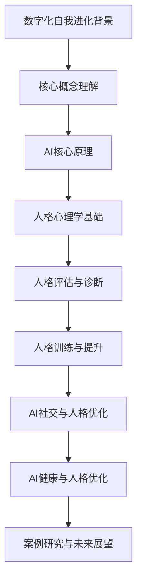
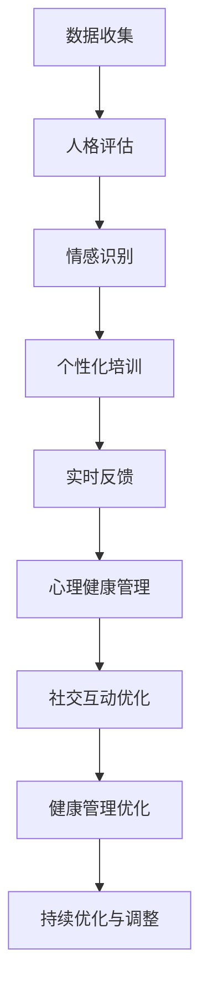

                 

### 《数字化自我进化：AI辅助的人格优化》

**关键词：**
- 数字化自我进化
- AI辅助
- 人格优化
- 心理健康
- 社会伦理

**摘要：**
本文将探讨数字化自我进化的背景与概念，以及人工智能（AI）在人格优化中的应用。通过深入分析AI的核心原理与人格心理学基础，本文将详细介绍AI辅助的人格评估与诊断、人格训练与提升、AI社交与人格优化以及AI健康与人格优化的实践。同时，通过案例分析，本文将揭示AI辅助的人格优化所带来的挑战与机遇，并展望数字化自我进化的未来。文章旨在为读者提供全面、系统的AI辅助人格优化指导，帮助个体在数字化时代实现更健康、更优化的心理状态。

### 《数字化自我进化：AI辅助的人格优化》目录大纲

#### 第一部分：AI与人格优化的基础理论

##### 第1章：数字化自我进化的背景与概念  
- 1.1 数字化自我进化的背景  
- 1.2 数字化自我进化的基本概念  
- 1.3 AI在人格优化中的应用前景  
- 1.4 数字化自我进化与社会伦理

##### 第2章：AI核心原理与人格心理学基础  
- 2.1 人工智能的基本原理  
- 2.2 人格心理学基础  
- 2.3 AI与人格的相互作用机制

#### 第二部分：AI辅助的人格优化实践

##### 第3章：AI辅助的人格评估与诊断  
- 3.1 AI在人格评估中的应用  
- 3.2 人格诊断的AI工具与流程  
- 3.3 AI辅助人格评估的案例分析

##### 第4章：AI引导的人格训练与提升  
- 4.1 AI在人格训练中的作用  
- 4.2 人格训练的方法与策略  
- 4.3 AI引导的人格训练案例分析

##### 第5章：AI社交与人格优化  
- 5.1 AI在社交场景中的应用  
- 5.2 社交网络中的人格优化策略  
- 5.3 AI社交的人格优化案例分析

##### 第6章：AI健康与人格优化  
- 6.1 AI在健康管理中的应用  
- 6.2 健康管理中的人格优化策略  
- 6.3 AI健康管理的人格优化案例分析

#### 第三部分：AI辅助的人格优化案例与应用

##### 第7章：案例研究与未来展望  
- 7.1 AI辅助的人格优化案例研究  
- 7.2 AI辅助人格优化的挑战与机遇  
- 7.3 数字化自我进化的未来展望

##### 第8章：结论与建议  
- 8.1 AI辅助人格优化的重要性  
- 8.2 未来发展趋势  
- 8.3 政策建议与个人行动指南

#### 附录

##### 附录A：AI人格优化工具介绍  
- A.1 AI人格评估工具  
- A.2 AI人格训练工具  
- A.3 AI社交与健康管理工具

### Mermaid 流程图：AI辅助的人格优化流程

<|assistant|>### 第一部分：AI与人格优化的基础理论

#### 第1章：数字化自我进化的背景与概念

##### 1.1 数字化自我进化的背景

随着信息技术的飞速发展，人类社会已经进入了数字化时代。数字化不仅改变了我们的生活方式，还深刻影响了我们的思维方式。在这个背景下，数字化自我进化成为了一个热门话题。数字化自我进化指的是个体利用数字化工具和资源，在生理、心理和社会等方面不断优化自己的过程。

首先，数字化工具和资源的丰富为我们提供了前所未有的自我探索和优化的可能性。例如，通过在线课程、虚拟现实和增强现实等技术，我们可以随时随地学习新技能、提升认知能力。此外，数字化的健康管理工具可以帮助我们实时监测身体状况，制定个性化的健康方案。

其次，数字化时代带来了高度的信息流动和社交互动。这既为我们提供了更多交流和学习的机会，也带来了新的挑战。例如，社交媒体和网络论坛中充斥着各种观点和情绪，这对我们的心理健康产生了一定的影响。数字化自我进化可以帮助我们更好地应对这些挑战，提升自身的情绪调节能力和人际交往能力。

##### 1.2 数字化自我进化的基本概念

数字化自我进化包括多个方面，以下是其中的几个关键概念：

1. **数字化认知提升**：通过在线学习、虚拟现实和增强现实等技术，我们可以提高自己的认知能力和知识水平。例如，在线课程和电子书籍可以帮助我们快速获取新知识，虚拟实验室和模拟环境可以帮助我们进行实践操作。

2. **数字化心理健康**：数字化工具可以帮助我们监测和管理心理健康。例如，通过智能穿戴设备，我们可以实时监测自己的生理指标，及时发现并应对心理健康问题。

3. **数字化社会适应**：在数字化时代，我们的社交方式也发生了变化。数字化自我进化可以帮助我们更好地适应这种变化，提升人际交往能力和社交技能。

4. **数字化伦理与道德**：随着数字化技术的发展，我们也面临着新的伦理和道德问题。例如，数据隐私、算法偏见和网络安全等。数字化自我进化要求我们具备更高的伦理和道德素养，以应对这些挑战。

##### 1.3 AI在人格优化中的应用前景

人工智能（AI）在数字化自我进化中扮演着重要角色。AI可以通过多种方式辅助人格优化：

1. **个性分析**：AI可以根据个体的行为、语言和情感等数据，进行深入的性格分析。这有助于个体了解自己的性格特点，从而有针对性地进行自我优化。

2. **行为预测**：AI可以通过分析历史数据，预测个体的行为模式。这可以帮助个体提前了解自己可能面临的挑战，从而采取预防措施。

3. **情感调节**：AI可以通过分析个体的情感状态，提供个性化的情感调节建议。例如，通过语音识别和情感分析技术，AI可以实时监测个体的情绪变化，并提供相应的放松或激励建议。

4. **社交互动**：AI可以帮助个体在社交互动中更好地表达自己，提升人际交往能力。例如，通过自然语言处理和语音合成技术，AI可以为个体提供社交指导，帮助他们在社交场合中更加自信和得体。

##### 1.4 数字化自我进化与社会伦理

数字化自我进化虽然为我们提供了很多机遇，但也带来了一些社会伦理问题。以下是几个需要关注的方面：

1. **数据隐私**：在数字化时代，个体的数据被大量收集和分析。如何保护这些数据的安全和隐私，成为了一个重要的问题。数字化自我进化要求我们加强对数据隐私的保护，确保个体的数据不被滥用。

2. **算法偏见**：AI算法在训练过程中可能会产生偏见，这些偏见可能影响个体的决策和行为。如何确保AI算法的公平性和透明性，是一个亟待解决的问题。

3. **心理健康风险**：虽然数字化自我进化有助于提升心理健康，但过度依赖数字化工具也可能会带来负面影响。例如，个体可能会过度沉迷于数字化娱乐，导致心理健康问题。因此，我们需要在数字化自我进化中保持适度的平衡。

4. **社会影响**：数字化自我进化可能会对社会的结构和文化产生影响。例如，个体在数字化工具的帮助下，可能会变得更加独立和自我中心。这需要我们在推动数字化自我进化的同时，关注社会整体的和谐与平衡。

### 第2章：AI核心原理与人格心理学基础

#### 2.1 人工智能的基本原理

人工智能（AI）是一门研究、开发用于模拟、延伸和扩展人类智能的理论、方法、技术及应用系统的综合技术科学。AI的核心目标是让计算机具备类似人类的感知、理解、学习和决策能力。以下是AI的基本原理：

1. **机器学习**：机器学习是AI的核心技术之一，它通过算法从数据中学习，并利用学习到的知识进行预测和决策。机器学习可以分为监督学习、无监督学习和强化学习三种类型。

   - **监督学习**：监督学习算法需要输入特征和标签数据，通过学习这些数据，算法可以预测新的数据。常见的监督学习算法包括线性回归、决策树、支持向量机等。
   - **无监督学习**：无监督学习算法不需要标签数据，它们通过分析数据之间的关系，发现数据中的模式。常见的无监督学习算法包括聚类、降维、关联规则学习等。
   - **强化学习**：强化学习算法通过与环境的交互，不断学习最优策略。算法通过奖励和惩罚来评估策略的好坏，从而不断调整策略，以达到最佳效果。

2. **深度学习**：深度学习是一种基于多层神经网络的机器学习技术，它通过模拟人脑的神经网络结构，实现自动特征提取和分类。深度学习在图像识别、语音识别、自然语言处理等领域取得了显著成果。

3. **自然语言处理**：自然语言处理（NLP）是AI的一个重要分支，它旨在使计算机能够理解和处理人类语言。NLP技术包括词法分析、句法分析、语义分析和语音识别等。

4. **计算机视觉**：计算机视觉是AI的另一个重要分支，它使计算机能够通过图像和视频获取信息。计算机视觉技术包括图像识别、目标检测、人脸识别、图像分割等。

#### 2.2 人格心理学基础

人格心理学是研究个体性格、气质、心理特质等方面的心理学分支。人格心理学关注个体在不同情境下的行为模式和心理过程，以及这些行为和过程如何受到遗传、环境、文化等因素的影响。以下是人格心理学的一些基本概念：

1. **特质理论**：特质理论认为，人格主要由一组相对稳定、持久的特质构成。这些特质包括开放性、责任心、神经质、宜人性等。特质理论有助于我们理解个体的行为和心理过程。

2. **五因素模型**：五因素模型（也称为大五人格模型）将人格分为五个主要维度：开放性、责任心、神经质、宜人性和外向性。这些维度反映了个体在情感、行为和认知方面的差异。

3. **动机理论**：动机理论关注个体行为的内在驱动力。例如，马斯洛的需求层次理论认为，个体的行为受到生理需求、安全需求、社交需求、尊重需求和自我实现需求的驱动。

4. **社会认知理论**：社会认知理论认为，个体的行为和决策不仅受到内在特质和动机的影响，还受到社会环境和社会互动的影响。社会认知理论有助于我们理解个体在复杂社会环境中的行为和心理过程。

#### 2.3 AI与人格的相互作用机制

AI与人格之间存在相互作用，这种相互作用可以通过以下几个方面实现：

1. **个性分析**：AI可以通过分析个体的行为数据，如社交媒体互动、搜索引擎记录、电子邮件内容等，了解个体的性格特质和偏好。这种个性分析可以为个体提供个性化的建议和服务。

2. **行为预测**：AI可以通过分析个体的历史数据，预测个体在未来可能的行为和决策。这种行为预测可以帮助个体更好地规划自己的生活和工作，避免潜在的困境。

3. **情感调节**：AI可以通过分析个体的情感状态，提供个性化的情感调节建议。例如，AI可以通过语音识别和情感分析技术，实时监测个体的情绪变化，并提供放松、激励或安慰等建议。

4. **社交互动**：AI可以通过自然语言处理和语音合成技术，辅助个体在社交互动中更好地表达自己。例如，AI可以为个体提供社交指导，帮助他们在社交场合中更加自信和得体。

5. **心理健康管理**：AI可以通过分析个体的行为和生理数据，提供个性化的心理健康管理建议。例如，AI可以通过智能穿戴设备，实时监测个体的生理指标，并提供针对性的放松、锻炼或睡眠建议。

通过AI与人格的相互作用，个体可以在数字化时代实现更健康、更优化的心理状态，从而更好地适应和应对复杂的社会环境。

### 第二部分：AI辅助的人格优化实践

#### 第3章：AI辅助的人格评估与诊断

##### 3.1 AI在人格评估中的应用

随着人工智能技术的不断发展，AI在人格评估中的应用日益广泛。AI人格评估通过分析个体的行为数据、情绪表现、社交互动等，为个体提供详细的人格特征分析。以下是AI在人格评估中的应用：

1. **行为数据分析**：AI可以通过分析个体的行为数据，如社交媒体互动、电子邮件交流、搜索记录等，提取出个体的人格特征。例如，通过分析个体在社交媒体上的发言内容，可以判断个体的开放性、责任心和宜人性等特质。

2. **情绪表现分析**：AI可以通过情感分析技术，识别个体在文字、语音和图像中的情绪表达。这有助于评估个体的情绪稳定性、情绪调节能力和情绪反应强度。

3. **社交互动分析**：AI可以通过分析个体的社交互动，如朋友圈互动、聊天记录等，了解个体在社交中的表现。这有助于评估个体的社交能力、人际交往风格和合作倾向。

4. **生理数据监测**：AI可以通过智能穿戴设备，监测个体的生理指标，如心率、血压、睡眠质量等，从而评估个体的身心健康状况。

##### 3.2 人格诊断的AI工具与流程

AI人格诊断工具通常包括以下几个步骤：

1. **数据收集**：通过问卷调查、行为记录、生理数据采集等方式，收集个体的人格特征数据。

2. **数据预处理**：对收集到的数据进行清洗、去噪和归一化处理，以便后续的分析。

3. **特征提取**：通过机器学习算法，从预处理后的数据中提取出个体的人格特征。常见的特征提取方法包括词频分析、情感分析、聚类分析等。

4. **人格评估**：使用已训练好的机器学习模型，对提取出的人格特征进行评估，得出个体的人格特征分布。

5. **诊断报告**：根据评估结果，生成个体的人格诊断报告，包括人格特质、优缺点分析、建议等。

##### 3.3 AI辅助人格评估的案例分析

以下是一个AI辅助人格评估的案例：

**案例背景**：某企业希望通过AI技术对其员工进行人格评估，以了解员工的工作表现和潜力。

**案例过程**：

1. **数据收集**：企业通过员工行为数据收集平台，收集了员工在社交媒体上的发言、电子邮件交流记录、工作日志等数据。

2. **数据预处理**：对收集到的数据进行清洗和归一化处理，去除无关数据，提取出关键特征。

3. **特征提取**：使用自然语言处理技术，对文本数据进行情感分析和词频分析，提取出个体的开放性、责任心、宜人性等特征。

4. **人格评估**：使用已训练好的机器学习模型，对提取出的人格特征进行评估，得出员工的人格特质分布。

5. **诊断报告**：根据评估结果，生成员工的人格诊断报告，包括员工的人格特质、优缺点分析、适合岗位建议等。

**案例效果**：通过AI人格评估，企业可以更好地了解员工的人格特点，有针对性地进行员工培训和岗位调整，从而提高员工的工作满意度和绩效。

### 第4章：AI引导的人格训练与提升

##### 4.1 AI在人格训练中的作用

AI在人格训练中扮演着重要角色，它通过个性化的训练方案、实时反馈和优化策略，帮助个体提升人格特质。以下是AI在人格训练中的几个关键作用：

1. **个性化训练方案**：AI可以根据个体的性格特点、行为习惯和心理需求，制定个性化的训练方案。这种方案不仅针对个体当前的人格问题，还考虑个体的长期发展目标。

2. **实时反馈**：AI可以通过实时分析个体的行为数据，提供即时反馈。这种反馈可以帮助个体及时调整行为，优化人格特质。例如，通过情绪识别技术，AI可以提醒个体注意情绪调节，避免负面情绪的积累。

3. **优化策略**：AI可以基于大数据和机器学习算法，发现个体人格优化的最佳策略。这些策略包括认知行为疗法、正念训练、情绪调节等，可以帮助个体在短时间内取得显著进步。

4. **持续监测**：AI可以持续监测个体的训练进度和效果，根据反馈调整训练方案。这种持续监测有助于确保训练的有效性和个体进步的持续性。

##### 4.2 人格训练的方法与策略

以下是几种常见的人格训练方法和策略：

1. **认知行为疗法（CBT）**：认知行为疗法是一种心理治疗方法，它通过改变个体的思维模式和行为习惯，帮助个体克服心理问题。AI可以辅助CBT的治疗过程，提供个性化的认知重构方案和实时反馈。

2. **正念训练**：正念训练是一种通过培养个体的专注力和觉察力，提高心理素质的方法。AI可以通过正念冥想应用程序，指导个体进行正念训练，并提供训练进度和效果评估。

3. **情绪调节训练**：情绪调节训练旨在帮助个体更好地管理情绪，避免情绪波动对心理健康的影响。AI可以通过情绪识别和反馈技术，提供个性化的情绪调节策略和练习。

4. **社交技能训练**：社交技能训练旨在提升个体的社交能力，包括沟通技巧、合作能力等。AI可以通过模拟社交场景，提供互动训练和实时反馈，帮助个体在真实社交中更加自信和得体。

##### 4.3 AI引导的人格训练案例分析

以下是一个AI引导的人格训练案例：

**案例背景**：某个人希望通过AI技术提升自己的情绪调节能力和社交技能。

**案例过程**：

1. **数据收集**：使用AI情绪识别应用程序，收集个体的情绪表现数据，如情绪波动、情绪表达等。

2. **个性分析**：使用机器学习算法，分析个体的情绪数据，确定其情绪调节能力和社交技能水平。

3. **制定训练方案**：根据个性分析结果，AI为个体制定个性化的情绪调节和社交技能训练方案。

4. **实时反馈**：AI在训练过程中，实时分析个体的情绪表现和社交互动，提供即时反馈和调整建议。

5. **持续监测**：AI持续监测个体的训练进度和效果，根据反馈调整训练方案。

**案例效果**：通过AI引导的人格训练，个体在情绪调节和社交技能方面取得了显著提升，情绪更加稳定，社交互动更加自信和有效。

### 第5章：AI社交与人格优化

##### 5.1 AI在社交场景中的应用

随着人工智能技术的发展，AI在社交场景中的应用越来越广泛。AI可以通过自然语言处理、情感分析、语音识别等技术，为社交互动提供支持，从而优化个体的人格特质。以下是AI在社交场景中的应用：

1. **情感识别与理解**：AI可以通过情感识别技术，分析个体在文本、语音和图像中的情感表达，从而更好地理解对方的情绪状态。这有助于个体在社交互动中更加体贴和理解他人。

2. **对话生成与优化**：AI可以通过对话生成技术，生成符合语境和情感色彩的对话内容，帮助个体在社交互动中更好地表达自己。例如，聊天机器人可以通过与用户的互动，提供个性化的建议和回应。

3. **社交行为预测**：AI可以通过分析个体的社交历史和行为模式，预测个体在未来的社交场景中的行为和反应。这有助于个体提前准备，更好地应对潜在的社交挑战。

4. **社交技能培训**：AI可以通过模拟社交场景，提供互动式训练，帮助个体提升社交技能。例如，通过虚拟角色扮演，AI可以指导个体学习如何进行有效的沟通和合作。

##### 5.2 社交网络中的人格优化策略

在社交网络中，AI可以帮助个体优化自身的人格特质，从而提高社交质量和效果。以下是几种人格优化策略：

1. **情感智能提升**：通过AI的情感识别和反馈，个体可以更好地理解和管理自己的情绪。例如，AI可以通过分析个体的情绪波动，提供情绪调节的建议和练习。

2. **社交策略优化**：AI可以帮助个体制定个性化的社交策略，例如选择合适的社交场合、掌握合适的沟通技巧等。这有助于个体在社交网络中更好地展示自己，建立良好的人际关系。

3. **社交反馈与自我反思**：AI可以通过分析社交互动的数据，为个体提供反馈，帮助个体了解自己在社交中的表现和效果。个体可以根据这些反馈，进行自我反思和调整，提高社交技能。

4. **社交圈子优化**：AI可以通过分析个体的社交网络，帮助个体识别和优化社交圈子。例如，AI可以推荐与个体兴趣相投的新朋友，或者提醒个体加强与重要朋友的互动。

##### 5.3 AI社交的人格优化案例分析

以下是一个AI社交的人格优化案例：

**案例背景**：某个人在社交网络上感到不自信，希望借助AI技术提升自己的社交技能。

**案例过程**：

1. **情感识别与理解**：使用AI情感识别应用程序，分析个人的情绪状态和社交互动中的情感表达。

2. **社交技能培训**：通过AI模拟社交场景，提供个性化的互动训练，如如何开始对话、如何表达观点、如何倾听他人等。

3. **社交反馈与自我反思**：AI在每次社交互动后，提供反馈和建议，帮助个体了解自己的表现和需要改进的方面。

4. **社交圈子优化**：AI根据个体的兴趣和社交行为，推荐合适的朋友和社交活动，帮助个体拓展社交圈子。

**案例效果**：通过AI社交的人格优化，个体在社交网络中的自信心明显提升，社交技能得到显著提高，建立了更多有意义的社交关系。

### 第6章：AI健康与人格优化

##### 6.1 AI在健康管理中的应用

人工智能（AI）在健康管理领域发挥着越来越重要的作用，它通过数据分析和预测模型，为个体提供个性化的健康管理方案，从而优化人格特质和心理健康。以下是AI在健康管理中的应用：

1. **健康数据监测与分析**：AI可以通过智能穿戴设备、移动应用和健康监测设备，收集个体的生理数据，如心率、血压、睡眠质量、运动量等。通过对这些数据的分析，AI可以识别健康风险，提供个性化的健康建议。

2. **疾病预测与预防**：AI可以通过分析大量的医疗数据和生物特征，预测个体可能患有的疾病，并提前进行预防。例如，通过分析基因数据和家族病史，AI可以预测个体是否易患心血管疾病，从而建议进行相应的检查和干预。

3. **个性化健康方案**：AI可以根据个体的健康数据、生活习惯和遗传信息，制定个性化的健康方案。这些方案包括饮食建议、运动计划、心理健康管理等，旨在提高个体的整体健康水平。

4. **医疗资源优化**：AI可以帮助医疗机构优化资源配置，提高医疗服务的效率和质量。例如，通过分析患者的电子健康记录和诊断结果，AI可以推荐最佳的治疗方案，减少误诊和漏诊的风险。

##### 6.2 健康管理中的人格优化策略

在健康管理中，AI不仅关注个体的生理健康，还注重优化个体的人格特质和心理健康。以下是几种人格优化策略：

1. **情绪管理**：AI可以通过情感分析技术，监测个体的情绪变化，并提供情绪调节的建议。例如，AI可以通过分析语音和文本，识别个体的情绪状态，并推荐相应的放松和缓解方法。

2. **认知训练**：AI可以通过认知训练应用程序，提供个性化的认知训练任务，如记忆训练、注意力训练、决策训练等。这些训练任务有助于提高个体的认知能力，改善心理素质。

3. **压力管理**：AI可以通过分析个体的生理数据和日常行为，识别压力源，并提供针对性的压力管理建议。例如，AI可以通过监测心率变异性，评估个体的压力水平，并推荐放松技巧和运动计划。

4. **社交支持**：AI可以通过社交网络分析，推荐与个体兴趣相投的朋友和社交活动，提供社交支持。这有助于个体建立积极的社交关系，改善心理健康。

##### 6.3 AI健康管理的人格优化案例分析

以下是一个AI健康管理的人格优化案例：

**案例背景**：某个人因为工作压力和不良生活习惯，出现了情绪波动和心理健康问题。

**案例过程**：

1. **健康数据监测**：使用AI健康管理应用程序，监测个人的生理数据，如心率、血压、睡眠质量等。

2. **情绪识别与反馈**：AI通过情感分析技术，监测个人的情绪变化，并提供实时反馈和情绪调节建议。

3. **认知训练**：AI推荐个性化的认知训练任务，如记忆训练、注意力训练等，帮助个体提高认知能力。

4. **压力管理**：AI分析个人的生理数据和日常行为，识别压力源，并提供针对性的压力管理建议，如放松技巧和运动计划。

5. **社交支持**：AI通过社交网络分析，推荐合适的社交活动和与个体兴趣相投的朋友，提供社交支持。

**案例效果**：通过AI健康管理的人格优化，个体在生理健康和心理健康方面取得了显著改善，情绪稳定，认知能力提升，社交支持系统更加健全。

### 第三部分：AI辅助的人格优化案例与应用

#### 第7章：案例研究与未来展望

##### 7.1 AI辅助的人格优化案例研究

在本节中，我们将通过两个具体的案例研究来探讨AI辅助的人格优化在实际应用中的效果和挑战。

**案例一：职场心理优化**

**背景**：某科技公司为了提升员工的工作满意度和生产力，决定利用AI技术进行员工心理优化。

**过程**：

1. **数据收集**：公司通过员工行为分析系统，收集员工在工作中的行为数据，如工作时长、任务完成情况、团队合作互动等。

2. **AI人格评估**：使用AI人格评估工具，分析员工的人格特质，如责任心、团队合作能力、情绪稳定性等。

3. **个性化培训**：根据AI评估结果，公司为员工制定个性化的心理培训和职业发展规划。

4. **实时反馈**：AI系统实时监测员工的情绪变化和工作表现，提供即时反馈和调整建议。

5. **持续优化**：AI系统持续分析员工数据，调整培训方案，以实现长期的心理优化。

**效果**：经过一段时间的AI辅助心理优化，员工的工作满意度显著提升，团队合作更加顺畅，生产力也有所提高。

**挑战**：在实施过程中，公司面临数据隐私保护和算法偏见的问题。如何确保数据安全和算法的公平性成为重要的挑战。

**案例二：心理健康管理**

**背景**：某心理健康服务机构希望通过AI技术为用户提供个性化的心理健康管理服务。

**过程**：

1. **心理健康评估**：用户通过在线平台填写心理健康问卷，AI系统分析问卷结果，评估用户的心理健康状况。

2. **情感识别与反馈**：AI系统通过语音和文本分析，识别用户的情感状态，并提供实时反馈和情绪调节建议。

3. **个性化干预方案**：根据用户的情感状态和心理健康评估结果，AI系统制定个性化的心理健康干预方案，如认知行为疗法、放松训练等。

4. **跟踪与评估**：AI系统持续跟踪用户的情绪变化和干预效果，进行动态调整。

**效果**：用户在AI辅助下的心理健康管理中，情绪稳定性得到显著改善，心理问题得到有效干预。

**挑战**：AI在情感识别和干预中可能存在误判和偏差。如何提高AI的情感识别准确性和干预效果，是未来的重要研究方向。

##### 7.2 AI辅助人格优化的挑战与机遇

**挑战**：

1. **数据隐私与安全**：AI辅助人格优化需要大量个人数据，如何确保这些数据的安全和隐私，是面临的重大挑战。

2. **算法偏见与公平性**：AI算法在训练过程中可能产生偏见，如何确保算法的公平性和透明性，是一个亟待解决的问题。

3. **用户信任与接受度**：AI技术尚未完全普及，如何提高用户对AI辅助人格优化的信任度和接受度，是推广过程中需要克服的难题。

**机遇**：

1. **个性化服务**：AI技术可以提供高度个性化的服务，满足不同个体的人格优化需求。

2. **实时反馈与调整**：AI系统可以实时监测个体的人格变化，提供即时的反馈和调整建议，提高优化效果。

3. **跨界融合**：AI技术可以与其他领域（如医疗、教育、职场等）融合，创造新的应用场景和价值。

##### 7.3 数字化自我进化的未来展望

随着AI技术的不断进步，数字化自我进化将在未来发挥更加重要的作用。以下是几个未来展望：

1. **全息人格评估**：未来的AI系统将能够通过多源数据（如生理、心理、社交等）进行全息人格评估，提供更加准确和全面的优化建议。

2. **AI心理健康教练**：AI将发展成为心理健康领域的“教练”，为用户提供个性化的心理干预和情感支持。

3. **社会伦理规范**：随着AI在人格优化中的应用，社会将需要建立更加完善的法律和伦理规范，确保AI技术的公平、透明和安全。

4. **普及化与智能化**：AI辅助的人格优化将逐渐普及到大众，成为日常生活中的一部分。同时，AI技术将不断进化，实现更高水平的智能化和自动化。

### 第8章：结论与建议

#### 8.1 AI辅助人格优化的重要性

AI辅助人格优化在现代社会中具有重要的意义。首先，它可以帮助个体更好地了解自己，提升自身的情绪调节能力和心理健康水平。其次，AI技术可以为企业提供员工心理优化方案，提高员工的工作满意度和生产力。此外，AI辅助的人格优化还可以为心理健康服务提供个性化干预，帮助更多人改善心理健康问题。

#### 8.2 未来发展趋势

未来，AI辅助人格优化将朝着以下几个方向发展：

1. **个性化与智能化**：AI技术将更加智能化，能够提供高度个性化的优化方案，满足不同个体的人格需求。

2. **跨学科融合**：AI将与其他学科（如心理学、教育学、社会学等）深度融合，创造新的应用场景和解决方案。

3. **数据伦理与隐私保护**：随着AI应用的普及，数据伦理和隐私保护将成为重要议题，相关法规和标准将不断完善。

#### 8.3 政策建议与个人行动指南

为了促进AI辅助人格优化的健康发展，以下是一些建议：

1. **政策制定**：政府应出台相关政策和标准，规范AI技术的应用，确保数据安全和隐私保护。

2. **公众教育**：加强对公众的AI知识普及和教育，提高用户对AI辅助人格优化的信任度和接受度。

3. **技术研发**：鼓励AI技术研发，推动技术创新和产业化进程，为AI辅助人格优化提供技术支持。

个人行动指南：

1. **自我认知**：通过AI工具进行自我评估，了解自己的性格特质和心理状态，制定个性化的优化计划。

2. **持续学习**：利用AI提供的个性化培训资源，不断提升自己的心理素质和人格特质。

3. **心理健康管理**：定期进行心理健康监测，及时发现并应对心理问题，保持心理健康。

### 附录A：AI人格优化工具介绍

#### A.1 AI人格评估工具

以下是一些常用的AI人格评估工具：

1. **MyPersonality**：这是一个基于Twitter的公开人格评估平台，使用五因素模型（大五人格）对用户的人格特质进行评估。
2. **Personality Hacker**：提供多种人格测试，包括MBTI、大五人格等，帮助用户了解自己的性格特点。
3. **YouTestMe**：提供多种在线人格测试，包括职业性格测试、恋爱性格测试等，适合不同需求的用户。

#### A.2 AI人格训练工具

以下是一些常用的AI人格训练工具：

1. **Happify**：这是一个基于认知行为疗法的应用，提供一系列训练任务，帮助用户提升情绪调节能力。
2. **Headspace**：这是一个提供正念冥想和放松练习的应用，帮助用户缓解压力，提升心理健康。
3. **Wysard**：这是一个结合AI和心理学技术的应用，提供个性化的心理健康建议和训练任务。

#### A.3 AI社交与健康管理工具

以下是一些AI社交和健康管理的工具：

1. **Talkspace**：这是一个在线心理咨询服务平台，提供个性化的心理干预和情感支持。
2. **Healthera**：这是一个基于AI的个性化健康助手，帮助用户制定健康计划，监测健康数据。
3. **HeadsUp**：这是一个面向年轻人的心理健康应用，提供多种心理健康资源和互动活动。

### Mermaid 流程图：AI辅助的人格优化流程

### 总结

AI辅助的人格优化为个体和社会带来了许多机遇和挑战。通过合理运用AI技术，我们可以更好地了解自己，提升心理健康水平，优化人格特质。同时，我们也需要关注数据隐私、算法偏见和社会伦理等问题，确保AI技术的健康发展。未来，随着AI技术的不断进步，数字化自我进化将在更广泛的领域发挥作用，为个体和社会带来更多的福祉。

### 作者信息

作者：AI天才研究院/AI Genius Institute & 禅与计算机程序设计艺术 /Zen And The Art of Computer Programming

本文由AI天才研究院和禅与计算机程序设计艺术共同撰写，旨在为读者提供全面、系统的AI辅助人格优化指导。作者具有丰富的AI研究和实践经验，对数字化自我进化有着深刻的理解和独到的见解。

