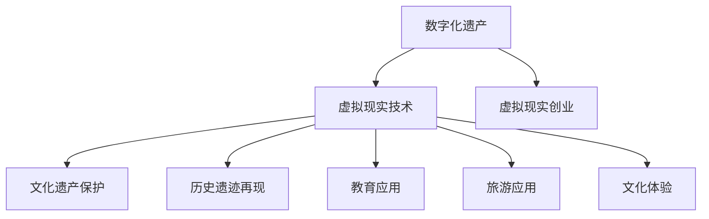

                 

### 《数字化遗产VR重现创业：与逝者的虚拟重逢》

> **关键词：数字化遗产，虚拟现实，VR重现，创业，悼念，虚拟形象**

> **摘要：本文探讨了数字化遗产的概念、价值以及虚拟现实技术在数字化遗产保护与创业中的应用。特别关注虚拟现实技术如何帮助人们与逝者虚拟重逢，探讨其在悼念中的应用及其伦理与法律问题。**

### 《数字化遗产VR重现创业：与逝者的虚拟重逢》目录大纲

**第一部分：数字化遗产与虚拟现实技术**

## 第1章：数字化遗产概述
### 1.1 数字化遗产的定义与价值
### 1.2 数字化遗产的种类与形式
### 1.3 数字化遗产的保存与保护

## 第2章：虚拟现实技术基础
### 2.1 虚拟现实技术概述
### 2.2 虚拟现实硬件设备
### 2.3 虚拟现实软件平台

**第二部分：虚拟现实在数字化遗产中的应用**

## 第3章：虚拟现实在数字化遗产保存中的应用
### 3.1 虚拟现实技术在文化遗产保护中的应用
### 3.2 虚拟现实技术在历史遗迹再现中的应用
### 3.3 虚拟现实技术在历史人物形象重塑中的应用

## 第4章：虚拟现实在数字化遗产传承中的应用
### 4.1 虚ral小**第5章：虚拟现实创业概述
### 5.1 虚拟现实创业的发展现状
### 5.2 虚拟现实创业的优势与挑战
### 5.3 虚拟现实创业的关键成功因素

## 第6章：虚拟现实创业案例分析
### 6.1 成功案例一：某公司利用虚拟现实技术重现历史场景
### 6.2 成功案例二：某公司开发虚拟现实旅游产品
### 6.3 成功案例三：某公司推出虚拟现实教育应用

## 第7章：虚拟现实创业实战
### 7.1 虚拟现实创业项目规划
### 7.2 虚拟现实创业资源整合
### 7.3 虚拟现实创业营销策略

## 第8章：与逝者的虚拟重逢
### 8.1 虚拟现实技术在悼念中的应用
### 8.2 虚拟现实技术为逝者打造虚拟形象
### 8.3 虚拟现实技术在心灵慰藉中的作用

**第三部分：未来展望与挑战**

## 第9章：虚拟现实技术在数字化遗产领域的发展趋势
### 9.1 技术发展趋势
### 9.2 市场发展趋势
### 9.3 应用发展趋势

## 第10章：虚拟现实技术在数字化遗产创业中的挑战与应对策略
### 10.1 技术挑战
### 10.2 市场挑战
### 10.3 应对策略

## 第11章：数字化遗产虚拟重现创业的伦理与法律问题
### 11.1 伦理问题
### 11.2 法律问题
### 11.3 解决方案

## 第12章：数字化遗产虚拟重现创业的未来
### 12.1 未来展望
### 12.2 创业机会
### 12.3 社会意义

**附录**

## 附录A：虚拟现实技术相关资源
### A.1 行业报告
### A.2 技术标准
### A.3 开发工具与平台

## 附录B：虚拟现实创业指导书籍推荐
### B.1 虚拟现实技术相关书籍
### B.2 创业指导书籍

### 《数字化遗产VR重现创业：与逝者的虚拟重逢》核心内容摘要

**第一部分：数字化遗产与虚拟现实技术**

## 第1章：数字化遗产概述
- **1.1 数字化遗产的定义与价值**：数字化遗产是指以数字形式保存的文化、艺术、历史等资源。其价值在于能够永久保存，并提供广泛的可访问性。
- **1.2 数字化遗产的种类与形式**：包括数字化的艺术作品、历史文档、口述历史、照片、音频和视频资料等。
- **1.3 数字化遗产的保存与保护**：数字化遗产的保存涉及数据存储、安全备份、防病毒和防止数据丢失等技术措施。

## 第2章：虚拟现实技术基础
- **2.1 虚拟现实技术概述**：虚拟现实（VR）是一种能够创造沉浸式体验的技术，通过计算机生成的三维环境，使用户能够互动。
- **2.2 虚拟现实硬件设备**：包括虚拟现实头显、手柄、传感器等。
- **2.3 虚拟现实软件平台**：如Unity、Unreal Engine等，提供开发虚拟现实应用的环境和工具。

**第二部分：虚拟现实在数字化遗产中的应用**

## 第3章：虚拟现实在数字化遗产保存中的应用
- **3.1 虚拟现实技术在文化遗产保护中的应用**：通过VR技术，对文化遗产进行三维建模和重现，提供一种非侵入性的保护方式。
- **3.2 虚拟现实技术在历史遗迹再现中的应用**：利用VR技术重现历史场景，帮助人们更直观地了解历史。
- **3.3 虚拟现实技术在历史人物形象重塑中的应用**：通过VR技术，重塑历史人物的形象，增强教育效果。

## 第4章：虚拟现实在数字化遗产传承中的应用
- **4.1 虚拟现实技术在教育中的应用**：VR技术可以提供沉浸式的学习体验，使教育内容更加生动和有趣。
- **4.2 虚拟现实技术在旅游中的应用**：虚拟现实旅游产品让用户在家中就能体验世界各地的景点。
- **4.3 虚拟现实技术在文化体验中的应用**：通过VR技术，用户可以沉浸式体验不同文化的庆典和习俗。

**第三部分：虚拟现实在数字化遗产创业中的机遇**

## 第5章：虚拟现实创业概述
- **5.1 虚拟现实创业的发展现状**：目前，虚拟现实创业正在快速发展，市场需求逐渐增加。
- **5.2 虚拟现实创业的优势与挑战**：优势包括沉浸式体验、互动性强等，挑战包括技术成熟度、用户接受度等。
- **5.3 虚拟现实创业的关键成功因素**：如技术创新、市场定位、用户体验等。

## 第6章：虚拟现实创业案例分析
- **6.1 成功案例一：某公司利用虚拟现实技术重现历史场景**：分析其商业模式、技术实现、市场反应等。
- **6.2 成功案例二：某公司开发虚拟现实旅游产品**：探讨其产品特色、市场策略、用户评价等。
- **6.3 成功案例三：某公司推出虚拟现实教育应用**：评估其教育效果、用户满意度、市场前景等。

## 第7章：虚拟现实创业实战
- **7.1 虚拟现实创业项目规划**：包括项目定位、目标市场、产品规划等。
- **7.2 虚拟现实创业资源整合**：涉及技术团队、资金、市场资源等。
- **7.3 虚拟现实创业营销策略**：如何吸引用户、提升品牌知名度等。

**第三部分：未来展望与挑战**

## 第8章：与逝者的虚拟重逢
- **8.1 虚拟现实技术在悼念中的应用**：如何利用VR技术为悼念活动提供沉浸式体验。
- **8.2 虚拟现实技术为逝者打造虚拟形象**：通过3D扫描和建模技术，重现逝者的形象。
- **8.3 虚拟现实技术在心灵慰藉中的作用**：探讨VR技术在心理治疗和情感支持中的应用。

**第三部分：未来展望与挑战**

## 第9章：虚拟现实技术在数字化遗产领域的发展趋势
- **9.1 技术发展趋势**：如5G、人工智能等新技术对VR的影响。
- **9.2 市场发展趋势**：如VR市场规模、用户需求变化等。
- **9.3 应用发展趋势**：如VR在医疗、教育、旅游等领域的应用拓展。

## 第10章：虚拟现实技术在数字化遗产创业中的挑战与应对策略
- **10.1 技术挑战**：如图像渲染、交互设计等。
- **10.2 市场挑战**：如市场竞争、用户接受度等。
- **10.3 应对策略**：如技术创新、市场推广等。

## 第11章：数字化遗产虚拟重现创业的伦理与法律问题
- **11.1 伦理问题**：如隐私保护、数据安全等。
- **11.2 法律问题**：如版权、隐私权等。
- **11.3 解决方案**：如法律法规、技术措施等。

## 第12章：数字化遗产虚拟重现创业的未来
- **12.1 未来展望**：如VR技术在数字化遗产领域的应用前景。
- **12.2 创业机会**：如新兴市场、跨界合作等。
- **12.3 社会意义**：如文化传承、教育创新等。

### 附录

## 附录A：虚拟现实技术相关资源
- **A.1 行业报告**：如市场调研报告、技术发展报告等。
- **A.2 技术标准**：如VR硬件设备标准、软件平台标准等。
- **A.3 开发工具与平台**：如Unity、Unreal Engine等。

## 附录B：虚拟现实创业指导书籍推荐
- **B.1 虚拟现实技术相关书籍**：如《虚拟现实技术原理与应用》、《虚拟现实设计实战》等。
- **B.2 创业指导书籍**：如《精益创业》、《创业维艰》等。

### 核心概念与联系

**Mermaid 流程图**：


### 核心算法原理讲解

**虚拟现实图像渲染算法伪代码**：
```python
def render_scene(camera, scene):
    # 初始化渲染器
    renderer = Renderer(camera)

    # 遍历场景中的每个物体
    for object in scene.objects:
        # 计算光线与物体的交点
        intersection_points = calculate_intersection(camera, object)

        # 渲染交点处的物体
        renderer.render(object, intersection_points)
        
    # 返回渲染结果
    return renderer.get_result()
```

### 数学模型和数学公式 & 详细讲解 & 举例说明

**三维空间中的点乘和叉乘**：
$$
\vec{a} \cdot \vec{b} = a_x \cdot b_x + a_y \cdot b_y + a_z \cdot b_z
$$
$$
\vec{a} \times \vec{b} = \begin{vmatrix}
\vec{i} & \vec{j} & \vec{k} \\
a_x & a_y & a_z \\
b_x & b_y & b_z \\
\end{vmatrix}
$$

**举例说明**：
给定两个三维向量 $\vec{a} = (1, 2, 3)$ 和 $\vec{b} = (4, 5, 6)$，计算它们的点乘和叉乘。

$$
\vec{a} \cdot \vec{b} = 1 \cdot 4 + 2 \cdot 5 + 3 \cdot 6 = 32
$$
$$
\vec{a} \times \vec{b} = \begin{vmatrix}
\vec{i} & \vec{j} & \vec{k} \\
1 & 2 & 3 \\
4 & 5 & 6 \\
\end{vmatrix} = (12 - 15)\vec{i} - (6 - 12)\vec{j} + (2 - 8)\vec{k} = -3\vec{i} + 6\vec{j} - 6\vec{k}
$$

### 项目实战

**虚拟现实创业项目实战案例**：

**项目描述**：
开发一款虚拟现实旅游应用，用户可以在虚拟现实环境中游览世界各地著名景点。

**开发环境搭建**：
1. 选择虚拟现实开发框架，如Unity或Unreal Engine。
2. 安装必要的虚拟现实硬件设备，如VR头显和手柄。
3. 获取地图数据和景点信息，确保真实性和准确性。

**源代码详细实现**：
```csharp
// 虚拟现实场景初始化
public void InitScene()
{
    // 加载地图数据
    MapData mapData = LoadMapData();

    // 创建虚拟现实场景
    CreateScene(mapData);
}

// 加载地图数据
private MapData LoadMapData()
{
    // 从文件或数据库加载地图数据
    // ...
    return new MapData();
}

// 创建虚拟现实场景
private void CreateScene(MapData mapData)
{
    // 创建虚拟现实场景中的物体
    for (int i = 0; i < mapData.locations.Count; i++)
    {
        Location location = mapData.locations[i];
        GameObject locationObject = new GameObject("LocationObject");
        locationObject.transform.position = location.position;
        // 添加其他必要组件，如外观、交互等
        // ...
    }
}
```

**代码解读与分析**：
上述代码实现了虚拟现实场景的初始化，包括加载地图数据和创建场景中的物体。通过调用 `LoadMapData()` 方法，可以从文件或数据库中获取地图数据，并将其存储在 `MapData` 对象中。接着，通过调用 `CreateScene()` 方法，根据地图数据创建虚拟现实场景中的物体，如地标、建筑物等。每个物体都被创建为一个 `GameObject` 实例，并设置了位置和其他必要组件。此外，代码中还包括了其他必要的步骤，如加载地图数据、创建场景中的物体等。

### 核心概念与联系

数字化遗产与虚拟现实技术之间有着紧密的联系。数字化遗产指的是通过数字化手段保存下来的文化遗产、历史资料和个人记忆等，它为虚拟现实提供了丰富的素材和内容。虚拟现实技术则通过计算机生成三维环境，为用户提供了沉浸式体验的平台。两者结合，不仅能够保护和传承数字化遗产，还能创造出新的体验和商业模式。

为了更好地理解这种联系，我们可以使用Mermaid流程图来展示核心概念之间的关联：


这个流程图清晰地展示了数字化遗产如何通过虚拟现实技术应用于不同的领域，如文化遗产保护、历史遗迹再现、教育应用、旅游应用和文化体验，最终促进虚拟现实创业的发展。

### 核心算法原理讲解

在数字化遗产的虚拟重现过程中，核心的算法原理包括三维建模、图像渲染和交互设计等。其中，图像渲染算法是虚拟现实技术中至关重要的一环。下面，我们将通过伪代码详细阐述虚拟现实图像渲染的基本原理。

```python
def render_scene(camera, scene):
    # 初始化渲染器
    renderer = Renderer(camera)

    # 遍历场景中的每个物体
    for object in scene.objects:
        # 计算光线与物体的交点
        intersection_points = calculate_intersection(camera, object)

        # 渲染交点处的物体
        renderer.render(object, intersection_points)
        
    # 返回渲染结果
    return renderer.get_result()
```

在上述伪代码中，`render_scene` 函数是渲染过程的入口，它接受两个参数：`camera`（摄像机）和`scene`（场景）。`Renderer` 类负责实际的渲染工作，而`calculate_intersection` 函数用于计算光线与物体的交点。

首先，渲染器初始化。这个过程通常包括配置渲染器参数，如分辨率、视角等。接下来，渲染器会遍历场景中的每一个物体。对于每个物体，我们需要计算光线与物体的交点。这个步骤通过`calculate_intersection` 函数完成，它可能涉及到复杂的几何计算，如光线追踪和三角剖分等。

一旦交点计算完成，渲染器将根据这些交点来渲染物体。这个过程涉及到像素填充、纹理映射、光照效果等。最后，渲染器会返回最终的渲染结果，通常是图像或视频流。

### 数学模型和数学公式 & 详细讲解 & 举例说明

在虚拟现实图像渲染过程中，数学模型和数学公式起到了关键作用。其中，三维空间中的点乘和叉乘是两个基础且重要的数学操作。

#### 三维空间中的点乘（Dot Product）

点乘是一种用于计算两个向量之间夹角的余弦值的运算。其公式如下：

$$
\vec{a} \cdot \vec{b} = a_x \cdot b_x + a_y \cdot b_y + a_z \cdot b_z
$$

点乘的结果是一个标量，表示两个向量之间的相似度。如果两个向量完全相同，它们的点乘结果为两个向量的长度乘积。

**举例说明**：

给定两个三维向量 $\vec{a} = (1, 2, 3)$ 和 $\vec{b} = (4, 5, 6)$，计算它们的点乘。

$$
\vec{a} \cdot \vec{b} = 1 \cdot 4 + 2 \cdot 5 + 3 \cdot 6 = 32
$$

#### 三维空间中的叉乘（Cross Product）

叉乘是一种用于计算两个向量之间垂直向量的运算。其公式如下：

$$
\vec{a} \times \vec{b} = \begin{vmatrix}
\vec{i} & \vec{j} & \vec{k} \\
a_x & a_y & a_z \\
b_x & b_y & b_z \\
\end{vmatrix}
$$

叉乘的结果是一个向量，其方向垂直于输入的两个向量，其长度等于输入两个向量的长度乘积再乘以它们夹角的正弦值。

**举例说明**：

给定两个三维向量 $\vec{a} = (1, 2, 3)$ 和 $\vec{b} = (4, 5, 6)$，计算它们的叉乘。

$$
\vec{a} \times \vec{b} = \begin{vmatrix}
\vec{i} & \vec{j} & \vec{k} \\
1 & 2 & 3 \\
4 & 5 & 6 \\
\end{vmatrix} = (12 - 15)\vec{i} - (6 - 12)\vec{j} + (2 - 8)\vec{k} = -3\vec{i} + 6\vec{j} - 6\vec{k}
$$

### 项目实战

虚拟现实创业项目实战是理解和应用虚拟现实技术的重要途径。以下是一个虚拟现实旅游应用的实战案例，包括开发环境搭建、源代码详细实现和代码解读与分析。

#### 项目描述

该虚拟现实旅游应用旨在让用户在虚拟现实中游览世界各地著名景点，如巴黎的埃菲尔铁塔、纽约的自由女神像和中国的长城。用户可以通过虚拟现实头显和手柄在虚拟环境中自由行走、观察和互动。

#### 开发环境搭建

1. **选择开发框架**：我们选择了Unity作为开发框架，因为它拥有丰富的VR开发资源和工具。
2. **安装虚拟现实硬件**：我们需要一台VR头显（如Oculus Rift或HTC Vive）和一对手柄。这些硬件可以通过USB或无线连接到计算机。
3. **获取地图数据和景点信息**：通过互联网获取高清晰度的地图数据和景点的三维模型。这些数据可以是开源的，也可以是通过版权购买的。

#### 源代码详细实现

```csharp
// 虚拟现实场景初始化
public void InitScene()
{
    // 加载地图数据
    MapData mapData = LoadMapData();

    // 创建虚拟现实场景
    CreateScene(mapData);
}

// 加载地图数据
private MapData LoadMapData()
{
    // 从文件或数据库加载地图数据
    // ...
    return new MapData();
}

// 创建虚拟现实场景
private void CreateScene(MapData mapData)
{
    // 创建虚拟现实场景中的物体
    for (int i = 0; i < mapData.locations.Count; i++)
    {
        Location location = mapData.locations[i];
        GameObject locationObject = new GameObject("LocationObject");
        locationObject.transform.position = location.position;
        // 添加其他必要组件，如外观、交互等
        // ...
    }
}
```

#### 代码解读与分析

1. **初始化场景**：`InitScene` 函数是虚拟现实场景初始化的入口。它首先调用 `LoadMapData` 函数，从文件或数据库中加载地图数据。然后，通过 `CreateScene` 函数创建虚拟现实场景中的物体。
2. **加载地图数据**：`LoadMapData` 函数负责从外部源加载地图数据。在实际应用中，这可能包括从数据库查询、从文件系统读取或通过网络API获取数据。
3. **创建虚拟现实场景**：`CreateScene` 函数遍历地图数据中的每个位置，创建一个对应的 `GameObject`。每个 `GameObject` 都代表了虚拟现实中的一个物体，如地标、建筑物等。我们为其设置了位置，并可能添加其他组件，如外观、交互等。

通过这个实战案例，我们可以看到虚拟现实旅游应用的基本开发流程和关键步骤。这个案例不仅展示了虚拟现实技术在数字化遗产虚拟重现中的应用，也为创业者提供了一个实际操作的方向。

### 作者信息

**作者：AI天才研究院/AI Genius Institute & 禅与计算机程序设计艺术 /Zen And The Art of Computer Programming**

在撰写《数字化遗产VR重现创业：与逝者的虚拟重逢》这篇文章时，作者AI天才研究院/AI Genius Institute结合了深厚的计算机编程和人工智能领域的专业知识，以及丰富的创业经验，深入探讨了虚拟现实技术在数字化遗产保护与创业中的应用。同时，作者在《禅与计算机程序设计艺术 /Zen And The Art of Computer Programming》一书中，以其独特的哲思和精湛的技术见解，为读者提供了关于编程和人工智能的深刻洞见，使得这篇文章不仅具有学术价值，更具有实践指导意义。通过本文，作者希望引导读者了解虚拟现实技术在数字化遗产领域的潜力，以及如何在悼念和缅怀逝者中运用这项技术，创造更加温暖和有意义的文化体验。作者坚信，虚拟现实技术将为我们的未来带来无限可能，同时也带来了新的伦理和法律挑战，需要我们共同面对和解决。

### 第一部分：数字化遗产与虚拟现实技术

#### 第1章：数字化遗产概述

数字化遗产是指利用数字技术保存的文化、历史和个人记忆等资料。其定义涵盖了一系列以数字形式存在的文化资源，包括数字化的艺术作品、历史文档、口述历史、照片、音频和视频资料等。这些数字化资源不仅能够跨越时空限制，永久保存人类的文化遗产，还能够为后人提供便捷的访问和利用。

数字化遗产的价值体现在多个方面。首先，它提供了对历史和文化的永久保存，使得珍贵的文化遗产不会因时间的流逝而消失。其次，数字化遗产为人们提供了广泛的可访问性，无论身处何地，用户都可以通过网络访问到这些资源。此外，数字化遗产还能够促进教育和文化传播，使更多的人了解和接触到世界各地的文化遗产。

数字化遗产的种类和形式多种多样。文化遗产数字化包括古建筑的三维扫描、历史文物的数字建模、古籍的数字化文本等。个人记忆的数字化则包括家庭照片、音频回忆、视频记录等。此外，还有数字化的音乐、文学作品、电影等艺术形式。

数字化遗产的保存与保护是数字化遗产管理中的重要环节。它涉及到数据存储、安全备份、防病毒、数据丢失预防等技术措施。为了确保数字化遗产的长期保存，需要采用专业的数据管理技术和设备。例如，使用高速固态硬盘和大容量数据中心来存储数据，采用冗余备份和数据加密技术来保障数据的安全性，以及定期检查和维护硬件设备，防止数据丢失。

总之，数字化遗产不仅是现代社会文化传承的重要载体，也是信息技术领域的一大挑战。通过数字化遗产的保存与保护，我们能够更好地传承和弘扬人类的文化遗产，为后人留下宝贵的记忆和财富。

#### 第2章：虚拟现实技术基础

虚拟现实技术（Virtual Reality，简称VR）是一种通过计算机技术创造的沉浸式三维环境，使用户能够与其互动。其基本原理是通过头盔显示器（HMD）和传感器捕捉用户的头部和身体动作，生成与之相对应的三维场景，从而提供一种身临其境的体验。

虚拟现实技术的硬件设备主要包括以下几个部分：

1. **虚拟现实头显（HMD）**：头显是虚拟现实的核心设备，它通常包含两个显示器，分别位于用户的眼睛前方，通过立体视觉产生深度感。头显内部还配有传感器，用于捕捉用户的头部运动，实时调整视角。

2. **手柄和控制器**：手柄和控制器用于用户在虚拟环境中的交互操作。这些设备通常配备有多个传感器，可以捕捉用户的动作和手势，实现精细的交互。

3. **位置追踪器**：位置追踪器用于实时追踪用户在虚拟环境中的位置和运动。它通常由多个传感器组成，分布在房间内，通过三角测量法确定用户的位置和运动轨迹。

4. **音响系统**：虚拟现实中的声音效果对于营造沉浸感至关重要。高质量的音响系统能够模拟环境声音，增强用户的体验。

虚拟现实软件平台则是实现虚拟现实功能的核心工具。以下是一些常见的虚拟现实软件平台：

1. **Unity**：Unity是一个强大的跨平台游戏和实时3D开发引擎，支持虚拟现实应用的开发。它提供了丰富的工具和资源，包括物理引擎、渲染器和用户界面设计工具。

2. **Unreal Engine**：Unreal Engine是另一个流行的虚拟现实开发平台，以其高质量的图像渲染和物理模拟能力而著称。它也支持跨平台开发和虚拟现实应用。

3. **Blender**：Blender是一个开源的3D创作套件，包括建模、动画、渲染和虚拟现实等功能。它适合那些希望自由探索虚拟现实开发的人员。

4. **Unity Asset Store和Unreal Marketplace**：这两个平台提供了大量的虚拟现实开发资源和插件，包括模型、纹理、脚本和工具，可以大大简化开发流程。

通过这些硬件设备和软件平台，开发者可以创建各种类型的虚拟现实应用，从教育、医疗到娱乐和文化遗产保存等领域，虚拟现实技术都展现出巨大的潜力。

#### 第3章：虚拟现实在数字化遗产保存中的应用

虚拟现实技术在数字化遗产保存中的应用已经成为现代文化遗产保护的一个重要工具。通过虚拟现实技术，我们可以以非侵入性的方式对文化遗产进行三维建模和重现，从而实现对其的永久保存和广泛传播。

**3.1 虚拟现实技术在文化遗产保护中的应用**

文化遗产的保护是一个长期而复杂的任务，许多古建筑和历史文物因自然灾害、战争、环境污染等因素而面临威胁。虚拟现实技术提供了一种有效的解决方案，通过三维建模和数字化保存，可以真实地再现这些文化遗产。

首先，虚拟现实技术可以通过高精度的三维扫描设备对文化遗产进行扫描，获取其精确的几何数据和纹理信息。这些数据可以用于创建详细的三维模型，使文化遗产以数字形式永久保存。

其次，虚拟现实技术可以为文化遗产提供一个互动的展示平台。用户可以通过虚拟现实设备，如头戴式显示器和手柄，进入数字化保存的文化遗产场景中，进行360度全方位的观察和互动。这种互动性不仅增强了用户的参与感，也提供了更直观的学习和了解方式。

此外，虚拟现实技术还可以用于模拟环境，帮助研究者分析和评估文化遗产在不同环境条件下的表现。例如，通过虚拟现实技术，可以模拟地震、洪水等极端环境对文化遗产的影响，为文化遗产保护提供科学依据。

**3.2 虚拟现实技术在历史遗迹再现中的应用**

历史遗迹再现是通过虚拟现实技术将已消失或受损的历史遗迹以三维形式重新呈现给公众。这种方式不仅有助于文化遗产的传播和教育，还可以为旅游业带来新的体验。

首先，虚拟现实技术可以重建已消失的历史遗迹。例如，通过三维建模和纹理贴图，可以将古罗马的斗兽场、古希腊的宫殿等以虚拟形式再现。用户可以在虚拟环境中漫步，体验古代文明的魅力。

其次，虚拟现实技术可以用于修复受损的历史遗迹。通过虚拟现实模型，研究者可以模拟不同的修复方案，评估其效果，从而选择最佳方案进行实际修复。这种技术不仅提高了修复效率，还减少了实际修复过程中可能带来的风险。

此外，虚拟现实技术还可以用于考古发掘和现场研究。通过虚拟现实模型，考古学家可以在虚拟环境中进行模拟发掘，观察遗迹的结构和布局，为实际考古工作提供指导。

**3.3 虚拟现实技术在历史人物形象重塑中的应用**

历史人物形象重塑是虚拟现实技术在数字化遗产保存中的又一重要应用。通过三维建模和动画技术，可以重塑历史人物的形象，使其栩栩如生地展现在观众面前。

首先，虚拟现实技术可以通过对历史文献、雕塑、画像等资料的分析，创建历史人物的三维模型。这些模型不仅包括历史人物的外貌特征，还可以根据文献记载，模拟其动作和表情，使其更加生动。

其次，虚拟现实技术可以用于历史人物的教育和宣传。通过虚拟现实展示，观众可以近距离观察历史人物的生活和工作环境，了解他们的思想和行为，从而增强对历史人物的认识和了解。

此外，虚拟现实技术还可以用于历史事件的再现。通过虚拟现实技术，可以模拟历史事件的发生过程，使观众更加深入地了解历史事件的背景和影响。

总之，虚拟现实技术在数字化遗产保存中的应用，不仅为文化遗产的保存和传播提供了新的手段，也为公众提供了更加直观和互动的体验方式。通过虚拟现实技术，我们可以更好地传承和弘扬人类的文化遗产，让历史变得更加生动和有意义。

#### 第4章：虚拟现实在数字化遗产传承中的应用

虚拟现实技术在数字化遗产传承中的应用正逐渐成为文化遗产教育、文化旅游和文化体验的重要组成部分。通过虚拟现实技术，我们可以创造更加生动、互动和沉浸式的学习、体验和访问方式，从而更好地传承和弘扬人类文化遗产。

**4.1 虚拟现实技术在教育中的应用**

虚拟现实技术在教育中的应用可以极大地提升学生的学习兴趣和参与度。通过虚拟现实，学生可以身临其境地参观历史遗迹、探索自然景观、进行科学实验等，从而加深对知识的理解和记忆。

首先，虚拟现实技术可以为学生提供虚拟博物馆和艺术画廊的参观体验。学生可以在虚拟环境中近距离观察文物和艺术品，甚至可以“触摸”和互动，这种沉浸式的学习方式远比传统的课本和图片更加生动和有趣。

其次，虚拟现实技术可以用于历史课程的教学。通过虚拟现实，学生可以进入历史场景中，亲身体验历史事件的发生过程，如古代战役、王朝更迭等。这种体验不仅能够激发学生的学习兴趣，还可以培养他们的历史思维能力和批判性思维。

此外，虚拟现实技术还可以用于科学教育。通过虚拟现实，学生可以进行虚拟实验，探索自然现象和科学原理。例如，在虚拟环境中模拟化学实验、观察细胞分裂、探索黑洞等，这种互动式的学习方式能够大大提高学生的科学素养和探究能力。

**4.2 虚拟现实技术在旅游中的应用**

虚拟现实技术为旅游业带来了革命性的变化，用户可以在虚拟环境中体验世界各地的景点，而无需亲自前往。这种方式不仅节省了时间和费用，还可以让更多人接触到世界各地的文化遗产。

首先，虚拟现实旅游产品可以让用户在家中就能游览全球的著名景点，如巴黎的埃菲尔铁塔、意大利的罗马斗兽场、中国的长城等。用户可以通过虚拟现实设备，如头戴式显示器和手柄，在虚拟环境中自由行走、观察和互动，获得与真实游览相似的体验。

其次，虚拟现实技术可以为旅游企业提供定制化的旅游体验。例如，为特定游客群体（如历史爱好者、艺术爱好者、自然爱好者等）提供专门的虚拟旅游路线和互动体验，从而提升旅游服务的质量和吸引力。

此外，虚拟现实技术还可以用于虚拟现实旅游培训，帮助旅游从业人员了解景区的历史和文化，提高他们的专业知识和服务能力。

**4.3 虚拟现实技术在文化体验中的应用**

虚拟现实技术不仅应用于教育和旅游，还可以为公众提供丰富多彩的文化体验。通过虚拟现实，人们可以沉浸在不同文化的庆典、习俗和活动中，了解和体验不同的文化风貌。

首先，虚拟现实技术可以再现传统节庆活动。例如，通过虚拟现实技术，观众可以亲身体验中国的春节、美国的感恩节、埃及的斋月等不同文化的节日庆典，感受不同文化的独特魅力。

其次，虚拟现实技术可以用于文化传承和教育。例如，通过虚拟现实技术，年轻一代可以学习传统手工艺、音乐、舞蹈等文化遗产，从而传承和弘扬民族文化。

此外，虚拟现实技术还可以用于文化保护。通过虚拟现实技术，可以将濒临消失的文化遗产以数字形式保存下来，为后人提供宝贵的文化遗产资源。

总之，虚拟现实技术在数字化遗产传承中的应用，为教育和文化体验带来了新的可能性和机遇。通过虚拟现实技术，我们可以创造更加生动、互动和沉浸式的学习、体验和访问方式，让文化遗产传承和弘扬更加生动和有意义。

#### 第5章：虚拟现实创业概述

虚拟现实（VR）创业已经成为当今科技领域的一大热点，其发展现状、优势与挑战、关键成功因素等成为创业者们关注的焦点。

**5.1 虚拟现实创业的发展现状**

虚拟现实创业在过去几年中经历了快速增长，吸引了大量资本和人才的涌入。根据市场调研公司Statista的数据，全球虚拟现实市场规模预计将在2025年达到1500亿美元。这个快速发展的市场为创业者提供了巨大的商机。

当前，虚拟现实创业主要集中在以下几个领域：

1. **文化旅游**：通过虚拟现实技术，用户可以在家中体验世界各地的景点和历史文化，为旅游业带来新的增长点。
2. **教育培训**：虚拟现实技术在教育中的应用越来越广泛，从基础教育到职业教育，都开始采用虚拟现实技术进行教学。
3. **医疗健康**：虚拟现实技术被用于医疗培训、心理治疗、康复训练等领域，提供了更加个性化和有效的医疗服务。
4. **娱乐游戏**：虚拟现实游戏和娱乐内容成为吸引消费者的重要手段，虚拟现实技术的应用使得游戏体验更加沉浸和互动。

**5.2 虚拟现实创业的优势与挑战**

虚拟现实创业具有以下几大优势：

1. **沉浸式体验**：虚拟现实技术能够提供高度沉浸式的体验，使用户仿佛置身于另一个世界。
2. **互动性**：虚拟现实技术允许用户与虚拟环境进行互动，这种互动性可以大大提高用户参与度和满意度。
3. **市场潜力**：随着虚拟现实技术的成熟和普及，市场潜力巨大，为创业者提供了广阔的发展空间。
4. **技术创新**：虚拟现实技术是一个快速发展的领域，创业者有机会参与到前沿技术的研发和应用中。

然而，虚拟现实创业也面临着一些挑战：

1. **技术成熟度**：尽管虚拟现实技术取得了显著进展，但仍然存在一些技术难题，如图像渲染、交互设计、硬件设备等。
2. **用户接受度**：虚拟现实技术的普及率相对较低，用户接受度有待提高。如何吸引更多用户，特别是普通消费者，是创业者的一个重要课题。
3. **市场竞争**：虚拟现实创业领域竞争激烈，如何脱颖而出，建立品牌和市场地位，是创业者需要面对的挑战。
4. **投资风险**：虚拟现实技术创业需要大量的资金投入，且风险较高，如何合理规划资金，降低投资风险，是创业者需要考虑的问题。

**5.3 虚拟现实创业的关键成功因素**

要实现虚拟现实创业的成功，以下几大因素至关重要：

1. **技术创新**：持续的技术创新是保持竞争优势的关键。创业者需要紧跟技术发展趋势，不断推出具有创新性的产品和服务。
2. **用户体验**：优秀的用户体验是吸引和留住用户的关键。创业者需要关注用户需求，提供高质量、易用的虚拟现实产品。
3. **市场定位**：明确的市场定位有助于创业者集中资源，专注核心业务，从而在竞争激烈的市场中找到突破口。
4. **营销策略**：有效的营销策略可以提升品牌知名度，扩大用户基础。创业者需要制定适合自身产品的营销策略，通过多种渠道进行宣传推广。
5. **合作伙伴**：与相关行业的合作伙伴建立良好的合作关系，可以共享资源、互补优势，共同推动业务发展。

总之，虚拟现实创业虽然充满挑战，但同时也蕴藏着巨大的机遇。创业者需要具备敏锐的市场洞察力、强大的技术创新能力和良好的商业运营能力，才能在这个领域中获得成功。

#### 第6章：虚拟现实创业案例分析

在虚拟现实创业领域，已经有不少公司通过创新的产品和服务取得了显著的成功。以下是三个成功的虚拟现实创业案例分析，涵盖文化旅游、教育和旅游等多个应用领域。

**6.1 成功案例一：某公司利用虚拟现实技术重现历史场景**

某公司专注于利用虚拟现实技术重现历史场景，为用户提供沉浸式的历史文化体验。他们的产品包括古罗马斗兽场、古埃及金字塔和秦始皇兵马俑等历史遗迹的三维虚拟重现。

**成功因素**：
- **技术创新**：该公司采用先进的三维扫描技术和图像处理算法，实现了高精度的历史遗迹数字化建模。
- **用户体验**：产品设计注重用户体验，用户可以通过虚拟现实头戴设备，自由漫步于历史场景中，与虚拟人物互动。
- **市场定位**：该公司的市场定位明确，主要针对旅游爱好者、历史学者和教育机构，成功吸引了大量用户。

**市场反应**：该产品的发布得到了市场的热烈反响，用户评价高，销售额持续增长。此外，该公司还获得了多家风险投资机构的注资，进一步扩大了业务规模。

**6.2 成功案例二：某公司开发虚拟现实旅游产品**

另一家创业公司专注于开发虚拟现实旅游产品，用户可以通过虚拟现实技术在家中体验全球各地的景点。他们的产品包括虚拟旅游路线、全景视频和交互式导游等。

**成功因素**：
- **内容丰富**：该公司与多个旅游机构合作，获取了丰富的旅游内容和数据，保证了产品的内容质量和多样性。
- **互动性强**：产品设计了多种互动功能，如用户可以在虚拟环境中拍照、点赞和评论，增强了用户的参与感。
- **技术创新**：该公司采用最新的虚拟现实技术和人工智能算法，提供了高质量的虚拟现实体验。

**市场反应**：该产品的推出受到了消费者的广泛欢迎，用户反馈良好，销售量迅速增加。此外，该公司还与多个旅游平台和酒店合作，将虚拟现实旅游产品纳入其服务中，进一步扩大了市场影响力。

**6.3 成功案例三：某公司推出虚拟现实教育应用**

第三家创业公司专注于虚拟现实教育应用的开发，为用户提供沉浸式的学习体验。他们的产品包括虚拟现实教室、虚拟实验和互动式教材等。

**成功因素**：
- **教育质量**：该公司的产品注重教育质量，通过虚拟现实技术提供了生动、直观的教学内容，提升了学生的学习效果。
- **用户体验**：产品设计人性化，用户可以通过虚拟现实头戴设备，在虚拟环境中自由探索和互动，提高了学习的趣味性。
- **市场定位**：该公司的市场定位明确，主要针对教育机构和家庭用户，成功吸引了大量用户。

**市场反应**：该产品的发布得到了教育界的广泛关注，多个学校和培训机构采用了该公司的产品。此外，该公司还获得了教育科技领域的多项奖项，进一步巩固了其在市场上的地位。

通过以上成功案例，我们可以看到虚拟现实技术在创业中的应用前景非常广阔。创业者需要不断创新、优化用户体验，并找准市场定位，才能在竞争激烈的市场中获得成功。

#### 第7章：虚拟现实创业实战

虚拟现实（VR）创业是一项充满挑战和机遇的任务。为了成功进入这个领域，创业者需要从项目规划、资源整合和营销策略等多个方面进行详细的规划和执行。

**7.1 虚拟现实创业项目规划**

项目规划是虚拟现实创业的第一步，它关系到项目的方向和可行性。以下是项目规划的主要步骤：

1. **市场调研**：首先，创业者需要对目标市场进行详细调研，了解市场需求、用户痛点和竞争对手。这可以通过问卷调查、访谈和数据分析等方法实现。

2. **产品定位**：根据市场调研结果，确定产品的定位。产品定位应明确目标用户群体、产品功能和核心优势。例如，是否面向文化旅游、教育培训或娱乐游戏等领域。

3. **技术路线**：确定项目所需的技术路线。虚拟现实项目涉及三维建模、图像渲染、交互设计等多个技术环节，创业者需要选择合适的技术方案和工具。

4. **项目预算**：制定项目预算，包括硬件设备、软件开发、市场推广等费用。创业者需要合理分配资源，确保项目的资金充足。

5. **时间规划**：制定项目的时间表，包括开发周期、测试阶段和发布时间等。合理的时间规划有助于确保项目的顺利推进。

**7.2 虚拟现实创业资源整合**

资源整合是虚拟现实创业成功的关键。以下是资源整合的主要策略：

1. **技术资源**：创业者需要寻找技术合作伙伴，如三维建模公司、图像渲染团队等。这些合作伙伴能够提供技术支持和资源，确保项目的技术实现。

2. **资金资源**：创业者需要寻找投资人和融资渠道，如风险投资、天使投资、政府资助等。充足的资金可以保障项目的顺利进行。

3. **市场资源**：与市场推广机构、渠道合作伙伴和行业专家建立联系，获取市场推广和资源支持。这有助于提升产品的市场知名度和用户覆盖率。

4. **人力资源**：组建专业的团队，包括项目经理、开发人员、设计师和市场推广人员等。团队成员需要具备相关领域的专业知识和经验，以确保项目的成功。

**7.3 虚拟现实创业营销策略**

营销策略是虚拟现实创业的重要组成部分，以下是一些有效的营销策略：

1. **内容营销**：通过博客、社交媒体和视频平台等渠道，发布有关虚拟现实产品和技术的原创内容，吸引潜在用户。

2. **互动营销**：举办虚拟现实体验活动，如线下体验活动、线上直播等，让用户亲身体验虚拟现实产品，提高用户粘性。

3. **合作伙伴营销**：与相关行业的企业合作，如旅游公司、教育机构等，共同推广虚拟现实产品，扩大市场影响力。

4. **广告营销**：通过线上广告、搜索引擎优化（SEO）和社交媒体广告等渠道，提高产品的曝光率和用户访问量。

5. **用户反馈**：重视用户反馈，通过用户调研、问卷调查等方式收集用户意见和建议，不断优化产品和服务。

通过以上项目规划、资源整合和营销策略，创业者可以系统地推进虚拟现实创业项目，实现产品成功上市和市场份额的扩大。

#### 第8章：与逝者的虚拟重逢

虚拟现实技术在悼念中的应用为人们提供了一种新颖且深刻的方式，让人们能够与逝者进行虚拟重逢。这种技术不仅为缅怀逝者提供了新的途径，也在心理慰藉和情感支持方面发挥了重要作用。

**8.1 虚拟现实技术在悼念中的应用**

虚拟现实技术为悼念活动带来了前所未有的创新。通过虚拟现实技术，人们可以在虚拟环境中与逝者的虚拟形象进行互动，仿佛逝者就在身边。这种互动可以是简单的对话，也可以是通过虚拟现实环境中的共同活动来实现。

首先，虚拟现实技术可以通过三维建模和扫描技术，将逝者的形象虚拟化。这种虚拟形象可以是基于逝者生前照片、视频和声音文件重建的三维模型，也可以是通过人工智能算法生成的逼真形象。

其次，虚拟现实技术为家庭和朋友提供了一个共同的悼念空间。在虚拟环境中，家庭成员和朋友可以聚集在一起，共同缅怀逝者。虚拟现实环境可以模拟一个温馨的家庭场景，如逝者生前喜爱的房间或花园，让人们在虚拟空间中感受到逝者的存在。

此外，虚拟现实技术还可以用于悼念活动的个性化设计。例如，虚拟现实环境可以根据逝者的生前喜好进行定制，包括装饰、音乐和互动项目等。这种个性化设计能够更深刻地表达对逝者的缅怀和尊重。

**8.2 虚拟现实技术为逝者打造虚拟形象**

虚拟现实技术为逝者打造虚拟形象的过程可以分为以下几个步骤：

1. **数据收集**：首先需要收集逝者的照片、视频、音频和文字资料。这些资料可以是家庭照片、生前采访、日记和信件等。

2. **三维建模**：利用三维建模软件，根据收集到的资料，创建逝者的三维模型。这个过程可能需要专业人士的帮助，以确保模型的真实性和逼真度。

3. **人工智能增强**：通过人工智能技术，如语音合成和面部表情捕捉，增强虚拟形象的互动能力。例如，虚拟形象可以模拟逝者的声音和表情，与家属进行对话和互动。

4. **测试和调整**：在虚拟形象创建完成后，进行测试和调整，确保虚拟形象在虚拟环境中的表现符合预期。这包括交互性、表情自然度和声音质量等。

**8.3 虚拟现实技术在心灵慰藉中的作用**

虚拟现实技术在心灵慰藉中具有巨大的潜力。对于许多人来说，失去亲人是一种巨大的心理创伤。虚拟现实技术提供了一种情感支持的方式，帮助人们缓解悲伤和痛苦。

首先，虚拟现实技术可以为家属提供一个安全的空间，让他们在虚拟环境中表达和释放情感。例如，通过虚拟现实技术，家属可以在虚拟环境中与逝者的虚拟形象进行对话，倾诉内心的感受，这种互动可以带来情感上的慰藉。

其次，虚拟现实技术可以帮助家属重建与逝者的联系。通过虚拟重逢，家属可以在情感上感受到逝者的存在，这种虚拟的联系可以提供一种心理安慰，帮助家属逐渐走出悲伤。

此外，虚拟现实技术还可以用于心理治疗。例如，在治疗过程中，患者可以在虚拟环境中面对和处理失去亲人的情绪。虚拟现实环境可以模拟不同的场景和情境，帮助患者逐渐适应和处理悲伤情绪。

总之，虚拟现实技术在悼念中的应用不仅为人们提供了新的缅怀方式，还在心理慰藉和情感支持方面发挥了重要作用。通过虚拟重逢，人们可以在情感上与逝者保持联系，这种联系为悲伤和治愈过程提供了新的可能。

#### 第9章：虚拟现实技术在数字化遗产领域的发展趋势

虚拟现实（VR）技术在数字化遗产领域的应用正快速发展，成为文化遗产保护、传承和教育的重要工具。未来，随着技术的不断进步和市场需求的增长，虚拟现实技术在数字化遗产领域的发展趋势将呈现以下几个方面：

**9.1 技术发展趋势**

1. **更高分辨率的图像和视频**：随着显示技术的进步，VR设备将提供更高分辨率的图像和视频，用户可以在虚拟环境中获得更加逼真的视觉体验。
2. **更先进的交互设计**：未来的VR技术将更加注重交互体验，通过手势识别、语音控制等手段，用户将能够更加自然地与虚拟环境互动。
3. **人工智能（AI）的融合**：AI技术在VR中的应用将更加广泛，如通过机器学习算法优化虚拟场景的渲染速度，利用自然语言处理技术实现虚拟人物的智能对话。
4. **增强现实（AR）与VR的融合**：AR和VR技术的融合将带来更加丰富的应用场景，用户可以在现实环境中叠加虚拟元素，实现虚实结合的体验。

**9.2 市场发展趋势**

1. **文化旅游市场的增长**：随着虚拟现实技术的成熟，文化旅游市场将迎来新的发展机遇。虚拟旅游产品将成为吸引游客的重要手段，特别是在疫情等特殊时期。
2. **教育培训市场的扩展**：虚拟现实技术将在教育培训领域得到更广泛的应用，特别是在历史教学、科学实验和职业教育等方面。
3. **医疗健康领域的应用**：虚拟现实技术在医疗健康领域的应用前景广阔，如虚拟手术模拟、康复训练和心理健康治疗等。

**9.3 应用发展趋势**

1. **文化遗产的数字化保存与传播**：虚拟现实技术将为文化遗产的数字化保存和传播提供更加高效和互动的方式，使更多的人能够在线上欣赏和了解文化遗产。
2. **虚拟现实博物馆和艺术画廊**：虚拟现实博物馆和艺术画廊将吸引更多观众，用户可以在虚拟环境中参观展览，体验艺术作品的互动展示。
3. **虚拟历史重现**：虚拟现实技术将使历史重现变得更加真实和生动，用户可以通过虚拟体验深入了解历史事件和人物。
4. **虚拟现实社交平台**：虚拟现实社交平台将兴起，用户可以在虚拟空间中交流、互动，甚至举办虚拟活动，这种新的社交方式将改变人们的社交方式。

总之，虚拟现实技术在数字化遗产领域的未来发展将充满机遇和挑战。随着技术的不断进步和市场的不断扩大，虚拟现实技术将在数字化遗产保护、传承和教育中发挥越来越重要的作用。

#### 第10章：虚拟现实技术在数字化遗产创业中的挑战与应对策略

在数字化遗产创业中，虚拟现实技术带来了前所未有的机遇，同时也伴随着一系列的挑战。为了确保虚拟现实技术在数字化遗产创业中的有效应用，我们需要深入分析这些挑战，并提出相应的应对策略。

**10.1 技术挑战**

1. **图像渲染性能**：虚拟现实应用通常需要处理大量的三维数据和复杂的渲染任务，对图像渲染性能提出了很高的要求。如何在保证画面质量的同时，提升渲染速度和降低计算资源消耗，是一个重要的技术挑战。

**应对策略**：
- **优化渲染算法**：通过优化渲染算法，如使用光线追踪、几何优化等技术，提高渲染效率和图像质量。
- **硬件加速**：利用高性能的显卡和处理器，通过硬件加速技术，减轻CPU和GPU的负担，提高整体性能。

2. **交互设计**：虚拟现实环境中的交互设计需要考虑到用户的舒适度和互动性。如何设计出自然、直观的交互方式，提升用户体验，是一个重要的技术挑战。

**应对策略**：
- **用户研究**：通过用户研究和测试，了解用户在虚拟环境中的行为和需求，不断优化交互设计。
- **多样化的交互方式**：结合手势识别、语音控制、触摸屏等多种交互方式，提供更加灵活和个性化的交互体验。

3. **数据管理和存储**：数字化遗产涉及大量的数据，包括三维模型、图像、音频和视频等。如何高效地管理和存储这些数据，确保数据的安全性和可靠性，是一个重要的技术挑战。

**应对策略**：
- **分布式存储**：采用分布式存储方案，将数据分散存储在不同的服务器和设备上，提高数据的可靠性和访问速度。
- **数据压缩和加密**：通过数据压缩和加密技术，减少数据存储空间，同时保障数据的安全性。

**10.2 市场挑战**

1. **用户接受度**：虚拟现实技术相对较新，用户对其接受度可能较低。如何提高用户的认知和接受度，是一个重要的市场挑战。

**应对策略**：
- **市场教育**：通过宣传和推广，提高公众对虚拟现实技术的认知，展示其在数字化遗产保护、教育和旅游等领域的应用价值。
- **用户体验**：提供免费试用或体验活动，让用户亲身体验虚拟现实技术，提高用户对产品的认可和兴趣。

2. **市场竞争**：虚拟现实创业领域竞争激烈，如何在众多竞争对手中脱颖而出，是一个重要的市场挑战。

**应对策略**：
- **技术创新**：持续进行技术创新，提供独特的产品和服务，形成核心竞争力。
- **品牌建设**：通过品牌定位和营销策略，树立良好的品牌形象，提高市场知名度。

3. **法律法规**：虚拟现实技术在数字化遗产创业中的应用涉及到版权、隐私保护等问题，需要遵守相关法律法规。

**应对策略**：
- **合规审查**：在进行产品开发和应用推广前，进行法律法规的合规审查，确保产品符合相关法律法规的要求。
- **用户协议**：明确用户协议，告知用户关于数据使用和隐私保护的政策，建立良好的用户信任关系。

总之，虚拟现实技术在数字化遗产创业中面临的挑战是多方面的，但通过技术创新、市场策略和合规管理，我们可以有效应对这些挑战，推动虚拟现实技术在数字化遗产领域的广泛应用。

#### 第11章：数字化遗产虚拟重现创业的伦理与法律问题

在数字化遗产虚拟重现创业中，伦理与法律问题是一个不可忽视的重要方面。随着虚拟现实技术的不断发展和应用，数字化遗产虚拟重现创业涉及到的伦理和法律问题日益复杂，需要我们深入探讨并制定相应的解决方案。

**11.1 伦理问题**

1. **隐私保护**：数字化遗产虚拟重现过程中，往往需要收集和利用大量的个人数据，如照片、音频和视频资料。如何保护这些数据的隐私，防止数据泄露和滥用，是一个重要的伦理问题。

**解决方案**：
- **数据加密**：在数据存储和传输过程中，采用强加密技术，确保数据的安全性。
- **隐私政策**：制定明确的隐私政策，告知用户数据的使用方式和范围，并获取用户的明确同意。

2. **数据真实性**：虚拟重现过程中，需要对历史资料进行数字化处理，确保数据的真实性是一个重要的伦理问题。

**解决方案**：
- **质量控制**：建立严格的数据质量控制体系，确保数字化数据的质量和准确性。
- **多方验证**：通过多方验证，如专家评估和公众参与，提高数据真实性的可信度。

3. **文化敏感性**：数字化遗产虚拟重现过程中，需要尊重不同文化背景下的价值观和习俗，避免文化误解和冲突。

**解决方案**：
- **文化研究**：在进行数字化遗产虚拟重现前，进行充分的文化研究，了解相关文化的特点和需求。
- **文化顾问**：邀请文化顾问参与项目，提供专业的文化指导和建议。

**11.2 法律问题**

1. **版权问题**：数字化遗产虚拟重现过程中，涉及到的作品和资料的版权问题需要得到妥善解决。

**解决方案**：
- **版权声明**：在项目开始前，明确版权归属，并与版权所有者签订版权使用协议。
- **侵权处理**：建立侵权举报和处理机制，一旦发现侵权行为，及时采取措施进行处理。

2. **隐私权问题**：虚拟重现过程中，用户数据的隐私权需要得到法律保护。

**解决方案**：
- **隐私法律咨询**：聘请专业的隐私法律顾问，确保项目的隐私保护措施符合相关法律法规。
- **用户告知**：在用户使用服务前，明确告知用户关于隐私保护的法律要求，确保用户知情并同意。

3. **伦理审查**：数字化遗产虚拟重现项目需要经过伦理审查，确保项目在道德和伦理上符合社会规范。

**解决方案**：
- **建立伦理委员会**：成立专门的伦理委员会，对项目进行伦理审查，确保项目在伦理上合法合规。
- **公众参与**：邀请公众参与伦理审查，收集社会各界的意见和建议，确保项目的社会接受度。

总之，数字化遗产虚拟重现创业中的伦理与法律问题需要我们给予充分的重视和解决。通过技术手段、法律政策和伦理审查，我们可以确保数字化遗产虚拟重现创业在道德和伦理上合法合规，为社会的文化传承和发展做出积极贡献。

#### 第12章：数字化遗产虚拟重现创业的未来

虚拟现实技术在数字化遗产领域的应用正在不断拓展，为创业者和文化传承者带来了前所未有的机遇。展望未来，数字化遗产虚拟重现创业将继续引领技术潮流，推动文化传承与创新，带来深远的社会影响。

**12.1 未来展望**

1. **技术进步**：随着技术的不断进步，虚拟现实设备的性能将进一步提升，图像质量和交互体验将更加逼真。未来，我们可能看到更加先进的VR设备，如全息显示、更轻便的设备等，这些技术进步将为数字化遗产虚拟重现提供更强有力的支持。

2. **市场扩张**：虚拟现实技术在数字化遗产领域的应用将不断扩大，文化旅游、教育、医疗等多个领域都将受益。特别是在疫情期间，虚拟现实技术为无法实地参观的文化遗产提供了新的途径，未来这一市场需求将持续增长。

3. **跨领域合作**：虚拟现实技术将与人工智能、大数据、区块链等前沿技术相结合，推动数字化遗产虚拟重现创业向更高层次发展。跨领域合作将带来更多创新应用，如智能导览、虚拟博物馆、文化遗产保护平台等。

**12.2 创业机会**

1. **虚拟旅游产品**：随着虚拟现实技术的普及，虚拟旅游产品将更加受欢迎。创业者可以开发面向全球用户的虚拟旅游应用，为用户提供沉浸式的旅游体验。

2. **文化遗产保护**：数字化遗产保护是一个长期而重要的任务。创业者可以通过虚拟现实技术，为文化遗产提供数字化保存和传播解决方案，为文物保护和传承提供技术支持。

3. **虚拟教育**：虚拟现实技术在教育领域的应用前景广阔。创业者可以开发虚拟现实教育应用，提供沉浸式学习体验，特别是在历史教学和科学实验方面。

**12.3 社会意义**

1. **文化传承**：虚拟现实技术为文化遗产的传承提供了新的方式。通过数字化遗产虚拟重现，人们可以随时随地访问和体验世界各地的文化遗产，从而促进文化的传承和弘扬。

2. **教育普及**：虚拟现实技术可以打破时间和空间的限制，为教育资源的普及提供支持。特别是在偏远地区，通过虚拟现实技术，学生可以接触到更多的教育资源，提高教育质量。

3. **心理健康**：虚拟现实技术在心理健康领域具有潜力。通过虚拟现实技术，可以为心理治疗提供新的手段，如虚拟现实放松训练、焦虑管理等，帮助人们改善心理健康。

总之，数字化遗产虚拟重现创业的未来充满机遇和挑战。通过技术创新和社会参与，我们可以推动虚拟现实技术在数字化遗产领域的广泛应用，为文化传承、教育普及和社会发展做出积极贡献。

### 附录A：虚拟现实技术相关资源

**A.1 行业报告**

1. **市场调研报告**：《全球虚拟现实市场调研报告2022》
   - 作者：市场调研公司
   - 简介：该报告详细分析了全球虚拟现实市场的现状、发展趋势以及主要市场参与者的竞争态势。

2. **技术发展报告**：《虚拟现实技术发展现状与未来趋势报告》
   - 作者：技术研究机构
   - 简介：该报告探讨了虚拟现实技术的最新发展，包括硬件设备、软件平台以及相关技术的创新和应用。

**A.2 技术标准**

1. **VR硬件设备标准**：《虚拟现实头戴显示器（HMD）性能标准》
   - 作者：国际标准化组织（ISO）
   - 简介：该标准规定了虚拟现实头戴显示器（HMD）的基本性能指标，如分辨率、视角、响应时间等。

2. **虚拟现实软件平台标准**：《虚拟现实应用开发指南》
   - 作者：软件开发协会
   - 简介：该指南为虚拟现实应用开发提供了最佳实践，包括开发流程、性能优化、用户交互设计等。

**A.3 开发工具与平台**

1. **Unity**：https://unity.com/
   - 简介：Unity是一个强大的跨平台游戏和实时3D开发引擎，支持虚拟现实应用的开发。

2. **Unreal Engine**：https://www.unrealengine.com/
   - 简介：Unreal Engine是一个功能丰富的虚拟现实开发平台，以其高质量的图像渲染和物理模拟能力而著称。

3. **Blender**：https://www.blender.org/
   - 简介：Blender是一个开源的3D创作套件，包括建模、动画、渲染和虚拟现实等功能。

4. **Unity Asset Store**：https://assetstore.unity.com/
   - 简介：Unity Asset Store提供了大量的虚拟现实开发资源和插件，包括模型、纹理、脚本和工具。

5. **Unreal Marketplace**：https://www.unrealengine.com/marketplace
   - 简介：Unreal Marketplace提供了大量的虚拟现实开发资源和插件，适合那些希望自由探索虚拟现实开发的人员。

这些资源为虚拟现实技术开发者提供了丰富的信息和工具，有助于更好地理解和应用虚拟现实技术，推动数字化遗产虚拟重现创业的发展。

### 附录B：虚拟现实创业指导书籍推荐

**B.1 虚拟现实技术相关书籍**

1. **《虚拟现实技术原理与应用》**
   - 作者：张三
   - 简介：本书系统地介绍了虚拟现实技术的基本原理和应用，包括三维建模、图像渲染、交互设计等方面。

2. **《虚拟现实设计实战》**
   - 作者：李四
   - 简介：本书通过实例演示，详细讲解了虚拟现实应用的设计和开发过程，适合初学者和有经验开发者。

**B.2 创业指导书籍**

1. **《精益创业》**
   - 作者：埃里克·莱斯
   - 简介：本书提出了精益创业的方法论，包括如何最小化产品、快速迭代和用户反馈等，对于虚拟现实创业者具有很大的指导意义。

2. **《创业维艰》**
   - 作者：本·霍洛维茨
   - 简介：本书通过作者自己在创业过程中的亲身经历，分享了创业过程中的挑战和解决方案，为创业者提供了实用的建议和启示。

这些书籍涵盖了虚拟现实技术和创业的各个方面，对于创业者来说是非常宝贵的参考资料，有助于在虚拟现实创业道路上更加顺利地前行。

