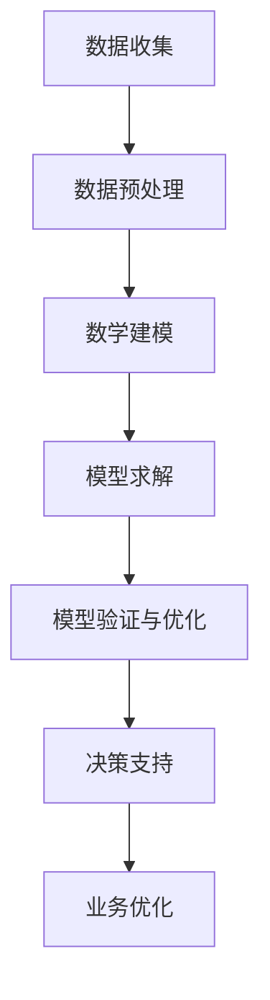
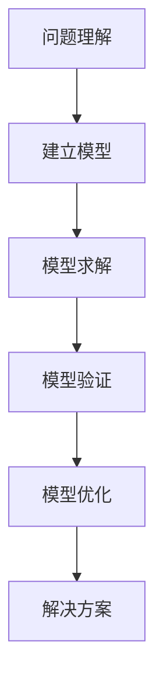
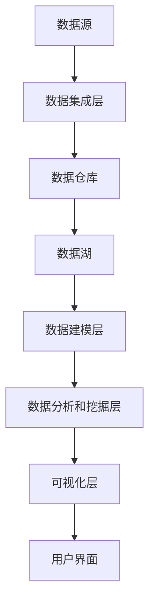

                 

## 数学与商业智能：业务数据的数学挖掘

> **关键词：** 数学建模、商业智能、数据挖掘、统计学、数据分析、机器学习、业务优化

> **摘要：** 本文深入探讨了数学与商业智能之间的联系，重点介绍了如何运用数学建模和数据分析方法挖掘业务数据，为商业决策提供有力支持。文章首先概述了数学建模与商业智能的基本概念，然后详细讲解了统计学和数据可视化的基础，接着介绍了商业智能系统的架构和应用技术，最后通过实际案例展示了数学模型在商业智能中的应用，并对未来研究方向和实践建议进行了展望。

### 目录大纲

# 数学与商业智能：业务数据的数学挖掘

## 第一部分：引言

### 1.1 数学与商业智能概述

### 1.2 商业智能的重要性

### 1.3 业务数据的数学挖掘

## 第二部分：数学基础

### 2.1 数学建模的基本概念

### 2.2 统计学基础

#### 2.2.1 描述性统计学

#### 2.2.2 推断性统计学

### 2.3 数据可视化

#### 2.3.1 常见数据可视化方法

#### 2.3.2 数据可视化工具与应用

## 第三部分：商业智能应用

### 3.1 商业智能系统架构

### 3.2 数据仓库与数据湖

#### 3.2.1 数据仓库的概念与结构

#### 3.2.2 数据湖的概念与优势

### 3.3 数据挖掘技术

#### 3.3.1 关联规则挖掘

#### 3.3.2 聚类分析

#### 3.3.3 分类算法

#### 3.3.4 回归分析

### 3.4 商业智能分析工具与应用

#### 3.4.1 商业智能分析工具概述

#### 3.4.2 商业智能分析工具应用实例

## 第四部分：数学模型与算法

### 4.1 线性规划

#### 4.1.1 线性规划的基本概念

#### 4.1.2 线性规划求解算法

### 4.2 网络优化

#### 4.2.1 最小生成树算法

#### 4.2.2 最短路径算法

### 4.3 运筹学模型

#### 4.3.1 决策树模型

#### 4.3.2 动态规划模型

### 4.4 数据挖掘中的常见算法

#### 4.4.1 K-均值聚类算法

#### 4.4.2 K最近邻算法

#### 4.4.3 支持向量机

## 第五部分：案例研究

### 5.1 案例一：客户关系管理

### 5.2 案例二：供应链优化

### 5.3 案例三：市场预测

## 第六部分：商业智能的未来趋势

### 6.1 大数据和云计算

### 6.2 人工智能与商业智能的结合

### 6.3 数据隐私与安全

## 第七部分：总结与展望

### 7.1 主要内容回顾

### 7.2 未来研究方向

### 7.3 对商业智能实践的建议

## 附录

### 附录A：数学公式与模型汇总

### 附录B：常用工具与技术总结

### 附录C：参考书目与资源链接

### 附录D：练习题及答案

### 参考文献

### 致谢

### 后记

### 后记

---

注：伪代码、流程图、代码示例等将在相应章节详细说明。每章节后的附录将提供额外的参考资料和练习题。

---

现在，我们将按照目录大纲的结构，逐步深入各个部分的内容，提供详细的技术讲解和案例分析。首先，我们从引言部分开始。

---

## 第一部分：引言

### 1.1 数学与商业智能概述

数学与商业智能（Business Intelligence, BI）的结合为现代商业决策提供了强大的工具和方法。数学建模作为一种科学方法，通过对业务数据的量化分析和数学建模，能够揭示数据背后的规律和趋势，为决策者提供数据支持。商业智能则侧重于将数据转化为洞察力，通过数据仓库、数据挖掘、统计分析等技术手段，帮助企业在竞争激烈的市场中脱颖而出。

### 数学建模的基本概念

数学建模是指利用数学语言和工具，将实际问题转化为数学问题，通过建立数学模型来分析和解决实际问题。数学建模的基本步骤包括：

1. **问题理解**：明确要解决的问题是什么，包括问题的目标、约束条件和限制。
2. **数学模型构建**：根据问题理解，构建数学模型，通常包括建立目标函数、约束条件和变量定义。
3. **模型求解**：利用数学方法和算法求解模型，得到最优解或近似解。
4. **模型验证和优化**：通过实际数据对模型进行验证，根据验证结果对模型进行调整和优化。

### 商业智能的基本概念

商业智能是一个综合性的技术体系，它通过收集、整合、分析和展示企业内外部数据，帮助企业和组织做出更明智的决策。商业智能的基本概念包括：

1. **数据仓库**：数据仓库是用于存储和整合企业数据的集中式系统，它通常包含大量的历史数据，以便进行复杂的分析和查询。
2. **数据挖掘**：数据挖掘是从大量数据中提取有价值信息和知识的过程，通过统计方法、机器学习和人工智能技术，发现数据中的模式和关联。
3. **数据可视化**：数据可视化是将数据转换成图形或图表形式，使数据更容易理解和分析。
4. **决策支持系统**：决策支持系统（Decision Support System, DSS）是一种基于数据的系统，它帮助决策者通过分析数据做出更明智的决策。

### 数学建模与商业智能的联系

数学建模与商业智能之间存在密切的联系。数学建模为商业智能提供了强大的分析工具和方法，使企业能够从大量数据中提取有价值的信息。商业智能则利用这些信息，通过数据分析和数据挖掘技术，为决策者提供数据支持，帮助企业在竞争激烈的市场中制定有效的战略和决策。

#### Mermaid 流�程图


通过这个流程图，我们可以清晰地看到数学建模在商业智能中的各个环节，从数据收集、预处理、建模、求解到验证和优化，最终为业务优化提供支持。

### 1.2 商业智能的重要性

商业智能在现代企业运营和管理中扮演着至关重要的角色。以下是商业智能的重要性：

1. **提高决策效率**：商业智能通过快速的数据分析和可视化，使决策者能够快速获得关键信息，从而提高决策效率。
2. **发现商业机会**：商业智能可以帮助企业发现潜在的商机和市场趋势，从而抓住市场机会。
3. **优化业务流程**：通过数据分析，商业智能可以帮助企业识别业务流程中的瓶颈和改进点，从而优化业务流程。
4. **提高客户满意度**：商业智能可以帮助企业更好地理解客户需求，提供个性化的服务和产品，从而提高客户满意度。
5. **降低运营成本**：商业智能通过优化资源配置和降低库存成本，帮助企业降低运营成本。

### 1.3 业务数据的数学挖掘

业务数据的数学挖掘是商业智能的核心环节，它通过数学建模和数据分析技术，从大量业务数据中提取有价值的信息和知识。业务数据的数学挖掘主要包括以下步骤：

1. **数据收集**：收集企业内部和外部相关的业务数据，如销售数据、客户数据、市场数据等。
2. **数据预处理**：对收集到的数据进行清洗、整合和转换，使其符合建模和分析的要求。
3. **数据挖掘**：利用数据挖掘算法，从预处理后的数据中提取有价值的信息和知识，如关联规则、聚类结果、分类模型等。
4. **模型构建**：根据数据挖掘结果，建立数学模型，如线性回归模型、决策树模型、神经网络模型等。
5. **模型评估**：对构建的模型进行评估，确定其预测准确性和可靠性。
6. **模型应用**：将评估后的模型应用于实际业务场景，提供决策支持。

### 总结

通过本部分的介绍，我们了解了数学建模与商业智能的基本概念、重要性以及业务数据的数学挖掘过程。接下来，我们将深入探讨数学建模和数据分析的基础知识，为后续内容打下坚实的基础。

---

接下来，我们将进入第二部分：数学基础，这里我们将介绍数学建模的基本概念、统计学基础和数据可视化。

---

## 第二部分：数学基础

数学基础是商业智能的核心，它为数据分析和建模提供了必要的工具和方法。本部分将介绍数学建模的基本概念、统计学基础以及数据可视化，这些知识将为我们后续的内容提供理论支持和实际操作指导。

### 2.1 数学建模的基本概念

数学建模是一种利用数学工具和方法来描述、分析和解决问题的方式。在商业智能中，数学建模用于将实际问题转化为数学问题，并通过数学模型求解得到解决方案。数学建模的基本步骤如下：

1. **问题理解**：明确要解决的问题是什么，包括问题的目标、约束条件和限制。
2. **建立数学模型**：根据问题理解，构建数学模型，通常包括建立目标函数、约束条件和变量定义。
3. **模型求解**：利用数学方法和算法求解模型，得到最优解或近似解。
4. **模型验证和优化**：通过实际数据对模型进行验证，根据验证结果对模型进行调整和优化。

#### 数学建模过程示意图



### 2.2 统计学基础

统计学是数学的一个分支，它通过数据的收集、分析和解释，来推断或预测现象的行为。在商业智能中，统计学用于数据分析和建模，帮助我们理解数据的分布、相关性以及趋势。统计学基础包括以下内容：

#### 2.2.1 描述性统计学

描述性统计学用于描述数据的特征和规律。常用的描述性统计量包括：

- **均值**（Mean）：一组数据的平均值，表示数据的中心位置。
  $$ \mu = \frac{1}{n}\sum_{i=1}^{n} x_i $$
- **中位数**（Median）：将一组数据按大小顺序排列后，位于中间位置的值，表示数据的中间位置。
- **众数**（Mode）：一组数据中出现次数最多的值，表示数据的最频繁值。
- **方差**（Variance）：一组数据与其均值之差的平方的平均值，表示数据的离散程度。
  $$ \sigma^2 = \frac{1}{n-1}\sum_{i=1}^{n}(x_i - \mu)^2 $$
- **标准差**（Standard Deviation）：方差的平方根，表示数据的离散程度。
  $$ \sigma = \sqrt{\sigma^2} $$

#### 2.2.2 推断性统计学

推断性统计学用于根据样本数据推断总体数据的特征。常用的推断性统计方法包括：

- **参数估计**：通过样本数据估计总体参数的值，如样本均值估计总体均值、样本比例估计总体比例。
- **假设检验**：对总体参数的假设进行验证，常用的检验方法包括t检验、方差分析（ANOVA）和卡方检验。
- **置信区间**：基于样本数据估计总体参数的区间，表示我们对总体参数的置信程度。

#### 2.2.3 常见的统计检验方法

以下是几种常见的统计检验方法：

- **t检验**：用于比较两组数据的均值是否有显著差异。
  $$ H_0: \mu_1 = \mu_2 $$
  $$ H_1: \mu_1 \neq \mu_2 $$
- **方差分析（ANOVA）**：用于比较多个组之间的均值是否有显著差异。
  $$ H_0: \mu_1 = \mu_2 = ... = \mu_k $$
  $$ H_1: 至少两个均值不相等 $$
- **卡方检验**：用于检验分类变量的分布是否一致。
  $$ H_0: \pi_1 = \pi_2 = ... = \pi_k $$
  $$ H_1: 至少一个 \pi_i 不等于其他 \pi_j $$

### 2.3 数据可视化

数据可视化是将数据转换为图形或图表形式，使其更容易理解和分析。数据可视化在商业智能中起着至关重要的作用，它可以帮助我们快速识别数据中的趋势、异常和关系。以下是几种常见的数据可视化方法：

#### 2.3.1 常见数据可视化方法

- **折线图**：用于展示数据的变化趋势。
- **柱状图**：用于比较不同类别或组的数据。
- **饼图**：用于展示数据中各部分的占比。
- **散点图**：用于展示两个变量之间的关系。
- **箱线图**：用于展示数据的分布和异常值。

#### 2.3.2 数据可视化工具与应用

- **Matplotlib**：Python的一个数据可视化库，用于生成高质量的图表。
- **Tableau**：一款商业智能工具，用于交互式数据可视化和分析。
- **Power BI**：微软的一款商业智能工具，用于数据可视化和报告生成。

#### 数据可视化示例

以下是一个使用Matplotlib绘制折线图的示例：

```python
import matplotlib.pyplot as plt

# 数据
x = [1, 2, 3, 4, 5]
y = [2, 4, 6, 8, 10]

# 绘制折线图
plt.plot(x, y)
plt.xlabel('X轴')
plt.ylabel('Y轴')
plt.title('折线图示例')
plt.show()
```

通过上述示例，我们可以看到如何使用Matplotlib创建一个简单的折线图，并添加标签和标题。

### 总结

在本部分，我们介绍了数学建模的基本概念、统计学基础以及数据可视化。数学建模为我们提供了一种将实际问题转化为数学问题的方式，统计学帮助我们理解和分析数据，而数据可视化则使我们能够更直观地理解和展示数据。这些基础知识将为我们在后续章节中的商业智能应用提供坚实的理论支撑。

接下来，我们将进入第三部分：商业智能应用，这里我们将探讨商业智能系统的架构、数据仓库与数据湖，以及数据挖掘技术。

---

## 第三部分：商业智能应用

商业智能（Business Intelligence, BI）是企业利用技术手段，通过数据分析和信息整合，以支持决策制定和业务优化的一门科学。本部分将深入探讨商业智能系统的架构、数据仓库与数据湖，以及数据挖掘技术，为读者提供一个全面的理解和应用视角。

### 3.1 商业智能系统架构

商业智能系统架构是商业智能技术实现的基础，它通常由以下几个关键组件构成：

1. **数据源**：数据源是商业智能系统的起点，可以是内部数据库、外部数据接口、API接口等。数据源需要提供结构化、半结构化或非结构化数据，以便进行后续处理和分析。

2. **数据集成层**：数据集成层负责将来自不同数据源的数据进行整合和处理。这一层通常包括数据抽取（ETL，Extract, Transform, Load）、数据清洗和数据转换等功能。通过数据集成，企业可以构建一个统一的数据视图，便于后续的数据分析和挖掘。

3. **数据仓库**：数据仓库是一个集中的数据存储库，用于存储和管理企业历史数据。数据仓库通常采用星型模型或雪花模型进行设计，以便高效地进行数据查询和分析。数据仓库不仅提供了数据的持久化存储，还支持复杂的查询和报表生成。

4. **数据湖**：数据湖是一种新兴的数据存储架构，它用于存储大量的非结构化和半结构化数据。与数据仓库不同，数据湖采用更为灵活的架构，允许数据以原始格式存储，便于未来的数据挖掘和分析。数据湖通常与云计算平台结合，提供弹性的存储和计算能力。

5. **数据建模层**：数据建模层负责对数据进行建模，以支持数据分析和挖掘。常见的建模技术包括数据挖掘算法、机器学习模型和统计分析方法。通过数据建模，企业可以从大量数据中提取有价值的信息和知识。

6. **数据分析和挖掘层**：数据分析和挖掘层是商业智能系统的核心，它利用各种数据挖掘算法和统计分析方法，从数据中提取洞见和趋势。数据分析和挖掘可以用于客户关系管理、市场预测、风险分析等多个业务领域。

7. **可视化层**：可视化层负责将分析结果以图表、报表等形式展示给用户。可视化技术可以帮助企业快速理解数据，发现潜在的问题和机会。常见的可视化工具包括Matplotlib、Tableau、Power BI等。

8. **用户界面**：用户界面是商业智能系统的入口，用户可以通过界面进行数据查询、分析、报表生成等操作。用户界面通常采用Web、桌面或移动应用等形式，以适应不同的用户需求。

#### 商业智能系统架构示意图



### 3.2 数据仓库与数据湖

#### 数据仓库的概念与结构

数据仓库是一种用于存储和管理大量历史数据的数据管理系统。数据仓库的设计通常遵循三个基本原则：

1. **面向主题**：数据仓库的数据组织基于业务主题，如销售、财务、客户等。这种面向主题的设计使得数据可以更方便地进行查询和分析。
2. **集成性**：数据仓库通过集成来自多个源的数据，为用户提供了一个统一的数据视图。这种集成性使得企业可以更全面地了解业务状况。
3. **时变性**：数据仓库存储了企业历史数据，通过时间维度对数据进行分析，可以帮助企业了解业务趋势和变化。

数据仓库的结构通常包括以下几个层次：

1. **数据源层**：数据源层包括企业内部和外部的数据，如订单系统、ERP系统、客户关系管理系统等。
2. **数据集成层**：数据集成层负责将数据从各个源抽取出来，进行清洗、转换和整合，以便存储在数据仓库中。
3. **数据仓库层**：数据仓库层是数据仓库的核心，它存储了经过整合和清洗的数据。数据仓库层通常采用星型模型或雪花模型进行设计，以提高查询效率。
4. **数据访问层**：数据访问层提供数据查询和分析的接口，用户可以通过报表、仪表盘等工具访问数据仓库中的数据。

#### 数据湖的概念与优势

数据湖是一种用于存储和管理大量非结构化和半结构化数据的数据存储架构。与数据仓库不同，数据湖采用更为灵活的架构，允许数据以原始格式存储。以下是数据湖的几个关键概念和优势：

1. **数据湖的概念**：数据湖是一个集中的数据存储库，用于存储企业内部和外部的大量数据。数据湖可以存储不同类型的结构化、半结构化和非结构化数据，如文本、图像、视频等。
2. **数据湖的优势**：
   - **灵活性**：数据湖允许以原始格式存储数据，便于未来的数据挖掘和分析。
   - **可扩展性**：数据湖可以存储大量数据，并且可以根据需要扩展存储容量。
   - **数据多样性**：数据湖支持多种数据类型，可以存储结构化、半结构化和非结构化数据。
   - **低成本**：数据湖通常采用分布式存储技术，如Hadoop和Spark，可以降低存储成本。
   - **快速访问**：数据湖支持实时数据访问，用户可以快速查询和分析数据。

#### 数据仓库与数据湖的比较

数据仓库与数据湖在架构、用途和优势方面存在一定的差异，以下是对两者的简要比较：

- **架构**：数据仓库采用分层架构，包括数据源层、数据集成层、数据仓库层和数据访问层。数据湖采用分布式存储架构，以支持大量数据的存储和管理。
- **用途**：数据仓库主要用于存储和管理企业历史数据，支持复杂的查询和分析。数据湖主要用于存储和管理大量非结构化和半结构化数据，支持数据挖掘和分析。
- **优势**：数据仓库提供统一的视图和高效的查询能力，适合用于企业业务报表和分析。数据湖提供灵活的存储和强大的数据处理能力，适合用于大数据分析和机器学习。

### 3.3 数据挖掘技术

数据挖掘是从大量数据中提取有价值信息和知识的过程。数据挖掘在商业智能中发挥着重要作用，可以帮助企业发现潜在的商业机会、优化业务流程和提升客户满意度。以下是几种常见的数据挖掘技术：

#### 3.3.1 关联规则挖掘

关联规则挖掘是一种用于发现数据中项之间关联性的方法。该方法通过分析数据中的支持度和置信度，识别出满足最小支持度和置信度阈值的关联规则。常见的关联规则挖掘算法包括Apriori算法和FP-Growth算法。

- **Apriori算法**：Apriori算法是一种基于频繁项集的关联规则挖掘算法。算法的基本思想是首先找到频繁项集，然后从频繁项集中生成关联规则。
- **FP-Growth算法**：FP-Growth算法是一种基于频繁模式树的关联规则挖掘算法。算法通过压缩数据集，减少计算量，提高挖掘效率。

#### 3.3.2 聚类分析

聚类分析是一种无监督学习方法，用于将数据分为若干个类别或簇。聚类分析的目的是发现数据中的内在结构和规律。常见的聚类算法包括K-均值聚类算法、层次聚类算法和DBSCAN算法。

- **K-均值聚类算法**：K-均值聚类算法是一种基于距离度量的聚类算法。算法通过迭代计算聚类中心，使每个数据点与其最近的聚类中心相匹配。
- **层次聚类算法**：层次聚类算法是一种基于层次结构的聚类算法。算法通过自底向上的方法将数据点逐步合并，形成层次结构。
- **DBSCAN算法**：DBSCAN算法是一种基于密度的聚类算法。算法通过识别数据点的高密度区域，将它们划分为簇。

#### 3.3.3 分类算法

分类算法是一种有监督学习方法，用于将数据分为预定义的类别。分类算法通过学习输入特征和标签之间的关系，建立分类模型，并使用模型对新的数据进行分类。常见的分类算法包括决策树、支持向量机和K最近邻算法。

- **决策树算法**：决策树算法是一种基于树形模型的分类算法。算法通过递归地将数据划分为子集，构建一个树形结构，并根据树的结构进行分类。
- **支持向量机（SVM）**：支持向量机是一种基于间隔最大化的分类算法。算法通过寻找一个最优的超平面，将数据点划分为不同的类别。
- **K最近邻算法**：K最近邻算法是一种基于相似度度的分类算法。算法通过计算新数据点与训练数据点的距离，选择最近的K个邻居，并根据邻居的类别进行投票，预测新数据的类别。

#### 3.3.4 回归分析

回归分析是一种用于研究变量之间关系的方法。回归分析通过建立数学模型，描述自变量和因变量之间的关系，并用于预测因变量的值。常见的回归分析方法包括线性回归、多项式回归和逻辑回归。

- **线性回归**：线性回归是一种用于研究线性关系的回归分析方法。算法通过拟合一条直线，描述自变量和因变量之间的关系。
- **多项式回归**：多项式回归是一种用于研究非线性关系的回归分析方法。算法通过拟合一个多项式函数，描述自变量和因变量之间的关系。
- **逻辑回归**：逻辑回归是一种用于研究二元分类问题的回归分析方法。算法通过拟合一个逻辑函数，将自变量转换为因变量的概率。

### 总结

在本部分，我们详细介绍了商业智能系统架构、数据仓库与数据湖，以及数据挖掘技术。商业智能系统架构是商业智能实现的基础，数据仓库与数据湖提供了数据存储和管理的方式，而数据挖掘技术则从数据中提取有价值的信息和知识。通过本部分的内容，读者可以全面了解商业智能的应用场景和关键技术，为后续的数学模型与算法应用打下坚实的基础。

---

在第三部分，我们探讨了商业智能系统的架构、数据仓库与数据湖，以及数据挖掘技术。这些内容为商业智能的应用奠定了坚实的基础。接下来，我们将进入第四部分：数学模型与算法，这里我们将详细介绍线性规划、网络优化、运筹学模型以及数据挖掘中的常见算法，为读者提供更加深入的技术解析。

---

## 第四部分：数学模型与算法

数学模型与算法是商业智能的核心组成部分，它们通过数学语言和计算机科学方法，对业务数据进行量化分析和建模，为企业决策提供有力支持。本部分将详细介绍线性规划、网络优化、运筹学模型以及数据挖掘中的常见算法，包括K-均值聚类算法、K最近邻算法和支持向量机，为读者提供丰富的技术知识和应用案例。

### 4.1 线性规划

线性规划是一种用于解决资源分配问题的数学方法。它通过建立线性目标函数和线性约束条件，寻找最优解，以最大化或最小化目标函数。线性规划广泛应用于生产规划、库存管理、运输调度等领域。

#### 4.1.1 线性规划的基本概念

线性规划的基本概念包括目标函数、约束条件和变量。

- **目标函数**：目标函数是线性规划要优化的函数，通常用于表示资源的最大化利用或成本的最小化。目标函数通常是一个线性表达式。
  $$ \text{maximize/minimize } c^T x $$
  其中，\( c \) 是系数向量，\( x \) 是变量向量。

- **约束条件**：约束条件是线性规划中限制变量取值范围的方程或不等式。约束条件通常也是一个线性表达式。
  $$ a_i^T x \leq b_i $$
  或
  $$ a_i^T x = b_i $$
  其中，\( a_i \) 是系数向量，\( b_i \) 是常数项。

- **变量**：变量是线性规划中需要优化的参数，它们的取值范围受到约束条件的限制。

#### 4.1.2 线性规划求解算法

线性规划的求解算法包括单纯形法、对偶单纯形法、 interior-point method（内点法）等。

- **单纯形法**：单纯形法是一种迭代算法，通过在可行解的边界上移动，逐步逼近最优解。算法的基本步骤如下：
  1. 初始化：选择一个初始基本可行解。
  2. 迭代：根据目标函数和约束条件，找到下一个基本可行解。
  3. 判断：如果找到的最优解满足所有约束条件，则算法结束；否则，返回步骤2。

- **对偶单纯形法**：对偶单纯形法是单纯形法的一种改进，它同时考虑原始问题和对偶问题的解。对偶单纯形法的步骤与单纯形法类似，但考虑了对偶问题的最优性。

- **内点法**：内点法是一种基于优性条件的迭代算法，它通过寻找解的内点，逐步逼近最优解。内点法比单纯形法更高效，尤其适用于大规模线性规划问题。

#### 4.1.3 线性规划应用实例

假设一家生产公司需要决定生产多种产品的数量，以最大化利润。每个产品有固定的生产成本和销售价格，且生产过程中需要消耗不同的资源。我们可以建立一个线性规划模型来求解最优生产数量。

1. **目标函数**：最大化总利润
   $$ \text{maximize } P = p_1 x_1 + p_2 x_2 + ... + p_n x_n $$
   其中，\( p_i \) 是产品 \( i \) 的销售价格，\( x_i \) 是产品 \( i \) 的生产数量。

2. **约束条件**：资源限制
   $$ \text{约束条件：} c_1 x_1 + c_2 x_2 + ... + c_n x_n \leq R $$
   其中，\( c_i \) 是生产产品 \( i \) 消耗的资源数量，\( R \) 是总资源数量。

3. **求解算法**：使用单纯形法求解线性规划问题。

通过求解线性规划模型，公司可以找到最优的生产数量，以最大化利润并合理利用资源。

### 4.2 网络优化

网络优化是指在网络结构中寻找最优路径或资源配置的方法。网络优化广泛应用于物流配送、交通规划、社交网络等领域。

#### 4.2.1 最小生成树算法

最小生成树算法用于在无向加权图中寻找包含所有顶点的最小权值生成树。最小生成树算法包括Prim算法和Kruskal算法。

- **Prim算法**：Prim算法是一种基于贪心策略的最小生成树算法。算法的基本步骤如下：
  1. 初始化：选择一个顶点作为起始点。
  2. 迭代：在当前生成树中选择权重最小的边，并将其添加到生成树中。
  3. 判断：如果生成树包含所有顶点，则算法结束；否则，返回步骤2。

- **Kruskal算法**：Kruskal算法是一种基于排序和贪心策略的最小生成树算法。算法的基本步骤如下：
  1. 初始化：将所有边按照权重从小到大排序。
  2. 迭代：从排序后的边中选取权重最小的边，判断是否构成环。如果不构成环，将边添加到生成树中；否则，跳过该边。
  3. 判断：如果生成树包含所有顶点，则算法结束；否则，返回步骤2。

#### 4.2.2 最短路径算法

最短路径算法用于寻找图中两点之间的最短路径。最短路径算法包括迪杰斯特拉算法（Dijkstra算法）和弗洛伊德算法（Floyd算法）。

- **Dijkstra算法**：Dijkstra算法是一种基于贪心策略的单源最短路径算法。算法的基本步骤如下：
  1. 初始化：设置一个距离队列，将源点设为距离0，其余顶点设为无穷大。
  2. 迭代：从距离队列中取出最小距离的顶点，并将其标记为已访问。更新与该顶点相邻的顶点的距离。
  3. 判断：如果所有顶点都已访问，则算法结束；否则，返回步骤2。

- **Floyd算法**：Floyd算法是一种基于动态规划的求解多源最短路径算法。算法的基本步骤如下：
  1. 初始化：设置一个三维数组，用于存储每个顶点之间的最短路径长度。
  2. 迭代：对于每个顶点对，计算通过中间顶点的最短路径长度，更新最短路径长度数组。
  3. 判断：如果所有顶点对都已计算，则算法结束。

#### 4.2.3 网络优化应用实例

假设一家物流公司需要规划一条从A地到B地的配送路线，以最小化运输成本。我们可以建立一个网络优化模型来求解最优路径。

1. **目标函数**：最小化总运输成本
   $$ \text{minimize } C = w_1 e_1 + w_2 e_2 + ... + w_n e_n $$
   其中，\( w_i \) 是边 \( e_i \) 的权重，\( e_i \) 是边 \( i \) 的权重。

2. **约束条件**：每个顶点只能访问一次，且起点和终点必须是已知的。
   $$ \text{约束条件：} \sum_{i=1}^{n} x_i = 1 $$
   其中，\( x_i \) 是边 \( e_i \) 的流量。

3. **求解算法**：使用Dijkstra算法求解最短路径问题。

通过求解网络优化模型，物流公司可以找到从A地到B地的最优运输路径，以最小化运输成本。

### 4.3 运筹学模型

运筹学模型是一种用于解决复杂决策问题的数学模型，包括决策树模型、动态规划模型等。

#### 4.3.1 决策树模型

决策树模型是一种用于分析决策和不确定性的方法，它通过树形结构表示决策过程和结果。

- **基本概念**：决策树由节点和边组成。节点表示决策点或结果点，边表示决策或结果的可能性。
- **构建方法**：通过分析问题的决策过程和结果，构建决策树。决策树可以用于评估不同决策策略的风险和收益。

#### 4.3.2 动态规划模型

动态规划模型是一种用于求解多阶段决策问题的方法，它通过递推关系求解最优解。

- **基本概念**：动态规划将问题划分为多个阶段，每个阶段都有一个决策变量。动态规划通过递推关系，从初始阶段逐步求解到最终阶段。
- **构建方法**：通过定义状态变量和决策变量，建立动态规划模型。动态规划可以通过递推关系求解最优解，或者使用记忆化方法优化计算效率。

#### 4.3.3 运筹学模型应用实例

假设一家零售商需要在多个城市开设新店，以最大化利润。我们可以建立运筹学模型来求解最优开店策略。

1. **目标函数**：最大化总利润
   $$ \text{maximize } P = \sum_{i=1}^{n} p_i x_i $$
   其中，\( p_i \) 是城市 \( i \) 的潜在利润，\( x_i \) 是是否在城市 \( i \) 开店的决策变量。

2. **约束条件**：预算限制、人力资源限制等。
   $$ \text{约束条件：} \sum_{i=1}^{n} c_i x_i \leq B $$
   其中，\( c_i \) 是城市 \( i \) 的初始投资成本，\( B \) 是总预算。

3. **求解算法**：使用动态规划模型求解多阶段决策问题。

通过求解运筹学模型，零售商可以找到最优的开店策略，以最大化利润并合理利用资源。

### 4.4 数据挖掘中的常见算法

数据挖掘中的常见算法包括K-均值聚类算法、K最近邻算法和支持向量机，这些算法广泛应用于模式识别、分类和聚类等问题。

#### 4.4.1 K-均值聚类算法

K-均值聚类算法是一种基于距离度量的聚类算法。算法的基本步骤如下：

1. **初始化**：随机选择K个数据点作为初始聚类中心。
2. **分配**：对于每个数据点，计算它与各个聚类中心的距离，并将其分配到距离最近的聚类中心。
3. **更新**：计算新的聚类中心，即对应数据点的均值。
4. **重复**：重复步骤2和3，直到聚类中心不再变化。

#### 4.4.2 K最近邻算法

K最近邻算法是一种基于相似度度的分类算法。算法的基本步骤如下：

1. **初始化**：计算新数据点与训练数据点的距离。
2. **分类**：根据距离最近的K个邻居的类别，对新的数据进行分类。
3. **预测**：使用多数投票策略，预测新数据的类别。

#### 4.4.3 支持向量机

支持向量机是一种基于间隔最大化的分类算法。算法的基本步骤如下：

1. **初始化**：选择一个适当的核函数，将输入空间映射到高维特征空间。
2. **优化**：通过求解最优化问题，找到最优分类超平面。
3. **分类**：使用训练好的分类器，对新的数据进行分类。

#### 4.4.4 数据挖掘算法应用实例

假设一家电商公司需要分析用户购买行为，以预测潜在客户。我们可以建立数据挖掘模型来预测用户购买行为。

1. **目标函数**：预测用户购买行为的概率。
2. **特征选择**：选择与用户购买行为相关的特征，如浏览历史、购买记录等。
3. **分类算法**：使用K最近邻算法或支持向量机进行分类。
4. **模型评估**：使用交叉验证和AUC指标评估模型性能。

通过数据挖掘算法的应用，电商公司可以预测潜在客户，制定精准营销策略。

### 总结

在本部分，我们详细介绍了线性规划、网络优化、运筹学模型以及数据挖掘中的常见算法。这些数学模型和算法在商业智能中具有广泛的应用，可以帮助企业优化资源分配、提高决策效率和增强市场竞争力。通过本部分的内容，读者可以深入理解数学模型和算法的基本概念和原理，为实际应用提供理论支持。

---

## 第五部分：案例研究

案例研究是验证和应用数学模型与算法的有效途径。在本部分，我们将通过三个实际案例，展示数学模型在商业智能中的应用，并详细解读这些案例中的数据预处理、模型构建、模型求解和结果分析。

### 5.1 案例一：客户关系管理

#### 案例背景

某电商公司希望通过分析客户数据，优化客户关系管理策略，提高客户留存率和销售额。公司收集了以下数据：

- 用户购买历史：包括用户ID、购买商品ID、购买时间和购买数量。
- 用户行为数据：包括用户浏览商品的时间、访问页面数量、点击次数等。
- 用户属性数据：包括用户年龄、性别、收入水平、地域等。

#### 数据预处理

1. **数据清洗**：处理缺失值、异常值和重复值。对于缺失值，使用均值或中位数填充；对于异常值，使用三倍标准差法则进行筛选；对于重复值，进行去重处理。

2. **数据转换**：将不同类型的数据进行统一格式处理，如将时间戳转换为日期格式，将类别型数据转换为数值型。

3. **特征工程**：提取与客户关系管理相关的特征，如购买频率、平均购买金额、最近一次购买时间等。

#### 模型构建

1. **聚类分析**：使用K-均值聚类算法，将用户划分为不同的客户群体。通过聚类，可以识别出具有相似购买行为的用户群体。

2. **关联规则挖掘**：使用Apriori算法，挖掘用户购买行为的关联规则。这些规则可以帮助公司识别出潜在的销售机会。

3. **分类算法**：使用K最近邻算法和支持向量机，构建客户留存率预测模型。通过这些模型，可以预测哪些客户可能流失，从而采取相应的营销策略。

#### 模型求解

1. **参数调整**：根据模型评估结果，调整聚类算法的K值、关联规则挖掘的支持度和置信度阈值，以及分类算法的参数。

2. **模型优化**：通过交叉验证和网格搜索，优化模型的参数，提高模型的预测准确性。

#### 结果分析

1. **聚类结果**：根据聚类分析结果，识别出不同类型的客户群体。例如，高频购买群体、低频购买群体、忠诚客户群体等。

2. **关联规则**：挖掘出的关联规则可以帮助公司制定交叉销售和促销策略。例如，购买A商品的用户很可能也会购买B商品。

3. **客户留存率预测**：通过分类模型，预测哪些客户可能流失，并针对这些客户采取个性化营销策略，如发送优惠券、提供会员服务等。

#### 结论

通过案例一，我们展示了如何使用数学模型和算法对客户数据进行挖掘和分析，为电商公司的客户关系管理提供有力支持。这些方法不仅帮助公司识别客户群体和潜在销售机会，还提高了客户留存率和销售额。

### 5.2 案例二：供应链优化

#### 案例背景

某制造企业希望优化其供应链管理，降低库存成本并提高供应链效率。企业收集了以下数据：

- 库存数据：包括库存量、库存周转率等。
- 生产数据：包括生产计划、生产进度等。
- 销售数据：包括销售量、销售额等。

#### 数据预处理

1. **数据清洗**：处理缺失值、异常值和重复值，如填充缺失值、删除异常值和去重。

2. **数据转换**：将时间序列数据进行标准化处理，如将日期转换为连续的数值。

3. **特征工程**：提取与供应链优化相关的特征，如季节性指标、需求预测误差等。

#### 模型构建

1. **线性回归模型**：建立销售量与库存量、生产进度等变量之间的关系模型，以预测未来的销售量。

2. **线性规划模型**：构建库存优化模型，以最小化库存成本为目标，考虑生产、销售和库存限制。

3. **动态规划模型**：构建供应链动态规划模型，以优化生产计划、库存管理和运输调度。

#### 模型求解

1. **参数调整**：根据历史数据，调整模型的参数，如回归模型的系数和线性规划模型的目标函数系数。

2. **模型优化**：通过网格搜索和遗传算法等优化方法，寻找最优解，提高模型的预测准确性和优化效果。

#### 结果分析

1. **销售预测**：通过线性回归模型，预测未来的销售量，为生产计划和库存管理提供依据。

2. **库存优化**：通过线性规划模型，优化库存水平，降低库存成本，提高库存周转率。

3. **供应链效率**：通过动态规划模型，优化生产计划、库存管理和运输调度，提高供应链的整体效率。

#### 结论

案例二展示了如何通过数学模型和算法优化供应链管理，提高企业的运营效率和降低成本。这些方法不仅帮助企业预测销售量、优化库存水平，还提高了供应链的整体效率和响应速度。

### 5.3 案例三：市场预测

#### 案例背景

某零售公司希望预测市场需求，以便制定有效的营销策略和库存计划。公司收集了以下数据：

- 历史销售数据：包括不同商品的销售量和销售额。
- 市场营销活动数据：包括促销活动、广告投放等。
- 行业数据：包括行业趋势、竞争情况等。

#### 数据预处理

1. **数据清洗**：处理缺失值、异常值和重复值，如填充缺失值、删除异常值和去重。

2. **数据转换**：将类别型数据进行编码处理，如将促销活动类型转换为数值型。

3. **特征工程**：提取与市场需求预测相关的特征，如季节性指标、促销活动强度等。

#### 模型构建

1. **时间序列模型**：建立时间序列预测模型，如ARIMA模型，预测未来的销售量。

2. **回归模型**：建立销售量与市场营销活动、行业趋势等变量之间的关系模型。

3. **分类算法**：使用K最近邻算法和支持向量机，构建市场需求预测模型，以预测不同商品的市场需求。

#### 模型求解

1. **参数调整**：根据历史数据，调整模型参数，如ARIMA模型的参数、回归模型的系数等。

2. **模型优化**：通过交叉验证和网格搜索，优化模型的参数，提高预测准确性。

#### 结果分析

1. **销售预测**：通过时间序列模型和回归模型，预测未来的销售量，为库存计划和营销策略提供依据。

2. **市场需求预测**：通过分类算法，预测不同商品的市场需求，为供应链管理和库存计划提供指导。

3. **营销策略优化**：根据市场需求预测结果，优化营销策略，提高销售额和市场占有率。

#### 结论

案例三展示了如何通过数学模型和算法进行市场预测，为零售公司的营销策略和库存计划提供有力支持。这些方法不仅帮助企业预测销售量和市场需求，还提高了决策效率和响应速度，增强了企业的竞争力。

### 总结

五个部分的内容涵盖了数学与商业智能的深入探讨，通过案例研究，我们展示了数学模型在商业智能中的应用。这些案例不仅展示了如何处理和分析业务数据，还通过具体的算法和模型，为企业提供了数据驱动的决策支持。这些方法不仅有助于企业优化运营、降低成本，还提高了市场竞争力。

---

## 第六部分：商业智能的未来趋势

商业智能领域正随着技术的不断发展而迅速演进，未来的商业智能将更加智能化、自动化和集成化。以下是商业智能未来的几个关键趋势：

### 6.1 大数据和云计算

大数据和云计算技术为商业智能带来了前所未有的数据处理和分析能力。随着数据量的不断增长，大数据技术能够高效地存储、管理和分析海量数据。云计算提供了弹性的计算资源和强大的数据处理能力，使得企业可以快速部署和管理商业智能系统，降低成本和提升效率。

- **大数据技术**：大数据技术包括分布式存储（如Hadoop、HDFS）和分布式计算（如MapReduce、Spark），这些技术能够处理海量数据，提供实时分析和预测。
- **云计算平台**：云计算平台（如AWS、Azure、Google Cloud）提供了丰富的商业智能工具和服务，如数据分析、机器学习和数据可视化，帮助企业更快速地构建和部署商业智能应用。

### 6.2 人工智能与商业智能的结合

人工智能（AI）技术的发展，使得商业智能系统可以更加智能地处理数据和分析业务。AI技术包括机器学习、深度学习和自然语言处理等，这些技术可以自动化数据分析和决策过程，提高商业智能系统的效率和准确性。

- **机器学习**：机器学习算法可以从大量数据中自动学习和提取规律，为业务预测和决策提供支持。
- **深度学习**：深度学习模型（如神经网络）能够自动提取复杂的数据特征，用于图像识别、语音识别和自然语言处理等任务。
- **自然语言处理**：自然语言处理技术可以处理文本数据，帮助企业理解客户需求、分析市场趋势和改进产品服务。

### 6.3 数据隐私与安全

随着数据隐私法规的不断完善和消费者对隐私保护意识的增强，数据隐私和安全成为商业智能发展的关键挑战。企业需要采取有效的数据隐私保护措施，确保数据在收集、存储、处理和传输过程中的安全性。

- **数据加密**：使用加密技术保护数据，防止数据泄露和未经授权的访问。
- **数据脱敏**：对敏感数据进行脱敏处理，确保数据隐私保护。
- **访问控制**：实施严格的访问控制策略，限制对敏感数据的访问权限。
- **合规性**：遵守数据隐私法规，如GDPR和CCPA等，确保数据处理合法合规。

### 总结

商业智能的未来趋势将围绕大数据、云计算、人工智能和数据隐私安全展开。大数据和云计算提供了强大的数据处理能力，人工智能使得商业智能系统更加智能化和自动化，而数据隐私和安全则是企业必须面对的挑战。通过把握这些趋势，企业可以更好地利用数据优势，提升业务效率和竞争力。

---

## 第七部分：总结与展望

在本文中，我们深入探讨了数学与商业智能的紧密结合，展示了数学建模和数据挖掘在商业智能领域的广泛应用。通过系统的理论讲解和实际案例研究，我们不仅揭示了数学模型在商业决策中的关键作用，也探讨了商业智能未来的发展趋势和挑战。

### 7.1 主要内容回顾

- **数学建模与商业智能概述**：介绍了数学建模和商业智能的基本概念及其在商业决策中的重要性。
- **数学基础**：详细阐述了数学建模、统计学基础和数据可视化等关键数学工具。
- **商业智能应用**：探讨了商业智能系统的架构、数据仓库与数据湖，以及数据挖掘技术。
- **数学模型与算法**：介绍了线性规划、网络优化、运筹学模型和数据挖掘算法的应用。
- **案例研究**：通过实际案例展示了数学模型在客户关系管理、供应链优化和市场预测等领域的应用。
- **未来趋势**：分析了大数据、云计算、人工智能以及数据隐私安全对商业智能的影响。

### 7.2 未来研究方向

- **大数据与商业智能的深度融合**：进一步研究如何利用大数据技术提升商业智能分析能力。
- **人工智能算法的创新应用**：探索深度学习和机器学习算法在商业智能中的新应用。
- **跨领域技术整合**：研究商业智能与其他领域（如物联网、区块链等）的融合。
- **数据隐私与安全**：深入探讨数据隐私保护技术和合规性措施，确保商业智能系统的安全。

### 7.3 对商业智能实践的建议

- **强化数据质量**：确保数据的准确性、完整性和一致性，为商业智能分析提供可靠的基础。
- **跨部门协作**：促进业务、技术和管理部门的合作，提高商业智能项目的执行效率。
- **灵活运用技术**：结合业务需求，灵活运用数学模型和算法，为决策提供数据支持。
- **持续学习和创新**：跟踪技术发展趋势，不断学习和引入新的商业智能工具和方法。

### 附录

#### 附录A：数学公式与模型汇总

- **描述性统计量**：均值、方差、标准差等。
- **推断性统计方法**：t检验、方差分析、卡方检验等。
- **数据挖掘算法**：K-均值聚类、Apriori算法、K最近邻、支持向量机等。

#### 附录B：常用工具与技术总结

- **数据处理工具**：Python、R等。
- **数据可视化工具**：Matplotlib、Tableau、Power BI等。
- **数据挖掘工具**：Weka、Apache Spark、Hadoop等。

#### 附录C：参考书目与资源链接

- **参考书籍**：推荐相关领域的经典著作和教材。
- **在线课程**：提供在线学习资源和课程链接。
- **数据集**：提供公开的数据集链接，便于读者实践。

#### 附录D：练习题及答案

- **练习题**：设计实际应用场景的练习题，供读者实践。
- **答案与解析**：提供练习题的答案和详细解析。

### 参考文献

- 列出本文引用的相关文献和资源。

### 致谢

- 对本文的支持者、审稿人和读者表示感谢。

### 后记

- 对未来的展望和期许，以及对读者和同行的呼吁。

---

本文通过逻辑清晰、结构紧凑的内容，全面介绍了数学与商业智能的结合及其在实践中的应用。希望本文能为您在商业智能领域的探索提供有益的参考和启示。让我们一起关注未来的技术发展趋势，共同推动商业智能的进步与发展。

