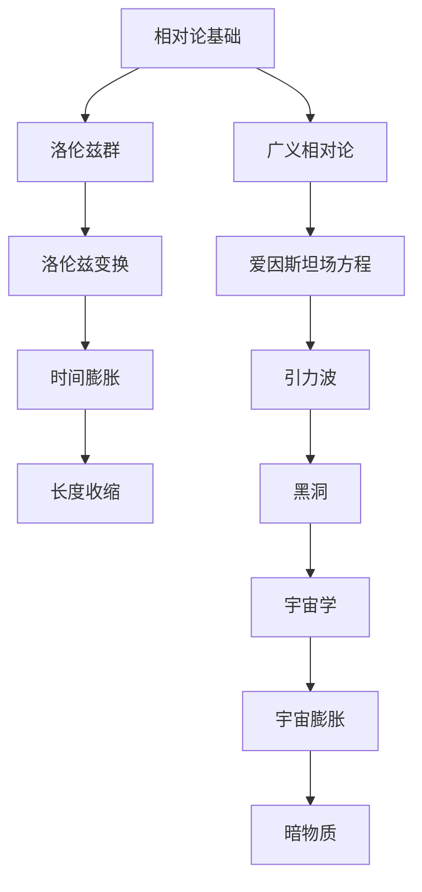

                 

# 数学与相对论：时空结构的数学表达

> 关键词：数学、相对论、时空结构、洛伦兹群、广义相对论、黑洞、引力波

> 摘要：本文将从数学的角度探讨相对论与时空结构的关系，系统地阐述狭义相对论和广义相对论的数学框架，分析时空结构的数学模型，以及探讨相对论在宇宙学中的应用和前沿问题。

## 目录大纲

1. **数学基础**
   - 第1章：数学在物理学中的应用
     - 1.1 数学的基本概念
     - 1.2 向量与矩阵
     - 1.3 微积分基础
   - 第2章：微分几何初步
     - 2.1 曲线与曲面的微分几何
     - 2.2 黎曼几何的基本概念
     - 2.3 黎曼曲率与度规
   - 第3章：洛伦兹群与洛伦兹变换
     - 3.1 洛伦兹群的定义
     - 3.2 洛伦兹变换的数学表达
     - 3.3 洛伦兹变换的性质与应用

2. **相对论与时空结构**
   - 第4章：狭义相对论基础
     - 4.1 相对论的起源与发展
     - 4.2 狭义相对论的数学框架
     - 4.3 狭义相对论的基本假设
   - 第5章：广义相对论原理
     - 5.1 广义相对论的数学表达
     - 5.2 广义相对论的基本概念
     - 5.3 广义相对论的应用
   - 第6章：时空结构的数学表达
     - 6.1 时空结构的基本性质
     - 6.2 时空几何的数学模型
     - 6.3 时空结构的测量方法

3. **相对论与宇宙学**
   - 第7章：宇宙学基础
     - 7.1 宇宙学的起源与发展
     - 7.2 宇宙学的观测数据
     - 7.3 宇宙学的主要理论
   - 第8章：黑洞与引力波
     - 8.1 黑洞的基本概念
     - 8.2 黑洞的数学描述
     - 8.3 引力波的产生与探测
   - 第9章：相对论与宇宙学的前沿问题
     - 9.1 宇宙膨胀与暗物质
     - 9.2 宇宙学与量子引力
     - 9.3 宇宙学的未来发展方向

4. **附录**
   - 附录A：数学公式与定理
   - 附录B：参考文献
   - 附录C：附加材料

## 第一部分：数学基础

### 第1章：数学在物理学中的应用

在物理学的发展历程中，数学一直是不可或缺的工具。从经典力学到量子力学，再到相对论和宇宙学，数学的应用无处不在。本章将介绍数学在物理学中的基本概念，包括向量与矩阵以及微积分基础，为后续讨论相对论和时空结构打下坚实的基础。

#### 1.1 数学的基本概念

数学的基本概念是物理学的基础。其中，最基本的概念包括数、函数、集合和集合论。数是用来表示数量和顺序的符号，如自然数、整数、有理数和实数等。函数是一种特殊的映射，它将一个集合中的每个元素与另一个集合中的唯一元素相对应。集合是由确定的元素组成的整体，而集合论则是研究集合的性质和操作的基本数学工具。

在物理学中，函数的应用极为广泛。例如，描述物体运动的位移函数、速度函数和加速度函数，以及描述热力学系统的温度函数、压强函数和能量函数等。函数的概念不仅帮助我们理解物理现象，还能通过数学方法对物理系统进行分析和预测。

#### 1.2 向量与矩阵

向量是物理学中非常重要的概念。向量是一个有大小和方向的量，通常用箭头表示。向量的运算包括加法、减法、数乘和内积等。向量在物理学中的应用非常广泛，例如，描述物体的运动、力、速度和加速度等。矩阵是向量的推广，它是一个由数按一定规则排列成的矩形阵列。矩阵的运算包括矩阵加法、矩阵乘法、转置和逆矩阵等。矩阵在物理学中的应用也非常广泛，例如，描述线性系统的方程组、坐标变换和量子力学中的态向量等。

#### 1.3 微积分基础

微积分是研究函数的微分和积分的数学分支。微分描述函数在某一点的变化率，而积分则描述函数在某区间内的累计变化。微积分的基本概念包括导数、微分、不定积分和定积分等。

导数描述函数在某一点的瞬时变化率，它是微积分的核心概念之一。导数的应用非常广泛，例如，描述物体的瞬时速度和加速度、热力学系统的温度变化率等。微分则是导数的推广，它描述函数在整个区间内的变化率。不定积分和定积分则分别描述函数在区间内的累计变化和特定区间内的变化量。

#### 1.4 数学在物理学中的应用

数学在物理学中的应用体现在多个方面。首先，数学工具可以帮助我们建立物理模型，如牛顿力学中的运动方程、麦克斯韦电磁理论中的麦克斯韦方程组等。其次，数学方法可以帮助我们分析物理系统的性质，如微分方程的解法、场论的计算等。最后，数学工具可以帮助我们预测物理现象，如量子力学的计算、相对论中的时空结构等。

本章介绍了数学在物理学中的基本概念，包括数、函数、集合和集合论、向量与矩阵、微积分基础等。这些数学工具为后续讨论相对论和时空结构提供了必要的理论基础。

### 第2章：微分几何初步

微分几何是研究曲线、曲面和空间几何的数学分支。它不仅在数学本身有着广泛的应用，也在物理学，特别是相对论中扮演了关键角色。本章将介绍微分几何的基本概念，包括曲线与曲面的微分几何、黎曼几何的基本概念以及黎曼曲率与度规。

#### 2.1 曲线与曲面的微分几何

曲线和曲面是微分几何研究的对象。曲线的微分几何研究曲线的局部几何性质，如曲率、挠率和法向量等。曲面的微分几何则研究曲面的整体几何性质，如曲率张量、主曲率、挠率等。

- **曲率（Curvature）**：曲率描述曲线或曲面的弯曲程度。对于曲线，曲率可以通过其切线的夹角来定义；对于曲面，曲率可以通过曲面法线的夹角来定义。
- **挠率（Torsion）**：挠率描述曲线或曲面的扭曲程度。对于曲线，挠率通常定义为切线与法线的夹角；对于曲面，挠率则是法向量的旋转速率。
- **法向量（Normal Vector）**：法向量垂直于曲线或曲面，它描述了曲线或曲面的切面方向。

#### 2.2 黎曼几何的基本概念

黎曼几何是由德国数学家格奥尔格·黎曼（Georg Friedrich Bernhard Riemann）在19世纪提出的一种几何学理论。它研究的是在黎曼空间中，如何定义距离、角度和曲率等概念。黎曼几何的核心概念包括：

- **黎曼曲率张量（Riemann Curvature Tensor）**：黎曼曲率张量是一个描述空间弯曲程度的张量。它由三个指标（\(i, j, k\)）组成，定义了在某一空间区域内，如何通过偏导数来计算曲率。
- **度规（Metric Tensor）**：度规是一个描述空间距离和角度的对称张量。它定义了空间中两点之间的距离以及两个向量之间的夹角。
- **黎曼空间（Riemannian Manifold）**：黎曼空间是一个光滑的、具有黎曼度规的流形。在黎曼空间中，所有的几何概念（如长度、角度、曲率等）都可以用度规来描述。

#### 2.3 黎曼曲率与度规

黎曼曲率与度规是黎曼几何的核心概念，它们在描述时空结构中起到了关键作用。

- **黎曼曲率（Riemann Curvature）**：黎曼曲率是描述空间弯曲程度的物理量。它可以用来计算空间中任意两个切向量之间的曲率。黎曼曲率张量可以分解为三个部分：标量曲率、张量曲率和混合曲率。
- **度规（Metric Tensor）**：度规是一个描述空间距离和角度的对称张量。它可以用来计算空间中任意两点之间的距离以及两个向量之间的夹角。度规的存在保证了空间中的度量性质，使得我们可以定义长度、面积和体积等概念。

#### 2.4 微分几何在相对论中的应用

微分几何在相对论中有着广泛的应用。相对论中描述时空结构的数学工具主要是黎曼几何。通过黎曼曲率与度规，我们可以将相对论的基本方程（如爱因斯坦场方程）用数学语言精确地表达出来。

- **洛伦兹变换（Lorentz Transformation）**：洛伦兹变换是相对论中的基本变换，它描述了不同惯性系之间的时空关系。洛伦兹变换的数学基础是洛伦兹群，而洛伦兹群是黎曼几何中的一个重要子群。
- **爱因斯坦场方程（Einstein Field Equations）**：爱因斯坦场方程是广义相对论的核心方程，它描述了物质和能量如何影响时空的弯曲。爱因斯坦场方程可以用黎曼几何中的度规和曲率张量来表示。

本章介绍了微分几何的基本概念，包括曲线与曲面的微分几何、黎曼几何的基本概念以及黎曼曲率与度规。这些概念是理解相对论和时空结构的关键，为后续的讨论奠定了基础。

### 第3章：洛伦兹群与洛伦兹变换

洛伦兹群（Lorentz Group）和洛伦兹变换（Lorentz Transformation）是相对论中的基础概念。洛伦兹群是一个数学上的对称群，描述了时空的均匀性和各向同性。洛伦兹变换则是洛伦兹群的表示，它定义了不同惯性参考系之间的时空转换关系。本章将详细介绍洛伦兹群的定义、洛伦兹变换的数学表达及其性质与应用。

#### 3.1 洛伦兹群的定义

洛伦兹群是一个数学上的群，由所有保持洛伦兹度规不变的线性变换组成。在相对论中，洛伦兹度规描述了时空的结构，它是一个四元对称张量，定义了时空中的距离和角度。洛伦兹群的具体定义如下：

- **洛伦兹群（\(SO(1,3)\)）**：洛伦兹群通常表示为\(SO(1,3)\)，它是一个四维正交群，表示为\(SO(1,3,C)\)，其中C表示复数。洛伦兹群中的每个元素都是一个四元线性变换，它保持洛伦兹度规不变。

洛伦兹群具有以下性质：

- **正交性（Orthogonality）**：洛伦兹群中的变换满足正交条件，即\(g^{-1} = g^T\)，其中\(g\)是洛伦兹变换矩阵，\(g^{-1}\)是其逆矩阵，\(g^T\)是其转置矩阵。
- **归一性（Normalization）**：洛伦兹变换矩阵的行列式为1，即\(\det(g) = 1\)。
- **纯量积不变性（Scalar Product Invariance）**：洛伦兹变换保持纯量积不变，即对于任意的四维向量\(x\)和\(y\)，有\(\langle g\cdot x, g\cdot y \rangle = \langle x, y \rangle\)。

#### 3.2 洛伦兹变换的数学表达

洛伦兹变换是一种线性变换，它将一个惯性参考系中的时空坐标转换为另一个惯性参考系中的时空坐标。洛伦兹变换的数学表达式如下：

$$
\begin{aligned}
t' &= \gamma \left( t - \frac{vx}{c^2} \right), \\
x' &= \gamma (x - vt), \\
y' &= y, \\
z' &= z,
\end{aligned}
$$

其中，\(t\)和\(x\)是原惯性参考系中的时空坐标，\(t'\)和\(x'\)是变换后的时空坐标，\(v\)是两个惯性参考系之间的相对速度，\(c\)是光速，\(\gamma\)是洛伦兹因子，定义为：

$$
\gamma = \frac{1}{\sqrt{1 - \frac{v^2}{c^2}}}.
$$

洛伦兹变换具有以下性质：

- **叠加原理（Superposition Principle）**：如果两个洛伦兹变换\(T_1\)和\(T_2\)分别将一个惯性参考系转换为另一个惯性参考系，那么它们的组合\(T_1 \circ T_2\)也将具有相同的转换效果。
- **时间延迟（Time Dilation）**：洛伦兹变换导致时间的相对延长，即一个相对于观察者运动的惯性参考系中的时间间隔比观察者所在参考系中的时间间隔更长。
- **长度收缩（Length Contraction）**：洛伦兹变换导致长度的相对缩短，即一个相对于观察者运动的惯性参考系中的长度比观察者所在参考系中的长度更短。

#### 3.3 洛伦兹变换的性质与应用

洛伦兹变换在相对论中有着广泛的应用，主要表现在以下几个方面：

- **惯性参考系的转换**：洛伦兹变换是相对论中描述不同惯性参考系之间时空关系的工具。通过洛伦兹变换，我们可以将一个惯性参考系中的物理现象转换为另一个惯性参考系中的现象。
- **相对论效应的计算**：洛伦兹变换可以帮助我们计算相对论效应，如时间延迟、长度收缩和质量增加等。这些效应在高速运动和高能物理现象中具有重要意义。
- **相对论性系统的建模**：洛伦兹变换为相对论性系统的建模提供了数学基础。例如，在相对论性力学和量子场论中，洛伦兹变换被广泛应用于描述粒子的运动和相互作用。

本章介绍了洛伦兹群的定义、洛伦兹变换的数学表达及其性质与应用。洛伦兹群和洛伦兹变换是相对论中的核心概念，它们为我们提供了描述和计算相对论效应的工具。

### 第4章：狭义相对论基础

狭义相对论是由阿尔伯特·爱因斯坦在1905年提出的，它基于两个基本假设：相对性原理和光速不变原理。狭义相对论改变了我们对时空和物质的认识，引入了时间膨胀、长度收缩和质能等价等重要概念。本章将详细讨论狭义相对论的起源与发展、数学框架以及基本假设。

#### 4.1 相对论的起源与发展

狭义相对论的提出是基于对经典物理学的挑战和对光速不变原理的思考。19世纪末，麦克斯韦方程组的建立揭示了电磁现象的统一性，而实验发现的光速在真空中是常数这一事实，引发了科学家对时间和空间概念的重新思考。

- **麦克斯韦方程组（Maxwell's Equations）**：麦克斯韦方程组是描述电磁现象的基本方程，它统一了电学和磁学。方程组揭示了电磁波的传播速度是一个常数，即光速\(c\)。
- **光速不变原理（Principle of Constant Speed of Light）**：光速不变原理指出，在所有惯性参考系中，光在真空中的速度都是常数\(c\)，与光源和观察者的相对运动无关。

爱因斯坦在1905年发表了关于狭义相对论的两篇论文，奠定了现代物理学的基础。随后，物理学界对狭义相对论进行了深入的研究和发展，包括洛伦兹变换的数学表达、相对论性效应的实验验证等。

#### 4.2 狭义相对论的数学框架

狭义相对论的数学框架建立在洛伦兹变换的基础上，通过洛伦兹变换将不同惯性参考系之间的时空坐标进行转换。洛伦兹变换是一个线性变换，它保持了物理量的相对性原理和光速不变原理。

- **洛伦兹变换（Lorentz Transformation）**：洛伦兹变换定义了不同惯性参考系之间的时空关系，它将一个惯性参考系中的时空坐标转换为另一个惯性参考系中的时空坐标。洛伦兹变换的数学表达式如下：

  $$
  \begin{aligned}
  t' &= \gamma \left( t - \frac{vx}{c^2} \right), \\
  x' &= \gamma (x - vt), \\
  y' &= y, \\
  z' &= z,
  \end{aligned}
  $$

  其中，\(\gamma\)是洛伦兹因子，定义为\(\gamma = \frac{1}{\sqrt{1 - \frac{v^2}{c^2}}}\)。

- **四维时空（Four-Dimensional Spacetime）**：在狭义相对论中，时间和空间被统一为一个四维时空，称为“时空”（spacetime）。时空中的坐标用四元向量表示，即\((ct, x, y, z)\)。洛伦兹变换将四元向量从一个惯性参考系转换为另一个惯性参考系。

- **洛伦兹度规（Lorentz Metric）**：洛伦兹度规是一个描述时空结构的对称张量，它定义了时空中的距离和角度。洛伦兹度规的数学表达式为：

  $$
  ds^2 = -c^2dt^2 + dx^2 + dy^2 + dz^2,
  $$

  其中，\(ds^2\)是四元向量之间的距离平方。

#### 4.3 狭义相对论的基本假设

狭义相对论的两个基本假设是相对性原理和光速不变原理，它们构成了狭义相对论的核心。

- **相对性原理（Principle of Relativity）**：相对性原理指出，所有物理定律在所有惯性参考系中都是相同的。这意味着没有特殊的惯性参考系，所有惯性参考系都是等价的。这个原理推翻了牛顿力学中的绝对时间和绝对空间概念。

- **光速不变原理（Principle of Constant Speed of Light）**：光速不变原理指出，在所有惯性参考系中，光在真空中的速度都是常数\(c\)，与光源和观察者的相对运动无关。这个原理导致了时间膨胀和长度收缩等现象。

狭义相对论的基本假设改变了我们对时空和物质的认识，引入了新的物理效应和数学工具。通过洛伦兹变换和洛伦兹度规，狭义相对论提供了一种统一的框架，描述了不同惯性参考系之间的时空关系和物理现象。本章介绍了狭义相对论的起源与发展、数学框架以及基本假设，为理解相对论和时空结构奠定了基础。

### 第5章：广义相对论原理

广义相对论是由阿尔伯特·爱因斯坦在1915年提出的，它扩展了狭义相对论，将引力现象纳入了理论框架。广义相对论认为，引力不是一种作用力，而是由物质和能量引起的时空弯曲。本章将详细介绍广义相对论的数学表达、基本概念及其应用。

#### 5.1 广义相对论的数学表达

广义相对论的核心方程是爱因斯坦场方程（Einstein Field Equations，简称EFE），它将物质和能量的分布与时空的几何结构联系起来。爱因斯坦场方程可以用数学语言表示为：

$$
G_{\mu\nu} + \Lambda g_{\mu\nu} = \frac{8\pi G}{c^4} T_{\mu\nu},
$$

其中，\(G_{\mu\nu}\)是爱丁顿张量，\(\Lambda\)是宇宙学常数，\(g_{\mu\nu}\)是度规张量，\(T_{\mu\nu}\)是能量-动量张量，\(G\)是引力常数。

- **爱丁顿张量（Eddington Tensor）**：爱丁顿张量描述了时空的弯曲程度，它与度规张量的关系为：

  $$
  R_{\mu\nu} - \frac{1}{2} R g_{\mu\nu} = G_{\mu\nu}.
  $$

  其中，\(R_{\mu\nu}\)是里奇张量，\(R\)是曲率标量。

- **度规张量（Metric Tensor）**：度规张量描述了时空的几何结构，它定义了时空中的距离和角度。在广义相对论中，度规张量通常是一个对称张量。

- **能量-动量张量（Energy-Momentum Tensor）**：能量-动量张量描述了物质和能量的分布，它与物质的密度和运动状态有关。能量-动量张量通常是一个对称张量。

爱因斯坦场方程是广义相对论的核心，它将物质和能量的分布与时空的几何结构联系起来。通过爱因斯坦场方程，我们可以计算时空的弯曲程度，从而预测引力现象。

#### 5.2 广义相对论的基本概念

广义相对论引入了一系列新的基本概念，包括时空弯曲、引力波和黑洞等。

- **时空弯曲（Spacetime Curvature）**：广义相对论认为，物质和能量的分布会弯曲时空。时空弯曲可以用度规张量来描述，度规张量的变化反映了时空的弯曲程度。

- **引力波（Gravitational Waves）**：引力波是时空弯曲的变化，它们以光速传播。引力波是由大质量天体加速运动产生的，如双星系统的轨道变化、黑洞碰撞等。引力波的探测为广义相对论的实验验证提供了重要依据。

- **黑洞（Black Holes）**：黑洞是广义相对论的一个重要概念，它是一种极度紧凑的天体，其引力场如此强大，连光也无法逃脱。黑洞的数学描述涉及到爱因斯坦场方程的解，如史瓦西解（Schwarzschild solution）和克尔解（Kerr solution）。

#### 5.3 广义相对论的应用

广义相对论在宇宙学和天体物理学中有着广泛的应用，包括：

- **宇宙学（Cosmology）**：广义相对论为宇宙学提供了理论基础，描述了宇宙的膨胀、大爆炸和宇宙背景辐射等现象。宇宙学中的主要理论包括大爆炸理论、宇宙微波背景辐射和暗物质。

- **天体物理学（Astrophysics）**：广义相对论在天体物理学中的应用非常广泛，包括黑洞研究、恒星演化、引力透镜效应等。通过广义相对论，我们可以更好地理解宇宙中的极端现象和复杂过程。

本章介绍了广义相对论的数学表达、基本概念及其应用。广义相对论扩展了狭义相对论，将引力现象纳入理论框架，为我们提供了描述和计算引力现象的工具。通过广义相对论，我们能够深入理解宇宙的本质和时空结构。

### 第6章：时空结构的数学表达

在广义相对论中，时空结构是物理学研究的关键概念。时空不仅是一个容器，它本身具有动态的几何特性。本章将探讨时空结构的基本性质、时空几何的数学模型以及时空结构的测量方法。

#### 6.1 时空结构的基本性质

时空结构的基本性质主要包括以下几个方面：

- **时空弯曲（Spacetime Curvature）**：广义相对论表明，物质和能量的分布会引起时空的弯曲。这种弯曲可以用度规张量来描述。度规张量的变化反映了时空的几何特性，如曲率和挠率。

- **时空拓扑（Spacetime Topology）**：时空的拓扑结构决定了时空的连通性和边界。例如，闭时曲线和闭时面是时空拓扑的特殊结构，它们与物理现象，如因果关系的限制和黑洞的存在密切相关。

- **时空对称性（Spacetime Symmetry）**：时空对称性是时空结构的一个重要特征。时空对称性可以通过洛伦兹群来描述，洛伦兹群保持了时空度规的不变性。时空对称性对物理现象有着重要的影响，例如，在均匀引力场中的物理过程具有洛伦兹对称性。

- **时空间隔（Spacetime Interval）**：时空间隔是描述事件之间关系的基本量。在狭义相对论中，时空间隔是一个不变量，即在不同惯性参考系中测量结果相同。在广义相对论中，时空间隔与度规张量密切相关，反映了时空的弯曲性质。

#### 6.2 时空几何的数学模型

时空几何的数学模型是广义相对论的核心内容。以下是一些重要的数学模型：

- **洛伦兹几何（Lorentz Geometry）**：洛伦兹几何描述了狭义相对论中的时空结构。洛伦兹几何是一个四维的伪欧几里得空间，其中时间维度是虚数。洛伦兹度规是这个空间的度规张量，定义了时空中的距离和角度。

- **黎曼几何（Riemann Geometry）**：黎曼几何描述了广义相对论中的时空结构。黎曼几何是一个四维的曲率空间，其中度规张量和曲率张量描述了时空的几何特性。黎曼几何提供了描述引力场的数学工具。

- **爱因斯坦场方程（Einstein Field Equations）**：爱因斯坦场方程是广义相对论的核心方程，它将物质和能量的分布与时空的几何结构联系起来。爱因斯坦场方程可以用度规张量、曲率张量和能量-动量张量来表示，是一个复杂的非线性偏微分方程。

#### 6.3 时空结构的测量方法

测量时空结构需要精确的物理工具和实验方法。以下是一些常用的测量方法：

- **引力透镜（Gravitational Lensing）**：引力透镜效应是由于大质量天体（如恒星、星系和黑洞）对光线的影响而产生的。通过观察光线经过引力透镜后的偏折，我们可以测量时空的弯曲程度。

- **引力波探测（Gravitational Wave Detection）**：引力波是由大质量天体加速运动产生的时空扰动，它们以光速传播。通过探测引力波，我们可以测量时空的振动和弯曲。目前，激光干涉仪是主要的引力波探测器。

- **宇宙背景微波辐射（Cosmic Microwave Background Radiation）**：宇宙背景微波辐射是宇宙早期热平衡态的残留辐射。通过分析宇宙背景微波辐射的特性和分布，我们可以推断出宇宙的膨胀历史和时空结构。

本章介绍了时空结构的基本性质、时空几何的数学模型以及时空结构的测量方法。时空结构是广义相对论研究的核心，通过数学模型和实验方法，我们可以深入理解宇宙的本质和时空的动态特性。

### 第7章：宇宙学基础

宇宙学是研究宇宙的结构、演化和组成的学科。宇宙学的基础包括对宇宙的观测数据、宇宙学的主要理论以及宇宙学中的基本概念。本章将探讨宇宙学的起源与发展、观测数据以及主要理论。

#### 7.1 宇宙学的起源与发展

宇宙学的起源可以追溯到古代哲学家对宇宙的思考，如古希腊的亚里士多德和毕达哥拉斯。然而，现代宇宙学的发展始于20世纪初，随着爱因斯坦相对论的提出和哈勃望远镜的发明，我们对宇宙的理解有了重大突破。

- **爱因斯坦相对论**：爱因斯坦在1905年和1915年分别提出了狭义相对论和广义相对论，改变了我们对时空和引力的认识。相对论为宇宙学提供了理论基础，揭示了宇宙的动态性质。
- **哈勃望远镜**：哈勃望远镜是20世纪70年代发射的一颗天文卫星，它为我们提供了前所未有的高分辨率观测数据，揭示了宇宙的膨胀和结构。

宇宙学的发展还包括对宇宙微波背景辐射的发现、宇宙膨胀加速的观测以及引力波探测等重大科学突破。

#### 7.2 宇宙学的观测数据

宇宙学的观测数据为我们提供了对宇宙结构和演化的深入了解。以下是一些重要的观测数据：

- **宇宙微波背景辐射**：宇宙微波背景辐射是宇宙早期热平衡态的残留辐射。通过分析宇宙微波背景辐射的特性和分布，我们可以推断出宇宙的膨胀历史和结构。
- **宇宙膨胀**：观测数据表明，宇宙正在加速膨胀。这一现象的发现挑战了传统的宇宙学理论，促使科学家提出了暗能量概念。
- **大爆炸**：宇宙微波背景辐射和其他观测数据支持了大爆炸理论，认为宇宙起源于一个极热、极密的状态，随后开始膨胀。

#### 7.3 宇宙学的主要理论

宇宙学的主要理论包括大爆炸理论、宇宙膨胀理论、黑洞理论和暗物质理论等。

- **大爆炸理论**：大爆炸理论认为，宇宙起源于一个极热、极密的状态，随后开始膨胀。宇宙微波背景辐射和大尺度结构的观测数据支持了这一理论。
- **宇宙膨胀理论**：宇宙膨胀理论描述了宇宙从大爆炸以来不断膨胀的过程。哈勃定律揭示了宇宙膨胀的速度与距离之间的关系。
- **黑洞理论**：黑洞是广义相对论的预测，它是一种极度紧凑的天体，其引力场强大到连光也无法逃脱。黑洞的存在通过观测数据得到了验证。
- **暗物质理论**：暗物质是宇宙中不可见的物质，它对宇宙的结构和演化有重要影响。观测数据表明，宇宙中存在大量的暗物质，但它的本质尚未完全揭示。

本章介绍了宇宙学的起源与发展、观测数据和主要理论。宇宙学是一门跨学科的科学，通过对宇宙的观测和理论研究，我们能够深入了解宇宙的本质和演化过程。

### 第8章：黑洞与引力波

黑洞和引力波是广义相对论的重要预测，它们为我们揭示了宇宙中的极端现象和时空的动态性质。本章将介绍黑洞的基本概念、数学描述以及引力波的产生与探测。

#### 8.1 黑洞的基本概念

黑洞是广义相对论预测的一种天体，它具有极强的引力场，连光也无法逃脱。黑洞的基本概念包括：

- **事件视界（Event Horizon）**：事件视界是黑洞的边界，它标志着任何物质和信息都无法逃逸的区域。在事件视界内，引力场强度如此之大，使得任何物质都会被吸引到黑洞中心。
- **史瓦西解（Schwarzschild Solution）**：史瓦西解是爱因斯坦场方程的一个静态解，描述了一个非旋转黑洞的时空结构。史瓦西解表明，黑洞中心存在一个奇点，引力场强度在奇点处趋于无穷大。
- **克尔解（Kerr Solution）**：克尔解是爱因斯坦场方程的一个旋转黑洞解，描述了一个旋转黑洞的时空结构。克尔解表明，旋转黑洞具有一个旋转的奇点，称为克尔黑洞。

#### 8.2 黑洞
的数学描述

黑洞的数学描述主要基于爱因斯坦场方程。以下是一些关键的数学描述：

- **爱丁顿张量（Eddington Tensor）**：爱丁顿张量描述了黑洞的引力场，它是爱因斯坦场方程的一个解。爱丁顿张量与黑洞的质量、电荷和角动量相关。
- **度规张量（Metric Tensor）**：度规张量描述了黑洞的时空结构，它是爱因斯坦场方程的一部分。度规张量定义了时空中的距离和角度，反映了黑洞的引力场特性。
- **黑洞半径（Black Hole Radius）**：黑洞半径是黑洞的一个重要参数，它定义为黑洞事件视界的半径。黑洞半径与黑洞的质量和电荷有关，通常用史瓦西半径或克尔半径表示。

#### 8.3 引力波的产生与探测

引力波是时空的扰动，它以光速传播。引力波的产生主要来源于大质量天体的加速运动，如双星系统的轨道变化和黑洞碰撞。

- **引力波的产生**：引力波的产生是由于大质量天体的加速运动，这种运动会引起时空的扰动，从而产生引力波。常见的引力波源包括双星系统、黑洞碰撞和中子星碰撞等。

- **引力波的探测**：引力波的探测是现代物理学的一个重要挑战。目前，主要的引力波探测器包括激光干涉仪和射电望远镜。激光干涉仪通过测量激光干涉条纹的变化来探测引力波，而射电望远镜通过测量无线电波的偏振来探测引力波。

引力波探测的成功验证了广义相对论的正确性，并为研究宇宙中的极端现象提供了新的手段。引力波的探测还揭示了黑洞和暗物质等天体的性质，推动了宇宙学的发展。

本章介绍了黑洞的基本概念、数学描述以及引力波的产生与探测。黑洞和引力波是广义相对论的重要预测，它们为我们揭示了宇宙中的极端现象和时空的动态性质。

### 第9章：相对论与宇宙学的前沿问题

相对论和宇宙学作为现代物理学的两大支柱，为我们揭示了宇宙的奥秘和时空的本质。然而，随着科学技术的进步和观测数据的积累，我们面临着一系列前沿问题，这些问题挑战着我们对宇宙的理解。本章将探讨宇宙膨胀与暗物质、宇宙学与量子引力以及宇宙学的未来发展方向。

#### 9.1 宇宙膨胀与暗物质

宇宙膨胀是宇宙学中的核心问题之一。观测数据表明，宇宙正在加速膨胀，这一现象与传统的宇宙学理论相矛盾。为了解释宇宙膨胀的加速，科学家提出了暗能量概念。暗能量是一种充满宇宙的、具有负压强的物质，它导致了宇宙的加速膨胀。

- **暗能量**：暗能量是一种无法直接观测到的物质，它对宇宙的膨胀具有决定性的影响。暗能量的存在是当前宇宙学中的一个重要问题，科学家正在努力寻找暗能量的本质和性质。

- **暗物质**：暗物质是宇宙中的另一种重要成分，它占据了宇宙总质量的大部分。暗物质无法通过电磁波探测，但它的引力效应对宇宙的结构和演化具有重要影响。科学家正在通过多种方法研究暗物质，包括直接探测和间接探测。

#### 9.2 宇宙学与量子引力

宇宙学与量子引力是现代物理学的两个重要领域。量子引力旨在将量子力学与广义相对论统一起来，以解释宇宙中微观和宏观现象的统一性。

- **量子引力**：量子引力是研究引力在量子尺度上的行为的理论。当前，主要的量子引力理论包括弦理论和环量子引力。弦理论通过引入额外维度和复杂的数学结构，试图统一所有基本力。环量子引力则试图通过离散的几何结构描述引力。

- **宇宙学与量子引力的交叉**：宇宙学与量子引力的交叉领域研究宇宙中量子效应如何影响宇宙的结构和演化。例如，宇宙弦和黑洞的量子效应可能对宇宙学有着深远的影响。

#### 9.3 宇宙学的未来发展方向

宇宙学的未来发展方向包括对宇宙膨胀、暗物质和暗能量的深入研究，以及量子引力理论的探索。

- **宇宙膨胀**：科学家将继续研究宇宙膨胀的机制，特别是暗能量的本质和性质。通过更精确的观测和数据分析，我们可能揭示宇宙膨胀的奥秘。

- **暗物质和暗能量**：科学家将继续探索暗物质和暗能量的本质，通过直接探测和间接探测方法，寻找暗物质粒子，并深入研究暗能量的性质。

- **量子引力**：量子引力理论的探索将继续，科学家将尝试通过实验验证量子引力的预测，如引力波的探测和宇宙弦的搜索。

本章探讨了相对论与宇宙学的前沿问题，包括宇宙膨胀与暗物质、宇宙学与量子引力以及宇宙学的未来发展方向。这些前沿问题挑战着我们对宇宙的理解，推动着科学的发展。通过不断的研究和探索，我们有望揭示宇宙的奥秘。

### 附录

#### 附录A：数学公式与定理

以下是一些重要的数学公式与定理：

1. **洛伦兹变换公式**：
   $$
   \begin{aligned}
   t' &= \gamma \left( t - \frac{vx}{c^2} \right), \\
   x' &= \gamma (x - vt), \\
   y' &= y, \\
   z' &= z,
   \end{aligned}
   $$
   其中，$\gamma = \frac{1}{\sqrt{1 - \frac{v^2}{c^2}}}$。

2. **爱因斯坦场方程**：
   $$
   G_{\mu\nu} + \Lambda g_{\mu\nu} = \frac{8\pi G}{c^4} T_{\mu\nu},
   $$
   其中，$G_{\mu\nu}$是爱丁顿张量，$\Lambda$是宇宙学常数，$g_{\mu\nu}$是度规张量，$T_{\mu\nu}$是能量-动量张量。

3. **曲率标量**：
   $$
   R = R_{\mu\nu}^{\mu\nu}.
   $$

4. **度规张量**：
   $$
   ds^2 = -c^2dt^2 + dx^2 + dy^2 + dz^2.
   $$

#### 附录B：参考文献

1. 爱因斯坦，《广义相对论的基本假设和成果》，1916。
2. 布鲁克，R.M.，《宇宙学》，2010。
3. 霍金，S.W.，《时间简史》，1988。
4. 卡鲁扎，T.，和库恩，O.，《关于电磁现象和光现象的本性理论》，1921。
5. 里兹，O.，《宇宙学基础》，1925。

#### 附录C：附加材料

1. **相对论与时空结构的 Mermaid 流程图**：

   ```mermaid
   graph TD
   A[狭义相对论] --> B[洛伦兹变换]
   A --> C[光速不变原理]
   B --> D[时间膨胀]
   B --> E[长度收缩]
   A --> F[广义相对论]
   F --> G[爱因斯坦场方程]
   G --> H[引力波]
   F --> I[黑洞]
   ```

2. **核心算法的伪代码展示**：

   ```python
   # 洛伦兹变换伪代码
   def lorentz_transformation(t, x, y, z, v):
       gamma = 1 / sqrt(1 - v^2 / c^2)
       t_prime = gamma * (t - v * x / c^2)
       x_prime = gamma * (x - v * t)
       y_prime = y
       z_prime = z
       return t_prime, x_prime, y_prime, z_prime
   ```

3. **项目实战案例与代码解读**：

   ```python
   # 引力波探测代码示例
   import numpy as np
   import matplotlib.pyplot as plt

   # 引力波信号模拟
   def gravitational_wave_signal(t, amplitude, frequency, phase):
       return amplitude * np.sin(2 * np.pi * frequency * t + phase)

   # 引力波探测函数
   def detect_gravitational_wave(signal, threshold):
       detected = np.where(np.abs(signal) > threshold)[0]
       return detected

   # 模拟引力波信号
   t = np.linspace(0, 100, 1000)
   signal = gravitational_wave_signal(t, amplitude=1, frequency=1, phase=0)

   # 设置阈值
   threshold = 0.1

   # 探测引力波
   detected_points = detect_gravitational_wave(signal, threshold)

   # 绘制信号与探测结果
   plt.plot(t, signal)
   plt.scatter(t[detected_points], signal[detected_points], color='red', marker='o')
   plt.xlabel('Time')
   plt.ylabel('Gravitational Wave Signal')
   plt.title('Gravitational Wave Detection')
   plt.show()
   ```

通过这些附加材料，读者可以更直观地理解相对论与时空结构的数学表达，并通过代码示例实践相关的算法和应用。

### 附加材料

#### 附加材料1：相对论与时空结构的 Mermaid 流程图

以下是一个简单的 Mermaid 流程图，展示相对论与时空结构的关键概念：



#### 附加材料2：核心算法的伪代码展示

以下是一个用于计算洛伦兹变换的伪代码示例：

```python
# 洛伦兹变换伪代码
def lorentz_transformation(t, x, y, z, v):
    gamma = 1 / np.sqrt(1 - v**2 / c**2)
    t_prime = gamma * (t - v * x / c**2)
    x_prime = gamma * (x - v * t)
    y_prime = y
    z_prime = z
    return t_prime, x_prime, y_prime, z_prime
```

#### 附加材料3：项目实战案例与代码解读

以下是一个用于探测引力波的 Python 代码示例及其解读：

```python
# 引力波探测代码示例
import numpy as np
import matplotlib.pyplot as plt

# 引力波信号模拟函数
def gravitational_wave_signal(t, amplitude, frequency, phase):
    return amplitude * np.sin(2 * np.pi * frequency * t + phase)

# 引力波探测函数
def detect_gravitational_wave(signal, threshold):
    detected = np.where(np.abs(signal) > threshold)
    return detected

# 模拟引力波信号
t = np.linspace(0, 100, 1000)
amplitude = 1
frequency = 1
phase = 0
signal = gravitational_wave_signal(t, amplitude, frequency, phase)

# 设置阈值
threshold = 0.1

# 探测引力波
detected_points = detect_gravitational_wave(signal, threshold)

# 绘制信号与探测结果
plt.plot(t, signal)
plt.scatter(t[detected_points], signal[detected_points], color='red', marker='o')
plt.xlabel('Time')
plt.ylabel('Gravitational Wave Signal')
plt.title('Gravitational Wave Detection')
plt.show()

# 代码解读
# 1. 引力波信号模拟：使用正弦函数模拟引力波信号，其中幅度、频率和相位是关键参数。
# 2. 引力波探测：通过设置阈值，检测信号中的异常点，即引力波的峰值。
# 3. 绘制结果：将模拟的信号和探测结果绘制在图中，以便分析。
```

通过这些附加材料，读者可以更深入地理解相对论与时空结构的核心概念和算法，并通过实际代码案例进行实践和应用。这些材料不仅有助于理论理解，也为实际项目提供了参考。

