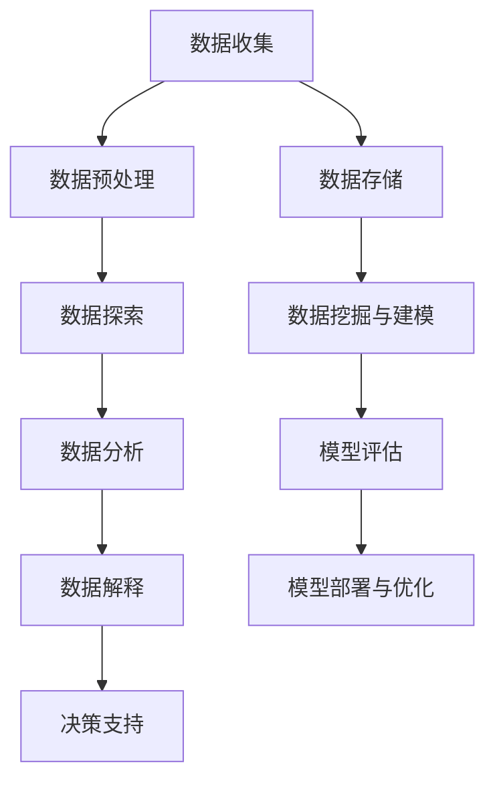

                 

## 平台经济概述

平台经济是一种基于数字技术和互联网的新型商业模式，通过提供一个开放、共享的平台，连接供需双方，实现资源的高效配置和价值的最大化。在这个生态系统中，平台作为中介，通过技术手段收集、处理和分析大量数据，从而实现精准的用户画像、优化运营策略、提升用户体验和实现商业价值的闭环。

### 1. 平台经济的基本概念

平台经济的基本概念主要包括以下几个方面：

- **平台**：平台是指为供需双方提供交易、沟通、协作的数字基础设施，可以是线上市场、社交网络、电商平台、金融服务平台等。

- **供需双方**：平台经济中的供需双方包括提供产品和服务的供应商和寻求产品和服务的需求者。

- **中介服务**：平台通过提供中介服务，如信息匹配、支付结算、物流配送等，实现供需双方的交易。

- **数据**：平台经济中的核心资源是数据，通过收集、处理和分析用户行为数据、交易数据等，平台可以实现精准的市场预测、用户画像和运营优化。

### 1.2 平台经济的核心要素

平台经济的核心要素包括以下几个方面：

- **技术**：平台经济离不开互联网、云计算、大数据、人工智能等先进技术的支持，这些技术为平台的运营和管理提供了强大的工具。

- **用户**：用户是平台经济的基础，平台的成功与否取决于用户数量和用户满意度。

- **数据**：平台经济中的数据包括用户行为数据、交易数据、市场数据等，这些数据是平台进行决策和运营优化的基础。

- **服务**：平台通过提供高质量的服务，如便捷的支付、快速的物流、良好的客户体验等，来吸引用户和商家。

### 2. 平台经济的演进与现状

平台经济起源于20世纪90年代，随着互联网技术的普及，逐渐发展壮大。其演进过程可以分为以下几个阶段：

- **萌芽阶段（1990s）**：互联网的兴起带动了线上交易平台的出现，如亚马逊、eBay等。

- **发展阶段（2000s）**：移动互联网的普及，使得平台经济得以迅速发展，如滴滴、美团等。

- **成熟阶段（2010s至今）**：平台经济逐渐成为主流商业模式，涵盖了生活服务、电子商务、金融科技等多个领域。

当前，平台经济已经成为全球经济增长的重要引擎，其现状和趋势如下：

- **市场规模不断扩大**：全球平台经济市场规模持续增长，预计未来几年仍将保持高速增长。

- **跨界融合趋势明显**：不同领域的平台企业通过合作、并购等方式，实现跨界发展和资源整合。

- **技术创新推动发展**：大数据、人工智能、区块链等新兴技术的应用，为平台经济注入新的动力。

### 3. 平台经济的价值与挑战

平台经济具有以下几个方面的价值：

- **提升效率**：通过平台，供需双方可以更快速、更便捷地完成交易，降低了交易成本。

- **创造价值**：平台通过数据分析和运营优化，提升用户满意度和商家收益，实现商业价值的最大化。

- **促进创新**：平台为企业提供了创新的商业模式和生态系统，激发了市场活力。

然而，平台经济也面临着一些挑战：

- **数据隐私和安全**：平台收集和处理大量用户数据，如何保护用户隐私和数据安全是一个重要问题。

- **垄断风险**：平台企业的市场集中度较高，可能引发垄断问题，损害消费者权益。

- **监管政策**：随着平台经济的快速发展，各国政府和监管机构开始加强对平台经济的监管，以维护市场秩序。

在接下来的章节中，我们将深入探讨数据分析在平台经济中的应用，包括用户行为分析、运营优化、风险控制等，以及如何深入研究数据应用的方法和策略。

---

在平台经济的背景下，数据分析成为优化运营、提升用户体验和实现商业价值的关键。数据分析不仅涉及数据收集、处理和存储，还包括对数据的深入分析和挖掘，以发现隐藏在数据背后的价值。本文将围绕数据分析在平台经济中的应用进行深入研究，探讨如何通过数据分析实现平台经济的可持续发展。

**关键词**：平台经济、数据分析、用户行为分析、运营优化、风险控制、数据挖掘、机器学习、数据可视化。

**摘要**：本文首先概述了平台经济的基本概念和核心要素，分析了平台经济的演进与现状，以及其价值与挑战。接着，本文介绍了数据分析的基础知识，包括基本概念、目标与流程、分析方法与技术。然后，本文重点探讨了数据分析在平台用户行为分析、运营优化、风险控制和创新与战略规划中的应用。最后，本文提出了深入研究数据应用的策略与方法，并通过实战案例进行了详细解析。文章旨在为平台经济中的数据分析提供理论和实践指导，推动平台经济的可持续发展。

---

### 第一部分：平台经济概述

平台经济是一种新型的商业模式，通过构建一个数字化的中介平台，将供需双方连接起来，实现资源的高效配置和价值最大化。在平台经济中，平台作为核心要素，不仅提供了交易、沟通和协作的场所，还通过数据分析和智能化管理，提升了整个生态系统的运行效率和商业价值。

#### 1. 平台经济的基本概念

平台经济的基本概念可以从以下几个方面进行阐述：

- **平台定义**：平台是一个开放、共享的数字基础设施，它连接了供需双方，提供了交易、沟通和协作的环境。平台可以是线上的，如电商平台、社交平台、金融服务平台等，也可以是线下的，如商场、超市、工厂等。

- **供需双方**：平台经济中的供需双方分别是提供产品和服务的供应商，以及寻求产品和服务的需求者。供应商可以是个人、企业、机构等，需求者同样可以是个人、企业或机构。

- **中介服务**：平台通过提供中介服务，如信息匹配、支付结算、物流配送等，降低了供需双方的交易成本，提高了交易效率。

- **数据**：在平台经济中，数据是核心资源。平台通过收集、处理和分析用户行为数据、交易数据等，可以实现对市场的深入洞察，优化运营策略，提升用户体验和实现商业价值。

#### 1.2 平台经济的核心要素

平台经济的核心要素包括以下几个方面：

- **技术**：平台经济依赖于互联网、云计算、大数据、人工智能等先进技术，这些技术为平台的构建、运营和管理提供了强有力的支持。

- **用户**：用户是平台经济的基础，平台通过提供优质的服务和体验，吸引并留住用户。

- **数据**：数据是平台经济的核心资源。平台通过收集、处理和分析用户数据，可以实现对市场的精准把握，优化运营策略。

- **服务**：平台通过提供多样化的中介服务，如支付结算、物流配送、客户服务等，提升了用户的交易体验。

#### 2. 平台经济的演进与现状

平台经济起源于20世纪90年代，随着互联网技术的普及，逐渐发展壮大。其演进过程可以分为以下几个阶段：

- **萌芽阶段（1990s）**：互联网的兴起带动了线上交易平台的出现，如亚马逊、eBay等。

- **发展阶段（2000s）**：移动互联网的普及，使得平台经济得以迅速发展，如滴滴、美团等。

- **成熟阶段（2010s至今）**：平台经济逐渐成为主流商业模式，涵盖了生活服务、电子商务、金融科技等多个领域。

当前，平台经济已经成为全球经济增长的重要引擎，其现状和趋势如下：

- **市场规模不断扩大**：全球平台经济市场规模持续增长，预计未来几年仍将保持高速增长。

- **跨界融合趋势明显**：不同领域的平台企业通过合作、并购等方式，实现跨界发展和资源整合。

- **技术创新推动发展**：大数据、人工智能、区块链等新兴技术的应用，为平台经济注入新的动力。

#### 3. 平台经济的价值与挑战

平台经济具有以下几个方面的价值：

- **提升效率**：通过平台，供需双方可以更快速、更便捷地完成交易，降低了交易成本。

- **创造价值**：平台通过数据分析和运营优化，提升用户满意度和商家收益，实现商业价值的最大化。

- **促进创新**：平台为企业提供了创新的商业模式和生态系统，激发了市场活力。

然而，平台经济也面临着一些挑战：

- **数据隐私和安全**：平台收集和处理大量用户数据，如何保护用户隐私和数据安全是一个重要问题。

- **垄断风险**：平台企业的市场集中度较高，可能引发垄断问题，损害消费者权益。

- **监管政策**：随着平台经济的快速发展，各国政府和监管机构开始加强对平台经济的监管，以维护市场秩序。

在接下来的章节中，我们将深入探讨数据分析在平台经济中的应用，包括用户行为分析、运营优化、风险控制等，以及如何深入研究数据应用的方法和策略。

---

### 第二部分：数据分析基础

数据分析是平台经济中的关键环节，通过对大量数据的收集、处理和分析，可以发现隐藏在数据背后的价值，从而优化运营策略、提升用户体验和实现商业价值。本部分将介绍数据分析的基础知识，包括基本概念、目标与流程、常见的数据分析方法与技术。

#### 4. 数据分析的基本概念

数据分析是指利用统计学、计算机科学、数学等工具和方法，对大量数据进行收集、处理、分析和解释的过程。数据分析的目标是从数据中提取有价值的信息和知识，帮助决策者做出更明智的决策。

- **数据**：数据是数据分析的基础，包括结构化数据、半结构化数据和非结构化数据。结构化数据通常以表格形式存储，如数据库中的数据；半结构化数据如日志文件、XML文件等；非结构化数据如文本、图片、音频和视频等。

- **数据分析**：数据分析是指利用统计学、机器学习、数据挖掘等方法，对数据进行处理、分析和解释的过程。数据分析可以揭示数据中的模式、趋势和关联，帮助决策者做出更准确的预测和决策。

- **数据分析的目标**：数据分析的目标包括：

  - **发现数据中的规律和趋势**：通过统计分析，发现数据中的隐藏规律和趋势，为决策提供依据。

  - **挖掘数据中的价值**：通过数据挖掘，发现数据中的潜在价值，为企业创造商业机会。

  - **优化运营策略**：通过数据分析，优化企业的运营策略，提高运营效率和盈利能力。

  - **提升用户体验**：通过数据分析，了解用户需求和行为，提供更个性化的服务和体验。

#### 4.2 数据分析的目标与流程

数据分析的目标是从海量数据中提取有价值的信息，为决策提供支持。数据分析的基本流程包括以下几个步骤：

1. **数据收集**：收集与目标相关的数据，包括内部数据和外部数据。内部数据来自企业内部系统，如CRM系统、ERP系统等；外部数据来自公共数据库、第三方数据提供商等。

2. **数据预处理**：对收集到的数据进行清洗、转换和整合，确保数据的质量和一致性。数据预处理包括：

   - **数据清洗**：处理数据中的缺失值、异常值、重复值等。

   - **数据转换**：将不同格式、不同单位的数据进行统一处理。

   - **数据整合**：将多源数据进行整合，构建统一的数据仓库。

3. **数据探索**：对预处理后的数据进行初步探索和分析，了解数据的基本特征和分布情况。数据探索包括：

   - **数据描述性统计**：计算数据的均值、中位数、标准差等基本统计指标。

   - **数据可视化**：使用图表、地图等可视化工具，展示数据的基本特征。

4. **数据分析**：根据业务需求，选择适当的数据分析方法和技术，对数据进行深入分析和挖掘。数据分析包括：

   - **描述性数据分析**：对数据进行描述性统计和可视化，了解数据的基本特征。

   - **相关性分析**：分析数据之间的相关性，发现数据之间的关联。

   - **回归分析**：建立回归模型，预测目标变量的变化趋势。

   - **聚类分析**：将数据分成不同的类别，发现数据的内在结构。

   - **分类分析**：建立分类模型，对数据进行分类。

   - **预测分析**：建立预测模型，预测未来的趋势。

5. **数据解释**：对分析结果进行解释和验证，确保分析结果的准确性和可靠性。数据解释包括：

   - **结果解释**：解释分析结果，阐述数据背后的含义。

   - **结果验证**：验证分析结果的准确性，确保分析结果的可靠性。

6. **决策支持**：基于数据分析结果，为决策者提供决策支持，优化业务策略和运营。

#### 5. 数据分析方法与技术

数据分析的方法和技术多种多样，以下是一些常见的方法和技术：

- **描述性数据分析**：通过对数据进行描述性统计和可视化，了解数据的基本特征和分布情况。

- **相关性分析**：分析数据之间的相关性，发现数据之间的关联。

- **回归分析**：建立回归模型，预测目标变量的变化趋势。

- **聚类分析**：将数据分成不同的类别，发现数据的内在结构。

- **分类分析**：建立分类模型，对数据进行分类。

- **预测分析**：建立预测模型，预测未来的趋势。

- **数据挖掘**：从大量数据中挖掘潜在的模式和规律，发现数据中的价值。

- **机器学习**：利用算法，从数据中学习规律和模式，用于分类、预测、聚类等任务。

- **深度学习**：基于神经网络，对数据进行深度学习和建模。

- **数据可视化**：使用图表、地图等可视化工具，展示数据的基本特征和分布情况。

- **交互分析**：通过交互式分析，深入了解数据背后的含义和规律。

在本部分的结尾，我们将介绍如何将数据分析应用于平台经济中的实际场景，包括用户行为分析、运营优化、风险控制和创新与战略规划。通过这些应用案例，我们将进一步展示数据分析在平台经济中的价值。

---

### 第三部分：平台经济中的数据分析应用

平台经济中的数据分析应用贯穿于整个生态系统的运营和管理，其核心在于通过数据分析和挖掘，提升用户体验、优化运营策略、降低风险和实现商业创新。以下将详细介绍数据分析在平台用户行为分析、运营优化、风险控制和创新与战略规划中的应用。

#### 6. 数据分析在平台用户行为分析中的应用

平台用户行为分析是数据分析在平台经济中的重要应用之一。通过对用户行为数据的分析，平台可以深入了解用户的需求和偏好，从而优化产品和服务。

- **用户画像**：通过分析用户的年龄、性别、地理位置、消费行为等数据，构建用户画像，为个性化推荐和精准营销提供基础。

- **用户行为分析**：分析用户的浏览、搜索、购买等行为，发现用户的兴趣点和需求，优化产品功能和用户体验。

- **用户留存率分析**：通过分析用户的活跃度、留存率等指标，识别用户流失的原因，采取相应的措施提高用户留存率。

实际案例：某电商平台通过分析用户行为数据，发现某些商品在特定时间段的销售量显著增加。基于此，平台推出了限时促销活动，提高了销售额和用户满意度。

#### 7. 数据分析在平台运营优化中的应用

平台运营优化是提升平台效率和竞争力的关键。通过数据分析，平台可以从多个维度进行优化，提高运营效率和用户体验。

- **流量分析**：分析平台流量的来源、用户行为路径等，优化推广策略和网站结构，提高用户转化率。

- **交易数据分析**：分析交易数据，了解用户购买习惯、商品销售趋势等，优化库存管理和供应链。

- **营销活动效果分析**：通过数据分析，评估不同营销活动的效果，优化营销策略，提高投资回报率。

实际案例：某金融服务平台通过分析用户交易数据，发现某些特定产品的购买转化率较低。基于此，平台调整了产品页面布局和推荐策略，提高了购买转化率。

#### 8. 数据分析在平台风险控制中的应用

平台风险控制是保障平台稳定运行和用户安全的重要环节。通过数据分析，平台可以及时发现潜在风险，采取措施降低风险。

- **风险识别**：通过分析用户行为数据、交易数据等，识别异常行为和潜在风险。

- **风险评估**：分析风险的影响程度和可能性，为风险管理和决策提供依据。

- **风险管理**：根据风险评估结果，采取相应的措施，如加强监控、制定应急预案等，降低风险。

实际案例：某支付平台通过分析用户交易数据，发现某些账户存在异常交易行为。平台立即采取了风险控制措施，如限制账户操作、提醒用户注意安全等，成功防范了潜在的欺诈风险。

#### 9. 数据分析在平台创新与战略规划中的应用

平台创新和战略规划是平台持续发展的重要动力。通过数据分析，平台可以深入了解市场趋势、用户需求，从而制定有效的创新战略和业务规划。

- **市场趋势预测**：通过分析市场数据、用户行为数据等，预测市场趋势和竞争格局，为产品创新和业务扩展提供依据。

- **竞争对手分析**：分析竞争对手的市场策略、产品特点等，了解市场动态，制定有针对性的竞争策略。

- **业务模式创新**：通过数据分析，发现市场需求和痛点，推动业务模式创新，提高市场竞争力。

实际案例：某电商平台通过分析用户行为数据和市场需求，发现某些细分市场存在较大潜力。基于此，平台推出了定制化商品和服务，取得了显著的市场反响。

总之，数据分析在平台经济中的应用具有广泛的实践意义。通过深入分析和挖掘数据，平台可以优化用户行为分析、运营策略、风险控制和创新与战略规划，实现可持续发展。在接下来的部分，我们将进一步探讨如何深入研究数据应用，以应对平台经济中的复杂挑战。

---

### 第四部分：深入研究数据应用

在平台经济中，数据分析不仅是一个工具，更是一个战略性资源，其深度和广度的应用直接决定了平台的竞争力和可持续发展能力。本部分将讨论如何通过策略和方法深入挖掘数据价值，从而为平台经济带来新的增长点。

#### 10. 数据应用深入研究的策略与方法

为了深入挖掘数据应用，平台企业可以采取以下策略和方法：

##### 10.1 数据挖掘方法

数据挖掘是从大量数据中发现隐藏模式和规律的过程。以下是几种常见的数据挖掘方法：

- **关联规则挖掘**：通过分析数据中的关联关系，发现物品之间的潜在关联，如“买A就买B”的购物习惯。

  **伪代码**：
  ```plaintext
  Apriori算法：
  1. 设定最小支持度和最小置信度阈值。
  2. 计算每个项集的支持度。
  3. 生成频繁项集。
  4. 对频繁项集生成关联规则。
  ```

- **聚类分析**：将相似的数据归为一类，以发现数据中的自然分组。

  **伪代码**：
  ```plaintext
  K-means算法：
  1. 初始化K个中心点。
  2. 将每个数据点分配到最近的中心点。
  3. 更新中心点的位置。
  4. 重复步骤2和3，直至中心点位置不再改变。
  ```

- **分类与回归分析**：通过建立模型，对数据进行分类或回归预测。

  **伪代码**：
  ```plaintext
  决策树算法：
  1. 选择最佳分割标准。
  2. 创建树节点，将数据分割为子集。
  3. 对子集递归调用算法，直至满足停止条件。
  ```

##### 10.2 机器学习算法在数据应用中的深化

机器学习算法在数据应用中发挥着重要作用，可以通过训练模型来发现复杂的数据模式。以下是几种常用的机器学习算法：

- **监督学习**：利用标注数据进行训练，预测新的数据。

  - **线性回归**：
    $$ Y = \beta_0 + \beta_1X_1 + ... + \beta_nX_n + \epsilon $$
    
  - **逻辑回归**：
    $$ P(Y=1) = \frac{1}{1 + e^{-(\beta_0 + \beta_1X_1 + ... + \beta_nX_n)}} $$
    
  - **决策树**：
    ```plaintext
    决策树算法：
    1. 选择最佳分割标准。
    2. 创建树节点，将数据分割为子集。
    3. 对子集递归调用算法，直至满足停止条件。
    ```

- **无监督学习**：不使用标注数据进行训练，发现数据的结构。

  - **K-means聚类**：
    ```plaintext
    K-means算法：
    1. 初始化K个中心点。
    2. 将每个数据点分配到最近的中心点。
    3. 更新中心点的位置。
    4. 重复步骤2和3，直至中心点位置不再改变。
    ```

  - **主成分分析（PCA）**：
    ```plaintext
    PCA算法：
    1. 计算数据协方差矩阵。
    2. 计算协方差矩阵的特征值和特征向量。
    3. 选择最大的K个特征向量。
    4. 用这K个特征向量对数据进行投影。
    ```

##### 10.3 数据可视化与交互分析

数据可视化是将数据以图形化的方式展示，使其更容易理解和分析。交互分析则允许用户与数据进行互动，深入探索数据背后的含义。

- **常见的数据可视化工具**：Matplotlib、Seaborn、Plotly等。

  ```python
  import matplotlib.pyplot as plt
  import seaborn as sns
  
  # 数据可视化示例
  sns.scatterplot(x='age', y='income', data=user_data)
  plt.xlabel('年龄')
  plt.ylabel('收入')
  plt.show()
  ```

- **交互式分析**：通过交互式界面，用户可以动态地探索数据，如Tableau、Power BI等。

#### 11. 实战案例：数据应用在平台经济中的成功案例解析

以下是一些平台经济中的成功案例，展示了如何通过深入的数据分析实现业务增长和用户满意度提升。

##### 11.1 案例一：电商平台用户行为分析

某电商平台通过用户行为分析，发现用户在浏览商品时的停留时间与购买概率密切相关。平台基于此推出了个性化推荐系统，根据用户的浏览和购买历史，推荐相关的商品，从而提高了用户的购买转化率和满意度。

##### 11.2 案例二：金融平台风险评估

某金融平台通过机器学习算法对用户交易数据进行分析，建立了风险评估模型。该模型能够识别潜在的欺诈交易，帮助平台有效降低风险，提高交易的安全性。

##### 11.3 案例三：医疗平台数据分析

某医疗平台通过数据分析，优化了预约流程和医疗资源的分配。平台根据患者的历史就诊记录和实时需求，智能调整医生排班和医疗资源，提高了患者的就诊体验和满意度。

通过上述实战案例，我们可以看到，深入的数据分析不仅能够提升平台的运营效率，还能够创造新的商业机会，为平台的可持续发展提供强大的动力。

#### 12. 未来展望：数据应用在平台经济中的发展趋势

随着技术的不断进步和数据的爆炸式增长，数据应用在平台经济中的地位和影响力将进一步提升。以下是未来数据应用在平台经济中可能的发展趋势：

- **大数据与云计算的结合**：大数据与云计算的结合将使得海量数据的存储、处理和分析更加高效，为平台经济提供更强大的数据处理能力。

- **人工智能与机器学习的深入应用**：人工智能和机器学习技术的不断发展，将使得数据分析更加智能化，能够自动识别复杂的模式和趋势，为平台经济提供更加精准的决策支持。

- **隐私保护与数据安全**：随着数据隐私和安全问题日益突出，平台将需要采用更加严格的数据保护措施，确保用户数据的隐私和安全。

- **跨行业融合**：不同行业的平台企业将通过数据共享和跨界合作，实现资源的整合和优化，推动平台经济的跨界发展和创新。

- **数据治理与合规**：随着监管政策的不断完善，平台企业需要建立完善的数据治理体系，确保数据应用符合相关法律法规和标准，维护市场秩序。

在未来，数据应用将成为平台经济的核心驱动力，通过不断创新和应用，平台企业将能够更好地满足用户需求，实现商业价值和社会价值的双重提升。

---

### 第五部分：附录

#### 附录A：数据分析工具与资源推荐

在进行数据分析时，选择合适的工具和资源是至关重要的。以下是一些常用的数据分析工具和资源的推荐：

- **数据分析工具**：
  - **Python**：Python 是一种广泛使用的编程语言，尤其在数据分析领域有很高的知名度。它具有丰富的库和框架，如 Pandas、NumPy、Matplotlib、Seaborn、Scikit-learn 和 TensorFlow 等。
  - **R**：R 是一种专门为统计分析和图形表示设计的编程语言，特别适合复杂数据分析和统计建模。
  - **SQL**：SQL 是结构化查询语言，用于查询和操作关系型数据库，如 MySQL、PostgreSQL 和 Oracle。

- **数据挖掘与机器学习库**：
  - **Scikit-learn**：Scikit-learn 是一个开源的机器学习库，提供了广泛的监督学习和无监督学习算法。
  - **TensorFlow**：TensorFlow 是一个由 Google 开发的开源机器学习库，特别适合构建深度学习模型。
  - **PyTorch**：PyTorch 是由 Facebook 开发的开源机器学习库，具有灵活性和易于使用的特点。

- **数据可视化工具**：
  - **Matplotlib**：Matplotlib 是 Python 的一个绘图库，可以创建各种类型的图表。
  - **Seaborn**：Seaborn 是基于 Matplotlib 的数据可视化库，提供了更美观和复杂的图表。
  - **Plotly**：Plotly 是一个交互式图表库，支持多种类型的图表和交互功能。

- **学习资源与参考文献**：
  - **在线课程**：Coursera、edX、Udacity 等平台提供了许多关于数据分析、机器学习和数据可视化的在线课程。
  - **书籍**：《Python数据分析基础教程》、《深入浅出数据分析》、《数据科学入门：Python教程》等。
  - **论坛和社区**：Stack Overflow、GitHub、Kaggle 等，可以找到大量关于数据分析的讨论和资源。

#### 附录B：数据分析流程与模型搭建流程图

以下是数据分析流程和模型搭建的流程图，帮助读者理解数据分析的基本步骤和模型构建的过程。



- **数据收集**：收集相关的数据源，包括内部数据和外部数据。
- **数据预处理**：清洗、转换和整合数据，确保数据的质量和一致性。
- **数据探索**：对预处理后的数据进行分析，了解数据的基本特征和分布情况。
- **数据分析**：使用统计方法和机器学习算法，对数据进行深入分析和挖掘。
- **数据解释**：解释分析结果，阐述数据背后的含义。
- **决策支持**：基于分析结果，为决策者提供决策支持。
- **数据存储**：将数据存储在数据库或数据仓库中，以便后续分析和挖掘。
- **数据挖掘与建模**：从数据中挖掘潜在的模式和规律，建立预测模型或分类模型。
- **模型评估**：评估模型的性能，确保模型的准确性和可靠性。
- **模型部署与优化**：将模型部署到生产环境，并根据反馈进行优化。

#### 附录C：关键算法与数学公式解释

以下是对一些关键算法和数学公式的解释，帮助读者深入理解数据分析中的核心技术。

- **描述性数据分析公式**：
  - **均值**：
    $$ \bar{x} = \frac{1}{n}\sum_{i=1}^{n}x_i $$
  - **中位数**：
    $$ \text{median}(x_1, x_2, ..., x_n) $$
  - **标准差**：
    $$ \sigma = \sqrt{\frac{1}{n-1}\sum_{i=1}^{n}(x_i - \bar{x})^2} $$
  - **方差**：
    $$ \sigma^2 = \frac{1}{n-1}\sum_{i=1}^{n}(x_i - \bar{x})^2 $$

- **聚类分析算法伪代码**：
  ```plaintext
  K-means算法：
  1. 初始化K个中心点。
  2. 将每个数据点分配到最近的中心点。
  3. 更新中心点的位置。
  4. 重复步骤2和3，直至中心点位置不再改变。
  ```

- **回归分析数学模型**：
  - **线性回归**：
    $$ Y = \beta_0 + \beta_1X_1 + ... + \beta_nX_n + \epsilon $$
  - **逻辑回归**：
    $$ P(Y=1) = \frac{1}{1 + e^{-(\beta_0 + \beta_1X_1 + ... + \beta_nX_n)}} $$

#### 附录D：实战案例代码解读与分析

以下是一个用户画像分析的实战案例，包括开发环境搭建、源代码实现和代码解读与分析。

##### 1. 开发环境搭建

- **数据库**：MySQL
- **编程语言**：Python
- **数据分析库**：Pandas, NumPy, Scikit-learn, Matplotlib

##### 2. 源代码实现

```python
import pandas as pd
import numpy as np
from sklearn.model_selection import train_test_split
from sklearn.preprocessing import StandardScaler
from sklearn.ensemble import RandomForestClassifier
import matplotlib.pyplot as plt

# 加载数据集
data = pd.read_csv('user_data.csv')

# 数据预处理
X = data[['age', 'gender', 'consumption_frequency']]
y = data['average_shopping_amount']

# 数据标准化
scaler = StandardScaler()
X_scaled = scaler.fit_transform(X)

# 数据集划分
X_train, X_test, y_train, y_test = train_test_split(X_scaled, y, test_size=0.2, random_state=42)

# 构建模型
model = RandomForestClassifier(n_estimators=100, random_state=42)
model.fit(X_train, y_train)

# 模型评估
y_pred = model.predict(X_test)
accuracy = np.mean(y_pred == y_test)
print(f"模型准确率：{accuracy:.2f}")

# 可视化
plt.scatter(y_test, y_pred)
plt.xlabel('实际平均购物金额')
plt.ylabel('预测平均购物金额')
plt.plot([y.min(), y.max()], [y.min(), y.max()], 'k--')
plt.show()
```

##### 3. 代码解读与分析

- **数据加载**：使用 Pandas 读取用户数据集。
- **数据预处理**：提取特征列和目标变量，使用 StandardScaler 对特征进行标准化处理。
- **数据集划分**：将数据集划分为训练集和测试集，使用 train_test_split 函数。
- **模型构建**：使用 RandomForestClassifier 构建随机森林模型。
- **模型训练**：使用 fit 函数对模型进行训练。
- **模型评估**：使用 predict 函数对测试集进行预测，计算模型准确率。
- **可视化**：使用 Matplotlib 绘制散点图，展示实际购物金额与预测购物金额的关系。

通过这个实战案例，读者可以了解到如何使用 Python 进行用户画像分析，以及如何解读和分析代码。

---

在本文中，我们深入探讨了平台经济中的数据分析应用，从基本概念到具体方法，再到实战案例，全方位展现了数据分析在平台经济中的重要性。通过用户行为分析、运营优化、风险控制和创新与战略规划等应用，数据分析不仅帮助平台企业提升了运营效率，还创造了巨大的商业价值。

在未来，随着大数据和人工智能技术的不断发展，数据分析将在平台经济中扮演更加重要的角色。平台企业需要不断创新和优化数据分析方法，以应对不断变化的市场环境和用户需求。

**作者**：AI天才研究院/AI Genius Institute & 禅与计算机程序设计艺术 /Zen And The Art of Computer Programming

感谢您的阅读，希望本文能为您的数据分析实践提供有益的启示和帮助。在探索平台经济中的数据分析之路中，我们不断前行，共同迎接更加智能、高效的未来。

