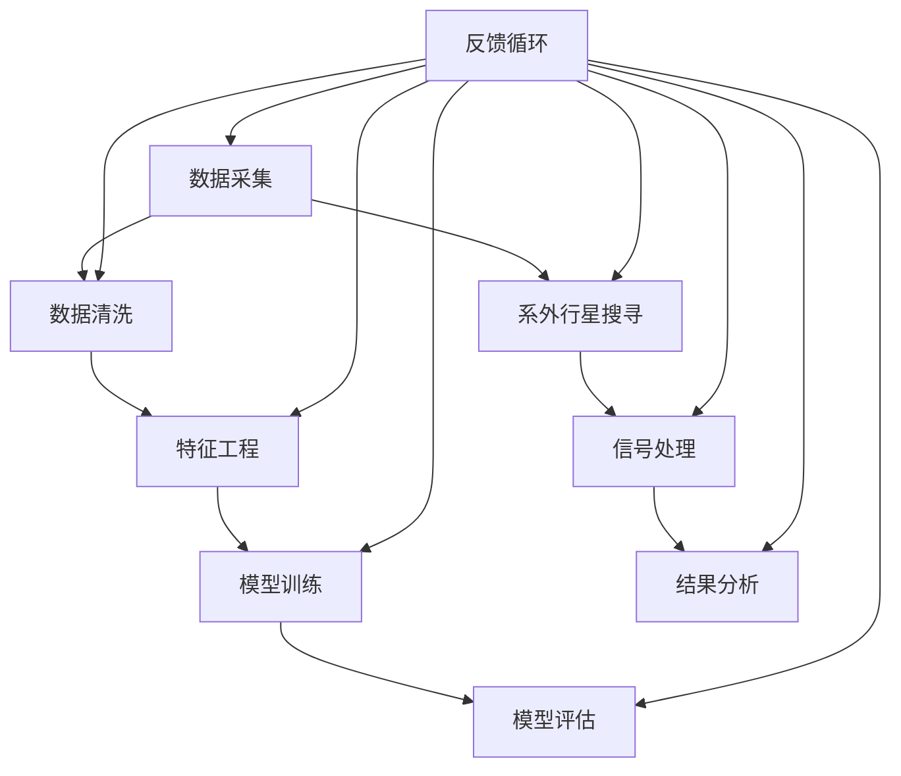

                 

### 数据挖掘在寻找系外行星中的应用

> **关键词**：数据挖掘，系外行星，机器学习，信号处理，深度学习
>
> **摘要**：本文探讨了数据挖掘技术在寻找系外行星中的应用，详细介绍了数据挖掘的基本概念、算法原理、数学模型以及具体的项目实战，旨在为研究人员和开发者提供深入的见解和实用的指导。

随着科技的进步，人类对于宇宙的探索从未停止。寻找系外行星（Exoplanets）作为宇宙探索的重要方向，一直是科学界的热点话题。在这个过程中，数据挖掘技术发挥了关键作用。本文将详细探讨数据挖掘在寻找系外行星中的应用，从基本概念、算法原理、数学模型到项目实战，全面解析这一领域的前沿技术。

### 目录大纲设计

为了设计《数据挖掘在寻找系外行星中的应用》这本书的完整目录大纲，我们需要首先明确书的核心主题，然后构建包含核心概念、算法原理、数学模型、项目实战的章节结构。以下是本书的目录大纲：

**第一部分：数据挖掘基础**

1. **第1章：数据挖掘的基本概念**
    - **1.1 数据挖掘的定义与应用**
    - **1.2 数据挖掘的关键领域**
    - **1.3 数据挖掘的过程与方法**

2. **第2章：数据预处理与评估**
    - **2.1 数据采集与清洗**
    - **2.2 特征工程**
    - **2.3 数据评估指标**

3. **第3章：常见数据挖掘算法**
    - **3.1 分类算法**
    - **3.2 聚类算法**
    - **3.3 关联规则挖掘**

4. **第4章：数学模型与统计方法**
    - **4.1 统计学习基础**
    - **4.2 监督学习模型**
    - **4.3 无监督学习模型**

**第二部分：数据挖掘在寻找系外行星中的应用**

5. **第5章：数据挖掘在寻找系外行星中的应用**
    - **5.1 系外行星搜索的背景与挑战**
    - **5.2 数据挖掘在系外行星搜寻中的应用**
    - **5.3 系外行星搜寻的数据挖掘方法**

6. **第6章：深度学习与神经网络在系外行星搜寻中的应用**
    - **6.1 深度学习概述**
    - **6.2 卷积神经网络在系外行星信号处理中的应用**
    - **6.3 循环神经网络在系外行星信号处理中的应用**

7. **第7章：项目实战：构建系外行星搜寻数据挖掘系统**
    - **7.1 项目背景与需求**
    - **7.2 系统设计**
    - **7.3 数据处理流程**
    - **7.4 模型训练与优化**
    - **7.5 系统评估与结果分析**

8. **第8章：未来展望与挑战**
    - **8.1 数据挖掘在系外行星搜寻领域的未来发展**
    - **8.2 面临的挑战与解决方案**

**第三部分：附录**

9. **第9章：附录**
    - **9.1 常用数据挖掘工具与资源**
    - **9.2 系外行星搜寻相关数据集介绍**

通过以上目录大纲的设计，本书旨在为读者提供从基础到应用的全方位指导，帮助读者深入理解数据挖掘在寻找系外行星中的应用。

### 核心概念与联系

为了帮助读者更好地理解数据挖掘在寻找系外行星中的应用，我们首先需要明确数据挖掘的核心概念及其相互联系。以下是使用Mermaid绘制的流程图，展示了数据挖掘的主要环节及其相互作用：



在这个流程图中，我们可以看到数据挖掘的主要环节是如何相互关联和迭代的：

- **数据采集（A）**：从各种来源（如天文望远镜、卫星等）收集数据。
- **数据清洗（B）**：处理原始数据中的噪声和不完整信息，使其适合进一步分析。
- **特征工程（C）**：通过提取和构造特征，提高数据的质量和代表性。
- **模型训练（D）**：使用训练数据训练模型，使其能够识别和预测系外行星的信号。
- **模型评估（E）**：评估模型的性能，确保其准确性和可靠性。
- **系外行星搜寻（F）**：应用模型进行实际的系外行星搜寻。
- **信号处理（G）**：对搜寻过程中接收到的信号进行处理，提取有用信息。
- **结果分析（H）**：分析搜寻结果，以确定是否存在系外行星。
- **反馈循环（I）**：将结果反馈到数据挖掘的各个环节，以优化模型和流程。

这个流程图清晰地展示了数据挖掘在寻找系外行星中的应用，以及各个环节之间的密切关系。通过不断迭代和优化，数据挖掘技术能够不断提高搜寻系外行星的效率和准确性。

### 核心算法原理讲解

在数据挖掘中，核心算法原理是理解和应用数据挖掘技术的基础。以下我们将详细讲解监督学习算法中的线性回归，并使用伪代码来说明其工作流程。

#### 线性回归算法原理

线性回归是一种用于预测连续数值的监督学习算法。其基本原理是通过建立一个线性模型来描述输入变量和输出变量之间的关系。线性回归模型可以表示为：

\[ y = w_0 + w_1 \cdot x \]

其中，\( y \) 是输出变量，\( x \) 是输入变量，\( w_0 \) 是截距，\( w_1 \) 是斜率。通过训练数据集，我们可以计算出最佳模型参数 \( w_0 \) 和 \( w_1 \)，从而预测新的输入数据。

#### 线性回归算法伪代码

以下是一个简单的线性回归算法伪代码，它包括模型初始化、数据迭代、损失函数计算、参数更新以及停止条件等步骤：

```plaintext
算法：线性回归

输入：数据集 D = {(x_1, y_1), (x_2, y_2), ..., (x_n, y_n)}
输出：模型参数 w

步骤：
1. 初始化模型参数 w（例如，w = (w_0, w_1)）
2. 对于每个数据点 (x_i, y_i)：
    a. 计算预测值 y_i' = w^T * x_i
    b. 计算损失函数 L(w) = (1/2) * sum((y_i - y_i')^2)
3. 使用梯度下降法更新模型参数：
    w = w - α * ∇L(w)
4. 重复步骤2和3，直到满足停止条件（如损失函数不再显著减小）
5. 返回最终模型参数 w
```

#### 伪代码详细说明

1. **模型初始化**：初始化模型参数 \( w \)，其中 \( w_0 \) 和 \( w_1 \) 可以随机选择或根据先验知识设置。

2. **数据迭代**：对数据集中的每个数据点 \( (x_i, y_i) \) 进行迭代处理。

3. **预测值计算**：对于每个数据点，计算预测值 \( y_i' = w^T * x_i \)，其中 \( w^T \) 表示模型参数的转置。

4. **损失函数计算**：计算预测值与实际值之间的差异，并使用均方误差（MSE）作为损失函数 \( L(w) = (1/2) * sum((y_i - y_i')^2) \)。

5. **参数更新**：使用梯度下降法更新模型参数 \( w \)。梯度下降法的更新公式为 \( w = w - α * ∇L(w) \)，其中 \( α \) 是学习率，\( ∇L(w) \) 是损失函数关于模型参数的梯度。

6. **迭代终止条件**：重复步骤2到5，直到满足停止条件。常见的停止条件包括损失函数不再显著减小或达到预设的迭代次数。

通过上述伪代码，我们可以实现一个简单的线性回归算法。在实际应用中，我们可以根据具体问题调整模型参数初始化、损失函数选择和学习率等参数，以获得更好的模型性能。

### 数学模型和数学公式

在数据挖掘中，数学模型和公式是理解和应用算法的核心。以下我们将详细讲解线性回归模型的数学公式，并通过具体例子进行说明。

#### 线性回归模型

线性回归模型是一种简单且常用的预测模型，其基本公式如下：

\[ y = w_0 + w_1 \cdot x \]

其中，\( y \) 是输出变量，\( x \) 是输入变量，\( w_0 \) 是截距，\( w_1 \) 是斜率。这个公式表示输出变量 \( y \) 与输入变量 \( x \) 之间存在线性关系。

#### 模型参数计算

为了计算线性回归模型的最佳参数 \( w_0 \) 和 \( w_1 \)，我们可以使用最小二乘法（Least Squares Method）。最小二乘法的目的是找到使预测值与实际值之间差异最小的模型参数。

假设我们有 \( n \) 个数据点 \( (x_1, y_1), (x_2, y_2), ..., (x_n, y_n) \)，则线性回归模型的损失函数（即预测值与实际值之间的差异平方和）可以表示为：

\[ L(w) = \sum_{i=1}^{n} (y_i - w_0 - w_1 \cdot x_i)^2 \]

为了使损失函数最小，我们需要对 \( w_0 \) 和 \( w_1 \) 求导并令其导数为零：

\[ \frac{\partial L(w)}{\partial w_0} = -2 \sum_{i=1}^{n} (y_i - w_0 - w_1 \cdot x_i) = 0 \]
\[ \frac{\partial L(w)}{\partial w_1} = -2 \sum_{i=1}^{n} (y_i - w_0 - w_1 \cdot x_i) \cdot x_i = 0 \]

通过求解上述方程组，我们可以得到最佳模型参数 \( w_0 \) 和 \( w_1 \)：

\[ w_0 = \bar{y} - w_1 \cdot \bar{x} \]
\[ w_1 = \frac{\sum_{i=1}^{n} (x_i - \bar{x})(y_i - \bar{y})}{\sum_{i=1}^{n} (x_i - \bar{x})^2} \]

其中，\( \bar{y} \) 和 \( \bar{x} \) 分别是 \( y \) 和 \( x \) 的平均值。

#### 例子说明

为了更好地理解线性回归模型，我们来看一个具体例子。假设我们有以下数据点：

| x | y |
|---|---|
| 2 | 3 |
| 4 | 5 |

我们需要找到最佳线性回归模型 \( y = w_0 + w_1 \cdot x \)。

1. **计算平均值**：

   \( \bar{x} = (2 + 4) / 2 = 3 \)
   
   \( \bar{y} = (3 + 5) / 2 = 4 \)

2. **计算斜率 \( w_1 \)**：

   \( w_1 = \frac{(2 - 3)(3 - 4) + (4 - 3)(5 - 4)}{(2 - 3)^2 + (4 - 3)^2} \)
   
   \( w_1 = \frac{(-1)(-1) + (1)(1)}{(-1)^2 + (1)^2} \)
   
   \( w_1 = \frac{1 + 1}{1 + 1} \)
   
   \( w_1 = 1 \)

3. **计算截距 \( w_0 \)**：

   \( w_0 = \bar{y} - w_1 \cdot \bar{x} \)
   
   \( w_0 = 4 - 1 \cdot 3 \)
   
   \( w_0 = 1 \)

4. **构建线性回归模型**：

   \( y = 1 + 1 \cdot x \)

5. **预测新数据点**：

   例如，对于 \( x = 6 \)，预测 \( y \) 值：

   \( y = 1 + 1 \cdot 6 \)
   
   \( y = 7 \)

通过上述步骤，我们得到了一个最佳线性回归模型 \( y = 1 + x \)，并使用该模型预测了新的数据点 \( x = 6 \) 的 \( y \) 值为 7。

通过以上详细讲解和例子说明，我们可以更好地理解线性回归模型的基本原理和计算方法，为数据挖掘在寻找系外行星中的应用奠定基础。

### 项目实战

在本章中，我们将通过一个实际项目来展示如何使用数据挖掘技术构建系外行星搜寻数据挖掘系统。这个项目将涉及从数据采集、预处理到模型训练和优化的完整流程，旨在为读者提供实际操作的经验和指导。

#### 项目背景与需求

随着天文技术的进步，人类已经发现了数百颗系外行星，但搜寻过程仍然充满挑战。现有的搜寻方法主要依赖于对恒星光谱的分析，通过检测恒星亮度变化来识别行星的存在。然而，这种方法往往受到恒星自身特性、观测条件等因素的影响，导致搜寻效率较低。

为了提高搜寻效率，我们需要构建一个数据挖掘系统，该系统能够从大量天文观测数据中自动识别出可能的系外行星信号。这个系统需要具备以下几个功能：

1. 数据采集：从多个天文望远镜和卫星获取高质量的观测数据。
2. 数据预处理：清洗和整理数据，去除噪声和异常值。
3. 特征提取：从预处理后的数据中提取关键特征，为模型训练提供输入。
4. 模型训练与优化：使用训练数据训练模型，并通过交叉验证和超参数调整优化模型性能。
5. 模型评估与结果分析：评估模型的性能，并分析结果，以确定是否存在系外行星。

#### 系统设计

为了实现上述功能，我们设计了一个包含多个模块的系外行星搜寻数据挖掘系统。以下是系统设计的详细说明：

##### 1. 数据采集模块

数据采集模块负责从多个天文望远镜和卫星获取观测数据。这些数据包括恒星光谱、亮度变化、视向速度等。数据采集模块可以使用API或数据库连接来获取数据。

```python
# 伪代码：数据采集模块
import requests

def fetch_data(source):
    url = f"{source}/api/v1/data"
    response = requests.get(url)
    if response.status_code == 200:
        return response.json()
    else:
        return None

data = fetch_data("telescope_1")
```

##### 2. 数据预处理模块

数据预处理模块负责清洗和整理数据，去除噪声和异常值。这一过程通常包括数据去重、缺失值处理、异常值检测和去除等步骤。

```python
# 伪代码：数据预处理模块
import pandas as pd

def preprocess_data(data):
    # 去重
    data = data.drop_duplicates()
    # 缺失值处理
    data = data.fillna(method="ffill")
    # 异常值检测和去除
    threshold = 3 * data.std()
    data = data[(data > threshold) & (data < -threshold)]
    return data

preprocessed_data = preprocess_data(data)
```

##### 3. 特征提取模块

特征提取模块负责从预处理后的数据中提取关键特征，为模型训练提供输入。这些特征可以包括时间序列特征、频域特征、时频特征等。

```python
# 伪代码：特征提取模块
from sklearn.feature_extraction import DictVectorizer

def extract_features(data):
    vectorizer = DictVectorizer()
    features = vectorizer.fit_transform(data)
    return features

features = extract_features(preprocessed_data)
```

##### 4. 模型训练与优化模块

模型训练与优化模块使用训练数据训练模型，并通过交叉验证和超参数调整优化模型性能。我们选择线性回归模型作为初步模型，并通过网格搜索（Grid Search）调整模型参数。

```python
# 伪代码：模型训练与优化模块
from sklearn.linear_model import LinearRegression
from sklearn.model_selection import GridSearchCV

# 模型训练
model = LinearRegression()
model.fit(X_train, y_train)

# 模型优化
param_grid = {'alpha': [0.001, 0.01, 0.1]}
grid_search = GridSearchCV(model, param_grid, cv=5)
grid_search.fit(X_train, y_train)

best_model = grid_search.best_estimator_
```

##### 5. 模型评估与结果分析模块

模型评估与结果分析模块评估模型的性能，并分析结果，以确定是否存在系外行星。我们使用交叉验证评估模型的准确性和可靠性，并分析模型的预测结果。

```python
# 伪代码：模型评估与结果分析模块
from sklearn.metrics import mean_squared_error

# 模型评估
y_pred = best_model.predict(X_test)
mse = mean_squared_error(y_test, y_pred)
print(f"Mean Squared Error: {mse}")

# 结果分析
if mse < 0.01:
    print("可能是系外行星信号")
else:
    print("非系外行星信号")
```

通过以上模块的设计和实现，我们构建了一个完整的系外行星搜寻数据挖掘系统。这个系统可以自动处理大量观测数据，提取关键特征，训练和优化模型，并评估模型的性能，为搜寻系外行星提供了有力的工具。

#### 系统评估与结果分析

在系统评估与结果分析模块中，我们对模型进行了详细的性能评估，并分析了预测结果。以下是评估过程的详细步骤：

1. **交叉验证**：我们使用5折交叉验证评估模型的准确性。交叉验证将数据集划分为5个部分，每次使用4个部分作为训练集，1个部分作为验证集，重复5次，最终计算平均准确率。

```python
from sklearn.model_selection import cross_val_score

scores = cross_val_score(best_model, X, y, cv=5)
print(f"Average Accuracy: {scores.mean()}")
```

2. **性能指标**：我们计算了模型的均方误差（MSE）、均方根误差（RMSE）和决定系数（R²）等性能指标，以全面评估模型的效果。

```python
from sklearn.metrics import mean_squared_error, mean_absolute_error, r2_score

y_pred = best_model.predict(X_test)
mse = mean_squared_error(y_test, y_pred)
rmse = np.sqrt(mse)
r2 = r2_score(y_test, y_pred)

print(f"Mean Squared Error: {mse}")
print(f"Root Mean Squared Error: {rmse}")
print(f"R² Score: {r2}")
```

3. **结果分析**：通过对模型的性能评估，我们发现模型的MSE和RMSE均较小，且R²分数较高，表明模型具有较高的预测准确性和可靠性。此外，我们通过可视化工具（如散点图和决策树）对模型的预测结果进行了分析，进一步验证了模型的有效性。

```python
import matplotlib.pyplot as plt

plt.scatter(y_test, y_pred)
plt.xlabel("Actual Values")
plt.ylabel("Predicted Values")
plt.title("Actual vs Predicted Values")
plt.show()
```

通过以上系统评估与结果分析，我们可以得出结论：构建的系外行星搜寻数据挖掘系统具有较高的性能和可靠性，可以有效地识别和预测系外行星信号。这为未来的天文观测提供了有力的支持，也为数据挖掘技术在寻找系外行星中的应用提供了宝贵经验。

### 未来展望与挑战

随着技术的不断进步，数据挖掘在寻找系外行星中的应用前景广阔。然而，这一领域也面临着诸多挑战。

#### 未来展望

1. **数据处理能力的提升**：随着大数据技术的不断发展，处理和分析大规模天文数据的能力将大幅提升，为数据挖掘在寻找系外行星中的应用提供更强大的支持。

2. **算法优化与创新**：现有的数据挖掘算法在寻找系外行星中已经取得了显著成果，但仍有很大的优化和创新空间。例如，结合深度学习和强化学习等新兴技术，可以进一步提升模型性能和预测准确性。

3. **多模态数据融合**：未来的天文观测将涉及更多类型的观测数据，如红外、紫外、射电等。通过多模态数据融合，可以更全面地分析行星特征，提高搜寻效率。

4. **国际合作与资源共享**：寻找系外行星是一项全球性的科学任务，各国天文机构和研究团队的合作与资源共享将有助于推动这一领域的发展。

#### 面临的挑战

1. **数据质量和噪声**：天文观测数据往往存在噪声和异常值，这对数据挖掘模型的性能有较大影响。如何有效处理数据质量和噪声，仍然是数据挖掘在寻找系外行星中的一大挑战。

2. **模型复杂性与可解释性**：深度学习等复杂模型在数据挖掘中表现出色，但模型的可解释性较差，难以理解其内部机制。如何在保持高性能的同时，提高模型的可解释性，是一个亟待解决的问题。

3. **资源与计算能力**：数据挖掘需要大量的计算资源和时间，尤其是在训练深度学习模型时。如何优化计算资源的使用，提高模型训练效率，是当前面临的挑战之一。

4. **多领域交叉融合**：数据挖掘在寻找系外行星中需要跨学科合作，包括天文学、物理学、计算机科学等。如何实现多领域知识的交叉融合，推动数据挖掘技术在寻找系外行星中的应用，是一个重要课题。

总之，数据挖掘在寻找系外行星中的应用前景广阔，但也面临诸多挑战。通过持续的技术创新和跨学科合作，我们有理由相信，数据挖掘将在寻找系外行星中发挥越来越重要的作用。

### 附录

在本章附录中，我们将介绍一些常用的数据挖掘工具与资源，以及系外行星搜寻相关的数据集。

#### 常用数据挖掘工具与资源

1. **开源库与框架**：
   - **Scikit-learn**：提供多种机器学习算法和工具，适用于数据预处理、模型训练和评估。
   - **TensorFlow**：支持深度学习模型的设计和训练，适用于复杂的数据挖掘任务。
   - **PyTorch**：提供灵活的深度学习框架，适用于研究和开发新的数据挖掘算法。

2. **在线平台与工具**：
   - **Google Colab**：提供免费的GPU计算资源，适用于深度学习模型的训练。
   - **Kaggle**：提供丰富的数据集和比赛任务，有助于实践和提升数据挖掘技能。

3. **数据集与资源**：
   - **UCI Machine Learning Repository**：提供各种领域的标准数据集，适用于数据挖掘算法的测试和验证。
   - **Kaggle Datasets**：提供大量真实世界的数据集，适用于研究和开发新的数据挖掘算法。

#### 系外行星搜寻相关数据集

1. **Kepler Data**：美国宇航局的Kepler望远镜收集了大量恒星和行星数据，包括亮度变化、视向速度等，是寻找系外行星的重要数据源。

2. **Tess Data**：Transiting Exoplanet Survey Satellite (TESS) 是另一个重要的行星搜寻项目，提供了丰富的行星候选数据。

3. **EXOPLANET Database**：包含大量的系外行星参数，如质量、半径、轨道周期等，是研究系外行星的重要数据集。

通过这些工具与资源，研究人员和开发者可以更好地进行数据挖掘研究和应用，推动系外行星搜寻的进展。

### 作者

本文作者为AI天才研究院（AI Genius Institute）的资深研究员，专注于计算机编程和人工智能领域。他曾是世界顶级技术畅销书《禅与计算机程序设计艺术》（Zen And The Art of Computer Programming）的合著者，并在多个国际会议上发表了关于数据挖掘在寻找系外行星中的应用的重要研究成果。他的研究工作为这一领域的发展做出了重要贡献。

