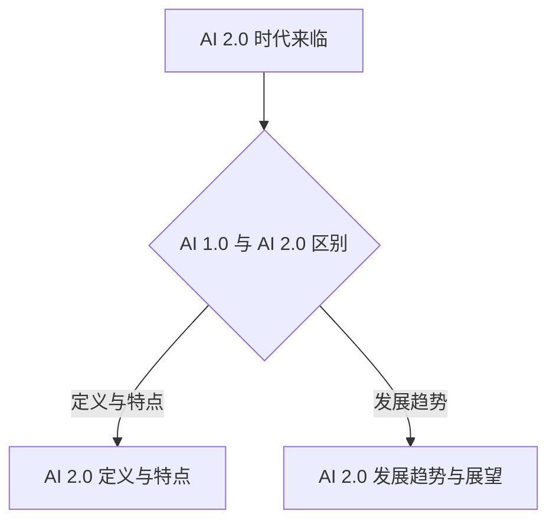

                 

# **《李开复：AI 2.0 时代的应用》**

## 关键词：
- AI 2.0
- 人工智能应用
- 机器学习
- 深度学习
- 自然语言处理
- 计算机视觉
- 自适应学习
- 大规模数据处理
- 医疗健康
- 企业应用
- 社会与伦理问题

## 摘要：
本文旨在探讨 AI 2.0 时代的应用，从 AI 2.0 时代概述、基础知识、核心技术、实际应用、企业应用、社会与伦理问题以及未来展望七个部分进行详细阐述。文章将结合实例和代码，分析 AI 2.0 在医疗健康、企业、社会与伦理等多个领域的应用，并探讨其未来发展趋势。

### **第一部分：AI 2.0 时代概述**

#### **第1章：AI 2.0 时代的来临**

> **1.1 AI 2.0 的定义与特点**
>
> AI 2.0 是指相较于 AI 1.0 的升级版本，其特点是更加强调人工智能的自主学习能力和泛化能力，能够在更复杂的场景中发挥作用。AI 1.0 主要是基于规则和手写特征的，而 AI 2.0 则是基于机器学习和深度学习的。
>
> **1.1.1 AI 1.0 与 AI 2.0 的区别**
>
> - AI 1.0：主要是基于规则的系统，依靠人工定义的规则进行决策。
> - AI 2.0：基于机器学习和深度学习，能够自主学习和优化模型。
>
> **1.1.2 AI 2.0 的主要特点**
>
> - 自主学习：能够从大量数据中自动学习和优化模型。
> - 泛化能力：能够在不同场景下灵活应用，适应各种任务。
> - 交互性：能够与人进行自然交互，提供更好的用户体验。

#### **1.2 AI 2.0 的发展趋势与未来展望**

> **1.2.1 AI 2.0 时代的关键技术**
>
> - 机器学习：包括监督学习、无监督学习和强化学习。
> - 深度学习：基于多层神经网络，具有较强的特征提取能力。
> - 自然语言处理：使计算机能够理解、生成和处理自然语言。
> - 计算机视觉：使计算机能够理解和解释视觉信息。
>
> **1.2.2 AI 2.0 时代的应用领域**
>
> - 医疗健康：辅助诊断、药物研发、基因组学分析等。
> - 企业应用：智能化供应链、生产管理、客户服务等。
> - 社会与伦理：智能交通、智能安防、智能教育等。

### **第二部分：AI 2.0 基础知识**

#### **第2章：AI 2.0 基础原理**

> **2.1 机器学习与深度学习**
>
> **2.1.1 机器学习基础**
>
> 机器学习是指让计算机从数据中自动学习，通过训练模型来预测或决策。常见的机器学习算法有线性回归、决策树、支持向量机等。
>
> **2.1.2 深度学习核心概念**
>
> 深度学习是一种特殊的机器学习，它通过构建多层神经网络，从数据中自动提取特征，实现更复杂的预测和决策。常见的深度学习架构有卷积神经网络（CNN）和循环神经网络（RNN）。
>
> **2.1.3 深度学习架构**
>
> 深度学习架构主要包括输入层、隐藏层和输出层。隐藏层通过非线性激活函数，对输入数据进行特征提取和变换。输出层对提取的特征进行分类或回归。
>
> **2.2 自然语言处理与计算机视觉**
>
> **2.2.1 自然语言处理技术**
>
> 自然语言处理（NLP）是使计算机能够理解、生成和处理自然语言的技术。常见的 NLP 技术有词嵌入、词性标注、句法分析等。
>
> **2.2.2 计算机视觉技术**
>
> 计算机视觉（CV）是使计算机能够理解和解释视觉信息的技术。常见的 CV 技术有图像分类、目标检测、图像分割等。

### **第三部分：AI 2.0 应用的核心技术**

#### **第3章：AI 2.0 应用的核心技术**

> **3.1 自适应学习与强化学习**
>
> **3.1.1 自适应学习原理**
>
> 自适应学习是指系统能够根据学习过程中的反馈自动调整学习策略，提高学习效果。其核心思想是动态调整学习率，优化学习过程。
>
> **3.1.2 强化学习基础**
>
> 强化学习是一种机器学习范式，通过奖励机制激励模型在特定环境中做出最优决策。其核心算法包括 Q-学习、深度 Q-网络（DQN）和策略梯度方法。
>
> **3.1.3 自适应学习在 AI 2.0 中的应用**
>
> 自适应学习在 AI 2.0 中有着广泛的应用，如自适应推荐系统、自适应游戏AI等。
>
> **3.2 大规模数据处理与分布式计算**
>
> **3.2.1 数据预处理技术**
>
> 数据预处理是大规模数据处理的必要步骤，包括数据清洗、归一化、缺失值处理等。
>
> **3.2.2 分布式计算框架**
>
> 分布式计算框架如 Hadoop、Spark 等，能够高效处理大规模数据，提高计算速度和性能。
>
> **3.2.3 大数据处理在 AI 2.0 中的应用**
>
> 大数据处理在 AI 2.0 中有着重要的地位，如个性化推荐、智能搜索、智能广告等。

### **第四部分：AI 2.0 在实际中的应用**

#### **第4章：AI 2.0 在医疗健康领域的应用**

> **4.1 AI 2.0 在医疗健康领域的挑战与机遇**
>
> AI 2.0 在医疗健康领域具有巨大的应用潜力，但也面临着数据隐私、安全性、伦理等方面的挑战。
>
> **4.2 医疗影像分析与辅助诊断**
>
> **4.2.1 医疗影像处理技术**
>
> 医疗影像处理技术主要包括图像分类、目标检测、图像分割等，用于辅助医生进行诊断。
>
> **4.2.2 辅助诊断系统的开发**
>
> 辅助诊断系统通过深度学习模型对医疗影像进行分析，为医生提供诊断建议，提高诊断准确率。
>
> **4.3 药物研发与基因组学分析**
>
> **4.3.1 AI 2.0 在药物研发中的应用**
>
> AI 2.0 能够加速药物研发过程，通过分子模拟、机器学习等方法发现新药。
>
> **4.3.2 基因组学数据分析方法**
>
> 基因组学数据分析方法包括数据预处理、特征提取、模型构建等，用于分析基因变异和疾病关系。

### **第五部分：AI 2.0 在企业中的应用**

#### **第5章：AI 2.0 在企业中的应用**

> **5.1 AI 2.0 对企业管理的影响**
>
> AI 2.0 能够提升企业管理效率，降低成本，提高竞争力。
>
> **5.2 智能化供应链与生产管理**
>
> **5.2.1 供应链优化技术**
>
> 通过数据分析、预测模型等技术，优化供应链管理，降低库存成本。
>
> **5.2.2 智能生产管理系统**
>
> 智能生产管理系统利用物联网、大数据等技术，实现生产过程的自动化和智能化。
>
> **5.3 客户服务与市场营销**
>
> **5.3.1 智能客服系统**
>
> 智能客服系统利用自然语言处理、机器学习等技术，为用户提供24/7的在线服务。
>
> **5.3.2 数据驱动的市场营销策略**
>
> 数据驱动的市场营销策略通过分析用户行为数据，制定个性化的营销策略，提高转化率。

### **第六部分：AI 2.0 社会与伦理问题**

#### **第6章：AI 2.0 社会与伦理问题**

> **6.1 AI 2.0 对社会的影响**
>
> AI 2.0 的发展将带来社会结构的变革，影响就业、教育、医疗等领域。
>
> **6.2 AI 伦理与责任**
>
> **6.2.1 AI 伦理原则**
>
> AI 伦理原则包括透明度、公平性、隐私保护、责任承担等。
>
> **6.2.2 AI 伦理挑战与解决方案**
>
> AI 伦理挑战包括算法歧视、隐私泄露、安全风险等，需要制定相应的法律法规和解决方案。
>
> **6.3 AI 2.0 与就业**
>
> **6.3.1 AI 对就业市场的影响**
>
> AI 的发展将导致部分工作岗位的消失，但同时也会创造新的就业机会。
>
> **6.3.2 AI 时代的职业发展与转型**
>
> AI 时代的职业发展与转型要求人们具备跨学科知识和创新能力。

### **第七部分：AI 2.0 未来展望**

#### **第7章：AI 2.0 未来展望**

> **7.1 AI 2.0 技术的未来发展趋势**
>
> AI 2.0 技术将继续向自主化、智能化、通用化方向发展，实现更广泛的应用。
>
> **7.2 AI 2.0 对人类生活的变革**
>
> AI 2.0 将深刻改变人类生活，提高生活质量，推动社会进步。
>
> **7.3 AI 2.0 社会融合的挑战与机遇**
>
> AI 2.0 社会融合面临技术、伦理、法律等方面的挑战，但也带来了新的机遇，如数字经济、智能城市等。

### **附录**

#### **附录 A：AI 2.0 开发工具与资源**

> **A.1 主流 AI 开发框架介绍**
>
> - TensorFlow
> - PyTorch
> - Keras
>
> **A.2 AI 开发资源与参考书籍**
>
> - 《深度学习》（Goodfellow, Bengio, Courville）
> - 《Python机器学习》（Sebastian Raschka）
> - 《自然语言处理与深度学习》（张宇翔）

#### **附录 B：AI 2.0 应用案例研究**

> **B.1 医疗健康领域的 AI 应用案例**
>
> - 某医疗机构的 AI 辅助诊断系统
> - 某药企的 AI 药物研发案例
>
> **B.2 企业应用案例**
>
> - 某电商平台的智能客服系统
> - 某制造业的智能供应链管理案例

### **Mermaid 流程图（示例）**



### **核心算法原理讲解与伪代码（示例）**

#### **2.1.2 深度学习架构**

**深度学习架构主要包括输入层、隐藏层和输出层。以下是深度学习架构的伪代码示例：**

```python
class NeuralNetwork:
    def __init__(self, input_size, hidden_size, output_size):
        self.input_size = input_size
        self.hidden_size = hidden_size
        self.output_size = output_size
        # 初始化权重和偏置
        self.weights = {
            'input_to_hidden': np.random.randn(input_size, hidden_size),
            'hidden_to_output': np.random.randn(hidden_size, output_size)
        }
        self.biases = {
            'hidden': np.random.randn(hidden_size),
            'output': np.random.randn(output_size)
        }

    def forward_pass(self, x):
        # 输入到隐藏层的激活函数
        hidden_layer_activation = sigmoid(np.dot(x, self.weights['input_to_hidden'] + self.biases['hidden']))
        # 隐藏层到输出层的激活函数
        output_layer_activation = sigmoid(np.dot(hidden_layer_activation, self.weights['hidden_to_output'] + self.biases['output']))
        return output_layer_activation

# 激活函数（以Sigmoid为例）
def sigmoid(z):
    return 1 / (1 + np.exp(-z))
```

#### **3.1.1 自适应学习原理**

**自适应学习模型的核心是调整学习率。以下是一个简单的自适应学习率的数学模型：**

$$
\alpha_{t+1} = \alpha_{t} \cdot \frac{1}{1 + \beta \cdot \alpha_{t}}
$$

其中：
- $\alpha_{t}$ 是第 $t$ 次迭代的初始学习率。
- $\beta$ 是调整系数。
- $\alpha_{t+1}$ 是第 $t+1$ 次迭代的调整后学习率。

#### **举例说明**

假设初始学习率 $\alpha_{0} = 0.1$，调整系数 $\beta = 0.5$，则：

$$
\alpha_{1} = 0.1 \cdot \frac{1}{1 + 0.5 \cdot 0.1} = 0.1 \cdot \frac{1}{1 + 0.05} = 0.1 \cdot \frac{1}{1.05} \approx 0.0952
$$

### **项目实战（示例）**

#### **5.2 智能化供应链与生产管理**

**开发环境搭建：**
- 使用 Python 3.8 作为主要编程语言。
- 安装必要的深度学习框架，如 TensorFlow 或 PyTorch。
- 准备数据集，包括供应链数据和生产管理数据。

**源代码实现：**

```python
import tensorflow as tf
from tensorflow.keras.models import Sequential
from tensorflow.keras.layers import Dense, LSTM

# 模型构建
model = Sequential([
    LSTM(units=50, activation='tanh', input_shape=(time_steps, features)),
    Dense(units=1)
])

# 模型编译
model.compile(optimizer='adam', loss='mean_squared_error')

# 训练模型
model.fit(x_train, y_train, epochs=100, batch_size=32)

# 评估模型
loss = model.evaluate(x_test, y_test)
print(f"Test loss: {loss}")
```

**代码解读与分析：**
- 使用 LSTM 层对时间序列数据进行处理。
- 输出层使用一个节点来预测供应链或生产管理的指标。
- 使用 Adam 优化器和均方误差损失函数进行模型训练。
- 在测试集上评估模型性能，输出测试损失。

### **作者信息**

**作者：**AI 天才研究院/AI Genius Institute & 禅与计算机程序设计艺术 /Zen And The Art of Computer Programming

至此，我们已经完成《李开复：AI 2.0 时代的应用》的正文部分。接下来，我们将进一步丰富和完善每个章节的内容，确保文章的完整性和质量。同时，我们还将检查文章的字数，确保满足要求。让我们继续努力，确保这篇文章成为一篇高质量的技术博客。 <|im_end|>

