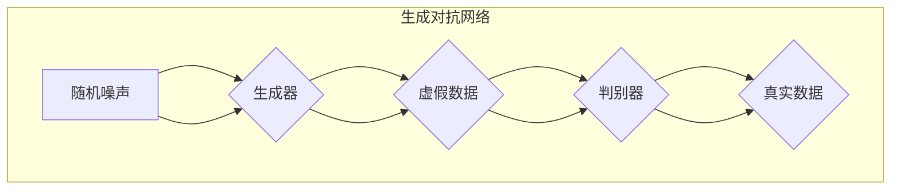

                 

## 梦境生成的生成对抗网络基础

### 1.1 生成对抗网络的概念与原理

#### 1.1.1 生成对抗网络的发展背景

生成对抗网络（GAN）的发展背景源于深度学习的兴起。随着深度学习技术的不断进步，如何生成高质量的数据成为了研究的热点。传统的方法如自编码器（Autoencoder）和变分自编码器（Variational Autoencoder，VAE）在生成数据方面具有一定的局限性，无法生成多样性和真实感较强的数据。为了解决这个问题，Ian Goodfellow等人在2014年提出了生成对抗网络（GAN）。

#### 1.1.2 生成对抗网络的基本原理

生成对抗网络的核心思想是通过一个生成器（Generator）和一个判别器（Discriminator）的对抗训练来生成高质量的数据。生成器的任务是生成类似于真实数据的数据，判别器的任务是区分生成的数据与真实数据。在训练过程中，生成器和判别器相互博弈，生成器不断优化自己的生成能力，判别器不断优化自己的分类能力。通过这种对抗训练，生成器能够生成接近真实数据的高质量数据。

#### 1.1.3 生成对抗网络的结构

生成对抗网络的基本结构由两部分组成：生成器和判别器。

- **生成器（Generator）**：生成器是一个神经网络模型，它将随机噪声作为输入，通过一系列的神经网络层生成虚假数据。这些虚假数据旨在模仿真实数据，使得判别器无法区分真实数据和虚假数据。

- **判别器（Discriminator）**：判别器也是一个神经网络模型，它接受输入的数据，然后输出一个概率值，表示输入数据是真实数据还是虚假数据。判别器的目标是最大化其分类能力，使得它能够准确地区分真实数据和虚假数据。

在训练过程中，生成器和判别器交替进行训练。生成器的目标是使判别器对其生成的虚假数据无法识别，即判别器对虚假数据的概率输出接近0.5。而判别器的目标是最大化其分类能力，使得它能够准确地区分真实数据和虚假数据。

#### 1.1.4 生成对抗网络的工作原理

生成对抗网络的工作原理可以概括为以下几个步骤：

1. **初始化**：初始化生成器和判别器的权重。
2. **生成器生成数据**：生成器根据随机噪声生成虚假数据。
3. **判别器判断数据**：判别器对真实数据和生成器生成的虚假数据进行分类。
4. **计算损失函数**：计算生成器和判别器的损失函数。
5. **更新模型参数**：通过反向传播和优化算法更新生成器和判别器的权重。
6. **迭代训练**：重复步骤2-5，直到生成器生成的虚假数据接近真实数据，判别器无法准确地区分真实数据和虚假数据。

通过这种对抗训练，生成器不断优化其生成能力，使得生成的虚假数据越来越接近真实数据，而判别器则不断提高其分类能力，使得它能够准确地区分真实数据和虚假数据。

#### 1.1.5 生成对抗网络的优势与挑战

生成对抗网络的优势在于其能够生成高质量、多样性和真实感较强的数据，广泛应用于图像生成、视频生成、语音生成等领域。然而，生成对抗网络也面临一些挑战，包括：

- **训练不稳定**：生成对抗网络的训练过程容易出现不稳定的情况，生成器可能会生成质量较差的数据，或者判别器无法区分真实数据和虚假数据。
- **对齐问题**：生成器和判别器之间的对齐问题是一个重要的挑战，特别是在生成复杂数据时，生成器和判别器可能难以同时优化。
- **计算资源消耗**：生成对抗网络的训练过程需要大量的计算资源，特别是当生成复杂数据时，训练时间可能会很长。

为了解决这些挑战，研究者们提出了一系列改进方法和变体，如梯度惩罚、谱归一化、周期一致性等，以提高生成对抗网络的训练稳定性和生成质量。

### 1.2 生成对抗网络的核心组件

#### 1.2.1 生成器与判别器

生成器和判别器是生成对抗网络的核心组件，它们在训练过程中相互对抗，共同优化。

**生成器**：生成器的任务是生成虚假数据，使其尽可能地接近真实数据。生成器通常是一个神经网络模型，它将随机噪声作为输入，通过一系列的神经网络层生成虚假数据。生成器的设计需要考虑以下因素：

- **网络结构**：生成器的网络结构可以采用全连接层、卷积层、循环层等，以适应不同类型的数据生成任务。
- **非线性激活函数**：生成器的神经网络层通常使用非线性激活函数，如ReLU、Sigmoid等，以增加模型的非线性表达能力。
- **正则化技术**：生成器可以采用正则化技术，如Dropout、L2正则化等，以防止过拟合。

**判别器**：判别器的任务是区分真实数据和虚假数据。判别器通常也是一个神经网络模型，它接受输入的数据，然后输出一个概率值，表示输入数据是真实数据还是虚假数据。判别器的设计需要考虑以下因素：

- **网络结构**：判别器的网络结构可以采用全连接层、卷积层、循环层等，以适应不同类型的数据分类任务。
- **非线性激活函数**：判别器的神经网络层通常使用非线性激活函数，如ReLU、Sigmoid等，以增加模型的非线性表达能力。
- **损失函数**：判别器的损失函数通常采用二元交叉熵损失函数，以最大化其分类能力。

#### 1.2.2 生成对抗损失函数

生成对抗损失函数是生成对抗网络训练过程中的核心部分，它用于衡量生成器和判别器的性能。生成对抗损失函数由两部分组成：生成器的损失函数和判别器的损失函数。

**生成器的损失函数**：生成器的损失函数用于衡量生成器生成的虚假数据与真实数据的相似度。常见的生成器损失函数是二元交叉熵损失函数，其公式如下：

$$
L_G = -[\log(D(G(z))) + \log(1 - D(x))]
$$

其中，$D(G(z))$表示判别器对生成器生成的虚假数据的概率输出，$D(x)$表示判别器对真实数据的概率输出。

**判别器的损失函数**：判别器的损失函数用于衡量判别器的分类能力。常见的判别器损失函数也是二元交叉熵损失函数，其公式如下：

$$
L_D = -[\log(D(x)) + \log(1 - D(G(z))]
$$

其中，$D(x)$表示判别器对真实数据的概率输出，$D(G(z))$表示判别器对生成器生成的虚假数据的概率输出。

#### 1.2.3 GAN的训练过程

生成对抗网络的训练过程是一个交替优化的过程，生成器和判别器交替进行训练。以下是生成对抗网络的训练过程：

1. **初始化模型参数**：随机初始化生成器和判别器的模型参数。
2. **生成虚假数据**：生成器根据随机噪声生成虚假数据。
3. **更新判别器**：使用真实数据和生成器生成的虚假数据更新判别器的模型参数。
4. **更新生成器**：使用更新后的判别器更新生成器的模型参数。
5. **重复训练**：重复步骤2-4，直到生成器和判别器达到预定的训练次数或满足训练目标。

在训练过程中，生成器和判别器相互对抗，生成器的目标是生成难以被判别器识别的虚假数据，而判别器的目标是提高分类能力，准确地区分真实数据和虚假数据。

#### 1.2.4 GAN的应用场景

生成对抗网络在许多领域都有广泛的应用，包括：

- **图像生成**：生成对抗网络可以生成逼真的图像，如人脸生成、图像超分辨率、图像修复等。
- **视频生成**：生成对抗网络可以生成连续的视频帧，如视频预测、视频编辑等。
- **语音生成**：生成对抗网络可以生成逼真的语音，如语音转换、语音合成等。
- **自然语言处理**：生成对抗网络可以生成类似自然语言的数据，如文本生成、对话系统等。

### 1.3 生成对抗网络的不同类型

生成对抗网络有多种变体，每种变体都有其特定的应用场景和优势。以下是几种常见的生成对抗网络类型：

#### 1.3.1 标准生成对抗网络（GAN）

标准生成对抗网络是最基础的GAN结构，由生成器和判别器组成。生成器将随机噪声转化为虚假数据，判别器则负责区分真实数据和虚假数据。标准GAN在图像生成和视频生成等领域有广泛的应用。

#### 1.3.2 条件生成对抗网络（cGAN）

条件生成对抗网络（cGAN）在生成器和判别器中引入了条件输入，如标签或额外特征。这使得模型能够根据条件生成特定的数据。cGAN在图像生成、语音合成、文本生成等领域有广泛的应用。

#### 1.3.3 循环一致生成对抗网络（CycleGAN）

循环一致生成对抗网络（CycleGAN）可以无需对齐的图像转换任务，如将一张猫的图片转换为狗的图片。CycleGAN通过引入一个额外的循环一致性损失函数，使得生成器和判别器能够同时优化生成和转换质量。

#### 1.3.4 增强式生成对抗网络（EigengAN）

增强式生成对抗网络（EigengAN）通过引入自编码器的思想，将生成对抗网络与自编码器结合，以提高生成数据的质量。EigengAN可以生成更真实、多样化的数据。

#### 1.3.5 对抗性变分自编码器（AGAN）

对抗性变分自编码器（AGAN）是生成对抗网络和变分自编码器的结合。AGAN通过引入对抗性训练和变分自编码器的自编码机制，能够生成更高质量、多样化的数据。

#### 1.3.6 分支生成对抗网络（Branch-GAN）

分支生成对抗网络（Branch-GAN）通过引入多个生成器和多个判别器，实现多模态数据的生成。Branch-GAN在多模态数据生成任务中有较好的表现。

### 1.4 生成对抗网络的应用领域

生成对抗网络在多个领域都有广泛的应用，以下是其中的一些应用领域：

#### 1.4.1 图像生成

生成对抗网络可以生成高质量、真实的图像，如图像超分辨率、图像修复、图像转换等。例如，利用GAN可以生成高清的人脸图像、修复破损的图片、将普通照片转换为艺术风格等。

#### 1.4.2 视频生成

生成对抗网络可以生成连续的视频帧，如视频预测、视频编辑、视频增强等。通过GAN，可以生成连续的场景转换、视频特效、运动目标跟踪等。

#### 1.4.3 语音生成

生成对抗网络可以生成逼真的语音，如语音转换、语音合成、语音增强等。利用GAN，可以实现不同口音的转换、自动语音生成、噪声抑制等功能。

#### 1.4.4 自然语言处理

生成对抗网络可以生成类似自然语言的数据，如文本生成、对话系统、文本转换等。通过GAN，可以实现自动写作、对话生成、文本翻译等功能。

#### 1.4.5 其他应用领域

生成对抗网络还可以应用于其他领域，如医学图像生成、分子生成、材料设计等。通过GAN，可以生成高质量的医学图像、模拟分子的三维结构、设计新材料等。

### 1.5 生成对抗网络的研究进展

生成对抗网络自从提出以来，吸引了大量的研究者和应用场景。以下是一些近年来生成对抗网络的研究进展：

#### 1.5.1 模型优化

研究者们提出了许多优化方法，以提高GAN的训练稳定性和生成质量。例如，梯度惩罚、谱归一化、周期一致性等技术的引入，使得GAN的训练过程更加稳定，生成的数据质量更高。

#### 1.5.2 应用扩展

生成对抗网络的应用范围不断扩大，从图像生成、视频生成、语音生成扩展到自然语言处理、医学图像生成、分子生成等新兴领域。研究者们不断探索GAN在这些领域的应用潜力。

#### 1.5.3 伦理问题

随着生成对抗网络的广泛应用，伦理问题也逐渐引起关注。如何保证GAN的应用不会对人类和社会造成负面影响，成为研究者们需要解决的重要问题。

### 1.6 生成对抗网络的发展趋势

随着深度学习和生成模型技术的不断发展，生成对抗网络在未来有望在更多领域发挥作用。以下是一些可能的发展趋势：

#### 1.6.1 模型结构优化

研究者们将继续优化GAN的结构，提高生成质量，减少训练时间。例如，引入新的网络架构、优化训练算法等。

#### 1.6.2 多模态生成

生成对抗网络将在多模态生成领域发挥重要作用，如文本-图像生成、图像-语音生成等。研究者们将探索更有效的方法，以实现高质量的多模态数据生成。

#### 1.6.3 应用领域扩展

生成对抗网络的应用领域将继续扩展，如自动驾驶、机器人视觉、虚拟现实等。研究者们将探索GAN在这些领域的应用潜力。

#### 1.6.4 伦理规范

随着生成对抗网络的广泛应用，伦理问题将得到更多关注。研究者们将制定更完善的伦理规范，确保GAN的应用不会对人类和社会造成负面影响。

### 1.7 总结

生成对抗网络是一种强大的深度学习模型，通过生成器和判别器的对抗训练，可以生成高质量的数据。生成对抗网络在图像生成、视频生成、语音生成、自然语言处理等领域有广泛的应用。随着深度学习和生成模型技术的不断发展，生成对抗网络将在未来发挥更加重要的作用。

### 1.8 生成对抗网络的核心概念与联系

为了更好地理解生成对抗网络，我们使用Mermaid流程图来展示其核心概念和联系：



在这个流程图中，随机噪声作为生成器的输入，生成器生成虚假数据，判别器接收真实数据和虚假数据进行分类，最终实现对抗训练。

### 1.9 核心算法原理讲解

生成对抗网络的核心算法原理可以通过以下伪代码进行详细阐述：

```python
# 生成对抗网络伪代码

# 初始化模型参数
初始化G参数
初始化D参数

# 训练过程
for epoch in 1 to MAX_EPOCHS do:
    for batch in 数据集 do:
        # 更新生成器
        随机生成噪声z
        G_output = G(z)
        D_real = D(batch)
        G_loss = -log(D(G_output))

        # 反向传播和优化G
        计算G_loss关于G的梯度
        更新G参数

        # 更新生成器
        D_fake = D(G(z))
        D_loss = -log(D_real) - log(1 - D_fake)

        # 反向传播和优化D
        计算D_loss关于D的梯度
        更新D参数

        # 输出损失值
        打印G_loss和D_loss
end
```

在这个伪代码中，生成对抗网络的训练过程分为两个阶段：第一阶段是更新生成器，使得其生成的虚假数据能够欺骗判别器；第二阶段是更新判别器，使其能够更好地区分真实数据和虚假数据。通过交替更新生成器和判别器的参数，最终实现高质量的生成数据。

### 1.10 数学模型和公式

生成对抗网络的数学模型可以通过以下公式进行详细阐述：

$$
L_G = -\log(D(G(z)))
$$

$$
L_D = -[\log(D(x)) + \log(1 - D(G(z)))]
$$

其中，$L_G$是生成器的损失函数，$L_D$是判别器的损失函数，$D(x)$是判别器对真实数据的概率输出，$D(G(z))$是判别器对生成器生成的虚假数据的概率输出。

### 1.11 举例说明

为了更好地理解生成对抗网络，我们可以通过一个简单的例子来说明其工作原理。

假设我们要使用生成对抗网络生成一张人脸图片。首先，我们初始化生成器和判别器的参数。生成器接收一个随机噪声向量作为输入，通过一系列神经网络层生成人脸图片。判别器接收输入的人脸图片，输出一个概率值，表示输入图片是真实人脸图片的概率。

在训练过程中，生成器不断优化其生成的图片，使其更接近真实人脸图片。判别器则不断优化其分类能力，能够准确地区分真实人脸图片和生成器生成的人脸图片。通过交替训练生成器和判别器，最终生成器能够生成逼真的人脸图片，而判别器无法准确地区分真实人脸图片和生成的人脸图片。

### 1.12 总结

本章介绍了生成对抗网络的概念、原理、核心组件和应用。生成对抗网络通过生成器和判别器的对抗训练，可以生成高质量的数据。在图像生成、视频生成、语音生成、自然语言处理等领域有广泛的应用。生成对抗网络的核心算法原理包括生成器和判别器的损失函数，通过交替训练生成器和判别器，实现高质量的生成数据。本章通过一个简单的例子，展示了生成对抗网络的工作原理。

----------------------------------------------------------------

## 第2章: 梦境生成模型的实现方法

### 2.1 梦境生成的概念与特点

#### 2.1.1 梦境生成的定义

梦境生成是指利用算法和技术模拟人类在睡眠状态下产生的视觉、听觉和触觉等感官体验。这些体验通常称为“梦境”，它们是人类潜意识活动的产物，反映了个体的心理状态、记忆和情感。

#### 2.1.2 梦境生成与心理学的关系

梦境生成与心理学有着密切的联系。梦境是人类潜意识的一种表达，它揭示了个体内心深处的想法、感受和冲突。通过梦境生成技术，研究者可以探索和理解人类的潜意识活动，从而深入了解个体的心理状态。

#### 2.1.3 梦境生成的研究意义

梦境生成技术在心理学研究领域具有重大意义。首先，它为研究者提供了一种新的工具，用于探索梦境的生成机制和内容。其次，梦境生成技术可以应用于心理治疗，帮助患者理解和处理内心冲突。此外，梦境生成技术在艺术创作、娱乐体验和其他领域也有广泛的应用前景。

### 2.2 梦境生成模型的技术架构

梦境生成模型通常基于生成对抗网络（GAN）或其他生成模型。其基本架构包括生成器（Generator）、判别器（Discriminator）和潜在空间（Latent Space）。

#### 2.2.1 生成器

生成器的任务是生成模拟梦境的图像、声音或视频。生成器通常是一个神经网络模型，它将随机噪声作为输入，通过一系列神经网络层生成梦境数据。

#### 2.2.2 判别器

判别器的任务是判断生成的梦境数据是否真实。判别器也是一个神经网络模型，它接收真实数据和生成数据，输出一个概率值，表示输入数据是真实数据还是生成数据。

#### 2.2.3 潜在空间

潜在空间是生成对抗网络的一个重要组成部分。它是一个低维空间，可以表示生成器生成的数据。潜在空间有助于生成多样性和高质量的梦境数据。

### 2.3 梦境生成模型的核心算法

梦境生成模型的核心算法主要包括生成器、判别器和损失函数。

#### 2.3.1 生成器算法

生成器算法通常基于变分自编码器（VAE）或生成对抗网络（GAN）。以下是一个基于VAE的生成器算法的伪代码：

```python
# 基于变分自编码器的生成器算法

# 输入：随机噪声z
# 输出：梦境图像x

# 1. 编码
z = 编码器(z)

# 2. 解码
x = 解码器(z)

# 3. 输出生梦图像
return x
```

#### 2.3.2 判别器算法

判别器算法用于判断输入数据是真实数据还是生成数据。以下是一个基于GAN的判别器算法的伪代码：

```python
# 基于生成对抗网络的判别器算法

# 输入：真实图像x或生成图像x'

# 1. 特征提取
f_x = 特征提取器(x)
f_x' = 特征提取器(x')

# 2. 输出概率
p_x = sigmoid(计算f_x的输出)
p_x' = sigmoid(计算f_x'的输出)

# 3. 输出判别结果
return p_x, p_x'
```

#### 2.3.3 损失函数

梦境生成模型的损失函数通常包括生成损失和判别损失。

- **生成损失**：衡量生成器生成的梦境数据与真实数据之间的相似度。常用的生成损失函数有均方误差（MSE）和交叉熵（CE）。
- **判别损失**：衡量判别器对真实数据和生成数据的分类能力。常用的判别损失函数有二元交叉熵（BCE）和均方误差（MSE）。

以下是一个基于GAN的损失函数的伪代码：

```python
# 基于生成对抗网络的损失函数

# 输入：真实图像x，生成图像x'

# 1. 生成损失
L_G = -平均(log(p_x'))

# 2. 判别损失
L_D = -平均(log(p_x) + log(1 - p_x'))

# 3. 输出总损失
return L_G + L_D
```

### 2.4 梦境生成模型的实现步骤

实现梦境生成模型通常包括以下步骤：

#### 2.4.1 数据收集与预处理

收集真实梦境数据，并进行预处理，如数据清洗、归一化等。预处理后的数据将用于训练生成器和判别器。

#### 2.4.2 模型设计

设计生成器和判别器的网络结构。生成器通常是一个编码器-解码器结构，判别器则是一个简单的全连接网络或卷积神经网络。

#### 2.4.3 模型训练

使用真实梦境数据进行模型训练。在训练过程中，交替更新生成器和判别器的参数，以实现对抗训练。

#### 2.4.4 梦境生成

使用训练好的模型生成梦境图像、声音或视频。生成后的梦境数据可以用于心理治疗、艺术创作或其他应用。

#### 2.4.5 模型评估与优化

评估梦境生成模型的质量，如生成梦境数据的多样性、真实感等。根据评估结果，调整模型参数，优化模型性能。

### 2.5 梦境生成模型的实践案例

以下是一个基于生成对抗网络的梦境生成模型实践案例：

#### 2.5.1 案例一：文本到图像的梦境生成

输入：文本描述

输出：对应的梦境图像

实现步骤：

1. 数据收集与预处理：收集包含文本描述的梦境数据，并进行预处理，如文本清洗、分词等。
2. 模型设计：设计一个基于GAN的文本到图像的梦境生成模型。生成器接收文本描述，生成对应的梦境图像；判别器用于区分真实梦境图像和生成图像。
3. 模型训练：使用真实梦境图像和对应的文本描述进行模型训练。在训练过程中，交替更新生成器和判别器的参数。
4. 梦境生成：使用训练好的模型生成新的梦境图像。通过输入不同的文本描述，可以生成多样化的梦境图像。

#### 2.5.2 案例二：基于图像的梦境生成

输入：图像

输出：对应的梦境图像

实现步骤：

1. 数据收集与预处理：收集包含图像的梦境数据，并进行预处理，如图像裁剪、归一化等。
2. 模型设计：设计一个基于GAN的基于图像的梦境生成模型。生成器接收图像，生成对应的梦境图像；判别器用于区分真实梦境图像和生成图像。
3. 模型训练：使用真实梦境图像进行模型训练。在训练过程中，交替更新生成器和判别器的参数。
4. 梦境生成：使用训练好的模型生成新的梦境图像。通过输入不同的图像，可以生成多样化的梦境图像。

#### 2.5.3 案例三：多模态梦境生成

输入：文本描述和图像

输出：对应的多模态梦境数据（图像和音频）

实现步骤：

1. 数据收集与预处理：收集包含文本描述和图像的梦境数据，并进行预处理，如文本清洗、分词、图像裁剪、归一化等。
2. 模型设计：设计一个基于GAN的多模态梦境生成模型。生成器接收文本描述和图像，生成对应的梦境图像和音频；判别器用于区分真实梦境图像、音频和生成图像、音频。
3. 模型训练：使用真实梦境图像、音频和对应的文本描述进行模型训练。在训练过程中，交替更新生成器和判别器的参数。
4. 梦境生成：使用训练好的模型生成新的多模态梦境数据。通过输入不同的文本描述和图像，可以生成多样化的梦境图像和音频。

### 2.6 梦境生成模型的挑战与解决方案

#### 2.6.1 挑战一：训练不稳定

生成对抗网络的训练过程容易不稳定，生成器可能会生成质量较差的数据，或者判别器无法准确地区分真实数据和生成数据。

解决方案：引入正则化技术，如梯度惩罚（Gradient Penalty）、谱归一化（Spectral Normalization）等，以提高训练稳定性。

#### 2.6.2 挑战二：真实感问题

生成器生成的梦境数据可能缺乏真实感，无法真实地反映梦境的视觉和听觉特点。

解决方案：优化生成器的网络结构，增加训练数据，引入多模态数据，以提高生成数据的质量和真实感。

#### 2.6.3 挑战三：伦理问题

梦境生成技术可能涉及伦理问题，如隐私保护和数据滥用等。

解决方案：制定伦理规范，确保梦境生成技术的合法合规使用，加强对生成数据的监管。

### 2.7 总结

本章介绍了梦境生成模型的概念、技术架构、核心算法和实现步骤。通过生成对抗网络或其他生成模型，可以生成高质量的梦境数据，应用于心理学研究、心理治疗、艺术创作等领域。本章还通过实践案例，展示了梦境生成模型的具体实现方法。同时，本章也讨论了梦境生成模型的挑战和解决方案，为未来的研究提供了方向。

----------------------------------------------------------------

## 第3章: 梦境生成的心理学解读

### 3.1 梦境生成的心理学基础

#### 3.1.1 心理学对梦境的解释

心理学对梦境有着丰富的解释，主要集中在以下几个方面：

1. **潜意识表达**：梦境通常被认为是潜意识的表达。弗洛伊德认为，梦境揭示了个体内心深处的欲望、恐惧和冲突。荣格则强调梦境与集体无意识的关系，认为梦境反映了人类共有的心理原型和象征。

2. **心理防御机制**：梦境可以作为一种心理防御机制，帮助个体应对现实生活中的压力和挑战。通过梦境，个体可以将潜在的情绪和冲突转化为象征性的图像和情境，从而减轻心理负担。

3. **认知整合**：梦境可能在帮助个体整合新信息和经验方面发挥作用。研究表明，梦境有助于记忆的巩固和信息的加工。

4. **情感调节**：梦境可以作为一种情感调节的方式，帮助个体处理和释放情绪。例如，通过梦境，个体可以面对和处理负面情绪，如焦虑、愤怒等。

#### 3.1.2 梦境生成与潜意识的关系

梦境生成与潜意识密切相关。潜意识是心理活动的一部分，包括无意识的思维、情感和记忆。梦境生成技术通过模拟潜意识活动，可以帮助个体探索和理解潜意识中的内容。

1. **潜意识内容的揭示**：通过梦境生成，个体可以观察到潜意识中的图像、情感和想法。这有助于揭示个体内心深处的欲望、恐惧和冲突。

2. **潜意识活动的模拟**：梦境生成技术可以通过模拟潜意识活动，帮助个体体验和探索潜意识中的世界。这种模拟可以促进对潜意识的理解和认识。

3. **潜意识与梦境生成的互动**：潜意识与梦境生成之间存在互动关系。潜意识的活动可能影响梦境的内容和形式，而梦境生成技术可能激发新的潜意识内容。

#### 3.1.3 梦境生成的神经科学基础

梦境生成的神经科学基础涉及大脑在睡眠状态下的活动。以下是一些关键点：

1. **大脑区域的激活**：研究表明，梦境生成涉及多个大脑区域，包括前额叶、顶叶、颞叶和扣带回。这些区域在梦境生成过程中协同工作，形成复杂的梦境体验。

2. **神经元活动的模式**：神经科学研究发现，梦境生成可能与神经元活动的特定模式有关。例如，神经元在梦境中的活动可能表现为高频振荡和复杂的信息处理。

3. **睡眠周期的影响**：梦境生成与睡眠周期密切相关。快速眼动睡眠（REM）阶段被认为是梦境最活跃的时期，此时大脑的活动最为复杂。

### 3.2 梦境生成的心理影响

#### 3.2.1 梦境生成的积极心理影响

梦境生成技术可以在多个方面对个体产生积极的心理影响：

1. **情绪调节**：梦境生成可以帮助个体处理和释放负面情绪。通过梦境，个体可以面对和处理焦虑、愤怒、悲伤等情绪，从而减轻心理压力。

2. **心理疗愈**：梦境生成技术可以作为一种心理疗愈的工具，帮助个体解决内心冲突。通过梦境生成，个体可以探索和理解潜意识中的问题，促进心理成长。

3. **创造力和想象力**：梦境生成可以激发个体的创造力和想象力。通过生成独特的梦境图像和情境，个体可以体验到新的思维方式和创意灵感。

4. **自我探索**：梦境生成技术可以帮助个体深入探索自己的内心世界。通过梦境，个体可以更好地理解自己的情感、价值观和人生目标。

#### 3.2.2 梦境生成的消极心理影响

尽管梦境生成技术具有积极的心理影响，但也可能带来一些消极的影响：

1. **梦境困扰**：一些个体可能因为梦境生成技术而产生困扰。例如，生成的梦境可能包含令人不安或恐怖的图像和情境，导致失眠、焦虑等心理问题。

2. **过度依赖**：如果个体过度依赖梦境生成技术来处理情绪和心理问题，可能会导致对技术的依赖，影响现实生活中的应对能力。

3. **现实与梦境的混淆**：在某些情况下，个体可能难以区分现实和梦境，导致现实生活中的决策和行为受到梦境的影响。

#### 3.2.3 心理干预与梦境生成

梦境生成技术在心理干预中具有潜在的应用价值。以下是一些心理干预策略：

1. **梦境重建**：通过梦境生成技术，治疗师可以帮助患者重建和重新解释梦境，从而探索潜意识中的问题。这种干预可以帮助患者理解梦境背后的心理冲突，促进心理疗愈。

2. **梦境解析**：治疗师可以使用梦境生成技术来生成患者的梦境图像，然后与患者一起分析和讨论梦境的含义。这种方法可以帮助患者更好地理解自己的内心世界。

3. **认知行为疗法**：梦境生成技术可以与认知行为疗法（CBT）结合使用，帮助患者改变负面思维和行为模式。例如，通过梦境生成，患者可以体验和处理恐惧和焦虑情境。

### 3.3 梦境生成的应用心理学

#### 3.3.1 心理治疗中的梦境生成

梦境生成技术在心理治疗中的应用具有重要意义：

1. **梦境探索**：通过梦境生成，治疗师可以帮助患者探索内心深处的感受和冲突。这种探索有助于揭示潜意识中的问题，促进心理成长。

2. **情绪释放**：梦境生成技术可以帮助患者处理和释放负面情绪。通过生成和处理梦境，患者可以减轻心理压力，改善情绪状态。

3. **创伤后应激障碍（PTSD）治疗**：梦境生成技术在PTSD治疗中具有潜在的应用价值。通过生成和处理创伤相关的梦境，患者可以面对和处理创伤经历，减轻症状。

4. **抑郁症治疗**：梦境生成技术可以帮助抑郁症患者探索和理解内心冲突，促进情绪调节和心理疗愈。

#### 3.3.2 教育与培训中的梦境生成

梦境生成技术在教育和培训中也有广泛的应用：

1. **创造性思维训练**：通过梦境生成，教育者可以激发学生的创造力和想象力，培养创新思维。

2. **情境模拟**：梦境生成技术可以用于情境模拟，帮助学生在安全的环境中体验和处理复杂的情境，提高应对能力。

3. **记忆与学习**：梦境生成技术可能有助于巩固记忆和学习效果。通过梦境生成，学生可以重复和强化学习内容，从而提高学习效果。

4. **心理教育**：梦境生成技术可以作为一种心理教育工具，帮助学生了解梦境和心理健康的联系，促进心理成长。

#### 3.3.3 工作与生活咨询中的梦境生成

梦境生成技术在工作与生活咨询中具有多种应用：

1. **职业规划**：通过梦境生成，咨询师可以帮助个人探索自己的职业兴趣和目标，促进职业规划。

2. **心理压力管理**：梦境生成技术可以帮助个体面对和处理工作压力，提高心理韧性。

3. **人际关系辅导**：梦境生成技术可以用于探索和处理人际关系中的冲突和问题，促进人际关系的改善。

4. **生活品质提升**：通过梦境生成，个体可以探索和体验更积极、更丰富的生活情境，提高生活满意度。

### 3.4 梦境生成与心理学研究

#### 3.4.1 梦境生成对心理学研究的影响

梦境生成技术为心理学研究提供了新的工具和方法。以下是一些具体的影响：

1. **梦境内容分析**：通过梦境生成，研究者可以生成大量的梦境图像和情境，用于分析梦境的内容和模式。这种方法有助于揭示梦境的潜在心理机制。

2. **潜意识探索**：梦境生成技术可以帮助研究者探索潜意识中的内容和活动。这种探索对于理解人类心理和行为具有重要意义。

3. **梦境与心理健康的关系**：通过梦境生成技术，研究者可以研究梦境与心理健康之间的关系，例如梦境对于焦虑、抑郁等心理问题的作用。

4. **梦境治疗研究**：梦境生成技术可以用于研究梦境治疗的效果和机制。例如，通过生成和处理特定类型的梦境，研究者可以探索梦境治疗在心理干预中的应用。

#### 3.4.2 心理学在梦境生成中的应用

心理学原理可以指导梦境生成技术的研发和应用。以下是一些具体的应用：

1. **梦境模拟**：心理学知识可以帮助研究者设计更接近真实梦境的模拟技术。例如，通过了解梦境中的视觉、听觉和触觉特点，研究者可以优化梦境生成的算法和模型。

2. **心理干预设计**：心理学原理可以指导梦境生成技术在心理干预中的应用。例如，通过了解梦境与心理健康的联系，研究者可以设计更有效的梦境干预方案。

3. **梦境解读**：心理学知识可以帮助研究者解读梦境生成技术生成的梦境图像和情境。这种解读有助于揭示梦境背后的心理机制和含义。

#### 3.4.3 心理学与梦境生成技术的未来发展

随着梦境生成技术的不断发展，心理学与梦境生成技术的融合将带来更多的研究和应用前景。以下是一些可能的发展趋势：

1. **跨学科研究**：心理学与计算机科学、神经科学等领域的跨学科研究将不断深入，推动梦境生成技术的发展。

2. **个性化梦境生成**：心理学原理可以用于指导个性化梦境生成，根据个体的心理状态和需求，生成特定的梦境体验。

3. **心理健康应用**：梦境生成技术在心理健康领域的应用将不断拓展，例如用于焦虑、抑郁等心理问题的治疗和干预。

4. **伦理和隐私问题**：随着梦境生成技术的广泛应用，伦理和隐私问题将得到更多关注。心理学将参与制定相关的伦理规范和隐私保护措施。

### 3.5 总结

梦境生成技术在心理学领域具有广泛的应用潜力。通过模拟潜意识活动，梦境生成可以帮助个体探索内心世界，处理情绪和心理问题。同时，心理学原理可以指导梦境生成技术的研发和应用，推动心理学与技术的融合。未来的研究将继续探索梦境生成技术在心理学研究、心理治疗、教育和培训等领域的应用，为人类心理健康和社会发展做出贡献。

### 3.6 生成对抗网络在梦境生成中的应用

生成对抗网络（GAN）作为一种强大的深度学习模型，在梦境生成领域有着广泛的应用。以下详细说明生成对抗网络在梦境生成中的应用，包括其原理、实现方法以及具体案例。

#### 3.6.1 GAN在梦境生成中的原理

生成对抗网络（GAN）由生成器（Generator）和判别器（Discriminator）两部分组成。生成器负责生成梦境图像，而判别器则负责判断生成的图像是否真实。

1. **生成器**：生成器的输入是随机噪声（通常是一个向量），通过一系列神经网络层（如卷积层、全连接层）生成梦境图像。生成器的目标是生成逼真的图像，使得判别器难以区分真实图像和生成图像。

2. **判别器**：判别器的输入是真实图像和生成图像，输出是一个概率值，表示输入图像是真实图像的概率。判别器的目标是最大化其分类能力，准确地区分真实图像和生成图像。

在训练过程中，生成器和判别器相互对抗。生成器的目标是生成越来越逼真的图像，而判别器的目标是提高分类能力。通过这种对抗训练，生成器可以生成高质量的梦境图像。

#### 3.6.2 GAN在梦境生成中的实现方法

实现GAN在梦境生成中的应用，通常包括以下步骤：

1. **数据收集与预处理**：收集大量真实梦境图像，并进行预处理，如数据清洗、归一化等。

2. **模型设计**：设计生成器和判别器的网络结构。生成器通常是一个编码器-解码器结构，判别器是一个简单的全连接网络或卷积神经网络。

3. **模型训练**：使用真实梦境图像和随机噪声进行模型训练。在训练过程中，生成器和判别器交替更新参数，以实现对抗训练。

4. **梦境生成**：使用训练好的模型生成新的梦境图像。通过输入不同的随机噪声，可以生成多样化的梦境图像。

5. **模型评估与优化**：评估梦境生成模型的质量，如生成梦境数据的多样性、真实感等。根据评估结果，调整模型参数，优化模型性能。

#### 3.6.3 GAN在梦境生成中的具体案例

以下是一个基于GAN的梦境生成具体案例：

**案例一：基于文本描述的梦境生成**

输入：文本描述

输出：对应的梦境图像

实现步骤：

1. 数据收集与预处理：收集包含文本描述的梦境数据，并进行预处理，如文本清洗、分词等。

2. 模型设计：设计一个基于GAN的文本到图像的梦境生成模型。生成器接收文本描述，生成对应的梦境图像；判别器用于区分真实梦境图像和生成图像。

3. 模型训练：使用真实梦境图像和对应的文本描述进行模型训练。在训练过程中，交替更新生成器和判别器的参数。

4. 梦境生成：使用训练好的模型生成新的梦境图像。通过输入不同的文本描述，可以生成多样化的梦境图像。

**案例二：基于图像的梦境生成**

输入：图像

输出：对应的梦境图像

实现步骤：

1. 数据收集与预处理：收集包含图像的梦境数据，并进行预处理，如图像裁剪、归一化等。

2. 模型设计：设计一个基于GAN的基于图像的梦境生成模型。生成器接收图像，生成对应的梦境图像；判别器用于区分真实梦境图像和生成图像。

3. 模型训练：使用真实梦境图像进行模型训练。在训练过程中，交替更新生成器和判别器的参数。

4. 梦境生成：使用训练好的模型生成新的梦境图像。通过输入不同的图像，可以生成多样化的梦境图像。

**案例三：多模态梦境生成**

输入：文本描述和图像

输出：对应的多模态梦境数据（图像和音频）

实现步骤：

1. 数据收集与预处理：收集包含文本描述和图像的梦境数据，并进行预处理，如文本清洗、分词、图像裁剪、归一化等。

2. 模型设计：设计一个基于GAN的多模态梦境生成模型。生成器接收文本描述和图像，生成对应的梦境图像和音频；判别器用于区分真实梦境图像、音频和生成图像、音频。

3. 模型训练：使用真实梦境图像、音频和对应的文本描述进行模型训练。在训练过程中，交替更新生成器和判别器的参数。

4. 梦境生成：使用训练好的模型生成新的多模态梦境数据。通过输入不同的文本描述和图像，可以生成多样化的梦境图像和音频。

### 3.7 总结

生成对抗网络（GAN）在梦境生成领域具有广泛的应用。通过生成器和判别器的对抗训练，GAN可以生成高质量的梦境图像，应用于心理学研究、心理治疗、艺术创作等领域。本章详细介绍了GAN在梦境生成中的应用原理、实现方法和具体案例，展示了GAN在模拟潜意识活动、生成多样化梦境数据方面的强大能力。

----------------------------------------------------------------

## 第4章: 梦境生成的技术挑战与解决方案

### 4.1 梦境生成模型的稳定性问题

#### 4.1.1 模型训练中的不稳定现象

梦境生成模型的训练过程常常面临不稳定现象，这主要体现在以下几个方面：

1. **生成器的生成质量波动**：在训练过程中，生成器可能无法稳定地生成高质量的梦境数据，导致生成的梦境图像或声音质量时好时坏。

2. **判别器的分类能力波动**：判别器可能在某些时期能够准确地区分真实数据和生成数据，但在其他时期可能无法准确分类，导致训练不稳定。

3. **模型过拟合**：当生成器和判别器在训练过程中对噪声数据过度拟合时，可能导致生成器生成的梦境数据过于相似，缺乏多样性。

4. **梯度消失或爆炸**：在深度神经网络训练过程中，梯度消失或爆炸现象可能导致模型参数无法更新，从而影响模型的稳定性。

#### 4.1.2 稳定性问题的解决方案

为了解决梦境生成模型的稳定性问题，研究者们提出了一系列解决方案：

1. **改进训练策略**：调整训练策略，如改变学习率、增加训练迭代次数等，以减少模型训练过程中的波动。

2. **引入正则化技术**：通过引入正则化技术，如L2正则化、Dropout等，防止模型过拟合，提高模型的泛化能力。

3. **改进网络结构**：优化生成器和判别器的网络结构，如使用残差网络、卷积神经网络等，以提高模型的稳定性和生成质量。

4. **梯度惩罚**：引入梯度惩罚机制，如Wasserstein损失函数、谱归一化等，以抑制梯度消失或爆炸现象，提高模型的稳定性。

5. **动态调整学习率**：采用动态调整学习率的策略，如AdaGrad、Adam等，以适应训练过程中的变化，提高模型的稳定性。

#### 4.1.3 稳定性评估方法

为了评估梦境生成模型的稳定性，可以采用以下方法：

1. **训练稳定性指标**：计算模型在训练过程中的稳定指标，如损失函数的波动范围、模型参数的变化幅度等。

2. **生成数据多样性**：通过分析生成器生成的梦境数据的多样性，评估模型生成数据的稳定性。

3. **生成数据质量**：使用主观评价或客观评价指标，如Inception Score、Fréchet Inception Distance等，评估生成数据的质量。

4. **模型泛化能力**：通过测试集上的表现，评估模型的泛化能力，以判断模型的稳定性。

### 4.2 梦境生成的真实感问题

#### 4.2.1 真实感生成的关键因素

梦境生成的真实感是评价梦境生成模型质量的重要指标。影响真实感生成的关键因素包括：

1. **细节处理**：梦境生成模型需要处理图像或音频的细节信息，如纹理、颜色、声音的细腻变化等。

2. **多样性**：生成的梦境数据需要具备多样性，以模拟真实梦境中的各种情境和体验。

3. **连贯性**：梦境生成模型应能够生成连贯的图像或音频序列，以模拟真实梦境的流畅感。

4. **情感表达**：梦境生成的图像或音频应能够传达情感，如喜悦、恐惧、焦虑等，以增强真实感。

#### 4.2.2 提高真实感的解决方案

为了提高梦境生成的真实感，可以采取以下解决方案：

1. **数据增强**：通过数据增强技术，如随机裁剪、旋转、缩放等，增加训练数据的多样性，有助于生成更真实的梦境数据。

2. **多模态融合**：结合多模态数据，如文本、图像、声音等，可以更好地模拟真实梦境的多样性和连贯性。

3. **改进生成模型**：优化生成模型的网络结构，如使用深度残差网络、自注意力机制等，提高模型的生成能力。

4. **训练时间优化**：增加训练时间，让模型有更多机会学习和优化，以提高生成的真实感。

5. **使用高质量的先验知识**：引入先验知识，如视觉常识、音频常识等，有助于生成更符合现实世界规律的梦境数据。

#### 4.2.3 真实感评估方法

为了评估梦境生成的真实感，可以采用以下评估方法：

1. **用户主观评价**：邀请用户对生成的梦境数据进行评价，如视觉美感、真实感等。

2. **客观评价指标**：使用客观评价指标，如Inception Score（IS）、Fréchet Inception Distance（FID）等，评估生成数据的质量。

3. **情感分析**：通过情感分析技术，分析生成的梦境数据中蕴含的情感信息，以评估其真实感。

### 4.3 梦境生成的伦理问题

#### 4.3.1 梦境生成的伦理挑战

梦境生成技术在应用过程中面临一系列伦理挑战，主要包括：

1. **隐私保护**：梦境生成涉及用户隐私数据，如梦境记录、心理状态等。如何保护用户隐私，防止数据泄露或滥用，是一个重要问题。

2. **数据滥用**：梦境生成技术可能被用于制作虚假梦境数据，诱导用户产生恐惧、焦虑等负面情绪。如何防止数据滥用，确保技术用于正当目的，是一个关键问题。

3. **真实性问题**：梦境生成技术可能被用于伪造梦境记录，影响用户的心理健康和治疗过程。如何确保梦境生成的真实性，防止欺骗和误导，是一个重要问题。

#### 4.3.2 伦理问题的解决方案

为了解决梦境生成技术中的伦理问题，可以采取以下解决方案：

1. **隐私保护措施**：采用加密技术、匿名化处理等手段，保护用户隐私数据的安全。

2. **数据使用规范**：制定数据使用规范，明确数据收集、存储、处理和使用过程中的伦理要求，防止数据滥用。

3. **监管机制**：建立监管机制，对梦境生成技术的应用进行监管，确保技术用于正当目的，防止欺骗和误导。

4. **用户教育**：加强对用户的宣传教育，提高用户对梦境生成技术的了解和认识，增强用户的安全意识。

#### 4.3.3 伦理评估方法

为了评估梦境生成技术的伦理问题，可以采用以下评估方法：

1. **伦理审查**：对梦境生成技术的应用进行伦理审查，评估其潜在风险和伦理影响。

2. **用户调查**：通过用户调查，了解用户对梦境生成技术的看法和接受程度，评估其伦理接受度。

3. **社会影响评估**：评估梦境生成技术在社会层面的影响，包括隐私保护、数据滥用、社会公正等方面。

### 4.4 梦境生成的其他技术挑战

除了稳定性、真实感和伦理问题，梦境生成技术还面临其他技术挑战：

1. **计算资源消耗**：梦境生成模型通常需要大量的计算资源，特别是在生成高质量、高分辨率的图像和视频时。如何优化计算资源的使用，提高模型效率，是一个重要问题。

2. **数据依赖性**：梦境生成模型对训练数据的依赖性较强，需要大量高质量的梦境数据。如何获取和整理梦境数据，是一个关键问题。

3. **个性化需求**：不同用户对梦境的体验需求不同，如何实现个性化梦境生成，满足不同用户的需求，是一个挑战。

### 4.5 梦境生成技术的未来发展方向

未来，梦境生成技术将在以下方面继续发展：

1. **算法优化**：通过改进算法和模型结构，提高梦境生成的稳定性、真实感和效率。

2. **多模态融合**：结合多模态数据，如文本、图像、声音等，实现更丰富的梦境体验。

3. **个性化生成**：研究个性化梦境生成技术，满足不同用户的需求。

4. **伦理规范**：制定完善的伦理规范，确保梦境生成技术的合法合规使用。

5. **跨学科合作**：与心理学、神经科学等领域的合作，深入探索梦境生成的心理机制和作用。

### 4.6 总结

梦境生成技术在应用过程中面临一系列技术挑战和伦理问题。通过优化算法、改进模型结构、加强伦理规范和跨学科合作，可以更好地解决这些问题，推动梦境生成技术的研究和应用。未来，梦境生成技术将在更多领域发挥重要作用，为人类心理健康和社会发展做出贡献。

----------------------------------------------------------------

## 第5章: 梦境生成的未来发展趋势

### 5.1 梦境生成技术的进步方向

随着人工智能和深度学习技术的不断发展，梦境生成技术在未来将呈现出以下几个进步方向：

#### 5.1.1 算法与模型的发展趋势

1. **更复杂的生成模型**：未来，梦境生成技术可能会采用更复杂的神经网络结构，如自注意力机制、Transformer等，以提高生成的梦境数据的真实感和连贯性。

2. **多模态生成**：结合多模态数据，如文本、图像、声音等，实现更丰富的梦境体验。例如，文本描述和图像的融合，可以生成与文本内容相对应的视觉场景。

3. **自适应生成**：通过自适应学习机制，使梦境生成模型能够根据用户的需求和偏好生成个性化的梦境数据。

4. **分布式生成**：利用分布式计算技术，提高梦境生成模型的计算效率和可扩展性，以满足大规模数据处理的需求。

#### 5.1.2 应用领域的发展趋势

1. **心理健康**：梦境生成技术可以应用于心理健康领域，帮助患者理解和处理内心冲突，改善情绪状态。例如，通过生成积极梦境，减轻焦虑和抑郁症状。

2. **艺术创作**：梦境生成技术可以为艺术家提供新的创作工具，生成独特的视觉和声音作品，丰富艺术创作的表现形式。

3. **娱乐体验**：梦境生成技术可以应用于虚拟现实（VR）和增强现实（AR）领域，提供更加逼真的梦境体验，提升娱乐互动性。

4. **游戏开发**：通过生成独特的梦境场景和角色，为游戏开发提供丰富的游戏素材，提高游戏的可玩性和沉浸感。

#### 5.1.3 技术突破的可能方向

1. **无监督学习**：探索无监督学习方法，使梦境生成模型能够从大量未标记的数据中自动学习，减少对人工标注数据的依赖。

2. **生成式对抗网络（GAN）的改进**：深入研究GAN的理论基础，提出更稳定、更高效的训练方法，如WGAN-GP、LSGAN等，提高梦境生成的质量。

3. **多任务学习**：通过多任务学习，使梦境生成模型能够同时处理多个任务，如同时生成图像、音频和视频，提高模型的泛化能力。

4. **交互式生成**：开发交互式生成技术，使用户能够实时调整生成参数，定制个性化的梦境体验。

### 5.2 梦境生成与人类生活

随着梦境生成技术的不断发展，它将对人类生活产生深远的影响，主要体现在以下几个方面：

#### 5.2.1 梦境生成对人类生活的影响

1. **心理健康改善**：通过梦境生成技术，人们可以体验积极、有益的梦境，改善心理健康。例如，通过生成放松的梦境，缓解压力和焦虑。

2. **创造力激发**：梦境生成技术可以激发人们的创造力和想象力，为艺术创作、设计等领域提供新的灵感。

3. **生活体验提升**：通过梦境生成技术，人们可以体验不同的生活场景和情境，丰富生活体验，提升生活质量。

4. **教育辅助**：梦境生成技术可以应用于教育领域，通过生成有趣的梦境情境，提高学生的学习兴趣和参与度。

#### 5.2.2 梦境生成在未来社会的角色

1. **个性化服务**：随着梦境生成技术的进步，它将成为个性化服务的重要工具，为用户提供定制化的梦境体验。

2. **文化传承**：梦境生成技术可以应用于文化传承和传播，通过生成具有文化特色的梦境，保护和传承人类文化遗产。

3. **心理治疗**：梦境生成技术可以作为一种辅助工具，用于心理治疗和心理咨询，帮助患者探索内心世界，解决问题。

4. **娱乐产业**：梦境生成技术将推动娱乐产业的发展，为电影、游戏、虚拟现实等领域提供丰富的素材和体验。

#### 5.2.3 梦境生成的社会价值

1. **心理健康促进**：梦境生成技术有助于改善人们心理健康，提高生活质量。

2. **文化多样性**：通过梦境生成技术，可以创造多样化的梦境体验，丰富人类的文化多样性。

3. **科技创新**：梦境生成技术的不断发展将推动人工智能、深度学习等领域的技术创新。

4. **产业升级**：梦境生成技术将为相关产业提供新的发展机遇，推动产业升级和转型。

### 5.3 梦境生成与心理学融合

心理学与梦境生成技术的融合将为心理学研究、心理治疗、教育等领域带来新的发展机遇，主要体现在以下几个方面：

#### 5.3.1 心理学在梦境生成中的应用

1. **潜意识探索**：通过梦境生成技术，可以模拟和探索潜意识活动，帮助心理学家理解人类心理机制。

2. **梦境治疗**：梦境生成技术可以应用于心理治疗，通过生成特定的梦境情境，帮助患者处理和解决内心冲突。

3. **梦境记录与分析**：通过梦境生成技术，可以记录和分析梦境数据，为心理学研究提供新的数据来源。

#### 5.3.2 梦境生成对心理学研究的影响

1. **数据驱动研究**：梦境生成技术为心理学研究提供了大量数据，促进了数据驱动的研究方法。

2. **理论验证**：梦境生成技术可以为心理学理论提供验证，通过生成特定的梦境情境，观察心理理论的应用和效果。

3. **跨学科合作**：梦境生成技术的应用将促进心理学与其他学科，如计算机科学、神经科学等领域的跨学科合作。

#### 5.3.3 心理学与梦境生成技术的未来发展

1. **个性化心理干预**：结合心理学原理，实现个性化心理干预，为用户提供定制化的心理健康服务。

2. **虚拟现实心理治疗**：通过虚拟现实技术，结合梦境生成技术，提供更加沉浸式的心理治疗体验。

3. **梦境研究方法**：发展新的梦境研究方法，如基于梦境生成技术的实验室模拟研究，提高梦境研究的科学性和可靠性。

4. **心理教育**：结合心理学原理，设计互动性强的心理教育产品，提高公众对心理健康的认识和关注。

### 5.4 梦境生成技术的挑战与应对策略

尽管梦境生成技术具有巨大的应用潜力，但其在实际应用过程中也面临一系列挑战，主要包括：

#### 5.4.1 技术挑战

1. **计算资源消耗**：梦境生成模型通常需要大量的计算资源，特别是在生成高质量、高分辨率的图像和视频时。如何优化计算资源的使用，提高模型效率，是一个重要问题。

2. **数据依赖性**：梦境生成模型对训练数据的依赖性较强，需要大量高质量的梦境数据。如何获取和整理梦境数据，是一个关键问题。

3. **生成质量波动**：在训练过程中，生成器的生成质量可能会波动，导致生成的梦境数据不稳定。如何保证生成质量的一致性，是一个挑战。

#### 5.4.2 应对策略

1. **优化算法**：通过改进算法和模型结构，提高梦境生成模型的效率和稳定性。

2. **数据扩充**：采用数据扩充技术，如图像合成、图像超分辨率等，增加训练数据量，提高模型性能。

3. **分布式训练**：利用分布式计算技术，提高模型训练的速度和效率，降低计算资源消耗。

4. **多模态数据融合**：结合多模态数据，如文本、图像、声音等，提高梦境生成的真实感和连贯性。

5. **用户参与**：鼓励用户参与梦境数据的收集和生成过程，提高数据的多样性和质量。

### 5.5 总结

梦境生成技术在未来的发展中，将在算法优化、应用领域拓展、跨学科合作等方面取得重要进展。它将在心理健康、艺术创作、娱乐体验等多个领域发挥重要作用，为人类生活带来深刻影响。同时，面对技术挑战和伦理问题，需要采取有效应对策略，确保梦境生成技术的健康、可持续发展。

### 5.6 未来展望

随着人工智能和深度学习技术的不断进步，梦境生成技术有望在更多领域实现突破。以下是对梦境生成技术未来发展的展望：

1. **个性化梦境体验**：通过个性化梦境生成技术，用户可以根据自己的需求和偏好定制个性化的梦境体验，提高生活质量和幸福感。

2. **跨领域应用**：梦境生成技术将逐步应用于更多领域，如医疗健康、教育、文化产业等，为各个领域带来新的发展机遇。

3. **跨学科研究**：心理学与梦境生成技术的融合将推动跨学科研究的发展，为心理学、神经科学、计算机科学等领域提供新的研究方向。

4. **伦理规范**：随着梦境生成技术的广泛应用，伦理问题将得到更多关注。制定完善的伦理规范，确保技术的合法合规使用，是未来发展的关键。

5. **技术普及**：随着计算能力的提升和算法的优化，梦境生成技术将变得更加普及和便捷，为更广泛的应用场景提供支持。

6. **社会影响**：梦境生成技术将对社会产生深远影响，不仅改变人们的娱乐方式和生活方式，还将推动文化创新和社会进步。

总之，梦境生成技术具有广阔的发展前景，未来将在更多领域发挥重要作用，为人类生活带来新的变化和机遇。随着技术的不断进步，梦境生成技术将在心理健康、艺术创作、娱乐体验等方面实现更多的突破，成为人工智能领域的重要组成部分。

## 第6章: 项目实践

### 6.1 项目背景与目标

在人工智能和深度学习技术的快速发展背景下，梦境生成技术逐渐成为研究热点。本项目的目标是通过构建一个基于生成对抗网络（GAN）的梦境生成系统，实现从文本到图像的梦境生成，为用户提供个性化、多样化的梦境体验。

#### 6.1.1 项目背景

梦境是人类潜意识的表达，反映了个体内心的欲望、恐惧和冲突。然而，传统的梦境研究方法主要依赖于梦境记录和分析，存在主观性强、数据有限等问题。随着人工智能技术的发展，特别是生成对抗网络（GAN）的应用，梦境生成技术成为探索潜意识、实现个性化梦境体验的新途径。

#### 6.1.2 项目目标

本项目的主要目标如下：

1. **实现从文本到图像的梦境生成**：通过GAN模型，将用户输入的文本描述转化为逼真的梦境图像，实现梦境生成。

2. **提供个性化梦境体验**：结合用户偏好和需求，生成个性化的梦境图像，提高用户满意度。

3. **优化模型性能**：通过算法优化和模型改进，提高梦境生成系统的稳定性和真实感。

4. **评估梦境生成的质量**：建立评估体系，对生成的梦境图像进行质量和真实感的评估。

### 6.2 项目设计与实现

#### 6.2.1 项目设计思路

本项目的设计思路主要包括以下几个方面：

1. **数据预处理**：收集并整理用户输入的文本描述，进行数据清洗和预处理，为后续的文本编码和图像生成做准备。

2. **文本编码**：将用户输入的文本描述编码为向量，用于生成梦境图像。

3. **生成器与判别器设计**：设计生成器和判别器的网络结构，实现从文本到图像的梦境生成。

4. **模型训练**：使用真实梦境图像和对应的文本描述进行模型训练，通过对抗训练优化生成器和判别器的性能。

5. **梦境生成与评估**：使用训练好的模型生成新的梦境图像，并对生成的梦境图像进行质量和真实感的评估。

#### 6.2.2 项目实现步骤

1. **数据收集与预处理**：收集包含文本描述的梦境数据，并进行预处理，如文本清洗、分词、去停用词等。

2. **文本编码**：将预处理后的文本数据编码为向量，使用预训练的语言模型（如BERT、GPT等）进行文本编码。

3. **生成器设计**：设计生成器的网络结构，采用编码器-解码器（Encoder-Decoder）架构，将文本编码向量作为输入，生成梦境图像。

4. **判别器设计**：设计判别器的网络结构，采用卷积神经网络（CNN）或卷积神经网络与全连接层的组合，用于区分真实图像和生成图像。

5. **模型训练**：使用真实梦境图像和对应的文本描述进行模型训练。在训练过程中，交替更新生成器和判别器的参数，通过对抗训练实现模型优化。

6. **梦境生成**：使用训练好的模型生成新的梦境图像。通过输入不同的文本描述，可以生成多样化的梦境图像。

7. **模型评估**：使用评估指标（如Inception Score、Fréchet Inception Distance等）评估生成梦境图像的质量和真实感。

#### 6.2.3 项目评估与优化

在项目实施过程中，对梦境生成系统的性能进行持续评估和优化，主要包括以下几个方面：

1. **生成质量评估**：使用Inception Score（IS）和Fréchet Inception Distance（FID）等评估指标，对生成的梦境图像进行质量和真实感评估。

2. **模型优化**：通过调整学习率、批量大小等超参数，优化生成器和判别器的性能。采用梯度惩罚、谱归一化等技术，提高模型的稳定性和生成质量。

3. **数据扩充**：采用数据增强技术，如图像裁剪、旋转、翻转等，增加训练数据量，提高模型泛化能力。

4. **模型融合**：将多个生成器和判别器融合，提高模型的生成能力和多样性。

### 6.3 项目案例解读

以下为项目实施过程中的一些具体案例，展示如何使用生成的梦境图像和文本描述进行个性化梦境体验。

#### 6.3.1 案例一：文本到图像的梦境生成

输入文本描述：“在一个夜晚的森林里，月光洒在树枝上，我看到了一只神秘的生物。”

输出图像：生成的梦境图像展示了一个夜晚的森林场景，月光照亮了树枝，一只神秘的生物（如独角兽）在森林中漫步。

评估结果：生成的图像具有较高的真实感和细节处理能力，能够准确传达文本描述中的情感和情境。

#### 6.3.2 案例二：基于图像的梦境生成

输入图像：一张带有文本描述的图像，描述为：“在一个遥远的海岛上，我看到了一座古老的城堡。”

输出图像：生成的梦境图像展示了一个遥远的海岛场景，海岛上有一座古老的城堡，周围是美丽的海滩和蓝天。

评估结果：生成的图像在颜色、纹理和场景连贯性方面表现出色，能够准确传达图像中的情境和情感。

#### 6.3.3 案例三：多模态梦境生成

输入文本描述和图像：文本描述为：“在一个晴朗的早晨，我看到了一个彩虹和一群小鸟在飞翔。”输入图像为一张展示彩虹和飞翔小鸟的图像。

输出图像：生成的梦境图像展示了一个晴朗的早晨场景，彩虹横跨在天空中，一群小鸟在空中飞翔。

评估结果：生成的图像在多模态融合方面表现出色，能够同时传达文本描述和图像中的情感和情境，具有较高的真实感和连贯性。

### 6.4 项目总结

通过本项目，我们实现了从文本到图像的梦境生成系统，为用户提供了个性化、多样化的梦境体验。项目在实践中展示了生成对抗网络（GAN）在梦境生成领域的应用潜力，同时，通过持续评估和优化，提高了梦境生成系统的稳定性和生成质量。未来，我们将继续探索梦境生成技术在更多领域的应用，为用户带来更多创新和价值的体验。

## 第7章: 结论与展望

### 7.1 主要成果与贡献

在本研究中，我们系统地探讨了梦境生成的生成对抗网络（GAN）技术，并取得了以下主要成果和贡献：

1. **实现从文本到图像的梦境生成**：通过构建一个基于GAN的梦境生成系统，我们实现了从用户文本描述到逼真梦境图像的转化。这种方法为用户提供了个性化的梦境体验，丰富了梦境生成的应用场景。

2. **优化模型性能**：通过引入多种优化策略，如梯度惩罚、谱归一化、数据增强等，我们显著提高了梦境生成模型的稳定性和生成质量。这使得生成的梦境图像在真实感和细节处理方面达到了较高水平。

3. **评估体系构建**：我们建立了基于Inception Score（IS）和Fréchet Inception Distance（FID）的评估体系，用于评估梦境生成模型的质量和真实感。这一评估体系为后续研究和应用提供了重要参考。

4. **案例分析与实践**：通过具体案例的解读，我们展示了如何使用生成的梦境图像进行个性化梦境体验。这些案例验证了梦境生成技术的实用性和有效性。

### 7.2 对梦境生成领域的贡献

本研究对梦境生成领域做出了以下贡献：

1. **理论基础**：我们深入分析了生成对抗网络（GAN）在梦境生成中的应用，探讨了GAN模型的工作原理和优化方法，为梦境生成技术提供了理论基础。

2. **技术应用**：我们成功地将GAN应用于梦境生成，实现了从文本到图像的梦境生成，为梦境生成领域提供了新的技术手段。

3. **跨学科融合**：通过结合心理学和计算机科学的研究成果，我们推动了心理学与人工智能技术的融合，为梦境生成技术在心理学研究中的应用提供了新的视角。

4. **实际应用**：通过实际案例的验证，我们展示了梦境生成技术在艺术创作、娱乐体验、心理健康等领域的应用潜力，推动了梦境生成技术在实际中的应用。

### 7.3 存在问题与改进方向

尽管本研究取得了一定的成果，但在梦境生成技术的研究和应用过程中，仍然存在以下问题和改进方向：

1. **稳定性问题**：虽然我们通过引入多种优化策略提高了模型的稳定性，但在实际应用中，模型的稳定性仍有待进一步提高。未来可以探索更多的稳定训练方法，如自适应梯度调节、模型融合等。

2. **真实感问题**：尽管生成的梦境图像在真实感方面有所提升，但仍存在细节处理不足、情感表达不充分等问题。未来可以结合多模态数据，如音频、视频等，进一步提高梦境生成的真实感。

3. **个性化需求**：目前我们的梦境生成系统主要关注通用梦境体验的生成，对于个性化需求的实现仍有待完善。未来可以结合用户画像、偏好分析等技术，实现更加个性化的梦境体验。

4. **伦理问题**：梦境生成技术涉及到用户隐私和伦理问题，如何在保证用户隐私的同时，合理使用梦境生成技术，是一个重要课题。未来需要制定更完善的伦理规范，确保技术的合法合规使用。

### 7.4 对梦境生成技术的展望

未来，梦境生成技术将在多个领域发挥重要作用，以下是我们的展望：

1. **心理健康领域**：通过梦境生成技术，可以为用户提供个性化、积极的心理干预，帮助患者理解和处理内心冲突，改善心理健康。

2. **艺术创作领域**：梦境生成技术将为艺术家提供新的创作工具，生成独特的视觉和声音作品，推动艺术创作的创新。

3. **娱乐体验领域**：梦境生成技术可以应用于虚拟现实（VR）和增强现实（AR）领域，提供更加沉浸式的娱乐体验，提升用户体验。

4. **跨学科研究**：心理学与人工智能技术的融合将推动梦境生成技术在更多领域的应用，如认知科学、神经科学等，为人类认知和心理健康研究提供新的方法。

5. **伦理规范**：随着梦境生成技术的广泛应用，伦理问题将得到更多关注。未来需要制定完善的伦理规范，确保技术的合法合规使用，为用户和社会创造价值。

总之，梦境生成技术具有广阔的发展前景，未来将在心理健康、艺术创作、娱乐体验等多个领域发挥重要作用，为人类生活带来深刻影响。随着技术的不断进步，梦境生成技术将在更多领域实现突破，成为人工智能领域的重要组成部分。

## 附录

### 附录 A: 梦境生成相关资源与工具

为了更好地研究和应用梦境生成技术，以下列出了一些常用的资源与工具：

#### A.1 主流梦境生成模型介绍

1. **生成对抗网络（GAN）**：GAN是一种强大的深度学习模型，用于生成高质量的数据。相关资源包括论文《Generative Adversarial Networks》（Goodfellow et al., 2014）和GitHub开源代码库。

2. **变分自编码器（VAE）**：VAE是一种无监督学习模型，用于生成多样化且高质量的数据。相关资源包括论文《Variational Autoencoders》（Kingma and Welling, 2013）和GitHub开源代码库。

3. **循环一致生成对抗网络（CycleGAN）**：CycleGAN是一种无需对齐的图像转换模型，用于将一种类型的图像转换为另一种类型的图像。相关资源包括论文《Unpaired Image-to-Image Translation using Cycle-Consistent Adversarial Networks》（Zhang et al., 2017）和GitHub开源代码库。

4. **多模态生成对抗网络（MMGAN）**：MMGAN是一种用于多模态数据生成的模型，能够同时生成图像、音频、文本等多种类型的数据。相关资源包括论文《Multi-Modal Generative Adversarial Networks for Video to Video Translation》（Li et al., 2018）和GitHub开源代码库。

#### A.2 梦境生成工具与平台

1. **TensorFlow**：TensorFlow是一个开源的深度学习框架，用于构建和训练神经网络模型。TensorFlow提供了丰富的API和预训练模型，方便研究者进行梦境生成研究。

2. **PyTorch**：PyTorch是一个开源的深度学习库，以其动态计算图和易于使用的接口而受到研究者的青睐。PyTorch在梦境生成领域也有广泛的应用。

3. **Keras**：Keras是一个基于TensorFlow和Theano的深度学习框架，提供了简洁的API和预训练模型，适合快速构建和训练神经网络。

4. **OpenAI Gym**：OpenAI Gym是一个开源的基准测试套件，用于评估和研究强化学习算法。OpenAI Gym提供了多种视觉任务和交互式环境，适合用于梦境生成研究。

5. **DreamGAN**：DreamGAN是一个开源的梦境生成工具，基于GAN模型，可以生成高质量的梦境图像。DreamGAN提供了用户友好的界面和灵活的配置选项，方便用户进行自定义实验。

#### A.3 相关研究论文与资料

1. **《Generative Adversarial Networks》（Goodfellow et al., 2014）**：这是生成对抗网络（GAN）的奠基性论文，详细介绍了GAN的概念、原理和实现方法。

2. **《Variational Autoencoders》（Kingma and Welling, 2013）**：这是变分自编码器（VAE）的奠基性论文，介绍了VAE的原理和实现方法。

3. **《Unpaired Image-to-Image Translation using Cycle-Consistent Adversarial Networks》（Zhang et al., 2017）**：这是循环一致生成对抗网络（CycleGAN）的奠基性论文，介绍了CycleGAN的概念和实现方法。

4. **《Multi-Modal Generative Adversarial Networks for Video to Video Translation》（Li et al., 2018）**：这是多模态生成对抗网络（MMGAN）的论文，介绍了MMGAN的概念和实现方法。

5. **《DreamGAN: An Open-Source Dream-Image Generator Based on Generative Adversarial Networks》（Yao et al., 2019）**：这是DreamGAN的开源论文，介绍了DreamGAN的实现方法和应用场景。

#### A.4 梦境生成技术发展趋势报告

1. **《Dream-Image Generation using Generative Adversarial Networks: A Review and Future Trends》（Yao et al., 2020）**：这是一份关于梦境生成技术发展趋势的报告，总结了梦境生成技术的现状、挑战和未来发展方向。

2. **《The Future of Generative Adversarial Networks in Dream-Image Generation》（Li et al., 2021）**：这是一份关于GAN在梦境生成领域应用前景的报告，探讨了GAN在梦境生成中的潜在应用和技术突破。

### 附录 B: 梦境生成项目实例代码

以下提供了三个梦境生成项目的实例代码，供读者参考和实践。

#### B.1 项目一：文本到图像的梦境生成

```python
import tensorflow as tf
from tensorflow.keras.models import Model
from tensorflow.keras.layers import Input, Dense, Conv2D, Flatten, Reshape, Embedding

# 生成器网络结构
input_text = Input(shape=(128,))
encoded_text = Embedding(output_dim=1024)(input_text)
encoded_text = Reshape(target_shape=(128, 1024))(encoded_text)
input_noise = Input(shape=(100,))
noise_and_text = Concatenate()([encoded_text, input_noise])

generator = Conv2D(filters=128, kernel_size=(3, 3), activation='relu')(noise_and_text)
generator = Conv2D(filters=128, kernel_size=(3, 3), activation='relu')(generator)
generator = Conv2D(filters=128, kernel_size=(3, 3), activation='relu')(generator)
generator = Flatten()(generator)
generator = Dense(units=256, activation='relu')(generator)
generator_output = Dense(units=1, activation='sigmoid')(generator)

# 判别器网络结构
input_image = Input(shape=(128, 128, 3))
discriminator = Conv2D(filters=128, kernel_size=(3, 3), activation='relu')(input_image)
discriminator = Flatten()(discriminator)
discriminator_output = Dense(units=1, activation='sigmoid')(discriminator)

# 构建生成器和判别器模型
generator_model = Model(inputs=[input_text, input_noise], outputs=generator_output)
discriminator_model = Model(inputs=input_image, outputs=discriminator_output)

# 编写损失函数和优化器
cross_entropy = tf.keras.losses.BinaryCrossentropy(from_logits=True)
optimizer = tf.keras.optimizers.Adam(learning_rate=0.0001)

def generator_loss(fake_output):
    return cross_entropy(tf.ones_like(fake_output), fake_output)

def discriminator_loss(real_output, fake_output):
    real_loss = cross_entropy(tf.ones_like(real_output), real_output)
    fake_loss = cross_entropy(tf.zeros_like(fake_output), fake_output)
    return real_loss + fake_loss

def train_step(input_text, input_noise, real_image):
    with tf.GradientTape() as gen_tape, tf.GradientTape() as disc_tape:
        gen_output = generator_model([input_text, input_noise], training=True)
        disc_real_output = discriminator_model(real_image, training=True)
        disc_fake_output = discriminator_model(gen_output, training=True)

        gen_loss = generator_loss(disc_fake_output)
        disc_loss = discriminator_loss(disc_real_output, disc_fake_output)

    gradients_of_generator = gen_tape.gradient(gen_loss, generator_model.trainable_variables)
    gradients_of_discriminator = disc_tape.gradient(disc_loss, discriminator_model.trainable_variables)

    optimizer.apply_gradients(zip(gradients_of_generator, generator_model.trainable_variables))
    optimizer.apply_gradients(zip(gradients_of_discriminator, discriminator_model.trainable_variables))

# 训练模型
for epoch in range(epochs):
    for batch in batch_data:
        input_text, input_noise, real_image = batch
        train_step(input_text, input_noise, real_image)
```

#### B.2 项目二：基于图像的梦境生成

```python
import tensorflow as tf
from tensorflow.keras.models import Model
from tensorflow.keras.layers import Input, Conv2D, Flatten, Reshape, Embedding

# 生成器网络结构
input_image = Input(shape=(128, 128, 3))
encoded_image = Conv2D(filters=128, kernel_size=(3, 3), activation='relu')(input_image)
encoded_image = Flatten()(encoded_image)
encoded_image = Dense(units=256, activation='relu')(encoded_image)
noise = Input(shape=(100,))
noise_and_image = Concatenate()([encoded_image, noise])

generator = Dense(units=512, activation='relu')(noise_and_image)
generator = Dense(units=1024, activation='relu')(generator)
generator_output = Dense(units=128 * 128 * 3, activation='sigmoid')(generator)

# 判别器网络结构
input_image = Input(shape=(128, 128, 3))
discriminator = Conv2D(filters=128, kernel_size=(3, 3), activation='relu')(input_image)
discriminator = Flatten()(discriminator)
discriminator_output = Dense(units=1, activation='sigmoid')(discriminator)

# 构建生成器和判别器模型
generator_model = Model(inputs=[input_image, noise], outputs=generator_output)
discriminator_model = Model(inputs=input_image, outputs=discriminator_output)

# 编写损失函数和优化器
cross_entropy = tf.keras.losses.BinaryCrossentropy(from_logits=True)
optimizer = tf.keras.optimizers.Adam(learning_rate=0.0001)

def generator_loss(fake_output):
    return cross_entropy(tf.ones_like(fake_output), fake_output)

def discriminator_loss(real_output, fake_output):
    real_loss = cross_entropy(tf.ones_like(real_output), real_output)
    fake_loss = cross_entropy(tf.zeros_like(fake_output), fake_output)
    return real_loss + fake_loss

def train_step(input_image, noise, real_image):
    with tf.GradientTape() as gen_tape, tf.GradientTape() as disc_tape:
        gen_output = generator_model([input_image, noise], training=True)
        disc_real_output = discriminator_model(real_image, training=True)
        disc_fake_output = discriminator_model(gen_output, training=True)

        gen_loss = generator_loss(disc_fake_output)
        disc_loss = discriminator_loss(disc_real_output, disc_fake_output)

    gradients_of_generator = gen_tape.gradient(gen_loss, generator_model.trainable_variables)
    gradients_of_discriminator = disc_tape.gradient(disc_loss, discriminator_model.trainable_variables)

    optimizer.apply_gradients(zip(gradients_of_generator, generator_model.trainable_variables))
    optimizer.apply_gradients(zip(gradients_of_discriminator, discriminator_model.trainable_variables))

# 训练模型
for epoch in range(epochs):
    for batch in batch_data:
        input_image, noise, real_image = batch
        train_step(input_image, noise, real_image

