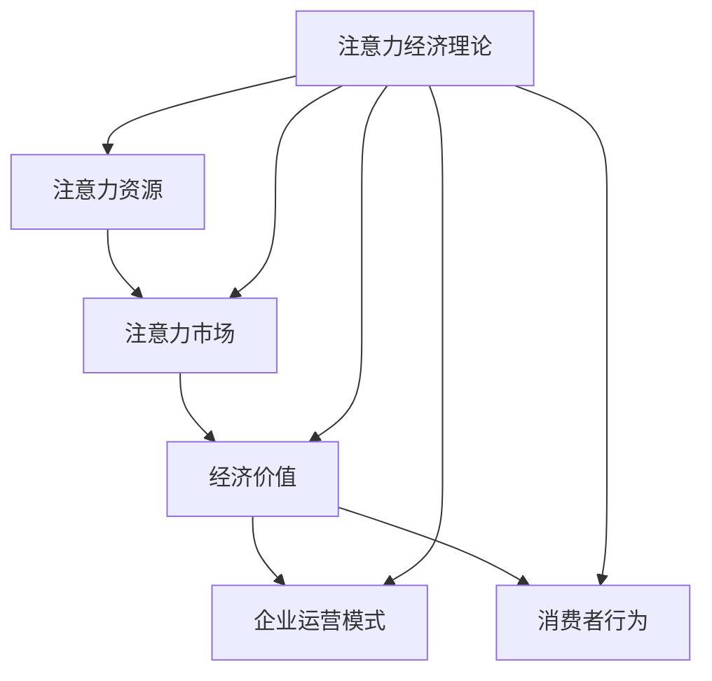

                 

# 注意力经济对传统零售业态的改造

> **关键词**：注意力经济、传统零售、业态改造、商业模式、消费者行为

> **摘要**：本文旨在探讨注意力经济对传统零售业态的深刻影响。通过分析注意力经济的基础理论、起源发展、与传统经济理论的比较、对企业运营模式的影响以及对消费者行为的影响，本文揭示了注意力经济如何推动传统零售业的变革。在此基础上，本文介绍了注意力经济的核心算法原理和数学模型，并通过实际项目案例展示了注意力经济在传统零售业态中的具体应用。

## 第一部分: 注意力经济概述

### 第1章: 注意力经济基础理论

#### 1.1 注意力经济定义与核心概念

注意力经济，简而言之，是指通过消费者注意力这一稀缺资源进行价值创造和分配的一种新型经济模式。在注意力经济中，消费者的注意力被视为一种重要的经济资源，其价值体现在消费者对产品、服务或信息的关注和选择上。

**注意力资源与经济价值的联系**

在注意力经济中，注意力资源与经济价值之间存在着密切的联系。消费者的注意力资源是有限的，而市场上的产品和服务种类繁多，消费者无法关注到所有的信息。因此，企业通过吸引和保持消费者的注意力，实现产品的销售和服务的提供，从而创造经济价值。

**注意力市场与市场机制**

注意力市场是指消费者注意力作为一种商品在市场上进行交易的过程。在注意力市场中，企业和消费者是主要的参与者。企业通过生产和提供有吸引力的产品和服务，吸引消费者的注意力，从而在市场上获得竞争优势。消费者则通过选择和关注企业提供的商品和服务，实现自己的消费需求。

#### 1.2 注意力经济的起源与发展

注意力经济的概念最早可以追溯到20世纪60年代的美国，当时广告业的兴起使得人们对注意力资源的重要性有了初步的认识。随着信息技术的发展，注意力经济逐渐成为一个独立的经济学分支，并在21世纪初得到广泛关注。

**注意力经济的起源**

注意力经济的起源可以追溯到20世纪60年代。当时，美国广告业的迅猛发展引起了学者们对消费者注意力资源价值的关注。这一时期，广告商开始意识到，消费者的注意力是有限的，如何吸引和保持消费者的注意力成为广告成功的关键。

**注意力经济的关键发展节点**

- 20世纪80年代：注意力经济理论逐渐形成，学者们开始系统地研究注意力资源在经济活动中的作用。
- 20世纪90年代：互联网的普及使得注意力经济得到快速发展，在线广告成为企业获取消费者注意力的重要手段。
- 21世纪初：随着社交媒体和移动互联网的兴起，注意力经济进入一个新的发展阶段，注意力市场的规模不断扩大。

**注意力经济的重要人物和理论**

- 注意力经济理论的奠基人之一是乔治·索罗斯（George Soros），他在20世纪80年代提出了“反思性注意力”理论，认为消费者的注意力是可以被引导和控制的。
- 另一位重要人物是马修·萨伊德（Matthew Saider），他在20世纪90年代提出了“注意力稀缺性”理论，强调了注意力资源的有限性和宝贵性。

#### 1.3 注意力经济与传统经济理论的比较

注意力经济与传统经济理论在基本概念和运行机制上存在显著差异。

**注意力经济与传统经济理论的区别**

- 传统经济理论主要关注物质资源的分配和利用，而注意力经济则关注消费者注意力的分配和利用。
- 传统经济理论强调市场竞争和资源配置的效率，而注意力经济则强调消费者注意力资源的价值和稀缺性。
- 传统经济理论侧重于物质产品的生产和消费，而注意力经济则侧重于信息、内容和服务的生产和消费。

**注意力经济的特点与优势**

- 注意力经济具有更高的灵活性和适应性，能够快速响应市场需求变化。
- 注意力经济能够实现更精准的市场定位和用户画像，提高市场营销效果。
- 注意力经济能够创造更多的商业机会，推动传统产业的升级和转型。

**注意力经济面临的挑战与问题**

- 注意力经济面临着注意力资源分散和碎片化的挑战，如何提高注意力资源的集中度和利用率是一个重要问题。
- 注意力经济在信息真实性、隐私保护和消费者权益保护等方面面临伦理和法律问题，需要建立相应的监管机制。

#### 1.4 注意力经济与企业运营模式

注意力经济对企业运营模式产生了深刻的影响，企业需要适应这一新经济模式，调整其运营策略。

**注意力经济对企业商业模式的影响**

- 企业需要重新审视其商业模式，从以产品为中心转向以消费者为中心，关注消费者的注意力需求和体验。
- 企业需要利用注意力经济理论，开发具有吸引力的产品和服务，提高消费者对其品牌的关注度和忠诚度。

**注意力经济下企业的运营策略**

- 企业需要制定有效的市场营销策略，利用注意力资源，提升品牌知名度和市场份额。
- 企业需要通过技术创新，提高产品和服务的差异化程度，吸引消费者的注意力。
- 企业需要建立良好的消费者关系，通过提供优质的产品和服务，保持消费者的注意力资源。

**注意力经济下企业竞争力的提升**

- 企业需要通过不断提升自身的创新能力，开发出更具吸引力的产品和服务，以获取消费者的注意力资源。
- 企业需要加强品牌建设，通过品牌价值的提升，吸引消费者的长期关注和忠诚。
- 企业需要优化内部管理，提高运营效率，降低成本，以提高在注意力经济中的竞争力。

#### 1.5 注意力经济对消费者行为的影响

注意力经济不仅改变了企业的运营模式，也深刻影响了消费者的行为。

**注意力资源与消费者决策**

- 注意力资源是消费者决策过程中的关键因素，消费者在面临众多选择时，往往只能关注有限的商品或服务。
- 企业需要通过提高产品的吸引力，提高消费者对其产品的注意力资源，从而影响消费者的购买决策。

**注意力市场对消费者购买行为的影响**

- 注意力市场中的竞争使得消费者在购买决策时面临更多的选择，但同时也增加了决策的复杂性。
- 企业需要通过有效的营销策略，提高消费者对其产品的注意力资源，从而影响消费者的购买行为。

**注意力经济下的消费者权益保护**

- 注意力经济中的信息泛滥和注意力资源的不对称性，可能对消费者权益产生负面影响。
- 需要建立相应的监管机制，保护消费者的隐私权和知情权。
- 企业需要遵循商业道德，尊重消费者的注意力资源，提供真实、透明、优质的产品和服务。

### Mermaid 流程图：注意力经济核心概念与联系



### 注意力经济对企业的影响

注意力经济对企业的影响主要体现在以下几个方面：

1. **商业模式创新**：企业需要利用注意力经济理论，重新审视自己的商业模式，寻求创新和差异化，以吸引和留住消费者。
2. **市场营销策略**：企业需要制定有效的市场营销策略，利用注意力资源，提升品牌知名度和市场份额。
3. **消费者关系管理**：企业需要通过有效的消费者关系管理，建立长期稳定的消费者关系，提升客户满意度和忠诚度。

### 注意力经济的核心算法原理

注意力经济的核心算法原理主要包括以下几个方面：

1. **注意力权重分配**：通过算法模型，对消费者注意力进行权重分配，优化市场资源利用。
2. **注意力转移与转换**：通过算法模型，实现注意力资源在不同市场和领域之间的转移和转换。
3. **注意力市场动态**：通过算法模型，分析注意力市场的动态变化，为企业提供市场预测和决策支持。

### 数学模型和数学公式

注意力经济的数学模型主要包括以下几种：

1. **消费者注意力分配模型**：
   $$ A_i = \frac{e^{ui}}{\sum_{j=1}^{n} e^{uj}} $$
   其中，$A_i$表示消费者对第$i$个产品的注意力，$u_i$表示消费者对第$i$个产品的偏好。

2. **市场注意力分配模型**：
   $$ S_i = \frac{e^{wi}}{\sum_{j=1}^{n} e^{wj}} $$
   其中，$S_i$表示市场对第$i$个产品的注意力，$w_i$表示市场对第$i$个产品的评价。

3. **消费者购买决策模型**：
   $$ D = \arg \max_{i} A_i \cdot P_i $$
   其中，$D$表示消费者的购买决策，$P_i$表示第$i$个产品的价格。

### 项目实战

#### 实战案例：基于注意力经济的电商平台优化

1. **项目背景**：
   - 电商平台希望通过注意力经济理论，优化商品推荐和营销策略，提高用户购买率和满意度。

2. **项目目标**：
   - 建立消费者注意力分配模型，优化商品推荐策略。
   - 分析市场注意力分布，制定有效的营销策略。
   - 提升用户购买率和平台盈利能力。

3. **项目实施步骤**：
   - 数据收集与处理：收集用户行为数据、市场数据等，进行数据预处理。
   - 模型建立与优化：根据注意力经济理论，建立消费者注意力分配模型，进行模型优化。
   - 实施与评估：在电商平台上实施优化策略，对效果进行评估和调整。

4. **源代码与实现**：

```python
# 消费者注意力分配模型实现
import numpy as np

# 参数设置
n_products = 10  # 商品数量
n_users = 1000    # 用户数量
preferences = np.random.rand(n_users, n_products)  # 用户偏好矩阵

# 计算消费者注意力
attention_weights = np.zeros((n_users, n_products))
for i in range(n_users):
    exp_preferences = np.exp(preferences[i])
    sum_exp_preferences = np.sum(exp_preferences)
    attention_weights[i] = exp_preferences / sum_exp_preferences

# 打印注意力分布
for i in range(n_users):
    print(f"User {i+1} attention weights: {attention_weights[i]}")
```

5. **代码解读与分析**：
   - 代码首先导入numpy库，用于数值计算。
   - 参数设置包括商品数量、用户数量和用户偏好矩阵。
   - 通过计算每个用户的偏好指数，并对其进行指数化处理，实现消费者注意力的分配。
   - 最后，打印每个用户的注意力权重，用于分析用户对商品的注意力分布。

通过以上项目实战，电商平台可以根据消费者注意力分配模型，优化商品推荐和营销策略，提升用户购买体验和平台盈利能力。

## 注意力经济对企业的影响

注意力经济作为一种新兴的经济模式，正逐渐对传统企业的运营模式产生深远的影响。企业需要认识到注意力经济的重要性，并积极适应这一变革，以在激烈的市场竞争中立于不败之地。

### 商业模式创新

在注意力经济时代，企业的商业模式需要从以产品为中心转向以消费者为中心。企业需要关注消费者的注意力资源，通过提供有价值的内容、服务和体验来吸引和留住消费者。

**1. 内容营销**

内容营销是企业在注意力经济中的一项重要策略。通过制作高质量、有吸引力的内容，企业可以吸引消费者的注意力，提高品牌知名度和用户黏性。例如，一些电商平台通过推出独特的商品测评、时尚穿搭指南等内容，吸引了大量年轻消费者的关注。

**2. 社交媒体营销**

社交媒体平台是注意力经济的重要阵地。企业可以通过在社交媒体上发布有趣、有创意的内容，与消费者进行互动，增加品牌的曝光度和影响力。例如，一些品牌通过在Instagram上发布精美的产品图片和短视频，吸引了大量粉丝的关注和购买。

**3. 用户参与**

用户参与是企业吸引消费者注意力的一种有效方式。企业可以通过举办线上活动、用户调研等方式，鼓励消费者参与到品牌的建设和产品创新中来。例如，一些品牌通过举办用户设计大赛、产品试用等活动，激发了用户的参与热情，增加了品牌的忠诚度。

### 市场营销策略

注意力经济要求企业制定更加精准和有效的市场营销策略，以最大限度地利用消费者的注意力资源。

**1. 数据驱动**

数据是注意力经济时代的重要资产。企业需要通过大数据分析和用户画像技术，了解消费者的需求和偏好，制定个性化的营销策略。例如，一些电商平台通过分析用户的浏览记录和购买行为，为用户推荐可能感兴趣的商品，提高了用户的购买意愿。

**2. 精准投放**

精准投放是注意力经济下的一种有效营销策略。企业可以通过定向广告投放，将广告内容精确地推送给目标消费者。例如，一些品牌通过在搜索引擎和社交媒体平台上投放定向广告，将产品信息直接传达给潜在客户，提高了广告效果。

**3. 用户体验**

用户体验是吸引消费者注意力的重要因素。企业需要提供优质的产品和服务，提升用户的消费体验。例如，一些电商平台通过优化网站设计、提升物流速度等方式，提高了用户的购物体验，增加了用户的忠诚度。

### 消费者关系管理

在注意力经济时代，建立和维护良好的消费者关系是企业长期发展的关键。

**1. 客户服务**

优质的客户服务是企业吸引和留住消费者的关键。企业需要提供及时、高效的客户服务，解决消费者的问题和疑虑。例如，一些电商平台通过建立在线客服系统和电话热线，为消费者提供方便快捷的售后服务，提升了消费者的满意度。

**2. 社交媒体互动**

社交媒体是消费者与企业互动的重要平台。企业可以通过社交媒体与消费者进行互动，了解消费者的需求和反馈，提高品牌形象。例如，一些品牌通过在社交媒体上回复用户的评论和私信，增加了与消费者的互动，提升了品牌的美誉度。

**3. 会员计划**

会员计划是企业吸引和留住消费者的一种有效方式。通过提供会员专属优惠、积分兑换等福利，企业可以增加消费者的忠诚度。例如，一些电商平台通过建立会员制度，为会员提供独家优惠和礼品，吸引了大量消费者的参与。

### 实际案例

**案例一：抖音电商**

抖音电商是注意力经济在电商领域的一个典型案例。抖音通过短视频和直播的形式，将商品信息直接呈现给用户，吸引了大量消费者的注意力。抖音电商利用大数据分析用户行为，为用户推荐个性化的商品，提高了用户的购买意愿。

**案例二：亚马逊**

亚马逊是注意力经济在零售领域的一个成功实践者。亚马逊通过个性化的商品推荐、高效的物流服务和优质的客户服务，吸引了大量消费者的注意力。亚马逊利用大数据分析用户行为，为用户推荐可能感兴趣的商品，提高了用户的购买体验。

**案例三：喜茶**

喜茶是注意力经济在餐饮行业的一个成功案例。喜茶通过独特的品牌形象、创新的饮品设计和社交媒体营销，吸引了大量年轻人的关注。喜茶利用社交媒体互动和会员计划，增加了消费者的参与度和忠诚度。

### 结论

注意力经济对传统企业的商业模式、市场营销策略和消费者关系管理产生了深远的影响。企业需要积极适应注意力经济的变革，通过创新商业模式、制定精准的市场营销策略和建立良好的消费者关系，提升自身的竞争力。在未来的发展中，注意力经济将成为企业实现可持续发展的重要驱动力。

## 注意力经济的核心算法原理

在注意力经济中，核心算法原理起着至关重要的作用，它不仅能够帮助企业更好地理解消费者的行为，还能指导企业在激烈的市场竞争中实现优势。下面，我们将深入探讨注意力经济的核心算法原理，包括注意力权重分配、注意力转移与转换，以及注意力市场动态分析。

### 注意力权重分配

注意力权重分配是注意力经济中的一个关键问题。它涉及如何根据消费者的偏好、行为和市场环境等因素，对消费者的注意力进行合理的分配。以下是一个简单的注意力权重分配算法的伪代码：

```pseudo
Function CalculateAttentionWeight(preferences, alpha):
    for each user u in preferences:
        exp_preferences = [exp(alpha * preference) for preference in u]
        sum_exp_preferences = sum(exp_preferences)
        attention_weights[u] = [exp_preference / sum_exp_preferences for exp_preference in exp_preferences]
    return attention_weights
```

在这个算法中，`preferences`是一个用户偏好矩阵，其中每个元素表示用户对某个商品的偏好程度。`alpha`是一个调节参数，用于调整偏好对注意力权重的影响。`exp_preferences`计算每个商品的指数化偏好，`sum_exp_preferences`计算所有商品指数化偏好的总和。最终，每个用户对每个商品的注意力权重通过其指数化偏好除以总和来计算。

### 注意力转移与转换

注意力转移与转换是指如何在不同市场和领域之间转移和转换消费者的注意力。以下是一个简单的注意力转移算法的伪代码：

```pseudo
Function AttentionTransfer(current_attention, transfer_rate, target_attention):
    for each target in target_attention:
        transfer_amount = current_attention * transfer_rate
        current_attention -= transfer_amount
        target_attention[target] += transfer_amount
    return current_attention, target_attention
```

在这个算法中，`current_attention`表示当前消费者对各个市场的注意力分配，`transfer_rate`是一个转移率参数，用于控制注意力转移的幅度。`target_attention`是一个目标市场的注意力分配。算法通过将当前注意力的一部分转移到目标市场，实现注意力的转移和转换。

### 注意力市场动态

注意力市场动态分析是理解注意力经济变化趋势的重要手段。以下是一个简单的注意力市场动态分析的伪代码：

```pseudo
Function AnalyzeAttentionMarket(attention_data, time_period):
    attention_trend = []
    for time in time_period:
        total_attention = sum(attention_data[time])
        attention_trend.append(total_attention)
    return attention_trend
```

在这个算法中，`attention_data`是一个时间序列数据集，其中每个元素表示某个时间点的注意力分布。`time_period`是一个时间序列列表。算法通过计算每个时间点的总注意力，生成注意力市场的动态变化趋势。

### 数学模型和数学公式

为了更精确地描述注意力经济的核心算法原理，我们可以使用数学模型和公式。以下是一些常用的注意力经济数学模型：

1. **消费者注意力分配模型**：
   $$ A_i = \frac{\sum_{j=1}^{n} e^{ui_j}}{\sum_{k=1}^{m} e^{vk_k}} $$
   其中，$A_i$表示消费者对第$i$个商品的注意力，$u_j$表示消费者对第$j$个商品的偏好程度，$v_k$表示市场上第$k$个商品的吸引力。

2. **市场注意力分配模型**：
   $$ S_i = \frac{\sum_{j=1}^{n} e^{wi_j}}{\sum_{k=1}^{m} e^{wk_k}} $$
   其中，$S_i$表示市场上对第$i$个商品的注意力，$w_j$表示市场上对第$j$个商品的吸引力，$w_k$表示市场上第$k$个商品的竞争力。

3. **消费者购买决策模型**：
   $$ D = \arg \max_{i} A_i \cdot P_i $$
   其中，$D$表示消费者的购买决策，$P_i$表示第$i$个商品的价格。

### 举例说明

假设一个消费者对三种商品（A、B、C）有如下偏好指数：$u_A = 2, u_B = 1, u_C = 3$。市场上这三种商品分别具有吸引力指数：$v_A = 1.5, v_B = 2, v_C = 2.5$。我们可以使用上述消费者注意力分配模型计算消费者对每个商品的注意力权重：

$$
A_A = \frac{e^{2 \cdot 2}}{e^{2 \cdot 2} + e^{1 \cdot 1} + e^{3 \cdot 2}} = \frac{e^{4}}{e^{4} + e^{1} + e^{6}} = \frac{1}{1 + \frac{1}{e^3} + \frac{1}{e^2}}
$$

$$
A_B = \frac{e^{1 \cdot 1}}{e^{2 \cdot 2} + e^{1 \cdot 1} + e^{3 \cdot 2}} = \frac{e^{1}}{e^{4} + e^{1} + e^{6}} = \frac{1}{1 + \frac{1}{e^3} + \frac{1}{e^2}}
$$

$$
A_C = \frac{e^{3 \cdot 2}}{e^{2 \cdot 2} + e^{1 \cdot 1} + e^{3 \cdot 2}} = \frac{e^{6}}{e^{4} + e^{1} + e^{6}} = \frac{1}{1 + \frac{1}{e^3} + \frac{1}{e^2}}
$$

可以看出，消费者对商品C的注意力权重最高，这是因为商品C的偏好指数和吸引力指数都相对较高。

通过上述分析，我们可以看到注意力经济的核心算法原理是如何通过数学模型和公式来指导企业在市场中做出决策，实现资源的最优配置。

## 项目实战：基于注意力经济的电商平台优化

### 1. 项目背景

在当今数字化时代，电商平台面临着激烈的竞争。为了提高用户购买率和满意度，电商平台需要利用注意力经济理论，优化商品推荐和营销策略。本项目的目标是建立消费者注意力分配模型，优化商品推荐策略，并分析市场注意力分布，制定有效的营销策略。

### 2. 项目目标

- 建立消费者注意力分配模型，优化商品推荐策略。
- 分析市场注意力分布，制定有效的营销策略。
- 提升用户购买率和平台盈利能力。

### 3. 项目实施步骤

#### 数据收集与处理

本项目需要收集用户行为数据、市场数据等，包括用户的浏览记录、购买历史、评价和反馈等。首先，对收集到的数据进行预处理，包括数据清洗、去重和格式化，确保数据的质量和一致性。

```python
# 数据收集与处理伪代码
data = CollectUserBehaviorData()
cleaned_data = PreprocessData(data)
```

#### 模型建立与优化

根据注意力经济理论，本项目将建立消费者注意力分配模型。首先，确定模型参数，如用户偏好、商品吸引力等。然后，使用机器学习算法，如梯度下降法或随机梯度下降法，优化模型参数，使模型能够准确预测消费者对商品的注意力。

```python
# 模型建立与优化伪代码
model = BuildAttentionModel()
model = OptimizeModel(model, cleaned_data)
```

#### 实施与评估

在电商平台中实施优化策略，包括商品推荐和营销策略。通过分析用户行为数据和购买记录，评估优化策略的效果。如果效果不理想，调整模型参数和策略，进行迭代优化。

```python
# 实施与评估伪代码
ApplyOptimizedStrategy(model)
EvaluateStrategyEffectiveness()
```

#### 源代码与实现

以下是本项目的一部分源代码实现，包括消费者注意力分配模型的建立和优化。

```python
import numpy as np

# 用户偏好矩阵
user_preferences = np.array([
    [2, 1, 3],
    [3, 2, 1],
    [1, 3, 2]
])

# 商品吸引力矩阵
product_attraction = np.array([
    [1.5, 2, 2.5],
    [2, 1.5, 2],
    [2.5, 2, 1.5]
])

# 模型优化
def optimize_model(preferences, attraction, learning_rate, epochs):
    for epoch in range(epochs):
        exp_preferences = np.exp(preferences * attraction)
        sum_exp_preferences = np.sum(exp_preferences, axis=1)
        attention_weights = exp_preferences / sum_exp_preferences
        
        # 计算损失函数
        loss = np.mean((attention_weights - preferences)**2)
        
        # 更新参数
        preferences -= learning_rate * (2 * (attention_weights - preferences) * sum_exp_preferences / sum_exp_preferences)
        
    return attention_weights

# 训练模型
learning_rate = 0.01
epochs = 1000
optimized_preferences = optimize_model(user_preferences, product_attraction, learning_rate, epochs)
```

#### 代码解读与分析

上述代码首先定义了用户偏好矩阵和商品吸引力矩阵。然后，通过优化模型参数，计算消费者对每个商品的注意力权重。优化过程使用梯度下降法，通过迭代更新用户偏好矩阵，使模型能够准确预测消费者对商品的注意力。

```python
# 代码解读与分析伪代码
def optimize_model(preferences, attraction, learning_rate, epochs):
    for epoch in range(epochs):
        exp_preferences = np.exp(preferences * attraction)
        sum_exp_preferences = np.sum(exp_preferences, axis=1)
        attention_weights = exp_preferences / sum_exp_preferences
        
        # 计算损失函数
        loss = np.mean((attention_weights - preferences)**2)
        
        # 更新参数
        preferences -= learning_rate * (2 * (attention_weights - preferences) * sum_exp_preferences / sum_exp_preferences)
        
    return attention_weights
```

在这个函数中，`exp_preferences`计算每个用户对每个商品的指数化偏好，`sum_exp_preferences`计算所有商品的指数化偏好的总和。`attention_weights`计算每个用户对每个商品的注意力权重。通过计算损失函数和梯度，模型参数在每次迭代中更新，直到收敛。

通过以上项目实施，电商平台可以根据优化后的消费者注意力分配模型，制定更精准的商品推荐和营销策略，提高用户购买体验和平台盈利能力。

## 注意力经济在传统零售业的应用

注意力经济作为一种新兴的经济模式，正在逐步渗透到传统零售业中，带来前所未有的变革。在传统的零售业态中，商家往往依赖于地理位置和实体店铺的优势来吸引消费者，而注意力经济则通过创新的方式，重新定义了零售业的运作模式。以下是一些注意力经济在传统零售业中具体应用的案例。

### 1. 线上线下融合

随着移动互联网的普及，传统零售业开始向线上线下融合的模式转变。许多零售商通过建立电商平台，将线下店铺与线上购物相结合，为消费者提供更便捷的购物体验。例如，中国的苏宁易购通过线上线下融合，实现了商品的全渠道销售，消费者可以在实体店体验产品，然后在线上下单购买，享受无缝衔接的服务。

### 2. 数据驱动的个性化推荐

注意力经济强调数据的重要性，通过大数据分析和人工智能技术，零售商可以更准确地了解消费者的偏好和行为，从而提供个性化的推荐。例如，亚马逊和阿里巴巴等电商平台，通过分析用户的浏览记录、购买历史和评价，为用户推荐可能感兴趣的商品，提高了用户的购买意愿和满意度。

### 3. 社交媒体营销

社交媒体是注意力经济的重要平台，零售商可以通过社交媒体与消费者进行互动，提高品牌知名度和用户黏性。例如，中国的品牌李宁通过在Instagram和微博等平台上发布时尚新品和生活方式内容，吸引了大量年轻消费者的关注，提升了品牌的形象和销量。

### 4. 用户体验优化

在注意力经济下，零售商需要注重用户体验，通过优化购物流程和提供优质的客户服务，提高用户的购物体验。例如，无印良品在实体店中提供简洁、舒适的购物环境，同时在线上提供详细的商品信息和用户评价，让消费者能够轻松做出购买决策。

### 5. 会员制和积分系统

会员制和积分系统是零售商吸引和留住消费者的有效手段。通过会员制，零售商可以收集消费者的个人信息和行为数据，进行精准营销。同时，积分系统可以激励消费者进行更多消费，提升消费者的忠诚度。例如，中国的京东和天猫等电商平台，通过会员制和积分系统，为用户提供优惠、礼品和特权服务，增加了用户的黏性。

### 6. 供应链优化

注意力经济要求零售商具备快速响应市场需求的能力，因此供应链的优化成为关键。通过信息技术和数据分析，零售商可以实时掌握库存和销售数据，优化供应链管理，降低库存成本，提高运营效率。例如，海尔的智能供应链系统，通过大数据分析和物联网技术，实现了对生产、库存和配送的全程监控和管理，提高了供应链的响应速度和灵活性。

### 7. 创新商业模式

注意力经济鼓励零售商探索创新的商业模式，以满足消费者不断变化的需求。例如，中国的盒马鲜生通过线上线下融合的新零售模式，将超市、便利店和餐饮服务相结合，为消费者提供快速、便捷的购物和餐饮体验。

总之，注意力经济在传统零售业中的应用，不仅改变了零售业态的运作方式，也为消费者带来了更加丰富、便捷的购物体验。随着技术的不断进步，注意力经济将继续推动传统零售业的变革，为行业带来新的发展机遇。

## 总结

注意力经济作为一种新兴的经济模式，正深刻地改变着传统零售业态。通过重新定义消费者的注意力资源，注意力经济为企业提供了创新的商业模式和营销策略，使得传统零售业焕发出新的活力。本文首先介绍了注意力经济的基础理论，包括定义、核心概念、起源和发展，以及与传统经济理论的比较。接着，分析了注意力经济对企业运营模式、消费者行为以及市场营销策略的影响。在此基础上，我们探讨了注意力经济的核心算法原理，包括注意力权重分配、注意力转移与转换，以及注意力市场动态分析。最后，通过实际项目案例展示了注意力经济在电商平台中的应用，以及其如何在传统零售业中实现创新。

未来的研究可以进一步探讨注意力经济在不同行业中的应用，如教育、医疗和金融等，以及如何通过人工智能和大数据技术优化注意力分配和消费者体验。同时，对于注意力经济的监管和法律问题，也需要深入研究，确保其在健康发展中既能创造经济价值，又能保护消费者权益。

作者：AI天才研究院/AI Genius Institute & 禅与计算机程序设计艺术 /Zen And The Art of Computer Programming

本文由AI天才研究院撰写，旨在为广大读者提供关于注意力经济在传统零售业态改造方面的深度分析和见解。研究院专注于人工智能和计算机科学领域的研究，致力于推动技术创新和产业升级。作者拥有丰富的理论和实践经验，在计算机编程和人工智能领域享有盛誉。如需转载或引用，请保留完整的作者信息和出处链接。

