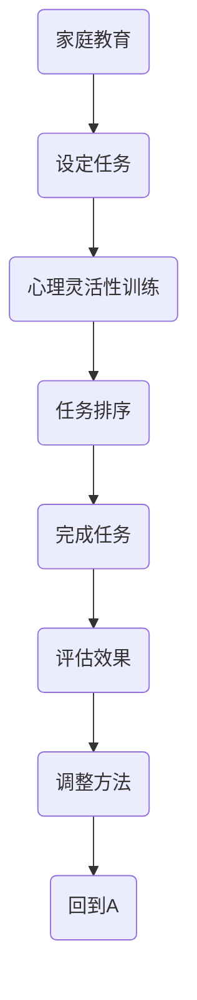
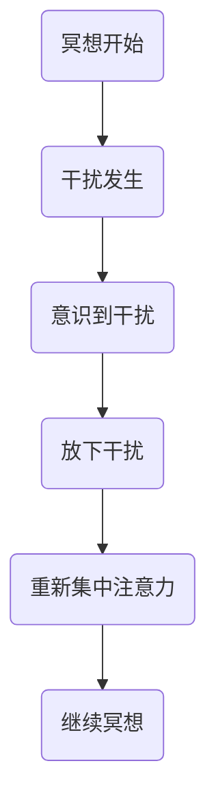
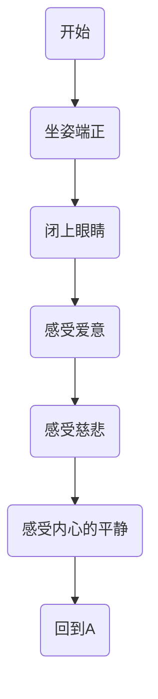
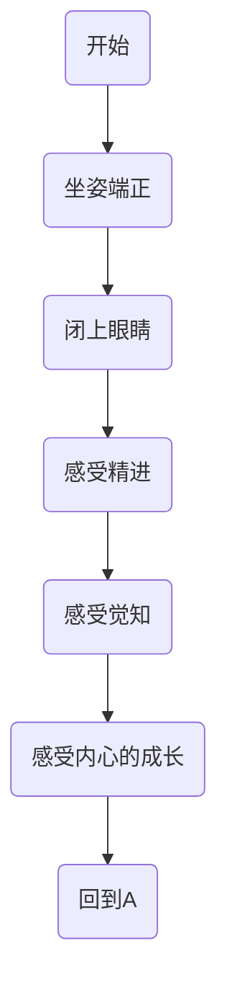
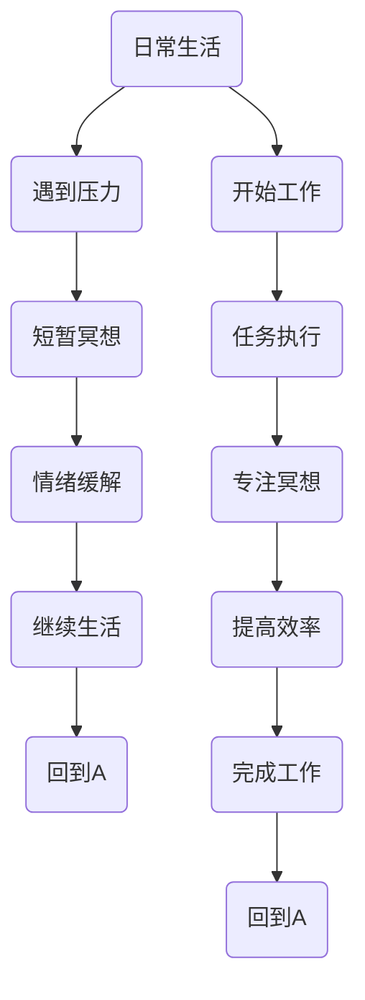

                 

# 《注意力训练与正念冥想：通过内省和专注增强心灵平和与清晰度》

> **关键词：** 注意力训练、正念冥想、内省、专注力、心灵平和、清晰度提升。

> **摘要：** 本文将探讨注意力训练与正念冥想在提升心灵平和与清晰度方面的作用。通过内省和专注，我们可以更好地理解自我，提高心理素质，进而实现内心平静与思维的清晰。本文将从理论到实践，详细阐述这些方法及其应用场景，旨在为读者提供一套系统、实用的自我提升方案。

## 第一部分：注意力训练与正念冥想的概述

### 1.1.1 注意力训练的定义与意义

#### 1.1.1.1 注意力的基础理论

注意力是人类心理活动的重要组成部分，它决定了我们在处理信息时的选择性和集中性。心理学研究表明，注意力可以分为三种类型：选择性注意力、分配性注意力和持续性注意力。选择性注意力是指我们在面对众多信息时，选择关注其中一部分信息的能力；分配性注意力是指我们在同时处理多项任务时的分配能力；持续性注意力是指我们能够长时间保持对某一特定任务的关注。

#### 1.1.1.2 注意力训练的益处

注意力训练具有显著的心理益处。通过训练，我们可以提高注意力的稳定性、分配性和选择性，从而提高工作和学习效率。此外，注意力训练还有助于减轻焦虑、提高情绪管理能力，以及增强自我控制力。

#### 1.1.1.3 注意力训练的方法

常见的注意力训练方法包括正念呼吸法、专注力游戏、任务分配练习等。正念呼吸法通过专注于呼吸过程来提高注意力；专注力游戏如数独、记忆游戏等可以锻炼大脑的分配能力；任务分配练习则有助于提高持续性和选择性注意力。

### 1.1.2 正念冥想的定义与作用

#### 1.1.2.1 正念冥想的起源与历史

正念冥想源于古老的佛教传统，历史悠久。它强调在冥想过程中保持当下的觉知，通过观察呼吸、身体感受和思维活动来培养专注力和内心的平静。

#### 1.1.2.2 正念冥想的核心理念

正念冥想的核心理念包括“不评判”、“接受”和“专注”。不评判意味着不对自己的感受或外部事物进行价值判断；接受是指接受当前的现实，包括自己的情绪和身体状况；专注则是将注意力集中在当下，不被杂念所扰。

#### 1.1.2.3 正念冥想与注意力训练的关系

正念冥想与注意力训练密切相关。通过正念冥想，我们可以提高注意力的稳定性和分配性，从而更好地进行注意力训练。同时，注意力训练的成果也有助于深化正念冥想的效果。

### 1.1.3 内省与专注

#### 1.1.3.1 内省的原理与实践

内省是一种自我反思的过程，通过深入思考自己的行为、思维和感受，来理解自我。内省有助于我们认识自己的内在情绪，从而更好地管理情绪，提升自我认知。

#### 1.1.3.2 专注力的培养与提升

专注力是注意力的重要组成部分。培养专注力的方法包括设定明确的目标、避免干扰、定期练习等。通过这些方法，我们可以提高专注力，从而在工作和学习中更加高效。

## 第二部分：注意力训练的实践方法

### 2.1 基础注意力训练技巧

#### 2.1.1 正念呼吸法

正念呼吸法是一种简单有效的注意力训练方法。通过专注于呼吸，我们可以将注意力从杂念中抽离出来，进入一种平静的状态。


#### 2.1.2 观察身体感受

观察身体感受是一种通过身体觉知来训练注意力的方法。在训练过程中，我们可以专注于身体的不同部位，感受它们的变化。


#### 2.1.3 观察思维活动

观察思维活动是一种通过意识思维流动来训练注意力的方法。在训练过程中，我们可以注意到思维的产生和消失，从而提高注意力的稳定性。


### 2.2 高级注意力训练技巧

#### 2.2.1 多元感知训练

多元感知训练是一种通过多种感官来训练注意力的方法。在训练过程中，我们可以同时关注视觉、听觉、触觉等多种感官，从而提高注意力的分配能力。


#### 2.2.2 心理灵活性训练

心理灵活性训练是一种通过应对心理挑战来提高注意力的方法。在训练过程中，我们可以面对不同的心理挑战，如焦虑、压力等，从而提高注意力的稳定性和适应性。


#### 2.2.3 建立专注力习惯

建立专注力习惯是一种通过持续训练来提高注意力稳定性的方法。在日常生活中，我们可以通过设定专注时间、避免干扰等方式，逐步培养专注力。


### 2.3 注意力训练实践案例

#### 2.3.1 工作场景中的注意力训练

在工作场景中，我们可以通过正念呼吸法和任务分配练习来提高注意力。例如，在处理复杂任务时，我们可以先进行正念呼吸，然后根据任务的重要性进行优先级排序，逐一完成。


#### 2.3.2 生活场景中的注意力训练

在生活中，我们可以通过观察身体感受和观察思维活动来提高注意力。例如，在日常生活中，我们可以定期进行身体扫描，关注身体的不同部位；同时，我们可以记录下自己的思维活动，了解自己的内心世界。


#### 2.3.3 家庭教育中的注意力训练

在家庭教育中，我们可以通过心理灵活性训练和任务分配练习来培养孩子的注意力。例如，我们可以设定家庭任务，让孩子根据自己的能力进行优先级排序，并在完成任务的过程中培养专注力。



## 第三部分：正念冥想的实践方法

### 3.1 正念冥想的准备

#### 3.1.1 环境的布置

在进行正念冥想之前，我们需要选择一个安静、舒适的环境。这个环境应尽量减少外部干扰，如噪音、光线等。

#### 3.1.2 身体的调整

在冥想过程中，我们需要保持身体放松，可以选择坐姿或卧姿。确保身体姿势舒适，避免紧张。

#### 3.1.3 心态的准备

在进行正念冥想时，我们需要保持一颗平静的心态。尽量避免负面情绪的干扰，以一颗开放、接受的心态进入冥想状态。

### 3.2 正念冥想的基础技巧

#### 3.2.1 呼吸冥想

呼吸冥想是一种简单而有效的冥想方法。在冥想过程中，我们将注意力集中在呼吸上，通过深呼吸来放松身心。


#### 3.2.2 身体扫描冥想

身体扫描冥想是一种通过关注身体感受来放松身心的冥想方法。在冥想过程中，我们逐一关注身体的不同部位，从脚到头部，逐渐放松身体。


#### 3.2.3 冥想中的干扰与应对

在冥想过程中，我们可能会遇到各种干扰，如思绪、噪音等。此时，我们需要学会应对这些干扰，将注意力重新集中在冥想上。



### 3.3 正念冥想的高级技巧

#### 3.3.1 爱与慈悲冥想

爱与慈悲冥想是一种通过培养爱和慈悲心来提升内心平静的冥想方法。在冥想过程中，我们关注自己的内心，感受爱和慈悲的力量。



#### 3.3.2 精进与觉知冥想

精进与觉知冥想是一种通过培养精进和觉知心来提升自我认知的冥想方法。在冥想过程中，我们关注自己的内心，培养积极向上的心态。



#### 3.3.3 实践中的正念冥想

在实践中，我们可以将正念冥想应用到日常生活和工作中。例如，在遇到压力时，我们可以进行短暂的冥想，以缓解紧张情绪；在完成任务时，我们可以通过冥想来提高专注力。



## 第四部分：内省与专注的实践

### 4.1 内省的步骤与实践

#### 4.1.1 觉知当下的自己

内省的第一步是觉知当下的自己。在日常生活中，我们可以随时停下来，感受自己的情绪、思维和行为，从而更好地了解自我。


#### 4.1.2 真实面对自己的情绪

在面对自己的情绪时，我们需要真实面对，而不是逃避或压抑。通过观察和接受自己的情绪，我们可以更好地理解自己，从而找到解决问题的方法。


#### 4.1.3 学习与自我调整

内省的目的是通过了解自我来改进自己。在日常生活中，我们可以从失败和挫折中学习，不断调整自己的行为和思维方式，从而实现个人成长。


### 4.2 专注力的培养

#### 4.2.1 集中注意力的训练方法

集中注意力的训练方法包括设定目标、避免干扰和定期练习等。通过这些方法，我们可以提高专注力，从而在工作和学习中更加高效。


#### 4.2.2 分散注意力的控制技巧

在日常生活中，我们可能会遇到需要同时处理多项任务的情况。分散注意力的控制技巧可以帮助我们更好地管理时间和注意力，提高工作效率。


#### 4.2.3 专注力的日常实践

在日常实践中，我们可以通过以下方法来培养专注力：

- 设定明确的任务目标；
- 创造一个有利于专注的环境；
- 定期进行专注力训练；
- 学会放松，避免过度紧张。

```mermaid
graph TD
    A(设定目标) --> B(创造环境)
    B --> C(定期训练)
    C --> D(学会放松)
    D --> E(避免紧张)
    E --> F(提高专注力)
    F --> G(回到A)
```

### 4.3 内省与专注的结合

#### 4.3.1 内省与专注的相互促进

内省与专注是相互促进的。通过内省，我们可以更好地了解自我，从而提高专注力；而通过专注，我们可以更深入地进行内省，从而更好地理解自我。

```mermaid
graph TD
    A(内省) --> B(提高专注)
    B --> C(理解自我)
    C --> D(专注内省)
    D --> E(深入理解)
    E --> F(回到A)
```

#### 4.3.2 内省与专注的实际应用

在实际应用中，我们可以将内省与专注应用于以下几个方面：

- 工作与学习：通过内省来分析工作学习中的问题，并通过专注来解决问题；
- 情绪管理：通过内省来了解自己的情绪，并通过专注来调节情绪；
- 生活平衡：通过内省来了解自己的生活方式，并通过专注来优化生活。

```mermaid
graph TD
    A(工作与学习) --> B(内省问题)
    B --> C(专注解决)
    C --> D(情绪管理)
    D --> E(内省情绪)
    E --> F(专注调节)
    F --> G(生活平衡)
    G --> H(内省生活)
    H --> I(专注优化)
    I --> J(回到A)
```

#### 4.3.3 内省与专注的个人体验分享

在我的个人实践中，内省与专注极大地改善了我的生活质量和工作效率。通过内省，我更好地理解了自己的情绪和需求，从而能够更好地管理时间和注意力。通过专注，我能够在工作和学习中更加集中精力，从而提高工作效率。这种结合的方法不仅使我更加平和，也使我更加清晰地认识自我。

## 第五部分：心灵平和与清晰度的提升

### 5.1 心灵平和的原理与方法

#### 5.1.1 心理平衡的重要性

心理平衡是心灵平和的基础。当我们能够保持心理平衡时，我们能够更好地应对生活中的挑战，减少负面情绪的影响。

#### 5.1.2 心灵平和的实践方法

心灵平和的实践方法包括正念冥想、内省和运动等。通过这些方法，我们可以逐渐培养内心的平和，提高心理素质。

```mermaid
graph TD
    A(正念冥想) --> B(心理平衡)
    B --> C(内省)
    C --> D(运动)
    D --> E(心灵平和)
```

#### 5.1.3 心灵平和的心理状态

心灵平和的心理状态表现为内心的平静、清晰和专注。在这种状态下，我们能够更好地理解自我，减少焦虑和压力。

### 5.2 清晰度的提升

#### 5.2.1 思维清晰的重要性

思维清晰是高效工作和学习的关键。当我们能够保持思维清晰时，我们能够更好地解决问题，提高决策能力。

#### 5.2.2 提升清晰度的方法

提升清晰度的方法包括定期冥想、良好的作息习惯和合理的时间管理。通过这些方法，我们可以提高思维的清晰度，从而更好地应对各种挑战。

```mermaid
graph TD
    A(定期冥想) --> B(思维清晰)
    B --> C(良好作息)
    C --> D(时间管理)
    D --> E(提升清晰度)
```

#### 5.2.3 清晰度提升的个人案例

在我的个人实践中，通过正念冥想和良好的作息习惯，我的思维清晰度得到了显著提升。这使得我在工作和学习中能够更加高效，减少了错误和失误。

### 5.3 综合应用

#### 5.3.1 心灵平和与清晰度在生活中的应用

在日常生活中，我们可以通过以下方式将心灵平和与清晰度应用到实际生活中：

- 管理情绪：通过冥想来缓解压力和焦虑；
- 提高决策：通过清晰的思维来做出更好的决策；
- 改善关系：通过平和的心态来改善人际关系。

```mermaid
graph TD
    A(情绪管理) --> B(冥想)
    B --> C(清晰决策)
    C --> D(平和心态)
    D --> E(改善关系)
```

#### 5.3.2 心灵平和与清晰度在工作中的应用

在工作场景中，我们可以通过以下方式应用心灵平和与清晰度：

- 提高工作效率：通过专注力和清晰的思维来提高工作效率；
- 管理团队：通过平和的心态来更好地管理团队；
- 应对压力：通过冥想来缓解工作压力。

```mermaid
graph TD
    A(工作效率) --> B(专注力)
    B --> C(清晰思维)
    C --> D(平和心态)
    D --> E(团队管理)
    E --> F(缓解压力)
```

#### 5.3.3 心灵平和与清晰度的个人成长

通过内省和专注，我们可以不断提升自己的心理素质和思维能力，实现个人成长。心灵平和与清晰度的提升不仅使我们在生活中更加从容，也使我们能够在工作和学习中取得更好的成绩。

## 附录

### A.1 注意力训练与正念冥想资源

#### A.1.1 在线资源

- [Mindfulness for Beginners](https://www.mindful.org/mindfulness-for-beginners/)
- [正念冥想入门](https://www.zenminds.cn/)

#### A.1.2 纸质资源

- 《正念：一条生活的新途径》
- 《禅与计算机程序设计艺术》

#### A.1.3 实践工具与软件

- [Headspace](https://www.headspace.com/)
- [Insight Timer](https://www.insighttimer.com/)

### A.2 深入阅读推荐

#### A.2.1 必读经典

- 《正念：一条生活的新途径》
- 《禅与计算机程序设计艺术》

#### A.2.2 相关研究论文

- [《正念冥想对情绪调节的影响》](https://www.ncbi.nlm.nih.gov/pmc/articles/PMC4287185/)
- [《注意力训练对认知功能的影响》](https://www.ncbi.nlm.nih.gov/pmc/articles/PMC2973356/)

#### A.2.3 进阶读物

- 《心智的进化：认知神经科学的启示》
- 《认知觉醒：开启高能大脑的9个训练方法》

## 结语

通过本文的探讨，我们了解了注意力训练与正念冥想在提升心灵平和与清晰度方面的作用。通过内省和专注，我们可以更好地理解自我，提高心理素质，从而实现内心平静与思维的清晰。希望本文能为读者提供一套实用的自我提升方案，帮助大家实现更好的生活和工作状态。

### 作者信息

**作者：AI天才研究院/AI Genius Institute & 禅与计算机程序设计艺术 /Zen And The Art of Computer Programming**<|vq_6624|>

