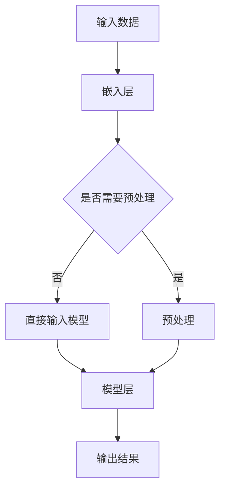

                 

# 《注意力黑客：AI时代的信息战》

## 关键词

- 注意力机制
- AI时代
- 信息战
- 黑客技术
- 实战应用
- 防御策略

## 摘要

本文旨在探讨AI时代下的一种新型战争形式——信息战。随着人工智能技术的迅速发展，注意力机制的应用越来越广泛，由此衍生出一种新的黑客技术——注意力黑客。本文将深入分析注意力黑客的原理、实战应用以及防御策略，旨在为读者揭示AI时代下的信息战全貌，并提供一些建议以应对未来的挑战。

## 目录大纲

### 第一部分：AI时代的信息战基础

#### 第1章：AI时代的信息战概述

##### 1.1 AI时代的信息战背景

##### 1.2 信息战的定义与特点

##### 1.3 AI在信息战中的应用

#### 第2章：注意力机制原理

##### 2.1 注意力机制的概述

##### 2.2 注意力机制的核心算法

##### 2.3 注意力机制的应用场景

#### 第3章：注意力模型的架构

##### 3.1 注意力模型的概述

##### 3.2 注意力模型的构建

##### 3.3 注意力模型的工作原理

#### 第4章：注意力模型在信息战中的应用

##### 4.1 注意力模型在情报分析中的应用

##### 4.2 注意力模型在网络安全中的应用

##### 4.3 注意力模型在心理战术中的应用

### 第二部分：注意力黑客的实战应用

#### 第5章：注意力黑客的技术手段

##### 5.1 信息隐藏技术

##### 5.2 注意力转移技术

##### 5.3 注意力欺骗技术

#### 第6章：注意力黑客在现实中的应用案例

##### 6.1 案例一：网络战争中的注意力操控

##### 6.2 案例二：社交媒体中的注意力操控

##### 6.3 案例三：选举中的注意力操控

#### 第7章：对抗注意力黑客的防御策略

##### 7.1 防御策略概述

##### 7.2 技术防御手段

##### 7.3 非技术防御手段

#### 第8章：未来展望

##### 8.1 注意力黑客的发展趋势

##### 8.2 对抗注意力黑客的新技术

##### 8.3 注意力战对未来的影响

### 附录

#### 附录A：注意力模型常用工具与资源

##### A.1 注意力模型开发工具

##### A.2 注意力模型开源资源

##### A.3 注意力模型研究机构与论文

## 《注意力黑客：AI时代的信息战》

### 1. AI时代的信息战概述

#### 1.1 AI时代的信息战背景

随着人工智能技术的不断进步，我们正步入一个全新的AI时代。在这个时代，数据成为新的石油，信息成为新的武器。信息战，作为现代战争的一种重要形式，逐渐成为各国争夺战略优势的关键领域。而AI技术的应用，使得信息战的手段和方式发生了深刻变革。

#### 1.2 信息战的定义与特点

信息战是指通过信息技术手段，对敌方的信息基础设施、信息网络、信息资源进行攻击、破坏、干扰和操纵，以达到某种战略目的的战争形式。与传统战争相比，信息战具有以下特点：

1. **隐蔽性**：信息战往往隐藏在互联网、通信网络等虚拟空间中，不易被察觉。
2. **全局性**：信息战可以跨越国界，对全球范围内的信息网络和资源产生影响。
3. **动态性**：信息战具有高度的动态性，双方可以在短时间内进行多次交锋和对抗。
4. **非线性**：信息战的胜负往往难以预测，结果取决于双方的策略和技术水平。

#### 1.3 AI在信息战中的应用

AI技术为信息战带来了全新的手段和策略。以下是AI在信息战中的主要应用：

1. **情报分析**：AI可以通过大数据分析、模式识别等技术，从海量信息中提取有价值的信息，为决策提供支持。
2. **网络安全**：AI可以自动检测和防御网络攻击，提高网络的安全性。
3. **心理战术**：AI可以模拟和预测对方的心理状态，实施心理战术，影响对手的决策和行为。
4. **军事指挥**：AI可以协助军事指挥官进行决策，提高作战效率。

### 2. 注意力机制原理

#### 2.1 注意力机制的概述

注意力机制是近年来在AI领域取得重要突破的一种技术。它源于人类大脑处理信息的机制，通过模拟人类注意力分配的过程，使计算机能够在海量信息中自动识别和关注关键信息。注意力机制的引入，极大地提升了AI模型在处理复杂任务时的性能。

#### 2.2 注意力机制的核心算法

注意力机制的核心算法通常是基于加权求和的方式。假设我们有一组输入数据$X = \{x_1, x_2, ..., x_n\}$，以及一组关键词$K = \{k_1, k_2, ..., k_m\}$。注意力机制通过计算输入数据与关键词之间的相似度，生成一组权重$W = \{w_1, w_2, ..., w_n\}$，然后对输入数据进行加权求和，得到最终的结果。

数学模型如下：

$$
\text{Attention }= \frac{e^{\text{score}}}{\sum_{i=1}^{N} e^{\text{score}_i}}
$$

其中，$score$表示输入数据与关键词之间的相似度，$N$表示输入数据的数量。

#### 2.3 注意力机制的应用场景

注意力机制在多个领域具有广泛的应用：

1. **自然语言处理**：在机器翻译、文本分类等任务中，注意力机制可以有效地捕捉关键词之间的关系，提高任务的准确性。
2. **计算机视觉**：在图像识别、目标检测等任务中，注意力机制可以帮助模型关注关键区域，提高识别精度。
3. **推荐系统**：在推荐系统中，注意力机制可以分析用户的历史行为，关注与其兴趣相关的内容，提高推荐的准确性。

### 3. 注意力模型的架构

#### 3.1 注意力模型的概述

注意力模型是注意力机制在实际应用中的重要实现形式。它通常包含嵌入层、模型层和输出层。嵌入层将输入数据转换为向量表示；模型层计算输入数据与关键词之间的相似度；输出层生成最终的结果。

#### 3.2 注意力模型的构建

构建注意力模型通常分为以下几步：

1. **数据预处理**：对输入数据进行清洗、去噪和格式化，使其符合模型的输入要求。
2. **嵌入层**：将输入数据转换为向量表示，可以使用词嵌入技术，如Word2Vec、GloVe等。
3. **模型层**：计算输入数据与关键词之间的相似度，常用的方法有矩阵乘法、点积等。
4. **输出层**：根据模型层的输出，生成最终的结果。

#### 3.3 注意力模型的工作原理

注意力模型的工作原理可以概括为以下几个步骤：

1. **输入数据与关键词的嵌入**：将输入数据与关键词转换为向量表示。
2. **相似度计算**：计算输入数据与关键词之间的相似度。
3. **加权求和**：根据相似度计算结果，对输入数据进行加权求和，得到中间结果。
4. **输出结果**：将中间结果进行加工处理，生成最终的结果。

### 4. 注意力模型在信息战中的应用

#### 4.1 注意力模型在情报分析中的应用

在情报分析中，注意力模型可以有效地提取关键信息，提高情报分析的效率。以下是一个简单的应用场景：

1. **数据预处理**：收集大量情报数据，如新闻报道、社交媒体帖子等。
2. **关键词提取**：根据情报分析的需求，提取相关关键词。
3. **模型训练**：使用注意力模型对情报数据进行训练，生成关键词权重。
4. **情报提取**：根据关键词权重，筛选出重要的情报信息。

#### 4.2 注意力模型在网络安全中的应用

在网络安全中，注意力模型可以用于自动检测和防御网络攻击。以下是一个简单的应用场景：

1. **数据预处理**：收集网络流量数据，如HTTP请求、DNS查询等。
2. **关键词提取**：提取可能存在的攻击特征，如恶意代码、异常流量等。
3. **模型训练**：使用注意力模型对网络流量数据进行训练，生成攻击特征权重。
4. **攻击检测**：根据攻击特征权重，检测和防御网络攻击。

#### 4.3 注意力模型在心理战术中的应用

在心理战术中，注意力模型可以用于分析对方的心理状态，制定相应的策略。以下是一个简单的应用场景：

1. **数据收集**：收集对方的历史行为数据，如社交媒体发言、新闻报道等。
2. **关键词提取**：提取可能反映对方心理状态的关键词。
3. **模型训练**：使用注意力模型分析对方的心理状态。
4. **策略制定**：根据对方的心理状态，制定相应的心理战术。

### 5. 注意力黑客的技术手段

#### 5.1 信息隐藏技术

信息隐藏技术是注意力黑客常用的手段之一。它通过将关键信息嵌入到非关键信息中，使对方难以察觉。以下是一个简单的应用场景：

1. **信息提取**：从大量信息中提取关键信息。
2. **信息嵌入**：将关键信息嵌入到非关键信息中。
3. **信息传输**：通过合法的渠道传输含有关键信息的信息。

#### 5.2 注意力转移技术

注意力转移技术是通过操纵对方的注意力，使其关注到特定信息。以下是一个简单的应用场景：

1. **目标定位**：确定对方需要关注的目标。
2. **信息传递**：传递与目标相关的信息。
3. **效果评估**：评估注意力转移的效果，调整策略。

#### 5.3 注意力欺骗技术

注意力欺骗技术是通过制造虚假信息，误导对方的注意力。以下是一个简单的应用场景：

1. **虚假信息生成**：生成与目标相关的虚假信息。
2. **信息传播**：通过合法的渠道传播虚假信息。
3. **效果评估**：评估注意力欺骗的效果，调整策略。

### 6. 注意力黑客在现实中的应用案例

#### 6.1 案例一：网络战争中的注意力操控

在网络战争中，注意力黑客可以通过操纵对方的注意力，影响其决策和行为。以下是一个简单的应用场景：

1. **目标定位**：确定对方在网络战争中的重点目标。
2. **信息传递**：通过社交媒体、新闻报道等渠道传递与目标相关的信息。
3. **效果评估**：评估注意力操控的效果，调整策略。

#### 6.2 案例二：社交媒体中的注意力操控

在社交媒体中，注意力黑客可以通过操纵对方的注意力，使其关注到特定的内容。以下是一个简单的应用场景：

1. **目标定位**：确定对方在社交媒体上的兴趣点。
2. **信息传递**：通过私信、朋友圈等渠道传递与兴趣点相关的信息。
3. **效果评估**：评估注意力操控的效果，调整策略。

#### 6.3 案例三：选举中的注意力操控

在选举中，注意力黑客可以通过操纵对方的注意力，影响其投票行为。以下是一个简单的应用场景：

1. **目标定位**：确定对方在选举中的关注点。
2. **信息传递**：通过新闻报道、社交媒体等渠道传递与关注点相关的信息。
3. **效果评估**：评估注意力操控的效果，调整策略。

### 7. 对抗注意力黑客的防御策略

#### 7.1 防御策略概述

对抗注意力黑客的防御策略主要包括技术防御和非技术防御两种。技术防御主要依赖AI技术和网络安全技术，非技术防御则依赖于法律法规、社会道德等因素。

#### 7.2 技术防御手段

1. **信息加密**：通过加密技术保护关键信息，防止信息泄露。
2. **网络安全**：通过防火墙、入侵检测系统等网络安全技术，防止网络攻击。
3. **注意力分析**：通过分析注意力模型的工作原理，识别和阻止注意力黑客的攻击。

#### 7.3 非技术防御手段

1. **法律法规**：制定相关法律法规，打击注意力黑客的违法行为。
2. **社会道德**：通过社会道德教育，提高公众对注意力黑客行为的警惕性。
3. **公众教育**：通过公众教育，提高公众对AI技术的理解和认知，增强自我保护意识。

### 8. 未来展望

#### 8.1 注意力黑客的发展趋势

随着AI技术的不断进步，注意力黑客的技术手段将越来越先进，攻击方式也将更加多样化。未来，注意力黑客可能会向以下方向发展：

1. **智能化**：注意力黑客将更加智能化，能够自动分析目标的心理状态和注意力分布。
2. **自动化**：注意力黑客将实现自动化，无需人工干预即可完成攻击。
3. **泛化性**：注意力黑客将具备更高的泛化性，能够应对不同领域、不同场景的攻击。

#### 8.2 对抗注意力黑客的新技术

为了对抗注意力黑客，未来的技术发展可能会集中在以下几个方面：

1. **反注意力机制**：研究反注意力机制，使注意力模型能够自动识别和抵御注意力黑客的攻击。
2. **多模态感知**：通过多模态感知技术，结合视觉、听觉、触觉等多种感知方式，提高对注意力黑客的识别和防御能力。
3. **区块链技术**：利用区块链技术的去中心化和安全性，保护关键信息，防止信息泄露和篡改。

#### 8.3 注意力战对未来的影响

注意力战作为一种新型的战争形式，将对未来的社会、经济、政治等领域产生深远影响：

1. **社会影响**：注意力战可能导致信息过载，影响公众的注意力分配，降低社会整体的信息素养。
2. **经济影响**：注意力战将促进AI技术的发展和应用，推动相关产业的经济增长。
3. **政治影响**：注意力战可能成为政治斗争的新战场，影响国家之间的战略平衡。

### 附录

#### 附录A：注意力模型常用工具与资源

##### A.1 注意力模型开发工具

- TensorFlow
- PyTorch
- Keras

##### A.2 注意力模型开源资源

- Hugging Face Transformers
- AllenNLP
- Sentence-BERT

##### A.3 注意力模型研究机构与论文

- Google AI
- Stanford University
- University of Washington

### 作者

作者：AI天才研究院/AI Genius Institute & 禅与计算机程序设计艺术 /Zen And The Art of Computer Programming

### 注意力模型工作原理

#### Mermaid 流程图



#### 注意力模型核心算法伪代码

```python
# 输入数据: x, h (隐藏层状态)
# 输出: attention_weights, context_vector

def attention(x, h):
    # 计算query与key的相似度
    similarity = dot(x, h)

    # 计算softmax权重
    attention_weights = softmax(similarity)

    # 计算context_vector
    context_vector = sum(attention_weights * h)

    return attention_weights, context_vector
```

#### 数学模型和数学公式

$$
\text{Attention }= \frac{e^{\text{score}}}{\sum_{i=1}^{N} e^{\text{score}_i}}
$$

### 注意力模型在信息战中的应用举例

#### 情报分析中的应用

假设我们有一组情报数据$X = \{x_1, x_2, ..., x_n\}$，以及一组关键词$K = \{k_1, k_2, ..., k_m\}$。使用注意力模型来找出情报数据中与关键词最相关的信息。

1. **输入数据预处理**：将情报数据和关键词转换为向量表示。
2. **相似度计算**：计算情报数据与关键词之间的相似度。
3. **权重计算**：根据相似度计算结果，生成关键词权重。
4. **情报提取**：根据关键词权重，筛选出重要的情报信息。

#### 社交媒体中的应用

假设我们有一篇社交媒体文章$A = \{a_1, a_2, ..., a_m\}$，以及一组用户兴趣关键词$U = \{u_1, u_2, ..., u_n\}$。使用注意力模型来找出文章中最吸引用户兴趣的部分。

1. **输入数据预处理**：将社交媒体文章和关键词转换为向量表示。
2. **相似度计算**：计算文章与关键词之间的相似度。
3. **权重计算**：根据相似度计算结果，生成关键词权重。
4. **文章分析**：根据关键词权重，分析文章中的关键部分。

### 代码实际案例和详细解释说明

#### 实战案例：使用PyTorch实现注意力模型

```python
import torch
import torch.nn as nn
import torch.optim as optim

# 模型定义
class AttentionModel(nn.Module):
    def __init__(self, input_dim, hidden_dim):
        super(AttentionModel, self).__init__()
        self.query_linear = nn.Linear(input_dim, hidden_dim)
        self.key_linear = nn.Linear(input_dim, hidden_dim)
        self.value_linear = nn.Linear(input_dim, hidden_dim)
        self.output_linear = nn.Linear(hidden_dim, 1)

    def forward(self, x, h):
        query = self.query_linear(x)
        key = self.key_linear(h)
        value = self.value_linear(h)

        # 计算相似度
        similarity = torch.sum(query * key, dim=1)
        
        # 计算softmax权重
        attention_weights = torch.softmax(similarity, dim=0)
        
        # 计算context_vector
        context_vector = torch.sum(attention_weights.unsqueeze(-1) * value, dim=0)

        # 输出结果
        output = self.output_linear(context_vector)

        return output, attention_weights

# 模型训练
model = AttentionModel(input_dim=100, hidden_dim=50)
optimizer = optim.Adam(model.parameters(), lr=0.001)

for epoch in range(100):
    for x, h, y in dataset:
        optimizer.zero_grad()
        output, attention_weights = model(x, h)
        loss = nn.functional.mse_loss(output, y)
        loss.backward()
        optimizer.step()

# 模型评估
with torch.no_grad():
    total_loss = 0
    for x, h, y in validation_dataset:
        output, attention_weights = model(x, h)
        total_loss += nn.functional.mse_loss(output, y)
    avg_loss = total_loss / len(validation_dataset)
    print(f"Validation Loss: {avg_loss}")

```

#### 代码解读与分析

- **模型定义**：定义了一个简单的注意力模型，包含线性层和输出层。
- **前向传播**：计算query和key的相似度，然后通过softmax计算权重，最后计算context_vector。
- **模型训练**：使用随机梯度下降（SGD）优化模型参数，通过反向传播计算损失并更新模型。
- **模型评估**：在验证集上评估模型性能，计算平均损失。

注意：代码只是一个示例，实际应用中可能需要更多的数据预处理、模型调整和性能优化。

