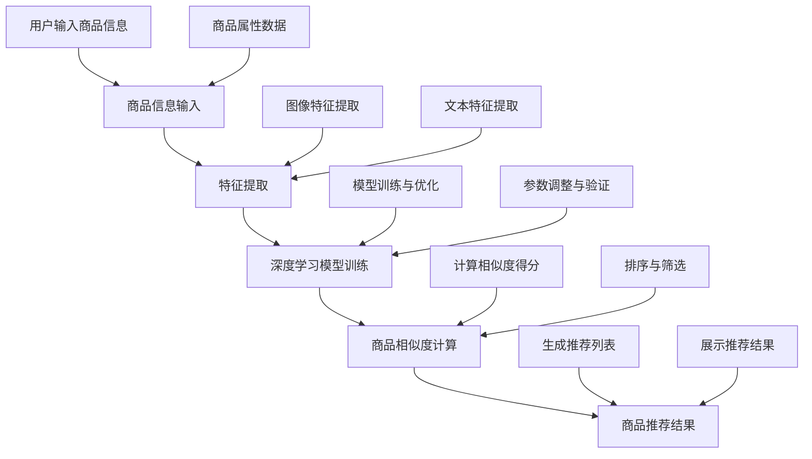

                 

### 文章标题：深度学习在商品相似度计算中的应用

关键词：深度学习、商品相似度、特征提取、卷积神经网络、循环神经网络、Transformer模型、商品推荐系统、电子商务平台

摘要：本文深入探讨了深度学习在商品相似度计算中的应用。首先，我们介绍了深度学习的基本概念和商品相似度计算的重要性。接着，我们详细讲解了商品特征提取方法和深度学习模型在商品相似度计算中的应用，包括卷积神经网络（CNN）、循环神经网络（RNN）和Transformer模型。此外，我们通过实际项目案例展示了深度学习算法在商品推荐系统和电子商务平台中的具体应用。最后，我们分析了深度学习在商品相似度计算中的挑战与未来发展趋势。本文旨在为研究人员和开发者提供有价值的参考和启示。

### 第一部分：背景知识与核心概念

#### 第1章：深度学习与商品相似度计算概述

**1.1 深度学习基础**

**1.1.1 深度学习的定义与发展历程**

深度学习（Deep Learning）是人工智能（Artificial Intelligence，AI）领域的一个重要分支，它通过模仿人脑的神经网络结构和信息处理方式，实现从大量数据中自动学习和提取特征，从而进行复杂的模式识别和决策。深度学习的核心思想是通过多层神经网络对输入数据进行逐层抽象和变换，从而提取出高层次的抽象特征。

深度学习起源于20世纪40年代，随着计算机性能和算法的进步，深度学习在21世纪初逐渐崛起。2006年，加拿大研究者Geoffrey Hinton等人提出了深度置信网络（Deep Belief Network，DBN）的概念，标志着深度学习的正式诞生。随后，卷积神经网络（Convolutional Neural Network，CNN）和递归神经网络（Recurrent Neural Network，RNN）等模型相继被提出，并在图像识别、语音识别、自然语言处理等领域取得了显著的成果。

**1.1.2 深度学习的基本原理**

深度学习的基本原理是基于多层神经网络的结构，通过逐层提取特征来学习数据中的复杂结构。一个典型的深度学习模型包括以下几个部分：

1. **输入层**：接收输入数据，例如图像、文本或声音等。

2. **隐藏层**：通过一系列的非线性变换，对输入数据进行特征提取和抽象。

3. **输出层**：将隐藏层的输出映射到具体的任务结果，如分类、回归等。

4. **权重与偏置**：神经网络中的参数，通过反向传播算法进行学习调整。

5. **激活函数**：引入非线性特性，使神经网络能够模拟人脑的决策过程。

6. **损失函数**：评估模型预测结果与真实结果之间的差距，用于指导模型优化。

7. **优化算法**：如梯度下降、随机梯度下降等，用于调整模型参数以最小化损失函数。

**1.2 商品相似度计算的重要性**

商品相似度计算（Product Similarity Computation）是指通过计算商品之间的相似性，为用户提供相关商品推荐、优化搜索结果等功能。在电子商务和推荐系统中，商品相似度计算具有以下几个重要应用：

1. **商品推荐系统**：通过计算用户购买或浏览过的商品与其他商品的相似度，为用户推荐符合其兴趣和需求的商品。

2. **商品搜索优化**：通过计算用户输入的关键词与商品描述的相似度，提高搜索结果的相关性和准确性。

3. **库存管理**：通过计算不同商品之间的相似性，优化库存布局，降低库存成本。

4. **市场分析**：通过分析商品之间的相似性，了解市场趋势和消费者偏好，为产品开发和市场策略提供依据。

**1.2.1 商品相似度计算的应用场景**

商品相似度计算在电子商务和推荐系统中具有广泛的应用场景：

1. **在线购物平台**：如亚马逊、淘宝等，通过商品相似度计算为用户提供个性化推荐，提高用户满意度和转化率。

2. **库存管理平台**：如阿里巴巴的菜鸟网络，通过商品相似度计算优化库存布局，提高库存周转率。

3. **二手交易平台**：如闲鱼、转转等，通过商品相似度计算为用户提供相关二手商品的推荐，促进交易。

4. **搜索引擎**：如百度、谷歌等，通过商品相似度计算优化搜索结果，提高用户体验。

**1.2.2 商品相似度计算的优势与挑战**

商品相似度计算具有以下优势：

1. **个性化推荐**：通过计算商品之间的相似度，为用户提供个性化的商品推荐，提高用户体验和转化率。

2. **精准搜索**：通过计算关键词与商品描述的相似度，提高搜索结果的相关性和准确性。

3. **优化库存**：通过计算商品之间的相似性，优化库存布局，降低库存成本。

4. **市场分析**：通过分析商品之间的相似性，了解市场趋势和消费者偏好，为产品开发和市场策略提供依据。

然而，商品相似度计算也面临一些挑战：

1. **数据质量**：商品描述和标签的数据质量对相似度计算结果有重要影响，数据质量问题可能导致推荐结果不准确。

2. **计算效率**：大规模商品数据的相似度计算需要高效的算法和计算资源。

3. **模型可解释性**：深度学习模型在商品相似度计算中的应用具有较高的预测性能，但模型内部决策过程往往难以解释，这给模型的应用和推广带来一定的困难。

**1.2.3 深度学习在商品相似度计算中的应用**

深度学习在商品相似度计算中具有显著的优势，能够有效应对上述挑战。通过深度学习模型，我们可以从大规模商品数据中自动提取高层次的抽象特征，提高相似度计算的准确性和效率。以下将详细介绍深度学习在商品相似度计算中的应用。

**1.2.4 深度学习与商品相似度计算的结合方式**

深度学习与商品相似度计算的结合方式主要有以下几种：

1. **特征提取**：使用深度学习模型对商品描述、图像、标签等多模态数据进行特征提取，为相似度计算提供高质量的输入特征。

2. **模型融合**：将深度学习模型与传统的相似度计算方法（如余弦相似度、欧氏距离等）相结合，提高相似度计算的准确性和鲁棒性。

3. **端到端学习**：直接使用深度学习模型进行商品相似度计算，无需手动设计特征提取和相似度计算方法。

**1.2.5 深度学习在商品相似度计算中的应用前景**

随着深度学习技术的不断发展和应用，深度学习在商品相似度计算中的应用前景十分广阔。未来，深度学习有望在以下方面取得突破：

1. **多模态特征融合**：通过融合商品描述、图像、标签等多模态数据，提高相似度计算的准确性和鲁棒性。

2. **迁移学习**：利用预训练的深度学习模型，在特定领域进行微调和优化，提高相似度计算的效率。

3. **自适应相似度计算**：根据用户行为和偏好动态调整相似度计算策略，实现更加个性化的商品推荐。

4. **跨领域相似度计算**：研究跨领域的商品相似度计算方法，拓展深度学习在电子商务、二手交易等领域的应用。

通过本文的介绍，我们初步了解了深度学习在商品相似度计算中的应用。接下来，我们将进一步探讨深度学习模型在商品相似度计算中的具体实现方法和应用案例。

### 第二部分：深度学习模型与算法

#### 第2章：商品特征提取方法

**2.1 商品特征提取方法**

商品特征提取是商品相似度计算中的关键步骤，它涉及到从原始数据中提取出有用的信息，用于后续的相似度计算。在深度学习中，商品特征提取可以通过多种方式实现，主要包括图像特征提取和文本特征提取。

**2.1.1 图像特征提取**

图像特征提取是指从商品图像中提取出与商品属性相关的特征，这些特征可以用于商品相似度计算。常见的图像特征提取方法包括：

1. **浅层特征提取**：使用传统的图像处理算法，如边缘检测、纹理分析等，从原始图像中提取出低层次的视觉特征。

2. **深层特征提取**：利用卷积神经网络（Convolutional Neural Network，CNN）等深度学习模型，从原始图像中自动提取高层次、抽象的视觉特征。

CNN 是一种经典的图像特征提取模型，其基本结构包括卷积层、池化层和全连接层。卷积层通过卷积运算提取图像中的局部特征，池化层用于降低特征维度和参数数量，全连接层将特征映射到具体的任务结果。以下是一个简单的 CNN 图像特征提取模型的伪代码：

```python
# 伪代码：CNN 图像特征提取模型

# 输入：商品图像
image = input_image

# 卷积层
conv1 = convolution(image, filter_size=3, stride=1, padding='same')
pool1 = pooling(conv1, pool_size=2, stride=2)

# 卷积层
conv2 = convolution(pool1, filter_size=3, stride=1, padding='same')
pool2 = pooling(conv2, pool_size=2, stride=2)

# 全连接层
output = fully_connected(pool2, num_classes)

# 输出：商品特征向量
features = output
```

**2.1.2 文本特征提取**

文本特征提取是指从商品描述、标签等文本数据中提取出与商品属性相关的特征，这些特征可以用于商品相似度计算。常见的文本特征提取方法包括：

1. **词袋模型（Bag of Words，BoW）**：将文本数据转化为向量表示，其中每个词的出现频率作为特征值。

2. **词嵌入（Word Embedding）**：将文本数据转化为向量的表示，通过预训练的词嵌入模型（如 Word2Vec、GloVe）将词映射到高维向量空间。

3. **Transformer 模型**：一种基于自注意力机制的深度学习模型，能够对文本数据生成全局上下文信息。

以下是一个简单的文本特征提取模型的伪代码：

```python
# 伪代码：Transformer 文本特征提取模型

# 输入：商品描述文本
text = input_text

# 词嵌入
embeddings = word_embedding(text)

# Transformer 编码器
encoded = transformer_encoder(embeddings)

# 输出：商品特征向量
features = encoded
```

**2.1.3 多模态特征融合**

在实际应用中，商品特征提取往往涉及到图像和文本等多模态数据。为了提高特征提取的效果，可以采用多模态特征融合的方法，将不同模态的特征进行整合。常见的多模态特征融合方法包括：

1. **特征拼接**：将图像特征和文本特征拼接在一起，形成更长的特征向量。

2. **特征加权**：根据不同模态特征的重要程度，对特征进行加权融合。

3. **多模态学习**：使用多模态深度学习模型，如多模态卷积神经网络（Multimodal CNN）、多模态 Transformer 模型，自动学习多模态特征融合策略。

以下是一个简单的多模态特征融合模型的伪代码：

```python
# 伪代码：多模态特征融合模型

# 输入：商品图像、商品描述文本
image = input_image
text = input_text

# 图像特征提取
image_features = image_feature_extractor(image)

# 文本特征提取
text_features = text_feature_extractor(text)

# 特征拼接
combined_features = concatenate(image_features, text_features)

# 输出：商品特征向量
features = combined_features
```

通过以上介绍，我们了解了商品特征提取的基本方法。接下来，我们将进一步探讨深度学习模型在商品相似度计算中的应用。

#### 第2章：深度学习模型在商品相似度计算中的应用

深度学习模型在商品相似度计算中的应用主要包括卷积神经网络（CNN）、循环神经网络（RNN）和Transformer模型。这些模型能够从多模态数据中提取抽象特征，并实现高精度的商品相似度计算。以下将详细介绍这些模型的原理和实现。

**2.2.1 卷积神经网络（CNN）的应用**

卷积神经网络（Convolutional Neural Network，CNN）是一种经典的深度学习模型，广泛应用于图像处理和计算机视觉领域。CNN 的核心思想是通过卷积运算提取图像中的局部特征，然后通过池化操作降低特征维度，从而实现图像的分层特征提取。

在商品相似度计算中，CNN 可以用于提取商品图像的特征。以下是一个简单的 CNN 模型用于商品相似度计算的伪代码：

```python
# 伪代码：CNN 商品相似度计算模型

# 输入：商品图像 A 和商品图像 B
image_A = input_image_A
image_B = input_image_B

# 卷积层 1
conv1_A = convolution(image_A, filter_size=3, stride=1, padding='same')
pool1_A = pooling(conv1_A, pool_size=2, stride=2)

# 卷积层 2
conv2_A = convolution(pool1_A, filter_size=3, stride=1, padding='same')
pool2_A = pooling(conv2_A, pool_size=2, stride=2)

# 卷积层 1
conv1_B = convolution(image_B, filter_size=3, stride=1, padding='same')
pool1_B = pooling(conv1_B, pool_size=2, stride=2)

# 卷积层 2
conv2_B = convolution(pool1_B, filter_size=3, stride=1, padding='same')
pool2_B = pooling(conv2_B, pool_size=2, stride=2)

# 全连接层
output_A = fully_connected(pool2_A, num_classes)
output_B = fully_connected(pool2_B, num_classes)

# 输出：商品 A 和商品 B 的相似度得分
similarity_score = cosine_similarity(output_A, output_B)
```

在这个模型中，商品图像 A 和商品图像 B 分别通过两个 CNN 模型提取特征，然后通过全连接层将特征映射到具体的相似度得分。这个模型的优点是能够自动提取图像的局部和全局特征，从而实现高精度的商品相似度计算。

**2.2.2 循环神经网络（RNN）的应用**

循环神经网络（Recurrent Neural Network，RNN）是一种能够处理序列数据的深度学习模型，其核心思想是利用隐藏状态的记忆能力，对序列数据进行建模。RNN 在自然语言处理、语音识别等领域取得了显著成果。

在商品相似度计算中，RNN 可以用于提取商品描述的序列特征。以下是一个简单的 RNN 模型用于商品相似度计算的伪代码：

```python
# 伪代码：RNN 商品相似度计算模型

# 输入：商品描述 A 和商品描述 B
description_A = input_description_A
description_B = input_description_B

# 词嵌入
embeddings_A = word_embedding(description_A)
embeddings_B = word_embedding(description_B)

# RNN 编码器
encoded_A = rnn_encoder(embeddings_A)
encoded_B = rnn_encoder(embeddings_B)

# 全连接层
output_A = fully_connected(encoded_A, num_classes)
output_B = fully_connected(encoded_B, num_classes)

# 输出：商品 A 和商品 B 的相似度得分
similarity_score = cosine_similarity(output_A, output_B)
```

在这个模型中，商品描述 A 和商品描述 B 通过词嵌入转化为向量表示，然后通过 RNN 编码器提取序列特征，最后通过全连接层将特征映射到具体的相似度得分。这个模型的优点是能够捕获商品描述中的时间依赖关系，从而实现高精度的商品相似度计算。

**2.2.3 Transformer 模型的应用**

Transformer 模型是一种基于自注意力机制的深度学习模型，其核心思想是通过多头自注意力机制和前馈神经网络，对序列数据进行建模。Transformer 模型在自然语言处理领域取得了显著成果，近年来也开始应用于图像处理和商品相似度计算等领域。

在商品相似度计算中，Transformer 模型可以用于提取商品图像和描述的联合特征。以下是一个简单的 Transformer 模型用于商品相似度计算的伪代码：

```python
# 伪代码：Transformer 商品相似度计算模型

# 输入：商品图像 A、商品描述 A、商品图像 B、商品描述 B
image_A = input_image_A
description_A = input_description_A
image_B = input_image_B
description_B = input_description_B

# 图像特征提取
image_features_A = image_feature_extractor(image_A)
image_features_B = image_feature_extractor(image_B)

# 词嵌入
embeddings_A = word_embedding(description_A)
embeddings_B = word_embedding(description_B)

# Transformer 编码器
encoded_A = transformer_encoder(embeddings_A, image_features_A)
encoded_B = transformer_encoder(embeddings_B, image_features_B)

# 全连接层
output_A = fully_connected(encoded_A, num_classes)
output_B = fully_connected(encoded_B, num_classes)

# 输出：商品 A 和商品 B 的相似度得分
similarity_score = cosine_similarity(output_A, output_B)
```

在这个模型中，商品图像 A、商品描述 A、商品图像 B、商品描述 B 分别通过不同的特征提取模块进行预处理，然后通过 Transformer 编码器提取联合特征，最后通过全连接层将特征映射到具体的相似度得分。这个模型的优点是能够融合图像和文本特征，从而实现高精度的商品相似度计算。

通过以上介绍，我们了解了深度学习模型在商品相似度计算中的应用。在实际应用中，可以结合具体需求选择合适的模型，以提高商品相似度计算的准确性和效率。

### 第3章：深度学习算法原理与实现

深度学习算法在商品相似度计算中的应用，需要理解其核心原理和实现方法。本章将详细介绍深度学习算法的基本原理、神经网络架构、损失函数与优化算法，以及深度学习训练策略。

#### 3.1 深度学习算法原理

深度学习算法基于多层神经网络结构，通过逐层提取特征，实现对输入数据的复杂建模。深度学习算法的核心思想是通过反向传播算法（Backpropagation）不断调整网络参数，使得模型在训练数据上达到较好的泛化能力。

**3.1.1 神经网络架构**

神经网络是深度学习算法的基础，其基本结构包括输入层、隐藏层和输出层。每个神经元都接收前一层神经元的输出，并通过加权求和和激活函数进行非线性变换，最终产生输出。

1. **输入层**：接收输入数据，如商品图像、文本描述等。

2. **隐藏层**：通过一系列的非线性变换，提取数据中的高层次特征。

3. **输出层**：将隐藏层的输出映射到具体的任务结果，如商品相似度得分。

每个神经元都可以看作是一个线性函数加上一个非线性激活函数。一个简单的神经元计算过程可以表示为：

$$
a_i = \text{sigmoid}(z_i)
$$

其中，$z_i$ 是输入层到隐藏层的加权求和，$\text{sigmoid}$ 是非线性激活函数：

$$
\text{sigmoid}(x) = \frac{1}{1 + e^{-x}}
$$

**3.1.2 损失函数与优化算法**

损失函数用于衡量模型预测结果与真实结果之间的差距，是深度学习训练的核心目标。常见的损失函数包括均方误差（MSE）、交叉熵（Cross Entropy）等。

1. **均方误差（MSE）**：

$$
\text{MSE} = \frac{1}{n}\sum_{i=1}^{n}(y_i - \hat{y}_i)^2
$$

其中，$y_i$ 是真实标签，$\hat{y}_i$ 是模型预测结果。

2. **交叉熵（Cross Entropy）**：

$$
\text{Cross Entropy} = -\sum_{i=1}^{n} y_i \log(\hat{y}_i)
$$

其中，$y_i$ 是真实标签，$\hat{y}_i$ 是模型预测结果。

优化算法用于调整网络参数，以最小化损失函数。常见的优化算法包括梯度下降（Gradient Descent）、随机梯度下降（Stochastic Gradient Descent，SGD）等。

1. **梯度下降**：

$$
\theta_{\text{new}} = \theta_{\text{old}} - \alpha \nabla_{\theta} J(\theta)
$$

其中，$\theta$ 表示网络参数，$\alpha$ 是学习率，$J(\theta)$ 是损失函数。

2. **随机梯度下降（SGD）**：

$$
\theta_{\text{new}} = \theta_{\text{old}} - \alpha \nabla_{\theta} J(\theta; x_i, y_i)
$$

其中，$x_i, y_i$ 表示训练数据中的单个样本。

**3.1.3 深度学习训练策略**

深度学习训练过程中，需要关注以下几个策略：

1. **批量大小**：批量大小（Batch Size）是每个训练迭代过程中参与训练的样本数量。较小的批量大小可以加快训练速度，但可能导致梯度不稳定；较大的批量大小可以提高模型泛化能力，但训练速度较慢。

2. **学习率调整**：学习率是优化算法的关键参数，合适的初始学习率可以加速收敛，但过大会导致模型无法收敛，过小则收敛速度过慢。常用的学习率调整策略包括恒定学习率、指数衰减学习率等。

3. **数据增强**：通过增加数据多样性，提高模型泛化能力。常见的数据增强方法包括随机裁剪、翻转、旋转等。

4. **正则化**：防止模型过拟合，提高泛化能力。常见的正则化方法包括 L1 正则化、L2 正则化、Dropout 等。

5. **早停法（Early Stopping）**：在训练过程中，当验证集上的损失函数不再下降时，提前停止训练，以防止模型过拟合。

通过以上介绍，我们了解了深度学习算法的基本原理和实现方法。在接下来的章节中，我们将通过具体实例，展示深度学习算法在商品相似度计算中的实际应用。

#### 3.2 商品相似度计算算法实现

商品相似度计算算法是电子商务和推荐系统中的核心组件，通过计算商品之间的相似性，为用户提供个性化的商品推荐和搜索结果优化。以下将介绍商品相似度计算算法的伪代码实现，并详细解读关键步骤。

**3.2.1 伪代码实现**

```python
# 伪代码：商品相似度计算算法

# 输入：商品 A 和商品 B 的特征向量
features_A = input_features_A
features_B = input_features_B

# 1. 计算特征向量之间的余弦相似度
similarity_score = cosine_similarity(features_A, features_B)

# 2. 将相似度得分归一化到 [0, 1] 范围
normalized_score = normalize_similarity(similarity_score)

# 输出：商品 A 和商品 B 的相似度得分
return normalized_score
```

**3.2.2 关键步骤解析**

1. **特征向量计算**：商品相似度计算的基础是商品的特征向量。特征向量可以是基于图像、文本或多模态数据的深度学习模型提取的。例如，可以使用卷积神经网络（CNN）提取商品图像的特征向量，使用循环神经网络（RNN）提取商品文本的特征向量。多模态数据可以通过多模态深度学习模型（如多模态 CNN 或 Transformer）进行联合特征提取。

2. **余弦相似度计算**：余弦相似度是一种常用的相似度度量方法，用于计算两个向量之间的角度余弦值。其计算公式如下：

$$
\text{similarity} = \frac{\text{feature\_A} \cdot \text{feature\_B}}{\|\text{feature\_A}\| \|\text{feature\_B}\|}
$$

其中，$\text{feature\_A}$ 和 $\text{feature\_B}$ 分别是商品 A 和商品 B 的特征向量，$\|\text{feature\_A}\|$ 和 $\|\text{feature\_B}\|$ 分别是特征向量的模长。

3. **归一化相似度得分**：为了使相似度得分在 [0, 1] 范围内，可以通过归一化操作进行缩放。归一化公式如下：

$$
\text{normalized\_score} = \frac{\text{similarity} - \min(\text{similarity})}{\max(\text{similarity}) - \min(\text{similarity})}
$$

通过以上公式，可以将相似度得分映射到 [0, 1] 范围，便于后续的比较和排序。

**3.2.3 实现细节**

1. **特征向量提取**：对于图像特征，可以使用预训练的 CNN 模型（如 ResNet、VGG 等）提取特征向量。对于文本特征，可以使用预训练的词嵌入模型（如 Word2Vec、GloVe 等）提取词向量，然后进行平均或最大池化操作得到商品文本的特征向量。

2. **相似度计算**：在实际应用中，可以使用现成的相似度计算库（如 scikit-learn 的 `cosine_similarity` 函数）进行计算，也可以自定义相似度计算函数。

3. **归一化**：归一化操作可以防止相似度得分过大或过小，提高算法的稳定性和可解释性。

通过以上步骤，我们可以实现商品相似度计算算法。在实际应用中，可以根据具体需求调整特征提取方法和相似度计算策略，以提高算法的性能和鲁棒性。

#### 3.2.4 Python 代码实现

以下是一个基于 Python 的商品相似度计算算法的示例代码，使用 Scikit-learn 库进行相似度计算和归一化。

```python
import numpy as np
from sklearn.metrics.pairwise import cosine_similarity
from sklearn.preprocessing import MinMaxScaler

def compute_similarity(features_A, features_B):
    """
    计算商品 A 和商品 B 的相似度。
    
    参数：
    - features_A: 商品 A 的特征向量
    - features_B: 商品 B 的特征向量
    
    返回：
    - normalized_score: 归一化的相似度得分
    """
    # 计算余弦相似度
    similarity_score = cosine_similarity([features_A], [features_B])[0, 0]
    
    # 归一化相似度得分
    scaler = MinMaxScaler()
    normalized_score = scaler.fit_transform([[similarity_score]])
    
    return normalized_score

# 示例：商品 A 和商品 B 的特征向量
features_A = np.random.rand(1, 100)  # 假设特征维度为 100
features_B = np.random.rand(1, 100)

# 计算相似度得分
normalized_score = compute_similarity(features_A, features_B)

print("商品 A 和商品 B 的相似度得分：", normalized_score)
```

在这个示例中，我们首先从 Scikit-learn 库中导入 `cosine_similarity` 函数和 `MinMaxScaler` 类，用于计算余弦相似度和归一化操作。`compute_similarity` 函数接收两个商品的特征向量，计算余弦相似度，并将其归一化到 [0, 1] 范围。最后，我们使用随机生成的特征向量进行相似度计算，并输出结果。

通过以上代码，我们可以实现商品相似度计算算法。在实际应用中，可以根据具体需求调整特征向量的提取方法和相似度计算策略，以提高算法的性能和鲁棒性。

### 第三部分：应用案例与项目实战

#### 第4章：商品推荐系统中的相似度计算

商品推荐系统是电子商务和在线购物平台的核心功能之一，通过计算商品之间的相似度，为用户提供个性化的商品推荐，提高用户满意度和转化率。本章将介绍商品推荐系统中相似度计算的应用，包括工作流程、算法原理和实际案例。

**4.1 商品推荐系统概述**

商品推荐系统（Product Recommendation System）是一种基于用户行为和商品属性进行推荐的系统，其目标是为用户推荐符合其兴趣和需求的商品。商品推荐系统通常包括以下几个主要组成部分：

1. **用户画像**：根据用户的历史行为、兴趣爱好等特征，构建用户画像，用于后续的推荐策略。

2. **商品画像**：根据商品的基本属性、标签、评价等信息，构建商品画像，用于计算商品之间的相似性。

3. **推荐算法**：基于用户画像和商品画像，通过相似度计算和算法优化，生成个性化的商品推荐列表。

4. **推荐结果展示**：将推荐结果以合适的界面形式展示给用户，包括推荐商品列表、推荐理由等。

**4.1.1 商品推荐系统的工作流程**

商品推荐系统的工作流程可以分为以下几个步骤：

1. **数据收集**：收集用户行为数据（如点击、购买、评价等）和商品属性数据（如分类、标签、价格等）。

2. **数据预处理**：对原始数据进行清洗、去重、缺失值填充等预处理操作，以提高数据质量。

3. **用户画像构建**：根据用户行为数据，构建用户画像，包括用户兴趣标签、浏览记录、购买记录等。

4. **商品画像构建**：根据商品属性数据，构建商品画像，包括商品分类、标签、价格、评价等。

5. **相似度计算**：计算用户和商品之间的相似度，常用的相似度计算方法包括余弦相似度、欧氏距离等。

6. **推荐结果生成**：基于相似度计算结果，生成个性化的商品推荐列表，并根据用户偏好进行排序。

7. **推荐结果展示**：将推荐结果以可视化界面形式展示给用户，提高用户互动和参与度。

**4.1.2 商品推荐系统的重要性**

商品推荐系统在电子商务和在线购物平台中具有重要作用，主要体现在以下几个方面：

1. **提高用户满意度**：通过个性化推荐，为用户提供符合其兴趣和需求的商品，提高用户购物体验和满意度。

2. **提升转化率**：通过推荐系统，引导用户发现更多潜在的购物需求，提高购物转化率和销售额。

3. **降低运营成本**：通过自动化推荐，减少人工筛选和推荐的工作量，降低运营成本。

4. **挖掘潜在用户需求**：通过分析用户行为和偏好，挖掘潜在用户需求，为市场营销和产品开发提供依据。

**4.2 深度学习在商品推荐系统中的应用**

随着深度学习技术的不断发展，深度学习在商品推荐系统中的应用逐渐成为研究热点。深度学习模型能够从大规模数据中自动提取高层次的抽象特征，提高相似度计算的准确性和效率。以下将介绍深度学习在商品推荐系统中的应用。

**4.2.1 基于深度学习的商品推荐算法**

基于深度学习的商品推荐算法主要包括以下几种：

1. **基于 CNN 的商品推荐算法**：使用卷积神经网络（CNN）提取商品图像的特征向量，然后通过深度学习模型计算用户和商品之间的相似度。这种算法适用于处理图像丰富的商品推荐场景，如电商平台的商品推荐。

2. **基于 RNN 的商品推荐算法**：使用循环神经网络（RNN）提取商品描述的序列特征，然后通过深度学习模型计算用户和商品之间的相似度。这种算法适用于处理文本丰富的商品推荐场景，如在线图书平台的书本推荐。

3. **基于 Transformer 的商品推荐算法**：使用 Transformer 模型提取商品图像和描述的联合特征，然后通过深度学习模型计算用户和商品之间的相似度。这种算法能够融合多模态数据，提高推荐效果。

以下是一个简单的基于 CNN 和 RNN 的商品推荐算法的伪代码示例：

```python
# 伪代码：基于 CNN 和 RNN 的商品推荐算法

# 输入：用户行为数据、商品属性数据
user_data = input_user_data
product_data = input_product_data

# 1. 提取用户行为特征
user_features = extract_user_features(user_data)

# 2. 提取商品图像特征
product_features = extract_product_features(product_data)

# 3. 计算用户和商品之间的相似度
similarity_scores = compute_similarity(user_features, product_features)

# 4. 排序和生成推荐列表
recommends = sort_recommends(similarity_scores)

# 输出：商品推荐列表
return recommends
```

在这个算法中，首先提取用户行为特征和商品图像特征，然后计算用户和商品之间的相似度，并根据相似度得分生成推荐列表。在实际应用中，可以根据具体需求调整特征提取和相似度计算的方法，以提高推荐效果。

**4.2.2 实际案例分析与优化**

以下将介绍一个基于深度学习的商品推荐系统的实际案例，并分析其优化策略。

**案例：电商平台的商品推荐**

某电商平台希望通过深度学习模型为用户推荐符合其兴趣和需求的商品。该平台收集了用户的历史购买记录、浏览记录、商品评价等数据，以及商品的基本属性（如分类、标签、价格等）。

**优化策略：**

1. **特征工程**：对原始数据进行预处理，包括缺失值填充、数据标准化等，以提高数据质量。同时，对用户行为数据进行特征提取，如用户活跃度、购买频率等，以丰富用户画像。

2. **模型选择**：根据数据特点，选择合适的深度学习模型。例如，对于商品图像特征丰富的场景，可以选择基于 CNN 的模型；对于商品描述文本丰富的场景，可以选择基于 RNN 的模型。

3. **多模态融合**：通过多模态深度学习模型（如多模态 CNN 或 Transformer）融合商品图像和文本特征，提高推荐效果。

4. **在线学习与实时推荐**：使用在线学习算法，根据用户实时行为更新模型参数，实现实时推荐。例如，可以使用增量学习算法（如 Online Gradient Descent）或迁移学习算法（如 Fine-tuning 预训练模型）。

5. **A/B 测试与效果评估**：通过 A/B 测试评估不同模型和优化策略的效果，持续优化推荐系统。

通过以上优化策略，电商平台可以显著提升商品推荐的效果，提高用户满意度和转化率。

综上所述，深度学习在商品推荐系统中的应用具有重要的研究价值和实际应用价值。通过优化特征提取、模型选择和在线学习等策略，可以进一步提高推荐系统的性能和用户体验。

### 第5章：电子商务平台中的商品相似度计算

电子商务平台是深度学习技术的重要应用场景之一，商品相似度计算作为电子商务平台的核心功能，对于提升用户体验、优化搜索结果和增加销售额具有重要意义。本章将探讨深度学习在电子商务平台中的商品相似度计算，包括电子商务平台的基本功能、深度学习算法的应用案例以及优化策略。

#### 5.1 电子商务平台概述

电子商务平台是一种在线交易市场，通过互联网为买卖双方提供商品交易服务。电子商务平台的基本功能包括：

1. **商品展示**：通过网页、移动应用等渠道展示各种商品，包括商品名称、图片、价格、描述等信息。

2. **商品搜索**：根据用户输入的关键词或搜索条件，快速检索相关商品。

3. **商品推荐**：基于用户的历史行为、兴趣爱好等，为用户推荐符合其需求的商品。

4. **购物车与结算**：用户可以将商品添加到购物车，并完成订单结算。

5. **用户评价**：用户可以对购买过的商品进行评价，为其他用户提供参考。

6. **支付与物流**：提供多种支付方式，并与物流公司合作，确保商品快速送达。

电子商务平台的核心目标是提升用户体验，增加销售额和市场份额。通过商品相似度计算，电子商务平台可以实现个性化推荐、精准搜索和库存优化等功能。

#### 5.2 深度学习在电子商务平台中的应用

深度学习在电子商务平台中的应用主要体现在商品相似度计算方面。通过深度学习模型，可以自动提取商品的多维度特征，提高相似度计算的准确性和效率。以下将介绍几种常用的深度学习算法在电子商务平台中的应用。

**1. 卷积神经网络（CNN）**

卷积神经网络（CNN）是一种经典的深度学习模型，广泛应用于图像处理和计算机视觉领域。在电子商务平台中，CNN 可以用于提取商品图像的特征，进而计算商品之间的相似度。以下是一个简单的 CNN 模型在商品相似度计算中的应用：

```python
# 伪代码：基于 CNN 的商品相似度计算

# 输入：商品图像 A 和商品图像 B
image_A = input_image_A
image_B = input_image_B

# 卷积层 1
conv1_A = convolution(image_A, filter_size=3, stride=1, padding='same')
pool1_A = pooling(conv1_A, pool_size=2, stride=2)

# 卷积层 2
conv2_A = convolution(pool1_A, filter_size=3, stride=1, padding='same')
pool2_A = pooling(conv2_A, pool_size=2, stride=2)

# 卷积层 1
conv1_B = convolution(image_B, filter_size=3, stride=1, padding='same')
pool1_B = pooling(conv1_B, pool_size=2, stride=2)

# 卷积层 2
conv2_B = convolution(pool1_B, filter_size=3, stride=1, padding='same')
pool2_B = pooling(conv2_B, pool_size=2, stride=2)

# 全连接层
output_A = fully_connected(pool2_A, num_classes)
output_B = fully_connected(pool2_B, num_classes)

# 输出：商品 A 和商品 B 的相似度得分
similarity_score = cosine_similarity(output_A, output_B)
```

在这个模型中，商品图像 A 和商品图像 B 通过 CNN 模型提取特征，然后通过全连接层将特征映射到具体的相似度得分。这个模型能够自动提取图像的局部和全局特征，从而实现高精度的商品相似度计算。

**2. 循环神经网络（RNN）**

循环神经网络（RNN）是一种能够处理序列数据的深度学习模型，广泛应用于自然语言处理、语音识别等领域。在电子商务平台中，RNN 可以用于提取商品描述的序列特征，进而计算商品之间的相似度。以下是一个简单的 RNN 模型在商品相似度计算中的应用：

```python
# 伪代码：基于 RNN 的商品相似度计算

# 输入：商品描述 A 和商品描述 B
description_A = input_description_A
description_B = input_description_B

# 词嵌入
embeddings_A = word_embedding(description_A)
embeddings_B = word_embedding(description_B)

# RNN 编码器
encoded_A = rnn_encoder(embeddings_A)
encoded_B = rnn_encoder(embeddings_B)

# 全连接层
output_A = fully_connected(encoded_A, num_classes)
output_B = fully_connected(encoded_B, num_classes)

# 输出：商品 A 和商品 B 的相似度得分
similarity_score = cosine_similarity(output_A, output_B)
```

在这个模型中，商品描述 A 和商品描述 B 通过词嵌入转化为向量表示，然后通过 RNN 编码器提取序列特征，最后通过全连接层将特征映射到具体的相似度得分。这个模型能够捕获商品描述中的时间依赖关系，从而实现高精度的商品相似度计算。

**3. Transformer 模型**

Transformer 模型是一种基于自注意力机制的深度学习模型，其核心思想是通过对序列数据进行自注意力机制处理，实现全局信息融合。在电子商务平台中，Transformer 模型可以用于提取商品图像和描述的联合特征，从而实现高精度的商品相似度计算。以下是一个简单的 Transformer 模型在商品相似度计算中的应用：

```python
# 伪代码：基于 Transformer 的商品相似度计算

# 输入：商品图像 A、商品描述 A、商品图像 B、商品描述 B
image_A = input_image_A
description_A = input_description_A
image_B = input_image_B
description_B = input_description_B

# 图像特征提取
image_features_A = image_feature_extractor(image_A)
image_features_B = image_feature_extractor(image_B)

# 词嵌入
embeddings_A = word_embedding(description_A)
embeddings_B = word_embedding(description_B)

# Transformer 编码器
encoded_A = transformer_encoder(embeddings_A, image_features_A)
encoded_B = transformer_encoder(embeddings_B, image_features_B)

# 全连接层
output_A = fully_connected(encoded_A, num_classes)
output_B = fully_connected(encoded_B, num_classes)

# 输出：商品 A 和商品 B 的相似度得分
similarity_score = cosine_similarity(output_A, output_B)
```

在这个模型中，商品图像 A、商品描述 A、商品图像 B、商品描述 B 分别通过不同的特征提取模块进行预处理，然后通过 Transformer 编码器提取联合特征，最后通过全连接层将特征映射到具体的相似度得分。这个模型能够融合图像和文本特征，从而实现高精度的商品相似度计算。

**5.3 实际案例分析与优化**

以下将介绍一个电子商务平台的商品相似度计算实际案例，并分析其优化策略。

**案例：某电商平台的商品相似度计算**

某电商平台希望通过深度学习模型为用户推荐符合其兴趣和需求的商品。该平台收集了用户的历史购买记录、浏览记录、商品评价等数据，以及商品的基本属性（如分类、标签、价格等）。

**优化策略：**

1. **多模态特征融合**：通过多模态深度学习模型（如多模态 CNN 或 Transformer）融合商品图像和文本特征，提高推荐效果。

2. **在线学习与实时推荐**：使用在线学习算法，根据用户实时行为更新模型参数，实现实时推荐。例如，可以使用增量学习算法（如 Online Gradient Descent）或迁移学习算法（如 Fine-tuning 预训练模型）。

3. **A/B 测试与效果评估**：通过 A/B 测试评估不同模型和优化策略的效果，持续优化推荐系统。

4. **数据预处理与清洗**：对原始数据进行预处理，包括缺失值填充、数据标准化等，以提高数据质量。

5. **模型选择与调优**：根据数据特点和业务需求，选择合适的深度学习模型，并通过调优模型参数，提高相似度计算的准确性和效率。

通过以上优化策略，电商平台可以显著提升商品推荐的效果，提高用户满意度和转化率。

综上所述，深度学习在电子商务平台中的商品相似度计算具有重要的应用价值。通过优化特征提取、模型选择和在线学习等策略，可以进一步提高推荐系统的性能和用户体验。

### 第四部分：挑战与未来发展

#### 第6章：深度学习在商品相似度计算中的应用挑战

深度学习在商品相似度计算中具有显著的优势，但也面临一些挑战。本章将分析深度学习在商品相似度计算中的应用挑战，包括数据质量、模型可解释性和公平性等方面。

**6.1 数据质量与多样性**

**6.1.1 数据质量问题**

数据质量是深度学习模型性能的基础，对商品相似度计算结果具有重要影响。以下是一些常见的数据质量问题：

1. **缺失值**：商品数据中可能存在缺失值，如用户评价、购买记录等。缺失值可能导致模型无法正常训练，影响相似度计算结果。

2. **噪声数据**：商品数据中可能存在噪声，如错误的商品描述、重复的数据等。噪声数据会干扰模型学习，降低相似度计算准确性。

3. **不平衡数据**：在商品推荐系统中，不同类别的商品可能有不同的数量，导致数据分布不均。不平衡数据可能导致模型偏向于多数类，忽略少数类商品的相似度计算。

**6.1.2 数据多样性对相似度计算的影响**

数据多样性是深度学习模型学习复杂模式的重要保证。以下讨论数据多样性对商品相似度计算的影响：

1. **数据分布**：商品数据的分布影响模型的泛化能力。如果数据分布过于集中，模型可能无法学习到不同类别商品的相似性。

2. **数据标注**：在商品相似度计算中，数据标注的准确性影响模型的训练效果。如果标注不准确，模型可能无法正确识别商品的相似性。

**6.1.3 提高数据质量的策略**

为了提高商品相似度计算的性能，可以采取以下策略：

1. **数据清洗**：对商品数据进行预处理，包括缺失值填充、噪声数据过滤等，提高数据质量。

2. **数据增强**：通过数据增强技术（如数据扩充、数据转换等）增加数据的多样性，提高模型泛化能力。

3. **数据标注**：采用自动化标注工具或人工标注，提高数据标注的准确性。

**6.2 模型可解释性与公平性**

**6.2.1 模型可解释性的重要性**

深度学习模型在商品相似度计算中的应用虽然具有较高的预测性能，但其内部决策过程往往难以解释。模型可解释性（Model Explainability）是指能够理解和解释模型决策过程的能力，对于模型的应用和推广具有重要意义。以下讨论模型可解释性的重要性：

1. **用户信任**：用户更倾向于信任可解释的模型，从而增加对推荐系统的信任度。

2. **错误诊断**：可解释性有助于识别模型决策中的潜在问题，从而进行优化和调整。

3. **监管合规**：在金融、医疗等敏感领域，模型的可解释性有助于满足监管合规要求。

**6.2.2 模型公平性的保障策略**

深度学习模型在商品相似度计算中可能存在公平性问题，如性别、年龄、地域等不公平因素的影响。模型公平性（Model Fairness）是指模型在不同群体中的表现一致性，对于维护社会公平具有重要意义。以下讨论模型公平性的保障策略：

1. **数据平衡**：通过数据平衡技术（如 oversampling、undersampling 等）减少数据集中的不公平现象。

2. **公平性度量**：设计公平性度量指标，评估模型在不同群体中的表现，从而识别和解决公平性问题。

3. **算法约束**：通过算法约束（如公平性约束优化、公平性敏感损失函数等）确保模型在不同群体中的表现一致性。

**6.3 模型可解释性与公平性的技术进展**

随着深度学习技术的不断发展，研究者们提出了多种方法来解决模型可解释性和公平性问题。以下介绍一些相关技术进展：

1. **注意力机制**：注意力机制（Attention Mechanism）能够揭示模型在决策过程中的关注点，提高模型可解释性。

2. **模型解释工具**：开发模型解释工具（如 LIME、SHAP 等），帮助用户理解模型的决策过程。

3. **公平性增强算法**：设计公平性增强算法（如 Fair Loss Function、Fair Autoencoder 等），确保模型在不同群体中的表现一致性。

4. **多任务学习**：通过多任务学习（Multi-Task Learning）同时学习相似度计算和公平性优化，提高模型的综合性能。

通过以上分析和技术进展，我们可以看到深度学习在商品相似度计算中面临的挑战，以及研究者们为解决这些挑战所做出的努力。在未来的发展中，深度学习技术将继续在商品相似度计算中发挥重要作用，同时也需要不断改进和优化，以实现更高的性能和更广泛的应用。

#### 第7章：深度学习在商品相似度计算中的未来发展趋势

深度学习在商品相似度计算中的应用前景广阔，随着技术的不断进步，未来将出现一系列新的发展趋势。本章将讨论深度学习在商品相似度计算中的未来发展趋势，包括新型深度学习算法的发展、跨领域与多模态的相似度计算以及潜在的应用前景。

**7.1 新型深度学习算法的发展**

1. **自适应深度学习算法**

自适应深度学习算法（Adaptive Deep Learning Algorithms）是一种能够根据数据特征和环境变化动态调整模型参数的算法。这种算法能够更好地应对数据质量差异和数据多样性变化，从而提高商品相似度计算的准确性和鲁棒性。例如，基于注意力机制（Attention Mechanism）的自适应算法可以自动关注数据中的重要特征，提高模型的学习效果。

2. **生成对抗网络（GAN）的应用**

生成对抗网络（Generative Adversarial Networks，GAN）是一种强大的生成模型，通过两个对抗网络的博弈生成与真实数据高度相似的数据。GAN 在商品相似度计算中可以用于生成高质量的训练数据，缓解数据稀缺性问题。例如，GAN 可以生成与真实商品图像相似的商品图像，用于训练商品特征提取模型，提高相似度计算的准确性和效率。

**7.2 跨领域与多模态的相似度计算**

跨领域与多模态的相似度计算是深度学习在商品相似度计算中的重要研究方向。随着多模态数据源的丰富，如何有效融合不同模态的数据特征，提高商品相似度计算的性能，成为一个重要课题。

1. **跨领域相似度计算**

跨领域相似度计算（Cross-Domain Similarity Computation）旨在解决不同领域之间商品相似性计算的问题。在电子商务平台上，商品可能来自不同的领域，如时尚、家居、电子等。跨领域相似度计算可以识别和比较不同领域商品的相似性，为用户提供更准确和全面的推荐。例如，可以使用多任务学习（Multi-Task Learning）将不同领域商品的特征进行联合建模，提高跨领域相似度计算的准确性和泛化能力。

2. **多模态相似度计算**

多模态相似度计算（Multimodal Similarity Computation）旨在融合不同模态的数据特征，如图像、文本、音频等。通过多模态特征融合，可以捕捉更丰富的商品信息，提高商品相似度计算的准确性。例如，可以使用多模态卷积神经网络（Multimodal CNN）或多模态 Transformer 模型，将不同模态的数据特征进行联合建模和融合。此外，基于自注意力机制（Self-Attention Mechanism）的多模态相似度计算方法可以自动关注数据中的重要特征，提高模型的学习效果。

**7.3 深度学习在商品相似度计算中的应用前景**

随着深度学习技术的不断发展，深度学习在商品相似度计算中的应用前景十分广阔。以下是一些潜在的应用前景：

1. **智能推荐系统**：深度学习可以用于构建智能推荐系统，通过商品相似度计算为用户提供个性化的商品推荐，提高用户满意度和转化率。

2. **商品搜索优化**：深度学习可以用于优化商品搜索结果，通过商品相似度计算提高搜索结果的准确性和相关性，为用户提供更优质的搜索体验。

3. **库存管理**：深度学习可以用于优化库存管理，通过商品相似度计算分析不同商品的关联性和依赖性，提高库存周转率和降低库存成本。

4. **市场分析**：深度学习可以用于市场分析，通过商品相似度计算分析市场趋势和消费者偏好，为产品开发和市场策略提供数据支持。

5. **智能客服**：深度学习可以用于构建智能客服系统，通过商品相似度计算为用户提供个性化的产品咨询和服务，提高客服效率和用户满意度。

总之，深度学习在商品相似度计算中的应用具有巨大的发展潜力。通过不断探索和优化深度学习算法，可以进一步提高商品相似度计算的准确性和效率，为电子商务和推荐系统的发展提供强有力的技术支持。

### 附录A：深度学习工具与资源

在深度学习领域，有许多主流的深度学习框架和丰富的资源可供开发者使用。以下将对这些工具和资源进行对比和推荐。

**A.1 主流深度学习框架对比**

1. **TensorFlow**

TensorFlow 是由谷歌开源的深度学习框架，具有强大的功能和支持广泛的操作。它支持多种类型的神经网络，包括卷积神经网络（CNN）和循环神经网络（RNN），并且与 Python 的集成非常紧密。TensorFlow 提供了丰富的工具和库，如 TensorFlow Lite（用于移动设备）、TensorFlow Serving（用于模型部署）等。

2. **PyTorch**

PyTorch 是由 Facebook 开源的深度学习框架，以其灵活性和动态计算图而闻名。PyTorch 的编程风格直观，易于调试，因此在研究人员和开发者中非常受欢迎。PyTorch 支持自动微分系统和 GPU 加速，适合研究和原型开发。

3. **其他深度学习框架**

其他知名的深度学习框架还包括 MXNet、Caffe、Theano 等。MXNet 由 Apache 软件基金会支持，具有良好的性能和易用性；Caffe 主要用于图像处理和卷积神经网络；Theano 是一个基于 Python 的深度学习框架，但因其较慢的执行速度和 Python 2.7 的过期而逐渐被其他框架取代。

**A.2 深度学习资源与资料推荐**

1. **在线课程与教程**

- Andrew Ng 的《深度学习》课程（Coursera）
- fast.ai 的深度学习课程
- 网易云课堂上的《深度学习》系列课程

2. **书籍**

- 《深度学习》（Goodfellow, Bengio, Courville 著）
- 《Python 深度学习》（François Chollet 著）
- 《动手学深度学习》（Aston Zhang, Zhihuai Ji, Pengcheng He 著）

3. **开源库和工具**

- TensorFlow（https://www.tensorflow.org/）
- PyTorch（https://pytorch.org/）
- Keras（https://keras.io/，一个基于 TensorFlow 和 Theano 的高层神经网络 API）

4. **社区与论坛**

- TensorFlow 社区（https://www.tensorflow.org/community/）
- PyTorch 社区（https://discuss.pytorch.org/）
- GitHub（https://github.com/，寻找开源项目和代码示例）

通过以上工具和资源的支持，开发者可以更好地掌握深度学习技术，并在商品相似度计算等应用中发挥其优势。

### 附录 B：深度学习在商品相似度计算中的 Mermaid 流程图



以上 Mermaid 流程图展示了深度学习在商品相似度计算中的应用流程，包括商品信息输入、特征提取、深度学习模型训练、商品相似度计算以及商品推荐结果生成的各个环节。通过这张流程图，可以直观地了解深度学习在商品相似度计算中的关键步骤和流程。

