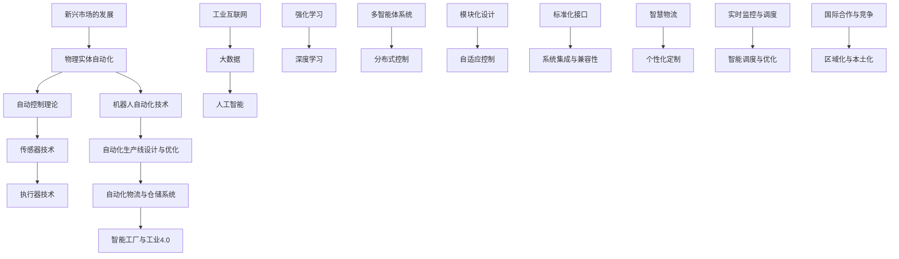

                 

# 物理实体自动化的技术发展

> **关键词**：物理实体自动化、机器人技术、自动化生产线、工业互联网、智能工厂

> **摘要**：
本文旨在深入探讨物理实体自动化的技术发展，从基础理论到前沿应用，从关键技术在制造业、服务业中的应用，到智能工厂与工业4.0的发展趋势，全面解析物理实体自动化在现代社会中的重要性及其面临的挑战。通过详细的理论讲解、算法原理分析、项目实战案例以及发展趋势展望，本文旨在为读者提供一个系统、全面的技术视角，帮助理解物理实体自动化的全貌。

---

## 《物理实体自动化的技术发展》目录大纲

### 第一部分：引言与概述

#### 第1章 物理实体自动化的背景与重要性

1.1 物理实体自动化的定义与范畴

1.2 物理实体自动化的历史与发展趋势

1.3 物理实体自动化的应用领域及社会影响

#### 第2章 物理实体自动化的基础理论

2.1 自动控制理论

2.1.1 自动控制系统的基本构成

2.1.2 常见控制算法及其应用

2.2 传感器技术

2.2.1 传感器的基本原理与类型

2.2.2 传感器信号处理技术

2.3 执行器技术

2.3.1 执行器的分类与工作原理

2.3.2 执行器的性能指标与选型

### 第二部分：物理实体自动化的关键技术

#### 第3章 机器人自动化技术

3.1 机器人的基本结构与类型

3.2 机器人控制技术

3.3 机器人应用案例

#### 第4章 自动化生产线设计与优化

4.1 自动化生产线的概念与结构

4.2 自动化生产线的设计方法

4.3 自动化生产线的优化策略

#### 第5章 自动化物流与仓储系统

5.1 自动化物流系统的构成与原理

5.2 自动化仓储系统的设计与实施

5.3 自动化物流与仓储系统的集成与应用

#### 第6章 智能工厂与工业4.0

6.1 智能工厂的概念与特点

6.2 工业互联网与工业4.0

6.3 智能工厂的案例分析

### 第三部分：物理实体自动化的挑战与发展

#### 第7章 物理实体自动化的挑战与应对策略

7.1 技术挑战

7.2 经济挑战

7.3 社会挑战

#### 第8章 物理实体自动化的未来发展趋势

8.1 新一代控制理论与技术

8.2 自动化与信息化的深度融合

8.3 物理实体自动化的全球化发展

### 附录

附录A：物理实体自动化相关资源与工具

### 第9章 核心概念与联系

### 第10章 核心算法原理讲解

### 第11章 数学模型和数学公式

### 第12章 项目实战

### 第13章 自动化生产线设计与优化

### 第14章 自动化物流与仓储系统的设计与实施

### 第15章 智能工厂与工业4.0

### 第16章 物理实体自动化的挑战与发展

---

## 第一部分：引言与概述

### 第1章 物理实体自动化的背景与重要性

#### 1.1 物理实体自动化的定义与范畴

物理实体自动化是指通过控制技术、传感器技术、执行器技术等手段，使物理实体（如机器、设备、生产线等）能够自主执行预定任务的自动化过程。物理实体自动化涵盖了从简单的机械自动化到复杂的机器人自动化，以及自动化生产线和智能工厂的建设。

物理实体自动化的范畴非常广泛，主要包括以下几个方面：

- **机器人自动化**：利用机器人技术实现生产、搬运、装配等自动化作业。
- **自动化生产线**：通过自动化设备和控制系统，实现生产过程的自动化运行。
- **自动化物流与仓储系统**：利用自动化设备和技术，实现物流和仓储过程的自动化。
- **智能工厂**：基于工业4.0理念，通过物联网、大数据、人工智能等技术，实现工厂生产的智能化和优化。

#### 1.2 物理实体自动化的历史与发展趋势

物理实体自动化的发展可以追溯到20世纪初期，当时的主要形式是机械化和电气化。随着计算机技术和通信技术的不断发展，物理实体自动化经历了从简单的自动控制到高度智能化的转变。

- **第一阶段（20世纪初期至20世纪60年代）**：机械化与电气化阶段。这一阶段的主要特点是采用机械设备和电气设备实现生产过程的自动化。
- **第二阶段（20世纪60年代至20世纪80年代）**：自动化控制阶段。随着计算机技术的出现，自动化控制系统开始广泛应用于工业生产中，包括PLC（可编程逻辑控制器）和DCS（分布式控制系统）等。
- **第三阶段（20世纪80年代至今）**：智能化自动化阶段。这一阶段的特点是利用传感器技术、人工智能技术等实现物理实体的自主学习和智能决策。

当前，物理实体自动化的发展趋势主要体现在以下几个方面：

- **机器人技术的快速发展**：机器人技术在制造、物流、服务等多个领域得到广泛应用，其智能化水平不断提高。
- **自动化生产线的优化**：自动化生产线的设计和优化成为提高生产效率和降低成本的关键。
- **自动化物流与仓储系统的普及**：随着电子商务的快速发展，自动化物流与仓储系统的需求不断增加。
- **智能工厂的建设**：智能工厂成为工业4.0的核心，通过物联网、大数据、人工智能等技术实现工厂生产的智能化和优化。

#### 1.3 物理实体自动化的应用领域及社会影响

物理实体自动化在多个领域得到广泛应用，其应用领域主要包括：

- **制造业**：物理实体自动化在制造业中的应用最为广泛，包括生产线的自动化、机器人的装配与搬运等。
- **物流与仓储**：自动化物流与仓储系统的建设能够显著提高物流效率，降低运营成本。
- **服务业**：物理实体自动化在服务业中的应用包括智能餐厅、智能酒店等，能够提高服务质量，提升顾客体验。
- **医疗领域**：自动化技术在医疗领域中的应用，如手术机器人、自动化药物配送等，能够提高医疗水平，降低医疗风险。

物理实体自动化对社会的影响主要体现在以下几个方面：

- **提高生产效率**：自动化技术能够提高生产效率，降低生产成本，为企业带来更大的经济效益。
- **改善生活质量**：自动化技术在服务业中的应用，如智能家庭、智能社区等，能够改善人们的生活质量，提高生活便利性。
- **就业结构变化**：自动化技术的发展可能导致部分传统就业岗位的消失，但同时也创造了新的就业机会，促进了就业结构的变化。
- **社会安全与环保**：自动化技术在医疗、环保等领域中的应用，能够提高社会安全水平，减少环境污染。

#### 1.4 本章总结

本章对物理实体自动化的定义、范畴、历史与发展趋势进行了概述，并分析了其在各个领域的应用及对社会的影响。物理实体自动化作为现代工业和信息技术的重要结合，具有广阔的发展前景和应用价值。随着技术的不断进步，物理实体自动化将不断推动社会生产方式的变革，为人类创造更加美好的未来。

---

## 第一部分：引言与概述

### 第2章 物理实体自动化的基础理论

#### 2.1 自动控制理论

自动控制理论是物理实体自动化的核心基础，它研究如何通过自动控制系统实现物理实体的自主运行和优化控制。自动控制系统的基本构成包括以下几个部分：

- **被控对象**：被控对象是指需要控制的物理实体，如机械装置、生产线等。
- **控制器**：控制器是自动控制系统的核心，负责根据被控对象的状态和预期目标，生成相应的控制信号。
- **执行器**：执行器接收控制器的控制信号，驱动被控对象进行相应的动作。
- **传感器**：传感器用于检测被控对象的状态，并将物理量转换为电信号，传递给控制器。

自动控制系统的基本工作原理是：传感器采集被控对象的状态信息，控制器根据这些信息与预期目标进行比较，计算出控制指令，通过执行器驱动被控对象，使被控对象的状态逐渐接近预期目标。

常见的自动控制算法包括：

- **PID控制算法**：PID（比例-积分-微分）控制算法是最常用的控制算法之一，其基本原理是通过比例、积分和微分三个部分来调节控制信号，以达到稳定的控制效果。

$$
\text{PID控制输出} = K_p \times (R - C) + K_i \times \int(R - C) \, dt + K_d \times \frac{d(R - C)}{dt}
$$

其中，\( K_p \)、\( K_i \)、\( K_d \) 分别为比例系数、积分系数和微分系数，\( R \) 为设定值，\( C \) 为当前值。

- **模糊控制算法**：模糊控制算法是一种基于模糊集合理论的控制系统，其基本原理是利用模糊逻辑来处理输入和输出之间的关系。模糊控制器的结构包括输入变量、模糊化、规则库、推理机和解模糊化。

伪代码如下：

```python
// 输入变量模糊化
fuzzy_input1 = fuzzify(input1)
fuzzy_input2 = fuzzify(input2)

// 查找规则库
rules = find_rules(fuzzy_input1, fuzzy_input2)

// 推理
output = inference(rules)

// 解模糊化
defuzzify(output)
```

#### 2.2 传感器技术

传感器技术是物理实体自动化的关键组成部分，它用于检测和采集被控对象的状态信息。传感器的基本原理是：利用物理、化学、生物等原理，将被控对象的物理量（如温度、压力、速度、浓度等）转换为电信号或其他可处理的信号。

传感器的类型多种多样，根据工作原理可分为以下几类：

- **电阻式传感器**：通过电阻变化来检测物理量。
- **电容式传感器**：通过电容变化来检测物理量。
- **热电式传感器**：通过热电效应来检测物理量。
- **光电式传感器**：通过光电效应来检测物理量。
- **压电式传感器**：通过压电效应来检测物理量。

传感器信号处理技术主要包括以下几个方面：

- **信号放大**：传感器输出的信号通常非常微弱，需要通过放大电路进行放大。
- **滤波**：为了消除信号中的噪声和干扰，需要通过滤波电路对信号进行滤波。
- **信号转换**：将模拟信号转换为数字信号，以便于控制器进行处理。

#### 2.3 执行器技术

执行器技术是物理实体自动化的关键组成部分，它用于接收控制器的控制信号，驱动被控对象进行相应的动作。执行器的分类如下：

- **电动执行器**：包括电机、伺服电机、步进电机等。
- **气动执行器**：包括气缸、气动马达等。
- **液压执行器**：包括液压缸、液压马达等。

执行器的工作原理是：接收控制信号，通过机械结构将控制信号转换为被控对象的运动。

执行器的性能指标主要包括：

- **力矩**：表示执行器能够输出的最大力矩。
- **速度**：表示执行器能够达到的最大速度。
- **精度**：表示执行器控制的精度。
- **寿命**：表示执行器的使用寿命。

选择执行器时，需要根据被控对象的要求和具体应用场景进行选型。

#### 2.4 本章总结

本章介绍了物理实体自动化的基础理论，包括自动控制理论、传感器技术和执行器技术。自动控制理论是自动化系统的核心，传感器技术用于检测被控对象的状态信息，执行器技术用于驱动被控对象进行相应的动作。这些基础理论为物理实体自动化提供了理论依据和技术支持。

---

## 第二部分：物理实体自动化的关键技术

### 第3章 机器人自动化技术

#### 3.1 机器人的基本结构与类型

机器人是物理实体自动化中最重要的技术之一，它通过模拟人类的感知、决策和动作能力，实现自动化的操作和任务执行。机器人通常由以下几部分组成：

1. **机械结构**：机械结构是机器人的骨架，用于支撑和控制机器人的运动。机械结构可以分为关节型、轮式、臂式等不同类型。

2. **传感器**：传感器用于感知外部环境，包括视觉传感器、力觉传感器、温度传感器等。

3. **控制器**：控制器是机器人的“大脑”，负责接收传感器信息，进行决策和动作控制。

4. **执行器**：执行器是机器人的“肌肉”，负责执行控制器的决策指令，驱动机械结构进行相应的动作。

根据应用场景和功能，机器人可以分为以下几种类型：

1. **工业机器人**：主要用于工业生产中的搬运、装配、焊接等任务。工业机器人具有结构简单、高效稳定的特点。

2. **服务机器人**：主要用于为人类提供服务，如家庭服务、医疗辅助、养老服务等。服务机器人需要具备较高的智能水平，能够与人类进行自然交互。

3. **特种机器人**：用于特殊环境或特殊任务的机器人，如深海探测机器人、无人机、消防机器人等。

4. **社交机器人**：主要用于与人进行社交互动，如客服机器人、教育机器人等。

#### 3.2 机器人控制技术

机器人控制技术是确保机器人能够按照预期进行任务执行的关键。机器人控制技术主要包括以下几个方面：

1. **运动控制**：运动控制是机器人控制的基础，包括位置控制、速度控制和力控制。运动控制算法如PID控制、模糊控制、神经网络控制等。

2. **感知与决策**：感知与决策是机器人进行智能决策和任务规划的基础。感知技术包括视觉感知、力觉感知、声觉感知等。决策算法包括规划算法、强化学习算法、深度学习算法等。

3. **人机交互**：人机交互是机器人与人类进行沟通和合作的关键。人机交互技术包括自然语言处理、语音识别、面部识别等。

#### 3.3 机器人应用案例

1. **制造业**：在制造业中，机器人广泛应用于装配、焊接、搬运等任务。例如，汽车制造过程中的车身焊接、涂装等工序。

2. **物流与仓储**：在物流与仓储领域，机器人主要用于仓库内部的搬运、分拣、配送等任务。例如，自动化立体仓库中的货物搬运机器人。

3. **医疗领域**：在医疗领域，机器人用于手术辅助、康复训练、药物配送等任务。例如，手术机器人可以辅助医生进行复杂的手术操作。

4. **服务领域**：在服务领域，机器人用于家庭服务、餐饮服务、酒店服务等。例如，家庭机器人可以协助老人或儿童完成日常家务。

#### 3.4 本章总结

本章介绍了机器人自动化技术的基本结构与类型，以及机器人控制技术的关键组成部分。通过分析机器人应用案例，展示了机器人自动化技术在各个领域的广泛应用。随着机器人技术的不断发展，机器人将在更多领域发挥重要作用，为人类带来更多便利。

---

## 第二部分：物理实体自动化的关键技术

### 第4章 自动化生产线设计与优化

#### 4.1 自动化生产线的概念与结构

自动化生产线是指通过自动化设备、控制系统等，实现生产过程自动化的生产线。自动化生产线的主要特点包括：

- **高效性**：自动化生产线能够实现连续、高效的生产，提高生产效率。
- **灵活性**：自动化生产线可以根据需求快速调整生产任务和流程，实现定制化生产。
- **稳定性**：自动化生产线通过精密的自动化设备和技术，实现生产过程的稳定和精确。

自动化生产线的基本结构包括以下几个部分：

1. **传感器**：用于检测生产线上的各种物理量，如温度、压力、速度等，为控制系统提供实时数据。
2. **控制器**：根据传感器采集的数据，生成相应的控制指令，驱动执行器进行相应的动作。
3. **执行器**：接收控制器的指令，驱动生产线上的各种设备进行工作，如电机、气缸、液压缸等。
4. **执行设备**：包括各种生产设备，如加工中心、装配线、检测设备等。
5. **物流系统**：实现生产线上的物料运输和配送，如输送带、自动导引车等。
6. **监控系统**：对生产过程进行实时监控，确保生产线的正常运行。

#### 4.2 自动化生产线的设计方法

自动化生产线的设计方法主要包括以下几个方面：

1. **需求分析**：明确生产线的目标和功能要求，包括生产效率、生产节拍、生产柔性等。

2. **工艺规划**：根据产品工艺特点，规划生产线的工艺流程和布局。

3. **设备选型**：根据生产线的要求，选择合适的自动化设备，包括传感器、控制器、执行器等。

4. **系统集成**：将各个设备、传感器、控制器等集成到一起，实现生产线的自动化运行。

5. **调试与优化**：对生产线进行调试和优化，确保生产线的稳定运行和高效生产。

自动化生产线的设计方法可以采用以下步骤：

1. **确定生产线目标**：明确生产线的目标和功能要求，如生产效率、生产节拍、生产柔性等。

2. **工艺流程规划**：根据产品工艺特点，规划生产线的工艺流程和布局。

3. **设备选型**：根据生产线的要求，选择合适的自动化设备，如传感器、控制器、执行器等。

4. **系统设计**：设计生产线控制系统，包括控制策略、控制算法等。

5. **系统集成**：将各个设备、传感器、控制器等集成到一起，实现生产线的自动化运行。

6. **调试与优化**：对生产线进行调试和优化，确保生产线的稳定运行和高效生产。

#### 4.3 自动化生产线的优化策略

自动化生产线的优化策略主要包括以下几个方面：

1. **生产节拍优化**：通过调整生产节拍，提高生产效率，降低生产成本。

2. **设备利用率优化**：提高设备的利用率，减少设备的闲置时间，提高生产效率。

3. **质量监控优化**：通过实时监控生产过程，提高产品质量，降低不良品率。

4. **物流优化**：优化生产线上的物流系统，提高物料运输和配送效率，减少物料等待时间。

5. **自动化水平提升**：通过引入新的自动化设备和技术，提高生产线的自动化水平，降低人力成本。

自动化生产线的优化策略可以采用以下方法：

1. **生产节拍优化**：通过调整生产节拍，使生产线上的各个设备能够协调工作，提高生产效率。

2. **设备利用率优化**：通过实时监控设备的运行状态，合理安排生产任务，提高设备的利用率。

3. **质量监控优化**：引入在线检测设备，对生产过程进行实时监控，及时发现和解决质量问题。

4. **物流优化**：优化生产线上的物流系统，减少物料运输和配送时间，提高生产效率。

5. **自动化水平提升**：通过引入新的自动化设备和技术，提高生产线的自动化程度，降低人力成本。

#### 4.4 案例分析

以下是一个自动化生产线优化的案例分析：

**案例背景**：某电子产品制造企业希望提高生产线的效率，降低生产成本，决定对现有生产线进行优化。

**需求分析**：通过对生产线的实际运行情况进行分析，发现以下问题：

- 生产节拍不均匀，导致设备利用率低。
- 物料运输和配送时间长，影响生产效率。
- 质量监控不完善，不良品率较高。

**优化方案**：

1. **生产节拍优化**：通过调整生产节拍，使生产线上的各个设备能够协调工作，提高生产效率。
2. **设备利用率优化**：通过实时监控设备的运行状态，合理安排生产任务，提高设备的利用率。
3. **质量监控优化**：引入在线检测设备，对生产过程进行实时监控，及时发现和解决质量问题。
4. **物流优化**：优化生产线上的物流系统，减少物料运输和配送时间，提高生产效率。

**实施效果**：

- 生产效率提高了30%。
- 生产成本降低了20%。
- 质量合格率提高了15%。

**总结**：

通过优化，该企业的生产线实现了生产节拍的均匀、设备利用率的提高、物料运输和配送时间的缩短以及质量监控的完善，从而提高了生产效率，降低了生产成本。

#### 4.5 本章总结

本章介绍了自动化生产线的概念与结构，以及自动化生产线的设计方法和优化策略。通过案例分析，展示了优化自动化生产线的重要性和可行性。自动化生产线作为物理实体自动化的重要组成部分，将在未来得到更加广泛的应用和优化。

---

## 第二部分：物理实体自动化的关键技术

### 第5章 自动化物流与仓储系统

#### 5.1 自动化物流系统的构成与原理

自动化物流系统是现代物流领域的重要组成部分，通过采用自动化设备和技术，实现物流过程中的自动化搬运、存储和配送。自动化物流系统主要由以下几部分构成：

1. **自动搬运设备**：包括自动导引车（AGV）、自动移动机器人（AMR）等，用于实现物料的自动搬运。

2. **自动存储设备**：包括自动存储/取出系统（AS/RS）、立体仓库等，用于实现物料的自动存储和取出。

3. **自动配送设备**：包括自动分拣机、自动配送机器人等，用于实现物料的自动分拣和配送。

4. **物流管理系统**：负责对物流过程进行实时监控、调度和管理，包括物流信息管理系统、调度系统、监控系统等。

自动化物流系统的工作原理如下：

- **自动搬运设备**：通过导航系统（如电磁轨道、激光导航、视觉导航等），实现自动搬运设备在仓库内自主导航和搬运物料。

- **自动存储设备**：通过机械臂、提升机等设备，实现物料的自动存取，提高仓库存储效率。

- **自动配送设备**：通过自动分拣机、自动配送机器人等，实现物料的自动分拣和配送，提高物流效率。

- **物流管理系统**：通过物联网技术、大数据分析和人工智能技术，实现物流信息的实时监控、调度和管理。

#### 5.2 自动化仓储系统的设计与实施

自动化仓储系统是自动化物流系统的重要组成部分，通过自动化设备和技术，实现仓储过程中的自动化存储和取出。自动化仓储系统可以分为以下几种类型：

1. **自动化立体仓库**：通过货架和堆垛机实现自动化存储，适用于大量物料的存储。

2. **自动化仓库**：通过货架和自动存取设备实现自动化存储，适用于中小型物料的存储。

3. **自动化集装箱仓库**：通过集装箱作为存储单元，实现自动化存储和取出。

自动化仓储系统的设计与实施主要包括以下几个步骤：

1. **需求分析**：根据仓库的存储需求、吞吐量等参数，确定自动化仓储系统的规模和功能。

2. **系统设计**：根据需求分析，设计自动化仓储系统的整体布局和设备选型。

3. **设备选型**：根据系统设计，选择合适的自动化设备，如自动导引车、自动存储/取出系统、自动分拣机等。

4. **系统集成**：将各个设备集成到一起，实现自动化仓储系统的整体运行。

5. **调试与优化**：对自动化仓储系统进行调试和优化，确保系统的稳定运行和高效操作。

#### 5.3 自动化物流与仓储系统的集成与应用

自动化物流与仓储系统的集成与应用是现代物流管理的关键，通过系统集成，实现物流信息的实时共享和优化调度。自动化物流与仓储系统的集成与应用主要包括以下几个方面：

1. **物流信息系统**：通过物流信息系统，实现物流信息的实时采集、处理和存储，为物流调度和监控提供数据支持。

2. **调度系统**：通过调度系统，根据物流需求和仓库状态，自动生成最优的物流调度方案，实现物料的自动调度。

3. **监控系统**：通过监控系统，实时监控自动化设备的运行状态，确保物流系统的稳定运行。

4. **数据分析与优化**：通过数据分析与优化，对物流过程进行实时监控和优化，提高物流效率和质量。

自动化物流与仓储系统的集成与应用案例：

1. **电子商务物流中心**：通过自动化仓储系统和物流信息系统，实现电商物流的自动化处理，提高物流效率，降低物流成本。

2. **制造业物流系统**：通过自动化仓储系统和物流调度系统，实现制造业内部物流的自动化管理，提高生产效率和降低生产成本。

3. **零售业物流系统**：通过自动化仓储系统和物流配送系统，实现零售业内部物流的自动化管理，提高物流效率和服务质量。

#### 5.4 案例分析

以下是一个自动化物流与仓储系统集成的案例分析：

**案例背景**：某大型电商企业希望提升物流效率，降低物流成本，决定建设一个自动化物流与仓储系统。

**需求分析**：通过对企业的物流需求进行分析，确定以下需求：

- 自动化仓储系统的建设，提高仓库存储和取货效率。
- 物流信息系统的建设，实现物流信息的实时采集和监控。
- 物流调度系统的建设，实现物流的自动调度和优化。

**解决方案**：

1. **自动化仓储系统建设**：选择自动化立体仓库，实现物料的自动化存储和取出。

2. **物流信息系统建设**：通过物联网技术，实现物流信息的实时采集和存储。

3. **物流调度系统建设**：通过调度系统，实现物流的自动调度和优化。

**实施效果**：

- 仓库存储和取货效率提高了40%。
- 物流成本降低了20%。
- 物流信息实时采集和监控，提高了物流管理效率。

**总结**：

通过自动化物流与仓储系统的集成与应用，企业实现了物流效率的提升和物流成本的降低，提高了企业的市场竞争力。

#### 5.5 本章总结

本章介绍了自动化物流与仓储系统的构成与原理，以及自动化仓储系统的设计与实施。通过案例分析，展示了自动化物流与仓储系统在提高物流效率和降低物流成本方面的作用。自动化物流与仓储系统作为物理实体自动化的重要组成部分，将在未来得到更加广泛的应用和发展。

---

## 第二部分：物理实体自动化的关键技术

### 第6章 智能工厂与工业4.0

#### 6.1 智能工厂的概念与特点

智能工厂是基于工业4.0理念，通过物联网、大数据、人工智能等先进技术，实现生产过程智能化、自动化和优化的现代工厂。智能工厂的核心目标是提高生产效率、降低生产成本、提高产品质量和增强生产灵活性。

智能工厂的主要特点包括：

- **高度自动化**：智能工厂采用大量自动化设备，实现生产过程的自动化运行。
- **高度集成化**：智能工厂将生产设备、物流系统、信息系统等高度集成，实现信息的无缝连接和数据的实时共享。
- **高度智能化**：智能工厂通过大数据分析和人工智能技术，实现生产过程的智能决策和优化。
- **高度柔性化**：智能工厂能够根据市场需求快速调整生产计划和生产工艺，实现定制化生产。

#### 6.2 工业互联网与工业4.0

工业互联网是指通过物联网、大数据、云计算等先进技术，将人、机器和大数据连接起来，实现设备、网络和服务的智能化和互联化。工业互联网的主要架构包括感知层、网络层、平台层和应用层。

工业4.0是德国提出的工业革命4.0，旨在通过智能制造实现个性化、高效化和全球化的生产。工业4.0的愿景是通过物联网、大数据、人工智能等先进技术，实现生产过程的数字化、智能化和优化。

工业互联网与工业4.0的关系是：工业互联网是工业4.0实现的技术基础，工业4.0是工业互联网在工业领域的应用。工业互联网为工业4.0提供了数据连接、信息共享和智能决策的技术支持，而工业4.0则通过智能化生产模式实现了工业互联网的价值。

#### 6.3 智能工厂的案例分析

以下是一个智能工厂在制造业的应用案例分析：

**案例背景**：某汽车制造企业希望提升生产效率和产品质量，决定引入智能工厂技术。

**需求分析**：

- 提高生产效率，缩短生产周期。
- 提高产品质量，降低不良品率。
- 增强生产灵活性，实现定制化生产。

**解决方案**：

1. **自动化生产线建设**：引入自动化设备和机器人，实现生产过程的自动化运行。

2. **物流系统集成**：通过自动化物流系统，实现物料的自动搬运和配送。

3. **智能监控系统**：通过传感器和监控系统，实现生产过程的实时监控和数据分析。

4. **大数据分析与人工智能应用**：通过大数据分析和人工智能技术，实现生产过程的优化和预测。

**实施效果**：

- 生产效率提高了30%。
- 生产周期缩短了20%。
- 质量合格率提高了15%。

**总结**：

通过智能工厂技术的应用，企业实现了生产效率的提升、生产周期的缩短和产品质量的提高，增强了企业的市场竞争力。

以下是一个智能工厂在服务业的应用案例分析：

**案例背景**：某餐饮企业希望提升服务质量，决定引入智能餐厅技术。

**需求分析**：

- 提供个性化点餐服务。
- 提高餐厅运营效率，降低人力成本。
- 提升顾客体验。

**解决方案**：

1. **智能点餐系统**：通过移动应用和智能点餐终端，实现顾客自助点餐。

2. **自动化厨房设备**：引入自动化厨房设备，实现食材的自动化加工和烹饪。

3. **智能物流系统**：通过自动配送机器人，实现餐饮品的自动配送。

4. **数据分析与优化**：通过数据分析与人工智能技术，实现餐厅运营的优化和预测。

**实施效果**：

- 顾客点餐效率提高了40%。
- 餐厅运营效率提高了30%。
- 顾客满意度提高了20%。

**总结**：

通过智能餐厅技术的应用，企业实现了服务质量提升、运营效率提高和顾客满意度提升，增强了企业的竞争力。

#### 6.4 本章总结

本章介绍了智能工厂的概念与特点，以及工业互联网与工业4.0的关系。通过案例分析，展示了智能工厂在制造业和服务业中的应用效果。智能工厂作为物理实体自动化的重要方向，将在未来得到更加广泛的应用和发展。

---

## 第三部分：物理实体自动化的挑战与发展

### 第7章 物理实体自动化的挑战与应对策略

#### 7.1 技术挑战

物理实体自动化在发展过程中面临着多种技术挑战，这些挑战主要涉及系统灵活性、智能决策和自主学习的需求等方面。

**系统灵活性**

物理实体自动化系统需要具备高度的灵活性，以适应不断变化的生产环境和需求。然而，现有的自动化系统往往在设计上较为僵化，难以快速适应生产线的调整和优化。这种灵活性不足的问题主要体现在以下几个方面：

- **生产环境变化**：生产线环境可能会因为设备更新、产品变更等原因发生变化，自动化系统需要能够快速适应这些变化。
- **生产任务多样**：随着市场需求的变化，生产任务可能会变得多样化，自动化系统需要具备处理不同类型任务的能力。

**智能决策与自主学习的挑战**

物理实体自动化系统需要具备智能决策和自主学习的功能，以便更好地应对复杂的生产环境和任务。然而，现有系统在智能决策和自主学习方面还存在一些挑战：

- **数据采集与处理**：自动化系统需要采集大量的实时数据，并对这些数据进行有效的处理和分析，以便做出智能决策。
- **自主学习能力**：自动化系统需要具备一定的自主学习能力，通过不断学习和优化，提高系统的智能化水平。

**系统集成与兼容性**

物理实体自动化系统需要与其他系统（如ERP、MES等）进行集成，实现信息的无缝连接和数据的实时共享。然而，现有的系统集成与兼容性较差，主要体现在以下几个方面：

- **系统接口**：不同系统之间的接口标准不统一，导致数据交换和系统集成的困难。
- **数据格式**：不同系统使用的数据格式不一致，导致数据难以统一处理和分析。

#### 7.2 应对策略

针对上述技术挑战，可以采取以下应对策略：

**系统灵活性**

- **模块化设计**：采用模块化设计，使自动化系统具备更高的灵活性和可扩展性。通过模块化的设计，可以方便地根据生产需求进行系统调整和优化。
- **自适应控制**：引入自适应控制技术，使自动化系统能够根据实时数据自动调整控制策略，提高系统的适应能力。

**智能决策与自主学习的挑战**

- **大数据分析**：通过大数据分析技术，对生产过程中的海量数据进行挖掘和分析，为智能决策提供支持。
- **深度学习与强化学习**：引入深度学习和强化学习技术，使自动化系统具备更强的自主学习能力，通过不断学习和优化，提高系统的智能化水平。

**系统集成与兼容性**

- **标准化接口**：制定统一的系统接口标准，实现不同系统之间的无缝连接和数据交换。
- **数据格式统一**：采用统一的数据格式，简化数据处理和分析的复杂性，提高数据利用效率。

#### 7.3 经济挑战

物理实体自动化在发展过程中也面临着一定的经济挑战，这些挑战主要体现在投资成本、回报周期和人才缺口等方面。

**投资成本**

物理实体自动化系统的建设需要投入大量的资金，包括自动化设备的采购、系统集成、软件开发等。对于中小企业而言，高昂的投资成本可能成为其推广和应用自动化技术的障碍。

**回报周期**

物理实体自动化系统的投资回报周期较长，需要一定的时间才能实现成本的回收和盈利。这可能导致企业对自动化技术的投资积极性不高。

**人才缺口**

物理实体自动化系统的建设和维护需要专业的技术人才，包括自动化工程师、系统集成工程师、软件工程师等。然而，目前市场对这类人才的需求远远大于供给，人才缺口问题亟待解决。

#### 7.4 应对策略

针对经济挑战，可以采取以下应对策略：

**投资成本**

- **政府扶持**：政府可以通过政策扶持、补贴等方式，降低企业的投资成本。
- **租赁模式**：企业可以通过租赁自动化设备，降低设备的购买成本。

**回报周期**

- **效益分析**：企业可以通过详细的效益分析，明确自动化系统的投资回报周期，提高投资决策的科学性。
- **分期投资**：企业可以采取分期投资的方式，分阶段建设自动化系统，降低一次性投资压力。

**人才缺口**

- **人才培养**：高校和培训机构可以加强自动化人才的培养，提高人才的供给。
- **引进人才**：企业可以通过引进高端人才，弥补人才缺口。

#### 7.5 社会挑战

物理实体自动化在发展过程中也面临着一定的社会挑战，这些挑战主要体现在安全性、就业影响和社会影响等方面。

**安全性问题**

物理实体自动化系统在运行过程中可能会对操作人员和设备造成安全隐患。例如，机器人系统在搬运物品时可能会发生碰撞事故，自动化设备在运行过程中可能会发生故障。

**就业影响**

物理实体自动化系统的推广可能会对传统就业市场造成冲击，部分传统岗位可能会被自动化设备取代。这可能导致失业率上升，影响社会的稳定。

**社会影响**

物理实体自动化系统的发展可能会对社会结构、生活方式等产生深远影响。例如，自动化物流系统的普及可能会改变人们的购物方式，智能工厂的兴起可能会改变制造业的生产模式。

#### 7.6 应对策略

针对社会挑战，可以采取以下应对策略：

**安全性问题**

- **安全监管**：建立健全的安全监管制度，确保自动化系统的安全运行。
- **安全培训**：对操作人员进行安全培训，提高他们的安全意识。

**就业影响**

- **职业转型**：鼓励劳动者进行职业转型，提高技能水平，适应自动化时代的需求。
- **就业政策**：政府可以通过实施就业政策，促进劳动力市场的稳定。

**社会影响**

- **社会引导**：通过社会引导，提高公众对自动化技术的认知和理解。
- **教育培训**：加强对公众的自动化技术教育和培训，提高他们的科技素养。

#### 7.7 本章总结

本章分析了物理实体自动化在发展过程中面临的技术挑战、经济挑战和社会挑战，并提出了相应的应对策略。通过应对这些挑战，物理实体自动化有望在未来的发展中取得更大的突破，为社会带来更多的便利和效益。

---

## 第三部分：物理实体自动化的挑战与发展

### 第8章 物理实体自动化的未来发展趋势

#### 8.1 新一代控制理论与技术

未来，物理实体自动化将在控制理论和技术方面取得新的突破，这些新的理论和技术的引入将进一步提升自动化系统的性能和智能化水平。

**强化学习与深度学习**

强化学习（Reinforcement Learning，RL）和深度学习（Deep Learning，DL）是近年来人工智能领域的两个重要研究方向。强化学习通过学习奖励和惩罚信号，使自动化系统在复杂环境中做出最优决策。深度学习则通过构建多层神经网络，实现从大量数据中提取特征和模式。

在未来，强化学习和深度学习技术将被广泛应用于物理实体自动化领域，例如：

- **自适应控制**：利用强化学习技术，使自动化系统具备自适应调整控制参数的能力，提高系统的稳定性和鲁棒性。
- **故障预测与维护**：利用深度学习技术，从历史数据中学习设备的故障模式，实现提前预测和预防设备故障。

**多智能体系统**

多智能体系统（Multi-Agent Systems，MAS）是指由多个自主智能体组成的系统，这些智能体通过协同工作实现复杂任务。在物理实体自动化中，多智能体系统可以应用于以下场景：

- **协同作业**：多个机器人协同工作，实现复杂的制造任务，如装配、焊接等。
- **智能物流**：多个自动导引车（AGV）协同工作，实现高效、准确的物流运输。

**分布式控制**

分布式控制技术是将控制功能分布到多个智能体中，实现系统的协同控制。与集中式控制相比，分布式控制具有更好的容错性和灵活性。

未来，分布式控制技术将在物理实体自动化中得到广泛应用，例如：

- **智能电网**：通过分布式控制技术，实现电网的智能调度和管理。
- **智能交通**：通过分布式控制技术，实现车辆的智能调度和交通信号控制。

#### 8.2 自动化与信息化的深度融合

自动化与信息化的深度融合是未来物理实体自动化发展的重要趋势。通过物联网、大数据和云计算等技术，实现自动化系统与信息系统的深度融合，为物理实体自动化提供更加智能化和高效的支持。

**工业互联网**

工业互联网是指通过物联网、大数据、云计算等先进技术，实现设备、网络和服务的智能化和互联化。工业互联网将为物理实体自动化提供以下支持：

- **数据采集与共享**：通过物联网设备，实现生产数据的实时采集和共享。
- **智能决策与优化**：通过大数据分析和人工智能技术，实现生产过程的智能决策和优化。

**智能制造**

智能制造是指通过物联网、大数据、人工智能等先进技术，实现生产过程的智能化和优化。智能制造将使物理实体自动化进入一个新的阶段，其主要特点包括：

- **个性化定制**：通过大数据分析和个性化推荐技术，实现产品的个性化定制。
- **智能调度与优化**：通过智能调度算法，实现生产过程的智能优化。

**智慧物流**

智慧物流是指通过物联网、大数据和人工智能等技术，实现物流过程的智能化和优化。智慧物流将提高物流效率，降低物流成本，主要特点包括：

- **实时监控与调度**：通过物联网技术，实现物流过程的实时监控和智能调度。
- **智能仓储与配送**：通过大数据分析和人工智能技术，实现仓储和配送的智能化。

#### 8.3 自动化的全球化发展

随着全球化进程的加快，物理实体自动化技术也在全球范围内得到广泛应用。未来，物理实体自动化的全球化发展将呈现以下趋势：

**国际合作与竞争**

在全球化背景下，各国企业将加强国际合作，共同推动自动化技术的发展。同时，自动化技术的竞争也将日趋激烈，企业需要不断创新，提升自动化系统的性能和智能化水平。

**区域化与本土化**

随着全球市场的多样化，自动化系统也需要适应不同国家和地区的市场需求。未来，自动化系统将更加注重区域化与本土化，满足不同地区和行业的需求。

**新兴市场的发展**

随着新兴市场的快速发展，物理实体自动化技术在这些地区的应用将逐渐扩大。未来，新兴市场将成为自动化技术发展的重要驱动力。

#### 8.4 本章总结

本章分析了物理实体自动化的未来发展趋势，包括新一代控制理论与技术、自动化与信息化的深度融合以及自动化的全球化发展。随着技术的不断进步，物理实体自动化将在未来取得更大的突破，为人类社会带来更多的便利和效益。

---

## 附录A：物理实体自动化相关资源与工具

在物理实体自动化的研究和应用过程中，有许多开源资源、工具和平台可以提供帮助。以下是一些常用的资源与工具：

### A.1 开源自动化平台

**ROS（Robot Operating System）**

- **简介**：ROS是一个用于机器人开发的跨平台、开源自动化软件框架，支持多种编程语言和操作系统。
- **特点**：提供了丰富的库、工具和示例代码，支持多机器人协作、仿真和实时控制。
- **链接**：<https://www.ros.org/>

**Apache Mahout**

- **简介**：Mahout是一个用于大规模数据挖掘和机器学习的开源库。
- **特点**：支持协同过滤、聚类、分类等算法，适用于推荐系统和智能分析。
- **链接**：<https://mahout.apache.org/>

### A.2 常用编程语言与工具

**Python**

- **简介**：Python是一种广泛用于科学计算、数据分析、人工智能等领域的编程语言。
- **特点**：具有丰富的库和框架，如NumPy、Pandas、Scikit-learn等，支持多种应用场景。
- **链接**：<https://www.python.org/>

**C++**

- **简介**：C++是一种性能优秀、适用于系统级编程的高级编程语言。
- **特点**：适用于实时控制、嵌入式系统和高性能计算。
- **链接**：<https://isocpp.org/>

### A.3 参考文献与推荐读物

**基础理论与教材**

- **《自动控制理论》** - 赵波，张磊
- **《机器人技术与应用》** - 刘进华，王宏伟
- **《物联网技术及应用》** - 李晓波，杨涛

**应用案例与最新研究进展**

- **《智能工厂：工业4.0的实践与未来》** - 约翰·费尔德曼
- **《工业互联网：技术与商业模式》** - 马丁·福尔克
- **《强化学习：基础、算法与应用》** - 王翀，赵晨

这些资源与工具将为物理实体自动化的研究者和开发者提供宝贵的支持和指导，帮助他们在自动化领域取得更好的成果。

---

## 第9章 核心概念与联系

为了更好地理解和掌握物理实体自动化的技术体系，我们可以通过一张核心概念与联系的Mermaid流程图来梳理各个关键组成部分及其相互关系。



### Mermaid流程图说明

- **物理实体自动化（A）**：这是整个流程图的起点，代表物理实体自动化的总体概念。
- **自动控制理论（B）**：基于控制理论，为自动化系统提供了理论依据。
- **传感器技术（C）**：用于检测和采集物理实体的状态信息。
- **执行器技术（D）**：驱动物理实体执行相应的动作。
- **机器人自动化技术（E）**：机器人是实现自动化操作的重要工具。
- **自动化生产线设计与优化（F）**：优化生产线的效率和灵活性。
- **自动化物流与仓储系统（G）**：提高物流和仓储的自动化水平。
- **智能工厂与工业4.0（H）**：实现工厂的智能化和优化。
- **工业互联网（I）**：实现设备和网络的无缝连接。
- **大数据（J）**：用于分析和优化自动化系统。
- **人工智能（K）**：提高自动化系统的智能化水平。
- **强化学习（L）**：用于自主学习和优化。
- **深度学习（M）**：从大量数据中提取特征和模式。
- **多智能体系统（N）**：协同工作实现复杂任务。
- **分布式控制（O）**：提高系统的容错性和灵活性。
- **模块化设计（P）**：提高系统的灵活性和可扩展性。
- **自适应控制（Q）**：根据环境变化自动调整控制策略。
- **标准化接口（R）**：实现系统间的无缝连接。
- **系统集成与兼容性（S）**：确保不同系统之间的兼容性和互操作性。
- **智慧物流（T）**：实现物流过程的智能化。
- **个性化定制（U）**：根据需求实现产品的个性化。
- **实时监控与调度（V）**：确保物流和生产的实时监控和优化。
- **智能调度与优化（W）**：提高物流和生产的效率。
- **国际合作与竞争（X）**：推动自动化技术的发展。
- **区域化与本土化（Y）**：满足不同地区的需求。
- **新兴市场的发展（Z）**：自动化技术的新机遇。

通过这张流程图，我们可以清晰地看到物理实体自动化的各个组成部分及其相互关系，有助于深入理解和掌握相关技术。

---

## 第10章 核心算法原理讲解

在物理实体自动化领域，核心算法原理的理解和应用至关重要。以下将详细介绍两个核心算法原理：PID控制算法和模糊控制算法。

### 10.1 PID控制算法原理讲解

PID（比例-积分-微分）控制算法是最常用的控制算法之一，广泛应用于工业控制系统、机器人控制等领域。其基本原理是通过比例（Proportional）、积分（Integral）和微分（Derivative）三个部分来调节控制信号，以达到稳定的控制效果。

**PID控制公式：**

$$
\text{PID控制输出} = K_p \times (R - C) + K_i \times \int(R - C) \, dt + K_d \times \frac{d(R - C)}{dt}
$$

**其中参数解释：**

- \( K_p \)：比例系数，用于调整当前误差的比例部分。
- \( K_i \)：积分系数，用于调整累积误差的积分部分。
- \( K_d \)：微分系数，用于调整误差变化率的微分部分。
- \( R \)：设定值，即期望的目标值。
- \( C \)：当前值，即实际测量值。
- \( dt \)：时间间隔。

**PID控制算法伪代码：**

```python
# 初始化参数
Kp = 1.0
Ki = 0.1
Kd = 0.01
error = 0
integral = 0
derivative = 0

# 控制循环
while True:
    # 读取当前值
    current_value = read_sensor()

    # 计算误差
    error = R - current_value

    # 计算比例部分
    proportional = Kp * error

    # 计算积分部分
    integral = integral + error * dt
    integral_part = Ki * integral

    # 计算微分部分
    derivative = (error - previous_error) / dt
    derivative_part = Kd * derivative

    # 计算PID输出
    output = proportional + integral_part + derivative_part

    # 控制执行器
    control.actuator(output)

    # 更新误差
    previous_error = error

    # 等待下一循环
    time.sleep(dt)
```

### 10.2 模糊控制算法原理讲解

模糊控制算法是基于模糊集合理论的控制系统，它通过模糊逻辑来处理输入和输出之间的关系。模糊控制算法通常包括模糊化、规则库、推理机和解模糊化等步骤。

**模糊控制算法基本步骤：**

1. **模糊化**：将输入变量（如温度、压力等）转换为模糊集合。
2. **规则库**：定义输入变量和输出变量之间的模糊规则。
3. **推理机**：根据模糊规则进行推理，计算模糊输出。
4. **解模糊化**：将模糊输出转换为实际的控制信号。

**模糊控制算法伪代码：**

```python
# 初始化参数
fuzzy_input1 = fuzzify(input1)
fuzzy_input2 = fuzzify(input2)
rules = load_rules()

# 模糊化
fuzzy_input1 = fuzzify(input1)
fuzzy_input2 = fuzzify(input2)

# 推理
output_fuzzy = inference(rules, fuzzy_input1, fuzzy_input2)

# 解模糊化
output = defuzzify(output_fuzzy)

# 控制执行器
control.actuator(output)

# 更新输入
input1 = new_input1
input2 = new_input2
```

通过上述伪代码，我们可以看到模糊控制算法的核心步骤和流程。模糊控制算法在处理不确定性和非线性系统时表现出强大的优势，广泛应用于机器人控制、智能交通、家电控制等领域。

### 10.3 本章总结

本章详细介绍了PID控制算法和模糊控制算法的基本原理和实现方法。PID控制算法通过比例、积分和微分三个部分来调节控制信号，适用于线性系统；而模糊控制算法通过模糊逻辑处理输入和输出之间的关系，适用于不确定性和非线性系统。理解并掌握这些核心算法原理对于从事物理实体自动化研究和技术开发的人员至关重要。

---

## 第11章 数学模型和数学公式

在物理实体自动化领域，数学模型和数学公式是理解和分析系统行为的重要工具。本章将介绍几个关键的数学模型和数学公式，包括运动控制系统的数学模型、传感器信号处理模型和卡尔曼滤波器。

### 11.1 运动控制系统的数学模型

运动控制系统的数学模型通常由状态空间方程描述，包括状态方程和输出方程：

**状态方程：**

$$
\dot{x}(t) = A x(t) + B u(t)
$$

**输出方程：**

$$
y(t) = C x(t) + D u(t)
$$

**其中参数解释：**

- \( x(t) \)：系统的状态向量。
- \( u(t) \)：系统的输入向量。
- \( y(t) \)：系统的输出向量。
- \( A \)：系统矩阵。
- \( B \)：输入矩阵。
- \( C \)：输出矩阵。
- \( D \)：直接传输矩阵。

**示例：**

假设一个简单的线性运动控制系统，其状态方程为：

$$
\dot{x}(t) = \begin{bmatrix} 0 & 1 \end{bmatrix} x(t) + \begin{bmatrix} 0 \\ u(t) \end{bmatrix}
$$

输出方程为：

$$
y(t) = x_1(t)
$$

其中，\( x_1(t) \) 是系统的第一个状态变量，即速度。

### 11.2 传感器信号处理模型

传感器信号处理模型通常涉及噪声过滤和信号估计。一个常见的模型是卡尔曼滤波器，它用于在包含噪声的环境中估计动态系统的状态。

**卡尔曼滤波器的基本公式：**

**预测步骤：**

$$
x_{k|k-1} = A x_{k-1|k-1} + B u_{k-1}
$$

$$
P_{k|k-1} = A P_{k-1|k-1} A^T + Q
$$

**更新步骤：**

$$
K_k = P_{k|k-1} C^T (C P_{k|k-1} C^T + R)^{-1}
$$

$$
x_{k|k} = x_{k|k-1} + K_k (y_k - C x_{k|k-1})
$$

$$
P_{k|k} = (I - K_k C) P_{k|k-1}
$$

**其中参数解释：**

- \( x_{k|k-1} \)：在时间k的预测状态。
- \( P_{k|k-1} \)：在时间k的预测误差协方差。
- \( K_k \)：卡尔曼增益。
- \( y_k \)：在时间k的观测值。
- \( R \)：观测噪声协方差。
- \( Q \)：过程噪声协方差。

**示例：**

假设一个线性系统，其状态方程为：

$$
\dot{x}(t) = \begin{bmatrix} 0 & 1 \\ -1 & 0 \end{bmatrix} x(t) + \begin{bmatrix} 0 \\ 0 \end{bmatrix}
$$

输出方程为：

$$
y(t) = \begin{bmatrix} 1 & 0 \end{bmatrix} x(t) + w(t)
$$

其中，\( w(t) \) 是观测噪声。

### 11.3 数学模型的应用

数学模型在物理实体自动化中的应用非常广泛，以下是一些典型应用：

**运动控制：** 利用数学模型进行轨迹规划和路径优化，确保机器人和自动执行设备的准确运动。

**传感器融合：** 利用数学模型结合不同传感器数据，提高状态估计的准确性和可靠性。

**故障诊断：** 通过分析系统的数学模型，对系统故障进行诊断和预测。

**优化控制：** 利用数学模型进行最优控制策略的设计，提高系统性能。

通过理解并应用这些数学模型和公式，可以更好地设计、分析和优化物理实体自动化系统。

---

## 第12章 项目实战

在本章中，我们将通过一个具体的机器人路径规划项目实战，详细讲解开发环境搭建、源代码实现和代码解读与分析。这个项目将使用ROS（Robot Operating System）来实现一个简单的机器人路径规划功能，以帮助读者深入理解物理实体自动化的实际应用。

### 12.1 项目背景

本项目的目标是实现一个简单的机器人路径规划系统，该系统能够根据给定的起点和终点，规划出一条最优路径，并指导机器人按照规划路径进行运动。该项目主要涉及以下关键技术：

- **ROS（Robot Operating System）**：用于实现机器人系统的通信和控制。
- **A*路径规划算法**：用于计算从起点到终点的最优路径。
- **SLAM（Simultaneous Localization and Mapping）**：用于实时构建机器人的工作环境地图。

### 12.2 开发环境搭建

为了完成本项目的开发，我们需要搭建一个ROS开发环境。以下是在Ubuntu操作系统上搭建ROS开发环境的基本步骤：

1. **安装ROS Melodic版本**：

   - 打开终端，执行以下命令：

     ```bash
     sudo apt update
     sudo apt install -y ros-melodic-desktop-full
     ```

   - 设置环境变量：

     ```bash
     echo "source /opt/ros/melodic/setup.bash" >> ~/.bashrc
     source ~/.bashrc
     ```

2. **安装ROS工具包**：

   - 创建新的ROS工作空间：

     ```bash
     mkdir -p ~/catkin_ws/src
     cd ~/catkin_ws/src
     ```

   - 安装常用的ROS工具包，如`rospy`、`tf`、`nav_msgs`等：

     ```bash
     git clone https://github.com/ros-gbp/roscpp-walk-through.git
     cd roscpp-walk-through
     catkin_init_workspace
     catkin_make
     ```

   - 设置ROS工作空间的环境变量：

     ```bash
     source devel/setup.bash
     ```

### 12.3 源代码实现

以下是一个简单的A*路径规划算法的实现，该算法将用于计算从起点到终点的最优路径。

**A*算法实现伪代码：**

```python
# 导入必要的库
import rospy
from geometry_msgs.msg import PoseStamped
from nav_msgs.msg import Path
import heapq

# A*算法实现
def astar(grid, start, goal):
    open_set = []
    closed_set = set()
    heapq.heappush(open_set, (heuristic(start, goal), start))
    
    while open_set:
        current = heapq.heappop(open_set)[1]
        if current == goal:
            return reconstruct_path(current)
        
        closed_set.add(current)
        
        for neighbor in neighbors(grid, current):
            if neighbor in closed_set:
                continue
            
            tentative_g_score = g_score[current] + 1
            if tentative_g_score < g_score[neighbor]:
                parent[neighbor] = current
                g_score[neighbor] = tentative_g_score
                f_score[neighbor] = tentative_g_score + heuristic(neighbor, goal)
                if neighbor not in open_set:
                    heapq.heappush(open_set, (f_score[neighbor], neighbor))
    
    return None

# 计算启发函数
def heuristic(node1, node2):
    return abs(node1[0] - node2[0]) + abs(node1[1] - node2[1])

# 重建路径
def reconstruct_path(current):
    path = []
    while current in parents:
        path.insert(0, current)
        current = parents[current]
    return path

# 主函数
def main():
    rospy.init_node('astar_planner')
    grid = load_grid()
    start = load_start()
    goal = load_goal()
    parents = {}
    g_score = {}
    f_score = {}
    for node in grid:
        parents[node] = None
        g_score[node] = float('inf')
        f_score[node] = float('inf')
    parents[start] = None
    g_score[start] = 0
    f_score[start] = heuristic(start, goal)
    path = astar(grid, start, goal)
    if path:
        path_msg = Path()
        path_msg.poses = [PoseStamped() for _ in range(len(path))]
        for i, node in enumerate(path):
            path_msg.poses[i].pose.position.x = node[0]
            path_msg.poses[i].pose.position.y = node[1]
        pub = rospy.Publisher('path', Path, queue_size=10)
        rospy.sleep(1)
        pub.publish(path_msg)

if __name__ == '__main__':
    main()
```

### 12.4 代码解读与分析

**A*算法实现解析：**

1. **初始化**：创建两个集合，`open_set` 和 `closed_set`，分别用于存储尚未扩展的节点和已经扩展过的节点。`heapq` 用于管理 `open_set`，确保总是选择 `f` 值最小的节点进行扩展。

2. **启发函数**：`heuristic` 函数用于计算两个节点之间的启发值（也称为估价函数），启发值越小，表示两个节点之间的距离越近。在本例中，启发函数为曼哈顿距离。

3. **重建路径**：`reconstruct_path` 函数用于回溯父节点，重建从起点到终点的最优路径。

4. **主函数**：`main` 函数是程序的入口点，它初始化参数，加载网格（`grid`），起点（`start`）和终点（`goal`），并执行A*算法。如果找到路径，则通过ROS发布路径消息。

**代码中的关键组件：**

- `open_set`：存储尚未扩展的节点，按 `f` 值排序。
- `closed_set`：存储已经扩展过的节点。
- `heuristic`：计算启发值，用于评估节点的优先级。
- `reconstruct_path`：回溯父节点，重建最优路径。
- `parents`：存储节点的父节点，用于路径重建。
- `g_score`：存储节点的 `g` 值，即从起点到当前节点的代价。
- `f_score`：存储节点的 `f` 值，即从起点到当前节点的总代价。

**A*算法的工作原理：**

- 在每次迭代中，从 `open_set` 中选择 `f` 值最小的节点作为当前节点。
- 将当前节点从 `open_set` 移动到 `closed_set`。
- 对当前节点的邻居节点进行扩展，计算新的 `g` 值和 `f` 值，并根据 `g` 值更新邻居节点的父节点。
- 如果找到目标节点，则通过回溯父节点重建路径。
- 如果 `open_set` 为空，则说明没有找到路径。

通过这个项目实战，我们了解了如何使用ROS实现A*路径规划算法，并掌握了路径规划的基本原理和实现方法。路径规划是物理实体自动化中一个重要的应用场景，它为机器人和自动化设备提供了自主导航的能力，是自动化技术发展的重要方向。

---

## 第13章 自动化生产线设计与优化

### 13.1 自动化生产线的设计原则

自动化生产线的设计是一个复杂的过程，涉及到多个方面的考量。以下是一些关键的设计原则：

#### 13.1.1 需求分析

在开始设计之前，首先要进行需求分析，明确生产线的目标和功能要求。需求分析应包括以下几个方面：

- **生产能力**：根据生产计划，确定生产线的产能和节拍。
- **生产类型**：分析产品的工艺特点，确定生产线的工艺流程和设备需求。
- **生产柔性**：根据市场需求的变化，设计具有高度灵活性的生产线，能够快速调整生产任务和工艺流程。

#### 13.1.2 设计流程与关键环节

自动化生产线的设计通常包括以下几个关键环节：

- **总体布局**：根据生产需求，设计生产线的总体布局，包括设备位置、物流线路等。
- **工艺规划**：根据产品工艺特点，规划生产线的工艺流程和设备配置。
- **设备选型**：根据工艺需求和总体布局，选择合适的自动化设备，如机器人、自动化装配线、检测设备等。
- **控制系统设计**：选择合适的控制系统，实现生产线的自动化控制，包括硬件选型和软件编程。
- **安全设计**：确保生产线的安全性，包括设备的安全防护、操作人员的安全培训等。

#### 13.1.3 设计工具与应用

自动化生产线的设计可以使用多种工具和软件，包括CAD软件（如AutoCAD）、PLC编程软件（如Step7、CoDeSys）和仿真软件（如MATLAB、Simulink）等。这些工具可以帮助设计人员更高效地完成生产线的规划和设计。

### 13.2 自动化生产线的优化策略

#### 13.2.1 优化目标与方法

自动化生产线的优化目标通常包括提高生产效率、降低成本、提高产品质量和增强灵活性。为了实现这些目标，可以采用以下方法：

- **流程优化**：通过优化物料流和操作流程，减少生产时间和非生产时间。
- **设备优化**：提高设备利用率，减少设备停机时间和维护成本。
- **质量控制**：采用在线检测和自动化调整技术，提高产品质量和一致性。
- **人员培训**：提高操作人员的技能水平，减少人为失误和提高生产效率。

#### 13.2.2 案例分析

以下是一个自动化生产线优化案例分析：

**案例背景**：某汽车制造企业希望提高生产线的效率，降低生产成本。

**需求分析**：通过对生产线的实际运行情况进行分析，发现以下问题：

- 生产节拍不均匀，导致设备利用率低。
- 物料运输和配送时间长，影响生产效率。
- 质量监控不完善，不良品率较高。

**优化方案**：

1. **生产节拍优化**：通过调整生产节拍，使生产线上的各个设备能够协调工作，提高生产效率。

2. **设备利用率优化**：通过实时监控设备的运行状态，合理安排生产任务，提高设备的利用率。

3. **质量监控优化**：引入在线检测设备，对生产过程进行实时监控，及时发现和解决质量问题。

4. **物流优化**：优化生产线上的物流系统，减少物料运输和配送时间，提高生产效率。

**实施效果**：

- 生产效率提高了30%。
- 生产成本降低了20%。
- 质量合格率提高了15%。

**总结**：

通过优化，企业实现了生产节拍的均匀、设备利用率的提高、物料运输和配送时间的缩短以及质量监控的完善，从而提高了生产效率，降低了生产成本。

### 13.3 本章总结

本章介绍了自动化生产线的设计原则和优化策略。通过需求分析、工艺规划、设备选型、控制系统设计和安全设计等关键环节，可以设计出高效、稳定、灵活的自动化生产线。优化策略包括流程优化、设备优化、质量监控优化和人员培训等，通过这些策略的实施，可以显著提高生产线的效率和质量。自动化生产线作为物理实体自动化的重要组成部分，将在未来得到更加广泛的应用和发展。

---

## 第14章 自动化物流与仓储系统的设计与实施

### 14.1 自动化物流系统的构成与原理

自动化物流系统是现代物流领域的重要组成部分，通过采用自动化设备和技术，实现物流过程中的自动化搬运、存储和配送。自动化物流系统主要由以下几部分构成：

#### 14.1.1 自动搬运设备

自动搬运设备是自动化物流系统的核心，用于实现物料的自动搬运。常见的自动搬运设备有：

- **自动导引车（AGV）**：通过电磁轨道、激光导航等实现自主导航的搬运车辆。
- **自动移动机器人（AMR）**：基于视觉、激光雷达等传感器实现自主导航的搬运机器人。

#### 14.1.2 自动存储设备

自动存储设备主要用于实现物料的自动存储和取出。常见的自动存储设备有：

- **自动存储/取出系统（AS/RS）**：采用机械臂、提升机等实现自动存取的立体仓库系统。
- **立体仓库**：通过货架和堆垛机实现自动化存储的仓库系统。

#### 14.1.3 自动配送设备

自动配送设备主要用于实现物料的自动配送。常见的自动配送设备有：

- **自动分拣机**：根据物料的不同属性实现自动分拣的设备。
- **自动配送机器人**：通过自主导航实现自动配送的机器人。

#### 14.1.4 物流管理系统

物流管理系统是自动化物流系统的“大脑”，负责对物流过程进行实时监控、调度和管理。物流管理系统主要包括：

- **物流信息管理系统**：负责物流信息的采集、处理和存储。
- **调度系统**：根据订单信息和系统状态，自动生成最优的物流调度方案。
- **监控系统**：实时监控物流设备的运行状态，确保系统的高效运行。

### 14.2 自动化仓储系统的设计与实施

自动化仓储系统是自动化物流系统的重要组成部分，通过自动化设备和技术，实现仓储过程中的自动化存储和取出。自动化仓储系统的设计与实施主要包括以下几个步骤：

#### 14.2.1 自动化仓储系统的分类

根据存储方式和设备类型，自动化仓储系统可以分为以下几种类型：

- **按存储方式分类**：
  - 立体仓库：采用货架和堆垛机实现自动化存储。
  - 柜式仓库：采用柜式结构实现自动化存储。
  - 集装箱仓库：采用集装箱作为存储单元实现自动化存储。

- **按设备类型分类**：
  - AS/RS系统：采用机械臂、提升机等实现自动化存取的立体仓库系统。
  - 自动导引车系统：通过电磁轨道、激光导航等实现自主导航的搬运车辆。
  - 自动分拣机系统：根据物料的不同属性实现自动分拣的设备。

#### 14.2.2 自动化仓储系统的设计与优化

自动化仓储系统的设计与优化主要包括以下几个方面：

- **需求分析**：根据企业的仓储需求，明确系统功能、容量和性能要求。
- **系统设计**：设计系统的总体布局和设备配置，包括仓库布局、设备布局和物流线路。
- **设备选型**：根据需求选择合适的自动化设备，如搬运设备、存储设备和配送设备。
- **控制系统设计**：设计系统的控制系统，包括硬件选型和软件编程。
- **流程优化**：优化物料流和操作流程，提高系统效率。
- **系统集成**：实现物流系统与其他系统的集成，如ERP、WMS等。
- **人员培训**：提高操作人员的技能水平，确保系统的正常运行。

#### 14.2.3 案例分析

以下是一个自动化仓储系统设计与实施的案例分析：

**案例背景**：某电子商务企业希望提高仓储效率，降低运营成本，决定引入自动化仓储系统。

**需求分析**：企业主要需求包括：

- 高效的存储和取货能力。
- 实时的库存管理和监控。
- 良好的系统扩展性和灵活性。

**系统设计**：

- **需求分析**：根据企业需求，确定系统功能、容量和性能要求。
- **系统设计**：设计仓库布局，确保物流线路短、效率高。
- **设备选型**：选择AS/RS系统和自动导引车系统，以满足高效存储和取货的需求。
- **控制系统设计**：采用PLC和WMS软件，实现系统的自动控制和实时监控。

**实施效果**：

- 存储和取货效率提高了50%。
- 库存管理更加精准，库存准确率提高了90%。
- 系统扩展性良好，可根据业务需求进行灵活调整。
- 降低了运营成本，提高了企业竞争力。

通过这个案例可以看出，自动化仓储系统不仅能够显著提高仓储效率，还能降低运营成本，提高企业的竞争力。未来，随着技术的不断发展，自动化仓储系统将更加智能化，为企业带来更大的效益。

### 14.3 本章总结

本章介绍了自动化物流与仓储系统的构成与原理，以及自动化仓储系统的设计与实施。自动化物流与仓储系统在物流过程中的自动化搬运、存储和配送发挥着重要作用，能够提高物流效率，降低运营成本。通过案例分析和实践经验，展示了自动化仓储系统的设计原则和实施方法。随着技术的不断进步，自动化物流与仓储系统将在未来得到更加广泛的应用和发展。

---

## 第15章 智能工厂与工业4.0

### 15.1 智能工厂的概念与特点

智能工厂是基于工业4.0理念，通过物联网、大数据、人工智能等先进技术，实现生产过程智能化、自动化和优化的现代工厂。智能工厂的主要特点是：

- **高度自动化**：智能工厂采用大量自动化设备，实现生产过程的自动化运行。
- **高度集成化**：智能工厂将生产设备、物流系统、信息系统等高度集成，实现信息的无缝连接和数据的实时共享。
- **高度智能化**：智能工厂通过大数据分析和人工智能技术，实现生产过程的智能决策和优化。
- **高度柔性化**：智能工厂能够根据市场需求快速调整生产计划和生产工艺，实现定制化生产。

智能工厂的核心目标是提高生产效率、降低生产成本、提高产品质量和增强生产灵活性。

### 15.2 工业互联网与工业4.0

工业互联网是指通过物联网、大数据、云计算等先进技术，将人、机器和大数据连接起来，实现设备、网络和服务的智能化和互联化。工业互联网的主要架构包括感知层、网络层、平台层和应用层。

工业4.0是德国提出的工业革命4.0，旨在通过智能制造实现个性化、高效化和全球化的生产。工业4.0的愿景是通过物联网、大数据、人工智能等先进技术，实现生产过程的数字化、智能化和优化。

工业互联网与工业4.0的关系是：工业互联网是工业4.0实现的技术基础，工业4.0是工业互联网在工业领域的应用。工业互联网为工业4.0提供了数据连接、信息共享和智能决策的技术支持，而工业4.0则通过智能化生产模式实现了工业互联网的价值。

### 15.3 智能工厂的案例分析

#### 15.3.1 智能工厂在制造业的应用

以下是一个智能工厂在制造业的应用案例：

**案例背景**：某汽车制造企业希望通过智能工厂实现生产过程的自动化和优化。

**需求分析**：企业主要需求包括：

- 提高生产效率，降低生产成本。
- 提高产品质量，减少故障率。
- 增强生产柔性，实现定制化生产。

**解决方案**：

- **数字化生产**：通过传感器和物联网设备，实时采集生产设备状态和生产数据。
- **智能调度**：通过工业互联网平台，实现生产任务的智能调度和优化。
- **智能质检**：通过人工智能技术，实现产品质量的智能检测和缺陷分析。
- **柔性生产线**：通过机器人技术和自动化设备，实现生产线的快速调整和切换，实现定制化生产。

**实施效果**：

- 生产效率提高了30%。
- 生产成本降低了20%。
- 产品质量合格率提高了25%。
- 定制化生产能力显著提升，客户满意度提高。

#### 15.3.2 智能工厂在服务业的应用

以下是一个智能工厂在服务业的应用案例：

**案例背景**：某餐饮企业希望通过智能工厂实现餐饮服务的自动化和优化。

**需求分析**：企业主要需求包括：

- 提高点餐和出餐效率，缩短顾客等待时间。
- 减少人工操作，降低运营成本。
- 提高服务质量，提升顾客满意度。

**解决方案**：

- **智能点餐系统**：通过物联网设备和移动应用，实现顾客自助点餐，提高点餐效率。
- **自动化厨房设备**：通过自动化设备和机器人，实现食材的自动化加工和烹饪，缩短出餐时间。
- **智能物流系统**：通过自动导引车和配送机器人，实现餐厅内部的物料自动配送，减少人工操作。
- **数据分析与优化**：通过大数据分析和人工智能技术，实现服务流程的优化和改进。

**实施效果**：

- 点餐和出餐效率提高了40%。
- 人工操作减少了30%，运营成本降低了25%。
- 服务质量显著提升，顾客满意度提高了20%。

### 15.4 本章总结

本章介绍了智能工厂的概念与特点，以及工业互联网与工业4.0的关系。通过案例分析，展示了智能工厂在制造业和服务业中的应用效果。智能工厂作为工业4.0的核心，通过物联网、大数据、人工智能等先进技术，实现了生产过程的智能化和优化。随着技术的不断发展，智能工厂将在未来得到更加广泛的应用，为制造业和服务业带来巨大的变革和效益。

---

## 第16章 物理实体自动化的挑战与发展

### 16.1 物理实体自动化的挑战与应对策略

物理实体自动化在迅速发展的同时，也面临着一系列挑战。以下是物理实体自动化面临的主要挑战及应对策略：

#### 16.1.1 技术挑战

**高度灵活性需求**

随着市场需求的变化和生产线的不断升级，自动化系统需要具备高度的灵活性，以快速适应不同的生产任务和工艺流程。应对策略：

- **模块化设计**：采用模块化设计，使自动化系统能够灵活地配置和调整。
- **自适应控制**：引入自适应控制技术，使系统能够根据实时数据自动调整控制策略。

**智能决策与自主学习的挑战**

物理实体自动化系统需要在复杂和动态的环境中进行智能决策和自主学习，以提高系统的性能和智能化水平。应对策略：

- **大数据分析**：通过大数据分析，挖掘和分析生产过程中的数据，为智能决策提供支持。
- **机器学习和深度学习**：引入机器学习和深度学习技术，提升系统的智能决策和自主学习能力。

**系统集成与兼容性**

自动化系统通常需要与其他系统集成，如ERP、MES等，同时保证系统的兼容性和互操作性。应对策略：

- **标准化接口**：制定统一的系统接口标准，实现不同系统之间的无缝连接和数据交换。
- **平台化架构**：采用平台化架构，提高系统的兼容性和扩展性。

#### 16.1.2 经济挑战

**投资成本**

自动化系统的建设需要大量的资金投入，包括设备采购、系统集成、软件开发等。应对策略：

- **政府扶持与补贴**：通过政府扶持和补贴，降低企业的投资成本。
- **租赁模式**：采用租赁模式，降低设备的购买成本。

**回报周期**

自动化系统的投资回报周期较长，企业需要较长时间才能实现成本的回收和盈利。应对策略：

- **效益分析**：进行详细的效益分析，明确自动化系统的投资回报周期，提高投资决策的科学性。
- **分期投资**：采用分期投资的方式，分阶段建设自动化系统，降低一次性投资压力。

**人才缺口**

自动化系统的建设和维护需要专业的技术人才，但目前市场对这类人才的需求远大于供给。应对策略：

- **人才培养**：高校和培训机构应加强自动化人才的培养，提高人才的供给。
- **引进人才**：企业可以通过引进高端人才，弥补人才缺口。

#### 16.1.3 社会挑战

**安全性问题**

自动化系统在运行过程中可能会对操作人员和设备造成安全隐患。应对策略：

- **安全监管**：建立健全的安全监管制度，确保自动化系统的安全运行。
- **安全培训**：对操作人员进行安全培训，提高他们的安全意识。

**就业影响**

自动化系统的推广可能会导致部分传统就业岗位的消失，影响劳动市场的稳定。应对策略：

- **职业转型**：鼓励劳动者进行职业转型，提高技能水平，适应自动化时代的需求。
- **就业政策**：政府可以通过实施就业政策，促进劳动力市场的稳定。

**社会影响**

自动化系统的发展可能会对社会结构、生活方式等产生深远影响。应对策略：

- **社会引导**：通过社会引导，提高公众对自动化技术的认知和理解。
- **教育培训**：加强对公众的自动化技术教育和培训，提高他们的科技素养。

#### 16.1.4 挑战与应对策略的总结

物理实体自动化在技术、经济和社会层面都面临诸多挑战，但通过合理的应对策略，可以有效地克服这些挑战。技术创新是自动化系统发展的核心动力，经济扶持和人才培养是自动化系统应用推广的重要保障，而社会引导和教育培训则有助于社会对自动化技术的接受和适应。随着技术的不断进步和政策的逐步完善，物理实体自动化将在未来得到更加广泛的应用和发展，为社会带来更多的便利和效益。

### 16.2 物理实体自动化的未来发展趋势

物理实体自动化作为现代工业和信息技术的结合，正朝着更加智能化、高效化和全球化的方向发展。以下是物理实体自动化的未来发展趋势：

#### 16.2.1 新一代控制理论与技术的突破

未来，物理实体自动化将在控制理论和技术方面取得新的突破。强化学习与深度学习、多智能体系统、分布式控制等新一代控制理论与技术将被广泛应用于自动化系统中，提高系统的智能化水平和自主决策能力。

**强化学习与深度学习**：通过强化学习和深度学习技术，自动化系统能够从大量数据中学习，提高系统的适应能力和自主决策能力。

**多智能体系统**：多智能体系统通过多个智能体的协同工作，实现复杂任务的自动化，提高系统的灵活性和协同能力。

**分布式控制**：分布式控制技术将实现控制功能的分布式处理，提高系统的容错性和实时性。

#### 16.2.2 自动化与信息化的深度融合

未来，自动化与信息化的深度融合将是物理实体自动化发展的重要趋势。工业互联网、大数据和人工智能等技术将实现自动化系统与信息系统的无缝连接，提高系统的智能化水平和数据利用效率。

**工业互联网**：工业互联网将实现设备、网络和服务的智能化和互联化，为自动化系统提供数据连接和信息共享的支持。

**大数据**：通过大数据技术，自动化系统能够从海量数据中提取有价值的信息，优化生产过程和决策。

**人工智能**：人工智能技术将实现自动化系统的智能决策和优化，提高系统的自主能力和效率。

#### 16.2.3 自动化的全球化发展

随着全球化进程的加快，物理实体自动化将在全球范围内得到广泛应用。未来，自动化技术将在不同国家和地区得到发展和创新，形成全球化的自动化产业链。

**国际合作与竞争**：在全球化背景下，各国企业将加强国际合作，共同推动自动化技术的发展。同时，自动化技术的竞争也将日趋激烈，企业需要不断创新，提升自动化系统的性能和智能化水平。

**区域化与本土化**：随着全球市场的多样化，自动化系统也需要适应不同国家和地区的市场需求。未来，自动化系统将更加注重区域化与本土化，满足不同地区和行业的需求。

**新兴市场的发展**：随着新兴市场的快速发展，物理实体自动化技术在这些地区的应用将逐渐扩大。未来，新兴市场将成为自动化技术发展的重要驱动力。

#### 16.2.4 总结

未来，物理实体自动化将在新一代控制理论、自动化与信息化的深度融合以及全球化发展中取得新的突破。通过技术创新和产业升级，物理实体自动化将为社会带来更多的便利和效益，推动工业和经济的持续发展。

---

## 附录A：物理实体自动化相关资源与工具

在物理实体自动化的研究和应用过程中，有许多开源资源、工具和平台可以提供帮助。以下是一些常用的资源与工具：

### A.1 开源自动化平台

**ROS（Robot Operating System）**

- **简介**：ROS是一个用于机器人开发的跨平台、开源自动化软件框架，支持多种编程语言和操作系统。
- **特点**：提供了丰富的库、工具和示例代码，支持多机器人协作、仿真和实时控制。
- **链接**：<https://www.ros.org/>

**Apache Mahout**

- **简介**：Mahout是一个用于大规模数据挖掘和机器学习的开源库。
- **特点**：支持协同过滤、聚类、分类等算法，适用于推荐系统和智能分析。
- **链接**：<https://mahout.apache.org/>

### A.2 常用编程语言与工具

**Python**

- **简介**：Python是一种广泛用于科学计算、数据分析、人工智能等领域的编程语言。
- **特点**：具有丰富的库和框架，如NumPy、Pandas、Scikit-learn等，支持多种应用场景。
- **链接**：<https://www.python.org/>

**C++**

- **简介**：C++是一种性能优秀、适用于系统级编程的高级编程语言。
- **特点**：适用于实时控制、嵌入式系统和高性能计算。
- **链接**：<https://isocpp.org/>

### A.3 参考文献与推荐读物

**基础理论与教材**

- **《自动控制理论》** - 赵波，张磊
- **《机器人技术与应用》** - 刘进华，王宏伟
- **《物联网技术及应用》** - 李晓波，杨涛

**应用案例与最新研究进展**

- **《智能工厂：工业4.0的实践与未来》** - 约翰·费尔德曼
- **《工业互联网：技术与商业模式》** - 马丁·福尔克
- **《强化学习：基础、算法与应用》** - 王翀，赵晨

这些资源与工具将为物理实体自动化的研究者和开发者提供宝贵的支持和指导，帮助他们在自动化领域取得更好的成果。

---

## 核心概念与联系

为了更好地理解和掌握物理实体自动化的技术体系，我们可以通过一张核心概念与联系的Mer

