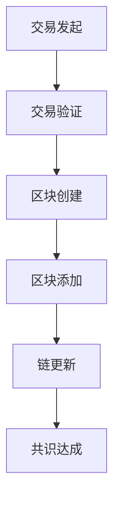
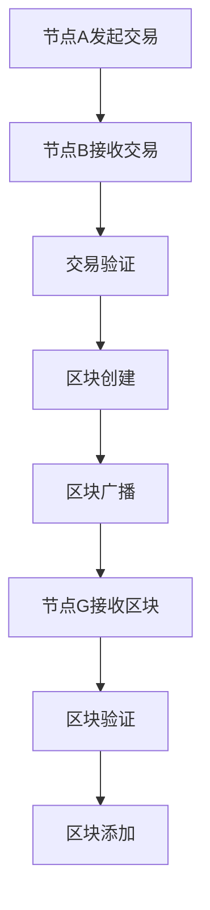

                 

# 《电商平台中的区块链技术应用》

## 关键词
区块链、电商平台、供应链金融、溯源系统、数字身份认证、智能合约、去中心化电商

## 摘要
区块链技术的出现为电商行业带来了巨大的变革机遇。本文首先介绍了区块链的基本概念和核心技术，然后深入探讨了区块链在电商平台中的应用，包括供应链金融、溯源系统、数字身份认证和智能合约等方面。通过实际案例分析和项目实战，展示了区块链技术在电商平台中的具体实现和应用效果，并展望了其未来的发展趋势与挑战。

----------------------------------------------------------------

## 第一部分：区块链技术基础

### 第1章：区块链概述

#### 1.1 区块链的基本概念

区块链是一种分布式数据库技术，它通过加密和共识算法实现数据的可靠存储和传输。区块链的核心特征是去中心化，这意味着数据不需要存储在一个中心化的服务器上，而是分散存储在多个节点上，从而避免了单点故障和中心化风险。

区块链的基本组成单元是“区块”，每个区块包含一定数量的交易记录、一个时间戳和一个随机数。多个区块按照时间顺序链接形成一个“链”，这就是区块链的名称由来。区块链的数据结构具有不可篡改性和透明性，这使得区块链在数据存储和传输过程中具有极高的安全性和可信度。

#### 1.2 区块链的核心特征

区块链具有以下几个核心特征：

- **安全性**：区块链使用加密算法保护数据的安全。每个区块都包含前一个区块的哈希值，这样一旦某个区块被篡改，整个链都会受到影响，因此篡改数据需要全网共识，几乎是不可能的。

- **透明性**：区块链上的所有交易记录都是公开透明的，任何人都可以查看和验证。这种透明性提高了数据的可信度，便于追溯和审计。

- **不可篡改性**：一旦数据被记录在区块链上，除非全网共识，否则无法被篡改。这使得区块链成为一种可靠的记录和存储手段。

#### 1.3 区块链的发展历史

区块链的概念最早可以追溯到1991年，由密码学家大卫·乔姆提出。2008年，中本聪发表了《比特币：一个点对点的电子现金系统》白皮书，比特币作为第一个区块链应用诞生。比特币的成功引发了人们对区块链技术的广泛关注和研究。

2015年，区块链技术逐渐从金融领域扩展到多个行业，如供应链管理、医疗保健、物联网等。区块链技术的应用场景不断丰富，其影响力也在逐步扩大。

### 第2章：区块链技术原理

#### 2.1 区块链的数据结构

区块链的数据结构主要包括区块和链。

- **区块**：每个区块包含一定数量的交易记录、一个时间戳和一个随机数。交易记录是指区块链上的各种操作，如支付、转账、数据记录等。时间戳用于记录区块生成的时间，随机数用于挖矿过程中的计算。

- **链**：多个区块按照时间顺序链接形成一个链。每个区块都包含前一个区块的哈希值，这样整个链就像一个链条一样连接在一起。一旦某个区块被篡改，整个链都会受到影响，因此篡改数据需要全网共识，几乎是不可能的。

#### 2.2 区块链的工作原理

区块链的工作原理可以概括为以下几个步骤：

1. **交易发起**：用户在区块链上发起交易，如支付、转账等。

2. **交易验证**：交易被多个节点验证，确保交易的有效性和合法性。

3. **区块创建**：多个经过验证的交易被汇总到一个新区块中。

4. **区块添加**：新区块被添加到区块链上，与现有区块链进行链接。

5. **链更新**：区块链上的所有节点更新链的状态。

#### 2.3 区块链的安全机制

区块链的安全机制主要包括以下两个方面：

- **加密算法**：区块链使用加密算法保护数据的安全。每个区块都包含前一个区块的哈希值，这样一旦某个区块被篡改，整个链都会受到影响。

- **共识机制**：区块链采用共识机制确保数据的一致性和安全性。共识机制有多种形式，如工作量证明（PoW）、权益证明（PoS）等。

#### 2.4 Mermaid 流程图：区块链核心架构



#### 2.5 区块链网络

区块链网络由多个节点组成，每个节点都可以维护区块链的状态。节点之间通过共识机制进行通信，确保区块链的数据一致性和安全性。

- **节点**：节点是区块链网络中的基本单位，可以是个人或组织。节点负责维护区块链的状态，验证交易，并参与共识过程。

- **共识机制**：共识机制是节点之间达成一致的方法，确保区块链的数据一致性和安全性。常见的共识机制有工作量证明（PoW）、权益证明（PoS）等。

#### 2.6 区块链网络通信流程



## 第二部分：区块链在电商平台的应用

### 第3章：区块链在电商平台中的潜在应用

#### 3.1 区块链在电商平台的潜在价值

区块链技术为电商平台带来了以下潜在价值：

- **数据安全**：区块链的加密和共识机制确保了电商平台交易数据的完整性和安全性。

- **透明度**：区块链上的所有交易记录都是公开透明的，提高了供应链和交易过程的透明度。

- **信任**：基于区块链的共识机制，建立了去中心化的信任体系，减少了中介环节，降低了交易成本。

#### 3.2 区块链在电商平台的的应用场景

区块链在电商平台中的应用场景包括但不限于以下几个方面：

- **供应链管理**：通过区块链实现商品的全流程追溯，提高供应链的透明度和效率。

- **支付系统**：利用智能合约实现自动支付和结算，降低交易成本，提高支付效率。

- **数字身份认证**：确保用户身份的真实性和安全性，减少欺诈行为。

- **去中心化电商**：构建去中心化的电商生态系统，打破中心化平台的垄断，提高市场竞争。

#### 3.3 区块链与电商平台的结合点

区块链与电商平台的结合点主要体现在以下几个方面：

- **去中心化**：区块链的去中心化特性可以打破中心化平台的垄断，提高市场竞争。

- **智能合约**：智能合约可以自动化执行交易和合同条款，提高交易效率。

- **数据透明度**：区块链上的交易记录公开透明，便于追溯和审计。

### 第4章：供应链金融与区块链

#### 4.1 供应链金融概述

供应链金融是指为企业提供融资服务，支持供应链上的各个环节。传统供应链金融存在以下问题：

- **信息不对称**：金融机构难以获取供应链上下游企业的真实经营状况。

- **交易成本高**：传统金融体系中的中介环节繁多，导致交易成本高。

- **信用风险**：供应链中的中小企业信用评级较低，融资困难。

区块链技术可以解决供应链金融中的这些问题，提高融资效率和降低风险。

#### 4.2 区块链在供应链金融中的应用

区块链在供应链金融中的应用主要体现在以下几个方面：

- **信息共享**：区块链上的数据透明可查，金融机构可以实时获取供应链上下游企业的经营状况，降低信息不对称。

- **智能合约**：智能合约可以自动化执行融资流程，提高交易效率。

- **信用评估**：基于区块链的信用评估系统，可以更准确地评估企业的信用风险，降低融资难度。

#### 4.3 区块链供应链金融案例解析

以某电商平台为例，该平台利用区块链技术实现供应链金融。

- **流程**：供应商向电商平台申请融资，电商平台通过区块链验证供应商的经营状况，然后智能合约自动执行融资流程。

- **效果**：该平台实现了融资流程的自动化，提高了融资效率，降低了交易成本。

#### 4.4 伪代码：区块链供应链金融流程实现

```python
# 伪代码：区块链供应链金融流程

# 1. 供应商发起融资请求
def generate_finance_request(supplier):
    # 生成供应商融资请求
    pass

# 2. 电商平台验证融资请求
def validate_request(request):
    # 验证供应商融资请求
    pass

# 3. 智能合约执行融资流程
def execute_finance_contract(request):
    # 执行智能合约融资流程
    pass

# 4. 更新区块链状态
def update_chain_state():
    # 更新区块链状态
    pass
```

### 第5章：溯源系统与区块链

#### 5.1 溯源系统的定义与重要性

溯源系统是指记录产品从生产到消费的全过程，以便在出现问题时能够快速追溯到源头。溯源系统的重要性体现在以下几个方面：

- **保障产品质量**：通过溯源系统，消费者可以了解产品的生产过程，提高对产品质量的信任。

- **食品安全监管**：在食品安全领域，溯源系统可以帮助监管部门快速追踪食品来源，提高食品安全监管效率。

- **供应链管理**：溯源系统可以提高供应链的透明度，帮助企业优化生产流程，降低成本。

#### 5.2 区块链在溯源系统中的应用

区块链技术可以为溯源系统提供以下支持：

- **数据记录**：区块链上的数据具有不可篡改性和透明性，可以确保溯源数据的真实性和可靠性。

- **数据共享**：区块链上的数据可以实时共享，提高供应链的协同效率。

- **溯源过程透明**：区块链上的交易记录公开透明，消费者可以随时查询产品的溯源信息。

#### 5.3 区块链溯源案例解析

以某电商平台为例，该平台利用区块链技术实现食品溯源。

- **流程**：电商平台在食品生产过程中，将关键信息记录在区块链上，消费者可以通过扫描二维码查询食品的溯源信息。

- **效果**：该平台实现了食品溯源的透明化，提高了消费者对产品质量的信任。

#### 5.4 数学模型：区块链溯源数据验证

```latex
% 数学模型：区块链溯源数据验证

\begin{equation}
\begin{aligned}
    &\text{验证数据完整性：} \\
    &D_{current} = D_{previous} \land H(D_{previous}) \\
    &\text{其中，} D_{current} \text{为当前数据，} D_{previous} \text{为上一份数据，} H() \text{为哈希函数。}
\end{aligned}
\end{equation}
```

### 第6章：数字身份认证与区块链

#### 6.1 数字身份认证的概念与挑战

数字身份认证是指使用数字技术验证用户身份的过程。在传统的身份认证系统中，通常依赖于中心化的数据库进行身份验证，存在以下挑战：

- **安全性**：中心化的数据库容易成为攻击的目标，导致用户身份信息泄露。

- **隐私保护**：用户身份信息在中心化数据库中集中存储，存在隐私泄露的风险。

- **效率**：中心化的身份认证系统往往需要大量的人工干预，效率较低。

区块链技术可以为数字身份认证提供以下解决方案：

- **去中心化**：区块链上的身份认证数据分散存储，降低了被攻击的风险。

- **隐私保护**：区块链上的数据加密存储，确保用户身份信息的隐私。

- **效率**：区块链上的身份认证过程自动化，提高了认证效率。

#### 6.2 区块链在数字身份认证中的应用

区块链在数字身份认证中的应用主要体现在以下几个方面：

- **分布式身份认证**：通过区块链实现去中心化的身份认证，用户可以在多个节点上维护自己的身份信息。

- **智能合约**：利用智能合约自动化执行身份认证过程，提高认证效率。

- **数据共享**：区块链上的身份认证数据可以实时共享，提高身份认证的协同效率。

#### 6.3 区块链数字身份认证案例解析

以某电商平台为例，该平台利用区块链技术实现数字身份认证。

- **流程**：用户在电商平台注册时，将身份信息上传到区块链，每次登录时通过区块链验证身份信息。

- **效果**：该平台实现了高效、安全的数字身份认证，提高了用户注册和登录的体验。

#### 6.4 数学模型与公式：区块链数字身份认证验证流程

```latex
% 数学模型与公式：区块链数字身份认证验证流程

\begin{equation}
\begin{aligned}
    &\text{身份认证：} \\
    &V = \text{哈希函数}(I, K) \\
    &\text{其中，} V \text{为验证结果，} I \text{为身份信息，} K \text{为密钥。}
\end{aligned}
\end{equation}
```

### 第7章：智能合约与电商平台

#### 8.1 智能合约概述

智能合约是一种自动执行合约条款的程序，基于区块链技术实现。智能合约的核心特点包括：

- **自动化执行**：智能合约在满足特定条件时自动执行，无需人工干预。

- **不可篡改性**：智能合约一旦部署到区块链上，就无法被篡改，确保合约条款的执行。

- **透明性**：智能合约的执行过程公开透明，所有参与方都可以查看。

#### 8.2 智能合约在电商平台的应用

智能合约在电商平台中的应用主要包括以下几个方面：

- **支付和结算**：智能合约可以自动化执行支付和结算过程，提高交易效率。

- **退款和理赔**：智能合约可以自动化处理退款和理赔，减少人工干预。

- **商品认证**：智能合约可以用于商品认证，确保商品的真实性和质量。

#### 8.3 智能合约开发与部署

智能合约的开发和部署主要包括以下几个步骤：

- **智能合约编写**：使用合适的编程语言（如Solidity）编写智能合约代码。

- **智能合约测试**：在部署前对智能合约进行测试，确保其正确性和安全性。

- **智能合约部署**：将智能合约部署到区块链网络，使其具备执行功能。

#### 8.4 伪代码：智能合约电商平台支付流程

```python
# 伪代码：智能合约电商平台支付流程

# 1. 用户发起支付请求
def generate_payment_request(product, buyer, seller):
    # 生成支付请求
    pass

# 2. 智能合约验证支付请求
def validate_payment_request(payment_request):
    # 验证支付请求
    pass

# 3. 智能合约执行支付
def execute_payment(payment_request):
    # 执行支付
    pass

# 4. 更新区块链状态
def update_chain_state():
    # 更新区块链状态
    pass
```

### 第8章：去中心化电商生态系统

#### 8.1 去中心化电商的概念与优势

去中心化电商是指不依赖于中心化平台，通过区块链技术实现去中心化交易和服务的电商平台。去中心化电商具有以下优势：

- **去中心化**：去中心化电商打破了中心化平台的垄断，提高了市场竞争。

- **透明度**：去中心化电商的交易记录公开透明，便于追溯和审计。

- **安全性**：去中心化电商的数据存储在区块链上，具有很高的安全性。

#### 8.2 区块链在去中心化电商中的应用

区块链在去中心化电商中的应用主要体现在以下几个方面：

- **交易记录**：区块链上的交易记录公开透明，提高了交易的信任度。

- **智能合约**：智能合约可以自动化执行交易和合约条款，提高交易效率。

- **数字身份认证**：区块链上的数字身份认证系统确保用户身份的真实性和安全性。

#### 8.3 去中心化电商生态系统构建

构建去中心化电商生态系统需要以下几个步骤：

- **平台设计**：设计去中心化电商平台的架构，包括交易市场、智能合约系统、数字身份认证系统等。

- **节点部署**：部署区块链节点，确保平台的稳定运行。

- **应用开发**：开发电商平台的各种应用功能，如商品发布、订单管理、支付结算等。

#### 8.4 伪代码：去中心化电商交易流程

```python
# 伪代码：去中心化电商交易流程

# 1. 用户发布商品
def publish_product(product, seller):
    # 发布商品
    pass

# 2. 用户浏览并下单
def create_order(product, buyer):
    # 创建订单
    pass

# 3. 智能合约验证交易
def validate_order(order):
    # 验证订单
    pass

# 4. 智能合约执行交易
def execute_order(order):
    # 执行交易
    pass

# 5. 更新区块链状态
def update_chain_state():
    # 更新区块链状态
    pass
```

### 第9章：区块链电商平台项目实战

#### 9.1 项目概述

本节将介绍一个区块链电商平台的实战项目。该项目旨在构建一个去中心化的电商平台，通过区块链技术实现商品交易、支付结算和溯源等功能。

#### 9.2 开发环境搭建

在开发该区块链电商平台之前，需要搭建以下开发环境：

- **区块链节点**：部署区块链节点，确保平台的稳定运行。

- **智能合约开发环境**：配置智能合约开发环境，如Truffle等。

- **前端开发工具**：配置前端开发工具，如React等。

#### 9.3 源代码实现与解读

本节将详细解析项目的源代码实现，包括智能合约和前端应用的代码。

#### 9.4 代码分析与优化

在代码实现的基础上，本节将分析代码的性能和可优化性，并提出优化方案。

### 第10章：案例分析

#### 10.1 案例一：知名电商平台区块链应用案例

本节将分析某知名电商平台如何应用区块链技术，提高交易效率和数据安全。

#### 10.2 案例二：新兴区块链电商项目分析

本节将分析某新兴区块链电商项目的优缺点，探讨其未来发展前景。

#### 10.3 案例三：区块链溯源系统应用案例

本节将分析区块链溯源系统在食品安全领域的应用案例，探讨其效果和挑战。

#### 10.4 案例四：去中心化电商案例分析

本节将分析去中心化电商的发展趋势，探讨其与中心化电商的优劣。

### 第11章：区块链电商平台发展趋势与展望

#### 11.1 区块链电商市场现状

本节将分析当前区块链电商市场的现状，包括市场规模、应用场景和发展趋势。

#### 11.2 区块链电商发展趋势

本节将探讨区块链电商未来的发展趋势，包括技术创新、应用拓展和市场前景。

#### 11.3 未来展望与挑战

本节将展望区块链电商的未来发展，并探讨其面临的挑战和机遇。

### 附录

#### 附录 A：区块链相关工具与资源

本附录将介绍区块链开发工具和相关资源，包括开发环境、智能合约开发工具、区块链研究资源等。

#### 附录 B：区块链电商平台开发指南

本附录将提供区块链电商平台的开发指南，包括架构设计、功能实现、性能优化等方面的建议。

#### 附录 C：区块链安全指南

本附录将介绍区块链安全相关知识，包括安全漏洞、防范措施和安全策略等。

## 总结与展望

区块链技术的应用为电商平台带来了巨大的变革机遇。通过本文的探讨，我们可以看到区块链技术在供应链金融、溯源系统、数字身份认证、智能合约和去中心化电商等领域具有广泛的应用前景。未来，随着区块链技术的不断成熟和应用场景的拓展，我们可以期待区块链技术在电商平台中发挥更大的作用。

然而，区块链技术的应用也面临着一些挑战，如技术门槛、安全性、隐私保护等。为了推动区块链技术在电商平台中的应用，我们需要加强技术研究、人才培养和产业合作，共同推动区块链技术的发展。

作者：AI天才研究院/AI Genius Institute
文章标题：《电商平台中的区块链技术应用》
文章摘要：本文深入探讨了区块链技术在电商平台中的应用，包括供应链金融、溯源系统、数字身份认证和智能合约等方面，并通过实际案例和项目实战展示了区块链技术在电商平台中的具体实现和应用效果。

