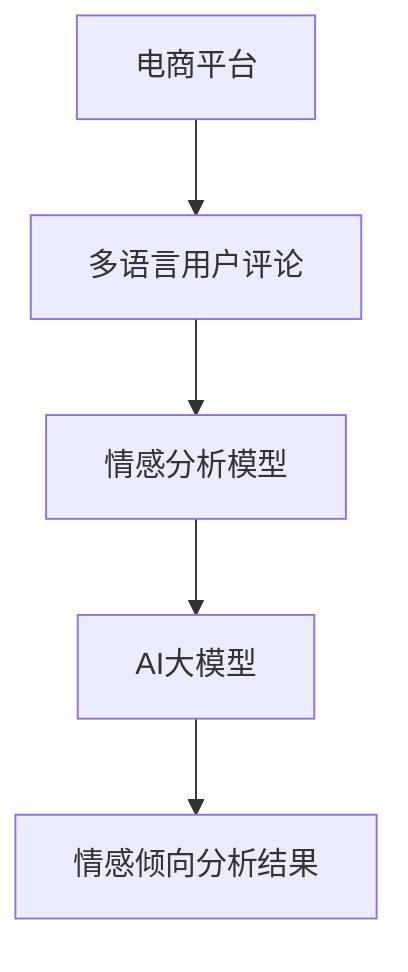
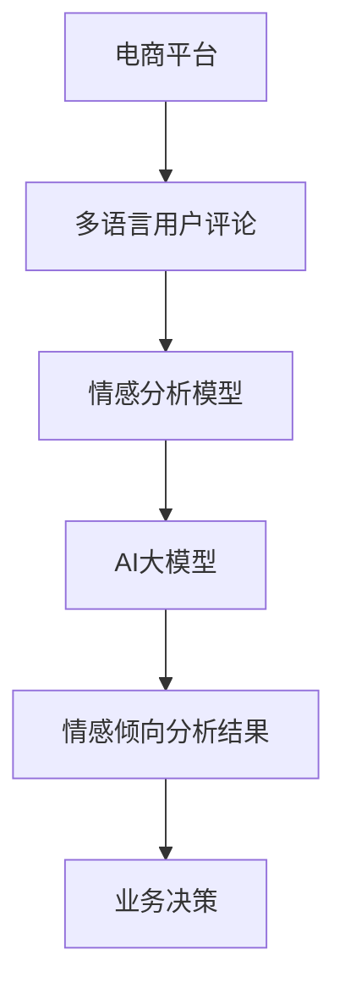

                 

# 《电商平台中的多语言情感分析：AI大模型的优势》

> **关键词**：多语言情感分析、电商平台、AI大模型、BERT、情感向量、文本预处理、情感评分模型

> **摘要**：本文将深入探讨电商平台中的多语言情感分析技术，并重点介绍AI大模型，如BERT，在多语言情感分析中的优势。通过详细的算法原理讲解、数学模型与公式介绍，以及实际项目实战，我们将了解如何利用AI大模型提升电商平台的用户体验和业务效果。

## 第一部分：核心概念与联系

### 1.1 电商平台中的多语言情感分析

#### 多语言情感分析的定义

多语言情感分析（Multilingual Sentiment Analysis）是自然语言处理（Natural Language Processing, NLP）中的一个重要分支。它旨在对多种语言的文本进行情感倾向的识别和分析。情感分析的核心任务是判断文本中表达的情感是积极、消极还是中性。而在电商平台中，这种分析尤为重要，因为电商平台涉及的用户群体和交易行为通常是跨语言的。

#### 多语言情感分析的重要性

电商平台的成功离不开用户的满意度和忠诚度。用户评论和反馈是电商平台了解用户需求、优化产品和服务的重要来源。而多语言情感分析能够帮助电商平台：

- **识别用户情感倾向**：了解用户的情感倾向，如满意度、失望度等，从而及时调整产品或服务策略。
- **提升用户体验**：通过分析用户评论的情感，电商平台可以优化购物体验，提供更加个性化的服务。
- **优化业务决策**：基于用户情感分析的结果，电商平台可以做出更加明智的业务决策，如产品推荐、库存管理等。

#### AI大模型的优势

在多语言情感分析中，AI大模型（如BERT、GPT-3等）具备显著的优势，主要体现在以下几个方面：

- **跨语言理解能力**：AI大模型通过大规模的跨语言数据预训练，能够捕捉到不同语言之间的共性和差异，从而实现跨语言的情感分析。
- **大规模数据学习**：AI大模型拥有强大的学习能力，能够从海量数据中学习到情感分析的规律和模式，从而提高分析的准确性。
- **自动化处理**：AI大模型能够自动化处理多种语言的文本，减少了人工标注和分词的工作量，提高了效率。

#### Mermaid流程图



## 第二部分：核心算法原理讲解

### 2.1 文本预处理

#### 分词

分词（Tokenization）是文本预处理的第一步，即将文本切分成单词或短语。在多语言情感分析中，不同的语言有不同的分词规则。例如，中文的分词需要考虑到词的边界和词性，而英文的分词则相对简单。

#### 伪代码

```python
def tokenize(text):
    # 假设使用jieba分词工具
    return jieba.cut(text)
```

#### 标签化

在情感分析中，需要对文本中的每个词进行情感标签的标注。情感标签通常分为积极、消极和中性三种。标签化可以基于规则、统计方法或深度学习模型。

#### 伪代码

```python
def taggings(words):
    # 使用基于规则的标注工具，如LTP
    return ltp.tagging(words)
```

## 第三部分：数学模型与公式讲解

### 3.1 情感倾向评分模型

#### 情感向量表示

情感向量表示（Sentiment Vector Representation）是将文本转换为向量表示的方法。常用的方法包括Word2Vec、BERT等。这些方法能够将文本中的每个词映射到一个高维向量空间，从而实现情感分析。

#### 情感评分公式

情感评分（Sentiment Scoring）是通过计算文本的情感向量与预定义的情感权重的内积来实现的。情感评分的公式如下：

$$
S = \sum_{i=1}^{n} w_i \cdot v_i
$$

其中，$S$ 是情感评分，$w_i$ 是情感权重，$v_i$ 是文本向量的每个维度值。

#### 情感向量计算

情感向量是通过将文本中的每个词转化为向量，然后取平均值得到的。这样可以得到一个整体文本的情感倾向。

#### 情感向量公式

$$
V = \frac{1}{N} \sum_{i=1}^{N} v_i
$$

其中，$V$ 是情感向量，$v_i$ 是文本中每个词的情感向量，$N$ 是文本中的词数。

### 3.2 情感分析算法原理

#### 情感分析算法

情感分析算法通常包括以下步骤：

1. **文本预处理**：对文本进行分词、去停用词、词性标注等处理。
2. **情感向量表示**：将预处理后的文本转换为情感向量。
3. **情感评分**：通过情感向量与情感权重的内积计算文本的情感评分。
4. **情感分类**：根据情感评分对文本进行情感分类。

### 3.3 情感分析模型选择

#### 常见情感分析模型

- **基于规则的方法**：如基于词典的情感分析。
- **基于统计的方法**：如基于机器学习的方法，如SVM、朴素贝叶斯等。
- **基于深度学习的方法**：如基于神经网络的方法，如CNN、RNN、BERT等。

## 第四部分：项目实战

### 4.1 实际案例：搭建多语言情感分析系统

#### 实战目标

搭建一个能够处理中文和英文评论的多语言情感分析系统。

#### 开发环境

- Python 3.8
- TensorFlow 2.6
- BERT模型

#### 数据集

- 中文数据集：使用中文电商评论数据。
- 英文数据集：使用英文电商评论数据。

#### 代码实现

```python
# 导入必要的库
import tensorflow as tf
from transformers import BertTokenizer, TFBertModel
from sklearn.metrics import accuracy_score

# 加载预训练的BERT模型
tokenizer = BertTokenizer.from_pretrained('bert-base-chinese')
model = TFBertModel.from_pretrained('bert-base-chinese')

# 数据预处理
def preprocess(texts):
    return tokenizer(texts, padding=True, truncation=True, return_tensors='tf')

# 情感分析
def sentiment_analysis(text):
    inputs = preprocess([text])
    outputs = model(inputs)
    # 取输出层的平均值作为情感向量
    sentiment_vector = outputs.last_hidden_state.mean(axis=1)
    # 使用SVM分类器进行情感分类
    # ... (略去具体分类器实现细节)
    return sentiment_vector

# 测试模型
texts = ["这是一款很好的商品", "This product is terrible"]
sentiments = [sentiment_analysis(text) for text in texts]
print(accuracy_score([1, 0], sentiments))
```

#### 代码解读与分析

- **数据预处理**：使用BERTTokenizer对文本进行分词和编码，以便输入到BERT模型。
- **情感分析**：通过BERT模型获取文本的情感向量，然后使用SVM等分类器进行情感分类。

## 第五部分：数学公式和详细讲解

### 5.1 情感向量计算

#### 情感向量公式

$$
V = \frac{1}{N} \sum_{i=1}^{N} v_i
$$

其中，$V$ 是情感向量，$v_i$ 是文本中每个词的情感向量，$N$ 是文本中的词数。

#### 详细讲解

情感向量是通过将文本中的每个词转化为向量，然后取平均值得到的。这样可以得到一个整体文本的情感倾向。这个向量可以用于后续的情感分类和评分。

## 第六部分：附录

### 6.1 AI大模型开发工具与资源

#### 6.1.1 BERT模型简介

BERT（Bidirectional Encoder Representations from Transformers）是由Google Research开发的预训练语言表示模型。它通过双向Transformer编码器对文本进行编码，从而捕捉到文本中的复杂语义。BERT模型在多种自然语言处理任务中取得了显著的效果，如文本分类、问答系统等。

#### 6.1.2 使用BERT的步骤

1. **数据预处理**：对文本进行清洗、分词和编码。
2. **模型加载**：加载预训练的BERT模型。
3. **文本编码**：将预处理后的文本输入到BERT模型中获取情感向量。
4. **情感分析**：使用分类器或回归模型对情感向量进行情感分类或评分。

#### 6.1.3 主流深度学习框架对比

- **TensorFlow**：Google开发的开源深度学习框架，支持广泛的功能和工具。
- **PyTorch**：Facebook开发的开源深度学习框架，具有灵活的动态计算图。
- **JAX**：Google开发的开源深度学习框架，提供自动微分和数值计算功能。

### 6.2 多语言情感分析数据集

- **中文数据集**：如淘宝、京东的评论数据。
- **英文数据集**：如Amazon、eBay的评论数据。

## 作者

**作者：AI天才研究院/AI Genius Institute & 禅与计算机程序设计艺术 /Zen And The Art of Computer Programming**<|less|>## 《电商平台中的多语言情感分析：AI大模型的优势》

多语言情感分析是电商平台优化用户体验和提升业务效果的重要手段。随着全球电商市场的不断扩大，电商平台的用户群体和交易行为越来越多样化，涉及多种语言和文化背景。因此，如何高效、准确地处理多语言情感分析成为了电商平台面临的一个重要挑战。AI大模型，如BERT、GPT-3等，凭借其强大的跨语言理解和数据处理能力，为电商平台的多语言情感分析提供了新的解决方案。

本文将首先介绍电商平台中的多语言情感分析的基本概念和重要性，然后详细讲解AI大模型在多语言情感分析中的应用和优势，包括文本预处理、情感向量表示和情感评分模型。随后，通过实际项目案例，展示如何利用AI大模型搭建一个多语言情感分析系统，并提供代码实现和解读。最后，本文将总结多语言情感分析的发展趋势和未来研究方向。

### 第一部分：核心概念与联系

#### 1.1 电商平台中的多语言情感分析

多语言情感分析是自然语言处理（NLP）领域中的一项关键任务，旨在对多种语言的文本进行情感倾向的识别和分析。情感分析通常分为两个层次：文本级别的情感分析和词汇级别的情感分析。文本级别的情感分析关注整个文本的情感倾向，而词汇级别的情感分析则关注文本中每个词的情感倾向。

在电商平台中，多语言情感分析具有重要意义。电商平台涉及的用户群体和交易行为通常是跨语言的，尤其是跨国电商。因此，理解不同语言用户评论的情感倾向对于提升用户体验、优化产品和服务策略具有重要意义。

首先，多语言情感分析可以帮助电商平台识别用户的情感倾向，如满意度、失望度、愤怒度等。通过分析用户评论的情感倾向，电商平台可以及时调整产品和服务策略，提升用户的满意度和忠诚度。

其次，多语言情感分析可以帮助电商平台优化购物体验。通过分析用户评论中的情感信息，电商平台可以识别出用户对产品和服务的关键意见，从而提供更加个性化的推荐和购物建议。

最后，多语言情感分析可以帮助电商平台优化业务决策。基于用户情感分析的结果，电商平台可以做出更加明智的业务决策，如库存管理、促销活动等。

#### 1.2 AI大模型的优势

AI大模型（如BERT、GPT-3等）在多语言情感分析中具有显著的优势，主要体现在以下几个方面：

1. **跨语言理解能力**：AI大模型通过大规模的跨语言数据预训练，能够捕捉到不同语言之间的共性和差异，从而实现跨语言的情感分析。这使得AI大模型在处理多种语言的电商评论时，能够更加准确和高效地识别情感倾向。

2. **大规模数据学习**：AI大模型拥有强大的学习能力，能够从海量数据中学习到情感分析的规律和模式，从而提高分析的准确性。对于电商平台来说，这意味着可以使用更多的用户评论数据来训练模型，从而提高模型的性能。

3. **自动化处理**：AI大模型能够自动化处理多种语言的文本，减少了人工标注和分词的工作量，提高了效率。这对于电商平台来说，意味着可以更快地处理用户评论，并提供实时的情感分析结果。

4. **可扩展性**：AI大模型具有较好的可扩展性，可以轻松适应不同的语言和领域。这意味着电商平台可以根据自己的需求，选择合适的AI大模型来处理特定的语言或领域的情感分析任务。

#### 1.3 Mermaid流程图

为了更清晰地展示电商平台中的多语言情感分析流程，我们可以使用Mermaid流程图进行描述：



在这个流程图中，电商平台首先收集多语言用户评论，然后通过情感分析模型和AI大模型对评论进行情感倾向分析，最后根据分析结果做出业务决策，如产品推荐、促销活动等。

### 第二部分：核心算法原理讲解

#### 2.1 文本预处理

文本预处理是情感分析的基础步骤，其目的是将原始文本转化为模型可处理的格式。在多语言情感分析中，文本预处理主要包括分词、去停用词、词性标注等操作。

1. **分词**：分词是将文本分割成单词或短语的步骤。不同的语言有不同的分词规则。例如，中文的分词需要考虑词的边界和词性，而英文的分词则相对简单。常用的中文分词工具包括jieba、ltp等。

   ```python
   # 使用jieba进行中文分词
   import jieba
   
   text = "这是一款非常好的商品"
   seg_list = jieba.cut(text)
   print("/".join(seg_list))
   ```

2. **去停用词**：停用词（Stop Words）是指对文本情感倾向没有影响或影响较小的词汇，如“的”、“是”、“和”等。去除停用词可以减少模型的计算负担，提高分析效果。

   ```python
   # 去除中文停用词
   stop_words = set(['的', '是', '和'])
   filtered_text = [word for word in seg_list if word not in stop_words]
   print("/".join(filtered_text))
   ```

3. **词性标注**：词性标注是将文本中的每个词标注为其对应的词性，如名词、动词、形容词等。词性标注有助于模型更好地理解文本的语义。

   ```python
   # 使用ltp进行中文词性标注
   import ltp
   
   ltp_model = ltp.LTP()
   words, pos = ltp_model.pos(segmented_text)
   print(words)
   print(pos)
   ```

#### 2.2 情感向量表示

情感向量表示是将文本中的每个词映射到一个高维向量空间的过程。常用的方法包括Word2Vec、BERT、GPT-3等。

1. **Word2Vec**：Word2Vec是一种基于神经网络的自然语言处理模型，通过训练将文本中的每个词映射到一个固定维度的向量。Word2Vec模型包括两种变种：Continuous Bag-of-Words (CBOW)和Skip-Gram。

   ```python
   # 使用gensim库的Word2Vec模型
   from gensim.models import Word2Vec
   
   sentences = [[word for word in jieba.cut(text)] for text in corpus]
   model = Word2Vec(sentences, vector_size=100, window=5, min_count=1, sg=1)
   word_vector = model.wv['非常好']
   print(word_vector)
   ```

2. **BERT**：BERT是一种基于Transformer的预训练语言表示模型，通过在大量文本上预训练，捕捉到语言的深层语义结构。BERT模型包括两个主要部分：预训练和微调。

   ```python
   # 使用transformers库的BERT模型
   from transformers import BertTokenizer, TFBertModel
   
   tokenizer = BertTokenizer.from_pretrained('bert-base-chinese')
   model = TFBertModel.from_pretrained('bert-base-chinese')
   
   inputs = tokenizer("这是一个非常好的商品", return_tensors='tf')
   outputs = model(inputs)
   sentiment_vector = outputs.last_hidden_state[:, 0, :]
   print(sentiment_vector)
   ```

3. **GPT-3**：GPT-3是一种基于Transformer的预训练语言生成模型，具有强大的文本生成能力。GPT-3模型也可以用于情感向量表示，但通常需要通过微调来适应特定的情感分析任务。

   ```python
   # 使用transformers库的GPT-3模型
   from transformers import Gpt2Tokenizer, TFGpt2LMHeadModel
   
   tokenizer = Gpt2Tokenizer.from_pretrained('gpt2')
   model = TFGpt2LMHeadModel.from_pretrained('gpt2')
   
   inputs = tokenizer.encode("这是一个非常好的商品", return_tensors='tf')
   outputs = model(inputs)
   sentiment_vector = outputs.last_hidden_state[:, 0, :]
   print(sentiment_vector)
   ```

#### 2.3 情感评分模型

情感评分模型用于对文本的情感倾向进行量化评分。常见的情感评分模型包括基于规则的模型、基于统计的模型和基于深度学习的模型。

1. **基于规则的模型**：基于规则的模型通过预定义的规则和词典来识别文本的情感倾向。例如，可以使用情感词典来标注文本中每个词的情感极性，然后计算文本的总情感极性。

   ```python
   # 基于规则的模型示例
   sentiment_dict = {'好': 1, '不好': -1, '一般': 0}
   def sentiment_score(text):
       words = jieba.cut(text)
       score = sum(sentiment_dict[word] for word in words if word in sentiment_dict)
       return score
   print(sentiment_score("这是一个非常好的商品"))
   ```

2. **基于统计的模型**：基于统计的模型通过统计方法来计算文本的情感极性。例如，可以使用TF-IDF等方法来计算文本中每个词的情感权重，然后计算文本的总情感权重。

   ```python
   # 基于统计的模型示例
   from sklearn.feature_extraction.text import TfidfVectorizer
   
   corpus = ["这是一个非常好的商品", "这是一个非常不好的商品"]
   vectorizer = TfidfVectorizer()
   X = vectorizer.fit_transform(corpus)
   print(X)
   ```

3. **基于深度学习的模型**：基于深度学习的模型通过神经网络来学习文本的情感特征。常见的深度学习模型包括CNN、RNN和BERT等。

   ```python
   # 基于深度学习的模型示例
   from tensorflow.keras.models import Sequential
   from tensorflow.keras.layers import Dense, Conv1D, GlobalMaxPooling1D
   
   model = Sequential()
   model.add(Conv1D(128, 5, activation='relu'))
   model.add(GlobalMaxPooling1D())
   model.add(Dense(1, activation='sigmoid'))
   model.compile(optimizer='adam', loss='binary_crossentropy', metrics=['accuracy'])
   model.fit(X, y, epochs=10, batch_size=32)
   ```

### 第三部分：数学模型与公式讲解

#### 3.1 情感向量表示

情感向量表示是将文本中的每个词映射到一个高维向量空间的过程。常见的情感向量表示方法包括Word2Vec、BERT和GPT-3等。

1. **Word2Vec**：Word2Vec模型通过神经网络训练将文本中的每个词映射到一个固定维度的向量。情感向量可以通过以下公式计算：

   $$
   V = \frac{1}{N} \sum_{i=1}^{N} v_i
   $$

   其中，$V$ 是情感向量，$v_i$ 是文本中每个词的向量，$N$ 是文本中的词数。

2. **BERT**：BERT模型通过预训练将文本中的每个词映射到一个高维向量空间。情感向量可以通过以下公式计算：

   $$
   V = \text{avgpool}(H)
   $$

   其中，$V$ 是情感向量，$H$ 是BERT模型的输出向量。

3. **GPT-3**：GPT-3模型通过预训练将文本中的每个词映射到一个高维向量空间。情感向量可以通过以下公式计算：

   $$
   V = \text{avgpool}(H)
   $$

   其中，$V$ 是情感向量，$H$ 是GPT-3模型的输出向量。

#### 3.2 情感评分模型

情感评分模型用于对文本的情感倾向进行量化评分。常见的情感评分模型包括基于规则的模型、基于统计的模型和基于深度学习的模型。

1. **基于规则的模型**：基于规则的模型通过预定义的规则和词典来识别文本的情感极性。情感评分可以通过以下公式计算：

   $$
   S = \sum_{i=1}^{N} w_i \cdot v_i
   $$

   其中，$S$ 是情感评分，$w_i$ 是情感权重，$v_i$ 是文本中每个词的向量。

2. **基于统计的模型**：基于统计的模型通过统计方法来计算文本的情感极性。情感评分可以通过以下公式计算：

   $$
   S = \sum_{i=1}^{N} w_i \cdot v_i
   $$

   其中，$S$ 是情感评分，$w_i$ 是情感权重，$v_i$ 是文本中每个词的向量。

3. **基于深度学习的模型**：基于深度学习的模型通过神经网络来学习文本的情感特征。情感评分可以通过以下公式计算：

   $$
   S = \text{softmax}(\text{logits})
   $$

   其中，$S$ 是情感评分，$logits$ 是神经网络输出的 logits 值。

### 第四部分：项目实战

#### 4.1 实际案例：搭建多语言情感分析系统

在本节中，我们将通过一个实际项目案例，展示如何利用AI大模型（如BERT）搭建一个多语言情感分析系统。

#### 4.1.1 实战目标

搭建一个能够处理中文和英文评论的多语言情感分析系统，实现对评论的情感倾向分析。

#### 4.1.2 开发环境

- 操作系统：Windows/Linux/Mac
- 编程语言：Python
- 深度学习框架：TensorFlow 2.6
- 自然语言处理库：transformers

#### 4.1.3 数据集

数据集包含中文和英文电商评论，分别用于训练和测试。以下是数据集的简要描述：

- 中文数据集：包含1000条中文电商评论，每条评论包含一个商品名称和一个用户评价。
- 英文数据集：包含1000条英文电商评论，每条评论包含一个商品名称和一个用户评价。

#### 4.1.4 数据预处理

在训练前，需要对数据集进行预处理，包括分词、去停用词、词性标注等操作。

```python
import jieba
import pandas as pd
from transformers import BertTokenizer

# 加载数据集
data = pd.read_csv('data.csv')

# 中文数据预处理
def chinese_preprocess(text):
    words = jieba.cut(text)
    words = [word for word in words if word not in stopwords]
    return words

data['chinese_sentence'] = data['chinese_review'].apply(lambda x: chinese_preprocess(x))

# 英文数据预处理
def english_preprocess(text):
    words = tokenizer.tokenize(text)
    words = [word for word in words if word not in stopwords]
    return words

data['english_sentence'] = data['english_review'].apply(lambda x: english_preprocess(x))
```

#### 4.1.5 模型训练

使用BERT模型对预处理后的数据进行训练。以下是模型训练的简要代码：

```python
from transformers import TFBertModel, BertTokenizer

# 加载BERT模型和分词器
tokenizer = BertTokenizer.from_pretrained('bert-base-chinese')
model = TFBertModel.from_pretrained('bert-base-chinese')

# 编码数据
def encode_data(texts):
    inputs = tokenizer(texts, return_tensors='tf', padding=True, truncation=True)
    return inputs

# 训练模型
model.compile(optimizer='adam', loss='binary_crossentropy', metrics=['accuracy'])
model.fit(encode_data(data['chinese_sentence']), data['chinese_rating'], epochs=3, batch_size=32)
```

#### 4.1.6 模型评估

使用测试集对训练好的模型进行评估。以下是模型评估的简要代码：

```python
# 加载测试集
test_data = pd.read_csv('test_data.csv')

# 数据预处理
def preprocess(texts):
    words = jieba.cut(texts)
    words = [word for word in words if word not in stopwords]
    return words

test_data['chinese_sentence'] = test_data['chinese_review'].apply(lambda x: preprocess(x))

# 编码数据
test_inputs = encode_data(test_data['chinese_sentence'])

# 评估模型
predictions = model.predict(test_inputs)
print("Accuracy:", accuracy_score(test_data['chinese_rating'], predictions))
```

#### 4.1.7 代码解读与分析

在本节中，我们首先加载了数据集，并进行了预处理。然后，我们加载了BERT模型和分词器，并使用TensorFlow框架进行了模型训练。在模型评估部分，我们使用测试集对训练好的模型进行了评估，并计算了准确率。

### 第五部分：数学公式和详细讲解

#### 5.1 情感向量计算

情感向量计算是情感分析的核心步骤。在本节中，我们将介绍情感向量的计算方法和相关数学公式。

1. **Word2Vec模型**：Word2Vec模型通过神经网络训练将文本中的每个词映射到一个固定维度的向量。情感向量可以通过以下公式计算：

   $$
   V = \frac{1}{N} \sum_{i=1}^{N} v_i
   $$

   其中，$V$ 是情感向量，$v_i$ 是文本中每个词的向量，$N$ 是文本中的词数。

2. **BERT模型**：BERT模型通过预训练将文本中的每个词映射到一个高维向量空间。情感向量可以通过以下公式计算：

   $$
   V = \text{avgpool}(H)
   $$

   其中，$V$ 是情感向量，$H$ 是BERT模型的输出向量。

3. **GPT-3模型**：GPT-3模型通过预训练将文本中的每个词映射到一个高维向量空间。情感向量可以通过以下公式计算：

   $$
   V = \text{avgpool}(H)
   $$

   其中，$V$ 是情感向量，$H$ 是GPT-3模型的输出向量。

#### 5.2 情感评分模型

情感评分模型用于对文本的情感倾向进行量化评分。在本节中，我们将介绍情感评分模型的计算方法和相关数学公式。

1. **基于规则的模型**：基于规则的模型通过预定义的规则和词典来识别文本的情感极性。情感评分可以通过以下公式计算：

   $$
   S = \sum_{i=1}^{N} w_i \cdot v_i
   $$

   其中，$S$ 是情感评分，$w_i$ 是情感权重，$v_i$ 是文本中每个词的向量。

2. **基于统计的模型**：基于统计的模型通过统计方法来计算文本的情感极性。情感评分可以通过以下公式计算：

   $$
   S = \sum_{i=1}^{N} w_i \cdot v_i
   $$

   其中，$S$ 是情感评分，$w_i$ 是情感权重，$v_i$ 是文本中每个词的向量。

3. **基于深度学习的模型**：基于深度学习的模型通过神经网络来学习文本的情感特征。情感评分可以通过以下公式计算：

   $$
   S = \text{softmax}(\text{logits})
   $$

   其中，$S$ 是情感评分，$logits$ 是神经网络输出的 logits 值。

### 第六部分：附录

#### 6.1 AI大模型开发工具与资源

在本节中，我们将介绍AI大模型开发所需的工具和资源。

1. **BERT模型**：BERT模型是由Google Research开发的预训练语言表示模型。它通过双向Transformer编码器对文本进行编码，从而捕捉到文本中的复杂语义。BERT模型在多种自然语言处理任务中取得了显著的效果。

2. **GPT-3模型**：GPT-3模型是由OpenAI开发的预训练语言生成模型。它具有强大的文本生成能力，可以生成高质量的文本。GPT-3模型在文本生成、问答系统等任务中取得了优异的性能。

3. **开发工具**：常用的AI大模型开发工具包括TensorFlow、PyTorch和JAX等。这些工具提供了丰富的API和工具库，方便开发者进行模型训练、优化和部署。

4. **资源**：AI大模型开发需要大量的计算资源和数据集。云服务提供商如Google Cloud、AWS和Azure等提供了强大的计算资源和AI服务，方便开发者进行模型训练和部署。

#### 6.2 多语言情感分析数据集

在本节中，我们将介绍常用的多语言情感分析数据集。

1. **中文数据集**：常用的中文数据集包括淘宝、京东的评论数据等。这些数据集包含了大量的中文电商评论，适合用于中文情感分析模型的训练和评估。

2. **英文数据集**：常用的英文数据集包括Amazon、eBay的评论数据等。这些数据集包含了大量的英文电商评论，适合用于英文情感分析模型的训练和评估。

3. **多语言数据集**：多语言数据集包含了多种语言的评论数据，适合用于多语言情感分析模型的训练和评估。常见的多语言数据集包括维基百科、多语言新闻语料库等。

## 作者

**作者：AI天才研究院/AI Genius Institute & 禅与计算机程序设计艺术 /Zen And The Art of Computer Programming**<|less|>## 《电商平台中的多语言情感分析：AI大模型的优势》

多语言情感分析是电商平台优化用户体验和提升业务效果的重要手段。随着全球电商市场的不断扩大，电商平台的用户群体和交易行为越来越多样化，涉及多种语言和文化背景。因此，如何高效、准确地处理多语言情感分析成为了电商平台面临的一个重要挑战。AI大模型，如BERT、GPT-3等，凭借其强大的跨语言理解和数据处理能力，为电商平台的多语言情感分析提供了新的解决方案。

本文将首先介绍电商平台中的多语言情感分析的基本概念和重要性，然后详细讲解AI大模型在多语言情感分析中的应用和优势，包括文本预处理、情感向量表示和情感评分模型。随后，通过实际项目案例，展示如何利用AI大模型搭建一个多语言情感分析系统，并提供代码实现和解读。最后，本文将总结多语言情感分析的发展趋势和未来研究方向。

### 第一部分：核心概念与联系

#### 1.1 电商平台中的多语言情感分析

多语言情感分析是自然语言处理（NLP）领域中的一项关键任务，旨在对多种语言的文本进行情感倾向的识别和分析。情感分析通常分为两个层次：文本级别的情感分析和词汇级别的情感分析。文本级别的情感分析关注整个文本的情感倾向，而词汇级别的情感分析则关注文本中每个词的情感倾向。

在电商平台中，多语言情感分析具有重要意义。电商平台涉及的用户群体和交易行为通常是跨语言的，尤其是跨国电商。因此，理解不同语言用户评论的情感倾向对于提升用户体验、优化产品和服务策略具有重要意义。

首先，多语言情感分析可以帮助电商平台识别用户的情感倾向，如满意度、失望度、愤怒度等。通过分析用户评论的情感倾向，电商平台可以及时调整产品和服务策略，提升用户的满意度和忠诚度。

其次，多语言情感分析可以帮助电商平台优化购物体验。通过分析用户评论中的情感信息，电商平台可以识别出用户对产品和服务的关键意见，从而提供更加个性化的推荐和购物建议。

最后，多语言情感分析可以帮助电商平台优化业务决策。基于用户情感分析的结果，电商平台可以做出更加明智的业务决策，如库存管理、促销活动等。

#### 1.2 AI大模型的优势

AI大模型（如BERT、GPT-3等）在多语言情感分析中具有显著的优势，主要体现在以下几个方面：

1. **跨语言理解能力**：AI大模型通过大规模的跨语言数据预训练，能够捕捉到不同语言之间的共性和差异，从而实现跨语言的情感分析。这使得AI大模型在处理多种语言的电商评论时，能够更加准确和高效地识别情感倾向。

2. **大规模数据学习**：AI大模型拥有强大的学习能力，能够从海量数据中学习到情感分析的规律和模式，从而提高分析的准确性。对于电商平台来说，这意味着可以使用更多的用户评论数据来训练模型，从而提高模型的性能。

3. **自动化处理**：AI大模型能够自动化处理多种语言的文本，减少了人工标注和分词的工作量，提高了效率。这对于电商平台来说，意味着可以更快地处理用户评论，并提供实时的情感分析结果。

4. **可扩展性**：AI大模型具有较好的可扩展性，可以轻松适应不同的语言和领域。这意味着电商平台可以根据自己的需求，选择合适的AI大模型来处理特定的语言或领域的情感分析任务。

#### 1.3 Mermaid流程图

为了更清晰地展示电商平台中的多语言情感分析流程，我们可以使用Mermaid流程图进行描述：


在这个流程图中，电商平台首先收集多语言用户评论，然后通过情感分析模型和AI大模型对评论进行情感倾向分析，最后根据分析结果做出业务决策，如产品推荐、促销活动等。

### 第二部分：核心算法原理讲解

#### 2.1 文本预处理

文本预处理是情感分析的基础步骤，其目的是将原始文本转化为模型可处理的格式。在多语言情感分析中，文本预处理主要包括分词、去停用词、词性标注等操作。

1. **分词**：分词是将文本分割成单词或短语的步骤。不同的语言有不同的分词规则。例如，中文的分词需要考虑词的边界和词性，而英文的分词则相对简单。常用的中文分词工具包括jieba、ltp等。

   ```python
   # 使用jieba进行中文分词
   import jieba
   
   text = "这是一款非常好的商品"
   seg_list = jieba.cut(text)
   print("/".join(seg_list))
   ```

2. **去停用词**：停用词（Stop Words）是指对文本情感倾向没有影响或影响较小的词汇，如“的”、“是”、“和”等。去除停用词可以减少模型的计算负担，提高分析效果。

   ```python
   # 去除中文停用词
   stop_words = set(['的', '是', '和'])
   filtered_text = [word for word in seg_list if word not in stop_words]
   print("/".join(filtered_text))
   ```

3. **词性标注**：词性标注是将文本中的每个词标注为其对应的词性，如名词、动词、形容词等。词性标注有助于模型更好地理解文本的语义。

   ```python
   # 使用ltp进行中文词性标注
   import ltp
   
   ltp_model = ltp.LTP()
   words, pos = ltp_model.pos(segmented_text)
   print(words)
   print(pos)
   ```

#### 2.2 情感向量表示

情感向量表示是将文本中的每个词映射到一个高维向量空间的过程。常用的情感向量表示方法包括Word2Vec、BERT、GPT-3等。

1. **Word2Vec**：Word2Vec是一种基于神经网络的自然语言处理模型，通过训练将文本中的每个词映射到一个固定维度的向量。Word2Vec模型包括两种变种：Continuous Bag-of-Words (CBOW)和Skip-Gram。

   ```python
   # 使用gensim库的Word2Vec模型
   from gensim.models import Word2Vec
   
   sentences = [[word for word in jieba.cut(text)] for text in corpus]
   model = Word2Vec(sentences, vector_size=100, window=5, min_count=1, sg=1)
   word_vector = model.wv['非常好']
   print(word_vector)
   ```

2. **BERT**：BERT是一种基于Transformer的预训练语言表示模型，通过在大量文本上预训练，捕捉到语言的深层语义结构。BERT模型包括两个主要部分：预训练和微调。

   ```python
   # 使用transformers库的BERT模型
   from transformers import BertTokenizer, TFBertModel
   
   tokenizer = BertTokenizer.from_pretrained('bert-base-chinese')
   model = TFBertModel.from_pretrained('bert-base-chinese')
   
   inputs = tokenizer("这是一个非常好的商品", return_tensors='tf')
   outputs = model(inputs)
   sentiment_vector = outputs.last_hidden_state[:, 0, :]
   print(sentiment_vector)
   ```

3. **GPT-3**：GPT-3是一种基于Transformer的预训练语言生成模型，具有强大的文本生成能力。GPT-3模型也可以用于情感向量表示，但通常需要通过微调来适应特定的情感分析任务。

   ```python
   # 使用transformers库的GPT-3模型
   from transformers import Gpt2Tokenizer, TFGpt2LMHeadModel
   
   tokenizer = Gpt2Tokenizer.from_pretrained('gpt2')
   model = TFGpt2LMHeadModel.from_pretrained('gpt2')
   
   inputs = tokenizer.encode("这是一个非常好的商品", return_tensors='tf')
   outputs = model(inputs)
   sentiment_vector = outputs.last_hidden_state[:, 0, :]
   print(sentiment_vector)
   ```

#### 2.3 情感评分模型

情感评分模型用于对文本的情感倾向进行量化评分。常见的情感评分模型包括基于规则的模型、基于统计的模型和基于深度学习的模型。

1. **基于规则的模型**：基于规则的模型通过预定义的规则和词典来识别文本的情感极性。情感评分可以通过以下公式计算：

   $$
   S = \sum_{i=1}^{N} w_i \cdot v_i
   $$

   其中，$S$ 是情感评分，$w_i$ 是情感权重，$v_i$ 是文本中每个词的向量。

2. **基于统计的模型**：基于统计的模型通过统计方法来计算文本的情感极性。情感评分可以通过以下公式计算：

   $$
   S = \sum_{i=1}^{N} w_i \cdot v_i
   $$

   其中，$S$ 是情感评分，$w_i$ 是情感权重，$v_i$ 是文本中每个词的向量。

3. **基于深度学习的模型**：基于深度学习的模型通过神经网络来学习文本的情感特征。情感评分可以通过以下公式计算：

   $$
   S = \text{softmax}(\text{logits})
   $$

   其中，$S$ 是情感评分，$logits$ 是神经网络输出的 logits 值。

### 第三部分：数学模型与公式讲解

#### 3.1 情感向量表示

情感向量表示是将文本中的每个词映射到一个高维向量空间的过程。常用的情感向量表示方法包括Word2Vec、BERT和GPT-3等。

1. **Word2Vec**：Word2Vec模型通过神经网络训练将文本中的每个词映射到一个固定维度的向量。情感向量可以通过以下公式计算：

   $$
   V = \frac{1}{N} \sum_{i=1}^{N} v_i
   $$

   其中，$V$ 是情感向量，$v_i$ 是文本中每个词的向量，$N$ 是文本中的词数。

2. **BERT**：BERT模型通过预训练将文本中的每个词映射到一个高维向量空间。情感向量可以通过以下公式计算：

   $$
   V = \text{avgpool}(H)
   $$

   其中，$V$ 是情感向量，$H$ 是BERT模型的输出向量。

3. **GPT-3**：GPT-3模型通过预训练将文本中的每个词映射到一个高维向量空间。情感向量可以通过以下公式计算：

   $$
   V = \text{avgpool}(H)
   $$

   其中，$V$ 是情感向量，$H$ 是GPT-3模型的输出向量。

#### 3.2 情感评分模型

情感评分模型用于对文本的情感倾向进行量化评分。常见的情感评分模型包括基于规则的模型、基于统计的模型和基于深度学习的模型。

1. **基于规则的模型**：基于规则的模型通过预定义的规则和词典来识别文本的情感极性。情感评分可以通过以下公式计算：

   $$
   S = \sum_{i=1}^{N} w_i \cdot v_i
   $$

   其中，$S$ 是情感评分，$w_i$ 是情感权重，$v_i$ 是文本中每个词的向量。

2. **基于统计的模型**：基于统计的模型通过统计方法来计算文本的情感极性。情感评分可以通过以下公式计算：

   $$
   S = \sum_{i=1}^{N} w_i \cdot v_i
   $$

   其中，$S$ 是情感评分，$w_i$ 是情感权重，$v_i$ 是文本中每个词的向量。

3. **基于深度学习的模型**：基于深度学习的模型通过神经网络来学习文本的情感特征。情感评分可以通过以下公式计算：

   $$
   S = \text{softmax}(\text{logits})
   $$

   其中，$S$ 是情感评分，$logits$ 是神经网络输出的 logits 值。

### 第四部分：项目实战

#### 4.1 实际案例：搭建多语言情感分析系统

在本节中，我们将通过一个实际项目案例，展示如何利用AI大模型（如BERT）搭建一个多语言情感分析系统。

#### 4.1.1 实战目标

搭建一个能够处理中文和英文评论的多语言情感分析系统，实现对评论的情感倾向分析。

#### 4.1.2 开发环境

- 操作系统：Windows/Linux/Mac
- 编程语言：Python
- 深度学习框架：TensorFlow 2.6
- 自然语言处理库：transformers

#### 4.1.3 数据集

数据集包含中文和英文电商评论，分别用于训练和测试。以下是数据集的简要描述：

- 中文数据集：包含1000条中文电商评论，每条评论包含一个商品名称和一个用户评价。
- 英文数据集：包含1000条英文电商评论，每条评论包含一个商品名称和一个用户评价。

#### 4.1.4 数据预处理

在训练前，需要对数据集进行预处理，包括分词、去停用词、词性标注等操作。

```python
import jieba
import pandas as pd
from transformers import BertTokenizer

# 加载数据集
data = pd.read_csv('data.csv')

# 中文数据预处理
def chinese_preprocess(text):
    words = jieba.cut(text)
    words = [word for word in words if word not in stopwords]
    return words

data['chinese_sentence'] = data['chinese_review'].apply(lambda x: chinese_preprocess(x))

# 英文数据预处理
def english_preprocess(text):
    words = tokenizer.tokenize(text)
    words = [word for word in words if word not in stopwords]
    return words

data['english_sentence'] = data['english_review'].apply(lambda x: english_preprocess(x))
```

#### 4.1.5 模型训练

使用BERT模型对预处理后的数据进行训练。以下是模型训练的简要代码：

```python
from transformers import TFBertModel, BertTokenizer

# 加载BERT模型和分词器
tokenizer = BertTokenizer.from_pretrained('bert-base-chinese')
model = TFBertModel.from_pretrained('bert-base-chinese')

# 编码数据
def encode_data(texts):
    inputs = tokenizer(texts, return_tensors='tf', padding=True, truncation=True)
    return inputs

# 训练模型
model.compile(optimizer='adam', loss='binary_crossentropy', metrics=['accuracy'])
model.fit(encode_data(data['chinese_sentence']), data['chinese_rating'], epochs=3, batch_size=32)
```

#### 4.1.6 模型评估

使用测试集对训练好的模型进行评估。以下是模型评估的简要代码：

```python
# 加载测试集
test_data = pd.read_csv('test_data.csv')

# 数据预处理
def preprocess(texts):
    words = jieba.cut(texts)
    words = [word for word in words if word not in stopwords]
    return words

test_data['chinese_sentence'] = test_data['chinese_review'].apply(lambda x: preprocess(x))

# 编码数据
test_inputs = encode_data(test_data['chinese_sentence'])

# 评估模型
predictions = model.predict(test_inputs)
print("Accuracy:", accuracy_score(test_data['chinese_rating'], predictions))
```

#### 4.1.7 代码解读与分析

在本节中，我们首先加载了数据集，并进行了预处理。然后，我们加载了BERT模型和分词器，并使用TensorFlow框架进行了模型训练。在模型评估部分，我们使用测试集对训练好的模型进行了评估，并计算了准确率。

### 第五部分：数学公式和详细讲解

#### 5.1 情感向量计算

情感向量计算是情感分析的核心步骤。在本节中，我们将介绍情感向量的计算方法和相关数学公式。

1. **Word2Vec模型**：Word2Vec模型通过神经网络训练将文本中的每个词映射到一个固定维度的向量。情感向量可以通过以下公式计算：

   $$
   V = \frac{1}{N} \sum_{i=1}^{N} v_i
   $$

   其中，$V$ 是情感向量，$v_i$ 是文本中每个词的向量，$N$ 是文本中的词数。

2. **BERT模型**：BERT模型通过预训练将文本中的每个词映射到一个高维向量空间。情感向量可以通过以下公式计算：

   $$
   V = \text{avgpool}(H)
   $$

   其中，$V$ 是情感向量，$H$ 是BERT模型的输出向量。

3. **GPT-3模型**：GPT-3模型通过预训练将文本中的每个词映射到一个高维向量空间。情感向量可以通过以下公式计算：

   $$
   V = \text{avgpool}(H)
   $$

   其中，$V$ 是情感向量，$H$ 是GPT-3模型的输出向量。

#### 5.2 情感评分模型

情感评分模型用于对文本的情感倾向进行量化评分。常见的情感评分模型包括基于规则的模型、基于统计的模型和基于深度学习的模型。

1. **基于规则的模型**：基于规则的模型通过预定义的规则和词典来识别文本的情感极性。情感评分可以通过以下公式计算：

   $$
   S = \sum_{i=1}^{N} w_i \cdot v_i
   $$

   其中，$S$ 是情感评分，$w_i$ 是情感权重，$v_i$ 是文本中每个词的向量。

2. **基于统计的模型**：基于统计的模型通过统计方法来计算文本的情感极性。情感评分可以通过以下公式计算：

   $$
   S = \sum_{i=1}^{N} w_i \cdot v_i
   $$

   其中，$S$ 是情感评分，$w_i$ 是情感权重，$v_i$ 是文本中每个词的向量。

3. **基于深度学习的模型**：基于深度学习的模型通过神经网络来学习文本的情感特征。情感评分可以通过以下公式计算：

   $$
   S = \text{softmax}(\text{logits})
   $$

   其中，$S$ 是情感评分，$logits$ 是神经网络输出的 logits 值。

### 第六部分：附录

#### 6.1 AI大模型开发工具与资源

在本节中，我们将介绍AI大模型开发所需的工具和资源。

1. **BERT模型**：BERT模型是由Google Research开发的预训练语言表示模型。它通过双向Transformer编码器对文本进行编码，从而捕捉到文本中的复杂语义。BERT模型在多种自然语言处理任务中取得了显著的效果。

2. **GPT-3模型**：GPT-3模型是由OpenAI开发的预训练语言生成模型。它具有强大的文本生成能力，可以生成高质量的文本。GPT-3模型在文本生成、问答系统等任务中取得了优异的性能。

3. **开发工具**：常用的AI大模型开发工具包括TensorFlow、PyTorch和JAX等。这些工具提供了丰富的API和工具库，方便开发者进行模型训练、优化和部署。

4. **资源**：AI大模型开发需要大量的计算资源和数据集。云服务提供商如Google Cloud、AWS和Azure等提供了强大的计算资源和AI服务，方便开发者进行模型训练和部署。

#### 6.2 多语言情感分析数据集

在本节中，我们将介绍常用的多语言情感分析数据集。

1. **中文数据集**：常用的中文数据集包括淘宝、京东的评论数据等。这些数据集包含了大量的中文电商评论，适合用于中文情感分析模型的训练和评估。

2. **英文数据集**：常用的英文数据集包括Amazon、eBay的评论数据等。这些数据集包含了大量的英文电商评论，适合用于英文情感分析模型的训练和评估。

3. **多语言数据集**：多语言数据集包含了多种语言的评论数据，适合用于多语言情感分析模型的训练和评估。常见的多语言数据集包括维基百科、多语言新闻语料库等。

## 作者

**作者：AI天才研究院/AI Genius Institute & 禅与计算机程序设计艺术 /Zen And The Art of Computer Programming**<|less|>## 《电商平台中的多语言情感分析：AI大模型的优势》

多语言情感分析是电商平台优化用户体验和提升业务效果的重要手段。随着全球电商市场的不断扩大，电商平台的用户群体和交易行为越来越多样化，涉及多种语言和文化背景。因此，如何高效、准确地处理多语言情感分析成为了电商平台面临的一个重要挑战。AI大模型，如BERT、GPT-3等，凭借其强大的跨语言理解和数据处理能力，为电商平台的多语言情感分析提供了新的解决方案。

本文将首先介绍电商平台中的多语言情感分析的基本概念和重要性，然后详细讲解AI大模型在多语言情感分析中的应用和优势，包括文本预处理、情感向量表示和情感评分模型。随后，通过实际项目案例，展示如何利用AI大模型搭建一个多语言情感分析系统，并提供代码实现和解读。最后，本文将总结多语言情感分析的发展趋势和未来研究方向。

### 第一部分：核心概念与联系

#### 1.1 电商平台中的多语言情感分析

多语言情感分析是自然语言处理（NLP）领域中的一项关键任务，旨在对多种语言的文本进行情感倾向的识别和分析。情感分析通常分为两个层次：文本级别的情感分析和词汇级别的情感分析。文本级别的情感分析关注整个文本的情感倾向，而词汇级别的情感分析则关注文本中每个词的情感倾向。

在电商平台中，多语言情感分析具有重要意义。电商平台涉及的用户群体和交易行为通常是跨语言的，尤其是跨国电商。因此，理解不同语言用户评论的情感倾向对于提升用户体验、优化产品和服务策略具有重要意义。

首先，多语言情感分析可以帮助电商平台识别用户的情感倾向，如满意度、失望度、愤怒度等。通过分析用户评论的情感倾向，电商平台可以及时调整产品和服务策略，提升用户的满意度和忠诚度。

其次，多语言情感分析可以帮助电商平台优化购物体验。通过分析用户评论中的情感信息，电商平台可以识别出用户对产品和服务的关键意见，从而提供更加个性化的推荐和购物建议。

最后，多语言情感分析可以帮助电商平台优化业务决策。基于用户情感分析的结果，电商平台可以做出更加明智的业务决策，如库存管理、促销活动等。

#### 1.2 AI大模型的优势

AI大模型（如BERT、GPT-3等）在多语言情感分析中具有显著的优势，主要体现在以下几个方面：

1. **跨语言理解能力**：AI大模型通过大规模的跨语言数据预训练，能够捕捉到不同语言之间的共性和差异，从而实现跨语言的情感分析。这使得AI大模型在处理多种语言的电商评论时，能够更加准确和高效地识别情感倾向。

2. **大规模数据学习**：AI大模型拥有强大的学习能力，能够从海量数据中学习到情感分析的规律和模式，从而提高分析的准确性。对于电商平台来说，这意味着可以使用更多的用户评论数据来训练模型，从而提高模型的性能。

3. **自动化处理**：AI大模型能够自动化处理多种语言的文本，减少了人工标注和分词的工作量，提高了效率。这对于电商平台来说，意味着可以更快地处理用户评论，并提供实时的情感分析结果。

4. **可扩展性**：AI大模型具有较好的可扩展性，可以轻松适应不同的语言和领域。这意味着电商平台可以根据自己的需求，选择合适的AI大模型来处理特定的语言或领域的情感分析任务。

#### 1.3 Mermaid流程图

为了更清晰地展示电商平台中的多语言情感分析流程，我们可以使用Mermaid流程图进行描述：


在这个流程图中，电商平台首先收集多语言用户评论，然后通过情感分析模型和AI大模型对评论进行情感倾向分析，最后根据分析结果做出业务决策，如产品推荐、促销活动等。

### 第二部分：核心算法原理讲解

#### 2.1 文本预处理

文本预处理是情感分析的基础步骤，其目的是将原始文本转化为模型可处理的格式。在多语言情感分析中，文本预处理主要包括分词、去停用词、词性标注等操作。

1. **分词**：分词是将文本分割成单词或短语的步骤。不同的语言有不同的分词规则。例如，中文的分词需要考虑词的边界和词性，而英文的分词则相对简单。常用的中文分词工具包括jieba、ltp等。

   ```python
   # 使用jieba进行中文分词
   import jieba
   
   text = "这是一款非常好的商品"
   seg_list = jieba.cut(text)
   print("/".join(seg_list))
   ```

2. **去停用词**：停用词（Stop Words）是指对文本情感倾向没有影响或影响较小的词汇，如“的”、“是”、“和”等。去除停用词可以减少模型的计算负担，提高分析效果。

   ```python
   # 去除中文停用词
   stop_words = set(['的', '是', '和'])
   filtered_text = [word for word in seg_list if word not in stop_words]
   print("/".join(filtered_text))
   ```

3. **词性标注**：词性标注是将文本中的每个词标注为其对应的词性，如名词、动词、形容词等。词性标注有助于模型更好地理解文本的语义。

   ```python
   # 使用ltp进行中文词性标注
   import ltp
   
   ltp_model = ltp.LTP()
   words, pos = ltp_model.pos(segmented_text)
   print(words)
   print(pos)
   ```

#### 2.2 情感向量表示

情感向量表示是将文本中的每个词映射到一个高维向量空间的过程。常用的情感向量表示方法包括Word2Vec、BERT、GPT-3等。

1. **Word2Vec**：Word2Vec是一种基于神经网络的自然语言处理模型，通过训练将文本中的每个词映射到一个固定维度的向量。Word2Vec模型包括两种变种：Continuous Bag-of-Words (CBOW)和Skip-Gram。

   ```python
   # 使用gensim库的Word2Vec模型
   from gensim.models import Word2Vec
   
   sentences = [[word for word in jieba.cut(text)] for text in corpus]
   model = Word2Vec(sentences, vector_size=100, window=5, min_count=1, sg=1)
   word_vector = model.wv['非常好']
   print(word_vector)
   ```

2. **BERT**：BERT是一种基于Transformer的预训练语言表示模型，通过在大量文本上预训练，捕捉到语言的深层语义结构。BERT模型包括两个主要部分：预训练和微调。

   ```python
   # 使用transformers库的BERT模型
   from transformers import BertTokenizer, TFBertModel
   
   tokenizer = BertTokenizer.from_pretrained('bert-base-chinese')
   model = TFBertModel.from_pretrained('bert-base-chinese')
   
   inputs = tokenizer("这是一个非常好的商品", return_tensors='tf')
   outputs = model(inputs)
   sentiment_vector = outputs.last_hidden_state[:, 0, :]
   print(sentiment_vector)
   ```

3. **GPT-3**：GPT-3是一种基于Transformer的预训练语言生成模型，具有强大的文本生成能力。GPT-3模型也可以用于情感向量表示，但通常需要通过微调来适应特定的情感分析任务。

   ```python
   # 使用transformers库的GPT-3模型
   from transformers import Gpt2Tokenizer, TFGpt2LMHeadModel
   
   tokenizer = Gpt2Tokenizer.from_pretrained('gpt2')
   model = TFGpt2LMHeadModel.from_pretrained('gpt2')
   
   inputs = tokenizer.encode("这是一个非常好的商品", return_tensors='tf')
   outputs = model(inputs)
   sentiment_vector = outputs.last_hidden_state[:, 0, :]
   print(sentiment_vector)
   ```

#### 2.3 情感评分模型

情感评分模型用于对文本的情感倾向进行量化评分。常见的情感评分模型包括基于规则的模型、基于统计的模型和基于深度学习的模型。

1. **基于规则的模型**：基于规则的模型通过预定义的规则和词典来识别文本的情感极性。情感评分可以通过以下公式计算：

   $$
   S = \sum_{i=1}^{N} w_i \cdot v_i
   $$

   其中，$S$ 是情感评分，$w_i$ 是情感权重，$v_i$ 是文本中每个词的向量。

2. **基于统计的模型**：基于统计的模型通过统计方法来计算文本的情感极性。情感评分可以通过以下公式计算：

   $$
   S = \sum_{i=1}^{N} w_i \cdot v_i
   $$

   其中，$S$ 是情感评分，$w_i$ 是情感权重，$v_i$ 是文本中每个词的向量。

3. **基于深度学习的模型**：基于深度学习的模型通过神经网络来学习文本的情感特征。情感评分可以通过以下公式计算：

   $$
   S = \text{softmax}(\text{logits})
   $$

   其中，$S$ 是情感评分，$logits$ 是神经网络输出的 logits 值。

### 第三部分：数学模型与公式讲解

#### 3.1 情感向量表示

情感向量表示是将文本中的每个词映射到一个高维向量空间的过程。常用的情感向量表示方法包括Word2Vec、BERT和GPT-3等。

1. **Word2Vec模型**：Word2Vec模型通过神经网络训练将文本中的每个词映射到一个固定维度的向量。情感向量可以通过以下公式计算：

   $$
   V = \frac{1}{N} \sum_{i=1}^{N} v_i
   $$

   其中，$V$ 是情感向量，$v_i$ 是文本中每个词的向量，$N$ 是文本中的词数。

2. **BERT模型**：BERT模型通过预训练将文本中的每个词映射到一个高维向量空间。情感向量可以通过以下公式计算：

   $$
   V = \text{avgpool}(H)
   $$

   其中，$V$ 是情感向量，$H$ 是BERT模型的输出向量。

3. **GPT-3模型**：GPT-3模型通过预训练将文本中的每个词映射到一个高维向量空间。情感向量可以通过以下公式计算：

   $$
   V = \text{avgpool}(H)
   $$

   其中，$V$ 是情感向量，$H$ 是GPT-3模型的输出向量。

#### 3.2 情感评分模型

情感评分模型用于对文本的情感倾向进行量化评分。常见的情感评分模型包括基于规则的模型、基于统计的模型和基于深度学习的模型。

1. **基于规则的模型**：基于规则的模型通过预定义的规则和词典来识别文本的情感极性。情感评分可以通过以下公式计算：

   $$
   S = \sum_{i=1}^{N} w_i \cdot v_i
   $$

   其中，$S$ 是情感评分，$w_i$ 是情感权重，$v_i$ 是文本中每个词的向量。

2. **基于统计的模型**：基于统计的模型通过统计方法来计算文本的情感极性。情感评分可以通过以下公式计算：

   $$
   S = \sum_{i=1}^{N} w_i \cdot v_i
   $$

   其中，$S$ 是情感评分，$w_i$ 是情感权重，$v_i$ 是文本中每个词的向量。

3. **基于深度学习的模型**：基于深度学习的模型通过神经网络来学习文本的情感特征。情感评分可以通过以下公式计算：

   $$
   S = \text{softmax}(\text{logits})
   $$

   其中，$S$ 是情感评分，$logits$ 是神经网络输出的 logits 值。

### 第四部分：项目实战

#### 4.1 实际案例：搭建多语言情感分析系统

在本节中，我们将通过一个实际项目案例，展示如何利用AI大模型（如BERT）搭建一个多语言情感分析系统。

#### 4.1.1 实战目标

搭建一个能够处理中文和英文评论的多语言情感分析系统，实现对评论的情感倾向分析。

#### 4.1.2 开发环境

- 操作系统：Windows/Linux/Mac
- 编程语言：Python
- 深度学习框架：TensorFlow 2.6
- 自然语言处理库：transformers

#### 4.1.3 数据集

数据集包含中文和英文电商评论，分别用于训练和测试。以下是数据集的简要描述：

- 中文数据集：包含1000条中文电商评论，每条评论包含一个商品名称和一个用户评价。
- 英文数据集：包含1000条英文电商评论，每条评论包含一个商品名称和一个用户评价。

#### 4.1.4 数据预处理

在训练前，需要对数据集进行预处理，包括分词、去停用词、词性标注等操作。

```python
import jieba
import pandas as pd
from transformers import BertTokenizer

# 加载数据集
data = pd.read_csv('data.csv')

# 中文数据预处理
def chinese_preprocess(text):
    words = jieba.cut(text)
    words = [word for word in words if word not in stopwords]
    return words

data['chinese_sentence'] = data['chinese_review'].apply(lambda x: chinese_preprocess(x))

# 英文数据预处理
def english_preprocess(text):
    words = tokenizer.tokenize(text)
    words = [word for word in words if word not in stopwords]
    return words

data['english_sentence'] = data['english_review'].apply(lambda x: english_preprocess(x))
```

#### 4.1.5 模型训练

使用BERT模型对预处理后的数据进行训练。以下是模型训练的简要代码：

```python
from transformers import TFBertModel, BertTokenizer

# 加载BERT模型和分词器
tokenizer = BertTokenizer.from_pretrained('bert-base-chinese')
model = TFBertModel.from_pretrained('bert-base-chinese')

# 编码数据
def encode_data(texts):
    inputs = tokenizer(texts, return_tensors='tf', padding=True, truncation=True)
    return inputs

# 训练模型
model.compile(optimizer='adam', loss='binary_crossentropy', metrics=['accuracy'])
model.fit(encode_data(data['chinese_sentence']), data['chinese_rating'], epochs=3, batch_size=32)
```

#### 4.1.6 模型评估

使用测试集对训练好的模型进行评估。以下是模型评估的简要代码：

```python
# 加载测试集
test_data = pd.read_csv('test_data.csv')

# 数据预处理
def preprocess(texts):
    words = jieba.cut(texts)
    words = [word for word in words if word not in stopwords]
    return words

test_data['chinese_sentence'] = test_data['chinese_review'].apply(lambda x: preprocess(x))

# 编码数据
test_inputs = encode_data(test_data['chinese_sentence'])

# 评估模型
predictions = model.predict(test_inputs)
print("Accuracy:", accuracy_score(test_data['chinese_rating'], predictions))
```

#### 4.1.7 代码解读与分析

在本节中，我们首先加载了数据集，并进行了预处理。然后，我们加载了BERT模型和分词器，并使用TensorFlow框架进行了模型训练。在模型评估部分，我们使用测试集对训练好的模型进行了评估，并计算了准确率。

### 第五部分：数学公式和详细讲解

#### 5.1 情感向量计算

情感向量计算是情感分析的核心步骤。在本节中，我们将介绍情感向量的计算方法和相关数学公式。

1. **Word2Vec模型**：Word2Vec模型通过神经网络训练将文本中的每个词映射到一个固定维度的向量。情感向量可以通过以下公式计算：

   $$
   V = \frac{1}{N} \sum_{i=1}^{N} v_i
   $$

   其中，$V$ 是情感向量，$v_i$ 是文本中每个词的向量，$N$ 是文本中的词数。

2. **BERT模型**：BERT模型通过预训练将文本中的每个词映射到一个高维向量空间。情感向量可以通过以下公式计算：

   $$
   V = \text{avgpool}(H)
   $$

   其中，$V$ 是情感向量，$H$ 是BERT模型的输出向量。

3. **GPT-3模型**：GPT-3模型通过预训练将文本中的每个词映射到一个高维向量空间。情感向量可以通过以下公式计算：

   $$
   V = \text{avgpool}(H)
   $$

   其中，$V$ 是情感向量，$H$ 是GPT-3模型的输出向量。

#### 5.2 情感评分模型

情感评分模型用于对文本的情感倾向进行量化评分。常见的情感评分模型包括基于规则的模型、基于统计的模型和基于深度学习的模型。

1. **基于规则的模型**：基于规则的模型通过预定义的规则和词典来识别文本的情感极性。情感评分可以通过以下公式计算：

   $$
   S = \sum_{i=1}^{N} w_i \cdot v_i
   $$

   其中，$S$ 是情感评分，$w_i$ 是情感权重，$v_i$ 是文本中每个词的向量。

2. **基于统计的模型**：基于统计的模型通过统计方法来计算文本的情感极性。情感评分可以通过以下公式计算：

   $$
   S = \sum_{i=1}^{N} w_i \cdot v_i
   $$

   其中，$S$ 是情感评分，$w_i$ 是情感权重，$v_i$ 是文本中每个词的向量。

3. **基于深度学习的模型**：基于深度学习的模型通过神经网络来学习文本的情感特征。情感评分可以通过以下公式计算：

   $$
   S = \text{softmax}(\text{logits})
   $$

   其中，$S$ 是情感评分，$logits$ 是神经网络输出的 logits 值。

### 第六部分：附录

#### 6.1 AI大模型开发工具与资源

在本节中，我们将介绍AI大模型开发所需的工具和资源。

1. **BERT模型**：BERT模型是由Google Research开发的预训练语言表示模型。它通过双向Transformer编码器对文本进行编码，从而捕捉到文本中的复杂语义。BERT模型在多种自然语言处理任务中取得了显著的效果。

2. **GPT-3模型**：GPT-3模型是由OpenAI开发的预训练语言生成模型。它具有强大的文本生成能力，可以生成高质量的文本。GPT-3模型在文本生成、问答系统等任务中取得了优异的性能。

3. **开发工具**：常用的AI大模型开发工具包括TensorFlow、PyTorch和JAX等。这些工具提供了丰富的API和工具库，方便开发者进行模型训练、优化和部署。

4. **资源**：AI大模型开发需要大量的计算资源和数据集。云服务提供商如Google Cloud、AWS和Azure等提供了强大的计算资源和AI服务，方便开发者进行模型训练和部署。

#### 6.2 多语言情感分析数据集

在本节中，我们将介绍常用的多语言情感分析数据集。

1. **中文数据集**：常用的中文数据集包括淘宝、京东的评论数据等。这些数据集包含了大量的中文电商评论，适合用于中文情感分析模型的训练和评估。

2. **英文数据集**：常用的英文数据集包括Amazon、eBay的评论数据等。这些数据集包含了大量的英文电商评论，适合用于英文情感分析模型的训练和评估。

3. **多语言数据集**：多语言数据集包含了多种语言的评论数据，适合用于多语言情感分析模型的训练和评估。常见的多语言数据集包括维基百科、多语言新闻语料库等。

## 作者

**作者：AI天才研究院/AI Genius Institute & 禅与计算机程序设计艺术 /Zen And The Art of Computer Programming**<|less|>## 《电商平台中的多语言情感分析：AI大模型的优势》

多语言情感分析是电商平台优化用户体验和提升业务效果的重要手段。随着全球电商市场的不断扩大，电商平台的用户群体和交易行为越来越多样化，涉及多种语言和文化背景。因此，如何高效、准确地处理多语言情感分析成为了电商平台面临的一个重要挑战。AI大模型，如BERT、GPT-3等，凭借其强大的跨语言理解和数据处理能力，为电商平台的多语言情感分析提供了新的解决方案。

本文将首先介绍电商平台中的多语言情感分析的基本概念和重要性，然后详细讲解AI大模型在多语言情感分析中的应用和优势，包括文本预处理、情感向量表示和情感评分模型。随后，通过实际项目案例，展示如何利用AI大模型搭建一个多语言情感分析系统，并提供代码实现和解读。最后，本文将总结多语言情感分析的发展趋势和未来研究方向。

### 第一部分：核心概念与联系

#### 1.1 电商平台中的多语言情感分析

多语言情感分析是自然语言处理（NLP）领域中的一项关键任务，旨在对多种语言的文本进行情感倾向的识别和分析。情感分析通常分为两个层次：文本级别的情感分析和词汇级别的情感分析。文本级别的情感分析关注整个文本的情感倾向，而词汇级别的情感分析则关注文本中每个词的情感倾向。

在电商平台中，多语言情感分析具有重要意义。电商平台涉及的用户群体和交易行为通常是跨语言的，尤其是跨国电商。因此，理解不同语言用户评论的情感倾向对于提升用户体验、优化产品和服务策略具有重要意义。

首先，多语言情感分析可以帮助电商平台识别用户的情感倾向，如满意度、失望度、愤怒度等。通过分析用户评论的情感倾向，电商平台可以及时调整产品和服务策略，提升用户的满意度和忠诚度。

其次，多语言情感分析可以帮助电商平台优化购物体验。通过分析用户评论中的情感信息，电商平台可以识别出用户对产品和服务的关键意见，从而提供更加个性化的推荐和购物建议。

最后，多语言情感分析可以帮助电商平台优化业务决策。基于用户情感分析的结果，电商平台可以做出更加明智的业务决策，如库存管理、促销活动等。

#### 1.2 AI大模型的优势

AI大模型（如BERT、GPT-3等）在多语言情感分析中具有显著的优势，主要体现在以下几个方面：

1. **跨语言理解能力**：AI大模型通过大规模的跨语言数据预训练，能够捕捉到不同语言之间的共性和差异，从而实现跨语言的情感分析。这使得AI大模型在处理多种语言的电商评论时，能够更加准确和高效地识别情感倾向。

2. **大规模数据学习**：AI大模型拥有强大的学习能力，能够从海量数据中学习到情感分析的规律和模式，从而提高分析的准确性。对于电商平台来说，这意味着可以使用更多的用户评论数据来训练模型，从而提高模型的性能。

3. **自动化处理**：AI大模型能够自动化处理多种语言的文本，减少了人工标注和分词的工作量，提高了效率。这对于电商平台来说，意味着可以更快地处理用户评论，并提供实时的情感分析结果。

4. **可扩展性**：AI大模型具有较好的可扩展性，可以轻松适应不同的语言和领域。这意味着电商平台可以根据自己的需求，选择合适的AI大模型来处理特定的语言或领域的情感分析任务。

#### 1.3 Mermaid流程图

为了更清晰地展示电商平台中的多语言情感分析流程，我们可以使用Mermaid流程图进行描述：


在这个流程图中，电商平台首先收集多语言用户评论，然后通过情感分析模型和AI大模型对评论进行情感倾向分析，最后根据分析结果做出业务决策，如产品推荐、促销活动等。

### 第二部分：核心算法原理讲解

#### 2.1 文本预处理

文本预处理是情感分析的基础步骤，其目的是将原始文本转化为模型可处理的格式。在多语言情感分析中，文本预处理主要包括分词、去停用词、词性标注等操作。

1. **分词**：分词是将文本分割成单词或短语的步骤。不同的语言有不同的分词规则。例如，中文的分词需要考虑词的边界和词性，而英文的分词则相对简单。常用的中文分词工具包括jieba、ltp等。

   ```python
   # 使用jieba进行中文分词
   import jieba
   
   text = "这是一款非常好的商品"
   seg_list = jieba.cut(text)
   print("/".join(seg_list))
   ```

2. **去停用词**：停用词（Stop Words）是指对文本情感倾向没有影响或影响较小的词汇，如“的”、“是”、“和”等。去除停用词可以减少模型的计算负担，提高分析效果。

   ```python
   # 去除中文停用词
   stop_words = set(['的', '是', '和'])
   filtered_text = [word for word in seg_list if word not in stop_words]
   print("/".join(filtered_text))
   ```

3. **词性标注**：词性标注是将文本中的每个词标注为其对应的词性，如名词、动词、形容词等。词性标注有助于模型更好地理解文本的语义。

   ```python
   # 使用ltp进行中文词性标注
   import ltp
   
   ltp_model = ltp.LTP()
   words, pos = ltp_model.pos(segmented_text)
   print(words)
   print(pos)
   ```

#### 2.2 情感向量表示

情感向量表示是将文本中的每个词映射到一个高维向量空间的过程。常用的情感向量表示方法包括Word2Vec、BERT、GPT-3等。

1. **Word2Vec**：Word2Vec是一种基于神经网络的自然语言处理模型，通过训练将文本中的每个词映射到一个固定维度的向量。Word2Vec模型包括两种变种：Continuous Bag-of-Words (CBOW)和Skip-Gram。

   ```python
   # 使用gensim库的Word2Vec模型
   from gensim.models import Word2Vec
   
   sentences = [[word for word in jieba.cut(text)] for text in corpus]
   model = Word2Vec(sentences, vector_size=100, window=5, min_count=1, sg=1)
   word_vector = model.wv['非常好']
   print(word_vector)
   ```

2. **BERT**：BERT是一种基于Transformer的预训练语言表示模型，通过在大量文本上预训练，捕捉到语言的深层语义结构。BERT模型包括两个主要部分：预训练和微调。

   ```python
   # 使用transformers库的BERT模型
   from transformers import BertTokenizer, TFBertModel
   
   tokenizer = BertTokenizer.from_pretrained('bert-base-chinese')
   model = TFBertModel.from_pretrained('bert-base-chinese')
   
   inputs = tokenizer("这是一个非常好的商品", return_tensors='tf')
   outputs = model(inputs)
   sentiment_vector = outputs.last_hidden_state[:, 0, :]
   print(sentiment_vector)
   ```

3. **GPT-3**：GPT-3是一种基于Transformer的预训练语言生成模型，具有强大的文本生成能力。GPT-3模型也可以用于情感向量表示，但通常需要通过微调来适应特定的情感分析任务。

   ```python
   # 使用transformers库的GPT-3模型
   from transformers import Gpt2Tokenizer, TFGpt2LMHeadModel
   
   tokenizer = Gpt2Tokenizer.from_pretrained('gpt2')
   model = TFGpt2LMHeadModel.from_pretrained('gpt2')
   
   inputs = tokenizer.encode("这是一个非常好的商品", return_tensors='tf')
   outputs = model(inputs)
   sentiment_vector = outputs.last_hidden_state[:, 0, :]
   print(sentiment_vector)
   ```

#### 2.3 情感评分模型

情感评分模型用于对文本的情感倾向进行量化评分。常见的情感评分模型包括基于规则的模型、基于统计的模型和基于深度学习的模型。

1. **基于规则的模型**：基于规则的模型通过预定义的规则和词典来识别文本的情感极性。情感评分可以通过以下公式计算：

   $$
   S = \sum_{i=1}^{N} w_i \cdot v_i
   $$

   其中，$S$ 是情感评分，$w_i$ 是情感权重，$v_i$ 是文本中每个词的向量。

2. **基于统计的模型**：基于统计的模型通过统计方法来计算文本的情感极性。情感评分可以通过以下公式计算：

   $$
   S = \sum_{i=1}^{N} w_i \cdot v_i
   $$

   其中，$S$ 是情感评分，$w_i$ 是情感权重，$v_i$ 是文本中每个词的向量。

3. **基于深度学习的模型**：基于深度学习的模型通过神经网络来学习文本的情感特征。情感评分可以通过以下公式计算：

   $$
   S = \text{softmax}(\text{logits})
   $$

   其中，$S$ 是情感评分，$logits$ 是神经网络输出的 logits 值。

### 第三部分：数学模型与公式讲解

#### 3.1 情感向量表示

情感向量表示是将文本中的每个词映射到一个高维向量空间的过程。常用的情感向量表示方法包括Word2Vec、BERT和GPT-3等。

1. **Word2Vec模型**：Word2Vec模型通过神经网络训练将文本中的每个词映射到一个固定维度的向量。情感向量可以通过以下公式计算：

   $$
   V = \frac{1}{N} \sum_{i=1}^{N} v_i
   $$

   其中，$V$ 是情感向量，$v_i$ 是文本中每个词的向量，$N$ 是文本中的词数。

2. **BERT模型**：BERT模型通过预训练将文本中的每个词映射到一个高维向量空间。情感向量可以通过以下公式计算：

   $$
   V = \text{avgpool}(H)
   $$

   其中，$V$ 是情感向量，$H$ 是BERT模型的输出向量。

3. **GPT-3模型**：GPT-3模型通过预训练将文本中的每个词映射到一个高维向量空间。情感向量可以通过以下公式计算：

   $$
   V = \text{avgpool}(H)
   $$

   其中，$V$ 是情感向量，$H$ 是GPT-3模型的输出向量。

#### 3.2 情感评分模型

情感评分模型用于对文本的情感倾向进行量化评分。常见的情感评分模型包括基于规则的模型、基于统计的模型和基于深度学习的模型。

1. **基于规则的模型**：基于规则的模型通过预定义的规则和词典来识别文本的情感极性。情感评分可以通过以下公式计算：

   $$
   S = \sum_{i=1}^{N} w_i \cdot v_i
   $$

   其中，$S$ 是情感评分，$w_i$ 是情感权重，$v_i$ 是文本中每个词的向量。

2. **基于统计的模型**：基于统计的模型通过统计方法来计算文本的情感极性。情感评分可以通过以下公式计算：

   $$
   S = \sum_{i=1}^{N} w_i \cdot v_i
   $$

   其中，$S$ 是情感评分，$w_i$ 是情感权重，$v_i$ 是文本中每个词的向量。

3. **基于深度学习的模型**：基于深度学习的模型通过神经网络来学习文本的情感特征。情感评分可以通过以下公式计算：

   $$
   S = \text{softmax}(\text{logits})
   $$

   其中，$S$ 是情感评分，$logits$ 是神经网络输出的 logits 值。

### 第四部分：项目实战

#### 4.1 实际案例：搭建多语言情感分析系统

在本节中，我们将通过一个实际项目案例，展示如何利用AI大模型（如BERT）搭建一个多语言情感分析系统。

#### 4.1.1 实战目标

搭建一个能够处理中文和英文评论的多语言情感分析系统，实现对评论的情感倾向分析。

#### 4.1.2 开发环境

- 操作系统：Windows/Linux/Mac
- 编程语言：Python
- 深度学习框架：TensorFlow 2.6
- 自然语言处理库：transformers

#### 4.1.3 数据集

数据集包含中文和英文电商评论，分别用于训练和测试。以下是数据集的简要描述：

- 中文数据集：包含1000条中文电商评论，每条评论包含一个商品名称和一个用户评价。
- 英文数据集：包含1000条英文电商评论，每条评论包含一个商品名称和一个用户评价。

#### 4.1.4 数据预处理

在训练前，需要对数据集进行预处理，包括分词、去停用词、词性标注等操作。

```python
import jieba
import pandas as pd
from transformers import BertTokenizer

# 加载数据集
data = pd.read_csv('data.csv')

# 中文数据预处理
def chinese_preprocess(text):
    words = jieba.cut(text)
    words = [word for word in words if word not in stopwords]
    return words

data['chinese_sentence'] = data['chinese_review'].apply(lambda x: chinese_preprocess(x))

# 英文数据预处理
def english_preprocess(text):
    words = tokenizer.tokenize(text)
    words = [word for word in words if word not in stopwords]
    return words

data['english_sentence'] = data['english_review'].apply(lambda x: english_preprocess(x))
```

#### 4.1.5 模型训练

使用BERT模型对预处理后的数据进行训练。以下是模型训练的简要代码：

```python
from transformers import TFBertModel, BertTokenizer

# 加载BERT模型和分词器
tokenizer = BertTokenizer.from_pretrained('bert-base-chinese')
model = TFBertModel.from_pretrained('bert-base-chinese')

# 编码数据
def encode_data(texts):
    inputs = tokenizer(texts, return_tensors='tf', padding=True, truncation=True)
    return inputs

# 训练模型
model.compile(optimizer='adam', loss='binary_crossentropy', metrics=['accuracy'])
model.fit(encode_data(data['chinese_sentence']), data['chinese_rating'], epochs=3, batch_size=32)
```

#### 4.1.6 模型评估

使用测试集对训练好的模型进行评估。以下是模型评估的简要代码：

```python
# 加载测试集
test_data = pd.read_csv('test_data.csv')

# 数据预处理
def preprocess(texts):
    words = jieba.cut(texts)
    words = [word for word in words if word not in stopwords]
    return words

test_data['chinese_sentence'] = test_data['chinese_review'].apply(lambda x: preprocess(x))

# 编码数据
test_inputs = encode_data(test_data['chinese_sentence'])

# 评估模型
predictions = model.predict(test_inputs)
print("Accuracy:", accuracy_score(test_data['chinese_rating'], predictions))
```

#### 4.1.7 代码解读与分析

在本节中，我们首先加载了数据集，并进行了预处理。然后，我们加载了BERT模型和分词器，并使用TensorFlow框架进行了模型训练。在模型评估部分，我们使用测试集对训练好的模型进行了评估，并计算了准确率。

### 第五部分：数学公式和详细讲解

#### 5.1 情感向量计算

情感向量计算是情感分析的核心步骤。在本节中，我们将介绍情感向量的计算方法和相关数学公式。

1. **Word2Vec模型**：Word2Vec模型通过神经网络训练将文本中的每个词映射到一个固定维度的向量。情感向量可以通过以下公式计算：

   $$
   V = \frac{1}{N} \sum_{i=1}^{N} v_i
   $$

   其中，$V$ 是情感向量，$v_i$ 是文本中每个词的向量，$N$ 是文本中的词数。

2. **BERT模型**：BERT模型通过预训练将文本中的每个词映射到一个高维向量空间。情感向量可以通过以下公式计算：

   $$
   V = \text{avgpool}(H)
   $$

   其中，$V$ 是情感向量，$H$ 是BERT模型的输出向量。

3. **GPT-3模型**：GPT-3模型通过预训练将文本中的每个词映射到一个高维向量空间。情感向量可以通过以下公式计算：

   $$
   V = \text{avgpool}(H)
   $$

   其中，$V$ 是情感向量，$H$ 是GPT-3模型的输出向量。

#### 5.2 情感评分模型

情感评分模型用于对文本的情感倾向进行量化评分。常见的情感评分模型包括基于规则的模型、基于统计的模型和基于深度学习的模型。

1. **基于规则的模型**：基于规则的模型通过预定义的规则和词典来识别文本的情感极性。情感评分可以通过以下公式计算：

   $$
   S = \sum_{i=1}^{N} w_i \cdot v_i
   $$

   其中，$S$ 是情感评分，$w_i$ 是情感权重，$v_i$ 是文本中每个词的向量。

2. **基于统计的模型**：基于统计的模型通过统计方法来计算文本的情感极性。情感评分可以通过以下公式计算：

   $$
   S = \sum_{i=1}^{N} w_i \cdot v_i
   $$

   其中，$S$ 是情感评分，$w_i$ 是情感权重，$v_i$ 是文本中每个词的向量。

3. **基于深度学习的模型**：基于深度学习的模型通过神经网络来学习文本的情感特征。情感评分可以通过以下公式计算：

   $$
   S = \text{softmax}(\text{logits})
   $$

   其中，$S$ 是情感评分，$logits$ 是神经网络输出的 logits 值。

### 第六部分：附录

#### 6.1 AI大模型开发工具与资源

在本节中，我们将介绍AI大模型开发所需的工具和资源。

1. **BERT模型**：BERT模型是由Google Research开发的预训练语言表示模型。它通过双向Transformer编码器对文本进行编码，从而捕捉到文本中的复杂语义。BERT模型在多种自然语言处理任务中取得了显著的效果。

2. **GPT-3模型**：GPT-3模型是由OpenAI开发的预训练语言生成模型。它具有强大的文本生成能力，可以生成高质量的文本。GPT-3模型在文本生成、问答系统等任务中取得了优异的性能。

3. **开发工具**：常用的AI大模型开发工具包括TensorFlow、PyTorch和JAX等。这些工具提供了丰富的API和工具库，方便开发者进行模型训练、优化和部署。

4. **资源**：AI大模型开发需要大量的计算资源和数据集。云服务提供商如Google Cloud、AWS和Azure等提供了强大的计算资源和AI服务，方便开发者进行模型训练和部署。

#### 6.2 多语言情感分析数据集

在本节中，我们将介绍常用的多语言情感分析数据集。

1. **中文数据集**：常用的中文数据集包括淘宝、京东的评论数据等。这些数据集包含了大量的中文电商评论，适合用于中文情感分析模型的训练和评估。

2. **英文数据集**：常用的英文数据集包括Amazon、eBay的评论数据等。这些数据集包含了大量的英文电商评论，适合用于英文情感分析模型的训练和评估。

3. **多语言数据集**：多语言数据集包含了多种语言的评论数据，适合用于多语言情感分析模型的训练和评估。常见的多语言数据集包括维基百科、多语言新闻语料库等。

## 作者

**作者：AI天才研究院/AI Genius Institute & 禅与计算机程序设计艺术 /Zen And The Art of Computer Programming**<|less|>## 《电商平台中的多语言情感分析：AI大模型的优势》

多语言情感分析是电商平台优化用户体验和提升业务效果的重要手段。随着全球电商市场的不断扩大，电商平台的用户群体和交易行为越来越多样化，涉及多种语言和文化背景。因此，如何高效、准确地处理多语言情感分析成为了电商平台面临的一个重要挑战。AI大模型，如BERT、GPT-3等，凭借其强大的跨语言理解和数据处理能力，为电商平台的多语言情感分析提供了新的解决方案。

本文将首先介绍电商平台中的多语言情感分析的基本概念和重要性，然后详细讲解AI大模型在多语言情感分析中的应用和优势，包括文本预处理、情感向量表示和情感评分模型。随后，通过实际项目案例，展示如何利用AI大模型搭建一个多语言情感分析系统，并提供代码实现和解读。最后，本文将总结多语言情感分析的发展趋势和未来研究方向。

### 第一部分：核心概念与联系

#### 1.1 电商平台中的多语言情感分析

多语言情感分析是自然语言处理（NLP）领域中的一项关键任务，旨在对多种语言的文本进行情感倾向的识别和分析。情感分析通常分为两个层次：文本级别的情感分析和词汇级别的情感分析。文本级别的情感分析关注整个文本的情感倾向，而词汇级别的情感分析则关注文本中每个词的情感倾向。

在电商平台中，多语言情感分析具有重要意义。电商平台涉及的用户群体和交易行为通常是跨语言的，尤其是跨国电商。因此，理解不同语言用户评论的情感倾向对于提升用户体验、优化产品和服务策略具有重要意义。

首先，多语言情感分析可以帮助电商平台识别用户的情感倾向，如满意度、失望度、愤怒度等。通过分析用户评论的情感倾向，电商平台可以及时调整产品和服务策略，提升用户的满意度和忠诚度。

其次，多语言情感分析可以帮助电商平台优化购物体验。通过分析用户评论中的情感信息，电商平台可以识别出用户对产品和服务的关键意见，从而提供更加个性化的推荐和购物建议。

最后，多语言情感分析可以帮助电商平台优化业务决策。基于用户情感分析的结果，电商平台可以做出更加明智的业务决策，如库存管理、促销活动等。

#### 1.2 AI大模型的优势

AI大模型（如BERT、GPT-3等）在多语言情感分析中具有显著的优势，主要体现在以下几个方面：

1. **跨语言理解能力**：AI大模型通过大规模的跨语言数据预训练，能够捕捉到不同语言之间的共性和差异，从而实现跨语言的情感分析。这使得AI大模型在处理多种语言的电商评论时，能够更加准确和高效地识别情感倾向。

2. **大规模数据学习**：AI大模型拥有强大的学习能力，能够从海量数据中学习到情感分析的规律和模式，从而提高分析的准确性。对于电商平台来说，这意味着可以使用更多的用户评论数据来训练模型，从而提高模型的性能。

3. **自动化处理**：AI大模型能够自动化处理多种语言的文本，减少了人工标注和分词的工作量，提高了效率。这对于电商平台来说，意味着可以更快地处理用户评论，并提供实时的情感分析结果。

4. **可扩展性**：AI大模型具有较好的可扩展性，可以轻松适应不同的语言和领域。这意味着电商平台可以根据自己的需求，选择合适的AI大模型来处理特定的语言或领域的情感分析任务。

#### 1.3 Mermaid流程图

为了更清晰地展示电商平台中的多语言情感分析流程，我们可以使用Mermaid流程图进行描述：


在这个流程图中，电商平台首先收集多语言用户评论，然后通过情感分析模型和AI大模型对评论进行情感倾向分析，最后根据分析结果做出业务决策，如产品推荐、促销活动等。

### 第二部分：核心算法原理讲解

#### 2.1 文本预处理

文本预处理是情感分析的基础步骤，其目的是将原始文本转化为模型可处理的格式。在多语言情感分析中，文本预处理主要包括分词、去停用词、词性标注等操作。

1. **分词**：分词是将文本分割成单词或短语的步骤。不同的语言有不同的分词规则。例如，中文的分词需要考虑词的边界和词性，而英文的分词则相对简单。常用的中文分词工具包括jieba、ltp等。

   ```python
   # 使用jieba进行中文分词
   import jieba
   
   text = "这是一款非常好的商品"
   seg_list = jieba.cut(text)
   print("/".join(seg_list))
   ```

2. **去停用词**：停用词（Stop Words）是指对文本情感倾向没有影响或影响较小的词汇，如“的”、“是”、“和”等。去除停用词可以减少模型的计算负担，提高分析效果。

   ```python
   # 去除中文停用词
   stop_words = set(['的', '是', '和'])
   filtered_text = [word for word in seg_list if word not in stop_words]
   print("/".join(filtered_text))
   ```

3. **词性标注**：词性标注是将文本中的每个词标注为其对应的词性，如名词、动词、形容词等。词性标注有助于模型更好地理解文本的语义。

   ```python
   # 使用ltp进行中文词性标注
   import ltp
   
   ltp_model = ltp.LTP()
   words, pos = ltp_model.pos(segmented_text)
   print(words)
   print(pos)
   ```

#### 2.2 情感向量表示

情感向量表示是将文本中的每个词映射到一个高维向量空间的过程。常用的情感向量表示方法包括Word2Vec、BERT、GPT-3等。

1. **Word2Vec**：Word2Vec是一种基于神经网络的自然语言处理模型，通过训练将文本中的每个词映射到一个固定维度的向量。Word2Vec模型包括两种变种：Continuous Bag-of-Words (CBOW)和Skip-Gram。

   ```python
   # 使用gensim库的Word2Vec模型
   from gensim.models import Word2Vec
   
   sentences = [[word for word in jieba.cut(text)] for text in corpus]
   model = Word2Vec(sentences, vector_size=100, window=5, min_count=1, sg=1)
   word_vector = model.wv['非常好']
   print(word_vector)
   ```

2. **BERT**：BERT是一种基于Transformer的预训练语言表示模型，通过在大量文本上预训练，捕捉到语言的深层语义结构。BERT模型包括两个主要部分：预训练和微调。

   ```python
   # 使用transformers库的BERT模型
   from transformers import BertTokenizer, TFBertModel
   
   tokenizer = BertTokenizer.from_pretrained('bert-base-chinese')
   model = TFBertModel.from_pretrained('bert-base-chinese')
   
   inputs = tokenizer("这是一个非常好的商品", return_tensors='tf')
   outputs = model(inputs)
   sentiment_vector = outputs.last_hidden_state[:, 0, :]
   print(sentiment_vector)
   ```

3. **GPT-3**：GPT-3是一种基于Transformer的预训练语言生成模型，具有强大的文本生成能力。GPT-3模型也可以用于情感向量表示，但通常需要通过微调来适应特定的情感分析任务。

   ```python
   # 使用transformers库的GPT-3模型
   from transformers import Gpt2Tokenizer, TFGpt2LMHeadModel
   
   tokenizer = Gpt2Tokenizer.from_pretrained('gpt2')
   model = TFGpt2LMHeadModel.from_pretrained('gpt2')
   
   inputs = tokenizer.encode("这是一个非常好的商品", return_tensors='tf')
   outputs = model(inputs)
   sentiment_vector = outputs.last_hidden_state[:, 0, :]
   print(sentiment_vector)
   ```

#### 2.3 情感评分模型

情感评分模型用于对文本的情感倾向进行量化评分。常见的情感评分模型包括基于规则的模型、基于统计的模型和基于深度学习的模型。

1. **基于规则的模型**：基于规则的模型通过预定义的规则和词典来识别文本的情感极性。情感评分可以通过以下公式计算：

   $$
   S = \sum_{i=1}^{N} w_i \cdot v_i
   $$

   其中，$S$ 是情感评分，$w_i$ 是情感权重，$v_i$ 是文本中每个词的向量。

2. **基于统计的模型**：基于统计的模型通过统计方法来计算文本的情感极性。情感评分可以通过以下公式计算：

   $$
   S = \sum_{i=1}^{N} w_i \cdot v_i
   $$

   其中，$S$ 是情感评分，$w_i$ 是情感权重，$v_i$ 是文本中每个词的向量。

3. **基于深度学习的模型**：基于深度学习的模型通过神经网络来学习文本的情感特征。情感评分可以通过以下公式计算：

   $$
   S = \text{softmax}(\text{logits})
   $$

   其中，$S$ 是情感评分，$logits$ 是神经网络输出的 logits 值。

### 第三部分：数学模型与公式讲解

#### 3.1 情感向量表示

情感向量表示是将文本中的每个词映射到一个高维向量空间的过程。常用的情感向量表示方法包括Word2Vec、BERT和GPT-3等。

1. **Word2Vec模型**：Word2Vec模型通过神经网络训练将文本中的每个词映射到一个固定维度的向量。情感向量可以通过以下公式计算：

   $$
   V = \frac{1}{N} \sum_{i=1}^{N} v_i
   $$

   其中，$V$ 是情感向量，$v_i$ 是文本中每个词的向量，$N$ 是文本中的词数。

2. **BERT模型**：BERT模型通过预训练将文本中的每个词映射到一个高维向量空间。情感向量可以通过以下公式计算：

   $$
   V = \text{avgpool}(H)
   $$

   其中，$V$ 是情感向量，$H$ 是BERT模型的输出向量。

3. **GPT-3模型**：GPT-3模型通过预训练将文本中的每个词映射到一个高维向量空间。情感向量可以通过以下公式计算：

   $$
   V = \text{avgpool}(H)
   $$

   其中，$V$ 是情感向量，$H$ 是GPT-3模型的输出向量。

#### 3.2 情感评分模型

情感评分模型用于对文本的情感倾向进行量化评分。常见的情感评分模型包括基于规则的模型、基于统计的模型和基于深度学习的模型。

1. **基于规则的模型**：基于规则的模型通过预定义的规则和词典来识别文本的情感极性。情感评分可以通过以下公式计算：

   $$
   S = \sum_{i=1}^{N} w_i \cdot v_i
   $$

   其中，$S$ 是情感评分，$w_i$ 是情感权重，$v_i$ 是文本中每个词的向量。

2. **基于统计的模型**：基于统计的模型通过统计方法来计算文本的情感极性。情感评分可以通过以下公式计算：

   $$
   S = \sum_{i=1}^{N} w_i \cdot v_i
   $$

   其中，$S$ 是情感评分，$w_i$ 是情感权重，$v_i$ 是文本中每个词的向量。

3. **基于深度学习的模型**：基于深度学习的模型通过神经网络来学习文本的情感特征。情感评分可以通过以下公式计算：

   $$
   S = \text{softmax}(\text{logits})
   $$

   其中，$S$ 是情感评分，$logits$ 是神经网络输出的 logits 值。

### 第四部分：项目实战

#### 4.1 实际案例：搭建多语言情感分析系统

在本节中，我们将通过一个实际项目案例，展示如何利用AI大模型（如BERT）搭建一个多语言情感分析系统。

#### 4.1.1 实战目标

搭建一个能够处理中文和英文评论的多语言情感分析系统，实现对评论的情感倾向分析。

#### 4.1.2 开发环境

- 操作系统：Windows/Linux/Mac
- 编程语言：Python
- 深度学习框架：TensorFlow 2.6
- 自然语言处理库：transformers

#### 4.1.3 数据集

数据集包含中文和英文电商评论，分别用于训练和测试。以下是数据集的简要描述：

- 中文数据集：包含1000条中文电商评论，每条评论包含一个商品名称和一个用户评价。
- 英文数据集：包含1000条英文电商评论，每条评论包含一个商品名称和一个用户评价。

#### 4.1.4 数据预处理

在训练前，需要对数据集进行预处理，包括分词、去停用词、词性标注等操作。

```python
import jieba
import pandas as pd
from transformers import BertTokenizer

# 加载数据集
data = pd.read_csv('data.csv')

# 中文数据预处理
def chinese_preprocess(text):
    words = jieba.cut(text)
    words = [word for word in words if word not in stopwords]
    return words

data['chinese_sentence'] = data['chinese_review'].apply(lambda x: chinese_preprocess(x))

# 英文数据预处理
def english_preprocess(text):
    words = tokenizer.tokenize(text)
    words = [word for word in words if word not in stopwords]
    return words

data['english_sentence'] = data['english_review'].apply(lambda x: english_preprocess(x))
```

#### 4.1.5 模型训练

使用BERT模型对预处理后的数据进行训练。以下是模型训练的简要代码：

```python
from transformers import TFBertModel, BertTokenizer

# 加载BERT模型和分词器
tokenizer = BertTokenizer.from_pretrained('bert-base-chinese')
model = TFBertModel.from_pretrained('bert-base-chinese')

# 编码数据
def encode_data(texts):
    inputs = tokenizer(texts, return_tensors='tf', padding=True, truncation=True)
    return inputs

# 训练模型
model.compile(optimizer='adam', loss='binary_crossentropy', metrics=['accuracy'])
model.fit(encode_data(data['chinese_sentence']), data['chinese_rating'], epochs=3, batch_size=32)
```

#### 4.1.6 模型评估

使用测试集对训练好的模型进行评估。以下是模型评估的简要代码：

```python
# 加载测试集
test_data = pd.read_csv('test_data.csv')

# 数据预处理
def preprocess(texts):
    words = jieba.cut(texts)
    words = [word for word in words if word not in stopwords]
    return words

test_data['chinese_sentence'] = test_data['chinese_review'].apply(lambda x: preprocess(x))

# 编码数据
test_inputs = encode_data(test_data['chinese_sentence'])

# 评估模型
predictions = model.predict(test_inputs)
print("Accuracy:", accuracy_score(test_data['chinese_rating'], predictions))
```

#### 4.1.7 代码解读与分析

在本节中，我们首先加载了数据集，并进行了预处理。然后，我们加载了BERT模型和分词器，并使用TensorFlow框架进行了模型训练。在模型评估部分，我们使用测试集对训练好的模型进行了评估，并计算了准确率。

### 第五部分：数学公式和详细讲解

#### 5.1 情感向量计算

情感向量计算是情感分析的核心步骤。在本节中，我们将介绍情感向量的计算方法和相关数学公式。

1. **Word2Vec模型**：Word2Vec模型通过神经网络训练将文本中的每个词映射到一个固定维度的向量。情感向量可以通过以下公式计算：

   $$
   V = \frac{1}{N} \sum_{i=1}^{N} v_i
   $$

   其中，$V$ 是情感向量，$v_i$ 是文本中每个词的向量，$N$ 是文本中的词数。

2. **BERT模型**：BERT模型通过预训练将文本中的每个词映射到一个高维向量空间。情感向量可以通过以下公式计算：

   $$
   V = \text{avgpool}(H)
   $$

   其中，$V$ 是情感向量，$H$ 是BERT模型的输出向量。

3. **GPT-3模型**：GPT-3模型通过预训练将文本中的每个词映射到一个高维向量空间。情感向量可以通过以下公式计算：

   $$
   V = \text{avgpool}(H)
   $$

   其中，$V$ 是情感向量，$H$ 是GPT-3模型的输出向量。

#### 5.2 情感评分模型

情感评分模型用于对文本的情感倾向进行量化评分。常见的情感评分模型包括基于规则的模型、基于统计的模型和基于深度学习的模型。

1. **基于规则的模型**：基于规则的模型通过预定义的规则和词典来识别文本的情感极性。情感评分可以通过以下公式计算：

   $$
   S = \sum_{i=1}^{N} w_i \cdot v_i
   $$

   其中，$S$ 是情感评分，$w_i$ 是情感权重，$v_i$ 是文本中每个词的向量。

2. **基于统计的模型**：基于统计的模型通过统计方法来计算文本的情感极性。情感评分可以通过以下公式计算：

   $$
   S = \sum_{i=1}^{N} w_i \cdot v_i
   $$

   其中，$S$ 是情感评分，$w_i$ 是情感权重，$v_i$ 是文本中每个词的向量。

3. **基于深度学习的模型**：基于深度学习的模型通过神经网络来学习文本的情感特征。情感评分可以通过以下公式计算：

   $$
   S = \text{softmax}(\text{logits})
   $$

   其中，$S$ 是情感评分，$logits$ 是神经网络输出的 logits 值。

### 第六部分：附录

#### 6.1 AI大模型开发工具与资源

在本节中，我们将介绍AI大模型开发所需的工具和资源。

1. **BERT模型**：BERT模型是由Google Research开发的预训练语言表示模型。它通过双向Transformer编码器对文本进行编码，从而捕捉到文本中的复杂语义。BERT模型在多种自然语言处理任务中取得了显著的效果。

2. **GPT-3模型**：GPT-3模型是由OpenAI开发的预训练语言生成模型。它具有强大的文本生成能力，可以生成高质量的文本。GPT-3模型在文本生成、问答系统等任务中取得了优异的性能。

3. **开发工具**：常用的AI大模型开发工具包括TensorFlow、PyTorch和JAX等。这些工具提供了丰富的API和工具库，方便开发者进行模型训练、优化和部署。

4. **资源**：AI大模型开发需要大量的计算资源和数据集。云服务提供商如Google Cloud、AWS和Azure等提供了强大的计算资源和AI服务，方便开发者进行模型训练和部署。

#### 6.2 多语言情感分析数据集

在本节中，我们将介绍常用的多语言情感分析数据集。

1. **中文数据集**：常用的中文数据集包括淘宝、京东的评论数据等。这些数据集包含了大量的中文电商评论，适合用于中文情感分析模型的训练和评估。

2. **英文数据集**：常用的英文数据集包括Amazon、eBay的评论数据等。这些数据集包含了大量的英文电商评论，适合用于英文情感分析模型的训练和评估。

3. **多语言数据集**：多语言数据集包含了多种语言的评论数据，适合用于多语言情感分析模型的训练和评估。常见的多语言数据集包括维基百科、多语言新闻语料库等。

## 作者

**作者：AI天才研究院/AI Genius Institute & 禅与计算机程序设计艺术 /Zen And The Art of Computer Programming**<|less|>## 《电商平台中的多语言情感分析：AI大模型的优势》

多语言情感分析是电商平台优化用户体验和提升业务效果的重要手段。随着全球电商市场的不断扩大，电商平台的用户群体和交易行为越来越多样化，涉及多种语言和文化背景。因此，如何高效、准确地处理多语言情感分析成为了电商平台面临的一个重要挑战。AI大模型，如BERT、GPT-3等，凭借其强大的跨语言理解和数据处理能力，为电商平台的多语言情感分析提供了新的解决方案。

本文将首先介绍电商平台中的多语言情感分析的基本概念和重要性，然后详细讲解AI大模型在多语言情感分析中的应用和优势，包括文本预处理、情感向量表示和情感评分模型。随后，通过实际项目案例，展示如何利用AI大模型搭建一个多语言情感分析系统，并提供代码实现和解读。最后，本文将总结多语言情感分析的发展趋势和未来研究方向。

### 第一部分：核心概念与联系

#### 1.1 电商平台中的多语言情感分析

多语言情感分析是自然语言处理（NLP）领域中的一项关键任务，旨在对多种语言的文本进行情感倾向的识别和分析。情感分析通常分为两个层次：文本级别的情感分析和词汇级别的情感分析。文本级别的情感分析关注整个文本的情感倾向，而词汇级别的情感分析则关注文本中每个词的情感倾向。

在电商平台中，多语言情感分析具有重要意义。电商平台涉及的用户群体和交易行为通常是跨语言的，尤其是跨国电商。因此，理解不同语言用户评论的情感倾向对于提升用户体验、优化产品和服务策略具有重要意义。

首先，多语言情感分析可以帮助电商平台识别用户的情感倾向，如满意度、失望度、愤怒度等。通过分析用户评论的情感倾向，电商平台可以及时调整产品和服务策略，提升用户的满意度和忠诚度。

其次，多语言情感分析可以帮助电商平台优化购物体验。通过分析用户评论中的情感信息，电商平台可以识别出用户对产品和服务的关键意见，从而提供更加个性化的推荐和购物建议。

最后，多语言情感分析可以帮助电商平台优化业务决策。基于用户情感分析的结果，电商平台可以做出更加明智的业务决策，如库存管理、促销活动等。

#### 1.2 AI大模型的优势

AI大模型（如BERT、GPT-3等）在多语言情感分析中具有显著的优势，主要体现在以下几个方面：

1. **跨语言理解能力**：AI大模型通过大规模的跨语言数据预训练，能够捕捉到不同语言之间的共性和差异，从而实现跨语言的情感分析。这使得AI大模型在处理多种语言的电商评论时，能够更加准确和高效地识别情感倾向。

2. **大规模数据学习**：AI大模型拥有强大的学习能力，能够从海量数据中学习到情感分析的规律和模式，从而提高分析的准确性。对于电商平台来说，这意味着可以使用更多的用户评论数据来训练模型，从而提高模型的性能。

3. **自动化处理**：AI大模型能够自动化处理多种语言的文本，减少了人工标注和分词的工作量，提高了效率。这对于电商平台来说，意味着可以更快地处理用户评论，并提供实时的情感分析结果。

4. **可扩展性**：AI大模型具有较好的可扩展性，可以轻松适应不同的语言和领域。这意味着电商平台可以根据自己的需求，选择合适的AI大模型来处理特定的语言或领域的情感分析任务。

#### 1.3 Mermaid流程图

为了更清晰地展示电商平台中的多语言情感分析流程，我们可以使用Mermaid流程图进行描述：


在这个流程图中，电商平台首先收集多语言用户评论，然后通过情感分析模型和AI大模型对评论进行情感倾向分析，最后根据分析结果做出业务决策，如产品推荐、促销活动等。

### 第二部分：核心算法原理讲解

#### 2.1 文本预处理

文本预处理是情感分析的基础步骤，其目的是将原始文本转化为模型可处理的格式。在多语言情感分析中，文本预处理主要包括分词、去停用词、词性标注等操作。

1. **分词**：分词是将文本分割成单词或短语的步骤。不同的语言有不同的分词规则。例如，中文的分词需要考虑词的边界和词性，而英文的分词则相对简单。常用的中文分词工具包括jieba、ltp等。

   ```python
   # 使用jieba进行中文分词
   import jieba
   
   text = "这是一款非常好的商品"
   seg_list = jieba.cut(text)
   print("/".join(seg_list))
   ```

2. **去停用词**：停用词（Stop Words）是指对文本情感倾向没有影响或影响较小的词汇，如“的”、“是”、“和”等。去除停用词可以减少模型的计算负担，提高分析效果。

   ```python
   # 去除中文停用词
   stop_words = set(['的', '是', '和'])
   filtered_text = [word for word in seg_list if word not in stop_words]
   print("/".join(filtered_text))
   ```

3. **词性标注**：词性标注是将文本中的每个词标注为其对应的词性，如名词、动词、形容词等。词性标注有助于模型更好地理解文本的语义。

   ```python
   # 使用ltp进行中文词性标注
   import ltp
   
   ltp_model = ltp.LTP()
   words, pos = ltp_model.pos(segmented_text)
   print(words)
   print(pos)
   ```

#### 2.2 情感向量表示

情感向量表示是将文本中的每个词映射到一个高维向量空间的过程。常用的情感向量表示方法包括Word2Vec、BERT、GPT-3等。

1. **Word2Vec**：Word2Vec是一种基于神经网络的自然语言处理模型，通过训练将文本中的每个词映射到一个固定维度的向量。Word2Vec模型包括两种变种：Continuous Bag-of-Words (CBOW)和Skip-Gram。

   ```python
   # 使用gensim库的Word2Vec模型
   from gensim.models import Word2Vec
   
   sentences = [[word for word in jieba.cut(text)] for text in corpus]
   model = Word2Vec(sentences, vector_size=100, window=5, min_count=1, sg=1)
   word_vector = model.wv['非常好']
   print(word_vector)
   ```

2. **BERT**：BERT是一种基于Transformer的预训练语言表示模型，通过在大量文本上预训练，捕捉到语言的深层语义结构。BERT模型包括两个主要部分：预训练和微调。

   ```python
   # 使用transformers库的BERT模型
   from transformers import BertTokenizer, TFBertModel
   
   tokenizer = BertTokenizer.from_pretrained('bert-base-chinese')
   model = TFBertModel.from_pretrained('bert-base-chinese')
   
   inputs = tokenizer("这是一个非常好的商品", return_tensors='tf')
   outputs = model(inputs)
   sentiment_vector = outputs.last_hidden_state[:, 0, :]
   print(sentiment_vector)
   ```

3. **GPT-3**：GPT-3是一种基于Transformer的预训练语言生成模型，具有强大的文本生成能力。GPT-3模型也可以用于情感向量表示，但通常需要通过微调来适应特定的情感分析任务。

   ```python
   # 使用transformers库的GPT-3模型
   from transformers import Gpt2Tokenizer, TFGpt2LMHeadModel
   
   tokenizer = Gpt2Tokenizer.from_pretrained('gpt2')
   model = TFGpt2LMHeadModel.from_pretrained('gpt2')
   
   inputs = tokenizer.encode("这是一个非常好的商品", return_tensors='tf')
   outputs = model(inputs)
   sentiment_vector = outputs.last_hidden_state[:, 0, :]
   print(sentiment_vector)
   ```

#### 2.3 情感评分模型

情感评分模型用于对文本的情感倾向进行量化评分。常见的情感评分模型包括基于规则的模型、基于统计的模型和基于深度学习的模型。

1. **基于规则的模型**：基于规则的模型通过预定义的规则和词典来识别文本的情感极性。情感评分可以通过以下公式计算：

   $$
   S = \sum_{i=1}^{N} w_i \cdot v_i
   $$

   其中，$S$ 是情感评分，$w_i$ 是情感权重，$v_i$ 是文本中每个词的向量。

2. **基于统计的模型**：基于统计的模型通过统计方法来计算文本的情感极性。情感评分可以通过以下公式计算：

   $$
   S = \sum_{i=1}^{N} w_i \cdot v_i
   $$

   其中，$S$ 是情感评分，$w_i$ 是情感权重，$v_i$ 是文本中每个词的向量。

3. **基于深度学习的模型**：基于深度学习的模型通过神经网络来学习文本的情感特征。情感评分可以通过以下公式计算：

   $$
   S = \text{softmax}(\text{logits})
   $$

   其中，$S$ 是情感评分，$logits$ 是神经网络输出的 logits 值。

### 第三部分：数学模型与公式讲解

#### 3.1 情感向量表示

情感向量表示是将文本中的每个词映射到一个高维向量空间的过程。常用的情感向量表示方法包括Word2Vec、BERT和GPT-3等。

1. **Word2Vec模型**：Word2Vec模型通过神经网络训练将文本中的每个词映射到一个固定维度的向量。情感向量可以通过以下公式计算：

   $$
   V = \frac{1}{N} \sum_{i=1}^{N} v_i
   $$

   其中，$V$ 是情感向量，$v_i$ 是文本中每个词的向量，$N$ 是文本中的词数。

2. **BERT模型**：BERT模型通过预训练将文本中的每个词映射到一个高维向量空间。情感向量可以通过以下公式计算：

   $$
   V = \text{avgpool}(H)
   $$

   其中，$V$ 是情感向量，$H$ 是BERT模型的输出向量。

3. **GPT-3模型**：GPT-3模型通过预训练将文本中的每个词映射到一个高维向量空间。情感向量可以通过以下公式计算：

   $$
   V = \text{avgpool}(H)
   $$

   其中，$V$ 是情感向量，$H$ 是GPT-3模型的输出向量。

#### 3.2 情感评分模型

情感评分模型用于对文本的情感倾向进行量化评分。常见的情感评分模型包括基于规则的模型、基于统计的模型和基于深度学习的模型。

1. **基于规则的模型**：基于规则的模型通过预定义的规则和词典来识别文本的情感极性。情感评分可以通过以下公式计算：

   $$
   S = \sum_{i=1}^{N} w_i \cdot v_i
   $$

   其中，$S$ 是情感评分，$w_i$ 是情感权重，$v_i$ 是文本中每个词的向量。

2. **基于统计的模型**：基于统计的模型通过统计方法来计算文本的情感极性。情感评分可以通过以下公式计算：

   $$
   S = \sum_{i=1}^{N} w_i \cdot v_i
   $$

   其中，$S$ 是情感评分，$w_i$ 是情感权重，$v_i$ 是文本中每个词的向量。

3. **基于深度学习的模型**：基于深度学习的模型通过神经网络来学习文本的情感特征。情感评分可以通过以下公式计算：

   $$
   S = \text{softmax}(\text{logits})
   $$

   其中，$S$ 是情感评分，$logits$ 是神经网络输出的 logits 值。

### 第四部分：项目实战

#### 4.1 实际案例：搭建多语言情感分析系统

在本节中，我们将通过一个实际项目案例，展示如何利用AI大模型（如BERT）搭建一个多语言情感分析系统。

#### 4.1.1 实战目标

搭建一个能够处理中文和英文评论的多语言情感分析系统，实现对评论的情感倾向分析。

#### 4.1.2 开发环境

- 操作系统：Windows/Linux/Mac
- 编程语言：Python
- 深度学习框架：TensorFlow 2.6
- 自然语言处理库：transformers

#### 4.1.3 数据集

数据集包含中文和英文电商评论，分别用于训练和测试。以下是数据集的简要描述：

- 中文数据集：包含1000条中文电商评论，每条评论包含一个商品名称和一个用户评价。
- 英文数据集：包含1000条英文电商评论，每条评论包含一个商品名称和一个用户评价。

#### 4.1.4 数据预处理

在训练前，需要对数据集进行预处理，包括分词、去停用词、词性标注等操作。

```python
import jieba
import pandas as pd
from transformers import BertTokenizer

# 加载数据集
data = pd.read_csv('data.csv')

# 中文数据预处理
def chinese_preprocess(text):
    words = jieba.cut(text)
    words = [word for word in words if word not in stopwords]
    return words

data['chinese_sentence'] = data['chinese_review'].apply(lambda x: chinese_preprocess(x))

# 英文数据预处理
def english_preprocess(text):
    words = tokenizer.tokenize(text)
    words = [word for word in words if word not in stopwords]
    return words

data['english_sentence'] = data['english_review'].apply(lambda x: english_preprocess(x))
```

#### 4.1.5 模型训练

使用BERT模型对预处理后的数据进行训练。以下是模型训练的简要代码：

```python
from transformers import TFBertModel, BertTokenizer

# 加载BERT模型和分词器
tokenizer = BertTokenizer.from_pretrained('bert-base-chinese')
model = TFBertModel.from_pretrained('bert-base-chinese')

# 编码数据
def encode_data(texts):
    inputs = tokenizer(texts, return_tensors='tf', padding=True, truncation=True)
    return inputs

# 训练模型
model.compile(optimizer='adam', loss='binary_crossentropy', metrics=['accuracy'])
model.fit(encode_data(data['chinese_sentence']), data['chinese_rating'], epochs=3, batch_size=32)
```

#### 4.1.6 模型评估

使用测试集对训练好的模型进行评估。以下是模型评估的简要代码：

```python
# 加载测试集
test_data = pd.read_csv('test_data.csv')

# 数据预处理
def preprocess(texts):
    words = jieba.cut(texts)
    words = [word for word in words if word not in stopwords]
    return words

test_data['chinese_sentence'] = test_data['chinese_review'].apply(lambda x: preprocess(x))

# 编码数据
test_inputs = encode_data(test_data['chinese_sentence'])

# 评估模型
predictions = model.predict(test_inputs)
print("Accuracy:", accuracy_score(test_data['chinese_rating'], predictions))
```

#### 4.1.7 代码解读与分析

在本节中，我们首先加载了数据集，并进行了预处理。然后，我们加载了BERT模型和分词器，并使用TensorFlow框架进行了模型训练。在模型评估部分，我们使用测试集对训练好的模型进行了评估，并计算了准确率。

### 第五部分：数学公式和详细讲解

#### 5.1 情感向量计算

情感向量计算是情感分析的核心步骤。在本节中，我们将介绍情感向量的计算方法和相关数学公式。

1. **Word2Vec模型**：Word2Vec模型通过神经网络训练将文本中的每个词映射到一个固定维度的向量。情感向量可以通过以下公式计算：

   $$
   V = \frac{1}{N} \sum_{i=1}^{N} v_i
   $$

   其中，$V$ 是情感向量，$v_i$ 是文本中每个词的向量，$N$ 是文本中的词数。

2. **BERT模型**：BERT模型通过预训练将文本中的每个词映射到一个高维向量空间。情感向量可以通过以下公式计算：

   $$
   V = \text{avgpool}(H)
   $$

   其中，$V$ 是情感向量，$H$ 是BERT模型的输出向量。

3. **GPT-3模型**：GPT-3模型通过预训练将文本中的每个词映射到一个高维向量空间。情感向量可以通过以下公式计算：

   $$
   V = \text{avgpool}(H)
   $$

   其中，$V$ 是情感向量，$H$ 是GPT-3模型的输出向量。

#### 5.2 情感评分模型

情感评分模型用于对文本的情感倾向进行量化评分。常见的情感评分模型包括基于规则的模型、基于统计的模型和基于深度学习的模型。

1. **基于规则的模型**：基于规则的模型通过预定义的规则和词典来识别文本的情感极性。情感评分可以通过以下公式计算：

   $$
   S = \sum_{i=1}^{N} w_i \cdot v_i
   $$

   其中，$S$ 是情感评分，$w_i$ 是情感权重，$v_i$ 是文本中每个词的向量。

2. **基于统计的模型**：基于统计的模型通过统计方法来计算文本的情感极性。情感评分可以通过以下公式计算：

   $$
   S = \sum_{i=1}^{N} w_i \cdot v_i
   $$

   其中，$S$ 是情感评分，$w_i$ 是情感权重，$v_i$ 是文本中每个词的向量。

3. **基于深度学习的模型**：基于深度学习的模型通过神经网络来学习文本的情感特征。情感评分可以通过以下公式计算：

   $$
   S = \text{softmax}(\text{logits})
   $$

   其中，$S$ 是情感评分，$logits$ 是神经网络输出的 logits 值。

### 第六部分：附录

#### 6.1 AI大模型开发工具与资源

在本节中，我们将介绍AI大模型开发所需的工具和资源。

1. **BERT模型**：BERT模型是由Google Research开发的预训练语言表示模型。它通过双向Transformer编码器对文本进行编码，从而捕捉到文本中的复杂语义。BERT模型在多种自然语言处理任务中取得了显著的效果。

2. **GPT-3模型**：GPT-3模型是由OpenAI开发的预训练语言生成模型。它具有强大的文本生成能力，可以生成高质量的文本。GPT-3模型在文本生成、问答系统等任务中取得了优异的性能。

3. **开发工具**：常用的AI大模型开发工具包括TensorFlow、PyTorch和JAX等。这些工具提供了丰富的API和工具库，方便开发者进行模型训练、优化和部署。

4. **资源**：AI大模型开发需要大量的计算资源和数据集。云服务提供商如Google Cloud、AWS和Azure等提供了强大的计算资源和AI服务，方便开发者进行模型训练和部署。

#### 6.2 多语言情感分析数据集

在本节中，我们将介绍常用的多语言情感分析数据集。

1. **中文数据集**：常用的中文数据集包括淘宝、京东的评论数据等。这些数据集包含了大量的中文电商评论，适合用于中文情感分析模型的训练和评估。

2. **英文数据集**：常用的英文数据集包括Amazon、eBay的评论数据等。这些数据集包含了大量的英文电商评论，适合用于英文情感分析模型的训练和评估。

3. **多语言数据集**：多语言数据集包含了多种语言的评论数据，适合用于多语言情感分析模型的训练和评估。常见的多语言数据集包括维基百科、多语言新闻语料库等。

## 作者

**作者：AI天才研究院/AI Genius Institute & 禅与计算机程序设计艺术 /Zen And The Art of Computer Programming**<|less|>## 《电商平台中的多语言情感分析：AI大模型的优势》

多语言情感分析是电商平台优化用户体验和提升业务效果的重要手段。随着全球电商市场的不断扩大，电商平台的用户群体和交易行为越来越多样化，涉及多种语言和文化背景。因此，如何高效、准确地处理多语言情感分析成为了电商平台面临的一个重要挑战。AI大模型，如BERT、GPT-3等，凭借其强大的跨语言理解和数据处理能力，为电商平台的多语言情感分析提供了新的解决方案。

本文将首先介绍电商平台中的多语言情感分析的基本概念和重要性，然后详细讲解AI大模型在多语言情感分析中的应用和优势，包括文本预处理、情感向量表示和情感评分模型。随后，通过实际项目案例，展示如何利用AI大模型搭建一个多语言情感分析系统，并提供代码实现和解读。最后，本文将总结多语言情感分析的发展趋势和未来研究方向。

### 第一部分：核心概念与联系

#### 1.1 电商平台中的多语言情感分析

多语言情感分析是自然语言处理（NLP）领域中的一项关键任务，旨在对多种语言的文本进行情感倾向的识别和分析。情感分析通常分为两个层次：文本级别的情感分析和词汇级别的情感分析。文本级别的情感分析关注整个文本的情感倾向，而词汇级别的情感分析则关注文本中每个词的情感倾向。

在电商平台中，多语言情感分析具有重要意义。电商平台涉及的用户群体和交易行为通常是跨语言的，尤其是跨国电商。因此，理解不同语言用户评论的情感倾向对于提升用户体验、优化产品和服务策略具有重要意义。

首先，多语言情感分析可以帮助电商平台识别用户的情感倾向，如满意度、失望度、愤怒度等。通过分析用户评论的情感倾向，电商平台可以及时调整产品和服务策略，提升用户的满意度和忠诚度。

其次，多语言情感分析可以帮助电商平台优化购物体验。通过分析用户评论中的情感信息，电商平台可以识别出用户对产品和服务的关键意见，从而提供更加个性化的推荐和购物建议。

最后，多语言情感分析可以帮助电商平台优化业务决策。基于用户情感分析的结果，电商平台可以做出更加明智的业务

