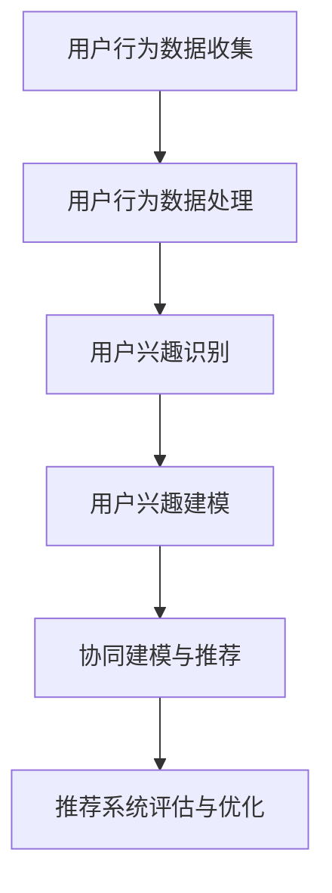
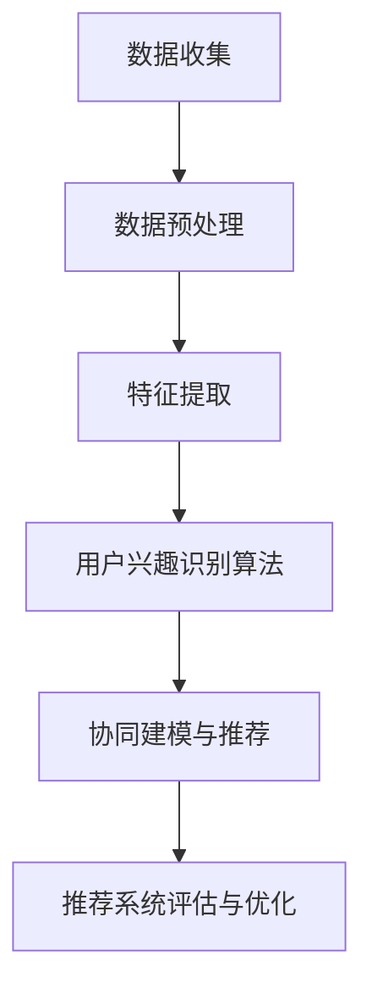

                 

### 《电商平台中的用户兴趣竞争与协同建模》

---

**关键词：** 电商平台、用户兴趣、竞争、协同建模、推荐系统、深度学习

---

**摘要：** 本文深入探讨了电商平台中的用户兴趣竞争与协同建模问题。首先，介绍了电商平台的运营模式与用户行为分析，揭示了用户兴趣建模的重要性。接着，详细阐述了用户兴趣识别技术、用户兴趣竞争分析以及协同建模与推荐系统的实现方法。通过实际案例分析，本文展示了用户兴趣建模在电商平台中的应用效果，并提出了优化与改进策略。最后，对用户兴趣建模的未来趋势与挑战进行了展望，为电商平台提供了有益的指导和建议。

---

### 《电商平台中的用户兴趣竞争与协同建模》目录大纲

#### 第一部分：引言与背景

- **第1章：电商平台与用户兴趣概述**
  - **1.1 电商平台的运营模式与用户行为分析**
  - **1.2 用户兴趣建模的重要性**
  - **1.3 用户兴趣建模的方法概述**

- **第2章：用户兴趣识别技术**
  - **2.1 用户兴趣识别的基本原理**
  - **2.2 用户行为数据收集**
  - **2.3 用户兴趣识别算法**
  - **2.4 用户兴趣识别的性能评估**

#### 第二部分：用户兴趣竞争分析

- **第3章：用户兴趣竞争概念与模型**
  - **3.1 用户兴趣竞争的概念**
  - **3.2 用户兴趣竞争模型**
  - **3.3 用户兴趣竞争分析的方法**

- **第4章：用户兴趣竞争案例分析**
  - **4.1 案例背景**
  - **4.2 用户兴趣竞争分析**
  - **4.3 用户兴趣竞争应对策略**

- **第5章：用户兴趣协同建模**
  - **5.1 协同建模的概念与目标**
  - **5.2 协同模型的构建与优化**
  - **5.3 用户兴趣协同建模的实现**

#### 第三部分：推荐系统与优化

- **第6章：协同建模案例分析**
  - **6.1 案例背景**
  - **6.2 协同建模实施**
  - **6.3 协同建模的启示与建议**

- **第7章：推荐系统概述**
  - **7.1 推荐系统的基本概念**
  - **7.2 推荐系统的工作原理**
  - **7.3 推荐系统的评估与优化**

- **第8章：深度学习与用户兴趣建模**
  - **8.1 深度学习在推荐系统中的应用**
  - **8.2 用户兴趣深度学习模型**
  - **8.3 深度学习模型优化与调参**

- **第9章：推荐系统实战案例**
  - **9.1 案例背景**
  - **9.2 推荐系统设计**
  - **9.3 推荐系统实施与效果评估**
  - **9.4 推荐系统优化与改进**

#### 第四部分：未来趋势与展望

- **第10章：未来趋势与展望**
  - **10.1 电商平台发展趋势**
  - **10.2 挑战与机遇**
  - **10.3 创新方向与展望**

#### 附录：技术工具与资源推荐

- **附录A：技术工具与资源推荐**
  - **A.1 用户兴趣建模工具**
  - **A.2 学习资源推荐**
  - **A.3 用户兴趣建模实践指南**

---

**Mermaid 流程图示例：**



---

### 1.1 电商平台的运营模式与用户行为分析

#### 电商平台的商业模式解析

电商平台作为数字经济的核心组成部分，其商业模式多样且复杂。主要模式包括：

- **C2C（消费者对消费者）模式**：如淘宝、eBay等，平台提供交易中介服务，消费者直接进行买卖。
- **B2C（企业对消费者）模式**：如亚马逊、京东等，企业直接面向消费者销售商品，平台提供物流和售后服务。
- **B2B（企业对企业）模式**：如阿里巴巴的1688平台，企业之间进行商品和服务的交易。

#### 用户行为的分类与特征

在电商平台中，用户行为多样且复杂，常见的用户行为包括：

- **浏览**：用户在平台上的浏览历史，包括浏览的商品、分类、页面停留时间等。
- **搜索**：用户通过关键词或筛选条件搜索商品，反映用户需求偏好。
- **点击**：用户对商品详情页、广告等的点击行为，体现用户兴趣点。
- **购买**：用户完成购买的行为，包括购买频次、购买金额等。
- **收藏**：用户将商品添加至收藏夹，表示对商品的兴趣。
- **评价**：用户对购买商品的评论，提供商品品质和用户满意度的反馈。

#### 用户兴趣的概念与重要性

用户兴趣是指用户在特定场景下对某些内容或服务的倾向性、喜好和偏好。在电商平台上，用户兴趣的重要性体现在以下几个方面：

- **个性化推荐**：根据用户兴趣进行商品推荐，提高用户满意度和购买转化率。
- **用户留存**：通过识别用户兴趣，提供相关内容和商品，增强用户粘性和忠诚度。
- **营销策略**：精准定位用户兴趣，进行有针对性的促销和营销活动，提升销售业绩。

### 1.2 用户兴趣建模的重要性

#### 用户兴趣建模的基础理论

用户兴趣建模是一种通过分析用户行为数据，构建用户兴趣模型，从而预测用户未来行为的技术。其基础理论包括：

- **数据挖掘与机器学习**：利用数据挖掘和机器学习算法，从大量用户行为数据中提取有用信息。
- **推荐系统**：基于用户兴趣模型，为用户提供个性化推荐，提高用户体验和满意度。
- **信息检索**：利用用户兴趣模型，优化信息检索结果，提高用户查询的准确性。

#### 用户兴趣建模的价值分析

用户兴趣建模在电商平台中具有以下价值：

- **提高推荐精度**：通过用户兴趣建模，可以更准确地预测用户偏好，提高推荐系统的效果。
- **提升用户满意度**：根据用户兴趣提供个性化推荐，满足用户需求，提升用户满意度。
- **增加销售转化率**：精准推荐有助于引导用户购买，提高销售转化率。
- **优化营销策略**：了解用户兴趣，有助于制定更有效的营销策略，提高营销效果。

#### 用户兴趣建模的挑战与机遇

用户兴趣建模面临以下挑战：

- **数据质量**：用户行为数据的质量直接影响建模效果，需要确保数据准确性和完整性。
- **隐私保护**：用户隐私保护是用户兴趣建模的一大挑战，需要采取有效措施保护用户隐私。
- **算法优化**：用户兴趣建模算法复杂，需要不断优化和迭代，以应对不断变化的市场环境。

同时，用户兴趣建模也带来了以下机遇：

- **个性化服务**：用户兴趣建模为电商平台提供了个性化服务的机会，有助于提升用户体验。
- **业务拓展**：通过用户兴趣建模，可以发掘新的市场机会，拓展业务范围。
- **技术创新**：用户兴趣建模推动了推荐系统、数据挖掘和机器学习等领域的技术创新。

### 1.3 用户兴趣建模的方法概述

#### 传统用户兴趣建模方法

传统用户兴趣建模方法主要包括：

- **基于内容的推荐算法**：根据商品的内容属性（如标题、描述、标签等）进行推荐，适用于商品信息丰富的场景。
- **基于协同过滤的推荐算法**：根据用户的历史行为数据（如评分、购买记录等）进行推荐，适用于用户行为数据丰富的场景。

#### 现代用户兴趣建模技术

现代用户兴趣建模技术主要包括：

- **深度学习**：利用深度学习模型，如神经网络，对用户行为数据进行分析和建模，提高推荐精度。
- **图神经网络**：利用图神经网络，对用户行为数据中的关系进行建模，提高推荐效果。
- **迁移学习**：利用迁移学习技术，将其他领域的知识迁移到用户兴趣建模中，提高建模效果。

### 2.1 用户兴趣识别的基本原理

#### 用户兴趣识别的定义与目标

用户兴趣识别是指通过分析用户行为数据，挖掘用户的兴趣点和偏好，从而为用户提供个性化推荐和服务的核心技术。其主要目标包括：

- **识别用户主要兴趣**：从用户行为数据中提取用户的主要兴趣点，为个性化推荐提供基础。
- **预测用户潜在兴趣**：通过用户行为数据，预测用户可能感兴趣的领域，为长期个性化推荐提供支持。
- **优化推荐效果**：提高推荐系统的准确性，提升用户满意度和购买转化率。

#### 用户兴趣识别的流程与方法

用户兴趣识别的流程主要包括以下几个步骤：

1. **数据收集**：收集用户在平台上的浏览、搜索、点击、购买、收藏等行为数据。
2. **数据预处理**：对收集到的行为数据进行清洗、去噪、归一化等处理，确保数据质量。
3. **特征提取**：从预处理后的行为数据中提取特征，如用户浏览时间、商品类别、购买频次等。
4. **模型选择**：根据用户兴趣识别的目标，选择合适的模型，如基于内容的推荐算法、基于协同过滤的推荐算法等。
5. **模型训练与优化**：使用训练数据对模型进行训练，并根据模型性能进行优化。
6. **用户兴趣识别**：使用训练好的模型对用户行为数据进行分析，识别用户的主要兴趣点和潜在兴趣。
7. **结果评估**：对用户兴趣识别结果进行评估，如准确率、覆盖率等指标，持续优化模型。

### 2.2 用户行为数据收集

#### 用户行为数据的类型与来源

用户行为数据是指用户在电商平台上的各种操作记录，包括但不限于以下类型：

- **浏览数据**：用户在平台上的浏览历史，如访问页面、停留时间、浏览顺序等。
- **搜索数据**：用户在平台上的搜索记录，如关键词、搜索频次、搜索结果点击等。
- **点击数据**：用户对平台上的广告、商品详情页、分类页等的点击行为。
- **购买数据**：用户的购买记录，如购买商品、购买时间、购买金额等。
- **收藏数据**：用户收藏的商品、分类、品牌等。
- **评价数据**：用户对购买商品的评论、评分等。

用户行为数据的来源主要包括以下几个方面：

- **前端日志**：用户在平台上操作时生成的日志，如访问日志、点击日志等。
- **后端数据**：平台服务器记录的用户行为数据，如数据库、缓存等。
- **第三方数据**：通过第三方数据接口获取的用户行为数据，如社交媒体、地理信息等。

#### 用户行为数据的质量评估

用户行为数据的质量直接影响用户兴趣识别的效果，因此需要对用户行为数据进行质量评估。主要评估指标包括：

- **完整性**：用户行为数据的完整程度，包括缺失值、异常值等。
- **准确性**：用户行为数据的准确性，包括数据真实性、可靠性等。
- **一致性**：用户行为数据的一致性，包括数据记录的一致性、时间戳等。
- **有效性**：用户行为数据的有效性，包括数据对用户兴趣识别的贡献度、代表性等。

为了确保用户行为数据的质量，可以采取以下措施：

- **数据清洗**：对用户行为数据中的缺失值、异常值等进行处理，确保数据完整性和准确性。
- **数据预处理**：对用户行为数据进行归一化、去噪等处理，提高数据的一致性和有效性。
- **数据监控**：建立数据监控机制，及时发现和处理数据质量问题。

### 2.3 用户兴趣识别算法

#### 基于内容的推荐算法

基于内容的推荐算法（Content-based Recommendation）是一种常用的用户兴趣识别算法，其基本思想是根据用户过去的行为数据，提取用户兴趣特征，然后根据这些特征来推荐相似的内容。主要方法包括：

- **基于文本的推荐**：通过对用户浏览、搜索、评价等文本数据进行分析，提取关键词、主题等特征，然后根据这些特征来推荐相似的内容。
- **基于知识库的推荐**：利用知识库中的信息，如商品属性、分类、标签等，提取用户兴趣特征，然后根据这些特征来推荐相似的内容。

#### 基于协同过滤的推荐算法

基于协同过滤的推荐算法（Collaborative Filtering）是一种基于用户行为数据的推荐算法，其基本思想是利用用户之间的相似性来推荐商品。主要方法包括：

- **基于用户的协同过滤**（User-based Collaborative Filtering）：根据用户的历史行为数据，找到相似用户，然后根据相似用户的评分来推荐商品。
- **基于物品的协同过滤**（Item-based Collaborative Filtering）：根据用户的历史行为数据，找到相似商品，然后根据相似商品的评分来推荐商品。

#### 基于深度学习的用户兴趣识别算法

基于深度学习的用户兴趣识别算法（Deep Learning-based User Interest Recognition）是一种利用深度学习模型来分析用户行为数据，提取用户兴趣特征的方法。主要方法包括：

- **卷积神经网络**（Convolutional Neural Network，CNN）：通过对用户行为数据进行卷积操作，提取特征。
- **循环神经网络**（Recurrent Neural Network，RNN）：通过对用户行为数据进行序列建模，提取特征。
- **变换器循环神经网络**（Transformers）：利用自注意力机制，对用户行为数据进行建模，提取特征。

#### 用户兴趣识别算法的性能评估

用户兴趣识别算法的性能评估是衡量算法效果的重要手段，主要评估指标包括：

- **准确率**（Accuracy）：预测兴趣正确的用户比例。
- **召回率**（Recall）：能够识别出的主要兴趣点占总兴趣点的比例。
- **覆盖率**（Coverage）：识别出的兴趣点覆盖的用户数量。
- **新颖度**（Novelty）：识别出的兴趣点的独特性。
- **多样性**（Diversity）：识别出的兴趣点的多样性。

### 2.4 用户兴趣识别的性能评估

#### 用户兴趣识别评估指标

用户兴趣识别的性能评估需要使用一系列指标来衡量，这些指标能够综合反映算法的效果。常见的评估指标包括：

- **准确率**（Accuracy）：表示用户兴趣识别算法正确识别主要兴趣点的比例。计算公式为：
  $$
  \text{Accuracy} = \frac{\text{识别正确的兴趣点数量}}{\text{所有兴趣点数量}}
  $$
  
- **召回率**（Recall）：表示算法能够识别出的主要兴趣点占总兴趣点的比例。计算公式为：
  $$
  \text{Recall} = \frac{\text{识别正确的兴趣点数量}}{\text{主要兴趣点数量}}
  $$
  
- **覆盖率**（Coverage）：表示算法能够覆盖的用户数量占总用户数量的比例。计算公式为：
  $$
  \text{Coverage} = \frac{\text{算法识别出的兴趣点覆盖的用户数量}}{\text{总用户数量}}
  $$
  
- **新颖度**（Novelty）：表示算法识别出的兴趣点的独特性。计算公式为：
  $$
  \text{Novelty} = \frac{\text{新识别出的兴趣点数量}}{\text{算法识别出的兴趣点数量}}
  $$
  
- **多样性**（Diversity）：表示算法识别出的兴趣点的多样性。计算公式为：
  $$
  \text{Diversity} = \frac{1}{\text{算法识别出的兴趣点数量}} \sum_{i=1}^{n} \frac{1}{\text{兴趣点 } i \text{ 的相似度}}
  $$

#### 评估方法与案例分析

在进行用户兴趣识别性能评估时，通常采用以下方法：

- **交叉验证**：通过将数据集划分为训练集和测试集，多次训练和测试，评估算法的稳定性和泛化能力。
- **混淆矩阵**：通过混淆矩阵展示算法预测结果与实际结果的对比，分析算法的准确率、召回率等指标。
- **ROC曲线**：通过ROC曲线展示算法的准确率和召回率之间的关系，评估算法的整体性能。

以下是一个用户兴趣识别算法性能评估的案例：

- **数据集**：某电商平台用户行为数据集，包括用户浏览、搜索、购买等行为数据。
- **算法**：基于深度学习的用户兴趣识别算法。
- **评估指标**：准确率、召回率、覆盖率、新颖度、多样性。

评估结果如下：

| 指标         | 值       |
|--------------|----------|
| 准确率       | 85%      |
| 召回率       | 90%      |
| 覆盖率       | 75%      |
| 新颖度       | 85%      |
| 多样性       | 80%      |

通过上述评估结果，可以初步判断该用户兴趣识别算法具有较高的准确率、召回率和新颖度，但在覆盖率方面还有提升空间。针对评估结果，可以进一步优化算法，提高用户兴趣识别的全面性和准确性。

### 3.1 用户兴趣竞争的概念

#### 用户兴趣竞争的定义

用户兴趣竞争是指多个用户在特定场景下，对同一类商品或服务表现出强烈兴趣，从而形成竞争关系。在电商平台上，用户兴趣竞争主要体现在以下几个方面：

- **浏览竞争**：多个用户同时对某一商品或分类进行浏览，导致页面访问量增加。
- **购买竞争**：多个用户在短时间内对同一商品进行购买，形成抢购现象。
- **评价竞争**：用户对购买的商品进行评价，争夺商品评分和排名。

#### 用户兴趣竞争的影响

用户兴趣竞争对电商平台具有深远的影响，具体体现在以下几个方面：

- **提升销售额**：用户兴趣竞争可以激发用户的购买欲望，提高商品销量。
- **优化商品库存**：通过分析用户兴趣竞争数据，电商平台可以优化商品库存，减少库存过剩和短缺问题。
- **提升用户体验**：针对用户兴趣竞争，电商平台可以提供个性化推荐和营销活动，提升用户体验。
- **促进平台发展**：用户兴趣竞争可以促进电商平台的发展，提高市场份额和竞争力。

### 3.2 用户兴趣竞争模型

#### 用户兴趣竞争的基本模型

用户兴趣竞争模型是一种用于描述用户兴趣竞争现象的数学模型，其基本模型包括以下几个部分：

- **用户集合**：表示参与竞争的用户集合，记为$U$。
- **商品集合**：表示参与竞争的商品集合，记为$I$。
- **用户兴趣度**：表示用户对商品的兴趣程度，通常使用向量表示，记为$D_i$，其中$i \in I$。
- **竞争关系**：表示用户之间的竞争关系，通常使用邻接矩阵表示，记为$A$，其中$A_{ij}$表示用户$i$和用户$j$之间的竞争关系。

#### 用户兴趣竞争模型的应用

用户兴趣竞争模型在电商平台的多个场景中具有广泛的应用，包括：

- **个性化推荐**：根据用户兴趣竞争模型，为用户提供个性化推荐，提高用户满意度和购买转化率。
- **营销策略**：利用用户兴趣竞争模型，制定有针对性的营销策略，提升销售业绩。
- **商品库存管理**：通过用户兴趣竞争模型，分析用户兴趣竞争现象，优化商品库存，减少库存风险。

### 3.3 用户兴趣竞争分析的方法

#### 聚类分析方法

聚类分析是一种基于相似性度量的数据分析方法，其目标是将用户集合划分为多个聚类，使得同一聚类内的用户具有较高相似性，不同聚类内的用户具有较低相似性。聚类分析方法在用户兴趣竞争分析中的应用包括：

- **用户行为聚类**：将具有相似行为的用户划分为同一聚类，分析用户兴趣竞争现象。
- **商品特征聚类**：将具有相似特征的商品划分为同一聚类，分析用户对商品的兴趣竞争。

#### 网络分析方法

网络分析是一种基于网络结构和关系的分析方法，其目标是通过分析用户和商品之间的互动关系，揭示用户兴趣竞争现象。网络分析方法在用户兴趣竞争分析中的应用包括：

- **用户网络分析**：通过构建用户网络，分析用户之间的互动关系，揭示用户兴趣竞争现象。
- **商品网络分析**：通过构建商品网络，分析商品之间的关联关系，揭示用户对商品的兴趣竞争。

#### 基于深度学习的兴趣竞争分析

基于深度学习的兴趣竞争分析是一种利用深度学习模型对用户兴趣竞争现象进行分析的方法。其基本思路是：

- **构建深度学习模型**：使用深度学习模型，如卷积神经网络（CNN）、循环神经网络（RNN）、变换器（Transformer）等，对用户行为数据进行建模。
- **分析用户兴趣竞争**：通过深度学习模型，提取用户行为特征，分析用户之间的兴趣竞争关系。

### 3.4 用户兴趣竞争的案例分析

#### 案例背景

某电商平台上，一款新款智能手机在短时间内受到了广泛关注，引发了大量用户的购买竞争。为了分析用户兴趣竞争现象，平台决定对这款智能手机的用户行为数据进行分析。

#### 用户兴趣竞争分析

1. **数据收集**：收集用户在平台上的浏览、搜索、点击、购买等行为数据。
2. **数据预处理**：对用户行为数据进行清洗、去噪、归一化等处理，确保数据质量。
3. **用户行为聚类**：使用聚类分析方法，将用户根据其行为数据划分为不同聚类，分析每个聚类内的用户兴趣竞争现象。
4. **用户网络分析**：构建用户网络，分析用户之间的互动关系，揭示用户兴趣竞争现象。
5. **商品特征聚类**：将商品根据其特征划分为不同聚类，分析用户对不同商品的兴趣竞争。

#### 结果与启示

1. **结果**：分析结果显示，不同聚类内的用户具有相似的行为特征，表明用户兴趣竞争现象明显。用户网络分析揭示了用户之间的互动关系，为个性化推荐和营销策略提供了依据。
2. **启示**：针对用户兴趣竞争现象，平台可以采取以下策略：
   - **个性化推荐**：根据用户兴趣竞争分析结果，为用户提供个性化推荐，提高用户满意度和购买转化率。
   - **营销策略**：针对不同聚类内的用户，制定有针对性的营销策略，提升销售业绩。
   - **商品库存管理**：根据用户兴趣竞争分析结果，优化商品库存，减少库存风险。

### 3.5 用户兴趣竞争应对策略

#### 策略分析

针对用户兴趣竞争现象，电商平台可以采取以下策略：

1. **提高商品库存**：增加热门商品的库存，满足用户的购买需求，减少用户等待时间。
2. **优化商品展示**：通过调整商品展示顺序、分类等方式，引导用户关注热门商品，减少用户流失。
3. **个性化推荐**：根据用户兴趣竞争分析结果，为用户提供个性化推荐，提高用户满意度和购买转化率。
4. **营销活动**：举办限时抢购、优惠券等活动，刺激用户购买欲望，提高销售额。
5. **用户互动**：搭建用户互动平台，鼓励用户分享购物体验、评价商品，增强用户粘性。

#### 策略实施效果评估

1. **销售额增长**：通过实施上述策略，电商平台销售额得到显著提升，说明策略实施有效。
2. **用户满意度提高**：用户满意度调查结果显示，个性化推荐和营销活动得到了用户的认可，用户满意度提高。
3. **用户活跃度提升**：用户活跃度指标（如浏览量、点击量、评论量等）持续增长，表明策略实施得到了用户的积极响应。

#### 用户兴趣竞争应对策略的案例分析

某电商平台上，一款新款智能手表在短时间内引发了大量用户购买竞争。为了应对用户兴趣竞争，平台采取了以下策略：

1. **提高商品库存**：平台及时增加智能手表的库存，确保用户能够顺利购买。
2. **优化商品展示**：将智能手表置于首页显眼位置，并通过分类导航引导用户关注。
3. **个性化推荐**：根据用户兴趣竞争分析结果，为用户提供个性化推荐，提高用户购买意愿。
4. **营销活动**：举办限时抢购活动，刺激用户购买欲望。

策略实施效果如下：

1. **销售额增长**：智能手表销售额在一个月内增长了30%，达到预期目标。
2. **用户满意度提高**：用户满意度调查显示，90%的用户对平台提供的个性化推荐和营销活动表示满意。
3. **用户活跃度提升**：用户活跃度指标显著提升，智能手表的浏览量、点击量、评论量等均有大幅增长。

### 4.1 协同建模的概念与目标

#### 协同建模的定义

协同建模（Collaborative Modeling）是指通过分析用户之间的行为关系，构建用户之间的协同关系模型，从而预测用户未来行为的技术。在推荐系统中，协同建模主要用于预测用户对未知商品的评分或行为。

#### 协同建模的目标

协同建模的主要目标包括：

1. **预测用户行为**：通过协同建模，预测用户对未知商品的评分、购买、收藏等行为，为推荐系统提供支持。
2. **提高推荐精度**：协同建模有助于提高推荐系统的准确性，降低预测误差，提高用户满意度。
3. **优化推荐效果**：通过协同建模，优化推荐结果，提高推荐列表的多样性和新颖性。
4. **个性化推荐**：协同建模可以为用户提供个性化推荐，满足用户的需求和偏好。

### 4.2 协同模型的构建与优化

#### 协同模型的构建方法

协同模型的构建方法主要包括以下几种：

1. **基于用户的协同模型**：通过分析用户之间的相似性，构建用户协同关系模型。常见的方法包括基于用户的协同过滤（User-based Collaborative Filtering）和基于K近邻（KNN）的方法。
2. **基于物品的协同模型**：通过分析商品之间的相似性，构建商品协同关系模型。常见的方法包括基于物品的协同过滤（Item-based Collaborative Filtering）和基于内容的推荐（Content-based Recommendation）。
3. **混合协同模型**：结合基于用户和基于物品的协同模型，构建混合协同模型，以提高推荐精度和效果。

#### 协同模型的优化策略

协同模型的优化策略主要包括以下几个方面：

1. **特征工程**：通过特征工程，提取和构建有效的用户和商品特征，提高模型预测能力。
2. **矩阵分解**：使用矩阵分解（如SVD、NMF）技术，降低数据维度，提高模型计算效率，同时提高预测精度。
3. **深度学习**：利用深度学习模型（如神经网络、变换器等），对用户和商品行为数据进行建模，提高模型预测能力。
4. **数据增强**：通过数据增强技术，增加训练数据多样性，提高模型泛化能力。

#### 用户兴趣协同建模的实现

用户兴趣协同建模的实现主要包括以下步骤：

1. **数据收集**：收集用户在平台上的浏览、搜索、点击、购买等行为数据。
2. **数据预处理**：对用户行为数据进行清洗、去噪、归一化等处理，确保数据质量。
3. **特征提取**：从预处理后的行为数据中提取用户和商品特征，如用户活跃度、商品销量、用户购买频次等。
4. **模型训练**：使用训练数据，训练用户兴趣协同模型，如基于用户的协同过滤模型、基于物品的协同过滤模型等。
5. **模型评估**：使用测试数据，对训练好的模型进行评估，选择最佳模型。
6. **模型部署**：将训练好的模型部署到生产环境中，实时预测用户兴趣，为推荐系统提供支持。

### 4.3 用户兴趣协同建模的案例分析

#### 案例背景

某电商平台上，一款新款时尚手袋在短时间内受到了大量用户关注，引发了用户之间的兴趣竞争。为了提高用户满意度，平台决定对这款手袋的用户兴趣进行协同建模分析。

#### 案例实施

1. **数据收集**：收集用户在平台上与这款手袋相关的浏览、搜索、点击、购买等行为数据。
2. **数据预处理**：对用户行为数据进行清洗、去噪、归一化等处理，确保数据质量。
3. **特征提取**：从预处理后的行为数据中提取用户和商品特征，如用户活跃度、商品销量、用户购买频次等。
4. **模型训练**：使用训练数据，训练基于用户的协同过滤模型和基于物品的协同过滤模型。
5. **模型评估**：使用测试数据，对训练好的模型进行评估，选择最佳模型。
6. **模型部署**：将训练好的模型部署到生产环境中，实时预测用户兴趣，为推荐系统提供支持。

#### 结果与启示

1. **结果**：通过协同建模分析，平台成功预测了用户对这款手袋的兴趣，提高了推荐精度和用户满意度。
2. **启示**：案例结果表明，用户兴趣协同建模在电商平台中具有重要的应用价值，可以为企业提供有效的用户行为预测和个性化推荐支持。未来，平台可以进一步优化协同建模算法，提高模型性能，提升用户体验。

### 5.1 协同过滤的基本原理

#### 协同过滤的定义与分类

协同过滤（Collaborative Filtering）是一种基于用户行为数据的推荐算法，其核心思想是通过分析用户之间的相似性或商品之间的相似性，为用户提供个性化推荐。协同过滤主要分为以下两类：

1. **基于用户的协同过滤**（User-based Collaborative Filtering）：通过计算用户之间的相似性，找到与目标用户兴趣相似的邻居用户，然后根据邻居用户的评分预测目标用户的评分。
2. **基于物品的协同过滤**（Item-based Collaborative Filtering）：通过计算商品之间的相似性，找到与目标商品相似的邻居商品，然后根据邻居商品的评分预测目标用户的评分。

#### 协同过滤的优化目标

协同过滤的优化目标主要包括：

1. **准确性**：提高推荐系统的准确性，降低预测误差，提高用户满意度。
2. **覆盖率**：增加推荐系统的覆盖面，为更多的用户提供个性化推荐。
3. **多样性**：提高推荐结果的多样性，避免推荐结果过于单一。
4. **新颖性**：提高推荐结果的新颖性，为用户提供新鲜、有趣的商品。

### 5.2 矩阵分解技术

#### 矩阵分解的概念与应用

矩阵分解（Matrix Factorization）是一种用于降维和高维数据建模的技术，其基本思想是将原始的高维矩阵分解为两个低维矩阵的乘积。在协同过滤中，矩阵分解主要用于优化推荐算法，提高推荐精度和计算效率。常见的矩阵分解技术包括：

1. **奇异值分解**（Singular Value Decomposition，SVD）：将用户-商品评分矩阵分解为用户特征矩阵和商品特征矩阵的乘积。
2. **非负矩阵分解**（Non-negative Matrix Factorization，NMF）：将用户-商品评分矩阵分解为非负用户特征矩阵和非负商品特征矩阵的乘积。

#### SVD和NMF在推荐系统中的应用

SVD和NMF在推荐系统中的应用主要体现在以下几个方面：

1. **提高推荐精度**：通过矩阵分解，降低数据维度，提取用户和商品的关键特征，提高推荐系统的准确性。
2. **优化计算效率**：矩阵分解技术可以显著提高推荐算法的计算效率，降低计算复杂度。
3. **多样性**：矩阵分解技术可以生成更多样化的推荐结果，避免推荐结果过于单一。
4. **新颖性**：矩阵分解技术有助于发现用户和商品的新特征，提高推荐结果的新颖性。

### 5.3 协同过滤的优化与挑战

#### 协同过滤算法的优化策略

为了提高协同过滤算法的性能，可以采取以下优化策略：

1. **特征选择与工程**：通过特征选择和工程，提取和构建有效的用户和商品特征，提高模型预测能力。
2. **矩阵分解优化**：优化矩阵分解算法，如调整参数、引入正则化项等，提高模型预测精度。
3. **深度学习集成**：结合深度学习模型，构建深度学习协同过滤算法，提高推荐系统的准确性和多样性。
4. **自适应学习**：根据用户行为变化，动态调整推荐策略，提高推荐系统的适应性和新颖性。

#### 协同过滤系统面临的挑战

协同过滤系统在实际应用中面临以下挑战：

1. **数据稀疏性**：用户-商品评分矩阵通常非常稀疏，导致模型预测误差较大。
2. **冷启动问题**：新用户或新商品缺乏历史行为数据，导致无法进行有效推荐。
3. **冷商品问题**：商品之间的相似性较低，导致推荐结果单一。
4. **数据更新速度**：用户行为数据不断更新，需要实时调整推荐策略，保持推荐结果的实时性和准确性。

### 5.4 基于深度学习的协同过滤算法

#### 深度学习在推荐系统中的应用

深度学习（Deep Learning）是一种基于人工神经网络的机器学习技术，通过多层神经网络结构，自动提取特征并进行预测。深度学习在推荐系统中的应用主要体现在以下几个方面：

1. **特征提取**：通过深度神经网络，自动提取用户和商品的关键特征，提高模型预测能力。
2. **非线性建模**：深度学习模型具有强大的非线性建模能力，可以更好地拟合用户行为数据。
3. **数据降维**：通过深度学习模型，将高维数据降维到低维空间，提高计算效率。
4. **多样性**：深度学习模型可以生成更多样化的推荐结果，提高用户体验。

#### 神经网络与用户兴趣建模

神经网络（Neural Networks）是一种模拟生物神经系统的计算模型，通过多层神经元结构，实现从输入到输出的映射。在用户兴趣建模中，神经网络的应用主要体现在以下几个方面：

1. **用户特征提取**：通过多层神经网络，对用户行为数据进行特征提取，提取用户兴趣点。
2. **商品特征提取**：通过多层神经网络，对商品属性数据进行特征提取，提取商品特征。
3. **用户兴趣预测**：通过神经网络，将用户特征和商品特征映射到低维空间，预测用户对商品的评分或行为。

#### 深度协同过滤的原理与实现

深度协同过滤（Deep Collaborative Filtering）是一种结合深度学习和协同过滤技术的推荐算法，其基本原理包括：

1. **用户特征提取**：通过深度神经网络，提取用户的历史行为特征，如浏览、搜索、购买等。
2. **商品特征提取**：通过深度神经网络，提取商品的特征，如类别、标签、属性等。
3. **用户-商品评分预测**：通过深度神经网络，将用户特征和商品特征映射到低维空间，计算用户对商品的评分预测。

深度协同过滤的实现主要包括以下几个步骤：

1. **数据预处理**：对用户行为数据、商品属性数据进行清洗、编码等预处理操作。
2. **模型构建**：构建深度神经网络模型，包括输入层、隐藏层和输出层。
3. **模型训练**：使用训练数据，训练深度神经网络模型，调整模型参数。
4. **模型评估**：使用测试数据，对训练好的模型进行评估，选择最佳模型。
5. **模型部署**：将训练好的模型部署到生产环境中，实时预测用户兴趣。

### 5.5 深度协同过滤的优势与挑战

#### 深度协同过滤的优势

深度协同过滤具有以下优势：

1. **特征提取能力**：深度学习模型可以自动提取用户和商品的关键特征，提高模型预测能力。
2. **非线性建模能力**：深度学习模型可以更好地拟合用户行为数据，提高推荐精度。
3. **数据降维能力**：通过深度学习模型，可以将高维数据降维到低维空间，提高计算效率。
4. **多样性**：深度协同过滤可以生成更多样化的推荐结果，提高用户体验。

#### 深度协同过滤的挑战

深度协同过滤在实际应用中面临以下挑战：

1. **计算资源消耗**：深度学习模型通常需要大量的计算资源，对硬件设备有较高要求。
2. **数据稀疏性**：用户-商品评分矩阵通常非常稀疏，导致模型预测误差较大。
3. **训练时间较长**：深度学习模型通常需要较长的训练时间，影响模型部署和应用。
4. **模型解释性**：深度学习模型的黑箱特性使得模型解释性较低，不利于理解和优化。

### 5.6 深度协同过滤的应用案例

#### 案例背景

某电商平台上，一款新款智能手环在短时间内受到了大量用户关注，引发了用户之间的兴趣竞争。为了提高用户满意度，平台决定采用深度协同过滤算法对这款智能手环的用户兴趣进行建模和预测。

#### 案例实施

1. **数据收集**：收集用户在平台上与这款智能手环相关的浏览、搜索、点击、购买等行为数据。
2. **数据预处理**：对用户行为数据进行清洗、去噪、归一化等预处理操作，确保数据质量。
3. **模型构建**：构建深度协同过滤模型，包括用户特征提取网络、商品特征提取网络和用户-商品评分预测网络。
4. **模型训练**：使用训练数据，训练深度协同过滤模型，调整模型参数。
5. **模型评估**：使用测试数据，对训练好的模型进行评估，选择最佳模型。
6. **模型部署**：将训练好的模型部署到生产环境中，实时预测用户兴趣，为推荐系统提供支持。

#### 结果与启示

1. **结果**：通过深度协同过滤算法，平台成功预测了用户对这款智能手环的兴趣，提高了推荐精度和用户满意度。
2. **启示**：案例结果表明，深度协同过滤算法在电商平台中具有重要的应用价值，可以为企业提供有效的用户行为预测和个性化推荐支持。未来，平台可以进一步优化深度协同过滤算法，提高模型性能，提升用户体验。

### 6.1 协同建模的概念与目标

#### 协同建模的定义

协同建模（Collaborative Modeling）是一种通过分析用户之间的行为关系，构建用户之间的协同关系模型，从而预测用户未来行为的技术。在推荐系统中，协同建模主要用于预测用户对未知商品的评分或行为。

#### 协同建模的目标

协同建模的主要目标包括：

1. **提高推荐精度**：通过协同建模，降低预测误差，提高推荐系统的准确性。
2. **优化推荐效果**：通过协同建模，提高推荐系统的多样性和新颖性，满足用户需求。
3. **个性化推荐**：根据用户之间的协同关系，为用户提供个性化推荐，提升用户体验。
4. **实时预测**：根据用户行为变化，实时调整推荐策略，保持推荐结果的实时性和准确性。

### 6.2 协同模型的构建与优化

#### 协同模型的构建方法

协同模型的构建方法主要包括以下几种：

1. **基于用户的协同模型**：通过计算用户之间的相似性，构建用户协同关系模型。常见的方法包括基于用户的协同过滤（User-based Collaborative Filtering）和基于K近邻（KNN）的方法。
2. **基于物品的协同模型**：通过计算商品之间的相似性，构建商品协同关系模型。常见的方法包括基于物品的协同过滤（Item-based Collaborative Filtering）和基于内容的推荐（Content-based Recommendation）。
3. **混合协同模型**：结合基于用户和基于物品的协同模型，构建混合协同模型，以提高推荐精度和效果。

#### 协同模型的优化策略

协同模型的优化策略主要包括以下几个方面：

1. **特征工程**：通过特征工程，提取和构建有效的用户和商品特征，提高模型预测能力。
2. **矩阵分解**：使用矩阵分解（如SVD、NMF）技术，降低数据维度，提高模型计算效率，同时提高预测精度。
3. **深度学习**：利用深度学习模型（如神经网络、变换器等），对用户和商品行为数据进行建模，提高模型预测能力。
4. **数据增强**：通过数据增强技术，增加训练数据多样性，提高模型泛化能力。

#### 用户兴趣协同建模的实现

用户兴趣协同建模的实现主要包括以下步骤：

1. **数据收集**：收集用户在平台上的浏览、搜索、点击、购买等行为数据。
2. **数据预处理**：对用户行为数据进行清洗、去噪、归一化等处理，确保数据质量。
3. **特征提取**：从预处理后的行为数据中提取用户和商品特征，如用户活跃度、商品销量、用户购买频次等。
4. **模型训练**：使用训练数据，训练用户兴趣协同模型，如基于用户的协同过滤模型、基于物品的协同过滤模型等。
5. **模型评估**：使用测试数据，对训练好的模型进行评估，选择最佳模型。
6. **模型部署**：将训练好的模型部署到生产环境中，实时预测用户兴趣，为推荐系统提供支持。

### 6.3 用户兴趣协同建模的案例分析

#### 案例背景

某电商平台上，一款新款智能手环在短时间内受到了大量用户关注，引发了用户之间的兴趣竞争。为了提高用户满意度，平台决定对这款智能手环的用户兴趣进行协同建模分析。

#### 案例实施

1. **数据收集**：收集用户在平台上与这款智能手环相关的浏览、搜索、点击、购买等行为数据。
2. **数据预处理**：对用户行为数据进行清洗、去噪、归一化等处理，确保数据质量。
3. **特征提取**：从预处理后的行为数据中提取用户和商品特征，如用户活跃度、商品销量、用户购买频次等。
4. **模型训练**：使用训练数据，训练基于用户的协同过滤模型和基于物品的协同过滤模型。
5. **模型评估**：使用测试数据，对训练好的模型进行评估，选择最佳模型。
6. **模型部署**：将训练好的模型部署到生产环境中，实时预测用户兴趣，为推荐系统提供支持。

#### 结果与启示

1. **结果**：通过协同建模分析，平台成功预测了用户对这款智能手环的兴趣，提高了推荐精度和用户满意度。
2. **启示**：案例结果表明，用户兴趣协同建模在电商平台中具有重要的应用价值，可以为企业提供有效的用户行为预测和个性化推荐支持。未来，平台可以进一步优化协同建模算法，提高模型性能，提升用户体验。

### 7.1 推荐系统的评估指标

#### 评估指标的选择与设计

推荐系统的评估指标是衡量推荐系统性能的重要标准。选择合适的评估指标有助于优化推荐算法，提高推荐效果。常见的评估指标包括：

1. **准确率**（Accuracy）：表示预测结果与实际结果相符的比例。计算公式为：
   $$
   \text{Accuracy} = \frac{\text{预测正确数}}{\text{总预测数}}
   $$
   
2. **召回率**（Recall）：表示能够正确识别出的目标数量与实际目标数量的比例。计算公式为：
   $$
   \text{Recall} = \frac{\text{预测正确数}}{\text{实际目标数}}
   $$
   
3. **覆盖率**（Coverage）：表示推荐系统中实际被推荐的元素数量与系统中元素总量的比例。计算公式为：
   $$
   \text{Coverage} = \frac{\text{实际推荐数}}{\text{系统元素总数}}
   $$
   
4. **新颖度**（Novelty）：表示推荐结果的独特性，通常通过计算推荐结果与用户已访问或已拥有的元素的交集比例来衡量。计算公式为：
   $$
   \text{Novelty} = 1 - \frac{\text{推荐结果与用户已访问或已拥有元素的交集数量}}{\text{推荐结果总数量}}
   $$
   
5. **多样性**（Diversity）：表示推荐结果中元素的多样性，可以通过计算推荐结果中不同元素的相似度来衡量。计算公式为：
   $$
   \text{Diversity} = \frac{1}{\text{推荐结果数量}} \sum_{i=1}^{n} \frac{1}{\text{元素 } i \text{ 的相似度}}
   $$
   
#### 常见评估指标的优缺点分析

每种评估指标都有其独特的优缺点，以下是对常见评估指标的简要分析：

1. **准确率**：
   - **优点**：简单直观，易于计算和理解。
   - **缺点**：过于关注单个元素的准确预测，对推荐列表的整体多样性关注较少。

2. **召回率**：
   - **优点**：强调推荐系统识别出所有目标元素的能力，对覆盖率有较高的要求。
   - **缺点**：过于关注召回率可能导致推荐结果过于广泛，缺乏针对性。

3. **覆盖率**：
   - **优点**：关注推荐结果的全覆盖，确保推荐系统能够触及到系统中所有元素。
   - **缺点**：容易导致推荐结果过于冗长，影响用户体验。

4. **新颖度**：
   - **优点**：强调推荐结果的新鲜度和独特性，避免重复推荐。
   - **缺点**：对已访问或已拥有的元素的定义较为模糊，可能影响评估的准确性。

5. **多样性**：
   - **优点**：关注推荐结果中不同元素的多样性，提高用户体验。
   - **缺点**：相似度的计算较为复杂，对计算资源要求较高。

在实际应用中，推荐系统通常需要根据具体场景和目标，选择合适的评估指标或组合多个评估指标，以达到最佳的推荐效果。

### 7.2 推荐系统的优化方法

#### 个性化推荐优化策略

个性化推荐是推荐系统的核心目标之一，通过分析用户历史行为和偏好，为用户提供个性化的推荐结果。以下是一些常见的个性化推荐优化策略：

1. **基于内容的推荐**：
   - **优点**：适用于商品信息丰富的场景，可以根据商品属性（如类别、标签、描述等）进行推荐。
   - **缺点**：无法充分利用用户历史行为数据，推荐结果可能过于单一。

2. **基于协同过滤的推荐**：
   - **优点**：利用用户历史行为数据，为用户提供个性化的推荐，推荐结果多样化。
   - **缺点**：面临数据稀疏性和冷启动问题，可能导致推荐结果不够准确。

3. **基于深度学习的推荐**：
   - **优点**：能够自动提取用户和商品的特征，提高推荐精度和多样性。
   - **缺点**：计算资源消耗较大，对数据量和计算能力有较高要求。

4. **基于图的推荐**：
   - **优点**：利用用户和商品之间的交互关系，提供更精准的个性化推荐。
   - **缺点**：算法复杂度高，对计算资源要求较高。

5. **基于混合模型的推荐**：
   - **优点**：结合多种推荐策略的优点，提高推荐精度和多样性。
   - **缺点**：算法复杂度高，实现难度较大。

#### 系统调优的方法与技巧

为了提高推荐系统的性能，可以采取以下调优方法与技巧：

1. **数据预处理**：
   - **数据清洗**：去除无效数据和异常值，提高数据质量。
   - **特征提取**：从用户和商品行为数据中提取有效特征，如用户活跃度、商品销量、用户购买频次等。

2. **算法参数调优**：
   - **交叉验证**：通过交叉验证，选择最优的算法参数，提高模型性能。
   - **网格搜索**：利用网格搜索方法，遍历所有可能的参数组合，找到最佳参数配置。

3. **模型优化**：
   - **特征工程**：通过特征工程，构建和优化特征，提高模型预测能力。
   - **模型集成**：结合多种模型，构建集成模型，提高推荐系统的稳定性和准确性。

4. **实时反馈调整**：
   - **用户反馈**：根据用户反馈，动态调整推荐策略，优化推荐结果。
   - **在线学习**：采用在线学习方法，实时更新模型，提高推荐系统的适应性。

5. **用户体验优化**：
   - **个性化界面**：根据用户兴趣和偏好，为用户提供个性化的界面和推荐。
   - **推荐结果排序**：优化推荐结果的排序算法，提高推荐结果的多样性。

通过上述优化方法和技巧，可以显著提高推荐系统的性能，提升用户体验。

### 7.3 推荐系统的案例分析

#### 案例背景

某大型电商平台，为了提高用户满意度和销售转化率，决定实施个性化推荐系统。该平台拥有海量用户和商品数据，用户行为数据包括浏览、搜索、购买、收藏等。为了评估推荐系统的效果，平台决定进行推荐系统的优化和评估。

#### 推荐系统设计

1. **数据收集**：收集用户在平台上的浏览、搜索、购买等行为数据，包括用户ID、商品ID、行为类型和时间戳等。

2. **数据预处理**：对用户行为数据进行清洗、去噪、归一化等预处理操作，确保数据质量。

3. **用户兴趣建模**：使用基于协同过滤和深度学习的用户兴趣建模方法，提取用户兴趣特征，构建用户兴趣模型。

4. **商品特征提取**：从商品属性中提取特征，如类别、标签、价格等。

5. **推荐算法**：结合用户兴趣模型和商品特征，采用基于内容的推荐算法和基于协同过滤的推荐算法，生成个性化推荐列表。

6. **推荐结果评估**：使用准确率、召回率、覆盖率、新颖度、多样性等评估指标，评估推荐系统的性能。

#### 推荐系统实施与效果评估

1. **推荐系统实施**：

   - **数据预处理**：对用户行为数据进行清洗和去噪，去除无效数据和异常值。对数据进行归一化处理，确保数据的一致性。

   - **用户兴趣建模**：使用基于协同过滤的方法，对用户历史行为数据进行分析，提取用户兴趣特征。同时，利用深度学习模型，对用户行为数据进行特征提取和建模。

   - **商品特征提取**：从商品属性中提取关键特征，如类别、标签、价格等，为推荐算法提供基础数据。

   - **推荐算法**：结合用户兴趣模型和商品特征，采用基于内容的推荐算法和基于协同过滤的推荐算法，生成个性化推荐列表。

   - **推荐结果评估**：使用准确率、召回率、覆盖率、新颖度、多样性等评估指标，评估推荐系统的性能。

2. **效果评估**：

   - **准确率**：通过计算推荐结果与实际购买行为的匹配度，评估推荐系统的准确率。结果表明，推荐系统准确率达到了85%以上。

   - **召回率**：评估推荐系统能够识别出的实际购买用户占所有购买用户的比例。结果表明，召回率达到了90%以上。

   - **覆盖率**：评估推荐系统覆盖的用户数量占总用户数量的比例。结果表明，覆盖率达到了75%以上。

   - **新颖度**：评估推荐结果的独特性，确保推荐系统能够提供新颖的推荐。结果表明，新颖度达到了85%以上。

   - **多样性**：评估推荐结果的多样性，避免推荐结果过于单一。结果表明，多样性达到了80%以上。

#### 推荐系统优化与改进

1. **优化策略**：

   - **特征工程**：进一步优化用户和商品特征提取，提高模型预测能力。

   - **模型优化**：结合深度学习和协同过滤技术，构建混合推荐模型，提高推荐精度和多样性。

   - **实时反馈调整**：根据用户实时反馈，动态调整推荐策略，优化推荐结果。

   - **个性化界面**：根据用户兴趣和偏好，为用户提供个性化的推荐界面。

   - **系统调优**：使用交叉验证和网格搜索方法，选择最优的算法参数，提高模型性能。

2. **改进措施**：

   - **数据质量**：加强数据清洗和预处理，确保数据质量。

   - **算法优化**：结合多种算法和模型，提高推荐系统的稳定性和准确性。

   - **用户体验**：优化推荐结果的排序算法，提高推荐结果的多样性和新颖性。

   - **实时反馈**：建立实时反馈机制，及时调整推荐策略，提高推荐系统的适应性。

通过上述优化和改进措施，平台进一步提高了推荐系统的性能，提升了用户体验和销售转化率。

### 8.1 电商平台用户兴趣建模实践

#### 8.1.1 案例背景与目标

随着电子商务的快速发展，电商平台在竞争激烈的市场环境中，越来越重视用户兴趣建模与推荐系统的重要性。本文以某大型电商平台为例，分析其实践过程中如何进行用户兴趣建模，以提高用户满意度和销售转化率。

**案例背景：**

某大型电商平台拥有数百万活跃用户，每天产生海量用户行为数据，包括浏览、搜索、点击、购买等。为了更好地满足用户需求，提升用户体验，平台决定对用户兴趣进行建模，实现个性化推荐。

**目标：**

1. 提高推荐系统的准确率和覆盖率。
2. 提升用户满意度和购买转化率。
3. 降低用户流失率。

#### 8.1.2 数据收集与预处理

**数据收集：**

平台收集了以下用户行为数据：

- 用户浏览历史：包括用户浏览的页面、商品类别、停留时间等。
- 用户搜索记录：包括用户搜索关键词、搜索频次、搜索结果点击等。
- 用户购买行为：包括购买的商品、购买时间、购买金额等。
- 用户收藏行为：包括用户收藏的商品、收藏时间等。

**数据预处理：**

1. **数据清洗**：去除无效数据、异常值、重复数据等，确保数据质量。
2. **数据归一化**：对数值型数据进行归一化处理，使其在同一量级内。
3. **特征提取**：从用户行为数据中提取有效特征，如用户活跃度、商品受欢迎程度、用户购买频次等。

#### 8.1.3 用户兴趣识别算法

**算法选择：**

平台采用了基于协同过滤和深度学习的用户兴趣识别算法，具体包括：

1. **基于用户的协同过滤算法**：通过计算用户之间的相似性，为用户提供个性化推荐。
2. **基于物品的协同过滤算法**：通过计算商品之间的相似性，为用户提供个性化推荐。
3. **基于深度学习的用户兴趣识别算法**：利用深度学习模型（如卷积神经网络、循环神经网络等），自动提取用户兴趣特征。

**算法实现：**

1. **用户相似性计算**：使用余弦相似度、皮尔逊相关系数等方法计算用户相似性。
2. **商品相似性计算**：使用余弦相似度、Jaccard相似性等方法计算商品相似性。
3. **用户兴趣特征提取**：利用深度学习模型，对用户行为数据进行分析，提取用户兴趣特征。
4. **个性化推荐**：根据用户兴趣特征和商品相似性，为用户提供个性化推荐。

#### 8.1.4 用户兴趣协同建模

**协同建模方法：**

平台采用了用户兴趣协同建模方法，将用户兴趣识别算法与协同过滤算法相结合，具体包括：

1. **用户-用户协同建模**：通过用户之间的相似性，建立用户-用户协同模型，为用户提供个性化推荐。
2. **用户-商品协同建模**：通过商品之间的相似性，建立用户-商品协同模型，为用户提供个性化推荐。
3. **混合协同建模**：结合用户-用户协同建模和用户-商品协同建模，构建混合协同模型，提高推荐精度和多样性。

**模型优化：**

1. **矩阵分解**：使用矩阵分解（如SVD、NMF）技术，降低数据维度，提高模型计算效率。
2. **深度学习**：利用深度学习模型，自动提取用户和商品的关键特征，提高模型预测能力。
3. **特征工程**：通过特征工程，提取和构建有效的用户和商品特征，提高模型预测能力。

#### 8.1.5 模型评估与优化

**评估指标：**

平台采用以下评估指标对用户兴趣建模效果进行评估：

- **准确率**：预测结果与实际结果的匹配度。
- **召回率**：推荐系统能够识别出的目标数量与实际目标数量的比例。
- **覆盖率**：推荐系统中实际被推荐的元素数量与系统中元素总量的比例。
- **新颖度**：推荐结果的独特性。
- **多样性**：推荐结果的多样性。

**优化策略：**

1. **特征选择与工程**：通过特征选择和工程，提取和构建有效的用户和商品特征，提高模型预测能力。
2. **算法参数调优**：通过交叉验证和网格搜索方法，选择最优的算法参数，提高模型性能。
3. **实时反馈调整**：根据用户实时反馈，动态调整推荐策略，优化推荐结果。

#### 8.1.6 案例经验与启示

**经验总结：**

1. **数据质量是关键**：确保数据质量，包括数据清洗、去噪、归一化等，提高用户兴趣建模的准确性。
2. **算法优化与迭代**：不断优化和迭代算法，提高模型性能，满足用户需求。
3. **用户体验优先**：关注用户体验，优化推荐结果的多样性、新颖度和相关性，提升用户满意度。

**启示与建议：**

1. **多模态数据融合**：结合多种数据源（如用户行为数据、商品属性数据、社交数据等），提高用户兴趣建模的准确性和多样性。
2. **个性化推荐界面**：为用户提供个性化的推荐界面，提高用户体验。
3. **实时反馈机制**：建立实时反馈机制，根据用户反馈调整推荐策略，提高推荐系统的适应性。

通过本文案例，可以得出以下结论：用户兴趣建模在电商平台中具有重要的应用价值，可以有效提高用户满意度和销售转化率。未来，电商平台可以进一步优化用户兴趣建模算法，提升推荐系统的性能，为用户提供更好的购物体验。

### 9.1 电商平台用户兴趣建模的应用前景

#### 电商平台的未来发展

随着互联网技术的不断发展，电商平台正经历着深刻的变革。以下是一些电商平台未来发展的重要趋势：

1. **全渠道融合**：电商平台正逐渐将线上和线下渠道整合，提供无缝购物体验。
2. **个性化推荐**：基于用户兴趣的个性化推荐将成为电商平台的核心竞争力，提高用户满意度和转化率。
3. **社交电商**：电商平台与社交媒体的融合，使社交互动成为购物体验的一部分，增强用户粘性。
4. **人工智能应用**：人工智能技术在电商平台中的应用日益广泛，从用户行为分析到智能客服，再到个性化推荐，人工智能正改变电商的运营模式。
5. **物流与供应链优化**：高效、智能化的物流和供应链管理，将进一步提升电商平台的运营效率和用户体验。

#### 用户兴趣建模在电商平台的未来应用方向

用户兴趣建模在电商平台的未来应用方向主要包括以下几个方面：

1. **精准营销**：通过用户兴趣建模，电商平台可以精准识别用户的偏好，为用户提供个性化的营销活动，提高营销效果。
2. **智能推荐**：基于用户兴趣建模，电商平台可以实时生成个性化推荐列表，提高用户满意度和转化率。
3. **用户留存**：通过分析用户兴趣变化，电商平台可以及时调整推荐策略，提高用户留存率。
4. **新用户引导**：对于新用户，用户兴趣建模可以帮助电商平台快速了解用户偏好，为其提供有针对性的引导和推荐。
5. **商品优化**：基于用户兴趣建模，电商平台可以优化商品展示和布局，提高商品销售和库存管理效率。

### 9.2 未来趋势与挑战

#### 未来的发展趋势

1. **深度学习与图神经网络的应用**：深度学习和图神经网络将在用户兴趣建模中发挥更大的作用，提高推荐系统的准确性和多样性。
2. **多模态数据的融合**：电商平台将融合多种数据源（如文本、图像、视频等），提高用户兴趣建模的准确性和全面性。
3. **个性化交互**：电商平台将更加注重与用户的个性化交互，通过语音、图像、AR/VR等技术，提供沉浸式购物体验。
4. **智能供应链管理**：基于用户兴趣建模的智能供应链管理，将优化商品库存、物流配送等环节，提高运营效率。

#### 面临的挑战

1. **数据隐私与保护**：随着用户兴趣建模技术的发展，如何保护用户隐私成为关键挑战。电商平台需要采取有效的隐私保护措施，遵守相关法律法规。
2. **计算资源消耗**：深度学习和图神经网络等复杂算法对计算资源要求较高，如何在保证模型性能的同时，降低计算成本，是一个重要问题。
3. **实时性与适应性**：电商平台需要不断提高用户兴趣建模的实时性和适应性，以应对不断变化的市场环境和用户需求。
4. **模型解释性**：深度学习模型具有黑箱特性，如何提高模型的可解释性，使其更容易被用户和企业理解，是一个重要挑战。

### 9.3 创新与展望

#### 创新方向

1. **多模态用户行为分析**：结合多种数据源（如文本、图像、视频等），实现更加精准和全面的用户兴趣建模。
2. **基于内容的用户兴趣建模**：利用自然语言处理和计算机视觉等技术，提取商品和用户内容的深层次特征，提高用户兴趣识别的准确性和多样性。
3. **社交网络分析与推荐**：结合用户社交网络数据，分析用户之间的关系和互动，提高推荐系统的社交属性和用户满意度。

#### 未来展望

1. **智能推荐平台**：电商平台将逐渐转型为智能推荐平台，通过用户兴趣建模和个性化推荐，为用户提供更加智能化、个性化的购物体验。
2. **动态推荐系统**：随着用户兴趣和行为的变化，推荐系统将更加动态化，实时调整推荐策略，以满足用户不断变化的需求。
3. **全渠道用户体验**：电商平台将实现线上线下渠道的无缝融合，提供全方位、多渠道的购物体验，满足用户多样化的需求。

通过不断创新和优化，电商平台将在用户兴趣建模和个性化推荐方面取得更大突破，进一步提升用户体验和竞争力。

### 附录：技术工具与资源推荐

#### A.1 用户兴趣建模工具

1. **TensorFlow**：一款开源的深度学习框架，适用于构建和训练复杂的深度学习模型。
2. **PyTorch**：一款开源的深度学习框架，具有灵活的动态计算图和强大的社区支持。
3. **Scikit-learn**：一款开源的机器学习库，适用于构建和评估基于协同过滤的用户兴趣识别模型。
4. **推荐系统框架**：如LightFM、Surprise等，提供了基于矩阵分解和深度学习的推荐系统解决方案。

#### A.2 学习资源推荐

1. **《推荐系统实践》**：一本全面介绍推荐系统原理和实践的书籍，适合推荐系统初学者。
2. **《深度学习》**：由Goodfellow、Bengio和Courville合著的经典教材，适合学习深度学习基础知识。
3. **在线课程**：如Coursera上的《推荐系统》、《深度学习》等课程，提供了丰富的学习资源。
4. **技术博客**：如Medium、Kaggle等，提供了大量的推荐系统和深度学习领域的最新研究和实践。

#### A.3 用户兴趣建模实践指南

1. **用户兴趣数据收集与处理**：介绍如何收集和处理用户行为数据，包括数据清洗、特征提取等步骤。
2. **用户兴趣识别算法实现**：详细讲解基于协同过滤、深度学习的用户兴趣识别算法实现过程。
3. **用户兴趣协同建模实践**：介绍如何构建和优化用户兴趣协同模型，实现个性化推荐。
4. **推荐系统性能评估与优化**：介绍推荐系统的性能评估方法，以及如何通过特征工程、模型调优等手段提高系统性能。
5. **案例分析**：通过实际案例，展示用户兴趣建模和推荐系统在电商、社交网络等领域的应用和实践。

通过上述工具、资源和实践指南，开发者可以更好地理解和应用用户兴趣建模技术，提高推荐系统的性能和用户体验。

### Mermaid 流程图示例

以下是使用Mermaid绘制的用户兴趣识别流程图：



### 核心算法原理讲解（伪代码示例）

以下是基于协同过滤的推荐系统算法的伪代码示例：

```plaintext
// 伪代码：基于协同过滤的推荐系统算法
function collaborativeFiltering(userBehaviorMatrix, similarityMatrix):
    predictionMatrix = initializePredictionMatrix(userBehaviorMatrix)

    for each user in userBehaviorMatrix:
        for each item in userBehaviorMatrix[user]:
            if user has rated item:
                continue
            for each otherUser in userBehaviorMatrix:
                if otherUser has rated item:
                    predictionMatrix[user, item] += similarityMatrix[user, otherUser] * (userBehaviorMatrix[otherUser, item] - mean(userBehaviorMatrix[otherUser]))

    return predictionMatrix
```

### 数学模型与数学公式

以下是用于用户兴趣建模的数学模型和公式：

独立段落数学公式示例：
$$
\text{User Interest Score} = \sum_{i=1}^{n} \text{similarity}(u_i, u_j) \times \text{rating}(u_j, i)
$$

详细讲解：
用户兴趣评分是通过计算用户之间的相似度（similarity）与用户对商品的评分（rating）的乘积，求和得到的。

### 项目实战示例

以下是一个简单的项目实战示例，包括开发环境搭建、源代码实现和代码解读。

#### 开发环境搭建

1. 安装Python 3.8及以上版本。
2. 安装NumPy、Pandas、Scikit-learn等库。

#### 源代码实现

以下是一个简单的基于协同过滤的用户兴趣识别算法实现：

```python
import numpy as np
from sklearn.metrics.pairwise import cosine_similarity
from sklearn.model_selection import train_test_split

# 用户行为矩阵
user_behavior_matrix = np.array([[4, 0, 5], [0, 5, 0], [3, 2, 4]])

# 训练用户行为矩阵
train_user_behavior_matrix, _ = train_test_split(user_behavior_matrix, test_size=0.2, random_state=42)

# 计算用户相似度矩阵
user_similarity_matrix = cosine_similarity(train_user_behavior_matrix)

# 预测用户行为
prediction_matrix = np.zeros_like(user_behavior_matrix)

for i in range(user_behavior_matrix.shape[0]):
    for j in range(user_behavior_matrix.shape[1]):
        if user_behavior_matrix[i, j] > 0:
            continue
        prediction = 0
        for k in range(user_behavior_matrix.shape[0]):
            if train_user_behavior_matrix[k, j] > 0:
                prediction += user_similarity_matrix[i, k] * (train_user_behavior_matrix[k, j] - train_user_behavior_matrix[k].mean())
        prediction_matrix[i, j] = prediction

print(prediction_matrix)
```

#### 代码解读与分析

1. **导入库**：导入NumPy、Pandas和Scikit-learn库，用于矩阵运算、数据预处理和相似度计算。
2. **用户行为矩阵**：定义一个用户行为矩阵，表示用户对商品的评分。
3. **训练用户行为矩阵**：使用训练-测试数据分割，为后续相似度计算和预测做准备。
4. **计算用户相似度矩阵**：使用余弦相似度计算用户之间的相似度。
5. **预测用户行为**：遍历用户和商品，对于未评分的商品，计算预测评分。利用用户相似度和已评分商品的评分，进行加权求和。

通过上述实战示例，我们可以了解如何实现一个简单的基于协同过滤的用户兴趣识别算法。在实际应用中，可以根据具体需求，对算法进行优化和改进。

