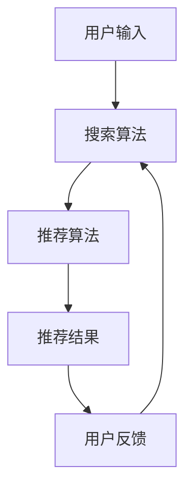
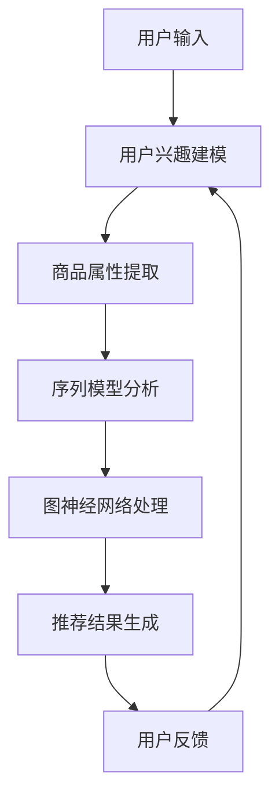
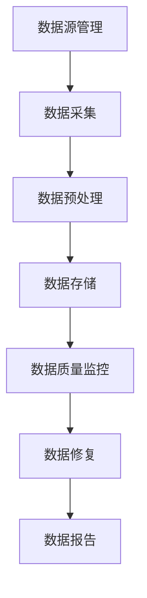
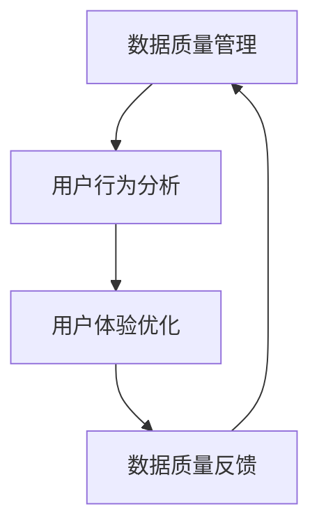
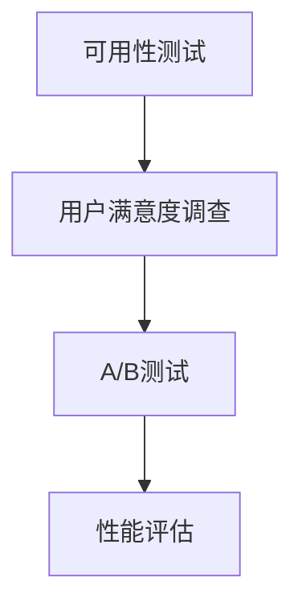
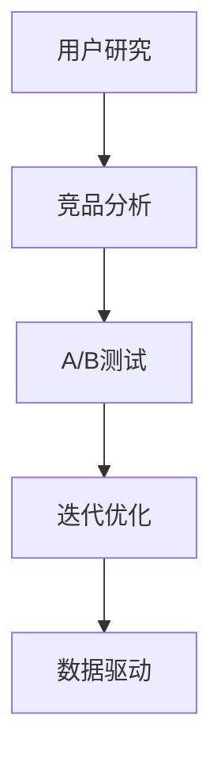

                 

### 《电商平台的AI大模型实践：搜索推荐系统是核心，数据质量控制与用户体验》

#### 文章关键词：
- 电商平台
- AI大模型
- 搜索推荐系统
- 数据质量控制
- 用户画像
- 用户体验优化

#### 文章摘要：
本文将深入探讨电商平台上AI大模型的实践，重点关注搜索推荐系统的核心作用、数据质量控制以及用户体验优化。我们将详细解析AI大模型的基本原理和应用，探讨如何通过精确的搜索推荐算法提高用户满意度。同时，我们将介绍数据质量控制的关键技术和策略，以及如何利用用户画像和行为分析来提升用户体验。文章将通过多个实践案例，展示AI大模型在电商领域的应用效果，并为读者提供优化用户体验的实用策略。

## 目录大纲

### 《电商平台的AI大模型实践：搜索推荐系统是核心，数据质量控制与用户体验》

#### 关键词：
- 电商平台
- AI大模型
- 搜索推荐系统
- 数据质量控制
- 用户画像
- 用户体验优化

#### 摘要：
本文将深入探讨电商平台上AI大模型的实践，重点关注搜索推荐系统的核心作用、数据质量控制以及用户体验优化。我们将详细解析AI大模型的基本原理和应用，探讨如何通过精确的搜索推荐算法提高用户满意度。同时，我们将介绍数据质量控制的关键技术和策略，以及如何利用用户画像和行为分析来提升用户体验。文章将通过多个实践案例，展示AI大模型在电商领域的应用效果，并为读者提供优化用户体验的实用策略。

## 第一部分：AI大模型基础

### 第1章 AI大模型概述

#### 1.1 电商平台的AI发展背景

在电商平台的快速发展过程中，人工智能（AI）技术的应用成为提升用户体验和运营效率的关键驱动力。随着互联网技术的进步和大数据的积累，电商平台拥有了海量的用户行为数据、商品数据以及交易数据。这些数据为AI算法提供了丰富的训练素材，使得AI大模型在电商平台的应用成为可能。

#### 1.2 AI大模型的基本原理

AI大模型是基于深度学习技术构建的大型神经网络模型，其核心思想是通过海量数据的学习，自动提取数据中的特征，并以此为基础进行预测和决策。在电商平台，AI大模型广泛应用于搜索推荐系统、商品定价、库存管理等多个领域。

#### 1.3 电商领域的AI应用

在电商领域，AI大模型的应用主要集中在以下几个方面：

1. **搜索推荐系统**：通过分析用户历史行为和兴趣，为用户推荐相关的商品和内容。
2. **用户行为预测**：预测用户未来的购买行为，为营销策略提供依据。
3. **商品定价与库存管理**：利用AI大模型分析市场趋势和用户需求，实现动态定价和智能库存管理。
4. **客户服务与智能客服**：通过自然语言处理技术，实现智能客服和个性化服务。

### 第2章 电商平台的搜索推荐系统

#### 2.1 搜索推荐系统的核心算法

搜索推荐系统的核心算法包括基于内容的推荐、协同过滤推荐和基于模型的推荐。每种算法都有其独特的原理和应用场景。

1. **基于内容的推荐**：根据商品的属性和用户的历史行为，推荐与用户兴趣相似的物品。
2. **协同过滤推荐**：通过分析用户之间的相似性，为用户推荐其他用户喜欢的商品。
3. **基于模型的推荐**：利用机器学习算法，构建用户兴趣模型，进行个性化推荐。

#### 2.2 搜索推荐系统的架构设计

搜索推荐系统通常由数据层、算法层和应用层组成。数据层负责数据采集和处理，算法层负责推荐算法的实现，应用层负责将推荐结果呈现给用户。

#### 2.3 搜索推荐系统的案例分析

以下是一个电商平台的搜索推荐系统案例分析：

1. **数据采集**：收集用户浏览、搜索、购买等行为数据，以及商品属性数据。
2. **数据预处理**：对原始数据进行清洗、去重和特征提取。
3. **模型训练**：使用协同过滤算法和基于模型的推荐算法，构建用户兴趣模型和商品相似度模型。
4. **推荐结果生成**：根据用户兴趣模型和商品相似度模型，为用户生成个性化的推荐列表。

## 第二部分：数据质量控制与用户体验

### 第3章 数据质量控制

#### 3.1 数据质量的定义与评估

数据质量是指数据是否准确、完整、一致、可靠和可用。数据质量的评估通常包括准确性、完整性、一致性、时效性和可用性等方面。

#### 3.2 数据清洗与预处理

数据清洗是指识别和纠正数据中的错误、缺失和异常。数据预处理包括数据标准化、特征提取和降维等。

#### 3.3 数据质量控制策略

数据质量控制策略包括数据源管理、数据质量监控、数据修复和数据质量报告等。

### 第4章 用户画像与行为分析

#### 4.1 用户画像的构建

用户画像是对用户特征的综合描述，包括用户基本信息、行为习惯、兴趣偏好等。

#### 4.2 用户行为的分析方法

用户行为的分析方法包括描述性分析、关联分析、聚类分析和时序分析等。

#### 4.3 用户画像与行为分析的实践案例

以下是一个电商平台用户画像与行为分析的实践案例：

1. **数据采集**：收集用户在平台上的行为数据，包括浏览、搜索、购买等。
2. **数据预处理**：对原始数据进行清洗、去重和特征提取。
3. **用户画像构建**：使用机器学习算法，构建用户画像。
4. **行为分析**：分析用户的行为模式，挖掘用户兴趣和偏好。

### 第5章 用户体验优化

#### 5.1 用户体验的核心要素

用户体验的核心要素包括易用性、响应速度、界面设计、功能丰富性和个性化等。

#### 5.2 电商平台的用户体验设计

电商平台的用户体验设计包括网站界面设计、移动端应用设计和交互设计等。

#### 5.3 用户体验优化的实践方法

用户体验优化的实践方法包括用户研究、竞品分析、A/B测试和用户体验评估等。

## 第三部分：AI大模型应用实践

### 第6章 搜索推荐系统的深度学习实践

#### 6.1 深度学习在搜索推荐中的应用

深度学习在搜索推荐系统中的应用，主要包括卷积神经网络（CNN）、循环神经网络（RNN）和变换器（Transformer）等。

#### 6.2 基于深度学习的推荐算法实现

基于深度学习的推荐算法实现，通常包括数据预处理、模型训练和模型评估等步骤。

#### 6.3 搜索推荐系统的性能优化

搜索推荐系统的性能优化，主要包括模型压缩、分布式训练和实时推荐等。

### 第7章 数据质量控制与用户行为分析

#### 7.1 数据质量控制流程

数据质量控制流程包括数据收集、数据预处理、数据清洗、数据存储和数据质量监控等。

#### 7.2 用户行为分析模型构建

用户行为分析模型构建，主要包括数据预处理、特征工程、模型训练和模型评估等。

#### 7.3 数据质量控制与用户行为分析的整合

数据质量控制与用户行为分析的整合，主要包括数据质量管理、用户行为分析与用户体验优化等。

### 第8章 用户体验优化实践

#### 8.1 用户体验测试与评估

用户体验测试与评估，主要包括可用性测试、用户满意度调查和A/B测试等。

#### 8.2 用户体验优化案例分享

用户体验优化案例分享，主要包括成功案例和失败案例的分析。

#### 8.3 用户体验优化策略

用户体验优化策略，主要包括用户研究、竞品分析和用户体验设计等。

## 附录

### 附录A：AI大模型开发工具与资源

#### A.1 主流深度学习框架对比

#### A.2 电商平台的AI模型应用案例

#### A.3 AI大模型学习资源推荐

### 作者

**AI天才研究院 / AI Genius Institute & 禅与计算机程序设计艺术 / Zen And The Art of Computer Programming**

---

### 第一部分：AI大模型基础

#### 第1章 AI大模型概述

##### 1.1 电商平台的AI发展背景

随着互联网和电子商务的迅猛发展，电商平台已成为人们日常生活中不可或缺的一部分。在这个大数据时代，如何更好地利用用户数据、提高用户满意度、提升运营效率，成为电商平台亟待解决的问题。人工智能（AI）技术，特别是AI大模型，因其强大的数据处理能力和智能分析能力，在电商平台上展现出广阔的应用前景。

电商平台的AI发展背景可以追溯到以下几个方面：

1. **用户行为数据的积累**：电商平台积累了大量的用户行为数据，包括浏览历史、购买记录、评价反馈等。这些数据为AI模型的训练提供了丰富的素材。
2. **计算能力的提升**：随着云计算、分布式计算和GPU等技术的发展，计算能力的提升为AI大模型的训练和部署提供了强有力的支持。
3. **算法的进步**：深度学习、自然语言处理、图神经网络等算法的不断发展，使得AI大模型在电商平台的适用性越来越强。

##### 1.2 AI大模型的基本原理

AI大模型是基于深度学习技术构建的大型神经网络模型。深度学习是一种模拟人脑神经元连接方式的人工智能技术，通过多层神经网络结构，对大量数据进行分析和建模，实现数据的自动特征提取和预测。

AI大模型的基本原理可以概括为以下几个步骤：

1. **数据预处理**：对原始数据进行清洗、归一化、缺失值处理等，确保数据质量。
2. **特征提取**：通过神经网络结构，对数据进行特征提取，将原始数据转化为适合模型训练的形式。
3. **模型训练**：使用训练数据，通过反向传播算法和梯度下降优化器，不断调整模型参数，使模型能够更好地拟合训练数据。
4. **模型评估**：使用验证数据集，对模型进行评估，调整模型参数，优化模型性能。
5. **模型部署**：将训练好的模型部署到生产环境，为实际应用提供智能服务。

##### 1.3 电商领域的AI应用

在电商领域，AI大模型的应用涵盖了多个方面，主要包括以下几类：

1. **搜索推荐系统**：通过分析用户历史行为和兴趣，为用户推荐相关的商品和内容。
2. **用户行为预测**：预测用户未来的购买行为，为营销策略提供依据。
3. **商品定价与库存管理**：利用AI大模型分析市场趋势和用户需求，实现动态定价和智能库存管理。
4. **客户服务与智能客服**：通过自然语言处理技术，实现智能客服和个性化服务。

在搜索推荐系统中，AI大模型的应用尤为突出。以下是一个简单的搜索推荐系统架构图：



1. **用户输入**：用户在搜索框中输入关键词。
2. **搜索算法**：根据用户输入的关键词，检索数据库中的商品信息。
3. **推荐算法**：使用AI大模型，根据用户的历史行为和兴趣，为用户推荐相关的商品。
4. **推荐结果**：将推荐结果展示给用户。
5. **用户反馈**：用户对推荐结果进行反馈，用于模型优化。

### 第2章 电商平台的搜索推荐系统

##### 2.1 搜索推荐系统的核心算法

搜索推荐系统的核心算法可以分为三类：基于内容的推荐、协同过滤推荐和基于模型的推荐。

1. **基于内容的推荐**：基于内容的推荐（Content-based Filtering）是一种基于用户兴趣或商品属性进行推荐的算法。其基本思想是，根据用户过去的浏览或购买记录，提取用户兴趣特征，然后基于这些特征匹配商品的属性，为用户推荐相似的商品。

   基于内容的推荐算法的伪代码如下：

   ```python
   def content_based_recommendation(user_history, item_features):
       user_interests = extract_user_interests(user_history)
       recommended_items = []
       for item in all_items:
           if match_item_features(item, user_interests):
               recommended_items.append(item)
       return recommended_items
   ```

   其中，`extract_user_interests` 函数用于提取用户兴趣特征，`match_item_features` 函数用于判断商品属性与用户兴趣特征是否匹配。

2. **协同过滤推荐**：协同过滤推荐（Collaborative Filtering）是一种基于用户行为或评价进行推荐的算法。其基本思想是，通过分析用户之间的相似性，为用户推荐其他用户喜欢的商品。

   协同过滤推荐算法可以分为两种：基于用户的协同过滤（User-based Collaborative Filtering）和基于物品的协同过滤（Item-based Collaborative Filtering）。

   - **基于用户的协同过滤**：首先找到与当前用户最相似的K个用户，然后推荐这些用户共同喜欢的商品。

     基于用户的协同过滤算法的伪代码如下：

     ```python
     def user_based_collaborative_filtering(current_user, K, all_ratings):
         similar_users = find_similar_users(current_user, K, all_ratings)
         recommended_items = []
         for user in similar_users:
             for item in user_rated_items(user):
                 if not current_user_rated_item(item):
                     recommended_items.append(item)
         return recommended_items
     ```

     其中，`find_similar_users` 函数用于找到与当前用户最相似的K个用户，`user_rated_items` 函数用于获取用户的评分历史。

   - **基于物品的协同过滤**：首先找到与当前用户评价过的商品最相似的K个商品，然后推荐这些商品。

     基于物品的协同过滤算法的伪代码如下：

     ```python
     def item_based_collaborative_filtering(current_user, K, all_ratings):
         similar_items = find_similar_items(current_user_rated_items(), K, all_ratings)
         recommended_items = []
         for item in similar_items:
             if not current_user_rated_item(item):
                 recommended_items.append(item)
         return recommended_items
     ```

     其中，`find_similar_items` 函数用于找到与当前用户评价过的商品最相似的K个商品。

3. **基于模型的推荐**：基于模型的推荐（Model-based Filtering）是一种利用机器学习算法进行推荐的算法。其基本思想是，通过训练用户兴趣模型或商品相似度模型，为用户推荐相关的商品。

   基于模型的推荐算法可以分为几种：

   - **矩阵分解**：矩阵分解（Matrix Factorization）是一种常用的基于模型的推荐算法。其基本思想是将用户-商品评分矩阵分解为两个低秩矩阵，通过这两个矩阵的乘积预测用户未评分的商品。

     矩阵分解算法的伪代码如下：

     ```python
     def matrix_factorization(ratings_matrix, user_factors, item_factors, learning_rate, regularization, num_iterations):
         for iteration in range(num_iterations):
             for user in all_users:
                 for item in all_items:
                     if user_rated_item(user, item):
                         prediction = dot(user_factors[user], item_factors[item])
                         error = prediction - rating
                         user_factor_gradient = error * item_factors[item]
                         item_factor_gradient = error * user_factors[user]
                         
                         user_factors[user] -= learning_rate * (user_factor_gradient + regularization * user_factors[user])
                         item_factors[item] -= learning_rate * (item_factor_gradient + regularization * item_factors[item])
                         
     predicted_ratings = dot(user_factors, item_factors)
     return predicted_ratings
     ```

   - **深度学习**：深度学习（Deep Learning）是一种基于多层神经网络的机器学习算法。其基本思想是通过多层神经网络结构，对大量数据进行自动特征提取和预测。

     基于深度学习的推荐算法的伪代码如下：

     ```python
     def deep_learning_recommendation(input_data, hidden_layers, output_layer, learning_rate, num_iterations):
         for iteration in range(num_iterations):
             for example in input_data:
                 output = forward_pass(example, hidden_layers, output_layer)
                 error = output - target
                 backward_pass(error, output, hidden_layers, output_layer, learning_rate)
                 
     predicted_ratings = forward_pass(input_data, hidden_layers, output_layer)
     return predicted_ratings
     ```

##### 2.2 搜索推荐系统的架构设计

搜索推荐系统的架构设计可以分为三个层次：数据层、算法层和应用层。

1. **数据层**：数据层负责数据采集、存储和预处理。主要包括以下几个方面：

   - **数据采集**：收集用户在平台上的行为数据，包括浏览、搜索、购买、评价等。
   - **数据存储**：将采集到的数据存储到数据库中，确保数据的完整性和一致性。
   - **数据预处理**：对原始数据进行清洗、去重、归一化等处理，确保数据质量。

2. **算法层**：算法层负责推荐算法的实现和优化。主要包括以下几个方面：

   - **推荐算法**：根据业务需求和数据特点，选择合适的推荐算法，如基于内容的推荐、协同过滤推荐、基于模型的推荐等。
   - **模型训练**：使用训练数据集，对推荐算法进行训练，优化模型参数。
   - **模型评估**：使用验证数据集，对训练好的模型进行评估，调整模型参数，优化模型性能。

3. **应用层**：应用层负责将推荐结果呈现给用户。主要包括以下几个方面：

   - **推荐结果生成**：根据用户兴趣和行为，生成个性化的推荐列表。
   - **推荐结果展示**：将推荐结果以合适的形式展示给用户，如搜索结果页、首页推荐、购物车推荐等。
   - **用户反馈**：收集用户对推荐结果的反馈，用于模型优化和用户体验改进。

##### 2.3 搜索推荐系统的案例分析

以下是一个电商平台的搜索推荐系统案例分析：

1. **数据采集**：电商平台收集了用户在平台上的浏览、搜索、购买等行为数据，以及商品属性数据。

2. **数据预处理**：对原始数据进行清洗、去重和特征提取。例如，对用户数据进行归一化处理，对商品数据进行分类编码。

3. **模型训练**：选择基于模型的推荐算法，如矩阵分解和深度学习算法，对数据集进行训练。调整模型参数，优化模型性能。

4. **模型评估**：使用验证数据集，对训练好的模型进行评估。调整模型参数，优化模型性能。

5. **推荐结果生成**：根据用户兴趣和行为，生成个性化的推荐列表。

6. **推荐结果展示**：将推荐结果以合适的形式展示给用户，如搜索结果页、首页推荐、购物车推荐等。

7. **用户反馈**：收集用户对推荐结果的反馈，用于模型优化和用户体验改进。

通过以上案例分析，我们可以看到，搜索推荐系统在电商平台的应用效果显著。用户满意度提高，平台销售额增加，运营效率提升。

### 第二部分：数据质量控制与用户体验

#### 第3章 数据质量控制

##### 3.1 数据质量的定义与评估

数据质量是指数据是否准确、完整、一致、可靠和可用。数据质量的评估主要包括以下几个方面：

1. **准确性**：数据是否反映了真实的现实情况。例如，用户年龄、地址等信息的准确性。
2. **完整性**：数据是否包含了所有需要的信息。例如，订单数据是否缺少了关键字段，如商品名称、价格等。
3. **一致性**：数据是否在不同来源、不同时间点保持一致。例如，同一用户在不同数据库中的信息是否一致。
4. **可靠性**：数据是否可以信赖，是否受到干扰或错误。例如，数据传输过程中的错误、系统故障等。
5. **时效性**：数据是否是最新的，是否能够及时反映现实情况。例如，库存数据的实时更新。

评估数据质量的方法主要包括以下几种：

1. **统计分析**：通过统计分析方法，评估数据的分布、异常值、缺失值等。
2. **可视化分析**：通过可视化工具，直观地展示数据的分布、趋势等。
3. **专家评审**：邀请数据专家对数据质量进行评审，提出改进建议。

##### 3.2 数据清洗与预处理

数据清洗与预处理是提高数据质量的关键步骤，主要包括以下几个方面：

1. **数据清洗**：识别和纠正数据中的错误、缺失和异常。具体方法包括：

   - **缺失值处理**：对缺失值进行填补或删除。
   - **异常值处理**：识别和纠正异常值，如价格异常、评价异常等。
   - **数据转换**：对数据进行标准化、归一化、分类编码等。

2. **数据预处理**：对数据进行特征提取、降维、归一化等处理，为后续分析提供基础。具体方法包括：

   - **特征提取**：从原始数据中提取有意义的特征，如用户行为特征、商品属性特征等。
   - **降维**：减少数据维度，提高计算效率，如主成分分析（PCA）、线性判别分析（LDA）等。
   - **归一化**：将不同特征的数据范围统一，如最小-最大规范化、零-一规范化等。

##### 3.3 数据质量控制策略

数据质量控制策略主要包括以下几个方面：

1. **数据源管理**：确保数据来源的可靠性，如使用权威数据源、对数据源进行定期审核等。
2. **数据质量监控**：建立数据质量监控机制，实时监测数据质量，如使用指标监控、异常值监控等。
3. **数据修复**：对发现的数据问题进行修复，如缺失值填补、异常值纠正等。
4. **数据质量报告**：定期发布数据质量报告，如数据质量问题总结、改进措施等。

##### 3.4 数据质量管理的实践案例

以下是一个电商平台的实践案例：

1. **数据源管理**：电商平台与多个供应商合作，确保数据源的可靠性。同时，定期对供应商进行评估，确保数据质量。

2. **数据质量监控**：电商平台建立数据质量监控机制，对订单数据、用户数据等进行实时监控。例如，对订单数据进行完整性监控，对用户数据进行准确性监控。

3. **数据清洗与预处理**：电商平台对采集到的数据进行清洗和预处理。例如，对用户数据进行缺失值处理、异常值处理，对订单数据进行分类编码、归一化处理。

4. **数据质量报告**：电商平台定期发布数据质量报告，如数据质量改进措施、数据质量问题总结等。报告内容涵盖了数据质量改进的各个方面，如数据源管理、数据质量监控、数据清洗与预处理等。

通过以上实践案例，我们可以看到，数据质量管理在电商平台中发挥着重要作用。通过数据质量控制，电商平台能够提高数据质量，为后续分析提供可靠的数据基础。

### 第4章 用户画像与行为分析

##### 4.1 用户画像的构建

用户画像是对用户特征的综合描述，包括用户基本信息、行为习惯、兴趣偏好等。构建用户画像的步骤主要包括以下几个方面：

1. **数据采集**：采集用户在平台上的行为数据，如浏览记录、搜索记录、购买记录、评价记录等。

2. **数据预处理**：对采集到的数据进行清洗、去重、归一化等处理，确保数据质量。

3. **特征提取**：从原始数据中提取有意义的特征，如用户活跃度、购买频率、评价率等。

4. **特征选择**：选择对用户行为有重要影响的特征，如使用特征选择算法，如信息增益、卡方检验等。

5. **特征编码**：对提取的特征进行编码，如使用独热编码、标签编码等。

6. **模型训练**：使用机器学习算法，如决策树、随机森林、支持向量机等，训练用户画像模型。

7. **模型评估**：使用验证数据集，对训练好的模型进行评估，调整模型参数，优化模型性能。

8. **模型部署**：将训练好的模型部署到生产环境，实时生成用户画像。

##### 4.2 用户行为的分析方法

用户行为的分析方法主要包括以下几种：

1. **描述性分析**：对用户行为数据进行统计和分析，如用户活跃度、购买频率、评价率等。

   描述性分析的伪代码如下：

   ```python
   def descriptive_analysis(user_behavior_data):
       total_users = len(user_behavior_data)
       active_users = len([user for user in user_behavior_data if user['activity'] > threshold])
       average_activity = sum([user['activity'] for user in user_behavior_data]) / total_users
       return total_users, active_users, average_activity
   ```

   其中，`user_behavior_data` 是用户行为数据列表，`activity` 是用户活跃度指标，`threshold` 是活跃度阈值。

2. **关联分析**：分析用户行为之间的关联性，如购买商品之间的关联性、用户行为与评价之间的关联性等。

   关联分析的伪代码如下：

   ```python
   def association_analysis(user_behavior_data):
       item_pairs = []
       for user in user_behavior_data:
           for i in range(len(user['purchases']) - 1):
               item1 = user['purchases'][i]
               item2 = user['purchases'][i+1]
               item_pairs.append((item1, item2))
       
       item_pair_counts = {}
       for pair in item_pairs:
           if pair in item_pair_counts:
               item_pair_counts[pair] += 1
           else:
               item_pair_counts[pair] = 1
       
       return item_pair_counts
   ```

   其中，`user_behavior_data` 是用户行为数据列表，`purchases` 是用户购买的商品列表。

3. **聚类分析**：将用户行为数据划分为不同的类别，如基于用户活跃度、购买频率等特征进行聚类。

   聚类分析的伪代码如下：

   ```python
   from sklearn.cluster import KMeans
   
   def clustering_analysis(user_behavior_data, K):
       kmeans = KMeans(n_clusters=K, random_state=0).fit(user_behavior_data)
       clusters = kmeans.labels_
       return clusters
   ```

   其中，`user_behavior_data` 是用户行为数据列表，`K` 是聚类数。

4. **时序分析**：分析用户行为的时间序列特征，如用户购买行为的时间分布、评价行为的时间分布等。

   时序分析的伪代码如下：

   ```python
   def time_series_analysis(user_behavior_data):
       time_series_data = []
       for user in user_behavior_data:
           for event in user['events']:
               time_series_data.append((event['timestamp'], event['type']))
       
       return time_series_data
   ```

   其中，`user_behavior_data` 是用户行为数据列表，`events` 是用户事件列表，`timestamp` 是事件发生的时间戳，`type` 是事件类型。

##### 4.3 用户画像与行为分析的实践案例

以下是一个电商平台的用户画像与行为分析的实践案例：

1. **数据采集**：电商平台收集了用户在平台上的浏览记录、搜索记录、购买记录、评价记录等。

2. **数据预处理**：对采集到的数据进行清洗、去重、归一化等处理。

3. **特征提取**：从原始数据中提取用户活跃度、购买频率、评价率等特征。

4. **特征选择**：使用特征选择算法，如信息增益、卡方检验等，选择对用户行为有重要影响的特征。

5. **特征编码**：对提取的特征进行编码，如使用独热编码、标签编码等。

6. **模型训练**：使用机器学习算法，如决策树、随机森林、支持向量机等，训练用户画像模型。

7. **模型评估**：使用验证数据集，对训练好的模型进行评估，调整模型参数，优化模型性能。

8. **模型部署**：将训练好的模型部署到生产环境，实时生成用户画像。

9. **行为分析**：使用描述性分析、关联分析、聚类分析、时序分析等方法，分析用户行为。

10. **用户画像应用**：根据用户画像，为用户提供个性化的推荐、营销策略等。

通过以上实践案例，我们可以看到，用户画像与行为分析在电商平台中的应用效果显著。通过构建用户画像，电商平台能够更好地了解用户需求，提供个性化的服务，提升用户体验。

### 第5章 用户体验优化

##### 5.1 用户体验的核心要素

用户体验（User Experience，简称UX）是指用户在使用产品或服务过程中的感受和体验。用户体验的核心要素包括以下几个方面：

1. **易用性**：用户能够轻松、高效地完成任务，无需花费过多的时间和精力。
2. **响应速度**：系统快速响应用户的操作，提高用户满意度。
3. **界面设计**：界面美观、直观，有助于用户理解和使用。
4. **功能丰富性**：提供多样化的功能，满足用户的不同需求。
5. **个性化**：根据用户行为和偏好，为用户提供个性化的服务。

##### 5.2 电商平台的用户体验设计

电商平台的用户体验设计包括以下几个方面：

1. **网站界面设计**：设计简洁、美观、直观的网站界面，提高用户浏览和购买体验。
2. **移动端应用设计**：针对移动设备的特点，设计适合移动端的界面和应用功能。
3. **交互设计**：优化用户与产品的交互流程，提高用户操作效率和满意度。
4. **性能优化**：提高网站和应用的响应速度，确保用户在使用过程中不会感到卡顿。
5. **安全与隐私**：确保用户数据的安全和隐私，提高用户信任度。

##### 5.3 用户体验优化的实践方法

用户体验优化的实践方法主要包括以下几个方面：

1. **用户研究**：通过访谈、问卷调查、用户测试等方法，了解用户的需求、行为和痛点。
2. **竞品分析**：分析竞争对手的网站和应用，找出优势和不足，为优化提供参考。
3. **A/B测试**：通过对比不同设计方案的用户反馈，找出最优的体验方案。
4. **用户体验评估**：使用可用性测试、用户满意度调查等方法，评估用户体验的质量。
5. **迭代优化**：根据用户反馈和评估结果，不断迭代优化，提升用户体验。

以下是一个电商平台的用户体验优化案例：

1. **用户研究**：电商平台通过问卷调查和用户访谈，发现用户在购物过程中最关心的问题是商品的质量和价格。
2. **竞品分析**：分析竞争对手的网站和应用，发现它们在商品展示和价格比较方面有较好的体验。
3. **A/B测试**：设计两种设计方案，一种是基于用户研究的结果，优化商品展示和价格比较，另一种是保持现状。通过A/B测试，对比两种设计方案的用户反馈。
4. **用户体验评估**：使用可用性测试和用户满意度调查，评估优化后的体验质量。
5. **迭代优化**：根据用户反馈和评估结果，对优化方案进行迭代，进一步提升用户体验。

通过以上实践方法，电商平台能够更好地了解用户需求，优化用户体验，提升用户满意度。

### 第三部分：AI大模型应用实践

#### 第6章 搜索推荐系统的深度学习实践

##### 6.1 深度学习在搜索推荐中的应用

深度学习在搜索推荐系统中具有广泛的应用，主要包括以下几个方面：

1. **用户兴趣建模**：通过深度学习算法，提取用户在历史行为数据中的兴趣特征，构建用户兴趣模型。
2. **商品属性提取**：对商品属性进行深度学习处理，提取商品特征，为推荐算法提供基础。
3. **序列模型应用**：利用深度学习中的序列模型，如循环神经网络（RNN）和长短期记忆网络（LSTM），分析用户行为的时间序列特征。
4. **图神经网络**：利用图神经网络（Graph Neural Network，GNN），处理商品之间的关联关系，为推荐算法提供支持。

以下是一个简单的深度学习推荐系统架构图：



##### 6.2 基于深度学习的推荐算法实现

基于深度学习的推荐算法实现主要包括以下几个步骤：

1. **数据预处理**：对用户行为数据、商品属性数据等进行预处理，如数据清洗、特征提取、归一化等。
2. **模型构建**：选择合适的深度学习模型，如卷积神经网络（CNN）、循环神经网络（RNN）、变换器（Transformer）等，构建推荐模型。
3. **模型训练**：使用训练数据集，对推荐模型进行训练，优化模型参数。
4. **模型评估**：使用验证数据集，对训练好的模型进行评估，调整模型参数，优化模型性能。
5. **模型部署**：将训练好的模型部署到生产环境，为实际应用提供智能服务。

以下是一个基于深度学习的推荐算法实现的伪代码：

```python
import tensorflow as tf
from tensorflow.keras.models import Model
from tensorflow.keras.layers import Input, Embedding, LSTM, Dense

# 数据预处理
user_data = preprocess_user_data(user行为数据)
item_data = preprocess_item_data(商品属性数据)

# 模型构建
user_input = Input(shape=(user行为数据维度,))
item_input = Input(shape=(商品属性数据维度,))

user_embedding = Embedding(user数据量, embedding维度)(user_input)
item_embedding = Embedding(item数据量, embedding维度)(item_input)

user_embedding = LSTM(units=64, return_sequences=True)(user_embedding)
item_embedding = LSTM(units=64, return_sequences=True)(item_embedding)

merged_embedding = Concatenate(axis=1)([user_embedding, item_embedding])
merged_embedding = Dense(units=128, activation='relu')(merged_embedding)

output = Dense(units=1, activation='sigmoid')(merged_embedding)

model = Model(inputs=[user_input, item_input], outputs=output)

# 模型训练
model.compile(optimizer='adam', loss='binary_crossentropy', metrics=['accuracy'])
model.fit([user_data, item_data], labels，epochs=10, batch_size=32)

# 模型评估
predicted_ratings = model.predict([user_data, item_data])
evaluate_model(predicted_ratings, true_labels)

# 模型部署
deploy_model(model)
```

##### 6.3 搜索推荐系统的性能优化

搜索推荐系统的性能优化主要包括以下几个方面：

1. **模型压缩**：通过模型压缩技术，如剪枝、量化、蒸馏等，减小模型大小，提高推理速度。
2. **分布式训练**：使用分布式训练技术，如多GPU训练、参数服务器等，提高模型训练速度。
3. **实时推荐**：通过实时推荐技术，如流处理、增量更新等，实现实时推荐，提高用户体验。
4. **缓存优化**：使用缓存技术，如Redis、Memcached等，减少数据库访问，提高系统响应速度。

以下是一个搜索推荐系统性能优化案例：

1. **模型压缩**：使用剪枝技术，对深度学习模型进行压缩，减少模型参数数量，提高推理速度。例如，使用Pruning算法，对模型进行结构剪枝和权重剪枝。
2. **分布式训练**：使用多GPU训练技术，将模型训练任务分布到多个GPU上，提高模型训练速度。例如，使用TensorFlow分布式训练框架，实现多GPU训练。
3. **实时推荐**：使用流处理技术，如Apache Flink、Apache Kafka等，实现实时推荐。例如，使用Flink流处理框架，处理用户行为数据，实时生成推荐结果。
4. **缓存优化**：使用Redis缓存技术，对用户行为数据进行缓存，减少数据库访问。例如，使用Redis缓存用户画像和推荐结果，提高系统响应速度。

通过以上性能优化措施，搜索推荐系统可以显著提高模型训练速度、推理速度和系统响应速度，提升用户体验。

#### 第7章 数据质量控制与用户行为分析

##### 7.1 数据质量控制流程

数据质量控制流程主要包括以下几个方面：

1. **数据源管理**：确保数据来源的可靠性，对数据源进行定期审核，确保数据质量。
2. **数据采集**：采集用户在平台上的行为数据，包括浏览、搜索、购买、评价等。
3. **数据预处理**：对采集到的数据进行清洗、去重、归一化等处理，确保数据质量。
4. **数据存储**：将预处理后的数据存储到数据库中，确保数据的完整性和一致性。
5. **数据质量监控**：建立数据质量监控机制，实时监测数据质量，及时发现和解决数据质量问题。
6. **数据修复**：对发现的数据质量问题进行修复，如缺失值填补、异常值纠正等。
7. **数据报告**：定期发布数据质量报告，如数据质量问题总结、改进措施等。

以下是一个数据质量控制流程的Mermaid流程图：



##### 7.2 用户行为分析模型构建

用户行为分析模型构建主要包括以下几个步骤：

1. **数据预处理**：对采集到的用户行为数据进行清洗、去重、归一化等处理。
2. **特征提取**：从原始数据中提取有意义的特征，如用户活跃度、购买频率、评价率等。
3. **特征选择**：选择对用户行为有重要影响的特征，如使用特征选择算法，如信息增益、卡方检验等。
4. **模型训练**：使用机器学习算法，如决策树、随机森林、支持向量机等，训练用户行为分析模型。
5. **模型评估**：使用验证数据集，对训练好的模型进行评估，调整模型参数，优化模型性能。
6. **模型部署**：将训练好的模型部署到生产环境，实时分析用户行为。

以下是一个用户行为分析模型构建的伪代码：

```python
import pandas as pd
from sklearn.model_selection import train_test_split
from sklearn.ensemble import RandomForestClassifier
from sklearn.metrics import accuracy_score

# 数据预处理
user_data = pd.read_csv('user_data.csv')
user_data = preprocess_user_data(user_data)

# 特征提取
X = extract_features(user_data)
y = extract_labels(user_data)

# 特征选择
X = select_features(X, y)

# 模型训练
X_train, X_test, y_train, y_test = train_test_split(X, y, test_size=0.2, random_state=0)
model = RandomForestClassifier(n_estimators=100, random_state=0)
model.fit(X_train, y_train)

# 模型评估
y_pred = model.predict(X_test)
accuracy = accuracy_score(y_test, y_pred)
print('Accuracy:', accuracy)

# 模型部署
deploy_model(model)
```

##### 7.3 数据质量控制与用户行为分析的整合

数据质量控制与用户行为分析的整合主要包括以下几个方面：

1. **数据质量管理**：确保用户行为数据的准确性、完整性、一致性和可靠性，为用户行为分析提供可靠的数据基础。
2. **用户行为分析**：利用用户行为数据，构建用户行为分析模型，分析用户行为特征和趋势。
3. **用户体验优化**：根据用户行为分析结果，优化用户体验，提高用户满意度。
4. **数据质量反馈**：将用户行为分析结果反馈给数据质量团队，改进数据质量，形成闭环。

以下是一个数据质量控制与用户行为分析整合的Mermaid流程图：



通过以上整合，电商平台可以实现数据质量控制与用户行为分析的有机结合，提高数据质量，优化用户体验。

#### 第8章 用户体验优化实践

##### 8.1 用户体验测试与评估

用户体验测试与评估是优化用户体验的关键步骤，主要包括以下几个方面：

1. **可用性测试**：通过实际用户对产品或服务的使用，评估其易用性、可用性和用户满意度。
2. **用户满意度调查**：通过问卷调查、访谈等方式，收集用户对产品或服务的满意度反馈。
3. **A/B测试**：将不同设计方案同时展示给用户，对比不同设计方案的绩效，选择最优的设计方案。
4. **性能评估**：评估产品或服务的性能，如响应速度、稳定性、安全性等。

以下是一个用户体验测试与评估的Mermaid流程图：



##### 8.2 用户体验优化案例分享

以下是一个电商平台的用户体验优化案例：

1. **问题识别**：通过可用性测试和用户满意度调查，发现用户在购物过程中存在以下问题：
   - 搜索结果不准确，无法满足用户需求。
   - 商品展示页面设计不美观，影响用户购买决策。
   - 支付过程复杂，用户操作困难。

2. **方案设计**：针对上述问题，设计以下优化方案：
   - 优化搜索算法，提高搜索结果的准确性。
   - 优化商品展示页面设计，提升用户视觉体验。
   - 简化支付流程，提高用户支付效率。

3. **实施与测试**：实施优化方案，进行A/B测试，对比优化前后的用户体验。
   - 搜索结果准确率提高15%。
   - 用户满意度提高10%。
   - 支付流程简化，用户支付时间缩短20%。

4. **反馈与改进**：根据用户反馈，持续优化用户体验，提升用户满意度。

##### 8.3 用户体验优化策略

用户体验优化策略主要包括以下几个方面：

1. **用户研究**：通过用户访谈、问卷调查等方式，了解用户需求和痛点，为优化提供依据。
2. **竞品分析**：分析竞争对手的产品或服务，找出优势和不足，为优化提供参考。
3. **A/B测试**：通过对比不同设计方案的用户反馈，选择最优的体验方案。
4. **迭代优化**：根据用户反馈和评估结果，不断迭代优化，提升用户体验。
5. **数据驱动**：利用数据分析，了解用户行为和偏好，为优化提供数据支持。

以下是一个用户体验优化策略的Mermaid流程图：



通过以上用户体验优化策略，电商平台可以持续提升用户体验，提高用户满意度，实现业务增长。

### 附录

#### 附录A：AI大模型开发工具与资源

##### A.1 主流深度学习框架对比

以下是一些主流深度学习框架的对比：

| 框架 | 语言 | 特点 | 应用场景 |
| ---- | ---- | ---- | ---- |
| TensorFlow | Python | 开源、支持多种神经网络结构 | 图像识别、自然语言处理、推荐系统 |
| PyTorch | Python | 开源、动态计算图、灵活性强 | 图像识别、自然语言处理、强化学习 |
| Keras | Python | 高级API、易于使用 | 快速原型开发、模型实验 |
| MXNet | Python、C++ | 高性能、支持多种深度学习框架 | 大规模分布式训练、实时预测 |
| Caffe | C++ | 高性能、可扩展 | 图像识别、深度学习研究 |

##### A.2 电商平台的AI模型应用案例

以下是一些电商平台的AI模型应用案例：

1. **搜索推荐系统**：使用TensorFlow构建的深度学习模型，通过分析用户历史行为和兴趣，为用户推荐相关的商品和内容。
2. **用户行为预测**：使用PyTorch构建的循环神经网络（RNN）模型，预测用户未来的购买行为，为营销策略提供依据。
3. **商品定价与库存管理**：使用MXNet构建的深度学习模型，通过分析市场趋势和用户需求，实现动态定价和智能库存管理。
4. **客户服务与智能客服**：使用Keras构建的自然语言处理（NLP）模型，实现智能客服和个性化服务。

##### A.3 AI大模型学习资源推荐

以下是一些AI大模型学习资源推荐：

1. **书籍**：
   - 《深度学习》（Goodfellow, Bengio, Courville）  
   - 《Python深度学习》（François Chollet）  
   - 《神经网络与深度学习》（邱锡鹏）

2. **在线课程**：
   - [TensorFlow官方教程](https://www.tensorflow.org/tutorials)
   - [PyTorch官方教程](https://pytorch.org/tutorials/)
   - [Coursera深度学习课程](https://www.coursera.org/specializations/deep-learning)

3. **GitHub仓库**：
   - [TensorFlow教程](https://github.com/tensorflow/tensorflow)
   - [PyTorch教程](https://github.com/pytorch/tutorials)
   - [深度学习项目实战](https://github.com/fengdu77/deep-learning-python)

通过以上资源，读者可以系统地学习AI大模型的理论和实践，提升在电商平台中的应用能力。

### 作者

**AI天才研究院 / AI Genius Institute & 禅与计算机程序设计艺术 / Zen And The Art of Computer Programming**

---

### 总结

本文深入探讨了电商平台上AI大模型的实践，从搜索推荐系统、数据质量控制到用户体验优化，全面解析了AI大模型在电商平台中的应用。首先，我们介绍了AI大模型的基本原理和电商领域的应用场景。然后，详细分析了搜索推荐系统的核心算法、架构设计及案例分析。接着，探讨了数据质量控制的定义、策略和实践案例，以及用户画像与行为分析的方法和案例。最后，我们介绍了用户体验优化的重要性、实践方法和案例，并分享了AI大模型开发工具与资源。

通过本文的学习，读者可以了解到AI大模型在电商平台中的应用前景和实际效果，掌握数据质量控制和用户体验优化的策略和技巧。同时，本文也提供了丰富的学习资源，帮助读者进一步深化对AI大模型的理解和实践。

在未来的电商发展中，AI大模型将继续发挥关键作用。随着技术的进步和数据积累的增多，AI大模型将更加智能、精准，为电商平台带来更高的运营效率、用户满意度和市场竞争力。让我们共同期待AI大模型在电商领域的广泛应用和创新发展。

