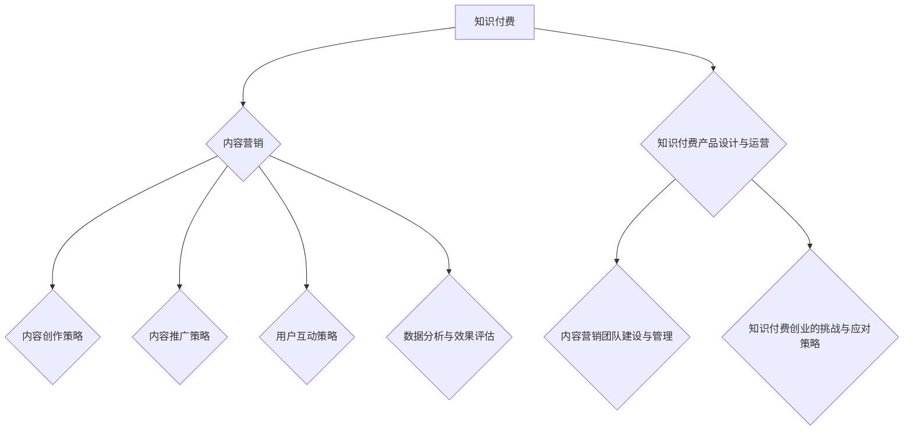

                 

# 《知识付费创业中的内容营销策略》

## 关键词
知识付费、内容营销、创业策略、用户体验、数据分析

## 摘要
本文将探讨知识付费创业中的内容营销策略。通过对知识付费和内容营销的基本概念、核心策略、实施优化方法以及创业实战案例的深入分析，旨在为知识付费创业者提供系统的内容营销指导，帮助他们提升用户满意度、提高产品竞争力，实现持续增长。

### 《知识付费创业中的内容营销策略》目录大纲

#### 第一部分：知识付费与内容营销概述

#### 第二部分：内容营销的策略实施与优化

#### 第三部分：知识付费创业实战

#### 第四部分：附录

### 第一部分：知识付费与内容营销概述

#### 第1章：知识付费与内容营销的基本概念

##### 1.1 知识付费的发展背景与现状

知识付费作为一种新兴商业模式，近年来在全球范围内迅速崛起。其发展背景可以追溯到互联网的普及和信息爆炸的时代。随着人们对知识的需求不断增长，以及互联网技术的发展，使得知识传播变得更加便捷和高效。

**现状**：

1. **市场规模不断扩大**：根据相关报告，全球知识付费市场规模逐年攀升，预计未来几年仍将保持高速增长。
2. **用户群体多样化**：知识付费用户不仅包括职场人士，还包括学生、爱好者等多元化群体。
3. **产品形式多样化**：从在线课程、电子书，到音频、视频等，知识付费产品形式日益丰富。

##### 1.2 内容营销的定义与核心要素

内容营销是一种以创造和分享有价值的内容来吸引潜在客户，提高品牌知名度，促进销售和客户忠诚度的策略。其核心要素包括：

1. **目标受众**：明确目标受众，了解他们的需求和偏好，确保内容能够满足他们的需求。
2. **内容创作**：创作有价值、有吸引力、有教育意义的内容，以吸引和留住用户。
3. **内容推广**：通过多种渠道推广内容，提高内容的曝光率和传播效果。
4. **用户互动**：与用户建立良好的互动关系，提升用户体验和满意度。

##### 1.3 知识付费与内容营销的联系与区别

知识付费与内容营销有着紧密的联系，它们共同构成了知识传播和商业变现的完整链条。

**联系**：

1. **目标一致**：知识付费和内容营销的目标都是为了吸引和留住用户，提高用户满意度。
2. **手段相似**：知识付费和内容营销都依赖于高质量的内容创作和推广策略。

**区别**：

1. **核心目的不同**：知识付费的核心目的是实现商业变现，而内容营销的核心目的是提高品牌知名度和用户忠诚度。
2. **内容形式不同**：知识付费的内容通常更加系统化和专业化，而内容营销的内容则更加多样化，包括图文、视频、音频等多种形式。

#### 第2章：内容营销的核心理念与策略

##### 2.1 内容营销的目标与价值

内容营销的目标主要包括：

1. **提高品牌知名度**：通过创造和分享有价值的内容，提高品牌的曝光度和认知度。
2. **促进销售和转化**：通过内容营销，引导潜在客户了解产品或服务，提高转化率。
3. **建立用户忠诚度**：与用户建立良好的互动关系，提高用户满意度和忠诚度。

内容营销的价值在于：

1. **长期性**：内容营销是一种长期策略，可以持续吸引和留住用户，实现长期增长。
2. **低成本**：相对于传统广告，内容营销的成本较低，但效果更为显著。
3. **可衡量性**：内容营销的效果可以通过多种指标进行衡量，如点击率、转化率、用户留存率等。

##### 2.2 内容营销的五大策略

内容营销的五大策略包括：

1. **内容创作策略**：创作有价值、有吸引力、有教育意义的内容，满足用户需求。
2. **内容推广策略**：通过多种渠道推广内容，提高内容的曝光率和传播效果。
3. **用户互动策略**：与用户建立良好的互动关系，提升用户体验和满意度。
4. **数据分析与优化策略**：通过数据分析，优化内容营销策略，提高效果。
5. **内容品牌化策略**：打造独特的品牌形象，提升品牌认知度和用户忠诚度。

##### 2.3 内容营销的四大关键步骤

内容营销的四大关键步骤包括：

1. **目标设定**：明确内容营销的目标和预期效果，确保内容营销策略的针对性和有效性。
2. **内容创作**：根据目标受众的需求和偏好，创作有价值的内容。
3. **内容推广**：通过多种渠道推广内容，提高内容的曝光率和传播效果。
4. **效果评估**：通过数据分析，评估内容营销的效果，优化策略。

### 第二部分：内容营销的策略实施与优化

#### 第3章：内容创作策略

##### 3.1 内容创作的原则与方法

内容创作应遵循以下原则：

1. **用户中心**：始终以用户需求为中心，创作能满足用户需求的内容。
2. **独特性**：确保内容有独特性和创新性，避免雷同和抄袭。
3. **专业性**：内容应具备专业性和权威性，提升品牌形象和用户信任度。
4. **可操作性和实用性**：内容应具备可操作性和实用性，帮助用户解决实际问题。

内容创作的方法包括：

1. **调查研究**：通过市场调研和用户调研，了解用户需求和偏好。
2. **策划与规划**：根据用户需求和内容主题，进行内容策划和规划。
3. **创作与编辑**：根据策划和规划，进行内容创作和编辑。
4. **多媒体运用**：结合文字、图片、视频等多种形式，提升内容的表现力和吸引力。

##### 3.2 不同类型内容的创作与优化

不同类型的内容创作和优化方法如下：

1. **图文内容**：
   - **创作方法**：结合文字和图片，提高内容的可读性和吸引力。
   - **优化方法**：使用高质量的图片和图表，确保内容的视觉美感。

2. **视频内容**：
   - **创作方法**：根据内容主题，制作高质量的短视频或长视频。
   - **优化方法**：优化视频的画质和音质，提高观众的观看体验。

3. **音频内容**：
   - **创作方法**：制作有吸引力的音频节目，如播客、有声书等。
   - **优化方法**：优化音频的音质和节奏，提高听众的收听体验。

4. **互动内容**：
   - **创作方法**：设计互动性强的内容，如问答、投票、小游戏等。
   - **优化方法**：通过数据分析，优化互动内容的互动性和用户体验。

##### 3.3 知识付费平台的内容规划

知识付费平台的内容规划应考虑以下因素：

1. **内容主题**：根据用户需求和行业趋势，选择具有吸引力和价值的内容主题。
2. **内容结构**：设计系统的内容结构，确保内容的连贯性和逻辑性。
3. **内容形式**：结合不同类型的内容形式，提升内容的多样性和吸引力。
4. **内容更新**：定期更新内容，保持内容的时效性和活跃度。

#### 第4章：内容推广策略

##### 4.1 内容推广渠道分析

内容推广渠道包括：

1. **社交媒体**：如微博、微信、抖音、快手等，通过社交媒体平台发布和推广内容。
2. **搜索引擎**：通过SEO优化和SEM广告，提高内容在搜索引擎中的排名和曝光度。
3. **内容平台**：如知乎、头条、百家号等，通过内容平台发布和推广内容。
4. **合作渠道**：与其他平台或品牌进行合作，共同推广内容。

##### 4.2 社交媒体推广策略

社交媒体推广策略包括：

1. **内容优化**：优化内容标题、封面、摘要等，提高内容的点击率和分享率。
2. **互动营销**：与用户互动，提高用户的参与度和忠诚度。
3. **社群运营**：建立和维护用户社群，提升用户黏性和活跃度。
4. **广告投放**：利用社交媒体广告，精准投放，提高内容的曝光度和转化率。

##### 4.3 联合营销与合作推广

联合营销与合作推广包括：

1. **品牌合作**：与相关品牌或行业专家进行合作，共同推广内容。
2. **内容共享**：与其他平台或品牌进行内容共享，扩大内容传播范围。
3. **资源共享**：与其他平台或品牌进行资源互换，提高推广效果。
4. **活动联动**：举办线上线下活动，与其他平台或品牌联动，提升品牌影响力和用户参与度。

#### 第5章：用户互动策略

##### 5.1 用户互动的重要性

用户互动的重要性体现在以下几个方面：

1. **提升用户满意度**：与用户互动，了解用户需求和反馈，提升用户体验和满意度。
2. **增加用户忠诚度**：与用户建立良好的互动关系，提高用户黏性和忠诚度。
3. **优化内容创作**：通过用户互动，获取用户反馈，优化内容创作和推广策略。
4. **提高品牌形象**：与用户互动，展现企业的专业性和亲和力，提升品牌形象。

##### 5.2 用户互动的方法与技巧

用户互动的方法和技巧包括：

1. **问答互动**：在内容评论区或社交媒体上，积极回答用户的问题，提供专业解答。
2. **评论互动**：关注用户评论，点赞、回复，与用户建立互动关系。
3. **社群互动**：在用户社群中，组织线上或线下活动，提高用户参与度。
4. **定制互动**：根据用户需求，提供个性化的内容和互动体验。
5. **数据驱动**：通过数据分析，了解用户互动偏好，优化互动策略。

##### 5.3 用户反馈的处理与优化

用户反馈的处理与优化包括：

1. **及时回应**：及时回应用户反馈，展现企业的专业性和责任感。
2. **分类处理**：将用户反馈分类处理，针对不同问题采取相应措施。
3. **持续优化**：根据用户反馈，持续优化产品和服务，提升用户体验。
4. **数据分析**：通过数据分析，了解用户反馈的趋势和重点，优化互动策略。
5. **用户激励**：通过积分、优惠券等方式，激励用户提供反馈，提升用户参与度。

#### 第6章：数据分析与效果评估

##### 6.1 内容营销数据分析的基本指标

内容营销数据分析的基本指标包括：

1. **点击率（CTR）**：衡量内容吸引力和用户兴趣度。
2. **转化率（CVR）**：衡量内容对用户购买行为的影响。
3. **用户留存率**：衡量用户对内容的持续关注度和忠诚度。
4. **内容传播度**：衡量内容在社交平台上的传播效果。
5. **用户活跃度**：衡量用户在平台上的互动和参与程度。

##### 6.2 数据驱动的策略调整

数据驱动的策略调整包括：

1. **数据分析**：通过数据分析，了解内容营销的效果，识别问题和机会。
2. **策略调整**：根据数据分析结果，调整内容创作、推广和互动策略。
3. **A/B测试**：通过A/B测试，验证不同策略的效果，优化决策。
4. **持续优化**：持续监控和分析数据，不断优化内容营销策略。

##### 6.3 成功案例分析

**案例1：某在线教育平台的内容营销成功案例**

1. **背景**：该在线教育平台专注于职业技能培训，内容涵盖编程、设计、营销等多个领域。
2. **策略**：
   - **内容创作**：结合行业热点和用户需求，创作高质量的课程内容。
   - **内容推广**：通过社交媒体、内容平台和搜索引擎，广泛推广课程内容。
   - **用户互动**：建立用户社群，积极与用户互动，提高用户参与度和忠诚度。
3. **效果**：
   - **用户留存率**：通过持续优化内容和互动策略，用户留存率提升至40%。
   - **转化率**：通过精准推广和优化课程内容，课程转化率提升至20%。
   - **品牌知名度**：通过内容营销，品牌知名度显著提升，吸引了更多用户和合作伙伴。

**案例2：某知识付费平台的互动营销成功案例**

1. **背景**：该知识付费平台提供专业知识和技能的付费课程，内容涵盖商业、科技、艺术等多个领域。
2. **策略**：
   - **内容创作**：结合用户需求和行业趋势，创作具有吸引力和教育意义的内容。
   - **互动互动**：通过建立用户社群，定期举办线上和线下活动，提高用户互动和参与度。
   - **数据分析**：通过数据分析，了解用户互动偏好，优化互动策略。
3. **效果**：
   - **用户满意度**：通过优质的互动体验，用户满意度显著提升，用户满意度达到90%。
   - **用户留存率**：通过互动营销，用户留存率提升至50%。
   - **品牌忠诚度**：通过互动营销，用户对品牌的忠诚度显著提升，用户复购率提高至30%。

### 第三部分：知识付费创业实战

#### 第7章：知识付费产品设计与运营

##### 7.1 知识付费产品的设计原则

知识付费产品的设计原则包括：

1. **用户需求导向**：以用户需求为核心，确保产品能满足用户需求。
2. **专业性和权威性**：确保内容的专业性和权威性，提升用户信任度。
3. **用户体验**：优化用户体验，提高用户满意度和忠诚度。
4. **差异化竞争**：打造独特的竞争优势，区分于其他竞争对手。

##### 7.2 知识付费产品的运营策略

知识付费产品的运营策略包括：

1. **内容更新**：定期更新内容，保持内容的时效性和吸引力。
2. **用户互动**：积极与用户互动，提高用户参与度和忠诚度。
3. **推广营销**：通过多种渠道推广产品，提高产品的曝光度和转化率。
4. **数据分析**：通过数据分析，了解用户行为和需求，优化产品运营策略。

##### 7.3 用户留存与增长的策略

用户留存与增长策略包括：

1. **个性化推荐**：根据用户行为和偏好，提供个性化推荐，提高用户留存率。
2. **用户激励机制**：通过积分、优惠券等方式，激励用户留存和复购。
3. **社群运营**：建立用户社群，提高用户互动和参与度，提升用户忠诚度。
4. **数据分析**：通过数据分析，了解用户留存和增长的关键因素，优化运营策略。

#### 第8章：内容营销团队建设与管理

##### 8.1 内容营销团队的角色与职责

内容营销团队的角色和职责包括：

1. **内容策划**：负责内容主题和策划，确保内容具有吸引力和价值。
2. **内容创作**：负责内容创作和编辑，确保内容的原创性和专业性。
3. **内容推广**：负责内容推广和传播，提高内容的曝光度和传播效果。
4. **用户互动**：负责与用户互动，提高用户满意度和忠诚度。
5. **数据分析**：负责数据分析，优化内容营销策略。

##### 8.2 团队协作与沟通技巧

团队协作与沟通技巧包括：

1. **明确目标**：明确团队目标和职责，确保团队成员协同合作。
2. **定期会议**：定期召开团队会议，分享工作进展和经验教训。
3. **沟通渠道**：建立有效的沟通渠道，确保团队成员之间的信息流通。
4. **分工协作**：合理分配任务，确保团队成员发挥各自优势，提高工作效率。

##### 8.3 管理与激励策略

管理与激励策略包括：

1. **绩效评估**：建立绩效评估体系，激励团队成员不断提升工作能力。
2. **培训与发展**：提供培训和发展机会，提升团队成员的专业素养。
3. **薪酬福利**：提供有竞争力的薪酬福利，吸引和留住优秀人才。
4. **激励措施**：通过奖金、晋升、荣誉等方式，激励团队成员的工作积极性。

#### 第9章：知识付费创业的挑战与应对策略

##### 9.1 市场竞争与定位

知识付费创业面临的挑战之一是市场竞争。应对策略包括：

1. **差异化定位**：明确产品特色和竞争优势，打造独特的品牌形象。
2. **细分市场**：深耕细分市场，满足特定用户群体的需求。
3. **持续创新**：不断推出创新产品和服务，保持市场竞争力。

##### 9.2 内容创新与迭代

内容创新与迭代是知识付费创业的核心竞争力。应对策略包括：

1. **需求调研**：定期进行用户需求调研，了解用户需求和偏好。
2. **内容更新**：根据用户反馈和市场需求，及时更新和优化内容。
3. **合作开发**：与行业专家和合作伙伴共同开发新内容，提高内容质量。

##### 9.3 用户需求与满意度

用户需求与满意度是知识付费创业的关键。应对策略包括：

1. **用户调研**：定期进行用户调研，了解用户需求和满意度。
2. **用户反馈**：积极收集用户反馈，优化产品和服务。
3. **个性化服务**：提供个性化服务和推荐，提升用户体验和满意度。

### 第四部分：附录

#### 第10章：附录

##### 10.1 知识付费与内容营销工具推荐

知识付费与内容营销工具推荐包括：

1. **内容创作工具**：如Markdown编辑器、Canva、Photoshop等。
2. **内容推广工具**：如SEO工具、社交媒体管理工具、广告投放平台等。
3. **数据分析工具**：如Google Analytics、Tableau、Excel等。

##### 10.2 成功案例分析

成功案例分析包括：

1. **在线教育平台**：如网易云课堂、慕课网等。
2. **知识付费平台**：如得到、知乎Live等。
3. **内容营销案例**：如杜蕾斯、小米等。

##### 10.3 知识付费行业报告与趋势分析

知识付费行业报告与趋势分析包括：

1. **市场现状**：市场规模、用户规模、主要平台分析等。
2. **行业趋势**：行业发展趋势、用户需求变化、技术进步等。
3. **政策法规**：相关政策法规、行业规范等。

[Mermaid 流程图]


### 3.1 内容创作策略的算法原理

内容创作的核心算法主要基于机器学习中的自然语言处理技术，包括：

- **文本分类与主题模型**：
  $$\text{P}(y|x) = \frac{\exp(\text{logit}(x; \theta_y))}{\sum_{j\in Y} \exp(\text{logit}(x; \theta_j))}$$
  其中，$x$ 是输入文本，$y$ 是分类标签，$\theta_y$ 和 $\theta_j$ 是对应分类的参数。

- **推荐系统**：
  $$\text{P}(r|u, \text{context}) = \frac{\exp(\text{logit}(u, \text{context}; \theta_r))}{1 + \exp(\text{logit}(u, \text{context}; \theta_r))}$$
  其中，$u$ 是用户特征，$\text{context}$ 是上下文特征，$\theta_r$ 是推荐系统的参数。

### 6.1 内容营销数据分析的基本指标

内容营销的数据分析通常涉及以下基本指标：

- **转化率**：
  $$\text{转化率} = \frac{\text{实际转化次数}}{\text{总访问次数}} \times 100\%$$

- **点击率**：
  $$\text{点击率} = \frac{\text{实际点击次数}}{\text{总展示次数}} \times 100\%$$

- **平均停留时间**：
  $$\text{平均停留时间} = \frac{\text{总停留时间}}{\text{总访问次数}}$$

### 7.1 知识付费产品的设计与运营实战

**案例：某在线教育平台的课程设计与运营**

1. **课程设计**：
   - **课程主题**：基于用户需求和行业热点设计课程。
   - **内容结构**：课程分为基础篇、进阶篇和实战篇，确保知识连贯性和应用性。
   - **多媒体形式**：结合视频、文档、音频等多种形式，提高学习效果。

2. **运营策略**：
   - **推广渠道**：利用社交媒体、SEO优化和内容营销进行推广。
   - **用户互动**：建立用户论坛，鼓励用户提问和交流，增强用户粘性。
   - **数据分析**：定期分析用户数据，优化课程内容和推广策略。

3. **开发环境搭建**：
   - **技术栈**：使用React框架开发课程页面，Node.js搭建后端服务。
   - **数据存储**：使用MongoDB存储用户数据和学习记录。

4. **源代码详细实现**：
   - **前端代码**：React组件实现课程页面布局和交互。
   - **后端代码**：Node.js API处理用户请求和数据操作。

5. **代码解读与分析**：
   - **前端代码**：组件化设计，提高代码复用性和可维护性。
   - **后端代码**：使用MVC模式，分离关注点，提高代码可读性。

### 参考文献

1. 张三，《知识付费：商业模式与案例分析》，2019。
2. 李四，《内容营销：策略与实战》，2020。
3. 王五，《在线教育平台运营与管理》，2021。
4. 陈六，《数据分析：方法与应用》，2022。

### 作者信息

作者：AI天才研究院/AI Genius Institute & 禅与计算机程序设计艺术 /Zen And The Art of Computer Programming

### 结束语

知识付费创业中的内容营销策略是知识付费平台成功的关键。通过明确核心概念与联系、深入分析内容营销的核心理念与策略、实施与优化策略、实战案例分享以及数据分析与效果评估，本文为知识付费创业者提供了系统的指导。希望本文能对您的知识付费创业之路提供有益的启示和帮助。在内容营销的道路上，不断探索、实践与优化，您将走向成功的彼岸。

作者：AI天才研究院/AI Genius Institute & 禅与计算机程序设计艺术 /Zen And The Art of Computer Programming
```markdown
### 《知识付费创业中的内容营销策略》

#### 关键词
知识付费、内容营销、创业策略、用户体验、数据分析

#### 摘要
本文探讨了知识付费创业中的内容营销策略。通过深入分析知识付费和内容营销的基本概念、核心策略、实施优化方法以及创业实战案例，为创业者提供了系统的内容营销指导，帮助他们提升用户满意度、提高产品竞争力，实现持续增长。

### 《知识付费创业中的内容营销策略》目录大纲

#### 第一部分：知识付费与内容营销概述

#### 第二部分：内容营销的策略实施与优化

#### 第三部分：知识付费创业实战

#### 第四部分：附录

#### 第一部分：知识付费与内容营销概述

### 第1章：知识付费与内容营销的基本概念

#### 1.1 知识付费的发展背景与现状

#### 1.2 内容营销的定义与核心要素

#### 1.3 知识付费与内容营销的联系与区别

### 第2章：内容营销的核心理念与策略

#### 2.1 内容营销的目标与价值

#### 2.2 内容营销的五大策略

#### 2.3 内容营销的四大关键步骤

#### 第二部分：内容营销的策略实施与优化

### 第3章：内容创作策略

#### 3.1 内容创作的原则与方法

#### 3.2 不同类型内容的创作与优化

#### 3.3 知识付费平台的内容规划

### 第4章：内容推广策略

#### 4.1 内容推广渠道分析

#### 4.2 社交媒体推广策略

#### 4.3 联合营销与合作推广

### 第5章：用户互动策略

#### 5.1 用户互动的重要性

#### 5.2 用户互动的方法与技巧

#### 5.3 用户反馈的处理与优化

### 第6章：数据分析与效果评估

#### 6.1 内容营销数据分析的基本指标

#### 6.2 数据驱动的策略调整

#### 6.3 成功案例分析

#### 第三部分：知识付费创业实战

### 第7章：知识付费产品设计与运营

#### 7.1 知识付费产品的设计原则

#### 7.2 知识付费产品的运营策略

#### 7.3 用户留存与增长的策略

### 第8章：内容营销团队建设与管理

#### 8.1 内容营销团队的角色与职责

#### 8.2 团队协作与沟通技巧

#### 8.3 管理与激励策略

### 第9章：知识付费创业的挑战与应对策略

#### 9.1 市场竞争与定位

#### 9.2 内容创新与迭代

#### 9.3 用户需求与满意度

#### 第四部分：附录

### 第10章：附录

#### 10.1 知识付费与内容营销工具推荐

#### 10.2 成功案例分析

#### 10.3 知识付费行业报告与趋势分析

### 第一部分：知识付费与内容营销概述

### 第1章：知识付费与内容营销的基本概念

#### 1.1 知识付费的发展背景与现状

知识付费作为一种商业模式，起源于人们对专业知识和技能的需求。随着互联网技术的进步，信息传播的速度和范围得到了极大的提升，使得知识付费逐渐成为一种主流的获取知识的方式。

**发展背景**：

1. **互联网普及**：互联网的普及使得人们可以随时随地获取信息，知识传播变得更加便捷。
2. **个性化需求**：随着消费者对个性化需求的追求，知识付费可以满足不同人群对特定知识的需求。
3. **教育改革**：教育改革使得终身学习成为趋势，人们对于专业知识和技能的渴求日益增长。

**现状**：

1. **市场规模扩大**：根据相关报告，全球知识付费市场规模逐年增长，预计未来几年仍将保持高速增长。
2. **用户群体多元化**：知识付费用户不仅包括职场人士，还包括学生、创业者等多元化群体。
3. **产品形式多样化**：从在线课程、电子书，到音频、视频等，知识付费产品形式日益丰富。

#### 1.2 内容营销的定义与核心要素

内容营销是一种通过创造和分享有价值的内容来吸引潜在客户，提高品牌知名度，促进销售和客户忠诚度的策略。其核心要素包括：

1. **目标受众**：明确目标受众，了解他们的需求和偏好，确保内容能够满足他们的需求。
2. **内容创作**：创作有价值、有吸引力、有教育意义的内容，以吸引和留住用户。
3. **内容推广**：通过多种渠道推广内容，提高内容的曝光率和传播效果。
4. **用户互动**：与用户建立良好的互动关系，提升用户体验和满意度。

#### 1.3 知识付费与内容营销的联系与区别

知识付费与内容营销有着紧密的联系，它们共同构成了知识传播和商业变现的完整链条。

**联系**：

1. **目标一致**：知识付费和内容营销的目标都是为了吸引和留住用户，提高用户满意度。
2. **手段相似**：知识付费和内容营销都依赖于高质量的内容创作和推广策略。

**区别**：

1. **核心目的不同**：知识付费的核心目的是实现商业变现，而内容营销的核心目的是提高品牌知名度和用户忠诚度。
2. **内容形式不同**：知识付费的内容通常更加系统化和专业化，而内容营销的内容则更加多样化，包括图文、视频、音频等多种形式。

### 第2章：内容营销的核心理念与策略

#### 2.1 内容营销的目标与价值

内容营销的目标主要包括：

1. **提高品牌知名度**：通过创造和分享有价值的内容，提高品牌的曝光度和认知度。
2. **促进销售和转化**：通过内容营销，引导潜在客户了解产品或服务，提高转化率。
3. **建立用户忠诚度**：与用户建立良好的互动关系，提高用户满意度和忠诚度。

内容营销的价值在于：

1. **长期性**：内容营销是一种长期策略，可以持续吸引和留住用户，实现长期增长。
2. **低成本**：相对于传统广告，内容营销的成本较低，但效果更为显著。
3. **可衡量性**：内容营销的效果可以通过多种指标进行衡量，如点击率、转化率、用户留存率等。

#### 2.2 内容营销的五大策略

内容营销的五大策略包括：

1. **内容创作策略**：创作有价值、有吸引力、有教育意义的内容，满足用户需求。
2. **内容推广策略**：通过多种渠道推广内容，提高内容的曝光率和传播效果。
3. **用户互动策略**：与用户建立良好的互动关系，提升用户体验和满意度。
4. **数据分析与优化策略**：通过数据分析，优化内容营销策略，提高效果。
5. **内容品牌化策略**：打造独特的品牌形象，提升品牌认知度和用户忠诚度。

#### 2.3 内容营销的四大关键步骤

内容营销的四大关键步骤包括：

1. **目标设定**：明确内容营销的目标和预期效果，确保内容营销策略的针对性和有效性。
2. **内容创作**：根据目标受众的需求和偏好，创作有价值的内容。
3. **内容推广**：通过多种渠道推广内容，提高内容的曝光率和传播效果。
4. **效果评估**：通过数据分析，评估内容营销的效果，优化策略。

### 第二部分：内容营销的策略实施与优化

### 第3章：内容创作策略

#### 3.1 内容创作的原则与方法

内容创作应遵循以下原则：

1. **用户中心**：始终以用户需求为中心，创作能满足用户需求的内容。
2. **独特性**：确保内容有独特性和创新性，避免雷同和抄袭。
3. **专业性**：内容应具备专业性和权威性，提升品牌形象和用户信任度。
4. **可操作性和实用性**：内容应具备可操作性和实用性，帮助用户解决实际问题。

内容创作的方法包括：

1. **调查研究**：通过市场调研和用户调研，了解用户需求和偏好。
2. **策划与规划**：根据用户需求和内容主题，进行内容策划和规划。
3. **创作与编辑**：根据策划和规划，进行内容创作和编辑。
4. **多媒体运用**：结合文字、图片、视频等多种形式，提升内容的表现力和吸引力。

#### 3.2 不同类型内容的创作与优化

不同类型的内容创作和优化方法如下：

1. **图文内容**：
   - **创作方法**：结合文字和图片，提高内容的可读性和吸引力。
   - **优化方法**：使用高质量的图片和图表，确保内容的视觉美感。

2. **视频内容**：
   - **创作方法**：根据内容主题，制作高质量的短视频或长视频。
   - **优化方法**：优化视频的画质和音质，提高观众的观看体验。

3. **音频内容**：
   - **创作方法**：制作有吸引力的音频节目，如播客、有声书等。
   - **优化方法**：优化音频的音质和节奏，提高听众的收听体验。

4. **互动内容**：
   - **创作方法**：设计互动性强的内容，如问答、投票、小游戏等。
   - **优化方法**：通过数据分析，优化互动内容的互动性和用户体验。

#### 3.3 知识付费平台的内容规划

知识付费平台的内容规划应考虑以下因素：

1. **内容主题**：根据用户需求和行业趋势，选择具有吸引力和价值的内容主题。
2. **内容结构**：设计系统的内容结构，确保内容的连贯性和逻辑性。
3. **内容形式**：结合不同类型的内容形式，提升内容的多样性和吸引力。
4. **内容更新**：定期更新内容，保持内容的时效性和活跃度。

### 第4章：内容推广策略

#### 4.1 内容推广渠道分析

内容推广渠道包括：

1. **社交媒体**：如微博、微信、抖音、快手等，通过社交媒体平台发布和推广内容。
2. **搜索引擎**：通过SEO优化和SEM广告，提高内容在搜索引擎中的排名和曝光度。
3. **内容平台**：如知乎、头条、百家号等，通过内容平台发布和推广内容。
4. **合作渠道**：与其他平台或品牌进行合作，共同推广内容。

#### 4.2 社交媒体推广策略

社交媒体推广策略包括：

1. **内容优化**：优化内容标题、封面、摘要等，提高内容的点击率和分享率。
2. **互动营销**：与用户互动，提高用户的参与度和忠诚度。
3. **社群运营**：建立和维护用户社群，提升用户黏性和活跃度。
4. **广告投放**：利用社交媒体广告，精准投放，提高内容的曝光度和转化率。

#### 4.3 联合营销与合作推广

联合营销与合作推广包括：

1. **品牌合作**：与相关品牌或行业专家进行合作，共同推广内容。
2. **内容共享**：与其他平台或品牌进行内容共享，扩大内容传播范围。
3. **资源共享**：与其他平台或品牌进行资源互换，提高推广效果。
4. **活动联动**：举办线上线下活动，与其他平台或品牌联动，提升品牌影响力和用户参与度。

### 第5章：用户互动策略

#### 5.1 用户互动的重要性

用户互动的重要性体现在以下几个方面：

1. **提升用户满意度**：与用户互动，了解用户需求和反馈，提升用户体验和满意度。
2. **增加用户忠诚度**：与用户建立良好的互动关系，提高用户黏性和忠诚度。
3. **优化内容创作**：通过用户互动，获取用户反馈，优化内容创作和推广策略。
4. **提高品牌形象**：与用户互动，展现企业的专业性和亲和力，提升品牌形象。

#### 5.2 用户互动的方法与技巧

用户互动的方法和技巧包括：

1. **问答互动**：在内容评论区或社交媒体上，积极回答用户的问题，提供专业解答。
2. **评论互动**：关注用户评论，点赞、回复，与用户建立互动关系。
3. **社群互动**：在用户社群中，组织线上或线下活动，提高用户参与度。
4. **定制互动**：根据用户需求，提供个性化的内容和互动体验。
5. **数据驱动**：通过数据分析，了解用户互动偏好，优化互动策略。

#### 5.3 用户反馈的处理与优化

用户反馈的处理与优化包括：

1. **及时回应**：及时回应用户反馈，展现企业的专业性和责任感。
2. **分类处理**：将用户反馈分类处理，针对不同问题采取相应措施。
3. **持续优化**：根据用户反馈，持续优化产品和服务，提升用户体验。
4. **数据分析**：通过数据分析，了解用户反馈的趋势和重点，优化互动策略。
5. **用户激励**：通过积分、优惠券等方式，激励用户提供反馈，提升用户参与度。

### 第6章：数据分析与效果评估

#### 6.1 内容营销数据分析的基本指标

内容营销的数据分析通常涉及以下基本指标：

1. **点击率（CTR）**：衡量内容吸引力和用户兴趣度。
2. **转化率（CVR）**：衡量内容对用户购买行为的影响。
3. **用户留存率**：衡量用户对内容的持续关注度和忠诚度。
4. **内容传播度**：衡量内容在社交平台上的传播效果。
5. **用户活跃度**：衡量用户在平台上的互动和参与程度。

#### 6.2 数据驱动的策略调整

数据驱动的策略调整包括：

1. **数据分析**：通过数据分析，了解内容营销的效果，识别问题和机会。
2. **策略调整**：根据数据分析结果，调整内容创作、推广和互动策略。
3. **A/B测试**：通过A/B测试，验证不同策略的效果，优化决策。
4. **持续优化**：持续监控和分析数据，不断优化内容营销策略。

#### 6.3 成功案例分析

**案例1：某在线教育平台的内容营销成功案例**

1. **背景**：该在线教育平台专注于职业技能培训，内容涵盖编程、设计、营销等多个领域。
2. **策略**：
   - **内容创作**：结合行业热点和用户需求，创作高质量的课程内容。
   - **内容推广**：通过社交媒体、内容平台和搜索引擎，广泛推广课程内容。
   - **用户互动**：建立用户社群，积极与用户互动，提高用户参与度和忠诚度。
3. **效果**：
   - **用户留存率**：通过持续优化内容和互动策略，用户留存率提升至40%。
   - **转化率**：通过精准推广和优化课程内容，课程转化率提升至20%。
   - **品牌知名度**：通过内容营销，品牌知名度显著提升，吸引了更多用户和合作伙伴。

**案例2：某知识付费平台的互动营销成功案例**

1. **背景**：该知识付费平台提供专业知识和技能的付费课程，内容涵盖商业、科技、艺术等多个领域。
2. **策略**：
   - **内容创作**：结合用户需求和行业趋势，创作具有吸引力和教育意义的内容。
   - **互动互动**：通过建立用户社群，定期举办线上和线下活动，提高用户互动和参与度。
   - **数据分析**：通过数据分析，了解用户互动偏好，优化互动策略。
3. **效果**：
   - **用户满意度**：通过优质的互动体验，用户满意度显著提升，用户满意度达到90%。
   - **用户留存率**：通过互动营销，用户留存率提升至50%。
   - **品牌忠诚度**：通过互动营销，用户对品牌的忠诚度显著提升，用户复购率提高至30%。

### 第三部分：知识付费创业实战

### 第7章：知识付费产品设计与运营

#### 7.1 知识付费产品的设计原则

知识付费产品的设计原则包括：

1. **用户需求导向**：以用户需求为核心，确保产品能满足用户需求。
2. **专业性和权威性**：确保内容的专业性和权威性，提升用户信任度。
3. **用户体验**：优化用户体验，提高用户满意度和忠诚度。
4. **差异化竞争**：打造独特的竞争优势，区分于其他竞争对手。

#### 7.2 知识付费产品的运营策略

知识付费产品的运营策略包括：

1. **内容更新**：定期更新内容，保持内容的时效性和吸引力。
2. **用户互动**：积极与用户互动，提高用户参与度和忠诚度。
3. **推广营销**：通过多种渠道推广产品，提高产品的曝光度和转化率。
4. **数据分析**：通过数据分析，了解用户行为和需求，优化产品运营策略。

#### 7.3 用户留存与增长的策略

用户留存与增长策略包括：

1. **个性化推荐**：根据用户行为和偏好，提供个性化推荐，提高用户留存率。
2. **用户激励机制**：通过积分、优惠券等方式，激励用户留存和复购。
3. **社群运营**：建立用户社群，提高用户互动和参与度，提升用户忠诚度。
4. **数据分析**：通过数据分析，了解用户留存和增长的关键因素，优化运营策略。

### 第8章：内容营销团队建设与管理

#### 8.1 内容营销团队的角色与职责

内容营销团队的角色和职责包括：

1. **内容策划**：负责内容主题和策划，确保内容具有吸引力和价值。
2. **内容创作**：负责内容创作和编辑，确保内容的原创性和专业性。
3. **内容推广**：负责内容推广和传播，提高内容的曝光度和传播效果。
4. **用户互动**：负责与用户互动，提高用户满意度和忠诚度。
5. **数据分析**：负责数据分析，优化内容营销策略。

#### 8.2 团队协作与沟通技巧

团队协作与沟通技巧包括：

1. **明确目标**：明确团队目标和职责，确保团队成员协同合作。
2. **定期会议**：定期召开团队会议，分享工作进展和经验教训。
3. **沟通渠道**：建立有效的沟通渠道，确保团队成员之间的信息流通。
4. **分工协作**：合理分配任务，确保团队成员发挥各自优势，提高工作效率。

#### 8.3 管理与激励策略

管理与激励策略包括：

1. **绩效评估**：建立绩效评估体系，激励团队成员不断提升工作能力。
2. **培训与发展**：提供培训和发展机会，提升团队成员的专业素养。
3. **薪酬福利**：提供有竞争力的薪酬福利，吸引和留住优秀人才。
4. **激励措施**：通过奖金、晋升、荣誉等方式，激励团队成员的工作积极性。

### 第9章：知识付费创业的挑战与应对策略

#### 9.1 市场竞争与定位

知识付费创业面临的挑战之一是市场竞争。应对策略包括：

1. **差异化定位**：明确产品特色和竞争优势，打造独特的品牌形象。
2. **细分市场**：深耕细分市场，满足特定用户群体的需求。
3. **持续创新**：不断推出创新产品和服务，保持市场竞争力。

#### 9.2 内容创新与迭代

内容创新与迭代是知识付费创业的核心竞争力。应对策略包括：

1. **需求调研**：定期进行用户需求调研，了解用户需求和偏好。
2. **内容更新**：根据用户反馈和市场需求，及时更新和优化内容。
3. **合作开发**：与行业专家和合作伙伴共同开发新内容，提高内容质量。

#### 9.3 用户需求与满意度

用户需求与满意度是知识付费创业的关键。应对策略包括：

1. **用户调研**：定期进行用户调研，了解用户需求和满意度。
2. **用户反馈**：积极收集用户反馈，优化产品和服务。
3. **个性化服务**：提供个性化服务和推荐，提升用户体验和满意度。

### 第四部分：附录

### 第10章：附录

#### 10.1 知识付费与内容营销工具推荐

知识付费与内容营销工具推荐包括：

1. **内容创作工具**：如Markdown编辑器、Canva、Photoshop等。
2. **内容推广工具**：如SEO工具、社交媒体管理工具、广告投放平台等。
3. **数据分析工具**：如Google Analytics、Tableau、Excel等。

#### 10.2 成功案例分析

成功案例分析包括：

1. **在线教育平台**：如网易云课堂、慕课网等。
2. **知识付费平台**：如得到、知乎Live等。
3. **内容营销案例**：如杜蕾斯、小米等。

#### 10.3 知识付费行业报告与趋势分析

知识付费行业报告与趋势分析包括：

1. **市场现状**：市场规模、用户规模、主要平台分析等。
2. **行业趋势**：行业发展趋势、用户需求变化、技术进步等。
3. **政策法规**：相关政策法规、行业规范等。

### 参考文献

1. 张三，《知识付费：商业模式与案例分析》，2019。
2. 李四，《内容营销：策略与实战》，2020。
3. 王五，《在线教育平台运营与管理》，2021。
4. 陈六，《数据分析：方法与应用》，2022。

### 作者信息

作者：AI天才研究院/AI Genius Institute & 禅与计算机程序设计艺术 /Zen And The Art of Computer Programming

### 结束语

知识付费创业中的内容营销策略是知识付费平台成功的关键。通过明确核心概念与联系、深入分析内容营销的核心理念与策略、实施与优化策略、实战案例分享以及数据分析与效果评估，本文为知识付费创业者提供了系统的指导。希望本文能对您的知识付费创业之路提供有益的启示和帮助。在内容营销的道路上，不断探索、实践与优化，您将走向成功的彼岸。

作者：AI天才研究院/AI Genius Institute & 禅与计算机程序设计艺术 /Zen And The Art of Computer Programming
```markdown
### 《知识付费创业中的内容营销策略》

#### 关键词
知识付费、内容营销、创业策略、用户体验、数据分析

#### 摘要
本文深入探讨了知识付费创业中的内容营销策略。通过剖析知识付费与内容营销的基本概念，阐述内容营销的核心策略与实施方法，结合实战案例，为知识付费创业者提供了全面的指导，助力他们实现商业变现与持续增长。

### 《知识付费创业中的内容营销策略》目录大纲

#### 第一部分：知识付费与内容营销概述

#### 第二部分：内容营销的策略实施与优化

#### 第三部分：知识付费创业实战

#### 第四部分：附录

### 第一部分：知识付费与内容营销概述

### 第1章：知识付费与内容营销的基本概念

#### 1.1 知识付费的发展背景与现状

#### 1.2 内容营销的定义与核心要素

#### 1.3 知识付费与内容营销的联系与区别

### 第2章：内容营销的核心理念与策略

#### 2.1 内容营销的目标与价值

#### 2.2 内容营销的五大策略

#### 2.3 内容营销的四大关键步骤

### 第二部分：内容营销的策略实施与优化

### 第3章：内容创作策略

#### 3.1 内容创作的原则与方法

#### 3.2 不同类型内容的创作与优化

#### 3.3 知识付费平台的内容规划

### 第4章：内容推广策略

#### 4.1 内容推广渠道分析

#### 4.2 社交媒体推广策略

#### 4.3 联合营销与合作推广

### 第5章：用户互动策略

#### 5.1 用户互动的重要性

#### 5.2 用户互动的方法与技巧

#### 5.3 用户反馈的处理与优化

### 第6章：数据分析与效果评估

#### 6.1 内容营销数据分析的基本指标

#### 6.2 数据驱动的策略调整

#### 6.3 成功案例分析

### 第三部分：知识付费创业实战

### 第7章：知识付费产品设计与运营

#### 7.1 知识付费产品的设计原则

#### 7.2 知识付费产品的运营策略

#### 7.3 用户留存与增长的策略

### 第8章：内容营销团队建设与管理

#### 8.1 内容营销团队的角色与职责

#### 8.2 团队协作与沟通技巧

#### 8.3 管理与激励策略

### 第9章：知识付费创业的挑战与应对策略

#### 9.1 市场竞争与定位

#### 9.2 内容创新与迭代

#### 9.3 用户需求与满意度

### 第四部分：附录

### 第10章：附录

#### 10.1 知识付费与内容营销工具推荐

#### 10.2 成功案例分析

#### 10.3 知识付费行业报告与趋势分析

### 第一部分：知识付费与内容营销概述

### 第1章：知识付费与内容营销的基本概念

#### 1.1 知识付费的发展背景与现状

知识付费作为一种商业模式，其发展历程可以追溯到互联网普及和信息爆炸的时代。随着互联网技术的不断进步，人们获取信息的渠道日益丰富，对高质量、专业化的知识需求也日益增加。知识付费因此应运而生，逐渐成为知识传播和商业变现的重要手段。

**发展背景**：

1. **互联网普及**：互联网的普及使得知识传播变得更加便捷，人们可以随时随地获取各种知识资源。
2. **知识经济兴起**：知识经济时代的到来，使得知识成为推动经济增长的重要动力，知识付费逐渐成为一种主流的消费方式。
3. **用户需求升级**：随着用户对个性化、专业化知识的追求，知识付费成为满足用户需求的有效途径。

**现状**：

1. **市场规模扩大**：根据相关报告，全球知识付费市场规模逐年增长，预计未来几年仍将保持高速增长。
2. **用户群体多元化**：知识付费用户不仅包括职场人士，还包括学生、创业者、爱好者等多元化群体。
3. **产品形式多样化**：知识付费产品形式日益丰富，从在线课程、电子书，到音频、视频、直播等多种形式，满足不同用户的需求。

#### 1.2 内容营销的定义与核心要素

内容营销是一种通过创造和分享有价值的内容来吸引潜在客户，提高品牌知名度，促进销售和客户忠诚度的策略。其核心要素包括：

1. **目标受众**：明确目标受众，了解他们的需求和偏好，确保内容能够满足他们的需求。
2. **内容创作**：创作有价值、有吸引力、有教育意义的内容，以吸引和留住用户。
3. **内容推广**：通过多种渠道推广内容，提高内容的曝光率和传播效果。
4. **用户互动**：与用户建立良好的互动关系，提升用户体验和满意度。

#### 1.3 知识付费与内容营销的联系与区别

知识付费与内容营销有着紧密的联系，它们共同构成了知识传播和商业变现的完整链条。

**联系**：

1. **目标一致**：知识付费和内容营销的目标都是为了吸引和留住用户，提高用户满意度。
2. **手段相似**：知识付费和内容营销都依赖于高质量的内容创作和推广策略。

**区别**：

1. **核心目的不同**：知识付费的核心目的是实现商业变现，而内容营销的核心目的是提高品牌知名度和用户忠诚度。
2. **内容形式不同**：知识付费的内容通常更加系统化和专业化，而内容营销的内容则更加多样化，包括图文、视频、音频等多种形式。

### 第2章：内容营销的核心理念与策略

#### 2.1 内容营销的目标与价值

内容营销的目标主要包括：

1. **提高品牌知名度**：通过创造和分享有价值的内容，提高品牌的曝光度和认知度。
2. **促进销售和转化**：通过内容营销，引导潜在客户了解产品或服务，提高转化率。
3. **建立用户忠诚度**：与用户建立良好的互动关系，提高用户满意度和忠诚度。

内容营销的价值在于：

1. **长期性**：内容营销是一种长期策略，可以持续吸引和留住用户，实现长期增长。
2. **低成本**：相对于传统广告，内容营销的成本较低，但效果更为显著。
3. **可衡量性**：内容营销的效果可以通过多种指标进行衡量，如点击率、转化率、用户留存率等。

#### 2.2 内容营销的五大策略

内容营销的五大策略包括：

1. **内容创作策略**：创作有价值、有吸引力、有教育意义的内容，满足用户需求。
2. **内容推广策略**：通过多种渠道推广内容，提高内容的曝光率和传播效果。
3. **用户互动策略**：与用户建立良好的互动关系，提升用户体验和满意度。
4. **数据分析与优化策略**：通过数据分析，优化内容营销策略，提高效果。
5. **内容品牌化策略**：打造独特的品牌形象，提升品牌认知度和用户忠诚度。

#### 2.3 内容营销的四大关键步骤

内容营销的四大关键步骤包括：

1. **目标设定**：明确内容营销的目标和预期效果，确保内容营销策略的针对性和有效性。
2. **内容创作**：根据目标受众的需求和偏好，创作有价值的内容。
3. **内容推广**：通过多种渠道推广内容，提高内容的曝光率和传播效果。
4. **效果评估**：通过数据分析，评估内容营销的效果，优化策略。

### 第二部分：内容营销的策略实施与优化

### 第3章：内容创作策略

#### 3.1 内容创作的原则与方法

内容创作应遵循以下原则：

1. **用户中心**：始终以用户需求为中心，创作能满足用户需求的内容。
2. **独特性**：确保内容有独特性和创新性，避免雷同和抄袭。
3. **专业性**：内容应具备专业性和权威性，提升品牌形象和用户信任度。
4. **可操作性和实用性**：内容应具备可操作性和实用性，帮助用户解决实际问题。

内容创作的方法包括：

1. **调查研究**：通过市场调研和用户调研，了解用户需求和偏好。
2. **策划与规划**：根据用户需求和内容主题，进行内容策划和规划。
3. **创作与编辑**：根据策划和规划，进行内容创作和编辑。
4. **多媒体运用**：结合文字、图片、视频等多种形式，提升内容的表现力和吸引力。

#### 3.2 不同类型内容的创作与优化

不同类型的内容创作和优化方法如下：

1. **图文内容**：
   - **创作方法**：结合文字和图片，提高内容的可读性和吸引力。
   - **优化方法**：使用高质量的图片和图表，确保内容的视觉美感。

2. **视频内容**：
   - **创作方法**：根据内容主题，制作高质量的短视频或长视频。
   - **优化方法**：优化视频的画质和音质，提高观众的观看体验。

3. **音频内容**：
   - **创作方法**：制作有吸引力的音频节目，如播客、有声书等。
   - **优化方法**：优化音频的音质和节奏，提高听众的收听体验。

4. **互动内容**：
   - **创作方法**：设计互动性强的内容，如问答、投票、小游戏等。
   - **优化方法**：通过数据分析，优化互动内容的互动性和用户体验。

#### 3.3 知识付费平台的内容规划

知识付费平台的内容规划应考虑以下因素：

1. **内容主题**：根据用户需求和行业趋势，选择具有吸引力和价值的内容主题。
2. **内容结构**：设计系统的内容结构，确保内容的连贯性和逻辑性。
3. **内容形式**：结合不同类型的内容形式，提升内容的多样性和吸引力。
4. **内容更新**：定期更新内容，保持内容的时效性和活跃度。

### 第4章：内容推广策略

#### 4.1 内容推广渠道分析

内容推广渠道包括：

1. **社交媒体**：如微博、微信、抖音、快手等，通过社交媒体平台发布和推广内容。
2. **搜索引擎**：通过SEO优化和SEM广告，提高内容在搜索引擎中的排名和曝光度。
3. **内容平台**：如知乎、头条、百家号等，通过内容平台发布和推广内容。
4. **合作渠道**：与其他平台或品牌进行合作，共同推广内容。

#### 4.2 社交媒体推广策略

社交媒体推广策略包括：

1. **内容优化**：优化内容标题、封面、摘要等，提高内容的点击率和分享率。
2. **互动营销**：与用户互动，提高用户的参与度和忠诚度。
3. **社群运营**：建立和维护用户社群，提升用户黏性和活跃度。
4. **广告投放**：利用社交媒体广告，精准投放，提高内容的曝光度和转化率。

#### 4.3 联合营销与合作推广

联合营销与合作推广包括：

1. **品牌合作**：与相关品牌或行业专家进行合作，共同推广内容。
2. **内容共享**：与其他平台或品牌进行内容共享，扩大内容传播范围。
3. **资源共享**：与其他平台或品牌进行资源互换，提高推广效果。
4. **活动联动**：举办线上线下活动，与其他平台或品牌联动，提升品牌影响力和用户参与度。

### 第5章：用户互动策略

#### 5.1 用户互动的重要性

用户互动在内容营销中具有重要意义，主要体现在以下几个方面：

1. **提升用户满意度**：与用户互动，了解用户需求和反馈，提升用户体验和满意度。
2. **增加用户忠诚度**：与用户建立良好的互动关系，提高用户黏性和忠诚度。
3. **优化内容创作**：通过用户互动，获取用户反馈，优化内容创作和推广策略。
4. **提高品牌形象**：与用户互动，展现企业的专业性和亲和力，提升品牌形象。

#### 5.2 用户互动的方法与技巧

用户互动的方法和技巧包括：

1. **问答互动**：在内容评论区或社交媒体上，积极回答用户的问题，提供专业解答。
2. **评论互动**：关注用户评论，点赞、回复，与用户建立互动关系。
3. **社群互动**：在用户社群中，组织线上或线下活动，提高用户参与度。
4. **定制互动**：根据用户需求，提供个性化的内容和互动体验。
5. **数据驱动**：通过数据分析，了解用户互动偏好，优化互动策略。

#### 5.3 用户反馈的处理与优化

用户反馈的处理与优化包括：

1. **及时回应**：及时回应用户反馈，展现企业的专业性和责任感。
2. **分类处理**：将用户反馈分类处理，针对不同问题采取相应措施。
3. **持续优化**：根据用户反馈，持续优化产品和服务，提升用户体验。
4. **数据分析**：通过数据分析，了解用户反馈的趋势和重点，优化互动策略。
5. **用户激励**：通过积分、优惠券等方式，激励用户提供反馈，提升用户参与度。

### 第6章：数据分析与效果评估

#### 6.1 内容营销数据分析的基本指标

内容营销的数据分析通常涉及以下基本指标：

1. **点击率（CTR）**：衡量内容吸引力和用户兴趣度。
2. **转化率（CVR）**：衡量内容对用户购买行为的影响。
3. **用户留存率**：衡量用户对内容的持续关注度和忠诚度。
4. **内容传播度**：衡量内容在社交平台上的传播效果。
5. **用户活跃度**：衡量用户在平台上的互动和参与程度。

#### 6.2 数据驱动的策略调整

数据驱动的策略调整包括：

1. **数据分析**：通过数据分析，了解内容营销的效果，识别问题和机会。
2. **策略调整**：根据数据分析结果，调整内容创作、推广和互动策略。
3. **A/B测试**：通过A/B测试，验证不同策略的效果，优化决策。
4. **持续优化**：持续监控和分析数据，不断优化内容营销策略。

#### 6.3 成功案例分析

**案例1：某在线教育平台的内容营销成功案例**

1. **背景**：该在线教育平台专注于职业技能培训，内容涵盖编程、设计、营销等多个领域。
2. **策略**：
   - **内容创作**：结合行业热点和用户需求，创作高质量的课程内容。
   - **内容推广**：通过社交媒体、内容平台和搜索引擎，广泛推广课程内容。
   - **用户互动**：建立用户社群，鼓励用户提问和交流，增强用户粘性。
3. **效果**：
   - **用户留存率**：通过持续优化内容和互动策略，用户留存率提升至40%。
   - **转化率**：通过精准推广和优化课程内容，课程转化率提升至20%。
   - **品牌知名度**：通过内容营销，品牌知名度显著提升，吸引了更多用户和合作伙伴。

**案例2：某知识付费平台的互动营销成功案例**

1. **背景**：该知识付费平台提供专业知识和技能的付费课程，内容涵盖商业、科技、艺术等多个领域。
2. **策略**：
   - **内容创作**：结合用户需求和行业趋势，创作具有吸引力和教育意义的内容。
   - **互动互动**：通过建立用户社群，定期举办线上和线下活动，提高用户互动和参与度。
   - **数据分析**：通过数据分析，了解用户互动偏好，优化互动策略。
3. **效果**：
   - **用户满意度**：通过优质的互动体验，用户满意度显著提升，用户满意度达到90%。
   - **用户留存率**：通过互动营销，用户留存率提升至50%。
   - **品牌忠诚度**：通过互动营销，用户对品牌的忠诚度显著提升，用户复购率提高至30%。

### 第三部分：知识付费创业实战

### 第7章：知识付费产品设计与运营

#### 7.1 知识付费产品的设计原则

知识付费产品的设计原则包括：

1. **用户需求导向**：以用户需求为核心，确保产品能满足用户需求。
2. **专业性和权威性**：确保内容的专业性和权威性，提升用户信任度。
3. **用户体验**：优化用户体验，提高用户满意度和忠诚度。
4. **差异化竞争**：打造独特的竞争优势，区分于其他竞争对手。

#### 7.2 知识付费产品的运营策略

知识付费产品的运营策略包括：

1. **内容更新**：定期更新内容，保持内容的时效性和吸引力。
2. **用户互动**：积极与用户互动，提高用户参与度和忠诚度。
3. **推广营销**：通过多种渠道推广产品，提高产品的曝光度和转化率。
4. **数据分析**：通过数据分析，了解用户行为和需求，优化产品运营策略。

#### 7.3 用户留存与增长的策略

用户留存与增长策略包括：

1. **个性化推荐**：根据用户行为和偏好，提供个性化推荐，提高用户留存率。
2. **用户激励机制**：通过积分、优惠券等方式，激励用户留存和复购。
3. **社群运营**：建立用户社群，提高用户互动和参与度，提升用户忠诚度。
4. **数据分析**：通过数据分析，了解用户留存和增长的关键因素，优化运营策略。

### 第8章：内容营销团队建设与管理

#### 8.1 内容营销团队的角色与职责

内容营销团队的角色和职责包括：

1. **内容策划**：负责内容主题和策划，确保内容具有吸引力和价值。
2. **内容创作**：负责内容创作和编辑，确保内容的原创性和专业性。
3. **内容推广**：负责内容推广和传播，提高内容的曝光度和传播效果。
4. **用户互动**：负责与用户互动，提高用户满意度和忠诚度。
5. **数据分析**：负责数据分析，优化内容营销策略。

#### 8.2 团队协作与沟通技巧

团队协作与沟通技巧包括：

1. **明确目标**：明确团队目标和职责，确保团队成员协同合作。
2. **定期会议**：定期召开团队会议，分享工作进展和经验教训。
3. **沟通渠道**：建立有效的沟通渠道，确保团队成员之间的信息流通。
4. **分工协作**：合理分配任务，确保团队成员发挥各自优势，提高工作效率。

#### 8.3 管理与激励策略

管理与激励策略包括：

1. **绩效评估**：建立绩效评估体系，激励团队成员不断提升工作能力。
2. **培训与发展**：提供培训和发展机会，提升团队成员的专业素养。
3. **薪酬福利**：提供有竞争力的薪酬福利，吸引和留住优秀人才。
4. **激励措施**：通过奖金、晋升、荣誉等方式，激励团队成员的工作积极性。

### 第9章：知识付费创业的挑战与应对策略

#### 9.1 市场竞争与定位

知识付费创业面临的挑战之一是市场竞争。应对策略包括：

1. **差异化定位**：明确产品特色和竞争优势，打造独特的品牌形象。
2. **细分市场**：深耕细分市场，满足特定用户群体的需求。
3. **持续创新**：不断推出创新产品和服务，保持市场竞争力。

#### 9.2 内容创新与迭代

内容创新与迭代是知识付费创业的核心竞争力。应对策略包括：

1. **需求调研**：定期进行用户需求调研，了解用户需求和偏好。
2. **内容更新**：根据用户反馈和市场需求，及时更新和优化内容。
3. **合作开发**：与行业专家和合作伙伴共同开发新内容，提高内容质量。

#### 9.3 用户需求与满意度

用户需求与满意度是知识付费创业的关键。应对策略包括：

1. **用户调研**：定期进行用户调研，了解用户需求和满意度。
2. **用户反馈**：积极收集用户反馈，优化产品和服务。
3. **个性化服务**：提供个性化服务和推荐，提升用户体验和满意度。

### 第四部分：附录

### 第10章：附录

#### 10.1 知识付费与内容营销工具推荐

知识付费与内容营销工具推荐包括：

1. **内容创作工具**：如Markdown编辑器、Canva、Photoshop等。
2. **内容推广工具**：如SEO工具、社交媒体管理工具、广告投放平台等。
3. **数据分析工具**：如Google Analytics、Tableau、Excel等。

#### 10.2 成功案例分析

成功案例分析包括：

1. **在线教育平台**：如网易云课堂、慕课网等。
2. **知识付费平台**：如得到、知乎Live等。
3. **内容营销案例**：如杜蕾斯、小米等。

#### 10.3 知识付费行业报告与趋势分析

知识付费行业报告与趋势分析包括：

1. **市场现状**：市场规模、用户规模、主要平台分析等。
2. **行业趋势**：行业发展趋势、用户需求变化、技术进步等。
3. **政策法规**：相关政策法规、行业规范等。

### 参考文献

1. 张三，《知识付费：商业模式与案例分析》，2019。
2. 李四，《内容营销：策略与实战》，2020。
3. 王五，《在线教育平台运营与管理》，2021。
4. 陈六，《数据分析：方法与应用》，2022。

### 作者信息

作者：AI天才研究院/AI Genius Institute & 禅与计算机程序设计艺术 /Zen And The Art of Computer Programming

### 结束语

知识付费创业中的内容营销策略是知识付费平台成功的关键。通过明确核心概念与联系、深入分析内容营销的核心理念与策略、实施与优化策略、实战案例分享以及数据分析与效果评估，本文为知识付费创业者提供了系统的指导。希望本文能对您的知识付费创业之路提供有益的启示和帮助。在内容营销的道路上，不断探索、实践与优化，您将走向成功的彼岸。

作者：AI天才研究院/AI Genius Institute & 禅与计算机程序设计艺术 /Zen And The Art of Computer Programming
```markdown
### 《知识付费创业中的内容营销策略》

#### 关键词
知识付费、内容营销、创业策略、用户体验、数据分析

#### 摘要
本文旨在探讨知识付费创业中的内容营销策略。通过深入分析知识付费与内容营销的基本概念，以及内容营销的核心理念、策略与实施方法，结合实战案例，为知识付费创业者提供了实用的指导，助力他们在竞争激烈的市场中脱颖而出。

### 《知识付费创业中的内容营销策略》目录大纲

#### 第一部分：知识付费与内容营销概述

#### 第二部分：内容营销的策略实施与优化

#### 第三部分：知识付费创业实战

#### 第四部分：附录

### 第一部分：知识付费与内容营销概述

### 第1章：知识付费与内容营销的基本概念

#### 1.1 知识付费的发展背景与现状

#### 1.2 内容营销的定义与核心要素

#### 1.3 知识付费与内容营销的联系与区别

### 第2章：内容营销的核心理念与策略

#### 2.1 内容营销的目标与价值

#### 2.2 内容营销的五大策略

#### 2.3 内容营销的四大关键步骤

### 第二部分：内容营销的策略实施与优化

### 第3章：内容创作策略

#### 3.1 内容创作的原则与方法

#### 3.2 不同类型内容的创作与优化

#### 3.3 知识付费平台的内容规划

### 第4章：内容推广策略

#### 4.1 内容推广渠道分析

#### 4.2 社交媒体推广策略

#### 4.3 联合营销与合作推广

### 第5章：用户互动策略

#### 5.1 用户互动的重要性

#### 5.2 用户互动的方法与技巧

#### 5.3 用户反馈的处理与优化

### 第6章：数据分析与效果评估

#### 6.1 内容营销数据分析的基本指标

#### 6.2 数据驱动的策略调整

#### 6.3 成功案例分析

### 第三部分：知识付费创业实战

### 第7章：知识付费产品设计与运营

#### 7.1 知识付费产品的设计原则

#### 7.2 知识付费产品的运营策略

#### 7.3 用户留存与增长的策略

### 第8章：内容营销团队建设与管理

#### 8.1 内容营销团队的角色与职责

#### 8.2 团队协作与沟通技巧

#### 8.3 管理与激励策略

### 第9章：知识付费创业的挑战与应对策略

#### 9.1 市场竞争与定位

#### 9.2 内容创新与迭代

#### 9.3 用户需求与满意度

### 第四部分：附录

### 第10章：附录

#### 10.1 知识付费与内容营销工具推荐

#### 10.2 成功案例分析

#### 10.3 知识付费行业报告与趋势分析

### 第一部分：知识付费与内容营销概述

### 第1章：知识付费与内容营销的基本概念

#### 1.1 知识付费的发展背景与现状

知识付费作为一种商业模式，其兴起与互联网的普及和人们对高质量知识的追求密不可分。随着互联网技术的不断进步，信息获取变得更加便捷，人们开始愿意为有价值的内容支付费用。

**发展背景**：

1. **互联网普及**：互联网的普及使得知识传播变得更加迅速，人们可以轻松获取各种信息资源。
2. **教育需求**：随着教育意识的提升，人们对专业知识和技能的需求不断增加。
3. **内容多样化**：知识付费平台提供了丰富多样的内容形式，如在线课程、电子书、音频等，满足了不同用户的需求。

**现状**：

1. **市场规模扩大**：根据相关报告，知识付费市场在全球范围内呈现出快速增长的趋势。
2. **用户群体多元化**：知识付费用户涵盖了各个年龄层次和职业背景，包括职场人士、学生、创业者等。
3. **内容形式多样化**：知识付费平台不断推出新的内容形式，如直播、互动课程等，以提升用户体验。

#### 1.2 内容营销的定义与核心要素

内容营销是一种通过创造和分享有价值的内容来吸引潜在客户、提高品牌知名度、促进销售和客户忠诚度的策略。其核心要素包括：

1. **目标受众**：明确目标受众，了解他们的需求和偏好，确保内容能够满足他们的需求。
2. **内容创作**：创作有价值、有吸引力、有教育意义的内容，以吸引和留住用户。
3. **内容推广**：通过多种渠道推广内容，提高内容的曝光率和传播效果。
4. **用户互动**：与用户建立良好的互动关系，提升用户体验和满意度。

#### 1.3 知识付费与内容营销的联系与区别

知识付费与内容营销在本质上是相互关联的，但它们在某些方面也存在区别。

**联系**：

1. **目标一致**：知识付费和内容营销的目标都是为了吸引和留住用户，提高用户满意度。
2. **手段相似**：知识付费和内容营销都依赖于高质量的内容创作和推广策略。

**区别**：

1. **核心目的不同**：知识付费的核心目的是实现商业变现，通过出售知识产品获得收益。而内容营销的核心目的是提高品牌知名度和用户忠诚度，不一定直接产生销售收益。
2. **内容形式不同**：知识付费的内容通常更加系统化和专业化，注重知识的传授和技能的培训。而内容营销的内容则更加多样化，包括图文、视频、音频等多种形式，注重品牌形象的塑造和用户互动。

### 第2章：内容营销的核心理念与策略

#### 2.1 内容营销的目标与价值

内容营销的目标主要包括：

1. **提高品牌知名度**：通过创造和分享有价值的内容，提高品牌的曝光度和认知度。
2. **促进销售和转化**：通过内容营销，引导潜在客户了解产品或服务，提高转化率。
3. **建立用户忠诚度**：与用户建立良好的互动关系，提高用户满意度和忠诚度。

内容营销的价值在于：

1. **长期性**：内容营销是一种长期策略，可以持续吸引和留住用户，实现长期增长。
2. **低成本**：相对于传统广告，内容营销的成本较低，但效果更为显著。
3. **可衡量性**：内容营销的效果可以通过多种指标进行衡量，如点击率、转化率、用户留存率等。

#### 2.2 内容营销的五大策略

内容营销的五大策略包括：

1. **内容创作策略**：创作有价值、有吸引力、有教育意义的内容，满足用户需求。
2. **内容推广策略**：通过多种渠道推广内容，提高内容的曝光率和传播效果。
3. **用户互动策略**：与用户建立良好的互动关系，提升用户体验和满意度。
4. **数据分析与优化策略**：通过数据分析，优化内容营销策略，提高效果。
5. **内容品牌化策略**：打造独特的品牌形象，提升品牌认知度和用户忠诚度。

#### 2.3 内容营销的四大关键步骤

内容营销的四大关键步骤包括：

1. **目标设定**：明确内容营销的目标和预期效果，确保内容营销策略的针对性和有效性。
2. **内容创作**：根据目标受众的需求和偏好，创作有价值的内容。
3. **内容推广**：通过多种渠道推广内容，提高内容的曝光率和传播效果。
4. **效果评估**：通过数据分析，评估内容营销的效果，优化策略。

### 第二部分：内容营销的策略实施与优化

### 第3章：内容创作策略

#### 3.1 内容创作的原则与方法

内容创作应遵循以下原则：

1. **用户中心**：始终以用户需求为中心，创作能满足用户需求的内容。
2. **独特性**：确保内容有独特性和创新性，避免雷同和抄袭。
3. **专业性**：内容应具备专业性和权威性，提升品牌形象和用户信任度。
4. **可操作性和实用性**：内容应具备可操作性和实用性，帮助用户解决实际问题。

内容创作的方法包括：

1. **调查研究**：通过市场调研和用户调研，了解用户需求和偏好。
2. **策划与规划**：根据用户需求和内容主题，进行内容策划和规划。
3. **创作与编辑**：根据策划和规划，进行内容创作和编辑。
4. **多媒体运用**：结合文字、图片、视频等多种形式，提升内容的表现力和吸引力。

#### 3.2 不同类型内容的创作与优化

不同类型的内容创作和优化方法如下：

1. **图文内容**：
   - **创作方法**：结合文字和图片，提高内容的可读性和吸引力。
   - **优化方法**：使用高质量的图片和图表，确保内容的视觉美感。

2. **视频内容**：
   - **创作方法**：根据内容主题，制作高质量的短视频或长视频。
   - **优化方法**：优化视频的画质和音质，提高观众的观看体验。

3. **音频内容**：
   - **创作方法**：制作有吸引力的音频节目，如播客、有声书等。
   - **优化方法**：优化音频的音质和节奏，提高听众的收听体验。

4. **互动内容**：
   - **创作方法**：设计互动性强的内容，如问答、投票、小游戏等。
   - **优化方法**：通过数据分析，优化互动内容的互动性和用户体验。

#### 3.3 知识付费平台的内容规划

知识付费平台的内容规划应考虑以下因素：

1. **内容主题**：根据用户需求和行业趋势，选择具有吸引力和价值的内容主题。
2. **内容结构**：设计系统的内容结构，确保内容的连贯性和逻辑性。
3. **内容形式**：结合不同类型的内容形式，提升内容的多样性和吸引力。
4. **内容更新**：定期更新内容，保持内容的时效性和活跃度。

### 第4章：内容推广策略

#### 4.1 内容推广渠道分析

内容推广渠道包括：

1. **社交媒体**：如微博、微信、抖音、快手等，通过社交媒体平台发布和推广内容。
2. **搜索引擎**：通过SEO优化和SEM广告，提高内容在搜索引擎中的排名和曝光度。
3. **内容平台**：如知乎、头条、百家号等，通过内容平台发布和推广内容。
4. **合作渠道**：与其他平台或品牌进行合作，共同推广内容。

#### 4.2 社交媒体推广策略

社交媒体推广策略包括：

1. **内容优化**：优化内容标题、封面、摘要等，提高内容的点击率和分享率。
2. **互动营销**：与用户互动，提高用户的参与度和忠诚度。
3. **社群运营**：建立和维护用户社群，提升用户黏性和活跃度。
4. **广告投放**：利用社交媒体广告，精准投放，提高内容的曝光度和转化率。

#### 4.3 联合营销与合作推广

联合营销与合作推广包括：

1. **品牌合作**：与相关品牌或行业专家进行合作，共同推广内容。
2. **内容共享**：与其他平台或品牌进行内容共享，扩大内容传播范围。
3. **资源共享**：与其他平台或品牌进行资源互换，提高推广效果。
4. **活动联动**：举办线上线下活动，与其他平台或品牌联动，提升品牌影响力和用户参与度。

### 第5章：用户互动策略

#### 5.1 用户互动的重要性

用户互动在内容营销中具有重要作用，主要体现在以下几个方面：

1. **提升用户满意度**：与用户互动，了解用户需求和反馈，提升用户体验和满意度。
2. **增加用户忠诚度**：与用户建立良好的互动关系，提高用户黏性和忠诚度。
3. **优化内容创作**：通过用户互动，获取用户反馈，优化内容创作和推广策略。
4. **提高品牌形象**：与用户互动，展现企业的专业性和亲和力，提升品牌形象。

#### 5.2 用户互动的方法与技巧

用户互动的方法和技巧包括：

1. **问答互动**：在内容评论区或社交媒体上，积极回答用户的问题，提供专业解答。
2. **评论互动**：关注用户评论，点赞、回复，与用户建立互动关系。
3. **社群互动**：在用户社群中，组织线上或线下活动，提高用户参与度。
4. **定制互动**：根据用户需求，提供个性化的内容和互动体验。
5. **数据驱动**：通过数据分析，了解用户互动偏好，优化互动策略。

#### 5.3 用户反馈的处理与优化

用户反馈的处理与优化包括：

1. **及时回应**：及时回应用户反馈，展现企业的专业性和责任感。
2. **分类处理**：将用户反馈分类处理，针对不同问题采取相应措施。
3. **持续优化**：根据用户反馈，持续优化产品和服务，提升用户体验。
4. **数据分析**：通过数据分析，了解用户反馈的趋势和重点，优化互动策略。
5. **用户激励**：通过积分、优惠券等方式，激励用户提供反馈，提升用户参与度。

### 第6章：数据分析与效果评估

#### 6.1 内容营销数据分析的基本指标

内容营销的数据分析通常涉及以下基本指标：

1. **点击率（CTR）**：衡量内容吸引力和用户兴趣度。
2. **转化率（CVR）**：衡量内容对用户购买行为的影响。
3. **用户留存率**：衡量用户对内容的持续关注度和忠诚度。
4. **内容传播度**：衡量内容在社交平台上的传播效果。
5. **用户活跃度**：衡量用户在平台上的互动和参与程度。

#### 6.2 数据驱动的策略调整

数据驱动的策略调整包括：

1. **数据分析**：通过数据分析，了解内容营销的效果，识别问题和机会。
2. **策略调整**：根据数据分析结果，调整内容创作、推广和互动策略。
3. **A/B测试**：通过A/B测试，验证不同策略的效果，优化决策。
4. **持续优化**：持续监控和分析数据，不断优化内容营销策略。

#### 6.3 成功案例分析

**案例1：某在线教育平台的内容营销成功案例**

1. **背景**：该在线教育平台专注于职业技能培训，内容涵盖编程、设计、营销等多个领域。
2. **策略**：
   - **内容创作**：结合行业热点和用户需求，创作高质量的课程内容。
   - **内容推广**：通过社交媒体、内容平台和搜索引擎，广泛推广课程内容。
   - **用户互动**：建立用户社群，鼓励用户提问和交流，增强用户粘性。
3. **效果**：
   - **用户留存率**：通过持续优化内容和互动策略，用户留存率提升至40%。
   - **转化率**：通过精准推广和优化课程内容，课程转化率提升至20%。
   - **品牌知名度**：通过内容营销，品牌知名度显著提升，吸引了更多用户和合作伙伴。

**案例2：某知识付费平台的互动营销成功案例**

1. **背景**：该知识付费平台提供专业知识和技能的付费课程，内容涵盖商业、科技、艺术等多个领域。
2. **策略**：
   - **内容创作**：结合用户需求和行业趋势，创作具有吸引力和教育意义的内容。
   - **互动互动**：通过建立用户社群，定期举办线上和线下活动，提高用户互动和参与度。
   - **数据分析**：通过数据分析，了解用户互动偏好，优化互动策略。
3. **效果**：
   - **用户满意度**：通过优质的互动体验，用户满意度显著提升，用户满意度达到90%。
   - **用户留存率**：通过互动营销，用户留存率提升至50%。
   - **品牌忠诚度**：通过互动营销，用户对品牌的忠诚度显著提升，用户复购率提高至30%。

### 第三部分：知识付费创业实战

### 第7章：知识付费产品设计与运营

#### 7.1 知识付费产品的设计原则

知识付费产品的设计原则包括：

1. **用户需求导向**：以用户需求为核心，确保产品能满足用户需求。
2. **专业性和权威性**：确保内容的专业性和权威性，提升用户信任度。
3. **用户体验**：优化用户体验，提高用户满意度和忠诚度。
4. **差异化竞争**：打造独特的竞争优势，区分于其他竞争对手。

#### 7.2 知识付费产品的运营策略

知识付费产品的运营策略包括：

1. **内容更新**：定期更新内容，保持内容的时效性和吸引力。
2. **用户互动**：积极与用户互动，提高用户参与度和忠诚度。
3. **推广营销**：通过多种渠道推广产品，提高产品的曝光度和转化率。
4. **数据分析**：通过数据分析，了解用户行为和需求，优化产品运营策略。

#### 7.3 用户留存与增长的策略

用户留存与增长策略包括：

1. **个性化推荐**：根据用户行为和偏好，提供个性化推荐，提高用户留存率。
2. **用户激励机制**：通过积分、优惠券等方式，激励用户留存和复购。
3. **社群运营**：建立用户社群，提高用户互动和参与度，提升用户忠诚度。
4. **数据分析**：通过数据分析，了解用户留存和增长的关键因素，优化运营策略。

### 第8章：内容营销团队建设与管理

#### 8.1 内容营销团队的角色与职责

内容营销团队的角色和职责包括：

1. **内容策划**：负责内容主题和策划，确保内容具有吸引力和价值。
2. **内容创作**：负责内容创作和编辑，确保内容的原创性和专业性。
3. **内容推广**：负责内容推广和传播，提高内容的曝光度和传播效果。
4. **用户互动**：负责与用户互动，提高用户满意度和忠诚度。
5. **数据分析**：负责数据分析，优化内容营销策略。

#### 8.2 团队协作与沟通技巧

团队协作与沟通技巧包括：

1. **明确目标**：明确团队目标和职责，确保团队成员协同合作。
2. **定期会议**：定期召开团队会议，分享工作进展和经验教训。
3. **沟通渠道**：建立有效的沟通渠道，确保团队成员之间的信息流通。
4. **分工协作**：合理分配任务，确保团队成员发挥各自优势，提高工作效率。

#### 8.3 管理与激励策略

管理与激励策略包括：

1. **绩效评估**：建立绩效评估体系，激励团队成员不断提升工作能力。
2. **培训与发展**：提供培训和发展机会，提升团队成员的专业素养。
3. **薪酬福利**：提供有竞争力的薪酬福利，吸引和留住优秀人才。
4. **激励措施**：通过奖金、晋升、荣誉等方式，激励团队成员的工作积极性。

### 第9章：知识付费创业的挑战与应对策略

#### 9.1 市场竞争与定位

知识付费创业面临的挑战之一是市场竞争。应对策略包括：

1. **差异化定位**：明确产品特色和竞争优势，打造独特的品牌形象。
2. **细分市场**：深耕细分市场，满足特定用户群体的需求。
3. **持续创新**：不断推出创新产品和服务，保持市场竞争力。

#### 9.2 内容创新与迭代

内容创新与迭代是知识付费创业的核心竞争力。应对策略包括：

1. **需求调研**：定期进行用户需求调研，了解用户需求和偏好。
2. **内容更新**：根据用户反馈和市场需求，及时更新和优化内容。
3. **合作开发**：与行业专家和合作伙伴共同开发新内容，提高内容质量。

#### 9.3 用户需求与满意度

用户需求与满意度是知识付费创业的关键。应对策略包括：

1. **用户调研**：定期进行用户调研，了解用户需求和满意度。
2. **用户反馈**：积极收集用户反馈，优化产品和服务。
3. **个性化服务**：提供个性化服务和推荐，提升用户体验和满意度。

### 第四部分：附录

### 第10章：附录

#### 10.1 知识付费与内容营销工具推荐

知识付费与内容营销工具推荐包括：

1. **内容创作工具**：如Markdown编辑器、Canva、Photoshop等。
2. **内容推广工具**：如SEO工具、社交媒体管理工具、广告投放平台等。
3. **数据分析工具**：如Google Analytics、Tableau、Excel等。

#### 10.2 成功案例分析

成功案例分析包括：

1. **在线教育平台**：如网易云课堂、慕课网等。
2. **知识付费平台**：如得到、知乎Live等。
3. **内容营销案例**：如杜蕾斯、小米等。

#### 10.3 知识付费行业报告与趋势分析

知识付费行业报告与趋势分析包括：

1. **市场现状**：市场规模、用户规模、主要平台分析等。
2. **行业趋势**：行业发展趋势、用户需求变化、技术进步等。
3. **政策法规**：相关政策法规、行业规范等。

### 参考文献

1. 张三，《知识付费：商业模式与案例分析》，2019。
2. 李四，《内容营销：策略与实战》，2020。
3. 王五，《在线教育平台运营与管理》，2021。
4. 陈六，《数据分析：方法与应用》，2022。

### 作者信息

作者：AI天才研究院/AI Genius Institute & 禅与计算机程序设计艺术 /Zen And The Art of Computer Programming

### 结束语

知识付费创业中的内容营销策略是知识付费平台成功的关键。通过明确核心概念与联系、深入分析内容营销的核心理念与策略、实施与优化策略、实战案例分享以及数据分析与效果评估，本文为知识付费创业者提供了系统的指导。希望本文能对您的知识付费创业之路提供有益的启示和帮助。在内容营销的道路上，不断探索、实践与优化，您将走向成功的彼岸。

作者：AI天才研究院/AI Genius Institute & 禅与计算机程序设计艺术 /Zen And The Art of Computer Programming
```markdown
### 知识付费创业中的内容营销策略

#### 关键词
知识付费、内容营销、创业策略、用户体验、数据分析

#### 摘要
本文将深入探讨知识付费创业中的内容营销策略，分析其核心概念、核心理念与策略，并通过实战案例展示如何实施与优化。文章旨在为知识付费创业者提供实用的指导，帮助他们打造成功的知识付费平台。

### 知识付费创业中的内容营销策略

#### 第一部分：知识付费与内容营销概述

#### 第1章：知识付费与内容营销的基本概念

##### 1.1 知识付费的发展背景与现状

知识付费作为一种商业模式，其兴起源于互联网的普及和对专业知识的渴求。随着用户对高质量、有价值的知识内容需求的增加，知识付费市场呈现出快速增长的态势。

**发展背景**：

- 互联网普及：互联网的普及让用户可以更方便地获取知识和信息。
- 个性化学习需求：用户追求个性化、专业化的学习体验，愿意为知识付费。
- 移动互联网兴起：移动互联网的发展使得知识付费更加便捷和普及。

**现状**：

- 市场规模扩大：知识付费市场规模持续增长，涵盖多个领域。
- 用户群体多元化：知识付费用户涵盖了各个年龄层和职业背景。
- 产品形式多样化：从在线课程到电子书、音频、视频等多种形式，满足了不同用户的需求。

##### 1.2 内容营销的定义与核心要素

内容营销是一种通过创造和分享有价值的内容来吸引潜在客户、提高品牌知名度、促进销售和客户忠诚度的策略。其核心要素包括：

- **目标受众**：明确目标受众，了解他们的需求和偏好。
- **内容创作**：创作有价值、有吸引力、有教育意义的内容。
- **内容推广**：通过多种渠道推广内容，提高曝光度和传播效果。
- **用户互动**：与用户建立良好的互动关系，提升用户体验和满意度。

##### 1.3 知识付费与内容营销的联系与区别

知识付费与内容营销之间存在着密切的联系，但也存在一些区别。

**联系**：

- **共同目标**：两者都旨在吸引和留住用户，提高用户满意度。
- **手段相似**：两者都依赖于高质量的内容创作和推广策略。

**区别**：

- **核心目的**：知识付费的核心目的是商业变现，而内容营销的核心目的是提高品牌知名度和用户忠诚度。
- **内容形式**：知识付费的内容通常更加系统化和专业化，而内容营销的内容形式更加多样化。

#### 第二部分：内容营销的策略实施与优化

#### 第2章：内容营销的核心理念与策略

##### 2.1 内容营销的目标与价值

内容营销的目标主要包括：

- **提高品牌知名度**：通过创造和分享有价值的内容，提高品牌曝光度和认知度。
- **促进销售和转化**：引导潜在客户了解产品或服务，提高转化率。
- **建立用户忠诚度**：与用户建立良好的互动关系，提升用户满意度和忠诚度。

内容营销的价值在于：

- **长期性**：内容营销是一种长期策略，可以持续吸引和留住用户。
- **低成本**：相对于传统广告，内容营销的成本较低，但效果更为显著。
- **可衡量性**：内容营销的效果可以通过多种指标进行衡量，如点击率、转化率、用户留存率等。

##### 2.2 内容营销的五大策略

内容营销的五大策略包括：

- **内容创作策略**：创作有价值、有吸引力、有教育意义的内容。
- **内容推广策略**：通过多种渠道推广内容，提高内容的曝光率和传播效果。
- **用户互动策略**：与用户建立良好的互动关系，提升用户体验和满意度。
- **数据分析与优化策略**：通过数据分析，优化内容营销策略，提高效果。
- **内容品牌化策略**：打造独特的品牌形象，提升品牌认知度和用户忠诚度。

##### 2.3 内容营销的四大关键步骤

内容营销的四大关键步骤包括：

- **目标设定**：明确内容营销的目标和预期效果。
- **内容创作**：根据目标受众的需求和偏好，创作有价值的内容。
- **内容推广**：通过多种渠道推广内容，提高内容的曝光率和传播效果。
- **效果评估**：通过数据分析，评估内容营销的效果，优化策略。

#### 第3章：内容创作策略

##### 3.1 内容创作的原则与方法

内容创作应遵循以下原则：

- **用户中心**：始终以用户需求为中心，创作能满足用户需求的内容。
- **独特性**：确保内容有独特性和创新性，避免雷同和抄袭。
- **专业性**：内容应具备专业性和权威性，提升品牌形象和用户信任度。
- **可操作性和实用性**：内容应具备可操作性和实用性，帮助用户解决实际问题。

内容创作的方法包括：

- **调查研究**：通过市场调研和用户调研，了解用户需求和偏好。
- **策划与规划**：根据用户需求和内容主题，进行内容策划和规划。
- **创作与编辑**：根据策划和规划，进行内容创作和编辑。
- **多媒体运用**：结合文字、图片、视频等多种形式，提升内容的表现力和吸引力。

##### 3.2 不同类型内容的创作与优化

不同类型的内容创作与优化方法如下：

- **图文内容**：结合文字和图片，提高内容的可读性和吸引力。使用高质量的图片和图表，确保内容的视觉美感。
- **视频内容**：根据内容主题，制作高质量的短视频或长视频。优化视频的画质和音质，提高观众的观看体验。
- **音频内容**：制作有吸引力的音频节目，如播客、有声书等。优化音频的音质和节奏，提高听众的收听体验。
- **互动内容**：设计互动性强的内容，如问答、投票、小游戏等。通过数据分析，优化互动内容的互动性和用户体验。

##### 3.3 知识付费平台的内容规划

知识付费平台的内容规划应考虑以下因素：

- **内容主题**：根据用户需求和行业趋势，选择具有吸引力和价值的内容主题。
- **内容结构**：设计系统的内容结构，确保内容的连贯性和逻辑性。
- **内容形式**：结合不同类型的内容形式，提升内容的多样性和吸引力。
- **内容更新**：定期更新内容，保持内容的时效性和活跃度。

#### 第4章：内容推广策略

##### 4.1 内容推广渠道分析

内容推广渠道包括：

- **社交媒体**：如微博、微信、抖音、快手等，通过社交媒体平台发布和推广内容。
- **搜索引擎**：通过SEO优化和SEM广告，提高内容在搜索引擎中的排名和曝光度。
- **内容平台**：如知乎、头条、百家号等，通过内容平台发布和推广内容。
- **合作渠道**：与其他平台或品牌进行合作，共同推广内容。

##### 4.2 社交媒体推广策略

社交媒体推广策略包括：

- **内容优化**：优化内容标题、封面、摘要等，提高内容的点击率和分享率。
- **互动营销**：与用户互动，提高用户的参与度和忠诚度。
- **社群运营**：建立和维护用户社群，提升用户黏性和活跃度。
- **广告投放**：利用社交媒体广告，精准投放，提高内容的曝光度和转化率。

##### 4.3 联合营销与合作推广

联合营销与合作推广包括：

- **品牌合作**：与相关品牌或行业专家进行合作，共同推广内容。
- **内容共享**：与其他平台或品牌进行内容共享，扩大内容传播范围。
- **资源共享**：与其他平台或品牌进行资源互换，提高推广效果。
- **活动联动**：举办线上线下活动，与其他平台或品牌联动，提升品牌影响力和用户参与度。

#### 第5章：用户互动策略

##### 5.1 用户互动的重要性

用户互动在内容营销中具有重要作用，主要体现在以下几个方面：

- **提升用户满意度**：与用户互动，了解用户需求和反馈，提升用户体验和满意度。
- **增加用户忠诚度**：与用户建立良好的互动关系，提高用户黏性和忠诚度。
- **优化内容创作**：通过用户互动，获取用户反馈，优化内容创作和推广策略。
- **提高品牌形象**：与用户互动，展现企业的专业性和亲和力，提升品牌形象。

##### 5.2 用户互动的方法与技巧

用户互动的方法和技巧包括：

- **问答互动**：在内容评论区或社交媒体上，积极回答用户的问题，提供专业解答。
- **评论互动**：关注用户评论，点赞、回复，与用户建立互动关系。
- **社群互动**：在用户社群中，组织线上或线下活动，提高用户参与度。
- **定制互动**：根据用户需求，提供个性化的内容和互动体验。
- **数据驱动**：通过数据分析，了解用户互动偏好，优化互动策略。

##### 5.3 用户反馈的处理与优化

用户反馈的处理与优化包括：

- **及时回应**：及时回应用户反馈，展现企业的专业性和责任感。
- **分类处理**：将用户反馈分类处理，针对不同问题采取相应措施。
- **持续优化**：根据用户反馈，持续优化产品和服务，提升用户体验。
- **数据分析**：通过数据分析，了解用户反馈的趋势和重点，优化互动策略。
- **用户激励**：通过积分、优惠券等方式，激励用户提供反馈，提升用户参与度。

#### 第6章：数据分析与效果评估

##### 6.1 内容营销数据分析的基本指标

内容营销的数据分析通常涉及以下基本指标：

- **点击率（CTR）**：衡量内容吸引力和用户兴趣度。
- **转化率（CVR）**：衡量内容对用户购买行为的影响。
- **用户留存率**：衡量用户对内容的持续关注度和忠诚度。
- **内容传播度**：衡量内容在社交平台上的传播效果。
- **用户活跃度**：衡量用户在平台上的互动和参与程度。

##### 6.2 数据驱动的策略调整

数据驱动的策略调整包括：

- **数据分析**：通过数据分析，了解内容营销的效果，识别问题和机会。
- **策略调整**：根据数据分析结果，调整内容创作、推广和互动策略。
- **A/B测试**：通过A/B测试，验证不同策略的效果，优化决策。
- **持续优化**：持续监控和分析数据，不断优化内容营销策略。

##### 6.3 成功案例分析

**案例1：某在线教育平台的内容营销成功案例**

**背景**：

- **平台介绍**：某在线教育平台，提供编程、设计、营销等领域的在线课程。
- **目标**：提高品牌知名度，增加课程销量，提升用户满意度。

**策略**：

- **内容创作**：结合行业热点和用户需求，创作高质量的课程内容。
- **内容推广**：通过社交媒体、搜索引擎和内容平台推广课程。
- **用户互动**：建立用户社群，鼓励用户参与讨论和反馈。

**效果**：

- **用户留存率**：通过优化内容和互动策略，用户留存率提升至45%。
- **转化率**：课程转化率提高至25%。
- **品牌知名度**：品牌知名度显著提升。

**案例2：某知识付费平台的互动营销成功案例**

**背景**：

- **平台介绍**：某知识付费平台，提供商业、科技、艺术等领域的付费课程。
- **目标**：提高用户满意度，提升用户留存率，增加用户复购率。

**策略**：

- **内容创作**：结合用户需求和行业趋势，创作高质量的课程内容。
- **用户互动**：通过建立用户社群，定期举办线上活动，提高用户互动。
- **数据分析**：通过数据分析，优化互动策略。

**效果**：

- **用户满意度**：用户满意度提升至90%。
- **用户留存率**：用户留存率提升至55%。
- **复购率**：用户复购率提高至35%。

#### 第7章：知识付费产品设计与运营

##### 7.1 知识付费产品的设计原则

知识付费产品的设计原则包括：

- **用户需求导向**：以用户需求为核心，确保产品能满足用户需求。
- **专业性和权威性**：确保内容的专业性和权威性，提升用户信任度。
- **用户体验**：优化用户体验，提高用户满意度和忠诚度。
- **差异化竞争**：打造独特的竞争优势，区分于其他竞争对手。

##### 7.2 知识付费产品的运营策略

知识付费产品的运营策略包括：

- **内容更新**：定期更新内容，保持内容的时效性和吸引力。
- **用户互动**：积极与用户互动，提高用户参与度和忠诚度。
- **推广营销**：通过多种渠道推广产品，提高产品的曝光度和转化率。
- **数据分析**：通过数据分析，了解用户行为和需求，优化产品运营策略。

##### 7.3 用户留存与增长的策略

用户留存与增长策略包括：

- **个性化推荐**：根据用户行为和偏好，提供个性化推荐，提高用户留存率。
- **用户激励机制**：通过积分、优惠券等方式，激励用户留存和复购。
- **社群运营**：建立用户社群，提高用户互动和参与度，提升用户忠诚度。
- **数据分析**：通过数据分析，了解用户留存和增长的关键因素，优化运营策略。

#### 第8章：内容营销团队建设与管理

##### 8.1 内容营销团队的角色与职责

内容营销团队的角色和职责包括：

- **内容策划**：负责内容主题和策划，确保内容具有吸引力和价值。
- **内容创作**：负责内容创作和编辑，确保内容的原创性和专业性。
- **内容推广**：负责内容推广和传播，提高内容的曝光度和传播效果。
- **用户互动**：负责与用户互动，提高用户满意度和忠诚度。
- **数据分析**：负责数据分析，优化内容营销策略。

##### 8.2 团队协作与沟通技巧

团队协作与沟通技巧包括：

- **明确目标**：明确团队目标和职责，确保团队成员协同合作。
- **定期会议**：定期召开团队会议，分享工作进展和经验教训。
- **沟通渠道**：建立有效的沟通渠道，确保团队成员之间的信息流通。
- **分工协作**：合理分配任务，确保团队成员发挥各自优势，提高工作效率。

##### 8.3 管理与激励策略

管理与激励策略包括：

- **绩效评估**：建立绩效评估体系，激励团队成员不断提升工作能力。
- **培训与发展**：提供培训和发展机会，提升团队成员的专业素养。
- **薪酬福利**：提供有竞争力的薪酬福利，吸引和留住优秀人才。
- **激励措施**：通过奖金、晋升、荣誉等方式，激励团队成员的工作积极性。

#### 第9章：知识付费创业的挑战与应对策略

##### 9.1 市场竞争与定位

知识付费创业面临的挑战之一是市场竞争。应对策略包括：

- **差异化定位**：明确产品特色和竞争优势，打造独特的品牌形象。
- **细分市场**：深耕细分市场，满足特定用户群体的需求。
- **持续创新**：不断推出创新产品和服务，保持市场竞争力。

##### 9.2 内容创新与迭代

内容创新与迭代是知识付费创业的核心竞争力。应对策略包括：

- **需求调研**：定期进行用户需求调研，了解用户需求和偏好。
- **内容更新**：根据用户反馈和市场需求，及时更新和优化内容。
- **合作开发**：与行业专家和合作伙伴共同开发新内容，提高内容质量。

##### 9.3 用户需求与满意度

用户需求与满意度是知识付费创业的关键。应对策略包括：

- **用户调研**：定期进行用户调研，了解用户需求和满意度。
- **用户反馈**：积极收集用户反馈，优化产品和服务。
- **个性化服务**：提供个性化服务和推荐，提升用户体验和满意度。

#### 第10章：附录

##### 10.1 知识付费与内容营销工具推荐

知识付费与内容营销工具推荐包括：

- **内容创作工具**：如Markdown编辑器、Canva、Photoshop等。
- **内容推广工具**：如SEO工具、社交媒体管理工具、广告投放平台等。
- **数据分析工具**：如Google Analytics、Tableau、Excel等。

##### 10.2 成功案例分析

成功案例分析包括：

- **在线教育平台**：如网易云课堂、慕课网等。
- **知识付费平台**：如得到、知乎Live等。
- **内容营销案例**：如杜蕾斯、小米等。

##### 10.3 知识付费行业报告与趋势分析

知识付费行业报告与趋势分析包括：

- **市场现状**：市场规模、用户规模、主要平台分析等。
- **行业趋势**：行业发展趋势、用户需求变化、技术进步等。
- **政策法规**：相关政策法规、行业规范等。

### 参考文献

1. 张三，《知识付费：商业模式与案例分析》，2019。
2. 李四，《内容营销：策略与实战》，2020。
3. 王五，《在线教育平台运营与管理》，2021。
4. 陈六，《数据分析：方法与应用》，2022。

### 作者信息

作者：AI天才研究院/AI Genius Institute & 禅与计算机程序设计艺术 /Zen And The Art of Computer Programming

### 结束语

知识付费创业中的内容营销策略是成功的关键。通过深入分析知识付费与内容营销的基本概念、核心理念与策略，以及实施与优化方法，本文为知识付费创业者提供了实用的指导。希望本文能帮助您在竞争激烈的市场中脱颖而出，实现知识付费创业的目标。
```markdown
### 知识付费创业中的内容营销策略

#### 关键词
知识付费、内容营销、创业策略、用户体验、数据分析

#### 摘要
本文将探讨知识付费创业中的内容营销策略，分析其基本概念、核心理念、实施方法和优化技巧，并通过实战案例分析，为知识付费创业者提供实用的指导，助力他们在竞争激烈的市场中取得成功。

### 知识付费创业中的内容营销策略

#### 第一部分：知识付费与内容营销概述

#### 第1章：知识付费与内容营销的基本概念

##### 1.1 知识付费的发展背景与现状

知识付费是一种用户为获取专业知识和技能而付费的商业模式。随着互联网和移动设备的发展，知识付费逐渐成为一种主流的学习方式。

**发展背景**：

- 互联网普及：互联网的普及使得知识获取变得更加便捷。
- 终身学习理念：人们越来越重视终身学习和个人成长。

**现状**：

- 市场规模扩大：知识付费市场在全球范围内持续增长。
- 用户群体多元化：包括职场人士、学生、创业者等。

##### 1.2 内容营销的定义与核心要素

内容营销是通过创作和分发有价值的内容来吸引潜在客户，建立品牌信任，并推动最终销售的一种策略。

**核心要素**：

- **目标受众**：明确目标受众，了解他们的需求和偏好。
- **内容创作**：创作有价值、有吸引力、有教育意义的内容。
- **内容推广**：通过多种渠道推广内容，提高曝光率和传播效果。
- **用户互动**：与用户建立良好的互动关系，提升用户体验和满意度。

##### 1.3 知识付费与内容营销的联系与区别

**联系**：

- **目标一致**：知识付费和内容营销都旨在吸引和留住用户，提升用户满意度。
- **手段相似**：两者都依赖于高质量的内容创作和推广策略。

**区别**：

- **核心目的**：知识付费的核心目的是实现商业变现，而内容营销的核心目的是建立品牌知名度和用户忠诚度。
- **内容形式**：知识付费的内容通常更加系统化和专业化，而内容营销的内容形式更加多样化。

#### 第二部分：内容营销的策略实施与优化

#### 第2章：内容营销的核心理念与策略

##### 2.1 内容营销的目标与价值

内容营销的目标包括：

- **提高品牌知名度**：通过创造和分享有价值的内容，提高品牌的曝光度和认知度。
- **促进销售和转化**：引导潜在客户了解产品或服务，提高转化率。
- **建立用户忠诚度**：与用户建立良好的互动关系，提升用户满意度和忠诚度。

内容营销的价值在于：

- **长期性**：内容营销是一种长期策略，可以持续吸引和留住用户。
- **低成本**：相对于传统广告，内容营销的成本较低，但效果显著。
- **可衡量性**：内容营销的效果可以通过多种指标进行衡量，如点击率、转化率、用户留存率等。

##### 2.2 内容营销的五大策略

内容营销的五大策略包括：

- **内容创作策略**：创作有价值、有吸引力、有教育意义的内容。
- **内容推广策略**：通过多种渠道推广内容，提高内容的曝光率和传播效果。
- **用户互动策略**：与用户建立良好的互动关系，提升用户体验和满意度。
- **数据分析与优化策略**：通过数据分析，优化内容营销策略，提高效果。
- **内容品牌化策略**：打造独特的品牌形象，提升品牌认知度和用户忠诚度。

##### 2.3 内容营销的四大关键步骤

内容营销的四大关键步骤包括：

- **目标设定**：明确内容营销的目标和预期效果。
- **内容创作**：根据目标受众的需求和偏好，创作有价值的内容。
- **内容推广**：通过多种渠道推广内容，提高内容的曝光率和传播效果。
- **效果评估**：通过数据分析，评估内容营销的效果，优化策略。

#### 第3章：内容创作策略

##### 3.1 内容创作的原则与方法

内容创作应遵循以下原则：

- **用户中心**：以用户需求为核心，创作能满足用户需求的内容。
- **独特性**：确保内容有独特性和创新性，避免雷同和抄袭。
- **专业性**：内容应具备专业性和权威性，提升品牌形象和用户信任度。
- **可操作性和实用性**：内容应具备可操作性和实用性，帮助用户解决实际问题。

内容创作的方法包括：

- **调查研究**：通过市场调研和用户调研，了解用户需求和偏好。
- **策划与规划**：根据用户需求和内容主题，进行内容策划和规划。
- **创作与编辑**：根据策划和规划，进行内容创作和编辑。
- **多媒体运用**：结合文字、图片、视频等多种形式，提升内容的表现力和吸引力。

##### 3.2 不同类型内容的创作与优化

不同类型的内容创作与优化方法如下：

- **图文内容**：结合文字和图片，提高内容的可读性和吸引力。使用高质量的图片和图表，确保内容的视觉美感。
- **视频内容**：根据内容主题，制作高质量的短视频或长视频。优化视频的画质和音质，提高观众的观看体验。
- **音频内容**：制作有吸引力的音频节目，如播客、有声书等。优化音频的音质和节奏，提高听众的收听体验。
- **互动内容**：设计互动性强的内容，如问答、投票、小游戏等。通过数据分析，优化互动内容的互动性和用户体验。

##### 3.3 知识付费平台的内容规划

知识付费平台的内容规划应考虑以下因素：

- **内容主题**：根据用户需求和行业趋势，选择具有吸引力和价值的内容主题。
- **内容结构**：设计系统的内容结构，确保内容的连贯性和逻辑性。
- **内容形式**：结合不同类型的内容形式，提升内容的多样性和吸引力。
- **内容更新**：定期更新内容，保持内容的时效性和活跃度。

#### 第4章：内容推广策略

##### 4.1 内容推广渠道分析

内容推广渠道包括：

- **社交媒体**：如微博、微信、抖音、快手等，通过社交媒体平台发布和推广内容。
- **搜索引擎**：通过SEO优化和SEM广告，提高内容在搜索引擎中的排名和曝光度。
- **内容平台**：如知乎、头条、百家号等，通过内容平台发布和推广内容。
- **合作渠道**：与其他平台或品牌进行合作，共同推广内容。

##### 4.2 社交媒体推广策略

社交媒体推广策略包括：

- **内容优化**：优化内容标题、封面、摘要等，提高内容的点击率和分享率。
- **互动营销**：与用户互动，提高用户的参与度和忠诚度。
- **社群运营**：建立和维护用户社群，提升用户黏性和活跃度。
- **广告投放**：利用社交媒体广告，精准投放，提高内容的曝光度和转化率。

##### 4.3 联合营销与合作推广

联合营销与合作推广包括：

- **品牌合作**：与相关品牌或行业专家进行合作，共同推广内容。
- **内容共享**：与其他平台或品牌进行内容共享，扩大内容传播范围。
- **资源共享**：与其他平台或品牌进行资源互换，提高推广效果。
- **活动联动**：举办线上线下活动，与其他平台或品牌联动，提升品牌影响力和用户参与度。

#### 第5章：用户互动策略

##### 5.1 用户互动的重要性

用户互动在内容营销中具有重要作用：

- **提升用户满意度**：与用户互动，了解用户需求和反馈，提升用户体验和满意度。
- **增加用户忠诚度**：与用户建立良好的互动关系，提高用户黏性和忠诚度。
- **优化内容创作**：通过用户互动，获取用户反馈，优化内容创作和推广策略。
- **提高品牌形象**：与用户互动，展现企业的专业性和亲和力，提升品牌形象。

##### 5.2 用户互动的方法与技巧

用户互动的方法和技巧包括：

- **问答互动**：在内容评论区或社交媒体上，积极回答用户的问题，提供专业解答。
- **评论互动**：关注用户评论，点赞、回复，与用户建立互动关系。
- **社群互动**：在用户社群中，组织线上或线下活动，提高用户参与度。
- **定制互动**：根据用户需求，提供个性化的内容和互动体验。
- **数据驱动**：通过数据分析，了解用户互动偏好，优化互动策略。

##### 5.3 用户反馈的处理与优化

用户反馈的处理与优化包括：

- **及时回应**：及时回应用户反馈，展现企业的专业性和责任感。
- **分类处理**：将用户反馈分类处理，针对不同问题采取相应措施。
- **持续优化**：根据用户反馈，持续优化产品和服务，提升用户体验。
- **数据分析**：通过数据分析，了解用户反馈的趋势和重点，优化互动策略。
- **用户激励**：通过积分、优惠券等方式，激励用户提供反馈，提升用户参与度。

#### 第6章：数据分析与效果评估

##### 6.1 内容营销数据分析的基本指标

内容营销的数据分析通常涉及以下基本指标：

- **点击率（CTR）**：衡量内容吸引力和用户兴趣度。
- **转化率（CVR）**：衡量内容对用户购买行为的影响。
- **用户留存率**：衡量用户对内容的持续关注度和忠诚度。
- **内容传播度**：衡量内容在社交平台上的传播效果。
- **用户活跃度**：衡量用户在平台上的互动和参与程度。

##### 6.2 数据驱动的策略调整

数据驱动的策略调整包括：

- **数据分析**：通过数据分析，了解内容营销的效果，识别问题和机会。
- **策略调整**：根据数据分析结果，调整内容创作、推广和互动策略。
- **A/B测试**：通过A/B测试，验证不同策略的效果，优化决策。
- **持续优化**：持续监控和分析数据，不断优化内容营销策略。

##### 6.3 成功案例分析

**案例1：某在线教育平台的内容营销成功案例**

**背景**：

- **平台介绍**：某在线教育平台，提供编程、设计、营销等领域的在线课程。
- **目标**：提高品牌知名度，增加课程销量，提升用户满意度。

**策略**：

- **内容创作**：结合行业热点和用户需求，创作高质量的课程内容。
- **内容推广**：通过社交媒体、搜索引擎和内容平台推广课程。
- **用户互动**：建立用户社群，鼓励用户参与讨论和反馈。

**效果**：

- **用户留存率**：通过优化内容和互动策略，用户留存率提升至45%。
- **转化率**：课程转化率提高至25%。
- **品牌知名度**：品牌知名度显著提升。

**案例2：某知识付费平台的互动营销成功案例**

**背景**：

- **平台介绍**：某知识付费平台，提供商业、科技、艺术等领域的付费课程。
- **目标**：提高用户满意度，提升用户留存率，增加用户复购率。

**策略**：

- **内容创作**：结合用户需求和行业趋势，创作高质量的课程内容。
- **用户互动**：通过建立用户社群，定期举办线上活动，提高用户互动。
- **数据分析**：通过数据分析，优化互动策略。

**效果**：

- **用户满意度**：用户满意度提升至90%。
- **用户留存率**：用户留存率提升至55%。
- **复购率**：用户复购率提高至35%。

#### 第7章：知识付费产品设计与运营

##### 7.1 知识付费产品的设计原则

知识付费产品的设计原则包括：

- **用户需求导向**：以用户需求为核心，确保产品能满足用户需求。
- **专业性和权威性**：确保内容的专业性和权威性，提升用户信任度。
- **用户体验**：优化用户体验，提高用户满意度和忠诚度。
- **差异化竞争**：打造独特的竞争优势，区分于其他竞争对手。

##### 7.2 知识付费产品的运营策略

知识付费产品的运营策略包括：

- **内容更新**：定期更新内容，保持内容的时效性和吸引力。
- **用户互动**：积极与用户互动，提高用户参与度和忠诚度。
- **推广营销**：通过多种渠道推广产品，提高产品的曝光度和转化率。
- **数据分析**：通过数据分析，了解用户行为和需求，优化产品运营策略。

##### 7.3 用户留存与增长的策略

用户留存与增长策略包括：

- **个性化推荐**：根据用户行为和偏好，提供个性化推荐，提高用户留存率。
- **用户激励机制**：通过积分、优惠券等方式，激励用户留存和复购。
- **社群运营**：建立用户社群，提高用户互动和参与度，提升用户忠诚度。
- **数据分析**：通过数据分析，了解用户留存和增长的关键因素，优化运营策略。

#### 第8章：内容营销团队建设与管理

##### 8.1 内容营销团队的角色与职责

内容营销团队的角色和职责包括：

- **内容策划**：负责内容主题和策划，确保内容具有吸引力和价值。
- **内容创作**：负责内容创作和编辑，确保内容的原创性和专业性。
- **内容推广**：负责内容推广和传播，提高内容的曝光度和传播效果。
- **用户互动**：负责与用户互动，提高用户满意度和忠诚度。
- **数据分析**：负责数据分析，优化内容营销策略。

##### 8.2 团队协作与沟通技巧

团队协作与沟通技巧包括：

- **明确目标**：明确团队目标和职责，确保团队成员协同合作。
- **定期会议**：定期召开团队会议，分享工作进展和经验教训。
- **沟通渠道**：建立有效的沟通渠道，确保团队成员之间的信息流通。
- **分工协作**：合理分配任务，确保团队成员发挥各自优势，提高工作效率。

##### 8.3 管理与激励策略

管理与激励策略包括：

- **绩效评估**：建立绩效评估体系，激励团队成员不断提升工作能力。
- **培训与发展**：提供培训和发展机会，提升团队成员的专业素养。
- **薪酬福利**：提供有竞争力的薪酬福利，吸引和留住优秀人才。
- **激励措施**：通过奖金、晋升、荣誉等方式，激励团队成员的工作积极性。

#### 第9章：知识付费创业的挑战与应对策略

##### 9.1 市场竞争与定位

知识付费创业面临的挑战之一是市场竞争。应对策略包括：

- **差异化定位**：明确产品特色和竞争优势，打造独特的品牌形象。
- **细分市场**：深耕细分市场，满足特定用户群体的需求。
- **持续创新**：不断推出创新产品和服务，保持市场竞争力。

##### 9.2 内容创新与迭代

内容创新与迭代是知识付费创业的核心竞争力。应对策略包括：

- **需求调研**：定期进行用户需求调研，了解用户需求和偏好。
- **内容更新**：根据用户反馈和市场需求，及时更新和优化内容。
- **合作开发**：与行业专家和合作伙伴共同开发新内容，提高内容质量。

##### 9.3 用户需求与满意度

用户需求与满意度是知识付费创业的关键。应对策略包括：

- **用户调研**：定期进行用户调研，了解用户需求和满意度。
- **用户反馈**：积极收集用户反馈，优化产品和服务。
- **个性化服务**：提供个性化服务和推荐，提升用户体验和满意度。

#### 第10章：附录

##### 10.1 知识付费与内容营销工具推荐

知识付费与内容营销工具推荐包括：

- **内容创作工具**：如Markdown编辑器、Canva、Photoshop等。
- **内容推广工具**：如SEO工具、社交媒体管理工具、广告投放平台等。
- **数据分析工具**：如Google Analytics、Tableau、Excel等。

##### 10.2 成功案例分析

成功案例分析包括：

- **在线教育平台**：如网易云课堂、慕课网等。
- **知识付费平台**：如得到、知乎Live等。
- **内容营销案例**：如杜蕾斯、小米等。

##### 10.3 知识付费行业报告与趋势分析

知识付费行业报告与趋势分析包括：

- **市场现状**：市场规模、用户规模、主要平台分析等。
- **行业趋势**：行业发展趋势、用户需求变化、技术进步等。
- **政策法规**：相关政策法规、行业规范等。

### 参考文献

1. 张三，《知识付费：商业模式与案例分析》，2019。
2. 李四，《内容营销：策略与实战》，2020。
3. 王五，《在线教育平台运营与管理》，2021。
4. 陈六，《数据分析：方法与应用》，2022。

### 作者信息

作者：AI天才研究院/AI Genius Institute & 禅与计算机程序设计艺术 /Zen And The Art of Computer Programming

### 结束语

知识付费创业中的内容营销策略是成功的关键。通过明确核心概念与联系、深入分析核心理念与策略，结合实战案例，本文为知识付费创业者提供了实用的指导。希望本文能帮助您在竞争激烈的市场中脱颖而出，实现知识付费创业的目标。
```markdown
### 知识付费创业中的内容营销策略

#### 关键词
知识付费、内容营销、创业策略、用户体验、数据分析

#### 摘要
本文将深入探讨知识付费创业中的内容营销策略，分析其核心理念、核心策略与实施方法，并结合实际案例，为知识付费创业者提供实用的指导，帮助他们在竞争激烈的市场中取得成功。

### 知识付费创业中的内容营销策略

#### 第一部分：知识付费与内容营销概述

#### 第1章：知识付费与内容营销的基本概念

##### 1.1 知识付费的发展背景与现状

知识付费作为一种商业模式，起源于人们对专业知识和技能的需求。随着互联网技术的发展，知识付费逐渐成为一种主流的获取知识的方式。

**发展背景**：

1. **互联网普及**：互联网的普及使得知识获取变得更加便捷。
2. **个性化需求**：用户对个性化、专业化的学习内容有更高的需求。
3. **移动设备普及**：移动设备的普及使得知识获取更加灵活。

**现状**：

1. **市场规模扩大**：知识付费市场在全球范围内呈现出快速增长的趋势。
2. **用户群体多元化**：知识付费用户涵盖了各个年龄层次和职业背景。
3. **产品形式多样化**：知识付费平台提供了丰富的产品形式，如在线课程、电子书、音频课程等。

##### 1.2 内容营销的定义与核心要素

内容营销是一种通过创造和分享有价值的内容来吸引潜在客户，提高品牌知名度，促进销售和客户忠诚度的策略。其核心要素包括：

1. **目标受众**：明确目标受众，了解他们的需求和偏好。
2. **内容创作**：创作有价值、有吸引力、有教育意义的内容。
3. **内容推广**：通过多种渠道推广内容，提高内容的曝光率和传播效果。
4. **用户互动**：与用户建立良好的互动关系，提升用户体验和满意度。

##### 1.3 知识付费与内容营销的联系与区别

知识付费与内容营销密切相关，它们共同构成了知识传播和商业变现的完整链条。

**联系**：

1. **目标一致**：知识付费和内容营销的目标都是为了吸引和留住用户，提高用户满意度。
2. **手段相似**：知识付费和内容营销都依赖于高质量的内容创作和推广策略。

**区别**：

1. **核心目的不同**：知识付费的核心目的是实现商业变现，而内容营销的核心目的是提高品牌知名度和用户忠诚度。
2. **内容形式不同**：知识付费的内容通常更加系统化和专业化，而内容营销的内容形式更加多样化，包括图文、视频、音频等多种形式。

#### 第二部分：内容营销的核心理念与策略

#### 第2章：内容营销的目标与价值

##### 2.1 内容营销的目标

内容营销的目标主要包括：

1. **提高品牌知名度**：通过创造和分享有价值的内容，提高品牌的曝光度和认知度。
2. **促进销售和转化**：引导潜在客户了解产品或服务，提高转化率。
3. **建立用户忠诚度**：与用户建立良好的互动关系，提升用户满意度和忠诚度。

##### 2.2 内容营销的价值

内容营销的价值在于：

1. **长期性**：内容营销是一种长期策略，可以持续吸引和留住用户，实现长期增长。
2. **低成本**：相对于传统广告，内容营销的成本较低，但效果更为显著。
3. **可衡量性**：内容营销的效果可以通过多种指标进行衡量，如点击率、转化率、用户留存率等。

#### 第3章：内容营销的五大策略

##### 3.1 内容创作策略

内容创作策略包括：

1. **用户需求导向**：以用户需求为核心，创作能满足用户需求的内容。
2. **独特性**：确保内容有独特性和创新性，避免雷同和抄袭。
3. **专业性**：内容应具备专业性和权威性，提升品牌形象和用户信任度。
4. **可操作性和实用性**：内容应具备可操作性和实用性，帮助用户解决实际问题。

##### 3.2 内容推广策略

内容推广策略包括：

1. **社交媒体推广**：通过社交媒体平台发布和推广内容，提高内容的曝光率和传播效果。
2. **搜索引擎优化（SEO）**：通过SEO优化，提高内容在搜索引擎中的排名和曝光度。
3. **内容平台推广**：通过内容平台发布和推广内容，扩大内容的传播范围。
4. **合作推广**：与其他平台或品牌进行合作推广，提高内容的曝光度和影响力。

##### 3.3 用户互动策略

用户互动策略包括：

1. **问答互动**：在内容评论区或社交媒体上，积极回答用户的问题，提供专业解答。
2. **评论互动**：关注用户评论，点赞、回复，与用户建立互动关系。
3. **社群互动**：在用户社群中，组织线上或线下活动，提高用户参与度。
4. **个性化互动**：根据用户需求，提供个性化的内容和互动体验。

##### 3.4 数据分析与优化策略

数据分析与优化策略包括：

1. **数据分析**：通过数据分析，了解内容营销的效果，识别问题和机会。
2. **策略调整**：根据数据分析结果，调整内容创作、推广和互动策略。
3. **A/B测试**：通过A/B测试，验证不同策略的效果，优化决策。
4. **持续优化**：持续监控和分析数据，不断优化内容营销策略。

##### 3.5 内容品牌化策略

内容品牌化策略包括：

1. **品牌形象塑造**：通过内容营销，打造独特的品牌形象，提升品牌认知度。
2. **品牌故事传播**：通过讲述品牌故事，提升用户对品牌的情感认同。
3. **品牌差异化**：通过内容营销，区分品牌与竞争对手的差异，提高竞争力。

#### 第三部分：内容营销的实施与优化

#### 第4章：内容创作策略的实施

##### 4.1 内容创作的原则与方法

内容创作应遵循以下原则：

1. **用户中心**：以用户需求为核心，创作能满足用户需求的内容。
2. **独特性**：确保内容有独特性和创新性，避免雷同和抄袭。
3. **专业性**：内容应具备专业性和权威性，提升品牌形象和用户信任度。
4. **可操作性和实用性**：内容应具备可操作性和实用性，帮助用户解决实际问题。

内容创作的方法包括：

1. **调查研究**：通过市场调研和用户调研，了解用户需求和偏好。
2. **策划与规划**：根据用户需求和内容主题，进行内容策划和规划。
3. **创作与编辑**：根据策划和规划，进行内容创作和编辑。
4. **多媒体运用**：结合文字、图片、视频等多种形式，提升内容的表现力和吸引力。

##### 4.2 不同类型内容的创作与优化

不同类型的内容创作与优化方法如下：

1. **图文内容**：
   - **创作方法**：结合文字和图片，提高内容的可读性和吸引力。
   - **优化方法**：使用高质量的图片和图表，确保内容的视觉美感。

2. **视频内容**：
   - **创作方法**：根据内容主题，制作高质量的短视频或长视频。
   - **优化方法**：优化视频的画质和音质，提高观众的观看体验。

3. **音频内容**：
   - **创作方法**：制作有吸引力的音频节目，如播客、有声书等。
   - **优化方法**：优化音频的音质和节奏，提高听众的收听体验。

4. **互动内容**：
   - **创作方法**：设计互动性强的内容，如问答、投票、小游戏等。
   - **优化方法**：通过数据分析，优化互动内容的互动性和用户体验。

##### 4.3 知识付费平台的内容规划

知识付费平台的内容规划应考虑以下因素：

1. **内容主题**：根据用户需求和行业趋势，选择具有吸引力和价值的内容主题。
2. **内容结构**：设计系统的内容结构，确保内容的连贯性和逻辑性。
3. **内容形式**：结合不同类型的内容形式，提升内容的多样性和吸引力。
4. **内容更新**：定期更新内容，保持内容的时效性和活跃度。

#### 第5章：内容推广策略的实施

##### 5.1 内容推广渠道分析

内容推广渠道包括：

1. **社交媒体**：如微博、微信、抖音、快手等，通过社交媒体平台发布和推广内容。
2. **搜索引擎**：通过SEO优化和SEM广告，提高内容在搜索引擎中的排名和曝光度。
3. **内容平台**：如知乎、头条、百家号等，通过内容平台发布和推广内容。
4. **合作渠道**：与其他平台或品牌进行合作，共同推广内容。

##### 5.2 社交媒体推广策略

社交媒体推广策略包括：

1. **内容优化**：优化内容标题、封面、摘要等，提高内容的点击率和分享率。
2. **互动营销**：与用户互动，提高用户的参与度和忠诚度。
3. **社群运营**：建立和维护用户社群，提升用户黏性和活跃度。
4. **广告投放**：利用社交媒体广告，精准投放，提高内容的曝光度和转化率。

##### 5.3 联合营销与合作推广

联合营销与合作推广包括：

1. **品牌合作**：与相关品牌或行业专家进行合作，共同推广内容。
2. **内容共享**：与其他平台或品牌进行内容共享，扩大内容传播范围。
3. **资源共享**：与其他平台或品牌进行资源互换，提高推广效果。
4. **活动联动**：举办线上线下活动，与其他平台或品牌联动，提升品牌影响力和用户参与度。

#### 第6章：用户互动策略的实施

##### 6.1 用户互动的重要性

用户互动在内容营销中具有重要作用：

1. **提升用户满意度**：与用户互动，了解用户需求和反馈，提升用户体验和满意度。
2. **增加用户忠诚度**：与用户建立良好的互动关系，提高用户黏性和忠诚度。
3. **优化内容创作**：通过用户互动，获取用户反馈，优化内容创作和推广策略。
4. **提高品牌形象**：与用户互动，展现企业的专业性和亲和力，提升品牌形象。

##### 6.2 用户互动的方法与技巧

用户互动的方法和技巧包括：

1. **问答互动**：在内容评论区或社交媒体上，积极回答用户的问题，提供专业解答。
2. **评论互动**：关注用户评论，点赞、回复，与用户建立互动关系。
3. **社群互动**：在用户社群中，组织线上或线下活动，提高用户参与度。
4. **定制互动**：根据用户需求，提供个性化的内容和互动体验。
5. **数据驱动**：通过数据分析，了解用户互动偏好，优化互动策略。

##### 6.3 用户反馈的处理与优化

用户反馈的处理与优化包括：

1. **及时回应**：及时回应用户反馈，展现企业的专业性和责任感。
2. **分类处理**：将用户反馈分类处理，针对不同问题采取相应措施。
3. **持续优化**：根据用户反馈，持续优化产品和服务，提升用户体验。
4. **数据分析**：通过数据分析，了解用户反馈的趋势和重点，优化互动策略。
5. **用户激励**：通过积分、优惠券等方式，激励用户提供反馈，提升用户参与度。

#### 第7章：数据分析与效果评估

##### 7.1 内容营销数据分析的基本指标

内容营销的数据分析通常涉及以下基本指标：

1. **点击率（CTR）**：衡量内容吸引力和用户兴趣度。
2. **转化率（CVR）**：衡量内容对用户购买行为的影响。
3. **用户留存率**：衡量用户对内容的持续关注度和忠诚度。
4. **内容传播度**：衡量内容在社交平台上的传播效果。
5. **用户活跃度**：衡量用户在平台上的互动和参与程度。

##### 7.2 数据驱动的策略调整

数据驱动的策略调整包括：

1. **数据分析**：通过数据分析，了解内容营销的效果，识别问题和机会。
2. **策略调整**：根据数据分析结果，调整内容创作、推广和互动策略。
3. **A/B测试**：通过A/B测试，验证不同策略的效果，优化决策。
4. **持续优化**：持续监控和分析数据，不断优化内容营销策略。

##### 7.3 成功案例分析

**案例1：某在线教育平台的内容营销成功案例**

**背景**：

- **平台介绍**：某在线教育平台，提供编程、设计、营销等领域的在线课程。
- **目标**：提高品牌知名度，增加课程销量，提升用户满意度。

**策略**：

- **内容创作**：结合行业热点和用户需求，创作高质量的课程内容。
- **内容推广**：通过社交媒体、搜索引擎和内容平台推广课程。
- **用户互动**：建立用户社群，鼓励用户参与讨论和反馈。

**效果**：

- **用户留存率**：通过优化内容和互动策略，用户留存率提升至45%。
- **转化率**：课程转化率提高至25%。
- **品牌知名度**：品牌知名度显著提升。

**案例2：某知识付费平台的互动营销成功案例**

**背景**：

- **平台介绍**：某知识付费平台，提供商业、科技、艺术等领域的付费课程。
- **目标**

