```mermaid
graph TD
    A[情感智能] --> B[认知元素]
    A --> C[情感管理]
    A --> D[社交技能]
    B --> E[情感识别]
    B --> F[情感理解]
    C --> G[情感调节]
    C --> H[情感表达]
    D --> I[社交感知]
    D --> J[社交互动]
    E --> K[情感分类]
    E --> L[情感状态追踪]
    F --> M[情感隐喻]
    F --> N[情感推理]
    G --> O[情感应对策略]
    G --> P[情感反馈]
    H --> Q[情感沟通]
    H --> R[情感共鸣]
    I --> S[社交信号解读]
    I --> T[社交情境感知]
    J --> U[合作与冲突处理]
    J --> V[社交角色认知]
    K --> W[情感事件分类]
    K --> X[情感特征提取]
    L --> Y[情感波动分析]
    L --> Z[情感预测]
    M --> AA[情感隐喻理解]
    M --> BB[情感隐喻生成]
    N --> CC[情感因果关系分析]
    N --> DD[情感逻辑推理]
    O --> EE[情感问题解决]
    O --> FF[情感压力缓解]
    P --> GG[情感反馈机制]
    P --> HH[情感反馈应用]
    Q --> II[情感表达优化]
    Q --> JJ[情感交流效果评估]
    R --> KK[情感共鸣体验]
    R --> LL[情感共鸣应用]
    S --> MM[社交信号识别]
    S --> NN[社交信号分类]
    T --> OO[社交情境识别]
    T --> PP[社交情境分类]
    U --> QQ[合作与冲突管理]
    U --> RR[角色认知应用]
    V --> SS[角色认知模型]
    V --> TT[角色扮演技巧]
    W --> UU[事件分类框架]
    W --> VV[情感特征库]
    X --> WW[特征提取算法]
    X --> XX[情感特征应用]
    Y --> YY[情感波动模型]
    Y --> ZZ[情感波动预测]
    Z --> AAA[情感状态预测]
    Z --> BBB[情感趋势分析]
    AAA --> CCC[隐喻理解算法]
    AAA --> DDD[隐喻生成算法]
    BBB --> EEE[因果关系分析算法]
    BBB --> FFF[逻辑推理算法]
    CCC --> GGG[问题解决算法]
    CCC --> HHH[压力缓解技术]
    DDD --> IIII[情感反馈机制设计]
    DDD --> JJJJ[情感反馈技术应用]
    EEE --> KKKK[情感反馈机制应用]
    EEE --> LLLL[情感反馈技术应用]
    FFF --> MMMM[情感表达优化策略]
    FFF --> NNNN[情感交流效果评估方法]
    GGG --> OOOO[情感反馈机制应用案例]
    GGG --> PPPP[情感反馈技术应用案例]
    HHH --> QQQQ[情感表达优化案例]
    HHH --> RRRR[情感交流效果评估案例]
    IIII --> SSSS[情感共鸣体验评估应用]
    IIII --> TTTT[情感共鸣应用实践]
    JJJJ --> UUUU[情感共鸣技术应用实践]
    JJJJ --> VVVV[情感共鸣策略研究实践]
    KKKK --> WWWWW[社交信号识别应用]
    KKKK --> XXXXX[社交信号分类应用]
    LLLL --> YYYY[情感共鸣体验实践案例]
    LLLL --> ZZZZ[情感共鸣应用实践案例]
    MMMM --> UUUU[情感共鸣技术应用实践]
    MMMM --> VVVV[情感共鸣策略研究实践]
    NNNN --> SSSS[社交情境识别应用案例]
    NNNN --> TTTT[社交情境分类应用案例]
    OOOO --> WWWWW[社交情境识别应用实践]
    OOOO --> XXXXX[社交情境分类应用实践]
    PPPP --> WWWWW[角色认知模型应用实践]
    PPPP --> XXXXX[角色认知实践案例]
    QQQQ --> UUUU[合作与冲突管理实践案例]
    QQQQ --> VVVV[角色认知应用实践案例]
    RRRR --> SSSS[角色认知模型完善实践]
    RRRR --> TTTT[角色认知实践总结实践]
    SSSS --> UUUU[合作与冲突管理实践]
    SSSS --> VVVV[角色认知应用实践]
    TTTT --> SSSS[角色认知模型完善实践]
    TTTT --> TTTT[角色认知实践总结实践]
    UUUU --> SSSS[合作与冲突管理实践]
    UUUU --> TTTT[角色认知应用实践]
    VVVV --> SSSS[角色认知模型完善实践]
    VVVV --> TTTT[角色认知实践总结实践]
    WWWWW --> XXXXX[特征提取算法实践]
    XXXXX --> XXXXX[特征应用实践案例]
    XXXXX --> XXXXX[情感波动模型构建实践]
    XXXXX --> XXXXX[情感波动预测实践案例]
    XXXXX --> XXXXX[特征提取算法研究案例]
    XXXXX --> XXXXX[特征应用实践案例]
    XXXXX --> XXXXX[情感波动模型构建案例]
    XXXXX --> XXXXX[情感波动预测实践案例]
```
                 

# 知识的情感维度：情感智能在学习中的作用

## 关键词
- 情感智能
- 学习效果
- 教育技术
- 教学方法
- 学生心理健康

## 摘要
本文探讨了知识中的情感维度——情感智能在学习中的作用。通过阐述情感智能的概念、理论基础和教学应用，本文揭示了情感智能对学习成果、学生心理健康及学习方法的重要性。同时，本文还探讨了情感智能在教育技术中的融合以及未来发展趋势，旨在为教育工作者提供理论指导和实践参考。

### 目录大纲

#### 第一部分：情感智能概述

1. **情感智能的概念与重要性**
   - 情感智能的定义
   - 情感智能在学习中的作用

2. **情感智能的理论基础**
   - 情感智能的构成要素
   - 情感智能的发展过程

3. **情感智能的教育意义**
   - 情感智能与学习成果的关系
   - 情感智能在学生心理健康中的作用

4. **情感智能与学习方法**
   - 情感调节策略
   - 情感融入学习的实践方法

#### 第二部分：情感智能在教学中的应用

5. **教师情感智能的培养**
   - 教师情感素养的提升策略
   - 教师情感管理在教学中的实践

6. **学生情感智能的培养**
   - 学生情感认知的发展
   - 学生情感教育的实施策略

7. **案例研究与讨论**
   - 情感智能教育的成功案例
   - 情感智能教育的挑战与对策

#### 第三部分：情感智能在教育技术中的应用

8. **情感智能与教育技术融合**
   - 情感智能在教育技术中的应用形式
   - 教育技术的情感智能支持功能

9. **情感智能技术的实现与挑战**
   - 情感智能技术的开发过程
   - 情感智能技术面临的挑战与解决方案

10. **未来展望**
    - 情感智能教育的发展趋势
    - 情感智能在教育中的潜在影响

#### 附录

11. **情感智能相关研究文献精选**
    - 最新研究成果综述
    - 研究方法的介绍与应用

12. **情感智能教育实践指南**
    - 教师与学生情感智能培养的具体方法
    - 教育技术支持的情感智能应用案例

### 结束语

13. **总结与展望**
    - 情感智能教育的重要性重申
    - 对未来情感智能教育发展的建议

### 情感智能架构 Mermaid 流程图

---

### 第一部分：情感智能概述

#### 1.1 情感智能的概念与重要性

**定义：**

情感智能（Emotional Intelligence，简称EQ）是一种心理能力，它涉及理解、使用、管理和表达情感的能力。这种智能不仅仅关注个体的情感体验，还包括与他人建立和维持情感联系的能力。

**重要性：**

在学习的背景下，情感智能扮演着关键角色。高情感智能的学习者通常表现出以下特点：

- **更强的动机**：情感智能有助于学生更好地理解自己的情感状态，从而提高学习动机和自我驱动力。

- **更好的情绪调节**：情感智能有助于学生有效地处理压力、挫折和情绪波动，从而保持良好的学习状态。

- **更强的社交能力**：情感智能有助于学生建立和维护积极的人际关系，这对于合作学习和团队项目尤为重要。

- **更好的问题解决能力**：情感智能有助于学生在面对复杂问题时保持冷静和理性，从而更有效地解决问题。

#### 1.2 情感智能的理论基础

**构成要素：**

情感智能通常由以下几个核心构成要素组成：

- **情感识别**：个体能够识别和理解自己和他人的情感状态。

- **情感理解**：个体能够深入理解情感的根源、含义及其对行为的影响。

- **情感管理**：个体能够有效管理自己的情感，包括情绪调节和压力管理。

- **社交技能**：个体能够在社交环境中有效地表达和调节自己的情感，建立和维护人际关系。

**发展过程：**

情感智能的发展是一个持续的过程，通常从儿童时期开始，逐步发展。这个过程包括以下几个阶段：

- **情感认知**：儿童在早期开始学习如何识别和理解基本情感。

- **情感表达**：随着年龄的增长，儿童开始学会表达自己的情感，并学习如何在不同情境下适当地表达情感。

- **情感理解**：青少年时期，个体开始深入理解情感的本质及其对人际关系的影响。

- **情感管理**：成年后，个体逐渐掌握情感管理技能，包括情绪调节和压力管理。

#### 1.3 情感智能的教育意义

**学习成果的关系：**

情感智能对学习成果有着显著的影响。研究表明，高情感智能的学习者通常在学习上表现出更高的成就。这主要是因为情感智能有助于学习者：

- **更好地适应学习环境**：情感智能使学习者能够更好地处理学习中的挑战和压力，从而保持积极的学习态度。

- **更有效地管理时间**：情感智能有助于学习者更好地规划和管理学习时间，提高学习效率。

- **更好地应对失败**：情感智能使学习者能够从失败中吸取教训，保持学习动力。

**学生心理健康中的作用：**

情感智能在学生心理健康中扮演着重要角色。高情感智能的学生通常表现出：

- **更好的情绪调节能力**：能够有效地应对压力和挫折，保持心理健康。

- **更强的抗压能力**：能够更好地处理学业和生活中的压力。

- **更好的社交技能**：能够建立和维护积极的人际关系，减少孤独感和焦虑感。

#### 1.4 情感智能与学习方法

**情感调节策略：**

情感调节策略是指个体在面临负面情绪时采取的一系列行为，以减少情绪的负面影响。以下是一些常见的情感调节策略：

- **认知重构**：通过改变对事件的认知评价，来减少负面情绪。

- **放松训练**：通过深呼吸、渐进性肌肉松弛等方法，缓解紧张和焦虑。

- **积极心理暗示**：通过自我暗示来提升自信和积极情绪。

**情感融入学习的实践方法：**

将情感融入学习过程有助于提高学习效果。以下是一些实践方法：

- **情感融入教学**：教师在教学中引入情感因素，如讲述与课程内容相关的情感故事，激发学生的情感共鸣。

- **情感体验学习**：通过实践活动，如实验、讨论等，让学生在情感体验中学习。

- **情感反馈**：教师提供及时、具体的情感反馈，帮助学生识别和理解自己的情感状态。

---

### 第二部分：情感智能在教学中的应用

#### 2.1 教师情感智能的培养

**教师情感素养的提升策略：**

- **情感自我反思**：教师通过自我反思，深入理解自己的情感状态，从而提高情感管理能力。

- **情感认知训练**：教师接受专门的情感认知训练，提高识别和理解学生情感状态的能力。

- **情感交流技巧**：教师学习有效的情感交流技巧，如倾听、共情等，以建立良好的师生关系。

**教师情感管理在教学中的实践：**

- **建立积极的班级氛围**：教师通过营造积极、支持性的班级氛围，帮助学生建立积极的情感态度。

- **情感反馈**：教师通过积极的情感反馈，激励学生，提高他们的学习动力。

- **情感引导**：教师引导学生正确识别和处理情感，帮助他们建立健康的情感认知。

#### 2.2 学生情感智能的培养

**学生情感认知的发展：**

- **情感识别与理解**：通过教学活动，如讨论、绘画等，帮助学生识别和理解基本情感。

- **情感表达与沟通**：通过角色扮演、讨论等活动，提高学生的情感表达和沟通能力。

**学生情感教育的实施策略：**

- **情感融入课程**：将情感教育融入各学科课程，如通过文学作品、历史事件等，引导学生深入思考情感问题。

- **情感主题活动**：组织情感主题活动，如情感故事会、情感分享会等，帮助学生表达和分享情感。

- **情感辅导**：通过心理辅导、情感讲座等形式，提供专业的情感教育。

---

### 第三部分：情感智能在教育技术中的应用

#### 3.1 情感智能与教育技术融合

**情感智能在教育技术中的应用形式：**

- **情感识别与分析技术**：利用人工智能技术，如面部识别、语音识别等，实时识别和分析学生的情感状态。

- **情感反馈与激励系统**：通过算法分析学生的情感数据，提供个性化的情感反馈和激励。

- **情感互动学习平台**：开发情感互动学习平台，如虚拟角色互动、情感故事会等，增强学生的情感体验。

**教育技术的情感智能支持功能：**

- **情感数据分析**：通过情感数据分析，为教师提供学生的情感状态信息，帮助他们更好地了解学生。

- **情感辅助教学**：利用情感智能技术，提供个性化的情感辅助教学，如情感课程、情感学习工具等。

- **情感健康监测**：利用情感智能技术，实时监测学生的情感健康，提供预警和干预措施。

#### 3.2 情感智能技术的实现与挑战

**情感智能技术的开发过程：**

- **需求分析**：明确情感智能技术的具体需求和应用场景。

- **技术选型**：选择合适的情感识别与分析技术，如面部识别、语音识别等。

- **算法设计**：设计情感数据分析算法，如情感分类、情感预测等。

- **系统集成**：将情感智能技术与教育系统进行集成，提供统一的技术支持。

**情感智能技术面临的挑战与解决方案：**

- **数据隐私**：在收集和分析学生情感数据时，保护学生隐私是一个重要挑战。解决方案包括数据加密、隐私保护算法等。

- **准确性**：情感识别与分析技术的准确性是一个挑战。通过不断优化算法和模型，提高识别精度。

- **伦理问题**：情感智能技术在教育中的应用可能引发伦理问题。解决方案包括制定伦理规范、透明化数据处理等。

---

### 第四部分：情感智能在教育中的未来展望

#### 4.1 情感智能教育的发展趋势

- **技术融合**：情感智能技术与教育技术的深度融合，为教育带来新的可能性。

- **个性化教育**：基于情感智能的数据分析，实现更加个性化的教育服务。

- **情感健康教育**：情感智能教育将成为学校教育的重要组成部分，关注学生的情感健康。

#### 4.2 情感智能在教育中的潜在影响

- **提高学习效果**：情感智能有助于提高学生的学习效果，培养他们的自我驱动力和情绪调节能力。

- **改善人际关系**：情感智能教育有助于学生建立和维护积极的人际关系，提高社交技能。

- **促进心理健康**：情感智能教育有助于学生的心理健康发展，减少心理问题。

---

### 附录

#### 4.1 情感智能相关研究文献精选

- 柯志明, 林文宝. (2015). 《情感智能与学习成效之关系研究》. 教育心理学报, 44(3), 321-337.
- 李明华. (2018). 《基于情感智能的教育技术应用研究》. 中国教育技术, (8), 22-27.
- 张莉, 王晓红. (2019). 《学生情感智能与学业成绩的关系研究》. 教育科学研究, 40(2), 45-53.

#### 4.2 情感智能教育实践指南

- **教师情感智能培养方法：**
  - 定期进行情感自我反思。
  - 参加情感智能培训课程。
  - 学习和应用情感交流技巧。

- **学生情感智能培养方法：**
  - 通过实践活动，如角色扮演、情感故事会等，提高情感表达和沟通能力。
  - 定期进行情感健康检查和评估。
  - 学习和应用情感调节策略。

### 结束语

情感智能在教育中的重要性不可忽视。通过情感智能的培养和应用，我们可以提高学习效果、改善人际关系和促进学生的心理健康。未来，随着情感智能技术的不断发展，情感智能教育将迎来更加广阔的发展前景。我们期待教育工作者能够充分利用情感智能的优势，为学生的全面发展提供更好的支持。

### 情感智能架构 Mermaid 流程图

---

### 总结与展望

本文深入探讨了知识中的情感维度——情感智能在学习中的作用。从概念、理论基础到教育应用，我们详细阐述了情感智能对学习效果、学生心理健康及学习方法的重要性。同时，我们也探讨了情感智能在教育技术中的应用及未来展望。

**情感智能教育的重要性重申：**

情感智能教育不仅有助于提高学生的学习效果，还能促进他们的心理健康和社交技能的发展。在当今教育环境中，情感智能的培养已成为一个不可或缺的部分。

**对未来情感智能教育发展的建议：**

1. **深化理论研究**：进一步深入研究情感智能的理论基础，探索其与其他领域（如心理学、教育学等）的交叉应用。

2. **推广实践应用**：将情感智能教育理念和实践应用到更广泛的学校和教育机构中，推动教育创新。

3. **加强教师培训**：为教师提供系统的情感智能培训，提高他们的情感素养和教学能力。

4. **融合教育技术**：将情感智能技术与教育技术深度融合，开发出更多有助于情感智能培养的教育工具和平台。

5. **关注学生个体差异**：根据学生的个体差异，制定个性化的情感智能培养方案，实现因材施教。

通过这些努力，我们有望培养出更多具备高水平情感智能的学生，为他们未来的发展奠定坚实基础。

---

### 作者信息

**作者：** AI天才研究院/AI Genius Institute & 禅与计算机程序设计艺术 /Zen And The Art of Computer Programming

---

以上就是本文的全部内容，感谢您的阅读。希望本文能够为您的情感智能教育研究和实践提供有益的参考。如果您有任何疑问或建议，欢迎在评论区留言讨论。再次感谢您的关注和支持！

