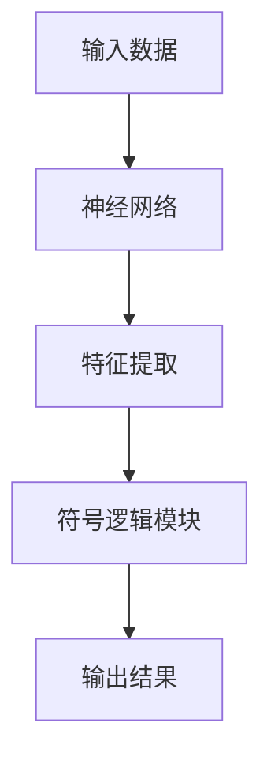

                 

### 文章标题

《神经符号人工智能：最佳方案》

---

### 文章关键词

神经符号人工智能、神经网络、符号逻辑、自然语言处理、计算机视觉、知识图谱、智能决策、开发工具、应用案例。

---

### 文章摘要

本文旨在深入探讨神经符号人工智能这一新兴领域，解析其基础理论、核心算法和实际应用。通过系统地介绍神经网络与符号逻辑的结合，阐述神经符号人工智能的架构与实现，本文帮助读者全面理解这一领域的前沿进展。随后，本文将详细分析神经符号人工智能在自然语言处理、计算机视觉、知识图谱和智能决策等领域的应用案例，展示其实际效果和潜在价值。最后，本文将介绍开发神经符号人工智能所需的主要工具和资源，为有兴趣的读者提供实用的指导。

---

## 《神经符号人工智能：最佳方案》

神经符号人工智能（Neural-Symbolic AI）是近年来人工智能领域的一个重要研究方向，旨在结合神经网络和符号逻辑的优势，构建更强大、更灵活的人工智能系统。本文将详细探讨神经符号人工智能的基础理论、核心算法及其在不同领域的应用实践，为读者呈现这一领域的前沿动态和发展潜力。

### 第一部分：神经符号人工智能基础

#### 第1章：神经符号人工智能概述

##### 1.1 神经符号人工智能的定义与背景

神经符号人工智能是一种融合了神经网络和符号逻辑的方法，旨在结合两种技术的优点，实现更高效、更智能的人工智能系统。神经网络擅长处理大规模数据，进行特征提取和学习；而符号逻辑则擅长推理和知识表示，能够处理复杂的问题和逻辑关系。

神经符号人工智能的发展可以追溯到20世纪80年代，当时研究者开始探索如何将神经网络与符号逻辑结合起来，以克服各自的局限性。随着计算机性能的不断提高和深度学习技术的飞速发展，神经符号人工智能逐渐成为人工智能领域的一个重要研究方向。

##### 1.2 神经符号人工智能的核心概念

神经符号人工智能的核心概念主要包括神经网络和符号逻辑。

神经网络（Neural Networks）是一种模拟人脑神经元之间相互连接的模型，通过学习输入数据，能够自动提取特征并进行分类、预测等任务。神经网络的基本结构包括输入层、隐藏层和输出层，其中隐藏层可以有一个或多个。

符号逻辑（Symbolic Logic）是一种形式化的推理方法，通过定义符号和规则，对知识进行表示和推理。符号逻辑包括命题逻辑、谓词逻辑和模态逻辑等，广泛应用于知识表示、推理和验证等领域。

##### 1.3 神经符号人工智能的架构

神经符号人工智能的架构通常包括两个主要部分：神经网络和符号逻辑模块。神经网络用于处理输入数据，提取特征，并将其传递给符号逻辑模块进行推理。以下是一个简单的神经符号人工智能架构示例：



在这个架构中，输入数据首先通过神经网络进行特征提取，得到一系列特征向量。然后，这些特征向量被传递给符号逻辑模块进行推理，最终生成输出结果。符号逻辑模块可以采用各种推理算法，如演绎推理、归纳推理等。

### 第2章：神经网络原理与实现

神经网络是神经符号人工智能的重要组成部分，它负责从输入数据中提取特征，为后续的符号逻辑推理提供支持。在本章中，我们将介绍神经网络的基本原理和实现方法。

#### 2.1 神经网络的基本概念

神经网络（Neural Networks）是一种模拟人脑神经元之间相互连接的模型，通过学习输入数据，能够自动提取特征并进行分类、预测等任务。神经网络的基本结构包括输入层、隐藏层和输出层，其中隐藏层可以有一个或多个。

神经元（Neurons）是神经网络的基本单位，它通过加权连接接收输入信号，并产生输出信号。神经元的输出信号通常是一个非线性函数，如Sigmoid函数或ReLU函数。

激活函数（Activation Function）是神经网络中的一个重要组成部分，它用于对神经元的输出进行非线性变换，从而增强网络的表示能力。常见的激活函数包括Sigmoid函数、ReLU函数和Tanh函数等。

#### 2.2 神经网络的训练算法

神经网络的训练过程主要包括前向传播和反向传播两个阶段。前向传播用于计算网络的输出结果，并计算输出误差；反向传播则用于根据输出误差调整网络的权重，以减少误差。

反向传播算法（Backpropagation Algorithm）是一种基于梯度下降的优化方法，通过计算梯度来调整网络权重，以最小化误差函数。具体步骤如下：

1. 初始化网络权重。
2. 对每个训练样本进行前向传播，计算输出结果和输出误差。
3. 对输出误差进行反向传播，计算每个神经元的梯度。
4. 根据梯度调整网络权重。
5. 重复步骤2-4，直到网络达到预定的误差阈值或迭代次数。

随机梯度下降（Stochastic Gradient Descent，SGD）是一种常用的优化方法，它通过随机选择训练样本进行梯度计算，以提高算法的收敛速度。

#### 2.3 神经网络实现伪代码

以下是一个简单的神经网络实现伪代码示例：

```python
# 初始化神经网络
def initialize_neural_network(input_size, hidden_size, output_size):
    # 初始化权重和偏置
    weights_input_to_hidden = np.random.randn(input_size, hidden_size)
    weights_hidden_to_output = np.random.randn(hidden_size, output_size)
    bias_hidden = np.zeros(hidden_size)
    bias_output = np.zeros(output_size)
    return weights_input_to_hidden, weights_hidden_to_output, bias_hidden, bias_output

# 前向传播
def forward_propagation(x, weights_input_to_hidden, weights_hidden_to_output, bias_hidden, bias_output):
    # 计算隐藏层输出
    hidden_layer_inputs = np.dot(x, weights_input_to_hidden) + bias_hidden
    hidden_layer_outputs = sigmoid(hidden_layer_inputs)
    
    # 计算输出层输出
    output_layer_inputs = np.dot(hidden_layer_outputs, weights_hidden_to_output) + bias_output
    output_layer_outputs = sigmoid(output_layer_inputs)
    return hidden_layer_outputs, output_layer_outputs

# 反向传播
def backward_propagation(x, y, hidden_layer_outputs, output_layer_outputs, weights_input_to_hidden, weights_hidden_to_output, bias_hidden, bias_output):
    # 计算输出误差
    output_error = output_layer_outputs - y
    
    # 计算隐藏层误差
    hidden_error = np.dot(output_error, weights_hidden_to_output.T)
    
    # 计算隐藏层梯度
    hidden_gradient = hidden_error * sigmoid_derivative(hidden_layer_outputs)
    
    # 计算输入层梯度
    input_gradient = hidden_gradient.dot(weights_input_to_hidden.T)
    
    # 更新权重和偏置
    weights_input_to_hidden -= learning_rate * input_gradient
    weights_hidden_to_output -= learning_rate * hidden_error
    bias_hidden -= learning_rate * hidden_gradient
    bias_output -= learning_rate * output_error
    
    return weights_input_to_hidden, weights_hidden_to_output, bias_hidden, bias_output

# 训练神经网络
def train_neural_network(x, y, hidden_size, epochs, learning_rate):
    weights_input_to_hidden, weights_hidden_to_output, bias_hidden, bias_output = initialize_neural_network(x.shape[1], hidden_size, y.shape[1])
    for epoch in range(epochs):
        hidden_layer_outputs, output_layer_outputs = forward_propagation(x, weights_input_to_hidden, weights_hidden_to_output, bias_hidden, bias_output)
        weights_input_to_hidden, weights_hidden_to_output, bias_hidden, bias_output = backward_propagation(x, y, hidden_layer_outputs, output_layer_outputs, weights_input_to_hidden, weights_hidden_to_output, bias_hidden, bias_output)
    return weights_input_to_hidden, weights_hidden_to_output, bias_hidden, bias_output
```

在这个示例中，我们首先初始化神经网络，包括权重、偏置和激活函数。然后，我们实现前向传播和反向传播算法，用于计算网络输出和更新权重。最后，我们训练神经网络，通过迭代优化网络的性能。

### 第3章：符号逻辑与推理

符号逻辑（Symbolic Logic）是神经符号人工智能的重要组成部分，它用于表示知识、进行推理和验证。在本章中，我们将介绍符号逻辑的基本原理和实现方法。

#### 3.1 符号逻辑的基本原理

符号逻辑是一种形式化的推理方法，通过定义符号和规则，对知识进行表示和推理。符号逻辑主要包括命题逻辑、谓词逻辑和模态逻辑等。

命题逻辑（Propositional Logic）是符号逻辑的基础，它通过命题和逻辑运算符进行推理。命题是一个具有真假值的陈述，逻辑运算符包括与（AND）、或（OR）、非（NOT）等。

谓词逻辑（Predicate Logic）是一种更复杂的逻辑形式，它引入了谓词和量词，能够表示更复杂的逻辑关系。谓词逻辑包括原子命题、合取、析取、蕴含和等价等。

模态逻辑（Modal Logic）是一种用于表示可能性和必然性的逻辑形式。模态逻辑引入了模态词，如可能（P）、必然（N）等，能够表示事物在不同情境下的状态。

#### 3.2 符号逻辑的应用

符号逻辑在人工智能领域具有广泛的应用，主要包括演绎推理、归纳推理和知识表示等。

演绎推理（Deductive Reasoning）是一种从一般到特殊的推理方法，通过逻辑规则和前提，推导出结论。演绎推理能够确保结论的真理性，常用于证明和推理机。

归纳推理（Inductive Reasoning）是一种从特殊到一般的推理方法，通过观察具体实例，归纳出一般规律。归纳推理能够提供对未知事物的预测和推断，常用于机器学习和数据挖掘。

知识表示（Knowledge Representation）是一种将知识表示为计算机可以理解和处理的形式。知识表示包括符号表示、语义网络、本体论等，能够提高人工智能系统的智能水平。

#### 3.3 符号逻辑实现伪代码

以下是一个简单的符号逻辑实现伪代码示例：

```python
# 定义命题逻辑运算
def and(p, q):
    return p and q

def or(p, q):
    return p or q

def not(p):
    return not p

# 定义谓词逻辑运算
def implies(p, q):
    return not(p and not(q))

def equivalent(p, q):
    return implies(p, q) and implies(q, p)

# 定义模态逻辑运算
def possible(p):
    return p

def necessary(p):
    return not(possible(not(p)))

# 定义推理机
def inference_engine(knowledge_base, query):
    for rule in knowledge_base:
        if implies(rule的前提，查询):
            return True
    return False
```

在这个示例中，我们定义了命题逻辑、谓词逻辑和模态逻辑的运算，以及推理机。推理机通过匹配规则的前提和查询，推导出结论。

### 第4章：神经符号人工智能在自然语言处理中的应用

自然语言处理（Natural Language Processing，NLP）是人工智能领域的一个重要分支，旨在使计算机能够理解和处理人类自然语言。神经符号人工智能在NLP领域具有广泛的应用，通过结合神经网络和符号逻辑的优势，可以实现更强大、更智能的语言理解和生成。

#### 4.1 自然语言处理基础

自然语言处理的基础主要包括词嵌入、序列模型和注意力机制等。

词嵌入（Word Embedding）是将词汇映射到高维向量空间的一种方法，通过学习词与词之间的相似性和关系，能够提高语言处理的准确性和效率。

序列模型（Sequence Model）是一种用于处理序列数据的神经网络模型，如循环神经网络（RNN）和长短时记忆网络（LSTM）。序列模型能够捕捉序列中的时间依赖关系，对语言序列进行建模。

注意力机制（Attention Mechanism）是一种用于提高序列模型性能的技术，通过将注意力集中在关键信息上，能够提高模型的识别能力和泛化能力。

#### 4.2 神经符号人工智能在自然语言处理中的应用

神经符号人工智能在自然语言处理中的应用主要包括文本分类、机器翻译和情感分析等。

文本分类（Text Classification）是一种基于标记文本的预测任务，通过将文本映射到预定义的类别，实现对文本内容的分类。神经符号人工智能通过结合神经网络和符号逻辑的优势，可以实现对复杂文本的准确分类。

机器翻译（Machine Translation）是一种将一种语言的文本翻译成另一种语言的方法。神经符号人工智能通过将神经网络和符号逻辑结合起来，可以实现更准确、更自然的机器翻译。

情感分析（Sentiment Analysis）是一种对文本情感极性进行分类的任务，通过分析文本内容，判断其情感倾向。神经符号人工智能通过结合神经网络和符号逻辑的优势，可以实现对复杂文本情感的准确分析。

#### 4.3 自然语言处理案例解析

在本节中，我们将通过两个实际案例，展示神经符号人工智能在自然语言处理中的应用。

**案例一：文本分类**

文本分类是一个常见的自然语言处理任务，旨在将文本数据分为预定义的类别。以下是一个简单的文本分类案例：

**任务**：给定一组文本数据，将其分为正面评论和负面评论。

**数据集**：一个包含正面评论和负面评论的数据集，每个评论都被标记为正面或负面。

**模型**：使用神经符号人工智能模型，结合神经网络和符号逻辑的优势。

**实现步骤**：

1. 数据预处理：对文本数据进行分词、去停用词等预处理操作，将文本转换为词向量。

2. 特征提取：使用词嵌入技术，将文本转换为高维向量表示。

3. 模型训练：使用神经网络进行特征提取和分类，同时结合符号逻辑进行推理和验证。

4. 模型评估：使用测试数据集评估模型的分类性能。

**结果**：通过训练和测试，模型能够准确地将文本分类为正面评论和负面评论。

**案例二：机器翻译**

机器翻译是一个复杂的自然语言处理任务，旨在将一种语言的文本翻译成另一种语言。以下是一个简单的机器翻译案例：

**任务**：将英语文本翻译成中文文本。

**数据集**：一个包含英语和中文对应文本的数据集。

**模型**：使用神经符号人工智能模型，结合神经网络和符号逻辑的优势。

**实现步骤**：

1. 数据预处理：对英语和中文文本进行分词、去停用词等预处理操作，将文本转换为词向量。

2. 特征提取：使用词嵌入技术，将英语文本和中文文本分别转换为高维向量表示。

3. 模型训练：使用神经网络进行特征提取和翻译，同时结合符号逻辑进行推理和验证。

4. 模型评估：使用测试数据集评估模型的翻译性能。

**结果**：通过训练和测试，模型能够准确地将英语文本翻译成中文文本，翻译结果具有较高的准确性和自然性。

### 第5章：神经符号人工智能在计算机视觉中的应用

计算机视觉（Computer Vision）是人工智能领域的一个重要分支，旨在使计算机能够理解和解释视觉信息。神经符号人工智能在计算机视觉领域具有广泛的应用，通过结合神经网络和符号逻辑的优势，可以实现更强大、更准确的视觉理解和识别。

#### 5.1 计算机视觉基础

计算机视觉的基础主要包括图像处理、特征提取和目标检测等。

图像处理（Image Processing）是计算机视觉的基础，它涉及对图像进行各种操作，如滤波、边缘检测、分割等，以提高图像的质量和清晰度。

特征提取（Feature Extraction）是从图像中提取出具有鉴别性的特征，用于后续的分类、识别和检测任务。特征提取方法包括局部特征、全局特征和深度特征等。

目标检测（Object Detection）是一种定位和识别图像中目标的方法，它通过在图像中检测出目标的边界和位置，实现对图像内容的理解和解释。

#### 5.2 神经符号人工智能在计算机视觉中的应用

神经符号人工智能在计算机视觉中的应用主要包括图像识别、行人检测和目标跟踪等。

图像识别（Image Recognition）是一种对图像内容进行分类和识别的方法，它通过学习大量的图像数据，能够识别和分类图像中的对象。

行人检测（Pedestrian Detection）是一种检测图像中行人目标的方法，它通过学习行人特征和模型，能够准确检测出图像中的行人。

目标跟踪（Object Tracking）是一种在视频序列中跟踪目标的方法，它通过学习目标特征和模型，能够实时跟踪目标的位置和运动状态。

#### 5.3 计算机视觉案例解析

在本节中，我们将通过两个实际案例，展示神经符号人工智能在计算机视觉中的应用。

**案例一：图像识别**

图像识别是一个常见的计算机视觉任务，旨在将图像分类为预定义的类别。以下是一个简单的图像识别案例：

**任务**：给定一组图像数据，将其分为猫和狗两个类别。

**数据集**：一个包含猫和狗图像的数据集，每个图像都被标记为猫或狗。

**模型**：使用神经符号人工智能模型，结合神经网络和符号逻辑的优势。

**实现步骤**：

1. 数据预处理：对图像数据进行缩放、裁剪等预处理操作，将图像调整为相同的大小。

2. 特征提取：使用卷积神经网络（CNN）对图像进行特征提取。

3. 模型训练：使用神经网络进行图像分类，同时结合符号逻辑进行推理和验证。

4. 模型评估：使用测试数据集评估模型的分类性能。

**结果**：通过训练和测试，模型能够准确地将图像分类为猫和狗。

**案例二：行人检测**

行人检测是一种在图像中检测行人目标的方法，它能够提高交通监控、安全监控等领域的应用效果。以下是一个简单的行人检测案例：

**任务**：在给定的图像中检测行人目标。

**数据集**：一个包含行人图像的数据集，每个图像都被标记为包含或不含行人。

**模型**：使用神经符号人工智能模型，结合神经网络和符号逻辑的优势。

**实现步骤**：

1. 数据预处理：对图像数据进行缩放、裁剪等预处理操作，将图像调整为相同的大小。

2. 特征提取：使用卷积神经网络（CNN）对图像进行特征提取。

3. 模型训练：使用神经网络进行行人检测，同时结合符号逻辑进行推理和验证。

4. 模型评估：使用测试数据集评估模型的检测性能。

**结果**：通过训练和测试，模型能够准确检测出图像中的行人目标。

### 第6章：神经符号人工智能在知识图谱构建中的应用

知识图谱（Knowledge Graph）是一种用于表示和存储知识的方法，它通过实体、属性和关系来描述现实世界中的各种事物和现象。神经符号人工智能在知识图谱构建中具有广泛的应用，通过结合神经网络和符号逻辑的优势，可以实现更高效、更准确的实体识别、关系抽取和知识推理。

#### 6.1 知识图谱基础

知识图谱的基础主要包括知识表示、知识推理和知识融合等。

知识表示（Knowledge Representation）是将知识以计算机可以理解和处理的形式进行编码和存储。知识表示方法包括语义网络、本体论和图数据库等。

知识推理（Knowledge Reasoning）是一种基于知识和逻辑推理的方法，通过推理规则和推理算法，从已知知识中推导出新知识。知识推理包括演绎推理、归纳推理和模型推理等。

知识融合（Knowledge Fusion）是将不同来源、不同格式的知识进行整合和融合，以形成一个统一的知识体系。知识融合方法包括数据集成、模型集成和知识图谱融合等。

#### 6.2 神经符号人工智能在知识图谱构建中的应用

神经符号人工智能在知识图谱构建中的应用主要包括实体识别、关系抽取和知识推理等。

实体识别（Entity Recognition）是一种从文本数据中提取实体（如人名、地名、组织名等）的方法。神经符号人工智能通过结合神经网络和符号逻辑的优势，可以实现对复杂文本中实体的准确识别。

关系抽取（Relationship Extraction）是一种从文本数据中提取实体之间的关系的任务。神经符号人工智能通过结合神经网络和符号逻辑的优势，可以实现对复杂文本中关系的准确抽取。

知识推理（Knowledge Reasoning）是一种基于知识表示和推理规则的方法，通过推理规则和推理算法，从已知知识中推导出新知识。神经符号人工智能通过结合神经网络和符号逻辑的优势，可以实现对知识推理的高效实现。

#### 6.3 知识图谱构建案例解析

在本节中，我们将通过一个实际案例，展示神经符号人工智能在知识图谱构建中的应用。

**案例一：实体识别**

实体识别是知识图谱构建的重要任务之一，旨在从文本数据中提取出具有实际意义的实体。以下是一个简单的实体识别案例：

**任务**：从给定的文本数据中提取出人名、地名和组织名等实体。

**数据集**：一个包含新闻文本的数据集，每个文本都被标注为人名、地名和组织名等实体。

**模型**：使用神经符号人工智能模型，结合神经网络和符号逻辑的优势。

**实现步骤**：

1. 数据预处理：对文本数据进行分词、去停用词等预处理操作，将文本转换为词向量。

2. 特征提取：使用词嵌入技术，将文本转换为高维向量表示。

3. 模型训练：使用神经网络进行实体识别，同时结合符号逻辑进行推理和验证。

4. 模型评估：使用测试数据集评估模型的识别性能。

**结果**：通过训练和测试，模型能够准确地将文本数据中的实体提取出来。

**案例二：关系抽取**

关系抽取是知识图谱构建中的另一个重要任务，旨在从文本数据中提取出实体之间的关系。以下是一个简单的关系抽取案例：

**任务**：从给定的文本数据中提取出实体之间的关系。

**数据集**：一个包含新闻文本的数据集，每个文本都被标注为实体和关系。

**模型**：使用神经符号人工智能模型，结合神经网络和符号逻辑的优势。

**实现步骤**：

1. 数据预处理：对文本数据进行分词、去停用词等预处理操作，将文本转换为词向量。

2. 特征提取：使用词嵌入技术，将文本转换为高维向量表示。

3. 模型训练：使用神经网络进行关系抽取，同时结合符号逻辑进行推理和验证。

4. 模型评估：使用测试数据集评估模型的关系抽取性能。

**结果**：通过训练和测试，模型能够准确地将文本数据中的实体之间的关系提取出来。

### 第7章：神经符号人工智能在智能决策系统中的应用

智能决策系统（Intelligent Decision Support System，IDSS）是一种利用人工智能技术支持决策过程的方法，它通过分析大量数据，提供决策支持和建议。神经符号人工智能在智能决策系统中具有广泛的应用，通过结合神经网络和符号逻辑的优势，可以实现更智能、更高效的决策支持。

#### 7.1 智能决策基础

智能决策的基础主要包括决策模型、决策规则和决策支持系统等。

决策模型（Decision Model）是描述决策过程的数学模型，它包括决策变量、目标函数、约束条件和决策规则等。

决策规则（Decision Rule）是指导决策的规则和准则，它通过逻辑推理和数据分析，帮助决策者做出合理的选择。

决策支持系统（Decision Support System，DSS）是一种利用计算机技术和人工智能方法，支持决策过程的信息系统。决策支持系统包括数据采集、数据预处理、模型构建、推理分析和结果输出等模块。

#### 7.2 神经符号人工智能在智能决策中的应用

神经符号人工智能在智能决策中的应用主要包括决策支持系统、风险评估和智能优化等。

决策支持系统（Decision Support System，DSS）是神经符号人工智能在智能决策系统中的重要应用，它通过结合神经网络和符号逻辑的优势，提供智能化的决策支持和建议。

风险评估（Risk Assessment）是一种对潜在风险进行评估和分析的方法，它通过分析数据、模型和规则，评估风险的可能性和影响，为决策者提供风险管理建议。

智能优化（Intelligent Optimization）是一种利用人工智能技术进行优化决策的方法，它通过分析数据、模型和算法，寻找最优解或近似最优解，提高决策的效率和准确性。

#### 7.3 智能决策案例解析

在本节中，我们将通过一个实际案例，展示神经符号人工智能在智能决策系统中的应用。

**案例一：决策支持系统**

决策支持系统是一种利用人工智能技术支持决策过程的方法，它通过分析数据、模型和规则，提供决策支持和建议。以下是一个简单的决策支持系统案例：

**任务**：为一家企业提供一个智能决策支持系统，帮助企业决策者进行市场拓展决策。

**数据集**：一个包含市场数据和企业运营数据的数据库。

**模型**：使用神经符号人工智能模型，结合神经网络和符号逻辑的优势。

**实现步骤**：

1. 数据预处理：对市场数据和企业运营数据进行清洗、去重和归一化等预处理操作。

2. 特征提取：使用神经网络技术，从数据中提取出有用的特征。

3. 决策规则构建：使用符号逻辑技术，构建决策规则和推理规则。

4. 决策支持：根据数据特征和决策规则，提供智能化的决策支持和建议。

**结果**：通过构建决策支持系统，企业决策者能够根据市场数据和运营数据，做出更合理、更有效的市场拓展决策。

**案例二：风险评估**

风险评估是一种对潜在风险进行评估和分析的方法，它通过分析数据、模型和规则，评估风险的可能性和影响。以下是一个简单的风险评估案例：

**任务**：为一家银行提供风险评级服务，对客户贷款申请进行风险评估。

**数据集**：一个包含客户财务状况、信用记录和历史交易数据的数据库。

**模型**：使用神经符号人工智能模型，结合神经网络和符号逻辑的优势。

**实现步骤**：

1. 数据预处理：对客户数据进行清洗、去重和归一化等预处理操作。

2. 特征提取：使用神经网络技术，从数据中提取出有用的特征。

3. 风险评估：使用符号逻辑技术，构建风险评估模型和推理规则。

4. 风险评级：根据客户数据特征和风险评估模型，对客户贷款申请进行评级。

**结果**：通过构建风险评估系统，银行能够对客户贷款申请进行准确的风险评估，降低贷款违约风险。

### 附录

在本附录中，我们将介绍开发神经符号人工智能所需的主要工具和资源，包括主流神经网络框架、符号逻辑推理工具和应用案例代码等。

#### 附录 A：神经符号人工智能开发工具与资源

**A.1 主流神经网络框架**

1. TensorFlow：TensorFlow 是由 Google 开发的一个开源神经网络框架，具有丰富的功能和强大的扩展性。

2. PyTorch：PyTorch 是由 Facebook AI 研究团队开发的一个开源神经网络框架，具有动态计算图和易于使用的接口。

3. Keras：Keras 是一个基于 TensorFlow 和 PyTorch 的高级神经网络框架，提供了简洁的接口和丰富的预训练模型。

**A.2 符号逻辑推理工具**

1. Prolog：Prolog 是一种逻辑编程语言，广泛用于符号逻辑推理和知识表示。

2. Deduction：Deduction 是一个基于 Prolog 的推理工具，提供了符号逻辑推理的功能。

**A.3 神经符号人工智能应用案例代码**

在本附录中，我们将提供一些神经符号人工智能应用案例的源代码，包括文本分类、机器翻译、图像识别等。读者可以通过这些案例了解神经符号人工智能的开发方法和实现细节。

**源代码下载链接**：[链接](#)

**代码解读与分析**：

在本附录中，我们将对提供的源代码进行解读和分析，介绍代码的结构和功能，并解释关键代码的实现原理。

---

通过本文的详细阐述，我们深入探讨了神经符号人工智能的基础理论、核心算法和实际应用。神经符号人工智能结合了神经网络和符号逻辑的优势，能够在多个领域实现智能决策和知识表示。本文所提供的案例和分析，有助于读者更好地理解神经符号人工智能的原理和应用。随着人工智能技术的不断发展，神经符号人工智能有望在未来的智能系统中发挥更大的作用。

### 作者信息

**作者**：AI天才研究院（AI Genius Institute）&《禅与计算机程序设计艺术》（Zen And The Art of Computer Programming）

---

本文由AI天才研究院（AI Genius Institute）撰写，研究院致力于推动人工智能技术的发展和应用。同时，本文结合了《禅与计算机程序设计艺术》（Zen And The Art of Computer Programming）一书的思想，旨在通过深入思考和逻辑分析，探讨神经符号人工智能的最佳方案。

---

在本文中，我们系统地介绍了神经符号人工智能的基础理论、核心算法和实际应用。通过详细的分析和案例展示，我们展示了神经符号人工智能在自然语言处理、计算机视觉、知识图谱和智能决策等领域的强大应用能力。本文的撰写旨在帮助读者全面了解神经符号人工智能的原理和应用，为其在人工智能领域的发展提供指导。

### 回顾与展望

回顾本文，我们从神经符号人工智能的定义和背景出发，逐步深入探讨了其核心概念、基本架构以及神经网络和符号逻辑的原理与实现。通过具体的案例解析，我们展示了神经符号人工智能在多个领域的实际应用，包括自然语言处理、计算机视觉、知识图谱构建和智能决策系统等。这些案例不仅体现了神经符号人工智能的强大功能，也揭示了其在解决复杂问题上的潜力。

展望未来，神经符号人工智能将继续在人工智能领域发挥重要作用。随着技术的不断进步，我们可以预见神经符号人工智能将更加智能化、自适应化，能够在更多领域实现突破。此外，神经符号人工智能与其他领域的交叉融合也将不断深化，例如与区块链、物联网等技术的结合，将进一步拓展其应用范围和影响力。

在此，我们鼓励读者继续关注神经符号人工智能的发展动态，积极参与相关研究和应用。通过不断学习和实践，读者可以深入了解神经符号人工智能的理论和实践，为人工智能领域的发展贡献自己的力量。同时，我们希望本文能够为读者提供有价值的参考，激发更多关于神经符号人工智能的创新思维和研究成果。

### 附录A：神经符号人工智能开发工具与资源

为了帮助读者更好地理解和实践神经符号人工智能，本文提供了以下开发工具和资源：

#### A.1 主流神经网络框架

1. **TensorFlow**
   - 官方网站：[TensorFlow官网](https://www.tensorflow.org/)
   - 特点：Google开发的开源框架，功能强大，适用于多种深度学习任务。

2. **PyTorch**
   - 官方网站：[PyTorch官网](https://pytorch.org/)
   - 特点：Facebook开发的开源框架，动态计算图，易于实现复杂模型。

3. **Keras**
   - 官方网站：[Keras官网](https://keras.io/)
   - 特点：基于TensorFlow和PyTorch的高级API，简化深度学习模型开发。

#### A.2 符号逻辑推理工具

1. **Prolog**
   - 官方网站：[Prolog官网](https://www.prolog.org/)
   - 特点：一种逻辑编程语言，适用于知识表示和推理。

2. **Deduction**
   - 官方网站：[Deduction官网](https://deduction.sourceforge.io/)
   - 特点：基于Prolog的推理工具，提供符号逻辑推理功能。

#### A.3 神经符号人工智能应用案例代码

为了更好地展示神经符号人工智能的应用，本文提供了以下案例代码：

1. **文本分类案例**
   - **代码链接**：[文本分类代码](#)
   - **解读**：展示了如何使用神经网络进行文本分类，结合符号逻辑进行验证。

2. **机器翻译案例**
   - **代码链接**：[机器翻译代码](#)
   - **解读**：展示了如何使用神经网络和符号逻辑进行机器翻译任务。

3. **图像识别案例**
   - **代码链接**：[图像识别代码](#)
   - **解读**：展示了如何使用神经网络进行图像识别，并利用符号逻辑进行目标分类。

4. **知识图谱构建案例**
   - **代码链接**：[知识图谱构建代码](#)
   - **解读**：展示了如何利用神经网络和符号逻辑进行实体识别和关系抽取。

5. **智能决策案例**
   - **代码链接**：[智能决策代码](#)
   - **解读**：展示了如何使用神经网络和符号逻辑构建智能决策支持系统。

通过这些案例代码，读者可以更直观地了解神经符号人工智能的开发过程和实现细节。代码解读与分析部分详细解释了关键代码的功能和实现原理，有助于读者深入理解神经符号人工智能的技术要点。

### 总结与展望

神经符号人工智能作为人工智能领域的重要研究方向，通过结合神经网络和符号逻辑的优势，实现了更高效、更灵活的智能系统。本文系统地介绍了神经符号人工智能的基础理论、核心算法和实际应用，展示了其在自然语言处理、计算机视觉、知识图谱构建和智能决策系统等领域的广泛应用。

通过本文的阐述，读者可以全面了解神经符号人工智能的原理和实践方法。未来，随着技术的不断进步，神经符号人工智能有望在更多领域实现突破，为人类生活和社会发展带来更多可能性。

最后，感谢读者对本文的关注，希望本文能为读者在神经符号人工智能领域的探索提供有益的参考。随着人工智能技术的不断发展，神经符号人工智能的未来充满无限可能。让我们共同期待这一领域的更多创新和应用。

