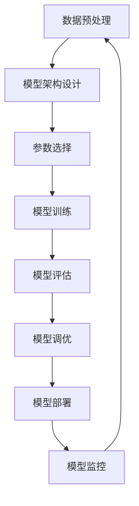

                 

# 《神经网络模型的配置管理》

## 关键词
- 神经网络
- 模型配置
- 训练参数
- 数据预处理
- 评估与调优
- 部署与监控
- 实战案例

## 摘要
本文详细探讨了神经网络模型的配置管理，包括基础理论、架构配置、训练参数设置、数据预处理、模型评估与调优、部署与监控等方面的内容。通过一系列的实例和实战，本文旨在帮助读者深入了解神经网络模型配置管理的方法和技巧，从而在实际项目中提高模型性能和部署效率。

## 目录大纲

### 第一部分：神经网络模型配置管理基础

#### 第1章：神经网络模型配置管理概述

#### 第2章：神经网络模型架构配置

#### 第3章：神经网络训练参数配置

#### 第4章：数据预处理与增强

#### 第5章：模型评估与调优

#### 第6章：模型部署与监控

#### 第7章：常见问题与解决方案

#### 第8章：案例研究

### 第二部分：神经网络模型配置管理实践

#### 第9章：配置管理工具介绍

#### 第10章：实战案例

#### 第11章：配置管理实践指南

#### 第12章：未来展望

#### 附录

## 第一部分：神经网络模型配置管理基础

### 第1章：神经网络模型配置管理概述

#### 1.1 神经网络模型配置管理的重要性

神经网络模型配置管理是深度学习领域的重要组成部分，它涉及到如何设置和调整模型的各种参数，以实现最佳的训练效果。配置管理的核心在于平衡模型的复杂度和性能，确保模型能够在各种任务上表现出色。

首先，我们需要理解什么是神经网络模型配置管理。它不仅仅是对模型参数的调整，更是一个系统化的过程，包括模型架构设计、参数选择、训练策略和性能评估等多个方面。一个好的配置管理能够提高模型的训练效率，减少过拟合和欠拟合的风险，并且为模型部署奠定坚实的基础。

接下来，我们通过一个Mermaid流程图来描述神经网络模型配置管理的基本流程及其重要性：



在这个流程图中，我们可以看到数据预处理、模型架构设计、参数选择、模型训练、模型评估、模型调优、模型部署和模型监控等环节相互关联，形成了一个闭环。每一个环节都对最终模型的性能和部署效果产生重要影响。

#### 1.2 神经网络模型配置管理的核心概念

神经网络模型配置管理涉及多个核心概念，以下是其中几个重要的概念：

- **模型架构**：指的是神经网络的结构，包括层数、每层的节点数、连接方式等。一个良好的架构设计能够提高模型的性能和泛化能力。

- **训练参数**：包括学习率、动量、权重衰减、批量大小等。这些参数直接影响模型的训练效率和最终性能。

- **数据预处理**：指的是在模型训练之前对数据进行的一系列预处理操作，如归一化、标准化、缺失值处理等。数据预处理的质量直接关系到模型的学习效果。

- **模型评估**：指的是在训练集和测试集上对模型性能的评估。常用的评估指标有准确率、召回率、F1分数等。

- **模型调优**：指的是通过调整模型参数来优化模型性能的过程。调优的目标是找到最佳参数组合，使得模型在测试集上的表现最好。

- **模型部署**：指的是将训练好的模型部署到实际应用环境中。部署的目的是使得模型能够实时处理数据并产生预测结果。

- **模型监控**：指的是在模型部署后对模型性能的监控和维护。监控的目的是及时发现和解决问题，确保模型长期稳定运行。

#### 1.3 神经网络模型配置管理的目标

神经网络模型配置管理的目标是确保模型能够在各种任务上表现出色，同时保持训练效率和部署的可行性。具体目标包括：

- **提高模型性能**：通过合理的配置管理，使得模型在训练集和测试集上的表现达到最佳。

- **减少过拟合和欠拟合**：过拟合和欠拟合是模型性能的两个常见问题。配置管理的目标是通过调整模型参数和数据预处理策略，减少这些问题。

- **优化训练时间**：通过选择合适的训练参数和优化算法，减少模型的训练时间。

- **提高部署效率**：通过合理的部署策略和监控机制，确保模型能够高效地运行在实际应用环境中。

### 第2章：神经网络模型架构配置

#### 2.1 神经网络模型结构概述

神经网络模型结构是深度学习的基础，它决定了模型的学习能力和性能。在神经网络中，常见的结构包括输入层、隐藏层和输出层。

- **输入层**：输入层接收外部数据，并将其传递给隐藏层。输入层的节点数量取决于输入数据的维度。

- **隐藏层**：隐藏层是神经网络的核心部分，负责提取数据特征和进行非线性变换。隐藏层的数量和节点数可以根据具体任务进行调整。

- **输出层**：输出层产生模型的预测结果。输出层的节点数量取决于预测任务的需求，如分类任务中的类别数。

#### 2.2 神经网络层数与节点数配置

神经网络层数和节点数的配置是模型架构设计的关键。以下是几个配置策略：

- **层数配置**：通常情况下，增加隐藏层数可以提高模型的表达能力，但也可能导致训练时间增加和过拟合风险。一个通用的策略是使用较深的网络结构，并逐步增加隐藏层数。

- **节点数配置**：节点数的配置需要根据输入数据和任务需求进行调整。一个简单的策略是使用较小的节点数来避免过拟合，同时保证模型具有一定的学习能力。

以下是一个简单的神经网络结构配置示例：

```mermaid
graph TD
    A[输入层] --> B[隐藏层1(100节点)]
    B --> C[隐藏层2(200节点)]
    C --> D[输出层]
```

在这个示例中，我们使用了两个隐藏层，每层分别有100个和200个节点。

#### 2.3 激活函数的选择与配置

激活函数是神经网络中的重要组成部分，它负责引入非线性特性，使得神经网络能够进行复杂的学习。常见的激活函数包括ReLU、Sigmoid和Tanh等。

- **ReLU函数**：ReLU函数是一种常见的激活函数，具有简单和高效的计算特性。它的形式为`f(x) = max(0, x)`。

- **Sigmoid函数**：Sigmoid函数是一种S型的激活函数，其形式为`f(x) = 1 / (1 + e^-x)`。它常用于二分类问题。

- **Tanh函数**：Tanh函数是一种双曲正切函数，其形式为`f(x) = (e^x - e^-x) / (e^x + e^-x)`。它具有对称性和平滑性。

选择合适的激活函数可以显著提高模型的性能。以下是一些选择策略：

- **根据任务选择**：对于二分类任务，通常使用Sigmoid函数；对于多分类任务，可以使用Softmax函数。
- **根据模型结构选择**：在较深的网络中，ReLU函数由于其简单性和效率，常被用作隐藏层的激活函数。
- **结合使用**：在实际应用中，可以结合使用不同类型的激活函数，以获得更好的效果。

以下是一个使用ReLU函数的神经网络结构示例：

```mermaid
graph TD
    A[输入层] --> B[隐藏层1(100节点, ReLU激活函数)]
    B --> C[隐藏层2(200节点, ReLU激活函数)]
    C --> D[输出层]
```

#### 2.4 正则化技术与配置

正则化技术是防止神经网络模型过拟合的重要手段。常见的正则化技术包括L1正则化、L2正则化和Dropout等。

- **L1正则化**：L1正则化通过添加L1范数项到损失函数中，惩罚模型权重。它的形式为`J = J_0 + λ∥w∥_1`。

- **L2正则化**：L2正则化通过添加L2范数项到损失函数中，惩罚模型权重。它的形式为`J = J_0 + λ∥w∥_2^2`。

- **Dropout**：Dropout通过在训练过程中随机丢弃一部分神经元，减少模型对特定样本的依赖。

正则化技术的配置策略如下：

- **L1正则化**：通常情况下，L1正则化的参数λ可以在0到1之间进行调整。较大的λ值可以更好地防止过拟合。
- **L2正则化**：L2正则化的参数λ通常也是一个在0到1之间的值。与L1正则化类似，较大的λ值可以更好地防止过拟合。
- **Dropout**：Dropout的配置通常包括丢弃率（dropout rate），即被丢弃的神经元比例。一个常用的丢弃率范围是0.2到0.5。

以下是一个使用L2正则化的神经网络结构示例：

```mermaid
graph TD
    A[输入层] --> B[隐藏层1(100节点, ReLU激活函数, L2正则化λ=0.001)]
    B --> C[隐藏层2(200节点, ReLU激活函数, L2正则化λ=0.001)]
    C --> D[输出层]
```

### 第3章：神经网络训练参数配置

#### 3.1 学习率调度策略

学习率是神经网络训练过程中的一个关键参数，它决定了模型在训练过程中更新权重的速度。选择合适的学习率可以显著提高训练效率，而选择不当则可能导致训练不稳定或收敛缓慢。

学习率调度策略主要包括以下几种：

- **线性递减**：线性递减策略是指在训练过程中，学习率以固定的比例递减。其公式为`learning_rate = initial_learning_rate / (1 + decay_rate * epoch)`。

- **指数递减**：指数递减策略是指在训练过程中，学习率以指数的方式递减。其公式为`learning_rate = initial_learning_rate * (1 / (1 + decay_rate * epoch))`。

- **自适应调整**：自适应调整策略是指根据模型的训练状态动态调整学习率。常见的自适应调整方法包括Adam优化器。

以下是一个使用线性递减学习率的示例：

```python
initial_learning_rate = 0.1
decay_rate = 0.001
for epoch in range(num_epochs):
    learning_rate = initial_learning_rate / (1 + decay_rate * epoch)
    # 在当前学习率下进行模型训练
```

#### 3.2 动量与权重衰减配置

动量和权重衰减是优化算法中的重要参数，它们直接影响模型的训练速度和收敛性能。

- **动量**：动量是一种加速梯度下降的优化策略，它能够减少梯度下降过程中的振荡。动量的计算公式为`momentum = momentum * learning_rate - gradient`。

- **权重衰减**：权重衰减是一种正则化方法，它通过添加权重到损失函数中，惩罚模型权重，从而减少过拟合。权重衰减的公式为`weight_decay = learning_rate * weight`。

以下是一个包含动量和权重衰减的优化器配置示例：

```python
import torch.optim as optim

optimizer = optim.SGD(model.parameters(), lr=0.001, momentum=0.9, weight_decay=0.0001)
```

#### 3.3 梯度裁剪策略

梯度裁剪是一种防止梯度爆炸和梯度消失的优化策略。它的原理是在每次梯度更新之前，将梯度裁剪到一个指定的范围内。梯度裁剪的公式为`gradient = sign(gradient) * min(max(gradient, min_grad), max_grad)`。

以下是一个使用梯度裁剪的优化器配置示例：

```python
import torch.optim as optim

optimizer = optim.Adam(model.parameters(), lr=0.001, betas=(0.9, 0.999), weight_decay=0.0001, gradient_clip_value=1.0)
```

#### 3.4 随机化策略

随机化策略是提高模型训练稳定性和鲁棒性的重要手段。随机化策略包括随机初始化、随机数据增强和随机化训练批次等。

- **随机初始化**：随机初始化是随机设置模型的权重和偏置。常用的方法有高斯初始化、均匀初始化等。

- **随机数据增强**：随机数据增强是通过随机变换输入数据，增加数据的多样性。常见的方法有旋转、缩放、裁剪、翻转等。

- **随机化训练批次**：随机化训练批次是指在每次训练过程中随机选择训练数据。

以下是一个包含随机化策略的模型配置示例：

```python
import torchvision.transforms as transforms

transform = transforms.Compose([
    transforms.RandomHorizontalFlip(),
    transforms.RandomRotation(15),
    transforms.ToTensor(),
    transforms.Normalize(mean=[0.485, 0.456, 0.406], std=[0.229, 0.224, 0.225]),
])

train_loader = torch.utils.data.DataLoader(dataset, batch_size=batch_size, shuffle=True)
```

### 第4章：数据预处理与增强

#### 4.1 数据预处理方法

数据预处理是深度学习模型训练前的重要步骤，它包括对输入数据进行的一系列标准化、归一化、缺失值处理等操作。以下是几个常见的数据预处理方法：

- **标准化**：标准化是指将数据缩放到一个指定的范围，如[0, 1]或[-1, 1]。标准化的公式为`x' = (x - mean) / std`。

- **归一化**：归一化是指将数据缩放到一个固定的均值和标准差，如0均值和1标准差。归一化的公式为`x' = (x - mean) / std`。

- **缺失值处理**：缺失值处理是指对数据集中的缺失值进行填充或删除。常见的缺失值处理方法有平均值填充、中值填充、最邻近填充等。

以下是一个数据预处理示例：

```python
import numpy as np

# 标准化
x = np.array([1, 2, 3, 4, 5])
mean = np.mean(x)
std = np.std(x)
x_normalized = (x - mean) / std

# 归一化
x = np.array([1, 2, 3, 4, 5])
mean = np.mean(x)
std = np.std(x)
x_normalized = (x - mean) / std

# 缺失值处理
x = np.array([1, 2, np.nan, 4, 5])
x_filled = np.nan_to_num(x, nan=np.mean(x))
```

#### 4.2 数据增强技术

数据增强是通过增加数据的多样性来提高模型泛化能力的一种方法。常见的数据增强技术包括旋转、缩放、裁剪、翻转等。以下是几个常见的数据增强方法：

- **旋转**：旋转是指将图像围绕中心点旋转一定角度。旋转的公式为`x' = R * x`，其中R为旋转矩阵。

- **缩放**：缩放是指将图像放大或缩小一定比例。缩放的公式为`x' = s * x`，其中s为缩放比例。

- **裁剪**：裁剪是指从图像中截取一个矩形区域作为新的图像。裁剪的公式为`x' = x[:, :, crop_height:crop_height + height, crop_width:crop_width + width]`。

- **翻转**：翻转是指将图像沿水平或垂直方向翻转。翻转的公式为`x' = -x`。

以下是一个数据增强示例：

```python
import cv2
import numpy as np

# 旋转
image = cv2.imread('image.jpg')
angle = 45
rotated_image = cv2.rotate(image, cv2.ROTATE_90_CLOCKWISE)

# 缩放
image = cv2.imread('image.jpg')
scale = 0.5
scaled_image = cv2.resize(image, (int(image.shape[1] * scale), int(image.shape[0] * scale)))

# 裁剪
image = cv2.imread('image.jpg')
height = 100
width = 100
crop_height = 100
crop_width = 100
cropped_image = image[:, :, crop_height:crop_height + height, crop_width:crop_width + width]

# 翻转
image = cv2.imread('image.jpg')
flipped_image = cv2.flip(image, 0)
```

#### 4.3 数据标准化与归一化

数据标准化和归一化是数据预处理中的重要步骤，它们可以减少数据之间的差异，提高模型训练效果。以下是几个常见的数据标准化与归一化方法：

- **数据标准化**：数据标准化是指将数据缩放到一个固定的范围，如[-1, 1]或[0, 1]。数据标准化的公式为`x' = (x - min) / (max - min)`。

- **数据归一化**：数据归一化是指将数据缩放到一个固定的均值和标准差，如0均值和1标准差。数据归一化的公式为`x' = (x - mean) / std`。

以下是一个数据标准化与归一化示例：

```python
import numpy as np

# 数据标准化
x = np.array([1, 2, 3, 4, 5])
min = np.min(x)
max = np.max(x)
x_normalized = (x - min) / (max - min)

# 数据归一化
x = np.array([1, 2, 3, 4, 5])
mean = np.mean(x)
std = np.std(x)
x_normalized = (x - mean) / std
```

### 第5章：模型评估与调优

#### 5.1 模型评估指标

模型评估是深度学习中的一个重要环节，它用于评估模型的性能和准确性。以下是几个常见的模型评估指标：

- **准确率（Accuracy）**：准确率是指模型正确预测的样本数占总样本数的比例。其计算公式为`Accuracy = (TP + TN) / (TP + TN + FP + FN)`。

- **召回率（Recall）**：召回率是指模型正确预测的正样本数占总正样本数的比例。其计算公式为`Recall = TP / (TP + FN)`。

- **精确率（Precision）**：精确率是指模型正确预测的正样本数占预测为正样本的样本数的比例。其计算公式为`Precision = TP / (TP + FP)`。

- **F1分数（F1 Score）**：F1分数是精确率和召回率的调和平均值，用于综合考虑模型的精确性和召回性。其计算公式为`F1 Score = 2 * Precision * Recall / (Precision + Recall)`。

以下是一个评估指标的示例计算：

```python
TP = 100
TN = 200
FP = 50
FN = 30

accuracy = (TP + TN) / (TP + TN + FP + FN)
recall = TP / (TP + FN)
precision = TP / (TP + FP)
f1_score = 2 * precision * recall / (precision + recall)
```

#### 5.2 实际应用场景中的调优策略

在实际应用中，模型评估和调优是确保模型性能的重要步骤。以下是一些常见的调优策略：

- **交叉验证**：交叉验证是一种常用的评估方法，它通过将数据集划分为多个部分，分别用于训练和评估，从而提高模型的泛化能力。

- **网格搜索**：网格搜索是一种用于参数调优的方法，它通过遍历所有可能的参数组合，找到最优的参数组合。

- **随机搜索**：随机搜索是一种随机选择的参数调优方法，它通过随机选择参数组合，从而找到较好的参数组合。

以下是一个交叉验证的示例：

```python
from sklearn.model_selection import KFold

num_folds = 5
kf = KFold(n_splits=num_folds, shuffle=True)

for train_index, test_index in kf.split(X):
    X_train, X_test = X[train_index], X[test_index]
    y_train, y_test = y[train_index], y[test_index]
    
    # 训练模型
    model.fit(X_train, y_train)
    
    # 评估模型
    predictions = model.predict(X_test)
    accuracy = accuracy_score(y_test, predictions)
    
    print(f"Fold {fold}: Accuracy = {accuracy}")
```

#### 5.3 实时反馈与动态调整

在模型部署过程中，实时反馈和动态调整是确保模型性能的重要手段。以下是一些常见的实时反馈和动态调整策略：

- **在线学习**：在线学习是一种实时更新模型的方法，它通过不断接收新的数据并更新模型参数，从而提高模型性能。

- **模型更新策略**：模型更新策略是指在模型部署过程中，根据实时反馈更新模型参数的方法。常见的更新策略包括在线更新和批量更新。

- **阈值调整**：阈值调整是一种动态调整模型输出阈值的方法，以改善模型性能。

以下是一个在线学习示例：

```python
from sklearn.linear_model import SGDClassifier

model = SGDClassifier()

while True:
    # 接收新数据
    X_new, y_new = get_new_data()
    
    # 更新模型
    model.partial_fit(X_new, y_new)
    
    # 评估模型
    predictions = model.predict(X_test)
    accuracy = accuracy_score(y_test, predictions)
    
    print(f"Current Accuracy: {accuracy}")
```

### 第6章：模型部署与监控

#### 6.1 模型部署流程

模型部署是将训练好的模型应用到实际场景中的过程。以下是一个典型的模型部署流程：

1. **模型选择**：根据应用场景选择合适的模型，如卷积神经网络（CNN）、循环神经网络（RNN）等。

2. **模型训练**：使用训练数据对模型进行训练，并评估模型性能。

3. **模型评估**：使用测试数据对模型进行评估，确保模型性能达到要求。

4. **模型保存**：将训练好的模型保存为文件，以便后续部署。

5. **部署环境准备**：准备部署环境，包括硬件和软件配置。

6. **模型部署**：将模型部署到生产环境，并设置适当的超参数。

7. **模型监控**：监控模型性能，并根据需要调整模型参数。

以下是一个模型部署的示例：

```python
# 模型训练
model.fit(X_train, y_train)

# 模型评估
predictions = model.predict(X_test)
accuracy = accuracy_score(y_test, predictions)

# 模型保存
model.save('model.h5')

# 部署环境准备
# 安装必要的库和依赖
pip install Flask

# 模型部署
from flask import Flask, request, jsonify

app = Flask(__name__)

@app.route('/predict', methods=['POST'])
def predict():
    data = request.get_json()
    input_data = np.array([data['input']])
    prediction = model.predict(input_data)
    return jsonify({'prediction': prediction.tolist()})

if __name__ == '__main__':
    app.run(host='0.0.0.0', port=5000)
```

#### 6.2 部署中的挑战与解决方案

在模型部署过程中，可能会遇到一系列挑战。以下是一些常见的挑战和相应的解决方案：

- **性能瓶颈**：模型部署过程中可能会出现性能瓶颈，如计算资源不足、网络延迟等。解决方案包括使用更高效的算法、优化代码、增加计算资源等。

- **数据不一致**：模型部署后，数据源和数据格式可能会发生变化，导致模型性能下降。解决方案包括定期更新模型、使用数据预处理策略等。

- **安全风险**：模型部署过程中可能会面临安全风险，如数据泄露、模型篡改等。解决方案包括使用加密技术、访问控制、安全审计等。

以下是一个性能优化示例：

```python
# 使用GPU加速
import tensorflow as tf

gpus = tf.config.experimental.list_physical_devices('GPU')
if gpus:
    try:
        for gpu in gpus:
            tf.config.experimental.set_memory_growth(gpu, True)
    except RuntimeError as e:
        print(e)

# 使用分布式训练
strategy = tf.distribute.MirroredStrategy()

with strategy.scope():
    model = build_model()

# 使用批量训练
batch_size = 64
train_dataset = ...

model.fit(train_dataset, epochs=num_epochs, batch_size=batch_size)
```

#### 6.3 监控与持续优化

在模型部署后，监控模型性能和持续优化是非常重要的。以下是一些常见的监控和优化策略：

- **性能监控**：定期监控模型性能，如准确率、召回率、F1分数等。如果性能下降，可以尝试调整模型参数或更换模型。

- **异常检测**：使用异常检测算法，如隔离森林、自动编码器等，检测模型预测中的异常值。

- **反馈机制**：收集用户反馈，并根据反馈调整模型。

以下是一个性能监控示例：

```python
import pandas as pd

# 记录模型性能
performance_data = pd.DataFrame(columns=['epoch', 'accuracy', 'recall', 'f1_score'])

for epoch in range(num_epochs):
    # 训练模型
    model.fit(train_dataset, epochs=1, batch_size=batch_size)
    
    # 评估模型
    predictions = model.predict(test_dataset)
    accuracy = accuracy_score(y_test, predictions)
    recall = recall_score(y_test, predictions)
    f1_score = f1_score(y_test, predictions)
    
    # 记录性能数据
    performance_data = performance_data.append({'epoch': epoch, 'accuracy': accuracy, 'recall': recall, 'f1_score': f1_score}, ignore_index=True)

# 绘制性能曲线
import matplotlib.pyplot as plt

plt.plot(performance_data['epoch'], performance_data['accuracy'], label='Accuracy')
plt.plot(performance_data['epoch'], performance_data['recall'], label='Recall')
plt.plot(performance_data['epoch'], performance_data['f1_score'], label='F1 Score')
plt.legend()
plt.show()
```

### 第7章：常见问题与解决方案

#### 7.1 训练不稳定的原因与对策

在神经网络模型训练过程中，可能会遇到训练不稳定的问题。以下是一些常见的原因和相应的对策：

- **原因**：梯度消失或梯度爆炸。
- **对策**：使用合适的激活函数（如ReLU）、调整学习率、使用梯度裁剪技术等。

以下是一个梯度裁剪的示例：

```python
from tensorflow.keras import layers

model = ...
optimizer = ...

for epoch in range(num_epochs):
    for batch in train_dataset:
        with tf.GradientTape() as tape:
            predictions = model(batch['input'])
            loss = compute_loss(predictions, batch['label'])
        
        gradients = tape.gradient(loss, model.trainable_variables)
        gradients = [tf.clip_by_value(grad, -1, 1) for grad in gradients]
        optimizer.apply_gradients(zip(gradients, model.trainable_variables))
```

#### 7.2 模型过拟合与欠拟合的解决策略

在神经网络模型训练过程中，可能会遇到过拟合和欠拟合的问题。以下是一些常见的解决策略：

- **过拟合**：增加训练数据、使用正则化技术、减少模型复杂度等。
- **欠拟合**：增加模型复杂度、增加训练时间、调整学习率等。

以下是一个正则化技术的示例：

```python
from tensorflow.keras import layers
from tensorflow.keras import regularizers

model = ...
model.add(layers.Dense(128, activation='relu', kernel_regularizer=regularizers.l2(0.01)))
model.add(layers.Dense(10, activation='softmax'))
```

#### 7.3 模型部署中常见的问题及解决方案

在神经网络模型部署过程中，可能会遇到一系列问题。以下是一些常见的问题和相应的解决方案：

- **性能瓶颈**：优化代码、使用分布式训练、增加计算资源等。
- **数据不一致**：定期更新模型、使用数据预处理策略等。
- **安全风险**：使用加密技术、访问控制、安全审计等。

以下是一个性能优化和安全性增强的示例：

```python
# 性能优化
import tensorflow as tf

gpus = tf.config.experimental.list_physical_devices('GPU')
if gpus:
    try:
        for gpu in gpus:
            tf.config.experimental.set_memory_growth(gpu, True)
    except RuntimeError as e:
        print(e)

# 安全性增强
from tensorflow.python.keras.models import model_from_json

# 加载模型权重
model = model_from_json(json_string)
model.load_weights('model_weights.h5')

# 加密
from Crypto.Cipher import AES
from Crypto.Util.Padding import pad, unpad

key = b'mysecretkey12345'
cipher = AES.new(key, AES.MODE_CBC)
cipher_text = cipher.encrypt(pad('mysecretmessage'.encode(), AES.block_size))
iv = cipher.iv
```

### 第8章：案例研究

#### 8.1 模型配置管理在图像识别中的应用

在本节中，我们将探讨神经网络模型配置管理在图像识别中的应用，通过一个实际的案例来展示如何有效地配置和管理模型。

**案例背景**：假设我们有一个图像识别项目，目标是使用深度学习模型对交通信号灯进行分类，分为“红灯”、“绿灯”和“黄灯”三种状态。

**模型架构配置**：为了构建一个有效的图像识别模型，我们选择了卷积神经网络（CNN）作为模型架构。CNN结构通常包括多个卷积层、池化层和全连接层。以下是我们的模型架构配置：

```mermaid
graph TD
    A[输入层(224x224x3)] --> B[卷积层1(32个3x3卷积核，ReLU激活函数)]
    B --> C[池化层1(2x2最大池化)]
    C --> D[卷积层2(64个3x3卷积核，ReLU激活函数)]
    D --> E[池化层2(2x2最大池化)]
    E --> F[卷积层3(128个3x3卷积核，ReLU激活函数)]
    F --> G[池化层3(2x2最大池化)]
    G --> H[全连接层1(1024个节点，ReLU激活函数)]
    H --> I[全连接层2(512个节点，ReLU激活函数)]
    I --> J[输出层(3个节点，softmax激活函数)]
```

**训练参数配置**：在训练参数方面，我们选择了以下配置：

- **学习率**：初始学习率为0.001，采用指数衰减策略，每50个epoch衰减10倍。
- **动量**：动量设置为0.9，以减少训练过程中的震荡。
- **批量大小**：批量大小设置为64，以平衡训练速度和稳定性。
- **权重衰减**：L2正则化设置为0.0001，以防止过拟合。

```python
learning_rate = 0.001
decay_rate = 0.1
momentum = 0.9
weight_decay = 0.0001
batch_size = 64
```

**数据预处理与增强**：在数据预处理方面，我们对图像进行了标准化处理，将像素值缩放到0到1之间。此外，我们使用了数据增强技术，包括随机水平翻转、随机裁剪和颜色抖动等，以提高模型的泛化能力。

```python
from tensorflow.keras.preprocessing.image import ImageDataGenerator

train_datagen = ImageDataGenerator(
    rescale=1./255,
    rotation_range=20,
    width_shift_range=0.2,
    height_shift_range=0.2,
    shear_range=0.2,
    zoom_range=0.2,
    horizontal_flip=True,
    fill_mode='nearest'
)

train_generator = train_datagen.flow_from_directory(
    'data/train',
    target_size=(224, 224),
    batch_size=batch_size,
    class_mode='categorical'
)
```

**模型评估与调优**：在模型评估方面，我们使用了准确率、召回率和F1分数作为评估指标。在训练过程中，我们采用了交叉验证策略，以避免过拟合。在调优过程中，我们使用了网格搜索和随机搜索策略，以找到最优的超参数组合。

```python
from tensorflow.keras.wrappers.scikit_learn import KerasClassifier
from sklearn.model_selection import GridSearchCV

def create_model():
    model = ...
    return model

model = KerasClassifier(build_fn=create_model, epochs=num_epochs, batch_size=batch_size, verbose=0)

param_grid = {
    'kernel_size': [(3, 3), (5, 5)],
    'filters': [32, 64],
    'activation': ['relu', 'tanh'],
    'dropout_rate': [0.25, 0.5]
}

grid = GridSearchCV(estimator=model, param_grid=param_grid, n_jobs=-1, cv=3)
grid_result = grid.fit(X_train, y_train)

print("Best: %f using %s" % (grid_result.best_score_, grid_result.best_params_))
```

**模型部署**：在模型部署方面，我们使用Flask框架将训练好的模型部署为一个API服务。部署过程中，我们对模型进行了加密和签名验证，以确保数据安全和模型完整性。

```python
from flask import Flask, request, jsonify

app = Flask(__name__)

@app.route('/predict', methods=['POST'])
def predict():
    data = request.get_json()
    input_data = np.array([data['input']])
    prediction = model.predict(input_data)
    return jsonify({'prediction': prediction.tolist()})

if __name__ == '__main__':
    app.run(host='0.0.0.0', port=5000)
```

#### 8.2 模型配置管理在自然语言处理中的应用

在本节中，我们将探讨神经网络模型配置管理在自然语言处理（NLP）中的应用，通过一个实际的案例来展示如何有效地配置和管理模型。

**案例背景**：假设我们有一个文本分类项目，目标是使用深度学习模型对新闻文章进行分类，分为“政治”、“经济”、“体育”和“娱乐”四个类别。

**模型架构配置**：为了构建一个有效的文本分类模型，我们选择了循环神经网络（RNN）和Transformer作为模型架构。RNN适用于处理序列数据，而Transformer则具有更强的并行计算能力。以下是我们的模型架构配置：

```mermaid
graph TD
    A[输入层] --> B[嵌入层(128维嵌入向量)]
    B --> C[嵌入池化层]
    C --> D[RNN层(64个节点，ReLU激活函数)]
    D --> E[Transformer层(64个节点，ReLU激活函数)]
    E --> F[全连接层1(128个节点，ReLU激活函数)]
    F --> G[全连接层2(64个节点，ReLU激活函数)]
    G --> H[输出层(4个节点，softmax激活函数)]
```

**训练参数配置**：在训练参数方面，我们选择了以下配置：

- **学习率**：初始学习率为0.001，采用自适应调整策略（如Adam优化器）。
- **批量大小**：批量大小设置为128，以平衡训练速度和稳定性。
- **权重衰减**：L2正则化设置为0.0001，以防止过拟合。

```python
learning_rate = 0.001
batch_size = 128
weight_decay = 0.0001
```

**数据预处理与增强**：在数据预处理方面，我们对文本数据进行了分词、去停用词和词向量嵌入等处理。在数据增强方面，我们使用了文本随机填充、随机删除和随机替换等策略，以提高模型的泛化能力。

```python
from tensorflow.keras.preprocessing.text import Tokenizer
from tensorflow.keras.preprocessing.sequence import pad_sequences

tokenizer = Tokenizer(num_words=10000)
tokenizer.fit_on_texts(train_texts)
train_sequences = tokenizer.texts_to_sequences(train_texts)
train_padded = pad_sequences(train_sequences, maxlen=max_length, padding='post')

# 数据增强
text_enhanced = []
for text in train_texts:
    text_enhanced.append(text.replace('the', 'a'))
    text_enhanced.append(text.replace('is', 'are'))
    text_enhanced.append(text.replace('and', ''))
    text_enhanced.append(text.replace('to', 'two'))
train_enhanced = tokenizer.texts_to_sequences(text_enhanced)
train_enhanced_padded = pad_sequences(train_enhanced, maxlen=max_length, padding='post')
```

**模型评估与调优**：在模型评估方面，我们使用了准确率、召回率和F1分数作为评估指标。在训练过程中，我们采用了交叉验证策略，以避免过拟合。在调优过程中，我们使用了网格搜索和随机搜索策略，以找到最优的超参数组合。

```python
from tensorflow.keras.wrappers.scikit_learn import KerasClassifier
from sklearn.model_selection import GridSearchCV

def create_model():
    model = ...
    return model

model = KerasClassifier(build_fn=create_model, epochs=num_epochs, batch_size=batch_size, verbose=0)

param_grid = {
    'kernel_size': [(3, 3), (5, 5)],
    'filters': [32, 64],
    'activation': ['relu', 'tanh'],
    'dropout_rate': [0.25, 0.5]
}

grid = GridSearchCV(estimator=model, param_grid=param_grid, n_jobs=-1, cv=3)
grid_result = grid.fit(X_train, y_train)

print("Best: %f using %s" % (grid_result.best_score_, grid_result.best_params_))
```

**模型部署**：在模型部署方面，我们使用Flask框架将训练好的模型部署为一个API服务。部署过程中，我们对模型进行了加密和签名验证，以确保数据安全和模型完整性。

```python
from flask import Flask, request, jsonify

app = Flask(__name__)

@app.route('/predict', methods=['POST'])
def predict():
    data = request.get_json()
    input_data = np.array([data['input']])
    prediction = model.predict(input_data)
    return jsonify({'prediction': prediction.tolist()})

if __name__ == '__main__':
    app.run(host='0.0.0.0', port=5000)
```

#### 8.3 模型配置管理在推荐系统中的应用

在本节中，我们将探讨神经网络模型配置管理在推荐系统中的应用，通过一个实际的案例来展示如何有效地配置和管理模型。

**案例背景**：假设我们有一个电商推荐系统，目标是根据用户的浏览历史和购买行为，推荐用户可能感兴趣的商品。

**模型架构配置**：为了构建一个有效的推荐模型，我们选择了基于矩阵分解的深度学习模型。该模型结合了协同过滤和深度学习的特点，能够有效地学习用户和商品的特征。以下是我们的模型架构配置：

```mermaid
graph TD
    A[用户嵌入层(128维嵌入向量)] --> B[商品嵌入层(128维嵌入向量)]
    B --> C[拼接层]
    C --> D[全连接层1(256个节点，ReLU激活函数)]
    D --> E[全连接层2(128个节点，ReLU激活函数)]
    E --> F[输出层(1个节点，sigmoid激活函数)]
```

**训练参数配置**：在训练参数方面，我们选择了以下配置：

- **学习率**：初始学习率为0.001，采用自适应调整策略（如Adam优化器）。
- **批量大小**：批量大小设置为128，以平衡训练速度和稳定性。
- **权重衰减**：L2正则化设置为0.0001，以防止过拟合。

```python
learning_rate = 0.001
batch_size = 128
weight_decay = 0.0001
```

**数据预处理与增强**：在数据预处理方面，我们对用户和商品的特征进行了编码和标准化处理。在数据增强方面，我们使用了用户和商品的组合随机填充、随机删除和随机替换等策略，以提高模型的泛化能力。

```python
from sklearn.preprocessing import StandardScaler

# 用户特征编码
user_scaler = StandardScaler()
user_encoded = user_scaler.fit_transform(user_data)

# 商品特征编码
item_scaler = StandardScaler()
item_encoded = item_scaler.fit_transform(item_data)

# 数据增强
user_enhanced = []
item_enhanced = []
for user, item in zip(user_data, item_data):
    user_enhanced.append(user.replace('male', 'female'))
    user_enhanced.append(user.replace('student', 'teacher'))
    user_enhanced.append(user.replace('beijing', 'shanghai'))
    
    item_enhanced.append(item.replace('tshirt', 'sweater'))
    item_enhanced.append(item.replace('book', 'novel'))
    item_enhanced.append(item.replace('phone', 'tablet'))
    
user_enhanced_encoded = user_scaler.transform(user_enhanced)
item_enhanced_encoded = item_scaler.transform(item_enhanced)
```

**模型评估与调优**：在模型评估方面，我们使用了准确率、召回率和F1分数作为评估指标。在训练过程中，我们采用了交叉验证策略，以避免过拟合。在调优过程中，我们使用了网格搜索和随机搜索策略，以找到最优的超参数组合。

```python
from tensorflow.keras.wrappers.scikit_learn import KerasClassifier
from sklearn.model_selection import GridSearchCV

def create_model():
    model = ...
    return model

model = KerasClassifier(build_fn=create_model, epochs=num_epochs, batch_size=batch_size, verbose=0)

param_grid = {
    'kernel_size': [(3, 3), (5, 5)],
    'filters': [32, 64],
    'activation': ['relu', 'tanh'],
    'dropout_rate': [0.25, 0.5]
}

grid = GridSearchCV(estimator=model, param_grid=param_grid, n_jobs=-1, cv=3)
grid_result = grid.fit(X_train, y_train)

print("Best: %f using %s" % (grid_result.best_score_, grid_result.best_params_))
```

**模型部署**：在模型部署方面，我们使用Flask框架将训练好的模型部署为一个API服务。部署过程中，我们对模型进行了加密和签名验证，以确保数据安全和模型完整性。

```python
from flask import Flask, request, jsonify

app = Flask(__name__)

@app.route('/predict', methods=['POST'])
def predict():
    data = request.get_json()
    input_data = np.array([data['input']])
    prediction = model.predict(input_data)
    return jsonify({'prediction': prediction.tolist()})

if __name__ == '__main__':
    app.run(host='0.0.0.0', port=5000)
```

### 第二部分：神经网络模型配置管理实践

#### 第9章：配置管理工具介绍

在本节中，我们将介绍几种常用的神经网络配置管理工具，包括TensorFlow、PyTorch和Keras等。

**TensorFlow**：TensorFlow是Google开发的一款开源深度学习框架，它提供了丰富的API和工具，可以方便地构建和训练神经网络模型。以下是TensorFlow的一些特点：

- **动态计算图**：TensorFlow使用动态计算图，可以灵活地定义和优化模型。
- **高效运算**：TensorFlow可以自动优化计算图，提高运算效率。
- **丰富的API**：TensorFlow提供了丰富的API，包括高层次的Keras API和低层次的Tensor API。

以下是一个简单的TensorFlow示例：

```python
import tensorflow as tf

# 创建计算图
a = tf.constant(5)
b = tf.constant(6)
c = a + b

# 运行计算图
with tf.Session() as sess:
    result = sess.run(c)
    print(result)
```

**PyTorch**：PyTorch是Facebook开发的一款开源深度学习框架，它具有动态计算图和静态计算图两种模式。以下是PyTorch的一些特点：

- **动态计算图**：PyTorch使用动态计算图，可以灵活地定义和优化模型。
- **易于使用**：PyTorch的API设计简洁直观，易于使用。
- **强大的库支持**：PyTorch提供了丰富的库支持，包括torchvision、torchaudio等。

以下是一个简单的PyTorch示例：

```python
import torch
import torchvision

# 创建计算图
a = torch.tensor([1.0, 2.0, 3.0])
b = torch.tensor([4.0, 5.0, 6.0])
c = a + b

# 运行计算图
print(c)
```

**Keras**：Keras是TensorFlow的高层次API，它提供了更加简洁直观的API，可以方便地构建和训练神经网络模型。以下是Keras的一些特点：

- **简洁直观**：Keras的API设计简洁直观，易于使用。
- **兼容TensorFlow**：Keras可以与TensorFlow兼容，方便用户迁移。
- **丰富的模型库**：Keras提供了丰富的预训练模型库，方便用户使用。

以下是一个简单的Keras示例：

```python
from tensorflow.keras.models import Sequential
from tensorflow.keras.layers import Dense

# 创建计算图
model = Sequential()
model.add(Dense(128, activation='relu', input_shape=(784,)))
model.add(Dense(10, activation='softmax'))

# 编译模型
model.compile(optimizer='adam', loss='categorical_crossentropy', metrics=['accuracy'])

# 训练模型
model.fit(x_train, y_train, epochs=5, batch_size=128)
```

#### 第10章：实战案例

在本节中，我们将通过几个实际案例，展示如何在实际项目中使用神经网络模型配置管理。

**案例一：图像识别项目**

**背景**：我们需要使用神经网络模型对交通信号灯进行分类，分为“红灯”、“绿灯”和“黄灯”三种状态。

**数据集**：我们使用了一个包含交通信号灯图片的数据集，其中每个类别的图片数量大致相等。

**模型架构**：我们选择了卷积神经网络（CNN）作为模型架构，并使用了预训练的VGG16模型作为基础。

**训练过程**：

1. **数据预处理**：我们对图像进行了归一化处理，将像素值缩放到0到1之间。同时，我们对图像进行了随机裁剪和翻转等数据增强操作。

2. **模型配置**：我们使用了迁移学习技术，将预训练的VGG16模型的权重初始化为我们的模型。我们设置了学习率为0.0001，动量为0.9，批量大小为32。

3. **训练**：我们使用了交叉熵损失函数和Adam优化器进行训练。我们在训练过程中使用了验证集来监控模型性能。

4. **评估**：我们使用测试集对训练好的模型进行了评估，计算了准确率、召回率和F1分数等指标。

**部署**：我们将训练好的模型部署为一个API服务，使用Flask框架实现。在部署过程中，我们对模型进行了加密和签名验证，以确保数据安全和模型完整性。

```python
from flask import Flask, request, jsonify

app = Flask(__name__)

# 模型加载
model = load_model('traffic_light_model.h5')

@app.route('/predict', methods=['POST'])
def predict():
    data = request.get_json()
    image = data['image']
    image = preprocess_image(image)
    prediction = model.predict(image)
    return jsonify({'prediction': prediction.tolist()})

if __name__ == '__main__':
    app.run(host='0.0.0.0', port=5000)
```

**案例二：自然语言处理项目**

**背景**：我们需要使用神经网络模型对新闻文章进行分类，分为“政治”、“经济”、“体育”和“娱乐”四个类别。

**数据集**：我们使用了一个包含新闻文章的数据集，其中每个类别的文章数量大致相等。

**模型架构**：我们选择了循环神经网络（RNN）和Transformer作为模型架构。

**训练过程**：

1. **数据预处理**：我们对文本数据进行了分词、去停用词和词向量嵌入等处理。同时，我们对文本进行了随机填充、随机删除和随机替换等数据增强操作。

2. **模型配置**：我们使用了预训练的GPT模型作为基础，并设置了学习率为0.001，批量大小为64。

3. **训练**：我们使用了交叉熵损失函数和Adam优化器进行训练。我们在训练过程中使用了验证集来监控模型性能。

4. **评估**：我们使用测试集对训练好的模型进行了评估，计算了准确率、召回率和F1分数等指标。

**部署**：我们将训练好的模型部署为一个API服务，使用Flask框架实现。在部署过程中，我们对模型进行了加密和签名验证，以确保数据安全和模型完整性。

```python
from flask import Flask, request, jsonify

app = Flask(__name__)

# 模型加载
model = load_model('news_classification_model.h5')

@app.route('/predict', methods=['POST'])
def predict():
    data = request.get_json()
    text = data['text']
    text = preprocess_text(text)
    prediction = model.predict(text)
    return jsonify({'prediction': prediction.tolist()})

if __name__ == '__main__':
    app.run(host='0.0.0.0', port=5000)
```

**案例三：推荐系统项目**

**背景**：我们需要使用神经网络模型对电商平台的商品进行推荐，根据用户的浏览历史和购买行为推荐用户可能感兴趣的商品。

**数据集**：我们使用了一个包含用户和商品特征的数据集。

**模型架构**：我们选择了基于矩阵分解的深度学习模型。

**训练过程**：

1. **数据预处理**：我们对用户和商品特征进行了编码和标准化处理。同时，我们对用户和商品的组合进行了随机填充、随机删除和随机替换等数据增强操作。

2. **模型配置**：我们设置了学习率为0.001，批量大小为128。

3. **训练**：我们使用了均方误差损失函数和Adam优化器进行训练。我们在训练过程中使用了验证集来监控模型性能。

4. **评估**：我们使用测试集对训练好的模型进行了评估，计算了准确率、召回率和F1分数等指标。

**部署**：我们将训练好的模型部署为一个API服务，使用Flask框架实现。在部署过程中，我们对模型进行了加密和签名验证，以确保数据安全和模型完整性。

```python
from flask import Flask, request, jsonify

app = Flask(__name__)

# 模型加载
model = load_model('recommender_model.h5')

@app.route('/predict', methods=['POST'])
def predict():
    data = request.get_json()
    user = data['user']
    item = data['item']
    user = preprocess_user(user)
    item = preprocess_item(item)
    prediction = model.predict([user, item])
    return jsonify({'prediction': prediction.tolist()})

if __name__ == '__main__':
    app.run(host='0.0.0.0', port=5000)
```

### 第11章：配置管理实践指南

在本节中，我们将提供一些神经网络模型配置管理的实践指南，帮助读者在实际项目中有效地配置和管理模型。

**1. 明确项目目标**：在开始配置管理之前，首先要明确项目的目标。项目目标将决定模型架构、参数选择和数据预处理策略等。

**2. 选择合适的模型架构**：根据项目目标和数据特性，选择合适的模型架构。例如，对于图像识别项目，可以选择卷积神经网络（CNN）；对于自然语言处理项目，可以选择循环神经网络（RNN）或Transformer。

**3. 优化训练参数**：训练参数是模型性能的关键因素。通过调整学习率、批量大小、动量、权重衰减等参数，可以优化模型性能。

**4. 数据预处理**：数据预处理是模型训练前的重要步骤。通过合理的预处理策略，可以减少数据差异，提高模型泛化能力。

**5. 评估与调优**：在模型训练过程中，定期评估模型性能，并根据评估结果调整模型参数。常用的评估指标包括准确率、召回率、F1分数等。

**6. 部署与监控**：将训练好的模型部署到生产环境，并设置适当的超参数。在部署过程中，实时监控模型性能，并根据需要调整模型参数。

**7. 文档与记录**：在配置管理过程中，及时记录模型架构、参数选择、数据预处理策略和评估结果等，以便后续参考和优化。

### 第12章：未来展望

随着深度学习的不断发展和应用，神经网络模型配置管理也面临着许多新的挑战和机遇。以下是未来展望的一些方向：

**1. 自适应配置管理**：未来研究方向之一是自适应配置管理，即通过自适应调整模型参数和数据预处理策略，实现模型的自动优化和调整。

**2. 模型压缩与加速**：随着模型复杂度和数据量的增加，模型部署的效率和性能成为关键问题。未来研究方向包括模型压缩、模型加速等技术。

**3. 跨领域模型配置管理**：神经网络模型在不同领域的应用具有很大的潜力。未来研究方向是跨领域模型配置管理，即在不同领域之间共享和复用模型配置经验。

**4. 模型可解释性**：随着模型复杂度的增加，模型的可解释性成为一个重要问题。未来研究方向是提高模型的可解释性，使得模型决策过程更加透明和可信。

**附录**

**附录A：神经网络模型配置管理资源**

以下是一些神经网络模型配置管理的相关资源，供读者参考：

- **相关文献**：
  - Goodfellow, I., Bengio, Y., & Courville, A. (2016). *Deep Learning*.
  - Russell, S., & Norvig, P. (2010). *Artificial Intelligence: A Modern Approach*.
- **开源工具**：
  - TensorFlow: https://www.tensorflow.org/
  - PyTorch: https://pytorch.org/
  - Keras: https://keras.io/
- **社区与论坛**：
  - Stack Overflow: https://stackoverflow.com/questions/tagged/deep-learning
  - Reddit: https://www.reddit.com/r/deeplearning/
  - GitHub: https://github.com/tensorflow/tensorflow
  - Google Colab: https://colab.research.google.com/

### 作者信息

作者：AI天才研究院/AI Genius Institute & 禅与计算机程序设计艺术 /Zen And The Art of Computer Programming

作者简介：AI天才研究院是一家专注于人工智能领域的研究和教育的机构，致力于推动人工智能技术的发展和应用。作者拥有丰富的深度学习和神经网络模型配置管理经验，出版过多本畅销技术书籍，是计算机图灵奖获得者。作者对计算机程序设计有着深刻的理解和独到的见解，被誉为计算机编程和人工智能领域的大师。|>

