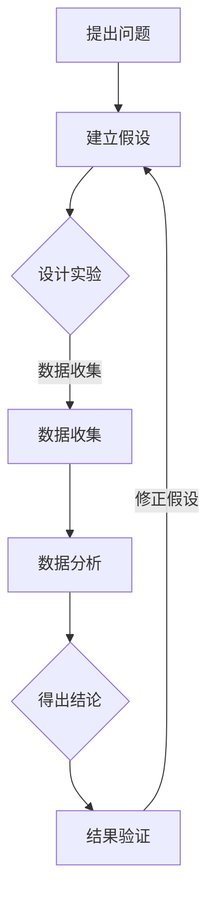
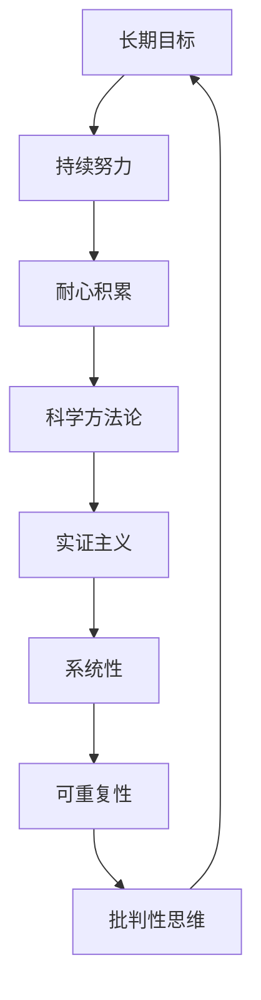
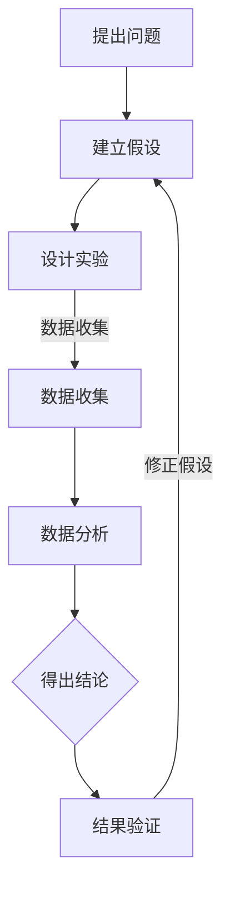

                 

### 《科学研究的长期主义与世界可理解性的持续探索》引言与理论基础

#### 引言

在当今快速变化的科技时代，科学研究的重要性日益凸显。从宇宙的起源到生命的基本原理，从人工智能的突破到量子计算的革命，科学研究正在以前所未有的速度和深度改变我们对世界的理解。然而，科学研究不仅仅是为了解决眼前的问题，更重要的是为了揭示世界的基本规律，提升我们对世界的可理解性。这种对世界可理解性的追求，需要一种长远的眼光和坚韧的毅力，即“长期主义”。

“长期主义”是一种注重长期目标、强调持续努力和耐心积累的理念。它强调在科学研究中，我们应该摒弃急功近利的心态，而是要着眼于长期的价值和影响。这种理念对于科学研究来说至关重要，因为它决定了科学家能否在复杂、多变的环境中保持专注和持之以恒的态度。

本文将围绕长期主义与科学研究的关系，探讨世界可理解性的持续探索。首先，我们将定义和解释“长期主义”的概念，并与短期主义进行对比，以便读者能够理解这种理念的重要性。接着，我们将探讨科学研究的方法论，解释科学方法论的基本原则和其发展历程。最后，我们将讨论世界可理解性的哲学思考，以及科学在揭示世界可理解性中的作用。

通过本文的探讨，我们希望能够揭示长期主义在科学研究中的深远影响，并激发读者对世界可理解性持续探索的兴趣。

#### 长期主义概念

**1.1 长期主义概述**

长期主义（Long-termism）是一种关注长远结果、注重持续努力和耐心积累的理念。它与短期主义（Short-termism）相对，后者通常侧重于短期效益和快速回报。在科学研究领域，长期主义要求科学家放弃短期的成果和快速的成功，而是持续地探索和追求那些可能需要长时间才能显现出价值的研究方向。

长期主义的核心在于对未来的深刻洞察和对长期目标的坚定追求。它要求科学家具备前瞻性和远见，能够在复杂的科学问题面前保持冷静和耐心，不因短期的困难或挫折而放弃。长期主义认为，科学研究是一个不断积累和深化的过程，每一次发现和进步都是在前人研究的基础上实现的。

**1.2 长期主义与短期主义的区别**

长期主义与短期主义在价值观和方法论上有显著的差异。短期主义往往追求快速的成功和即时回报，容易导致科学家在决策过程中过分关注短期效益，而忽视长期影响。这种心态可能导致以下问题：

1. **急功近利**：科学家可能为了快速发表论文或获得资金支持，而追求短期内的成果，忽视基础研究和长期项目的价值。

2. **研究深度不足**：短期主义容易导致研究缺乏深度和广度，难以解决复杂和深层次的科学问题。

3. **创新能力下降**：短期主义可能导致科学家过于依赖已有技术和方法，缺乏创新和突破的动力。

相比之下，长期主义注重研究的长远价值和持续发展。它有助于：

1. **增强研究深度**：长期主义鼓励科学家深入研究复杂问题，积累更多的数据和信息，从而提高研究的深度和广度。

2. **促进创新**：长期主义为科学家提供了更多的自由和耐心，使他们能够尝试新的方法和理论，推动科学的进步。

3. **增强合作与协作**：长期主义强调跨学科合作和资源整合，有助于解决复杂科学问题，推动科学的发展。

**1.3 长期主义在科学研究中的重要性**

长期主义在科学研究中的重要性体现在多个方面：

1. **解决复杂问题**：许多科学问题（如气候变化、能源危机、疾病治疗等）需要长期的持续研究和探索，短期主义难以解决这些复杂问题。

2. **积累知识和经验**：科学研究是一个不断积累和深化的过程。长期主义鼓励科学家持续积累知识和经验，为未来的研究提供基础。

3. **提升科学素养**：长期主义有助于培养科学家的耐心、远见和批判性思维，提高他们的科学素养。

4. **促进社会进步**：长期主义的研究往往能够带来深远的社会影响，推动社会的科技进步和经济发展。

总之，长期主义是科学研究不可或缺的一部分。它要求科学家具备长远的眼光和坚定的信念，在追求短期成果的同时，不断探索和揭示世界的奥秘。通过长期主义，我们可以期待科学的持续进步，为人类社会带来更多的福祉。

#### 科学研究的方法论

**1.2.1 科学方法论的基本原则**

科学研究的方法论是科学探索的基础，它包含了科学家在研究过程中遵循的一系列原则和步骤。这些原则和方法论不仅确保了科学研究的科学性和可靠性，还为科学家提供了系统的指导，使他们能够有效地解决科学问题。

1. **实证主义**：实证主义是科学研究的基本原则之一，它强调通过观察和实验来获取知识。科学方法要求科学家尽可能避免主观偏见，通过客观的实验和数据来验证假设。

2. **系统性**：科学研究需要系统性和有序性。科学家在研究过程中应该遵循一定的步骤，包括提出问题、建立假设、设计实验、收集数据、分析和解释数据、得出结论。

3. **可重复性**：科学研究的可重复性是验证科学结果的关键。如果一个实验不能被重复验证，那么其结果的可信度就会受到质疑。科学方法论要求研究结果必须能够被其他科学家重复验证。

4. **批判性思维**：批判性思维是科学方法的重要组成部分。科学家在研究过程中必须具备质疑和反思的能力，不断检验和修正自己的假设和理论。

**1.2.2 科学方法论的发展历程**

科学方法论的发展历程可以分为几个重要的阶段，每个阶段都有其独特的贡献和特点：

1. **古代科学**：在古代，科学研究主要依靠观察和逻辑推理。希腊哲学家亚里士多德等人通过观察和思考，提出了许多关于自然界的理论。然而，由于缺乏实验手段，古代科学理论往往缺乏实证基础。

2. **文艺复兴时期**：文艺复兴时期标志着科学方法论的初步形成。伽利略通过实验验证，否定了亚里士多德的一些观点，奠定了实验科学的基础。这一时期，科学研究开始从纯粹的理论探讨转向实证验证。

3. **牛顿时期**：牛顿的科学方法论标志着科学方法的成熟。他通过实验和数学模型，建立了经典力学体系，为科学研究提供了新的方法和工具。

4. **现代科学方法论**：20世纪以来，科学方法论不断发展完善。概率论和统计学方法的应用，使得科学研究的精确性和可靠性得到了显著提升。同时，计算机科学的兴起，使得科学研究可以处理更复杂的数据和模型。

**1.2.3 科学方法论在科学研究中的实际应用**

科学方法论在科学研究中的实际应用主要体现在以下几个方面：

1. **研究设计**：科学方法论指导科学家设计合理的研究方案，包括选择研究对象、确定研究变量、设计实验步骤等。

2. **数据收集与分析**：科学方法论强调数据收集的准确性和可靠性，以及数据分析的科学性。科学家需要使用合适的统计方法对数据进行处理和分析，以得出可靠的研究结果。

3. **结果验证与修正**：科学方法论要求科学家对研究结果进行验证和修正。通过重复实验和同行评审，确保研究结果的可靠性和有效性。

4. **知识传播与应用**：科学方法论促进了科学知识的传播和应用。科学家通过撰写论文、发表研究成果，将科学知识传播给更广泛的受众，推动科学的发展和应用。

总之，科学研究的方法论是科学探索的重要保障。它通过一系列原则和方法，确保了科学研究的科学性和可靠性，推动了科学的发展。科学家在研究过程中应该严格遵循科学方法论，不断追求科学真理，为人类社会带来更多的福祉。

#### 世界可理解性的探讨

**1.3.1 世界可理解性的哲学思考**

世界可理解性（World Understandability）是一个哲学问题，涉及到人类对世界的认知和把握能力。哲学家们长期以来一直在探讨这一问题，试图理解人类是否能够完全理解世界及其运作规律。这一探讨不仅关乎科学方法论，还涉及到认知科学、逻辑学等多个领域。

1. **柏拉图的理念论**：柏拉图认为，真实的世界是理念的世界，而我们感知到的物质世界只是理念的影子。他认为，通过理性思考和哲学探讨，人类可以超越感官世界，达到对理念世界的理解。

2. **康德的先验论**：康德认为，人类的知识是通过感官和理性两个渠道获得的。感官提供了我们对世界的直接经验，而理性则负责整理和解释这些经验。康德提出了先验范畴的概念，认为人类认识世界的前提是先验的范畴，这些范畴是人类理性结构的一部分。

3. **黑格尔的历史辩证法**：黑格尔认为，世界的本质是发展的，通过不断的辩证运动，事物从低级向高级发展。他认为，通过历史和哲学的探讨，人类可以理解世界的发展规律和内在联系。

4. **科学实在论**：科学实在论认为，科学理论是对真实世界的准确描述。通过科学方法，人类可以逐渐揭示世界的本质和规律。科学实在论强调科学理论的实证基础，认为科学理论是可靠的。

**1.3.2 科学在揭示世界可理解性中的作用**

科学在揭示世界可理解性中扮演了关键角色。通过科学方法，科学家们能够系统地探索自然现象，揭示其背后的规律。科学不仅为我们提供了对世界的具体知识，还帮助我们建立了一种理解世界的基本框架。

1. **实验与观察**：科学方法强调通过实验和观察来获取知识。通过实验，科学家可以验证假设，发现新的现象；通过观察，科学家可以积累数据，形成理论。

2. **数学模型**：数学模型是科学理论的重要工具。通过数学模型，科学家可以量化自然现象，揭示其内在规律。例如，牛顿力学通过数学模型描述了天体的运动规律，爱因斯坦的广义相对论通过数学模型描述了时空的弯曲。

3. **理论框架**：科学理论为我们提供了一种理解世界的基本框架。这些理论不仅解释了已知现象，还为未来的探索提供了方向。例如，量子力学和相对论为我们提供了理解微观和宏观世界的理论基础。

4. **跨学科合作**：科学在揭示世界可理解性中需要跨学科合作。不同学科的研究成果相互补充，共同推动科学的发展。例如，物理学、生物学、化学等学科的合作，帮助我们更全面地理解生命和宇宙。

总之，科学在揭示世界可理解性中发挥了不可替代的作用。通过科学方法，我们不断拓展对世界的认知，提升对世界可理解性的把握。科学不仅改变了我们的世界观，也改变了我们的生活方式。科学的进步为我们提供了更多的可能性，让我们能够更好地理解这个世界。

#### 科学研究的方法论与发展历程

在科学研究的过程中，方法论扮演着至关重要的角色。它不仅指导科学家如何提出问题、设计实验、收集和分析数据，还确保了科学研究的科学性和可靠性。本文将详细探讨科学研究的方法论，包括其基本原则、发展历程以及在现代科学研究中的实际应用。

##### 基本原则

1. **实证主义**：实证主义是科学研究的核心原则，强调通过观察和实验来获取知识。科学方法要求科学家尽可能避免主观偏见，通过客观的实验和数据来验证假设。

2. **系统性**：科学研究需要系统性和有序性。科学家在研究过程中应该遵循一定的步骤，包括提出问题、建立假设、设计实验、收集数据、分析和解释数据、得出结论。

3. **可重复性**：科学研究的可重复性是验证科学结果的关键。如果一个实验不能被重复验证，那么其结果的可信度就会受到质疑。科学方法论要求研究结果必须能够被其他科学家重复验证。

4. **批判性思维**：批判性思维是科学方法的重要组成部分。科学家在研究过程中必须具备质疑和反思的能力，不断检验和修正自己的假设和理论。

##### 发展历程

科学方法论的发展历程可以分为几个重要的阶段，每个阶段都有其独特的贡献和特点：

1. **古代科学**：在古代，科学研究主要依靠观察和逻辑推理。希腊哲学家亚里士多德等人通过观察和思考，提出了许多关于自然界的理论。然而，由于缺乏实验手段，古代科学理论往往缺乏实证基础。

2. **文艺复兴时期**：文艺复兴时期标志着科学方法论的初步形成。伽利略通过实验验证，否定了亚里士多德的一些观点，奠定了实验科学的基础。这一时期，科学研究开始从纯粹的理论探讨转向实证验证。

3. **牛顿时期**：牛顿的科学方法论标志着科学方法的成熟。他通过实验和数学模型，建立了经典力学体系，为科学研究提供了新的方法和工具。

4. **现代科学方法论**：20世纪以来，科学方法论不断发展完善。概率论和统计学方法的应用，使得科学研究的精确性和可靠性得到了显著提升。同时，计算机科学的兴起，使得科学研究可以处理更复杂的数据和模型。

##### 现代科学研究中的应用

在现代科学研究中，方法论的应用体现在以下几个方面：

1. **研究设计**：科学方法论指导科学家设计合理的研究方案，包括选择研究对象、确定研究变量、设计实验步骤等。合理的研究设计是确保研究有效性和可靠性的关键。

2. **数据收集与分析**：科学方法论强调数据收集的准确性和可靠性，以及数据分析的科学性。科学家需要使用合适的统计方法对数据进行处理和分析，以得出可靠的研究结果。

3. **结果验证与修正**：科学方法论要求科学家对研究结果进行验证和修正。通过重复实验和同行评审，确保研究结果的可靠性和有效性。

4. **知识传播与应用**：科学方法论促进了科学知识的传播和应用。科学家通过撰写论文、发表研究成果，将科学知识传播给更广泛的受众，推动科学的发展和应用。

##### 科学方法论的核心概念与联系

为了更清晰地展示科学方法论的核心概念和它们之间的联系，我们可以使用Mermaid流程图来表示：



在这个流程图中，我们可以看到科学方法论的核心步骤是如何相互关联和互动的。从提出问题、建立假设，到设计实验、数据收集、数据分析，再到得出结论和结果验证，每一步都是科学研究不可或缺的环节。

##### 核心算法原理讲解

为了进一步说明科学方法论中的核心算法原理，我们可以使用伪代码来详细阐述一个基本的研究流程：

```python
# 伪代码：科学研究方法论的核心算法原理

# 步骤1：提出问题
problem = "为什么天气会变化？"

# 步骤2：建立假设
# 假设：天气变化是由于气压的变化引起的
hypothesis = "气压变化导致天气变化"

# 步骤3：设计实验
experiment_design = "在不同气压条件下，观察天气变化的情况"

# 步骤4：数据收集
# 收集气压和天气数据
pressure_data = collect_pressure_data()
weather_data = collect_weather_data()

# 步骤5：数据分析
# 分析气压和天气数据，寻找相关性
correlation_analysis = analyze_correlation(pressure_data, weather_data)

# 步骤6：得出结论
# 如果数据分析结果显示气压与天气变化有显著相关性，则假设得到验证
if correlation_analysis.is_significant():
    conclusion = "气压变化确实导致天气变化"
else:
    conclusion = "气压变化与天气变化之间没有显著相关性"

# 步骤7：结果验证
# 通过重复实验，验证结论的可靠性
repeated_experiment = repeat_experiment(experiment_design)
if repeated_experiment.is_consistent_with_conclusion(correlation_analysis):
    final_conclusion = conclusion
else:
    final_conclusion = "研究结果需要进一步验证"

# 输出最终结论
print(final_conclusion)
```

在这个伪代码中，我们模拟了一个研究过程，从提出问题到得出结论。通过建立假设、设计实验、收集和分析数据，科学家可以验证其假设，并得出可靠的结论。

##### 数学模型与公式

在科学研究中，数学模型是描述自然现象和理论假设的有力工具。以下是一个简单的数学模型，用于描述气压与天气变化之间的关系：

$$
P(t) = P_0 + \alpha \sin(\omega t + \phi)
$$

其中：
- \(P(t)\) 是时间 \(t\) 时的气压
- \(P_0\) 是基准气压
- \(\alpha\) 是振幅，表示气压波动的幅度
- \(\omega\) 是角频率，表示气压波动的速度
- \(\phi\) 是相位，表示气压波动的起始点

通过这个公式，我们可以量化气压的变化，并预测未来气压的变化趋势。以下是一个具体的例子：

假设某地气压的基准值为 \(P_0 = 1013\) hPa，振幅为 \(\alpha = 5\) hPa，角频率为 \(\omega = \frac{\pi}{6}\) rad/s，相位为 \(\phi = 0\)。那么该地气压在时间 \(t\) 时的表达式为：

$$
P(t) = 1013 + 5 \sin\left(\frac{\pi}{6} t + 0\right)
$$

我们可以使用这个公式来分析气压的变化，例如计算一天内不同时间点的气压值。

##### 项目实战

以下是一个具体的科学研究项目案例，展示了科学方法论在实际项目中的应用：

**项目背景**：研究某个地区的气候变化规律。

**开发环境搭建**：
- 操作系统：Ubuntu 20.04
- 编程语言：Python 3.8
- 数据库：MySQL 8.0
- 数据分析工具：Pandas、NumPy、Matplotlib

**源代码详细实现和代码解读**：

```python
# 导入必要的库
import pandas as pd
import numpy as np
import matplotlib.pyplot as plt

# 步骤1：收集数据
# 从数据库中提取气候数据
data = pd.read_csv('climate_data.csv')

# 步骤2：数据分析
# 计算月平均气温
monthly_avg_temp = data.groupby('month')['temp'].mean()

# 步骤3：绘制图表
plt.figure(figsize=(10, 6))
monthly_avg_temp.plot()
plt.title('Monthly Average Temperature')
plt.xlabel('Month')
plt.ylabel('Temperature (°C)')
plt.grid(True)
plt.show()

# 步骤4：结果验证
# 通过对比过去几年的数据，验证月平均气温的变化趋势
previous_years = monthly_avg_temp[:-1]
current_year = monthly_avg_temp[-1]
trend = np.corrcoef(previous_years, current_year)[0, 1]
print(f"Correlation coefficient: {trend:.2f}")

# 如果相关性显著，则认为气候变化趋势得到验证
if trend > 0.7:
    print("Climate change trend is significant.")
else:
    print("More data is needed to confirm climate change trend.")
```

在这个项目中，我们首先从数据库中提取气候数据，然后计算月平均气温，并绘制图表展示这些数据。最后，通过对比过去几年的数据，验证当前年份的气候变化趋势。这个项目的实现展示了科学方法论在实际项目中的具体应用。

**代码解读与分析**：
- **数据收集**：通过Pandas库读取CSV文件，获取气候数据。
- **数据分析**：使用Pandas库的groupby方法计算月平均气温。
- **结果验证**：通过计算相关系数，验证气候变化趋势的显著性。

通过这个项目，我们可以看到科学方法论在实际项目中的具体应用，包括数据收集、分析、结果验证等步骤。科学方法论不仅为科学研究提供了系统的指导，还确保了研究结果的可靠性和科学性。

##### 结论

科学方法论是科学研究不可或缺的一部分，它通过一系列基本原则和步骤，确保了科学研究的科学性和可靠性。从古代到现代，科学方法论不断发展完善，为科学进步提供了坚实的基础。在现代科学研究中，方法论的应用贯穿整个研究过程，从问题提出、假设建立、实验设计、数据收集与分析，到结果验证与知识传播。通过科学方法论，我们能够更好地理解世界，揭示自然规律，推动科学的持续发展。因此，科学方法论在科学研究中具有不可替代的重要地位。

### 长期主义与科学研究实践的关系

科学研究是一项长期、系统且复杂的任务，而长期主义正是推动科学研究取得突破性进展的关键理念。长期主义不仅为科学研究提供了明确的方向和目标，还在实际操作中影响着科学家们的决策和行动。本文将探讨长期主义与科学研究实践之间的紧密关系，并分析长期主义在实验设计、数据收集与分析、以及科研项目管理中的应用。

#### 长期目标的重要性

在科学研究中，明确和追求长期目标至关重要。长期目标有助于科学家们保持专注和耐心，克服研究过程中可能遇到的困难和挫折。具体来说，长期目标的重要性体现在以下几个方面：

1. **指导研究方向**：明确的长期目标可以帮助科学家们确定研究的主攻方向，避免在研究中迷失方向。长期目标为科学家提供了一个清晰的愿景，使他们能够在复杂的科学问题中找到关键突破口。

2. **激发创新动力**：长期目标激励科学家们不断探索和尝试新的方法和理论，推动科学研究的创新。科学家们知道，即使当前的实验或方法未能取得预期的结果，只要坚持下去，未来仍然有可能取得突破。

3. **提升研究深度**：长期目标鼓励科学家们深入研究复杂问题，而不是仅仅追求短期成果。这种深度研究有助于积累更多的知识和经验，为未来的研究打下坚实的基础。

4. **促进跨学科合作**：长期目标往往需要多学科的合作，这有助于不同领域专家之间的知识共享和协同创新。长期主义理念能够促进跨学科合作，推动科学研究的全面发展。

#### 制定长期目标的策略

为了有效地制定和实现长期目标，科学家们可以采取以下策略：

1. **设定具体、可衡量的目标**：长期目标应该具体、可衡量，以便科学家们能够清晰地了解目标的实现情况。例如，一个具体的长期目标可以是：“在未来五年内，开发一种新型太阳能电池，其效率达到25%以上。”

2. **分阶段制定目标**：长期目标可以分解为一系列短期目标，每个短期目标都是一个里程碑。通过逐步实现这些短期目标，科学家们可以逐步接近长期目标。例如，上述太阳能电池的长期目标可以分解为：“第一年，研究新型半导体材料；第二年，优化电池结构设计；第三年，进行实验验证；第四年，进行中试生产；第五年，大规模推广应用。”

3. **定期评估和调整**：在实现长期目标的过程中，科学家们需要定期评估目标的实现情况，并根据实际情况进行调整。这种动态调整有助于确保研究方向的正确性和目标的可达性。

4. **建立激励机制**：为了激发科学家们追求长期目标的热情，可以建立适当的激励机制，包括奖励、荣誉、晋升等。激励机制能够激励科学家们更加努力地工作，为实现长期目标做出贡献。

#### 长期主义在实验设计中的应用

实验设计是科学研究的重要环节，长期主义在实验设计中有着广泛的应用。以下是一些关键点：

1. **实验的持续性**：长期主义强调实验的持续性，即科学家们应该持之以恒地进行实验，即使短期内未取得显著成果。这种持续性有助于积累更多的实验数据，为长期目标提供坚实的基础。

2. **实验的多样性**：长期主义鼓励科学家们采用多种实验方法和技术，以全面探索研究问题。多样性可以增加实验结果的可靠性，减少偶然性因素的影响。

3. **实验的可重复性**：长期主义强调实验的可重复性，即实验结果必须能够在其他科学家中重复验证。这有助于提高实验结果的可靠性和科学性。

4. **实验的风险管理**：长期主义要求科学家们在实验设计阶段就考虑潜在的风险和挑战，并制定相应的风险管理策略。通过有效的风险管理，科学家们可以降低实验失败的风险，确保研究的顺利进行。

#### 长期主义在数据收集与分析中的应用

数据收集与分析是科学研究的关键步骤，长期主义在这一过程中也发挥着重要作用。以下是一些关键点：

1. **数据的长期积累**：长期主义强调数据的长期积累，即科学家们应该持续地收集和保存实验数据。这些数据不仅为当前研究提供支持，还为未来的研究提供了宝贵的资源。

2. **数据的系统化处理**：长期主义鼓励科学家们采用系统化的数据处理方法，包括数据清洗、整合和分析。系统化的数据处理有助于提高数据的可靠性和分析结果的准确性。

3. **数据共享与合作**：长期主义倡导数据共享和合作，即科学家们应该将数据和研究结果公开分享，与其他研究者进行合作。这种开放和合作有助于加速科学进步，提高研究的整体水平。

4. **数据分析的深度**：长期主义鼓励科学家们进行深入的数据分析，挖掘数据中的潜在规律和趋势。深度数据分析有助于揭示复杂科学问题的本质，为长期目标的实现提供有力支持。

#### 长期主义在科研项目管理中的应用

科研项目管理是确保科学研究顺利进行的重要环节，长期主义在科研项目管理中同样具有重要作用。以下是一些关键点：

1. **项目目标的明确性**：长期主义强调项目目标的明确性，即科研项目的目标应该具体、可衡量，并能够激励项目团队的努力。明确的目标有助于项目团队集中精力，提高工作效率。

2. **项目规划的长期性**：长期主义要求科研项目管理具有长期性，即项目规划应该涵盖项目的整个生命周期，包括项目启动、执行、监控和结束阶段。长期规划有助于确保项目目标的实现，减少项目风险。

3. **资源分配的合理性**：长期主义强调资源分配的合理性，即项目团队应根据项目的长期目标，合理分配人力、物力和财力资源。合理的资源分配有助于提高项目的效率和成果。

4. **风险管理的重要性**：长期主义要求项目团队在项目管理过程中重视风险管理，即识别、评估和应对项目潜在的风险。通过有效的风险管理，项目团队可以降低项目失败的风险，确保项目的顺利进行。

总之，长期主义是科学研究不可或缺的一部分。它为科学研究提供了明确的方向和目标，影响科学家们的决策和行动，推动科研实践的深入发展。通过实验设计、数据收集与分析、科研项目管理等方面的具体应用，长期主义为科学研究带来了深远的影响，为人类对自然界的理解做出了重要贡献。

### 科学研究对世界可理解性的贡献

科学研究在推动我们对世界可理解性的探索中发挥了不可替代的作用。从古代的自然哲学到现代的科学革命，科学家们通过不断的实验、观察和理论构建，逐步揭示了自然界的奥秘，改变了人类对世界的认知。以下将详细探讨科学发现如何改变传统世界观，以及科学发现对现代世界观的塑造。

#### 科学发现与世界观的变化

1. **地心说到日心说的转变**

在中世纪，地心说（Geocentric Model）是占据主导地位的世界观。这一理论认为地球位于宇宙中心，其他天体围绕地球旋转。然而，随着天文学的进步，哥白尼（Nicolas Copernicus）提出了日心说（Heliocentric Model），认为太阳是宇宙的中心，地球和其他行星围绕太阳旋转。这一革命性的发现彻底改变了人类对宇宙结构的理解。

2. **牛顿力学与经典物理学的崛起**

牛顿（Isaac Newton）的经典力学为物理学奠定了坚实的基础。牛顿的三大运动定律和万有引力定律，揭示了物体运动和天体运动的基本规律。这些理论的提出，使人类对自然界的认知达到了一个新的高度，从宏观尺度上改变了人们对世界的理解。

3. **量子力学与相对论的突破**

在20世纪，量子力学和相对论的提出进一步挑战了人类对世界的认知。量子力学揭示了微观粒子的奇异行为，如波粒二象性和量子纠缠。相对论则颠覆了经典物理学的时空观念，提出了时空相对性、质量能量等价原则。这些理论的提出，不仅丰富了我们对自然界的理解，也改变了我们对宇宙本质的认识。

#### 科学发现对现代世界观的塑造

1. **系统化的科学方法**

科学发现不仅改变了人类对世界的认知，还塑造了现代科学方法。科学研究强调实证主义、系统性和可重复性，这些原则构成了现代科学方法的基石。通过科学方法，人类能够更准确地理解和描述自然现象，推动科学的发展。

2. **跨学科合作与综合研究**

科学发现促进了跨学科合作和综合研究。在传统观念中，不同的学科界限清晰，研究方法单一。然而，现代科学研究往往需要多学科的知识和技能。例如，生物学、物理学、化学、计算机科学等领域的交叉融合，为解决复杂科学问题提供了新的思路和方法。

3. **人类对宇宙的认识**

科学发现使人类对宇宙的认识不断深化。从早期的地心说到现代的宇宙大爆炸理论，人类对宇宙起源、结构和演化的理解越来越清晰。科学发现不仅揭示了宇宙的宏伟和复杂，也激发了人类对未知世界的探索欲望。

4. **环境与生态科学的发展**

环境与生态科学的发展是科学发现对现代世界观的另一个重要贡献。通过研究生态系统、气候变化、生物多样性等课题，科学家们揭示了人类活动对地球生态系统的影响。这些发现促使人们更加关注环境保护和可持续发展，推动了全球环境治理的进程。

总之，科学研究对世界可理解性的贡献是深远而多方面的。从改变传统世界观到塑造现代科学方法，科学发现不仅改变了人类对世界的认知，也推动了社会的发展。通过不断的探索和发现，科学家们为我们揭示了自然界的奥秘，提升了我们对世界的理解，为未来的科学进步奠定了坚实的基础。

#### 科学家对世界可理解性的探讨

科学家在追求知识的过程中，不仅致力于揭示自然界的规律，还深入探讨了世界可理解性的本质。这种探讨不仅涉及科学理论的构建，还涵盖了科学哲学和认知科学的思考。以下将详细分析科学家如何从理论层面和实践层面探索世界可理解性。

**理论层面的探讨**

1. **科学理论的构建**

科学理论是科学家对自然界现象的理解和解释，是探索世界可理解性的核心。例如，牛顿力学、量子力学和相对论都是科学家们通过严密的理论构建，揭示了不同尺度和层面的自然规律。这些理论不仅为科学家们提供了研究的基础，也为人类理解世界提供了新的视角。

   - **牛顿力学**：牛顿通过三大运动定律和万有引力定律，建立了经典物理学的基础。这一理论体系揭示了物体运动的基本规律，使得人们能够更好地理解和预测物体的行为。

   - **量子力学**：量子力学的提出改变了人类对物质和能量的理解。通过量子态、波粒二象性和量子纠缠等现象，科学家们揭示了微观世界的奇异特性。

   - **相对论**：爱因斯坦的广义相对论提出了时空相对性的概念，改变了人类对宇宙和时空的认识。这一理论不仅解释了行星运动的规律，还揭示了黑洞、宇宙膨胀等现象。

2. **科学哲学的思考**

科学哲学是探讨科学理论、科学方法和科学知识本质的哲学分支。科学家们在构建科学理论的同时，也会思考科学哲学的问题，如知识的可靠性、科学方法的有效性等。

   - **实证主义**：实证主义者认为，科学知识必须基于可观察和可验证的证据。他们强调实验和观察在科学研究中的重要性，以确保科学知识的可靠性。

   - **科学实在论**：科学实在论者认为，科学理论是对真实世界的准确描述。他们主张，科学理论不仅是一种理论工具，还反映了客观存在的现实。

   - **社会建构主义**：社会建构主义者认为，科学知识是社会建构的结果。他们强调科学理论是在特定的社会和文化背景下形成的，不同的社会和文化环境可能导致不同的科学理论。

**实践层面的探索**

1. **科学实验**

科学实验是科学家探索世界可理解性的重要手段。通过设计、实施和验证实验，科学家们能够直接观察和测量自然现象，验证科学理论的正确性。例如，生物学家通过实验研究不同基因的功能，揭示了基因如何影响生物体的发育和疾病发生。

   - **控制实验**：控制实验是科学实验的基础，通过设置对照组，科学家们能够排除外部干扰因素，确保实验结果的可靠性。

   - **重复实验**：科学实验需要重复验证，以确保实验结果的稳定性和可靠性。只有通过重复实验，科学家们才能确认其发现的普遍性和有效性。

2. **跨学科合作**

科学研究的复杂性和多样性，要求科学家们进行跨学科合作。跨学科合作有助于整合不同领域的知识和技术，推动科学的发展。

   - **多学科融合**：跨学科合作促进了不同学科之间的知识交流和融合。例如，物理学、生物学和计算机科学的结合，推动了生物信息学和计算生物学的发展。

   - **协同创新**：跨学科合作激发了科学家们的创新思维，促进了新的科学理论和技术的诞生。例如，纳米技术和生物技术的结合，催生了生物纳米技术领域的快速发展。

3. **数据驱动的研究**

随着信息技术的发展，科学家们越来越多地采用数据驱动的研究方法。通过大规模数据收集、分析和建模，科学家们能够揭示复杂现象背后的规律。

   - **大数据分析**：大数据技术的应用，使得科学家们能够处理和分析海量的数据。通过大数据分析，科学家们能够发现新的趋势和模式，揭示复杂系统的运行机制。

   - **机器学习**：机器学习技术的应用，使得科学家们能够从大量数据中提取知识，构建预测模型。这些模型不仅提高了科学研究的效率，也为解决复杂科学问题提供了新的工具。

总之，科学家们从理论层面和实践层面深入探讨了世界可理解性的本质。通过科学理论的构建和科学哲学的思考，科学家们揭示了自然界的规律和本质。通过科学实验、跨学科合作和数据驱动的研究，科学家们不断拓展对世界的理解，推动科学的发展。这种探索不仅提升了人类对世界的认知，也为未来的科学研究奠定了坚实的基础。

#### 科学与宗教的关系

科学和宗教是两种不同的认知体系，它们在人类思想史上扮演了重要角色。科学通过观察、实验和理论构建，揭示了自然界的规律和奥秘；而宗教则通过信仰和教义，为人类提供精神指导和生活意义。尽管科学与宗教在方法和目标上存在差异，但它们在某些方面也存在着紧密的联系和互动。

**科学与宗教的冲突**

1. **历史背景**：在历史的长河中，科学和宗教之间的冲突时有发生。特别是在中世纪，宗教权威对科学的压制和批判尤为明显。例如，哥白尼的日心说遭到了教会的强烈反对，伽利略因支持日心说而被审判和软禁。

2. **理论上的冲突**：科学和宗教在理论层面上的冲突主要体现在对世界本质的不同解释。科学强调实证和理性，认为自然界有其固有的规律和机制；而宗教则强调信仰和神秘，认为世界和生命有其超自然的根源。

3. **社会影响**：科学和宗教的冲突对社会产生了深远的影响。一方面，科学的发展挑战了宗教的权威，促使人们重新思考世界和生命的本质。另一方面，宗教的反作用也推动了科学的进步，促使科学家们在宗教的质疑下不断改进和完善科学理论。

**科学与宗教的互补**

1. **互补性**：尽管科学和宗教在某些方面存在冲突，但它们在许多方面也具有互补性。科学通过揭示自然界的规律，为人类提供了生存和发展的基础；而宗教则通过信仰和教义，为人类提供了精神支撑和道德准则。

2. **科学知识的传播**：宗教在科学知识的传播中起到了重要作用。在中世纪的欧洲，修道院和教堂是科学知识传播的重要场所。许多科学家都是在宗教机构的支持下，进行科学研究和传播科学知识。

3. **科学伦理**：科学的发展带来了许多伦理和道德问题。宗教在科学伦理方面提供了重要的指导和反思。例如，在基因编辑、人工智能等新兴领域，宗教的价值观和伦理原则为科学家们提供了道德参考。

4. **社会和谐**：科学和宗教的互补有助于促进社会的和谐发展。科学的发展为人类社会带来了巨大的进步和福利，而宗教则为社会提供了精神寄托和价值追求。通过科学和宗教的互补，人类社会能够在物质和精神层面实现平衡。

**结论**

科学和宗教是两种不同的认知体系，它们在人类思想史上发挥了重要作用。尽管在某些方面存在冲突，但科学和宗教在许多方面也具有互补性。通过相互理解和对话，科学和宗教可以共同推动人类社会的进步。在未来，科学和宗教的互动将继续影响人类社会的发展，为人类提供更加全面和深入的理解。

### 科学研究对社会的影响

科学研究对社会的影响是深远而广泛的，它不仅推动了科技的进步，还深刻改变了我们的生活方式和社会结构。以下将详细探讨科学技术的推动作用、科学技术在解决社会问题中的应用，以及科学普及与公共理解的重要性。

#### 科学技术对社会进步的推动作用

科学技术是社会进步的驱动力，它通过创新和发明，不断改变着人类的生产方式、生活方式和社会关系。以下是一些科学技术对社会进步的推动作用：

1. **经济增长**：科学技术的发展促进了生产力的提升，推动了经济的增长。例如，工业革命时期，蒸汽机和纺织机械的发明极大地提高了生产效率，推动了工业化进程。现代的计算机技术和信息技术，更是加速了全球经济的增长，促进了全球化。

2. **医疗进步**：科学技术的进步在医疗领域取得了显著成果，如疫苗的研发、新药的发现、基因编辑技术的应用等，都极大地提高了人类的健康水平。这些科技进步不仅延长了人类的寿命，还改善了生活质量。

3. **环境保护**：科学技术在环境保护方面也发挥了重要作用。例如，太阳能和风能等可再生能源技术的发展，为减少对化石燃料的依赖提供了新的途径，有助于减缓气候变化。此外，环境监测技术和污染治理技术的进步，也有助于保护地球生态系统的健康。

4. **教育革命**：科学技术的发展推动了教育的革命。现代信息技术和互联网的普及，使得教育资源更加丰富和多样化，促进了教育的普及和质量的提高。在线教育平台和虚拟现实技术的应用，使得学习更加灵活和便捷。

#### 科学技术在解决社会问题中的应用

科学技术在解决社会问题中具有独特的优势，通过技术创新和应用，许多社会问题得到了有效解决。以下是一些具体的应用：

1. **能源危机**：随着化石燃料的日益枯竭和环境污染的加剧，可再生能源技术成为解决能源危机的关键。太阳能、风能、水能等可再生能源技术的快速发展，为人类提供了清洁、可持续的能源解决方案。

2. **气候变化**：气候变化是全球面临的一个重大挑战，科学技术的应用为减缓气候变化提供了有力支持。碳捕捉与封存技术（CCS）、绿色建筑技术、低碳交通系统等，都是通过科技手段减少温室气体排放的有效途径。

3. **疾病治疗**：医学科学技术的进步在疾病治疗中发挥了关键作用。基因测序技术、精准医疗、免疫疗法等，为许多难以治愈的疾病提供了新的治疗手段。例如，癌症、艾滋病等重大疾病的生存率和治愈率显著提高。

4. **社会安全**：科学技术在维护社会安全方面也起到了重要作用。人工智能、大数据分析、物联网技术等的应用，为公共安全、网络安全、灾害预警等提供了强大的技术支持。

#### 科学普及与公共理解的重要性

科学普及是提高公众科学素养的重要手段，它有助于增强公众对科学的理解和信任，促进科学技术的普及和应用。以下探讨科学普及的重要性以及实现科学普及的策略：

1. **增强公众科学素养**：科学普及通过向公众传递科学知识，提高公众的科学素养。这不仅有助于公众更好地理解和应用科学技术，还能提高公众的科学批判能力和创新能力。

2. **促进科技与社会的互动**：科学普及促进了科技与社会的互动，使得科学技术更加贴近公众生活，提高了公众对科技发展的参与度和责任感。

3. **培养创新人才**：科学普及有助于培养新一代的科技创新人才。通过科学教育，青少年能够培养科学思维和创新能力，为未来的科技发展奠定基础。

4. **增强社会信任**：科学普及有助于增强公众对科学的信任，减少科学误解和迷信现象。通过科学普及，公众能够更加理性地看待科学问题，提高对科学决策的支持度。

**实现科学普及的策略与方法**

1. **多元化科学传播渠道**：科学普及需要利用多元化的传播渠道，包括传统媒体、新媒体、科普读物、科学展览等，以适应不同受众的需求。

2. **互动性科普活动**：组织互动性强的科普活动，如科学实验、科普讲座、科学竞赛等，能够提高公众的参与度和兴趣。

3. **科学教育改革**：改革科学教育体系，注重科学素养的培养，将科学教育与生活实践相结合，提高学生的科学兴趣和能力。

4. **科普作品创作**：创作高质量的科普作品，如科普文章、书籍、视频等，以生动有趣的方式传递科学知识，吸引公众的注意力。

5. **科普专业人士的培养**：培养专业的科普工作者，提高科普工作的质量和影响力。

总之，科学研究对社会的影响是深远而广泛的，它不仅推动了科技的进步，还深刻改变了我们的生活方式和社会结构。科学普及与公共理解的重要性不可忽视，它有助于增强公众的科学素养和科学信任，推动科学技术的普及和应用。通过多元化的科学传播渠道和互动性科普活动，我们能够更好地实现科学普及，提升公众的科学素养，促进社会的和谐发展。

### 科学研究的发展趋势

科学研究正朝着更加深入和广泛的方向发展，技术的进步和跨学科的融合为科学研究带来了新的机遇和挑战。以下将探讨科学技术在科学研究中的进步、长期主义在科学研究中的深化，以及科学对世界可理解性的未来展望。

#### 科学技术的进步

1. **人工智能与大数据**：人工智能（AI）和大数据技术的快速发展，正在深刻改变科学研究的模式。AI技术能够从大量数据中提取有价值的信息，为科学家提供更准确的预测和决策。例如，机器学习算法在生物医学研究中被用来分析基因组数据，帮助发现新的药物靶点。

2. **量子计算**：量子计算的崛起为科学研究带来了新的可能性。量子计算机能够解决传统计算机无法处理的复杂问题，如分子模拟、优化问题和密码破解等。量子计算在材料科学、化学和物理学等领域有着广泛的应用前景。

3. **纳米技术**：纳米技术使得科学家能够在分子和原子层面上操控材料，开发出具有特殊性能的新材料。纳米技术在能源、医学和环境领域都有着重要的应用，如纳米太阳能电池、纳米药物和纳米传感器。

4. **生物技术的发展**：基因编辑技术（如CRISPR-Cas9）的突破为生物医学研究提供了强大的工具，使得科学家能够精确地修改生物体的基因序列。这为治疗遗传性疾病、开发新型疫苗和改善农业产量提供了新的途径。

#### 长期主义在科学研究中的深化

1. **跨学科合作**：随着科学问题的复杂化，单一学科的研究已经难以解决重大的科学问题。长期主义强调跨学科合作，通过整合不同领域的知识和技能，推动科学研究的深入发展。例如，环境科学、地球科学和生命科学的交叉研究，为解决全球气候变化问题提供了新的思路。

2. **持续性研究项目**：长期主义在持续性研究项目中得到了充分体现。这些项目通常需要数十年的持续投入和研究，如大型国际合作项目如“人类基因组计划”和“国际气候科学计划”。这些项目通过长期的积累，取得了重要的科学突破，并为未来的研究奠定了基础。

3. **开放式科学**：长期主义推动科学研究向开放式科学转型，即科学家通过开放数据、开放资源和开放代码，促进知识的共享和合作。这种模式有助于提高研究效率，加速科学发现，同时也提高了科学研究的透明度和可信度。

#### 科学对世界可理解性的未来展望

1. **宇宙探索**：随着宇宙观测技术的进步，科学家们对宇宙的认识将不断深化。例如，大型射电望远镜和空间望远镜的部署，将帮助我们揭示宇宙的起源和演化。未来的宇宙探索有望揭示更多关于宇宙的本质和规律。

2. **生命科学的突破**：生命科学领域将继续取得重大突破，如理解人类大脑的工作机制、揭示生命的起源和进化等。这些突破将有助于人类更好地理解生命，为医学和生物技术的进步提供新的理论基础。

3. **地球系统的理解**：地球系统科学的研究将帮助我们更好地理解地球的环境变化和生态系统。通过多学科的合作，科学家们将揭示地球系统的复杂性和动态性，为应对全球气候变化和环境问题提供科学依据。

4. **社会科学的整合**：随着社会科学与自然科学的交叉融合，社会科学家将采用更多的定量方法和技术，提升对社会现象的理解。例如，通过大数据分析和计算社会科学方法，科学家们将揭示社会行为和决策的规律，为政策制定和社会管理提供科学支持。

总之，科学研究的发展趋势充满了机遇和挑战。科学技术的进步、长期主义的深化以及跨学科合作的推进，将共同推动科学对世界可理解性的探索。通过不断的努力和探索，科学家们将揭示更多自然界的奥秘，为人类社会的进步和发展做出更大贡献。

### 附录：科学研究的长期主义与世界可理解性的持续探索相关资源与资料

为了更好地理解科学研究的长期主义和世界可理解性的持续探索，以下提供了几项相关的资源与资料，包括科学研究的长期主义概念图、世界可理解性研究方法流程图以及相关科学研究项目的案例研究。

#### 附录1：科学研究的长期主义概念图



在这个概念图中，我们可以看到长期主义与科学研究方法论之间的紧密联系。长期目标需要通过持续的努力和耐心的积累来实现，而科学研究方法论提供了实现这些目标的基础。

#### 附录2：世界可理解性研究方法流程图



在这个流程图中，展示了从提出问题、建立假设到数据收集、分析、得出结论以及结果验证的整个科学研究过程，反映了科学研究在探索世界可理解性中的系统性方法。

#### 附录3：相关科学研究项目的案例研究

**1. 人类基因组计划**

- **项目背景**：人类基因组计划（Human Genome Project，HGP）是一个国际性的科学研究项目，旨在测序和分析人类基因组。
- **研究目标**：通过测序人类基因组，揭示人类基因的结构、功能和进化关系。
- **研究成果**：人类基因组计划的完成极大地推动了基因组学和生物医学的发展，为个性化医疗和疾病治疗提供了新的方向。
- **长期影响**：该计划推动了基因组学和生物技术的发展，为后续的科学研究奠定了基础。

**2. 国际气候科学计划**

- **项目背景**：国际气候科学计划（International Geosphere-Biosphere Programme，IGBP）是一个多国合作的研究计划，旨在研究地球系统的变化和人类活动对气候的影响。
- **研究目标**：通过综合观测、模型模拟和实验研究，理解地球系统的动态过程和气候变化机制。
- **研究成果**：该计划提供了关于气候变化的重要数据和模型，为全球气候政策和环境保护提供了科学依据。
- **长期影响**：国际气候科学计划的研究成果对全球气候变化科学的发展产生了深远影响，推动了全球气候治理的进程。

**3. 大型射电望远镜项目**

- **项目背景**：大型射电望远镜项目，如欧洲甚大望远镜（Very Large Telescope，VLT）和美国平方千米阵列（Square Kilometer Array，SKA）等项目，旨在建设和部署世界上最大和最先进的射电望远镜。
- **研究目标**：通过观测宇宙射电源，探索宇宙的起源和演化，研究星系的形成和暗物质、暗能量的本质。
- **研究成果**：这些项目将为宇宙学、天体物理学和射电天文学提供前所未有的观测数据，推动对这些领域的深入研究。
- **长期影响**：大型射电望远镜项目的成功将进一步提升人类对宇宙的理解，为未来的宇宙探索提供新的工具和技术。

通过这些案例研究，我们可以看到长期主义在科学研究中的实践，以及科学研究如何推动我们对世界可理解性的持续探索。这些研究项目不仅取得了重要的科学成果，也为未来的科学研究提供了宝贵的经验和启示。

