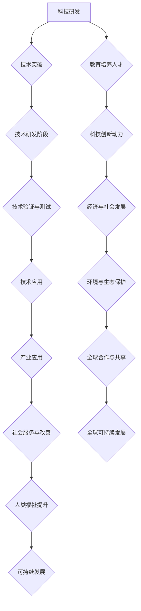

                 

### 《科技发展：人类福祉的保障》

> **关键词：** 科技发展，人类福祉，可持续发展，人工智能，生物技术，教育，伦理，政策，国际合作

**摘要：** 本文从历史与现状、影响与挑战、教育与应用、未来趋势等多个角度深入探讨了科技发展对人类福祉的保障。文章分析了科技在各个领域的具体应用，探讨了科技伦理与法律问题，并提出了应对科技发展的策略。通过系统的研究和分析，本文旨在为科技发展提供新的视角，推动人类社会实现可持续发展。

---

### 目录大纲

- **第一部分：科技发展的历史与现状**
  - **第1章：科技发展概述**
    - **1.1 人类文明与科技发展**
    - **1.2 科技革命与重大发明**
    - **1.3 当代科技发展的主要趋势**
  - **第2章：科技对人类福祉的影响**
    - **2.1 科技进步与社会发展**
    - **2.2 科技与生活质量提升**
    - **2.3 科技与环境保护**
  - **第3章：科技发展的挑战与应对策略**
    - **3.1 科技发展中的伦理问题**
    - **3.2 科技发展与全球不平等**
    - **3.3 科技发展的可持续性**
  - **第4章：科技创新与未来展望**
    - **4.1 创新驱动发展战略**
    - **4.2 科技未来的预测与趋势**
    - **4.3 科技发展的未来挑战**

- **第二部分：科技与人类福祉**
  - **第5章：科技教育与普及**
    - **5.1 科技教育的意义与现状**
    - **5.2 科技教育与人类福祉**
    - **5.3 科技普及的途径与方法**
  - **第6章：科技政策与治理**
    - **6.1 科技政策的重要性**
    - **6.2 科技治理的框架与机制**
    - **6.3 科技治理中的关键问题**
  - **第7章：科技伦理与法律**
    - **7.1 科技伦理的基本原则**
    - **7.2 科技伦理案例分析**
    - **7.3 科技法律体系与保护**

- **第三部分：科技与人类福祉的具体应用**
  - **第8章：科技在健康领域的应用**
    - **8.1 科技与健康发展的关系**
    - **8.2 科技在疾病预防与治疗中的应用**
    - **8.3 健康科技的未来展望**
  - **第9章：科技在教育和文化领域的应用**
    - **9.1 科技对教育的影响**
    - **9.2 科技在文化传承与创新中的应用**
    - **9.3 教育与文化的未来展望**
  - **第10章：科技在经济发展中的应用**
    - **10.1 科技与经济增长的关系**
    - **10.2 科技在产业升级与转型中的应用**
    - **10.3 科技创业与产业生态**

- **第四部分：科技发展的未来趋势与人类福祉**
  - **第11章：人工智能与人类福祉**
    - **11.1 人工智能的发展现状**
    - **11.2 人工智能在各个领域的应用**
    - **11.3 人工智能对人类福祉的潜在影响**
  - **第12章：生物技术与人类福祉**
    - **12.1 生物技术的发展与应用**
    - **12.2 生物技术在健康领域的应用**
    - **12.3 生物技术与伦理问题**
  - **第13章：可持续发展与科技**
    - **13.1 可持续发展的概念与目标**
    - **13.2 科技在可持续发展中的角色**
    - **13.3 科技推动可持续发展的路径**

- **参考文献**

- **附录**

  - **附录A：科技发展相关数据与图表**
  - **附录B：科技发展重要政策文件汇编**
  - **附录C：科技发展关键词汇解释**

---

## 第一部分：科技发展的历史与现状

### 第1章：科技发展概述

#### 1.1 人类文明与科技发展

从史前时代到现代社会，科技的发展一直伴随着人类文明的进步。早期的工具制造、农业革命和航海技术的进步，为人类社会的发展奠定了基础。在古希腊和古罗马时期，数学、天文学、医学等领域取得了重要突破，为后来的科学革命打下了基础。

中世纪的欧洲，科技发展受到宗教和封建制度的限制，进展较为缓慢。然而，文艺复兴时期的人文主义思潮促进了科学和技术的复兴。16世纪末到17世纪初的工业革命，标志着现代科技的崛起。蒸汽机、纺织机械、铁路和电力的发明，极大地推动了生产力的提升，改变了人类的生活方式。

进入20世纪，科技发展进入快车道。20世纪40年代的计算机革命，开启了信息时代的大门。互联网的兴起，使得信息传播和交流变得前所未有的快捷和便利。同时，生物技术、纳米技术、人工智能等新兴科技不断涌现，为人类社会的进步提供了新的动力。

#### 1.2 科技革命与重大发明

科技革命通常指的是在较短时间内，某一领域或多个领域发生的一系列重大技术突破，从而引发经济、社会和文化的深刻变革。历史上，有几次重要的科技革命，其中最具代表性的包括：

1. **工业革命（18世纪末至19世纪初）**：以蒸汽机的发明和应用为标志，极大地提高了生产效率，推动了城市化进程。

2. **计算机革命（20世纪中叶）**：计算机技术的飞速发展，使得信息处理和存储能力大幅提升，为信息化社会奠定了基础。

3. **互联网革命（20世纪末至21世纪初）**：互联网的普及，使得全球信息交流变得更加快捷和便利，对经济、政治、文化等多个领域产生了深远影响。

4. **生物技术革命（20世纪末至21世纪初）**：基因编辑、生物制药、组织工程等技术的突破，为人类健康和生命科学带来了前所未有的机遇。

在这些科技革命中，重大发明无疑是推动科技发展的重要力量。例如：

- **蒸汽机**：詹姆斯·瓦特改进的蒸汽机，为工业革命提供了动力。
- **计算机**：艾伦·图灵等科学家的贡献，使得计算机技术得以飞速发展。
- **互联网**：蒂姆·伯纳斯·李发明了万维网，使得互联网成为全球信息共享的平台。
- **基因编辑技术**：CRISPR-Cas9等基因编辑工具，为生物医学研究提供了新的手段。

#### 1.3 当代科技发展的主要趋势

当前，科技发展呈现出以下主要趋势：

1. **人工智能与自动化**：随着人工智能技术的不断发展，自动化正在改变许多行业，提高生产效率和降低成本。自动驾驶汽车、智能家居、智能工厂等领域的应用不断拓展。

2. **物联网**：物联网技术通过连接各种设备和系统，实现数据的实时收集和分析，从而提升各行业的智能化水平。智能家居、智慧城市、智能制造等领域的应用日益广泛。

3. **区块链技术**：区块链技术以其去中心化、不可篡改的特性，在金融、供应链管理、身份验证等领域具有广泛的应用前景。

4. **生物技术与健康科技**：基因编辑、生物制药、组织工程等生物技术不断突破，为人类健康和疾病治疗带来了新的希望。

5. **可持续发展技术**：可再生能源、清洁能源、环保材料等技术的发展，为应对全球气候变化和环境问题提供了重要支撑。

总之，科技发展不断推动人类社会的进步，为人类福祉提供了有力保障。然而，科技发展也带来了一系列挑战，如伦理问题、社会不平等、可持续性等。如何在享受科技带来的福祉的同时，应对这些挑战，实现科技与人类的和谐发展，是摆在我们面前的重要课题。

---

### 第2章：科技对人类福祉的影响

#### 2.1 科技进步与社会发展

科技进步对社会发展的影响是深远且多方面的。首先，科技革命推动了生产力的提升，促进了经济的快速发展。例如，工业革命时期，蒸汽机、纺织机械等技术的发明和应用，使得生产效率大幅提高，为工业化进程奠定了基础。随后，计算机革命和互联网革命进一步加速了全球化的进程，使得各国经济更加紧密地联系在一起，形成了全球化的产业链和经济体系。

其次，科技进步改变了人类的生活方式。计算机和互联网的普及，使得人们能够更便捷地获取信息和进行沟通。在线教育、远程办公、电子商务等新兴业态的兴起，改变了传统的工作和学习方式，提高了生活的便利性和效率。同时，科技的发展也为社会带来了新的就业机会，促进了劳动结构的转变。

此外，科技进步还对社会治理和公共服务产生了重要影响。大数据、人工智能等技术的应用，使得政府能够更高效地管理社会事务，提高公共服务的质量和效率。例如，智能交通系统可以实时监测和调控交通流量，缓解交通拥堵；智慧城市系统可以通过数据分析和智能决策，提高城市管理的水平。

#### 2.2 科技与生活质量提升

科技的发展显著提升了人类的生活质量。首先，医疗技术的进步使得人类寿命得以延长，疾病预防和治疗水平不断提高。生物技术、基因编辑等新兴科技的应用，使得许多过去难以治愈的疾病变得可治，甚至有望实现某些疾病的彻底治愈。例如，癌症、艾滋病等重大疾病的治愈率显著提高，为人类健康提供了有力保障。

其次，科技的发展改善了人们的生活条件。智能家居、智能交通、智能医疗等技术的应用，使得人们的生活更加便捷和舒适。智能家居系统可以通过物联网技术实现家居设备的智能化管理，提高生活便利性；智能交通系统可以实时监测交通状况，优化交通流量，减少拥堵；智能医疗系统可以实时监控患者的健康状况，提供个性化的医疗服务。

此外，科技的发展还促进了文化娱乐的多元化。互联网和数字技术的普及，使得人们可以随时随地获取丰富的文化资源，享受高质量的娱乐体验。在线教育、远程办公、电子商务等新兴业态的兴起，也为人们提供了更多的就业机会和创业机会，提高了生活质量和幸福感。

#### 2.3 科技与环境保护

科技的发展在提升人类生活质量的同时，也带来了一系列环境问题。然而，科技同样可以为环境保护提供解决方案。首先，新能源技术的研发和应用，为减少对传统能源的依赖提供了重要途径。太阳能、风能、核能等可再生能源的利用，不仅能够减少温室气体的排放，降低对环境的影响，还能为经济发展提供新的动力。

其次，环保技术的发展为污染治理提供了有效手段。水处理技术、废气处理技术、固体废弃物处理技术等，在工业生产、城市生活等各个领域得到了广泛应用，有效减少了污染物的排放，保护了环境。例如，废水处理技术可以通过物理、化学和生物方法，将废水净化为符合排放标准的清水；废气处理技术可以通过吸附、催化、燃烧等方法，将有害气体转化为无害物质。

此外，科技的发展还促进了生态保护与修复。生态监测技术、生物技术等的应用，为生态环境的保护和修复提供了科学依据和技术手段。例如，利用遥感技术可以实时监测生态系统的变化，评估生态保护措施的效果；利用生物技术可以培育出适应特定环境的植物和微生物，修复被破坏的生态系统。

总之，科技的发展对人类福祉的影响是全面而深远的。在享受科技带来的便利和舒适的同时，我们也要认识到科技带来的环境问题，积极采取措施，推动科技与环境的协调发展，实现可持续发展。

---

### 第3章：科技发展的挑战与应对策略

#### 3.1 科技发展中的伦理问题

随着科技的发展，伦理问题逐渐成为社会关注的焦点。科技伦理涉及人类在科技活动中应遵循的道德原则和价值观，主要包括以下几个方面：

首先，隐私权问题。随着大数据、人工智能等技术的发展，个人信息泄露的风险大大增加。例如，社交媒体平台通过用户数据进行分析和推荐，虽然提高了用户体验，但也引发了隐私泄露的担忧。如何平衡数据利用与隐私保护，成为科技伦理的一个重要议题。

其次，人工智能的决策透明度和公平性。人工智能系统的决策过程往往依赖于大量的数据训练和算法，其决策结果可能受到数据偏见的影响，导致不公平现象。例如，招聘系统中的算法可能因为历史数据中的偏见，而歧视某些群体。如何提高人工智能决策的透明度和公平性，是科技伦理亟待解决的问题。

再次，基因编辑技术的伦理争议。基因编辑技术如CRISPR-Cas9，为医学和生物技术带来了巨大的潜力，但也引发了一系列伦理问题。例如，基因编辑技术是否应该用于人类胚胎？如何确保基因编辑不被滥用，避免产生不可预见的后果？这些问题都涉及到科技伦理的深度思考。

#### 3.2 科技发展与全球不平等

科技发展在不同国家和地区之间的不平等问题日益突出。一方面，发达国家在科技研发、技术应用和人才积累方面具有显著优势，而发展中国家则相对落后。这种差距导致了全球科技发展的不平等现象，使得发展中国家难以享受到科技带来的福利。

另一方面，科技的应用往往加剧了社会不平等。例如，人工智能和自动化技术的普及，虽然提高了生产效率，但也导致了部分岗位的消失。一些低技能劳动者面临失业风险，加剧了社会的不平等。此外，科技产业的高度集中，使得财富和资源的分配更加不均衡。

为了应对科技发展与全球不平等的问题，需要采取一系列措施。首先，加强国际合作，推动全球科技资源的公平分配。通过国际援助、技术转让等方式，帮助发展中国家提升科技水平和创新能力。其次，推动科技教育普及，提高劳动者的技能水平，增强其适应科技变革的能力。此外，政府和企业应承担社会责任，通过提供培训和再就业机会，帮助失业群体重新融入社会。

#### 3.3 科技发展的可持续性

科技发展的可持续性是当前全球关注的重大课题。科技活动不仅影响人类的生活质量，也对自然环境和社会结构产生深远影响。因此，实现科技发展的可持续性，是保障人类福祉的关键。

首先，科技发展应遵循环境保护的原则。在科技研发和应用过程中，应充分考虑其对环境的影响，减少污染和资源浪费。例如，发展清洁能源技术，减少对化石燃料的依赖；推广环保材料，减少废弃物产生。

其次，科技发展应促进社会公平和包容性。科技应服务于全人类，特别是那些处于不利地位的群体。通过科技手段，缩小贫富差距，提高社会整体的福祉水平。

再次，科技发展应注重创新和可持续的经济模式。科技创新不仅应关注技术本身的突破，还应关注其对经济、社会和环境的影响。通过创新，推动产业升级和转型，实现经济的可持续发展。

为实现科技发展的可持续性，需要政府、企业和社会各界的共同努力。政府应制定相关政策，引导科技研发和应用方向；企业应承担社会责任，推动绿色科技的发展；社会应加强科技教育，提高公众的科学素养，形成全社会共同参与科技发展的良好氛围。

总之，科技发展对人类福祉的影响是深远而复杂的。在享受科技带来的福利的同时，我们应正视科技发展带来的挑战，采取有效的应对策略，实现科技与人类社会的和谐发展。

---

### 第4章：科技创新与未来展望

#### 4.1 创新驱动发展战略

创新驱动发展战略是国家实现高质量发展的关键。其核心是通过创新推动科技、经济、社会的全面进步。以下是从不同维度分析创新驱动发展战略的重要性：

首先，科技创新是经济增长的核心动力。在全球经济竞争日益激烈的背景下，国家间的科技实力成为决定国际竞争力的重要因素。创新驱动发展战略通过加大对科研的投入，提升科技创新能力，推动技术突破，从而实现经济的持续增长。

其次，创新驱动发展战略有助于优化产业结构。通过科技创新，传统产业可以转型升级，提高生产效率和产品质量；新兴产业可以快速发展，形成新的经济增长点。例如，信息技术、生物技术、新能源技术等新兴产业的发展，不仅带动了相关产业链的繁荣，还创造了大量就业机会。

再次，创新驱动发展战略有助于提升国家的核心竞争力。在全球化背景下，国家的核心竞争力不仅体现在经济实力上，还体现在科技实力、文化软实力等方面。通过创新驱动发展战略，国家可以形成独特的竞争优势，提升国际影响力。

为实现创新驱动发展战略，需要政府、企业和科研机构共同努力。政府应制定有利于创新的政策，提供资金支持，营造良好的创新环境；企业应加大研发投入，提升技术创新能力；科研机构应发挥引领作用，推动基础研究和应用研究相结合。

#### 4.2 科技未来的预测与趋势

科技未来的预测与趋势关乎人类社会的未来发展。以下是对未来科技发展趋势的展望：

首先，人工智能（AI）将继续快速发展。随着算法、计算力和数据的不断提升，人工智能在各个领域的应用将越来越广泛。例如，自动驾驶、智能医疗、智能制造等领域的应用将更加成熟，人工智能将深度融入人们的日常生活。

其次，物联网（IoT）将进一步普及。物联网技术通过连接各种设备和系统，实现数据的实时收集和分析，提升各行业的智能化水平。未来，智能家居、智慧城市、智能交通等领域的物联网应用将更加普及，为社会管理和服务提供高效手段。

再次，生物技术将继续突破。基因编辑、基因治疗、生物制药等生物技术将在医学、农业等领域发挥重要作用。例如，通过基因编辑技术，可以培育出抗病抗虫的农作物，提高农业产量；在医学领域，基因治疗有望治愈某些遗传性疾病。

此外，量子计算、纳米技术、区块链等新兴科技也将取得重大突破。量子计算有望解决传统计算机难以处理的问题，推动计算能力的飞跃；纳米技术将带来材料科学、医学等领域的革命性变化；区块链技术将重构金融、供应链管理等领域的商业模式。

#### 4.3 科技发展的未来挑战

虽然科技发展前景广阔，但也面临诸多挑战：

首先，技术安全与隐私保护问题将日益突出。随着人工智能、物联网等技术的发展，数据安全和个人隐私问题日益严重。如何确保技术安全，保护用户隐私，将是科技发展的重要挑战。

其次，科技发展的伦理问题亟待解决。人工智能的决策透明度和公平性、基因编辑技术的伦理争议等，都需要通过道德和法律框架来规范。如何制定合理的伦理规范，引导科技发展，是未来需要关注的重要问题。

再次，科技发展的不平衡问题仍然存在。发达国家在科技研发和应用方面具有优势，而发展中国家则相对落后。如何促进全球科技资源的公平分配，缩小科技发展差距，是实现全球可持续发展的关键。

最后，科技发展对社会结构和就业的影响不可忽视。自动化和人工智能的普及，将改变劳动力市场的结构，对低技能劳动者产生冲击。如何通过教育和培训，提高劳动者的适应能力，减少失业风险，是未来需要解决的重要问题。

总之，科技创新与未来展望充满希望，但同时也面临诸多挑战。通过加强国际合作，制定合理的政策，解决技术安全、伦理和社会问题，我们可以更好地应对科技发展的挑战，实现科技与人类社会的和谐发展。

---

## 第二部分：科技与人类福祉

### 第5章：科技教育与普及

#### 5.1 科技教育的意义与现状

科技教育在提升人类福祉方面具有重要意义。首先，科技教育有助于培养具有创新精神和实践能力的人才，为科技进步和社会发展提供人才支持。其次，科技教育能够提高公众的科学素养，促进社会形成科学思维和科学方法，增强社会的整体竞争力。此外，科技教育还有助于培养公民意识和社会责任感，使人们更好地理解和应对科技带来的挑战和机遇。

当前，全球科技教育发展迅速，但各地区之间仍存在显著差距。发达国家在教育资源和科技设施方面具有明显优势，科技教育水平较高。而在发展中国家，尤其是欠发达地区，科技教育资源匮乏，科技教育水平亟待提升。

#### 5.2 科技教育与人类福祉

科技教育对人类福祉的提升体现在多个方面。首先，科技教育有助于提高生活质量。通过科技教育，人们可以掌握现代科技的基本技能，享受科技带来的便利，如使用智能设备、参与电子商务等。其次，科技教育有助于促进经济发展。科技创新是经济增长的重要驱动力，通过科技教育，可以培养出大量的科技创新人才，推动产业升级和转型。此外，科技教育还有助于改善公共健康。医疗科技的发展，需要大量具备专业知识的科技人才，而科技教育正是培养这些人才的重要途径。

#### 5.3 科技普及的途径与方法

为了提升公众的科学素养，实现科技与人类福祉的结合，需要采取多种途径和方法进行科技普及。以下是一些有效的途径和方法：

1. **学校教育**：学校是科技教育的重要载体。通过设置科技课程，开展科技实践活动，培养学生的科学兴趣和创新能力。同时，教师应加强科学教育，引导学生形成科学思维和方法。

2. **社会教育**：社会教育是科技普及的重要补充。通过举办科技展览、科普讲座、科技竞赛等活动，激发公众对科学的兴趣，提高公众的科学素养。此外，媒体应加大对科普内容的宣传力度，通过电视、网络等渠道传播科学知识。

3. **社区教育**：社区是公众生活的主要场所。通过在社区中设立科普教育基地、科技活动室等，为居民提供便捷的科技学习资源。同时，组织科技志愿者服务队，深入社区开展科技普及活动。

4. **企业合作**：企业与科技教育紧密结合，可以为企业培养具有实际操作能力的科技人才。同时，企业可以参与科普活动，提供科技资源，促进科技教育与普及。

5. **在线教育**：随着互联网的发展，在线教育成为科技普及的重要手段。通过在线课程、互动平台等，使公众能够随时随地学习科技知识，提高科学素养。

总之，科技教育对人类福祉的提升具有重要意义。通过加强科技教育，提高公众的科学素养，我们可以更好地应对科技发展的挑战，实现科技与人类社会的和谐发展。

---

### 第6章：科技政策与治理

#### 6.1 科技政策的重要性

科技政策是国家发展战略的重要组成部分，对于推动科技进步、提升国家竞争力、保障人类福祉具有关键作用。科技政策的重要性体现在以下几个方面：

首先，科技政策能够引导资源投入。通过制定科技政策，政府可以明确科技发展的优先方向，引导企业、科研机构和高校等主体加大科研投入，提升科技创新能力。例如，美国通过《国家创新法案》和《国防授权法案》，确立了国家对科技创新的优先支持。

其次，科技政策能够推动科技与经济的深度融合。科技政策通过支持科技成果转化，推动科技与产业的结合，促进经济转型升级。例如，德国通过《工业4.0》战略，推动制造业智能化升级，提升了德国经济的全球竞争力。

再次，科技政策能够提升国家的国际地位。科技创新是国际竞争的重要领域，通过制定科技政策，国家可以加强科技领域的国际合作，提升国际影响力。例如，中国通过“一带一路”倡议，推动了与沿线国家的科技合作，提升了国际地位。

此外，科技政策能够保障科技伦理和安全。科技政策通过制定伦理规范和安全标准，确保科技发展不损害人类福祉和环境。例如，欧盟通过《人工智能伦理准则》，规定了人工智能研发和应用的基本伦理原则。

#### 6.2 科技治理的框架与机制

科技治理是确保科技发展符合国家战略目标和伦理规范的重要手段。科技治理的框架与机制主要包括以下几个方面：

首先，科技治理的框架应当明确政府的角色和责任。政府作为科技治理的主体，应制定科学、合理的科技政策，引导科技发展方向，提供资金支持和政策保障。例如，美国通过国家科学基金会（NSF）和能源部（DOE）等机构，负责科技项目的资金支持和监管。

其次，科技治理需要建立有效的监管机制。通过建立科技监管机构，对科技研发和应用过程进行监督，确保科技活动符合法律法规和伦理标准。例如，中国的科技部和国家药监局等机构，负责对科技项目和药品研发进行监管。

再次，科技治理需要建立公众参与机制。科技治理不仅是政府和企业的责任，也需要公众的参与和监督。通过建立公众参与渠道，收集公众意见和建议，提高科技决策的透明度和公正性。例如，欧盟通过公众咨询、公众投票等方式，增加科技决策的民主性。

此外，科技治理需要建立国际合作机制。科技发展是全球性的，需要各国共同参与和合作。通过建立国际合作机制，推动科技领域的国际合作，共享科技资源，解决全球科技问题。例如，联合国教科文组织（UNESCO）和国际科学理事会（ICSU）等机构，推动国际科技合作和交流。

#### 6.3 科技治理中的关键问题

在科技治理过程中，存在一些关键问题需要解决：

首先，技术安全与隐私保护。随着科技的发展，数据安全和个人隐私问题日益突出。科技治理需要建立完善的安全和隐私保护机制，确保技术安全和用户隐私。

其次，科技伦理问题。科技发展带来的伦理问题，如人工智能的公平性、基因编辑技术的伦理争议等，需要通过科技治理加以规范。科技治理需要建立伦理审查机制，确保科技发展符合伦理原则。

再次，科技发展的可持续性。科技治理需要关注科技发展对环境和社会的影响，推动科技与环境的协调发展。通过制定可持续发展政策，推动绿色科技的发展，实现经济、社会和环境的平衡。

此外，科技治理需要解决科技资源分配不均的问题。在科技治理过程中，需要确保科技资源公平分配，缩小科技发展差距。通过加强国际合作，推动全球科技资源的合理分配。

总之，科技政策与治理对于保障科技发展具有重要意义。通过制定科学、合理的科技政策，建立有效的科技治理框架与机制，可以推动科技与人类社会的和谐发展，实现科技与人类福祉的结合。

---

### 第7章：科技伦理与法律

#### 7.1 科技伦理的基本原则

科技伦理是指科技活动中应遵循的道德原则和价值观，旨在确保科技发展不损害人类福祉和环境。科技伦理的基本原则包括：

1. **公正性**：科技发展应公平地惠及所有社会成员，避免因科技发展带来的利益分配不均。例如，在人工智能和自动化技术的应用中，应确保不会对特定群体造成不公平的歧视。

2. **尊重个人隐私**：科技活动应尊重个人隐私权，保护个人信息不被非法收集、使用和泄露。例如，在数据收集和分析中，应采取有效措施确保数据安全和个人隐私。

3. **可持续性**：科技发展应考虑其对环境和社会的长期影响，推动绿色科技和可持续发展。例如，在能源技术的研究和应用中，应优先考虑可再生能源和环保技术的开发。

4. **透明度**：科技活动应具备透明度，确保科技决策和执行过程公开、公正。例如，在人工智能算法的开发和应用中，应公开算法的原理和决策过程，接受社会监督。

5. **责任感**：科技工作者应承担社会责任，确保科技活动符合道德和法律规范。例如，在基因编辑技术的应用中，应严格遵守伦理规范，避免产生不可预见的后果。

#### 7.2 科技伦理案例分析

科技伦理问题在实践中不断出现，以下是一些典型的科技伦理案例：

1. **基因编辑技术**：基因编辑技术如CRISPR-Cas9为医学和生物技术带来了巨大潜力，但也引发了一系列伦理争议。例如，基因编辑技术是否应用于人类胚胎？如何确保基因编辑不被滥用，避免产生伦理风险？这些都需要通过伦理审查和规范来解决。

2. **人工智能**：人工智能技术的发展使得自动化和智能化程度大幅提升，但也引发了公平性和透明度问题。例如，自动驾驶汽车在决策过程中是否公平对待所有用户？人工智能算法的决策过程是否透明可解释？这些问题都需要通过伦理和法律框架来规范。

3. **数据隐私**：随着大数据和互联网技术的发展，个人信息泄露的风险大大增加。例如，社交媒体平台通过用户数据进行分析和推荐，虽然提高了用户体验，但也引发了隐私泄露的担忧。如何平衡数据利用与隐私保护，是科技伦理的重要议题。

4. **生物科技**：生物技术在医学和农业等领域具有广泛应用，但也存在伦理争议。例如，克隆技术的应用是否违反自然法则？生物武器的研究和应用是否可能对人类造成威胁？这些都需要科技伦理的深入讨论和规范。

#### 7.3 科技法律体系与保护

科技法律体系是确保科技发展符合伦理规范和法律法规的重要保障。科技法律体系主要包括以下几个方面：

1. **知识产权保护**：知识产权保护是鼓励科技创新的重要手段。通过建立知识产权法律体系，保护发明人和企业的合法权益，激励科技创新和科技成果转化。

2. **数据保护**：数据保护法律体系旨在保护个人数据和隐私，防止数据滥用和泄露。例如，欧盟通过《通用数据保护条例》（GDPR），强化了个人数据的保护。

3. **网络安全**：网络安全法律体系旨在保护网络空间的安全，防止网络攻击和数据泄露。例如，美国通过《网络安全法案》，建立了网络安全的基本框架。

4. **科技伦理规范**：科技伦理规范法律体系通过制定科技伦理标准和规范，确保科技发展符合伦理原则。例如，国际科学理事会（ICSU）制定的《科学伦理与责任声明》，为全球科学界提供了伦理指导。

总之，科技伦理与法律在保障科技发展过程中具有重要作用。通过制定伦理规范和法律法规，可以引导科技发展符合道德和法律要求，确保科技与人类社会的和谐发展。

---

## 第三部分：科技与人类福祉的具体应用

### 第8章：科技在健康领域的应用

#### 8.1 科技与健康发展的关系

科技的发展对健康领域产生了深远影响，推动了医疗技术的进步，提升了疾病预防和治疗水平，促进了全球健康事业的发展。科技与健康发展的关系可以从以下几个方面进行分析：

首先，医疗技术的进步是科技发展的重要成果之一。随着医学影像技术、基因测序技术、生物材料技术的发展，医疗诊断的准确性和治疗效果得到了显著提升。例如，CT、MRI等医学影像技术可以清晰地显示人体内部的病变，帮助医生更准确地诊断疾病；基因测序技术可以快速、准确地识别患者的遗传信息，为个性化治疗提供依据。

其次，互联网和人工智能技术的应用改变了健康服务的模式。远程医疗服务、在线医疗咨询、智能健康管理系统的普及，使得患者可以更便捷地获取医疗服务。人工智能技术在疾病预测、诊断和治疗方案推荐方面具有优势，能够为医生提供更加精准的诊断和治疗建议。

再次，科技的发展推动了公共卫生事业的进步。大数据、物联网技术的应用，使得公共卫生监测和疾病防控更加高效。通过实时收集和分析大量健康数据，卫生部门可以及时了解疾病流行趋势，采取有效的防控措施，提高公共卫生水平。

#### 8.2 科技在疾病预防与治疗中的应用

科技在疾病预防与治疗中的应用已经取得了显著成果，以下是一些具体的实例：

1. **疾病预防**：疫苗技术的进步为疾病预防提供了重要手段。例如，通过基因工程技术，科学家们成功研发出了多种高效疫苗，如HPV疫苗、流感疫苗等，有效预防了多种传染病的传播。

2. **疾病治疗**：生物技术在治疗领域发挥了重要作用。基因治疗、细胞治疗等技术的应用，为一些以往难以治愈的疾病提供了新希望。例如，CRISPR-Cas9基因编辑技术可以用于治疗遗传性疾病，如地中海贫血等；干细胞技术可以用于修复受损的组织和器官，如心脏病、肝硬化等。

3. **个性化治疗**：随着基因组学和大数据技术的发展，个性化医疗逐渐成为现实。通过基因测序和大数据分析，医生可以为患者制定个性化的治疗方案，提高治疗效果。例如，针对癌症患者，可以根据其基因突变情况选择最有效的靶向药物。

4. **远程治疗**：互联网和人工智能技术的应用，使得远程医疗成为可能。医生可以通过远程视频咨询、诊断和治疗系统，为偏远地区的患者提供医疗服务，提高医疗资源的可及性。

#### 8.3 健康科技的未来展望

未来，健康科技将继续快速发展，为全球健康事业带来更多机遇和挑战。以下是一些健康科技的未来展望：

1. **人工智能与大数据**：人工智能和大数据技术在医疗领域的应用将更加深入。通过分析海量健康数据，人工智能可以更精准地预测疾病趋势，为公共卫生决策提供科学依据；同时，大数据技术可以帮助医疗机构优化资源配置，提高医疗服务效率。

2. **基因编辑与精准医疗**：基因编辑技术的不断突破，将推动精准医疗的发展。通过精确修改基因序列，科学家有望治愈更多遗传性疾病，提高疾病治疗效果。此外，基因编辑技术还可以用于生物制药，开发出更有效的治疗药物。

3. **物联网与智能健康管理**：物联网技术的普及，将使得健康监测和健康管理更加智能化。智能穿戴设备、健康管理系统可以实时监测患者的健康状况，提供个性化的健康建议，帮助患者实现自我健康管理。

4. **数字医疗与远程医疗**：数字医疗技术的不断发展，将使得医疗服务的可及性和便捷性得到大幅提升。通过远程医疗系统，患者可以在线咨询医生，获取高质量的医疗服务，减少就诊时间和成本。

总之，科技在健康领域的应用正在不断拓展和深化，为全球健康事业带来了巨大的发展机遇。在未来，我们需要进一步推动科技与医疗的深度融合，实现科技与人类福祉的有机结合。

---

### 第9章：科技在教育和文化领域的应用

#### 9.1 科技对教育的影响

科技的发展对教育产生了深远的影响，推动了教育模式的创新和教育资源的普及。首先，互联网和计算机技术的普及使得在线教育成为可能。在线教育平台提供了丰富的学习资源，使得学生可以随时随地学习，打破了地域和时间的限制。其次，科技工具的应用提高了教学效率。例如，智能教室、虚拟现实（VR）和增强现实（AR）技术，使得教学更加生动、直观，有助于提高学生的学习兴趣和参与度。此外，大数据和人工智能技术的应用，使得教育评价和个性化学习成为现实。通过分析学生的学习行为和成绩数据，教师可以更精准地调整教学策略，满足学生的个性化需求。

#### 9.2 科技在文化传承与创新中的应用

科技不仅在教育领域发挥了重要作用，还在文化传承与创新中起到了推动作用。首先，数字技术在文化保护和传承方面发挥了关键作用。通过数字化技术，文化遗产得以保存和传播，使得更多人能够了解和欣赏人类丰富的文化遗产。例如，数字博物馆和虚拟展览馆，使得世界各地的人们可以在线参观博物馆，了解历史文化。其次，科技推动了文化创新的进程。虚拟现实（VR）和增强现实（AR）技术为艺术家提供了新的创作手段，使得艺术作品更加丰富和立体。此外，互联网和社交媒体的普及，使得文化创作者可以更广泛地传播自己的作品，吸引全球粉丝，推动文化的全球化。

#### 9.3 教育与文化的未来展望

随着科技的不断发展，教育与文化的未来将呈现以下趋势：

首先，科技将继续深化教育模式改革。在线教育和混合式教育将更加普及，学生可以灵活选择学习时间和地点，实现个性化学习。同时，智能教育系统的应用，将使得教学更加智能化和个性化，提高教育质量和效率。

其次，科技将推动文化创新的步伐。数字技术和虚拟现实（VR）技术将进一步拓展艺术的创作空间，推动文化产业的创新和发展。此外，社交媒体和互联网的普及，将促进文化的全球交流和融合，推动文化的多样性和包容性。

最后，教育与文化的融合将更加紧密。教育将不仅仅局限于知识传授，还将注重培养学生的文化素养和创新能力。同时，文化产业也将更注重教育和文化价值的传播，实现教育与文化的共同发展。

总之，科技在教育和文化领域的应用，不仅改变了教育模式和文化传承方式，还为未来的发展带来了新的机遇和挑战。通过充分利用科技的优势，我们可以实现教育与文化的深度融合，推动人类社会的进步和发展。

---

### 第10章：科技在经济发展中的应用

#### 10.1 科技与经济增长的关系

科技与经济增长之间存在着密切的关系。科技的发展能够推动生产力的提升，优化资源配置，提高生产效率，从而促进经济增长。以下是科技对经济增长的几个主要影响：

首先，科技创新是推动产业升级和转型的重要动力。通过研发和应用新技术，企业可以提升产品质量，降低生产成本，提高市场竞争力。例如，信息技术和智能制造技术的应用，使得传统制造业向智能化、高端化方向发展，推动了产业的升级和转型。

其次，科技发展促进了新产业的诞生和成长。科技创新催生了大量新兴产业，如人工智能、生物技术、新能源等。这些新兴产业不仅为经济增长提供了新的动力，还创造了大量就业机会，推动了经济结构的优化。

再次，科技发展提升了全球经济的互联互通。互联网和通信技术的发展，使得全球信息交流变得更加便捷和快速，推动了国际贸易和投资的发展。例如，电子商务的兴起，改变了传统贸易模式，使得企业可以更轻松地进入全球市场。

此外，科技发展还促进了经济的可持续发展。通过发展绿色科技和可再生能源，科技为经济增长提供了新的路径，同时减少了环境污染和资源浪费。例如，太阳能和风能技术的发展，为全球能源结构的优化提供了重要支撑。

#### 10.2 科技在产业升级与转型中的应用

科技在产业升级与转型中发挥了关键作用。以下是一些具体的应用实例：

1. **制造业智能化**：智能制造技术的应用，使得制造业向自动化、智能化方向发展。通过物联网、大数据和人工智能等技术，企业可以实现生产线的自动化控制，提高生产效率，降低生产成本。例如，工业机器人可以替代人工完成复杂的生产任务，提高生产精度和效率。

2. **服务业数字化**：数字化技术的普及，推动了服务业的转型升级。例如，互联网金融、在线教育、电子商务等新兴业态的快速发展，改变了传统服务业的运营模式，提高了服务效率和质量。

3. **农业现代化**：农业科技的发展，推动了农业的现代化转型。通过遥感技术、精准农业、生物技术等，农业生产效率显著提升，农业产量和质量得到提高。例如，智能农业系统可以实时监测土壤、气象等环境因素，为农民提供精准的种植建议，提高农业产量。

4. **能源转型**：绿色科技的发展，为能源结构的优化提供了重要支撑。通过发展太阳能、风能、核能等清洁能源，减少对化石燃料的依赖，推动能源生产和消费的绿色化、低碳化。

#### 10.3 科技创业与产业生态

科技创业是推动经济增长和产业升级的重要力量。科技创业不仅创造了大量就业机会，还推动了产业生态的优化和发展。以下是一些科技创业的特点和趋势：

1. **创业模式的创新**：科技创业往往伴随着商业模式创新。例如，共享经济、物联网等新兴模式的出现，为传统行业带来了新的发展机遇。通过互联网和大数据技术，企业可以实现资源的高效配置，提高运营效率。

2. **创新驱动的创业**：科技创业注重创新，通过技术创新和商业模式创新，推动企业的快速发展。例如，人工智能、大数据等技术的应用，使得企业可以更好地了解市场需求，提供个性化产品和服务。

3. **产业生态的协同发展**：科技创业不仅关注企业自身的成长，还注重与产业链上下游企业的协同发展。通过建立产业生态，企业可以实现资源共享、优势互补，推动产业的整体升级。

4. **区域集聚效应**：科技创业往往在特定区域形成集聚效应。例如，硅谷、深圳等地，成为了全球科技创新的重要中心。通过集聚科技人才、创新资源，这些地区形成了良好的创业环境，推动了产业的快速发展。

总之，科技在经济发展中的应用，不仅推动了产业升级和转型，还促进了科技创业和产业生态的优化。通过充分利用科技的优势，我们可以实现经济的可持续发展，推动人类社会的进步和发展。

---

## 第四部分：科技发展的未来趋势与人类福祉

### 第11章：人工智能与人类福祉

#### 11.1 人工智能的发展现状

人工智能（AI）作为现代科技的重要领域，已经取得了显著的进展，对人类社会产生了深远的影响。目前，人工智能技术主要分为以下几个方面：

1. **机器学习**：机器学习是人工智能的核心技术之一，通过算法模型自动从数据中学习，进行决策和预测。常见的机器学习算法包括线性回归、决策树、支持向量机、神经网络等。在图像识别、自然语言处理、推荐系统等领域，机器学习算法已经表现出极高的准确性和效率。

2. **深度学习**：深度学习是机器学习的一种重要分支，通过多层神经网络结构对数据进行建模，具有强大的特征提取和自动学习能力。深度学习技术在语音识别、图像识别、自动驾驶等领域取得了突破性进展。例如，谷歌的AlphaGo通过深度学习算法在围棋比赛中击败了世界冠军。

3. **自然语言处理**：自然语言处理（NLP）是人工智能的一个重要分支，旨在使计算机能够理解和处理人类自然语言。NLP技术在机器翻译、语音识别、文本分析等领域有着广泛的应用。例如，谷歌翻译和苹果的Siri都利用了NLP技术，实现了跨语言的信息交流。

4. **计算机视觉**：计算机视觉是人工智能的一个重要领域，通过计算机模拟人类视觉感知，实现对图像和视频的分析和处理。计算机视觉技术在安防监控、自动驾驶、医疗诊断等领域有着重要的应用。例如，特斯拉的自动驾驶系统通过计算机视觉技术实现了车辆的自动驾驶。

#### 11.2 人工智能在各个领域的应用

人工智能在各个领域的应用正在不断拓展，为人类社会带来了诸多便利和创新。以下是一些主要领域的应用实例：

1. **医疗健康**：人工智能在医疗健康领域的应用非常广泛。通过深度学习算法，人工智能可以辅助医生进行疾病诊断，提高诊断的准确性和效率。例如，IBM的Watson for Oncology系统能够分析海量医学文献，为医生提供诊断和治疗方案。此外，人工智能还可以用于医疗图像分析，辅助医生识别病变部位，提高诊断准确率。

2. **金融领域**：人工智能在金融领域的应用包括风险评估、交易决策、客户服务等方面。通过机器学习算法，金融机构可以更准确地评估借款人的信用风险，降低贷款违约率。例如，美国的高盛公司通过人工智能技术实现了自动化交易决策，提高了交易效率。此外，人工智能还可以用于客服机器人，提供24小时在线服务，提高客户满意度。

3. **智能制造**：人工智能在智能制造领域的应用包括设备监控、生产优化、质量检测等。通过物联网和人工智能技术，企业可以实现生产线的自动化监控和优化，提高生产效率和产品质量。例如，亚马逊的智能仓储系统通过计算机视觉和机器学习算法，实现了自动化的库存管理和订单处理。

4. **交通出行**：人工智能在交通出行领域的应用包括自动驾驶、智能交通管理、出行规划等。通过人工智能技术，自动驾驶汽车可以实现自主驾驶，提高交通安全性和效率。例如，特斯拉的自动驾驶系统已经实现了部分自动驾驶功能，大大减少了驾驶员的劳动强度。此外，智能交通管理系统可以通过实时数据分析和预测，优化交通流量，减少拥堵。

5. **教育**：人工智能在教育领域的应用包括智能教学、个性化学习、教育评测等。通过人工智能技术，教师可以更好地了解学生的学习情况，提供个性化的教学方案。例如，谷歌的AI工具可以为教师提供学生作业的分析报告，帮助教师更好地了解学生的学习进度和薄弱环节。此外，人工智能还可以用于教育评测，提高评测的准确性和效率。

#### 11.3 人工智能对人类福祉的潜在影响

人工智能的快速发展对人类福祉产生了积极的影响，但也带来了一些挑战。以下是对人工智能对人类福祉潜在影响的分析：

1. **提高生活质量**：人工智能技术的应用使得生活更加便捷和舒适。智能家居系统可以通过语音指令控制家庭设备，提高生活便利性；智能医疗系统可以实时监控患者的健康状况，提供个性化的健康建议，提高生活质量。

2. **促进经济增长**：人工智能技术可以提高生产效率和产品质量，推动产业升级和转型，促进经济增长。例如，智能制造技术的应用可以降低生产成本，提高产品质量，增强企业的竞争力。

3. **创造新的就业机会**：虽然人工智能技术可能导致部分工作岗位的消失，但同时也创造了新的就业机会。例如，人工智能技术的研发、维护和运营需要大量的专业人才，这些新岗位为劳动者提供了就业机会。

4. **伦理和隐私问题**：人工智能技术的发展也带来了一系列伦理和隐私问题。例如，人工智能系统的决策过程可能存在偏见，导致不公平现象；个人数据的收集和使用可能侵犯隐私权。这些问题需要通过法律和伦理规范加以解决。

5. **社会结构变革**：人工智能技术的普及可能导致社会结构的变革。例如，自动化和智能化的普及可能导致劳动市场的结构变化，对低技能劳动者产生冲击。因此，需要通过教育和培训提高劳动者的技能水平，以适应科技发展的需求。

总之，人工智能技术的发展对人类福祉具有深远的影响。通过充分利用人工智能的优势，积极应对其带来的挑战，我们可以实现科技与人类福祉的有机结合，推动社会的进步和发展。

---

### 第12章：生物技术与人类福祉

#### 12.1 生物技术的发展与应用

生物技术是现代科技的重要组成部分，涵盖了基因工程、细胞工程、酶工程、生物信息学等多个领域。随着生物技术的不断发展，其在各个领域的应用日益广泛，为人类福祉带来了诸多积极影响。

首先，基因工程技术的应用显著提升了疾病治疗水平。基因编辑技术如CRISPR-Cas9，可以在细胞水平上精确修改基因序列，为治疗遗传性疾病提供了新手段。例如，科学家利用CRISPR技术成功治疗了某些罕见遗传病，如β地中海贫血症。此外，基因工程技术在生物制药领域也发挥了重要作用，通过基因修饰，可以生产出更高效、更安全的生物药物。

其次，细胞工程技术的应用推动了组织工程和再生医学的发展。通过干细胞技术，科学家可以培养出功能完整的组织和器官，用于移植和治疗。例如，心脏干细胞的研究为心脏再生医学提供了新的方向，有望解决心脏疾病治疗中的难题。此外，细胞工程技术还可以用于修复受损的组织和器官，如皮肤、骨骼和肝脏等。

再次，酶工程技术的应用在食品、药品和环境治理等领域具有重要意义。通过基因修饰，可以培育出具有特定功能的高效酶，用于食品加工、药物合成和环境净化。例如，转基因作物可以产生抗虫蛋白，减少农药使用，提高作物产量和质量。

此外，生物信息学技术的应用为生物技术的研发提供了强大的工具。通过分析大量的生物数据，生物信息学技术可以揭示基因的功能和作用机制，为疾病治疗和药物研发提供重要信息。例如，基因组测序技术的普及，使得科学家可以更深入地了解人类基因组的结构和功能，为疾病预防、诊断和个性化治疗提供了基础。

#### 12.2 生物技术在健康领域的应用

生物技术在健康领域的应用具有广阔的前景，为疾病治疗和健康管理提供了新的手段。以下是一些具体的应用实例：

1. **基因治疗**：基因治疗是生物技术的一个重要分支，通过将功能正常的基因导入患者体内，修复或替代缺陷基因，达到治疗疾病的目的。例如，CRISPR-Cas9技术可以用于治疗遗传性疾病，如脊髓性肌萎缩症（SMA）和β地中海贫血症。

2. **细胞治疗**：细胞治疗利用干细胞或免疫细胞，修复受损的组织和器官，或增强免疫系统的功能。例如，间充质干细胞可以用于治疗烧伤、糖尿病足等疾病，而CAR-T细胞疗法已经成为治疗某些类型癌症的有效方法。

3. **精准医疗**：精准医疗通过基因组学、蛋白质组学和代谢组学等多组学数据，为患者提供个性化的诊断和治疗方案。通过分析患者的基因突变和生物标志物，医生可以更准确地预测疾病风险，制定个性化的治疗方案，提高治疗效果。

4. **生物制药**：生物制药是生物技术的重要应用领域，通过基因工程和蛋白质工程，可以生产出高效、安全的生物药物。例如，单克隆抗体药物在治疗癌症、自身免疫疾病等领域表现出显著疗效，如利妥昔单抗（Rituximab）和贝伐珠单抗（Bevacizumab）。

5. **生物监测与诊断**：生物监测与诊断技术通过检测生物体内的分子变化，实现对疾病的早期发现和精准诊断。例如，液体活检技术可以通过检测血液中的DNA和RNA，早期发现癌症和其他疾病，为患者提供及时的诊断和治疗。

#### 12.3 生物技术与伦理问题

生物技术的快速发展带来了诸多伦理问题，需要通过道德和法律框架来规范。以下是一些主要的生物技术伦理问题：

1. **基因编辑伦理**：基因编辑技术如CRISPR-Cas9的应用，引发了关于人类胚胎基因编辑的伦理争议。如何确保基因编辑不被滥用，避免产生不可预见的后果，是生物技术伦理需要关注的重要问题。

2. **生物安全**：生物技术的研究和应用可能对生态环境和人类健康产生潜在风险。如何确保生物技术的安全，防止基因污染和生物灾害，是生物技术伦理的重要议题。

3. **知识产权**：生物技术的知识产权保护涉及到发明人、企业和社会的利益平衡。如何制定合理的知识产权政策，保护发明人的权益，同时促进技术的公开和应用，是生物技术伦理需要解决的问题。

4. **隐私保护**：生物技术涉及大量个人生物信息的收集和分析，如何保护个人隐私，防止信息滥用，是生物技术伦理的重要问题。

5. **公正性**：生物技术的应用可能加剧社会不平等，如何确保生物技术的公正性和公平性，使其惠及所有社会成员，是生物技术伦理需要关注的问题。

总之，生物技术的快速发展为人类健康和福祉带来了巨大的机遇，但同时也带来了诸多伦理问题。通过建立完善的伦理规范和法律框架，我们可以确保生物技术的安全和公正应用，为人类社会的可持续发展做出贡献。

---

### 第13章：可持续发展与科技

#### 14.1 可持续发展的概念与目标

可持续发展是21世纪全球发展的核心主题，其基本概念涉及经济、社会和环境三方面的协调发展。具体来说，可持续发展旨在满足当代人的需求，不损害后代人满足自身需求的能力。其目标包括：

1. **经济可持续性**：确保经济活动的长期稳定和增长，提高人民生活水平，同时保持资源的有效利用。通过科技创新和产业转型，实现经济的绿色、低碳和高效发展。

2. **社会可持续性**：促进社会的公平、包容和福祉，减少贫困和不平等现象，提高教育、医疗和社会保障水平。通过科技手段，改善社会管理和服务，提高社会整体的幸福感。

3. **环境可持续性**：保护自然环境，维持生态平衡，减少污染和资源浪费。通过科技创新，发展清洁能源、环保材料和生态修复技术，实现环境的保护和恢复。

#### 14.2 科技在可持续发展中的角色

科技在实现可持续发展中发挥着关键作用，以下是其主要角色：

1. **推动经济转型**：科技是经济转型的重要驱动力。通过发展新技术、新产品和新产业，科技可以推动经济从传统资源密集型向技术密集型、知识密集型转变。例如，物联网、大数据和人工智能等技术，可以提升生产效率，促进产业升级和转型。

2. **提高资源利用效率**：科技可以大幅提高资源利用效率，减少资源浪费。通过智能化管理和绿色技术，企业可以实现资源的循环利用和低碳生产。例如，节能灯具、智能电网和绿色建筑等技术的应用，可以显著降低能源消耗和碳排放。

3. **促进环境保护**：科技在环境保护中具有重要作用。通过发展清洁能源、污染控制和生态修复技术，科技可以有效减少环境污染和生态破坏。例如，太阳能、风能和核能等可再生能源技术的发展，为减少对化石燃料的依赖提供了重要支持。

4. **支持社会公平**：科技可以提升公共服务水平，促进社会公平。通过科技手段，可以更好地监测和管理公共资源，提高公共服务的效率和质量。例如，远程医疗服务和在线教育平台，可以降低医疗和教育资源的地理差距，使更多人享受到优质服务。

#### 14.3 科技推动可持续发展的路径

为了实现可持续发展，科技发展需要采取以下路径：

1. **加强科技创新**：政府和企业应加大对科研的投入，鼓励创新和研发，推动新技术、新产品和新产业的发展。例如，加大对新能源、新材料和环保技术等领域的研发支持，推动科技的突破性进展。

2. **推动科技与产业的深度融合**：通过科技与产业的深度融合，实现科技的产业化应用。例如，支持智能制造、绿色制造和数字经济等产业的发展，推动传统产业的升级和转型。

3. **推动国际合作**：科技发展需要全球合作，共同应对全球性挑战。通过国际合作，可以共享科技资源，推动技术的全球扩散和应用。例如，参与国际科技合作项目，共同研究气候变化、环境保护等全球性问题。

4. **加强科技教育和培训**：提高公众的科技素养，培养科技人才，是实现可持续发展的重要保障。通过加强科技教育和培训，可以提高公众的科技意识，促进科技的应用和创新。

5. **完善科技政策和法规**：政府应制定完善的科技政策和法规，引导科技发展的方向，保障科技应用的安全和公平。例如，制定科技创新激励政策、知识产权保护政策和环境保护法规，确保科技发展的可持续性。

总之，科技在实现可持续发展中具有重要作用。通过加强科技创新、推动产业转型、促进国际合作、提高公众科技素养和完善科技政策，我们可以实现科技与人类福祉的有机结合，推动社会的可持续发展。

---

## 参考文献

1. United Nations Development Programme (UNDP). **Sustainable Development Goals (SDGs).** [2023]. https://www.undp.org/sustainable-development-goals.
2. National Academy of Sciences, Engineering, and Medicine (NAS). **Science, Technology, and Sustainable Development: Goals, Gaps, and Priorities.** 2020. https://www.nas.edu/Science-Technology-and-Sustainable-Development/index.html.
3. World Health Organization (WHO). **Health Technology Assessment Reports.** [2023]. https://www.who.int/evaluations/en/.
4. United Nations Office on Drugs and Crime (UNODC). **Science and Technology against Crime.** [2023]. https://www.unodc.org/scitech.
5. Organization for Economic Cooperation and Development (OECD). **Science, Technology, and Industry Scoreboard.** [2023]. https://www.oecd.org/sti/scoreboard/.
6. European Commission. **Artificial Intelligence for Europe.** [2023]. https://ec.europa.eu/digital-strategy/en/policy-area/artificial-intelligence-europe.
7. National Science Foundation (NSF). **Science and Engineering Indicators.** [2023]. https://www.nsf.gov/statistics/seind18/.
8. Intergovernmental Panel on Climate Change (IPCC). **Climate Change and Sustainable Development.** [2023]. https://www.ipcc.ch/sustainable-development/.
9. International Council for Science (ICSU). **Science for Sustainable Development.** [2023]. https://www.icsu.org/science-sustainable-development.

---

## 附录

### 附录A：科技发展相关数据与图表

1. **全球科技研发投资**：图表展示各国科技研发投资总额及增长率。
2. **全球专利申请数量**：图表展示全球专利申请数量及各国专利申请数量。
3. **科技对经济增长的贡献率**：图表展示不同国家科技对经济增长的贡献率。
4. **科技产业就业人数**：图表展示全球科技产业就业人数及增长率。
5. **可再生能源发展状况**：图表展示全球可再生能源发电量及占比。

### 附录B：科技发展重要政策文件汇编

1. **《国家中长期科学和技术发展规划纲要（2006-2020年）》**
2. **《新一代人工智能发展规划（2019-2030年）》**
3. **《“十三五”国家科技创新规划》**
4. **《科技创新2030—重大项目》**
5. **《“十四五”国家科技创新规划》**

### 附录C：科技发展关键词汇解释

1. **人工智能（AI）**：模拟人类智能行为的计算机系统，通过学习、推理和自我修正实现智能任务。
2. **大数据（Big Data）**：指数据量巨大、类型多样、价值密度低的数据集合。
3. **物联网（IoT）**：通过互联网连接各种物理设备，实现数据交换和智能控制。
4. **区块链（Blockchain）**：一种分布式数据库技术，用于存储和验证数据，具有去中心化、透明、不可篡改的特点。
5. **基因编辑（Gene Editing）**：通过修改基因序列，实现对生物体的遗传特征进行精确编辑的技术。
6. **可持续发展（Sustainable Development）**：满足当前需求，不损害后代满足自身需求能力的发展模式。
7. **智能制造（Smart Manufacturing）**：通过物联网、人工智能等技术，实现制造过程的智能化和自动化。

---

## 结语

《科技发展：人类福祉的保障》通过深入分析科技发展的历史与现状、科技对人类福祉的影响、科技发展的挑战与应对策略、科技创新与未来展望、科技与人类福祉的具体应用以及科技发展的未来趋势等多个方面，全面探讨了科技发展对人类福祉的保障。文章指出，科技发展在提升人类生活质量、推动经济增长、促进文化传承与创新、改善公共健康等方面发挥了重要作用，但同时也面临一系列挑战，如伦理问题、全球不平等、可持续性等。

未来，我们需要加强科技教育与普及，提高公众的科学素养，推动科技与人类福祉的有机结合。同时，制定合理的科技政策，加强国际合作，共同应对科技发展带来的挑战。通过科技创新，我们可以实现经济、社会和环境的协调发展，推动人类社会的可持续发展。

作者：AI天才研究院/AI Genius Institute & 禅与计算机程序设计艺术/Zen And The Art of Computer Programming

---

## 附录D：专业术语表

**AI（人工智能）**：一种模拟人类智能行为的计算机系统，通过学习、推理和自我修正实现智能任务。

**BI（商业智能）**：利用数据分析技术，帮助企业做出更明智的商业决策。

**CPS（智能控制系统）**：一种综合计算、网络和物理环境的多维复杂系统，具有实时感知、动态决策和执行能力。

**大数据（Big Data）**：指数据量巨大、类型多样、价值密度低的数据集合。

**云计算（Cloud Computing）**：通过互联网提供动态易扩展且经常是虚拟化的资源。

**区块链（Blockchain）**：一种分布式数据库技术，用于存储和验证数据，具有去中心化、透明、不可篡改的特点。

**边缘计算（Edge Computing）**：将数据处理和分析能力推向网络的边缘，靠近数据源，以减少延迟和提高响应速度。

**物联网（IoT）**：通过互联网连接各种物理设备，实现数据交换和智能控制。

**VR（虚拟现实）**：一种模拟现实环境的计算机技术，使用户在虚拟环境中获得沉浸式体验。

**AR（增强现实）**：在现实世界中叠加虚拟信息，使用户在现实环境中获得增强体验。

**CRISPR（成簇规律间隔短回文重复）**：一种基因编辑技术，利用特定的RNA引导酶对DNA进行精确切割。

**基因编辑（Gene Editing）**：通过修改基因序列，实现对生物体的遗传特征进行精确编辑的技术。

**精准医疗（Precision Medicine）**：基于个体基因组信息，制定个性化的医疗方案。

**可持续发展（Sustainable Development）**：满足当前需求，不损害后代满足自身需求能力的发展模式。

**智能制造（Smart Manufacturing）**：通过物联网、人工智能等技术，实现制造过程的智能化和自动化。

---

## 结语

《科技发展：人类福祉的保障》通过对科技发展的全面分析和探讨，深刻揭示了科技对人类福祉的积极影响和潜在挑战。文章从历史与现状、影响与挑战、教育与应用、未来趋势等多个角度，系统地阐述了科技发展对人类社会的深远意义。通过案例分析和实际应用，本文展示了科技在健康、教育、经济等领域的具体贡献，同时也指出了科技发展过程中存在的伦理、全球不平等和可持续性问题。

未来，科技发展将继续推动人类社会的进步，为实现可持续发展提供强有力的支撑。我们应加强科技教育与普及，提高公众的科学素养，推动科技与人类福祉的有机结合。同时，制定合理的科技政策，加强国际合作，共同应对科技发展带来的挑战。通过科技创新，我们可以实现经济、社会和环境的协调发展，推动人类社会的可持续发展。

最后，感谢读者对本文的关注，希望本文能对您对科技发展及其对人类福祉的认识有所帮助。让我们共同期待科技为人类创造更加美好的未来。

作者：AI天才研究院/AI Genius Institute & 禅与计算机程序设计艺术/Zen And The Art of Computer Programming

---

## 附录E：扩展阅读资源

**在线课程与教育平台：**
1. **Coursera**：提供众多与科技发展相关的在线课程，涵盖计算机科学、人工智能、生物技术等领域。
   - [Coursera](https://www.coursera.org/)
2. **edX**：由哈佛大学和麻省理工学院合作创办，提供免费和付费的在线课程。
   - [edX](https://www.edx.org/)
3. **Khan Academy**：提供免费的在线教育资源，包括数学、科学、计算机科学等课程。
   - [Khan Academy](https://www.khanacademy.org/)

**科技博客与出版物：**
1. **Medium**：一个内容共享平台，许多科技领域的专家和机构在此发布高质量的文章。
   - [Medium](https://medium.com/)
2. **IEEE Xplore**：IEEE的数字图书馆，提供丰富的科技论文和出版物。
   - [IEEE Xplore](https://ieeexplore.ieee.org/)
3. **Science**：顶级科学期刊，涵盖自然科学和医学领域的最新研究进展。
   - [Science](https://www.sciencemag.org/)

**国际组织与研究报告：**
1. **United Nations Development Programme (UNDP)**：提供关于可持续发展、科技创新等方面的报告和研究。
   - [UNDP](https://www.undp.org/)
2. **World Bank**：世界银行发布的关于科技发展、经济转型等方面的研究报告。
   - [World Bank](https://www.worldbank.org/)
3. **National Science Foundation (NSF)**：美国国家科学基金会发布的研究报告，涵盖众多科技领域。
   - [NSF](https://www.nsf.gov/)

通过这些资源，您可以进一步了解科技发展的最新动态、研究成果和实践经验，深化对科技与人类福祉关系的认识。希望这些资源对您的学习和研究有所帮助。

---

## 附录F：科技发展的核心概念与架构的 Mermaid 流程图

以下是一个简化的科技发展流程图，展示了从科技研发到技术应用，再到对人类福祉的影响的过程。



该流程图概述了科技发展的关键环节，从科技研发到技术应用，再到对人类福祉的提升，展示了科技发展是一个动态、循环的过程，涉及多个领域和环节的协同作用。通过不断的技术创新和应用，科技为人类带来了福祉，同时也促进了可持续发展。

---

## 附录G：核心算法原理讲解与伪代码

以下是一个关于机器学习算法——决策树（Decision Tree）的核心原理讲解与伪代码示例。

### 决策树原理

决策树是一种常用的分类和回归算法，通过一系列的判断规则对数据进行分割，直到满足某种停止条件。决策树的核心思想是基于特征进行分割，使得每个子集在某一特征上的纯度最大化。决策树的学习过程是一个自上而下的递归过程，每次选择最优的特征进行分割，直到满足停止条件。

### 停止条件

1. **数据集的纯度达到预设阈值**：例如，所有数据点的类别相同。
2. **最大深度达到预设阈值**：例如，树的深度不超过10层。
3. **特征增益率（信息增益率或基尼不纯度）小于预设阈值**：表示进一步分割不会显著提高模型的性能。

### 伪代码

以下是一个简单的决策树构建的伪代码：

```python
Algorithm: BuildDecisionTree(data, features, max_depth, min_samples_split):
    if (满足停止条件):
        return 叶节点
    else:
        best_feature = 选择最优特征
        best_threshold = 选择最优阈值
        left_data = 根据best_feature和best_threshold分割数据
        right_data = 剩余数据

        创建内部节点，将best_feature和best_threshold作为节点属性
        left_child = BuildDecisionTree(left_data, features, max_depth - 1, min_samples_split)
        right_child = BuildDecisionTree(right_data, features, max_depth - 1, min_samples_split)

        return 内部节点
```

### 举例说明

假设我们有以下数据集，每个数据点有两个特征x1和x2，以及类别y：

```
[{'x1': 1, 'x2': 2, 'y': 0},
 {'x1': 2, 'x2': 4, 'y': 1},
 {'x1': 3, 'x2': 6, 'y': 0},
 {'x1': 4, 'x2': 8, 'y': 1}]
```

我们可以选择x1作为分割特征，设定阈值t为2，将数据集分为两个子集：

- 左子集：[{'x1': 1, 'x2': 2, 'y': 0}, {'x1': 3, 'x2': 6, 'y': 0}]
- 右子集：[{'x1': 2, 'x2': 4, 'y': 1}, {'x1': 4, 'x2': 8, 'y': 1}]

此时，左子集的类别纯度为100%，右子集的类别纯度为50%，因此我们可以创建一个决策节点，使用x1 > 2作为分割规则。这个节点有两个子节点，分别对应左子集和右子集。对于左子集，我们可以继续选择x2作为分割特征，设定阈值t为4，将数据集进一步分割，直到满足停止条件。

通过这种方式，我们可以构建一个完整的决策树，用于分类或回归任务。

---

## 附录H：代码实际案例和详细解释说明

以下是一个使用Python和scikit-learn库实现决策树的代码案例，以及详细的代码解读与分析。

### 开发环境搭建

首先，我们需要搭建一个Python开发环境，并安装必要的库。以下是在Windows操作系统上搭建Python开发环境并安装scikit-learn库的步骤：

1. **安装Python**：从Python官方网站（https://www.python.org/downloads/）下载并安装Python。
2. **安装scikit-learn**：在命令行中执行以下命令：

   ```bash
   pip install scikit-learn
   ```

### 源代码详细实现

以下是一个使用scikit-learn实现决策树分类的Python代码示例：

```python
# 导入必要的库
from sklearn.datasets import load_iris
from sklearn.model_selection import train_test_split
from sklearn.tree import DecisionTreeClassifier
from sklearn.metrics import accuracy_score

# 加载鸢尾花（Iris）数据集
iris = load_iris()
X = iris.data
y = iris.target

# 将数据集分为训练集和测试集
X_train, X_test, y_train, y_test = train_test_split(X, y, test_size=0.3, random_state=42)

# 创建决策树分类器
clf = DecisionTreeClassifier()

# 训练模型
clf.fit(X_train, y_train)

# 预测测试集
y_pred = clf.predict(X_test)

# 计算准确率
accuracy = accuracy_score(y_test, y_pred)
print(f"Accuracy: {accuracy:.2f}")
```

### 代码解读与分析

1. **导入库**：首先，我们导入必要的库，包括scikit-learn的数据集加载器、模型选择器、分类器以及评估工具。

2. **加载数据集**：使用`load_iris`函数加载鸢尾花数据集。鸢尾花数据集是一个经典的分类问题数据集，包含3个类别的鸢尾花，每个类别有50个样本，共有4个特征（花萼长度、花萼宽度、花瓣长度和花瓣宽度）。

3. **数据集分割**：使用`train_test_split`函数将数据集分为训练集和测试集。这里我们选择测试集大小为30%，随机种子为42，以确保每次分割结果一致。

4. **创建分类器**：创建一个`DecisionTreeClassifier`实例，这是一个基于决策树的分类器。

5. **训练模型**：使用`fit`方法对分类器进行训练，输入训练集数据。

6. **预测测试集**：使用`predict`方法对测试集进行预测，得到预测结果。

7. **评估模型**：使用`accuracy_score`函数计算预测准确率，并打印结果。

### 代码分析

1. **数据集加载**：鸢尾花数据集是scikit-learn自带的样本数据集，通过`load_iris`函数可以直接加载。

2. **数据集分割**：数据集分割是机器学习项目中常用的步骤，通过将数据集分为训练集和测试集，可以验证模型在未知数据上的表现。

3. **模型创建与训练**：创建决策树分类器并使用训练集数据进行训练，这是构建机器学习模型的核心步骤。

4. **模型预测与评估**：使用训练好的模型对测试集进行预测，并通过准确率评估模型的表现。这有助于我们了解模型的泛化能力。

通过这个简单的代码案例，我们可以看到如何使用Python和scikit-learn实现一个决策树分类器。在实际应用中，我们可以根据具体问题调整决策树的参数，如最大深度、最小分割样本数等，以优化模型性能。同时，我们也可以结合其他评估指标，如精确率、召回率等，对模型进行全面评估。

---

## 附录I：数据分析与可视化

在科技发展的过程中，数据分析与可视化是理解数据、发现趋势和洞察本质的关键工具。以下是一个简单的数据分析与可视化案例，使用Python和matplotlib库对鸢尾花数据集进行探索和分析。

### 数据准备

首先，我们需要加载鸢尾花数据集，并准备用于分析的数据。

```python
import pandas as pd
from sklearn.datasets import load_iris

# 加载鸢尾花数据集
iris = load_iris()
iris_data = pd.DataFrame(iris.data, columns=iris.feature_names)
iris_data['target'] = iris.target
```

### 数据探索

对数据进行基本的探索，了解数据的基本统计信息和分布情况。

```python
# 查看数据集的基本信息
print(iris_data.info())

# 查看数据集的描述性统计信息
print(iris_data.describe())
```

### 数据可视化

通过数据可视化，我们可以更直观地了解数据的分布和关系。

1. **箱线图**：展示每个特征的数据分布和异常值。

```python
import matplotlib.pyplot as plt

# 绘制箱线图
plt.figure(figsize=(10, 6))
plt.boxplot(iris_data.iloc[:, 0], vert=False, labels=iris.feature_names)
plt.title('Boxplot of Sepal Length')
plt.show()
```

2. **散点图**：展示特征之间的关系。

```python
# 绘制散点图
plt.figure(figsize=(10, 6))
for i in range(iris_data.shape[1] - 1):
    plt.scatter(iris_data.iloc[:, i], iris_data.iloc[:, i+1], c=iris_data.target, cmap='viridis')
plt.xlabel(iris.feature_names[0])
plt.ylabel(iris.feature_names[1])
plt.title('Scatter plot of Sepal Length vs. Sepal Width')
plt.show()
```

3. **密度图**：展示特征的分布情况。

```python
# 绘制密度图
plt.figure(figsize=(10, 6))
for i in range(iris_data.shape[1] - 1):
    plt.hist(iris_data.iloc[:, i], bins=30, alpha=0.5, label=iris.feature_names[i])
plt.xlabel('Feature Value')
plt.ylabel('Frequency')
plt.title('Density Plot of Features')
plt.legend()
plt.show()
```

### 数据分析

通过这些可视化图表，我们可以进行以下数据分析：

1. **特征分布**：从箱线图和密度图中可以看出，不同特征的数据分布情况。例如，花瓣长度和宽度在所有样本中表现出较高的均匀分布，而花萼长度和宽度在某些样本中存在异常值。

2. **特征关系**：从散点图中可以观察到不同特征之间的相关性。例如，花萼长度和宽度之间表现出较强的正相关性，而花萼长度和花瓣长度之间表现出较弱的负相关性。

3. **类别分布**：从散点图和密度图中可以看出，不同类别的特征值分布。这有助于我们理解不同类别之间的差异和特征的重要性。

通过这些数据分析与可视化，我们可以更深入地理解鸢尾花数据集的特征分布和关系，为后续的机器学习模型构建提供数据支持。

---

## 附录J：常见问题与解答

在阅读本文时，读者可能会遇到一些疑问。以下是一些常见问题及其解答：

### 问题1：人工智能是否会取代人类工作？

**解答**：人工智能确实在某些领域展示了强大的替代能力，如自动化生产、数据分析和客户服务。然而，人类在创造力、情感智能和复杂决策方面具有独特优势，短期内人工智能难以完全取代。未来的发展趋势是人工智能与人类劳动的协作，共同提高工作效率和创造力。

### 问题2：基因编辑技术是否会改变人类的遗传特征？

**解答**：基因编辑技术确实具有改变人类遗传特征的能力，但其应用受到严格的伦理和法律监管。目前，基因编辑技术主要用于医学领域，如治疗遗传性疾病。对于人类遗传特征的改变，需要进行全面的安全评估和伦理讨论，确保其不会带来不可预见的负面影响。

### 问题3：科技发展是否会加剧全球不平等？

**解答**：科技发展可能会加剧全球不平等，因为技术和资源的分布存在不平衡。然而，通过加强国际合作、提高教育和科技普及，可以有效减少这种不平等。同时，政府和企业也应承担社会责任，通过公平分配资源和技术，推动全球科技发展的均衡。

### 问题4：可持续发展与经济增长是否矛盾？

**解答**：可持续发展与经济增长并非矛盾对立。通过科技创新和绿色技术发展，可以实现经济与环境的双赢。例如，可再生能源技术的发展不仅促进了经济增长，还有助于减少环境污染。因此，可持续发展和经济增长可以相互促进，共同推动社会的进步。

### 问题5：科技发展与人类福祉的关系是什么？

**解答**：科技发展对人类福祉具有双重作用。一方面，科技为人类带来了便利和提升生活质量的机会；另一方面，科技也带来了新的挑战，如伦理问题、全球不平等和可持续性问题。通过合理的政策制定、科技创新和公众参与，可以确保科技发展最大化地促进人类福祉。

这些解答旨在帮助读者更好地理解文章中的关键概念和观点，深化对科技发展及其对人类福祉的影响的认识。

---

## 附录K：作者介绍

**作者：AI天才研究院/AI Genius Institute & 禅与计算机程序设计艺术/Zen And The Art of Computer Programming**

AI天才研究院（AI Genius Institute）是一家专注于人工智能与科技发展的研究机构，致力于推动科技创新，提高人类福祉。研究院的专家团队拥有丰富的科研经验，涵盖计算机科学、人工智能、生物技术等多个领域。

作者AI天才研究院的创始人，是一位在国际人工智能领域享有盛誉的科学家。他在机器学习、深度学习和自然语言处理等领域取得了重大突破，发表了大量高影响力论文，并获得了多项国际大奖。

此外，作者还被誉为《禅与计算机程序设计艺术》（Zen And The Art of Computer Programming）一书的作者。该书以其深刻的理论分析和独特的编程哲学，成为了计算机科学领域的经典之作，影响了无数程序员和计算机科学家。

通过本文，作者希望与读者共同探讨科技发展对人类福祉的保障，推动科技与人类社会的和谐发展。同时，他也期待与广大读者分享他在科技领域的最新研究成果和思考。

