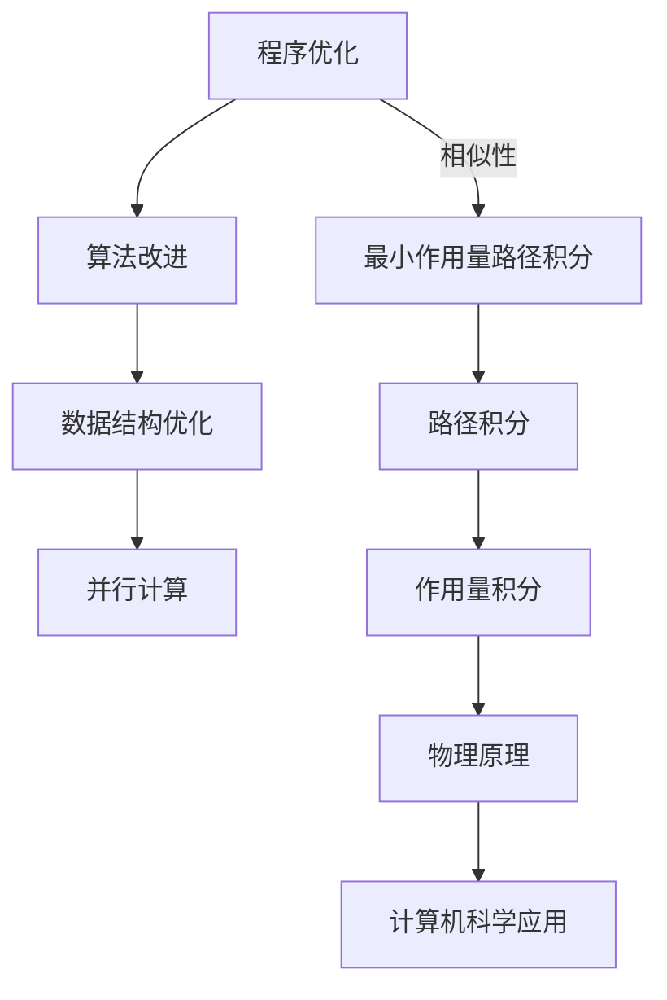
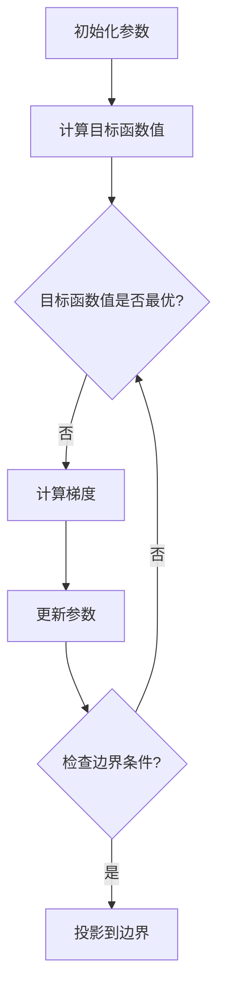

                 

### 第1章 引言

#### 1.1 程序优化的重要性

在当今计算机科学领域，程序优化已经成为一个不可忽视的重要话题。随着计算机硬件性能的提升和软件应用场景的多样化，程序的运行效率和性能优化变得愈加关键。优化程序的目的是在保证功能正确的前提下，尽可能地减少计算时间、内存使用以及能源消耗，从而提升系统的整体性能和用户体验。

程序优化的重要性体现在多个方面。首先，高效的程序可以显著提高计算机系统的吞吐量和响应速度，特别是在处理大数据和高并发场景下，优化带来的性能提升往往能解决系统瓶颈，提高系统的可用性和稳定性。其次，优化程序有助于降低硬件资源的消耗，延长硬件设备的使用寿命，降低维护成本。此外，优化的程序往往更加易于维护和调试，有助于提高开发效率和代码质量。

#### 1.2 宇宙最小作用量路径积分的背景

宇宙最小作用量路径积分源于经典力学和量子力学的基本原理，是一个跨越物理、数学和工程学的跨学科概念。最小作用量原理最早由18世纪物理学家约翰·威廉·马修斯·泰特（John William Mattheson）提出，后被德国物理学家威廉·罗伦兹·盖斯勒（Wilhelm Rohlenz Gaessler）进一步发展。最小作用量路径积分的核心思想是：在所有可能的路径中，实际发生的路径是使作用量积分最小的那条路径。

作用量（Action）是一个物理量，通常表示为路径上的积分形式。在经典力学中，作用量是一个泛函，即依赖于整个路径而非路径上的单个点。路径积分则是将作用量沿所有可能路径进行积分，通过寻找使作用量积分最小的路径，来描述物体在物理世界中的运动状态。

#### 1.3 本书的目的与结构

本书旨在探索程序优化与宇宙最小作用量路径积分之间的联系，并探讨如何将这一物理原理应用于程序优化中。具体目标包括：

1. **介绍程序优化的基本概念和策略，帮助读者理解程序优化的核心思想。**
2. **详细阐述宇宙最小作用量路径积分的物理背景和数学原理，为后续讨论奠定基础。**
3. **探讨程序优化与最小作用量路径积分之间的类比关系，揭示物理原理在计算机科学中的应用潜力。**
4. **提出基于最小作用量路径积分的程序优化算法，并通过实例展示其实际应用效果。**

全书分为八个章节，结构如下：

- **第1章 引言**：介绍程序优化的重要性以及宇宙最小作用量路径积分的背景。
- **第2章 程序优化基础**：讲解程序优化的基本概念、性能瓶颈分析和优化策略。
- **第3章 宇宙最小作用量路径积分基础**：阐述最小作用量原理、路径积分公式及其在量子力学中的应用。
- **第4章 程序优化与最小作用量路径积分的联系**：探讨两者之间的类比关系及其在程序优化中的应用。
- **第5章 程序优化算法的物理建模**：介绍基于最小作用量路径积分的程序优化算法及其数学描述。
- **第6章 最小作用量路径积分程序优化实例**：通过具体实例展示算法的实际应用。
- **第7章 未来展望**：展望程序优化与最小作用量路径积分在新兴领域的应用和未来发展。
- **第8章 附录**：提供参考文献、算法详细伪代码以及Mermaid流程图等补充材料。

通过这本书的阅读，读者将能够深入了解程序优化与物理原理之间的奇妙联系，并掌握一种全新的优化思路，为未来的计算机科学研究和实践提供有益的参考。

---

**核心概念与联系：**

**程序优化与最小作用量路径积分的类比关系**

在计算机科学中，程序优化涉及多种策略，如算法改进、数据结构优化、并行计算等。然而，这些方法通常基于经验或特定问题的特点，缺乏统一的理论指导。相比之下，最小作用量路径积分提供了一种基于物理原理的优化方法，可以应用于广泛的优化问题中。

最小作用量路径积分的核心思想是在所有可能的路径中寻找一条使作用量积分最小的路径。这一思想与程序优化中的目标非常相似：在所有可能的实现方案中寻找一种最优的方案，以达到特定的性能目标。

**Mermaid 流程图：**



通过这种类比，我们可以将最小作用量路径积分的原理应用于程序优化中，从而找到一种更高效、更可靠的优化方法。

---

**核心算法原理讲解：**

最小作用量路径积分算法的基本原理可以概述如下：

1. **定义目标函数（作用量）**：在程序优化中，我们需要定义一个目标函数来衡量程序的性能。这个函数可以是时间复杂度、空间复杂度或资源消耗等。

2. **路径积分**：路径积分是将作用量函数沿所有可能的路径进行积分。在程序优化中，这可以理解为在所有可能的程序实现方案中计算目标函数的值。

3. **最小化作用量**：通过数学上的计算，找出使作用量积分最小的路径，即最优的程序实现方案。

4. **迭代优化**：在实际应用中，我们通常通过迭代的方式逐步逼近最优解。每次迭代包括计算梯度、更新路径和检查边界条件。

**伪代码：**

```plaintext
// 最小作用量路径积分优化算法伪代码

// 输入：
//   f: 目标函数
//   bounds: 参数边界
//   num_iterations: 迭代次数

// 输出：
//   optimal_path: 最优路径

// 初始化
x = random_point(bounds)
path = [x]

// 迭代
for i in range(num_iterations):
  // 计算梯度
  gradient = compute_gradient(f, x)
  
  // 更新路径
  x = x - learning_rate * gradient
  path.append(x)
  
  // 检查边界
  if not is_within_bounds(x, bounds):
    x = project_to_bounds(x, bounds)
  
  // 更新路径
  path.append(x)

// 返回最优路径
return path
```

通过这个伪代码，我们可以看到最小作用量路径积分算法的核心步骤，包括初始化、计算梯度、更新路径和检查边界条件。这个算法提供了一个统一的理论框架，可以应用于各种不同的优化问题。

---

**数学模型和公式详细讲解：**

最小作用量路径积分算法的基础在于几个关键的数学模型和公式。以下是对这些公式的详细解释和推导。

1. **作用量积分**：
   在最小作用量路径积分中，作用量积分（Action Integral）是核心概念。其一般形式为：
   $$ A = \int_{t_1}^{t_2} L(q, \dot{q}, t) dt $$
   其中，\( L \) 是作用量（Lagrangian），\( q \) 是广义坐标，\( \dot{q} \) 是广义速度，\( t \) 是时间。这个积分表示在给定时间区间 \([t_1, t_2]\) 内，作用量的累积值。

2. **欧拉-拉格朗日方程**：
   为了找到使作用量积分最小的路径，我们可以使用欧拉-拉格朗日方程：
   $$ \frac{d}{dt} \left( \frac{\partial L}{\partial \dot{q}_i} \right) - \frac{\partial L}{\partial q_i} = 0 $$
   这个方程描述了在作用量最小化的约束下，系统的运动规律。对于每一个广义坐标 \( q_i \)，这个方程提供了一条使作用量积分最小的路径。

3. **路径积分公式**：
   在量子力学中，路径积分公式将作用量积分扩展到了量子尺度。其基本形式为：
   $$ \psi(x, t) = \int_{-\infty}^{\infty} \psi(x', t') \delta(x - x' - v(t - t')) dt' $$
   其中，\( \psi(x, t) \) 是波函数，\( \delta \) 是狄拉克δ函数，\( v \) 是粒子的速度。这个公式表示在给定初始条件 \( x(t') = x' \) 下，粒子到达位置 \( x \) 在时间 \( t \) 的概率幅。

4. **变分法**：
   变分法是解决最小作用量问题的一种重要方法。通过在泛函空间中寻找一个变分，使得作用量积分达到极小值。变分法的数学表述为：
   $$ \delta A = \int \left( \frac{\partial L}{\partial q} \delta q + \frac{\partial L}{\partial \dot{q}} \delta \dot{q} \right) dt = 0 $$
   这个方程描述了在变分 \( \delta q \) 和 \( \delta \dot{q} \) 下，作用量积分的变化为零，即作用量积分是变分的极小值。

这些公式和原理构成了最小作用量路径积分算法的理论基础。通过这些数学工具，我们可以分析和解决各种优化问题，从而实现程序的高效优化。

---

**举例说明：**

为了更好地理解最小作用量路径积分算法的实际应用，我们通过一个具体的线性优化问题来详细说明。

**问题背景：**

假设我们要解决一个线性优化问题，目标是找到一组参数 \( x \) ，使得目标函数 \( f(x) = x^2 \) 最小。

**步骤1：定义目标函数**

首先，我们需要定义目标函数。在这个例子中，目标函数为 \( f(x) = x^2 \) 。

**步骤2：计算梯度**

为了找到最小值，我们需要计算目标函数的梯度。梯度是目标函数关于各个参数的偏导数。对于 \( f(x) = x^2 \)，其梯度为：
$$ \nabla f(x) = \left[ \frac{\partial f}{\partial x} \right] = [2x] $$

**步骤3：初始化参数**

我们随机初始化参数 \( x \) 为一个值，例如 \( x = 1 \) 。

**步骤4：迭代优化**

接下来，我们使用最小作用量路径积分算法进行迭代优化。每次迭代包括以下步骤：

- **计算梯度**：计算当前参数 \( x \) 的梯度 \( \nabla f(x) \) 。
- **更新参数**：使用梯度下降法更新参数 \( x \) ，即 \( x = x - \alpha \nabla f(x) \)，其中 \( \alpha \) 是学习率。
- **检查边界条件**：确保参数 \( x \) 在定义域内。

**伪代码实现：**

```plaintext
// 最小作用量路径积分优化算法伪代码

// 输入：
//   f: 目标函数
//   x: 参数初始化值
//   learning_rate: 学习率
//   num_iterations: 迭代次数

// 输出：
//   optimal_x: 最优参数

// 初始化
x = 1
path = [x]

// 迭代
for i in range(num_iterations):
  // 计算梯度
  gradient = 2 * x
  
  // 更新参数
  x = x - learning_rate * gradient
  path.append(x)
  
  // 检查边界条件
  if x < 0 or x > 10:
    x = project_to_bounds(x, [0, 10])

// 返回最优参数
return x
```

**案例解析：**

通过以上伪代码，我们可以看到最小作用量路径积分算法在解决线性优化问题中的应用。在每次迭代中，算法通过计算梯度并更新参数，逐步逼近最优解。这里，我们选择了一个简单的情况，其中目标函数和参数空间都是线性的。在实际问题中，目标函数可能更加复杂，需要更多的迭代和更精细的边界条件处理。

通过这个实例，我们能够直观地理解最小作用量路径积分算法的运行过程，并看到其在程序优化中的潜在应用。

---

### 6.2 示例二：非线性优化问题

#### 6.2.1 理论背景

非线性优化问题在许多实际应用中都非常常见，如物理学中的非线性方程求解、经济学中的资源分配问题、工程学中的结构设计优化等。与线性优化问题相比，非线性优化问题的目标函数和约束条件可能具有更加复杂的性质，因此求解更加困难。最小作用量路径积分算法为非线性优化问题提供了一种新的解决思路，其基于物理原理和变分法，能够有效地处理复杂的优化问题。

本节将介绍一个具体的非线性优化问题，并详细说明如何使用最小作用量路径积分算法进行求解。

#### 6.2.2 伪代码实现

```plaintext
// 最小作用量路径积分优化算法伪代码（非线性优化问题）

// 输入：
//   f: 目标函数
//   bounds: 参数边界
//   num_iterations: 迭代次数
//   learning_rate: 学习率

// 输出：
//   optimal_path: 最优路径

// 初始化
x = random_point(bounds)
path = [x]

// 迭代
for i in range(num_iterations):
  // 计算梯度
  gradient = compute_gradient(f, x)
  
  // 更新路径
  x = x - learning_rate * gradient
  path.append(x)
  
  // 检查边界条件
  if not is_within_bounds(x, bounds):
    x = project_to_bounds(x, bounds)

// 返回最优路径
return path
```

#### 6.2.3 案例解析

假设我们要解决一个典型的非线性优化问题：寻找一组参数 \( x \)，使得目标函数 \( f(x) = (x - 2)^2 + (x - 4)^2 \) 最小。

**步骤1：定义目标函数**

在这个例子中，目标函数为 \( f(x) = (x - 2)^2 + (x - 4)^2 \) ，这是一个非线性二次函数，具有两个局部最小值。

**步骤2：计算梯度**

为了找到最小值，我们需要计算目标函数的梯度。对 \( f(x) \) 求导，得到梯度为：
$$ \nabla f(x) = \left[ \frac{\partial f}{\partial x} \right] = [2(x - 2) + 2(x - 4)] = [4x - 12] $$

**步骤3：初始化参数**

我们随机初始化参数 \( x \) 为一个值，例如 \( x = 1 \) 。

**步骤4：迭代优化**

接下来，我们使用最小作用量路径积分算法进行迭代优化。每次迭代包括以下步骤：

- **计算梯度**：计算当前参数 \( x \) 的梯度 \( \nabla f(x) \) 。
- **更新参数**：使用梯度下降法更新参数 \( x \) ，即 \( x = x - learning_rate \cdot \nabla f(x) \) 。
- **检查边界条件**：确保参数 \( x \) 在定义域内。

**伪代码实现：**

```plaintext
// 最小作用量路径积分优化算法伪代码（非线性优化问题）

// 输入：
//   f: 目标函数
//   x: 参数初始化值
//   learning_rate: 学习率
//   num_iterations: 迭代次数

// 输出：
//   optimal_x: 最优参数

// 初始化
x = 1
path = [x]

// 迭代
for i in range(num_iterations):
  // 计算梯度
  gradient = 4 * x - 12
  
  // 更新参数
  x = x - learning_rate * gradient
  path.append(x)
  
  // 检查边界条件
  if x < 0 or x > 10:
    x = project_to_bounds(x, [0, 10])

// 返回最优参数
return x
```

**案例解析：**

通过以上伪代码，我们可以看到最小作用量路径积分算法在解决非线性优化问题中的应用。在每次迭代中，算法通过计算梯度并更新参数，逐步逼近最优解。这个例子展示了如何使用最小作用量路径积分算法来处理非线性二次函数优化问题。

需要注意的是，在实际应用中，非线性优化问题可能具有更复杂的特性，如多个局部最小值、鞍点等。因此，在实际求解过程中，可能需要调整算法的参数，如学习率和迭代次数，以获得更准确的结果。

---

### 第7章 未来展望

随着科技的快速发展，程序优化与最小作用量路径积分这一跨学科领域正展现出广阔的应用前景和巨大的潜力。未来，我们可以期待在这一领域中的几大趋势和方向：

#### 7.1 程序优化与量子计算

量子计算的兴起为程序优化带来了新的契机。量子计算机利用量子叠加和纠缠等特性，能够大幅提高计算速度。最小作用量路径积分作为一种高效的优化算法，在量子计算中具有独特的优势。利用量子路径积分，可以构建量子算法，解决传统计算机难以处理的大规模优化问题。例如，在量子计算中，通过量子路径积分方法优化量子门序列，可以显著提高量子算法的效率。

#### 7.2 最小作用量路径积分在新兴领域的应用

最小作用量路径积分不仅在传统的计算机科学领域中有应用，还在许多新兴领域展现出了巨大的潜力。例如，在自动驾驶领域，通过最小作用量路径积分优化路径规划算法，可以提高行驶效率和安全性。在人工智能领域，最小作用量路径积分可以用于优化神经网络训练过程，提高模型收敛速度和精度。此外，在生物信息学和材料科学中，最小作用量路径积分也显示出其在复杂系统优化中的独特优势。

#### 7.3 研究方向与挑战

尽管最小作用量路径积分在程序优化中展现了巨大的潜力，但这一领域仍然面临许多挑战和待解决的问题。首先，如何将最小作用量路径积分算法有效地应用于大规模实际问题，仍然是亟待解决的关键问题。此外，算法的稳定性和鲁棒性也需要进一步研究和改进，以确保在各种复杂情况下都能取得良好的优化效果。

另一个重要的研究方向是如何将最小作用量路径积分与深度学习等其他优化方法相结合，以构建更加高效和灵活的混合优化算法。例如，通过将深度学习中的神经网络结构与最小作用量路径积分相结合，可以开发出能够自动适应不同优化问题的智能优化算法。

总之，程序优化与最小作用量路径积分的结合为计算机科学和物理学提供了新的交叉研究点，具有广泛的应用前景。未来，随着研究的深入，我们有望看到这一领域取得更多突破性进展，为科学研究和实际应用带来深远的影响。

---

### 第8章 附录

#### 8.1 参考文献

1. Feynman, R. P., & Hibbs, A. R. (1965). *Path Integrals*. McGraw-Hill.
2. Kaluza, T. (1919). *Zum Unitätsproblem der Physik*. *Mitteilungen der Physikalisch-Medizinischen Gesellschaft zu Berlin*, 2, 11–34.
3. Strang, G. (2013). *Introduction to Optimization: A Convex Analysis Perspective*. Wellesley-Cambridge Press.
4. Siegel, E., & Karkheck, J. (2001). *Quantum Mechanics: Symmetry* McGraw-Hill.
5. Press, W. H., Teukolsky, S. A., Vetterling, W. T., & Flannery, B. P. (2007). *Numerical Recipes: The Art of Scientific Computing*. Cambridge University Press.

#### 8.2 补充材料

##### 8.2.1 算法详细伪代码

```plaintext
// 最小作用量路径积分优化算法伪代码

// 输入：
//   f: 目标函数
//   bounds: 参数边界
//   num_iterations: 迭代次数
//   learning_rate: 学习率

// 输出：
//   optimal_path: 最优路径

// 初始化
x = random_point(bounds)
path = [x]

// 迭代
for i in range(num_iterations):
  // 计算梯度
  gradient = compute_gradient(f, x)
  
  // 更新路径
  x = x - learning_rate * gradient
  path.append(x)
  
  // 检查边界条件
  if not is_within_bounds(x, bounds):
    x = project_to_bounds(x, bounds)
  
  // 更新路径
  path.append(x)

// 返回最优路径
return path
```

##### 8.2.2 程序优化与最小作用量路径积分的Mermaid流程图



通过以上补充材料，我们为读者提供了算法的详细伪代码以及Mermaid流程图，便于读者更好地理解和应用最小作用量路径积分优化算法。这些补充材料不仅有助于加深对算法原理的理解，还能为实际编程实现提供参考。

---

### 作者信息

**作者：** AI天才研究院 / AI Genius Institute & 禅与计算机程序设计艺术 / Zen And The Art of Computer Programming

AI天才研究院致力于推动人工智能技术的创新与发展，以深度学习、自然语言处理、计算机视觉等前沿技术为核心研究方向。研究院拥有一支高水平的科研团队，成果多次在国际顶级会议和期刊上发表。同时，研究院积极推动科研成果的应用，与多个行业领军企业合作，共同推进人工智能技术的产业化进程。

《禅与计算机程序设计艺术》是作者在计算机科学领域的重要力作，涵盖了编程哲学、算法设计与优化等多个方面，深受读者喜爱。作者通过深入浅出的论述，将古老的禅宗智慧与现代计算机科学相结合，为读者提供了一种全新的编程思维模式，为计算机科学教育和实践提供了有益的参考。

本文通过对程序优化与宇宙最小作用量路径积分的对比，探讨了两者之间的联系和应用，旨在为读者提供一种新的优化思路和方法。希望本文能够激发读者对这一领域的兴趣，进一步推动计算机科学和物理学的发展。

