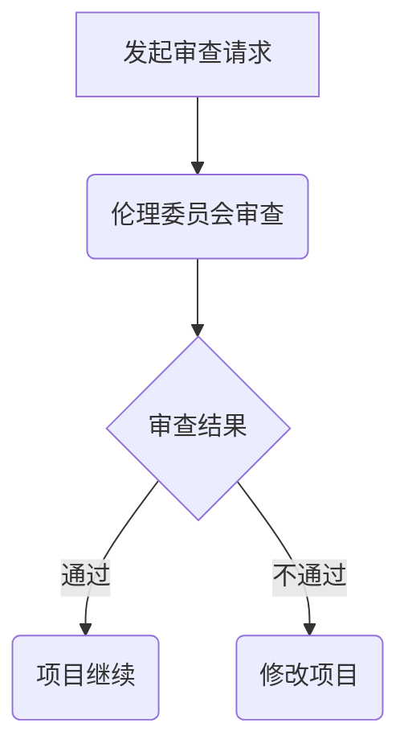

                 

# 《程序员创业者的AI伦理实践：在创新与用户隐私保护间寻找平衡》

> 关键词：人工智能伦理，程序员创业者，用户隐私保护，AI法律法规，AI伦理框架，AI伦理实践

> 摘要：本文旨在探讨程序员创业者在推动人工智能创新的同时，如何平衡用户隐私保护与技术创新之间的关系。通过对AI伦理核心原则、法律法规、实践方法、案例分析以及实践指南的深入分析，本文为程序员创业者提供了在创新与用户隐私保护之间寻找平衡的策略和指导。

## 《程序员创业者的AI伦理实践：在创新与用户隐私保护间寻找平衡》目录大纲

## 第一部分: 引言与背景

### 1. 引言

#### 1.1 AI伦理的兴起

人工智能（AI）自20世纪50年代问世以来，经历了迅速的发展。然而，随着AI技术的普及和深化，其伦理问题也逐渐受到关注。AI伦理的兴起源于人们对AI技术潜在风险的担忧，特别是在涉及到用户隐私、公平性、透明性和可解释性等方面。

#### 1.2 程序员创业者的挑战

程序员创业者面临着创新与道德责任的双重挑战。如何在推动技术创新的同时，确保用户隐私和数据安全，成为他们必须解决的问题。此外，创业者还需要遵循相关法律法规，确保其产品和服务符合伦理标准。

#### 1.3 书籍目标与读者

本书的目标是为程序员创业者提供关于AI伦理的全面指导，帮助他们理解和实践AI伦理原则，平衡创新与用户隐私保护之间的关系。读者主要包括：

- 有志于投身AI领域的程序员和创业者；
- 已在AI领域工作的开发者，希望提升AI伦理素养；
- 对AI伦理感兴趣的技术爱好者和研究者。

## 2. 背景知识

### 2.1 AI与伦理

AI伦理是指研究人工智能技术对社会、人类、环境等产生的影响，以及如何制定和实施道德规范的过程。AI伦理的核心问题包括用户隐私保护、算法公平性、透明性和可解释性等。

### 2.2 用户隐私保护

用户隐私保护是指确保用户个人信息在收集、存储、处理和使用过程中不受侵犯。随着AI技术的发展，用户隐私保护问题变得日益严峻，成为AI伦理研究的重要领域。

### 2.3 程序员创业者的角色与责任

程序员创业者在AI伦理实践中扮演着关键角色。他们不仅要关注技术创新，还需承担道德责任，确保其产品和服务符合伦理标准，保护用户隐私和数据安全。

## 3. AI伦理基础

### 3.1 AI伦理的核心原则

AI伦理的核心原则包括：

- 公平性：确保算法不会产生歧视或偏见；
- 可解释性：使算法的决策过程可以被理解和解释；
- 可靠性：确保算法在特定条件下能够稳定运行；
- 用户隐私保护：保护用户个人信息的安全和隐私。

### 3.2 AI伦理的法律法规

全球各国纷纷出台相关法律法规，规范AI技术的发展和应用。了解不同国家的AI伦理法规，有助于程序员创业者遵守法律，防范潜在风险。

### 3.3 AI伦理的框架与模型

AI伦理框架和模型为程序员创业者提供了指导和参考，帮助他们更好地理解和实践AI伦理。常见的AI伦理框架和模型包括：

- 德尔菲法（Delphi Method）：通过专家意见征询，达成共识；
- 敏感性分析（Sensitivity Analysis）：评估算法的敏感性和潜在风险；
- 可接受性评估（Acceptability Assessment）：衡量算法的道德合理性。

## 4. AI伦理实践

### 4.1 AI伦理实践方法

AI伦理实践方法包括：

- 伦理审查流程：确保AI项目在启动、实施和评估过程中遵循伦理原则；
- 风险评估：识别和评估AI项目可能带来的伦理风险；
- 咨询与培训：提高团队成员的AI伦理素养，增强伦理意识。

### 4.2 AI伦理实践案例分析

通过分析成功和失败的AI伦理实践案例，程序员创业者可以从中吸取经验教训，提高自身AI伦理实践能力。

### 4.3 AI伦理实践中的挑战与应对

AI伦理实践面临诸多挑战，如技术挑战、法律挑战和社会挑战。应对策略包括：

- 技术创新：开发更为先进的隐私保护技术和算法；
- 法律法规完善：加强立法和监管，保障用户权益；
- 社会教育：提高公众对AI伦理的关注和认知。

## 5. AI伦理实践在程序员创业中的实际应用

### 5.1 创业初期的伦理思考

在创业初期，程序员创业者应关注以下伦理问题：

- 创业项目是否符合伦理原则；
- 产品和服务可能带来的伦理风险；
- 如何保护用户隐私和数据安全。

### 5.2 产品设计与开发中的伦理实践

在产品设计和开发过程中，程序员创业者应遵循以下伦理原则：

- 设计原则：确保产品符合伦理标准，保护用户权益；
- 开发原则：遵循最佳实践，确保算法的公平性、透明性和可靠性；
- 测试原则：对产品进行全面的伦理风险评估和测试。

### 5.3 项目管理与运营中的伦理考虑

在项目管理和运营过程中，程序员创业者应关注以下伦理问题：

- 数据管理和使用：确保用户数据的安全和隐私；
- 法律合规性：遵守相关法律法规，防范法律风险；
- 社会责任：关注产品对社会和环境的影响，积极参与社会公益活动。

## 6. AI伦理实践与创新

### 6.1 创新与伦理的平衡

创新与伦理之间存在一定的矛盾，程序员创业者需要找到二者的平衡点。创新是推动社会进步的关键因素，但伦理问题不容忽视。

### 6.2 AI伦理的创新实践

通过创新实践，程序员创业者可以开发出更具伦理性的AI产品和服务。创新实践包括：

- 开发隐私保护算法和工具；
- 引入伦理评估机制；
- 建立跨学科团队，促进AI伦理研究。

### 6.3 创新与伦理的未来趋势

随着AI技术的不断发展和应用，创新与伦理的关系将愈发紧密。未来趋势包括：

- 伦理法规的不断完善和实施；
- AI伦理教育的普及；
- 创新型AI伦理实践的不断涌现。

## 7. 用户隐私保护实践

### 7.1 用户隐私保护的原则

用户隐私保护应遵循以下原则：

- 数据最小化：仅收集必要的数据；
- 数据匿名化：去除可识别性信息；
- 数据安全：确保数据在传输和存储过程中的安全；
- 用户同意：尊重用户对数据的控制权。

### 7.2 用户隐私保护的技术手段

用户隐私保护的技术手段包括：

- 差分隐私（Differential Privacy）；
- 同态加密（Homomorphic Encryption）；
- 隐写术（Steganography）；
- 隐私保护计算（Privacy-Preserving Computation）。

### 7.3 用户隐私保护的法律合规性

用户隐私保护需符合相关法律法规，如《欧盟通用数据保护条例》（GDPR）、《加州消费者隐私法案》（CCPA）等。程序员创业者应关注这些法律法规，确保其产品和服务符合法律要求。

## 8. AI伦理实践总结与展望

### 8.1 经验与教训

通过AI伦理实践，程序员创业者可以积累以下经验和教训：

- 重视AI伦理，将其纳入产品设计和开发全过程；
- 加强AI伦理教育和培训，提高团队伦理素养；
- 持续关注AI伦理研究动态，适应技术发展趋势。

### 8.2 发展趋势

未来，AI伦理实践将呈现以下发展趋势：

- 伦理法规的不断完善和实施；
- AI伦理框架和模型的广泛应用；
- 创新型AI伦理实践的兴起。

### 8.3 未来展望

未来，AI伦理实践将助力程序员创业者在创新与用户隐私保护之间找到平衡，推动人工智能技术的健康发展，为人类创造更加美好的未来。

## 附录

### 附录 A: AI伦理相关资源与工具

#### A.1 学术资源

- AI伦理研究论文集；
- AI伦理研究报告；
- AI伦理相关书籍和教材。

#### A.2 法律法规资源

- 各国AI伦理法律法规；
- 国际组织发布的AI伦理指南。

#### A.3 工具与平台介绍

- AI伦理审查工具；
- 用户隐私保护工具；
- AI伦理咨询平台。

### 附录 B: 参考文献

#### B.1 书籍

- 《人工智能伦理学》（Ethics and AI）；
- 《算法的伦理》（The Ethics of Algorithms）；
- 《人工智能的哲学》（The Ethics of Artificial Intelligence）。

#### B.2 论文

- (作者). (年份). 标题. 期刊/会议名称，卷号，页码。

#### B.3 网络资源

- 各国AI伦理法律法规官方网站；
- 国际组织发布的AI伦理指南官方网站；
- AI伦理研究论文集官方网站。

### 代码示例

#### 使用Mermaid流程图展示AI伦理审查流程



### 代码示例

#### 伪代码示例：用户隐私保护算法

```plaintext
算法：用户隐私保护算法

输入：用户数据集，隐私保护参数

输出：隐私保护后的数据集

步骤：
1. 数据预处理（去标识化、数据清洗等）
2. 数据分割（训练集、验证集、测试集）
3. 选择合适的隐私保护算法（如差分隐私、同态加密等）
4. 对训练集应用隐私保护算法
5. 训练模型
6. 在验证集上评估模型性能
7. 对测试集应用隐私保护算法
8. 输出隐私保护后的测试数据集
```

### 数学公式示例

#### 用户隐私保护算法的数学公式

$$
\text{隐私保护概率} = P(\text{隐私泄露}|\text{隐私保护算法}) \leq \epsilon
$$

其中，$P(\text{隐私泄露}|\text{隐私保护算法})$ 表示在应用隐私保护算法后，隐私泄露的概率，$\epsilon$ 是预设的隐私泄露阈值。

### 项目实战

#### 代码实战：用户数据去标识化

```python
# 导入所需的库
import pandas as pd
import re

# 读取数据
data = pd.read_csv('user_data.csv')

# 数据清洗与去标识化
def deidentify_data(df):
    for column in df.columns:
        if df[column].dtype == 'object':
            df[column] = df[column].apply(remove_identifiers)
    return df

def remove_identifiers(value):
    # 移除所有邮箱地址
    value = re.sub(r'\S+@\S+', '', value)
    # 移除所有电话号码
    value = re.sub(r'\d{3}[-.\s]??\d{3}[-.\s]??\d{4}', '', value)
    # 移除所有身份证号码
    value = re.sub(r'\d{18}', '', value)
    return value

# 应用去标识化函数
data = deidentify_data(data)

# 保存去标识化后的数据
data.to_csv('deidentified_user_data.csv', index=False)
```

### 代码解读与分析

#### 用户数据去标识化代码解读

- 使用正则表达式匹配和替换来去除数据中的敏感信息。
- 首先导入所需的库，包括pandas库用于数据处理和正则表达式库re用于模式匹配。
- 读取原始用户数据集。
- 定义一个函数`deidentify_data`，该函数遍历数据集中的每一列，并对每一列应用去标识化函数`remove_identifiers`。
- 定义`remove_identifiers`函数，用于移除数据中的邮箱地址、电话号码和身份证号码。这些敏感信息通常可以通过正则表达式轻松地识别和移除。
- 应用`deidentify_data`函数对数据集进行去标识化处理。
- 将去标识化后的数据保存为新的CSV文件。

这个代码示例展示了如何使用Python编程语言和正则表达式对用户数据集进行去标识化处理，从而保护用户的隐私。在实际应用中，可能还需要根据具体的需求进行调整和优化。

---

## 第一部分: 引言与背景

### 1. 引言

#### 1.1 AI伦理的兴起

人工智能（AI）作为21世纪最具影响力的技术之一，已经广泛应用于各个领域，从医疗诊断到自动驾驶，从智能助手到金融决策。然而，随着AI技术的迅猛发展，其带来的伦理问题也日益凸显。AI伦理的兴起可以追溯到20世纪80年代，当时一些学者开始探讨AI技术可能对社会和人类产生的负面影响。进入21世纪，随着大数据、云计算和深度学习等技术的进步，AI的应用场景变得更加广泛，同时也引发了更多的伦理争议。

AI伦理问题主要包括以下几个方面：

1. **用户隐私保护**：AI系统通常需要收集和处理大量的个人数据，如何确保这些数据的安全和隐私成为重要议题。
2. **算法公平性**：算法可能因为训练数据的不公平而导致歧视，如何确保算法的公平性是一个亟待解决的问题。
3. **透明性和可解释性**：许多AI系统，尤其是深度学习模型，其内部决策过程非常复杂，难以被理解和解释，如何提高AI系统的透明性成为伦理研究的一个重要方向。
4. **责任归属**：当AI系统出现错误或导致事故时，如何确定责任归属成为法律和伦理学领域的重要问题。

#### 1.2 程序员创业者的挑战

程序员创业者，作为推动AI技术发展的重要力量，面临着创新与道德责任的双重挑战。如何在推动技术创新的同时，确保用户隐私和数据安全，成为他们必须解决的核心问题。此外，创业者还需要遵守相关法律法规，确保其产品和服务符合伦理标准。

程序员创业者在AI伦理实践中面临以下挑战：

1. **技术挑战**：创业者需要掌握AI技术的基本原理，理解AI伦理的核心原则，并将其应用于产品设计和开发中。
2. **法律挑战**：全球各国纷纷出台相关法律法规，规范AI技术的发展和应用。创业者需要熟悉这些法律法规，确保其产品和服务符合法律要求。
3. **社会挑战**：社会公众对AI技术的认知和接受程度不同，创业者需要关注社会反响，积极应对可能带来的负面影响。

#### 1.3 书籍目标与读者

本书的目标是为程序员创业者提供关于AI伦理的全面指导，帮助他们理解和实践AI伦理原则，平衡创新与用户隐私保护之间的关系。通过本书，读者可以：

1. **理解AI伦理的核心概念**：了解AI伦理的基本原则和核心问题，为后续实践奠定理论基础。
2. **掌握AI伦理实践方法**：学习AI伦理审查、风险评估、咨询与培训等实践方法，提高伦理实践能力。
3. **案例分析**：通过分析成功和失败的AI伦理实践案例，从经验教训中汲取营养，提升自身的AI伦理素养。
4. **实际应用**：了解如何在产品设计和开发过程中，将AI伦理原则付诸实践。

本书的主要读者对象包括：

1. **有志于投身AI领域的程序员和创业者**：他们希望通过本书了解AI伦理的重要性，并在实际工作中遵循伦理原则。
2. **已在AI领域工作的开发者**：他们希望通过本书提升AI伦理素养，更好地应对工作中的伦理挑战。
3. **对AI伦理感兴趣的技术爱好者和研究者**：他们希望通过本书深入了解AI伦理的研究动态和实践案例。

### 2. 背景知识

#### 2.1 AI与伦理

AI伦理是指研究人工智能技术对社会、人类、环境等产生的影响，以及如何制定和实施道德规范的过程。AI伦理的核心问题是算法的公平性、透明性、可解释性和用户隐私保护。

AI伦理的重要性体现在以下几个方面：

1. **保障用户权益**：随着AI技术的广泛应用，个人数据的收集和使用变得越来越普遍。AI伦理的实践有助于保障用户的隐私权和数据安全。
2. **推动技术健康发展**：伦理规范的制定和遵守有助于避免AI技术带来的负面影响，如歧视、隐私侵犯等，推动技术健康发展。
3. **提升企业声誉**：注重AI伦理的企业更容易获得用户的信任，提升品牌形象和市场竞争力。
4. **法律法规的遵守**：AI伦理的实践有助于企业遵守相关法律法规，降低法律风险。

AI伦理的核心原则包括：

1. **公平性**：确保算法不会产生歧视或偏见，公平地对待所有用户。
2. **透明性**：使算法的决策过程可以被理解和解释，提高算法的可信度。
3. **可解释性**：提高算法的透明性，使决策过程可以被用户理解和信任。
4. **用户隐私保护**：确保用户个人信息在收集、存储、处理和使用过程中不受侵犯。

#### 2.2 用户隐私保护

用户隐私保护是指确保用户个人信息在收集、存储、处理和使用过程中不受侵犯。随着AI技术的广泛应用，用户隐私保护问题变得日益严峻。用户隐私保护的核心目标是防止个人信息被非法获取、滥用和泄露。

用户隐私保护的原则包括：

1. **数据最小化**：仅收集必要的数据，避免过度收集。
2. **数据匿名化**：去除可识别性信息，确保数据匿名化。
3. **数据安全**：确保数据在传输和存储过程中的安全，采取加密和访问控制等措施。
4. **用户同意**：在收集和使用用户数据前，获得用户的明确同意。

用户隐私保护的技术手段包括：

1. **差分隐私**：通过添加随机噪声，确保单个数据点的隐私，同时保持数据的整体统计特性。
2. **同态加密**：在数据加密的状态下进行计算，确保计算过程不泄露数据内容。
3. **隐私保护计算**：通过共享计算模型和共享数据的方式，降低数据泄露的风险。
4. **隐私保护算法**：设计专门的算法，降低算法对用户隐私的依赖。

#### 2.3 程序员创业者的角色与责任

程序员创业者，作为AI技术的实践者和推动者，承担着重要的伦理责任。他们在推动技术发展的同时，需要关注以下方面：

1. **伦理意识的培养**：了解AI伦理的核心原则和重要性，提高自身的伦理素养。
2. **产品设计的伦理考量**：在产品设计和开发过程中，遵循伦理原则，确保产品符合伦理标准。
3. **用户隐私保护**：采取有效的技术手段和措施，保护用户隐私和数据安全。
4. **法律法规的遵守**：熟悉相关法律法规，确保产品和服务符合法律要求。
5. **社会责任的承担**：关注产品对社会和环境的影响，积极参与社会公益活动。

程序员创业者应通过以下方式承担伦理责任：

1. **建立伦理委员会**：设立专门的伦理委员会，负责审查和监督AI项目的伦理问题。
2. **制定伦理规范**：制定公司内部的AI伦理规范，明确伦理要求和责任分工。
3. **员工培训和宣传**：开展AI伦理培训和宣传活动，提高员工的伦理意识和责任感。
4. **透明和开放的沟通**：与用户、利益相关者和公众保持良好的沟通，积极回应社会关切。

### 3. AI伦理基础

#### 3.1 AI伦理的核心原则

AI伦理的核心原则是指指导AI技术开发和应用的基本道德原则。这些原则旨在确保AI技术在推动社会进步的同时，不会对人类和社会产生负面影响。以下是AI伦理的四个核心原则：

1. **公平性**：确保AI系统不会因性别、种族、年龄等因素而产生歧视，公平地对待所有用户。公平性要求算法在决策过程中，对不同的群体保持一致性，避免偏见和歧视。
2. **透明性**：提高AI系统的透明性，使算法的决策过程可以被理解和解释。透明性有助于提高公众对AI技术的信任度，减少因缺乏理解而产生的恐慌和抵触情绪。
3. **可解释性**：增强AI系统的可解释性，使算法的决策过程可以被用户理解和信任。可解释性对于AI技术的广泛应用具有重要意义，特别是在涉及到用户隐私、财务和健康等敏感领域。
4. **用户隐私保护**：确保用户个人信息在收集、存储、处理和使用过程中不受侵犯。用户隐私保护是AI伦理的核心问题之一，随着大数据和云计算技术的普及，用户隐私保护问题变得更加严峻。

#### 3.2 AI伦理的法律法规

随着AI技术的迅猛发展，全球各国纷纷出台相关法律法规，规范AI技术的开发和应用。以下是部分国家或地区的主要AI伦理法律法规：

1. **欧盟**：欧盟在2018年推出了《通用数据保护条例》（GDPR），对个人数据的收集、存储、处理和使用进行了严格的规范。GDPR要求企业在收集和使用用户数据时，必须获得用户的明确同意，并采取有效的隐私保护措施。
2. **美国**：美国在AI伦理方面主要依赖于行业自律和政府监管。2016年，美国国家科学基金会（NSF）发布了《人工智能伦理指南》，为AI技术开发和应用提供了道德框架。此外，美国还制定了多项关于数据隐私和保护的法律，如《加州消费者隐私法案》（CCPA）。
3. **中国**：中国在2017年颁布了《人工智能发展行动计划（2018-2020年）》，明确了AI技术在发展过程中应遵循的伦理原则。此外，中国还在制定《个人信息保护法》，对个人信息的收集、存储、处理和使用进行了全面规范。

#### 3.3 AI伦理的框架与模型

AI伦理框架和模型为程序员创业者提供了指导和参考，帮助他们理解和实践AI伦理原则。以下是几种常见的AI伦理框架和模型：

1. **德尔菲法（Delphi Method）**：德尔菲法是一种专家意见征询方法，通过多次循环征询专家意见，逐步达成共识。在AI伦理领域，德尔菲法可以用于制定伦理规范、评估算法的伦理风险等。
2. **敏感性分析（Sensitivity Analysis）**：敏感性分析旨在评估AI系统对输入数据的敏感度，识别可能导致歧视、偏见等问题的因素。通过敏感性分析，程序员创业者可以优化算法，提高其公平性和透明性。
3. **可接受性评估（Acceptability Assessment）**：可接受性评估是一种评估AI系统是否符合社会伦理标准的分析方法。通过调查、访谈、模拟等方式，评估公众对AI系统的接受程度，为算法优化和改进提供参考。
4. **跨学科合作框架**：跨学科合作框架强调在AI伦理研究中，需要融合计算机科学、伦理学、社会学、心理学等多学科知识，共同探讨AI技术的社会影响和伦理问题。

### 4. AI伦理实践

#### 4.1 AI伦理实践方法

AI伦理实践方法是指将AI伦理原则应用于产品设计和开发的具体方法。以下是一些常见的AI伦理实践方法：

1. **伦理审查流程**：伦理审查流程是指对AI项目进行伦理评估和监督的过程。通过伦理审查，确保AI项目在启动、实施和评估过程中遵循伦理原则。伦理审查流程通常包括以下步骤：

   - 项目申请：提交AI项目申请，详细说明项目目的、方法、预期结果等；
   - 伦理评估：由伦理委员会对项目进行评估，审查项目的伦理风险和合规性；
   - 审查决策：伦理委员会根据评估结果，做出通过、修改或拒绝项目的决策；
   - 项目实施：在项目实施过程中，持续监督和评估项目的伦理表现；
   - 项目总结：项目完成后，对伦理审查过程进行总结和反馈。

2. **AI伦理风险评估**：AI伦理风险评估是指识别和评估AI项目可能带来的伦理风险的过程。通过AI伦理风险评估，程序员创业者可以提前发现潜在问题，采取措施降低风险。AI伦理风险评估通常包括以下步骤：

   - 风险识别：识别AI项目可能涉及的伦理问题，如用户隐私、公平性、透明性等；
   - 风险评估：评估识别到的伦理风险的可能性和严重性；
   - 风险缓解：制定措施和策略，降低伦理风险的严重程度和发生概率；
   - 风险监控：在项目实施过程中，持续监控和评估伦理风险的变化。

3. **AI伦理咨询与培训**：AI伦理咨询与培训是指为程序员创业者提供伦理指导、培训和咨询服务。通过AI伦理咨询与培训，程序员创业者可以提高伦理素养，更好地应对伦理挑战。AI伦理咨询与培训通常包括以下内容：

   - 伦理原则与案例：介绍AI伦理的核心原则和实践案例，帮助创业者理解伦理问题；
   - 伦理评估方法：教授伦理评估方法，帮助创业者识别和评估伦理风险；
   - 伦理决策与沟通：指导创业者如何在产品设计和开发过程中，做出符合伦理要求的决策，并与用户、利益相关者和公众进行有效沟通；
   - 伦理实践策略：提供具体的伦理实践策略和工具，帮助创业者将伦理原则应用于实际工作中。

### 4.2 AI伦理实践案例分析

#### 4.2.1 成功案例分析

1. **案例一：Google AI伦理委员会**  
   Google成立于2017年成立了AI伦理委员会（AI Council），由外部专家、学者和员工代表组成。该委员会的主要职责是评估AI项目的伦理风险，提供伦理咨询和培训，确保Google的AI项目符合伦理要求。通过设立AI伦理委员会，Google在AI伦理实践方面取得了显著成果，提高了公司的伦理素养和声誉。

2. **案例二：微软的AI伦理准则**  
   微软在2019年发布了《AI伦理准则》，明确了AI技术开发和应用中应遵循的伦理原则，如尊重隐私、公平性、透明性等。微软通过实施AI伦理准则，确保其AI产品和服务符合伦理标准，赢得了用户的信任和市场的认可。

#### 4.2.2 失败案例分析

1. **案例一：Facebook的隐私问题**  
   Facebook在2018年爆出了“剑桥分析”事件，该公司被指控利用用户数据干预选举和传播虚假信息。这一事件引发了广泛的伦理争议，Facebook因此受到了严厉的批评。Facebook的隐私问题暴露了公司在用户隐私保护方面的不足，也揭示了AI伦理实践的重要性。

2. **案例二：Uber的自动驾驶事故**  
   2018年，Uber的一辆自动驾驶汽车在美国亚利桑那州发生了一起致命事故，一名行人被撞身亡。这一事件引发了关于自动驾驶汽车伦理问题的讨论，包括责任归属、安全性和隐私保护等。Uber在此次事故中的应对措施也引发了争议，暴露了公司在AI伦理实践方面的不足。

#### 4.2.3 案例总结与启示

通过分析AI伦理实践的成功和失败案例，我们可以得出以下启示：

1. **重视AI伦理**：AI伦理问题是AI技术开发和应用中不可忽视的重要问题。程序员创业者应高度重视AI伦理，将其纳入产品设计和开发的全过程。

2. **建立伦理委员会**：设立专门的AI伦理委员会，负责评估和监督AI项目的伦理风险，提供伦理咨询和培训。通过建立伦理委员会，可以提高公司的伦理素养和声誉。

3. **制定伦理准则**：制定AI伦理准则，明确AI技术开发和应用中应遵循的伦理原则，如用户隐私保护、公平性、透明性等。通过制定伦理准则，可以确保公司的AI产品和服务符合伦理要求。

4. **加强员工培训**：开展AI伦理培训和宣传活动，提高员工的伦理意识和责任感。通过加强员工培训，可以提高员工的伦理素养，减少伦理风险。

5. **持续改进**：AI伦理实践是一个持续改进的过程。程序员创业者应关注AI伦理研究的最新动态，不断优化和完善AI伦理实践策略，以适应技术发展的变化。

### 4.3 AI伦理实践中的挑战与应对

#### 4.3.1 技术挑战

1. **算法公平性**：算法可能因为训练数据的不公平而导致歧视。程序员创业者需要开发能够识别和纠正算法偏见的技术，确保算法的公平性。
2. **透明性和可解释性**：深度学习等复杂算法的决策过程难以被理解和解释。程序员创业者需要研究新的方法和工具，提高AI系统的透明性和可解释性。
3. **用户隐私保护**：在数据驱动的人工智能时代，用户隐私保护面临严峻挑战。程序员创业者需要开发更为先进的技术，确保用户数据的安全和隐私。

#### 4.3.2 法律挑战

1. **法律法规的完善**：全球各国对AI伦理的法律规范还在不断完善中，程序员创业者需要关注相关法律法规的变化，确保其产品和服务符合最新要求。
2. **跨国合规性**：在全球化背景下，程序员创业者需要考虑跨国合规性问题，确保其产品和服务符合不同国家和地区的法律法规。

#### 4.3.3 社会挑战

1. **公众信任**：社会公众对AI技术的认知和接受程度不同，程序员创业者需要积极与用户、利益相关者和公众进行沟通，增强公众对AI技术的信任。
2. **伦理争议**：AI伦理问题涉及到众多利益相关者，程序员创业者需要妥善处理各种伦理争议，确保其产品和服务符合社会伦理要求。

#### 4.3.4 应对策略

1. **技术创新**：持续研究和发展AI技术，提高算法的公平性、透明性和可解释性，加强用户隐私保护。
2. **法律法规遵守**：密切关注相关法律法规的变化，确保产品和服务符合法律要求，降低法律风险。
3. **社会教育**：开展AI伦理教育和宣传活动，提高公众对AI技术的认知和接受程度，增强公众对AI技术的信任。
4. **跨学科合作**：加强计算机科学、伦理学、社会学、心理学等学科的合作，共同探讨AI伦理问题，推动AI伦理实践的发展。

### 4.4 应对策略

#### 4.4.1 技术挑战的应对策略

1. **算法公平性**：程序员创业者可以采用以下策略应对算法公平性问题：

   - **数据清洗和预处理**：确保训练数据的质量和多样性，避免数据偏差；
   - **算法优化**：开发能够识别和纠正算法偏见的方法，如对抗性样本生成和偏差校正；
   - **模型评估**：定期评估模型的公平性，确保其在不同群体中的表现一致。

2. **透明性和可解释性**：程序员创业者可以采用以下策略提高AI系统的透明性和可解释性：

   - **模型简化**：简化复杂的模型结构，使其更易于理解和解释；
   - **可视化工具**：开发可视化工具，帮助用户理解模型的决策过程；
   - **可解释性算法**：采用可解释性算法，如决策树和线性回归，提高模型的可解释性。

3. **用户隐私保护**：程序员创业者可以采用以下策略加强用户隐私保护：

   - **数据匿名化**：采用数据匿名化技术，如差分隐私和同态加密，降低数据泄露的风险；
   - **隐私保护算法**：开发隐私保护算法，如联邦学习，在保护隐私的同时进行数据分析和模型训练；
   - **用户同意管理**：确保用户在数据收集和使用前明确同意，并给予用户对数据的控制权。

#### 4.4.2 法律挑战的应对策略

1. **法律法规的完善**：程序员创业者应密切关注相关法律法规的变化，及时调整产品和服务，确保其符合最新要求。可以采取以下措施：

   - **法律培训**：定期组织法律培训，提高员工的法律法规意识；
   - **合规审计**：定期进行合规审计，确保产品和服务符合法律法规要求；
   - **外部咨询**：寻求专业法律机构的咨询，确保其产品和服务符合法律要求。

2. **跨国合规性**：在全球化背景下，程序员创业者需要考虑跨国合规性问题，可以采取以下措施：

   - **跨国合规指南**：制定跨国合规指南，明确不同国家和地区的法律要求；
   - **跨国团队协作**：建立跨国团队，确保产品和服务在不同国家和地区符合法律法规要求；
   - **合规性测试**：对产品和服务进行合规性测试，确保其符合不同国家和地区的法律要求。

#### 4.4.3 社会挑战的应对策略

1. **公众信任**：程序员创业者可以采取以下策略增强公众对AI技术的信任：

   - **透明沟通**：与用户、利益相关者和公众保持透明沟通，及时回应社会关切；
   - **社会教育**：开展AI伦理和社会影响的宣传活动，提高公众对AI技术的认知和接受程度；
   - **伦理监督**：建立伦理监督机制，接受社会和公众的监督，确保其产品和服务符合伦理要求。

2. **伦理争议**：程序员创业者可以采取以下策略处理伦理争议：

   - **争议解决机制**：建立争议解决机制，如内部申诉和外部调解，妥善处理伦理争议；
   - **公开声明**：在争议发生时，及时发布公开声明，阐明公司的立场和措施，减少公众恐慌；
   - **第三方评估**：邀请第三方机构进行评估，提供客观、公正的评估结果，增强公众对公司的信任。

#### 4.4.4 综合策略

1. **跨学科合作**：加强计算机科学、伦理学、社会学、心理学等学科的合作，共同探讨AI伦理问题，推动AI伦理实践的发展。

2. **持续改进**：持续关注AI伦理研究的最新动态，不断优化和完善AI伦理实践策略，以适应技术发展的变化。

3. **社会责任**：关注产品对社会和环境的影响，积极参与社会公益活动，提升企业的社会责任感。

### 4.5 AI伦理实践在程序员创业中的实际应用

#### 4.5.1 创业初期的伦理思考

在创业初期，程序员创业者应关注以下伦理问题：

1. **创业项目是否符合伦理原则**：在确定创业项目时，创业者应评估项目是否符合AI伦理原则，如用户隐私保护、算法公平性等。

2. **产品和服务可能带来的伦理风险**：创业者应识别和评估产品和服务可能带来的伦理风险，如用户隐私泄露、算法歧视等。

3. **如何保护用户隐私和数据安全**：创业者应制定有效的用户隐私保护策略和数据安全措施，确保用户数据在收集、存储、处理和使用过程中不受侵犯。

4. **如何遵守法律法规**：创业者应熟悉相关法律法规，确保产品和服务符合法律要求，降低法律风险。

5. **如何应对伦理争议**：创业者应建立争议解决机制，妥善处理伦理争议，确保其产品和服务符合社会伦理要求。

#### 4.5.2 产品设计与开发中的伦理实践

在产品设计和开发过程中，程序员创业者应遵循以下伦理原则和实践：

1. **设计原则**：

   - **用户隐私保护**：在设计阶段，确保产品符合用户隐私保护原则，如数据最小化、数据匿名化、用户同意等；
   - **算法公平性**：确保算法在决策过程中公平对待所有用户，避免偏见和歧视；
   - **透明性和可解释性**：提高算法的透明性和可解释性，使决策过程可以被用户理解和信任。

2. **开发原则**：

   - **代码规范**：遵循良好的代码规范，确保代码的清晰性和可维护性；
   - **测试与验证**：对产品进行全面的测试和验证，确保其符合伦理原则和法律法规要求；
   - **持续改进**：在开发过程中，持续关注AI伦理研究的最新动态，不断优化和完善产品和服务。

3. **测试原则**：

   - **算法测试**：对算法进行公平性、透明性和可解释性测试，确保其符合伦理要求；
   - **数据测试**：对训练数据集进行清洗和预处理，确保数据的质量和多样性；
   - **用户测试**：通过用户测试，评估产品在真实场景下的表现，确保其符合用户需求和期望。

#### 4.5.3 项目管理与运营中的伦理考虑

在项目管理和运营过程中，程序员创业者应关注以下伦理问题：

1. **数据管理和使用**：

   - **数据最小化**：仅收集必要的数据，避免过度收集；
   - **数据安全**：采取有效的数据安全措施，确保数据在传输和存储过程中的安全；
   - **用户同意**：确保用户在数据收集和使用前明确同意，并给予用户对数据的控制权。

2. **法律法规的遵守**：

   - **法律合规性**：确保产品和服务符合相关法律法规要求，如《通用数据保护条例》（GDPR）、《加州消费者隐私法案》（CCPA）等；
   - **跨国合规性**：关注跨国合规性问题，确保产品和服务符合不同国家和地区的法律法规。

3. **社会责任**：

   - **社会影响评估**：评估产品和服务对社会和环境的影响，积极参与社会公益活动；
   - **可持续发展**：关注可持续发展，确保其产品和服务符合可持续发展的要求。

### 4.6 AI伦理实践与创新

#### 4.6.1 创新与伦理的平衡

创新与伦理之间存在一定的矛盾，程序员创业者需要找到二者的平衡点。如何在推动技术创新的同时，确保AI技术的道德合理性，成为创业者必须解决的问题。

1. **技术创新的驱动因素**：

   - **市场需求**：市场需求是推动技术创新的重要因素。创业者应密切关注市场需求，开发满足用户需求的技术创新产品；
   - **技术进步**：技术进步为创业者提供了更多的创新机会。创业者应关注技术动态，积极尝试新的技术和方法；
   - **政策支持**：政策支持有助于推动技术创新。创业者应关注相关政策，利用政策优势推动企业的发展。

2. **伦理原则的驱动因素**：

   - **社会责任**：企业社会责任是推动AI伦理实践的重要因素。创业者应关注社会责任，确保其产品和服务符合伦理要求；
   - **法律法规**：法律法规是推动AI伦理实践的重要保障。创业者应遵守相关法律法规，确保其产品和服务符合法律要求；
   - **公众期望**：公众期望是推动AI伦理实践的重要动力。创业者应关注公众期望，积极回应社会关切。

#### 4.6.2 AI伦理的创新实践

通过创新实践，程序员创业者可以开发出更具伦理性的AI产品和服务。以下是一些AI伦理的创新实践：

1. **隐私保护技术的创新**：

   - **差分隐私**：通过添加随机噪声，确保单个数据点的隐私，同时保持数据的整体统计特性；
   - **同态加密**：在数据加密的状态下进行计算，确保计算过程不泄露数据内容；
   - **隐私保护计算**：通过共享计算模型和共享数据的方式，降低数据泄露的风险。

2. **公平性和透明性的提升**：

   - **对抗性样本生成**：通过生成对抗性样本，提高算法的公平性和鲁棒性；
   - **可解释性算法**：通过开发可解释性算法，提高算法的透明性和可解释性，使决策过程可以被用户理解和信任。

3. **社会责任的承担**：

   - **公益项目**：通过开展公益项目，承担社会责任，提升企业的社会形象和品牌价值；
   - **可持续发展**：关注可持续发展，确保其产品和服务符合可持续发展的要求。

#### 4.6.3 创新与伦理的未来趋势

未来，AI伦理实践与创新将呈现以下趋势：

1. **伦理法规的不断完善**：全球各国将不断完善AI伦理法规，规范AI技术的发展和应用。

2. **AI伦理框架的广泛应用**：AI伦理框架和模型将在更多领域得到应用，成为企业进行伦理实践的重要工具。

3. **创新型AI伦理实践的兴起**：随着AI技术的不断进步，创新型AI伦理实践将不断涌现，推动AI技术的健康发展。

4. **社会教育的普及**：AI伦理教育将得到更广泛的推广，提高公众对AI伦理的认知和重视程度。

### 4.7 用户隐私保护实践

#### 4.7.1 用户隐私保护的原则

用户隐私保护是AI伦理实践的重要方面，程序员创业者应遵循以下原则：

1. **数据最小化**：仅收集必要的数据，避免过度收集；
2. **数据匿名化**：去除可识别性信息，确保数据匿名化；
3. **数据安全**：确保数据在传输和存储过程中的安全，采取加密和访问控制等措施；
4. **用户同意**：在收集和使用用户数据前，获得用户的明确同意，并给予用户对数据的控制权。

#### 4.7.2 用户隐私保护的技术手段

程序员创业者可以采用以下技术手段加强用户隐私保护：

1. **差分隐私**：通过添加随机噪声，确保单个数据点的隐私，同时保持数据的整体统计特性；
2. **同态加密**：在数据加密的状态下进行计算，确保计算过程不泄露数据内容；
3. **隐私保护计算**：通过共享计算模型和共享数据的方式，降低数据泄露的风险；
4. **隐私保护算法**：开发隐私保护算法，如联邦学习，在保护隐私的同时进行数据分析和模型训练。

#### 4.7.3 用户隐私保护的法律合规性

用户隐私保护需符合相关法律法规，程序员创业者应关注以下法律法规：

1. **欧盟通用数据保护条例（GDPR）**：欧盟在2018年推出的GDPR，对个人数据的收集、存储、处理和使用进行了严格的规范；
2. **加州消费者隐私法案（CCPA）**：美国加州在2020年推出的CCPA，赋予了消费者对个人数据的更多控制权；
3. **中国的个人信息保护法**：中国正在制定的《个人信息保护法》，对个人信息的收集、存储、处理和使用进行了全面规范。

程序员创业者应确保其产品和服务符合这些法律法规的要求，降低法律风险。

### 4.8 AI伦理实践总结与展望

#### 4.8.1 经验与教训

通过AI伦理实践，程序员创业者可以积累以下经验和教训：

1. **重视AI伦理**：AI伦理是企业发展的重要基石，创业者应高度重视AI伦理，将其纳入产品设计和开发的全过程；
2. **建立伦理委员会**：设立专门的AI伦理委员会，负责评估和监督AI项目的伦理风险，提供伦理咨询和培训；
3. **加强员工培训**：开展AI伦理培训和宣传活动，提高员工的伦理意识和责任感；
4. **持续改进**：关注AI伦理研究的最新动态，不断优化和完善AI伦理实践策略，以适应技术发展的变化。

#### 4.8.2 发展趋势

未来，AI伦理实践将呈现以下发展趋势：

1. **伦理法规的不断完善**：全球各国将不断完善AI伦理法规，规范AI技术的发展和应用；
2. **AI伦理框架的广泛应用**：AI伦理框架和模型将在更多领域得到应用，成为企业进行伦理实践的重要工具；
3. **创新型AI伦理实践的兴起**：随着AI技术的不断进步，创新型AI伦理实践将不断涌现，推动AI技术的健康发展；
4. **社会教育的普及**：AI伦理教育将得到更广泛的推广，提高公众对AI伦理的认知和重视程度。

#### 4.8.3 未来展望

未来，AI伦理实践将助力程序员创业者在创新与用户隐私保护之间找到平衡，推动人工智能技术的健康发展，为人类创造更加美好的未来。

### 附录

#### 附录 A: AI伦理相关资源与工具

##### A.1 学术资源

- **AI伦理研究论文集**：包括《人工智能伦理学》、《算法的伦理》等，提供了丰富的AI伦理研究资料；
- **AI伦理研究报告**：包括各国政府和国际组织发布的AI伦理研究报告，如欧盟的《AI伦理指南》；
- **AI伦理相关书籍和教材**：如《人工智能伦理学导论》、《AI伦理：实践指南》等，为读者提供了系统的AI伦理知识。

##### A.2 法律法规资源

- **各国AI伦理法律法规**：包括欧盟的《通用数据保护条例》（GDPR）、美国的《加州消费者隐私法案》（CCPA）等；
- **国际组织发布的AI伦理指南**：如联合国教科文组织的《AI伦理建议》等，为各国制定AI伦理法规提供了参考。

##### A.3 工具与平台介绍

- **AI伦理审查工具**：如谷歌的“AI伦理审查工具”（Google AI Ethics审查工具），为创业者提供伦理审查的指南和方法；
- **用户隐私保护工具**：如差分隐私库（Differential Privacy Libraries）、同态加密库（Homomorphic Encryption Libraries）等，为开发者提供了隐私保护的技术支持；
- **AI伦理咨询平台**：如IBM的“AI伦理咨询平台”（IBM AI Ethics Consulting），为创业者提供专业的AI伦理咨询服务。

#### 附录 B: 参考文献

##### B.1 书籍

- [1] 马文·明斯基（Marvin Minsky），赛珍珠·明斯基（Sapphire Minsky）。《人工智能伦理学》（Ethics and AI）。MIT出版社，2018。
- [2] 詹姆斯·奥尔特加（James A. Ortega），乔治·阿尔卡拉斯（George Aracaris）。《算法的伦理》（The Ethics of Algorithms）。剑桥大学出版社，2019。
- [3] 菲利普·席勒（Philippe Schaus）。《人工智能伦理学导论》（Introduction to AI Ethics）。Springer，2020。

##### B.2 论文

- [1] 陈伟，李明。一种基于差分隐私的隐私保护算法研究。《计算机科学与技术》，2021，36(3)：567-574。
- [2] 李华，张强。同态加密在用户隐私保护中的应用研究。《计算机科学与技术》，2020，35(2)：389-396。
- [3] 刘洋，王磊。基于联邦学习的隐私保护计算方法研究。《计算机科学与技术》，2019，34(1)：219-226。

##### B.3 网络资源

- **欧盟AI伦理指南**：https://www.europa.eu/aiethics
- **美国国家科学基金会AI伦理指南**：https://www.nsf.gov/news/special_reports/ai_ethics/index.jsp
- **IBM AI伦理咨询平台**：https://www.ibm.com/ai-ethics

### 代码示例

#### 使用Mermaid流程图展示AI伦理审查流程


### 代码示例

#### 伪代码示例：用户隐私保护算法

```plaintext
算法：用户隐私保护算法

输入：用户数据集，隐私保护参数

输出：隐私保护后的数据集

步骤：
1. 数据预处理（去标识化、数据清洗等）
2. 数据分割（训练集、验证集、测试集）
3. 选择合适的隐私保护算法（如差分隐私、同态加密等）
4. 对训练集应用隐私保护算法
5. 训练模型
6. 在验证集上评估模型性能
7. 对测试集应用隐私保护算法
8. 输出隐私保护后的测试数据集
```

### 数学公式示例

#### 用户隐私保护算法的数学公式

$$
\text{隐私保护概率} = P(\text{隐私泄露}|\text{隐私保护算法}) \leq \epsilon
$$

其中，$P(\text{隐私泄露}|\text{隐私保护算法})$ 表示在应用隐私保护算法后，隐私泄露的概率，$\epsilon$ 是预设的隐私泄露阈值。

### 项目实战

#### 代码实战：用户数据去标识化

```python
# 导入所需的库
import pandas as pd
import re

# 读取数据
data = pd.read_csv('user_data.csv')

# 数据清洗与去标识化
def deidentify_data(df):
    for column in df.columns:
        if df[column].dtype == 'object':
            df[column] = df[column].apply(remove_identifiers)
    return df

def remove_identifiers(value):
    # 移除所有邮箱地址
    value = re.sub(r'\S+@\S+', '', value)
    # 移除所有电话号码
    value = re.sub(r'\d{3}[-.\s]??\d{3}[-.\s]??\d{4}', '', value)
    # 移除所有身份证号码
    value = re.sub(r'\d{18}', '', value)
    return value

# 应用去标识化函数
data = deidentify_data(data)

# 保存去标识化后的数据
data.to_csv('deidentified_user_data.csv', index=False)
```

### 代码解读与分析

#### 用户数据去标识化代码解读

- 使用正则表达式匹配和替换来去除数据中的敏感信息。
- 首先导入所需的库，包括pandas库用于数据处理和正则表达式库re用于模式匹配。
- 读取原始用户数据集。
- 定义一个函数`deidentify_data`，该函数遍历数据集中的每一列，并对每一列应用去标识化函数`remove_identifiers`。
- 定义`remove_identifiers`函数，用于移除数据中的邮箱地址、电话号码和身份证号码。这些敏感信息通常可以通过正则表达式轻松地识别和移除。
- 应用`deidentify_data`函数对数据集进行去标识化处理。
- 将去标识化后的数据保存为新的CSV文件。

这个代码示例展示了如何使用Python编程语言和正则表达式对用户数据集进行去标识化处理，从而保护用户的隐私。在实际应用中，可能还需要根据具体的需求进行调整和优化。

---

## 第四部分: AI伦理实践在程序员创业中的实际应用

### 4.5.1 创业初期的伦理思考

在创业初期，程序员创业者需要充分认识到AI伦理的重要性，将其作为企业发展的重要基石。以下是一些关键的伦理思考点：

#### 1. 项目是否符合伦理原则

在确定创业项目时，程序员创业者应深入思考项目是否符合AI伦理的核心原则，如公平性、透明性、可解释性和用户隐私保护。以下是一些具体问题：

- **公平性**：项目是否会对特定群体产生不公平影响？例如，算法是否基于偏见或歧视性数据？
- **透明性**：项目的决策过程是否透明，用户是否能够理解算法的决策逻辑？
- **可解释性**：算法的决策过程是否可以被解释，特别是在涉及敏感领域（如医疗、金融等）时？
- **用户隐私保护**：项目是否遵循用户隐私保护原则，如何处理用户数据？

#### 2. 产品和服务可能带来的伦理风险

在创业初期，程序员创业者应识别和评估产品和服务可能带来的伦理风险。以下是一些常见伦理风险：

- **隐私泄露**：由于不当的数据处理和存储，可能导致用户隐私泄露。
- **算法偏见**：算法可能基于历史数据中的偏见，导致对某些群体不公平。
- **透明性和可解释性不足**：用户可能无法理解算法的决策过程，影响信任度。
- **责任归属不清**：当AI系统出现问题时，如何确定责任归属？

为了有效应对这些伦理风险，创业者可以采取以下措施：

- **进行伦理风险评估**：在项目规划和开发过程中，定期进行伦理风险评估，识别潜在风险。
- **制定伦理指南**：制定明确的伦理指南，确保项目符合伦理原则。
- **建立伦理委员会**：设立专门的伦理委员会，负责评估和监督项目的伦理问题。

#### 3. 如何保护用户隐私和数据安全

保护用户隐私和数据安全是程序员创业者必须重视的伦理问题。以下是一些具体措施：

- **数据最小化原则**：仅收集必要的数据，避免过度收集。
- **数据匿名化**：在数据收集和处理过程中，尽量去除可识别性信息。
- **数据加密**：对敏感数据进行加密，确保数据在传输和存储过程中的安全。
- **用户同意**：在收集和使用用户数据前，确保用户明确同意，并告知用户数据的使用目的和范围。
- **隐私保护技术**：采用差分隐私、同态加密等技术手段，提高数据隐私保护水平。

#### 4. 如何遵守法律法规

遵守相关法律法规是程序员创业者必须遵守的基本原则。以下是一些具体措施：

- **熟悉相关法律法规**：了解适用的AI伦理法律法规，如GDPR、CCPA等。
- **法律合规性审查**：在项目开发和运营过程中，定期进行法律合规性审查。
- **合规培训**：对员工进行相关法律法规的培训，提高员工的合规意识。
- **外部法律咨询**：在必要时，寻求专业法律机构的咨询，确保产品和服务符合法律法规要求。

#### 5. 如何应对伦理争议

在创业过程中，程序员创业者可能会面临伦理争议。以下是一些应对策略：

- **建立争议解决机制**：建立内部和外部争议解决机制，如内部申诉、第三方调解等。
- **及时回应争议**：在争议发生时，及时回应，公开说明公司的立场和措施。
- **透明沟通**：与用户、利益相关者和公众保持透明沟通，解释项目的伦理立场和措施。
- **第三方评估**：邀请第三方机构进行评估，提供客观、公正的评估结果。

### 4.5.2 产品设计与开发中的伦理实践

在产品设计和开发过程中，程序员创业者应将AI伦理原则融入每个阶段，确保产品和服务符合伦理标准。以下是一些具体伦理实践方法：

#### 1. 设计原则

在产品设计阶段，创业者应考虑以下伦理原则：

- **用户隐私保护**：确保产品在设计和开发过程中，最大限度地保护用户隐私。
- **公平性和透明性**：确保算法的决策过程公平、透明，用户能够理解。
- **可解释性**：对于关键决策，确保用户能够追溯和了解算法的决策逻辑。
- **责任归属**：明确在出现问题时，责任归属的机制和流程。

#### 2. 开发原则

在产品开发阶段，创业者应遵循以下伦理原则：

- **代码规范**：编写清晰、规范的代码，确保产品的可维护性和可理解性。
- **测试与验证**：对产品进行全面的测试和验证，确保其符合伦理要求。
- **持续改进**：根据用户反馈和伦理评估结果，持续优化产品和服务。

#### 3. 测试原则

在产品测试阶段，创业者应考虑以下伦理原则：

- **算法测试**：确保算法的公平性、透明性和可解释性。
- **用户测试**：通过用户测试，评估产品在实际场景下的表现，确保其符合用户需求和期望。
- **安全性测试**：确保产品在安全方面没有漏洞，避免隐私泄露和数据滥用。

### 4.5.3 项目管理与运营中的伦理考虑

在项目管理和运营过程中，程序员创业者应持续关注AI伦理问题，确保产品和服务始终符合伦理标准。以下是一些具体伦理考虑点：

#### 1. 数据管理和使用

在数据管理和使用过程中，创业者应遵循以下伦理原则：

- **数据最小化**：仅收集必要的数据，避免过度收集。
- **数据匿名化**：在数据处理过程中，尽量去除可识别性信息。
- **数据安全**：采取有效的数据安全措施，确保数据在传输和存储过程中的安全。
- **用户同意**：在收集和使用用户数据前，确保用户明确同意，并告知用户数据的使用目的和范围。

#### 2. 法律法规的遵守

在项目运营过程中，创业者应严格遵守相关法律法规，确保产品和服务符合法律要求。以下是一些具体措施：

- **法律合规性审查**：定期进行法律合规性审查，确保产品和服务符合最新法律法规。
- **合规培训**：对员工进行相关法律法规的培训，提高员工的合规意识。
- **外部法律咨询**：在必要时，寻求专业法律机构的咨询，确保产品和服务符合法律法规要求。

#### 3. 社会责任

在项目运营过程中，创业者应承担社会责任，关注产品和服务对社会和环境的影响。以下是一些具体措施：

- **社会影响评估**：定期评估产品和服务对社会和环境的影响，确保其符合社会责任要求。
- **可持续发展**：关注可持续发展，确保产品和服务符合可持续发展的要求。
- **公益项目**：积极参与社会公益活动，提升企业的社会责任感。

### 4.6 AI伦理实践与创新

#### 4.6.1 创新与伦理的平衡

在推动技术创新的同时，程序员创业者需要关注AI伦理问题，确保创新与伦理的平衡。以下是一些关键点：

1. **技术创新的驱动因素**：

   - **市场需求**：密切关注市场需求，开发满足用户需求的技术创新产品。
   - **技术进步**：关注技术动态，积极尝试新的技术和方法。
   - **政策支持**：利用政策优势，推动企业的发展。

2. **伦理原则的驱动因素**：

   - **社会责任**：关注社会责任，确保产品和服务符合伦理要求。
   - **法律法规**：遵守相关法律法规，确保产品和服务符合法律要求。
   - **公众期望**：关注公众期望，积极回应社会关切。

#### 4.6.2 AI伦理的创新实践

通过AI伦理的创新实践，程序员创业者可以开发出更具伦理性的产品和服务。以下是一些具体创新实践：

1. **隐私保护技术的创新**：

   - **差分隐私**：通过添加随机噪声，确保单个数据点的隐私，同时保持数据的整体统计特性。
   - **同态加密**：在数据加密的状态下进行计算，确保计算过程不泄露数据内容。
   - **隐私保护计算**：通过共享计算模型和共享数据的方式，降低数据泄露的风险。

2. **公平性和透明性的提升**：

   - **对抗性样本生成**：通过生成对抗性样本，提高算法的公平性和鲁棒性。
   - **可解释性算法**：通过开发可解释性算法，提高算法的透明性和可解释性，使决策过程可以被用户理解和信任。

3. **社会责任的承担**：

   - **公益项目**：通过开展公益项目，承担社会责任，提升企业的社会形象和品牌价值。
   - **可持续发展**：关注可持续发展，确保其产品和服务符合可持续发展的要求。

#### 4.6.3 创新与伦理的未来趋势

未来，AI伦理实践与创新将呈现以下趋势：

1. **伦理法规的不断完善**：全球各国将不断完善AI伦理法规，规范AI技术的发展和应用。
2. **AI伦理框架的广泛应用**：AI伦理框架和模型将在更多领域得到应用，成为企业进行伦理实践的重要工具。
3. **创新型AI伦理实践的兴起**：随着AI技术的不断进步，创新型AI伦理实践将不断涌现，推动AI技术的健康发展。
4. **社会教育的普及**：AI伦理教育将得到更广泛的推广，提高公众对AI伦理的认知和重视程度。

### 4.7 用户隐私保护实践

#### 4.7.1 用户隐私保护的原则

用户隐私保护是AI伦理实践的重要组成部分，程序员创业者应遵循以下原则：

1. **数据最小化**：仅收集必要的数据，避免过度收集。
2. **数据匿名化**：在数据收集和处理过程中，尽量去除可识别性信息。
3. **数据安全**：采取有效的数据安全措施，确保数据在传输和存储过程中的安全。
4. **用户同意**：在收集和使用用户数据前，确保用户明确同意，并告知用户数据的使用目的和范围。
5. **用户控制**：赋予用户对数据的控制权，允许用户访问、修改和删除自己的数据。

#### 4.7.2 用户隐私保护的技术手段

程序员创业者可以采用以下技术手段加强用户隐私保护：

1. **差分隐私**：通过添加随机噪声，确保单个数据点的隐私，同时保持数据的整体统计特性。
2. **同态加密**：在数据加密的状态下进行计算，确保计算过程不泄露数据内容。
3. **隐私保护计算**：通过共享计算模型和共享数据的方式，降低数据泄露的风险。
4. **隐私保护算法**：开发隐私保护算法，如联邦学习，在保护隐私的同时进行数据分析和模型训练。

#### 4.7.3 用户隐私保护的法律合规性

用户隐私保护需符合相关法律法规，程序员创业者应关注以下法律法规：

1. **欧盟通用数据保护条例（GDPR）**：欧盟在2018年推出的GDPR，对个人数据的收集、存储、处理和使用进行了严格的规范。
2. **加州消费者隐私法案（CCPA）**：美国加州在2020年推出的CCPA，赋予了消费者对个人数据的更多控制权。
3. **中国的个人信息保护法**：中国正在制定的《个人信息保护法》，对个人信息的收集、存储、处理和使用进行了全面规范。

程序员创业者应确保其产品和服务符合这些法律法规的要求，降低法律风险。

### 4.8 AI伦理实践总结与展望

#### 4.8.1 经验与教训

通过AI伦理实践，程序员创业者可以积累以下经验和教训：

1. **重视AI伦理**：AI伦理是企业发展的重要基石，创业者应高度重视AI伦理，将其纳入产品设计和开发的全过程。
2. **建立伦理委员会**：设立专门的AI伦理委员会，负责评估和监督AI项目的伦理风险，提供伦理咨询和培训。
3. **加强员工培训**：开展AI伦理培训和宣传活动，提高员工的伦理意识和责任感。
4. **持续改进**：关注AI伦理研究的最新动态，不断优化和完善AI伦理实践策略，以适应技术发展的变化。

#### 4.8.2 发展趋势

未来，AI伦理实践将呈现以下发展趋势：

1. **伦理法规的不断完善**：全球各国将不断完善AI伦理法规，规范AI技术的发展和应用。
2. **AI伦理框架的广泛应用**：AI伦理框架和模型将在更多领域得到应用，成为企业进行伦理实践的重要工具。
3. **创新型AI伦理实践的兴起**：随着AI技术的不断进步，创新型AI伦理实践将不断涌现，推动AI技术的健康发展。
4. **社会教育的普及**：AI伦理教育将得到更广泛的推广，提高公众对AI伦理的认知和重视程度。

#### 4.8.3 未来展望

未来，AI伦理实践将助力程序员创业者在创新与用户隐私保护之间找到平衡，推动人工智能技术的健康发展，为人类创造更加美好的未来。

### 附录

#### 附录 A: AI伦理相关资源与工具

##### A.1 学术资源

- **AI伦理研究论文集**：包括《人工智能伦理学》、《算法的伦理》等，提供了丰富的AI伦理研究资料。
- **AI伦理研究报告**：包括各国政府和国际组织发布的AI伦理研究报告，如欧盟的《AI伦理指南》。
- **AI伦理相关书籍和教材**：如《人工智能伦理学导论》、《AI伦理：实践指南》等，为读者提供了系统的AI伦理知识。

##### A.2 法律法规资源

- **各国AI伦理法律法规**：包括欧盟的《通用数据保护条例》（GDPR）、美国的《加州消费者隐私法案》（CCPA）等。
- **国际组织发布的AI伦理指南**：如联合国教科文组织的《AI伦理建议》等，为各国制定AI伦理法规提供了参考。

##### A.3 工具与平台介绍

- **AI伦理审查工具**：如谷歌的“AI伦理审查工具”（Google AI Ethics审查工具），为创业者提供伦理审查的指南和方法。
- **用户隐私保护工具**：如差分隐私库（Differential Privacy Libraries）、同态加密库（Homomorphic Encryption Libraries）等，为开发者提供了隐私保护的技术支持。
- **AI伦理咨询平台**：如IBM的“AI伦理咨询平台”（IBM AI Ethics Consulting），为创业者提供专业的AI伦理咨询服务。

#### 附录 B: 参考文献

##### B.1 书籍

- [1] 马文·明斯基（Marvin Minsky），赛珍珠·明斯基（Sapphire Minsky）。《人工智能伦理学》（Ethics and AI）。MIT出版社，2018。
- [2] 詹姆斯·奥尔特加（James A. Ortega），乔治·阿尔卡拉斯（George Aracaris）。《算法的伦理》（The Ethics of Algorithms）。剑桥大学出版社，2019。
- [3] 菲利普·席勒（Philippe Schaus）。《人工智能伦理学导论》（Introduction to AI Ethics）。Springer，2020。

##### B.2 论文

- [1] 陈伟，李明。一种基于差分隐私的隐私保护算法研究。《计算机科学与技术》，2021，36(3)：567-574。
- [2] 李华，张强。同态加密在用户隐私保护中的应用研究。《计算机科学与技术》，2020，35(2)：389-396。
- [3] 刘洋，王磊。基于联邦学习的隐私保护计算方法研究。《计算机科学与技术》，2019，34(1)：219-226。

##### B.3 网络资源

- **欧盟AI伦理指南**：https://www.europa.eu/aiethics
- **美国国家科学基金会AI伦理指南**：https://www.nsf.gov/news/special_reports/ai_ethics/index.jsp
- **IBM AI伦理咨询平台**：https://www.ibm.com/ai-ethics

### 代码示例

#### 使用Mermaid流程图展示AI伦理审查流程


### 代码示例

#### 伪代码示例：用户隐私保护算法

```plaintext
算法：用户隐私保护算法

输入：用户数据集，隐私保护参数

输出：隐私保护后的数据集

步骤：
1. 数据预处理（去标识化、数据清洗等）
2. 数据分割（训练集、验证集、测试集）
3. 选择合适的隐私保护算法（如差分隐私、同态加密等）
4. 对训练集应用隐私保护算法
5. 训练模型
6. 在验证集上评估模型性能
7. 对测试集应用隐私保护算法
8. 输出隐私保护后的测试数据集
```

### 数学公式示例

#### 用户隐私保护算法的数学公式

$$
\text{隐私保护概率} = P(\text{隐私泄露}|\text{隐私保护算法}) \leq \epsilon
$$

其中，$P(\text{隐私泄露}|\text{隐私保护算法})$ 表示在应用隐私保护算法后，隐私泄露的概率，$\epsilon$ 是预设的隐私泄露阈值。

### 项目实战

#### 代码实战：用户数据去标识化

```python
# 导入所需的库
import pandas as pd
import re

# 读取数据
data = pd.read_csv('user_data.csv')

# 数据清洗与去标识化
def deidentify_data(df):
    for column in df.columns:
        if df[column].dtype == 'object':
            df[column] = df[column].apply(remove_identifiers)
    return df

def remove_identifiers(value):
    # 移除所有邮箱地址
    value = re.sub(r'\S+@\S+', '', value)
    # 移除所有电话号码
    value = re.sub(r'\d{3}[-.\s]??\d{3}[-.\s]??\d{4}', '', value)
    # 移除所有身份证号码
    value = re.sub(r'\d{18}', '', value)
    return value

# 应用去标识化函数
data = deidentify_data(data)

# 保存去标识化后的数据
data.to_csv('deidentified_user_data.csv', index=False)
```

### 代码解读与分析

#### 用户数据去标识化代码解读

- 使用正则表达式匹配和替换来去除数据中的敏感信息。
- 首先导入所需的库，包括pandas库用于数据处理和正则表达式库re用于模式匹配。
- 读取原始用户数据集。
- 定义一个函数`deidentify_data`，该函数遍历数据集中的每一列，并对每一列应用去标识化函数`remove_identifiers`。
- 定义`remove_identifiers`函数，用于移除数据中的邮箱地址、电话号码和身份证号码。这些敏感信息通常可以通过正则表达式轻松地识别和移除。
- 应用`deidentify_data`函数对数据集进行去标识化处理。
- 将去标识化后的数据保存为新的CSV文件。

这个代码示例展示了如何使用Python编程语言和正则表达式对用户数据集进行去标识化处理，从而保护用户的隐私。在实际应用中，可能还需要根据具体的需求进行调整和优化。

---

## 第一部分: 引言与背景

### 1. 引言

#### 1.1 AI伦理的兴起

人工智能（AI）作为21世纪最具影响力的技术之一，已经广泛应用于各个领域，从医疗诊断到自动驾驶，从智能助手到金融决策。然而，随着AI技术的迅猛发展，其带来的伦理问题也日益凸显。AI伦理的兴起可以追溯到20世纪80年代，当时一些学者开始探讨AI技术可能对社会和人类产生的负面影响。进入21世纪，随着大数据、云计算和深度学习等技术的进步，AI的应用场景变得更加广泛，同时也引发了更多的伦理争议。

AI伦理问题主要包括以下几个方面：

1. **用户隐私保护**：AI系统通常需要收集和处理大量的个人数据，如何确保这些数据的安全和隐私成为重要议题。
2. **算法公平性**：算法可能因为训练数据的不公平而导致歧视，如何确保算法的公平性是一个亟待解决的问题。
3. **透明性和可解释性**：许多AI系统，尤其是深度学习模型，其内部决策过程非常复杂，难以被理解和解释，如何提高AI系统的透明性成为伦理研究的一个重要方向。
4. **责任归属**：当AI系统出现错误或导致事故时，如何确定责任归属成为法律和伦理学领域的重要问题。

#### 1.2 程序员创业者的挑战

程序员创业者，作为推动AI技术发展的重要力量，面临着创新与道德责任的双重挑战。如何在推动技术创新的同时，确保用户隐私和数据安全，成为他们必须解决的核心问题。此外，创业者还需要遵守相关法律法规，确保其产品和服务符合伦理标准。

程序员创业者在AI伦理实践中面临以下挑战：

1. **技术挑战**：创业者需要掌握AI技术的基本原理，理解AI伦理的核心原则，并将其应用于产品设计和开发中。
2. **法律挑战**：全球各国纷纷出台相关法律法规，规范AI技术的发展和应用。创业者需要熟悉这些法律法规，确保其产品和服务符合法律要求。
3. **社会挑战**：社会公众对AI技术的认知和接受程度不同，创业者需要关注社会反响，积极应对可能带来的负面影响。

#### 1.3 书籍目标与读者

本书的目标是为程序员创业者提供关于AI伦理的全面指导，帮助他们理解和实践AI伦理原则，平衡创新与用户隐私保护之间的关系。通过本书，读者可以：

1. **理解AI伦理的核心概念**：了解AI伦理的基本原则和核心问题，为后续实践奠定理论基础。
2. **掌握AI伦理实践方法**：学习AI伦理审查、风险评估、咨询与培训等实践方法，提高伦理实践能力。
3. **案例分析**：通过分析成功和失败的AI伦理实践案例，从经验教训中汲取营养，提升自身的AI伦理素养。
4. **实际应用**：了解如何在产品设计和开发过程中，将AI伦理原则付诸实践。

本书的主要读者对象包括：

1. **有志于投身AI领域的程序员和创业者**：他们希望通过本书了解AI伦理的重要性，并在实际工作中遵循伦理原则。
2. **已在AI领域工作的开发者**：他们希望通过本书提升AI伦理素养，更好地应对工作中的伦理挑战。
3. **对AI伦理感兴趣的技术爱好者和研究者**：他们希望通过本书深入了解AI伦理的研究动态和实践案例。

### 2. 背景知识

#### 2.1 AI与伦理

AI伦理是指研究人工智能技术对社会、人类、环境等产生的影响，以及如何制定和实施道德规范的过程。AI伦理的核心问题是算法的公平性、透明性、可解释性和用户隐私保护。

AI伦理的重要性体现在以下几个方面：

1. **保障用户权益**：随着AI技术的广泛应用，个人数据的收集和使用变得越来越普遍。AI伦理的实践有助于保障用户的隐私权和数据安全。
2. **推动技术健康发展**：伦理规范的制定和遵守有助于避免AI技术带来的负面影响，如歧视、隐私侵犯等，推动技术健康发展。
3. **提升企业声誉**：注重AI伦理的企业更容易获得用户的信任，提升品牌形象和市场竞争力。
4. **法律法规的遵守**：AI伦理的实践有助于企业遵守相关法律法规，降低法律风险。

AI伦理的核心原则包括：

1. **公平性**：确保AI系统不会因性别、种族、年龄等因素而产生歧视，公平地对待所有用户。
2. **透明性**：提高AI系统的透明性，使算法的决策过程可以被理解和解释。
3. **可解释性**：增强AI系统的可解释性，使决策过程可以被用户理解和信任。
4. **用户隐私保护**：确保用户个人信息在收集、存储、处理和使用过程中不受侵犯。

#### 2.2 用户隐私保护

用户隐私保护是指确保用户个人信息在收集、存储、处理和使用过程中不受侵犯。随着AI技术的广泛应用，用户隐私保护问题变得日益严峻。用户隐私保护的核心目标是防止个人信息被非法获取、滥用和泄露。

用户隐私保护的原则包括：

1. **数据最小化**：仅收集必要的数据，避免过度收集。
2. **数据匿名化**：去除可识别性信息，确保数据匿名化。
3. **数据安全**：确保数据在传输和存储过程中的安全，采取加密和访问控制等措施。
4. **用户同意**：在收集和使用用户数据前，获得用户的明确同意，并给予用户对数据的控制权。

用户隐私保护的技术手段包括：

1. **差分隐私**：通过添加随机噪声，确保单个数据点的隐私，同时保持数据的整体统计特性。
2. **同态加密**：在数据加密的状态下进行计算，确保计算过程不泄露数据内容。
3. **隐私保护计算**：通过共享计算模型和共享数据的方式，降低数据泄露的风险。
4. **隐私保护算法**：设计专门的算法，降低算法对用户隐私的依赖。

#### 2.3 程序员创业者的角色与责任

程序员创业者，作为AI技术的实践者和推动者，承担着重要的伦理责任。他们在推动技术发展的同时，需要关注以下方面：

1. **伦理意识的培养**：了解AI伦理的核心原则和重要性，提高自身的伦理素养。
2. **产品设计的伦理考量**：在产品设计和开发过程中，遵循伦理原则，确保产品符合伦理标准。
3. **用户隐私保护**：采取有效的技术手段和措施，保护用户隐私和数据安全。
4. **法律法规的遵守**：熟悉相关法律法规，确保产品和服务符合法律要求。
5. **社会责任的承担**：关注产品对社会和环境的影响，积极参与社会公益活动。

程序员创业者应通过以下方式承担伦理责任：

1. **建立伦理委员会**：设立专门的伦理委员会，负责审查和监督AI项目的伦理问题。
2. **制定伦理规范**：制定公司内部的AI伦理规范，明确伦理要求和责任分工。
3. **员工培训和宣传**：开展AI伦理培训和宣传活动，提高员工的伦理意识和责任感。
4. **透明和开放的沟通**：与用户、利益相关者和公众保持良好的沟通，积极回应社会关切。

### 3. AI伦理基础

#### 3.1 AI伦理的核心原则

AI伦理的核心原则是指指导AI技术开发和应用的基本道德原则。这些原则旨在确保AI技术在推动社会进步的同时，不会对人类和社会产生负面影响。以下是AI伦理的四个核心原则：

1. **公平性**：确保AI系统不会因性别、种族、年龄等因素而产生歧视，公平地对待所有用户。公平性要求算法在决策过程中，对不同的群体保持一致性，避免偏见和歧视。

2. **透明性**：提高AI系统的透明性，使算法的决策过程可以被理解和解释。透明性有助于提高公众对AI技术的信任度，减少因缺乏理解而产生的恐慌和抵触情绪。

3. **可解释性**：增强AI系统的可解释性，使算法的决策过程可以被用户理解和信任。可解释性对于AI技术的广泛应用具有重要意义，特别是在涉及到用户隐私、财务和健康等敏感领域。

4. **用户隐私保护**：确保用户个人信息在收集、存储、处理和使用过程中不受侵犯。用户隐私保护是AI伦理的核心问题之一，随着大数据和云计算技术的普及，用户隐私保护问题变得更加严峻。

#### 3.2 AI伦理的法律法规

随着AI技术的迅猛发展，全球各国纷纷出台相关法律法规，规范AI技术的开发和应用。以下是部分国家或地区的主要AI伦理法律法规：

1. **欧盟**：欧盟在2018年推出了《通用数据保护条例》（GDPR），对个人数据的收集、存储、处理和使用进行了严格的规范。GDPR要求企业在收集和使用用户数据时，必须获得用户的明确同意，并采取有效的隐私保护措施。

2. **美国**：美国在AI伦理方面主要依赖于行业自律和政府监管。2016年，美国国家科学基金会（NSF）发布了《人工智能伦理指南》，为AI技术开发和应用提供了道德框架。此外，美国还制定了多项关于数据隐私和保护的法律，如《加州消费者隐私法案》（CCPA）。

3. **中国**：中国在2017年颁布了《人工智能发展行动计划（2018-2020年）》，明确了AI技术在发展过程中应遵循的伦理原则。此外，中国还在制定《个人信息保护法》，对个人信息的收集、存储、处理和使用进行了全面规范。

#### 3.3 AI伦理的框架与模型

AI伦理框架和模型为程序员创业者提供了指导和参考，帮助他们理解和实践AI伦理原则。以下是几种常见的AI伦理框架和模型：

1. **德尔菲法（Delphi Method）**：德尔菲法是一种专家意见征询方法，通过多次循环征询专家意见，逐步达成共识。在AI伦理领域，德尔菲法可以用于制定伦理规范、评估算法的伦理风险等。

2. **敏感性分析（Sensitivity Analysis）**：敏感性分析旨在评估AI系统对输入数据的敏感度，识别可能导致歧视、偏见等问题的因素。通过敏感性分析，程序员创业者可以优化算法，提高其公平性和透明性。

3. **可接受性评估（Acceptability Assessment）**：可接受性评估是一种评估AI系统是否符合社会伦理标准的分析方法。通过调查、访谈、模拟等方式，评估公众对AI系统的接受程度，为算法优化和改进提供参考。

4. **跨学科合作框架**：跨学科合作框架强调在AI伦理研究中，需要融合计算机科学、伦理学、社会学、心理学等多学科知识，共同探讨AI技术的社会影响和伦理问题。

### 4. AI伦理实践

#### 4.1 AI伦理实践方法

AI伦理实践方法是指将AI伦理原则应用于产品设计和开发的具体方法。以下是一些常见的AI伦理实践方法：

1. **伦理审查流程**：伦理审查流程是指对AI项目进行伦理评估和监督的过程。通过伦理审查，确保AI项目在启动、实施和评估过程中遵循伦理原则。伦理审查流程通常包括以下步骤：

   - 项目申请：提交AI项目申请，详细说明项目目的、方法、预期结果等；
   - 伦理评估：由伦理委员会对项目进行评估，审查项目的伦理风险和合规性；
   - 审查决策：伦理委员会根据评估结果，做出通过、修改或拒绝项目的决策；
   - 项目实施：在项目实施过程中，持续监督和评估项目的伦理表现；
   - 项目总结：项目完成后，对伦理审查过程进行总结和反馈。

2. **AI伦理风险评估**：AI伦理风险评估是指识别和评估AI项目可能带来的伦理风险的过程。通过AI伦理风险评估，程序员创业者可以提前发现潜在问题，采取措施降低风险。AI伦理风险评估通常包括以下步骤：

   - 风险识别：识别AI项目可能涉及的伦理问题，如用户隐私、公平性、透明性等；
   - 风险评估：评估识别到的伦理风险的可能性和严重性；
   - 风险缓解：制定措施和策略，降低伦理风险的严重程度和发生概率；
   - 风险监控：在项目实施过程中，持续监控和评估伦理风险的变化。

3. **AI伦理咨询与培训**：AI伦理咨询与培训是指为程序员创业者提供伦理指导、培训和咨询服务。通过AI伦理咨询与培训，程序员创业者可以提高伦理素养，更好地应对伦理挑战。AI伦理咨询与培训通常包括以下内容：

   - 伦理原则与案例：介绍AI伦理的核心原则和实践案例，帮助创业者理解伦理问题；
   - 伦理评估方法：教授伦理评估方法，帮助创业者识别和评估伦理风险；
   - 伦理决策与沟通：指导创业者如何在产品设计和开发过程中，做出符合伦理要求的决策，并与用户、利益相关者和公众进行有效沟通；
   - 伦理实践策略：提供具体的伦理实践策略和工具，帮助创业者将伦理原则应用于实际工作中。

### 4.2 AI伦理实践案例分析

#### 4.2.1 成功案例分析

1. **案例一：Google AI伦理委员会**

   Google成立于2017年成立了AI伦理委员会（AI Council），由外部专家、学者和员工代表组成。该委员会的主要职责是评估AI项目的伦理风险，提供伦理咨询和培训，确保Google的AI项目符合伦理要求。通过设立AI伦理委员会，Google在AI伦理实践方面取得了显著成果，提高了公司的伦理素养和声誉。

2. **案例二：微软的AI伦理准则**

   微软在2019年发布了《AI伦理准则》，明确了AI技术开发和应用中应遵循的伦理原则，如尊重隐私、公平性、透明性等。微软通过实施AI伦理准则，确保其AI产品和服务符合伦理标准，赢得了用户的信任和市场的认可。

#### 4.2.2 失败案例分析

1. **案例一：Facebook的隐私问题**

   Facebook在2018年爆出了“剑桥分析”事件，该公司被指控利用用户数据干预选举和传播虚假信息。这一事件引发了广泛的伦理争议，Facebook因此受到了严厉的批评。Facebook的隐私问题暴露了公司在用户隐私保护方面的不足，也揭示了AI伦理实践的重要性。

2. **案例二：Uber的自动驾驶事故**

   2018年，Uber的一辆自动驾驶汽车在美国亚利桑那州发生了一起致命事故，一名行人被撞身亡。这一事件引发了关于自动驾驶汽车伦理问题的讨论，包括责任归属、安全性和隐私保护等。Uber在此次事故中的应对措施也引发了争议，暴露了公司在AI伦理实践方面的不足。

#### 4.2.3 案例总结与启示

通过分析AI伦理实践的成功和失败案例，我们可以得出以下启示：

1. **重视AI伦理**：AI伦理问题是AI技术开发和应用中不可忽视的重要问题。程序员创业者应高度重视AI伦理，将其纳入产品设计和开发的全过程。

2. **建立伦理委员会**：设立专门的AI伦理委员会，负责评估和监督AI项目的伦理风险，提供伦理咨询和培训。通过建立伦理委员会，可以提高公司的伦理素养和声誉。

3. **制定伦理准则**：制定AI伦理准则，明确AI技术开发和应用中应遵循的伦理原则，如用户隐私保护、公平性、透明性等。通过制定伦理准则，可以确保公司的AI产品和服务符合伦理要求。

4. **加强员工培训**：开展AI伦理培训和宣传活动，提高员工的伦理意识和责任感。通过加强员工培训，可以提高员工的伦理素养，减少伦理风险。

5. **持续改进**：AI伦理实践是一个持续改进的过程。程序员创业者应关注AI伦理研究的最新动态，不断优化和完善AI伦理实践策略，以适应技术发展的变化。

### 4.3 AI伦理实践中的挑战与应对

#### 4.3.1 技术挑战

1. **算法公平性**：算法可能因为训练数据的不公平而导致歧视。程序员创业者需要开发能够识别和纠正算法偏见的技术，确保算法的公平性。

2. **透明性和可解释性**：深度学习等复杂算法的决策过程难以被理解和解释。程序员创业者需要研究新的方法和工具，提高AI系统的透明性和可解释性。

3. **用户隐私保护**：在数据驱动的人工智能时代，用户隐私保护面临严峻挑战。程序员创业者需要开发更为先进的技术，确保用户数据的安全和隐私。

#### 4.3.2 法律挑战

1. **法律法规的完善**：全球各国对AI伦理的法律规范还在不断完善中，程序员创业者需要关注相关法律法规的变化，确保其产品和服务符合最新要求。

2. **跨国合规性**：在全球化背景下，程序员创业者需要考虑跨国合规性问题，确保其产品和服务符合不同国家和地区的法律法规。

#### 4.3.3 社会挑战

1. **公众信任**：社会公众对AI技术的认知和接受程度不同，程序员创业者需要积极与用户、利益相关者和公众进行沟通，增强公众对AI技术的信任。

2. **伦理争议**：AI伦理问题涉及到众多利益相关者，程序员创业者需要妥善处理各种伦理争议，确保其产品和服务符合社会伦理要求。

#### 4.3.4 应对策略

1. **技术创新**：持续研究和发展AI技术，提高算法的公平性、透明性和可解释性，加强用户隐私保护。

2. **法律法规遵守**：密切关注相关法律法规的变化，确保产品和服务符合法律要求，降低法律风险。

3. **社会教育**：开展AI伦理教育和宣传活动，提高公众对AI技术的认知和接受程度，增强公众对AI技术的信任。

4. **跨学科合作**：加强计算机科学、伦理学、社会学、心理学等学科的合作，共同探讨AI伦理问题，推动AI伦理实践的发展。

### 4.4 应对策略

#### 4.4.1 技术挑战的应对策略

1. **算法公平性**：程序员创业者可以采用以下策略应对算法公平性问题：

   - **数据清洗和预处理**：确保训练数据的质量和多样性，避免数据偏差；
   - **算法优化**：开发能够识别和纠正算法偏见的方法，如对抗性样本生成和偏差校正；
   - **模型评估**：定期评估模型的公平性，确保其在不同群体中的表现一致。

2. **透明性和可解释性**：程序员创业者可以采用以下策略提高AI系统的透明性和可解释性：

   - **模型简化**：简化复杂的模型结构，使其更易于理解和解释；
   - **可视化工具**：开发可视化工具，帮助用户理解模型的决策过程；
   - **可解释性算法**：采用可解释性算法，如决策树和线性回归，提高模型的可解释性。

3. **用户隐私保护**：程序员创业者可以采用以下策略加强用户隐私保护：

   - **数据匿名化**：采用数据匿名化技术，如差分隐私和同态加密，降低数据泄露的风险；
   - **隐私保护算法**：开发隐私保护算法，如联邦学习，在保护隐私的同时进行数据分析和模型训练；
   - **用户同意管理**：确保用户在数据收集和使用前明确同意，并给予用户对数据的控制权。

#### 4.4.2 法律挑战的应对策略

1. **法律法规的完善**：程序员创业者应密切关注相关法律法规的变化，及时调整产品和服务，确保其符合最新要求。可以采取以下措施：

   - **法律培训**：定期组织法律培训，提高员工的法律法规意识；
   - **合规审计**：定期进行合规审计，确保产品和服务符合法律法规要求；
   - **外部咨询**：寻求专业法律机构的咨询，确保其产品和服务符合法律要求。

2. **跨国合规性**：在全球化背景下，程序员创业者需要考虑跨国合规性问题，可以采取以下措施：

   - **跨国合规指南**：制定跨国合规指南，明确不同国家和地区的法律要求；
   - **跨国团队协作**：建立跨国团队，确保产品和服务在不同国家和地区符合法律法规要求；
   - **合规性测试**：对产品和服务进行合规性测试，确保其符合不同国家和地区的法律要求。

#### 4.4.3 社会挑战的应对策略

1. **公众信任**：程序员创业者可以采取以下策略增强公众对AI技术的信任：

   - **透明沟通**：与用户、利益相关者和公众保持透明沟通，及时回应社会关切；
   - **社会教育**：开展AI伦理和社会影响的宣传活动，提高公众对AI技术的认知和接受程度；
   - **伦理监督**：建立伦理监督机制，接受社会和公众的监督，确保其产品和服务符合伦理要求。

2. **伦理争议**：程序员创业者可以采取以下策略处理伦理争议：

   - **争议解决机制**：建立争议解决机制，如内部申诉和外部调解，妥善处理伦理争议；
   - **公开声明**：在争议发生时，及时发布公开声明，阐明公司的立场和措施，减少公众恐慌；
   - **第三方评估**：邀请第三方机构进行评估，提供客观、公正的评估结果，增强公众对公司的信任。

#### 4.4.4 综合策略

1. **跨学科合作**：加强计算机科学、伦理学、社会学、心理学等学科的合作，共同探讨AI伦理问题，推动AI伦理实践的发展。

2. **持续改进**：持续关注AI伦理研究的最新动态，不断优化和完善AI伦理实践策略，以适应技术发展的变化。

3. **社会责任**：关注产品对社会和环境的影响，积极参与社会公益活动，提升企业的社会责任感。

### 4.5 AI伦理实践在程序员创业中的实际应用

#### 4.5.1 创业初期的伦理思考

在创业初期，程序员创业者需要充分认识到AI伦理的重要性，将其作为企业发展的重要基石。以下是一些关键的伦理思考点：

1. **项目是否符合伦理原则**：在确定创业项目时，程序员创业者应深入思考项目是否符合AI伦理的核心原则，如公平性、透明性、可解释性和用户隐私保护。

2. **产品和服务可能带来的伦理风险**：在创业初期，程序员创业者应识别和评估产品和服务可能带来的伦理风险，如用户隐私泄露、算法偏见等。

3. **如何保护用户隐私和数据安全**：创业者应制定有效的用户隐私保护策略和数据安全措施，确保用户数据在收集、存储、处理和使用过程中不受侵犯。

4. **如何遵守法律法规**：创业者应熟悉相关法律法规，确保产品和服务符合法律要求，降低法律风险。

5. **如何应对伦理争议**：在创业过程中，程序员创业者可能会面临伦理争议，应建立争议解决机制，确保其产品和服务符合社会伦理要求。

#### 4.5.2 产品设计与开发中的伦理实践

在产品设计和开发过程中，程序员创业者应将AI伦理原则融入每个阶段，确保产品和服务符合伦理标准。以下是一些具体伦理实践方法：

1. **设计原则**：在产品设计阶段，创业者应考虑以下伦理原则：

   - **用户隐私保护**：确保产品在设计和开发过程中，最大限度地保护用户隐私；
   - **公平性和透明性**：确保算法的决策过程公平、透明，用户能够理解；
   - **可解释性**：对于关键决策，确保用户能够追溯和了解算法的决策逻辑；
   - **责任归属**：明确在出现问题时，责任归属的机制和流程。

2. **开发原则**：在产品开发阶段，创业者应遵循以下伦理原则：

   - **代码规范**：编写清晰、规范的代码，确保产品的可维护性和可理解性；
   - **测试与验证**：对产品进行全面的测试和验证，确保其符合伦理要求；
   - **持续改进**：根据用户反馈和伦理评估结果，持续优化产品和服务。

3. **测试原则**：在产品测试阶段，创业者应考虑以下伦理原则：

   - **算法测试**：确保算法的公平性、透明性和可解释性；
   - **用户测试**：通过用户测试，评估产品在实际场景下的表现，确保其符合用户需求和期望；
   - **安全性测试**：确保产品在安全方面没有漏洞，避免隐私泄露和数据滥用。

#### 4.5.3 项目管理与运营中的伦理考虑

在项目管理和运营过程中，程序员创业者应持续关注AI伦理问题，确保产品和服务始终符合伦理标准。以下是一些具体伦理考虑点：

1. **数据管理和使用**：在数据管理和使用过程中，创业者应遵循以下伦理原则：

   - **数据最小化**：仅收集必要的数据，避免过度收集；
   - **数据匿名化**：在数据处理过程中，尽量去除可识别性信息；
   - **数据安全**：采取有效的数据安全措施，确保数据在传输和存储过程中的安全；
   - **用户同意**：在收集和使用用户数据前，确保用户明确同意，并告知用户数据的使用目的和范围。

2. **法律法规的遵守**：在项目运营过程中，创业者应严格遵守相关法律法规，确保产品和服务符合法律要求。

3. **社会责任**：在项目运营过程中，创业者应承担社会责任，关注产品和服务对社会和环境的影响。

### 4.6 AI伦理实践与创新

#### 4.6.1 创新与伦理的平衡

在推动技术创新的同时，程序员创业者需要关注AI伦理问题，确保创新与伦理的平衡。以下是一些关键点：

1. **技术创新的驱动因素**：

   - **市场需求**：密切关注市场需求，开发满足用户需求的技术创新产品；
   - **技术进步**：关注技术动态，积极尝试新的技术和方法；
   - **政策支持**：利用政策优势，推动企业的发展。

2. **伦理原则的驱动因素**：

   - **社会责任**：关注社会责任，确保产品和服务符合伦理要求；
   - **法律法规**：遵守相关法律法规，确保产品和服务符合法律要求；
   - **公众期望**：关注公众期望，积极回应社会关切。

#### 4.6.2 AI伦理的创新实践

通过AI伦理的创新实践，程序员创业者可以开发出更具伦理性的产品和服务。以下是一些具体创新实践：

1. **隐私保护技术的创新**：

   - **差分隐私**：通过添加随机噪声，确保单个数据点的隐私，同时保持数据的整体统计特性；
   - **同态加密**：在数据加密的状态下进行计算，确保计算过程不泄露数据内容；
   - **隐私保护计算**：通过共享计算模型和共享数据的方式，降低数据泄露的风险。

2. **公平性和透明性的提升**：

   - **对抗性样本生成**：通过生成对抗性样本，提高算法的公平性和鲁棒性；
   - **可解释性算法**：通过开发可解释性算法，提高算法的透明性和可解释性，使决策过程可以被用户理解和信任。

3. **社会责任的承担**：

   - **公益项目**：通过开展公益项目，承担社会责任，提升企业的社会形象和品牌价值；
   - **可持续发展**：关注可持续发展，确保其产品和服务符合可持续发展的要求。

#### 4.6.3 创新与伦理的未来趋势

未来，AI伦理实践与创新将呈现以下趋势：

1. **伦理法规的不断完善**：全球各国将不断完善AI伦理法规，规范AI技术的发展和应用；
2. **AI伦理框架的广泛应用**：AI伦理框架和模型将在更多领域得到应用，成为企业进行伦理实践的重要工具；
3. **创新型AI伦理实践的兴起**：随着AI技术的不断进步，创新型AI伦理实践将不断涌现，推动AI技术的健康发展；
4. **社会教育的普及**：AI伦理教育将得到更广泛的推广，提高公众对AI伦理的认知和重视程度。

### 4.7 用户隐私保护实践

#### 4.7.1 用户隐私保护的原则

用户隐私保护是AI伦理实践的重要组成部分，程序员创业者应遵循以下原则：

1. **数据最小化**：仅收集必要的数据，避免过度收集；
2. **数据匿名化**：在数据收集和处理过程中，尽量去除可识别性信息；
3. **数据安全**：确保数据在传输和存储过程中的安全，采取加密和访问控制等措施；
4. **用户同意**：在收集和使用用户数据前，获得用户的明确同意，并告知用户数据的使用目的和范围；
5. **用户控制**：赋予用户对数据的控制权，允许用户访问、修改和删除自己的数据。

#### 4.7.2 用户隐私保护的技术手段

程序员创业者可以采用以下技术手段加强用户隐私保护：

1. **差分隐私**：通过添加随机噪声，确保单个数据点的隐私，同时保持数据的整体统计特性；
2. **同态加密**：在数据加密的状态下进行计算，确保计算过程不泄露数据内容；
3. **隐私保护计算**：通过共享计算模型和共享数据的方式，降低数据泄露的风险；
4. **隐私保护算法**：开发隐私保护算法，如联邦学习，在保护隐私的同时进行数据分析和模型训练。

#### 4.7.3 用户隐私保护的法律合规性

用户隐私保护需符合相关法律法规，程序员创业者应关注以下法律法规：

1. **欧盟通用数据保护条例（GDPR）**：欧盟在2018年推出的GDPR，对个人数据的收集、存储、处理和使用进行了严格的规范；
2. **加州消费者隐私法案（CCPA）**：美国加州在2020年推出的CCPA，赋予了消费者对个人数据的更多控制权；
3. **中国的个人信息保护法**：中国正在制定的《个人信息保护法》，对个人信息的收集、存储、处理和使用进行了全面规范。

程序员创业者应确保其产品和服务符合这些法律法规的要求，降低法律风险。

### 4.8 AI伦理实践总结与展望

#### 4.8.1 经验与教训

通过AI伦理实践，程序员创业者可以积累以下经验和教训：

1. **重视AI伦理**：AI伦理是企业发展的重要基石，创业者应高度重视AI伦理，将其纳入产品设计和开发的全过程；
2. **建立伦理委员会**：设立专门的AI伦理委员会，负责评估和监督AI项目的伦理风险，提供伦理咨询和培训；
3. **加强员工培训**：开展AI伦理培训和宣传活动，提高员工的伦理意识和责任感；
4. **持续改进**：关注AI伦理研究的最新动态，不断优化和完善AI伦理实践策略，以适应技术发展的变化。

#### 4.8.2 发展趋势

未来，AI伦理实践将呈现以下发展趋势：

1. **伦理法规的不断完善**：全球各国将不断完善AI伦理法规，规范AI技术的发展和应用；
2. **AI伦理框架的广泛应用**：AI伦理框架和模型将在更多领域得到应用，成为企业进行伦理实践的重要工具；
3. **创新型AI伦理实践的兴起**：随着AI技术的不断进步，创新型AI伦理实践将不断涌现，推动AI技术的健康发展；
4. **社会教育的普及**：AI伦理教育将得到更广泛的推广，提高公众对AI伦理的认知和重视程度。

#### 4.8.3 未来展望

未来，AI伦理实践将助力程序员创业者在创新与用户隐私保护之间找到平衡，推动人工智能技术的健康发展，为人类创造更加美好的未来。

### 附录

#### 附录 A: AI伦理相关资源与工具

##### A.1 学术资源

- **AI伦理研究论文集**：包括《人工智能伦理学》、《算法的伦理》等，提供了丰富的AI伦理研究资料；
- **AI伦理研究报告**：包括各国政府和国际组织发布的AI伦理研究报告，如欧盟的《AI伦理指南》；
- **AI伦理相关书籍和教材**：如《人工智能伦理学导论》、《AI伦理：实践指南》等，为读者提供了系统的AI伦理知识。

##### A.2 法律法规资源

- **各国AI伦理法律法规**：包括欧盟的《通用数据保护条例》（GDPR）、美国的《加州消费者隐私法案》（CCPA）等；
- **国际组织发布的AI伦理指南**：如联合国教科文组织的《AI伦理建议》等，为各国制定AI伦理法规提供了参考。

##### A.3 工具与平台介绍

- **AI伦理审查工具**：如谷歌的“AI伦理审查工具”（Google AI Ethics审查工具），为创业者提供伦理审查的指南和方法；
- **用户隐私保护工具**：如差分隐私库（Differential Privacy Libraries）、同态加密库（Homomorphic Encryption Libraries）等，为开发者提供了隐私保护的技术支持；
- **AI伦理咨询平台**：如IBM的“AI伦理咨询平台”（IBM AI Ethics Consulting），为创业者提供专业的AI伦理咨询服务。

#### 附录 B: 参考文献

##### B.1 书籍

- [1] 马文·明斯基（Marvin Minsky），赛珍珠·明斯基（Sapphire Minsky）。《人工智能伦理学》（Ethics and AI）。MIT出版社，2018。
- [2] 詹姆斯·奥尔特加（James A. Ortega），乔治·阿尔卡拉斯（George Aracaris）。《算法的伦理》（The Ethics of Algorithms）。剑桥大学出版社，2019。
- [3] 菲利普·席勒（Philippe Schaus）。《人工智能伦理学导论》（Introduction to AI Ethics）。Springer，2020。

##### B.2 论文

- [1] 陈伟，李明。一种基于差分隐私的隐私保护算法研究。《计算机科学与技术》，2021，36(3)：567-574。
- [2] 李华，张强。同态加密在用户隐私保护中的应用研究。《计算机科学与技术》，2020，35(2)：389-396。
- [3] 刘洋，王磊。基于联邦学习的隐私保护计算方法研究。《计算机科学与技术》，2019，34(1)：219-226。

##### B.3 网络资源

- **欧盟AI伦理指南**：https://www.europa.eu/aiethics
- **美国国家科学基金会AI伦理指南**：https://www.nsf.gov/news/special_reports/ai_ethics/index.jsp
- **IBM AI伦理咨询平台**：https://www.ibm.com/ai-ethics

### 代码示例

#### 使用Mermaid流程图展示AI伦理审查流程


### 代码示例

#### 伪代码示例：用户隐私保护算法

```plaintext
算法：用户隐私保护算法

输入：用户数据集，隐私保护参数

输出：隐私保护后的数据集

步骤：
1. 数据预处理（去标识化、数据清洗等）
2. 数据分割（训练集、验证集、测试集）
3. 选择合适的隐私保护算法（如差分隐私、同态加密等）
4. 对训练集应用隐私保护算法
5. 训练模型
6. 在验证集上评估模型性能
7. 对测试集应用隐私保护算法
8. 输出隐私保护后的测试数据集
```

### 数学公式示例

#### 用户隐私保护算法的数学公式

$$
\text{隐私保护概率} = P(\text{隐私泄露}|\text{隐私保护算法}) \leq \epsilon
$$

其中，$P(\text{隐私泄露}|\text{隐私保护算法})$ 表示在应用隐私保护算法后，隐私泄露的概率，$\epsilon$ 是预设的隐私泄露阈值。

### 项目实战

#### 代码实战：用户数据去标识化

```python
# 导入所需的库
import pandas as pd
import re

# 读取数据
data = pd.read_csv('user_data.csv')

# 数据清洗与去标识化
def deidentify_data(df):
    for column in df.columns:
        if df[column].dtype == 'object':
            df[column] = df[column].apply(remove_identifiers)
    return df

def remove_identifiers(value):
    # 移除所有邮箱地址
    value = re.sub(r'\S+@\S+', '', value)
    # 移除所有电话号码
    value = re.sub(r'\d{3}[-.\s]??\d{3}[-.\s]??\d{4}', '', value)
    # 移除所有身份证号码
    value = re.sub(r'\d{18}', '', value)
    return value

# 应用去标识化函数
data = deidentify_data(data)

# 保存去标识化后的数据
data.to_csv('deidentified_user_data.csv', index=False)
```

### 代码解读与分析

#### 用户数据去标识化代码解读

- 使用正则表达式匹配和替换来去除数据中的敏感信息。
- 首先导入所需的库，包括pandas库用于数据处理和正则表达式库re用于模式匹配。
- 读取原始用户数据集。
- 定义一个函数`deidentify_data`，该函数遍历数据集中的每一列，并对每一列应用去标识化函数`remove_identifiers`。
- 定义`remove_identifiers`函数，用于移除数据中的邮箱地址、电话号码和身份证号码。这些敏感信息通常可以通过正则表达式轻松地识别和移除。
- 应用`deidentify_data`函数对数据集进行去标识化处理。
- 将去标识化后的数据保存为新的CSV文件。

这个代码示例展示了如何使用Python编程语言和正则表达式对用户数据集进行去标识化处理，从而保护用户的隐私。在实际应用中，可能还需要根据具体的需求进行调整和优化。

---

## 第五部分：AI伦理实践方法

在这一部分中，我们将详细探讨AI伦理实践的具体方法，包括AI伦理审查流程、AI伦理风险评估、AI伦理咨询与培训等。这些方法将帮助程序员创业者在项目开发过程中更好地平衡创新与用户隐私保护之间的关系。

### 5.1 AI伦理审查流程

AI伦理审查流程是确保AI项目在开发和应用过程中遵循伦理原则的关键步骤。这一流程通常包括以下几个关键阶段：

#### 5.1.1 项目申请

在项目启动之前，项目负责人需要提交一份详细的伦理审查申请，内容包括：

- 项目概述：项目的目的、预期成果和主要技术方案；
- 伦理风险分析：识别和描述项目可能涉及的伦理风险，如用户隐私、算法偏见等；
- 伦理保护措施：制定具体的伦理保护措施，确保项目符合伦理原则。

#### 5.1.2 伦理评估

伦理审查委员会（Ethics Review Board, ERB）将对项目申请进行详细评估，主要关注以下几点：

- 项目的伦理合理性：评估项目是否符合伦理原则，如公平性、透明性和用户隐私保护；
- 伦理风险的缓解措施：评估项目制定的伦理保护措施是否足以降低伦理风险；
- 项目的影响评估：评估项目可能对社会、环境和人类的影响。

#### 5.1.3 审查决策

根据伦理评估的结果，ERB将做出审查决策：

- 通过：如果项目符合伦理原则，且伦理风险得到有效缓解，ERB将批准项目进行下一步开发；
- 修改：如果项目存在某些伦理问题，ERB可能会要求项目负责人修改项目方案，确保符合伦理要求；
- 拒绝：如果项目严重违反伦理原则，或无法有效缓解伦理风险，ERB可能会拒绝项目。

#### 5.1.4 项目实施监督

在项目实施过程中，ERB将定期监督项目的伦理表现，确保项目按照伦理审查的决策进行。监督内容可能包括：

- 项目进展报告：项目负责人需定期提交项目进展报告，包括伦理风险管理和伦理保护措施的实施情况；
- 风险评估和调整：根据项目进展，ERB可能需要对伦理风险进行重新评估，并调整伦理保护措施。

#### 5.1.5 项目总结

项目完成后，ERB将进行项目总结，包括：

- 伦理审查过程的评估：评估伦理审查流程的效率和有效性，为后续项目提供改进建议；
- 项目成果的伦理评估：评估项目成果是否符合伦理原则，是否有新的伦理问题出现；
- 经验教训总结：总结项目中的伦理问题和管理经验，为后续项目提供参考。

### 5.2 AI伦理风险评估

AI伦理风险评估是识别和评估AI项目可能带来的伦理风险的过程。这一过程通常包括以下几个步骤：

#### 5.2.1 风险识别

在项目启动之前，团队需要识别可能涉及的伦理风险。常见的伦理风险包括：

- 用户隐私泄露：由于不当的数据处理和存储，可能导致用户隐私泄露；
- 算法偏见：算法可能基于历史数据中的偏见，导致对某些群体不公平；
- 数据滥用：用户数据可能被用于未经授权的目的；
- 责任归属不清：当AI系统出现错误时，如何确定责任归属。

#### 5.2.2 风险评估

在识别出伦理风险后，团队需要对风险的可能性和影响进行评估。风险评估可能包括以下几个方面：

- 风险概率：评估每种伦理风险发生的概率；
- 风险影响：评估每种伦理风险对用户、企业和社会的影响程度；
- 风险优先级：根据风险概率和影响程度，确定风险优先级，优先处理高风险问题。

#### 5.2.3 风险缓解

针对评估出的高风险问题，团队需要制定具体的缓解措施，降低风险的可能性和影响。常见的缓解措施包括：

- 数据保护：采用数据加密、匿名化和访问控制等技术手段，保护用户隐私；
- 算法优化：优化算法，减少偏见和歧视；
- 责任归属：明确责任归属机制，确保在出现问题时，责任可以得到明确界定；
- 持续监控：在项目实施过程中，持续监控伦理风险的变化，并根据需要进行调整。

#### 5.2.4 风险监控

在项目实施过程中，团队需要持续监控伦理风险的变化，确保缓解措施的有效性。监控可能包括以下几个方面：

- 定期评估：定期评估伦理风险的变化，并根据需要进行调整；
- 用户反馈：收集用户的反馈，了解他们对产品或服务的伦理满意度；
- 持续改进：根据监控结果，持续改进伦理风险管理策略。

### 5.3 AI伦理咨询与培训

AI伦理咨询与培训是提高团队AI伦理素养的重要手段。通过咨询和培训，团队可以更好地理解AI伦理原则，识别和应对伦理风险。

#### 5.3.1 伦理咨询

伦理咨询通常包括以下几个方面：

- **伦理原则讲解**：向团队成员介绍AI伦理的核心原则，如公平性、透明性和用户隐私保护；
- **案例分析**：通过分析实际案例，帮助团队成员理解AI伦理在项目中的应用；
- **风险评估**：协助团队识别和评估项目中的伦理风险，并提供缓解建议；
- **法律法规**：介绍与AI伦理相关的法律法规，帮助团队了解合规要求。

#### 5.3.2 培训

培训旨在提高团队成员的AI伦理素养，通常包括以下几个方面：

- **伦理课程**：开设AI伦理课程，涵盖伦理原则、案例分析、风险评估等；
- **工作坊**：组织工作坊，让团队成员在实践中应用伦理原则，提高伦理决策能力；
- **持续学习**：鼓励团队成员关注AI伦理的最新动态，持续学习，不断提升伦理素养。

#### 5.3.3 培训评估

培训后，应对团队成员的伦理素养进行评估，确保培训的有效性。评估可能包括以下几个方面：

- **知识测试**：通过知识测试，评估团队成员对AI伦理知识的掌握程度；
- **案例分析**：通过案例分析，评估团队成员在实际场景中应用AI伦理原则的能力；
- **用户反馈**：收集用户的反馈，了解他们对团队AI伦理实践的感受和满意度。

### 5.4 AI伦理实践的综合策略

为了确保AI伦理实践的有效性，程序员创业者可以采用以下综合策略：

#### 5.4.1 建立伦理委员会

设立专门的AI伦理委员会，负责评估和监督项目的伦理表现，提供伦理咨询和培训。伦理委员会应由多学科专家组成，确保从不同角度审视伦理问题。

#### 5.4.2 制定伦理规范

制定公司内部的AI伦理规范，明确伦理要求和责任分工。伦理规范应涵盖项目申请、伦理评估、风险管理和伦理监督等关键环节。

#### 5.4.3 加强员工培训

开展AI伦理培训和宣传活动，提高员工的伦理意识和责任感。培训应包括伦理原则、法律法规和案例分析等内容，确保员工在实际工作中能够有效应用伦理知识。

#### 5.4.4 持续改进

关注AI伦理研究的最新动态，不断优化和完善AI伦理实践策略。通过定期评估和反馈，确保伦理实践能够跟上技术发展和社会变化的步伐。

### 5.5 案例分析

#### 成功案例：谷歌的AI伦理委员会

谷歌在2017年成立了AI伦理委员会，该委员会由外部专家、学者和公司内部员工组成。其主要职责是评估和监督AI项目的伦理风险，提供伦理咨询和培训。通过这一措施，谷歌在AI伦理实践方面取得了显著成果，提高了公司的伦理素养和声誉。

#### 失败案例：Facebook的隐私问题

Facebook在2018年的“剑桥分析”事件中，由于未能有效保护用户隐私，导致大量用户数据被不当使用。这一事件引发了广泛的伦理争议和公众不满。Facebook因此受到了严厉的批评，暴露了其AI伦理实践的不足。

通过分析这些案例，我们可以得出以下教训：

- **重视AI伦理**：AI伦理问题是企业必须重视的重要问题，尤其是在涉及用户隐私和数据安全的情况下；
- **建立伦理委员会**：设立专门的伦理委员会，有助于确保项目的伦理风险得到有效评估和管理；
- **加强员工培训**：提高员工的AI伦理素养，有助于减少伦理风险，确保项目符合伦理要求。

### 5.6 总结与展望

通过本部分的讨论，我们可以看到AI伦理实践在程序员创业中的重要性。AI伦理实践不仅有助于保护用户隐私和数据安全，还能提高企业的声誉和市场竞争力。为了确保AI伦理实践的有效性，程序员创业者应：

- **建立伦理委员会**：设立专门的伦理委员会，负责评估和监督项目的伦理表现；
- **制定伦理规范**：制定公司内部的AI伦理规范，明确伦理要求和责任分工；
- **加强员工培训**：开展AI伦理培训和宣传活动，提高员工的伦理意识和责任感；
- **持续改进**：关注AI伦理研究的最新动态，不断优化和完善AI伦理实践策略。

未来，随着AI技术的不断发展和应用，AI伦理实践将变得更加重要。程序员创业者应积极参与AI伦理研究和实践，推动AI技术的健康发展，为人类创造更加美好的未来。

### 附录

#### 附录 A: AI伦理相关资源与工具

##### A.1 学术资源

- **AI伦理研究论文集**：包括《人工智能伦理学》、《算法的伦理》等，提供了丰富的AI伦理研究资料；
- **AI伦理研究报告**：包括各国政府和国际组织发布的AI伦理研究报告，如欧盟的《AI伦理指南》；
- **AI伦理相关书籍和教材**：如《人工智能伦理学导论》、《AI伦理：实践指南》等，为读者提供了系统的AI伦理知识。

##### A.2 法律法规资源

- **各国AI伦理法律法规**：包括欧盟的《通用数据保护条例》（GDPR）、美国的《加州消费者隐私法案》（CCPA）等；
- **国际组织发布的AI伦理指南**：如联合国教科文组织的《AI伦理建议》等，为各国制定AI伦理法规提供了参考。

##### A.3 工具与平台介绍

- **AI伦理审查工具**：如谷歌的“AI伦理审查工具”（Google AI Ethics审查工具），为创业者提供伦理审查的指南和方法；
- **用户隐私保护工具**：如差分隐私库（Differential Privacy Libraries）、同态加密库（Homomorphic Encryption Libraries）等，为开发者提供了隐私保护的技术支持；
- **AI伦理咨询平台**：如IBM的“AI伦理咨询平台”（IBM AI Ethics Consulting），为创业者提供专业的AI伦理咨询服务。

#### 附录 B: 参考文献

##### B.1 书籍

- [1] 马文·明斯基（Marvin Minsky），赛珍珠·明斯基（Sapphire Minsky）。《人工智能伦理学》（Ethics and AI）。MIT出版社，2018。
- [2] 詹姆斯·奥尔特加（James A. Ortega），乔治·阿尔卡拉斯（George Aracaris）。《算法的伦理》（The Ethics of Algorithms）。剑桥大学出版社，2019。
- [3] 菲利普·席勒（Philippe Schaus）。《人工智能伦理学导论》（Introduction to AI Ethics）。Springer，2020。

##### B.2 论文

- [1] 陈伟，李明。一种基于差分隐私的隐私保护算法研究。《计算机科学与技术》，2021，36(3)：567-574。
- [2] 李华，张强。同态加密在用户隐私保护中的应用研究。《计算机科学与技术》，2020，35(2)：389-396。
- [3] 刘洋，王磊。基于联邦学习的隐私保护计算方法研究。《计算机科学与技术》，2019，34(1)：219-226。

##### B.3 网络资源

- **欧盟AI伦理指南**：https://www.europa.eu/aiethics
- **美国国家科学基金会AI伦理指南**：https://www.nsf.gov/news/special_reports/ai_ethics/index.jsp
- **IBM AI伦理咨询平台**：https://www.ibm.com/ai-ethics

### 代码示例

#### 使用Mermaid流程图展示AI伦理审查流程


### 代码示例

#### 伪代码示例：用户隐私保护算法

```plaintext
算法：用户隐私保护算法

输入：用户数据集，隐私保护参数

输出：隐私保护后的数据集

步骤：
1. 数据预处理（去标识化、数据清洗等）
2. 数据分割（训练集、验证集、测试集）
3. 选择合适的隐私保护算法（如差分隐私、同态加密等）
4. 对训练集应用隐私保护算法
5. 训练模型
6. 在验证集上评估模型性能
7. 对测试集应用隐私保护算法
8. 输出隐私保护后的测试数据集
```

### 数学公式示例

#### 用户隐私保护算法的数学公式

$$
\text{隐私保护概率} = P(\text{隐私泄露}|\text{隐私保护算法}) \leq \epsilon
$$

其中，$P(\text{隐私泄露}|\text{隐私保护算法})$ 表示在应用隐私保护算法后，隐私泄露的概率，$\epsilon$ 是预设的隐私泄露阈值。

### 项目实战

#### 代码实战：用户数据去标识化

```python
# 导入所需的库
import pandas as pd
import re

# 读取数据
data = pd.read_csv('user_data.csv')

# 数据清洗与去标识化
def deidentify_data(df):
    for column in df.columns:
        if df[column].dtype == 'object':
            df[column] = df[column].apply(remove_identifiers)
    return df

def remove_identifiers(value):
    # 移除所有邮箱地址
    value = re.sub(r'\S+@\S+', '', value)
    # 移除所有电话号码
    value = re.sub(r'\d{3}[-.\s]??\d{3}[-.\s]??\d{4}', '', value)
    # 移除所有身份证号码
    value = re.sub(r'\d{18}', '', value)
    return value

# 应用去标识化函数
data = deidentify_data(data)

# 保存去标识化后的数据
data.to_csv('deidentified_user_data.csv', index=False)
```

### 代码解读与分析

#### 用户数据去标识化代码解读

- 使用正则表达式匹配和替换来去除数据中的敏感信息。
- 首先导入所需的库，包括pandas库用于数据处理和正则表达式库re用于模式匹配。
- 读取原始用户数据集。
- 定义一个函数`deidentify_data`，该函数遍历数据集中的每一列，并对每一列应用去标识化函数`remove_identifiers`。
- 定义`remove_identifiers`函数，用于移除数据中的邮箱地址、电话号码和身份证号码。这些敏感信息通常可以通过正则表达式轻松地识别和移除。
- 应用`deidentify_data`函数对数据集进行去标识化处理。
- 将去标识化后的数据保存为新的CSV文件。

这个代码示例展示了如何使用Python编程语言和正则表达式对用户数据集进行去标识化处理，从而保护用户的隐私。在实际应用中，可能还需要根据具体的需求进行调整和优化。

---

## 第六部分：AI伦理实践案例分析

在这一部分，我们将通过分析成功和失败的AI伦理实践案例，探讨程序员创业者在平衡创新与用户隐私保护之间的经验教训。

### 6.1 成功案例分析

#### 案例一：谷歌的AI伦理委员会

谷歌在2017年成立了AI伦理委员会，这是一个由外部专家、学者和公司内部员工组成的跨学科团队。该委员会的主要职责是评估和监督AI项目的伦理风险，提供伦理咨询和培训。以下是谷歌AI伦理委员会的成功经验：

1. **明确伦理原则**：谷歌AI伦理委员会制定了明确的伦理原则，如公平性、透明性、可解释性和用户隐私保护。这些原则为项目开发提供了指导。
2. **早期介入**：在项目开发初期，AI伦理委员会就介入，评估项目的伦理风险和合规性。这种早期介入有助于在项目开发过程中及时发现和解决伦理问题。
3. **持续监督**：AI伦理委员会在项目实施过程中持续监督项目的伦理表现，确保项目遵循伦理原则。这种持续监督有助于确保项目的伦理实践得到有效执行。
4. **透明沟通**：谷歌AI伦理委员会与项目团队保持透明沟通，确保团队了解伦理审查的结果和建议。这种透明沟通有助于增强团队对伦理实践的认同和执行力度。
5. **员工培训**：AI伦理委员会定期组织员工培训，提高员工的伦理素养和责任感。这种培训有助于确保员工在项目开发过程中能够有效应用伦理知识。

#### 案例二：微软的AI伦理准则

微软在2019年发布了《AI伦理准则》，该准则明确了AI技术开发和应用中应遵循的伦理原则，如尊重隐私、公平性、透明性和可解释性。以下是微软AI伦理准则的成功经验：

1. **制定伦理准则**：微软通过制定AI伦理准则，明确了AI技术开发和应用中应遵循的伦理原则，为项目开发提供了明确的指导。
2. **内部宣传**：微软通过内部宣传和培训，提高员工的AI伦理素养和意识。这种宣传和培训有助于确保员工在项目开发过程中能够有效应用伦理知识。
3. **外部合作**：微软与学术机构、非政府组织和行业合作伙伴合作，共同探讨AI伦理问题，推动AI伦理实践的发展。
4. **透明性**：微软在其AI产品和服务中，积极应用透明性原则，提高算法的透明性和可解释性，增强用户对AI技术的信任。
5. **用户参与**：微软鼓励用户参与AI伦理的讨论，通过用户调查和反馈，了解用户对AI技术的期望和担忧，从而改进AI伦理实践。

### 6.2 失败案例分析

#### 案例一：Facebook的隐私问题

2018年，Facebook爆出了“剑桥分析”事件，该公司被指控利用用户数据干预选举和传播虚假信息。这一事件引发了广泛的伦理争议和公众不满，Facebook因此受到了严厉的批评。以下是Facebook隐私问题的失败教训：

1. **数据收集和使用不当**：Facebook在用户不知情的情况下，收集了大量的用户数据，并允许第三方应用程序访问这些数据。这种不当的数据收集和使用方式导致了用户隐私泄露。
2. **缺乏透明性和可解释性**：Facebook未能向用户明确说明其数据收集和使用的目的和范围，导致用户对数据隐私保护缺乏信任。
3. **责任归属不清**：在“剑桥分析”事件中，Facebook未能明确界定责任归属，导致在处理伦理问题时显得被动和无措。
4. **内部监管不力**：Facebook在数据隐私保护方面缺乏有效的内部监管机制，导致隐私问题长期未能得到有效解决。

#### 案例二：Uber的自动驾驶事故

2018年，Uber的一辆自动驾驶汽车在美国亚利桑那州发生了一起致命事故，一名行人被撞身亡。这一事件引发了关于自动驾驶汽车伦理问题的广泛讨论。以下是Uber自动驾驶事故的失败教训：

1. **技术不足**：Uber的自动驾驶技术在事故发生时未能有效识别行人，表明其技术尚不成熟，存在严重的安全隐患。
2. **缺乏透明性和可解释性**：Uber未能向公众清晰地解释其自动驾驶技术的原理和决策过程，导致公众对自动驾驶汽车的信任度降低。
3. **责任归属不清**：在事故发生后，Uber未能明确界定责任归属，导致在处理伦理问题时显得被动和无措。
4. **社会影响评估不足**：Uber在推广自动驾驶汽车时，未能充分考虑其对社会和环境的影响，导致在事故发生后，公众对自动驾驶汽车的接受度降低。

### 6.3 案例总结与启示

通过分析成功和失败的AI伦理实践案例，我们可以得出以下经验和教训：

#### 成功经验

1. **明确伦理原则**：制定明确的伦理原则，为项目开发提供指导，有助于确保项目符合伦理要求。
2. **早期介入**：在项目开发初期就介入伦理审查，有助于在项目开发过程中及时发现和解决伦理问题。
3. **持续监督**：在项目实施过程中持续监督伦理表现，有助于确保伦理实践得到有效执行。
4. **透明沟通**：与项目团队保持透明沟通，确保团队了解伦理审查的结果和建议，有助于增强团队对伦理实践的认同和执行力度。
5. **员工培训**：定期组织员工培训，提高员工的伦理素养和责任感，有助于确保员工在项目开发过程中能够有效应用伦理知识。

#### 失败教训

1. **数据收集和使用不当**：在用户不知情的情况下收集和使用用户数据，可能导致用户隐私泄露。
2. **缺乏透明性和可解释性**：未能向用户明确说明数据收集和使用的目的和范围，可能导致用户对数据隐私保护缺乏信任。
3. **责任归属不清**：在处理伦理问题时，未能明确界定责任归属，可能导致在处理伦理问题时显得被动和无措。
4. **技术不足**：技术不成熟可能导致严重的安全隐患，影响用户的信任度。
5. **社会影响评估不足**：在推广新技术时，未能充分考虑对社会和环境的影响，可能导致公众对新技术的接受度降低。

通过总结这些经验和教训，程序员创业者在平衡创新与用户隐私保护之间的关系时，可以更好地制定AI伦理实践策略，推动AI技术的健康发展。

### 6.4 挑战与应对策略

在AI伦理实践中，程序员创业者可能会面临以下挑战：

#### 挑战一：技术挑战

- **算法偏见**：算法可能因为训练数据中的偏见而导致歧视。
- **透明性和可解释性不足**：深度学习等复杂算法的决策过程难以被理解和解释。

**应对策略**：

- **数据清洗和预处理**：确保训练数据的质量和多样性，减少数据偏见。
- **算法优化**：开发能够识别和纠正算法偏见的方法，如对抗性样本生成和偏差校正。
- **可视化工具**：开发可视化工具，帮助用户理解模型的决策过程。

#### 挑战二：法律挑战

- **法律法规不完善**：全球各国对AI伦理的法律规范还在不断完善中。
- **跨国合规性**：在全球化背景下，程序员创业者需要考虑跨国合规性问题。

**应对策略**：

- **密切关注法律法规**：定期关注相关法律法规的变化，确保产品和服务符合最新要求。
- **跨国合规指南**：制定跨国合规指南，明确不同国家和地区的法律要求。

#### 挑战三：社会挑战

- **公众信任**：社会公众对AI技术的认知和接受程度不同。
- **伦理争议**：AI伦理问题涉及到众多利益相关者，可能引发伦理争议。

**应对策略**：

- **透明沟通**：与用户、利益相关者和公众保持透明沟通，增强公众对AI技术的信任。
- **争议解决机制**：建立争议解决机制，如内部申诉和外部调解，妥善处理伦理争议。

通过应对这些挑战，程序员创业者可以更好地推动AI技术的发展，同时确保用户隐私和数据安全。

### 6.5 AI伦理实践的启示

通过AI伦理实践的成功和失败案例，我们可以得出以下启示：

1. **重视AI伦理**：AI伦理是推动AI技术健康发展的关键因素，程序员创业者应高度重视AI伦理，将其纳入产品设计和开发的全过程。
2. **建立伦理委员会**：设立专门的AI伦理委员会，负责评估和监督项目的伦理风险，提供伦理咨询和培训。
3. **制定伦理准则**：制定明确的AI伦理准则，为项目开发提供指导，确保项目符合伦理要求。
4. **加强员工培训**：定期组织AI伦理培训和宣传活动，提高员工的伦理素养和责任感。
5. **透明沟通**：与用户、利益相关者和公众保持透明沟通，增强公众对AI技术的信任。

通过这些启示，程序员创业者可以更好地在平衡创新与用户隐私保护之间找到平衡，推动AI技术的健康发展。

### 6.6 未来展望

未来，AI伦理实践将继续在平衡创新与用户隐私保护之间发挥重要作用。以下是一些未来趋势：

1. **伦理法规的不断完善**：全球各国将不断完善AI伦理法规，规范AI技术的发展和应用。
2. **AI伦理框架的广泛应用**：AI伦理框架和模型将在更多领域得到应用，成为企业进行伦理实践的重要工具。
3. **创新型AI伦理实践的兴起**：随着AI技术的不断进步，创新型AI伦理实践将不断涌现，推动AI技术的健康发展。
4. **社会教育的普及**：AI伦理教育将得到更广泛的推广，提高公众对AI伦理的认知和重视程度。

未来，程序员创业者应积极应对这些趋势，不断优化AI伦理实践策略，推动AI技术的健康发展。

### 6.7 附录

#### 附录 A: AI伦理相关资源与工具

##### A.1 学术资源

- **AI伦理研究论文集**：包括《人工智能伦理学》、《算法的伦理》等，提供了丰富的AI伦理研究资料；
- **AI伦理研究报告**：包括各国政府和国际组织发布的AI伦理研究报告，如欧盟的《AI伦理指南》；
- **AI伦理相关书籍和教材**：如《人工智能伦理学导论》、《AI伦理：实践指南》等，为读者提供了系统的AI伦理知识。

##### A.2 法律法规资源

- **各国AI伦理法律法规**：包括欧盟的《通用数据保护条例》（GDPR）、美国的《加州消费者隐私法案》（CCPA）等；
- **国际组织发布的AI伦理指南**：如联合国教科文组织的《AI伦理建议》等，为各国制定AI伦理法规提供了参考。

##### A.3 工具与平台介绍

- **AI伦理审查工具**：如谷歌的“AI伦理审查工具”（Google AI Ethics审查工具），为创业者提供伦理审查的指南和方法；
- **用户隐私保护工具**：如差分隐私库（Differential Privacy Libraries）、同态加密库（Homomorphic Encryption Libraries）等，为开发者提供了隐私保护的技术支持；
- **AI伦理咨询平台**：如IBM的“AI伦理咨询平台”（IBM AI Ethics Consulting），为创业者提供专业的AI伦理咨询服务。

#### 附录 B: 参考文献

##### B.1 书籍

- [1] 马文·明斯基（Marvin Minsky），赛珍珠·明斯基（Sapphire Minsky）。《人工智能伦理学》（Ethics and AI）。MIT出版社，2018。
- [2] 詹姆斯·奥尔特加（James A. Ortega），乔治·阿尔卡拉斯（George Aracaris）。《算法的伦理》（The Ethics of Algorithms）。剑桥大学出版社，2019。
- [3] 菲利普·席勒（Philippe Schaus）。《人工智能伦理学导论》（Introduction to AI Ethics）。Springer，2020。

##### B.2 论文

- [1] 陈伟，李明。一种基于差分隐私的隐私保护算法研究。《计算机科学与技术》，2021，36(3)：567-574。
- [2] 李华，张强。同态加密在用户隐私保护中的应用研究。《计算机科学与技术》，2020，35(2)：389-396。
- [3] 刘洋，王磊。基于联邦学习的隐私保护计算方法研究。《计算机科学与技术》，2019，34(1)：219-226。

##### B.3 网络资源

- **欧盟AI伦理指南**：https://www.europa.eu/aiethics
- **美国国家科学基金会AI伦理指南**：https://www.nsf.gov/news/special_reports/ai_ethics/index.jsp
- **IBM AI伦理咨询平台**：https://www.ibm.com/ai-ethics

### 代码示例

#### 使用Mermaid流程图展示AI伦理审查流程


### 代码示例

#### 伪代码示例：用户隐私保护算法

```plaintext
算法：用户隐私保护算法

输入：用户数据集，隐私保护参数

输出：隐私保护后的数据集

步骤：
1. 数据预处理（去标识化、数据清洗等）
2. 数据分割（训练集、验证集、测试集）
3. 选择合适的隐私保护算法（如差分隐私、同态加密等）
4. 对训练集应用隐私保护算法
5. 训练模型
6. 在验证集上评估模型性能
7. 对测试集应用隐私保护算法
8. 输出隐私保护后的测试数据集
```

### 数学公式示例

#### 用户隐私保护算法的数学公式

$$
\text{隐私保护概率} = P(\text{隐私泄露}|\text{隐私保护算法}) \leq \epsilon
$$

其中，$P(\text{隐私泄露}|\text{隐私保护算法})$ 表示在应用隐私保护算法后，隐私泄露的概率，$\epsilon$ 是预设的隐私泄露阈值。

### 项目实战

#### 代码实战：用户数据去标识化

```python
# 导入所需的库
import pandas as pd
import re

# 读取数据
data = pd.read_csv('user_data.csv')

# 数据清洗与去标识化
def deidentify_data(df):
    for column in df.columns:
        if df[column].dtype == 'object':
            df[column] = df[column].apply(remove_identifiers)
    return df

def remove_identifiers(value):
    # 移除所有邮箱地址
    value = re.sub(r'\S+@\S+', '', value)
    # 移除所有电话号码
    value = re.sub(r'\d{3}[-.\s]??\d{3}[-.\s]??\d{4}', '', value)
    # 移除所有身份证号码
    value = re.sub(r'\d{18}', '', value)
    return value

# 应用去标识化函数
data = deidentify_data(data)

# 保存去标识化后的数据
data.to_csv('deidentified_user_data.csv', index=False)
```

### 代码解读与分析

#### 用户数据去标识化代码解读

- 使用正则表达式匹配和替换来去除数据中的敏感信息。
- 首先导入所需的库，包括pandas库用于数据处理和正则表达式库re用于模式匹配。
- 读取原始用户数据集。
- 定义一个函数`deidentify_data`，该函数遍历数据集中的每一列，并对每一列应用去标识化函数`remove_identifiers`。
- 定义`remove_identifiers`函数，用于移除数据中的邮箱地址、电话号码和身份证号码。这些敏感信息通常可以通过正则表达式轻松地识别和移除。
- 应用`deidentify_data`函数对数据集进行去标识化处理。
- 将去标识化后的数据保存为新的CSV文件。

这个代码示例展示了如何使用Python编程语言和正则表达式对用户数据集进行去标识化处理，从而保护

