                 

## 文章标题

《程序员创业者的技能升级：从技术专家到全栈创业家》

## 文章关键词

- 程序员创业
- 技能提升
- 全栈创业家
- 商业模式
- 团队建设
- 技术趋势
- 数据管理
- 融资策略
- 市场营销
- 法律保护
- 持续学习

## 文章摘要

本文旨在探讨程序员创业者如何从技术专家成功转型为全栈创业家。首先，我们分析了创业心态的重要性，并提出了培养全栈创业家技能的方法。接着，深入探讨了商业模式、市场定位、团队建设等关键环节，提供了实用的策略和技巧。随后，我们展望了当前和未来的技术趋势，并介绍了编程语言、系统架构、数据管理等方面的知识。此外，本文还分享了成功的创业案例，详细讲解了融资策略、产品推广、法律保护等方面的内容。最后，强调了持续学习的重要性，并提供了全栈创业家的成长规划和学习建议。通过本文的阅读，程序员创业者将能够明确自己的发展方向，掌握全栈技能，实现创业梦想。

### 目录大纲

**《程序员创业者的技能升级：从技术专家到全栈创业家》目录大纲**

## 第一部分：从技术专家到全栈创业家的转变

### 第1章：程序员创业者的心态与技能建设

- 1.1 创业者心态的重要性
- 1.2 技能升级：从技术专家到全栈创业家的路径
- 1.3 核心技能的拓展与提升

### 第2章：商业模式与市场定位

- 2.1 商业模式概述
- 2.2 市场调研与定位
- 2.3 产品设计与需求分析

### 第3章：团队建设与管理

- 3.1 团队建设的核心要素
- 3.2 项目管理与进度跟踪
- 3.3 团队沟通与协作

## 第二部分：技术深度与广度的拓展

### 第4章：技术趋势与前瞻

- 4.1 技术发展动态
- 4.2 新兴技术展望
- 4.3 技术选型与优化

### 第5章：编程语言与框架

- 5.1 编程语言的选择与应用
- 5.2 常见开发框架介绍
- 5.3 框架的优缺点分析

### 第6章：系统架构与设计

- 6.1 系统架构概述
- 6.2 设计模式与应用
- 6.3 架构优化与性能调优

### 第7章：数据管理与处理

- 7.1 数据库的选择与使用
- 7.2 数据处理与分析
- 7.3 数据可视化与报告

## 第三部分：实战案例与创业之路

### 第8章：全栈创业家的成长故事

- 8.1 成功案例分享
- 8.2 创业过程中的挑战与解决
- 8.3 全栈创业家的成长路径

### 第9章：融资策略与财务管理

- 9.1 融资渠道与策略
- 9.2 财务管理的基础知识
- 9.3 资金运用与风险控制

### 第10章：产品推广与市场营销

- 10.1 市场营销策略
- 10.2 产品推广渠道
- 10.3 用户获取与留存策略

### 第11章：创业法律与知识产权保护

- 11.1 创业法律基础
- 11.2 知识产权保护措施
- 11.3 法律风险与应对策略

### 第12章：全栈创业家的持续学习与实践

- 12.1 持续学习的意义
- 12.2 实践中的反思与改进
- 12.3 全栈创业家的成长规划

## 附录

### 附录A：推荐阅读与参考资源

- 优秀创业书籍推荐
- 技术博客与社区推荐
- 创业与投资相关网站推荐

### 附录B：全栈技能工具集

- 常用开发工具与软件
- 技术社区与在线平台

### 附录C：代码示例与案例分析

- 实际项目代码片段
- 项目实现过程与反思

**备注：**上述目录大纲仅供参考，具体章节内容可根据实际需求进行调整和补充。每个章节内将进一步细化，涵盖核心概念与联系、核心算法原理讲解、数学模型和数学公式、项目实战等具体内容。

### 第1章：程序员创业者的心态与技能建设

#### 1.1 创业者心态的重要性

**核心概念与联系：**

创业者心态是指在面对创业过程中的各种挑战和不确定性时，能够积极应对、勇于创新、不断学习的心态。它包括以下几个方面：

- **创新精神**：勇于尝试新的想法和方法，不断寻找商业机会。
- **承受风险**：接受失败的可能性，并从中吸取经验教训。
- **团队合作**：善于与他人合作，共同实现创业目标。

**Mermaid 流程图：**

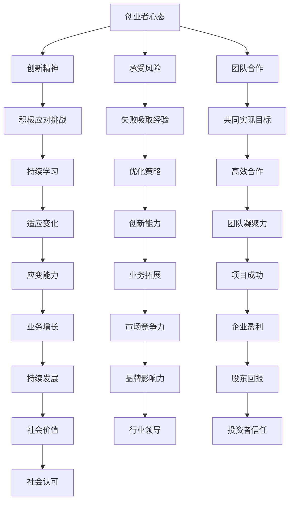

**核心算法原理讲解：**

创业者心态的培养并没有固定的算法，但它依赖于以下几个核心原理：

1. **自我驱动**：设定明确的目标，并不断激励自己实现这些目标。
2. **持续学习**：通过阅读、培训、实践等方式，不断积累新的知识和技能。
3. **适应性**：能够快速适应市场变化和业务需求，灵活调整战略和策略。
4. **反思与改进**：定期反思自己的行为和决策，识别问题并持续改进。

**数学模型和公式：**

在创业者心态的培养中，没有直接的数学模型和公式。然而，以下几个原则可以类比数学模型：

- **目标设定**：类似于数学中的目标函数，需要明确和量化。
- **资源分配**：类似于线性规划，需要合理分配有限的资源。
- **风险评估**：类似于概率论，需要对潜在的风险进行评估和应对。

**举例说明：**

**案例1：创新精神**

某程序员A在从事技术工作的同时，关注到市场上对于自动化办公软件的需求。他开始自学Python和相关的Web开发技术，开发了一个人工智能助手，用于自动化处理日常工作。通过不断创新和改进，他的产品得到了市场的认可，成为一家初创公司的核心产品。

**案例2：承受风险**

程序员B决定辞职创业，开发一款智能健康监测APP。在项目初期，他面临着资金不足、技术不稳定等问题。但他没有放弃，通过向亲朋好友借款和兼职工作筹集资金，同时不断优化产品，最终成功吸引了天使投资，并实现了产品的商业化。

**案例3：团队合作**

程序员C在创业初期，组建了一支由技术、设计、市场和运营组成的团队。他通过定期的团队会议和培训，提升了团队的协作能力。在共同的努力下，团队成功开发了一款创新的移动应用，并在短时间内获得了大量的用户。

#### 1.2 技能升级：从技术专家到全栈创业家的路径

**核心概念与联系：**

全栈创业家是指具备从技术、业务、管理等多方面能力，能够独立推动创业项目成功的创业者。与单纯的技术专家相比，全栈创业家需要具备更广泛的技能和更深厚的综合素养。

**Mermaid 流程图：**

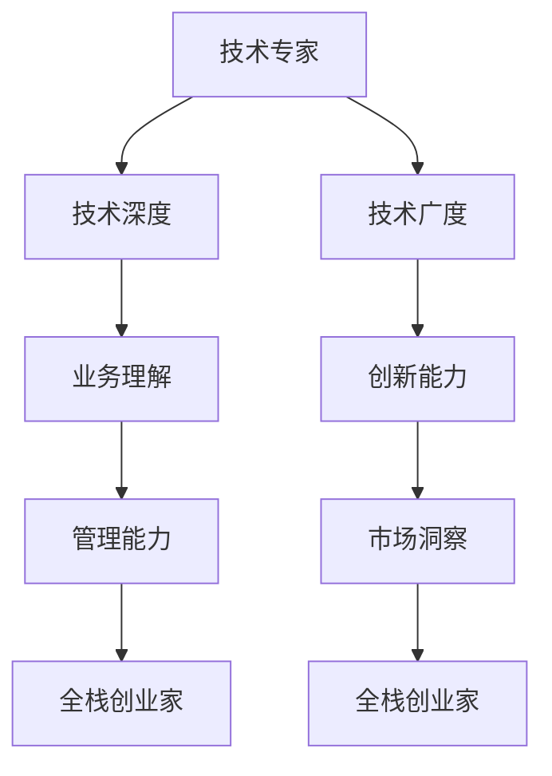

**核心算法原理讲解：**

从技术专家到全栈创业家的路径，可以看作是一个多维度的技能升级过程。以下是几个核心算法原理：

1. **技术广度**：通过学习多种编程语言和开发框架，提升技术能力和适应能力。
2. **业务理解**：通过市场调研和业务实践，深入了解市场需求和商业逻辑。
3. **管理能力**：通过项目管理、团队建设等实践，提升组织协调和领导能力。
4. **创新能力**：通过不断学习和实践，激发创新思维，解决实际问题。
5. **市场洞察**：通过分析市场趋势和竞争态势，抓住市场机会。

**数学模型和公式：**

在技能升级过程中，可以使用以下数学模型和公式：

- **技能树模型**：定义不同技能的层级和关联关系，通过学习路径逐步提升技能水平。
- **KPI模型**：设定关键绩效指标（KPI），通过量化评估技能提升效果。
- **SWOT分析**：分析自身优势、劣势、机会和威胁，制定合适的技能提升策略。

**举例说明：**

**案例1：技术广度**

程序员D在从事后端开发工作的同时，开始自学前端开发和移动开发。他掌握了JavaScript、React、Flutter等开发框架，能够独立完成全栈开发项目。这使他具备了更高的市场竞争力，也为创业项目提供了更多的技术可能性。

**案例2：业务理解**

程序员E在创业初期，积极参与市场调研和用户访谈，深入了解用户需求和市场动态。他通过分析竞品和市场趋势，制定了符合市场需求的产品策略，成功吸引了投资者的关注。

**案例3：管理能力**

程序员F在创业过程中，担任项目经理和团队负责人。他通过项目管理工具和方法，如敏捷开发、看板等，提高了团队的效率和协作能力。同时，他注重团队沟通和培训，提升了团队的整体素质。

**案例4：创新能力**

程序员G在创业过程中，不断尝试新的技术和方法，如区块链、人工智能等。他通过技术创新，解决了实际业务中的痛点，提高了产品的竞争力。

**案例5：市场洞察**

程序员H在创业过程中，密切关注市场动态和行业趋势。他通过分析大数据和行业报告，抓住了市场机会，成功推出了符合市场需求的新产品。

#### 1.3 核心技能的拓展与提升

**核心概念与联系：**

全栈创业家需要具备以下核心技能：

- **编程技能**：掌握多种编程语言和开发框架。
- **业务理解**：了解市场需求、商业模式和运营管理。
- **项目管理**：掌握项目管理方法和工具，如敏捷开发、看板等。
- **团队协作**：具备良好的沟通和团队协作能力。
- **创新能力**：持续学习和实践，提升创新能力。

**Mermaid 流流程图：**

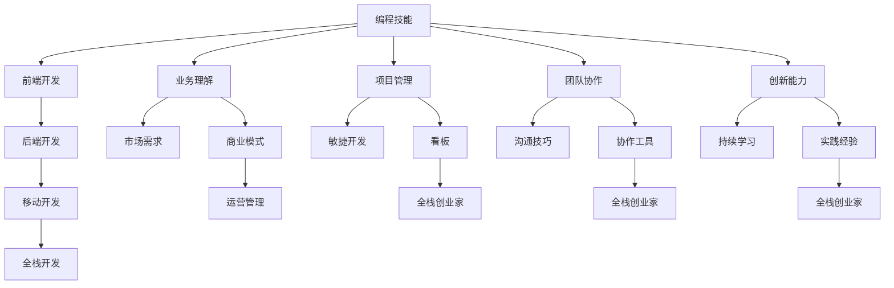

**核心算法原理讲解：**

核心技能的拓展与提升可以看作是一个系统性的学习过程。以下是几个核心算法原理：

1. **学习路径规划**：根据个人兴趣和市场需求，制定合理的技能学习路径。
2. **知识体系构建**：通过学习不同领域的知识，构建完整的知识体系。
3. **实践与反思**：通过实际项目和案例分析，不断总结和提升技能水平。
4. **持续更新**：关注技术动态和行业趋势，持续更新和优化技能。

**数学模型和公式：**

在技能拓展与提升过程中，可以使用以下数学模型和公式：

- **学习曲线**：描述技能学习速度和时间的关系。
- **K均值聚类**：用于对技能进行分类和聚类，帮助制定学习策略。
- **回归分析**：用于分析技能水平与项目绩效之间的关系，指导技能提升。

**举例说明：**

**案例1：编程技能**

程序员I在自学Python和JavaScript的基础上，学习了React和Node.js等开发框架。他通过实际项目开发，不断提升自己的编程技能，最终具备了全栈开发能力。

**案例2：业务理解**

程序员J在创业初期，通过市场调研和用户访谈，了解了市场需求和用户痛点。他结合自己的技术背景，提出了创新的产品解决方案，成功吸引了投资者的关注。

**案例3：项目管理**

程序员K在创业过程中，担任项目经理，负责项目的规划和管理。他通过敏捷开发和看板工具，提高了项目的执行效率和团队协作能力。

**案例4：团队协作**

程序员L在团队中，注重沟通和协作，通过定期的团队会议和协作工具，确保团队成员之间的信息共享和协同工作。

**案例5：创新能力**

程序员M在创业过程中，不断尝试新技术和新方法，通过技术创新，解决了实际业务中的痛点，提高了产品的竞争力。

### 第2章：商业模式与市场定位

#### 2.1 商业模式概述

**核心概念与联系：**

商业模式是指企业通过何种方式创造、传递和获取价值，实现盈利和持续发展。一个成功的商业模式需要解决以下核心问题：

- **价值创造**：企业如何为客户提供有价值的产品或服务。
- **价值传递**：企业如何将价值传递给客户，并获得收入。
- **价值获取**：企业如何通过价值传递获得盈利。

**Mermaid 流流程图：**

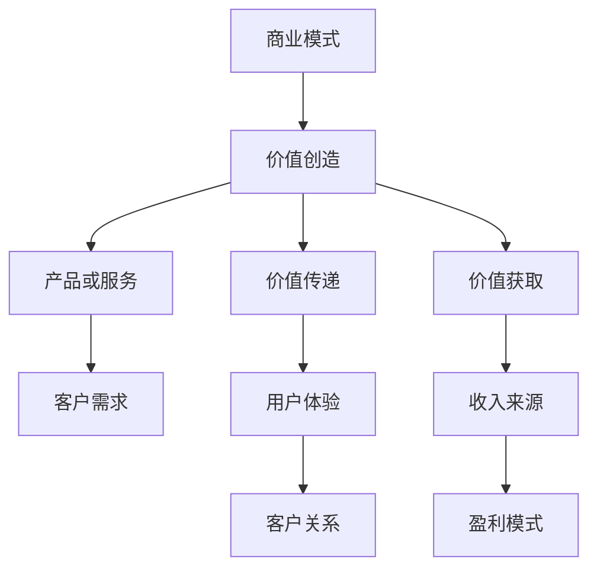

**核心算法原理讲解：**

商业模式的构建需要考虑以下几个核心算法原理：

1. **客户价值分析**：通过分析客户需求和痛点，确定产品或服务的核心价值点。
2. **盈利模式设计**：根据产品或服务的价值创造和价值传递，设计合适的盈利模式。
3. **市场定位**：通过市场调研和竞争分析，确定目标市场和定位策略。

**数学模型和公式：**

在商业模式设计中，可以使用以下数学模型和公式：

- **客户生命周期价值（CLV）**：通过客户购买行为和历史数据，预测客户的未来价值。
- **成本效益分析**：通过计算成本和收入，评估商业模式的可行性。
- **市场占有率分析**：通过分析市场趋势和竞争态势，预测市场占有率。

**举例说明：**

**案例1：价值创造**

某初创公司专注于开发智能办公软件，通过分析企业用户的工作流程和痛点，提供了自动化办公解决方案。这些解决方案不仅提高了工作效率，还降低了企业的运营成本，为客户创造了显著的价值。

**案例2：价值传递**

某电商公司通过线上平台，将商品传递给消费者。他们通过优化供应链和物流管理，确保商品能够快速、安全地送达消费者手中，提供了卓越的购物体验。

**案例3：价值获取**

某科技公司通过开发移动应用，为用户提供生活服务。他们通过广告收入和会员费等方式，从用户价值中获取盈利。

#### 2.2 市场调研与定位

**核心概念与联系：**

市场调研是了解市场需求和潜在客户的过程。通过市场调研，企业可以确定目标市场和定位策略，从而更好地满足客户需求。

- **市场调研的目的**：了解市场需求、竞争态势和潜在客户。
- **市场调研的方法**：包括实地调研、网络调查、竞争对手分析等。
- **市场定位**：确定目标市场和定位策略，包括产品定位、品牌定位等。

**Mermaid 流流程图：**

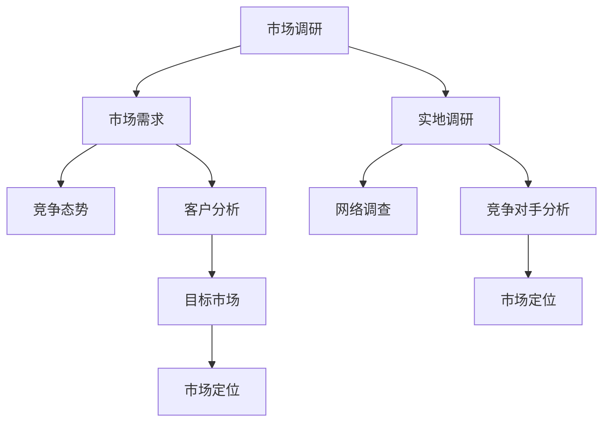

**核心算法原理讲解：**

市场调研与定位的核心算法原理包括：

1. **客户细分**：通过分析客户特征和行为，将市场划分为不同的细分市场。
2. **需求分析**：通过调研和分析，确定目标市场的需求和痛点。
3. **定位策略**：根据市场需求和竞争态势，制定合适的市场定位策略。

**数学模型和公式：**

在市场调研与定位中，可以使用以下数学模型和公式：

- **客户细分模型**：通过聚类分析等算法，对客户进行细分。
- **需求分析模型**：通过回归分析等算法，确定市场需求和趋势。
- **市场占有率模型**：通过市场占有率分析，预测市场趋势和竞争力。

**举例说明：**

**案例1：市场需求分析**

某科技公司通过市场调研，发现市场上存在对高效办公工具的需求。他们通过分析用户行为和痛点，提出了智能办公解决方案，成功满足了市场需求。

**案例2：竞争对手分析**

某电商公司通过竞争对手分析，了解竞争对手的产品特点、定价策略和市场表现。他们通过对比分析，找到了自己的竞争优势，并制定了针对性的市场策略。

**案例3：市场定位**

某健康食品公司通过市场调研，确定了目标市场为注重健康饮食的消费者群体。他们通过品牌定位和产品定位，成功吸引了目标客户，提高了市场占有率。

#### 2.3 产品设计与需求分析

**核心概念与联系：**

产品设计与需求分析是确保产品能够满足客户需求的过程。通过需求分析，企业可以确定产品的功能、性能和用户界面等关键要素，从而设计出符合市场需求的优质产品。

- **产品设计的核心要素**：功能完整性、用户体验、设计美学等。
- **需求分析的方法**：用户访谈、用例图、需求文档等。

**Mermaid 流流程图：**

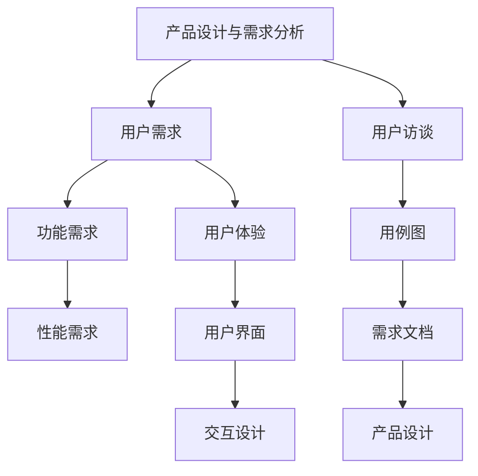

**核心算法原理讲解：**

产品设计与需求分析的核心算法原理包括：

1. **用户需求分析**：通过用户访谈、问卷调查等方式，收集用户需求和反馈。
2. **功能需求分析**：通过用例图、用户故事地图等工具，确定产品的功能需求。
3. **性能需求分析**：通过性能测试、负载测试等，确保产品的性能和稳定性。
4. **用户体验设计**：通过用户研究和原型设计，优化产品的用户体验。

**数学模型和公式：**

在产品设计与需求分析中，可以使用以下数学模型和公式：

- **需求优先级分析**：通过用户故事地图等工具，确定需求的重要性和优先级。
- **性能指标计算**：通过性能测试，计算产品的响应时间、吞吐量等性能指标。
- **用户体验评分**：通过用户测试和调查，评估产品的用户体验。

**举例说明：**

**案例1：用户需求分析**

某智能家居公司通过用户访谈和问卷调查，了解到用户对智能家居设备的需求主要集中在安全性、便利性和智能化等方面。他们根据这些需求，设计了具有人脸识别、智能安防和语音控制功能的智能家居产品。

**案例2：功能需求分析**

某电商公司通过用例图，确定产品的核心功能需求，包括商品浏览、购物车、下单支付、用户评价等。他们通过用户测试和反馈，不断优化和调整功能，确保产品能够满足用户需求。

**案例3：性能需求分析**

某在线教育平台通过性能测试，确保平台能够在高并发情况下稳定运行。他们通过负载测试和压力测试，计算了平台的响应时间和吞吐量，并进行了性能优化。

**案例4：用户体验设计**

某设计公司通过用户研究和原型设计，优化了产品的用户界面和交互设计。他们通过用户测试和反馈，不断改进设计，提高了产品的用户体验和用户满意度。

### 第3章：团队建设与管理

#### 3.1 团队建设的核心要素

**核心概念与联系：**

团队建设是确保团队高效协作、实现共同目标的关键。一个成功的团队需要具备以下几个核心要素：

- **团队成员的角色**：明确团队成员的职责和角色，确保各司其职。
- **目标一致性**：确保团队成员共同追求同一目标，提高团队凝聚力。
- **互补性**：团队成员在技能、性格等方面互补，提高团队的整体能力。
- **沟通与协作**：建立有效的沟通和协作机制，确保团队成员之间的信息共享和协同工作。

**Mermaid 流流程图：**

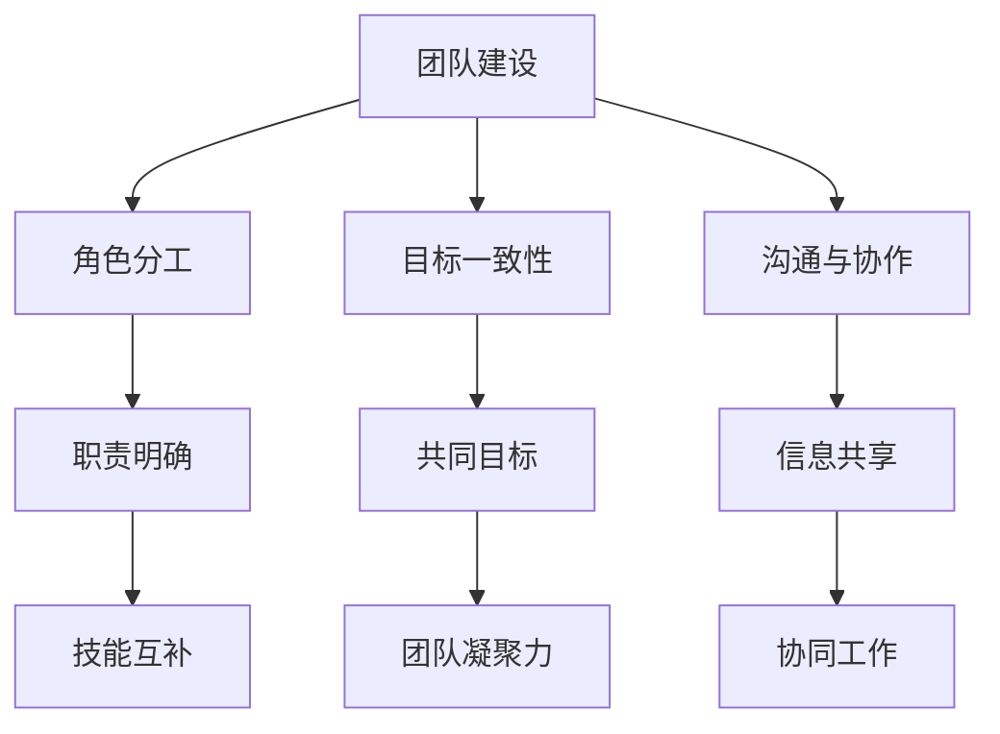

**核心算法原理讲解：**

团队建设的核心算法原理包括：

1. **角色分工与职责明确**：通过明确团队成员的角色和职责，确保团队成员各司其职，提高工作效率。
2. **技能互补与团队能力提升**：通过技能互补，提高团队的整体能力和解决问题的能力。
3. **目标一致性与团队凝聚力**：通过共同追求同一目标，提高团队的凝聚力，增强团队执行力。
4. **沟通与协作**：通过建立有效的沟通和协作机制，确保团队成员之间的信息共享和协同工作，提高团队效率。

**数学模型和公式：**

在团队建设中，可以使用以下数学模型和公式：

- **角色分工模型**：通过角色分工，确定团队成员的具体职责和工作内容。
- **团队绩效评估模型**：通过团队绩效评估，评估团队成员的工作表现和团队整体绩效。
- **沟通效率模型**：通过沟通效率评估，优化团队沟通机制和协作方式。

**举例说明：**

**案例1：角色分工**

某初创公司团队由技术、市场、运营等成员组成。技术团队负责产品研发，市场团队负责市场推广和用户获取，运营团队负责用户管理和产品优化。通过明确角色分工，团队成员能够专注于自己的职责，提高工作效率。

**案例2：技能互补**

某电商公司团队由前端开发、后端开发、UI设计、运营等成员组成。前端开发和后端开发成员在技能上互补，UI设计成员负责提升产品的用户体验，运营团队负责市场推广和用户管理。通过技能互补，团队整体能力得到提升，产品质量和用户满意度不断提高。

**案例3：目标一致性**

某科技公司团队共同追求提高公司业绩和市场份额的目标。团队成员通过定期会议和目标设定，明确各自的工作目标和责任，确保团队协作一致，提高团队执行力。

**案例4：沟通与协作**

某创业团队使用项目管理工具如Trello和Slack，建立有效的沟通和协作机制。团队成员通过Trello跟踪项目进度，通过Slack实时沟通和协作，确保团队成员之间的信息共享和协同工作，提高团队效率。

#### 3.2 项目管理与进度跟踪

**核心概念与联系：**

项目管理是确保项目按计划、高质量、高效完成的过程。进度跟踪是项目管理的重要组成部分，通过实时监控项目进度，及时发现和解决问题，确保项目按计划进行。

- **项目管理的核心任务**：包括项目计划、风险管理、资源管理等。
- **进度跟踪的方法**：包括日志记录、进度报告、进度表等。

**Mermaid 流流程图：**

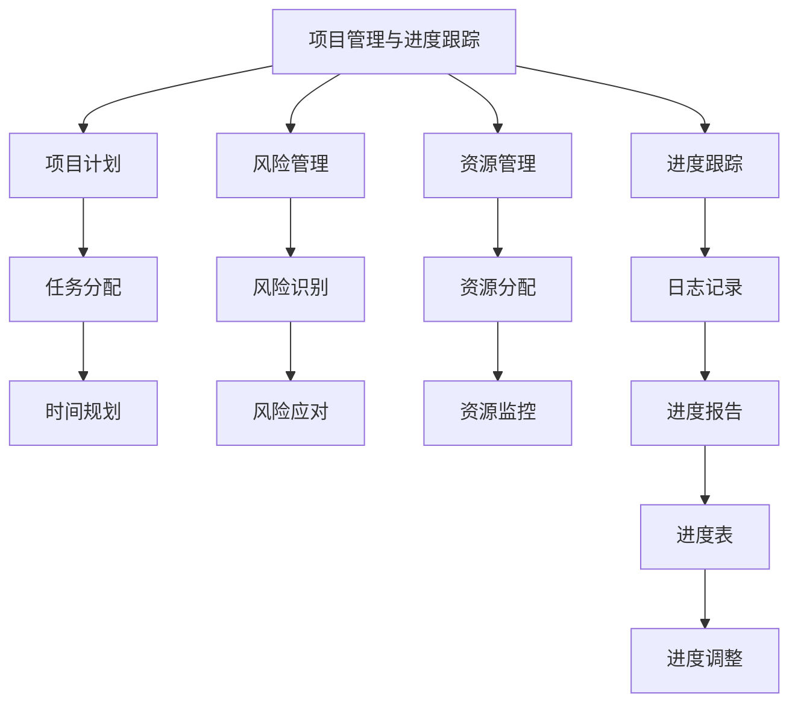

**核心算法原理讲解：**

项目管理和进度跟踪的核心算法原理包括：

1. **项目计划**：通过任务分配和时间规划，确保项目按计划进行。
2. **风险管理**：通过风险识别和风险应对，降低项目风险，确保项目顺利进行。
3. **资源管理**：通过资源分配和监控，确保项目所需的资源得到合理利用。
4. **进度跟踪**：通过日志记录、进度报告和进度表，实时监控项目进度，及时发现和解决问题。

**数学模型和公式：**

在项目管理和进度跟踪中，可以使用以下数学模型和公式：

- **任务分配模型**：通过优化算法，确定最优的任务分配方案。
- **时间规划模型**：通过关键路径法（CPM）、计划评审技术（PERT）等，确定项目的最短完成时间。
- **进度监控模型**：通过进度报告和进度表，实时监控项目进度，计算项目的实际完成情况与计划完成情况的差异。

**举例说明：**

**案例1：项目计划**

某初创公司计划开发一款智能家居产品。项目经理通过任务分配和时间规划，将项目划分为多个阶段，包括需求分析、产品设计、研发测试、市场推广等，并明确了各阶段的开始和结束时间。

**案例2：风险管理**

某科技公司正在开发一款新软件，项目经理通过风险识别和风险应对，发现技术难题和市场需求变化是项目的主要风险。他们制定了相应的应对措施，如技术储备和定期市场调研，确保项目能够按计划进行。

**案例3：资源管理**

某电商公司正在进行电商平台的技术升级，项目经理通过资源分配和监控，确保开发、测试、运维等团队成员和资源得到合理利用，避免资源浪费和瓶颈问题。

**案例4：进度跟踪**

某项目团队使用项目管理工具Jira记录项目进度，通过每日的进度报告和每周的进度表，实时监控项目进展。项目经理通过分析进度数据和问题反馈，及时调整项目计划，确保项目按期完成。

#### 3.3 团队沟通与协作

**核心概念与联系：**

团队沟通与协作是确保团队高效运作和项目成功的关键。良好的沟通和协作能够提高团队的信息共享和协同工作效率，减少误解和冲突，增强团队凝聚力。

- **团队沟通的重要性**：确保团队成员之间的信息共享和协同工作，提高团队效率和解决问题的能力。
- **沟通与协作的方法**：包括定期会议、工具使用、反馈机制等。

**Mermaid 流流程图：**

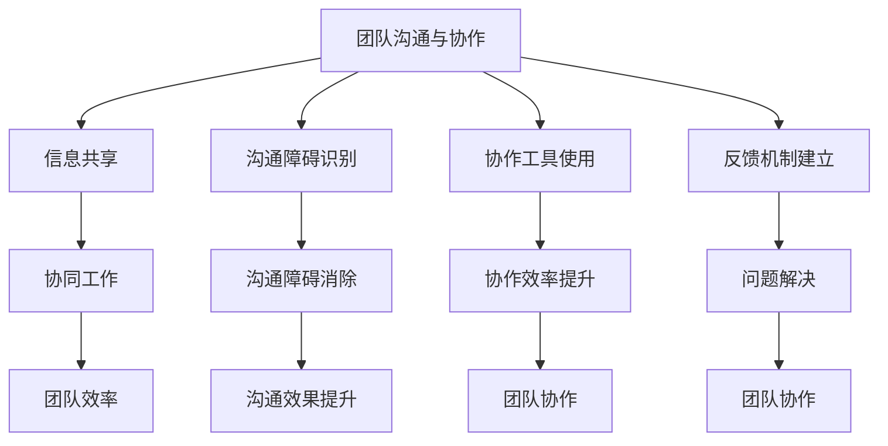

**核心算法原理讲解：**

团队沟通与协作的核心算法原理包括：

1. **信息共享**：通过建立信息共享平台和机制，确保团队成员能够及时获取和分享重要信息。
2. **协同工作**：通过明确团队成员的角色和职责，确保团队成员能够协同完成工作任务。
3. **沟通障碍识别**：通过分析沟通障碍的原因，如语言障碍、文化差异等，找到解决方法。
4. **协作工具使用**：通过使用协作工具，如Slack、Trello、Jira等，提高团队的协作效率。
5. **反馈机制建立**：通过建立反馈机制，鼓励团队成员提出问题和建议，解决团队协作中的问题。

**数学模型和公式：**

在团队沟通与协作中，可以使用以下数学模型和公式：

- **信息共享模型**：通过信息传播模型，如六度分隔理论，分析信息传递的速度和效果。
- **协作效率模型**：通过协作效率评估，计算团队协作的效率和产出。
- **沟通效果模型**：通过沟通效果评估，评估团队沟通的效果和满意度。

**举例说明：**

**案例1：信息共享**

某软件开发团队使用Git作为版本控制工具，确保团队成员能够实时查看和共享代码库中的最新版本，提高代码管理的效率。

**案例2：协同工作**

某创业团队使用Trello作为项目管理工具，团队成员通过Trello的任务分配和进度跟踪功能，协同完成项目任务，确保项目按计划进行。

**案例3：沟通障碍识别**

某跨国团队在进行跨文化协作时，发现沟通障碍主要源于语言和文化差异。团队通过定期组织跨文化培训，提高团队成员的语言能力和跨文化沟通技巧，消除沟通障碍。

**案例4：协作工具使用**

某电商团队使用Slack作为实时沟通工具，团队成员通过Slack的频道和群组，实时讨论项目问题和解决方案，提高团队的协作效率和沟通效果。

**案例5：反馈机制建立**

某创业团队建立了定期反馈机制，团队成员在每周会议上分享自己的工作进展、遇到的问题和改进建议，团队领导根据反馈调整项目计划和工作策略，提高团队协作效率。

### 第4章：技术趋势与前瞻

#### 4.1 技术发展动态

**核心概念与联系：**

技术发展动态是了解当前技术领域最新趋势和前沿技术的关键。通过关注技术发展动态，企业可以及时掌握新技术，抓住市场机会，提升自身的竞争力。

- **当前技术热点**：包括人工智能、区块链、5G等。
- **未来技术展望**：包括物联网、边缘计算、量子计算等。

**Mermaid 流流程图：**

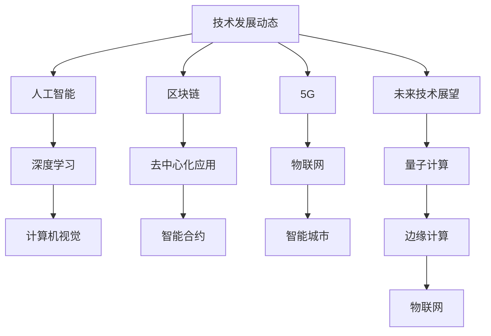

**核心算法原理讲解：**

技术发展动态的核心算法原理包括：

1. **趋势分析**：通过数据分析和趋势预测，了解技术领域的最新趋势和未来发展方向。
2. **技术评估**：通过评估技术的性能、成本、应用前景等，确定技术的可行性和应用场景。
3. **创新应用**：通过技术创新和跨学科应用，将新技术应用于实际业务场景，提升企业竞争力。

**数学模型和公式：**

在技术发展动态中，可以使用以下数学模型和公式：

- **趋势预测模型**：通过时间序列分析和机器学习算法，预测技术发展的趋势和方向。
- **技术评估模型**：通过成本效益分析、风险评估等，评估技术的可行性和应用前景。
- **创新应用模型**：通过组合优化、神经网络等算法，实现新技术的创新应用。

**举例说明：**

**案例1：人工智能**

某科技公司通过深度学习和计算机视觉技术，开发了一款智能图像识别系统。该系统在图像分类、物体检测等方面表现出色，广泛应用于安防监控、医疗诊断等领域。

**案例2：区块链**

某初创公司利用区块链技术，开发了一款去中心化的供应链管理平台。该平台通过智能合约和分布式账本技术，确保供应链信息的透明和可追溯，提高了供应链的效率和可信度。

**案例3：5G**

某电信运营商通过5G网络，实现了超高速、低延迟的通信服务。该服务广泛应用于智慧城市、智能交通、远程医疗等领域，推动了社会生产力的提升。

**案例4：物联网**

某智能家居公司通过物联网技术，开发了一系列智能家电产品。这些产品通过互联网连接，实现了智能家居的自动化控制和远程监控，提高了用户的生活质量和便利性。

**案例5：未来技术展望**

某研究机构通过量子计算和边缘计算技术，开发了一款智能交通系统。该系统通过实时计算和分析交通数据，优化交通信号灯控制，减少交通拥堵，提高了交通效率和安全性。

#### 4.2 新兴技术展望

**核心概念与联系：**

新兴技术展望是对未来可能影响技术领域的重要技术的前景和影响的预测。这些技术通常具有变革性的潜力，可能带来新的商业模式、应用场景和产业变革。

- **5G技术的影响**：提高网络速度和连接密度，推动物联网和智能设备的普及。
- **物联网的发展趋势**：智能家居、智能工厂、智能城市等领域的应用，以及数据的收集、处理和分析能力提升。

**Mermaid 流流程图：**

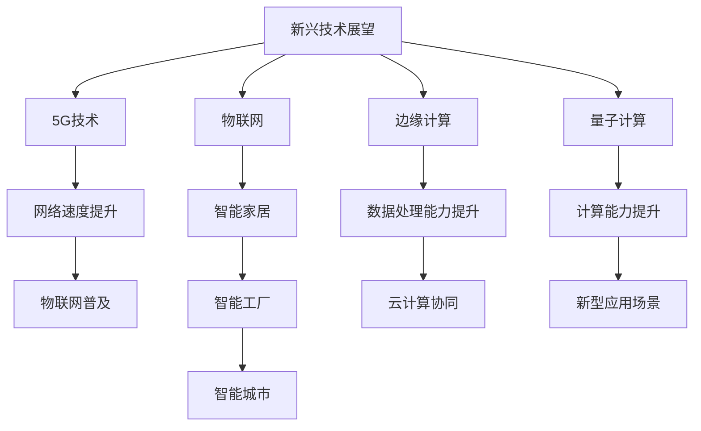

**核心算法原理讲解：**

新兴技术展望的核心算法原理包括：

1. **技术预测**：通过数据分析、市场调研和专家意见，预测新兴技术的未来趋势和影响。
2. **应用场景分析**：通过案例分析和技术评估，确定新兴技术的应用场景和潜在价值。
3. **商业模式创新**：通过技术创新和商业模式创新，探索新兴技术的商业应用和盈利模式。

**数学模型和公式：**

在新兴技术展望中，可以使用以下数学模型和公式：

- **技术成熟度模型**：通过评估技术的成熟度和市场接受度，预测技术的未来发展趋势。
- **成本效益分析模型**：通过计算新兴技术的成本和效益，评估其经济可行性。
- **创新扩散模型**：通过分析新兴技术的扩散过程和影响因素，预测技术的市场接受度。

**举例说明：**

**案例1：5G技术的影响**

某城市通过建设5G网络，实现了城市各个角落的高速、稳定连接。这使得智慧城市项目得以实施，包括智能交通管理、智能安防监控、智能医疗等，提高了城市的管理效率和居民的生活质量。

**案例2：物联网的应用**

某工业公司通过物联网技术，实现了生产设备的实时监控和远程维护。通过收集和分析生产数据，公司能够优化生产流程，提高生产效率和产品质量，降低了运营成本。

**案例3：边缘计算与云计算的协同**

某互联网公司通过边缘计算和云计算的协同，实现了大规模数据处理和实时分析。他们在边缘设备上部署计算资源，处理实时数据，并将分析结果传输到云端，实现大数据分析和智能化决策。

**案例4：量子计算的应用**

某科研机构通过量子计算技术，成功模拟了复杂的化学反应。这使得化学研究从实验阶段转向计算模拟，大幅缩短了研究周期，提高了科研效率。

#### 4.3 技术选型与优化

**核心概念与联系：**

技术选型与优化是确保项目技术方案合理、高效、可行的重要环节。通过技术选型和优化，企业可以选用最适合的技术方案，提高项目的成功率。

- **技术选型的考虑因素**：包括项目需求、技术成熟度、成本效益等。
- **技术优化策略**：包括性能优化、安全优化、可扩展性优化等。

**Mermaid 流流程图：**

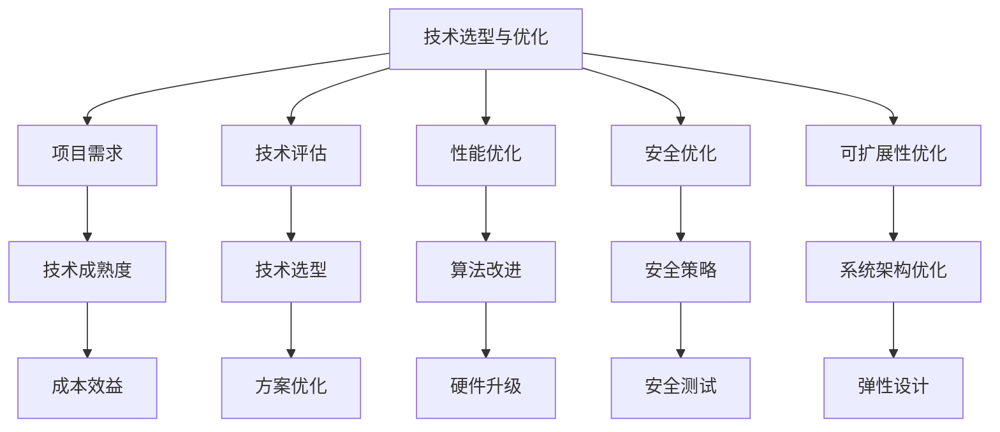

**核心算法原理讲解：**

技术选型与优化的核心算法原理包括：

1. **需求分析**：通过分析项目需求，确定所需技术的功能、性能和可靠性要求。
2. **技术评估**：通过比较不同技术的性能、成本和可行性，选择最合适的技术方案。
3. **性能优化**：通过算法改进和硬件升级，提高系统的性能和响应速度。
4. **安全优化**：通过制定安全策略和进行安全测试，确保系统的安全性。
5. **可扩展性优化**：通过系统架构优化和弹性设计，提高系统的可扩展性和灵活性。

**数学模型和公式：**

在技术选型与优化中，可以使用以下数学模型和公式：

- **需求分析模型**：通过需求工程方法，确定项目的功能需求、性能需求和可靠性需求。
- **技术评估模型**：通过成本效益分析、风险评估等，评估不同技术的优劣。
- **性能优化模型**：通过性能测试和基准测试，评估系统的性能瓶颈和改进方向。
- **安全优化模型**：通过安全评估和漏洞扫描，评估系统的安全风险和优化策略。

**举例说明：**

**案例1：技术选型**

某初创公司计划开发一款在线教育平台。通过需求分析和技术评估，他们选择了使用Java和Spring框架进行后端开发，HTML、CSS和JavaScript进行前端开发，MySQL数据库存储数据，确保平台的高性能、高可靠性和可扩展性。

**案例2：性能优化**

某电商公司发现其网站在高峰期出现响应缓慢的问题。通过性能测试，他们发现数据库查询速度是瓶颈。他们通过优化SQL查询语句、索引设计和缓存策略，提高了数据库查询速度，显著改善了网站的响应速度。

**案例3：安全优化**

某金融科技公司对其移动应用进行了安全测试，发现存在SQL注入和跨站脚本攻击的风险。他们通过制定安全策略、进行安全测试和漏洞修复，确保移动应用的安全性，保护用户的个人信息和交易安全。

**案例4：可扩展性优化**

某社交网络平台通过分析用户增长趋势和业务需求，对其系统架构进行了优化。他们采用了分布式数据库和缓存策略，实现了系统的弹性扩展，能够应对用户规模的增长，确保平台的高可用性和性能。

### 第5章：编程语言与框架

#### 5.1 编程语言的选择与应用

**核心概念与联系：**

编程语言是用于编写计算机程序的语言，不同的编程语言具有不同的特点和适用场景。选择合适的编程语言对于项目开发效率和成功率至关重要。

- **常见编程语言**：包括Python、Java、JavaScript等。
- **编程语言的选择依据**：根据项目需求、开发效率和团队技能等因素。

**Mermaid 流流程图：**

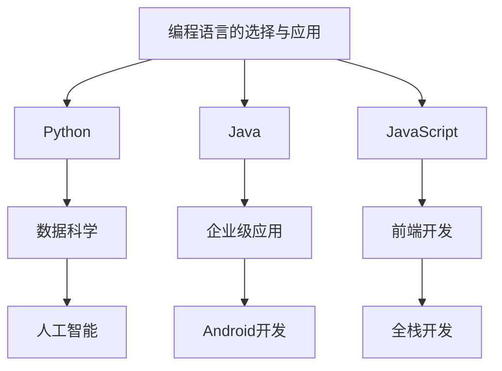

**核心算法原理讲解：**

编程语言的选择与应用需要考虑以下几个核心算法原理：

1. **性能评估**：通过性能测试，评估不同编程语言的执行效率和性能。
2. **功能支持**：选择支持所需功能的编程语言，如数据科学、前端开发等。
3. **开发效率**：选择易于学习和使用的编程语言，提高开发效率。
4. **生态系统**：选择拥有丰富库和框架的编程语言，提高开发效率和可靠性。

**数学模型和公式：**

在编程语言的选择与应用中，可以使用以下数学模型和公式：

- **性能评估模型**：通过基准测试，评估编程语言的执行效率和性能。
- **功能支持模型**：通过功能点分析，评估编程语言的功能支持程度。
- **开发效率模型**：通过开发速度和工作量分析，评估编程语言的开发效率。

**举例说明：**

**案例1：Python的应用**

某数据科学公司选择Python作为主要编程语言，因为它拥有丰富的库和框架，如NumPy、Pandas和Scikit-learn等，能够高效地处理大数据和进行机器学习。

**案例2：Java的应用**

某金融公司选择Java作为企业级应用的开发语言，因为它具有良好的性能、安全性和稳定性，适合开发大型、复杂的金融系统。

**案例3：JavaScript的应用**

某互联网公司选择JavaScript作为前端开发语言，因为它可以轻松实现动态网页和交互式功能，并且拥有丰富的库和框架，如React和Vue.js等。

#### 5.2 常见开发框架介绍

**核心概念与联系：**

开发框架是用于简化程序开发、提高开发效率的工具和库。不同的开发框架具有不同的特点和适用场景，选择合适的开发框架对于项目的成功至关重要。

- **前端开发框架**：如React、Angular、Vue.js等。
- **后端开发框架**：如Spring、Django、Flask等。

**Mermaid 流流程图：**

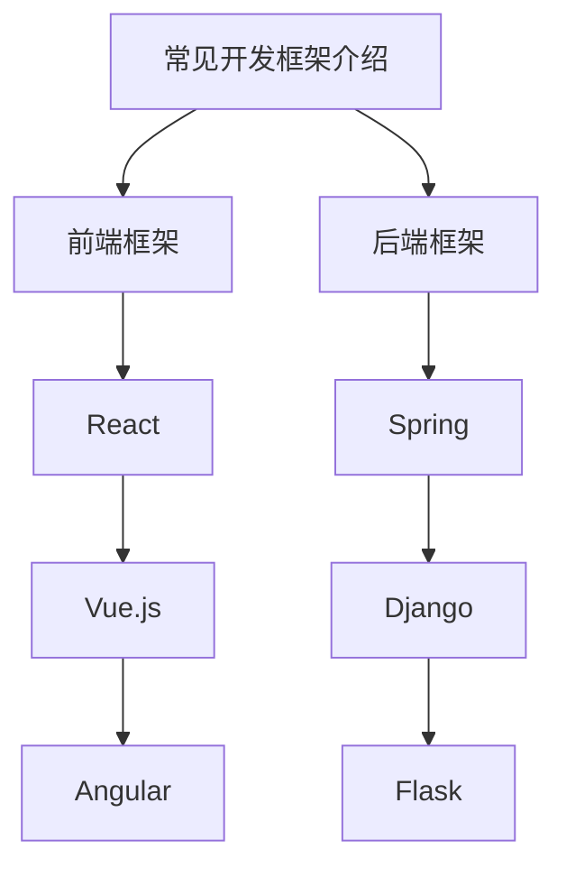

**核心算法原理讲解：**

常见开发框架介绍需要考虑以下几个核心算法原理：

1. **组件化开发**：通过组件化架构，提高代码的可维护性和复用性。
2. **模块化开发**：通过模块化架构，简化项目结构，提高开发效率。
3. **数据绑定**：通过数据绑定机制，实现数据和视图的实时同步。
4. **路由管理**：通过路由管理机制，实现页面的动态加载和切换。

**数学模型和公式：**

在常见开发框架介绍中，可以使用以下数学模型和公式：

- **组件化开发模型**：通过组件化架构，评估代码的可维护性和复用性。
- **模块化开发模型**：通过模块化架构，评估项目结构的简洁性和可扩展性。
- **数据绑定模型**：通过数据绑定机制，评估数据和视图的实时同步效率。
- **路由管理模型**：通过路由管理机制，评估页面的动态加载和切换性能。

**举例说明：**

**案例1：React的应用**

某电商平台选择React作为前端开发框架，因为它支持组件化开发，能够提高代码的可维护性和复用性，并且拥有丰富的库和社区支持。

**案例2：Vue.js的应用**

某初创公司选择Vue.js作为前端开发框架，因为它易于学习和使用，支持模块化开发，并且提供了强大的数据绑定和组件化架构，能够提高开发效率和项目质量。

**案例3：Spring的应用**

某金融公司选择Spring作为后端开发框架，因为它具有强大的模块化架构、良好的性能和稳定性，适合开发大型、复杂的金融系统。

**案例4：Django的应用**

某互联网公司选择Django作为后端开发框架，因为它支持快速开发和简化数据库操作，并且拥有丰富的库和社区支持，能够提高开发效率和项目质量。

**案例5：Flask的应用**

某初创公司选择Flask作为后端开发框架，因为它轻量级、易于学习和使用，适合快速开发和部署小型项目，并且提供了丰富的库和插件。

#### 5.3 框架的优缺点分析

**核心概念与联系：**

框架的优缺点分析是选择合适开发框架的重要步骤。不同的框架具有不同的优势和局限性，了解它们的优缺点有助于做出更明智的选择。

- **框架的优点**：包括提高开发效率、代码复用性、可维护性等。
- **框架的缺点**：包括学习曲线、性能影响、依赖性等。

**Mermaid 流流程图：**

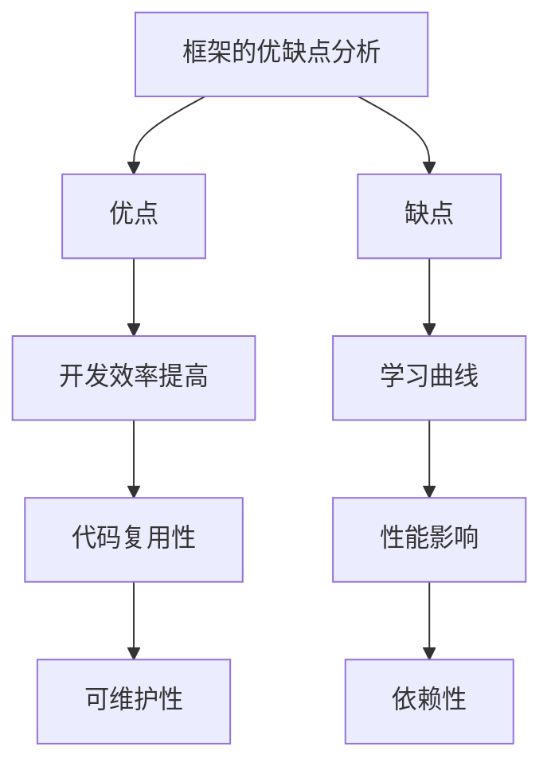

**核心算法原理讲解：**

框架的优缺点分析需要考虑以下几个核心算法原理：

1. **性能评估**：通过基准测试和性能分析，评估框架的性能和资源消耗。
2. **成本效益分析**：通过计算框架的维护成本和开发效率，评估其成本效益。
3. **稳定性评估**：通过框架的版本更新和历史记录

