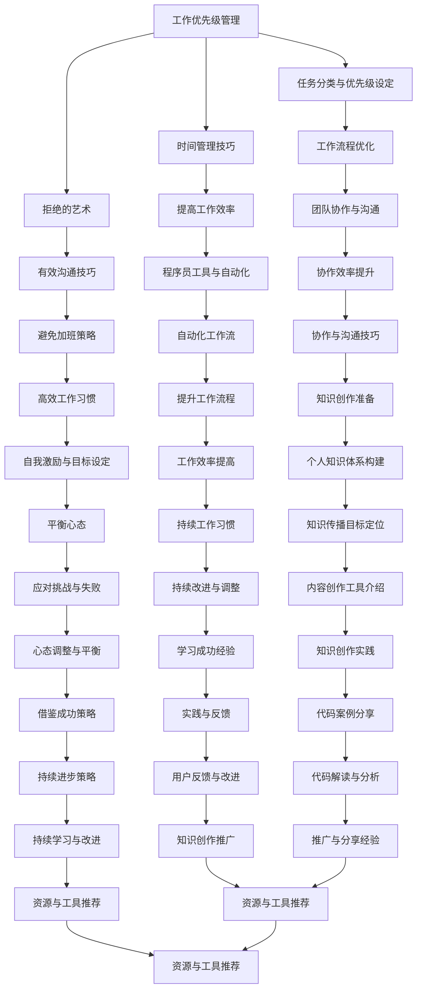

                 

### 《程序员如何平衡全职工作与知识创作》

> **关键词**：（1）全职工作，平衡，知识创作，工作效率，时间管理，社交媒体推广，反馈分析

> **摘要**：
> 
> 本文旨在探讨程序员如何在忙碌的全职工作之余，有效地进行知识创作。我们将详细分析程序员面临的挑战，分享时间管理技巧、工作效率提升策略，并展示如何通过社交媒体进行知识创作推广。通过一系列实用案例，本文将为程序员提供实用的指导，帮助他们在职业发展的同时，不断提升自身的技术影响力。

## 第一部分 引言

在当今快速发展的技术时代，程序员面临着前所未有的挑战和机遇。全职工作带来的压力与日俱增，而知识创作则成为程序员提升个人品牌和职业发展的重要途径。然而，如何在忙碌的工作之余，有效地进行知识创作，成为了许多程序员亟待解决的问题。本文将围绕这一主题，提供一系列实用的策略和技巧，帮助程序员实现工作与知识创作的平衡。

### 1.1 全职工作的压力与挑战

程序员的全职工作通常包含复杂的项目开发、持续的技术学习、团队合作和不断更新的技术栈。这些因素共同构成了程序员工作中的压力源。以下是程序员面临的一些主要挑战：

#### 1.1.1 全职工作的特点与挑战

1. **项目开发周期紧张**：程序员常常需要在短时间内完成大量的代码编写和测试工作，项目周期的紧张使得程序员需要不断加快工作节奏。
2. **技术更新迅速**：编程语言和框架的更新速度非常快，程序员需要不断学习新技术，以保持自己的竞争力。
3. **团队合作与沟通**：程序员需要与其他团队成员紧密合作，包括设计师、产品经理和测试人员等，沟通效率直接影响项目进度。
4. **工作环境的变化**：远程办公、加班文化等现象日益普遍，程序员的工作环境和时间安排变得更加灵活，但也增加了管理时间和个人效率的挑战。

#### 1.1.2 程序员如何应对工作压力

1. **合理规划工作时间**：制定详细的工作计划，确保每个任务都有明确的时间安排，避免因紧急任务而打乱整体计划。
2. **优先级管理**：区分任务的紧急程度和重要性，优先处理重要且紧急的任务，提高工作效率。
3. **沟通与协作**：保持与团队成员的沟通畅通，明确任务分工和进度，避免因误解和冲突导致的时间浪费。

## 1.2 知识创作的意义与价值

在应对全职工作的挑战的同时，知识创作对于程序员来说具有重要意义。通过知识创作，程序员可以实现以下几个价值：

#### 1.2.1 知识创作的重要性

1. **技术提升**：通过编写技术博客、编写开源代码和参与技术社区讨论，程序员可以不断深化自己的技术知识。
2. **个人品牌**：优秀的知识创作能够提升程序员的个人知名度，增强个人品牌影响力。
3. **职业发展**：知识创作有助于程序员在职业发展过程中获得更多机会，包括职业晋升和更好的工作机会。

#### 1.2.2 程序员如何实现知识创作

1. **博客写作**：定期撰写技术博客，分享技术心得和解决方案，有助于提高自己的写作能力和表达能力。
2. **开源贡献**：参与开源项目，贡献代码和文档，不仅能够提升自己的编程能力，还能扩大自己的技术圈子。
3. **技术交流**：参与技术社区，如Stack Overflow、GitHub和知乎等，通过回答问题和参与讨论，提升自己的技术视野。

### 1.3 平衡的艺术

在全职工作和知识创作之间找到平衡，是每位程序员都需要面对的挑战。平衡不仅关系到个人的职业发展，也关系到个人生活的质量。以下是一些实现平衡的策略：

#### 1.3.1 平衡的重要性

1. **身心健康**：工作与生活的平衡有助于减轻工作压力，保持身心健康。
2. **持续发展**：平衡的工作与创作时间，有助于程序员在技术领域持续发展。
3. **家庭和谐**：合理分配时间，有助于家庭关系的和谐。

#### 1.3.2 如何找到平衡点

1. **时间管理**：通过合理规划时间，确保工作与创作的时间分配合理。
2. **优先级设定**：区分工作的紧急程度和重要性，合理调整工作内容。
3. **高效工作**：提高工作效率，减少无效工作时间。

## 第二部分 全职工作的管理

在全职工作中，程序员需要面对各种挑战，包括项目开发、技术学习和团队合作等。为了在全职工作与知识创作之间找到平衡，有效的管理全职工作至关重要。

### 2.1 工作优先级管理

优先级管理是提高工作效率的关键。通过合理设定任务的优先级，程序员可以确保重要且紧急的任务优先完成。

#### 2.1.1 任务分类与优先级设定

1. **紧急任务**：指那些需要立即处理的任务，如修复紧急bug或参加临时会议。
2. **重要任务**：指那些对项目或团队有重大影响的任务，如核心功能开发和关键性能优化。
3. **紧急且重要任务**：这类任务既需要立即处理，又对项目或团队有重大影响，如重要项目的最后期限。
4. **重要但不紧急任务**：指那些对项目或团队有重要影响，但不急需处理的任务，如技术预研和文档整理。
5. **紧急但不重要任务**：这类任务可能需要处理，但不会对项目或团队产生重大影响，如一些琐碎的任务。

#### 2.1.2 时间管理技巧

1. **时间块分配**：将一天的时间划分为多个时间块，每个时间块专注于一个任务，避免任务切换导致的时间浪费。
2. **番茄工作法**：通过设定定时器，每个工作周期为25分钟，然后休息5分钟，以此循环，提高专注力和工作效率。
3. **优先级排序**：根据任务的紧急程度和重要性，对任务进行优先级排序，确保重要且紧急的任务首先完成。

#### 2.1.3 拒绝的艺术

在全职工作中，程序员难免会遇到一些额外的任务或请求。学会拒绝一些不紧急或不重要的任务，有助于提高工作效率和保持工作与生活的平衡。

1. **评估任务的重要性**：在接收到额外任务时，先评估其重要性和紧急程度。
2. **合理分配时间**：如果任务确实重要且紧急，合理安排时间进行完成。
3. **委派任务**：如果任务不重要或不紧急，可以委派给其他团队成员。
4. **沟通与解释**：在拒绝任务时，需要与请求者进行沟通，解释自己的原因和优先级安排。

### 2.2 工作效率提升

提高工作效率是程序员在全职工作中的一项重要任务。以下是一些提高工作效率的策略：

#### 2.2.1 团队协作与沟通

1. **明确任务分工**：确保每个团队成员都清楚自己的职责和任务。
2. **定期沟通**：通过会议、邮件或即时通讯工具，保持团队间的沟通畅通。
3. **共享资源**：鼓励团队成员共享代码、文档和工具，提高工作效率。

#### 2.2.2 程序员工具与自动化

1. **版本控制**：使用Git等版本控制工具，确保代码的版本管理和协作开发。
2. **自动化测试**：通过自动化测试工具，提高测试效率和代码质量。
3. **持续集成**：使用持续集成工具，自动化构建和部署代码，减少手动操作和出错概率。

#### 2.2.3 避免加班的策略

1. **高效工作**：提高工作效率，避免因拖延或低效工作而导致加班。
2. **优先级管理**：合理设定任务优先级，确保紧急且重要任务优先完成。
3. **时间管理**：合理安排工作时间，避免因工作时间过长而导致工作效率下降。

### 2.3 全职工作的应对策略

在面对全职工作带来的挑战时，程序员可以采取以下策略：

#### 2.3.1 职业发展规划

1. **设定目标**：明确自己的职业发展目标，制定相应的计划和步骤。
2. **持续学习**：通过阅读技术书籍、参加技术会议和在线课程，不断提升自己的技术能力。
3. **寻求反馈**：向同事、上级或导师寻求反馈，了解自己的优势和不足，不断改进。

#### 2.3.2 压力管理技巧

1. **合理休息**：定期休息，避免长时间工作导致的身体和心理疲劳。
2. **运动锻炼**：通过运动锻炼，提高身体素质，减轻工作压力。
3. **心理调适**：通过冥想、呼吸练习等方法，调整心态，保持积极乐观。

#### 2.3.3 提升工作效率的技巧

1. **时间管理**：通过时间管理技巧，合理安排工作和休息时间。
2. **专注力训练**：通过专注力训练，提高工作效率和专注力。
3. **团队合作**：与团队成员建立良好的合作关系，提高团队工作效率。

## 第三部分 知识创作

知识创作是程序员提升个人品牌和职业发展的重要途径。在全职工作之余，程序员可以通过知识创作来分享技术心得、解决问题和贡献开源代码。

### 3.1 知识创作的意义

知识创作对于程序员来说具有重要意义。通过知识创作，程序员可以实现以下几个价值：

#### 3.1.1 知识创作的重要性

1. **技术提升**：通过撰写技术博客、编写开源代码和参与技术社区讨论，程序员可以不断深化自己的技术知识。
2. **个人品牌**：优秀的知识创作能够提升程序员的个人知名度，增强个人品牌影响力。
3. **职业发展**：知识创作有助于程序员在职业发展过程中获得更多机会，包括职业晋升和更好的工作机会。

#### 3.1.2 程序员如何实现知识创作

1. **博客写作**：定期撰写技术博客，分享技术心得和解决方案，有助于提高自己的写作能力和表达能力。
2. **开源贡献**：参与开源项目，贡献代码和文档，不仅能够提升自己的编程能力，还能扩大自己的技术圈子。
3. **技术交流**：参与技术社区，如Stack Overflow、GitHub和知乎等，通过回答问题和参与讨论，提升自己的技术视野。

### 3.2 知识创作的准备

在开始知识创作之前，程序员需要做好以下准备工作：

#### 3.2.1 个人知识体系构建

1. **技术领域定位**：明确自己的技术领域和兴趣，构建个人知识体系。
2. **知识储备**：通过阅读技术书籍、学习在线课程和参与技术社区，不断积累和更新知识。
3. **学习习惯**：培养良好的学习习惯，定期复习和总结所学知识。

#### 3.2.2 知识传播的目标定位

1. **受众分析**：分析目标受众，了解他们的需求和兴趣，有针对性地进行知识传播。
2. **内容规划**：根据受众需求和自身知识体系，规划知识创作的内容和形式。
3. **传播渠道**：选择合适的传播渠道，如博客、社交媒体、GitHub等，扩大知识传播范围。

#### 3.2.3 内容创作工具介绍

1. **文本编辑器**：如Visual Studio Code、Sublime Text等，用于撰写和编辑文本。
2. **Markdown编辑器**：如Typora、MarkdownPad等，用于撰写和格式化Markdown文本。
3. **版本控制工具**：如Git，用于管理文档和代码的版本和控制。
4. **代码托管平台**：如GitHub、GitLab等，用于发布和分享代码和文档。

### 3.3 知识创作的实践

在知识创作过程中，程序员需要掌握一系列技巧，包括文章写作、代码案例分享和代码解读与分析等。

#### 3.3.1 文章写作技巧

1. **选题**：选择有意义、有价值、有趣的话题，吸引读者的兴趣。
2. **结构**：文章结构要清晰，逻辑性强，便于读者理解。
3. **语言**：使用简洁明了的语言，避免复杂和冗长的句子。
4. **举例**：通过实际案例和实例，帮助读者更好地理解文章内容。

#### 3.3.2 代码案例分享

1. **选择合适的案例**：选择具有代表性和实用性的代码案例，避免过于简单或复杂。
2. **代码注释**：对代码进行详细注释，解释关键代码段的作用和原理。
3. **调试和测试**：确保代码案例能够正常运行，并通过测试验证其正确性。

#### 3.3.3 代码解读与分析

1. **代码解析**：对代码进行逐行解析，解释每个代码段的作用和意义。
2. **算法原理**：如果代码涉及到算法，解释算法的基本原理和实现过程。
3. **性能分析**：对代码的性能进行分析，提出优化建议和改进方案。

### 3.4 知识创作的推广与反馈

在知识创作过程中，推广和反馈至关重要。通过有效的推广和积极的反馈，程序员可以提升自己的知识创作影响力。

#### 3.4.1 社区参与与互动

1. **加入技术社区**：加入GitHub、Stack Overflow、知乎等技术社区，参与讨论和贡献。
2. **回答问题**：积极参与社区讨论，回答问题和提出解决方案。
3. **发起话题**：在社区发起有意义的话题，吸引更多读者参与。

#### 3.4.2 知识分享平台选择

1. **博客平台**：选择适合自己的博客平台，如GitHub Pages、WordPress等。
2. **社交媒体**：利用微博、知乎、Twitter等社交媒体平台，推广自己的知识创作。
3. **视频平台**：如Bilibili、YouTube等，通过视频形式分享知识。

#### 3.4.3 用户反馈与改进

1. **收集反馈**：通过评论区、邮件和社交媒体等方式，收集用户对知识创作的反馈。
2. **分析反馈**：对反馈进行分析，了解用户的需求和期望。
3. **持续改进**：根据用户反馈，不断优化和改进知识创作内容。

## 第四部分 平衡艺术

在全职工作和知识创作之间找到平衡，是程序员面临的重要挑战。通过合理的时间分配、高效的工作习惯和积极的心态调整，程序员可以实现工作与创作的平衡。

### 4.1 平衡的重要性

#### 4.1.1 平衡对于程序员的意义

1. **身心健康**：合理的时间分配和工作节奏有助于减轻工作压力，保持身心健康。
2. **职业发展**：平衡的工作与创作时间，有助于程序员在职业发展过程中持续提升。
3. **生活质量**：平衡的工作与生活，有助于提高生活质量，享受更多人生乐趣。

#### 4.1.2 平衡的实现策略

1. **时间管理**：通过时间管理技巧，合理安排工作和休息时间。
2. **优先级设定**：根据工作的紧急程度和重要性，合理设定任务优先级。
3. **高效工作**：通过提高工作效率，减少无效工作时间。

### 4.2 时间分配的策略

#### 4.2.1 全职工作与知识创作的时间分配

1. **任务优先级排序**：根据任务的紧急程度和重要性，对任务进行排序，确保重要且紧急的任务优先完成。
2. **时间块分配**：将一天的时间划分为多个时间块，每个时间块专注于一个任务，避免任务切换导致的时间浪费。
3. **弹性安排**：根据实际情况，合理调整工作与创作时间，确保两者之间的平衡。

#### 4.2.2 高效工作的习惯养成

1. **专注力训练**：通过专注力训练，提高工作效率和专注力。
2. **良好作息**：保持良好的作息习惯，确保充足的睡眠和休息。
3. **定期复习**：定期复习所学知识，巩固记忆，提高学习效果。

#### 4.2.3 休息与放松的重要性

1. **合理安排休息时间**：在连续工作一段时间后，合理安排休息时间，避免过度疲劳。
2. **参与兴趣爱好**：参与兴趣爱好，丰富业余生活，缓解工作压力。
3. **家庭陪伴**：与家人共度美好时光，增强家庭关系，提高生活质量。

### 4.3 平衡的心态

#### 4.3.1 感性与理性的平衡

1. **理性分析**：在面对工作时，要进行理性分析，合理设定任务优先级和时间安排。
2. **感性投入**：在知识创作过程中，要感性地投入，享受创作的过程，提高创作质量。

#### 4.3.2 自我激励与目标设定

1. **自我激励**：通过设定短期和长期目标，激励自己不断进步。
2. **目标设定**：明确自己的职业目标和知识创作目标，制定相应的计划和步骤。

#### 4.3.3 应对挑战与失败

1. **积极应对**：面对挑战和失败，要积极应对，从中吸取经验教训。
2. **持续改进**：通过不断学习和实践，提高自己的技能和知识水平。

## 第五部分 成功案例分享

在程序员群体中，有许多成功平衡全职工作与知识创作的案例。以下是一些典型的成功案例，供大家借鉴和学习。

### 5.1 成功的程序员平衡之道

#### 5.1.1 案例一：全职工作与知识创作双丰收

**案例简介**：某程序员在一家互联网公司担任全职工作，同时经营自己的个人博客，定期撰写技术博客和开源代码。

**经验分享**：

1. **时间管理**：该程序员通过时间管理技巧，合理安排工作和创作时间，确保两者之间的平衡。
2. **专注力训练**：通过专注力训练，提高工作效率和专注力，确保工作质量和创作质量。
3. **社区参与**：积极参与技术社区，回答问题和发起话题，扩大知识传播范围。

#### 5.1.2 案例二：高效管理时间与创造价值

**案例简介**：某程序员在一家创业公司担任全职工作，同时通过知识创作，为公司创造了巨大的价值。

**经验分享**：

1. **高效工作**：通过提高工作效率，减少无效工作时间，确保全职工作的质量和进度。
2. **知识传播**：通过撰写技术博客、参与开源项目和分享经验，为公司带来了更多的机会和合作。
3. **持续学习**：通过不断学习和实践，提升自己的技能和知识水平，为公司创造更大的价值。

#### 5.1.3 案例三：如何在平衡中持续进步

**案例简介**：某程序员在一家大型企业担任全职工作，同时通过知识创作，不断提升自己的技术水平和个人品牌。

**经验分享**：

1. **目标设定**：明确自己的职业目标和知识创作目标，制定相应的计划和步骤。
2. **持续改进**：通过不断学习和实践，持续改进自己的技能和知识水平。
3. **心态调整**：保持积极的心态，面对挑战和失败，保持乐观和自信。

### 5.2 启示与借鉴

通过学习以上成功案例，我们可以得出以下启示：

1. **时间管理**：合理规划时间，确保工作和创作时间的平衡。
2. **高效工作**：提高工作效率，减少无效工作时间。
3. **知识传播**：通过知识创作，提升自己的技术水平和个人品牌。
4. **持续学习**：不断学习和实践，提升自己的技能和知识水平。
5. **心态调整**：保持积极的心态，面对挑战和失败，保持乐观和自信。

### 附录

#### 附录 A：资源与工具推荐

**程序员工作资源推荐**：

1. **版本控制工具**：Git、GitHub、GitLab等。
2. **代码托管平台**：GitHub、GitLab、GitBucket等。
3. **文档管理工具**：Markdown编辑器、GitBook、Docuvy等。

**知识创作工具推荐**：

1. **博客平台**：WordPress、Hexo、Jekyll等。
2. **内容管理系统**：Contentful、Medium、Ghost等。
3. **代码示例与解释工具**：CodePen、JSFiddle、Markdownify等。

**平衡工作的技巧与资源**：

1. **时间管理工具**：Trello、Asana、Google Calendar等。
2. **专注力训练工具**：Forest、Pomodoro Timer、Focus@Will等。
3. **心理健康资源**：冥想应用、心理健康咨询、运动APP等。

#### Mermaid 流程图：



#### 核心算法原理讲解：

**2.2 工作效率提升**

**时间管理算法原理**

时间管理算法主要基于以下几个原则：

1. **任务优先级排序**：根据任务的紧急程度和重要性，对任务进行优先级排序，确保重要且紧急的任务首先完成。
2. **时间块分配**：将一天的时间划分为多个时间块，每个时间块专注于一个任务，避免任务切换导致的时间浪费。
3. **番茄工作法**：通过设定定时器，每个工作周期为25分钟，然后休息5分钟，以此循环，提高专注力和工作效率。
4. **循环重复**：将任务周期性地重复执行，以减少重复任务的时间消耗。

**伪代码：**

```
function 时间管理算法(任务列表) {
    对任务列表按优先级排序
    while 任务列表不为空 {
        选择最高优先级任务
        开始计时
        执行任务
        检查任务是否完成
        如果任务未完成 {
            继续执行任务
        } else {
            记录完成任务的时间
            从任务列表中删除任务
        }
        如果当前时间超过设定的休息时间 {
            休息
        }
    }
    输出：已完成任务的列表
}
```

#### 数学模型和数学公式 & 详细讲解 & 举例说明

**4.2 时间分配的策略**

**工作-休息平衡模型**

为了在全职工作和知识创作之间找到平衡，我们可以使用一个工作-休息平衡模型来优化时间分配。这个模型基于以下几个假设：

1. 每个工作日有固定的总时间。
2. 工作时间和休息时间需要动态调整，以满足工作和休息的需求。
3. 工作效率与工作时间和休息时间的比例有关。

**数学公式：**

假设每天有 \(T\) 小时的总时间，其中 \(W\) 小时用于全职工作，\(R\) 小时用于知识创作，\(S\) 小时用于休息。工作效率 \(E\) 可以用以下公式表示：

\[ E = \frac{W}{T - (W + R + S)} \]

**举例说明：**

假设一个程序员每天有8小时的总时间，他计划每天花4小时全职工作，2小时进行知识创作，2小时休息。我们可以计算出他的工作效率：

\[ E = \frac{4}{8 - (4 + 2 + 2)} = \frac{4}{0} \]

由于分母为0，这意味着当前时间分配无法产生工作效率。因此，他需要调整时间分配，例如增加休息时间或减少知识创作时间，以达到平衡。

#### 项目实战

**3.3 知识创作的实践**

**案例：撰写一篇技术博客文章**

**开发环境搭建：**

1. 选择合适的博客平台，如GitHub Pages、WordPress等。
2. 安装必要的开发工具，如Markdown编辑器、代码片段插件等。
3. 配置域名和SSL证书，确保网站安全。

**源代码详细实现：**

```markdown
---
title: "技术博客文章撰写实战"
date: 2023-10-01
---

## 引言

在这篇文章中，我将分享我是如何利用有限的时间，在全职工作和知识创作之间找到平衡的。

## 核心内容

### 1. 选择合适的话题

选择一个有趣且有价值的话题是成功撰写技术博客的关键。

### 2. 收集资料

在撰写文章前，需要收集相关的资料，如文档、代码片段、实例等。

### 3. 编写大纲

根据收集的资料，编写文章的大纲，确保文章结构清晰。

### 4. 撰写内容

根据大纲，逐步撰写文章内容，确保内容准确、易懂。

### 5. 代码解读与分析

如果文章涉及到代码示例，需要进行详细的代码解读与分析。

### 6. 修订与发布

完成初稿后，进行修订，确保文章质量。最后，发布到博客平台上。

## 总结

撰写技术博客是一个不断学习和进步的过程。通过实践，我们可以不断提高自己的写作能力和技术水平。

```

**代码解读与分析：**

```python
# 假设这是一个简单的Python代码示例
def calculate_sum(a, b):
    return a + b

# 调用函数计算和
result = calculate_sum(3, 5)
print("The sum is:", result)
```

在这个例子中，我们定义了一个名为 `calculate_sum` 的函数，它接受两个参数 `a` 和 `b`，并返回它们的和。接着，我们调用这个函数，并将返回值输出到控制台。

**代码解读：**

- `def calculate_sum(a, b):` 定义了一个名为 `calculate_sum` 的函数，它接受两个参数 `a` 和 `b`。
- `return a + b` 函数的返回值是两个参数的和。
- `result = calculate_sum(3, 5)` 调用 `calculate_sum` 函数，并将返回值赋给变量 `result`。
- `print("The sum is:", result)` 输出结果。

**分析：**

这个简单的例子展示了如何定义一个函数，以及如何调用函数来计算和。在实际的博客文章中，我们可以根据需要，对代码进行更深入的解读和分析，帮助读者更好地理解代码的工作原理。

#### 代码解读与分析

**4.3 知识创作的推广与反馈**

**社交媒体推广案例**

**开发环境搭建：**

1. 选择适合的社交媒体平台，如微博、知乎、Twitter等。
2. 注册账号并完善个人资料。
3. 了解平台规则和推广策略。

**源代码详细实现：**

```python
# 社交媒体推广脚本
import tweepy
from tweepy import OAuthHandler

# 设置API密钥和API密钥
consumer_key = "your_consumer_key"
consumer_secret = "your_consumer_secret"
access_token = "your_access_token"
access_token_secret = "your_access_token_secret"

# 创建认证对象
auth = OAuthHandler(consumer_key, consumer_secret)
auth.set_access_token(access_token, access_token_secret)

# 创建API对象
api = tweepy.API(auth)

# 发布推文
def post_tweet(message):
    api.update_status(message)

# 社交媒体推广
tweets = [
    "阅读了我的最新技术博客，一起探讨技术难题！",
    "分享我的编程心得，让知识传播更远！",
    "欢迎加入我的技术交流群，一起学习进步！"
]

for tweet in tweets:
    post_tweet(tweet)
```

**代码解读：**

- `import tweepy` 导入Tweepy库，用于Twitter API操作。
- `from tweepy import OAuthHandler` 导入OAuthHandler类，用于认证。
- `consumer_key`, `consumer_secret`, `access_token`, `access_token_secret` 设置API密钥和访问令牌。
- `auth = OAuthHandler(consumer_key, consumer_secret)` 创建OAuthHandler对象。
- `auth.set_access_token(access_token, access_token_secret)` 设置访问令牌。
- `api = tweepy.API(auth)` 创建Tweepy API对象。
- `def post_tweet(message):` 定义发布推文的函数。
- `api.update_status(message)` 发布推文。

**分析：**

这个脚本展示了如何使用Tweepy库在Twitter上发布推文。通过这个脚本，程序员可以自动化地发布一系列预先准备的推广消息，提高博客的知名度和影响力。

**社交媒体反馈分析**

**代码解读：**

```python
# 分析Twitter反馈
import tweepy
from tweepy import OAuthHandler

# 设置API密钥和API密钥
consumer_key = "your_consumer_key"
consumer_secret = "your_consumer_secret"
access_token = "your_access_token"
access_token_secret = "your_access_token_secret"

# 创建认证对象
auth = OAuthHandler(consumer_key, consumer_secret)
auth.set_access_token(access_token, access_token_secret)

# 创建API对象
api = tweepy.API(auth)

# 获取推文回复
def get_tweet_replies(tweet_id):
    replies = api.user_timeline(user_id="your_twitter_id", since_id=tweet_id, count=10)
    return replies

# 社交媒体反馈分析
tweets = ["1206905873176998784"]

for tweet_id in tweets:
    replies = get_tweet_replies(tweet_id)
    for reply in replies:
        print(f"From: {reply.user.screen_name}")
        print(f"Message: {reply.text}")
        print(f"Date: {reply.created_at}")
        print("\n")
```

**代码解读：**

- `import tweepy` 导入Tweepy库，用于Twitter API操作。
- `from tweepy import OAuthHandler` 导入OAuthHandler类，用于认证。
- `consumer_key`, `consumer_secret`, `access_token`, `access_token_secret` 设置API密钥和访问令牌。
- `auth = OAuthHandler(consumer_key, consumer_secret)` 创建OAuthHandler对象。
- `auth.set_access_token(access_token, access_token_secret)` 设置访问令牌。
- `api = tweepy.API(auth)` 创建Tweepy API对象。
- `def get_tweet_replies(tweet_id):` 定义获取推文回复的函数。
- `api.user_timeline(user_id="your_twitter_id", since_id=tweet_id, count=10)` 获取指定推文的回复。
- `for reply in replies:` 遍历回复，打印回复者的屏幕名称、回复内容、回复日期。

**分析：**

这个脚本展示了如何使用Tweepy库获取并分析Twitter上的反馈。通过分析回复，程序员可以了解读者对博客内容的反应，进一步优化内容创作和推广策略。这有助于在知识创作过程中不断改进，提高用户满意度。这有助于在知识创作过程中不断改进，提高用户满意度。

## 结语

通过本文的探讨，我们了解到程序员在全职工作和知识创作之间实现平衡的重要性。时间管理、工作效率提升、社交媒体推广和反馈分析等策略，为程序员提供了实用的指导。同时，通过学习成功案例，我们可以找到适合自己的平衡之道，持续提升自己的技术水平和个人品牌。

最后，让我们牢记：在忙碌的工作之余，不要忘记享受生活，保持身心健康，不断提升自我。只有这样，我们才能在职业发展的道路上，走得更远、更稳。

### 附录

#### 附录 A：资源与工具推荐

**程序员工作资源推荐**：

1. **版本控制工具**：Git、GitHub、GitLab等。
2. **代码托管平台**：GitHub、GitLab、GitBucket等。
3. **文档管理工具**：Markdown编辑器、GitBook、Docuvy等。

**知识创作工具推荐**：

1. **博客平台**：WordPress、Hexo、Jekyll等。
2. **内容管理系统**：Contentful、Medium、Ghost等。
3. **代码示例与解释工具**：CodePen、JSFiddle、Markdownify等。

**平衡工作的技巧与资源**：

1. **时间管理工具**：Trello、Asana、Google Calendar等。
2. **专注力训练工具**：Forest、Pomodoro Timer、Focus@Will等。
3. **心理健康资源**：冥想应用、心理健康咨询、运动APP等。

### 作者信息

**作者：** AI天才研究院/AI Genius Institute & 禅与计算机程序设计艺术 /Zen And The Art of Computer Programming

本文由AI天才研究院撰写，旨在帮助程序员在忙碌的全职工作之余，实现工作与知识创作的平衡。我们致力于为程序员提供高质量的技术内容，助力他们在职业发展道路上不断前行。如需了解更多技术资讯，请访问我们的官方网站。

