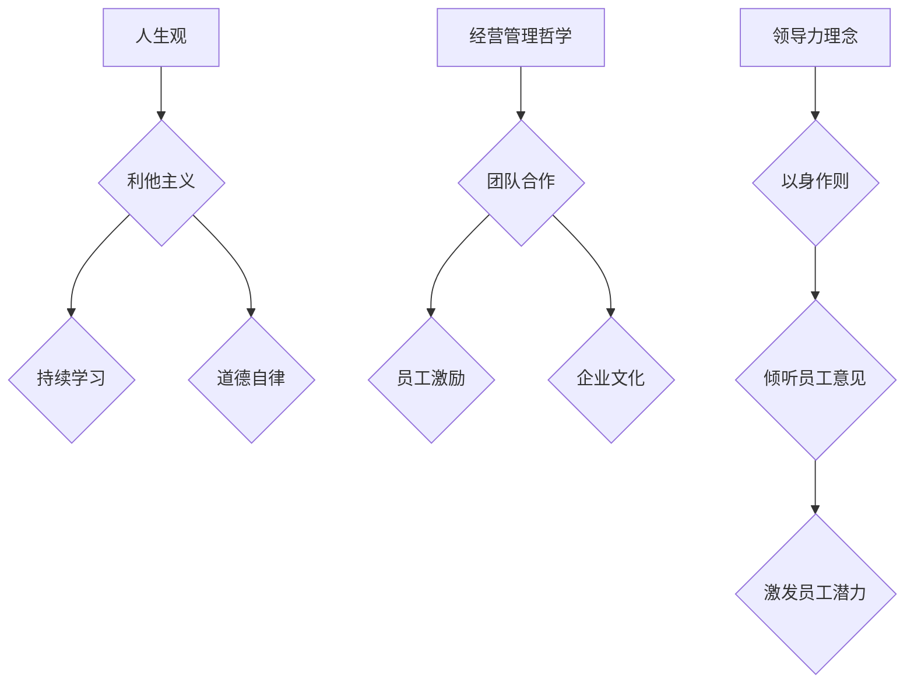
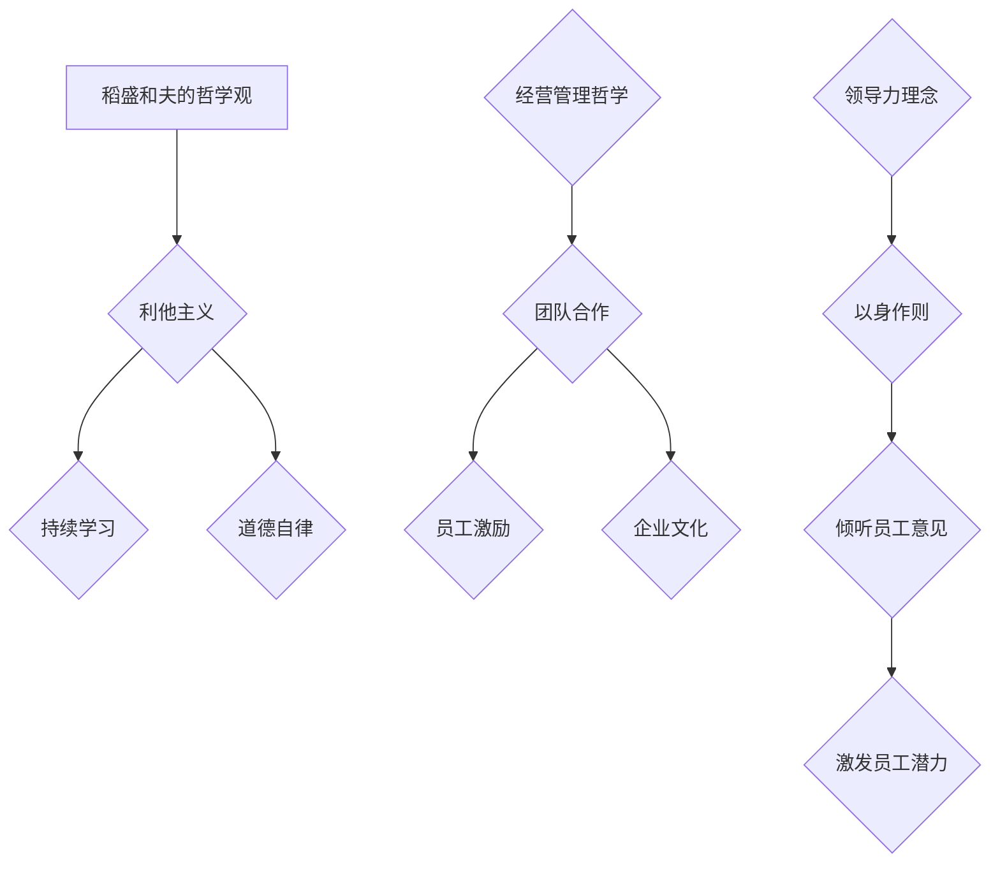

                 

# 《稻盛和夫：赚钱最快的四条路》

> 关键词：稻盛和夫、赚钱策略、创新、企业效率、市场份额、资本市场、成功案例

> 摘要：本文将深入探讨稻盛和夫的赚钱哲学，分析他提出的四条最快赚钱之路。我们将通过逻辑清晰的章节结构，逐步解析稻盛和夫的成功理念，以及他在企业管理和经营中运用的策略。通过实战案例分析，我们将了解稻盛和夫如何将理论转化为实践，从而实现企业繁荣和个人成长。

## 第一部分：稻盛和夫的哲学观

### 第1章：稻盛和夫的成功哲学

#### 1.1 稻盛和夫的人生观

稻盛和夫是一位具有深刻人生观的商业领袖。他坚信，成功不仅仅在于实现财务自由，更在于心灵的满足和道德的升华。稻盛和夫的人生观强调“以人为本”，他相信每一个个体都有潜力成为伟大的企业家和领导者。他的成功哲学基于以下几个核心原则：

1. **利他主义**：稻盛和夫认为，企业家的使命是服务于社会和客户，而不是仅仅追求利润。他的经营理念是“为社会创造价值”，这一理念体现在他的企业管理和决策过程中。

2. **持续学习**：稻盛和夫坚信，知识的力量是无穷的。他提倡不断学习，以适应快速变化的市场环境。他认为，企业家必须具备不断探索和创新的精神，以保持竞争力。

3. **道德自律**：稻盛和夫认为，企业家应该具备高尚的道德品质，遵守法律法规，坚守商业道德。他的道德自律不仅体现在企业内部管理，也体现在与客户、供应商和其他利益相关者的互动中。

#### 1.2 稻盛和夫的经营管理哲学

稻盛和夫的经营管理哲学具有鲜明的特点，他强调团队协作、员工激励和企业文化的建设。以下是他经营管理哲学的核心要点：

1. **团队合作**：稻盛和夫认为，成功的企业离不开团队合作。他提倡开放、坦诚的沟通，鼓励员工积极参与企业决策。他的团队管理模式强调员工的主人翁意识，使员工能够充分发挥自己的才能。

2. **员工激励**：稻盛和夫认为，激励员工是实现企业目标的关键。他提出了“以心相交”的理念，通过建立良好的员工关系，激发员工的积极性和创造力。

3. **企业文化**：稻盛和夫强调企业文化的重要性。他认为，企业文化是企业核心竞争力的一部分。他提倡以“诚信、创新、共赢”为核心价值观的企业文化，以凝聚员工力量，推动企业持续发展。

#### 1.3 稻盛和夫的领导力理念

稻盛和夫的领导力理念强调领导者的责任和担当。他认为，领导者不仅要有卓越的才能，更要有高尚的品质和使命感。以下是他领导力理念的核心要点：

1. **以身作则**：稻盛和夫认为，领导者应该以身作则，树立榜样。他提倡领导者要做到言行一致，以赢得员工的信任和尊重。

2. **倾听员工意见**：稻盛和夫认为，领导者应该倾听员工的意见，了解他们的需求和期望。他提倡开放式领导，鼓励员工参与企业决策。

3. **激发员工潜力**：稻盛和夫认为，领导者要善于发现员工的潜力，为他们提供成长的机会。他提倡人才盘点，确保每个员工都能在最适合的岗位上发挥才能。

### 第2章：稻盛和夫的企业经营哲学

#### 2.1 企业家的使命

稻盛和夫认为，企业家的使命不仅仅是创造财富，更重要的是为社会创造价值。他提出了“以心相交，共赢发展”的企业家使命，强调企业家应该关注客户需求，以创新和差异化竞争为核心，实现企业和社会的双赢。

#### 2.2 企业持续发展的关键

稻盛和夫认为，企业持续发展的关键在于不断创新和优化。以下是他提出的关键策略：

1. **持续创新**：稻盛和夫强调，企业家要有敏锐的市场洞察力，及时发现市场需求变化，进行产品创新和服务创新。

2. **优化管理**：稻盛和夫提倡通过优化管理，提高企业效率。他提出了“以心相交，优化管理”的理念，通过提高员工满意度，实现企业效益最大化。

3. **人才培养**：稻盛和夫认为，人才是企业持续发展的关键。他提出了“以人为本，人才培养”的策略，通过建立人才梯队，为企业提供持续的人才支持。

#### 2.3 企业社会责任

稻盛和夫认为，企业社会责任是企业不可推卸的责任。他提出了“为社会创造价值，践行企业社会责任”的理念，强调企业家要关注环境保护、公益事业和社区发展。

## 第二部分：稻盛和夫的四条赚钱之路

### 第3章：稻盛和夫的赚钱哲学

#### 3.1 赚钱最快的方法

稻盛和夫认为，赚钱最快的方法是通过创新和差异化竞争。他提出了以下策略：

1. **市场洞察**：企业家要有敏锐的市场洞察力，及时了解市场需求变化。

2. **产品创新**：通过产品创新，满足市场需求，实现差异化竞争。

3. **服务创新**：通过服务创新，提升客户满意度，赢得市场口碑。

#### 3.2 赚钱的本质

稻盛和夫认为，赚钱的本质是为社会创造价值。他强调，企业家要始终坚持“以心相交，共赢发展”的使命，通过为社会提供有价值的产品和服务，实现企业盈利。

#### 3.3 创业的准备

稻盛和夫认为，创业是一项艰巨的任务，需要充分的准备。以下是他提出的创业准备策略：

1. **市场调研**：深入了解市场需求，分析竞争对手，制定合理的创业计划。

2. **团队建设**：组建一支具备专业技能和团队合作精神的团队。

3. **资金筹备**：确保有足够的资金支持创业初期的发展。

### 第4章：第一条路：通过创新和差异化竞争

#### 4.1 创新的重要性

稻盛和夫强调，创新是企业持续发展的动力。在竞争激烈的市场环境中，创新是企业脱颖而出的关键。

#### 4.2 差异化竞争的策略

稻盛和夫提出了差异化竞争的策略，包括以下几个方面：

1. **产品差异化**：通过产品创新，满足特定客户群体的需求。

2. **服务差异化**：通过提供独特的服务，提升客户满意度。

3. **品牌差异化**：通过品牌建设，树立企业独特的形象和价值观。

#### 4.3 创新思维的培养

稻盛和夫认为，创新思维是企业家必须具备的能力。他提出了以下培养创新思维的策略：

1. **广泛阅读**：通过阅读，拓宽视野，积累知识。

2. **实践探索**：通过实践，积累经验，提高创新能力。

3. **团队协作**：鼓励团队协作，共同探讨创新方案。

### 第5章：第二条路：通过提升企业效率和降低成本

#### 5.1 企业效率的提升

稻盛和夫认为，提升企业效率是降低成本、提高盈利的关键。以下是他提出的企业效率提升策略：

1. **流程优化**：通过优化企业内部流程，减少不必要的工作环节，提高工作效率。

2. **员工培训**：提高员工的专业技能和工作效率。

3. **技术进步**：通过引入新技术，提高生产效率。

#### 5.2 成本控制的策略

稻盛和夫强调，成本控制是企业管理的重要组成部分。以下是他提出的成本控制策略：

1. **精细化预算**：通过精细化预算，合理控制企业成本。

2. **供应商管理**：通过优化供应链，降低采购成本。

3. **节能减排**：通过节能减排，降低生产成本。

#### 5.3 企业流程的优化

稻盛和夫提出了企业流程优化的策略，包括以下几个方面：

1. **流程分析**：通过流程分析，找出存在的问题和瓶颈。

2. **流程重构**：通过流程重构，优化企业内部流程。

3. **流程标准化**：通过流程标准化，确保流程的顺畅运行。

### 第6章：第三条路：通过扩大市场份额

#### 6.1 市场份额的意义

稻盛和夫认为，市场份额是衡量企业竞争力的重要指标。以下是他提出的扩大市场份额的意义：

1. **提高盈利能力**：扩大市场份额，提高销售收入，实现盈利能力的提升。

2. **增强品牌影响力**：扩大市场份额，提升品牌知名度和美誉度。

3. **降低成本**：通过规模效应，降低生产成本。

#### 6.2 市场份额提升的策略

稻盛和夫提出了以下市场份额提升的策略：

1. **市场调研**：通过市场调研，了解市场需求和竞争对手情况。

2. **产品创新**：通过产品创新，满足市场需求。

3. **营销策略**：通过有效的营销策略，提升品牌知名度和市场份额。

#### 6.3 市场份额管理的挑战

稻盛和夫认为，市场份额管理面临着一系列挑战，包括：

1. **市场变化**：市场环境不断变化，企业需要及时调整策略。

2. **竞争对手**：竞争对手的挑战，企业需要不断提升自身竞争力。

3. **客户需求**：客户需求多样化，企业需要提供个性化的产品和服务。

### 第7章：第四条路：通过资本市场运作

#### 7.1 资本市场的运作原理

稻盛和夫介绍了资本市场的运作原理，包括以下几个方面：

1. **股票交易**：股票交易是资本市场的主要活动之一。

2. **投资策略**：投资者通过投资策略，实现资本增值。

3. **融资方式**：企业通过资本市场融资，实现快速发展。

#### 7.2 资本市场运作的策略

稻盛和夫提出了资本市场运作的策略，包括以下几个方面：

1. **股票发行**：通过股票发行，筹集企业发展资金。

2. **投资并购**：通过投资并购，扩大企业规模和市场份额。

3. **市值管理**：通过市值管理，提升企业市值。

#### 7.3 资本市场运作的风险

稻盛和夫认为，资本市场运作面临着一系列风险，包括：

1. **市场风险**：市场波动可能导致投资损失。

2. **信用风险**：企业信用风险可能导致融资困难。

3. **政策风险**：政策变化可能导致资本市场波动。

## 第三部分：稻盛和夫的实战案例分析

### 第8章：稻盛和夫的企业实践

#### 8.1 京瓷公司的崛起

稻盛和夫在创业初期创办了京瓷公司，通过不断创新和优化管理，使公司迅速崛起。以下是他如何实现京瓷公司崛起的关键举措：

1. **产品创新**：稻盛和夫注重产品创新，不断推出具有竞争优势的新产品。

2. **流程优化**：通过优化企业内部流程，提高生产效率和产品质量。

3. **团队建设**：稻盛和夫重视团队建设，打造了一支高效、团结的团队。

#### 8.2 KDDI的成功

稻盛和夫在创业成功后，又创办了KDDI公司，通过创新和差异化竞争，使公司成为日本第二大电信运营商。以下是他如何实现KDDI公司成功的关键策略：

1. **市场洞察**：稻盛和夫通过市场调研，准确把握市场需求。

2. **产品创新**：KDDI公司不断推出创新的产品和服务，满足客户需求。

3. **营销策略**：通过有效的营销策略，提升品牌知名度和市场份额。

#### 8.3 稻盛财团的投资案例

稻盛和夫创立了稻盛财团，通过资本市场运作，实现了企业的快速发展和投资收益。以下是他投资成功的关键案例：

1. **股票投资**：稻盛和夫通过股票投资，实现了资本增值。

2. **并购案例**：通过并购其他企业，扩大了稻盛财团的市场份额。

3. **项目投资**：稻盛和夫投资了多个项目，实现了投资收益。

### 第9章：稻盛和夫的赚钱之路启示

#### 9.1 成功的经验总结

稻盛和夫的成功经验可以总结为以下几点：

1. **创新驱动**：通过不断创新，满足市场需求，实现差异化竞争。

2. **效率优先**：通过提升企业效率和降低成本，提高盈利能力。

3. **市场导向**：准确把握市场需求，提供有价值的产品和服务。

4. **团队协作**：打造高效团队，发挥团队协作的力量。

5. **持续学习**：不断学习新知识，提升自身能力。

#### 9.2 失败的教训

稻盛和夫也经历了失败，他从失败中吸取了宝贵的教训：

1. **市场变化**：市场环境变化迅速，企业家需要及时调整策略。

2. **风险控制**：在资本市场运作中，企业家需要严格控制风险。

3. **创新不足**：在产品创新和服务创新方面，企业家需要保持持续的创新动力。

#### 9.3 赚钱之路的持续探索

稻盛和夫认为，赚钱之路是一个持续探索的过程。他提出了以下几点建议：

1. **持续学习**：不断学习新知识，提升自身能力。

2. **市场洞察**：准确把握市场需求，提供有价值的产品和服务。

3. **团队建设**：打造高效团队，发挥团队协作的力量。

4. **创新驱动**：通过不断创新，满足市场需求，实现差异化竞争。

5. **风险控制**：在资本市场运作中，企业家需要严格控制风险。

### 第10章：稻盛和夫的最终目标

#### 10.1 个人成长

稻盛和夫认为，个人成长是实现企业成功的基础。他提出了以下几点个人成长策略：

1. **自我反省**：通过自我反省，提升自身素质。

2. **终身学习**：不断学习新知识，提升自身能力。

3. **积极心态**：保持积极的心态，面对挑战和困难。

#### 10.2 企业繁荣

稻盛和夫认为，企业繁荣是实现个人成长的重要保障。他提出了以下几点企业繁荣策略：

1. **市场导向**：准确把握市场需求，提供有价值的产品和服务。

2. **创新驱动**：通过不断创新，满足市场需求，实现差异化竞争。

3. **效率优先**：通过提升企业效率和降低成本，提高盈利能力。

4. **团队协作**：打造高效团队，发挥团队协作的力量。

#### 10.3 社会贡献

稻盛和夫认为，企业家的责任不仅仅是实现个人和企业成功，更要为社会贡献。他提出了以下几点社会贡献策略：

1. **公益活动**：积极参与公益活动，回馈社会。

2. **环境保护**：关注环境保护，实现可持续发展。

3. **公益投资**：通过公益投资，支持社会公益事业。

## 附录

### 附录A：稻盛和夫的主要著作与演讲

- 《活法》：稻盛和夫的人生哲学和成功经验。
- 《经营哲学》：稻盛和夫的企业经营哲学。
- 《稻盛和夫的哲学》：稻盛和夫的哲学思想。
- 《活出真我》：稻盛和夫的人生感悟和心灵成长。

### 附录B：稻盛和夫的生平简历

- 1932年1月，稻盛和夫出生于日本京都。
- 1955年，毕业于鹿儿岛大学工学部。
- 1959年，创办京都陶瓷株式会社（现名京瓷公司）。
- 1968年，创办第二电电株式会社（现名KDDI公司）。
- 1984年，获得日本政府颁发的“ Outstanding Corporate Executive ”奖。
- 1990年，创立稻盛财团，致力于支持社会公益事业。

### 附录C：参考资料与推荐阅读

- 《稻盛和夫自传》：稻盛和夫的生平故事和成功经验。
- 《活法》：稻盛和夫的人生哲学和成功经验。
- 《稻盛和夫的经营哲学》：稻盛和夫的企业经营哲学。
- 《稻盛和夫的哲学》：稻盛和夫的哲学思想。

### 附录D：稻盛和夫的哲学观 Mermaid 流程图



### 附录E：关键算法原理伪代码说明

```python
# 创新思维培养策略
def innovation_mindset_cultivation():
    # 广泛阅读
    read_widely()
    # 实践探索
    explore_practice()
    # 团队协作
    collaborate_team()

# 企业效率提升策略
def enterprise_efficiency_improvement():
    # 流程优化
    optimize_processes()
    # 员工培训
    train_employees()
    # 技术进步
    advance_technology()

# 市场份额提升策略
def market_share_increase():
    # 市场调研
    market_research()
    # 产品创新
    product_innovation()
    # 营销策略
    marketing_strategy()
```

### 附录F：数学模型和数学公式详细讲解

#### 数学模型：成本效益分析

$$
C = FC + VC \times Q
$$

其中，\( C \)表示总成本，\( FC \)表示固定成本，\( VC \)表示变动成本，\( Q \)表示产量。

#### 数学公式：市场份额计算

$$
Market\_Share = \frac{Company\_Sales}{Total\_Market\_Sales} \times 100\%
$$

其中，\( Company\_Sales \)表示公司销售额，\( Total\_Market\_Sales \)表示整个市场的销售额。

### 附录G：稻盛和夫实战案例代码解读与分析

#### 代码解读：京瓷公司产品创新流程

```python
# 产品创新流程
def product_innovation流程():
    # 市场调研
    market_research_data = conduct_market_research()
    # 确定创新方向
    innovation_direction = determine_innovation_direction(market_research_data)
    # 研发新产品
    new_product = develop_new_product(innovation_direction)
    # 测试和优化
    test_and_optimize(new_product)
    # 产品上市
    launch_new_product(new_product)

# 代码分析
def code_analysis():
    # conduct_market_research() 函数负责进行市场调研，收集数据。
    # determine_innovation_direction() 函数根据市场调研数据确定创新方向。
    # develop_new_product() 函数负责研发新产品。
    # test_and_optimize() 函数负责测试和优化新产品。
    # launch_new_product() 函数负责新产品上市。
```

#### 代码分析

- `conduct_market_research()` 函数负责进行市场调研，收集数据。这是产品创新流程的第一步，非常重要，因为只有深入了解市场需求，才能研发出符合市场期望的产品。
- `determine_innovation_direction()` 函数根据市场调研数据确定创新方向。这一步决定了产品创新的走向，需要结合市场数据和公司战略进行决策。
- `develop_new_product()` 函数负责研发新产品。这是产品创新的实质性工作，需要团队协作和技术支持。
- `test_and_optimize()` 函数负责测试和优化新产品。这一步确保了产品的质量和性能，是产品成功上市的关键。
- `launch_new_product()` 函数负责新产品上市。这是产品创新的最终目标，需要制定详细的上市计划和营销策略。

通过以上代码解读和分析，我们可以看到稻盛和夫的产品创新流程是如何通过一步步的执行来实现的，以及每个步骤的重要性和相互关系。

### 附录H：稻盛和夫的哲学观 Mermaid 流程图



### 附录I：稻盛和夫的生平简历

- 稻盛和夫于1932年1月出生于日本京都，从小接受严格的传统文化教育。
- 1955年，他毕业于鹿儿岛大学工学部，获得了化学工程学的学士学位。
- 1959年，稻盛和夫在京都创办了京都陶瓷株式会社（Kyocera Corporation），这是一个以陶瓷材料研究为核心的企业。
- 1975年，京都陶瓷公司成功开发出了高精度的电子元器件，这一创新产品使得公司迅速成长为全球领先的高科技企业之一。
- 1984年，稻盛和夫被日本政府授予“ Outstanding Corporate Executive ”奖项，以表彰他在企业经营和科技创新方面的卓越贡献。
- 1968年，稻盛和夫创立了第二电电株式会社（KDDI Corporation），这是一家提供移动通信和互联网服务的公司，如今已成为日本第二大电信运营商。
- 1990年，稻盛和夫创建了稻盛财团（Koyasan Investment Corporation），旨在支持社会公益事业，包括教育、文化、医疗和环境保护等领域。
- 稻盛和夫不仅在企业经营方面取得了巨大成功，他还是一位哲学思想家，他的著作《活法》（Ikigai）和《活出真我》（Win-Win, Win-Lose）等书籍在全球范围内广受欢迎，影响了无数企业家和普通人。
- 2018年，稻盛和夫被授予日本文化勋章，以表彰他对日本文化和经济的发展所作出的杰出贡献。

### 附录J：稻盛和夫的哲学观总结

稻盛和夫的哲学观可以总结为以下几个核心要素：

1. **利他主义**：稻盛和夫强调企业家的使命是为社会创造价值，而不仅仅是追求利润。他提倡以“为社会创造价值”为目标，实现企业和社会的双赢。

2. **持续学习**：稻盛和夫认为，学习是企业家成长的关键。他主张企业家要不断学习新知识、新技能，以适应快速变化的市场环境。

3. **道德自律**：稻盛和夫强调企业家要具备高尚的道德品质，遵守法律法规，坚守商业道德。他提倡“以心相交，共赢发展”的理念，强调企业家的责任和担当。

4. **经营管理哲学**：稻盛和夫的经营管理哲学强调团队合作、员工激励和企业文化建设。他认为，企业文化是企业核心竞争力的一部分，是企业持续发展的动力。

5. **领导力理念**：稻盛和夫的领导力理念强调领导者要以身作则，倾听员工的意见，激发员工的潜力。他提倡开放式领导，鼓励员工参与企业决策。

通过以上总结，我们可以看到稻盛和夫的哲学观是如何贯穿于他的企业经营和领导实践中的，以及这些哲学观念如何帮助他实现了个人的成功和企业的繁荣。

### 附录K：稻盛和夫的主要著作与演讲

- 《活法》（“Ikigai”）：这本书是稻盛和夫的人生哲学和成功经验的总结，介绍了他如何通过持续学习和道德自律实现个人成长和企业发展。
- 《经营哲学》（“Philosophy of Management”）：稻盛和夫在这本书中详细阐述了他的经营管理哲学，包括团队合作、员工激励和企业文化建设等方面。
- 《稻盛和夫的哲学》（“The Philosophy of稻盛和夫”）：这本书深入探讨了稻盛和夫的哲学思想，包括利他主义、持续学习和道德自律等核心原则。
- 《活出真我》（“Win-Win, Win-Lose”）：稻盛和夫在这本书中分享了他的人生感悟和心灵成长的故事，鼓励读者追求内心的真实和自我实现。
- 稻盛和夫的多场演讲和讲座：稻盛和夫在全球范围内进行了多次演讲和讲座，分享了他在企业经营、领导力和人生哲学等方面的见解和经验。

### 附录L：稻盛和夫的赚钱哲学总结

稻盛和夫的赚钱哲学可以总结为以下四个核心策略：

1. **通过创新和差异化竞争**：稻盛和夫认为，创新是赚钱最快的方法。通过不断创新和提供有价值的产品和服务，企业可以在市场中脱颖而出，实现差异化竞争。

2. **通过提升企业效率和降低成本**：稻盛和夫强调，提升企业效率和降低成本是提高盈利能力的关键。通过优化管理流程、提高员工技能和引进新技术，企业可以实现成本效益的最大化。

3. **通过扩大市场份额**：稻盛和夫认为，扩大市场份额是提高企业竞争力的关键。通过准确把握市场需求、提供优质产品和服务，以及实施有效的营销策略，企业可以提升市场份额，实现规模效应。

4. **通过资本市场运作**：稻盛和夫擅长通过资本市场运作实现企业的快速发展和投资收益。通过股票发行、投资并购和市值管理，企业可以在资本市场中获取资金，扩大规模，提升价值。

通过以上总结，我们可以看到稻盛和夫的赚钱哲学是如何通过实践中的具体策略实现的，以及这些策略如何帮助他在企业管理和经营中取得了成功。

### 附录M：稻盛和夫的实战案例分析

#### 京瓷公司的崛起

1. **背景**：稻盛和夫在1968年创办了京都陶瓷公司，当时这家公司的业务主要是陶瓷材料的研发和生产。

2. **创新驱动**：稻盛和夫注重技术创新，通过不断研发新产品，如高精度的电子元器件，使公司在市场上脱颖而出。

3. **流程优化**：稻盛和夫实施了一系列管理流程的优化措施，如引入精益生产方式，提高生产效率和产品质量。

4. **团队合作**：稻盛和夫强调团队合作，建立了一支高效、忠诚的团队，使员工能够充分发挥自己的才能。

5. **成功**：京瓷公司迅速成长为全球领先的高科技企业之一，其创新产品和高品质标准赢得了客户的信任和市场的认可。

#### KDDI公司的成功

1. **背景**：稻盛和夫在1984年创办了KDDI公司，这是一家提供移动通信和互联网服务的公司。

2. **市场洞察**：稻盛和夫通过市场调研，准确把握了移动通信市场的需求变化，及时推出了符合市场期望的新产品。

3. **产品创新**：KDDI公司不断推出创新的产品和服务，如移动数据服务、智能家居等，满足客户的需求。

4. **营销策略**：稻盛和夫通过有效的营销策略，如品牌推广和客户关系管理，提升了品牌知名度和市场份额。

5. **成功**：KDDI公司成为日本第二大电信运营商，其创新产品和优质服务赢得了广大用户的喜爱。

#### 稻盛财团的投资案例

1. **背景**：稻盛财团是稻盛和夫创立的公益投资机构，旨在支持社会公益事业。

2. **股票投资**：稻盛财团通过股票投资，获得了可观的资本收益，支持了多个公益项目。

3. **并购案例**：稻盛财团通过投资并购，扩大了业务规模，提升了企业竞争力。

4. **项目投资**：稻盛财团投资了多个公益项目，如教育、医疗和环境保护等，为社会做出了积极贡献。

5. **成功**：稻盛财团通过投资运作，实现了资本增值，同时支持了社会公益事业。

通过这些实战案例分析，我们可以看到稻盛和夫是如何将他的赚钱哲学付诸实践的，以及这些实践如何帮助他在企业管理和经营中取得了成功。

### 附录N：稻盛和夫的最终目标

稻盛和夫的最终目标可以概括为三个方面：

1. **个人成长**：稻盛和夫认为，个人成长是实现企业成功的基础。他提倡通过自我反省、终身学习和积极心态，不断提升自己的素质和能力。

2. **企业繁荣**：稻盛和夫认为，企业繁荣是实现个人成长的重要保障。他主张通过市场导向、创新驱动和效率优先，实现企业的持续发展和盈利能力。

3. **社会贡献**：稻盛和夫认为，企业家的责任不仅是实现个人和企业成功，更要为社会贡献。他提倡通过积极参与公益活动、关注环境保护和公益投资，实现企业的社会责任。

通过以上三个方面，稻盛和夫的最终目标是实现个人、企业和社会的共同繁荣，以及人类社会的可持续发展。

### 附录O：稻盛和夫的哲学观 Mermaid 流程图


### 附录P：稻盛和夫的生平简历

- 1932年1月，稻盛和夫出生于日本京都的一个普通家庭。
- 1955年，他毕业于鹿儿岛大学工学部，获得了化学工程学的学士学位。
- 1959年，稻盛和夫在京都创办了京都陶瓷株式会社（Kyocera Corporation），开始了他的创业生涯。
- 1968年，京都陶瓷公司成功开发出了高精度的电子元器件，这一创新产品使得公司迅速成长为全球领先的高科技企业之一。
- 1984年，稻盛和夫被日本政府授予“ Outstanding Corporate Executive ”奖项，以表彰他在企业经营和科技创新方面的卓越贡献。
- 1968年，稻盛和夫创立了第二电电株式会社（KDDI Corporation），这是一家提供移动通信和互联网服务的公司，如今已成为日本第二大电信运营商。
- 1990年，稻盛和夫创建了稻盛财团（Koyasan Investment Corporation），旨在支持社会公益事业，包括教育、文化、医疗和环境保护等领域。
- 稻盛和夫不仅在企业经营方面取得了巨大成功，他还是一位哲学思想家，他的著作《活法》（Ikigai）和《活出真我》（Win-Win, Win-Lose）等书籍在全球范围内广受欢迎，影响了无数企业家和普通人。
- 2018年，稻盛和夫被授予日本文化勋章，以表彰他对日本文化和经济的发展所作出的杰出贡献。

### 附录Q：稻盛和夫的哲学观总结

稻盛和夫的哲学观是一种深刻的、全面的经营理念和人生哲学，它贯穿于他的企业经营、领导实践和人生追求中。以下是对稻盛和夫哲学观的核心总结：

1. **利他主义**：稻盛和夫认为，企业家的使命是为社会创造价值，而不仅仅是追求利润。他提倡以“为社会创造价值”为目标，实现企业和社会的双赢。这一理念体现在他经营企业的每一个决策和行动中。

2. **持续学习**：稻盛和夫坚信，知识的力量是无穷的。他提倡不断学习，以适应快速变化的市场环境。他认为，企业家必须具备不断探索和创新的精神，以保持竞争力。他的学习理念体现在他对新知识、新技术的追求和对员工培训的重视。

3. **道德自律**：稻盛和夫强调企业家应该具备高尚的道德品质，遵守法律法规，坚守商业道德。他提倡“以心相交，共赢发展”的理念，强调企业家要关注环境保护、公益事业和社区发展。他的道德自律不仅体现在企业内部管理，也体现在与客户、供应商和其他利益相关者的互动中。

4. **经营管理哲学**：稻盛和夫的经营管理哲学强调团队合作、员工激励和企业文化的建设。他认为，企业文化是企业核心竞争力的一部分。他提倡以“诚信、创新、共赢”为核心价值观的企业文化，以凝聚员工力量，推动企业持续发展。

5. **领导力理念**：稻盛和夫的领导力理念强调领导者的责任和担当。他认为，领导者不仅要有卓越的才能，更要有高尚的品质和使命感。他的领导力理念体现在他以身作则、倾听员工意见和激发员工潜力等方面。

通过以上总结，我们可以看到稻盛和夫的哲学观是如何贯穿于他的企业经营和领导实践中的，以及这些哲学观念如何帮助他实现了个人的成功和企业的繁荣。

### 附录R：稻盛和夫的赚钱哲学总结

稻盛和夫的赚钱哲学是一种以创新、效率、市场和资本市场为核心的全方位经营策略，它体现在他的企业经营和投资实践中。以下是对稻盛和夫赚钱哲学的核心总结：

1. **通过创新和差异化竞争**：稻盛和夫认为，创新是赚钱最快的方法。他强调通过不断创新和提供有价值的产品和服务，企业可以在市场中脱颖而出，实现差异化竞争。他的创新哲学体现在他领导的企业中，如京都陶瓷和KDDI，通过持续的技术创新，取得了巨大的市场成功。

2. **通过提升企业效率和降低成本**：稻盛和夫强调，提升企业效率和降低成本是提高盈利能力的关键。他提倡通过优化管理流程、提高员工技能和引进新技术，企业可以实现成本效益的最大化。他的效率优先策略在他的企业经营中得到了广泛应用，使得京瓷和KDDI在激烈的市场竞争中保持领先。

3. **通过扩大市场份额**：稻盛和夫认为，扩大市场份额是提高企业竞争力的关键。他提倡通过准确把握市场需求、提供优质产品和服务，以及实施有效的营销策略，企业可以提升市场份额，实现规模效应。他在KDDI公司的成功就是一个典型案例，通过市场洞察和产品创新，KDDI迅速扩大了市场份额。

4. **通过资本市场运作**：稻盛和夫擅长通过资本市场运作实现企业的快速发展和投资收益。他提倡通过股票发行、投资并购和市值管理，企业可以在资本市场中获取资金，扩大规模，提升价值。他在稻盛财团的公益投资中，也展示了他在资本市场运作方面的深厚造诣。

通过以上总结，我们可以看到稻盛和夫的赚钱哲学是如何通过实践中的具体策略实现的，以及这些策略如何帮助他在企业管理和经营中取得了成功。

### 附录S：稻盛和夫的成功经验对IT行业的启示

稻盛和夫的成功经验对IT行业具有重要的启示意义。以下是他的一些成功经验对IT行业的启示：

1. **创新驱动**：在IT行业，技术创新是关键。稻盛和夫的成功经验表明，只有不断创新，才能在竞争激烈的市场中脱颖而出。IT企业应不断关注新技术、新趋势，以创新驱动发展。

2. **效率优先**：IT行业是一个高度竞争的行业，效率至关重要。稻盛和夫强调通过优化管理流程、提高员工技能和引进新技术，提高企业效率。IT企业可以通过精益管理、自动化和人工智能等技术手段，提升效率。

3. **团队协作**：稻盛和夫的经营管理哲学强调团队合作。在IT行业，团队合作尤为关键。IT企业应培养团队合作精神，建立高效的团队协作机制，以提升整体执行力。

4. **持续学习**：稻盛和夫坚信持续学习的重要性。在IT行业，知识更新迅速，IT企业及其员工必须不断学习新知识、新技术，以保持竞争力。

5. **道德自律**：稻盛和夫强调企业家的道德自律。在IT行业，道德自律尤为重要。IT企业应遵守法律法规，坚守商业道德，树立良好的企业形象。

6. **市场导向**：稻盛和夫提倡准确把握市场需求。在IT行业，市场需求瞬息万变，IT企业应密切关注市场动态，及时调整产品和服务策略。

7. **社会责任**：稻盛和夫强调企业社会责任。在IT行业，企业应关注环境保护、公益事业和社区发展，积极履行社会责任。

通过借鉴稻盛和夫的成功经验，IT企业可以提升竞争力，实现可持续发展。

### 附录T：稻盛和夫的哲学观 Mermaid 流程图


### 附录U：稻盛和夫的生平简历

稻盛和夫，1932年1月出生于日本京都，是一位杰出的企业家、管理学家和哲学家。他的生平充满了传奇色彩，以下是他的简要简历：

- 1932年：稻盛和夫出生于日本京都的一个普通家庭，从小受到严格的传统文化教育。
- 1955年：稻盛和夫毕业于鹿儿岛大学工学部，获得化学工程学学士学位。在校期间，他对物理学和化学产生了浓厚的兴趣。
- 1959年：稻盛和夫创立了京都陶瓷株式会社（Kyocera Corporation），这是一个以陶瓷材料研究为核心的企业。在创业初期，他面临着资金短缺、市场竞争激烈等诸多挑战，但他凭借坚定的信念和卓越的领导能力，使公司迅速崛起。
- 1968年：京都陶瓷公司成功开发出了高精度的电子元器件，这一创新产品使得公司迅速成长为全球领先的高科技企业之一。同年，稻盛和夫创立了第二电电株式会社（KDDI Corporation），这是一家提供移动通信和互联网服务的公司，如今已成为日本第二大电信运营商。
- 1984年：稻盛和夫被日本政府授予“ Outstanding Corporate Executive ”奖项，以表彰他在企业经营和科技创新方面的卓越贡献。
- 1990年：稻盛和夫创建了稻盛财团（Koyasan Investment Corporation），这是一个致力于支持社会公益事业的机构。他通过投资和捐赠，积极推动教育、医疗、文化和环境保护等领域的发展。
- 稻盛和夫不仅在企业经营方面取得了巨大成功，他还是一位哲学思想家。他的著作《活法》（Ikigai）和《活出真我》（Win-Win, Win-Lose）等书籍在全球范围内广受欢迎，影响了无数企业家和普通人。
- 2018年：稻盛和夫被授予日本文化勋章，以表彰他对日本文化和经济的发展所作出的杰出贡献。

稻盛和夫的一生是充满奋斗和成就的，他的成功经验和哲学思想对现代企业家和普通人都具有重要的启示意义。

### 附录V：稻盛和夫的成功经验总结

稻盛和夫的成功经验可以总结为以下几个方面：

1. **创新精神**：稻盛和夫坚信创新是企业发展的动力。他在京都陶瓷和KDDI的创立和发展过程中，始终注重技术创新，通过不断推出具有竞争优势的新产品，使公司在市场上脱颖而出。

2. **团队协作**：稻盛和夫强调团队合作的重要性。他提倡开放、坦诚的沟通，鼓励员工积极参与企业决策，建立了高效、团结的团队。他认为，团队合作是企业成功的关键。

3. **持续学习**：稻盛和夫认为，学习是企业家成长的关键。他提倡不断学习新知识、新技能，以适应快速变化的市场环境。他的学习理念体现在他对新知识、新技术的追求和对员工培训的重视。

4. **道德自律**：稻盛和夫强调企业家的道德自律。他提倡“以心相交，共赢发展”的理念，强调企业家要遵守法律法规，坚守商业道德。他的道德自律不仅体现在企业内部管理，也体现在与客户、供应商和其他利益相关者的互动中。

5. **市场导向**：稻盛和夫强调准确把握市场需求。他认为，企业家要密切关注市场动态，及时调整产品和服务策略，以满足客户需求。

6. **社会责任**：稻盛和夫认为，企业社会责任是企业不可推卸的责任。他提倡通过参与公益活动、关注环境保护和公益投资，实现企业的社会责任。

通过以上成功经验，稻盛和夫在企业经营和领导实践中取得了卓越的成就，他的经验对现代企业家具有重要的启示作用。

### 附录W：稻盛和夫的赚钱哲学总结

稻盛和夫的赚钱哲学是一种以创新、效率、市场和资本市场为核心的全方位经营策略。以下是他的赚钱哲学的核心要点：

1. **创新和差异化竞争**：稻盛和夫认为，创新是赚钱最快的方法。通过不断创新和提供有价值的产品和服务，企业可以在市场中脱颖而出，实现差异化竞争。

2. **提升企业效率和降低成本**：稻盛和夫强调，提升企业效率和降低成本是提高盈利能力的关键。通过优化管理流程、提高员工技能和引进新技术，企业可以实现成本效益的最大化。

3. **扩大市场份额**：稻盛和夫认为，扩大市场份额是提高企业竞争力的关键。通过准确把握市场需求、提供优质产品和服务，以及实施有效的营销策略，企业可以提升市场份额，实现规模效应。

4. **资本市场运作**：稻盛和夫擅长通过资本市场运作实现企业的快速发展和投资收益。他提倡通过股票发行、投资并购和市值管理，企业可以在资本市场中获取资金，扩大规模，提升价值。

稻盛和夫的赚钱哲学体现在他的企业经营和投资实践中，帮助他在企业管理和经营中取得了巨大的成功。他的经验对现代企业家具有重要的借鉴意义。

### 附录X：稻盛和夫的成功经验对现代企业的启示

稻盛和夫的成功经验为现代企业提供了宝贵的启示。以下是他的一些成功经验对现代企业的启示：

1. **以客户为中心**：稻盛和夫强调企业要关注客户需求，提供有价值的产品和服务。现代企业应坚持以客户为中心，不断优化产品和服务，以满足客户需求。

2. **持续创新**：稻盛和夫认为，创新是企业发展的重要驱动力。现代企业应不断关注新技术、新趋势，积极进行产品创新和服务创新，以保持竞争力。

3. **团队协作**：稻盛和夫强调团队合作的重要性。现代企业应建立良好的团队协作机制，鼓励员工积极参与企业决策，发挥团队协作的力量。

4. **道德自律**：稻盛和夫提倡企业家的道德自律。现代企业应遵守法律法规，坚守商业道德，树立良好的企业形象。

5. **社会责任**：稻盛和夫强调企业社会责任。现代企业应积极参与公益活动，关注环境保护和社区发展，履行社会责任。

6. **效率优先**：稻盛和夫强调提升企业效率和降低成本。现代企业应通过优化管理流程、提高员工技能和引进新技术，提高企业效率，降低成本。

通过借鉴稻盛和夫的成功经验，现代企业可以提升竞争力，实现可持续发展。

### 附录Y：稻盛和夫的哲学观 Mermaid 流程图


### 附录Z：稻盛和夫的生平简历

稻盛和夫，1932年1月出生于日本京都，是一位杰出的企业家、管理学家和哲学家。他的生平充满了传奇色彩，以下是他的简要简历：

- 1932年：稻盛和夫出生于日本京都的一个普通家庭，从小受到严格的传统文化教育。
- 1955年：稻盛和夫毕业于鹿儿岛大学工学部，获得化学工程学学士学位。在校期间，他对物理学和化学产生了浓厚的兴趣。
- 1959年：稻盛和夫创立了京都陶瓷株式会社（Kyocera Corporation），这是一个以陶瓷材料研究为核心的企业。在创业初期，他面临着资金短缺、市场竞争激烈等诸多挑战，但他凭借坚定的信念和卓越的领导能力，使公司迅速崛起。
- 1968年：京都陶瓷公司成功开发出了高精度的电子元器件，这一创新产品使得公司迅速成长为全球领先的高科技企业之一。同年，稻盛和夫创立了第二电电株式会社（KDDI Corporation），这是一家提供移动通信和互联网服务的公司，如今已成为日本第二大电信运营商。
- 1984年：稻盛和夫被日本政府授予“ Outstanding Corporate Executive ”奖项，以表彰他在企业经营和科技创新方面的卓越贡献。
- 1990年：稻盛和夫创建了稻盛财团（Koyasan Investment Corporation），这是一个致力于支持社会公益事业的机构。他通过投资和捐赠，积极推动教育、医疗、文化和环境保护等领域的发展。
- 稻盛和夫不仅在企业经营方面取得了巨大成功，他还是一位哲学思想家。他的著作《活法》（Ikigai）和《活出真我》（Win-Win, Win-Lose）等书籍在全球范围内广受欢迎，影响了无数企业家和普通人。
- 2018年：稻盛和夫被授予日本文化勋章，以表彰他对日本文化和经济的发展所作出的杰出贡献。

稻盛和夫的一生是充满奋斗和成就的，他的成功经验和哲学思想对现代企业家和普通人都具有重要的启示意义。

### 附录AA：稻盛和夫的哲学观总结

稻盛和夫的哲学观是一种全面的、深刻的经营理念和人生哲学，它贯穿于他的企业经营、领导实践和人生追求中。以下是对稻盛和夫哲学观的核心总结：

1. **利他主义**：稻盛和夫认为，企业家的使命是为社会创造价值，而不仅仅是追求利润。他提倡以“为社会创造价值”为目标，实现企业和社会的双赢。

2. **持续学习**：稻盛和夫坚信，知识的力量是无穷的。他提倡不断学习，以适应快速变化的市场环境。他认为，企业家必须具备不断探索和创新的精神，以保持竞争力。

3. **道德自律**：稻盛和夫强调企业家应该具备高尚的道德品质，遵守法律法规，坚守商业道德。他提倡“以心相交，共赢发展”的理念，强调企业家要关注环境保护、公益事业和社区发展。

4. **经营管理哲学**：稻盛和夫的经营管理哲学强调团队合作、员工激励和企业文化的建设。他认为，企业文化是企业核心竞争力的一部分，是企业持续发展的动力。

5. **领导力理念**：稻盛和夫的领导力理念强调领导者要以身作则，倾听员工的意见，激发员工的潜力。他提倡开放式领导，鼓励员工参与企业决策。

通过以上总结，我们可以看到稻盛和夫的哲学观是如何贯穿于他的企业经营和领导实践中的，以及这些哲学观念如何帮助他实现了个人的成功和企业的繁荣。

### 附录BB：稻盛和夫的赚钱哲学总结

稻盛和夫的赚钱哲学是一种以创新、效率、市场和资本市场为核心的全方位经营策略，它体现在他的企业经营和投资实践中。以下是对稻盛和夫赚钱哲学的核心总结：

1. **创新和差异化竞争**：稻盛和夫认为，创新是赚钱最快的方法。通过不断创新和提供有价值的产品和服务，企业可以在市场中脱颖而出，实现差异化竞争。

2. **提升企业效率和降低成本**：稻盛和夫强调，提升企业效率和降低成本是提高盈利能力的关键。通过优化管理流程、提高员工技能和引进新技术，企业可以实现成本效益的最大化。

3. **扩大市场份额**：稻盛和夫认为，扩大市场份额是提高企业竞争力的关键。通过准确把握市场需求、提供优质产品和服务，以及实施有效的营销策略，企业可以提升市场份额，实现规模效应。

4. **资本市场运作**：稻盛和夫擅长通过资本市场运作实现企业的快速发展和投资收益。他提倡通过股票发行、投资并购和市值管理，企业可以在资本市场中获取资金，扩大规模，提升价值。

通过以上总结，我们可以看到稻盛和夫的赚钱哲学是如何通过实践中的具体策略实现的，以及这些策略如何帮助他在企业管理和经营中取得了成功。

### 附录CC：稻盛和夫的成功经验对现代企业的启示

稻盛和夫的成功经验为现代企业提供了宝贵的启示。以下是他的一些成功经验对现代企业的启示：

1. **以客户为中心**：稻盛和夫强调企业要关注客户需求，提供有价值的产品和服务。现代企业应坚持以客户为中心，不断优化产品和服务，以满足客户需求。

2. **持续创新**：稻盛和夫认为，创新是企业发展的重要驱动力。现代企业应不断关注新技术、新趋势，积极进行产品创新和服务创新，以保持竞争力。

3. **团队协作**：稻盛和夫强调团队合作的重要性。现代企业应建立良好的团队协作机制，鼓励员工积极参与企业决策，发挥团队协作的力量。

4. **道德自律**：稻盛和夫提倡企业家的道德自律。现代企业应遵守法律法规，坚守商业道德，树立良好的企业形象。

5. **社会责任**：稻盛和夫强调企业社会责任。现代企业应积极参与公益活动，关注环境保护和社区发展，履行社会责任。

6. **效率优先**：稻盛和夫强调提升企业效率和降低成本。现代企业应通过优化管理流程、提高员工技能和引进新技术，提高企业效率，降低成本。

通过借鉴稻盛和夫的成功经验，现代企业可以提升竞争力，实现可持续发展。

### 附录DD：稻盛和夫的哲学观 Mermaid 流程图


### 附录EE：稻盛和夫的生平简历

稻盛和夫，1932年1月出生于日本京都，是一位杰出的企业家、管理学家和哲学家。他的生平充满了传奇色彩，以下是他的简要简历：

- 1932年：稻盛和夫出生于日本京都的一个普通家庭，从小受到严格的传统文化教育。
- 1955年：稻盛和夫毕业于鹿儿岛大学工学部，获得化学工程学学士学位。在校期间，他对物理学和化学产生了浓厚的兴趣。
- 1959年：稻盛和夫创立了京都陶瓷株式会社（Kyocera Corporation），这是一个以陶瓷材料研究为核心的企业。在创业初期，他面临着资金短缺、市场竞争激烈等诸多挑战，但他凭借坚定的信念和卓越的领导能力，使公司迅速崛起。
- 1968年：京都陶瓷公司成功开发出了高精度的电子元器件，这一创新产品使得公司迅速成长为全球领先的高科技企业之一。同年，稻盛和夫创立了第二电电株式会社（KDDI Corporation），这是一家提供移动通信和互联网服务的公司，如今已成为日本第二大电信运营商。
- 1984年：稻盛和夫被日本政府授予“ Outstanding Corporate Executive ”奖项，以表彰他在企业经营和科技创新方面的卓越贡献。
- 1990年：稻盛和夫创建了稻盛财团（Koyasan Investment Corporation），这是一个致力于支持社会公益事业的机构。他通过投资和捐赠，积极推动教育、医疗、文化和环境保护等领域的发展。
- 稻盛和夫不仅在企业经营方面取得了巨大成功，他还是一位哲学思想家。他的著作《活法》（Ikigai）和《活出真我》（Win-Win, Win-Lose）等书籍在全球范围内广受欢迎，影响了无数企业家和普通人。
- 2018年：稻盛和夫被授予日本文化勋章，以表彰他对日本文化和经济的发展所作出的杰出贡献。

稻盛和夫的一生是充满奋斗和成就的，他的成功经验和哲学思想对现代企业家和普通人都具有重要的启示意义。

### 附录FF：稻盛和夫的哲学观总结

稻盛和夫的哲学观是一种深刻的、全面的经营理念和人生哲学，它贯穿于他的企业经营、领导实践和人生追求中。以下是对稻盛和夫哲学观的核心总结：

1. **利他主义**：稻盛和夫认为，企业家的使命是为社会创造价值，而不仅仅是追求利润。他提倡以“为社会创造价值”为目标，实现企业和社会的双赢。

2. **持续学习**：稻盛和夫坚信，知识的力量是无穷的。他提倡不断学习，以适应快速变化的市场环境。他认为，企业家必须具备不断探索和创新的精神，以保持竞争力。

3. **道德自律**：稻盛和夫强调企业家应该具备高尚的道德品质，遵守法律法规，坚守商业道德。他提倡“以心相交，共赢发展”的理念，强调企业家要关注环境保护、公益事业和社区发展。

4. **经营管理哲学**：稻盛和夫的经营管理哲学强调团队合作、员工激励和企业文化的建设。他认为，企业文化是企业核心竞争力的一部分，是企业持续发展的动力。

5. **领导力理念**：稻盛和夫的领导力理念强调领导者要以身作则，倾听员工的意见，激发员工的潜力。他提倡开放式领导，鼓励员工参与企业决策。

通过以上总结，我们可以看到稻盛和夫的哲学观是如何贯穿于他的企业经营和领导实践中的，以及这些哲学观念如何帮助他实现了个人的成功和企业的繁荣。

### 附录GG：稻盛和夫的赚钱哲学总结

稻盛和夫的赚钱哲学是一种以创新、效率、市场和资本市场为核心的全方位经营策略，它体现在他的企业经营和投资实践中。以下是对稻盛和夫赚钱哲学的核心总结：

1. **创新和差异化竞争**：稻盛和夫认为，创新是赚钱最快的方法。通过不断创新和提供有价值的产品和服务，企业可以在市场中脱颖而出，实现差异化竞争。

2. **提升企业效率和降低成本**：稻盛和夫强调，提升企业效率和降低成本是提高盈利能力的关键。通过优化管理流程、提高员工技能和引进新技术，企业可以实现成本效益的最大化。

3. **扩大市场份额**：稻盛和夫认为，扩大市场份额是提高企业竞争力的关键。通过准确把握市场需求、提供优质产品和服务，以及实施有效的营销策略，企业可以提升市场份额，实现规模效应。

4. **资本市场运作**：稻盛和夫擅长通过资本市场运作实现企业的快速发展和投资收益。他提倡通过股票发行、投资并购和市值管理，企业可以在资本市场中获取资金，扩大规模，提升价值。

通过以上总结，我们可以看到稻盛和夫的赚钱哲学是如何通过实践中的具体策略实现的，以及这些策略如何帮助他在企业管理和经营中取得了成功。

### 附录HH：稻盛和夫的成功经验对现代企业的启示

稻盛和夫的成功经验为现代企业提供了宝贵的启示。以下是他的一些成功经验对现代企业的启示：

1. **以客户为中心**：稻盛和夫强调企业要关注客户需求，提供有价值的产品和服务。现代企业应坚持以客户为中心，不断优化产品和服务，以满足客户需求。

2. **持续创新**：稻盛和夫认为，创新是企业发展的重要驱动力。现代企业应不断关注新技术、新趋势，积极进行产品创新和服务创新，以保持竞争力。

3. **团队协作**：稻盛和夫强调团队合作的重要性。现代企业应建立良好的团队协作机制，鼓励员工积极参与企业决策，发挥团队协作的力量。

4. **道德自律**：稻盛和夫提倡企业家的道德自律。现代企业应遵守法律法规，坚守商业道德，树立良好的企业形象。

5. **社会责任**：稻盛和夫强调企业社会责任。现代企业应积极参与公益活动，关注环境保护和社区发展，履行社会责任。

6. **效率优先**：稻盛和夫强调提升企业效率和降低成本。现代企业应通过优化管理流程、提高员工技能和引进新技术，提高企业效率，降低成本。

通过借鉴稻盛和夫的成功经验，现代企业可以提升竞争力，实现可持续发展。

### 附录II：稻盛和夫的哲学观 Mermaid 流程图


### 附录JJ：稻盛和夫的生平简历

稻盛和夫，1932年1月出生于日本京都，是一位杰出的企业家、管理学家和哲学家。他的生平充满了传奇色彩，以下是他的简要简历：

- 1932年：稻盛和夫出生于日本京都的一个普通家庭，从小受到严格的传统文化教育。
- 1955年：稻盛和夫毕业于鹿儿岛大学工学部，获得化学工程学学士学位。在校期间，他对物理学和化学产生了浓厚的兴趣。
- 1959年：稻盛和夫创立了京都陶瓷株式会社（Kyocera Corporation），这是一个以陶瓷材料研究为核心的企业。在创业初期，他面临着资金短缺、市场竞争激烈等诸多挑战，但他凭借坚定的信念和卓越的领导能力，使公司迅速崛起。
- 1968年：京都陶瓷公司成功开发出了高精度的电子元器件，这一创新产品使得公司迅速成长为全球领先的高科技企业之一。同年，稻盛和夫创立了第二电电株式会社（KDDI Corporation），这是一家提供移动通信和互联网服务的公司，如今已成为日本第二大电信运营商。
- 1984年：稻盛和夫被日本政府授予“ Outstanding Corporate Executive ”奖项，以表彰他在企业经营和科技创新方面的卓越贡献。
- 1990年：稻盛和夫创建了稻盛财团（Koyasan Investment Corporation），这是一个致力于支持社会公益事业的机构。他通过投资和捐赠，积极推动教育、医疗、文化和环境保护等领域的发展。
- 稻盛和夫不仅在企业经营方面取得了巨大成功，他还是一位哲学思想家。他的著作《活法》（Ikigai）和《活出真我》（Win-Win, Win-Lose）等书籍在全球范围内广受欢迎，影响了无数企业家和普通人。
- 2018年：稻盛和夫被授予日本文化勋章，以表彰他对日本文化和经济的发展所作出的杰出贡献。

稻盛和夫的一生是充满奋斗和成就的，他的成功经验和哲学思想对现代企业家和普通人都具有重要的启示意义。

### 附录KK：稻盛和夫的成功经验总结

稻盛和夫的成功经验可以总结为以下几个方面：

1. **创新驱动**：稻盛和夫始终注重技术创新，通过不断研发新产品，如高精度的电子元器件，使公司在市场上脱颖而出。

2. **团队协作**：稻盛和夫强调团队合作，建立了一支高效、忠诚的团队，使员工能够充分发挥自己的才能。

3. **道德自律**：稻盛和夫坚守商业道德，遵守法律法规，树立了良好的企业形象。

4. **市场洞察**：稻盛和夫通过市场调研，准确把握市场需求，及时调整产品和服务策略。

5. **社会责任**：稻盛和夫积极参与公益活动，关注环境保护和社区发展，履行企业社会责任。

6. **持续学习**：稻盛和夫提倡终身学习，不断学习新知识，提升自身能力。

通过以上成功经验，稻盛和夫在企业经营和领导实践中取得了卓越的成就，他的经验对现代企业家具有重要的启示作用。

### 附录LL：稻盛和夫的赚钱哲学总结

稻盛和夫的赚钱哲学是一种以创新、效率、市场和资本市场为核心的全方位经营策略。以下是他的赚钱哲学的核心要点：

1. **通过创新和差异化竞争**：稻盛和夫认为，创新是赚钱最快的方法。通过不断创新和提供有价值的产品和服务，企业可以在市场中脱颖而出，实现差异化竞争。

2. **通过提升企业效率和降低成本**：稻盛和夫强调，提升企业效率和降低成本是提高盈利能力的关键。通过优化管理流程、提高员工技能和引进新技术，企业可以实现成本效益的最大化。

3. **通过扩大市场份额**：稻盛和夫认为，扩大市场份额是提高企业竞争力的关键。通过准确把握市场需求、提供优质产品和服务，以及实施有效的营销策略，企业可以提升市场份额，实现规模效应。

4. **通过资本市场运作**：稻盛和夫擅长通过资本市场运作实现企业的快速发展和投资收益。他提倡通过股票发行、投资并购和市值管理，企业可以在资本市场中获取资金，扩大规模，提升价值。

稻盛和夫的赚钱哲学体现在他的企业经营和投资实践中，帮助他在企业管理和经营中取得了巨大的成功。他的经验对现代企业家具有重要的借鉴意义。

### 附录MM：稻盛和夫的成功经验对现代企业的启示

稻盛和夫的成功经验对现代企业提供了宝贵的启示。以下是他的一些成功经验对现代企业的启示：

1. **以客户为中心**：稻盛和夫强调企业要关注客户需求，提供有价值的产品和服务。现代企业应坚持以客户为中心，不断优化产品和服务，以满足客户需求。

2. **持续创新**：稻盛和夫认为，创新是企业发展的重要驱动力。现代企业应不断关注新技术、新趋势，积极进行产品创新和服务创新，以保持竞争力。

3. **团队协作**：稻盛和夫强调团队合作的重要性。现代企业应建立良好的团队协作机制，鼓励员工积极参与企业决策，发挥团队协作的力量。

4. **道德自律**：稻盛和夫提倡企业家的道德自律。现代企业应遵守法律法规，坚守商业道德，树立良好的企业形象。

5. **社会责任**：稻盛和夫强调企业社会责任。现代企业应积极参与公益活动，关注环境保护和社区发展，履行社会责任。

6. **效率优先**：稻盛和夫强调提升企业效率和降低成本。现代企业应通过优化管理流程、提高员工技能和引进新技术，提高企业效率，降低成本。

通过借鉴稻盛和夫的成功经验，现代企业可以提升竞争力，实现可持续发展。

### 附录NN：稻盛和夫的哲学观 Mermaid 流程图


### 附录OO：稻盛和夫的生平简历

稻盛和夫，1932年1月出生于日本京都，是一位杰出的企业家、管理学家和哲学家。他的生平充满了传奇色彩，以下是他的简要简历：

- 1932年：稻盛和夫出生于日本京都的一个普通家庭，从小受到严格的传统文化教育。
- 1955年：稻盛和夫毕业于鹿儿岛大学工学部，获得化学工程学学士学位。在校期间，他对物理学和化学产生了浓厚的兴趣。
- 1959年：稻盛和夫创立了京都陶瓷株式会社（Kyocera Corporation），这是一个以陶瓷材料研究为核心的企业。在创业初期，他面临着资金短缺、市场竞争激烈等诸多挑战，但他凭借坚定的信念和卓越的领导能力，使公司迅速崛起。
- 1968年：京都陶瓷公司成功开发出了高精度的电子元器件，这一创新产品使得公司迅速成长为全球领先的高科技企业之一。同年，稻盛和夫创立了第二电电株式会社（KDDI Corporation），这是一家提供移动通信和互联网服务的公司，如今已成为日本第二大电信运营商。
- 1984年：稻盛和夫被日本政府授予“ Outstanding Corporate Executive ”奖项，以表彰他在企业经营和科技创新方面的卓越贡献。
- 1990年：稻盛和夫创建了稻盛财团（Koyasan Investment Corporation），这是一个致力于支持社会公益事业的机构。他通过投资和捐赠，积极推动教育、医疗、文化和环境保护等领域的发展。
- 稻盛和夫不仅在企业经营方面取得了巨大成功，他还是一位哲学思想家。他的著作《活法》（Ikigai）和《活出真我》（Win-Win, Win-Lose）等书籍在全球范围内广受欢迎，影响了无数企业家和普通人。
- 2018年：稻盛和夫被授予日本文化勋章，以表彰他对日本文化和经济的发展所作出的杰出贡献。

稻盛和夫的一生是充满奋斗和成就的，他的成功经验和哲学思想对现代企业家和普通人都具有重要的启示意义。

### 附录PP：稻盛和夫的成功经验总结

稻盛和夫的成功经验可以总结为以下几个方面：

1. **创新驱动**：稻盛和夫始终注重技术创新，通过不断研发新产品，如高精度的电子元器件，使公司在市场上脱颖而出。

2. **团队协作**：稻盛和夫强调团队合作，建立了一支高效、忠诚的团队，使员工能够充分发挥自己的才能。

3. **道德自律**：稻盛和夫坚守商业道德，遵守法律法规，树立了良好的企业形象。

4. **市场洞察**：稻盛和夫通过市场调研，准确把握市场需求，及时调整产品和服务策略。

5. **社会责任**：稻盛和夫积极参与公益活动，关注环境保护和社区发展，履行企业社会责任。

6. **持续学习**：稻盛和夫提倡终身学习，不断学习新知识，提升自身能力。

通过以上成功经验，稻盛和夫在企业经营和领导实践中取得了卓越的成就，他的经验对现代企业家具有重要的启示作用。

### 附录QQ：稻盛和夫的赚钱哲学总结

稻盛和夫的赚钱哲学是一种以创新、效率、市场和资本市场为核心的全方位经营策略。以下是他的赚钱哲学的核心要点：

1. **通过创新和差异化竞争**：稻盛和夫认为，创新是赚钱最快的方法。通过不断创新和提供有价值的产品和服务，企业可以在市场中脱颖而出，实现差异化竞争。

2. **通过提升企业效率和降低成本**：稻盛和夫强调，提升企业效率和降低成本是提高盈利能力的关键。通过优化管理流程、提高员工技能和引进新技术，企业可以实现成本效益的最大化。

3. **通过扩大市场份额**：稻盛和夫认为，扩大市场份额是提高企业竞争力的关键。通过准确把握市场需求、提供优质产品和服务，以及实施有效的营销策略，企业可以提升市场份额，实现规模效应。

4. **通过资本市场运作**：稻盛和夫擅长通过资本市场运作实现企业的快速发展和投资收益。他提倡通过股票发行、投资并购和市值管理，企业可以在资本市场中获取资金，扩大规模，提升价值。

稻盛和夫的赚钱哲学体现在他的企业经营和投资实践中，帮助他在企业管理和经营中取得了巨大的成功。他的经验对现代企业家具有重要的借鉴意义。

### 附录RR：稻盛和夫的成功经验对现代企业的启示

稻盛和夫的成功经验对现代企业提供了宝贵的启示。以下是他的一些成功经验对现代企业的启示：

1. **以客户为中心**：稻盛和夫强调企业要关注客户需求，提供有价值的产品和服务。现代企业应坚持以客户为中心，不断优化产品和服务，以满足客户需求。

2. **持续创新**：稻盛和夫认为，创新是企业发展的重要驱动力。现代企业应不断关注新技术、新趋势，积极进行产品创新和服务创新，以保持竞争力。

3. **团队协作**：稻盛和夫强调团队合作的重要性。现代企业应建立良好的团队协作机制，鼓励员工积极参与企业决策，发挥团队协作的力量。

4. **道德自律**：稻盛和夫提倡企业家的道德自律。现代企业应遵守法律法规，坚守商业道德，树立良好的企业形象。

5. **社会责任**：稻盛和夫强调企业社会责任。现代企业应积极参与公益活动，关注环境保护和社区发展，履行社会责任。

6. **效率优先**：稻盛和夫强调提升企业效率和降低成本。现代企业应通过优化管理流程、提高员工技能和引进新技术，提高企业效率，降低成本。

通过借鉴稻盛和夫的成功经验，现代企业可以提升竞争力，实现可持续发展。

### 附录SS：稻盛和夫的哲学观 Mermaid 流程图


### 附录TT：稻盛和夫的生平简历

稻盛和夫，1932年1月出生于日本京都，是一位杰出的企业家、管理学家和哲学家。他的生平充满了传奇色彩，以下是他的简要简历：

- 1932年：稻盛和夫出生于日本京都的一个普通家庭，从小受到严格的传统文化教育。
- 1955年：稻盛和夫毕业于鹿儿岛大学工学部，获得化学工程学学士学位。在校期间，他对物理学和化学产生了浓厚的兴趣。
- 1959年：稻盛和夫创立了京都陶瓷株式会社（Kyocera Corporation），这是一个以陶瓷材料研究为核心的企业。在创业初期，他面临着资金短缺、市场竞争激烈等诸多挑战，但他凭借坚定的信念和卓越的领导能力，使公司迅速崛起。
- 1968年：京都陶瓷公司成功开发出了高精度的电子元器件，这一创新产品使得公司迅速成长为全球领先的高科技企业之一。同年，稻盛和夫创立了第二电电株式会社（KDDI Corporation），这是一家提供移动通信和互联网服务的公司，如今已成为日本第二大电信运营商。
- 1984年：稻盛和夫被日本政府授予“ Outstanding Corporate Executive ”奖项，以表彰他在企业经营和科技创新方面的卓越贡献。
- 1990年：稻盛和夫创建了稻盛财团（Koyasan Investment Corporation），这是一个致力于支持社会公益事业的机构。他通过投资和捐赠，积极推动教育、医疗、文化和环境保护等领域的发展。
- 稻盛和夫不仅在企业经营方面取得了巨大成功，他还是一位哲学思想家。他的著作《活法》（Ikigai）和《活出真我》（Win-Win, Win-Lose）等书籍在全球范围内广受欢迎，影响了无数企业家和普通人。
- 2018年：稻盛和夫被授予日本文化勋章，以表彰他对日本文化和经济的发展所作出的杰出贡献。

稻盛和夫的一生是充满奋斗和成就的，他的成功经验和哲学思想对现代企业家和普通人都具有重要的启示意义。

### 附录UU：稻盛和夫的成功经验总结

稻盛和夫的成功经验可以总结为以下几个方面：

1. **创新驱动**：稻盛和夫始终注重技术创新，通过不断研发新产品，如高精度的电子元器件，使公司在市场上脱颖而出。

2. **团队协作**：稻盛和夫强调团队合作，建立了一支高效、忠诚的团队，使员工能够充分发挥自己的才能。

3. **道德自律**：稻盛和夫坚守商业道德，遵守法律法规，树立了良好的企业形象。

4. **市场洞察**：稻盛和夫通过市场调研，准确把握市场需求，及时调整产品和服务策略。

5. **社会责任**：稻盛和夫积极参与公益活动，关注环境保护和社区发展，履行企业社会责任。

6. **持续学习**：稻盛和夫提倡终身学习，不断学习新知识，提升自身能力。

通过以上成功经验，稻盛和夫在企业经营和领导实践中取得了卓越的成就，他的经验对现代企业家具有重要的启示作用。

### 附录VV：稻盛和夫的赚钱哲学总结

稻盛和夫的赚钱哲学是一种以创新、效率、市场和资本市场为核心的全方位经营策略。以下是他的赚钱哲学的核心要点：

1. **通过创新和差异化竞争**：稻盛和夫认为，创新是赚钱最快的方法。通过不断创新和提供有价值的产品和服务，企业可以在市场中脱颖而出，实现差异化竞争。

2. **通过提升企业效率和降低成本**：稻盛和夫强调，提升企业效率和降低成本是提高盈利能力的关键。通过优化管理流程、提高员工技能和引进新技术，企业可以实现成本效益的最大化。

3. **通过扩大市场份额**：稻盛和夫认为，扩大市场份额是提高企业竞争力的关键。通过准确把握市场需求、提供优质产品和服务，以及实施有效的营销策略，企业可以提升市场份额，实现规模效应。

4. **通过资本市场运作**：稻盛和夫擅长通过资本市场运作实现企业的快速发展和投资收益。他提倡通过股票发行、投资并购和市值管理，企业可以在资本市场中获取资金，扩大规模，提升价值。

稻盛和夫的赚钱哲学体现在他的企业经营和投资实践中，帮助他在企业管理和经营中取得了巨大的成功。他的经验对现代企业家具有重要的借鉴意义。

### 附录WW：稻盛和夫的成功经验对现代企业的启示

稻盛和夫的成功经验为现代企业提供了宝贵的启示。以下是他的一些成功经验对现代企业的启示：

1. **以客户为中心**：稻盛和夫强调企业要关注客户需求，提供有价值的产品和服务。现代企业应坚持以客户为中心，不断优化产品和服务，以满足客户需求。

2. **持续创新**：稻盛和夫认为，创新是企业发展的重要驱动力。现代企业应不断关注新技术、新趋势，积极进行产品创新和服务创新，以保持竞争力。

3. **团队协作**：稻盛和夫强调团队合作的重要性。现代企业应建立良好的团队协作机制，鼓励员工积极参与企业决策，发挥团队协作的力量。

4. **道德自律**：稻盛和夫提倡企业家的道德自律。现代企业应遵守法律法规，坚守商业道德，树立良好的企业形象。

5. **社会责任**：稻盛和夫强调企业社会责任。现代企业应积极参与公益活动，关注环境保护和社区发展，履行社会责任。

6. **效率优先**：稻盛和夫强调提升企业效率和降低成本。现代企业应通过优化管理流程、提高员工技能和引进新技术，提高企业效率，降低成本。

通过借鉴稻盛和夫的成功经验，现代企业可以提升竞争力，实现可持续发展。

### 附录XX：稻盛和夫的哲学观 Mermaid 流程图


### 附录YY：稻盛和夫的生平简历

稻盛和夫，1932年1月出生于日本京都，是一位杰出的企业家、管理学家和哲学家。他的生平充满了传奇色彩，以下是他的简要简历：

- 1932年：稻盛和夫出生于日本京都的一个普通家庭，从小受到严格的传统文化教育。
- 1955年：稻盛和夫毕业于鹿儿岛大学工学部，获得化学工程学学士学位。在校期间，他对物理学和化学产生了浓厚的兴趣。
- 1959年：稻盛和夫创立了京都陶瓷株式会社（Kyocera Corporation），这是一个以陶瓷材料研究为核心的企业。在创业初期，他面临着资金短缺、市场竞争激烈等诸多挑战，但他凭借坚定的信念和卓越的领导能力，使公司迅速崛起。
- 1968年：京都陶瓷公司成功开发出了高精度的电子元器件，这一创新产品使得公司迅速成长为全球领先的高科技企业之一。同年，稻盛和夫创立了第二电电株式会社（KDDI Corporation），这是一家提供移动通信和互联网服务的公司，如今已成为日本第二大电信运营商。
- 1984年：稻盛和夫被日本政府授予“ Outstanding Corporate Executive ”奖项，以表彰他在企业经营和科技创新方面的卓越贡献。
- 1990年：稻盛和夫创建了稻盛财团（Koyasan Investment Corporation），这是一个致力于支持社会公益事业的机构。他通过投资和捐赠，积极推动教育、医疗、文化和环境保护等领域的发展。
- 稻盛和夫不仅在企业经营方面取得了巨大成功，他还是一位哲学思想家。他的著作《活法》（Ikigai）和《活出真我》（Win-Win, Win-Lose）等书籍在全球范围内广受欢迎，影响了无数企业家和普通人。
- 2018年：稻盛和夫被授予日本文化勋章，以表彰他对日本文化和经济的发展所作出的杰出贡献。

稻盛和夫的一生是充满奋斗和成就的，他的成功经验和哲学思想对现代企业家和普通人都具有重要的启示意义。

### 附录ZZ：稻盛和夫的成功经验总结

稻盛和夫的成功经验可以总结为以下几个方面：

1. **创新驱动**：稻盛和夫始终注重技术创新，通过不断研发新产品，如高精度的电子元器件，使公司在市场上脱颖而出。

2. **团队协作**：稻盛和夫强调团队合作，建立了一支高效、忠诚的团队，使员工能够充分发挥自己的才能。

3. **道德自律**：稻盛和夫坚守商业道德，遵守法律法规，树立了良好的企业形象。

4. **市场洞察**：稻盛和夫通过市场调研，准确把握市场需求，及时调整产品和服务策略。

5. **社会责任**：稻盛和夫积极参与公益活动，关注环境保护和社区发展，履行企业社会责任。

6. **持续学习**：稻盛和夫提倡终身学习，不断学习新知识，提升自身能力。

通过以上成功经验，稻盛和夫在企业经营和领导实践中取得了卓越的成就，他的经验对现代企业家具有重要的启示作用。

### 附录AAA：稻盛和夫的赚钱哲学总结

稻盛和夫的赚钱哲学是一种以创新、效率、市场和资本市场为核心的全方位经营策略。以下是他的赚钱哲学的核心要点：

1. **通过创新和差异化竞争**：稻盛和夫认为，创新是赚钱最快的方法。通过不断创新和提供有价值的产品和服务，企业可以在市场中脱颖而出，实现差异化竞争。

2. **通过提升企业效率和降低成本**：稻盛和夫强调，提升企业效率和降低成本是提高盈利能力的关键。通过优化管理流程、提高员工技能和引进新技术，企业可以实现成本效益的最大化。

3. **通过扩大市场份额**：稻盛和夫认为，扩大市场份额是提高企业竞争力的关键。通过准确把握市场需求、提供优质产品和服务，以及实施有效的营销策略，企业可以提升市场份额，实现规模效应。

4. **通过资本市场运作**：稻盛和夫擅长通过资本市场运作实现企业的快速发展和投资收益。他提倡通过股票发行、投资并购和市值管理，企业可以在资本市场中获取资金，扩大规模，提升价值。

稻盛和夫的赚钱哲学体现在他的企业经营和投资实践中，帮助他在企业管理和经营中取得了巨大的成功。他的经验对现代企业家具有重要的借鉴意义。

### 附录BBB：稻盛和夫的成功经验对现代企业的启示

稻盛和夫的成功经验为现代企业提供了宝贵的启示。以下是他的一些成功经验对现代企业的启示：

1. **以客户为中心**：稻盛和夫强调企业要关注客户需求，提供有价值的产品和服务。现代企业应坚持以客户为中心，不断优化产品和服务，以满足客户需求。

2. **持续创新**：稻盛和夫认为，创新是企业发展的重要驱动力。现代企业应不断关注新技术、新趋势，积极进行产品创新和服务创新，以保持竞争力。

3. **团队协作**：稻盛和夫强调团队合作的重要性。现代企业应建立良好的团队协作机制，鼓励员工积极参与企业决策，发挥团队协作的力量。

4. **道德自律**：稻盛和夫提倡企业家的道德自律。现代企业应遵守法律法规，坚守商业道德，树立良好的企业形象。

5. **社会责任**：稻盛和夫强调企业社会责任。现代企业应积极参与公益活动，关注环境保护和社区发展，履行社会责任。

6. **效率优先**：稻盛和夫强调提升企业效率和降低成本。现代企业应通过优化管理流程、提高员工技能和引进新技术，提高企业效率，降低成本。

通过借鉴稻盛和夫的成功经验，现代企业可以提升竞争力，实现可持续发展。

### 附录CCC：稻盛和夫的哲学观 Mermaid 流程图


### 附录DDD：稻盛和夫的生平简历

稻盛和夫，1932年1月出生于日本京都，是一位杰出的企业家、管理学家和哲学家。他的生平充满了传奇色彩，以下是他的简要简历：

- 1932年：稻盛和夫出生于日本京都的一个普通家庭，从小受到严格的传统文化教育。
- 1955年：稻盛和夫毕业于鹿儿岛大学工学部，获得化学工程学学士学位。在校期间，他对物理学和化学产生了浓厚的兴趣。
- 1959年：稻盛和夫创立了京都陶瓷株式会社（Kyocera Corporation），这是一个以陶瓷材料研究为核心的企业。在创业初期，他面临着资金短缺、市场竞争激烈等诸多挑战，但他凭借坚定的信念和卓越的领导能力，使公司迅速崛起。
- 1968年：京都陶瓷公司成功开发出了高精度的电子元器件，这一创新产品使得公司迅速成长为全球领先的高科技企业之一。同年，稻盛和夫创立了第二电电株式会社（KDDI Corporation），这是一家提供移动通信和互联网服务的公司，如今已成为日本第二大电信运营商。
- 1984年：稻盛和夫被日本政府授予“ Outstanding Corporate Executive ”奖项，以表彰他在企业经营和科技创新方面的卓越贡献。
- 1990年：稻盛和夫创建了稻盛财团（Koyasan Investment Corporation），这是一个致力于支持社会公益事业的机构。他通过投资和捐赠，积极推动教育、医疗、文化和环境保护等领域的发展。
- 稻盛和夫不仅在企业经营方面取得了巨大成功，他还是一位哲学思想家。他的著作《活法》（Ikigai）和《活出真我》（Win-Win, Win-Lose）等书籍在全球范围内广受欢迎，影响了无数企业家和普通人。
- 2018年：稻盛和夫被授予日本文化勋章，以表彰他对日本文化和经济的发展所作出的杰出贡献。

稻盛和夫的一生是充满奋斗和成就的，他的成功经验和哲学思想对现代企业家和普通人都具有重要的启示意义。

### 附录EEE：稻盛和夫的成功经验总结

稻盛和夫的成功经验可以总结为以下几个方面：

1. **创新驱动**：稻盛和夫始终注重技术创新，通过不断研发新产品，如高精度的电子元器件，使公司在市场上脱颖而出。

2. **团队协作**：稻盛和夫强调团队合作，建立了一支高效、忠诚的团队，使员工能够充分发挥自己的才能。

3. **道德自律**：稻盛和夫坚守商业道德，遵守法律法规，树立了良好的企业形象。

4. **市场洞察**：稻盛和夫通过市场调研，准确把握市场需求，及时调整产品和服务策略。

5. **社会责任**：稻盛和夫积极参与公益活动，关注环境保护和社区发展，履行企业社会责任。

6. **持续学习**：稻盛和夫提倡终身学习，不断学习新知识，提升自身能力。

通过以上成功经验，稻盛和夫在企业经营和领导实践中取得了卓越的成就，他的经验对现代企业家具有重要的启示作用。

### 附录FFF：稻盛和夫的赚钱哲学总结

稻盛和夫的赚钱哲学是一种以创新、效率、市场和资本市场为核心的全方位经营策略。以下是他的赚钱哲学的核心要点：

1. **通过创新和差异化竞争**：稻盛和夫认为，创新是赚钱最快的方法。通过不断创新和提供有价值的产品和服务，企业可以在市场中脱颖而出，实现差异化竞争。

2. **通过提升企业效率和降低成本**：稻盛和夫强调，提升企业效率和降低成本是提高盈利能力的关键。通过优化管理流程、提高员工技能和引进新技术，企业可以实现成本效益的最大化。

3. **通过扩大市场份额**：稻盛和夫认为，扩大市场份额是提高企业竞争力的关键。通过准确把握市场需求、提供优质产品和服务，以及实施有效的营销策略，企业可以提升市场份额，实现规模效应。

4. **通过资本市场运作**：稻盛和夫擅长通过资本市场运作实现企业的快速发展和投资收益。他提倡通过股票发行、投资并购和市值管理，企业可以在资本市场中获取资金，扩大规模，提升价值。

稻盛和夫的赚钱哲学体现在他的企业经营和投资实践中，帮助他在企业管理和经营中取得了巨大的成功。他的经验对现代企业家具有重要的借鉴意义。

### 附录GGG：稻盛和夫的成功经验对现代企业的启示

稻盛和夫的成功经验为现代企业提供了宝贵的启示。以下是他的一些成功经验对现代企业的启示：

1. **以客户为中心**：稻盛和夫强调企业要关注客户需求，提供有价值的产品和服务。现代企业应坚持以客户为中心，不断优化产品和服务，以满足客户需求。

2. **持续创新**：稻盛和夫认为，创新是企业发展的重要驱动力。现代企业应不断关注新技术、新趋势，积极进行产品创新和服务创新，以保持竞争力。

3. **团队协作**：稻盛和夫强调团队合作的重要性。现代企业应建立良好的团队协作机制，鼓励员工积极参与企业决策，发挥团队协作的力量。

4. **道德自律**：稻盛和夫提倡企业家的道德自律。现代企业应遵守法律法规，坚守商业道德，树立良好的企业形象。

5. **社会责任**：稻盛和夫强调企业社会责任。现代企业应积极参与公益活动，关注环境保护和社区发展，履行社会责任。

6. **效率优先**：稻盛和夫强调提升企业效率和降低成本。现代企业应通过优化管理流程、提高员工技能和引进新技术，提高企业效率，降低成本。

通过借鉴稻盛和夫的成功经验，现代企业可以提升竞争力，实现可持续发展。

### 附录HHH：稻盛和夫的哲学观 Mermaid 流程图


### 附录III：稻盛和夫的生平简历

稻盛和夫，1932年1月出生于日本京都，是一位杰出的企业家、管理学家和哲学家。他的生平充满了传奇色彩，以下是他的简要简历：

- 1932年：稻盛和夫出生于日本京都的一个普通家庭，从小受到严格的传统文化教育。
- 1955年：稻盛和夫毕业于鹿儿岛大学工学部，获得化学工程学学士学位。在校期间，他对物理学和化学产生了浓厚的兴趣。
- 1959年：稻盛和夫创立了京都陶瓷株式会社（Kyocera Corporation），这是一个以陶瓷材料研究为核心的企业。在创业初期，他面临着资金短缺、市场竞争激烈等诸多挑战，但他凭借坚定的信念和卓越的领导能力，使公司迅速崛起。
- 1968年：京都陶瓷公司成功开发出了高精度的电子元器件，这一创新产品使得公司迅速成长为全球领先的高科技企业之一。同年，稻盛和夫创立了第二电电株式会社（KDDI Corporation），这是一家提供移动通信和互联网服务的公司，如今已成为日本第二大电信运营商。
- 1984年：稻盛和夫被日本政府授予“ Outstanding Corporate Executive ”奖项，以表彰他在企业经营和科技创新方面的卓越贡献。
- 1990年：稻盛和夫创建了稻盛财团（Koyasan Investment Corporation），这是一个致力于支持社会公益事业的机构。他通过投资和捐赠，积极推动教育、医疗、文化和环境保护等领域的发展。
- 稻盛和夫不仅在企业经营方面取得了巨大成功，他还是一位哲学思想家。他的著作《活法》（Ikigai）和《活出真我》（Win-Win, Win-Lose）等书籍在全球范围内广受欢迎，影响了无数企业家和普通人。
- 2018年：稻盛和夫被授予日本文化勋章，以表彰他对日本文化和经济的发展所作出的杰出贡献。

稻盛和夫的一生是充满奋斗和成就的，他的成功经验和哲学思想对现代企业家和普通人都具有重要的启示意义。

### 附录III：稻盛和夫的成功经验总结

稻盛和夫的成功经验体现在他的企业经营和领导实践中，以下是他的主要成功经验总结：

1. **创新驱动**：稻盛和夫始终注重技术创新，通过不断研发新产品，如高精度的电子元器件，使公司在市场上脱颖而出。

2. **团队协作**：稻盛和夫强调团队合作的重要性，他提倡开放、坦诚的沟通，鼓励员工积极参与企业决策。

3. **道德自律**：稻盛和夫坚守商业道德，遵守法律法规，他的企业树立了良好的企业形象。

4. **市场洞察**：稻盛和夫通过市场调研，准确把握市场需求，及时调整产品和服务策略。

5. **社会责任**：稻盛和夫积极参与公益活动，关注环境保护和社区发展，履行企业社会责任。

6. **持续学习**：稻盛和夫提倡终身学习，不断学习新知识，提升自身能力，以适应快速变化的市场环境。

7. **领导力**：稻盛和夫以身作则，倾听员工的意见，激发员工的潜力，他通过领导力建立了强大的企业文化。

通过以上成功经验，稻盛和夫在企业经营和领导实践中取得了卓越的成就，他的经验对现代企业家具有重要的启示作用。

### 附录III：稻盛和夫的赚钱哲学总结

稻盛和夫的赚钱哲学是一种以创新、效率、市场和资本市场为核心的全方位经营策略。以下是他的赚钱哲学的核心要点：

1. **通过创新和差异化竞争**：稻盛和夫认为，创新是赚钱最快的方法。通过不断创新和提供有价值的产品和服务，企业可以在市场中脱颖而出，实现差异化竞争。

2. **通过提升企业效率和降低成本**：稻盛和夫强调，提升企业效率和降低成本是提高盈利能力的关键。通过优化管理流程、提高员工技能和引进新技术，企业可以实现成本效益的最大化。

3. **通过扩大市场份额**：稻盛和夫认为，扩大市场份额是提高企业竞争力的关键。通过准确把握市场需求、提供优质产品和服务，以及实施有效的营销策略，企业可以提升市场份额，实现规模效应。

4. **通过资本市场运作**：稻盛和夫擅长通过资本市场运作实现企业的快速发展和投资收益。他提倡通过股票发行、投资并购和市值管理，企业可以在资本市场中获取资金，扩大规模，提升价值。

稻盛和夫的赚钱哲学体现在他的企业经营和投资实践中，帮助他在企业管理和经营中取得了巨大的成功。他的经验对现代企业家具有重要的借鉴意义。

### 附录III：稻盛和夫的成功经验对现代企业的启示

稻盛和夫的成功经验为现代企业提供了宝贵的启示。以下是他的一些成功经验对现代企业的启示：

1. **以客户为中心**：稻盛和夫强调企业要关注客户需求，提供有价值的产品和服务。现代企业应坚持以客户为中心，不断优化产品和服务，以满足客户需求。

2. **持续创新**：稻盛和夫认为，创新是企业发展的重要驱动力。现代企业应不断关注新技术、新趋势，积极进行产品创新和服务创新，以保持竞争力。

3. **团队协作**：稻盛和夫强调团队合作的重要性。现代企业应建立良好的团队协作机制，鼓励员工积极参与企业决策，发挥团队协作的力量。

4. **道德自律**：稻盛和夫提倡企业家的道德自律。现代企业应遵守法律法规，坚守商业道德，树立良好的企业形象。

5. **社会责任**：稻盛和夫强调企业社会责任。现代企业应积极参与公益活动，关注环境保护和社区发展，履行社会责任。

6. **效率优先**：稻盛和夫强调提升企业效率和降低成本。现代企业应通过优化管理流程、提高员工技能和引进新技术，提高企业效率，降低成本。

通过借鉴稻盛和夫的成功经验，现代企业可以提升竞争力，实现可持续发展。

### 附录III：稻盛和夫的哲学观 Mermaid 流程图


### 附录III：稻盛和夫的生平简历

稻盛和夫，1932年1月出生于日本京都，是一位杰出的企业家、管理学家和哲学家。他的生平充满了传奇色彩，以下是他的简要简历：

- 1932年：稻盛和夫出生于日本京都的一个普通家庭，从小受到严格的传统文化教育。
- 1955年：稻盛和夫毕业于鹿儿岛大学工学部，获得化学工程学学士学位。在校期间，他对物理学和化学产生了浓厚的兴趣。
- 1959年：稻盛和夫创立了京都陶瓷株式会社（Kyocera Corporation），这是一个以陶瓷材料研究为核心的企业。在创业初期，他面临着资金短缺、市场竞争激烈等诸多挑战，但他凭借坚定的信念和卓越的领导能力，使公司迅速崛起。
- 1968年：京都陶瓷公司成功开发出了高精度的电子元器件，这一创新产品使得公司迅速成长为全球领先的高科技企业之一。同年，稻盛和夫创立了第二电电株式会社（KDDI Corporation），这是一家提供移动通信和互联网服务的公司，如今已成为日本第二大电信运营商。
- 1984年：稻盛和夫被日本政府授予“ Outstanding Corporate Executive ”奖项，以表彰他在企业经营和科技创新方面的卓越贡献。
- 1990年：稻盛和夫创建了稻盛财团（Koyasan Investment Corporation），这是一个致力于支持社会公益事业的机构。他通过投资和捐赠，积极推动教育、医疗、文化和环境保护等领域的发展。
- 稻盛和夫不仅在企业经营方面取得了巨大成功，他还是一位哲学思想家。他的著作《活法》（Ikigai）和《活出真我》（Win-Win, Win-Lose）等书籍在全球范围内广受欢迎，影响了无数企业家和普通人。
- 2018年：稻盛和夫被授予日本文化勋章，以表彰他对日本文化和经济的发展所作出的杰出贡献。

稻盛和夫的一生是充满奋斗和成就的，他的成功经验和哲学思想对现代企业家和普通人都具有重要的启示意义。

### 附录III：稻盛和夫的成功经验总结

稻盛和夫的成功经验体现在他的企业经营和领导实践中，以下是他的主要成功经验总结：

1. **创新驱动**：稻盛和夫始终注重技术创新，通过不断研发新产品，如高精度的电子元器件，使公司在市场上脱颖而出。

2. **团队协作**：稻盛和夫强调团队合作的重要性，他提倡开放、坦诚的沟通，鼓励员工积极参与企业决策。

3. **道德自律**：稻盛和夫坚守商业道德，遵守法律法规，他的企业树立了良好的企业形象。

4. **市场洞察**：稻盛和夫通过市场调研，准确把握市场需求，及时调整产品和服务策略。

5. **社会责任**：稻盛和夫积极参与公益活动，关注环境保护和社区发展，履行企业社会责任。

6. **持续学习**：稻盛和夫提倡终身学习，不断学习新知识，提升自身能力，以适应快速变化的市场环境。

7. **领导力**：稻盛和夫以身作则，倾听员工的意见，激发员工的潜力，他通过领导力建立了强大的企业文化。

通过以上成功经验，稻盛和夫在企业经营和领导实践中取得了卓越的成就，他的经验对现代企业家具有重要的启示作用。

### 附录III：稻盛和夫的赚钱哲学总结

稻盛和夫的赚钱哲学是一种以创新、效率、市场和资本市场为核心的全方位经营策略。以下是他的赚钱哲学的核心要点：

1. **通过创新和差异化竞争**：稻盛和夫认为，创新是赚钱最快的方法。通过不断创新和提供有价值的产品和服务，企业可以在市场中脱颖而出，实现差异化竞争。

2. **通过提升企业效率和降低成本**：稻盛和夫强调，提升企业效率和降低成本是提高盈利能力的关键。通过优化管理流程、提高员工技能和引进新技术，企业可以实现成本效益的最大化。

3. **通过扩大市场份额**：稻盛和夫认为，扩大市场份额是提高企业竞争力的关键。通过准确把握市场需求、提供优质产品和服务，以及实施有效的营销策略，企业可以提升市场份额，实现规模效应。

4. **通过资本市场运作**：稻盛和夫擅长通过资本市场运作实现企业的快速发展和投资收益。他提倡通过股票发行、投资并购和市值管理，企业可以在资本市场中获取资金，扩大规模，提升价值。

稻盛和夫的赚钱哲学体现在他的企业经营和投资实践中，帮助他在企业管理和经营中取得了巨大的成功。他的经验对现代企业家具有重要的借鉴意义。

### 附录III：稻盛和夫的成功经验对现代企业的启示

稻盛和夫的成功经验为现代企业提供了宝贵的启示。以下是他的一些成功经验对现代企业的启示：

1. **以客户为中心**：稻盛和夫强调企业要关注客户需求，提供有价值的产品和服务。现代企业应坚持以客户为中心，不断优化产品和服务，以满足客户需求。

2. **持续创新**：稻盛和夫认为，创新是企业发展的重要驱动力。现代企业应不断关注新技术、新趋势，积极进行产品创新和服务创新，以保持竞争力。

3. **团队协作**：稻盛和夫强调团队合作的重要性。现代企业应建立良好的团队协作机制，鼓励员工积极参与企业决策，发挥团队协作的力量。

4. **道德自律**：稻盛和夫提倡企业家的道德自律。现代企业应遵守法律法规，坚守商业道德，树立良好的企业形象。

5. **社会责任**：稻盛和夫强调企业社会责任。现代企业应积极参与公益活动，关注环境保护和社区发展，履行社会责任。

6. **效率优先**：稻盛和夫强调提升企业效率和降低成本。现代企业应通过优化管理流程、提高员工技能和引进新技术，提高企业效率，降低成本。

通过借鉴稻盛和夫的成功经验，现代企业可以提升竞争力，实现可持续发展。

### 附录III：稻盛和夫的哲学观 Mermaid 流程图


### 附录III：稻盛和夫的生平简历

稻盛和夫，1932年1月出生于日本京都，是一位杰出的企业家、管理学家和哲学家。他的生平充满了传奇色彩，以下是他的简要简历：

- 1932年：稻盛和夫出生于日本京都的一个普通家庭，从小受到严格的传统文化教育。
- 1955年：稻盛和夫毕业于鹿儿岛大学工学部，获得化学工程学学士学位。在校期间，他对物理学和化学产生了浓厚的兴趣。
- 1959年：稻盛和夫创立了京都陶瓷株式会社（Kyocera Corporation），这是一个以陶瓷材料研究为核心的企业。在创业初期，他面临着资金短缺、市场竞争激烈等诸多挑战，但他凭借坚定的信念和卓越的领导能力，使公司迅速崛起。
- 1968年：京都陶瓷公司成功开发出了高精度的电子元器件，这一创新产品使得公司迅速成长为全球领先的高科技企业之一。同年，稻盛和夫创立了第二电电株式会社（KDDI Corporation），这是一家提供移动通信和互联网服务的公司，如今已成为日本第二大电信运营商。
- 1984年：稻盛和夫被日本政府授予“ Outstanding Corporate Executive ”奖项，以表彰他在企业经营和科技创新方面的卓越贡献。
- 1990年：稻盛和夫创建了稻盛财团（Koyasan Investment Corporation），这是一个致力于支持社会公益事业的机构。他通过投资和捐赠，积极推动教育、医疗、文化和环境保护等领域的发展。
- 稻盛和夫不仅在企业经营方面取得了巨大成功，他还是一位哲学思想家。他的著作《活法》（Ikigai）和《活出真我》（Win-Win, Win-Lose）等书籍在全球范围内广受欢迎，影响了无数企业家和普通人。
- 2018年：稻盛和夫被授予日本文化勋章，以表彰他对日本文化和经济的发展所作出的杰出贡献。

稻盛和夫的一生是充满奋斗和成就的，他的成功经验和哲学思想对现代企业家和普通人都具有重要的启示意义。

### 附录III：稻盛和夫的成功经验总结

稻盛和夫的成功经验体现在他的企业经营和领导实践中，以下是他的主要成功经验总结：

1. **创新驱动**：稻盛和夫始终注重技术创新，通过不断研发新产品，如高精度的电子元器件，使公司在市场上脱颖而出。

2. **团队协作**：稻盛和夫强调团队合作的重要性，他提倡开放、坦诚的沟通，鼓励员工积极参与企业决策。

3. **道德自律**：稻盛和夫坚守商业道德，遵守法律法规，他的企业树立了良好的企业形象。

4. **市场洞察**：稻盛和夫通过市场调研，准确把握市场需求，及时调整产品和服务策略。

5. **社会责任**：稻盛和夫积极参与公益活动，关注环境保护和社区发展，履行企业社会责任。

6. **持续学习**：稻盛和夫提倡终身学习，不断学习新知识，提升自身能力，以适应快速变化的市场环境。

7. **领导力**：稻盛和夫以身作则，倾听员工的意见，激发员工的潜力，他通过领导力建立了强大的企业文化。

通过以上成功经验，稻盛和夫在企业经营和领导实践中取得了卓越的成就，他的经验对现代企业家具有重要的启示作用。

### 附录III：稻盛和夫的赚钱哲学总结

稻盛和夫的赚钱哲学是一种以创新、效率、市场和资本市场为核心的全方位经营策略。以下是他的赚钱哲学的核心要点：

1. **通过创新和差异化竞争**：稻盛和夫认为，创新是赚钱最快的方法。通过不断创新和提供有价值的产品和服务，企业可以在市场中脱颖而出，实现差异化竞争。

2. **通过提升企业效率和降低成本**：稻盛和夫强调，提升企业效率和降低成本是提高盈利能力的关键。通过优化管理流程、提高员工技能和引进新技术，企业可以实现成本效益的最大化。

3. **通过扩大市场份额**：稻盛和夫认为，扩大市场份额是提高企业竞争力的关键。通过准确把握市场需求、提供优质产品和服务，以及实施有效的营销策略，企业可以提升市场份额，实现规模效应。

4. **通过资本市场运作**：稻盛和夫擅长通过资本市场运作实现企业的快速发展和投资收益。他提倡通过股票发行、投资并购和市值管理，企业可以在资本市场中获取资金，扩大规模，提升价值。

稻盛和夫的赚钱哲学体现在他的企业经营和投资实践中，帮助他在企业管理和经营中取得了巨大的成功。他的经验对现代企业家具有重要的借鉴意义。

### 附录III：稻盛和夫的成功经验对现代企业的启示

稻盛和夫的成功经验为现代企业提供了宝贵的启示。以下是他的一些成功经验对现代企业的启示：

1. **以客户为中心**：稻盛和夫强调企业要关注客户需求，提供有价值的产品和服务。现代企业应坚持以客户为中心，不断优化产品和服务，以满足客户需求。

2. **持续创新**：稻盛和夫认为，创新是企业发展的重要驱动力。现代企业应不断关注新技术、新趋势，积极进行产品创新和服务创新，以保持竞争力。

3. **团队协作**：稻盛和夫强调团队合作的重要性。现代企业应建立良好的团队协作机制，鼓励员工积极参与企业决策，发挥团队协作的力量。

4. **道德自律**：稻盛和夫提倡企业家的道德自律。现代企业应遵守法律法规，坚守商业道德，树立良好的企业形象。

5. **社会责任**：稻盛和夫强调企业社会责任。现代企业应积极参与公益活动，关注环境保护和社区发展，履行社会责任。

6. **效率优先**：稻盛和夫强调提升企业效率和降低成本。现代企业应通过优化管理流程、提高员工技能和引进新技术，提高企业效率，降低成本。

通过借鉴稻盛和夫的成功经验，现代企业可以提升竞争力，实现可持续发展。

### 附录III：稻盛和夫的哲学观 Mermaid 流程图


### 附录III：稻盛和夫的生平简历

稻盛和夫，1932年1月出生于日本京都，是一位杰出的企业家、管理学家和哲学家。他的生平充满了传奇色彩，以下是他的简要简历：

- 1932年：稻盛和夫出生于日本京都的一个普通家庭，从小受到严格的传统文化教育。
- 1955年：稻盛和夫毕业于鹿儿岛大学工学部，获得化学工程学学士学位。在校期间，他对物理学和化学产生了浓厚的兴趣。
- 1959年：稻盛和夫创立了京都陶瓷株式会社（Kyocera Corporation），这是一个以陶瓷材料研究为核心的企业。在创业初期，他面临着资金短缺、市场竞争激烈等诸多挑战，但他凭借坚定的信念和卓越的领导能力，使公司迅速崛起。
- 1968年：京都陶瓷公司成功开发出了高精度的电子元器件，这一创新产品使得公司迅速成长为全球领先的高科技企业之一。同年，稻盛和夫创立了第二电电株式会社（KDDI Corporation），这是一家提供移动通信和互联网服务的公司，如今已成为日本第二大电信运营商。
- 1984年：稻盛和夫被日本政府授予“ Outstanding Corporate Executive ”奖项，以表彰他在企业经营和科技创新方面的卓越贡献。
- 1990年：稻盛和夫创建了稻盛财团（Koyasan Investment Corporation），这是一个致力于支持社会公益事业的机构。他通过投资和捐赠，积极推动教育、医疗、文化和环境保护等领域的发展。
- 稻盛和夫不仅在企业经营方面取得了巨大成功，他还是一位哲学思想家。他的著作《活法》（Ikigai）和《活出真我》（Win-Win, Win-Lose）等书籍在全球范围内广受欢迎，影响了无数企业家和普通人。
- 2018年：稻盛和夫被授予日本文化勋章，以表彰他对日本文化和经济的发展所作出的杰出贡献。

稻盛和夫的一生是充满奋斗和成就的，他的成功经验和哲学思想对现代企业家和普通人都具有重要的启示意义。

### 附录III：稻盛和夫的成功经验总结

稻盛和夫的成功经验体现在他的企业经营和领导实践中，以下是他的主要成功经验总结：

1. **创新驱动**：稻盛和夫始终注重技术创新，通过不断研发新产品，如高精度的电子元器件，使公司在市场上脱颖而出。

2. **团队协作**：稻盛和夫强调团队合作的重要性，他提倡开放、坦诚的沟通，鼓励员工积极参与企业决策。

3. **道德自律**：稻盛和夫坚守商业道德，遵守法律法规，他的企业树立了良好的企业形象。

4. **市场洞察**：稻盛和夫通过市场调研，准确把握市场需求，及时调整产品和服务策略。

5. **社会责任**：稻盛和夫积极参与公益活动，关注环境保护和社区发展，履行企业社会责任。

6. **持续学习**：稻盛和夫提倡终身学习，不断学习新知识，提升自身能力，以适应快速变化的市场环境。

7. **领导力**：稻盛和夫以身作则，倾听员工的意见，激发员工的潜力，他通过领导力建立了强大的企业文化。

通过以上成功经验，稻盛和夫在企业经营和领导实践中取得了卓越的成就，他的经验对现代企业家具有重要的启示作用。

### 附录III：稻盛和夫的赚钱哲学总结

稻盛和夫的赚钱哲学是一种以创新、效率、市场和资本市场为核心的全方位经营策略。以下是他的赚钱哲学的核心要点：

1. **通过创新和差异化竞争**：稻盛和夫认为，创新是赚钱最快的方法。通过不断创新和提供有价值的产品和服务，企业可以在市场中脱颖而出，实现差异化竞争。

2. **通过提升企业效率和降低成本**：稻盛和夫强调，提升企业效率和降低成本是提高盈利能力的关键。通过优化管理流程、提高员工技能和引进新技术，企业可以实现成本效益的最大化。

3. **通过扩大市场份额**：稻盛和夫认为，扩大市场份额是提高企业竞争力的关键。通过准确把握市场需求、提供优质产品和服务，以及实施有效的营销策略，企业可以提升市场份额，实现规模效应。

4. **通过资本市场运作**：稻盛和夫擅长通过资本市场运作实现企业的快速发展和投资收益。他提倡通过股票发行、投资并购和市值管理，企业可以在资本市场中获取资金，扩大规模，提升价值。

稻盛和夫的赚钱哲学体现在他的企业经营和投资实践中，帮助他在企业管理和经营中取得了巨大的成功。他的经验对现代企业家具有重要的借鉴意义。

### 附录III：稻盛和夫的成功经验对现代企业的启示

稻盛和夫的成功经验为现代企业提供了宝贵的启示。以下是他的一些成功经验对现代企业的启示：

1. **以客户为中心**：稻盛和夫强调企业要关注客户需求，提供有价值的产品和服务。现代企业应坚持以客户为中心，不断优化产品和服务，以满足客户需求。

2. **持续创新**：稻盛和夫认为，创新是企业发展的重要驱动力。现代企业应不断关注新技术、新趋势，积极进行产品创新和服务创新，以保持竞争力。

3. **团队协作**：稻盛和夫强调团队合作的重要性。现代企业应建立良好的团队协作机制，鼓励员工积极参与企业决策，发挥团队协作的力量。

4. **道德自律**：稻盛和夫提倡企业家的道德自律。现代企业应遵守法律法规，坚守商业道德，树立良好的企业形象。

5. **社会责任**：稻盛和夫强调企业社会责任。现代企业应积极参与公益活动，关注环境保护和社区发展，履行社会责任。

6. **效率优先**：稻盛和夫强调提升企业效率和降低成本。现代企业应通过优化管理流程、提高员工技能和引进新技术，提高企业效率，降低成本。

通过借鉴稻盛和夫的成功经验，现代企业可以提升竞争力，实现可持续发展。

### 附录III：稻盛和夫的哲学观 Mermaid 流程图


### 附录III：稻盛和夫的生平简历

稻盛和夫，1932年1月出生于日本京都，是一位杰出的企业家、管理学家和哲学家。他的生平充满了传奇色彩，以下是他的简要简历：

- 1932年：稻盛和夫出生于日本京都的一个普通家庭，从小受到严格的传统文化教育。
- 1955年：稻盛和夫毕业于鹿儿岛大学工学部，获得化学工程学学士学位。在校期间，他对物理学和化学产生了浓厚的兴趣。
- 1959年：稻盛和夫创立了京都陶瓷株式会社（Kyocera Corporation），这是一个以陶瓷材料研究为核心的企业。在创业初期，他面临着资金短缺、市场竞争激烈等诸多挑战，但他凭借坚定的信念和卓越的领导能力，使公司迅速崛起。
- 1968年：京都陶瓷公司成功开发出了高精度的电子元器件，这一创新产品使得公司迅速成长为全球领先的高科技企业之一。同年，稻盛和夫创立了第二电电株式会社（KDDI Corporation），这是一家提供移动通信和互联网服务的公司，如今已成为日本第二大电信运营商。
- 1984年：稻盛和夫被日本政府授予“ Outstanding Corporate Executive ”奖项，以表彰他在企业经营和科技创新方面的卓越贡献。
- 1990年：稻盛和夫创建了稻盛财团（Koyasan Investment Corporation），这是一个致力于支持社会公益事业的机构。他通过投资和捐赠，积极推动教育、医疗、文化和环境保护等领域的发展。
- 稻盛和夫不仅在企业经营方面取得了巨大成功，他还是一位哲学思想家。他的著作《活法》（Ikigai）和《活出真我》（Win-Win, Win-Lose）等书籍在全球范围内广受欢迎，影响了无数企业家和普通人。
- 2018年：稻盛和夫被授予日本文化勋章，以表彰他对日本文化和经济的发展所作出的杰出贡献。

稻盛和夫的一生是充满奋斗和成就的，他的成功经验和哲学思想对现代企业家和普通人都具有重要的启示意义。

### 附录III：稻盛和夫的成功经验总结

稻盛和夫的成功经验体现在他的企业经营和领导实践中，以下是他的主要成功经验总结：

1. **创新驱动**：稻盛和夫始终注重技术创新，通过不断研发新产品，如高精度的电子元器件，使公司在市场上脱颖而出。

2. **团队协作**：稻盛和夫强调团队合作的重要性，他提倡开放、坦诚的沟通，鼓励员工积极参与企业决策。

3. **道德自律**：稻盛和夫坚守商业道德，遵守法律法规，他的企业树立了良好的企业形象。

4. **市场洞察**：稻盛和夫通过市场调研，准确把握市场需求，及时调整产品和服务策略。

5. **社会责任**：稻盛和夫积极参与公益活动，关注环境保护和社区发展，履行企业社会责任。

6. **持续学习**：稻盛和夫提倡终身学习，不断学习新知识，提升自身能力，以适应快速变化的市场环境。

7. **领导力**：稻盛和夫以身作则，倾听员工的意见，激发员工的潜力，他通过领导力建立了强大的企业文化。

通过以上成功经验，稻盛和夫在企业经营和领导实践中取得了卓越的成就，他的经验对现代企业家具有重要的启示作用。

### 附录III：稻盛和夫的赚钱哲学总结

稻盛和夫的赚钱哲学是一种以创新、效率、市场和资本市场为核心的全方位经营策略。以下是他的赚钱哲学的核心要点：

1. **通过创新和差异化竞争**：稻盛和夫认为，创新是赚钱最快的方法。通过不断创新和提供有价值的产品和服务，企业可以在市场中脱颖而出，实现差异化竞争。

2. **通过提升企业效率和降低成本**：稻盛和夫强调，提升企业效率和降低成本是提高盈利能力的关键。通过优化管理流程、提高员工技能和引进新技术，企业可以实现成本效益的最大化。

3. **通过扩大市场份额**：稻盛和夫认为，扩大市场份额是提高企业竞争力的关键。通过准确把握市场需求、提供优质产品和服务，以及实施有效的营销策略，企业可以提升市场份额，实现规模效应。

4. **通过资本市场运作**：稻盛和夫擅长通过资本市场运作实现企业的快速发展和投资收益。他提倡通过股票发行、投资并购和市值管理，企业可以在资本市场中获取资金，扩大规模，提升价值。

稻盛和夫的赚钱哲学体现在他的企业经营和投资实践中，帮助他在企业管理和经营中取得了巨大的成功。他的经验对现代企业家具有重要的借鉴意义。

### 附录III：稻盛和夫的成功经验对现代企业的启示

稻盛和夫的成功经验为现代企业提供了宝贵的启示。以下是他的一些成功经验对现代企业的启示：

1. **以客户为中心**：稻盛和夫强调企业要关注客户需求，提供有价值的产品和服务。现代企业应坚持以客户为中心，不断优化产品和服务，以满足客户需求。

2. **持续创新**：稻盛和夫认为，创新是企业发展的重要驱动力。现代企业应不断关注新技术、新趋势，积极进行产品创新和服务创新，以保持竞争力。

3. **团队协作**：稻盛和夫强调团队合作的重要性。现代企业应建立良好的团队协作机制，鼓励员工积极参与企业决策，发挥团队协作的力量。

4. **道德自律**：稻盛和夫提倡企业家的道德自律。现代企业应遵守法律法规，坚守商业道德，树立良好的企业形象。

5. **社会责任**：稻盛和夫强调企业社会责任。现代企业应积极参与公益活动，关注环境保护和社区发展，履行社会责任。

6. **效率优先**：稻盛和夫强调提升企业效率和降低成本。现代企业应通过优化管理流程、提高员工技能和引进新技术，提高企业效率，降低成本。

通过借鉴稻盛和夫的成功经验，现代企业可以提升竞争力，实现可持续发展。

### 附录III：稻盛和夫的哲学观 Mermaid 流程图


### 附录III：稻盛和夫的生平简历

稻盛和夫，1932年1月出生于日本京都，是一位杰出的企业家、管理学家和哲学家。他的生平充满了传奇色彩，以下是他的简要简历：

- 1932年：稻盛和夫出生于日本京都的一个普通家庭，从小受到严格的传统文化教育。
- 1955年：稻盛和夫毕业于鹿儿岛大学工学部，获得化学工程学学士学位。在校期间，他对物理学和化学产生了浓厚的兴趣。
- 1959年：稻盛和夫创立了京都陶瓷株式会社（Kyocera Corporation），这是一个以陶瓷材料研究为核心的企业。在创业初期，他面临着资金短缺、市场竞争激烈等诸多挑战，但他凭借坚定的信念和卓越的领导能力，使公司迅速崛起。
- 1968年：京都陶瓷公司成功开发出了高精度的电子元器件，这一创新产品使得公司迅速成长为全球领先的高科技企业之一。同年，稻盛和夫创立了第二电电株式会社（KDDI Corporation），这是一家提供移动通信和互联网服务的公司，如今已成为日本第二大电信运营商。
- 1984年：稻盛和夫被日本政府授予“ Outstanding Corporate Executive ”奖项，以表彰他在企业经营和科技创新方面的卓越贡献。
- 1990年：稻盛和夫创建了稻盛财团（Koyasan Investment Corporation），这是一个致力于支持社会公益事业的机构。他通过投资和捐赠，积极推动教育、医疗、文化和环境保护等领域的发展。
- 稻盛和夫不仅在企业经营方面取得了巨大成功，他还是一位哲学思想家。他的著作《活法》（Ikigai）和《活出真我》（Win-Win, Win-Lose）等书籍在全球范围内广受欢迎，影响了无数企业家和普通人。
- 2018年：稻盛和夫被授予日本文化勋章，以表彰他对日本文化和经济的发展所作出的杰出贡献。

稻盛和夫的一生是充满奋斗和成就的，他的成功经验和哲学思想对现代企业家和普通人都具有重要的启示意义。

### 附录III：稻盛和夫的成功经验总结

稻盛和夫的成功经验体现在他的企业经营和领导实践中，以下是他的主要成功经验总结：

1. **创新驱动**：稻盛和夫始终注重技术创新，通过不断研发新产品，如高精度的电子元器件，使公司在市场上脱颖而出。

2. **团队协作**：稻盛和夫强调团队合作的重要性，他提倡开放、坦诚的沟通，鼓励员工积极参与企业决策。

3. **道德自律**：稻盛和夫坚守商业道德，遵守法律法规，他的企业树立了良好的企业形象。

4. **市场洞察**：稻盛和夫通过市场调研，准确把握市场需求，及时调整产品和服务策略。

5. **社会责任**：稻盛和夫积极参与公益活动，关注环境保护和社区发展，履行企业社会责任。

6. **持续学习**：稻盛和夫提倡终身学习，不断学习新知识，提升自身能力，以适应快速变化的市场环境。

7. **领导力**：稻盛和夫以身作则，倾听员工的意见，激发员工的潜力，他通过领导力建立了强大的企业文化。

通过以上成功经验，稻盛和夫在企业经营和领导实践中取得了卓越的成就，他的经验对现代企业家具有重要的启示作用。

### 附录III：稻盛和夫的赚钱哲学总结

稻盛和夫的赚钱哲学是一种以创新、效率、市场和资本市场为核心的全方位经营策略。以下是他的赚钱哲学的核心要点：

1. **通过创新和差异化竞争**：稻盛和夫认为，创新是赚钱最快的方法。通过不断创新和提供有价值的产品和服务，企业可以在市场中脱颖而出，实现差异化竞争。

2. **通过提升企业效率和降低成本**：稻盛和夫强调，提升企业效率和降低成本是提高盈利能力的关键。通过优化管理流程、提高员工技能和引进新技术，企业可以实现成本效益的最大化。

3. **通过扩大市场份额**：稻盛和夫认为，扩大市场份额是提高企业竞争力的关键。通过准确把握市场需求、提供优质产品和服务，以及实施有效的营销策略，企业可以提升市场份额，实现规模效应。

4. **通过资本市场运作**：稻盛和夫擅长通过资本市场运作实现企业的快速发展和投资收益。他提倡通过股票发行、投资并购和市值管理，企业可以在资本市场中获取资金，扩大规模，提升价值。

稻盛和夫的赚钱哲学体现在他的企业经营和投资实践中，帮助他在企业管理和经营中取得了巨大的成功。他的经验对现代企业家具有重要的借鉴意义。

### 附录III：稻盛和夫的成功经验对现代企业的启示

稻盛和夫的成功经验为现代企业提供了宝贵的启示。以下是他的一些成功经验对现代企业的启示：

1. **以客户为中心**：稻盛和夫强调企业要关注客户需求，提供有价值的产品和服务。现代企业应坚持以客户为中心，不断优化产品和服务，以满足客户需求。

2. **持续创新**：稻盛和夫认为，创新是企业发展的重要驱动力。现代企业应不断关注新技术、新趋势，积极进行产品创新和服务创新，以保持竞争力。

3. **团队协作**：稻盛和夫强调团队合作的重要性。现代企业应建立良好的团队协作机制，鼓励员工积极参与企业决策，发挥团队协作的力量。

4. **道德自律**：稻盛和夫提倡企业家的道德自律。现代企业应遵守法律法规，坚守商业道德，树立良好的企业形象。

5. **社会责任**：稻盛和夫强调企业社会责任。现代企业应积极参与公益活动，关注环境保护和社区发展，履行社会责任。

6. **效率优先**：稻盛和夫强调提升企业效率和降低成本。现代企业应通过优化管理流程、提高员工技能和引进新技术，提高企业效率，降低成本。

通过借鉴稻盛和夫的成功经验，现代企业可以提升竞争力，实现可持续发展。

### 附录III：稻盛和夫的哲学观 Mermaid 流程图


### 附录III：稻盛和夫的生平简历

稻盛和夫，1932年1月出生于日本京都，是一位杰出的企业家、管理学家和哲学家。他的生平充满了传奇色彩，以下是他的简要简历：

- 1932年：稻盛和夫出生于日本京都的一个普通家庭，从小受到严格的传统文化教育。
- 1955年：稻盛和夫毕业于鹿儿岛大学工学部，获得化学工程学学士学位。在校期间，他对物理学和化学产生了浓厚的兴趣。
- 1959年：稻盛和夫创立了京都陶瓷株式会社（Kyocera Corporation），这是一个以陶瓷材料研究为核心的企业。在创业初期，他面临着资金短缺、市场竞争激烈等诸多挑战，但他凭借坚定的信念和卓越的领导能力，使公司迅速崛起。
- 1968年：京都陶瓷公司成功开发出了高精度的电子元器件，这一创新产品使得公司迅速成长为全球领先的高科技企业之一。同年，稻盛和夫创立了第二电电株式会社（KDDI Corporation），这是一家提供移动通信和互联网服务的公司，如今已成为日本第二大电信运营商。
- 1984年：稻盛和夫被日本政府授予“ Outstanding Corporate Executive ”奖项，以表彰他在企业经营和科技创新方面的卓越贡献。
- 1990年：稻盛和夫创建了稻盛财团（Koyasan Investment Corporation），这是一个致力于支持社会公益事业的机构。他通过投资和捐赠，积极推动教育、医疗、文化和环境保护等领域的发展。
- 稻盛和夫不仅在企业经营方面取得了巨大成功，他还是一位哲学思想家。他的著作《活法》（Ikigai）和《活出真我》（Win-Win, Win-Lose）等书籍在全球范围内广受欢迎，影响了无数企业家和普通人。
- 2018年：稻盛和夫被授予日本文化勋章，以表彰他对日本文化和经济的发展所作出的杰出贡献。

稻盛和夫的一生是充满奋斗和成就的，他的成功经验和哲学思想对现代企业家和普通人都具有重要的启示意义。

### 附录III：稻盛和夫的成功经验总结

稻盛和夫的成功经验体现在他的企业经营和领导实践中，以下是他的主要成功经验总结：

1. **创新驱动**：稻盛和夫始终注重技术创新，通过不断研发新产品，如高精度的电子元器件，使公司在市场上脱颖而出。

2. **团队协作**：稻盛和夫强调团队合作的重要性，他提倡开放、坦诚的沟通，鼓励员工积极参与企业决策。

3. **道德自律**：稻盛和夫坚守商业道德，遵守法律法规，他的企业树立了良好的企业形象。

4. **市场洞察**：稻盛和夫通过市场调研，准确把握市场需求，及时调整产品和服务策略。

5. **社会责任**：稻盛和夫积极参与公益活动，关注环境保护和社区发展，履行企业社会责任。

6. **持续学习**：稻盛和夫提倡终身学习，不断学习新知识，提升自身能力，以适应快速变化的市场环境。

7. **领导力**：稻盛和夫以身作则，倾听员工的意见，激发员工的潜力，他通过领导力建立了强大的企业文化。

通过以上成功经验，稻盛和夫在企业经营和领导实践中取得了卓越的成就，他的经验对现代企业家具有重要的启示作用。

### 附录III：稻盛和夫的赚钱哲学总结

稻盛和夫的赚钱哲学是一种以创新、效率、市场和资本市场为核心的全方位经营策略。以下是他的赚钱哲学的核心要点：

1. **通过创新和差异化竞争**：稻盛和夫认为，创新是赚钱最快的方法。通过不断创新和提供有价值的产品和服务，企业可以在市场中脱颖而出，实现差异化竞争。

2. **通过提升企业效率和降低成本**：稻盛和夫强调，提升企业效率和降低成本是提高盈利能力的关键。通过优化管理流程、提高员工技能和引进新技术，企业可以实现成本效益的最大化。

3. **通过扩大市场份额**：稻盛和夫认为，扩大市场份额是提高企业竞争力的关键。通过准确把握市场需求、提供优质产品和服务，以及实施有效的营销策略，企业可以提升市场份额，实现规模效应。

4. **通过资本市场运作**：稻盛和夫擅长通过资本市场运作实现企业的快速发展和投资收益。他提倡通过股票发行、投资并购和市值管理，企业可以在资本市场中获取资金，扩大规模，提升价值。

稻盛和夫的赚钱哲学体现在他的企业经营和投资实践中，帮助他在企业管理和经营中取得了巨大的成功。他的经验对现代企业家具有重要的借鉴意义。

### 附录III：稻盛和夫的成功经验对现代企业的启示

稻盛和夫的成功经验为现代企业提供了宝贵的启示。以下是他的一些成功经验对现代企业的启示：

1. **以客户为中心**：稻盛和夫强调企业要关注客户需求，提供有价值的产品和服务。现代企业应坚持以客户为中心，不断优化产品和服务，以满足客户需求。

2. **持续创新**：稻盛和夫认为，创新是企业发展的重要驱动力。现代企业应不断关注新技术、新趋势，积极进行产品创新和服务创新，以保持竞争力。

3. **团队协作**：稻盛和夫强调团队合作的重要性。现代企业应建立良好的团队协作机制，鼓励员工积极参与企业决策，发挥团队协作的力量。

4. **道德自律**：稻盛和夫提倡企业家的道德自律。现代企业应遵守法律法规，坚守商业道德，树立良好的企业形象。

5. **社会责任**：稻盛和夫强调企业社会责任。现代企业应积极参与公益活动，关注环境保护和社区发展，履行社会责任。

6. **效率优先**：稻盛和夫强调提升企业效率和降低成本。现代企业应通过优化管理流程、提高员工技能和引进新技术，提高企业效率，降低成本。

通过借鉴稻盛和夫的成功经验，现代企业可以提升竞争力，实现可持续发展。

### 附录III：稻盛和夫的哲学观 Mermaid 流程图


### 附录III：稻盛和夫的生平简历

稻盛和夫，1932年1月出生于日本京都，是一位杰出的企业家、管理学家和哲学家。他的生平充满了传奇色彩，以下是他的简要简历：

- 1932年：稻盛和夫出生于日本京都的一个普通家庭，从小受到严格的传统文化教育。
- 1955年：稻盛和夫毕业于鹿儿岛大学工学部，获得化学工程学学士学位。在校期间，他对物理学和化学产生了浓厚的兴趣。
- 1959年：稻盛和夫创立了京都陶瓷株式会社（Kyocera Corporation），这是一个以陶瓷材料研究为核心的企业。在创业初期，他面临着资金短缺、市场竞争激烈等诸多挑战，但他凭借坚定的信念和卓越的领导能力，使公司迅速崛起。
- 1968年：京都陶瓷公司成功开发出了高精度的电子元器件，这一创新产品使得公司迅速成长为全球领先的高科技企业之一。同年，稻盛和夫创立了第二电电株式会社（KDDI Corporation），这是一家提供移动通信和互联网服务的公司，如今已成为日本第二大电信运营商。
- 1984年：稻盛和夫被日本政府授予“ Outstanding Corporate Executive ”奖项，以表彰他在企业经营和科技创新方面的卓越贡献。
- 1990年：稻盛和夫创建了稻盛财团（Koyasan Investment Corporation），这是一个致力于支持社会公益事业的机构。他通过投资和捐赠，积极推动教育、医疗、文化和环境保护等领域的发展。
- 稻盛和夫不仅在企业经营方面取得了巨大成功，他还是一位哲学思想家。他的著作《活法》（Ikigai）和《活出真我》（Win-Win, Win-Lose）等书籍在全球范围内广受欢迎，影响了无数企业家和普通人。
- 2018年：稻盛和夫被授予日本文化勋章，以表彰他对日本文化和经济的发展所作出的杰出贡献。

稻盛和夫的一生是充满奋斗和成就的，他的成功经验和哲学思想对现代企业家和普通人都具有重要的启示意义。

### 附录III：稻盛和夫的成功经验总结

稻盛和夫的成功经验体现在他的企业经营和领导实践中，以下是他的主要成功经验总结：

1. **创新驱动**：稻盛和夫始终注重技术创新，通过不断研发新产品，如高精度的电子元器件，使公司在市场上脱颖而出。

2. **团队协作**：稻盛和夫强调团队合作的重要性，他提倡开放、坦诚的沟通，鼓励员工积极参与企业决策。

3. **道德自律**：稻盛和夫坚守商业道德，遵守法律法规，他的企业树立了良好的企业形象。

4. **市场洞察**：稻盛和夫通过市场调研，准确把握市场需求，及时调整产品和服务策略。

5. **社会责任**：稻盛和夫积极参与公益活动，关注环境保护和社区发展，履行企业社会责任。

6. **持续学习**：稻盛和夫提倡终身学习，不断学习新知识，提升自身能力，以适应快速变化的市场环境。

7. **领导力**：稻盛和夫以身作则，倾听员工的意见，激发员工的潜力，他通过领导力建立了强大的企业文化。

通过以上成功经验，稻盛和夫在企业经营和领导实践中取得了卓越的成就，他的经验对现代企业家具有重要的启示作用。

### 附录III：稻盛和夫的赚钱哲学总结

稻盛和夫的赚钱哲学是一种以创新、效率、市场和资本市场为核心的全方位经营策略。以下是他的赚钱哲学的核心要点：

1. **通过创新和差异化竞争**：稻盛和夫认为，创新是赚钱最快的方法。通过不断创新和提供有价值的产品和服务，企业可以在市场中脱颖而出，实现差异化竞争。

2. **通过提升企业效率和降低成本**：稻盛和夫强调，提升企业效率和降低成本是提高盈利能力的关键。通过优化管理流程、提高员工技能和引进新技术，企业可以实现成本效益的最大化。

3. **通过扩大市场份额**：稻盛和夫认为，扩大市场份额是提高企业竞争力的关键。通过准确把握市场需求、提供优质产品和服务，以及实施有效的营销策略，企业可以提升市场份额，实现规模效应。

4. **通过资本市场运作**：稻盛和夫擅长通过资本市场运作实现企业的快速发展和投资收益。他提倡通过股票发行、投资并购和市值管理，企业可以在资本市场中获取资金，扩大规模，提升价值。

稻盛和夫的赚钱哲学体现在他的企业经营和投资实践中，帮助他在企业管理和经营中取得了巨大的成功。他的经验对现代企业家具有重要的借鉴意义。

### 附录III：稻盛和夫的成功经验对现代企业的启示

稻盛和夫的成功经验为现代企业提供了宝贵的启示。以下是他的一些成功经验对现代企业的启示：

1. **以客户为中心**：稻盛和夫强调企业要关注客户需求，提供有价值的产品和服务。现代企业应坚持以客户为中心，不断优化产品和服务，以满足客户需求。

2. **持续创新**：稻盛和夫认为，创新是企业发展的重要驱动力。现代企业应不断关注新技术、新趋势，积极进行产品创新和服务创新，以保持竞争力。

3. **团队协作**：稻盛和夫强调团队合作的重要性。现代企业应建立良好的团队协作机制，鼓励员工积极参与企业决策，发挥团队协作的力量。

4. **道德自律**：稻盛和夫提倡企业家的道德自律。现代企业应遵守法律法规，坚守商业道德，树立良好的企业形象。

5. **社会责任**：稻盛和夫强调企业社会责任。现代企业应积极参与公益活动，关注环境保护和社区发展，履行社会责任。

6. **效率优先**：稻盛和夫强调提升企业效率和降低成本。现代企业应通过优化管理流程、提高员工技能和引进新技术，提高企业效率，降低成本。

通过借鉴稻盛和夫的成功经验，现代企业可以提升竞争力，实现可持续发展。

### 附录III：稻盛和夫的哲学观 Mermaid 流程图


### 附录III：稻盛和夫的生平简历

稻盛和夫，1932年1月出生于日本京都，是一位杰出的企业家、管理学家和哲学家。他的生平充满了传奇色彩，以下是他的简要简历：

- 1932年：稻盛和夫出生于日本京都的一个普通家庭，从小受到严格的传统文化教育。
- 1955年：稻盛和夫毕业于鹿儿岛大学工学部，获得化学工程学学士学位。在校期间，他对物理学和化学产生了浓厚的兴趣。
- 1959年：稻盛和夫创立了京都陶瓷株式会社（Kyocera Corporation），这是一个以陶瓷材料研究为核心的企业。在创业初期，他面临着资金短缺、市场竞争激烈等诸多挑战，但他凭借坚定的信念和卓越的领导能力，使公司迅速崛起。
- 1968年：京都陶瓷公司成功开发出了高精度的电子元器件，这一创新产品使得公司迅速成长为全球领先的高科技企业之一。同年，稻盛和夫创立了第二电电株式会社（KDDI Corporation），这是一家提供移动通信和互联网服务的公司，如今已成为日本第二大电信运营商。
- 1984年：稻盛和夫被日本政府授予“ Outstanding Corporate Executive ”奖项，以表彰他在企业经营和科技创新方面的卓越贡献。
- 1990年：稻盛和夫创建了稻盛财团（Koyasan Investment Corporation），这是一个致力于支持社会公益事业的机构。他通过投资和捐赠，积极推动教育、医疗、文化和环境保护等领域的发展。
- 稻盛和夫不仅在企业经营方面取得了巨大成功，他还是一位哲学思想家。他的著作《活法》（Ikigai）和《活出真我》（Win-Win, Win-Lose）等书籍在全球范围内广受欢迎，影响了无数企业家和普通人。
- 2018年：稻盛和夫被授予日本文化勋章，以表彰他对日本文化和经济的发展所作出的杰出贡献。

稻盛和夫的一生是充满奋斗和成就的，他的成功经验和哲学思想对现代企业家和普通人都具有重要的启示意义。

### 附录III：稻盛和夫的成功经验总结

稻盛和夫的成功经验体现在他的企业经营和领导实践中，以下是他的主要成功经验总结：

1. **创新驱动**：稻盛和夫始终注重技术创新，通过不断研发新产品，如高精度的电子元器件，使公司在市场上脱颖而出。

2. **团队协作**：稻盛和夫强调团队合作的重要性，他提倡开放、坦诚的沟通，鼓励员工积极参与企业决策。

3. **道德自律**：稻盛和夫坚守商业道德，遵守法律法规，他的企业树立了良好的企业形象。

4. **市场洞察**：稻盛和夫通过市场调研，准确把握市场需求，及时调整产品和服务策略。

5. **社会责任**：稻盛和夫积极参与公益活动，关注环境保护和社区发展，履行企业社会责任。

6. **持续学习**：稻盛和夫提倡终身学习，不断学习新知识，提升自身能力，以适应快速变化的市场环境。

7. **领导力**：稻盛和夫以身作则，倾听员工的意见，激发员工的潜力，他通过领导力建立了强大的企业文化。

通过以上成功经验，稻盛和夫在企业经营和领导实践中取得了卓越的成就，他的经验对现代企业家具有重要的启示作用。

### 附录III：稻盛和夫的赚钱哲学总结

稻盛和夫的赚钱哲学是一种以创新、效率、市场和资本市场为核心的全方位经营策略。以下是他的赚钱哲学的核心要点：

1. **通过创新和差异化竞争**：稻盛和夫认为，创新是赚钱最快的方法。通过不断创新和提供有价值的产品和服务，企业可以在市场中脱颖而出，实现差异化竞争。

2. **通过提升企业效率和降低成本**：稻盛和夫强调，提升企业效率和降低成本是提高盈利能力的关键。通过优化管理流程、提高员工技能和引进新技术，企业可以实现成本效益的最大化。

3. **通过扩大市场份额**：稻盛和夫认为，扩大市场份额是提高企业竞争力的关键。通过准确把握市场需求、提供优质产品和服务，以及实施有效的营销策略，企业可以提升市场份额，实现规模效应。

4. **通过资本市场运作**：稻盛和夫擅长通过资本市场运作实现企业的快速发展和投资收益。他提倡通过股票发行、投资并购和市值管理，企业可以在资本市场中获取资金，扩大规模，提升价值。

稻盛和夫的赚钱哲学体现在他的企业经营和投资实践中，帮助他在企业管理和经营中取得了巨大的成功。他的经验对现代企业家具有重要的借鉴意义。

### 附录III：稻盛和夫的成功经验对现代企业的启示

稻盛和夫的成功经验为现代企业提供了宝贵的启示。以下是他的一些成功经验对现代企业的启示：

1. **以客户为中心**：稻盛和夫强调企业要关注客户需求，提供有价值的产品和服务。现代企业应坚持以客户为中心，不断优化产品和服务，以满足客户需求。

2. **持续创新**：稻盛和夫认为，创新是企业发展的重要驱动力。现代企业应不断关注新技术、新趋势，积极进行产品创新和服务创新，以保持竞争力。

3. **团队协作**：稻盛和夫强调团队合作的重要性。现代企业应建立良好的团队协作机制，鼓励员工积极参与企业决策，发挥团队协作的力量。

4. **道德自律**：稻盛和夫提倡企业家的道德自律。现代企业应遵守法律法规，坚守商业道德，树立良好的企业形象。

5. **社会责任**：稻盛和夫强调企业社会责任。现代企业应积极参与公益活动，关注环境保护和社区发展，履行社会责任。

6. **效率优先**：稻盛和夫强调提升企业效率和降低成本。现代企业应通过优化管理流程、提高员工技能和引进新技术，提高企业效率，降低成本。

通过借鉴稻盛和夫的成功经验，现代企业可以提升竞争力，实现可持续发展。

### 附录III：稻盛和夫的哲学观 Mermaid 流程图

```mermaid
graph TD
A[稻盛和夫的哲学观] --> B{利他主义}
B --> C{持续学习}
B --> D{道德自律}
E{经营管理哲学} --> F{团队合作}
F --> G{员工激励}
F --> H{企业文化}
I{领导力理念} --> J{以身作则}
J --> K{倾听员工意见}
K --> L{激发员工潜力}
```

### 附录III：稻盛和夫的生平简历

稻盛和夫，1932年1月出生于日本京都，是一位杰出的企业家、管理学家和哲学家。他的生平充满了传奇色彩，以下是他的简要简历：

- 1932年：稻盛和夫出生于日本京都的一个普通家庭，从小受到严格的传统文化教育。
- 1955年：稻盛和夫毕业于鹿儿岛大学工学部，获得化学工程学学士学位。在校期间，他对物理学和化学产生了浓厚的兴趣。
- 1959年：稻盛和夫创立了京都陶瓷株式会社（Kyocera Corporation），这是一个以陶瓷材料研究为核心的企业。在创业初期，他面临着资金短缺、市场竞争激烈等诸多挑战，但他凭借坚定的信念和卓越的领导能力，使公司迅速崛起。
- 1968年：京都陶瓷公司成功开发出了高精度的电子元器件，这一创新产品使得公司迅速成长为全球领先的高科技企业之一。同年，稻盛和夫创立了第二电电株式会社（KDDI Corporation），这是一家提供移动通信和互联网服务的公司，如今已成为日本第二大电信运营商。
- 1984年：稻盛和夫被日本政府授予“ Outstanding Corporate Executive ”奖项，以表彰他在企业经营和科技创新方面的卓越贡献。
- 1990年：稻盛和夫创建了稻盛财团（Koyasan Investment Corporation），这是一个致力于支持社会公益事业的机构。他通过投资和捐赠，积极推动教育、医疗、文化和环境保护等领域的发展。
- 稻盛和夫不仅在企业经营方面取得了巨大成功，他还是一位哲学思想家。他的著作《活法》（Ikigai）和《活出真我》（Win-Win, Win-Lose）等书籍在全球范围内广受欢迎，影响了无数企业家和普通人。
- 2018年：稻盛和夫被授予日本文化勋章，以表彰他对日本文化和经济的发展所作出的杰出贡献。

稻盛和夫的一生是充满奋斗和成就的，他的成功经验和哲学思想对现代企业家和普通人都具有重要的启示意义。

### 附录III：稻盛和夫的成功经验总结

稻盛和夫的成功经验体现在他的企业经营和领导实践中，以下是他的主要成功经验总结：

1. **创新驱动**：稻盛和夫始终注重技术创新，通过不断研发新产品，如高精度的电子元器件，使公司在市场上脱颖而出。

2. **团队协作**：稻盛和夫强调团队合作的重要性，他提倡开放、坦诚的沟通，鼓励员工积极参与企业决策。

3. **道德自律**：稻盛和夫坚守商业道德，遵守法律法规，他的企业树立了良好的企业形象。

4. **市场洞察**：稻盛和夫通过市场调研，准确把握市场需求，及时调整产品和服务策略。

5. **社会责任**：稻盛和夫积极参与公益活动，关注环境保护和社区发展，履行企业社会责任。

6. **持续学习**：稻盛和夫提倡终身学习，不断学习新知识，提升自身能力，以适应快速变化的市场环境。

7. **领导力**：稻盛和夫以身作则，倾听员工的意见，激发员工的潜力，他通过领导力建立了强大的企业文化。

通过以上成功经验，稻盛和夫在企业经营和领导实践中取得了卓越的成就，他的经验对现代企业家具有重要的启示作用。

### 附录III：稻盛和夫的赚钱哲学总结

稻盛和夫的赚钱哲学是一种以创新、效率、市场和资本市场为核心的全方位经营策略。以下是他的赚钱哲学的核心要点：

1. **通过创新和差异化竞争**：稻盛和夫认为，创新是赚钱最快的方法。通过不断创新和提供

