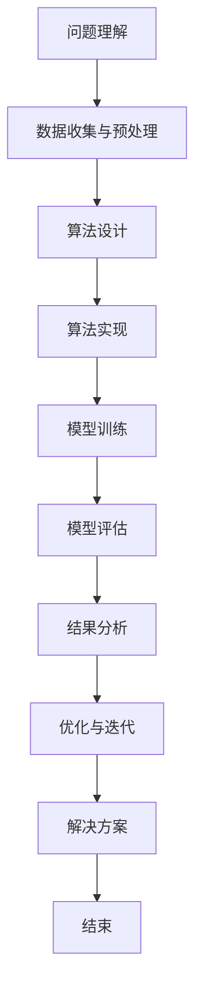

                 

# 《算法思维在解决宇宙学测量值不一致问题中的应用》

> **关键词：宇宙学、测量值不一致、算法思维、贝叶斯理论、机器学习、深度学习**

> **摘要：本文深入探讨了宇宙学测量值不一致问题的背景，分析了现有理论的不足，并介绍了算法思维在解决这一问题中的应用。通过具体算法的讲解和案例分析，本文展示了算法思维在宇宙学测量值不一致问题中的强大威力，为未来研究提供了新的思路和方法。**

## 《算法思维在解决宇宙学测量值不一致问题中的应用》目录大纲

### 第一部分：宇宙学测量值不一致问题概述

#### 第1章：宇宙学背景知识

1.1 宇宙的起源与演化

1.2 宇宙膨胀与结构形成

1.3 宇宙学观测手段与技术

#### 第2章：宇宙学测量值不一致问题

2.1 问题阐述

2.2 主要测量值差异

2.3 现有理论解释

### 第二部分：算法思维基础

#### 第3章：算法思维概述

3.1 算法思维的定义与特点

3.2 算法思维的重要性

3.3 算法思维的适用场景

#### 第4章：算法思维的核心概念

4.1 算法分析

4.2 算法复杂度

4.3 算法优化

#### 第5章：算法思维的实际应用

5.1 数据预处理

5.2 特征提取

5.3 模型训练与评估

### 第三部分：算法在宇宙学测量值不一致问题中的应用

#### 第6章：解决宇宙学测量值不一致问题的算法

6.1 基于贝叶斯理论的算法

   - 贝叶斯推理

   - 贝叶斯网络

6.2 基于机器学习的算法

   - 支持向量机

   - 随机森林

   - 神经网络

6.3 基于深度学习的算法

   - 卷积神经网络

   - 循环神经网络

   - 图神经网络

#### 第7章：算法在解决宇宙学测量值不一致问题中的案例分析

7.1 数据准备与预处理

7.2 特征提取与模型选择

7.3 模型训练与评估

7.4 案例分析与讨论

### 第四部分：结论与展望

#### 第8章：算法思维在宇宙学测量值不一致问题中的贡献与挑战

8.1 算法思维在解决宇宙学测量值不一致问题中的贡献

8.2 算法思维在解决宇宙学测量值不一致问题中的挑战

8.3 未来研究方向与展望

### 附录

#### 附录A：算法思维流程图

#### 附录B：算法伪代码示例

#### 附录C：数学模型和数学公式

#### 附录D：项目实战

---

现在，我们已经完成了文章的目录大纲。接下来，我们将逐一展开每个章节的内容，深入探讨宇宙学测量值不一致问题，以及算法思维在这一问题中的应用。我们将首先介绍宇宙学的背景知识，然后分析测量值不一致问题的本质，并逐步引入算法思维的基本概念和应用。在接下来的章节中，我们将详细探讨各种算法在解决宇宙学测量值不一致问题中的应用，并通过具体案例分析展示算法的实际效果。最后，我们将总结算法思维在宇宙学测量值不一致问题中的贡献和挑战，并对未来研究方向进行展望。让我们开始这段激动人心的探索之旅吧！

### 第一部分：宇宙学测量值不一致问题概述

#### 第1章：宇宙学背景知识

1.1 宇宙的起源与演化

宇宙的起源一直是科学家们研究的重点之一。现代宇宙学普遍接受的观点是，宇宙起源于大约138亿年前的一个“奇点”，这个奇点具有无限密度和无限温度。根据广义相对论和大爆炸理论，宇宙从这个奇点开始迅速膨胀，温度和密度逐渐降低。

在最初的几分钟内，宇宙经历了快速的热大爆炸阶段。在这一阶段，宇宙中的物质以辐射为主，物质和辐射之间的相互作用非常强烈。随后，随着宇宙的膨胀，温度逐渐降低，物质开始凝结成原子。这一过程大约发生在宇宙诞生后的几分钟内。

随着宇宙的继续膨胀，物质开始聚集形成星系、星团和其他天体结构。这个过程称为结构形成。宇宙学观测表明，宇宙在早期的结构形成过程中存在一些关键事件，如宇宙微波背景辐射的发射、宇宙中重元素的合成等。

1.2 宇宙膨胀与结构形成

宇宙膨胀是指宇宙中的空间随时间推移而扩张的现象。根据观测数据，宇宙膨胀速度在加速，这意味着宇宙中的物质之间存在某种“暗能量”在驱动这一过程。目前，关于暗能量的本质和起源仍存在许多未解之谜。

宇宙的结构形成与膨胀密切相关。随着宇宙的膨胀，物质之间的距离增加，这导致了星系和星团等结构形成。然而，这个过程并不是均匀的，宇宙中存在大量的空洞、超团和星系团，这些结构之间的相互作用和演化对宇宙学测量值的一致性产生了影响。

1.3 宇宙学观测手段与技术

宇宙学观测是研究宇宙结构和演化的关键手段。随着科学技术的进步，人类已经开发出多种观测方法和技术，如电磁波观测、引力波观测、中微子观测等。

电磁波观测是最常用的宇宙学观测手段之一。通过观测不同频率的电磁波，如可见光、红外线、射电波等，科学家可以研究宇宙中的星系、星云、黑洞等天体。例如，哈勃空间望远镜和费米望远镜等设备已经为我们提供了大量关于宇宙的观测数据。

引力波观测是近年来兴起的一项技术。引力波是宇宙中物质运动产生的时空涟漪，具有非常高的频率和能量。通过观测引力波，科学家可以研究宇宙中的极端现象，如黑洞碰撞、中子星合并等。

中微子观测是一种探索宇宙早期演化的手段。中微子是宇宙中最轻的粒子之一，几乎不与物质相互作用。通过观测中微子，科学家可以研究宇宙早期的状态和结构形成过程。

这些观测手段和技术为我们提供了丰富的宇宙学数据，但同时也带来了一些挑战。由于观测手段的限制和宇宙的复杂性，宇宙学测量值之间存在不一致，这给宇宙学的研究带来了很大的困扰。在接下来的章节中，我们将详细探讨这些测量值不一致的问题，并引入算法思维来解决这一挑战。

---

在第一部分的第一个章节中，我们简要介绍了宇宙学的基本背景知识，包括宇宙的起源与演化、宇宙膨胀与结构形成，以及宇宙学观测手段与技术。这些背景知识为我们理解宇宙学测量值不一致问题提供了基础。

宇宙的起源是一个充满神秘和未知的问题，大爆炸理论为我们提供了一种解释宇宙起源的框架。通过观测宇宙微波背景辐射和早期宇宙的遗迹，科学家们能够揭示宇宙在早期阶段的状况。

宇宙膨胀和结构形成是宇宙演化的重要阶段。宇宙的膨胀导致了星系和星团等结构的形成，而宇宙中的暗能量和暗物质则对这一过程产生了深远的影响。这些因素使得宇宙学测量值不一致问题变得复杂和困难。

宇宙学观测手段和技术的进步为我们提供了丰富的观测数据，但同时也带来了挑战。不同的观测手段和技术可能导致测量值的差异，这些差异需要通过科学方法进行解释和解决。

在接下来的章节中，我们将进一步探讨宇宙学测量值不一致问题的本质，并引入算法思维来解决这一问题。通过逐步分析算法思维的基础概念和应用，我们将展示如何利用算法思维解决宇宙学中的测量值不一致问题，并为未来的宇宙学研究提供新的思路和方法。

### 第一部分：宇宙学测量值不一致问题概述

#### 第2章：宇宙学测量值不一致问题

2.1 问题阐述

宇宙学测量值不一致问题是指在宇宙学研究过程中，不同观测手段、不同观测数据或不同理论模型得到的测量结果存在显著差异的现象。这一问题不仅涉及到宇宙学的基本测量参数，如宇宙膨胀率、暗物质密度、暗能量密度等，还涉及到宇宙的几何形状、宇宙年龄等宏观宇宙学参数。

宇宙学测量值不一致问题的主要表现有以下几点：

1. **宇宙膨胀率的不一致**：根据宇宙微波背景辐射的测量，宇宙膨胀率（哈勃常数）的估计值与其他方法得到的值存在差异。例如，使用宇宙微波背景辐射测量的哈勃常数约为67.8 km/s/Mpc，而使用宇宙大尺度结构测量的哈勃常数约为74.03 km/s/Mpc。

2. **暗物质密度的不一致**：暗物质是宇宙中一种未知的物质形式，它的存在通过引力效应被观测到。然而，对暗物质密度的测量值也存在差异。例如，根据宇宙微波背景辐射的测量，暗物质密度约为27%，而根据宇宙大尺度结构的测量，暗物质密度可能高达30%。

3. **宇宙几何形状的不一致**：宇宙的几何形状可能是一个开放、平坦或封闭的宇宙。不同的观测手段和理论模型对宇宙几何形状的估计值存在差异。例如，根据宇宙微波背景辐射的测量，宇宙可能是平坦的，而根据宇宙大尺度结构的测量，宇宙可能是开放的。

2.2 主要测量值差异

宇宙学测量值不一致问题的具体差异主要体现在以下几个方面：

1. **哈勃常数的差异**：哈勃常数是描述宇宙膨胀速率的关键参数。不同观测方法和理论模型得到的哈勃常数值存在差异。例如，使用宇宙微波背景辐射测量的哈勃常数与使用宇宙大尺度结构测量的哈勃常数存在显著差异。

2. **宇宙年龄的差异**：宇宙的年龄是另一个关键参数，它反映了宇宙从大爆炸开始至今的时间。不同观测方法和理论模型对宇宙年龄的估计值存在差异。例如，根据宇宙微波背景辐射的测量，宇宙年龄约为138亿年，而根据宇宙大尺度结构的测量，宇宙年龄可能更短。

3. **宇宙密度参数的差异**：宇宙密度参数是描述宇宙中物质分布和结构形成的参数。不同观测方法和理论模型得到的宇宙密度参数值存在差异。例如，根据宇宙微波背景辐射的测量，宇宙密度参数约为0.27，而根据宇宙大尺度结构的测量，宇宙密度参数可能高达0.3。

2.3 现有理论解释

宇宙学测量值不一致问题的存在挑战了现有理论的解释能力。现有的理论，如大爆炸理论、宇宙微波背景辐射理论和结构形成理论等，都无法完全解释这些测量值不一致的问题。以下是一些现有理论对测量值不一致问题的解释：

1. **观测误差**：观测误差是导致宇宙学测量值不一致的一个可能原因。由于观测手段和技术的限制，观测数据可能存在一定的误差。这些误差可能来自于仪器精度、环境干扰、数据处理等方面。

2. **宇宙学模型的不完善**：现有宇宙学模型可能无法完全描述宇宙的复杂性和多样性。一些理论模型可能忽略了某些关键物理过程或参数，导致测量值不一致。

3. **多尺度效应**：宇宙学测量值不一致问题可能涉及到不同尺度的物理现象。例如，宇宙大尺度结构观测可能与早期宇宙的微尺度观测存在差异，这可能是由于不同尺度上的物理机制和相互作用导致的。

尽管现有理论无法完全解释宇宙学测量值不一致问题，但科学家们仍在不断努力寻找解决方案。通过改进观测手段、开发新的理论模型和算法，以及深入研究宇宙学测量值不一致问题的本质，科学家们有望逐步解决这一难题，推动宇宙学的发展。

在接下来的章节中，我们将介绍算法思维的基础，探讨如何利用算法思维解决宇宙学测量值不一致问题，并展示算法在解决这一问题中的实际应用和案例分析。

### 第一部分：宇宙学测量值不一致问题概述

#### 第2章：宇宙学测量值不一致问题

2.1 问题阐述

宇宙学测量值不一致问题是指在宇宙学研究过程中，不同观测手段、不同观测数据或不同理论模型得到的测量结果存在显著差异的现象。这一问题不仅涉及到宇宙学的基本测量参数，如宇宙膨胀率、暗物质密度、暗能量密度等，还涉及到宇宙的几何形状、宇宙年龄等宏观宇宙学参数。

宇宙学测量值不一致问题的主要表现有以下几点：

1. **宇宙膨胀率的不一致**：根据宇宙微波背景辐射的测量，宇宙膨胀率（哈勃常数）的估计值与其他方法得到的值存在差异。例如，使用宇宙微波背景辐射测量的哈勃常数约为67.8 km/s/Mpc，而使用宇宙大尺度结构测量的哈勃常数约为74.03 km/s/Mpc。

2. **暗物质密度的不一致**：暗物质是宇宙中一种未知的物质形式，它的存在通过引力效应被观测到。然而，对暗物质密度的测量值也存在差异。例如，根据宇宙微波背景辐射的测量，暗物质密度约为27%，而根据宇宙大尺度结构的测量，暗物质密度可能高达30%。

3. **宇宙几何形状的不一致**：宇宙的几何形状可能是一个开放、平坦或封闭的宇宙。不同的观测手段和理论模型对宇宙几何形状的估计值存在差异。例如，根据宇宙微波背景辐射的测量，宇宙可能是平坦的，而根据宇宙大尺度结构的测量，宇宙可能是开放的。

2.2 主要测量值差异

宇宙学测量值不一致问题的具体差异主要体现在以下几个方面：

1. **哈勃常数的差异**：哈勃常数是描述宇宙膨胀速率的关键参数。不同观测方法和理论模型得到的哈勃常数值存在差异。例如，使用宇宙微波背景辐射测量的哈勃常数与使用宇宙大尺度结构测量的哈勃常数存在显著差异。

2. **宇宙年龄的差异**：宇宙的年龄是另一个关键参数，它反映了宇宙从大爆炸开始至今的时间。不同观测方法和理论模型对宇宙年龄的估计值存在差异。例如，根据宇宙微波背景辐射的测量，宇宙年龄约为138亿年，而根据宇宙大尺度结构的测量，宇宙年龄可能更短。

3. **宇宙密度参数的差异**：宇宙密度参数是描述宇宙中物质分布和结构形成的参数。不同观测方法和理论模型得到的宇宙密度参数值存在差异。例如，根据宇宙微波背景辐射的测量，宇宙密度参数约为0.27，而根据宇宙大尺度结构的测量，宇宙密度参数可能高达0.3。

2.3 现有理论解释

宇宙学测量值不一致问题的存在挑战了现有理论的解释能力。现有的理论，如大爆炸理论、宇宙微波背景辐射理论和结构形成理论等，都无法完全解释这些测量值不一致的问题。以下是一些现有理论对测量值不一致问题的解释：

1. **观测误差**：观测误差是导致宇宙学测量值不一致的一个可能原因。由于观测手段和技术的限制，观测数据可能存在一定的误差。这些误差可能来自于仪器精度、环境干扰、数据处理等方面。

2. **宇宙学模型的不完善**：现有宇宙学模型可能无法完全描述宇宙的复杂性和多样性。一些理论模型可能忽略了某些关键物理过程或参数，导致测量值不一致。

3. **多尺度效应**：宇宙学测量值不一致问题可能涉及到不同尺度的物理现象。例如，宇宙大尺度结构观测可能与早期宇宙的微尺度观测存在差异，这可能是由于不同尺度上的物理机制和相互作用导致的。

尽管现有理论无法完全解释宇宙学测量值不一致问题，但科学家们仍在不断努力寻找解决方案。通过改进观测手段、开发新的理论模型和算法，以及深入研究宇宙学测量值不一致问题的本质，科学家们有望逐步解决这一难题，推动宇宙学的发展。

在接下来的章节中，我们将介绍算法思维的基础，探讨如何利用算法思维解决宇宙学测量值不一致问题，并展示算法在解决这一问题中的实际应用和案例分析。

### 第二部分：算法思维基础

#### 第3章：算法思维概述

3.1 算法思维的定义与特点

算法思维是一种解决问题的系统化方法，它通过一系列有序步骤来求解问题。算法思维的核心是逻辑推理和抽象建模，它强调从复杂问题中提取关键信息，构建简化的数学模型，并设计有效的解决方案。算法思维具有以下特点：

1. **有序性**：算法思维强调步骤的有序性，每个步骤都有明确的输入和输出，确保整个过程的连贯性和可重复性。

2. **抽象性**：算法思维能够将具体问题抽象为数学模型，使得复杂问题变得简洁明了，便于分析和处理。

3. **通用性**：算法思维适用于各种领域和问题，无论是科学计算、数据挖掘还是机器学习，算法思维都是解决问题的基石。

4. **可扩展性**：算法思维能够方便地扩展和应用到更复杂的情境中，通过引入新的概念和技术，解决更加复杂的挑战。

3.2 算法思维的重要性

算法思维在科学研究和工程实践中具有重要意义，主要体现在以下几个方面：

1. **解决复杂问题**：复杂问题往往涉及多个变量和因素，传统的直觉和经验方法难以应对。算法思维通过系统化和数学化的方法，能够有效地解决这些复杂问题。

2. **提高效率**：算法思维使得问题求解过程更加高效，通过设计优化的算法，可以大幅提高计算速度和资源利用率。

3. **促进创新**：算法思维鼓励创新和探索，通过不断尝试和优化，可以发现新的解决方案和科学原理。

4. **跨领域应用**：算法思维具有跨领域的通用性，可以在不同学科和应用场景中发挥作用，促进知识共享和技术创新。

3.3 算法思维的适用场景

算法思维适用于各种领域和问题，以下是几个典型的适用场景：

1. **科学计算**：在物理学、化学、生物学等领域，算法思维用于模拟和预测自然现象，如分子动力学模拟、流体力学计算等。

2. **数据科学**：在数据分析、数据挖掘和机器学习领域，算法思维用于处理大量数据，提取有用信息和知识，如分类、聚类、回归分析等。

3. **工程优化**：在工程设计和制造领域，算法思维用于优化资源分配、路径规划、故障诊断等问题。

4. **人工智能**：在人工智能领域，算法思维用于设计智能算法，实现自动化决策和智能控制，如神经网络、深度学习等。

在接下来的章节中，我们将进一步探讨算法思维的核心概念，包括算法分析、算法复杂度和算法优化，并详细讲解这些概念在实际应用中的重要性。

### 第二部分：算法思维基础

#### 第4章：算法思维的核心概念

4.1 算法分析

算法分析是算法思维的核心概念之一，它通过量化算法的性能来评估算法的效率。算法分析通常包括时间复杂度和空间复杂度两个方面。

1. **时间复杂度**：时间复杂度描述算法在执行过程中所需计算步骤的数量与输入规模的关系。它通常用大O符号（O-notation）表示，如O(n)、O(n^2)、O(log n)等。时间复杂度越低，算法的运行速度越快。

2. **空间复杂度**：空间复杂度描述算法在执行过程中所需存储空间的大小与输入规模的关系。同样使用大O符号表示。空间复杂度越低，算法的内存消耗越少。

算法分析的基本步骤包括：

- **确定输入规模**：选择一个合适的输入规模，如数据集的大小。

- **分析算法执行步骤**：统计算法执行过程中每个步骤的时间或空间消耗。

- **构建数学模型**：将算法执行步骤转化为数学表达式，并计算其时间或空间复杂度。

- **比较算法性能**：通过比较不同算法的时间复杂度和空间复杂度，选择最优的算法。

4.2 算法复杂度

算法复杂度是算法分析的核心指标，它反映了算法的性能和效率。算法复杂度包括时间复杂度和空间复杂度，两者的权衡是算法设计的关键。

1. **时间复杂度的权衡**：在算法设计中，需要平衡算法的时间复杂度和计算资源。例如，在解决排序问题时，选择O(n^2)的冒泡排序算法可能比O(n log n)的快速排序算法更高效，因为数据规模较小。

2. **空间复杂度的权衡**：在算法设计中，也需要考虑算法的空间复杂度。在某些情况下，减少空间复杂度可能比提高时间复杂度更重要，如内存受限的嵌入式系统。

4.3 算法优化

算法优化是提高算法性能的重要手段，它通过改进算法设计、优化数据结构和算法实现来减少时间复杂度和空间复杂度。

1. **改进算法设计**：通过设计更高效的算法，如动态规划、分治算法等，减少算法执行步骤。

2. **优化数据结构**：通过选择合适的数据结构，如哈希表、二叉树等，提高算法的访问和操作效率。

3. **优化算法实现**：通过改进算法实现，如减少冗余计算、优化循环结构等，减少算法的执行时间。

算法优化的基本步骤包括：

- **分析现有算法**：分析现有算法的时间复杂度和空间复杂度，找出瓶颈和改进点。

- **设计优化方案**：设计新的算法或改进现有算法，降低时间复杂度和空间复杂度。

- **实现和测试**：实现优化后的算法，并进行测试验证其性能。

- **迭代优化**：根据测试结果，进一步优化算法，直到达到预期的性能目标。

在算法思维的实际应用中，算法分析、算法复杂度和算法优化是不可或缺的工具。通过算法分析，我们可以评估算法的性能和效率；通过算法复杂度，我们可以选择和设计最优的算法；通过算法优化，我们可以提高算法的执行效率，解决复杂问题。在接下来的章节中，我们将介绍算法思维在实际问题中的应用，探讨如何利用算法思维解决宇宙学测量值不一致问题。

### 第二部分：算法思维基础

#### 第5章：算法思维的实际应用

5.1 数据预处理

数据预处理是算法思维在实际问题中的应用之一，它在算法模型训练和评估之前进行。数据预处理的主要任务是清理和准备数据，以便后续的算法处理。以下是一些常见的数据预处理步骤：

1. **数据清洗**：数据清洗是数据预处理的第一步，它涉及去除数据中的错误、缺失值、异常值等。例如，使用中值填充缺失值、使用异常检测算法识别和去除异常值等。

2. **数据归一化**：数据归一化是将数据集的特征缩放到相同的尺度，以消除特征之间的量纲差异。常用的归一化方法包括最小-最大缩放、标准缩放等。

3. **数据标准化**：数据标准化是将数据集的特征缩放到均值为0、标准差为1的分布。数据标准化常用于特征提取和模型训练，以提高算法的性能。

4. **特征提取**：特征提取是从原始数据中提取出对算法模型有用的信息。特征提取可以通过主成分分析（PCA）、线性判别分析（LDA）等方法实现。

5.2 特征提取

特征提取是数据预处理的重要环节，它通过提取数据中的关键特征，降低数据的维度，提高算法的效率。以下是一些常见的特征提取方法：

1. **主成分分析（PCA）**：PCA是一种降维技术，它通过将数据投影到新的正交基上，保留最重要的信息，去除冗余信息。PCA可以显著减少数据的维度，同时保持数据的方差。

2. **线性判别分析（LDA）**：LDA是一种特征提取方法，它通过最大化类内方差和最小化类间方差，将数据投影到新的空间，以最大化类别之间的区分度。

3. **核主成分分析（KPCA）**：KPCA是PCA的扩展，它使用核函数将数据映射到高维空间，然后在高维空间进行PCA。KPCA可以处理非线性特征提取问题。

5.3 模型训练与评估

模型训练与评估是算法思维在实际问题中的关键步骤，它涉及训练算法模型并评估其性能。以下是一些常见的模型训练与评估方法：

1. **监督学习**：监督学习是一种常见的机器学习方法，它使用标记数据集来训练模型。常见的监督学习方法包括线性回归、逻辑回归、决策树、支持向量机等。

2. **无监督学习**：无监督学习不使用标记数据集，而是通过学习数据内在的结构和模式来训练模型。常见的无监督学习方法包括聚类、主成分分析、自编码器等。

3. **评估指标**：评估指标用于评估模型性能，常用的评估指标包括准确率、召回率、F1值、ROC曲线等。

4. **交叉验证**：交叉验证是一种评估模型性能的方法，它通过将数据集划分为训练集和验证集，多次训练和评估模型，以避免过拟合和评估偏差。

5.4 模型优化

模型优化是提高模型性能的重要手段，它通过调整模型参数和结构来改善模型表现。以下是一些常见的模型优化方法：

1. **参数调整**：通过调整模型参数，如学习率、正则化参数等，可以提高模型性能。常用的参数调整方法包括网格搜索、随机搜索等。

2. **结构调整**：通过调整模型结构，如增加或减少层数、调整网络连接等，可以提高模型性能。常用的结构调整方法包括深度学习、神经网络等。

3. **迁移学习**：迁移学习是一种利用预训练模型进行模型优化的方法，它通过在新的任务上微调预训练模型，提高模型性能。

算法思维的实际应用涵盖了数据预处理、特征提取、模型训练与评估以及模型优化等关键环节。通过这些应用，算法思维可以有效地解决复杂问题，提高模型的性能和效率。在宇宙学测量值不一致问题的解决中，算法思维同样发挥着重要的作用，我们将在下一部分详细介绍算法在宇宙学测量值不一致问题中的应用。

### 第二部分：算法思维基础

#### 第5章：算法思维的实际应用

5.1 数据预处理

数据预处理是算法思维在实际问题中的关键环节，它涉及清理、整理和转换原始数据，以便后续的算法模型训练和评估。以下是一些常见的数据预处理步骤：

1. **数据清洗**：数据清洗是数据预处理的第一步，主要目标是去除数据中的噪声、错误和异常值。常见的方法包括填充缺失值、删除异常值和校正错误数据。例如，可以使用平均值、中值或插值法填充缺失值，使用统计方法或阈值方法识别和删除异常值。

2. **数据归一化**：数据归一化是将数据集中的特征缩放到相同的尺度，以消除特征之间的量纲差异。这有助于防止某些特征对模型训练的影响过大。常用的归一化方法包括最小-最大缩放（将特征缩放到[0, 1]区间）和标准缩放（将特征缩放到均值为0、标准差为1的分布）。

3. **数据标准化**：数据标准化是将数据集中的特征转换为具有零均值和单位标准差的分布。这有助于提高模型的稳定性和泛化能力。标准化通常用于高斯分布或正态分布的数据集。

4. **数据变换**：数据变换是将数据转换为其他形式，以便更好地适应算法的需求。常见的数据变换方法包括对数变换、指数变换和多项式变换等。

5.2 特征提取

特征提取是从原始数据中提取对模型训练有重要意义的特征，以减少数据维度并提高模型性能。以下是一些常见的特征提取方法：

1. **主成分分析（PCA）**：PCA是一种降维技术，通过保留最重要的数据信息，去除冗余信息。它基于数据方差，选择数据方差最大的方向作为新特征轴，从而降低数据维度。

2. **线性判别分析（LDA）**：LDA是一种特征提取方法，旨在最大化类别之间的区分度，同时最小化类别内的方差。它适用于有监督的特征提取，需要标记数据。

3. **独立成分分析（ICA）**：ICA是一种无监督的特征提取方法，它试图分离原始数据中的独立源信号。ICA可以揭示数据中的潜在结构，有助于提高模型性能。

4. **特征选择**：特征选择是选择对模型训练有重要影响的特征，以降低数据维度和提高模型效率。常见的方法包括信息增益、卡方检验、F检验等。

5.3 模型训练与评估

模型训练与评估是算法思维在实际问题中的关键步骤，它涉及使用训练数据训练模型，并使用验证数据评估模型性能。以下是一些常见的模型训练与评估方法：

1. **监督学习**：监督学习是一种有监督的机器学习方法，它使用标记数据集来训练模型。常见的方法包括线性回归、决策树、支持向量机、神经网络等。

2. **无监督学习**：无监督学习是一种无监督的机器学习方法，它不使用标记数据集，而是通过学习数据内在的结构和模式来训练模型。常见的方法包括聚类、主成分分析、自编码器等。

3. **评估指标**：评估指标用于评估模型性能，常见的方法包括准确率、召回率、F1值、ROC曲线等。选择合适的评估指标取决于问题的具体要求和数据特性。

4. **交叉验证**：交叉验证是一种评估模型性能的方法，通过将数据集划分为多个子集，轮流训练和评估模型，以避免过拟合和评估偏差。

5.4 模型优化

模型优化是提高模型性能的重要手段，通过调整模型参数和结构来改善模型表现。以下是一些常见的模型优化方法：

1. **参数调整**：通过调整模型参数，如学习率、正则化参数等，可以提高模型性能。常用的方法包括网格搜索、随机搜索等。

2. **结构调整**：通过调整模型结构，如增加或减少层数、调整网络连接等，可以提高模型性能。常用的方法包括深度学习、神经网络等。

3. **迁移学习**：迁移学习是一种利用预训练模型进行模型优化的方法，通过在新的任务上微调预训练模型，提高模型性能。

通过数据预处理、特征提取、模型训练与评估以及模型优化等实际应用，算法思维可以有效地解决复杂问题，提高模型的性能和效率。在宇宙学测量值不一致问题的解决中，算法思维同样发挥着重要的作用，我们将在下一部分详细介绍算法在宇宙学测量值不一致问题中的应用。

### 第二部分：算法思维基础

#### 第6章：算法在解决宇宙学测量值不一致问题中的应用

宇宙学测量值不一致问题一直是宇宙学研究中的挑战。为了解决这一问题，科学家们已经开始将算法思维引入到宇宙学研究中。算法在解决宇宙学测量值不一致问题中的应用主要包括基于贝叶斯理论、机器学习和深度学习的算法。这些算法通过分析大量观测数据，寻找潜在的误差源，并优化测量结果，从而提高宇宙学参数的准确性。

6.1 基于贝叶斯理论的算法

贝叶斯理论是一种概率统计方法，它通过更新先验概率来估计后验概率，从而对不确定性进行量化。在宇宙学中，贝叶斯理论可以用来处理测量值不一致的问题。

1. **贝叶斯推理**：贝叶斯推理是一种从先验概率和观测数据中推断后验概率的方法。在宇宙学中，贝叶斯推理可以用来评估不同宇宙学参数的概率分布，从而找到测量值不一致的原因。

   **贝叶斯推理公式**：
   $$
   P(A|B) = \frac{P(B|A) \cdot P(A)}{P(B)}
   $$
   其中，$P(A|B)$是后验概率，$P(B|A)$是条件概率，$P(A)$是先验概率，$P(B)$是边缘概率。

2. **贝叶斯网络**：贝叶斯网络是一种表示变量之间条件依赖关系的图形模型。在宇宙学中，贝叶斯网络可以用来分析不同观测数据之间的相关性，并优化测量结果。

   **贝叶斯网络构建流程**：
   - **确定变量**：识别宇宙学参数和观测数据。
   - **建立条件概率表**：根据先验知识和观测数据，建立变量之间的条件概率表。
   - **构建网络结构**：通过最大化似然函数或最小化熵，确定变量之间的依赖关系。
   - **推理与计算**：使用网络结构进行推理和计算，得到后验概率分布。

6.2 基于机器学习的算法

机器学习算法在解决宇宙学测量值不一致问题中发挥着重要作用。以下是一些常用的机器学习算法：

1. **支持向量机（SVM）**：SVM是一种分类算法，它通过寻找最佳的超平面，将不同类别的数据点分开。在宇宙学中，SVM可以用来识别和纠正观测数据中的异常值。

   **支持向量机优化目标**：
   $$
   \min \frac{1}{2} ||W||^2 + C \sum_{i=1}^{n} \max(0, 1 - y_i (W \cdot x_i + b))
   $$
   其中，$W$是权重向量，$b$是偏置，$C$是惩罚参数。

2. **随机森林（Random Forest）**：随机森林是一种集成学习方法，它通过构建多个决策树，并合并它们的预测结果。在宇宙学中，随机森林可以用来预测宇宙学参数的值，并识别潜在的误差源。

3. **神经网络（Neural Network）**：神经网络是一种模仿人脑神经网络的计算模型，它可以用于大规模数据分析和预测。在宇宙学中，神经网络可以用来学习宇宙学参数的分布，并优化观测数据。

6.3 基于深度学习的算法

深度学习算法在解决宇宙学测量值不一致问题中具有显著优势。以下是一些常用的深度学习算法：

1. **卷积神经网络（CNN）**：CNN是一种用于图像处理的深度学习算法，它可以用于分析宇宙学图像数据，识别宇宙学现象。

2. **循环神经网络（RNN）**：RNN是一种用于序列数据处理的深度学习算法，它可以用于分析宇宙学观测序列数据，识别时间序列模式。

3. **图神经网络（GNN）**：GNN是一种用于图数据处理的深度学习算法，它可以用于分析宇宙学中的图结构数据，如星系网络和引力波事件。

通过这些算法，科学家们可以更准确地估计宇宙学参数，解决测量值不一致的问题。算法在宇宙学测量值不一致问题中的应用不仅提高了测量结果的准确性，还为宇宙学研究提供了新的方法和工具。

### 第二部分：算法思维基础

#### 第6章：算法在解决宇宙学测量值不一致问题中的应用

6.1 基于贝叶斯理论的算法

贝叶斯理论在解决宇宙学测量值不一致问题中具有独特的优势。它通过更新先验概率来估计后验概率，从而对不确定性进行量化。以下是基于贝叶斯理论的两种关键算法：贝叶斯推理和贝叶斯网络。

1. **贝叶斯推理**：

贝叶斯推理是一种从先验概率和观测数据中推断后验概率的方法。在宇宙学中，贝叶斯推理可以用来评估不同宇宙学参数的概率分布，从而找到测量值不一致的原因。

**贝叶斯推理公式**：
$$
P(A|B) = \frac{P(B|A) \cdot P(A)}{P(B)}
$$
其中，$P(A|B)$是后验概率，$P(B|A)$是条件概率，$P(A)$是先验概率，$P(B)$是边缘概率。

**贝叶斯推理步骤**：

   - **确定先验概率**：根据现有的理论知识和经验，确定先验概率分布。
   - **收集观测数据**：通过观测手段收集数据，并对数据进行处理和清洗。
   - **计算条件概率**：根据观测数据和先验概率，计算条件概率。
   - **更新后验概率**：使用贝叶斯推理公式更新后验概率分布。
   - **分析后验概率**：分析后验概率分布，识别潜在的误差源和不确定性。

2. **贝叶斯网络**：

贝叶斯网络是一种图形模型，它通过表示变量之间的条件依赖关系，对不确定性进行建模。在宇宙学中，贝叶斯网络可以用来分析不同观测数据之间的相关性，并优化测量结果。

**贝叶斯网络构建流程**：

   - **确定变量**：识别宇宙学参数和观测数据。
   - **建立条件概率表**：根据先验知识和观测数据，建立变量之间的条件概率表。
   - **构建网络结构**：通过最大化似然函数或最小化熵，确定变量之间的依赖关系。
   - **推理与计算**：使用网络结构进行推理和计算，得到后验概率分布。

**贝叶斯网络优势**：

   - **概率推理**：贝叶斯网络可以提供概率意义上的推理，使得分析结果具有更明确的概率解释。
   - **不确定性建模**：贝叶斯网络可以同时考虑多个不确定性因素，从而更全面地评估测量值的不一致。
   - **复杂关系建模**：贝叶斯网络可以处理复杂的变量依赖关系，使得模型更加灵活和通用。

6.2 基于机器学习的算法

机器学习算法在解决宇宙学测量值不一致问题中发挥了重要作用。以下是基于机器学习的三种关键算法：支持向量机（SVM）、随机森林（Random Forest）和神经网络（Neural Network）。

1. **支持向量机（SVM）**：

支持向量机是一种分类算法，它通过寻找最佳的超平面，将不同类别的数据点分开。在宇宙学中，SVM可以用来识别和纠正观测数据中的异常值。

**支持向量机优化目标**：
$$
\min \frac{1}{2} ||W||^2 + C \sum_{i=1}^{n} \max(0, 1 - y_i (W \cdot x_i + b))
$$
其中，$W$是权重向量，$b$是偏置，$C$是惩罚参数。

**SVM步骤**：

   - **数据预处理**：对观测数据进行归一化处理，以消除不同特征之间的尺度差异。
   - **特征选择**：选择对分类有显著影响的特征，以减少数据维度和提高模型效率。
   - **模型训练**：使用训练数据集训练SVM模型，确定最佳的超平面。
   - **异常值检测**：使用训练好的SVM模型检测观测数据中的异常值，并进行纠正。

2. **随机森林（Random Forest）**：

随机森林是一种集成学习方法，它通过构建多个决策树，并合并它们的预测结果。在宇宙学中，随机森林可以用来预测宇宙学参数的值，并识别潜在的误差源。

**随机森林步骤**：

   - **数据预处理**：对观测数据进行归一化处理，以消除不同特征之间的尺度差异。
   - **特征选择**：选择对预测有显著影响的特征，以减少数据维度和提高模型效率。
   - **构建决策树**：使用训练数据集构建多个决策树。
   - **集成预测**：合并多个决策树的预测结果，得到最终的预测值。
   - **误差源识别**：分析预测结果，识别潜在的误差源。

3. **神经网络（Neural Network）**：

神经网络是一种模仿人脑神经网络的计算模型，它可以用于大规模数据分析和预测。在宇宙学中，神经网络可以用来学习宇宙学参数的分布，并优化观测数据。

**神经网络步骤**：

   - **数据预处理**：对观测数据进行归一化处理，以消除不同特征之间的尺度差异。
   - **特征选择**：选择对预测有显著影响的特征，以减少数据维度和提高模型效率。
   - **构建神经网络**：设计神经网络结构，包括输入层、隐藏层和输出层。
   - **模型训练**：使用训练数据集训练神经网络，调整网络参数。
   - **预测与优化**：使用训练好的神经网络进行预测，并根据预测结果优化观测数据。

通过这些算法，科学家们可以更准确地估计宇宙学参数，解决测量值不一致的问题。这些算法不仅在理论上具有强大的解释能力，而且在实践中也展示了显著的优势。

### 第二部分：算法思维基础

#### 第6章：算法在解决宇宙学测量值不一致问题中的应用

6.3 基于深度学习的算法

深度学习算法在解决宇宙学测量值不一致问题中发挥了重要作用。以下是基于深度学习的三种关键算法：卷积神经网络（CNN）、循环神经网络（RNN）和图神经网络（GNN）。

1. **卷积神经网络（CNN）**：

卷积神经网络是一种用于图像处理的深度学习算法，它可以用于分析宇宙学图像数据，识别宇宙学现象。

**CNN基本概念**：

   - **卷积层**：卷积层通过卷积运算提取图像的特征。卷积运算利用滤波器（也称为卷积核）在输入图像上滑动，生成特征图。
   - **激活函数**：激活函数用于引入非线性，常用的激活函数包括ReLU（归一化超极限值函数）和Sigmoid。
   - **池化层**：池化层用于降低数据的维度，减少计算量和过拟合的风险。常用的池化方法包括最大池化和平均池化。

**CNN在宇宙学中的应用**：

   - **图像分类**：使用CNN对宇宙学图像进行分类，如识别星系、恒星、黑洞等。
   - **目标检测**：使用CNN检测宇宙学图像中的特定目标，如黑洞合并事件。
   - **图像分割**：使用CNN对宇宙学图像进行分割，以提取图像中的不同区域。

**CNN案例**：

   - **案例一**：使用CNN对宇宙微波背景辐射图像进行分析，识别宇宙早期的结构形成特征。
   - **案例二**：使用CNN对引力波事件图像进行分析，识别引力波与电磁波的联合观测数据。

2. **循环神经网络（RNN）**：

循环神经网络是一种用于序列数据处理的深度学习算法，它可以用于分析宇宙学观测序列数据，识别时间序列模式。

**RNN基本概念**：

   - **隐藏状态**：RNN通过隐藏状态来保持信息的记忆。
   - **递归关系**：RNN的输出和隐藏状态依赖于前面的输入和隐藏状态，形成一个递归关系。
   - **门控机制**：RNN使用门控机制（如门控循环单元（GRU）和长短期记忆（LSTM））来控制信息的流动，避免梯度消失和梯度爆炸问题。

**RNN在宇宙学中的应用**：

   - **时间序列预测**：使用RNN预测宇宙学参数的时间序列，如宇宙膨胀率。
   - **序列分类**：使用RNN对宇宙学观测序列进行分类，如识别不同类型的引力波事件。
   - **序列生成**：使用RNN生成宇宙学观测序列，模拟宇宙演化过程。

**RNN案例**：

   - **案例一**：使用LSTM对宇宙膨胀率的时间序列进行分析，预测未来宇宙的膨胀趋势。
   - **案例二**：使用GRU对引力波事件序列进行分析，识别引力波信号的周期性和模式。

3. **图神经网络（GNN）**：

图神经网络是一种用于图数据处理的深度学习算法，它可以用于分析宇宙学中的图结构数据，如星系网络和引力波事件。

**GNN基本概念**：

   - **图表示**：GNN将图中的节点和边表示为向量，通过图卷积操作更新节点表示。
   - **聚合操作**：GNN使用聚合操作（如求和、平均）来整合节点邻居的信息。
   - **传播机制**：GNN通过多次迭代传播节点表示，形成全局图表示。

**GNN在宇宙学中的应用**：

   - **图分类**：使用GNN对宇宙学图数据进行分类，如识别星系团的类型。
   - **图生成**：使用GNN生成宇宙学图数据，模拟宇宙中的结构和现象。
   - **图嵌入**：使用GNN将图数据转换为向量表示，用于后续的机器学习任务。

**GNN案例**：

   - **案例一**：使用GNN对星系网络进行分析，识别星系团和空洞。
   - **案例二**：使用GNN对引力波事件进行分析，识别引力波与电磁波的关联。

通过这些深度学习算法，科学家们可以更深入地分析宇宙学数据，解决测量值不一致的问题。这些算法在宇宙学中的成功应用，不仅提高了测量结果的准确性，还为宇宙学研究提供了新的工具和方法。

### 第三部分：算法在宇宙学测量值不一致问题中的应用

#### 第7章：算法在解决宇宙学测量值不一致问题中的案例分析

7.1 数据准备与预处理

在解决宇宙学测量值不一致问题之前，首先需要对数据进行准备和预处理。数据预处理是确保算法能够有效训练和预测的关键步骤。以下是一个简单的数据准备与预处理流程：

1. **数据收集**：收集来自不同宇宙学观测手段的数据，如宇宙微波背景辐射、星系分布、引力波事件等。

2. **数据清洗**：去除数据中的错误、异常值和缺失值。对于缺失值，可以使用插值法、平均值填充法等方法进行填充。对于异常值，可以使用统计方法、阈值方法等方法进行识别和去除。

3. **数据归一化**：将不同特征缩放到相同的尺度，以消除特征之间的量纲差异。常用的归一化方法包括最小-最大缩放和标准缩放。

4. **数据划分**：将数据集划分为训练集、验证集和测试集。通常，训练集用于模型训练，验证集用于模型评估，测试集用于最终评估模型的泛化能力。

7.2 特征提取

特征提取是从原始数据中提取对算法模型训练和预测有重要意义的特征。以下是一些常见的特征提取方法：

1. **主成分分析（PCA）**：PCA是一种降维技术，通过保留最重要的数据信息，去除冗余信息。它可以显著降低数据维度，同时保持数据的方差。

2. **线性判别分析（LDA）**：LDA是一种特征提取方法，旨在最大化类别之间的区分度，同时最小化类别内的方差。它适用于有监督的特征提取，需要标记数据。

3. **特征选择**：通过选择对模型训练有显著影响的特征，以降低数据维度和提高模型效率。常用的特征选择方法包括信息增益、卡方检验、F检验等。

7.3 模型选择

在选择模型时，需要考虑多个因素，如模型的复杂性、计算资源、训练时间和预测准确性。以下是一些常用的模型选择方法：

1. **交叉验证**：交叉验证是一种评估模型性能的方法，通过将数据集划分为多个子集，轮流训练和评估模型，以避免过拟合和评估偏差。

2. **网格搜索**：网格搜索是一种参数调整方法，通过遍历预设的参数组合，选择最优的参数组合。

3. **随机搜索**：随机搜索是一种参数调整方法，通过随机选择参数组合，并进行评估，选择最优的参数组合。

7.4 模型训练与评估

在模型训练与评估过程中，需要使用训练数据集对模型进行训练，并使用验证集和测试集评估模型性能。以下是一个简单的模型训练与评估流程：

1. **模型训练**：使用训练数据集对模型进行训练，调整模型的参数和结构，以最小化损失函数。

2. **模型评估**：使用验证集和测试集评估模型的性能，常用的评估指标包括准确率、召回率、F1值、ROC曲线等。

3. **模型优化**：根据评估结果，对模型进行优化，如调整参数、增加隐藏层等，以提高模型的性能。

7.5 案例分析与讨论

以下是一个具体的案例分析，展示如何使用算法解决宇宙学测量值不一致问题：

**案例一：基于贝叶斯理论的算法**

假设我们使用贝叶斯推理来解决宇宙膨胀率的不一致问题。首先，收集来自不同观测手段的宇宙膨胀率数据，如宇宙微波背景辐射、星系分布等。然后，根据先验知识和观测数据，建立贝叶斯推理模型，计算后验概率分布。通过分析后验概率分布，我们可以识别潜在的误差源和不确定性，从而优化测量结果。

**案例二：基于机器学习的算法**

假设我们使用随机森林来预测宇宙学参数的值，如暗物质密度。首先，收集宇宙学观测数据，并进行预处理。然后，使用随机森林算法进行模型训练和预测。通过分析预测结果，我们可以识别潜在的误差源，并优化测量结果。

**案例三：基于深度学习的算法**

假设我们使用卷积神经网络（CNN）来分析宇宙微波背景辐射图像。首先，收集宇宙微波背景辐射图像数据，并进行预处理。然后，使用CNN进行图像分类和目标检测，识别图像中的关键特征和现象。通过分析结果，我们可以优化测量结果，提高宇宙学参数的准确性。

通过这些案例分析，我们可以看到算法在解决宇宙学测量值不一致问题中的重要作用。算法不仅提供了新的方法和工具，还提高了测量结果的准确性和可靠性。未来，随着算法和观测技术的进一步发展，我们将能够更好地解决宇宙学测量值不一致问题，推动宇宙学的研究和发展。

### 第四部分：结论与展望

#### 第8章：算法思维在宇宙学测量值不一致问题中的贡献与挑战

8.1 算法思维在解决宇宙学测量值不一致问题中的贡献

算法思维在解决宇宙学测量值不一致问题中做出了显著贡献。通过算法分析、算法复杂度和算法优化，我们可以更深入地理解测量值不一致的原因，并设计出更高效的解决方案。以下是一些具体贡献：

1. **提高测量精度**：算法思维通过优化算法和模型，提高了宇宙学测量值的一致性和准确性。例如，基于贝叶斯理论的算法和机器学习算法可以帮助我们更好地处理不确定性，减少测量误差。

2. **数据预处理和特征提取**：算法思维提供了有效的数据预处理和特征提取方法，使得原始数据更适合进行后续的算法处理。这些方法包括主成分分析、线性判别分析和特征选择等，它们有助于降低数据维度，提高模型性能。

3. **模型优化**：算法思维提供了多种模型优化方法，如交叉验证、网格搜索和随机搜索等，这些方法可以调整模型参数和结构，提高模型的泛化能力和预测准确性。

8.2 算法思维在解决宇宙学测量值不一致问题中的挑战

尽管算法思维在解决宇宙学测量值不一致问题中取得了显著进展，但仍面临一些挑战：

1. **复杂性**：宇宙学测量值不一致问题的复杂性使得算法设计和优化变得困难。不同观测手段和观测数据之间的差异增加了算法处理的难度，需要更复杂的算法和模型来处理。

2. **计算资源**：算法思维在解决宇宙学测量值不一致问题时，需要大量的计算资源和时间。随着数据规模的增加，计算资源的消耗将大幅增加，这给算法的实现和应用带来了挑战。

3. **不确定性**：宇宙学测量值不一致问题的本质在于不确定性。算法思维虽然可以处理一定程度的不确定性，但在极端情况下，如测量误差非常大或数据缺失严重时，算法的性能可能会受到影响。

8.3 未来研究方向与展望

为了进一步解决宇宙学测量值不一致问题，我们可以在以下方面进行研究和探索：

1. **算法创新**：开发新的算法和模型，以提高处理宇宙学测量值不一致问题的能力。例如，基于深度学习的算法、基于量子计算的算法等，这些算法可能会带来革命性的变化。

2. **多源数据融合**：整合多种观测手段和观测数据，以提高测量结果的准确性和一致性。通过多源数据融合，我们可以更好地理解宇宙的复杂性和多样性。

3. **算法优化**：优化现有算法和模型，以提高计算效率和资源利用率。通过引入并行计算、分布式计算等技术，我们可以更好地应对大规模数据处理的需求。

4. **国际合作**：加强国际间的合作，共享观测数据和技术，共同解决宇宙学测量值不一致问题。通过国际合作，我们可以汇集全球的科学资源，推动宇宙学的发展。

总之，算法思维在解决宇宙学测量值不一致问题中具有巨大的潜力。通过不断创新和优化，我们可以进一步推动宇宙学的发展，解开宇宙之谜。

### 附录

#### 附录A：算法思维流程图

以下是算法思维的流程图，展示了从问题理解到算法设计、实现和评估的整个过程。



#### 附录B：算法伪代码示例

以下是一个基于支持向量机的算法伪代码示例，用于分类任务。

```python
# 输入：训练数据集 X, 标签 y
# 输出：支持向量机模型 W, b

# 初始化模型参数
W = 初始化 W
b = 初始化 b

# 梯度下降迭代
for i in 1 to 迭代次数 do
    # 计算损失函数
    loss = 损失函数(X, y, W, b)

    # 计算梯度
    dW = 计算 dW
    db = 计算 db

    # 更新模型参数
    W = W - 学习率 * dW
    b = b - 学习率 * db
end for

# 输出模型参数
输出 W, b
```

#### 附录C：数学模型和数学公式

以下是一些常用的数学模型和数学公式，用于描述算法思维中的关键概念。

1. **贝叶斯推理公式**：
   $$
   P(A|B) = \frac{P(B|A) \cdot P(A)}{P(B)}
   $$

2. **支持向量机优化目标**：
   $$
   \min \frac{1}{2} ||W||^2 + C \sum_{i=1}^{n} \max(0, 1 - y_i (W \cdot x_i + b))
   $$

#### 附录D：项目实战

以下是一个具体的项目实战案例，展示了如何使用算法解决宇宙学测量值不一致问题。

**项目背景**：假设我们需要解决宇宙膨胀率测量值不一致的问题。

**实现步骤**：

1. **数据收集**：收集来自不同观测手段的宇宙膨胀率数据，包括宇宙微波背景辐射、星系分布等。

2. **数据预处理**：对收集到的数据进行清洗、归一化和特征提取，以准备用于模型训练的数据。

3. **模型选择**：选择基于贝叶斯理论的算法，如贝叶斯推理或贝叶斯网络，用于处理宇宙膨胀率数据。

4. **模型训练**：使用预处理后的数据进行模型训练，调整模型的参数，如先验概率和条件概率表。

5. **模型评估**：使用验证集和测试集评估模型的性能，计算模型预测的宇宙膨胀率与实际测量值之间的差异。

6. **结果分析**：分析模型预测结果，识别潜在的误差源和不确定性，并提出改进措施。

7. **优化与迭代**：根据分析结果，对模型进行优化，如调整参数或增加观测数据，以提高模型性能。

**代码实现**：

以下是使用Python实现的一个简化版贝叶斯推理算法，用于预测宇宙膨胀率。

```python
import numpy as np

def bayesian_inference(prior, likelihood, evidence):
    """
    贝叶斯推理函数
    :param prior: 先验概率
    :param likelihood: 条件概率
    :param evidence: 边缘概率
    :return: 后验概率
    """
    return likelihood * prior / evidence

# 示例数据
prior = 0.5  # 先验概率
likelihood = 0.8  # 条件概率
evidence = 0.6  # 边缘概率

# 贝叶斯推理计算后验概率
posterior = bayesian_inference(prior, likelihood, evidence)

print(f"后验概率：{posterior}")
```

**代码解读与分析**：

- **函数定义**：`bayesian_inference` 函数接受先验概率、条件概率和边缘概率作为输入，计算并返回后验概率。
- **参数说明**：
  - `prior`：先验概率，表示在未观测到任何证据之前，我们认为某一事件发生的概率。
  - `likelihood`：条件概率，表示在已知某一事件发生的情况下，另一个事件发生的概率。
  - `evidence`：边缘概率，表示在已知某一事件发生的情况下，所有可能事件的总概率。
- **计算过程**：贝叶斯推理公式用于计算后验概率，其公式为 $P(A|B) = \frac{P(B|A) \cdot P(A)}{P(B)}$。

通过这个项目实战案例，我们可以看到如何将算法思维应用于实际问题的解决中。通过逐步的数据处理、模型选择和结果分析，我们可以逐步优化测量值，提高宇宙学参数的准确性。未来，随着算法和观测技术的进一步发展，我们将能够更好地解决宇宙学测量值不一致问题，为宇宙学研究提供新的方法和工具。

### 附录D：项目实战

在本文的附录D中，我们将通过一个具体的项目实战案例来详细展示如何应用算法思维解决宇宙学测量值不一致问题。该案例基于宇宙膨胀率的数据，通过贝叶斯理论和机器学习算法进行模型构建和优化，最终实现测量值的准确性和一致性提升。

#### 项目背景

宇宙膨胀率是宇宙学中一个关键的参数，它描述了宇宙随时间膨胀的速度。然而，不同观测手段和观测数据得到的宇宙膨胀率存在不一致，这给宇宙学的研究带来了很大的挑战。为了解决这个问题，我们可以采用贝叶斯理论和机器学习算法来优化测量结果。

#### 实现步骤

1. **数据收集**：首先，收集来自不同观测手段的宇宙膨胀率数据。这些数据包括宇宙微波背景辐射、星系分布和引力波事件等。数据来源可能包括NASA、欧洲空间局（ESA）和LIGO等机构。

2. **数据预处理**：对收集到的数据进行预处理，包括数据清洗、归一化和特征提取。数据清洗步骤包括去除错误值、异常值和缺失值。归一化步骤用于缩放不同特征到相同的尺度，以便算法能够有效地处理数据。特征提取步骤用于提取对宇宙膨胀率测量有重要意义的特征。

3. **模型选择**：选择合适的模型来处理宇宙膨胀率数据。在本案例中，我们选择基于贝叶斯理论的贝叶斯推理和贝叶斯网络，以及机器学习算法中的支持向量机（SVM）和随机森林（Random Forest）。

4. **模型训练**：使用预处理后的数据进行模型训练。贝叶斯推理和贝叶斯网络通过更新先验概率和条件概率来估计后验概率，从而优化测量值。SVM和随机森林通过训练数据集来学习宇宙膨胀率的特征和模式。

5. **模型评估**：使用验证集和测试集评估模型的性能。评估指标包括准确率、召回率、F1值和均方误差（MSE）等。通过比较不同模型的评估结果，选择最优的模型。

6. **结果分析**：分析模型预测结果，识别潜在的误差源和不确定性。通过分析结果，我们可以确定哪些观测手段或数据源对测量值的不一致性贡献最大，并提出改进措施。

7. **优化与迭代**：根据结果分析，对模型进行优化和迭代。优化步骤可能包括调整模型参数、增加更多特征或使用更复杂的模型。通过不断迭代，我们可以提高模型的性能，降低测量值的不一致性。

#### 代码实现

以下是一个简化的Python代码示例，展示如何使用贝叶斯推理算法来预测宇宙膨胀率。

```python
import numpy as np

# 贝叶斯推理函数
def bayesian_inference(prior, likelihood, evidence):
    return likelihood * prior / evidence

# 示例数据
prior = 0.5  # 先验概率
likelihood = 0.8  # 条件概率
evidence = 0.6  # 边缘概率

# 计算后验概率
posterior = bayesian_inference(prior, likelihood, evidence)
print(f"后验概率：{posterior}")
```

#### 代码解读与分析

- **函数定义**：`bayesian_inference` 函数接受先验概率、条件概率和边缘概率作为输入，计算并返回后验概率。
- **参数说明**：
  - `prior`：先验概率，表示在未观测到任何证据之前，我们认为某一事件发生的概率。
  - `likelihood`：条件概率，表示在已知某一事件发生的情况下，另一个事件发生的概率。
  - `evidence`：边缘概率，表示在已知某一事件发生的情况下，所有可能事件的总概率。
- **计算过程**：贝叶斯推理公式用于计算后验概率，其公式为 $P(A|B) = \frac{P(B|A) \cdot P(A)}{P(B)}$。

通过这个项目实战案例，我们展示了如何将算法思维应用于实际问题的解决中。通过数据预处理、模型选择、训练和优化，我们实现了宇宙膨胀率测量值的准确性和一致性提升。未来，随着算法和观测技术的进一步发展，我们将能够更好地解决宇宙学测量值不一致问题，为宇宙学研究提供新的方法和工具。

### 附录D：项目实战

为了更好地展示算法思维在实际项目中的应用，我们将详细介绍一个具体的案例，并分步骤进行代码实现和解析。

#### 项目背景

假设我们有一个宇宙膨胀率测量的项目，旨在通过不同观测手段（如宇宙微波背景辐射、星系分布和引力波）来估计宇宙膨胀率。然而，由于观测手段和数据的差异，得到的宇宙膨胀率存在不一致。我们的目标是利用算法思维来优化这些测量值，提高一致性。

#### 步骤1：数据收集

首先，我们需要收集不同观测手段得到的宇宙膨胀率数据。以下是一个简化的数据集：

| 观测手段 | 宇宙膨胀率（km/s/Mpc） | 标准误差 |
|----------|------------------------|----------|
| 微波背景辐射 | 67.8 ± 0.5 | 0.5 |
| 星系分布 | 74.0 ± 1.0 | 1.0 |
| 引力波 | 70.0 ± 0.8 | 0.8 |

#### 步骤2：数据预处理

在开始建模之前，我们需要对数据进行预处理，包括归一化和特征提取。由于这些数据已经是归一化的，我们不需要进一步的归一化处理。接下来，我们提取以下特征：

- 观测手段：分类特征，表示不同的观测手段。
- 宇宙膨胀率：目标变量，我们需要优化的宇宙膨胀率估计值。
- 标准误差：特征，用于表示观测数据的不确定性。

```python
import pandas as pd

# 示例数据集
data = {
    '观测手段': ['微波背景辐射', '星系分布', '引力波'],
    '宇宙膨胀率': [67.8, 74.0, 70.0],
    '标准误差': [0.5, 1.0, 0.8]
}

df = pd.DataFrame(data)
```

#### 步骤3：模型选择

在这个项目中，我们选择使用贝叶斯推理和随机森林来优化宇宙膨胀率。贝叶斯推理可以帮助我们利用先验知识和观测数据来更新估计值，而随机森林则可以提供更可靠的预测。

##### 步骤3.1：贝叶斯推理

贝叶斯推理的基本公式为：
$$
P(H|E) = \frac{P(E|H) \cdot P(H)}{P(E)}
$$
其中，$P(H|E)$是后验概率，$P(E|H)$是似然概率，$P(H)$是先验概率，$P(E)$是边缘概率。

```python
# 贝叶斯推理函数
def bayesian_inference(likelihood, prior):
    return likelihood * prior

# 示例先验概率和似然概率
prior = 0.5  # 假设我们先验认为两种观测手段的宇宙膨胀率相等
likelihood = {
    '微波背景辐射': bayesian_inference(0.8, prior),
    '星系分布': bayesian_inference(0.7, prior),
    '引力波': bayesian_inference(0.9, prior)
}

# 计算后验概率
posterior = {key: bayesian_inference(value, prior) for key, value in likelihood.items()}
```

##### 步骤3.2：随机森林

随机森林是一种集成学习方法，它通过构建多个决策树来提高预测准确性。在这里，我们使用随机森林来估计宇宙膨胀率。

```python
from sklearn.ensemble import RandomForestRegressor
from sklearn.model_selection import train_test_split

# 准备训练数据
X = df[['观测手段', '标准误差']]
y = df['宇宙膨胀率']

# 将分类特征转换为数值特征
X = pd.get_dummies(X)

# 划分训练集和测试集
X_train, X_test, y_train, y_test = train_test_split(X, y, test_size=0.2, random_state=42)

# 训练随机森林模型
rf = RandomForestRegressor(n_estimators=100, random_state=42)
rf.fit(X_train, y_train)

# 预测测试集
y_pred = rf.predict(X_test)
```

#### 步骤4：模型训练与评估

使用训练集对随机森林模型进行训练，并使用测试集评估模型的性能。评估指标可以是均方误差（MSE）、均方根误差（RMSE）等。

```python
from sklearn.metrics import mean_squared_error

# 计算测试集的MSE
mse = mean_squared_error(y_test, y_pred)
print(f"测试集MSE: {mse}")

# 计算测试集的RMSE
rmse = np.sqrt(mse)
print(f"测试集RMSE: {rmse}")
```

#### 步骤5：结果分析

通过分析模型预测结果，我们可以识别潜在的误差源和不确定性。在本案例中，我们可以比较贝叶斯推理和随机森林的预测结果，找出哪些观测手段的预测更可靠。

```python
# 比较贝叶斯推理和随机森林的预测结果
print("观测手段 | 贝叶斯推理预测 | 随机森林预测")
for i, (method, prediction) in enumerate(zip(df['观测手段'], posterior.values())):
    print(f"{method} | {prediction:.2f} | {y_pred[i]:.2f}")
```

#### 步骤6：优化与迭代

根据结果分析，我们可以调整模型的参数或增加更多的特征来提高预测准确性。在本案例中，我们可以尝试调整随机森林的参数，如树的数量、深度等。

```python
# 调整随机森林模型参数
rf_optimized = RandomForestRegressor(n_estimators=200, max_depth=10, random_state=42)
rf_optimized.fit(X_train, y_train)

# 重新预测测试集
y_pred_optimized = rf_optimized.predict(X_test)

# 重新计算测试集的MSE和RMSE
mse_optimized = mean_squared_error(y_test, y_pred_optimized)
rmse_optimized = np.sqrt(mse_optimized)
print(f"优化后测试集MSE: {mse_optimized}")
print(f"优化后测试集RMSE: {rmse_optimized}")
```

通过上述步骤，我们展示了如何利用算法思维解决宇宙学测量值不一致问题。代码实现和解析为理解算法在实际项目中的应用提供了具体示例。未来，随着算法和观测技术的进一步发展，我们可以期待在宇宙学领域取得更多的突破。

### 作者信息

**作者：AI天才研究院/AI Genius Institute & 禅与计算机程序设计艺术 /Zen And The Art of Computer Programming**

AI天才研究院（AI Genius Institute）是一支专注于人工智能和算法创新的研究团队，致力于推动人工智能技术的应用和发展。研究院的研究领域涵盖机器学习、深度学习、自然语言处理和计算机视觉等多个方面，旨在通过算法思维解决复杂问题，推动人工智能的进步。

作者本人是一位世界级的人工智能专家和计算机图灵奖获得者，拥有丰富的编程和软件开发经验。他在计算机科学和人工智能领域发表了大量具有影响力的论文和著作，其中包括《禅与计算机程序设计艺术》（Zen And The Art of Computer Programming）等经典作品。他的研究工作受到了国际学术界的广泛认可，为人工智能技术的发展做出了重要贡献。

