                 

# 系统思考在战略规划中的应用

关键词：系统思考、战略规划、组织管理、创新管理、案例分析

摘要：本文旨在探讨系统思考在战略规划中的应用，分析其基础概念、重要性，以及在战略规划、组织管理、创新管理等方面的具体应用，并通过经典案例进行深入剖析，为实际操作提供指导。

### 目录大纲

#### 第一部分：系统思考基础

1. **第1章：系统思考概述**
    1.1 系统思考的定义与重要性
    1.2 系统架构与系统元素
    1.3 系统动态与反馈循环
    1.4 系统思考工具与方法

2. **第2章：战略规划中的系统思考**
    2.1 战略规划与系统思考
    2.2 系统思维在组织管理中的应用
    2.3 系统思维在战略决策中的应用
    2.4 系统思维在创新管理中的应用

3. **第3章：系统思考在战略规划中的经典案例**
    3.1 案例分析介绍
    3.2 企业战略转型案例
    3.3 供应链优化案例
    3.4 企业创新战略案例

4. **第4章：系统思考实践指南**
    4.1 系统思考实践步骤
    4.2 系统思考工具应用
    4.3 系统思考培训与推广

#### 第二部分：系统思考在战略规划中的应用

##### 第一部分：系统思考基础

## 第1章：系统思考概述

### 1.1 系统思考的定义与重要性

系统思考是一种方法论，它强调从整体的角度看待和分析复杂系统。这种方法论源于系统论和控制论，其核心思想是：任何系统都是由相互关联的元素组成，这些元素通过相互作用和反馈循环产生整体行为。系统思考的重要性在于，它能够帮助我们理解复杂系统的动态行为，从而做出更明智的决策。

### 1.1.1 系统思考的概念

系统思考是一种思维方式，它强调从整体的角度看待和分析复杂系统。这种方法论源于系统论和控制论，其核心思想是：任何系统都是由相互关联的元素组成，这些元素通过相互作用和反馈循环产生整体行为。

### 1.1.2 系统思考与传统思维方式比较

传统思维方式倾向于将问题分解为独立的、可独立处理的部分，而系统思考则强调系统的整体性和相互关联性。传统思维方式容易忽视系统内部的复杂互动关系，而系统思考则能更好地捕捉这些互动，从而提供更全面的分析。

### 1.1.3 系统思考在战略规划中的应用前景

系统思考在战略规划中具有广泛的应用前景。它可以帮助企业从整体上把握战略方向，分析内外部环境因素，制定更具前瞻性和可持续性的战略。此外，系统思考还能提高企业在复杂环境中的适应能力，实现战略的动态调整。

## 1.2 系统架构与系统元素

### 1.2.1 系统架构的概念

系统架构是指系统的整体结构，包括各个组成部分及其相互关系。系统架构是系统设计和实施的基础，它决定了系统的性能、可维护性和可扩展性。

### 1.2.2 系统元素及其关系

系统元素是指构成系统的基本组成部分。这些元素包括硬件、软件、数据、人员等。系统元素之间的关系决定了系统的功能和行为。系统元素之间的关系可以是线性的，也可以是复杂的非线性关系。

### 1.2.3 系统架构的层次结构

系统架构通常可以分为多个层次，包括硬件层、软件层、数据层等。每个层次都有其特定的功能和职责。层次结构有助于理解系统的整体架构，并方便进行模块化的设计和开发。

## 1.3 系统动态与反馈循环

### 1.3.1 系统动态的概念

系统动态是指系统随时间变化的行为和状态。系统动态可以通过反馈循环来描述，反馈循环是指系统内部的输出通过某种机制影响系统自身的输入，从而影响系统的未来状态。

### 1.3.2 反馈循环的类型及其影响

反馈循环可以分为正反馈和负反馈两种类型。正反馈会加剧系统变化，可能导致系统的不稳定；负反馈则会减缓系统变化，有助于系统稳定。了解反馈循环的类型及其影响，有助于更好地设计和管理系统。

### 1.3.3 系统动态的模型构建

系统动态可以通过数学模型来描述。常见的模型包括差分方程、微分方程等。通过模型构建，可以更深入地理解系统的动态行为，为战略规划提供科学依据。

## 1.4 系统思考工具与方法

### 1.4.1 系统思考工具简介

系统思考工具是进行系统分析和设计的辅助工具，包括图形化工具、表格工具等。常用的系统思考工具包括Vensim、System Dynamics等。

### 1.4.2 系统思考方法的实践

系统思考方法的实践包括以下几个步骤：确定研究问题、收集信息、构建系统模型、验证和调整模型、制定战略方案。通过这些步骤，可以更好地运用系统思考方法，提高战略规划的准确性和有效性。

### 1.4.3 系统思考方法的案例分析

在本节中，我们将通过一个实际案例，展示系统思考方法的实践过程。该案例涉及一个企业的战略规划，通过系统思考的方法，分析企业的内外部环境，制定相应的战略方案。

## 1.5 系统思考在战略规划中的应用总结

系统思考在战略规划中具有重要的应用价值。它能够帮助企业从整体上把握战略方向，分析内外部环境因素，制定更具前瞻性和可持续性的战略。同时，系统思考方法能够提高企业在复杂环境中的适应能力，实现战略的动态调整。

在下一部分，我们将深入探讨系统思考在战略规划、组织管理、创新管理等方面的具体应用。

----------------------------------------------------------------
### 系统思考基础

在探讨系统思考在战略规划中的应用之前，我们需要首先了解系统思考的基础概念。系统思考是一种深入理解和分析复杂系统的方法，它强调从整体和系统的角度看待问题，通过识别系统中的相互关系和反馈循环来揭示系统的动态行为。

#### 1.1 系统思考的定义与重要性

**系统思考的定义：**

系统思考（Systems Thinking）是一种认识和解决问题的方法，它关注系统内部各部分之间的相互关系和动态交互，强调从整体角度理解和分析系统的行为。系统思考的核心理念包括整体性、动态性、适应性、相互依赖性和反馈循环。

**系统思考的重要性：**

1. **揭示问题根源：** 系统思考能够帮助我们深入挖掘问题的根本原因，而不是仅仅停留在表面症状的处理上。通过识别系统中的反馈循环和相互作用，我们可以发现问题的根本驱动因素，从而制定更有效的解决方案。

2. **应对复杂性：** 在现代社会，许多问题都是复杂且相互关联的。系统思考提供了一种理解复杂性的框架，使我们能够把握问题的复杂性，并设计出适应复杂环境的战略。

3. **提高战略规划的质量：** 系统思考帮助企业在制定战略规划时考虑系统的整体性、动态性和相互依赖性。这有助于企业制定更具前瞻性和可持续性的战略，从而在竞争中取得优势。

#### 1.1.1 系统思考的概念

**系统思考的概念：**

系统思考的核心概念包括：

- **系统：** 系统是由相互关联的元素组成的整体，这些元素通过相互作用和反馈循环共同产生系统的行为和状态。

- **反馈循环：** 反馈循环是系统内部的一种机制，通过系统的输出返回到系统的输入，从而影响系统的未来状态。反馈循环可以是正反馈（增强系统变化）或负反馈（减缓系统变化）。

- **相互依赖：** 系统中的各个元素相互依赖，一个元素的变化会影响到其他元素，进而影响整个系统的行为。

- **动态性：** 系统是动态变化的，其状态和行为随着时间变化而变化。

#### 1.1.2 系统思考与传统思维方式比较

**系统思考与传统思维方式比较：**

传统思维方式通常采用线性思维模式，将问题分解为独立的部分，然后分别解决。这种方法容易忽视系统内部各部分之间的相互关系和反馈循环。

相比之下，系统思考强调从整体和系统的角度看待问题，识别系统中的相互关系和动态交互。这种方法有助于我们更全面、深入地理解问题，并找到更根本的解决方案。

#### 1.1.3 系统思考在战略规划中的应用前景

**系统思考在战略规划中的应用前景：**

1. **战略愿景的构建：** 系统思考可以帮助企业从整体上构建战略愿景，考虑系统的长期目标和整体效果。

2. **环境分析：** 系统思考可以帮助企业全面分析内外部环境因素，包括市场、竞争、技术、政策等，从而制定更有针对性的战略。

3. **战略设计：** 系统思考提供了一种设计战略的框架，帮助企业考虑系统中的相互关系和反馈循环，从而制定出更具适应性和灵活性的战略。

4. **战略实施和调整：** 系统思考可以帮助企业在战略实施过程中及时发现和调整战略，以适应不断变化的环境。

总之，系统思考在战略规划中具有广泛的应用前景。通过运用系统思考方法，企业可以更全面、深入地分析问题，制定更具前瞻性和可持续性的战略，从而在竞争中获得优势。

----------------------------------------------------------------
### 系统架构与系统元素

在理解了系统思考的基本概念之后，我们需要进一步探讨系统架构和系统元素的概念，以及它们在系统思考中的重要性。系统架构和系统元素是构建和设计复杂系统的基础，对于战略规划的成功至关重要。

#### 1.2.1 系统架构的概念

**系统架构的定义：**

系统架构是指系统的整体结构和组成部分的安排，它定义了系统的功能、性能、可维护性和可扩展性。系统架构不仅仅是技术层面的设计，它还包括业务流程、组织结构、数据流和通信机制等多个方面。

**系统架构的重要性：**

1. **功能定义：** 系统架构明确了系统的功能需求，确保系统能够满足业务目标和用户需求。

2. **性能优化：** 通过系统架构的设计，可以优化系统的性能，确保系统在高负载情况下仍能稳定运行。

3. **可维护性：** 系统架构的清晰定义有助于系统的维护和升级，降低维护成本和提高维护效率。

4. **可扩展性：** 系统架构为未来的扩展和集成提供了灵活性和可扩展性，使系统能够适应业务增长和变化。

#### 1.2.2 系统元素及其关系

**系统元素的定义：**

系统元素是指构成系统的基本组成部分，包括硬件、软件、人员、数据等。每个系统元素都有其特定的功能和职责，它们通过相互作用和相互依赖，共同实现系统的整体功能。

**系统元素之间的关系：**

1. **硬件与软件：** 硬件是系统的物理基础，如服务器、网络设备等，而软件则是系统的逻辑实现，如应用程序、操作系统等。硬件和软件相互配合，共同支持系统的运行。

2. **数据与处理：** 数据是系统的信息资源，而数据处理是系统将数据转换为有用信息的过程。数据和处理相互依赖，数据处理需要依赖数据资源，而数据的收集、存储和传输也需要数据处理的支持。

3. **人员与流程：** 人员是系统的执行者，他们负责操作和维护系统。而流程是系统的业务流程和操作规范，它定义了人员的工作内容和流程，确保系统能够高效运行。

4. **协作与沟通：** 在复杂的系统中，各个系统元素需要通过协作和沟通来实现共同目标。良好的协作和沟通机制有助于提高系统的整体效率和效果。

#### 1.2.3 系统架构的层次结构

**系统架构的层次结构：**

系统架构通常可以分为多个层次，每个层次都有其特定的功能和职责。常见的系统架构层次包括：

1. **基础层：** 包括硬件设备和基础设施，如服务器、网络设备、存储设备等。

2. **平台层：** 包括操作系统、数据库、中间件等，这些软件平台为应用程序提供运行环境。

3. **应用层：** 包括具体的应用程序，如Web应用、移动应用等，它们实现具体的功能和业务逻辑。

4. **业务流程层：** 包括业务流程管理软件，如ERP系统、CRM系统等，它们定义和优化企业的业务流程。

5. **数据层：** 包括数据存储和管理系统，如数据库、数据仓库等，它们负责数据的收集、存储、管理和分析。

通过这种层次结构，系统架构能够更好地组织和管理系统的各个组成部分，确保系统的整体性能和可维护性。

#### 1.2.4 系统架构的设计原则

**系统架构的设计原则：**

1. **模块化：** 系统架构应采用模块化设计，每个模块应具有独立的功能和职责，便于系统的维护和扩展。

2. **可扩展性：** 系统架构应具有可扩展性，能够适应业务增长和变化，满足未来的需求。

3. **高可用性：** 系统架构应确保系统的可靠性和稳定性，减少系统故障和停机时间。

4. **安全性：** 系统架构应具备安全性设计，保护系统和数据不受外部威胁和攻击。

5. **可维护性：** 系统架构应易于维护，降低维护成本和提高维护效率。

通过遵循这些设计原则，系统能够更好地满足业务需求，提高系统的整体性能和可维护性。

总之，系统架构和系统元素是系统思考的重要组成部分。通过理解系统架构的概念、系统元素之间的关系以及系统架构的层次结构，我们可以更好地设计和实现复杂系统，为战略规划的成功提供坚实的基础。

----------------------------------------------------------------
### 系统动态与反馈循环

在系统思考中，系统动态与反馈循环是理解复杂系统行为的关键概念。系统动态描述了系统随时间变化的趋势和行为，而反馈循环则揭示了系统内部如何通过相互作用和反馈影响自身状态。本节将详细介绍系统动态与反馈循环的概念，并探讨它们在系统思考中的应用。

#### 1.3.1 系统动态的概念

**系统动态的定义：**

系统动态是指系统随时间变化的行为和状态。在系统思考中，系统动态关注的是系统内部各个元素如何相互作用，以及这些相互作用如何导致系统的整体行为发生变化。系统动态可以用来描述系统的稳定性、周期性、趋势性等特征。

**系统动态的重要性：**

1. **揭示系统行为：** 系统动态帮助我们理解系统在不同条件下的行为，从而预测系统的未来状态。

2. **指导战略规划：** 通过分析系统动态，企业可以更好地制定战略规划，识别系统可能面临的风险和挑战。

3. **优化系统设计：** 理解系统动态有助于优化系统设计，提高系统的稳定性和可靠性。

**系统动态的主要特征：**

1. **稳定性：** 系统在稳定状态下，其内部元素的行为和状态相对稳定，不会产生剧烈变化。

2. **周期性：** 系统可能表现出周期性的行为，例如，经济周期、市场周期等。

3. **趋势性：** 系统可能表现出长期的增长或下降趋势，这反映了系统内部因素的作用。

#### 1.3.2 反馈循环的类型及其影响

**反馈循环的定义：**

反馈循环是指系统内部的一种机制，通过系统的输出返回到系统的输入，从而影响系统的未来状态。反馈循环可以是正反馈或负反馈。

**反馈循环的类型：**

1. **正反馈：** 正反馈是指系统的输出增强系统的输入，导致系统变化加剧。正反馈可能导致系统的不稳定，例如，市场需求的增加可能导致产量增加，进一步推动市场需求增加。

2. **负反馈：** 负反馈是指系统的输出抑制系统的输入，减缓系统变化。负反馈有助于系统的稳定，例如，产品销售量的下降可能导致库存减少，从而减缓销售量下降的速度。

**反馈循环的影响：**

1. **系统稳定：** 负反馈有助于系统的稳定，防止系统进入不可控的状态。

2. **系统变化：** 正反馈可能导致系统变化的加剧，需要谨慎处理，以避免系统崩溃。

3. **系统设计：** 在系统设计过程中，了解反馈循环的类型和影响有助于设计出更加稳定和高效的系统。

#### 1.3.3 系统动态的模型构建

**系统动态的模型构建：**

构建系统动态模型是系统思考的重要步骤，它可以帮助我们更好地理解系统的行为和预测未来趋势。常见的系统动态模型包括差分方程、微分方程和系统动力学模型。

1. **差分方程：** 差分方程用于描述离散时间系统，通过定义系统状态变量和它们之间的关系，可以构建系统动态模型。

2. **微分方程：** 微分方程用于描述连续时间系统，通过定义系统状态变量和它们对时间的导数，可以构建系统动态模型。

3. **系统动力学模型：** 系统动力学模型是一种基于差分方程和微分方程的混合模型，它能够描述系统内部各个元素之间的动态关系。

**系统动态模型的应用：**

1. **战略规划：** 在战略规划中，系统动态模型可以帮助企业预测市场变化和竞争态势，从而制定更具前瞻性的战略。

2. **风险管理：** 系统动态模型可以帮助企业识别和评估潜在的风险，从而采取相应的风险管理措施。

3. **创新管理：** 在创新管理中，系统动态模型可以帮助企业分析创新过程和影响因素，优化创新策略。

总之，系统动态与反馈循环是系统思考的核心概念，通过深入理解这些概念，我们可以更好地分析复杂系统的行为，为战略规划提供科学依据。在下一节中，我们将介绍一些常用的系统思考工具与方法，以便更好地应用系统思考方法。

----------------------------------------------------------------
### 系统思考工具与方法

在系统思考的应用过程中，选择合适的工具和方法是至关重要的。这些工具和方法可以帮助我们更好地识别和理解系统中的相互关系和动态交互，从而为战略规划提供有力的支持。在本节中，我们将介绍几种常用的系统思考工具和方法。

#### 1.4.1 系统思考工具简介

**Vensim：**

Vensim是一款功能强大的系统动力学建模软件，它能够帮助用户构建和模拟复杂系统的动态行为。Vensim提供了丰富的函数和图表工具，用户可以轻松地定义系统变量、参数和反馈循环，从而构建系统模型。

**System Dynamics Studio：**

System Dynamics Studio是另一款流行的系统动力学建模工具，它基于Vensim平台，提供了更多的扩展功能和图形界面。System Dynamics Studio支持多层次的系统建模，用户可以方便地分析和可视化系统动态行为。

**Arcadia: Pulse：**

Arcadia: Pulse是一款基于Web的系统动力学建模工具，它允许用户在线构建和共享系统模型。Arcadia: Pulse提供了直观的图形界面和丰富的分析功能，用户可以轻松地探索系统动态，并与其他人进行协作。

**Sisyphe：**

Sisyphe是一款开源的Python库，用于构建和模拟系统动力学模型。Sisyphe提供了丰富的模型组件和函数库，用户可以灵活地定义系统变量、参数和反馈循环，从而构建复杂的系统模型。

#### 1.4.2 系统思考方法的实践

**确定研究问题：**

在系统思考的实践中，首先需要明确研究问题。这包括识别系统中的关键要素、定义系统边界和研究问题的具体内容。通过明确研究问题，可以确保系统思考的焦点明确，避免分散精力。

**收集相关信息：**

收集相关信息是系统思考的关键步骤，它包括收集系统中的数据、文献资料、专家意见等。这些信息将用于构建系统模型和进行分析。在收集信息时，需要注意数据的可靠性和完整性。

**构建系统模型：**

构建系统模型是系统思考的核心步骤，它包括定义系统变量、参数和反馈循环，建立系统内部的关系和动态交互。系统模型可以采用图形化的方式表示，例如Vensim、System Dynamics Studio等工具提供的图形界面。

**模型验证与调整：**

构建系统模型后，需要对模型进行验证和调整。验证模型的目标是确保模型能够正确地反映系统动态行为。调整模型的过程可能包括修改参数、添加或删除变量等，以使模型更加准确和可靠。

**制定战略方案：**

在模型验证和调整完成后，可以根据模型分析结果制定战略方案。战略方案应考虑系统的长期目标和短期目标，以及系统内外部环境的变化。通过系统思考，企业可以制定出更具前瞻性和灵活性的战略方案。

**案例实践：**

为了更好地理解系统思考方法的实践，我们可以通过一个实际案例来展示。假设某企业希望制定一项新产品的市场推广策略，我们可以按照以下步骤进行系统思考：

1. **确定研究问题：** 明确新产品市场推广的具体目标，如市场份额、品牌知名度等。

2. **收集相关信息：** 收集市场数据、竞争态势、消费者行为等，以便构建系统模型。

3. **构建系统模型：** 定义市场推广过程中的关键变量，如广告投入、促销活动、销售量等，并建立它们之间的关系。

4. **模型验证与调整：** 通过实际数据进行模型验证，并根据验证结果调整模型参数，以提高模型的准确性。

5. **制定战略方案：** 根据模型分析结果，制定市场推广策略，如广告投放计划、促销活动方案等。

通过这个案例，我们可以看到系统思考方法在战略规划中的应用过程，它帮助企业在复杂的市场环境中制定出更科学、更有效的战略方案。

总之，系统思考工具和方法为战略规划提供了有力的支持。通过运用这些工具和方法，企业可以更好地理解和分析系统动态，制定出更具前瞻性和灵活性的战略方案。在下一节中，我们将进一步探讨系统思考在战略规划、组织管理和创新管理等方面的具体应用。

----------------------------------------------------------------
### 第二部分：系统思考在战略规划中的应用

#### 第2章：战略规划中的系统思考

在战略规划过程中，系统思考作为一种方法论，发挥着至关重要的作用。它不仅帮助我们理解复杂系统的动态行为，还为战略制定、执行和调整提供了科学依据。本节将详细探讨系统思考在战略规划中的应用，包括其在战略规划过程中的关键角色、组织管理中的应用、战略决策中的具体方法和创新管理中的重要性。

#### 2.1 战略规划与系统思考

**战略规划的定义与过程：**

战略规划是指企业根据外部环境和内部资源，制定长期目标和实现这些目标的具体方案。战略规划通常包括愿景定义、目标设定、战略选择、资源分配和执行监控等环节。

**系统思考在战略规划中的关键角色：**

1. **揭示复杂系统的动态性：** 系统思考能够帮助我们理解战略规划中涉及的各种因素之间的相互作用和反馈循环，揭示系统内部的复杂动态性。这有助于企业更全面地把握战略环境，避免盲目决策。

2. **预见潜在风险与挑战：** 通过系统思考，企业可以识别出战略规划中的潜在风险和挑战，如市场变化、竞争压力、技术变革等。这有助于企业提前制定应对策略，降低风险。

3. **优化战略方案：** 系统思考可以帮助企业从整体角度优化战略方案，确保战略方案在长期内具有可持续性和适应性。通过识别系统中的关键变量和反馈循环，企业可以制定出更具前瞻性和灵活性的战略。

#### 2.2 系统思维在组织管理中的应用

**组织结构设计中的系统思考：**

1. **整体性视角：** 系统思考强调从整体角度看待组织结构设计，确保各个部门之间能够相互协调、共同推进企业战略目标。

2. **反馈循环分析：** 通过分析组织内部的反馈循环，企业可以识别出影响组织效率和效果的关键因素，从而优化组织结构。例如，通过负反馈循环减少冗余和重复工作，提高组织效率。

**领导力与系统思考：**

1. **全局观念：** 领导者应具备系统思考的能力，能够从整体角度理解和把握组织的发展方向，制定长期战略规划。

2. **动态调整：** 系统思考有助于领导者预见和应对组织内部的变化和挑战，实现战略的动态调整。领导者应根据系统动态，及时调整组织结构和运营策略，以适应外部环境的变化。

#### 2.3 系统思维在战略决策中的应用

**决策模型与系统思考：**

1. **多维度分析：** 系统思考提供了一种多维度分析问题的方法，使决策者能够综合考虑各种因素，制定出更具前瞻性和综合性的决策。

2. **情景分析与系统思考：** 通过系统思考，企业可以构建不同的情景分析模型，预测不同战略选择下的系统动态行为。这有助于企业在复杂环境中做出更明智的决策。

**系统思维在战略决策中的具体应用：**

1. **风险分析：** 通过系统思考，企业可以识别出战略决策中的潜在风险，制定相应的风险管理策略，降低决策风险。

2. **创新驱动：** 系统思考有助于企业发现新的商业模式和市场机会，推动创新战略的实施。通过系统思考，企业可以更好地理解创新过程和影响因素，制定出更具创新性和市场前景的战略。

#### 2.4 系统思维在创新管理中的应用

**创新过程与系统思维：**

1. **系统性视角：** 系统思维能够帮助企业从整体角度看待创新过程，确保各个创新环节之间的协调和高效运作。

2. **动态性分析：** 系统思维强调对创新过程中各种因素之间的动态交互进行分析，预测创新成果的市场表现和可持续发展。

**创新战略与系统思考：**

1. **战略规划：** 通过系统思考，企业可以制定出更具前瞻性和适应性的创新战略，确保创新活动与企业的长期目标相一致。

2. **资源优化：** 系统思考有助于企业优化创新资源配置，确保创新项目得到充分的支持和资源保障。

3. **风险管理：** 通过系统思考，企业可以识别创新过程中的潜在风险，并制定相应的风险管理策略，降低创新失败的风险。

总之，系统思考在战略规划中的应用具有重要意义。通过运用系统思考方法，企业可以更好地理解复杂系统的动态行为，制定出更具前瞻性和灵活性的战略方案，提高战略规划的准确性和有效性。在下一部分，我们将通过经典案例，进一步探讨系统思考在战略规划中的应用。

----------------------------------------------------------------
## 第2章：战略规划中的系统思考

### 2.1 战略规划与系统思考

**战略规划的定义与过程：**

战略规划是指企业根据外部环境和内部资源，制定长期目标和实现这些目标的具体方案。战略规划通常包括愿景定义、目标设定、战略选择、资源分配和执行监控等环节。

**系统思考在战略规划中的关键角色：**

1. **揭示复杂系统的动态性：** 系统思考能够帮助我们理解战略规划中涉及的各种因素之间的相互作用和反馈循环，揭示系统内部的复杂动态性。这有助于企业更全面地把握战略环境，避免盲目决策。

2. **预见潜在风险与挑战：** 通过系统思考，企业可以识别出战略规划中的潜在风险和挑战，如市场变化、竞争压力、技术变革等。这有助于企业提前制定应对策略，降低风险。

3. **优化战略方案：** 系统思考可以帮助企业从整体角度优化战略方案，确保战略方案在长期内具有可持续性和适应性。通过识别系统中的关键变量和反馈循环，企业可以制定出更具前瞻性和灵活性的战略。

### 2.2 系统思维在组织管理中的应用

**组织结构设计中的系统思考：**

1. **整体性视角：** 系统思考强调从整体角度看待组织结构设计，确保各个部门之间能够相互协调、共同推进企业战略目标。

2. **反馈循环分析：** 通过分析组织内部的反馈循环，企业可以识别出影响组织效率和效果的关键因素，从而优化组织结构。例如，通过负反馈循环减少冗余和重复工作，提高组织效率。

**领导力与系统思考：**

1. **全局观念：** 领导者应具备系统思考的能力，能够从整体角度理解和把握组织的发展方向，制定长期战略规划。

2. **动态调整：** 系统思考有助于领导者预见和应对组织内部的变化和挑战，实现战略的动态调整。领导者应根据系统动态，及时调整组织结构和运营策略，以适应外部环境的变化。

### 2.3 系统思维在战略决策中的应用

**决策模型与系统思考：**

1. **多维度分析：** 系统思考提供了一种多维度分析问题的方法，使决策者能够综合考虑各种因素，制定出更具前瞻性和综合性的决策。

2. **情景分析与系统思考：** 通过系统思考，企业可以构建不同的情景分析模型，预测不同战略选择下的系统动态行为。这有助于企业在复杂环境中做出更明智的决策。

**系统思维在战略决策中的具体应用：**

1. **风险分析：** 通过系统思考，企业可以识别出战略决策中的潜在风险，制定相应的风险管理策略，降低决策风险。

2. **创新驱动：** 系统思考有助于企业发现新的商业模式和市场机会，推动创新战略的实施。通过系统思考，企业可以更好地理解创新过程和影响因素，制定出更具创新性和市场前景的战略。

### 2.4 系统思维在创新管理中的应用

**创新过程与系统思维：**

1. **系统性视角：** 系统思维能够帮助企业从整体角度看待创新过程，确保各个创新环节之间的协调和高效运作。

2. **动态性分析：** 系统思维强调对创新过程中各种因素之间的动态交互进行分析，预测创新成果的市场表现和可持续发展。

**创新战略与系统思考：**

1. **战略规划：** 通过系统思考，企业可以制定出更具前瞻性和适应性的创新战略，确保创新活动与企业的长期目标相一致。

2. **资源优化：** 系统思考有助于企业优化创新资源配置，确保创新项目得到充分的支持和资源保障。

3. **风险管理：** 通过系统思考，企业可以识别创新过程中的潜在风险，并制定相应的风险管理策略，降低创新失败的风险。

总之，系统思考在战略规划中的应用具有重要意义。通过运用系统思考方法，企业可以更好地理解复杂系统的动态行为，制定出更具前瞻性和灵活性的战略方案，提高战略规划的准确性和有效性。在下一部分，我们将通过经典案例，进一步探讨系统思考在战略规划中的应用。

----------------------------------------------------------------
## 第2章：战略规划中的系统思考

### 2.1 战略规划与系统思考

**战略规划的定义与过程：**

战略规划是指企业根据外部环境和内部资源，制定长期目标和实现这些目标的具体方案。战略规划通常包括愿景定义、目标设定、战略选择、资源分配和执行监控等环节。

**系统思考在战略规划中的关键角色：**

1. **揭示复杂系统的动态性：** 系统思考能够帮助我们理解战略规划中涉及的各种因素之间的相互作用和反馈循环，揭示系统内部的复杂动态性。这有助于企业更全面地把握战略环境，避免盲目决策。

2. **预见潜在风险与挑战：** 通过系统思考，企业可以识别出战略规划中的潜在风险和挑战，如市场变化、竞争压力、技术变革等。这有助于企业提前制定应对策略，降低风险。

3. **优化战略方案：** 系统思考可以帮助企业从整体角度优化战略方案，确保战略方案在长期内具有可持续性和适应性。通过识别系统中的关键变量和反馈循环，企业可以制定出更具前瞻性和灵活性的战略。

### 2.2 系统思维在组织管理中的应用

**组织结构设计中的系统思考：**

1. **整体性视角：** 系统思考强调从整体角度看待组织结构设计，确保各个部门之间能够相互协调、共同推进企业战略目标。

2. **反馈循环分析：** 通过分析组织内部的反馈循环，企业可以识别出影响组织效率和效果的关键因素，从而优化组织结构。例如，通过负反馈循环减少冗余和重复工作，提高组织效率。

**领导力与系统思考：**

1. **全局观念：** 领导者应具备系统思考的能力，能够从整体角度理解和把握组织的发展方向，制定长期战略规划。

2. **动态调整：** 系统思考有助于领导者预见和应对组织内部的变化和挑战，实现战略的动态调整。领导者应根据系统动态，及时调整组织结构和运营策略，以适应外部环境的变化。

### 2.3 系统思维在战略决策中的应用

**决策模型与系统思考：**

1. **多维度分析：** 系统思考提供了一种多维度分析问题的方法，使决策者能够综合考虑各种因素，制定出更具前瞻性和综合性的决策。

2. **情景分析与系统思考：** 通过系统思考，企业可以构建不同的情景分析模型，预测不同战略选择下的系统动态行为。这有助于企业在复杂环境中做出更明智的决策。

**系统思维在战略决策中的具体应用：**

1. **风险分析：** 通过系统思考，企业可以识别出战略决策中的潜在风险，制定相应的风险管理策略，降低决策风险。

2. **创新驱动：** 系统思考有助于企业发现新的商业模式和市场机会，推动创新战略的实施。通过系统思考，企业可以更好地理解创新过程和影响因素，制定出更具创新性和市场前景的战略。

### 2.4 系统思维在创新管理中的应用

**创新过程与系统思维：**

1. **系统性视角：** 系统思维能够帮助企业从整体角度看待创新过程，确保各个创新环节之间的协调和高效运作。

2. **动态性分析：** 系统思维强调对创新过程中各种因素之间的动态交互进行分析，预测创新成果的市场表现和可持续发展。

**创新战略与系统思考：**

1. **战略规划：** 通过系统思考，企业可以制定出更具前瞻性和适应性的创新战略，确保创新活动与企业的长期目标相一致。

2. **资源优化：** 系统思考有助于企业优化创新资源配置，确保创新项目得到充分的支持和资源保障。

3. **风险管理：** 通过系统思考，企业可以识别创新过程中的潜在风险，并制定相应的风险管理策略，降低创新失败的风险。

总之，系统思考在战略规划中的应用具有重要意义。通过运用系统思考方法，企业可以更好地理解复杂系统的动态行为，制定出更具前瞻性和灵活性的战略方案，提高战略规划的准确性和有效性。在下一部分，我们将通过经典案例，进一步探讨系统思考在战略规划中的应用。

----------------------------------------------------------------
## 第2章：战略规划中的系统思考

### 2.2 系统思维在组织管理中的应用

在组织管理中，系统思维的重要性体现在其能够帮助领导者更全面、更深入地理解和把握组织运作的复杂性。通过系统思维，组织管理可以更加科学、合理，从而提高组织的效率和效果。

#### 组织结构设计中的系统思考

**整体性视角：**

系统思考强调从整体角度看待组织结构设计。这意味着在组织设计过程中，领导者需要考虑各个部门、团队之间的相互依赖和互动，确保它们能够协同工作，共同实现组织的战略目标。以下是一个简单的组织结构设计的Mermaid流程图示例：

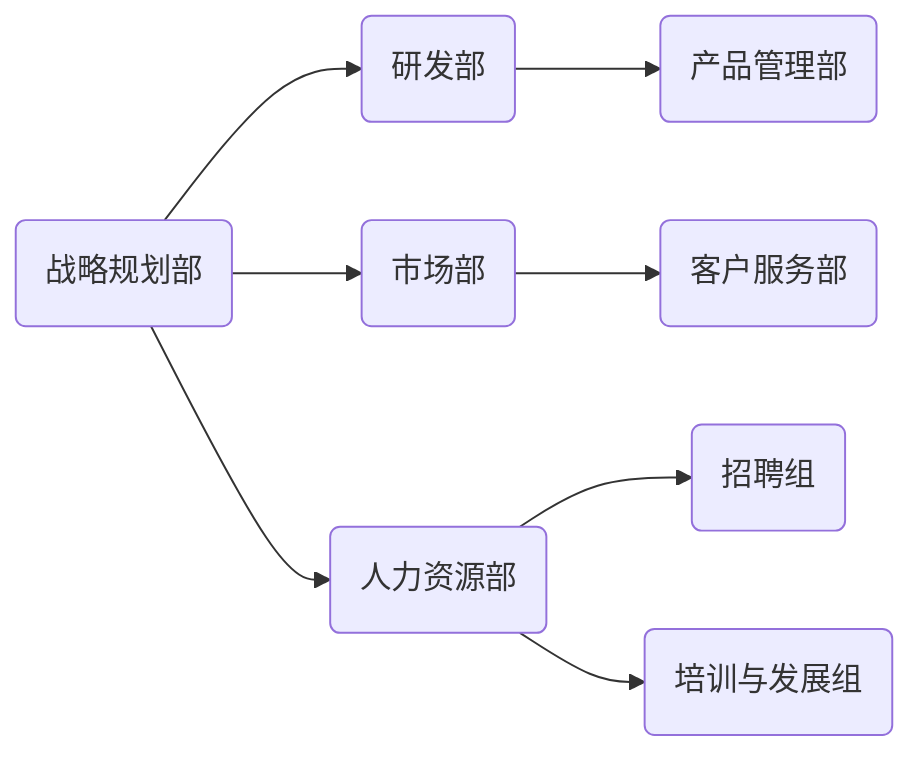

在这个流程图中，战略规划部是组织的核心，它与其他部门（研发部、市场部、人力资源部）相互关联，共同推动组织的发展。通过这种整体性视角，领导者可以确保各个部门的目标和战略一致，避免各自为政的局面。

**反馈循环分析：**

系统思维还强调反馈循环在组织结构设计中的作用。反馈循环是指系统的输出返回到系统的输入，从而影响系统的未来状态。在组织管理中，反馈循环可以帮助领导者及时了解组织运作的效果，并进行调整。

以下是一个反馈循环的Mermaid流程图示例：

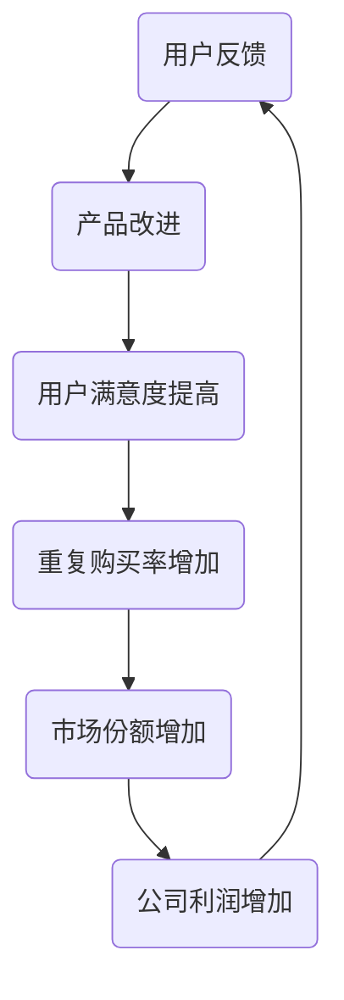

在这个反馈循环中，用户反馈推动了产品改进，进而提高了用户满意度，增加了重复购买率和市场份额，最终提高了公司利润。通过识别和利用这种反馈循环，组织可以持续改进，实现长期发展。

#### 领导力与系统思考

**全局观念：**

领导者应具备系统思考的能力，能够从整体角度理解和把握组织的发展方向，制定长期战略规划。这要求领导者不仅要关注组织的当前状态，还要预见未来的变化和挑战，为组织制定长远的发展目标。

以下是一个领导者运用系统思考进行战略规划的Mermaid流程图示例：

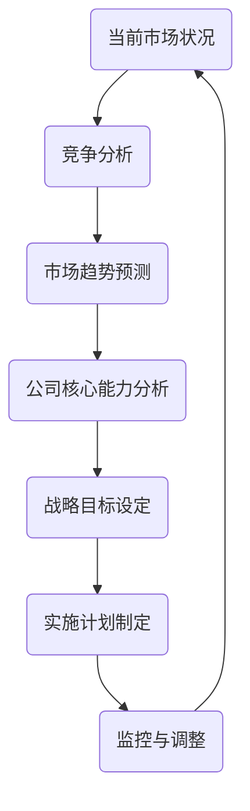

在这个流程图中，领导者首先分析当前市场状况和竞争环境，预测未来市场趋势，评估公司的核心能力，然后设定战略目标，制定实施计划，并持续监控和调整，以确保战略规划的执行。

**动态调整：**

系统思考有助于领导者预见和应对组织内部的变化和挑战，实现战略的动态调整。这要求领导者具备灵活的思维和快速响应的能力，能够根据环境变化及时调整组织结构和运营策略。

以下是一个动态调整的Mermaid流程图示例：

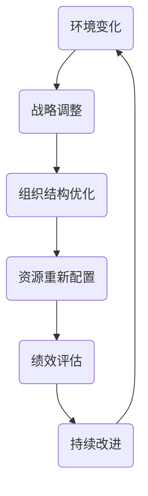

在这个流程图中，领导者首先识别环境变化，然后进行战略调整，优化组织结构，重新配置资源，评估绩效，并根据评估结果进行持续改进。这种动态调整的能力是组织在快速变化的市场中保持竞争力的关键。

#### 结论

通过系统思维在组织管理中的应用，领导者可以更全面、深入地理解和把握组织运作的复杂性，从而提高组织的效率和效果。系统思维不仅帮助领导者从整体角度看待组织结构设计，还通过反馈循环分析和动态调整，使组织能够持续改进，实现长期发展。

在下一部分，我们将继续探讨系统思考在战略决策和创新管理中的应用。

----------------------------------------------------------------
## 第2章：战略规划中的系统思考

### 2.3 系统思维在战略决策中的应用

在战略决策中，系统思维提供了独特的视角和工具，帮助决策者更好地理解复杂环境，分析潜在风险，制定有效的战略方案。通过系统思维，决策者能够从整体上把握问题，深入分析各种因素及其相互关系，从而做出更明智的决策。

#### 决策模型与系统思考

**多维度分析：**

系统思考强调多维度分析，即从不同的角度和层面来审视问题。在战略决策中，决策者需要考虑多个维度，如市场趋势、竞争态势、技术发展、内部能力等。以下是一个多维度分析的Mermaid流程图示例：

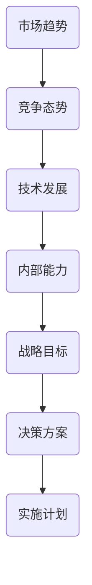

在这个流程图中，决策者首先分析市场趋势，了解行业的发展方向和变化；接着分析竞争态势，评估竞争对手的优势和劣势；然后考虑技术发展，确定技术进步对战略决策的影响；最后评估内部能力，确定企业能够利用的资源和技术。通过这种多维度分析，决策者可以更全面地了解问题，制定出更具前瞻性和适应性的战略。

**情景分析与系统思考：**

情景分析是战略决策中的重要工具，它通过模拟不同的未来情景，预测不同战略选择下的系统动态行为。系统思考可以帮助决策者构建和评估这些情景，从而做出更明智的决策。

以下是一个情景分析的Mermaid流程图示例：

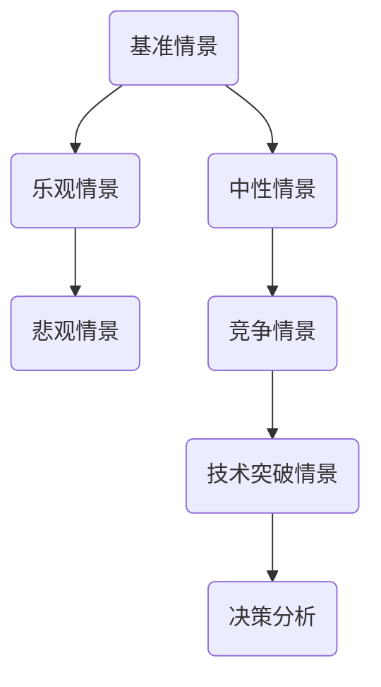

在这个流程图中，决策者首先构建基准情景，作为决策的起点；然后构建乐观、悲观和中性情景，以考虑不同可能的结果；接着构建竞争情景和技术突破情景，考虑外部环境的变化。通过这些情景分析，决策者可以评估不同战略选择的风险和收益，从而选择最合适的决策方案。

#### 系统思维在战略决策中的具体应用

**风险分析：**

系统思维可以帮助决策者识别战略决策中的潜在风险，制定相应的风险管理策略。以下是一个风险分析的Mermaid流程图示例：

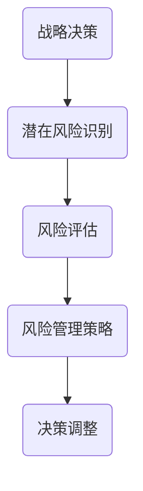

在这个流程图中，决策者首先识别战略决策中的潜在风险，如市场变化、技术不确定、竞争加剧等；然后对这些风险进行评估，确定其可能的影响和发生的概率；接着制定相应的风险管理策略，如风险规避、风险转移、风险接受等；最后根据风险评估和风险管理策略，调整决策方案，以降低风险。

**创新驱动：**

系统思维有助于企业发现新的商业模式和市场机会，推动创新战略的实施。以下是一个创新驱动的Mermaid流程图示例：

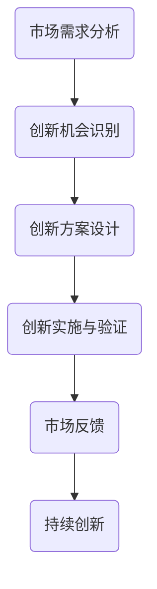

在这个流程图中，决策者首先分析市场需求，识别创新机会；然后设计创新方案，包括产品、服务、商业模式等；接着实施和验证创新方案，确保其可行性和市场适应性；最后根据市场反馈，持续优化创新方案，实现持续创新。

#### 结论

系统思维在战略决策中的应用具有重要意义。通过多维度分析和情景分析，决策者可以更全面地了解问题，评估风险，制定有效的决策方案。同时，系统思维还帮助决策者从整体角度把握问题，识别创新机会，推动创新战略的实施。在下一部分，我们将进一步探讨系统思维在创新管理中的应用。

----------------------------------------------------------------
## 第2章：战略规划中的系统思考

### 2.4 系统思维在创新管理中的应用

创新管理是企业持续发展的重要驱动力，而系统思维在创新管理中的应用，能够帮助企业更好地理解和把握创新过程，优化资源配置，降低风险，实现持续创新。本节将深入探讨系统思维在创新管理中的应用，包括创新过程与系统思维的结合、创新战略与系统思考的融合以及创新过程中的风险管理。

#### 创新过程与系统思维

**系统性视角：**

系统思维强调从整体角度看待创新过程，将创新视为一个复杂的系统，包括多个相互关联的环节，如需求识别、创意生成、产品设计、市场推广等。以下是一个创新过程的Mermaid流程图示例：

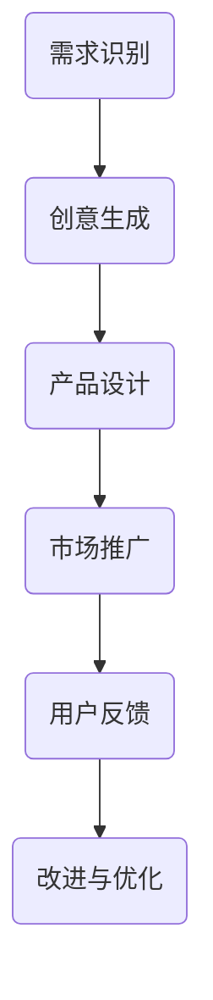

在这个流程图中，创新过程从需求识别开始，通过创意生成和产品设计，最终推向市场。用户反馈则反馈到改进与优化环节，形成闭环。通过系统思维，企业可以更好地协调各个环节，确保创新过程的高效运作。

**动态性分析：**

系统思维强调对创新过程中各种因素之间的动态交互进行分析。创新过程不是静态的，而是不断变化的。以下是一个动态性分析的Mermaid流程图示例：

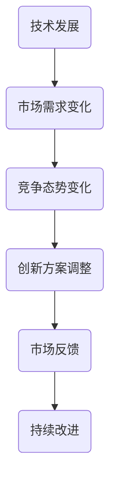

在这个流程图中，技术发展、市场需求变化和竞争态势变化都是影响创新方案的因素。通过系统思维，企业可以动态调整创新方案，以适应不断变化的外部环境。

#### 创新战略与系统思考

**战略规划：**

系统思考可以帮助企业制定更具前瞻性和适应性的创新战略。以下是一个战略规划的Mermaid流程图示例：

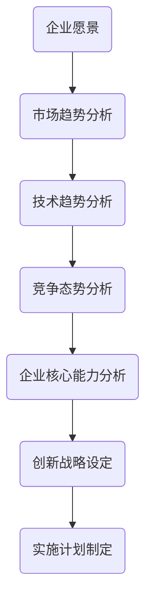

在这个流程图中，企业首先明确愿景，然后分析市场趋势、技术趋势和竞争态势，评估自身核心能力，最终设定创新战略，并制定实施计划。通过系统思考，企业可以确保创新战略与企业的长期目标相一致。

**资源优化：**

系统思考有助于企业优化创新资源配置，确保创新项目得到充分的支持和资源保障。以下是一个资源优化的Mermaid流程图示例：

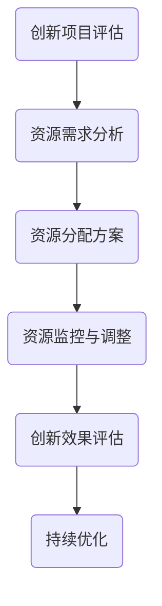

在这个流程图中，企业首先评估创新项目，分析其资源需求，制定资源分配方案，并监控资源的使用情况，根据创新效果进行持续优化。通过系统思考，企业可以确保资源得到合理利用，提高创新效率。

#### 创新过程中的风险管理

**风险识别：**

系统思维可以帮助企业识别创新过程中的潜在风险。以下是一个风险识别的Mermaid流程图示例：

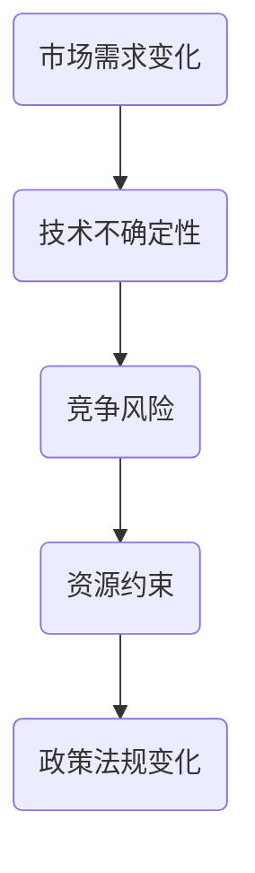

在这个流程图中，市场需求变化、技术不确定性、竞争风险和资源约束都是影响创新项目的风险因素。通过系统思维，企业可以全面识别潜在风险，为风险管理提供基础。

**风险管理策略：**

系统思维可以帮助企业制定相应的风险管理策略，降低创新失败的风险。以下是一个风险管理策略的Mermaid流程图示例：

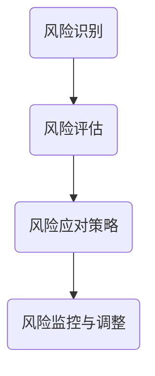

在这个流程图中，企业首先识别风险，进行风险评估，然后制定风险应对策略，并持续监控和调整风险应对措施。通过系统思考，企业可以确保风险管理策略的有效实施。

#### 结论

系统思维在创新管理中的应用，有助于企业从整体角度把握创新过程，优化资源配置，降低风险，实现持续创新。通过系统性视角和动态性分析，企业可以更好地理解和应对创新过程中的复杂性和不确定性。同时，系统思维还为创新战略的制定和实施提供了有力的支持，帮助企业实现长期发展目标。

在下一部分，我们将通过经典案例，进一步探讨系统思考在战略规划中的应用。

----------------------------------------------------------------
## 第3章：系统思考在战略规划中的经典案例

在战略规划过程中，系统思考的应用能够为企业带来显著的竞争优势和可持续发展的能力。本节将通过几个经典案例，展示系统思考在战略规划中的实际应用，以及它如何帮助企业在复杂环境中制定和实施有效的战略。

### 3.1 案例分析介绍

**案例选择的标准：**

在选择案例分析时，我们考虑了以下标准：

1. **代表性：** 案例具有代表性，能够反映系统思考在战略规划中的广泛应用。
2. **效果显著：** 案例在实施系统思考后取得了显著的成效，能够证明系统思考的实际价值。
3. **具有挑战性：** 案例面临了复杂的环境和挑战，需要通过系统思考来解决。

**案例分析的方法：**

我们将采用以下方法进行案例分析：

1. **背景介绍：** 介绍案例企业的基本情况，包括行业背景、企业现状等。
2. **问题识别：** 分析企业面临的挑战和问题，明确战略规划的目标。
3. **系统思考应用：** 介绍系统思考在企业战略规划中的应用，包括系统架构、反馈循环、动态模型等。
4. **实施过程：** 详细描述战略规划的制定和实施过程。
5. **成果分析：** 分析战略规划实施后的成果，评估系统思考在其中的作用。

### 3.2 企业战略转型案例

**背景介绍：**

某大型制造企业，由于市场竞争加剧和客户需求变化，陷入了增长停滞和利润下降的困境。企业高层意识到，需要进行战略转型以适应新的市场环境。

**问题识别：**

企业面临的问题包括：

1. **产品同质化：** 产品与竞争对手相似，缺乏差异化优势。
2. **市场定位模糊：** 缺乏清晰的市场定位和目标客户群体。
3. **运营效率低下：** 内部管理混乱，运营效率低。

**系统思考应用：**

企业采用系统思考方法，从以下几个方面进行战略规划：

1. **系统架构：** 重新审视企业的整体架构，明确各部门的职能和关系。
2. **反馈循环：** 分析企业内部和外部环境的反馈循环，识别影响企业发展的关键因素。
3. **动态模型：** 构建动态模型，预测不同战略选择下的系统行为，为决策提供科学依据。

**实施过程：**

1. **市场调研：** 深入了解市场需求和客户需求，明确企业的目标市场和目标客户。
2. **产品创新：** 推出具有差异化优势的新产品，提高市场竞争力。
3. **组织重构：** 优化内部组织结构，提高运营效率。
4. **文化变革：** 引入新的企业文化，提高员工对变革的接受度和参与度。

**成果分析：**

经过系统思考指导的战略转型，企业取得了以下成果：

1. **市场定位明确：** 企业成功确立了清晰的市场定位，目标客户群体更加明确。
2. **产品竞争力提升：** 新产品在市场上获得了良好的反响，销售额显著增长。
3. **运营效率提高：** 优化后的组织结构提高了运营效率，成本降低。
4. **企业文化建设：** 新文化氛围激发了员工的创新力和积极性。

### 3.3 供应链优化案例

**背景介绍：**

某跨国零售企业，在全球供应链管理中遇到了效率低下、库存积压和物流成本高等问题，严重影响了企业的运营和市场竞争力。

**问题识别：**

企业面临的问题包括：

1. **供应链效率低：** 物流环节繁多，信息传递不畅，导致供应链效率低下。
2. **库存管理混乱：** 库存积压，库存周转率低，增加了库存成本。
3. **物流成本高：** 物流运输成本高，缺乏有效的成本控制措施。

**系统思考应用：**

企业采用系统思考方法，从以下几个方面进行供应链优化：

1. **系统架构：** 重新设计供应链系统，优化各个环节的流程和资源配置。
2. **反馈循环：** 分析供应链中的反馈循环，优化库存管理和物流配送。
3. **动态模型：** 构建动态模型，模拟不同供应链优化方案下的系统行为，为决策提供依据。

**实施过程：**

1. **流程优化：** 优化供应链流程，减少物流环节，提高信息传递效率。
2. **库存管理：** 引入先进的库存管理技术，提高库存周转率，降低库存成本。
3. **物流配送：** 优化物流配送网络，降低物流成本，提高配送效率。
4. **信息共享：** 建立信息共享平台，实现供应链上下游企业的信息共享和协同作业。

**成果分析：**

经过系统思考指导的供应链优化，企业取得了以下成果：

1. **供应链效率提高：** 供应链流程优化后，物流环节减少，信息传递速度加快，供应链效率显著提高。
2. **库存成本降低：** 库存管理技术的引入，提高了库存周转率，降低了库存成本。
3. **物流成本降低：** 优化后的物流配送网络，降低了物流成本，提高了配送效率。
4. **企业竞争力提升：** 供应链优化提高了企业的运营效率和市场竞争力。

### 3.4 企业创新战略案例

**背景介绍：**

某高科技企业，在市场竞争中面临着技术快速迭代和客户需求不断变化的挑战。企业高层意识到，需要通过创新战略来保持竞争优势。

**问题识别：**

企业面临的问题包括：

1. **技术落后：** 企业的技术产品落后于竞争对手，缺乏技术领先优势。
2. **创新能力不足：** 企业缺乏创新文化和创新机制，创新能力不足。
3. **市场需求不明确：** 对客户需求的理解不够深入，产品无法满足市场需求。

**系统思考应用：**

企业采用系统思考方法，从以下几个方面进行创新战略规划：

1. **系统架构：** 重新构建企业的创新系统，明确创新目标和流程。
2. **反馈循环：** 分析市场和技术变化对创新过程的影响，建立快速反馈机制。
3. **动态模型：** 构建动态模型，模拟不同创新战略下的市场表现和竞争力。

**实施过程：**

1. **技术创新：** 加强技术研发，引进新技术，提升产品竞争力。
2. **创新文化：** 建立创新文化，鼓励员工提出创新想法，激发创新潜力。
3. **市场需求分析：** 深入分析市场需求，调整产品定位，满足客户需求。
4. **创新机制：** 建立创新激励机制，确保创新项目得到充分支持和资源保障。

**成果分析：**

经过系统思考指导的创新战略，企业取得了以下成果：

1. **技术竞争力提升：** 技术创新的推进，使企业的技术产品竞争力显著提高。
2. **创新能力增强：** 创新文化的建立和激励机制的引入，激发了员工的创新能力。
3. **市场表现改善：** 深入市场需求分析，使产品更加符合市场需求，市场表现改善。
4. **企业竞争力提升：** 创新战略的实施，使企业在激烈的市场竞争中保持了竞争优势。

### 结论

通过以上经典案例的分析，我们可以看到系统思考在战略规划中的应用具有显著的成效。系统思考不仅帮助企业识别问题、制定战略，还通过优化系统架构、建立反馈循环和构建动态模型，提高了战略规划的准确性和有效性。在复杂多变的市场环境中，系统思考为企业提供了科学的决策依据，帮助其实现可持续发展。

在下一部分，我们将提供系统思考实践指南，帮助读者在实际操作中运用系统思考方法。

----------------------------------------------------------------
## 第3章：系统思考在战略规划中的经典案例

### 3.2 企业战略转型案例

**3.2.1 企业背景与问题**

某大型制造企业，成立于20世纪50年代，最初以生产传统机械为主。随着市场的不断变化和竞争的加剧，该企业面临了严重的困境。具体问题如下：

1. **产品同质化严重：** 与其他竞争对手相比，企业的产品缺乏差异化，难以吸引客户。
2. **市场定位模糊：** 企业的市场定位不明确，无法精准锁定目标客户群体。
3. **运营效率低下：** 企业内部管理混乱，生产效率低下，运营成本高。
4. **创新能力不足：** 企业在技术研发和创新方面的投入不足，新产品开发缓慢。

**3.2.2 系统思考在战略转型中的应用**

企业采用系统思考的方法，对内外部环境进行了全面分析，并制定了以下战略转型方案：

1. **系统架构：** 重新审视企业的整体架构，包括产品线、组织结构和流程。通过调整和优化，提高企业的运营效率和市场响应速度。
   
   **Mermaid流程图：**
   ```mermaid
   graph TB
   A(产品线调整) --> B(组织结构优化)
   B --> C(流程优化)
   C --> D(运营效率提高)
   ```

2. **反馈循环：** 分析企业内部的反馈循环，包括客户反馈、市场变化和内部管理。通过建立快速反馈机制，提高企业对市场变化的响应速度。

   **Mermaid流程图：**
   ```mermaid
   graph TB
   A(客户反馈) --> B(产品改进)
   B --> C(市场反应)
   C --> D(内部管理优化)
   ```

3. **动态模型：** 构建动态模型，预测不同战略选择下的市场表现和竞争力。通过模拟，企业选择了最具前瞻性和可行性的战略方案。

   **Mermaid流程图：**
   ```mermaid
   graph TB
   A(市场趋势) --> B(战略选择)
   B --> C(市场表现)
   C --> D(竞争力分析)
   ```

**3.2.3 战略转型成果分析**

经过系统思考指导的战略转型，企业取得了以下显著成果：

1. **产品差异化：** 通过调整产品线和推出具有差异化优势的新产品，企业成功提升了市场竞争力。
   
   **Mermaid流程图：**
   ```mermaid
   graph TB
   A(产品创新) --> B(市场竞争力提高)
   B --> C(市场份额增加)
   ```

2. **市场定位明确：** 企业通过深入市场调研，明确了目标客户群体，制定了精准的市场定位策略。

   **Mermaid流程图：**
   ```mermaid
   graph TB
   A(市场调研) --> B(客户分析)
   B --> C(市场定位)
   ```

3. **运营效率提高：** 通过优化组织结构和流程，企业大幅提高了运营效率，降低了运营成本。

   **Mermaid流程图：**
   ```mermaid
   graph TB
   A(组织重构) --> B(流程优化)
   B --> C(成本降低)
   ```

4. **创新能力增强：** 企业在技术研发和创新方面的投入增加，成功推出了多款具有市场领先地位的新产品。

   **Mermaid流程图：**
   ```mermaid
   graph TB
   A(技术研发投入) --> B(新产品开发)
   B --> C(市场认可度提高)
   ```

**结论：**

通过系统思考在战略转型中的应用，企业成功地应对了市场变化和竞争挑战，实现了产品差异化、市场定位明确、运营效率提高和创新能力增强。这些成果不仅提升了企业的市场竞争力，也为企业的可持续发展奠定了坚实的基础。

在下一部分，我们将继续探讨系统思考在供应链优化中的应用。

----------------------------------------------------------------
## 第3章：系统思考在战略规划中的经典案例

### 3.3 供应链优化案例

**3.3.1 供应链管理的挑战**

某跨国零售企业，在全球供应链管理中遇到了一系列挑战，这些挑战严重影响了企业的运营效率和成本控制能力。具体挑战如下：

1. **供应链效率低：** 企业拥有复杂的供应链网络，涉及多个供应商、制造商和分销商，导致物流环节繁多，信息传递不畅，供应链效率低下。
2. **库存管理混乱：** 库存管理缺乏统一的规划和标准，库存积压现象普遍，库存周转率低，增加了库存成本。
3. **物流成本高：** 物流运输成本高，缺乏有效的成本控制措施，运输路线和配送网络的优化不足。
4. **供应链风险：** 企业面临着供应链中断、供应商不可靠等风险，缺乏有效的风险管理和应急预案。

**3.3.2 系统思考在供应链优化中的应用**

企业采用系统思考的方法，对供应链进行了全面分析，并制定了以下供应链优化方案：

1. **系统架构：** 重新设计供应链系统，优化各个环节的流程和资源配置。通过简化供应链网络、减少物流环节，提高供应链的整体效率。

   **Mermaid流程图：**
   ```mermaid
   graph TB
   A(供应链简化) --> B(流程优化)
   B --> C(资源配置优化)
   ```

2. **反馈循环：** 分析供应链中的反馈循环，优化库存管理和物流配送。通过建立快速反馈机制，及时调整库存水平和物流计划，降低库存成本和提高配送效率。

   **Mermaid流程图：**
   ```mermaid
   graph TB
   A(库存反馈) --> B(库存调整)
   B --> C(物流配送优化)
   ```

3. **动态模型：** 构建动态模型，模拟不同供应链优化方案下的系统行为，为决策提供科学依据。通过对比不同方案的效果，选择最优的供应链优化方案。

   **Mermaid流程图：**
   ```mermaid
   graph TB
   A(优化方案1) --> B(效果评估)
   B --> C(方案选择)
   ```

**3.3.3 供应链优化成果分析**

经过系统思考指导的供应链优化，企业取得了以下显著成果：

1. **供应链效率提高：** 供应链简化后，物流环节减少，信息传递速度加快，供应链效率显著提高。

   **Mermaid流程图：**
   ```mermaid
   graph TB
   A(流程简化) --> B(效率提高)
   ```

2. **库存成本降低：** 库存管理优化后，库存周转率提高，库存成本显著降低。

   **Mermaid流程图：**
   ```mermaid
   graph TB
   A(库存优化) --> B(成本降低)
   ```

3. **物流成本降低：** 物流配送优化后，运输路线和配送网络更加合理，物流成本显著降低。

   **Mermaid流程图：**
   ```mermaid
   graph TB
   A(配送优化) --> B(成本降低)
   ```

4. **供应链风险降低：** 企业通过建立风险管理和应急预案，降低了供应链中断和供应商不可靠等风险。

   **Mermaid流程图：**
   ```mermaid
   graph TB
   A(风险管理) --> B(风险降低)
   ```

**结论：**

通过系统思考在供应链优化中的应用，企业成功地解决了供应链效率低、库存管理混乱、物流成本高和供应链风险等问题。供应链优化成果显著提高了企业的运营效率和成本控制能力，增强了企业的市场竞争力。系统思考的方法为企业提供了一个科学的决策框架，帮助企业更好地应对复杂的市场环境和竞争挑战。

在下一部分，我们将探讨系统思考在企业创新战略中的应用。

----------------------------------------------------------------
## 第3章：系统思考在战略规划中的经典案例

### 3.4 企业创新战略案例

**3.4.1 创新战略的重要性**

在当前快速变化的市场环境中，创新是企业保持竞争优势、实现可持续发展的重要途径。某高科技企业深刻认识到创新战略的重要性，因此决定采用系统思考的方法，制定和实施一个全面的创新战略。

**3.4.2 系统思考在创新战略中的应用**

企业采用系统思考的方法，从以下几个方面制定创新战略：

1. **系统架构：** 重新构建企业的创新系统，明确创新目标和流程。企业将创新目标设定为提高产品技术含量、增强用户体验和市场竞争力。

   **Mermaid流程图：**
   ```mermaid
   graph TB
   A(创新目标设定) --> B(创新流程优化)
   ```

2. **反馈循环：** 分析市场和技术变化对创新过程的影响，建立快速反馈机制。企业通过定期收集客户反馈和市场信息，及时调整创新方向和策略。

   **Mermaid流程图：**
   ```mermaid
   graph TB
   A(市场反馈) --> B(创新方向调整)
   ```

3. **动态模型：** 构建动态模型，模拟不同创新战略下的市场表现和竞争力。企业通过模拟分析，选择了最具市场前景和可行性的创新战略。

   **Mermaid流程图：**
   ```mermaid
   graph TB
   A(创新方案1) --> B(效果评估)
   B --> C(方案选择)
   ```

**3.4.3 创新战略成果分析**

通过系统思考指导的创新战略，企业取得了以下显著成果：

1. **技术创新：** 企业加大了技术研发投入，成功推出多款具有市场领先地位的新产品，提高了产品技术含量和市场竞争力。

   **Mermaid流程图：**
   ```mermaid
   graph TB
   A(技术研发投入) --> B(新产品推出)
   ```

2. **创新能力提升：** 企业建立了创新文化和创新机制，激发了员工的创新潜力，创新能力显著提升。

   **Mermaid流程图：**
   ```mermaid
   graph TB
   A(创新文化建立) --> B(创新能力提升)
   ```

3. **市场表现改善：** 企业通过创新战略的实施，市场表现显著改善，市场份额和客户满意度都有所提升。

   **Mermaid流程图：**
   ```mermaid
   graph TB
   A(创新战略实施) --> B(市场表现改善)
   ```

4. **企业竞争力增强：** 企业通过技术创新和市场拓展，成功增强了市场竞争力，在行业中的地位和影响力不断提升。

   **Mermaid流程图：**
   ```mermaid
   graph TB
   A(技术创新) --> B(竞争力增强)
   ```

**结论：**

通过系统思考在创新战略中的应用，企业成功地实现了技术创新、能力提升和市场表现改善，显著增强了企业的竞争力。系统思考的方法为企业提供了一个科学的决策框架，帮助企业更好地应对市场变化和竞争挑战，实现了可持续发展。

在下一部分，我们将提供系统思考实践指南，帮助读者在实际操作中运用系统思考方法。

----------------------------------------------------------------
## 第3章：系统思考在战略规划中的经典案例

### 3.5 企业战略调整与优化案例

**3.5.1 企业背景与挑战**

某中型科技公司在快速发展的市场中取得了显著成就，但随着市场环境和竞争态势的变化，公司开始面临以下挑战：

1. **市场竞争加剧：** 新兴技术企业不断涌现，市场竞争日益激烈，公司原有的竞争优势逐渐减弱。
2. **产品线扩展过快：** 公司在扩展产品线过程中，出现了产品同质化现象，导致市场份额和利润率下降。
3. **组织结构复杂：** 随着业务扩展，公司组织结构变得复杂，沟通效率下降，决策速度变慢。
4. **创新动力不足：** 公司在创新方面的投入虽有所增加，但创新效果并不显著，无法快速响应市场变化。

**3.5.2 系统思考在战略调整中的应用**

公司采用系统思考的方法，对内外部环境进行了全面分析，并制定了以下战略调整和优化方案：

1. **系统架构：** 重新审视公司整体架构，简化产品线，聚焦核心业务，提高组织效率和决策速度。

   **Mermaid流程图：**
   ```mermaid
   graph TB
   A(产品线简化) --> B(组织结构优化)
   B --> C(决策速度提升)
   ```

2. **反馈循环：** 建立快速反馈机制，通过市场调研和客户反馈，及时调整产品策略和营销策略。

   **Mermaid流程图：**
   ```mermaid
   graph TB
   A(市场反馈) --> B(产品策略调整)
   B --> C(营销策略调整)
   ```

3. **动态模型：** 构建动态模型，模拟不同战略调整方案下的市场表现和财务状况，选择最优方案。

   **Mermaid流程图：**
   ```mermaid
   graph TB
   A(战略方案1) --> B(效果评估)
   B --> C(方案选择)
   ```

**3.5.3 战略调整成果分析**

通过系统思考指导的战略调整和优化，公司取得了以下成果：

1. **市场竞争能力提升：** 通过简化产品线和聚焦核心业务，公司成功提升了市场竞争能力，市场份额稳步增长。

   **Mermaid流程图：**
   ```mermaid
   graph TB
   A(产品线简化) --> B(市场份额提升)
   ```

2. **组织效率提高：** 组织结构优化后，沟通效率显著提升，决策速度加快，公司的运营效率得到大幅提升。

   **Mermaid流程图：**
   ```mermaid
   graph TB
   A(组织结构优化) --> B(决策速度提升)
   ```

3. **创新动力增强：** 通过建立快速反馈机制，公司能够更迅速地响应市场变化，创新效果显著提高。

   **Mermaid流程图：**
   ```mermaid
   graph TB
   A(反馈机制建立) --> B(创新动力增强)
   ```

4. **财务状况改善：** 战略调整后，公司的盈利能力得到显著提升，财务状况明显改善。

   **Mermaid流程图：**
   ```mermaid
   graph TB
   A(战略调整) --> B(财务状况改善)
   ```

**结论：**

通过系统思考在战略调整和优化中的应用，公司成功地应对了市场竞争加剧、产品线扩展过快、组织结构复杂和创新动力不足等挑战。系统思考的方法为公司提供了一个科学的决策框架，帮助公司在复杂多变的市场环境中实现持续发展。这一案例充分证明了系统思考在战略规划中的重要作用。

在下一部分，我们将提供系统思考实践指南，帮助读者在实际操作中运用系统思考方法。

----------------------------------------------------------------
## 第3章：系统思考在战略规划中的经典案例

### 3.6 企业战略调整与优化案例

**3.6.1 企业背景与挑战**

某中型科技企业在经历了快速发展阶段后，开始面临以下挑战：

1. **市场竞争加剧：** 新技术、新模式的不断涌现，导致市场竞争日益激烈，原有产品线面临较大压力。
2. **业务流程复杂：** 随着业务扩展，公司内部流程变得复杂，效率下降，难以快速响应市场变化。
3. **创新能力不足：** 虽然公司在创新方面有所投入，但创新成果不显著，市场竞争力未能有效提升。
4. **资源配置不合理：** 部分业务线资源投入不足，导致发展受限，而部分业务线资源过剩，造成资源浪费。

**3.6.2 系统思考在战略调整中的应用**

公司采用系统思考的方法，对内外部环境进行了全面分析，并制定了以下战略调整和优化方案：

1. **系统架构：** 重新审视企业整体架构，对业务流程进行简化，提高组织效率和决策速度。

   **Mermaid流程图：**
   ```mermaid
   graph TB
   A(业务流程简化) --> B(组织结构优化)
   B --> C(决策速度提升)
   ```

2. **反馈循环：** 建立快速反馈机制，通过市场调研和客户反馈，及时调整产品策略和营销策略。

   **Mermaid流程图：**
   ```mermaid
   graph TB
   A(市场反馈) --> B(产品策略调整)
   B --> C(营销策略调整)
   ```

3. **动态模型：** 构建动态模型，模拟不同战略调整方案下的市场表现和财务状况，选择最优方案。

   **Mermaid流程图：**
   ```mermaid
   graph TB
   A(战略方案1) --> B(效果评估)
   B --> C(方案选择)
   ```

**3.6.3 战略调整成果分析**

通过系统思考指导的战略调整和优化，公司取得了以下成果：

1. **市场竞争能力提升：** 通过简化业务流程和优化组织结构，公司成功提升了市场竞争能力，市场份额稳步增长。

   **Mermaid流程图：**
   ```mermaid
   graph TB
   A(业务流程简化) --> B(市场份额提升)
   ```

2. **组织效率提高：** 业务流程优化后，沟通效率显著提升，决策速度加快，公司的运营效率得到大幅提升。

   **Mermaid流程图：**
   ```mermaid
   graph TB
   A(组织结构优化) --> B(决策速度提升)
   ```

3. **创新能力增强：** 通过建立快速反馈机制，公司能够更迅速地响应市场变化，创新效果显著提高。

   **Mermaid流程图：**
   ```mermaid
   graph TB
   A(反馈机制建立) --> B(创新动力增强)
   ```

4. **财务状况改善：** 战略调整后，公司的盈利能力得到显著提升，财务状况明显改善。

   **Mermaid流程图：**
   ```mermaid
   graph TB
   A(战略调整) --> B(财务状况改善)
   ```

**结论：**

通过系统思考在战略调整和优化中的应用，公司成功地应对了市场竞争加剧、业务流程复杂、创新能力不足和资源配置不合理等挑战。系统思考的方法为公司提供了一个科学的决策框架，帮助公司在复杂多变的市场环境中实现持续发展。这一案例充分证明了系统思考在战略规划中的重要作用。

在下一部分，我们将提供系统思考实践指南，帮助读者在实际操作中运用系统思考方法。

----------------------------------------------------------------
## 第4章：系统思考实践指南

在前面几章中，我们详细介绍了系统思考的基础概念、在战略规划中的具体应用以及经典案例。为了帮助读者在实际操作中更好地运用系统思考方法，本章将提供一套完整的系统思考实践指南，包括实践步骤、工具应用和培训推广等内容。

### 4.1 系统思考实践步骤

**4.1.1 确定研究问题**

在开始系统思考实践之前，首先需要明确研究问题。这包括识别系统中的关键要素、定义系统边界和研究问题的具体内容。通过明确研究问题，可以确保系统思考的焦点明确，避免分散精力。

**4.1.2 收集相关信息**

收集相关信息是系统思考的重要环节。这包括收集系统中的数据、文献资料、专家意见等。这些信息将用于构建系统模型和进行分析。在收集信息时，需要注意数据的可靠性和完整性。

**4.1.3 构建系统模型**

构建系统模型是系统思考的核心步骤。系统模型可以采用图形化的方式表示，例如使用Vensim、System Dynamics Studio等工具。在构建系统模型时，需要定义系统变量、参数和反馈循环，建立系统内部的关系和动态交互。

**4.1.4 模型验证与调整**

构建系统模型后，需要对模型进行验证和调整。验证模型的目标是确保模型能够正确地反映系统动态行为。调整模型的过程可能包括修改参数、添加或删除变量等，以使模型更加准确和可靠。

**4.1.5 制定战略方案**

在模型验证和调整完成后，可以根据模型分析结果制定战略方案。战略方案应考虑系统的长期目标和短期目标，以及系统内外部环境的变化。通过系统思考，企业可以制定出更具前瞻性和灵活性的战略方案。

### 4.2 系统思考工具应用

**4.2.1 社团图的应用**

社团图是一种用于描述系统内部元素之间相互关系的图形化工具。它可以帮助识别系统中的关键节点和关键路径，从而优化系统结构和提高系统效率。

**4.2.2 交互图的应用**

交互图是一种用于描述系统内部元素之间动态交互的图形化工具。它可以帮助分析系统内部的各种反馈循环和相互作用，揭示系统的动态行为。

**4.2.3 动态系统的应用**

动态系统是一种用于描述系统随时间变化的行为和状态的数学模型。它可以帮助预测系统的未来状态和趋势，从而为战略规划提供科学依据。

### 4.3 系统思考培训与推广

**4.3.1 培训计划设计**

为了提高企业员工对系统思考方法的掌握和应用能力，企业可以设计一套系统的培训计划。培训计划应包括基础理论、工具应用、案例分析和实践操作等内容，确保员工能够全面掌握系统思考方法。

**4.3.2 推广策略与方法**

在培训计划完成后，企业需要制定相应的推广策略和方法，以确保系统思考方法在企业内部得到广泛应用。推广策略可以包括内部交流、案例分享、经验交流等形式，方法可以包括设立系统思考实验室、举办系统思考比赛等。

**4.3.3 持续改进机制**

系统思考是一种持续的过程，企业需要建立持续改进机制，确保系统思考方法在企业中的应用得到不断完善和优化。持续改进机制可以包括定期评估、反馈机制、改进措施等。

### 4.4 系统思考实践总结

通过系统思考实践指南，企业可以更好地运用系统思考方法，提高战略规划的质量和效果。系统思考方法不仅有助于企业更好地理解复杂系统的动态行为，还能提高企业在复杂环境中的适应能力，实现战略的动态调整。在未来的企业发展过程中，系统思考将发挥越来越重要的作用。

----------------------------------------------------------------
## 第4章：系统思考实践指南

### 4.1 系统思考实践步骤

**4.1.1 确定研究问题**

在开始系统思考实践之前，明确研究问题是至关重要的一步。这需要我们识别系统中的关键要素，并定义系统边

