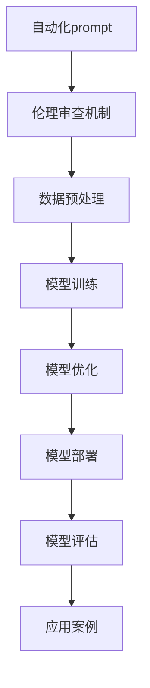
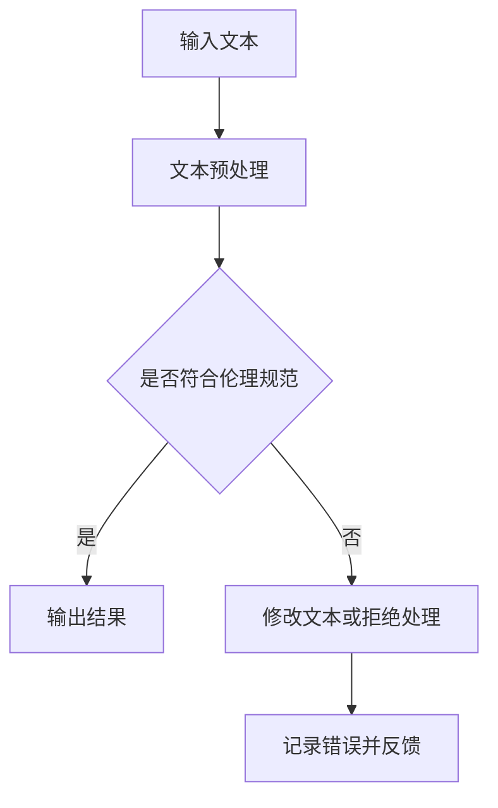
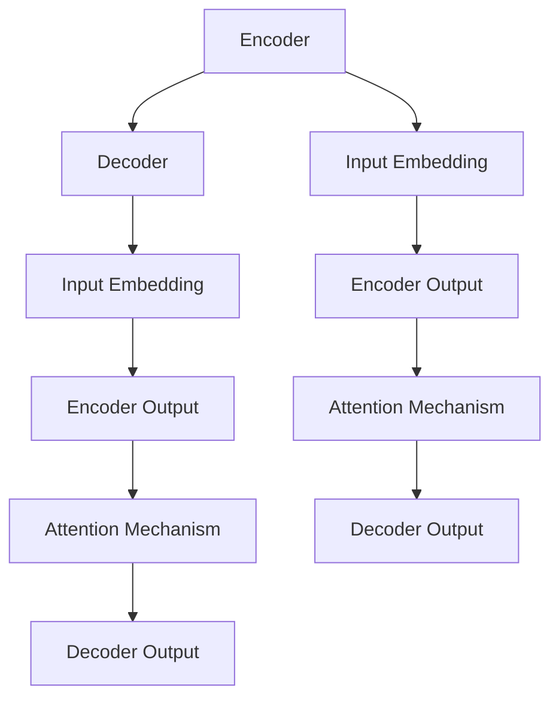
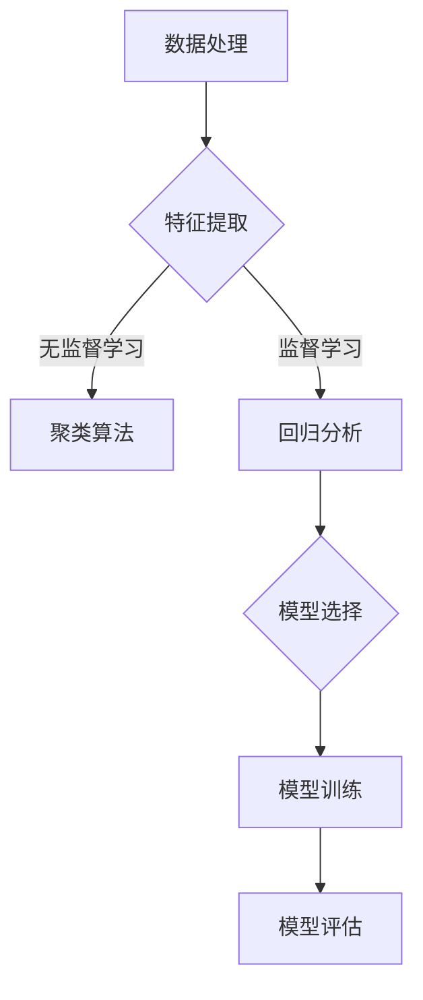
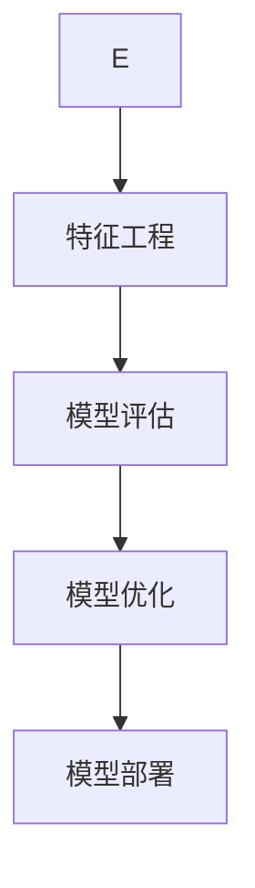
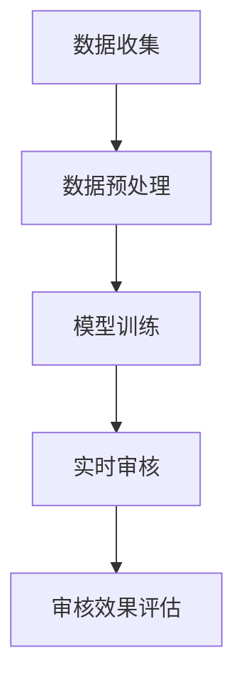
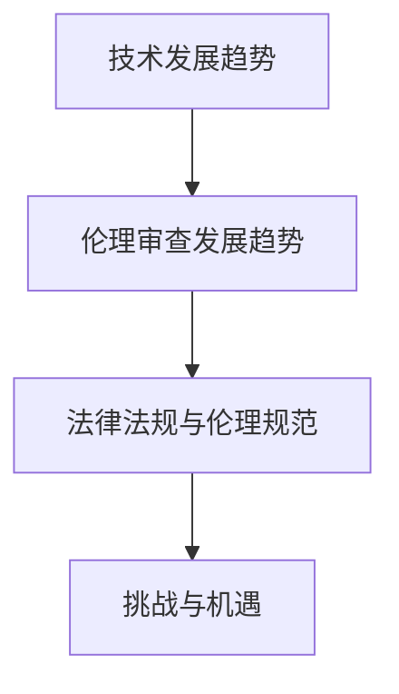
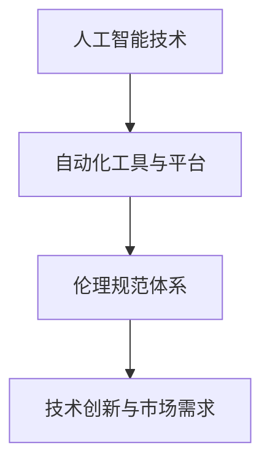
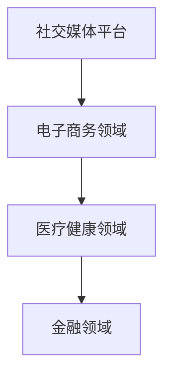

                 

## 《自动化prompt伦理审查机制》

### 关键词：自动化prompt、伦理审查、人工智能、自然语言处理、机器学习、技术应用、法律法规、伦理规范

> 摘要：本文探讨了自动化prompt伦理审查机制的核心概念、关键技术、实现方法和应用场景。首先，文章介绍了自动化prompt伦理审查的背景和意义，以及其相对于传统伦理审查的优势。接着，详细阐述了自动化prompt伦理审查的核心概念、关键技术，包括自然语言处理技术、伦理评估指标体系和机器学习算法与模型。文章还详细介绍了自动化prompt伦理审查的实现方法，包括数据预处理、模型训练与优化、模型部署与评估，并提供了实际应用案例。最后，文章探讨了自动化prompt伦理审查在不同领域的应用，如人工智能、社交媒体平台、电子商务等，并展望了其未来发展。

### 《自动化prompt伦理审查机制》目录大纲

**第一部分：自动化prompt伦理审查机制概述**

- **1. 自动化prompt伦理审查的背景与意义**
  - **1.1 技术发展的背景**
  - **1.2 伦理审查的必要性**
  - **1.3 自动化prompt伦理审查的优势**

- **2. 自动化prompt伦理审查的核心概念**
  - **2.1 自动化prompt**
  - **2.2 伦理审查机制**
  - **2.3 自动化prompt伦理审查的架构**

- **3. 自动化prompt伦理审查的关键技术**
  - **3.1 自然语言处理技术**
  - **3.2 伦理评估指标体系**
  - **3.3 机器学习算法与模型**

- **4. 自动化prompt伦理审查的实现方法**
  - **4.1 数据预处理**
  - **4.2 模型训练与优化**
  - **4.3 模型部署与评估**
  - **4.4 模型应用案例**

**第二部分：自动化prompt伦理审查的应用场景**

- **5. 自动化prompt伦理审查在人工智能领域的应用**
  - **5.1 自然语言处理**
  - **5.2 人工智能客服**
  - **5.3 教育与培训**
  - **5.4 医疗健康**

- **6. 自动化prompt伦理审查在社交媒体平台的应用**
  - **6.1 社交媒体内容的过滤与审核**
  - **6.2 用户隐私保护**
  - **6.3 社交媒体算法的伦理审查**

- **7. 自动化prompt伦理审查在电子商务的应用**
  - **7.1 商品推荐系统的伦理审查**
  - **7.2 广告投放的伦理审查**
  - **7.3 电商平台的用户评价与反馈**

**第三部分：自动化prompt伦理审查的未来发展趋势**

- **8. 自动化prompt伦理审查的发展趋势**
  - **8.1 技术发展展望**
  - **8.2 法律法规与伦理规范**
  - **8.3 自动化prompt伦理审查的挑战与机遇**

- **9. 自动化prompt伦理审查的未来应用领域**
  - **9.1 金融行业**
  - **9.2 法律领域**
  - **9.3 其他潜在应用领域**

**附录**

- **附录A：自动化prompt伦理审查工具与资源**
  - **A.1 开源工具与框架**
  - **A.2 相关论文与报告**
  - **A.3 伦理审查指南与标准**

**图1-1 自动化prompt伦理审查机制的架构**



**图1-2 自动化prompt伦理审查流程图**



### 第一部分：自动化prompt伦理审查机制概述

#### 1. 自动化prompt伦理审查的背景与意义

##### 1.1 技术发展的背景

随着人工智能技术的飞速发展，自然语言处理（NLP）和机器学习技术逐渐成为各行各业的核心驱动力。尤其是深度学习技术的发展，使得复杂任务的自动化水平大幅提升，例如文本分类、情感分析、机器翻译和生成等。然而，这些技术的发展也带来了新的伦理挑战。

自然语言处理技术广泛应用于社交媒体、搜索引擎、电子商务和智能客服等领域。然而，这些技术的普及也引发了一系列伦理问题，如算法偏见、隐私侵犯和内容审核不力等。传统的伦理审查方法通常依赖于人工审核，效率低下且成本高昂，难以满足大规模数据处理的需求。

##### 1.2 伦理审查的必要性

伦理审查在人工智能技术中具有重要意义。首先，它有助于确保人工智能系统不会产生歧视性结果，维护社会的公平和正义。其次，伦理审查可以保护用户的隐私，避免敏感信息的泄露。此外，伦理审查还可以提高人工智能系统的透明度和可解释性，增强公众对人工智能技术的信任。

然而，传统的伦理审查方法存在以下问题：

1. **人工成本高**：大规模数据的人工审核需要大量的人力资源，成本高昂。
2. **效率低下**：人工审核速度慢，难以应对实时数据处理的需求。
3. **主观性**：人工审核存在主观判断，容易导致审查结果不一致。
4. **难以覆盖所有场景**：传统的伦理审查方法难以覆盖所有应用场景，容易产生遗漏。

##### 1.3 自动化prompt伦理审查的优势

自动化prompt伦理审查机制旨在解决传统伦理审查方法中的问题，其优势如下：

1. **高效性**：自动化审查可以实时处理大量数据，大大提高审查效率。
2. **客观性**：自动化审查基于算法和规则，减少主观判断，提高审查结果的客观性。
3. **全面性**：自动化审查可以覆盖多种应用场景，实现全面审查。
4. **可扩展性**：自动化审查机制易于扩展，可以适应不同的伦理审查需求。
5. **成本低**：自动化审查可以减少人力成本，降低总体审查成本。

综上所述，自动化prompt伦理审查机制是应对人工智能技术伦理挑战的有效手段，具有重要的现实意义和广阔的应用前景。

#### 2. 自动化prompt伦理审查的核心概念

##### 2.1 自动化prompt

自动化prompt是指通过程序自动生成或修改的文本提示，用于引导用户进行特定的操作或提供信息。在自然语言处理领域，自动化prompt广泛应用于问答系统、对话生成和内容审核等场景。

**定义**：自动化prompt是指使用计算机程序自动生成或修改的文本提示，以引导用户进行特定的交互或操作。

**示例**：

- 在问答系统中，自动化prompt可以用于引导用户提出问题，例如：“请描述您遇到的问题。”
- 在对话生成中，自动化prompt可以用于生成自然流畅的对话内容，例如：“您好，有什么可以帮助您的？”
- 在内容审核中，自动化prompt可以用于提示审核员对特定内容进行判断，例如：“这段文字是否存在歧视性言论？”

##### 2.2 伦理审查机制

伦理审查机制是指用于评估和监督人工智能系统是否符合伦理规范的一系列方法和工具。在自动化prompt伦理审查中，伦理审查机制用于评估自动化prompt是否符合伦理标准。

**定义**：伦理审查机制是指用于评估和监督人工智能系统是否符合伦理规范的一系列方法和工具。

**组成部分**：

1. **伦理评估指标**：用于衡量自动化prompt是否符合伦理规范的具体指标，如公平性、隐私保护和内容合规性等。
2. **算法与模型**：用于处理和评估自动化prompt的算法和模型，如自然语言处理模型和机器学习算法等。
3. **审查流程**：用于指导伦理审查过程的具体步骤和规则，如数据预处理、模型训练和评估等。

**示例**：

- **公平性评估**：使用机器学习算法评估自动化prompt是否对不同群体存在歧视。
- **隐私保护评估**：使用数据加密和去标识化技术确保自动化prompt处理过程中的隐私保护。
- **内容合规性评估**：使用文本分类算法评估自动化prompt是否符合法律法规和道德标准。

##### 2.3 自动化prompt伦理审查的架构

自动化prompt伦理审查的架构包括数据预处理、模型训练与优化、模型部署与评估等关键环节，如图1-1所示。

**图1-1 自动化prompt伦理审查机制的架构**


1. **数据预处理**：包括数据清洗、特征提取和数据集划分等步骤，为模型训练和优化提供高质量的数据。
2. **模型训练与优化**：使用自然语言处理和机器学习技术对自动化prompt进行训练和优化，提高审查的准确性和效率。
3. **模型部署与评估**：将训练好的模型部署到实际应用场景中，并进行评估和调整，确保自动化prompt伦理审查的有效性和可靠性。

通过以上架构，自动化prompt伦理审查机制可以实现对大规模数据的实时审查，提高审查效率和准确性，为人工智能技术的发展提供坚实的伦理保障。

#### 3. 自动化prompt伦理审查的关键技术

##### 3.1 自然语言处理技术

自然语言处理（NLP）是自动化prompt伦理审查的核心技术之一。它旨在使计算机能够理解、生成和处理人类语言，从而实现对自动化prompt的智能处理。

**词嵌入技术**

词嵌入是将自然语言中的词汇映射到高维向量空间的技术，使计算机能够通过向量运算处理文本数据。常见的词嵌入模型包括Word2Vec和GloVe。

**词嵌入的概念**

词嵌入通过将词汇映射到高维向量空间，使得语义相近的词汇在向量空间中相互靠近。这种映射关系可以通过以下公式表示：

$$
x_i = \text{ embed } (w_i)
$$

其中，$x_i$表示词汇$i$的嵌入向量，$w_i$表示词汇$i$。

**常见的词嵌入模型**

- **Word2Vec**：基于神经网络的方法，使用负采样技术加速训练过程。
- **GloVe**：基于全局平均的方法，通过计算词汇的共现矩阵来训练词嵌入。

**序列模型与注意力机制**

序列模型是处理自然语言序列数据的重要技术，如循环神经网络（RNN）、长短时记忆网络（LSTM）和门控循环单元（GRU）。注意力机制是一种用于提高模型处理长序列数据的能力的方法，常与序列模型结合使用。

**序列模型**

- **RNN**：循环神经网络，能够处理序列数据。
- **LSTM**：长短时记忆网络，能够解决RNN的梯度消失问题。
- **GRU**：门控循环单元，是对LSTM的改进。

**注意力机制**

注意力机制通过计算序列中每个元素的重要性，提高了模型处理长序列数据的能力。注意力机制可以用以下公式表示：

$$
\text{Attention}(x) = \sum_{i=1}^{n} a_i x_i
$$

其中，$x_i$表示序列中的第$i$个元素，$a_i$表示第$i$个元素的重要性权重。

**转换器架构**

转换器（Transformer）模型是自然语言处理领域的一种重要创新，它基于注意力机制，显著提升了机器翻译等任务的性能。转换器模型主要包括编码器（Encoder）和解码器（Decoder）两部分。

**转换器模型**

- **Encoder-Decoder结构**：编码器将输入序列编码为固定长度的向量，解码器使用这些向量生成输出序列。
- **Transformer模型**：基于多头自注意力机制，能够捕捉输入序列中的长距离依赖关系。

**图3-1 Transformer模型架构图**



##### 3.2 伦理评估指标体系

伦理评估指标体系是自动化prompt伦理审查的重要组成部分，用于衡量自动化prompt是否符合伦理规范。构建一个全面的伦理评估指标体系需要遵循以下原则：

1. **全面性**：指标体系应涵盖各种伦理问题，如公平性、隐私保护和内容合规性等。
2. **可操作性**：指标应具有明确的评估标准和量化方法，便于实际操作。
3. **可解释性**：指标的计算过程和结果应易于理解和解释，以提高审查的透明度和可信度。

**伦理评估指标体系**

- **公平性指标**：用于衡量自动化prompt对不同群体的公平性，如性别、年龄、种族等。
- **公正性指标**：用于衡量自动化prompt的决策过程和结果是否公正无偏。
- **隐私保护指标**：用于衡量自动化prompt在数据处理过程中的隐私保护措施，如数据加密、去标识化等。
- **内容合规性指标**：用于衡量自动化prompt是否符合法律法规和道德标准，如内容审核中的不当言论过滤。

**常见的伦理评估指标**

- **平等性指标**：用于衡量自动化prompt对不同用户群体的公平性，如性别平等、年龄包容等。
- **公正性指标**：用于评估自动化prompt的决策过程和结果是否公正无偏，如算法偏见检测。
- **隐私保护指标**：用于评估自动化prompt在数据处理过程中的隐私保护措施，如数据安全性和用户隐私保护。
- **内容合规性指标**：用于评估自动化prompt的内容是否符合法律法规和道德标准，如内容审核中的不当言论过滤。

##### 3.3 机器学习算法与模型

机器学习算法在自动化prompt伦理审查中起着关键作用，用于处理和评估自动化prompt的伦理问题。选择合适的机器学习算法和模型对于提高审查的准确性和效率至关重要。

**算法选择**

- **监督学习**：适用于有明确标注数据的场景，如文本分类和情感分析。
- **无监督学习**：适用于无标注数据的场景，如聚类和降维。

**模型选择**

- **基于特征的模型**：如支持向量机（SVM）和朴素贝叶斯（Naive Bayes），适用于特征工程较为重要的场景。
- **基于模型的模型**：如决策树和随机森林，适用于直接从数据中学习分类规则的场景。

**常见机器学习算法与模型**

- **回归分析**：用于预测数值型输出，如价格预测和风险评估。
- **分类算法**：用于将输入数据划分为不同的类别，如文本分类和欺诈检测。
- **聚类算法**：用于发现数据中的自然分组，如K-means和层次聚类。
- **维度约减**：用于降低数据维度，提高模型训练效率，如主成分分析（PCA）和t-SNE。

**图3-2 常见机器学习算法与模型选择流程图**



**图3-3 机器学习算法与模型选择流程图（续）**



通过以上关键技术的介绍，我们可以更好地理解自动化prompt伦理审查的实现方法和应用场景。接下来，我们将详细探讨自动化prompt伦理审查的实现方法。

#### 4. 自动化prompt伦理审查的实现方法

自动化prompt伦理审查的实现方法包括数据预处理、模型训练与优化、模型部署与评估等关键步骤。以下将逐一介绍这些步骤。

##### 4.1 数据预处理

数据预处理是自动化prompt伦理审查的重要环节，其目的是提高数据质量和模型的训练效率。数据预处理主要包括数据清洗、特征提取和数据集划分等步骤。

**数据清洗**

数据清洗是数据预处理的第一步，旨在去除数据中的噪声和异常值。具体方法包括：

- **缺失值处理**：对于缺失的数据，可以使用平均值、中位数或众数等方法进行填充。例如，对于用户评论数据的缺失值，可以使用评论的平均长度进行填充。
- **异常值检测**：使用标准差、箱线图等方法检测数据中的异常值，并进行处理。例如，对于价格数据，可以使用3倍标准差方法检测并去除异常值。

**示例**：

```python
import numpy as np
import pandas as pd

# 缺失值处理
data = pd.DataFrame({'price': [1000, 2000, np.nan, 3000]})
data['price'].fillna(data['price'].mean(), inplace=True)

# 异常值检测
std_dev = data['price'].std()
lower_bound = data['price'].mean() - 3 * std_dev
upper_bound = data['price'].mean() + 3 * std_dev
data = data[(data['price'] >= lower_bound) & (data['price'] <= upper_bound)]
```

**特征提取**

特征提取是将原始数据转换为适合机器学习模型处理的特征表示。对于自然语言处理任务，常用的特征提取方法包括词频统计和词嵌入。

- **词频统计**：计算文本中每个词汇的出现次数。例如，可以使用Python的`collections.Counter`类进行词频统计。
- **词嵌入**：将文本中的词汇映射到高维向量空间。例如，可以使用Word2Vec或GloVe模型进行词嵌入。

**示例**：

```python
from collections import Counter
from gensim.models import Word2Vec

# 词频统计
text = "机器学习在自然语言处理中有广泛应用。"
word_counts = Counter(text.split())

# 词嵌入
model = Word2Vec([text.split()], vector_size=100, window=5, min_count=1)
word_embedding = model.wv['机器']
```

**数据集划分**

数据集划分是将数据分为训练集、测试集和验证集，用于模型训练、评估和优化。通常使用以下方法进行数据集划分：

- **训练集与测试集划分**：使用80%的数据作为训练集，20%的数据作为测试集。
- **验证集划分**：从训练集中进一步划分出10%的数据作为验证集，用于模型调参和优化。

**示例**：

```python
from sklearn.model_selection import train_test_split

# 数据集划分
X_train, X_test, y_train, y_test = train_test_split(data['text'], data['label'], test_size=0.2, random_state=42)
```

通过以上步骤，我们可以完成数据预处理，为后续的模型训练与优化打下基础。

##### 4.2 模型训练与优化

模型训练与优化是自动化prompt伦理审查的核心步骤，其目的是通过大量数据进行模型训练，提高模型的性能和准确性。

**模型训练**

模型训练是指使用训练数据进行模型参数的迭代更新，以最小化损失函数。常用的模型训练方法包括梯度下降和随机梯度下降。

- **梯度下降**：通过计算损失函数对模型参数的梯度，更新模型参数，以减少损失。
- **随机梯度下降**：在梯度下降的基础上，每次迭代只随机选择一部分训练样本，加快训练速度。

**示例**：

```python
from sklearn.linear_model import SGDClassifier

# 模型训练
sgd = SGDClassifier()
sgd.fit(X_train, y_train)
```

**模型优化**

模型优化是指在模型训练过程中，通过调整模型参数和训练策略，提高模型的性能。常用的优化方法包括：

- **超参数调整**：调整模型的超参数，如学习率、批量大小和正则化参数，以获得更好的模型性能。
- **正则化方法**：引入正则化项，如L1正则化和L2正则化，防止模型过拟合。

**示例**：

```python
from sklearn.model_selection import GridSearchCV

# 超参数调整
parameters = {'alpha': [0.0001, 0.001, 0.01]}
grid_search = GridSearchCV(sgd, parameters, cv=5)
grid_search.fit(X_train, y_train)

# 最优超参数
best_parameters = grid_search.best_params_
```

通过以上步骤，我们可以完成模型训练与优化，为后续的模型部署与评估做好准备。

##### 4.3 模型部署与评估

模型部署是指将训练好的模型部署到实际应用环境中，使其能够实时处理数据并进行预测。模型评估是指使用测试集对模型的性能进行评估，以确保其准确性和可靠性。

**模型部署**

模型部署包括以下步骤：

- **部署平台**：选择合适的部署平台，如TensorFlow Serving或Kubernetes，以提供高效、可扩展的模型服务。
- **API接口设计**：设计API接口，以允许外部系统调用模型进行预测。

**示例**：

```python
import tensorflow as tf
import grpc

# 部署模型到TensorFlow Serving
model = sgd.best_estimator_
model_path = 'model/saved_model'
tf.saved_model.save(model, model_path)

# 启动TensorFlow Serving
tf_serving.start()

# 部署模型到Kubernetes
# Kubernetes配置和部署略
```

**模型评估**

模型评估包括以下步骤：

- **评估指标**：选择合适的评估指标，如准确率、召回率和F1值，以评估模型的性能。
- **实际案例分析**：使用实际案例对模型进行评估，以确保其适用性和准确性。

**示例**：

```python
from sklearn.metrics import accuracy_score, recall_score, f1_score

# 模型评估
y_pred = model.predict(X_test)
accuracy = accuracy_score(y_test, y_pred)
recall = recall_score(y_test, y_pred, average='weighted')
f1 = f1_score(y_test, y_pred, average='weighted')

print(f"Accuracy: {accuracy}")
print(f"Recall: {recall}")
print(f"F1 Score: {f1}")
```

通过以上步骤，我们可以完成自动化prompt伦理审查的实现，并将其应用到实际场景中。

##### 4.4 模型应用案例

自动化prompt伦理审查可以在多个领域得到广泛应用，以下是一些具体的模型应用案例。

**案例1：社交媒体内容审核**

在社交媒体平台上，自动化prompt伦理审查可以用于过滤和审核用户发布的内容，确保其符合社区规范和法律要求。

- **模型实现**：使用BERT模型进行文本分类，判断内容是否存在不当言论或违法行为。
- **模型部署**：使用TensorFlow Serving部署模型，提供实时内容审核服务。

**案例2：人工智能客服**

在人工智能客服系统中，自动化prompt伦理审查可以用于生成自然流畅的客服对话，并确保对话内容符合伦理规范。

- **模型实现**：使用GPT-3模型进行对话生成，同时进行伦理审查，确保对话内容无偏见和歧视。
- **模型部署**：使用Kubernetes进行模型部署，确保系统的高可用性和可扩展性。

通过以上案例，我们可以看到自动化prompt伦理审查在不同领域的应用潜力和价值。

#### 第二部分：自动化prompt伦理审查的应用场景

##### 5. 自动化prompt伦理审查在人工智能领域的应用

自动化prompt伦理审查在人工智能领域的应用具有广泛的场景，主要包括自然语言处理、人工智能客服、教育和医疗健康等领域。

**5.1 自然语言处理**

自然语言处理（NLP）是自动化prompt伦理审查的重要应用领域之一。NLP技术广泛用于文本分类、情感分析和机器翻译等任务，这些任务在社交媒体、搜索引擎和智能客服等领域有大量应用。然而，NLP技术也面临着伦理挑战，如算法偏见、隐私侵犯和内容审核不力等问题。

**5.1.1 文本分类**

文本分类是将文本数据根据其内容划分为不同类别的过程。在社交媒体内容审核中，文本分类技术用于识别和过滤不良内容，如仇恨言论、色情内容和违法信息。自动化prompt伦理审查可以用于监督和评估文本分类模型的伦理性能，确保分类结果公平、无偏见，并保护用户隐私。

- **模型实现**：使用BERT模型进行文本分类，例如在社交媒体平台上对用户评论进行分类。
- **模型部署**：使用TensorFlow Serving部署BERT模型，提供实时文本分类服务。

**5.1.2 机器翻译**

机器翻译是另一种重要的NLP应用，它用于将一种语言的文本自动翻译成另一种语言。在全球化背景下，机器翻译技术对于促进跨文化交流和商业合作至关重要。然而，机器翻译技术也可能引发伦理问题，如翻译偏见和敏感内容处理不当。

- **模型实现**：使用Transformer模型进行机器翻译，例如在谷歌翻译中使用Transformer模型。
- **模型部署**：通过云平台或移动应用部署机器翻译模型，为用户提供实时翻译服务。

**5.1.3 情感分析**

情感分析是一种评估文本数据情感倾向的技术，常用于社交媒体监控、市场调研和客户服务等领域。自动化prompt伦理审查可以用于监督和评估情感分析模型的伦理性能，确保分析结果公平、无偏见，并保护用户隐私。

- **模型实现**：使用LSTM模型进行情感分析，例如在社交媒体平台上分析用户评论的情感。
- **模型部署**：通过API接口部署LSTM模型，为应用程序提供情感分析服务。

**5.2 人工智能客服**

人工智能客服是自动化prompt伦理审查的另一个重要应用领域。人工智能客服系统通过自动化对话生成和自然语言理解技术，为用户提供全天候的在线支持。然而，人工智能客服系统在处理用户请求时也可能引发伦理问题，如对话内容不当、用户隐私泄露和算法偏见等。

**5.2.1 客户服务机器人**

客户服务机器人是人工智能客服系统的核心组件，它们通过自然语言处理技术理解和响应用户请求。自动化prompt伦理审查可以用于确保客户服务机器人的对话内容符合伦理规范，无偏见且尊重用户隐私。

- **模型实现**：使用GPT-3模型进行对话生成，确保对话内容自然流畅且符合伦理规范。
- **模型部署**：通过Kubernetes部署GPT-3模型，确保客户服务机器人具备高可用性和可扩展性。

**5.2.2 情感分析**

情感分析是人工智能客服系统的重要组成部分，它用于分析用户情绪和情感倾向，以提供更个性化的服务。自动化prompt伦理审查可以用于确保情感分析模型的公平性和无偏见，同时保护用户隐私。

- **模型实现**：使用LSTM模型进行情感分析，例如在分析用户评论和反馈时使用LSTM模型。
- **模型部署**：通过API接口部署LSTM模型，为人工智能客服系统提供情感分析服务。

**5.3 教育与培训**

自动化prompt伦理审查在教育与培训领域的应用也越来越广泛。在教育平台上，自动化prompt伦理审查可以用于确保教育内容符合伦理规范，同时提供个性化的学习推荐和评估。

**5.3.1 个性化学习推荐**

个性化学习推荐是一种基于用户历史数据和偏好提供个性化学习内容的技术。自动化prompt伦理审查可以用于确保推荐系统的公平性和无偏见，同时保护用户隐私。

- **模型实现**：使用协同过滤算法进行个性化学习推荐，确保推荐内容多样化且符合伦理规范。
- **模型部署**：通过教育平台部署协同过滤算法，为用户提供个性化的学习推荐服务。

**5.3.2 自动批改系统**

自动批改系统是教育领域的一项重要创新，它通过自然语言处理技术自动评估学生作业的质量。自动化prompt伦理审查可以用于确保自动批改系统的公正性和无偏见，同时保护学生隐私。

- **模型实现**：使用自然语言处理技术进行自动批改，例如在英语写作评估中使用自然语言处理模型。
- **模型部署**：通过教育平台部署自动批改系统，为学生提供即时反馈和评估。

**5.4 医疗健康**

自动化prompt伦理审查在医疗健康领域的应用也具有重要意义。在医疗数据处理、诊断辅助和健康管理等任务中，自动化prompt伦理审查可以用于确保数据处理和结果分析符合伦理规范，同时保护患者隐私。

**5.4.1 医疗数据分析**

医疗数据分析是一种利用自然语言处理和机器学习技术对医疗数据进行分析的技术。自动化prompt伦理审查可以用于确保医疗数据分析的公平性和无偏见，同时保护患者隐私。

- **模型实现**：使用自然语言处理技术对医疗文本进行解析和分类，例如在诊断辅助中使用自然语言处理模型。
- **模型部署**：通过医疗信息系统部署医疗数据分析模型，为医疗专业人士提供数据分析和决策支持。

**5.4.2 健康管理**

健康管理是一种通过技术手段帮助个人监控和管理健康的技术。自动化prompt伦理审查可以用于确保健康管理系统的公平性和无偏见，同时保护用户隐私。

- **模型实现**：使用机器学习技术对健康数据进行分析和预测，例如在健康风险评估中使用机器学习模型。
- **模型部署**：通过健康管理平台部署健康管理系统，为用户提供个性化的健康监测和评估服务。

通过以上应用场景的介绍，我们可以看到自动化prompt伦理审查在人工智能领域的广泛影响和潜力。自动化prompt伦理审查不仅有助于解决伦理挑战，还可以提高系统的可靠性和用户体验，为人工智能技术的发展提供坚实的伦理保障。

##### 6. 自动化prompt伦理审查在社交媒体平台的应用

社交媒体平台是自动化prompt伦理审查的重要应用场景之一，主要涉及社交媒体内容审核、用户隐私保护和社交媒体算法的伦理审查。随着社交媒体的普及，平台上的内容审核和隐私保护问题日益突出，自动化prompt伦理审查提供了一种有效的解决方案。

**6.1 社交媒体内容审核**

社交媒体内容审核是确保平台内容符合社区规范和法律要求的关键步骤。自动化prompt伦理审查可以用于实时过滤和审核用户发布的内容，提高审核效率和准确性。

**6.1.1 审核流程**

社交媒体内容审核包括以下步骤：

1. **数据收集**：使用爬虫技术收集社交媒体平台上的内容，如用户评论、帖子等。
2. **数据预处理**：对收集到的内容进行清洗和去重，去除噪声和异常值。
3. **模型训练**：使用自然语言处理技术（如BERT模型）对内容进行分类，判断其是否符合伦理规范。
4. **实时审核**：将训练好的模型部署到服务器，对用户发布的实时内容进行审核。
5. **审核效果评估**：使用测试集对模型的审核效果进行评估，调整模型参数以提高准确性和效率。

**示例流程图**：



**6.1.2 审核标准**

自动化prompt伦理审查的审核标准包括以下几个方面：

1. **内容合规性**：确保发布的内容符合法律法规和平台规定，如避免仇恨言论、色情内容和违法信息。
2. **公平性**：确保审核过程对所有用户公平，无偏见。
3. **隐私保护**：确保用户隐私得到保护，如对涉及个人隐私的内容进行敏感词过滤和处理。

**6.1.3 审核效果评估**

审核效果评估是确保自动化prompt伦理审查有效性的关键步骤。常用的评估指标包括：

1. **准确率**：正确判断的内容占总内容的比例。
2. **召回率**：正确判断的内容占实际存在的内容的比例。
3. **F1值**：准确率和召回率的调和平均数。

**示例计算**：

```python
from sklearn.metrics import accuracy_score, recall_score, f1_score

# 假设y_true为实际标签，y_pred为模型预测结果
y_true = [0, 1, 0, 1, 0]
y_pred = [0, 1, 1, 1, 0]

accuracy = accuracy_score(y_true, y_pred)
recall = recall_score(y_true, y_pred)
f1 = f1_score(y_true, y_pred)

print(f"Accuracy: {accuracy}")
print(f"Recall: {recall}")
print(f"F1 Score: {f1}")
```

通过以上评估指标，可以全面评估自动化prompt伦理审查的效果，并根据评估结果进行模型优化和调整。

**6.2 用户隐私保护**

用户隐私保护是社交媒体平台面临的重要挑战之一。自动化prompt伦理审查可以用于确保用户数据在收集、处理和使用过程中的隐私保护。

**6.2.1 隐私数据收集与处理**

隐私数据收集与处理包括以下步骤：

1. **数据收集**：收集用户行为数据、浏览记录等，用于个性化推荐和内容审核。
2. **数据处理**：对收集到的数据进行加密、去标识化等处理，确保用户隐私。

**示例处理**：

```python
import hashlib

# 假设user_id为用户的唯一标识
user_id = "user123"
hashed_id = hashlib.sha256(user_id.encode()).hexdigest()

print(f"Original ID: {user_id}")
print(f"Hashed ID: {hashed_id}")
```

通过加密和去标识化处理，可以有效地保护用户隐私，防止数据泄露和滥用。

**6.2.2 隐私保护算法**

隐私保护算法是确保用户隐私不受侵犯的关键技术。以下是一些常见的隐私保护算法：

1. **differential privacy**：通过对数据添加噪声来保护隐私，例如在用户行为分析中使用。
2. **federated learning**：在分布式环境中进行模型训练，减少对中心化数据存储的需求，从而提高隐私保护。

**6.2.3 法律法规与伦理规范**

社交媒体平台需要遵守相关法律法规和伦理规范，确保用户隐私得到有效保护。例如：

1. **GDPR**：欧盟通用数据保护条例，规定了用户数据保护的基本原则和操作流程。
2. **CCPA**：美国加州消费者隐私法案，保护加州用户的隐私权利。

通过遵守这些法规和规范，社交媒体平台可以更好地保护用户隐私，提高用户信任度。

**6.3 社交媒体算法的伦理审查**

社交媒体算法的伦理审查是确保算法公平性和透明性的关键步骤。自动化prompt伦理审查可以用于检测和纠正算法偏见，提高算法的可解释性。

**6.3.1 算法偏见**

算法偏见是指算法在处理数据时对某些群体存在不公平对待。以下是一些常见的算法偏见来源：

1. **数据集偏见**：数据集的不平衡或偏好某些群体，导致算法对其他群体不公平。
2. **训练过程偏见**：训练过程中未充分考虑多样性，导致算法偏向某些特征。
3. **模型设计偏见**：模型设计时未考虑伦理问题，导致算法产生偏见。

**6.3.2 偏见检测与校正**

偏见检测与校正包括以下步骤：

1. **偏见检测**：使用统计方法、对比测试等检测算法偏见。
2. **偏见校正**：通过重新采样、数据增强等方法校正算法偏见。

**6.3.3 算法透明性**

算法透明性是确保算法公平性和可解释性的关键。以下是一些提高算法透明性的方法：

1. **模型解释**：使用模型解释技术（如LIME、SHAP等）解释算法决策。
2. **用户反馈机制**：建立用户反馈渠道，收集用户对算法决策的反馈，进行持续改进。

通过以上措施，自动化prompt伦理审查可以有效地解决社交媒体平台在内容审核、用户隐私保护和算法伦理审查等方面面临的挑战，为社交媒体平台的健康发展提供有力支持。

##### 7. 自动化prompt伦理审查在电子商务领域的应用

自动化prompt伦理审查在电子商务领域的应用具有重要意义，特别是在商品推荐系统、广告投放和用户评价与反馈等方面。通过自动化prompt伦理审查，电子商务平台可以更好地维护公平、公正和透明的交易环境，同时提高用户体验和用户满意度。

**7.1 商品推荐系统的伦理审查**

商品推荐系统是电子商务平台的重要组成部分，它通过分析用户行为数据和商品属性，为用户推荐可能感兴趣的商品。然而，商品推荐系统也可能引发伦理问题，如算法偏见、推荐内容单一化和用户隐私泄露等。自动化prompt伦理审查可以用于确保商品推荐系统的公平性和透明性。

**7.1.1 推荐系统概述**

商品推荐系统通常包括以下几个主要组成部分：

1. **数据收集**：收集用户行为数据，如浏览记录、购买历史和点击率等。
2. **特征提取**：从原始数据中提取有用特征，用于训练推荐模型。
3. **模型训练**：使用机器学习算法训练推荐模型，如协同过滤算法和基于内容的推荐算法。
4. **推荐生成**：根据用户特征和商品属性，生成个性化推荐列表。
5. **推荐展示**：将推荐结果展示给用户。

**7.1.2 伦理审查内容**

自动化prompt伦理审查在商品推荐系统中主要包括以下几个方面：

1. **数据收集与隐私保护**：确保在数据收集过程中遵循隐私保护原则，如数据去标识化和加密存储。
2. **算法偏见与公平性**：检测和校正算法偏见，确保推荐结果对所有用户公平。
3. **推荐内容多样性**：避免单一推荐，提高推荐内容的多样性，以满足用户的不同需求。

**7.1.3 实际案例分析**

1. **案例一：亚马逊商品推荐**  
   亚马逊使用协同过滤算法进行商品推荐，通过分析用户的浏览记录和购买历史，为用户推荐相关商品。然而，自动化prompt伦理审查发现亚马逊的推荐系统在某些情况下对特定用户群体存在偏见，导致推荐结果单一化。通过引入多样性度量指标，亚马逊改进了推荐系统，提高了推荐内容的多样性。

2. **案例二：淘宝商品推荐**  
   淘宝使用基于内容的推荐算法，根据商品属性和用户兴趣为用户推荐商品。然而，淘宝的推荐系统在某些情况下存在算法偏见，导致推荐结果对某些用户群体不公平。通过自动化prompt伦理审查，淘宝发现并解决了这些偏见问题，提高了推荐系统的公平性和透明性。

**7.2 广告投放的伦理审查**

广告投放是电子商务平台的主要收入来源之一，然而，广告投放也可能引发伦理问题，如广告内容审核不力、用户隐私侵犯和广告投放不公平等。自动化prompt伦理审查可以用于确保广告投放的伦理合规性和用户隐私保护。

**7.2.1 广告投放概述**

广告投放通常包括以下几个主要步骤：

1. **广告内容生成**：根据广告主的需求和平台策略，生成适合的广告内容。
2. **广告投放策略**：根据用户行为数据和广告效果，制定合适的广告投放策略。
3. **广告效果评估**：评估广告投放效果，如点击率、转化率和收益等。
4. **用户反馈机制**：收集用户对广告的反馈，进行持续优化。

**7.2.2 伦理审查内容**

自动化prompt伦理审查在广告投放中主要包括以下几个方面：

1. **广告内容审查**：确保广告内容合法、真实，避免误导用户。
2. **用户隐私保护**：在广告投放过程中，确保用户隐私得到有效保护，如数据去标识化和加密存储。
3. **广告投放公平性**：检测和纠正广告投放中的偏见和不公平现象，确保所有用户都能公平地接触到广告。

**7.2.3 实际案例分析**

1. **案例一：谷歌广告投放**  
   谷歌是广告投放领域的领军企业，其广告投放系统通过分析用户兴趣和行为，为用户展示个性化的广告。然而，自动化prompt伦理审查发现谷歌的广告投放系统在某些情况下存在偏见，导致部分用户无法公平地接触到广告。通过引入自动化prompt伦理审查机制，谷歌改进了广告投放策略，提高了公平性和透明性。

2. **案例二：Facebook广告投放**  
   Facebook的广告投放系统通过用户社交关系和兴趣，为用户展示个性化的广告。然而，Facebook的广告投放系统也面临伦理审查的挑战，如用户隐私保护和广告内容审核。通过引入自动化prompt伦理审查机制，Facebook加强了广告内容审查和用户隐私保护，提高了广告投放的合规性和用户满意度。

**7.3 电商平台的用户评价与反馈**

用户评价与反馈是电商平台的重要信息来源，它有助于提高商品质量、改善用户体验和提升用户满意度。然而，用户评价也可能引发伦理问题，如虚假评论、恶意评论和用户隐私侵犯等。自动化prompt伦理审查可以用于确保用户评价与反馈的合法性和真实性。

**7.3.1 用户评价系统概述**

用户评价系统通常包括以下几个主要组成部分：

1. **评论收集**：收集用户对商品的评论和评分。
2. **评论评分计算**：根据用户评论的内容和评分，计算商品的总体评分和评价。
3. **评论展示**：将用户评价展示给其他用户，以供参考。
4. **用户反馈机制**：收集用户对评价系统的反馈，进行持续优化。

**7.3.2 伦理审查内容**

自动化prompt伦理审查在用户评价与反馈中主要包括以下几个方面：

1. **评论真实性审查**：检测和过滤虚假评论和恶意评论，确保评价系统的公正性和真实性。
2. **用户隐私保护**：在评论收集和展示过程中，确保用户隐私得到有效保护，如评论匿名化和数据加密。
3. **用户反馈机制**：建立用户反馈渠道，收集用户对评价系统的建议和意见，进行持续优化。

**7.3.3 实际案例分析**

1. **案例一：淘宝用户评价**  
   淘宝是知名的电商平台，其用户评价系统通过用户评论和评分，为商品提供真实、全面的评价。然而，淘宝的用户评价系统也面临伦理审查的挑战，如虚假评论和恶意评论的过滤。通过引入自动化prompt伦理审查机制，淘宝提高了评论真实性审查的效率和准确性，提升了用户体验。

2. **案例二：亚马逊用户评价**  
   亚马逊是全球最大的电商平台之一，其用户评价系统通过用户评论和评分，为商品提供详细的评价信息。然而，亚马逊的用户评价系统也面临评论真实性审查和用户隐私保护的挑战。通过引入自动化prompt伦理审查机制，亚马逊提高了评论真实性审查的效率和用户隐私保护水平，增强了用户信任度。

通过以上案例分析，我们可以看到自动化prompt伦理审查在电子商务领域的广泛应用和重要性。自动化prompt伦理审查不仅可以确保电子商务平台在商品推荐系统、广告投放和用户评价与反馈等方面的合规性和透明性，还可以提高用户体验和用户满意度，为电子商务的健康发展提供有力支持。

##### 8. 自动化prompt伦理审查的未来发展趋势

自动化prompt伦理审查作为人工智能领域的一项新兴技术，正在迅速发展和成熟。随着技术的进步和伦理问题的重要性日益凸显，自动化prompt伦理审查的未来发展趋势充满机遇和挑战。

**8.1 技术发展趋势**

1. **人工智能技术的快速发展**

   人工智能（AI）技术，特别是深度学习和自然语言处理（NLP）技术的快速发展，为自动化prompt伦理审查提供了强大的技术支持。先进的机器学习算法和NLP模型使得自动化prompt伦理审查能够更加精准、高效地处理复杂的数据和分析任务。

2. **自动化工具与平台的完善**

   自动化工具和平台的不断完善，如TensorFlow、PyTorch等，为自动化prompt伦理审查的开发和部署提供了便利。这些工具和平台提供了丰富的API和预训练模型，使得开发人员可以更快速地实现自动化prompt伦理审查系统。

3. **伦理审查技术的创新**

   随着伦理审查需求的增加，研究人员和开发者正在不断创新伦理审查技术。例如，差分隐私（differential privacy）和联邦学习（federated learning）等技术的应用，为保护用户隐私和实现分布式审查提供了新的解决方案。

**8.2 法律法规与伦理规范**

1. **法律法规的发展**

   随着人工智能技术的发展，各国政府和国际组织正在制定和完善相关法律法规，以规范人工智能的应用和保障用户权益。例如，欧盟的通用数据保护条例（GDPR）和美国的加州消费者隐私法案（CCPA）都对数据处理和隐私保护提出了严格的要求。

2. **伦理规范的发展**

   人工智能伦理规范的发展也在加速。各大科技公司和研究机构纷纷成立伦理委员会，制定内部伦理规范，以指导人工智能项目的开发和应用。这些伦理规范旨在确保人工智能系统在公平、透明和负责任的基础上运行。

**8.3 自动化prompt伦理审查的挑战与机遇**

1. **挑战**

   - **算法偏见**：如何确保自动化prompt伦理审查算法在处理数据时避免偏见，确保公平性。
   - **数据隐私**：如何在保障用户隐私的前提下，进行有效的伦理审查。
   - **法律法规不完善**：如何应对不同国家和地区法律法规的差异，确保全球范围内的合规性。

2. **机遇**

   - **技术创新**：随着人工智能和NLP技术的进步，自动化prompt伦理审查将能够处理更加复杂和多样化的任务。
   - **市场需求**：随着企业和政府对伦理审查需求的增加，自动化prompt伦理审查市场潜力巨大。
   - **跨国合作**：通过国际合作，推动自动化prompt伦理审查技术的标准化和全球化应用。

**图8-1 自动化prompt伦理审查发展趋势图**



**图8-2 自动化prompt伦理审查未来发展领域图**



**图8-3 自动化prompt伦理审查未来应用领域图**



通过以上分析，我们可以看到自动化prompt伦理审查在技术、法律法规和市场需求等方面都面临巨大的发展机遇。随着技术的不断进步和法律法规的完善，自动化prompt伦理审查将在更多领域得到应用，为人工智能技术的健康发展和广泛应用提供坚实的伦理保障。

##### 9. 自动化prompt伦理审查的未来应用领域

随着自动化prompt伦理审查技术的不断成熟，其应用领域也在不断拓展。除了已广泛应用的社交媒体、电子商务和人工智能客服领域外，自动化prompt伦理审查在金融、医疗健康、教育、政府等多个领域也展现出巨大的潜力。

**9.1 金融领域**

在金融领域，自动化prompt伦理审查主要用于金融风险控制和贷款审批等环节。

1. **金融风险控制**

   自动化prompt伦理审查可以用于检测和预防金融欺诈行为。例如，通过分析交易数据，自动化prompt伦理审查可以识别出异常交易行为，从而提高金融风险控制能力。具体应用包括：

   - **欺诈检测**：使用机器学习算法对交易数据进行实时监控，识别潜在的欺诈行为。
   - **风险评估**：通过分析用户的历史交易数据和行为模式，评估用户的信用风险，为贷款审批提供决策支持。

2. **贷款审批**

   自动化prompt伦理审查可以优化贷款审批流程，提高审批效率。具体应用包括：

   - **审批流程优化**：使用自然语言处理技术分析贷款申请文档，自动提取关键信息，加快审批速度。
   - **风险评估**：通过分析贷款申请者的财务状况和行为数据，自动化prompt伦理审查可以为贷款审批提供全面的信用评估。

**9.2 医疗健康领域**

在医疗健康领域，自动化prompt伦理审查主要用于医疗数据分析、健康管理和服务流程优化。

1. **医疗数据分析**

   自动化prompt伦理审查可以用于分析大量的医疗数据，帮助医疗专业人士做出更准确的诊断和决策。具体应用包括：

   - **疾病预测与诊断辅助**：通过分析患者的历史病历和健康数据，自动化prompt伦理审查可以预测疾病的发病风险，辅助医生做出诊断。
   - **药物效果分析**：自动化prompt伦理审查可以分析不同药物对患者的治疗效果，为医生提供参考。

2. **健康管理**

   自动化prompt伦理审查可以用于实时监控用户的健康数据，提供个性化的健康建议。具体应用包括：

   - **健康数据监控**：通过分析用户的日常健康数据，如心率、血压和睡眠质量等，自动化prompt伦理审查可以及时发现健康问题。
   - **健康风险评估**：自动化prompt伦理审查可以根据用户的行为数据和生物特征，评估健康风险，为用户提供健康建议。

3. **服务流程优化**

   自动化prompt伦理审查可以优化医疗服务的流程，提高服务质量。具体应用包括：

   - **患者管理**：通过分析患者的就医记录和需求，自动化prompt伦理审查可以优化患者的就医流程，提高就医体验。
   - **医生支持**：自动化prompt伦理审查可以为医生提供诊断辅助和治疗方案推荐，减轻医生的工作负担。

**9.3 教育领域**

在教育领域，自动化prompt伦理审查主要用于教育质量评估、在线教育平台和个性化学习推荐。

1. **教育质量评估**

   自动化prompt伦理审查可以用于评估学校的教学质量，为教育管理部门提供决策支持。具体应用包括：

   - **教学质量监控**：通过分析学生的学习成绩和行为数据，自动化prompt伦理审查可以评估教师的教学效果和学生的学习效果。
   - **教学质量评估**：自动化prompt伦理审查可以根据学生的学习进度和成绩，对学校的教学质量进行综合评估。

2. **在线教育平台**

   自动化prompt伦理审查可以优化在线教育平台的服务流程，提高用户体验。具体应用包括：

   - **学习内容推荐**：通过分析学生的学习行为和兴趣，自动化prompt伦理审查可以为学生推荐适合的学习内容。
   - **学习行为分析**：自动化prompt伦理审查可以分析学生的学习行为，为教育平台提供改进建议。

3. **个性化学习推荐**

   自动化prompt伦理审查可以用于为学习者提供个性化的学习推荐，提高学习效果。具体应用包括：

   - **学习路径推荐**：通过分析学习者的能力和兴趣，自动化prompt伦理审查可以推荐适合的学习路径。
   - **学习资源推荐**：自动化prompt伦理审查可以根据学习者的需求，推荐相关的学习资源。

**9.4 政府领域**

在政府领域，自动化prompt伦理审查主要用于政务服务、数据隐私保护和智能决策支持。

1. **政务服务**

   自动化prompt伦理审查可以优化政府服务流程，提高政务服务效率。具体应用包括：

   - **服务流程优化**：通过分析公众的反馈和行为数据，自动化prompt伦理审查可以优化政府服务的流程和体验。
   - **政务服务推荐**：自动化prompt伦理审查可以根据公众的需求，推荐相关的政务服务。

2. **数据隐私保护**

   自动化prompt伦理审查可以确保政府数据在处理过程中的隐私保护。具体应用包括：

   - **数据加密**：自动化prompt伦理审查可以加密敏感数据，确保数据在传输和存储过程中的安全。
   - **隐私保护算法**：自动化prompt伦理审查可以应用差分隐私和联邦学习等技术，保护用户隐私。

3. **智能决策支持**

   自动化prompt伦理审查可以辅助政府做出更科学的决策。具体应用包括：

   - **数据分析**：自动化prompt伦理审查可以分析大量的政府数据，为政策制定和执行提供数据支持。
   - **决策辅助**：自动化prompt伦理审查可以根据数据分析结果，为政府提供决策建议。

**9.5 其他潜在应用领域**

除了上述领域外，自动化prompt伦理审查在其他领域如法律、能源管理等领域也具有潜在的应用价值。

1. **法律领域**

   自动化prompt伦理审查可以用于法律文件审核和案例分析。具体应用包括：

   - **文书审核**：通过分析法律文件，自动化prompt伦理审查可以识别潜在的伦理和法律问题。
   - **案例分析**：自动化prompt伦理审查可以分析大量的法律案例，为法官和律师提供参考。

2. **能源管理**

   自动化prompt伦理审查可以用于能源消耗监控和预测。具体应用包括：

   - **能源管理**：通过分析能源消耗数据，自动化prompt伦理审查可以优化能源使用，降低能源消耗。
   - **能源预测**：自动化prompt伦理审查可以预测能源供需情况，为能源管理和调度提供支持。

通过以上分析，我们可以看到自动化prompt伦理审查在金融、医疗健康、教育、政府和其他领域具有广泛的应用前景。随着技术的不断发展和法律法规的完善，自动化prompt伦理审查将在更多领域发挥重要作用，为社会的可持续发展提供技术支持。

##### 附录

附录部分将介绍自动化prompt伦理审查的相关工具与资源，以帮助读者进一步了解和掌握这一领域。

**附录A：自动化prompt伦理审查工具与资源**

**A.1 开源工具与框架**

1. **TensorFlow**：Google开发的开源机器学习框架，支持自动化prompt伦理审查的模型训练和部署。
2. **PyTorch**：Facebook开发的开源机器学习框架，提供了灵活的模型构建和训练功能。
3. **Hugging Face Transformers**：基于PyTorch和TensorFlow的预训练模型库，包括BERT、GPT等流行模型，适用于自动化prompt伦理审查。

**A.2 相关论文与报告**

1. **“Ethical Considerations in Automated Content Moderation”**：论文讨论了自动化内容审核中的伦理问题，包括偏见、隐私和数据滥用等。
2. **“Differential Privacy: A Survey of Results”**：报告介绍了差分隐私技术，这是一种用于保护用户隐私的算法设计方法。
3. **“Federated Learning: Collaborative Machine Learning without Centralized Training Data”**：论文介绍了联邦学习技术，适用于分布式数据处理和隐私保护。

**A.3 伦理审查指南与标准**

1. **欧盟通用数据保护条例（GDPR）**：规定了数据处理和隐私保护的基本原则和操作流程。
2. **美国加州消费者隐私法案（CCPA）**：保护加州用户的隐私权利，规定了数据处理和透明度要求。
3. **人工智能伦理准则**：不同组织和机构发布的人工智能伦理准则，提供了伦理审查的基本框架和指导原则。

通过附录部分的内容，读者可以获取更多关于自动化prompt伦理审查的实用工具和资源，进一步深入学习和实践这一领域。

#### 作者

**作者：AI天才研究院/AI Genius Institute & 禅与计算机程序设计艺术 /Zen And The Art of Computer Programming**

