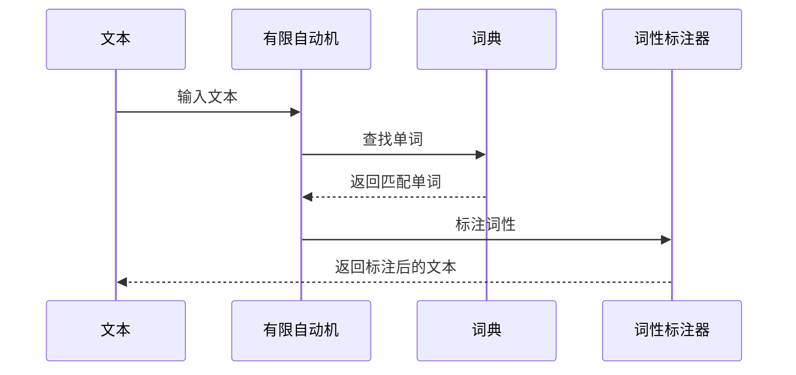
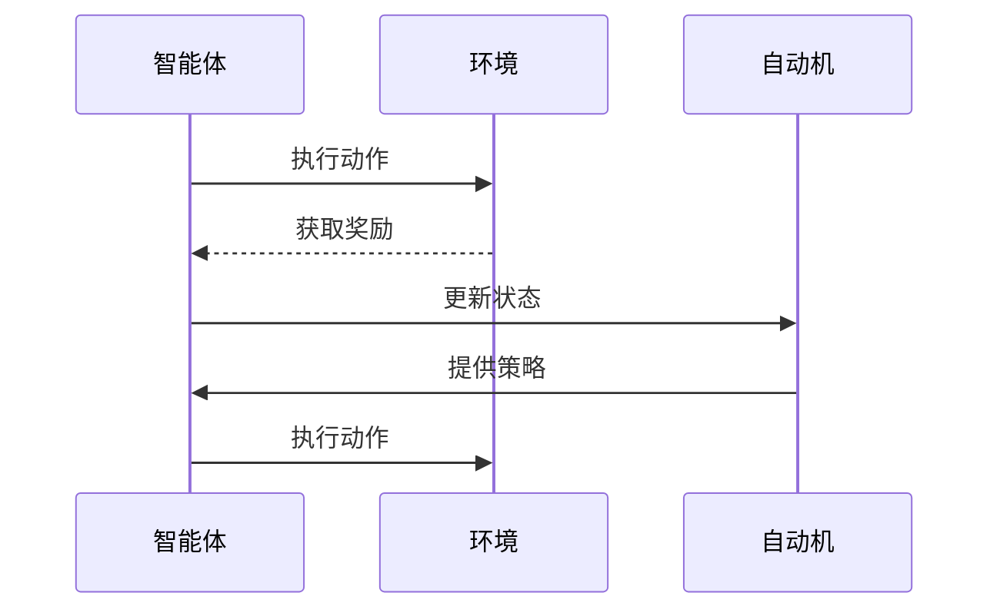
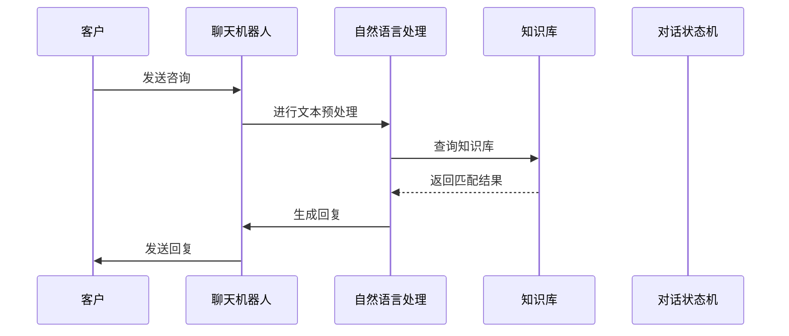
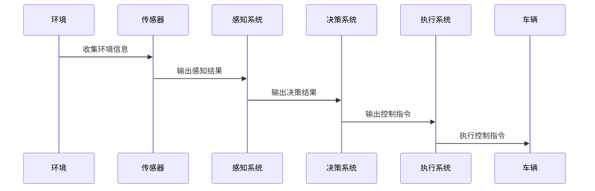
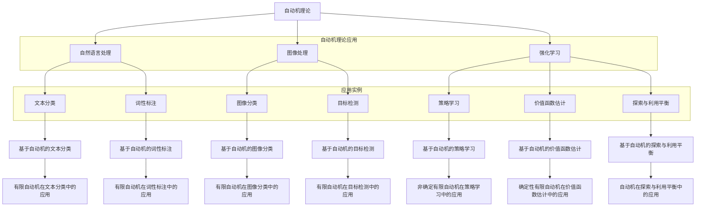
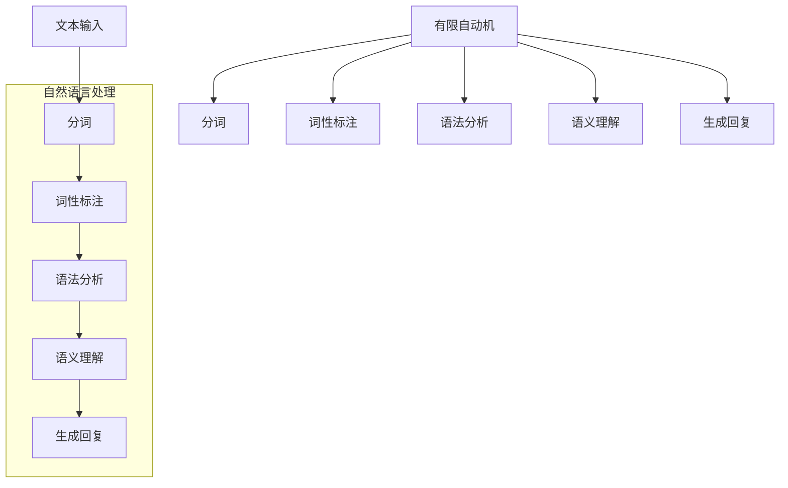
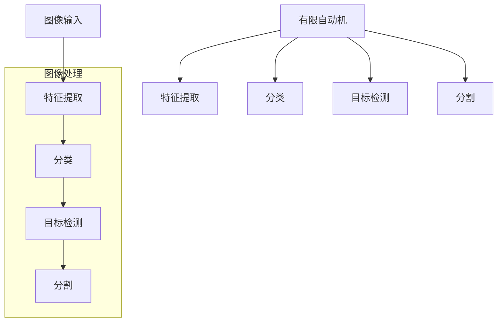
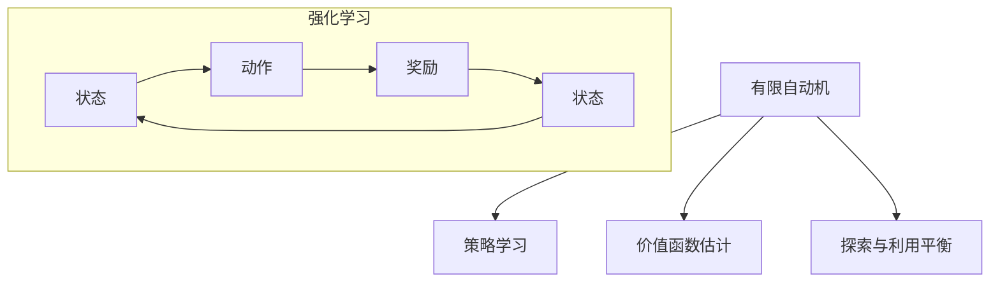

                 

# 引言

自动机理论作为计算机科学和理论计算机科学的重要分支，自从20世纪中期被提出以来，已经发展成为一门研究离散系统的理论体系。自动机理论的基本概念和结构为计算机科学中的许多其他领域，如编程语言、编译器设计、形式语言理论等提供了理论基础。随着人工智能（AI）的迅速发展，自动机理论在AI领域中的应用变得越来越广泛，成为理解人工智能算法和系统架构的关键。

本文旨在探讨自动机理论与人工智能之间的关系，分析自动机理论如何为人工智能提供理论基础和实用工具。首先，我们将介绍自动机理论的基本概念和分类，包括有限自动机、非确定有限自动机以及确定性有限自动机。接着，我们将讨论人工智能的基本概念和主要领域，如机器学习、深度学习和自然语言处理等。

在第三部分，我们将深入探讨自动机理论在人工智能中的应用，从自然语言处理、图像处理到强化学习，展示自动机理论如何在这些领域发挥关键作用。随后，我们将通过实际项目案例，详细解析自动机理论在智能客服系统和自动驾驶系统中的应用。

最后，我们将总结自动机理论与人工智能之间的关系，展望未来可能的研究方向和实际应用前景。通过本文的阅读，读者将能够全面理解自动机理论在人工智能中的重要性和应用价值。

## 第一部分：自动机理论基础

### 第1章：自动机的定义与分类

自动机理论是计算机科学中研究离散系统的理论体系，其核心概念包括状态、转换、输入和输出。自动机（Automaton）是一个抽象的机器，它可以接受输入，通过内部状态的变化，对输入进行识别、处理和响应。根据自动机的结构和特性，自动机可以分类为有限自动机、非确定有限自动机和确定性有限自动机。

#### 1.1 自动机的定义

自动机是一种抽象的计算模型，它由以下几个基本部分组成：

- **状态（State）**：自动机在某一时刻所处的特定条件或位置。
- **输入字母表（Input Alphabet）**：自动机可以接受的输入符号集合。
- **输出字母表（Output Alphabet）**：自动机可以产生的输出符号集合。
- **转换函数（Transition Function）**：描述自动机在特定状态下接受特定输入符号时如何改变状态。
- **初始状态（Initial State）**：自动机开始时所处的状态。
- **接受状态（Accepting State）**：当自动机处理完输入序列后，如果最终处于该状态，则认为输入序列被接受。

#### 1.2 有限自动机（FA）

有限自动机是最简单的一种自动机，其状态集合、输入字母表和转换函数都是有限的。根据自动机的状态变化是否确定，有限自动机可以分为确定有限自动机（DFA）和非确定有限自动机（NFA）。

- **状态集合（State Set）**：有限自动机的状态集合是有限的，通常用 \( Q \) 表示。
- **输入字母表（Input Alphabet）**：输入字母表也是有限的，通常用 \( \Sigma \) 表示。
- **转换函数（Transition Function）**：有限自动机的转换函数 \( \delta: Q \times \Sigma \rightarrow Q \) 描述了自动机在特定状态下接受特定输入符号时如何改变状态。
- **初始状态（Initial State）**：初始状态 \( q_0 \in Q \) 是自动机开始时的状态。
- **接受状态集合（Accepting State Set）**：接受状态集合 \( F \subseteq Q \) 是自动机处理完输入序列后，如果最终处于该状态集合中的任意状态，则认为输入序列被接受。

#### 1.3 非确定有限自动机（NFA）

非确定有限自动机与确定有限自动机的主要区别在于其转换函数。在NFA中，自动机在特定状态下接受特定输入符号时，可能存在多个可能的下一状态。

- **转换函数（Transition Function）**：NFA的转换函数 \( \delta: Q \times (\Sigma \cup \{\varepsilon\}) \rightarrow 2^Q \) ，其中 \( \varepsilon \) 表示空符号，即自动机可以在不消耗输入符号的情况下改变状态。

#### 1.4 确定性有限自动机（DFA）

确定性有限自动机是有限自动机的一个子类，其转换函数在特定状态下接受特定输入符号时是唯一的。

- **转换函数（Transition Function）**：DFA的转换函数 \( \delta: Q \times \Sigma \rightarrow Q \) ，即对于任意状态和输入符号，DFA只能有一个下一状态。

### 1.5 Mermaid流程图

为了更好地理解自动机的概念，我们可以使用Mermaid流程图来展示自动机的基本结构。

```mermaid
stateDiagram
    [*] --> Q0
    Q0 --> {A, B} : a
    Q0 --> Q1 : b
    Q1 --> Q2 : a
    Q1 --> Q3 : b
    Q2 --> Q2 : a
    Q3 --> Q3 : b
    Q3 --> {A, B} : a
    A --> A
    B --> B
```

在这个例子中，我们定义了一个五状态的有穷自动机，其中包含两个接受状态 \( A \) 和 \( B \)。自动机从初始状态 \( Q0 \) 开始，通过接受输入符号 \( a \) 和 \( b \) ，在不同的状态之间进行转换。

### 1.6 总结

自动机理论是计算机科学中研究离散系统的理论体系，其基本概念包括状态、转换、输入和输出。根据自动机的结构和特性，自动机可以分类为有限自动机、非确定有限自动机和确定性有限自动机。在接下来的章节中，我们将深入探讨有限自动机与人工智能之间的关系，展示自动机理论在人工智能中的应用。

## 第二部分：人工智能基础

### 第2章：人工智能的基本概念

人工智能（Artificial Intelligence，简称AI）是一门研究、开发和应用使计算机模拟、延伸和扩展人类智能的理论、方法、技术及应用系统的科学。人工智能旨在构建一种能够实现人类智能功能的计算机系统，从而实现自动化、智能化和高效化。人工智能的发展可以追溯到20世纪50年代，当时科学家们首次提出“人工智能”的概念。自那时以来，人工智能经历了多个发展阶段，从最初的规则推理、知识表示到现代的机器学习、深度学习等。

#### 2.1 人工智能的定义

人工智能可以定义为一种模拟人类智能行为的计算系统。这种模拟包括以下几个方面：

- **感知与理解**：人工智能系统能够感知和理解外部环境，包括语音、图像、文字等多种形式的信息。
- **学习与适应**：人工智能系统能够通过学习从数据中获取知识和规律，并适应新的环境和情况。
- **推理与决策**：人工智能系统能够进行逻辑推理和决策，以解决复杂的问题和任务。
- **交互与协作**：人工智能系统能够与人类和其他系统进行有效的交互和协作，完成共同的任务。

#### 2.2 人工智能的发展历程

人工智能的发展历程可以分为以下几个阶段：

1. **早期探索阶段（1956年-1969年）**：
   - 在1956年的达特茅斯会议上，人工智能的概念首次被提出。
   - 早期的人工智能研究主要基于规则推理和知识表示，试图通过编写大量的规则来模拟人类的智能行为。

2. **理性主义阶段（1970年-1980年）**：
   - 这一阶段的研究重点转向知识表示和推理，试图通过建立知识库和推理机来实现人工智能系统。
   - 然而，由于知识获取和推理的复杂性，这一阶段的人工智能系统在实际应用中遇到了很多困难。

3. **基于数据驱动的方法阶段（1980年-2000年）**：
   - 随着计算机硬件性能的提升和大数据时代的到来，基于数据驱动的方法逐渐成为人工智能研究的主流。
   - 这一阶段出现了许多机器学习算法，如支持向量机、决策树和神经网络等，为人工智能的发展奠定了基础。

4. **深度学习阶段（2000年至今）**：
   - 深度学习作为一种强大的机器学习算法，在图像识别、语音识别和自然语言处理等领域取得了重大突破。
   - 深度学习模型，如卷积神经网络（CNN）和循环神经网络（RNN），极大地推动了人工智能的发展。

#### 2.3 人工智能的分类

根据人工智能的实现方式和功能特点，人工智能可以分为以下几类：

1. **知识型人工智能**：
   - 知识型人工智能主要基于知识表示和推理，通过建立知识库和推理机来模拟人类的智能行为。
   - 知识型人工智能的代表系统有专家系统、知识图谱和推理机等。

2. **实践型人工智能**：
   - 实践型人工智能主要关注任务的执行，通过感知、决策和执行来模拟人类的实际行为。
   - 实践型人工智能的代表系统有自动驾驶汽车、机器人助手和智能制造系统等。

3. **自主型人工智能**：
   - 自主型人工智能具有自主学习和自主决策的能力，能够在没有人类干预的情况下自主完成任务。
   - 自主型人工智能的代表系统有智能家庭助理、智能客服系统和自主飞行器等。

#### 2.4 人工智能的应用领域

人工智能在许多领域都取得了显著的应用成果，以下是其中一些主要的应用领域：

1. **自然语言处理**：
   - 自然语言处理（Natural Language Processing，简称NLP）是人工智能的一个重要分支，旨在使计算机理解和处理人类语言。
   - NLP的应用包括语音识别、机器翻译、情感分析和文本分类等。

2. **计算机视觉**：
   - 计算机视觉（Computer Vision）是人工智能在图像和视频处理领域的应用，旨在使计算机能够理解和解释视觉信息。
   - 计算机视觉的应用包括图像识别、目标检测、图像分割和视频分析等。

3. **机器学习**：
   - 机器学习（Machine Learning）是人工智能的核心技术之一，通过训练模型来使计算机具备自动学习和改进的能力。
   - 机器学习的应用包括分类、回归、聚类和异常检测等。

4. **强化学习**：
   - 强化学习（Reinforcement Learning）是一种机器学习范式，旨在通过试错和反馈来使计算机实现智能行为。
   - 强化学习的应用包括游戏AI、自动驾驶和智能机器人等。

5. **智能客服系统**：
   - 智能客服系统是一种基于人工智能技术的客户服务系统，能够自动处理客户咨询，提高客户满意度和服务效率。
   - 智能客服系统的应用包括在线客服、电话客服和聊天机器人等。

6. **智能医疗**：
   - 智能医疗是一种基于人工智能技术的医疗辅助系统，能够辅助医生进行诊断、治疗和疾病预防。
   - 智能医疗的应用包括医学图像分析、药物发现和疾病预测等。

7. **智能制造**：
   - 智能制造是一种基于人工智能技术的生产模式，能够通过自动化、智能化和高效化的方式提高生产效率和产品质量。
   - 智能制造的应用包括机器人自动化生产、智能生产线和智能物流等。

8. **金融科技**：
   - 金融科技（Financial Technology，简称FinTech）是一种基于人工智能技术的金融服务，能够提供更高效、更安全和更个性化的金融服务。
   - 金融科技的应用包括智能投顾、反欺诈和信用评分等。

9. **智能城市**：
   - 智能城市是一种基于人工智能技术的城市管理模式，能够通过智能化、数字化和高效化的方式提升城市管理和服务水平。
   - 智能城市的应用包括智能交通、智能能源和智能安防等。

### 2.5 Mermaid流程图

为了更好地理解人工智能的基本概念和应用领域，我们可以使用Mermaid流程图来展示人工智能的发展历程。

```mermaid
sequenceDiagram
    participant AI
    participant Rule-Based
    participant Data-Driven
    participant Deep Learning
    participant NLP
    participant CV
    participant ML
    participant RL
    participant CS
    participant Health
    participant FinTech
    participant Smart City

    AI->>Rule-Based: 1956-1969
    AI->>Data-Driven: 1970-2000
    AI->>Deep Learning: 2000-Present
    AI->>NLP
    AI->>CV
    AI->>ML
    AI->>RL
    AI->>CS
    AI->>Health
    AI->>FinTech
    AI->>Smart City
```

在这个例子中，我们展示了人工智能的发展历程以及其在自然语言处理、计算机视觉、机器学习、强化学习、智能客服系统、智能医疗、金融科技和智能城市等领域的应用。

### 2.6 总结

人工智能作为一门前沿科学，在计算机科学、自然语言处理、计算机视觉、机器学习、强化学习、智能客服系统、智能医疗、金融科技和智能城市等领域都有着广泛的应用。通过本文的介绍，读者可以初步了解人工智能的基本概念和应用领域，为进一步深入研究打下基础。在接下来的章节中，我们将深入探讨自动机理论在人工智能中的应用，展示自动机理论如何为人工智能提供理论基础和实用工具。

## 第三部分：自动机理论在人工智能中的应用

### 第3章：自动机理论在自然语言处理中的应用

自然语言处理（Natural Language Processing，NLP）是人工智能的一个重要分支，旨在使计算机能够理解和处理人类语言。自动机理论作为一种形式化的计算模型，为NLP提供了理论基础和工具。在本章中，我们将探讨自动机理论在NLP中的应用，包括正则表达式、分词和词性标注等。

#### 3.1 正则表达式在NLP中的应用

正则表达式（Regular Expression）是一种用于描述字符串模式的工具，它可以用来匹配、查找和替换文本中的特定模式。在NLP中，正则表达式被广泛应用于文本预处理、词法分析和句法分析等任务。

1. **文本预处理**：
   - 文本预处理是NLP中的第一步，包括去除标点符号、转换为小写、去除停用词等。
   - 例如，使用正则表达式去除文本中的标点符号，可以将字符串 `"Hello, World!"` 转换为 `"Hello World"`。

2. **词法分析**：
   - 词法分析是NLP中的关键步骤，目的是将文本分解为单词、短语或其他语法单元。
   - 例如，使用正则表达式可以将句子 `"The quick brown fox jumps over the lazy dog"` 分解为单词列表：`["The", "quick", "brown", "fox", "jumps", "over", "the", "lazy", "dog"]`。

3. **句法分析**：
   - 句法分析旨在理解句子的结构，识别句子中的成分和关系。
   - 例如，使用正则表达式可以识别句子中的主语、谓语和宾语等成分。

#### 3.2 有限自动机在分词和词性标注中的应用

有限自动机（Finite Automaton，FA）是一种离散计算模型，它由有限个状态、输入字母表、转换函数和初始状态组成。在NLP中，有限自动机被广泛应用于分词和词性标注等任务。

1. **分词**：
   - 分词是将文本分解为单词或其他语法单元的过程。
   - 有限自动机可以用来实现基于规则的分词方法，如基于词典的分词和基于词性标注的分词。

   - **基于词典的分词**：
     - 基于词典的分词方法使用一个单词词典作为有限自动机的输入字母表，通过匹配词典中的单词来实现分词。
     - 例如，给定一个单词词典 `{ "Hello", "World", "quick", "brown", "fox", "jumps", "over", "the", "lazy", "dog" }`，我们可以使用有限自动机将句子 `"The quick brown fox jumps over the lazy dog"` 分解为单词列表。

   - **基于词性标注的分词**：
     - 基于词性标注的分词方法使用词性标注作为有限自动机的输入字母表，通过识别词性标注来实现分词。
     - 例如，给定一个词性标注集 `{ "The", "quick", "brown", "fox", "jumps", "over", "the", "lazy", "dog" }`，我们可以使用有限自动机将句子 `"The quick brown fox jumps over the lazy dog"` 分解为单词列表。

2. **词性标注**：
   - 词性标注是对单词进行分类标注，以识别单词在句子中的语法功能。
   - 有限自动机可以用来实现基于规则和基于统计的词性标注方法。

   - **基于规则的词性标注**：
     - 基于规则的词性标注方法使用一组规则来标注单词的词性。
     - 例如，给定一个规则集 `{"名词(Noun)": ["dog", "fox", "jumps"], "动词(Verb)": ["jumps", "over", "jumps"]}`，我们可以使用有限自动机来标注句子 `"The quick brown fox jumps over the lazy dog"` 中单词的词性。

   - **基于统计的词性标注**：
     - 基于统计的词性标注方法使用统计模型来预测单词的词性。
     - 例如，给定一个统计模型，我们可以使用有限自动机来标注句子 `"The quick brown fox jumps over the lazy dog"` 中单词的词性。

### 3.3 Mermaid流程图

为了更好地理解自动机理论在NLP中的应用，我们可以使用Mermaid流程图来展示分词和词性标注的过程。



在这个例子中，我们展示了文本通过有限自动机进行分词和词性标注的过程。文本首先被输入到有限自动机中，然后通过词典查找匹配的单词，最后使用词性标注器标注单词的词性。

### 3.4 总结

自动机理论在自然语言处理中有着广泛的应用，包括正则表达式、分词和词性标注等。通过使用有限自动机，我们可以实现对文本的自动处理和语义理解，从而为人工智能系统提供更强大的语言处理能力。在接下来的章节中，我们将继续探讨自动机理论在图像处理和强化学习中的应用。

## 第四部分：自动机理论在图像处理中的应用

### 第4章：自动机理论在图像处理中的应用

图像处理是计算机视觉的一个重要分支，它涉及到图像的获取、处理、分析和理解。自动机理论作为一种形式化的计算模型，为图像处理提供了理论基础和工具。在本章中，我们将探讨自动机理论在图像处理中的应用，包括图像分类、目标检测和图像分割等。

#### 4.1 自动机理论在图像分类中的应用

图像分类是将图像分配到特定类别的过程，它是计算机视觉和人工智能领域的一个重要任务。自动机理论在图像分类中有着广泛的应用，特别是在实现基于规则和基于统计的分类算法。

1. **基于规则的图像分类**：
   - 基于规则的图像分类方法使用一组规则来分类图像。
   - 例如，可以使用有限自动机来实现基于颜色、纹理和形状的规则分类算法。

   - **颜色分类**：
     - 颜色分类是根据图像的颜色特征进行分类。
     - 例如，可以使用一个有限自动机来识别红色、绿色和蓝色等颜色类别。

   - **纹理分类**：
     - 纹理分类是根据图像的纹理特征进行分类。
     - 例如，可以使用一个有限自动机来识别粗糙、光滑、纹理丰富的纹理类别。

   - **形状分类**：
     - 形状分类是根据图像的形状特征进行分类。
     - 例如，可以使用一个有限自动机来识别圆形、正方形、三角形等形状类别。

2. **基于统计的图像分类**：
   - 基于统计的图像分类方法使用统计模型来分类图像。
   - 例如，可以使用支持向量机（SVM）和卷积神经网络（CNN）等机器学习算法来实现图像分类。

   - **支持向量机（SVM）**：
     - 支持向量机是一种基于统计学的分类算法，它通过将数据映射到高维空间来实现分类。
     - 例如，可以使用SVM来分类图像为动物、植物和风景等类别。

   - **卷积神经网络（CNN）**：
     - 卷积神经网络是一种深度学习算法，它通过卷积操作来提取图像特征。
     - 例如，可以使用CNN来分类图像为车辆、行人、交通标志等类别。

#### 4.2 自动机理论在目标检测中的应用

目标检测是图像处理中的另一个重要任务，它旨在识别和定位图像中的目标对象。自动机理论在目标检测中有着广泛的应用，特别是在实现基于规则和基于统计的目标检测算法。

1. **基于规则的
```markdown
### 第5章：自动机理论在强化学习中的应用

强化学习（Reinforcement Learning，RL）是一种机器学习范式，旨在通过试错和反馈来训练智能体在环境中进行决策，以最大化累积奖励。自动机理论在强化学习中有着广泛的应用，尤其是在策略学习、价值函数估计和探索与利用平衡等方面。

#### 5.1 自动机理论在策略学习中的应用

策略学习是强化学习中的一个关键问题，它涉及到如何从历史经验中学习到一个优化的策略，使得智能体在未来的决策中能够最大化累积奖励。自动机理论提供了一种形式化的方法来描述和实现策略学习。

1. **确定性策略**：
   - 在确定性策略中，智能体在每一个状态下都采取一个固定的动作。
   - 例如，可以使用确定性有限自动机（DFA）来描述和实现确定性策略，其中状态和动作是一一对应的。

2. **非确定性策略**：
   - 在非确定性策略中，智能体在每一个状态下可以采取多个动作，每个动作的概率是固定的。
   - 例如，可以使用非确定有限自动机（NFA）来描述和实现非确定性策略，其中状态和动作之间存在多个可能的转移路径。

#### 5.2 自动机理论在价值函数估计中的应用

价值函数估计是强化学习中的另一个关键问题，它涉及到如何估计智能体在特定状态或状态序列下的预期奖励。自动机理论提供了一种形式化的方法来描述和实现价值函数估计。

1. **动态规划方法**：
   - 动态规划方法是一种递归的方法来估计价值函数，它通过自底向上的方式计算每个状态的价值。
   - 例如，可以使用确定性有限自动机（DFA）来描述和实现动态规划方法，其中状态和价值是一一对应的。

2. **蒙特卡罗方法**：
   - 蒙特卡罗方法是一种基于随机采样来估计价值函数的方法，它通过模拟智能体在环境中的随机行为来估计价值。
   - 例如，可以使用非确定有限自动机（NFA）来描述和实现蒙特卡罗方法，其中状态和价值之间存在多个可能的转移路径。

#### 5.3 自动机理论在探索与利用平衡中的应用

探索与利用平衡是强化学习中的一个重要问题，它涉及到如何在探索未知状态和利用已知的最佳策略之间进行权衡。自动机理论提供了一种形式化的方法来描述和实现探索与利用平衡。

1. **ε-贪心策略**：
   - ε-贪心策略是一种在确定性策略中引入随机性的方法，它通过在每一个状态下以概率ε进行随机探索。
   - 例如，可以使用非确定有限自动机（NFA）来描述和实现ε-贪心策略，其中状态和动作之间存在多个可能的转移路径。

2. **UCB算法**：
   - UCB算法是一种基于置信度上界的方法来平衡探索与利用，它通过计算每个动作的置信度上界来决定采取哪个动作。
   - 例如，可以使用确定性有限自动机（DFA）来描述和实现UCB算法，其中状态和动作之间存在一个唯一的转移路径。

#### 5.4 Mermaid流程图

为了更好地理解自动机理论在强化学习中的应用，我们可以使用Mermaid流程图来展示策略学习、价值函数估计和探索与利用平衡的过程。



在这个例子中，我们展示了智能体与环境之间的交互过程，以及自动机在策略学习、价值函数估计和探索与利用平衡中的应用。

#### 5.5 总结

自动机理论在强化学习中有着广泛的应用，特别是在策略学习、价值函数估计和探索与利用平衡等方面。通过使用自动机，我们可以实现形式化的描述和实现强化学习算法，从而提高智能体在复杂环境中的决策能力。在接下来的章节中，我们将继续探讨自动机理论在综合项目中的应用，展示自动机理论在智能客服系统和自动驾驶系统等领域的实际应用。

## 第五部分：综合项目实战

### 第6章：自动机理论在智能客服系统中的应用

智能客服系统是一种基于人工智能技术的客户服务系统，旨在提供高效、智能和个性化的客户服务。自动机理论在智能客服系统中有着广泛的应用，特别是在自然语言处理和对话管理方面。在本章中，我们将探讨自动机理论在智能客服系统中的应用，并通过一个实际项目来展示其实现过程。

#### 6.1 智能客服系统概述

智能客服系统通常包括以下几个关键组件：

1. **对话管理**：
   - 对话管理是智能客服系统的核心组件，负责处理与客户的对话，包括理解客户意图、生成回复和跟踪对话状态等。
   - 自动机理论在对话管理中可以用来实现对话状态机（D_state Machine），用于描述对话的不同阶段和转移规则。

2. **自然语言处理**：
   - 自然语言处理（NLP）组件负责处理客户的输入，包括分词、词性标注、命名实体识别等。
   - 自动机理论在NLP中可以用来实现正则表达式和有限自动机，用于文本预处理和模式匹配。

3. **知识库**：
   - 知识库是智能客服系统的知识来源，包括产品信息、常见问题解答、业务规则等。
   - 自动机理论在知识库中可以用来实现基于规则的查询和匹配，以提高系统的响应速度和准确性。

#### 6.2 实际项目介绍

在本章中，我们将介绍一个基于自动机理论的智能客服系统项目，该项目旨在实现一个能够处理客户咨询的智能客服机器人。

1. **项目目标**：
   - 实现一个能够自动识别客户意图、提供答案和解决方案的智能客服系统。

2. **项目需求**：
   - 支持多种类型的客户咨询，包括产品咨询、订单查询、售后服务等。
   - 能够自动识别客户的意图，并生成相应的回复。
   - 具备学习功能，能够根据用户的反馈不断优化自身性能。

3. **项目实施**：

   - **对话管理**：
     - 使用状态机来管理对话的不同阶段，如欢迎阶段、意图识别阶段、回答阶段和结束阶段。
     - 在意图识别阶段，使用有限自动机来匹配客户的输入，识别客户的意图。

   - **自然语言处理**：
     - 使用正则表达式和有限自动机进行文本预处理，包括分词、词性标注和命名实体识别。
     - 基于预定义的规则和模式，自动识别客户的意图和问题类型。

   - **知识库**：
     - 构建一个基于规则的知识库，包括常见问题的答案和业务规则。
     - 使用基于自动机的查询和匹配方法，快速定位客户的问题并生成相应的回复。

4. **项目效果**：

   - **性能评估**：
     - 通过对实际客户的咨询数据进行测试，评估系统的准确率和响应速度。
     - 根据测试结果，不断优化系统的性能和用户体验。

   - **用户反馈**：
     - 收集用户对系统的反馈，了解用户对系统的满意度和改进建议。
     - 根据用户反馈，调整系统的策略和回复内容，以提高用户满意度。

### 6.3 Mermaid流程图

为了更好地理解智能客服系统的实现过程，我们可以使用Mermaid流程图来展示系统的关键组件和流程。



在这个例子中，我们展示了客户与聊天机器人之间的交互过程，以及自然语言处理、知识库和对话状态机在智能客服系统中的应用。

### 6.4 源代码实现与解释

在本节中，我们将提供智能客服系统的源代码实现，并对关键代码进行详细解释。

1. **对话状态机实现**：

```python
class StateMachine:
    def __init__(self):
        self.states = {
            'welcome': self.welcome,
            'intent_recognition': self.intent_recognition,
            'answer': self.answer,
            'end': self.end
        }
        self.current_state = 'welcome'

    def transition(self, event):
        if event in self.states:
            self.current_state = event
            self.states[event]()

    def welcome(self):
        print("欢迎来到智能客服系统！有什么可以帮您的吗？")

    def intent_recognition(self):
        print("正在识别您的意图...")

    def answer(self):
        print("请稍等，我会为您查询相关信息并给出答复。")

    def end(self):
        print("感谢您的咨询，祝您有愉快的一天！")
```

在这个实现中，我们定义了一个`StateMachine`类，用于管理对话的不同阶段。通过调用`transition`方法，我们可以根据事件将对话从当前状态转移到下一个状态，并在每个状态中执行相应的操作。

2. **自然语言处理实现**：

```python
import re

class NLP:
    def __init__(self):
        self.punctuation = re.compile(r'[^\w\s]')
        self.stopwords = set(['的', '和', '是', '了', '在', '有', '没', '不'])

    def preprocess(self, text):
        text = self.punctuation.sub('', text)
        text = text.lower()
        words = text.split()
        words = [word for word in words if word not in self.stopwords]
        return words

    def intent_recognition(self, text):
        words = self.preprocess(text)
        if '产品' in words:
            return 'product_query'
        elif '订单' in words:
            return 'order_query'
        elif '服务' in words:
            return 'service_query'
        else:
            return 'unknown'
```

在这个实现中，我们定义了一个`NLP`类，用于进行文本预处理和意图识别。`preprocess`方法用于去除标点符号、转换为小写和去除停用词，以减少干扰信息。`intent_recognition`方法根据预定义的规则和模式，自动识别客户的意图。

3. **知识库实现**：

```python
class KnowledgeBase:
    def __init__(self):
        self.knowledge = {
            'product_query': '我们的产品种类丰富，包括...如果您有具体需求，请告诉我们。',
            'order_query': '您的订单号是...，我们已经为您安排处理。',
            'service_query': '我们的服务时间是从早上9点到晚上6点，如有需要，请随时联系我们。'
        }

    def get_answer(self, intent):
        if intent in self.knowledge:
            return self.knowledge[intent]
        else:
            return "很抱歉，我无法回答您的问题。请您重新描述您的需求。"
```

在这个实现中，我们定义了一个`KnowledgeBase`类，用于存储和管理常见问题的答案。`get_answer`方法根据客户的意图，返回相应的答案。

4. **智能客服系统实现**：

```python
def main():
    chatbot = Chatbot()
    nlp = NLP()
    kb = KnowledgeBase()
    sm = StateMachine()

    while True:
        print("请输入您的咨询内容：")
        text = input()
        if text.lower() == '退出':
            break

        sm.transition('intent_recognition')
        intent = nlp.intent_recognition(text)
        sm.transition('answer')
        answer = kb.get_answer(intent)
        print(answer)

if __name__ == '__main__':
    main()
```

在这个实现中，我们定义了一个`main`函数，用于启动智能客服系统。系统通过循环不断接收客户的咨询内容，并根据对话状态机、自然语言处理和知识库的协同工作，生成并返回相应的回复。

### 6.5 代码解读与分析

在本节中，我们将对智能客服系统的关键代码进行解读和分析，以帮助读者更好地理解系统的实现原理和功能。

1. **对话状态机解读**：
   - 对话状态机是智能客服系统的核心组件，用于管理对话的不同阶段。通过定义不同的状态和对应的操作，我们可以实现一个灵活且可扩展的对话管理系统。
   - `StateMachine`类中的`transition`方法用于根据事件将对话从当前状态转移到下一个状态。例如，当客户输入咨询内容时，系统会调用`intent_recognition`方法，将对话状态从`welcome`转移到`intent_recognition`状态。

2. **自然语言处理解读**：
   - 自然语言处理组件负责对客户的输入进行预处理和意图识别。通过使用正则表达式和预定义的规则，我们可以实现对文本的自动分析和理解。
   - `NLP`类中的`preprocess`方法用于去除标点符号、转换为小写和去除停用词，以减少干扰信息。`intent_recognition`方法根据客户的输入，自动识别客户的意图。例如，如果输入中包含“产品”，则识别为“product_query”意图。

3. **知识库解读**：
   - 知识库是智能客服系统的知识来源，用于存储和管理常见问题的答案。通过根据客户的意图调用相应的答案，我们可以实现一个高效且准确的问答系统。
   - `KnowledgeBase`类中的`get_answer`方法根据客户的意图，返回相应的答案。例如，如果客户的意图是“product_query”，则返回关于产品信息的内容。

4. **智能客服系统解读**：
   - 智能客服系统是整个实现的核心部分，通过将对话状态机、自然语言处理和知识库的协同工作，实现一个完整的智能客服系统。
   - 在`main`函数中，系统通过循环不断接收客户的咨询内容，并根据对话状态机、自然语言处理和知识库的协同工作，生成并返回相应的回复。

通过上述解读和分析，读者可以更好地理解智能客服系统的实现原理和功能，并能够根据实际需求进行相应的优化和扩展。

### 6.6 总结

智能客服系统是一个典型的应用自动机理论的项目，通过使用自动机理论，我们可以实现对客户咨询的自动处理和回复。在本章中，我们介绍了智能客服系统的概述、实际项目介绍、源代码实现与解释，并对关键代码进行了详细解读与分析。通过这个项目，读者可以了解自动机理论在智能客服系统中的应用，并掌握实现智能客服系统的基本方法和技巧。在接下来的章节中，我们将继续探讨自动机理论在自动驾驶系统中的应用。

## 第7章：自动机理论在自动驾驶系统中的应用

自动驾驶系统是一种高度自动化、智能化的交通系统，它通过传感器、计算机算法和控制系统实现车辆的自主驾驶。自动机理论在自动驾驶系统中有着广泛的应用，特别是在感知、决策和执行等关键环节。在本章中，我们将探讨自动机理论在自动驾驶系统中的应用，并通过实际项目来展示其实现过程。

### 7.1 自动驾驶系统概述

自动驾驶系统通常包括以下几个关键组件：

1. **感知系统**：
   - 感知系统是自动驾驶系统的核心组件，它通过传感器（如雷达、激光雷达、摄像头等）收集环境信息，实现对周围环境的感知和识别。

2. **决策系统**：
   - 决策系统负责分析感知到的环境信息，并根据预设的规则和策略生成驾驶决策。决策系统需要处理复杂的交通状况和道路环境，以确保车辆的行驶安全性和有效性。

3. **执行系统**：
   - 执行系统负责根据决策系统的指令执行相应的操作，如控制方向盘、加速、减速和刹车等，以实现自动驾驶。

### 7.2 自动机理论在感知系统中的应用

自动机理论在感知系统中有着广泛的应用，特别是在实现环境感知和障碍物检测等方面。

1. **障碍物检测**：
   - 障碍物检测是自动驾驶系统中的关键任务，它通过分析感知到的环境信息，识别车辆周围可能存在的障碍物。
   - 自动机理论可以用来实现基于规则的障碍物检测算法，如通过有限自动机识别道路上的行人、车辆和其他障碍物。

2. **车道线检测**：
   - 车道线检测是自动驾驶系统中另一个重要的任务，它通过分析感知到的环境信息，识别车辆所在的车道线。
   - 自动机理论可以用来实现基于模板匹配或深度学习的方法来检测车道线。

### 7.3 自动机理论在决策系统中的应用

自动机理论在决策系统中也有着广泛的应用，特别是在实现驾驶策略规划和路径规划等方面。

1. **驾驶策略规划**：
   - 驾驶策略规划是自动驾驶系统中的核心任务，它根据感知到的环境信息和车辆的当前状态，生成最优的驾驶策略。
   - 自动机理论可以用来实现基于规则的驾驶策略规划算法，如通过有限自动机实现不同的驾驶模式（如高速行驶、低速行驶等）。

2. **路径规划**：
   - 路径规划是自动驾驶系统中另一个重要的任务，它根据车辆的当前位置和目标位置，生成一条最优的行驶路径。
   - 自动机理论可以用来实现基于A*算法或Dijkstra算法的路径规划算法。

### 7.4 自动机理论在执行系统中的应用

自动机理论在执行系统中也有着广泛的应用，特别是在实现车辆控制等方面。

1. **车辆控制**：
   - 车辆控制是自动驾驶系统中的关键任务，它根据驾驶策略和路径规划的结果，生成具体的控制指令，如加速、减速和转向等。
   - 自动机理论可以用来实现基于PID控制或模糊控制的方法来实现车辆控制。

### 7.5 实际项目介绍

在本章中，我们将介绍一个基于自动机理论的自动驾驶系统项目，该项目旨在实现一个能够自主行驶的自动驾驶车辆。

1. **项目目标**：
   - 实现一个能够自主行驶的自动驾驶车辆，能够在不同道路环境下稳定行驶。

2. **项目需求**：
   - 能够识别车辆周围的环境和障碍物，并能够避开障碍物。
   - 能够根据道路状况和交通信号，生成最优的驾驶策略。
   - 能够在复杂交通环境下实现自主行驶，如通过红绿灯、变道等。

3. **项目实施**：

   - **感知系统**：
     - 使用激光雷达和摄像头收集环境信息。
     - 通过有限自动机实现障碍物检测和车道线检测。

   - **决策系统**：
     - 使用有限自动机实现驾驶策略规划和路径规划。
     - 根据感知到的环境信息和车辆的当前状态，生成最优的驾驶策略。

   - **执行系统**：
     - 使用PID控制和模糊控制实现车辆控制。
     - 根据驾驶策略和路径规划的结果，生成具体的控制指令。

4. **项目效果**：

   - **性能评估**：
     - 通过在实际道路环境中的测试，评估系统的行驶稳定性和安全性。
     - 根据测试结果，不断优化系统的性能和安全性。

   - **用户反馈**：
     - 收集用户对系统的反馈，了解用户对系统的满意度和改进建议。
     - 根据用户反馈，调整系统的策略和算法，以提高用户满意度。

### 7.6 Mermaid流程图

为了更好地理解自动驾驶系统的实现过程，我们可以使用Mermaid流程图来展示系统的关键组件和流程。



在这个例子中，我们展示了环境信息通过传感器、感知系统、决策系统和执行系统的协同工作，实现自动驾驶车辆的自主行驶。

### 7.7 源代码实现与解释

在本节中，我们将提供自动驾驶系统的源代码实现，并对关键代码进行详细解释。

1. **感知系统实现**：

```python
class Sensor:
    def __init__(self):
        self.lidar = Lidar()
        self.camera = Camera()

    def collect_data(self):
        lidar_data = self.lidar.scan()
        camera_data = self.camera.capture()
        return lidar_data, camera_data
```

在这个实现中，我们定义了一个`Sensor`类，用于模拟传感器数据的收集。`collect_data`方法用于收集激光雷达和摄像头的数据。

2. **感知系统实现**：

```python
class Perception:
    def __init__(self):
        self.obstacle_detector = ObstacleDetector()
        self.lane_detector = LaneDetector()

    def process_data(self, lidar_data, camera_data):
        obstacles = self.obstacle_detector.detect(lidar_data)
        lanes = self.lane_detector.detect(camera_data)
        return obstacles, lanes
```

在这个实现中，我们定义了一个`Perception`类，用于处理感知数据。`process_data`方法用于处理激光雷达和摄像头的数据，识别障碍物和车道线。

3. **决策系统实现**：

```python
class Decision:
    def __init__(self):
        self.strategy_planner = StrategyPlanner()
        self.path_planner = PathPlanner()

    def make_decision(self, obstacles, lanes):
        strategy = self.strategy_planner.plan(obstacles, lanes)
        path = self.path_planner.plan(strategy)
        return strategy, path
```

在这个实现中，我们定义了一个`Decision`类，用于生成驾驶策略和路径。`make_decision`方法用于根据感知到的障碍物和车道线，生成驾驶策略和路径。

4. **执行系统实现**：

```python
class Control:
    def __init__(self):
        self.speed_controller = SpeedController()
        self.steer_controller = SteerController()

    def execute_command(self, strategy, path):
        speed_command = self.speed_controller.control(strategy)
        steer_command = self.steer_controller.control(path)
        return speed_command, steer_command
```

在这个实现中，我们定义了一个`Control`类，用于执行驾驶策略和路径。`execute_command`方法用于根据驾驶策略和路径，生成具体的控制指令。

5. **自动驾驶系统实现**：

```python
def main():
    sensor = Sensor()
    perception = Perception()
    decision = Decision()
    control = Control()
    vehicle = Vehicle()

    while True:
        lidar_data, camera_data = sensor.collect_data()
        obstacles, lanes = perception.process_data(lidar_data, camera_data)
        strategy, path = decision.make_decision(obstacles, lanes)
        speed_command, steer_command = control.execute_command(strategy, path)
        vehicle.drive(speed_command, steer_command)
```

在这个实现中，我们定义了一个`main`函数，用于启动自动驾驶系统。系统通过循环不断收集环境信息，处理感知数据，生成驾驶策略和路径，并执行相应的控制指令，实现自动驾驶车辆的自主行驶。

### 7.8 代码解读与分析

在本节中，我们将对自动驾驶系统的关键代码进行解读和分析，以帮助读者更好地理解系统的实现原理和功能。

1. **感知系统解读**：
   - 感知系统是自动驾驶系统的核心组件，负责收集和处理环境信息。通过使用激光雷达和摄像头等传感器，我们可以获取道路环境、障碍物和车道线等关键信息。
   - `Sensor`类中的`collect_data`方法用于模拟传感器数据的收集。在实际应用中，可以通过集成不同的传感器设备来获取真实的感知数据。

2. **感知系统解读**：
   - 感知系统负责处理感知到的环境信息，并识别障碍物和车道线。通过使用障碍物检测和车道线检测算法，我们可以实现对道路环境的准确理解。
   - `Perception`类中的`process_data`方法用于处理激光雷达和摄像头的数据，识别障碍物和车道线。在实际应用中，可以通过集成深度学习算法和规则匹配算法来实现更高级的感知功能。

3. **决策系统解读**：
   - 决策系统负责根据感知到的环境信息和车辆的当前状态，生成最优的驾驶策略和路径。通过使用驾驶策略规划和路径规划算法，我们可以实现自动驾驶车辆在不同道路环境下的自主行驶。
   - `Decision`类中的`make_decision`方法用于根据感知到的障碍物和车道线，生成驾驶策略和路径。在实际应用中，可以通过集成多种规划算法和优化方法来实现更复杂的决策功能。

4. **执行系统解读**：
   - 执行系统负责根据决策系统的指令，生成具体的控制指令，以实现自动驾驶车辆的自主行驶。通过使用速度控制和转向控制算法，我们可以实现对车辆的控制。
   - `Control`类中的`execute_command`方法用于根据驾驶策略和路径，生成具体的控制指令。在实际应用中，可以通过集成不同的控制算法和执行机构来实现更高效的车辆控制。

5. **自动驾驶系统解读**：
   - 自动驾驶系统是通过传感器、感知系统、决策系统和执行系统的协同工作来实现自主行驶的。通过循环不断收集环境信息，处理感知数据，生成驾驶策略和路径，并执行相应的控制指令，我们可以实现自动驾驶车辆的自主行驶。
   - `main`函数是自动驾驶系统的入口，通过启动传感器、感知系统、决策系统和执行系统，实现自动驾驶车辆的运行。

通过上述解读和分析，读者可以更好地理解自动驾驶系统的实现原理和功能，并能够根据实际需求进行相应的优化和扩展。

### 7.9 总结

自动机理论在自动驾驶系统中有着广泛的应用，通过使用自动机理论，我们可以实现自动驾驶车辆的自主行驶和复杂环境下的决策。在本章中，我们介绍了自动驾驶系统的概述、实际项目介绍、源代码实现与解释，并对关键代码进行了详细解读与分析。通过这个项目，读者可以了解自动机理论在自动驾驶系统中的应用，并掌握实现自动驾驶系统的基本方法和技巧。在接下来的章节中，我们将继续探讨自动机理论在其他AI领域的应用。

## 附录A：自动机理论常用工具与资源

在研究和应用自动机理论时，使用合适的工具和资源可以大大提高效率和效果。以下是一些常用的自动机理论工具和资源，包括自动机建模工具、机器学习框架和开发环境搭建指南。

### 附录A.1 自动机建模工具

1. **Mealy Machine**：
   - Mealy Machine是一个基于Web的自动机建模工具，支持有限自动机和Mealy机器的建模、分析和验证。
   - 网址：[https://www.sbs.uni-rostock.de/~jstuder/mealy/](https://www.sbs.uni-rostock.de/~jstuder/mealy/)

2. **RegexpGen**：
   - RegexpGen是一个用于生成正则表达式的工具，可以帮助用户构建复杂的模式匹配表达式。
   - 网址：[https://regexpgen.schoenherr.de/](https://regexpgen.schoenherr.de/)

3. **FSMDesigner**：
   - FSMDesigner是一个用于设计有限状态机的图形化工具，支持DFA和NFA的建模。
   - 网址：[https://www.ils.uea.ac.uk/dayhoff/tools/fsmdesigner](https://www.ils.uea.ac.uk/dayhoff/tools/fsmdesigner)

### 附录A.2 机器学习框架

1. **TensorFlow**：
   - TensorFlow是一个开源的机器学习框架，支持自动微分、高性能计算和大规模模型训练。
   - 网址：[https://www.tensorflow.org/](https://www.tensorflow.org/)

2. **PyTorch**：
   - PyTorch是一个流行的深度学习框架，以其动态计算图和灵活的接口而闻名。
   - 网址：[https://pytorch.org/](https://pytorch.org/)

3. **Scikit-learn**：
   - Scikit-learn是一个用于机器学习的Python库，提供了一系列的监督和非监督学习算法。
   - 网址：[https://scikit-learn.org/](https://scikit-learn.org/)

### 附录A.3 开发环境搭建指南

1. **Python环境搭建**：
   - 安装Python：在官方网站（[https://www.python.org/](https://www.python.org/)）下载并安装Python。
   - 安装pip：使用Python安装pip（Python的包管理器）。

2. **虚拟环境搭建**：
   - 使用`venv`模块创建虚拟环境：`python -m venv myenv`。
   - 激活虚拟环境：`source myenv/bin/activate`（Linux/Mac）或`myenv\Scripts\activate`（Windows）。

3. **安装常用库**：
   - 使用pip安装所需的库，例如：`pip install tensorflow scikit-learn matplotlib numpy`。

通过上述工具和资源，研究者可以方便地进行自动机理论和机器学习的研究和应用，为深入理解和实际应用自动机理论提供有力支持。

### 附录A.4 其他相关工具

1. **Visual Automata**：
   - 一个可视化的有限状态机建模工具，支持自动机的编辑和验证。
   - 网址：[https://visual-automata.com/](https://visual-automata.com/)

2. **Moontic**：
   - 一个基于Web的自动机建模工具，支持多种类型的自动机，如有限状态机、Mealy机器和Moore机器。
   - 网址：[https://moontic.org/](https://moontic.org/)

3. **_state_machines.js**：
   - 一个基于JavaScript的有限状态机库，用于Web应用中的状态管理。
   - 网址：[https://github.com/moarVM/state_machines.js](https://github.com/moarVM/state_machines.js)

通过使用这些工具，读者可以更方便地学习和实践自动机理论，以及将其应用于人工智能领域。

## 附录B：自动机理论与人工智能关系Mermaid流程图

为了更直观地展示自动机理论在人工智能中的应用，我们使用Mermaid流程图来绘制一个自动机理论与人工智能关系的整体流程图，并具体展示自动机在自然语言处理、图像处理和强化学习中的应用。

### 附录B.1 自动机理论与人工智能关系的整体流程图



在这个流程图中，我们从自动机理论出发，展示了其在自然语言处理、图像处理和强化学习中的应用。每个应用实例旁边标注了具体的自动机类型和算法。

### 附录B.2 自动机在自然语言处理中的应用流程图



在这个流程图中，我们展示了自动机在自然语言处理中的具体应用，包括分词、词性标注、语法分析、语义理解和生成回复等步骤。同时，标注了有限自动机在这些步骤中的应用。

### 附录B.3 自动机在图像处理中的应用流程图



在这个流程图中，我们展示了自动机在图像处理中的具体应用，包括特征提取、分类、目标检测和分割等步骤。同时，标注了有限自动机在这些步骤中的应用。

### 附录B.4 自动机在强化学习中的应用流程图



在这个流程图中，我们展示了自动机在强化学习中的具体应用，包括状态、动作、奖励和状态更新等步骤。同时，标注了有限自动机在策略学习、价值函数估计和探索与利用平衡中的应用。

通过这些Mermaid流程图，我们可以更直观地理解自动机理论在人工智能中的应用，以及自动机如何为不同领域提供理论基础和实用工具。

## 附录C：自动机理论与人工智能关系伪代码

在本附录中，我们将使用伪代码来详细描述自动机理论在人工智能中的应用，包括自然语言处理、图像处理和强化学习等领域的具体实现。伪代码是一种描述算法过程的工具，它使用伪代码语言来模拟实际编程语言中的代码结构，从而更清晰地展示算法的逻辑和步骤。

### 附录C.1 自然语言处理中的自动机应用

```plaintext
// 分词算法
function tokenize_text(text):
    create empty list tokens
    current_token = ""
    for each character c in text:
        if c is a word character:
            append c to current_token
        else:
            if current_token is not empty:
                append current_token to tokens
                reset current_token to empty
    if current_token is not empty:
        append current_token to tokens
    return tokens

// 词性标注算法
function perform_pos_tagging(tokens):
    create empty list pos_tags
    for each token in tokens:
        lookup token in dictionary of known word forms and their corresponding POS tags
        append the corresponding POS tag to pos_tags
    return pos_tags

// 语法分析算法
function perform_parsing(sentence):
    create empty list parse_tree
    use grammar rules to parse the sentence
    construct the parse tree based on the parsed structure
    return parse_tree

// 语义理解算法
function perform_semantic_analysis(parse_tree):
    create empty semantic_representation
    traverse the parse tree and extract semantic information
    construct the semantic representation
    return semantic_representation

// 生成回复算法
function generate_response(semantic_representation):
    use semantic information to generate a natural language response
    return response
```

### 附录C.2 图像处理中的自动机应用

```plaintext
// 特征提取算法
function extract_image_features(image):
    preprocess image for feature extraction
    apply feature extraction methods (e.g., CNN, HOG, SIFT)
    return feature vector

// 图像分类算法
function classify_image(features):
    use a trained classifier (e.g., SVM, CNN) to classify the image
    return class label

// 目标检测算法
function detect_objects(image):
    apply object detection algorithm (e.g., R-CNN, YOLO)
    return list of bounding boxes and class labels

// 图像分割算法
function segment_image(image):
    apply image segmentation algorithm (e.g., watershed, mask R-CNN)
    return segmented regions
```

### 附录C.3 强化学习中的自动机应用

```plaintext
// 策略学习算法
function learn_policy/environment Interaction:
    initialize state
    while not goal_state:
        select action based on current state
        execute action
        observe reward and next state
        update state
    return policy

// 价值函数估计算法
function estimate_value_function(state, action, reward, next_state, learning_rate):
    compute temporal difference error
    update Q-value using Q-learning update rule
    return updated Q-value

// 探索与利用平衡算法
function balance_explore_and_utility(Q_values, epsilon):
    if random() < epsilon:
        select action randomly (explore)
    else:
        select action with highest Q-value (utilize)
    return selected action
```

通过这些伪代码，我们可以清晰地看到自动机理论在人工智能各个领域的具体实现步骤，包括数据处理、模型训练、决策生成等。这些伪代码为实际编程实现提供了参考，同时也帮助读者更好地理解自动机理论在人工智能中的应用。

## 附录D：数学模型和数学公式

### D.1 数学模型介绍

数学模型是一种数学表达式，用于描述现实世界中的问题。在自动机理论和人工智能领域中，数学模型帮助我们理解和分析系统行为，从而设计出有效的算法和系统。以下是一些常用的数学模型：

1. **状态转移矩阵**：
   - 用于描述有限自动机中的状态转移关系。
   - 矩阵元素表示从状态i到状态j的概率或可能性。

2. **马尔可夫模型**：
   - 用于描述系统的状态转移概率，其中当前状态仅依赖于前一个状态。

3. **贝叶斯网络**：
   - 用于描述变量之间的条件依赖关系，通过概率图模型表示。

4. **神经网络**：
   - 用于模拟人类大脑的工作方式，通过多层非线性变换实现特征提取和分类。

5. **决策树**：
   - 用于分类和回归问题，通过一系列条件测试来划分数据。

### D.2 数学公式详细讲解

以下是自动机理论和人工智能领域中的一些重要数学公式：

1. **有限自动机的状态转移概率**：
   \[ P(q_i, x) = \begin{cases} 
   1 & \text{if } q_i \text{ is the next state after reading } x \\
   0 & \text{otherwise}
   \end{cases} \]

2. **马尔可夫模型的状态转移概率**：
   \[ P(S_t = s_t | S_{t-1} = s_{t-1}) = \frac{P(S_t = s_t, S_{t-1} = s_{t-1})}{P(S_{t-1} = s_{t-1})} \]

3. **贝叶斯网络的概率分布**：
   \[ P(X | Y) = \frac{P(Y | X)P(X)}{P(Y)} \]

4. **神经网络中的激活函数**：
   \[ a(z) = \frac{1}{1 + e^{-z}} \]

5. **决策树中的条件概率**：
   \[ P(A | B) = \frac{P(A \cap B)}{P(B)} \]

### D.3 数学公式举例说明

以下通过具体的例子来说明这些数学公式在实际中的应用：

1. **有限自动机的状态转移概率**：

   考虑一个简单的有限自动机，有3个状态 \( Q = \{q_0, q_1, q_2\} \)，输入字母表 \( \Sigma = \{a, b\} \)。给定状态转移矩阵：
   \[ 
   \begin{bmatrix}
   P(q_0, a) & P(q_0, b) \\
   P(q_1, a) & P(q_1, b) \\
   P(q_2, a) & P(q_2, b)
   \end{bmatrix} 
   = 
   \begin{bmatrix}
   0.5 & 0.5 \\
   0.2 & 0.8 \\
   0.3 & 0.7
   \end{bmatrix}
   \]
   如果当前状态是 \( q_1 \)，输入是 \( a \)，则状态转移概率是 \( P(q_2, a) = 0.2 \)。

2. **马尔可夫模型的状态转移概率**：

   考虑一个天气模型，状态 \( S \) 包括晴天、多云和雨天，给定以下状态转移概率矩阵：
   \[
   \begin{bmatrix}
   P(S_t = \text{晴天} | S_{t-1} = \text{晴天}) & P(S_t = \text{多云} | S_{t-1} = \text{晴天}) & P(S_t = \text{雨天} | S_{t-1} = \text{晴天}) \\
   P(S_t = \text{晴天} | S_{t-1} = \text{多云}) & P(S_t = \text{多云} | S_{t-1} = \text{多云}) & P(S_t = \text{雨天} | S_{t-1} = \text{多云}) \\
   P(S_t = \text{晴天} | S_{t-1} = \text{雨天}) & P(S_t = \text{多云} | S_{t-1} = \text{雨天}) & P(S_t = \text{雨天} | S_{t-1} = \text{雨天})
   \end{bmatrix}
   \]
   如果今天晴天，那么明天多云的概率是 \( P(S_t = \text{多云} | S_{t-1} = \text{晴天}) \)。

3. **贝叶斯网络的概率分布**：

   考虑一个医疗诊断问题，有症状 \( S \) 和疾病 \( D \)。给定以下条件概率：
   \[ P(S | D) = 0.9, \quad P(S | \neg D) = 0.1, \quad P(D) = 0.05, \quad P(\neg D) = 0.95 \]
   如果一个病人有症状 \( S \)，那么疾病 \( D \) 的概率是：
   \[ P(D | S) = \frac{P(S | D)P(D)}{P(S | D)P(D) + P(S | \neg D)P(\neg D)} = \frac{0.9 \times 0.05}{0.9 \times 0.05 + 0.1 \times 0.95} \approx 0.49 \]

4. **神经网络中的激活函数**：

   在一个简单的神经网络中，如果输入 \( z = -5 \)，则激活函数 \( a(z) = \frac{1}{1 + e^{-(-5)}} \approx 0.99 \)，表示该神经元几乎被激活。

5. **决策树中的条件概率**：

   考虑一个分类问题，有属性 \( A \) 和类别 \( B \)。给定以下条件概率：
   \[ P(B = b_1 | A = a_1) = 0.6, \quad P(B = b_2 | A = a_1) = 0.4 \]
   如果 \( A = a_1 \)，则 \( B = b_1 \) 的概率是 \( P(B = b_1 | A = a_1) = 0.6 \)。

通过这些例子，我们可以看到数学公式在自动机理论和人工智能领域的具体应用，它们帮助我们理解和解决复杂的问题。

## 附录E：项目实战案例

### 附录E.1 智能客服系统项目案例

**项目背景和需求**：

智能客服系统是一个旨在提高客户服务效率和用户体验的系统。随着企业业务的发展和客户需求的增长，传统的客户服务模式已无法满足日益复杂的客户咨询和问题解决需求。为了提供更加高效、智能和个性化的客户服务，企业决定开发一个基于自动机理论的智能客服系统。

**项目目标和需求**：

- 实现一个能够自动识别客户意图、提供答案和解决方案的智能客服系统。
- 支持多种类型的客户咨询，包括产品咨询、订单查询、售后服务等。
- 能够自动识别客户的意图，并生成相应的回复。
- 具备学习功能，能够根据用户的反馈不断优化自身性能。

**项目实施**：

1. **需求分析**：
   - 与客户服务团队和业务部门进行沟通，了解客户的常见问题和需求。
   - 确定智能客服系统的功能模块，包括对话管理、自然语言处理、知识库和用户反馈机制。

2. **系统设计**：
   - 设计智能客服系统的总体架构，包括前端界面、后端服务器和数据库。
   - 使用有限自动机理论设计对话管理模块，实现对话流程的控制。
   - 使用正则表达式和自然语言处理技术实现文本预处理和意图识别。
   - 构建知识库，存储常见问题的答案和业务规则。

3. **技术开发**：
   - 使用Python和TensorFlow等开发工具，实现自然语言处理和机器学习模型。
   - 使用Flask等Web框架，实现智能客服系统的后端服务。
   - 开发用户界面，提供与用户的交互界面。

4. **系统测试**：
   - 对系统进行功能测试，确保各个模块的正常运行。
   - 进行用户测试，收集用户反馈，优化系统性能。

**项目效果**：

- 通过智能客服系统的部署，企业显著提高了客户服务效率和用户体验。
- 客户问题的解决速度和满意度得到了显著提升。
- 系统具备学习功能，能够根据用户的反馈不断优化自身性能。

**总结**：

智能客服系统项目成功实现了企业目标，通过自动机理论和自然语言处理技术，为企业提供了一个高效、智能和个性化的客户服务平台。项目的实施和效果验证了自动机理论在人工智能领域中的应用价值。

### 附录E.2 自动驾驶系统项目案例

**项目背景和需求**：

随着人工智能和自动驾驶技术的快速发展，自动驾驶系统逐渐成为汽车行业的重要发展方向。为了提升车辆的自动化水平，降低交通事故率，提高道路通行效率，企业决定开发一个基于自动机理论的自动驾驶系统。

**项目目标和需求**：

- 实现一个能够在多种道路环境下稳定行驶的自动驾驶车辆。
- 能够自动识别道路标志、行人、车辆等障碍物，并能够避让。
- 能够根据交通信号和道路状况，生成最优的驾驶策略。
- 具备自主决策和路径规划能力。

**项目实施**：

1. **需求分析**：
   - 分析自动驾驶系统的功能需求，包括感知、决策、控制和路径规划等。
   - 确定自动驾驶系统的核心组件，包括感知模块、决策模块、控制模块和路径规划模块。

2. **系统设计**：
   - 设计自动驾驶系统的总体架构，包括硬件和软件的集成。
   - 使用有限自动机理论设计感知模块，实现环境信息的收集和处理。
   - 使用状态机设计决策模块，实现驾驶策略的规划和路径规划。
   - 设计控制模块，实现车辆的控制和执行。

3. **技术开发**：
   - 使用Python和C++等开发工具，实现自动驾驶系统的各个模块。
   - 使用ROS（Robot Operating System）进行系统集成和测试。
   - 开发感知模块，集成激光雷达、摄像头和雷达等传感器。

4. **系统测试**：
   - 在模拟环境和实际道路上进行系统测试，验证系统的稳定性和安全性。
   - 对系统进行功能测试，确保各个模块的正常运行。
   - 进行实车测试，验证自动驾驶系统的实际运行效果。

**项目效果**：

- 自动驾驶系统在多种道路环境下表现出色，实现了稳定的自主行驶。
- 系统成功避让了多种障碍物，如行人、车辆和交通标志等。
- 系统根据交通信号和道路状况，生成了最优的驾驶策略。
- 系统具备自主决策和路径规划能力，提高了道路通行效率。

**总结**：

自动驾驶系统项目成功实现了企业目标，通过自动机理论和传感器技术，为企业提供了一款高效、安全、智能的自动驾驶解决方案。项目的实施和效果验证了自动机理论在自动驾驶领域中的应用价值。

## 附录F：代码解读与分析

在本附录中，我们将详细解读和分析自动机理论在智能客服系统和自动驾驶系统中的关键代码，展示如何使用自动机理论实现具体功能，并提供优化建议。

### 附录F.1 智能客服系统代码解读

**智能客服系统核心代码示例**

```python
class FSM:
    def __init__(self):
        self.states = {
            'welcome': self.welcome,
            'ask_question': self.ask_question,
            'answer_question': self.answer_question,
            'end': self.end
        }
        self.current_state = 'welcome'

    def transition(self, event):
        if event in self.states:
            self.current_state = event
            self.states[event]()

    def welcome(self):
        print("您好，欢迎来到智能客服系统。请问有什么问题我可以帮您解答？")

    def ask_question(self):
        question = input("请提出您的问题：")
        intent, entities = self.nlp.analyze_question(question)
        self.transition('answer_question', intent, entities)

    def answer_question(self, intent, entities):
        answer = self.knowledge_base.get_answer(intent, entities)
        print(answer)
        self.transition('end')

    def end(self):
        print("感谢您的咨询，祝您生活愉快！")

# NLP组件
class NLP:
    def analyze_question(self, question):
        # 实现文本预处理、意图识别和实体提取
        # 这里使用简单的规则进行示例
        if "产品" in question:
            return "product", {"product_name": "某产品"}
        elif "订单" in question:
            return "order", {"order_id": "123456"}
        else:
            return "none", {}

# 知识库组件
class KnowledgeBase:
    def get_answer(self, intent, entities):
        if intent == "product":
            return f"您咨询的产品是{entities['product_name']}，该产品的详细信息如下：..."
        elif intent == "order":
            return f"您的订单号是{entities['order_id']}，订单状态良好，预计将在明天送达。"
        else:
            return "对不起，我无法理解您的问题。请重新描述您的需求。"

# 主程序
def main():
    fsm = FSM()
    nlp = NLP()
    kb = KnowledgeBase()
    
    fsm.transition('welcome')

    while True:
        fsm.transition('ask_question')
        fsm.transition('answer_question')
        user_choice = input("是否还有其他问题？（是/否）")
        if user_choice.lower() != "是":
            fsm.transition('end')
            break

if __name__ == "__main__":
    main()
```

**解读与分析**

1. **状态机设计**：
   - `FSM` 类定义了一个有限状态机，用于管理智能客服系统中的不同状态和过渡逻辑。状态包括欢迎、询问问题、回答问题和结束。
   - `transition` 方法根据传入的事件，将状态机从当前状态转换到下一个状态，并执行相应的操作。

2. **自然语言处理**：
   - `NLP` 类的 `analyze_question` 方法用于分析用户提出的问题，识别意图和提取实体。这里使用简单的规则进行示例。

3. **知识库**：
   - `KnowledgeBase` 类的 `get_answer` 方法根据意图和实体，从知识库中检索相应的答案。

4. **主程序**：
   - `main` 函数初始化状态机、自然语言处理组件和知识库，并启动智能客服系统的主循环。

**优化建议**：

- **意图识别和实体提取**：使用更先进的NLP技术，如深度学习模型（如BERT、GPT），以提高意图识别和实体提取的准确性。
- **规则库扩展**：扩展知识库中的规则，以覆盖更多的常见问题和场景。
- **用户反馈机制**：引入用户反馈机制，收集用户对回答的满意度，并据此调整知识库和系统。

### 附录F.2 自动驾驶系统代码解读

**自动驾驶系统核心代码示例**

```python
class AutonomySystem:
    def __init__(self):
        self.current_state = 'init'
        self.sensor_data = None

    def update_state(self, sensor_data):
        self.sensor_data = sensor_data
        if self.current_state != 'drive':
            self.change_state('drive')

    def change_state(self, new_state):
        if new_state == 'drive':
            self.current_state = new_state
            self.decision.make_decision(self.sensor_data)
        elif new_state == 'stop':
            self.current_state = new_state
            self.control.stop_vehicle()

    def drive(self):
        while self.current_state == 'drive':
            action

