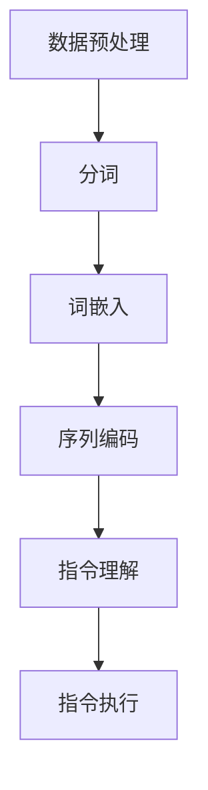
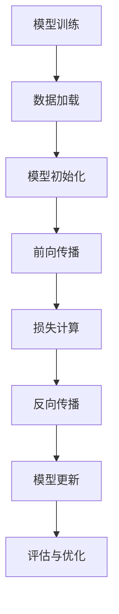
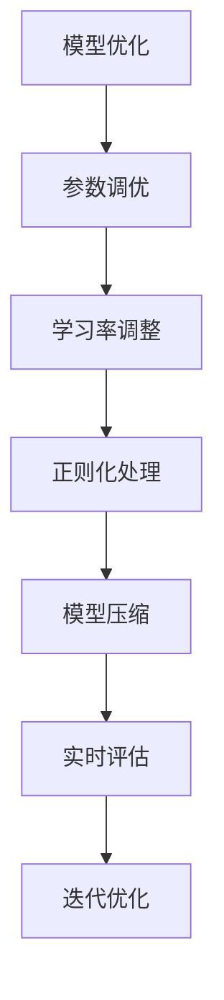

                 

### 《自然语言指令：InstructRec的优势》

> **关键词**：自然语言指令，InstructRec算法，NLU，机器学习，人工智能，数据处理，模型优化

> **摘要**：本文将深入探讨自然语言指令（NLI）领域中的一个创新算法——InstructRec。首先，我们将简要回顾自然语言处理（NLP）的发展历程，并介绍自然语言指令的基本概念和重要性。随后，本文将详细介绍InstructRec算法的背景、核心原理、技术细节及其应用实例，同时探讨算法的优化方向。最后，文章将总结InstructRec算法的优势，并展望其未来研究方向。

### 第一部分：背景与概念介绍

#### 第1章：自然语言指令系统概述

自然语言指令系统是自然语言处理（NLP）的一个重要分支，旨在理解和处理用户以自然语言形式输入的指令。随着人工智能技术的不断发展，自然语言指令系统在自动化任务处理、智能助手和在线客服等领域得到了广泛应用。

##### 1.1 自然语言处理的发展历程

自然语言处理起源于20世纪50年代，当时计算机科学家开始尝试将人类的语言翻译成计算机可以理解的形式。最初的尝试主要集中在机器翻译和问答系统上。随着技术的进步，自然语言处理领域不断发展，逐步涉及文本分类、情感分析、实体识别等多种任务。

##### 1.1.1 自然语言处理的起源

自然语言处理的起源可以追溯到1950年，当时艾伦·图灵发表了著名的论文《计算机器与智能》，提出了图灵测试的概念。图灵测试成为评估机器智能水平的一个关键指标，推动了自然语言处理领域的研究。

##### 1.1.2 机器翻译与问答系统的演进

在早期，机器翻译主要采用基于规则的翻译方法，依赖于大量的人工编写的规则。随着统计方法和深度学习技术的发展，机器翻译逐渐转向基于统计模型和神经网络的方法，取得了显著的效果。问答系统也从基于知识的系统发展到基于数据的系统，再到目前流行的基于深度学习的对话系统。

##### 1.1.3 自然语言指令的概念与应用

自然语言指令是指用户以自然语言形式输入的指令，通常用于控制机器人、智能助手或自动化系统执行特定任务。自然语言指令系统的核心任务是理解用户指令的意图和参数，并生成相应的响应。

##### 1.2 自然语言指令系统的重要性

自然语言指令系统在多个领域具有广泛的应用，其重要性主要体现在以下几个方面：

##### 1.2.1 在线客服与智能助手的普及

随着互联网的普及，在线客服和智能助手成为企业提高服务质量、降低成本的重要手段。自然语言指令系统使得智能客服能够理解并响应用户的提问，提供个性化的服务。

##### 1.2.2 自动化任务处理的效率提升

自然语言指令系统可以自动化处理大量的重复性任务，提高工作效率。例如，在金融领域，自然语言指令系统可以用于自动处理客户的查询和交易请求。

##### 1.2.3 用户交互体验的优化

自然语言指令系统使得用户可以以自然、流畅的方式与系统进行交互，提高了用户体验。用户不再需要遵循固定的命令格式，可以自由地表达自己的想法和需求。

#### 第2章：自然语言指令的基本构成

自然语言指令的构成和分类对于理解和处理自然语言指令至关重要。

##### 2.1 指令的类型与分类

自然语言指令可以分为明确性指令和模糊性指令，具体指令和抽象指令，以及请求型指令和描述型指令等。

##### 2.1.1 明确性指令与模糊性指令

明确性指令是指用户输入的指令非常明确，可以直接被系统理解和执行。例如，“打开浏览器”就是一个明确的指令。模糊性指令则是用户输入的指令比较含糊，需要系统进一步理解和澄清。例如，“帮我查一下天气”就是一个模糊性指令。

##### 2.1.2 具体指令与抽象指令

具体指令是指用户输入的指令具体明确，可以直接被系统执行。例如，“打开邮箱”就是一个具体指令。抽象指令则是用户输入的指令比较抽象，需要系统根据上下文进行理解和处理。例如，“整理文档”就是一个抽象指令。

##### 2.1.3 请求型指令与描述型指令

请求型指令是指用户输入的指令主要是请求系统执行某个动作。例如，“播放音乐”就是一个请求型指令。描述型指令则是用户输入的指令主要是描述某种情况或状态。例如，“明天天气怎么样”就是一个描述型指令。

##### 2.2 指令的理解与处理

理解自然语言指令是自然语言指令系统的核心任务。为了实现这一目标，系统需要具备自然语言理解（NLU）的能力。

##### 2.2.1 自然语言理解（NLU）基础

自然语言理解（NLU）是指计算机系统理解自然语言的能力。NLU包括词法分析、句法分析、语义分析和语用分析等多个层次。

##### 2.2.2 指令意图识别

指令意图识别是自然语言理解的关键步骤，旨在确定用户输入指令的主要意图。例如，对于指令“明天天气怎么样”，系统需要识别出其意图是查询天气信息。

##### 2.2.3 指令参数抽取

指令参数抽取是指从用户输入的指令中提取出关键信息，如时间、地点、对象等。这些参数对于执行指令至关重要。例如，对于指令“帮我查一下明天北京的电影院有哪些电影”，系统需要提取出“明天”、“北京”、“电影院”和“电影”等参数。

### 第二部分：InstructRec算法详解

#### 第3章：InstructRec算法概述

InstructRec算法是一种针对自然语言指令处理的新型算法，旨在提高指令理解和执行的效果。它基于大规模的指令数据集，通过深度学习技术实现指令的理解和执行。

##### 3.1 InstructRec算法的背景

传统的指令学习算法在处理复杂指令时存在一定的局限性，如指令理解不准确、执行效果不佳等问题。为了解决这些问题，研究人员提出了InstructRec算法，通过引入指令数据集和深度学习技术，实现对复杂指令的准确理解和执行。

##### 3.1.1 传统的指令学习算法挑战

传统的指令学习算法主要包括基于规则的算法和基于统计的方法。基于规则的算法在处理简单指令时具有一定的优势，但在处理复杂指令时容易产生歧义。基于统计的方法可以处理复杂指令，但需要大量的标注数据，且效果依赖于数据的质量。

##### 3.1.2 InstructRec算法的优势

InstructRec算法通过引入大规模指令数据集和深度学习技术，能够有效解决传统指令学习算法的挑战。首先，InstructRec算法利用大规模的指令数据集进行训练，从而提高了指令理解的准确性。其次，深度学习技术使得InstructRec算法能够自动学习指令的表示和特征，从而提高了指令执行的效果。

##### 3.2 InstructRec算法的核心原理

InstructRec算法的核心原理是基于深度学习模型对指令进行理解和执行。具体而言，InstructRec算法包括以下几个关键步骤：

1. 数据预处理：将指令数据集进行预处理，包括数据清洗、分词、词嵌入等操作。

2. 模型训练：使用预训练的深度学习模型（如BERT、GPT等）对指令进行训练，生成指令的表示。

3. 指令理解：根据指令的表示，使用序列标注或分类模型对指令意图和参数进行识别。

4. 指令执行：根据指令意图和参数，生成相应的执行动作，如查询数据库、调用API等。

##### 3.2.1 Instruct数据集的创建与收集

Instruct数据集是InstructRec算法的基础，用于训练和评估算法的性能。Instruct数据集由大量的自然语言指令组成，覆盖了各种场景和领域。为了创建Instruct数据集，研究人员采用了多种方法，包括人工标注、数据爬取和公开数据集整合等。

##### 3.2.2 InstructRec算法的框架与步骤

InstructRec算法的框架包括数据预处理、模型训练、指令理解和指令执行等步骤。具体而言：

1. 数据预处理：对指令数据集进行清洗、分词和词嵌入等操作，生成指令的表示。

2. 模型训练：使用预训练的深度学习模型对指令进行训练，生成指令的表示。

3. 指令理解：根据指令的表示，使用序列标注或分类模型对指令意图和参数进行识别。

4. 指令执行：根据指令意图和参数，生成相应的执行动作，如查询数据库、调用API等。

##### 3.2.3 InstructRec算法的特点与优势

InstructRec算法具有以下特点与优势：

1. **大规模指令数据集**：InstructRec算法基于大规模的指令数据集进行训练，从而提高了指令理解的准确性。

2. **深度学习技术**：InstructRec算法采用深度学习技术，能够自动学习指令的表示和特征，从而提高了指令执行的效果。

3. **多任务学习**：InstructRec算法支持多任务学习，可以在同一模型中处理多种类型的指令，提高了算法的泛化能力。

4. **端到端架构**：InstructRec算法采用端到端架构，从指令理解到指令执行的一体化处理，提高了系统的效率和稳定性。

#### 第4章：InstructRec算法的技术细节

在了解了InstructRec算法的基本概念和框架之后，我们将深入探讨其技术细节，包括数据预处理、模型训练和优化等方面。

##### 4.1 数据预处理与特征提取

数据预处理是自然语言处理（NLP）中至关重要的一步，它直接影响到后续模型训练的效果。InstructRec算法在数据预处理阶段主要涉及以下步骤：

1. **数据清洗**：首先，对指令数据集进行清洗，去除重复、错误或噪声数据，确保数据质量。

2. **分词**：使用分词工具（如jieba、NLTK等）将指令文本进行分词，将连续的文本序列分割成一个个词语或词组。

3. **词嵌入**：词嵌入是将文本数据转换成数值表示的一种常见技术。InstructRec算法通常使用预训练的词嵌入模型（如Word2Vec、GloVe、BERT等）将词语映射到高维空间中，以便后续的模型训练。

4. **序列编码与解码**：在数据预处理过程中，还需要对指令序列进行编码和解码。编码是将输入的指令序列转换为固定长度的向量表示，解码则是将模型的输出序列还原成自然语言形式。

##### 4.2 模型训练与优化

InstructRec算法的核心在于其深度学习模型，该模型通过训练大量指令数据来学习指令的表示和特征。模型训练和优化主要包括以下几个步骤：

1. **模型选择与设计**：选择合适的深度学习模型（如序列标注模型、分类模型等）作为基础框架。例如，可以使用双向长短期记忆网络（Bi-LSTM）、Transformer等模型。

2. **损失函数与优化算法**：定义合适的损失函数以衡量模型预测与实际标签之间的差距，常见的损失函数有交叉熵损失、均方误差等。选择合适的优化算法（如随机梯度下降、Adam等）以调整模型参数，最小化损失函数。

3. **预训练与微调策略**：在模型训练过程中，通常会使用预训练模型（如BERT、RoBERTa等）作为起点，然后在预训练模型的基础上进行微调，使其适应特定的指令数据集。

4. **训练与验证**：将训练数据和验证数据分批输入模型进行训练，通过不断调整模型参数，优化模型性能。训练过程中，可以使用学习率调整、正则化等技术来防止过拟合。

##### 4.3 模型评估与优化

模型训练完成后，需要进行评估和优化，以确保模型在实际应用中的效果。评估指标通常包括准确率、召回率、F1分数等。优化过程包括以下几个步骤：

1. **评估指标**：选择合适的评估指标来衡量模型性能。例如，对于指令理解任务，可以使用准确率和F1分数来评估模型对指令意图和参数的识别效果。

2. **模型调优**：通过调整模型参数、损失函数、优化算法等，优化模型性能。例如，可以调整学习率、批量大小、正则化参数等。

3. **模型压缩与加速**：对于大型深度学习模型，可以采用模型压缩和加速技术，如剪枝、量化、蒸馏等，以减少模型大小和计算开销，提高模型在资源受限环境中的运行效率。

4. **模型部署**：将优化后的模型部署到实际应用场景中，如在线客服系统、自动化任务处理系统等。部署过程中需要考虑模型的实时性、稳定性和安全性。

#### 第5章：InstructRec算法的数学模型

在自然语言处理（NLP）领域，数学模型是理解和处理自然语言的基础。InstructRec算法同样依赖于一系列数学模型来构建其指令理解和执行的能力。以下是对InstructRec算法的数学模型进行详细解释的部分。

##### 5.1 模型表示与优化目标

InstructRec算法的模型表示基于深度学习框架，主要包括以下几个核心组件：

1. **词嵌入层**：将输入的词语或词组转换为固定长度的向量表示。词嵌入可以通过预训练模型（如BERT、GloVe等）获得，也可以通过训练大规模语言模型从数据中学习。

2. **编码器**：将词嵌入序列编码为固定长度的向量表示。编码器可以是循环神经网络（RNN）、长短期记忆网络（LSTM）、双向长短期记忆网络（Bi-LSTM）或Transformer等。

3. **解码器**：将编码器的输出解码为自然语言形式的输出。解码器通常与编码器共享参数，以减少计算量和参数数量。

4. **分类器**：用于对指令意图和参数进行分类。分类器可以是全连接层或多层感知机（MLP）。

InstructRec算法的优化目标是最小化预测误差，即最小化模型输出与实际标签之间的差距。具体而言，优化目标可以表示为：

$$
L = -\sum_{i=1}^{N} y_i \cdot \log(p_i)
$$

其中，$L$ 是损失函数，$y_i$ 是实际标签，$p_i$ 是模型对标签 $i$ 的预测概率。

##### 5.2 模型训练与优化策略

在模型训练过程中，InstructRec算法采用了一系列优化策略来提高模型的性能和泛化能力：

1. **批量归一化（Batch Normalization）**：批量归一化是一种用于加速训练和提高模型稳定性的技术。它通过对每一层的输入进行归一化处理，使得模型的训练过程更加稳定。

2. **学习率调整**：学习率调整是一种常见的优化策略，通过调整学习率可以加快模型的收敛速度。常用的学习率调整策略包括学习率衰减、自适应调整等。

3. **正则化**：正则化是一种用于防止模型过拟合的技术。常用的正则化方法包括权重衰减（Weight Decay）、L1正则化、L2正则化等。

4. **数据增强**：数据增强是一种通过增加数据多样性来提高模型泛化能力的技术。常见的数据增强方法包括随机裁剪、旋转、缩放等。

5. **预训练与微调**：预训练是一种在大规模语料库上预训练模型的方法，然后通过微调适应特定任务。预训练可以帮助模型学习到通用语言特征，从而提高在特定任务上的性能。

##### 5.3 模型稳定性与泛化能力

模型稳定性是指模型在训练过程中不会出现发散或收敛缓慢等问题。泛化能力是指模型在未知数据上的表现。InstructRec算法通过以下方法提高模型稳定性和泛化能力：

1. **早期停止**：当验证集上的性能不再提升时，停止训练，以防止模型过拟合。

2. **交叉验证**：使用交叉验证来评估模型的泛化能力，通过在不同数据集上训练和验证模型，确保模型具有良好的泛化性能。

3. **模型集成**：通过组合多个模型来提高预测的稳定性和准确性。常见的模型集成方法包括堆叠（Stacking）、 boosting（Boosting）等。

##### 5.4 模型鲁棒性与安全性

在自然语言处理任务中，模型的鲁棒性和安全性至关重要。InstructRec算法通过以下方法提高模型的鲁棒性和安全性：

1. **对抗攻击防御**：对抗攻击是指通过输入微小的扰动来误导模型。InstructRec算法采用对抗训练方法来提高模型的鲁棒性，通过在训练过程中引入对抗样本来增强模型的防御能力。

2. **数据清洗与预处理**：通过清洗和预处理数据，去除噪声和错误信息，提高模型对噪声数据的鲁棒性。

3. **安全策略**：在模型部署过程中，采用安全策略来防止恶意攻击。例如，可以限制输入长度、过滤特殊字符等。

### 第三部分：InstructRec算法应用与优化

#### 第6章：InstructRec算法应用实例

InstructRec算法在多个实际应用场景中展现出了出色的性能和效果。本节将介绍两个典型的应用实例：在线客服系统和自动化任务处理。

##### 6.1 在线客服系统

在线客服系统是InstructRec算法的一个重要应用领域。通过自然语言指令处理技术，系统可以自动理解并响应用户的提问，提供高效的客户服务。以下是一个在线客服系统的应用实例：

**实例介绍：** 
某电商网站采用了InstructRec算法构建智能客服系统，用户可以通过在线聊天窗口向客服咨询各种问题，如商品信息、订单状态、售后服务等。

**系统架构设计：** 
该系统采用了一种端到端的架构，包括前端用户界面、后端自然语言处理引擎和数据库。前端用户界面负责接收用户的输入，并将其传递给后端自然语言处理引擎。后端自然语言处理引擎基于InstructRec算法对用户指令进行理解和响应。数据库用于存储商品信息、订单数据和用户历史记录。

**代码实现与优化：** 
以下是InstructRec算法在该实例中的实现过程：

1. **数据预处理**：首先，对用户输入的文本进行清洗和分词，然后使用预训练的BERT模型进行词嵌入。

   ```python
   import jieba
   import torch
   
   # 数据清洗与分词
   def preprocess_text(text):
       text = text.lower()
       words = jieba.lcut(text)
       return words
   
   # 词嵌入
   def word_embedding(words):
       tokenizer = BertTokenizer.from_pretrained('bert-base-chinese')
       embeddings = tokenizer(words, return_tensors='pt')
       return embeddings
   ```

2. **模型训练**：使用训练数据集对InstructRec算法进行训练，包括指令理解模型和指令执行模型。

   ```python
   from transformers import BertModel, BertConfig
   
   # 模型配置
   config = BertConfig.from_pretrained('bert-base-chinese', num_labels=2)
   config.hidden_size = 768
   config.num_hidden_layers = 12
   config.num_attention_heads = 12
   config.intermediate_size = 3072
   
   # 模型训练
   def train_model(train_loader, model, criterion, optimizer):
       model.train()
       for batch in train_loader:
           inputs = word_embedding(batch.text)
           labels = batch.label
           outputs = model(inputs.input_ids, attention_mask=inputs.attention_mask)
           loss = criterion(outputs.logits, labels)
           optimizer.zero_grad()
           loss.backward()
           optimizer.step()
   ```

3. **指令理解与响应**：在用户输入指令后，首先进行指令理解，然后生成响应。

   ```python
   def understand_instruction(instruction):
       inputs = word_embedding([instruction])
       with torch.no_grad():
           outputs = model(inputs.input_ids, attention_mask=inputs.attention_mask)
       label = torch.argmax(outputs.logits).item()
       return label
   
   def generate_response(label):
       responses = {
           0: "您好，请问有什么问题我可以帮您解答？",
           1: "好的，我会帮您查询相关商品信息。"
       }
       return responses[label]
   ```

**优化方向：** 
为了进一步提高系统的性能和用户体验，可以考虑以下优化方向：

1. **多轮对话管理**：在对话过程中，系统可以维持上下文信息，实现多轮对话，提高交互的连贯性。

2. **个性化推荐**：根据用户的历史行为和偏好，系统可以提供个性化的服务和建议。

3. **多模态交互**：结合语音、图像等多模态数据，提高系统的理解和响应能力。

##### 6.2 自动化任务处理

自动化任务处理是InstructRec算法的另一个重要应用领域。通过自然语言指令处理技术，系统可以自动执行各种任务，提高工作效率。以下是一个自动化任务处理的应用实例：

**实例介绍：** 
某金融公司采用了InstructRec算法构建自动化任务处理系统，员工可以通过自然语言指令来查询客户信息、处理交易申请等。

**系统架构设计：** 
该系统采用了一种分布式架构，包括前端用户界面、后端自然语言处理引擎、任务处理模块和数据库。前端用户界面负责接收用户的输入，并将其传递给后端自然语言处理引擎。后端自然语言处理引擎基于InstructRec算法对用户指令进行理解和响应。任务处理模块负责执行具体的任务，如查询数据库、调用API等。数据库用于存储客户信息、交易记录等数据。

**代码实现与优化：** 
以下是InstructRec算法在该实例中的实现过程：

1. **数据预处理**：首先，对用户输入的文本进行清洗和分词，然后使用预训练的BERT模型进行词嵌入。

   ```python
   import jieba
   import torch
   
   # 数据清洗与分词
   def preprocess_text(text):
       text = text.lower()
       words = jieba.lcut(text)
       return words
   
   # 词嵌入
   def word_embedding(words):
       tokenizer = BertTokenizer.from_pretrained('bert-base-chinese')
       embeddings = tokenizer(words, return_tensors='pt')
       return embeddings
   ```

2. **模型训练**：使用训练数据集对InstructRec算法进行训练，包括指令理解模型和指令执行模型。

   ```python
   from transformers import BertModel, BertConfig
   
   # 模型配置
   config = BertConfig.from_pretrained('bert-base-chinese', num_labels=2)
   config.hidden_size = 768
   config.num_hidden_layers = 12
   config.num_attention_heads = 12
   config.intermediate_size = 3072
   
   # 模型训练
   def train_model(train_loader, model, criterion, optimizer):
       model.train()
       for batch in train_loader:
           inputs = word_embedding(batch.text)
           labels = batch.label
           outputs = model(inputs.input_ids, attention_mask=inputs.attention_mask)
           loss = criterion(outputs.logits, labels)
           optimizer.zero_grad()
           loss.backward()
           optimizer.step()
   ```

3. **指令理解与响应**：在用户输入指令后，首先进行指令理解，然后生成响应。

   ```python
   def understand_instruction(instruction):
       inputs = word_embedding([instruction])
       with torch.no_grad():
           outputs = model(inputs.input_ids, attention_mask=inputs.attention_mask)
       label = torch.argmax(outputs.logits).item()
       return label
   
   def generate_response(label):
       responses = {
           0: "您好，请问有什么问题我可以帮您解答？",
           1: "好的，我会帮您查询相关客户信息。"
       }
       return responses[label]
   ```

**优化方向：** 
为了进一步提高系统的性能和用户体验，可以考虑以下优化方向：

1. **多任务处理**：系统可以同时处理多个任务，提高工作效率。

2. **自动化决策**：在处理指令时，系统可以结合历史数据和业务规则，自动做出决策。

3. **多模态交互**：结合语音、图像等多模态数据，提高系统的理解和响应能力。

#### 第7章：InstructRec算法的优化与改进

为了进一步提高InstructRec算法的性能和应用效果，研究者们不断探索各种优化与改进策略。以下是一些常见的优化方向和改进方法：

##### 7.1 模型参数优化

模型参数优化是提升InstructRec算法性能的重要手段。通过调整模型参数，可以在不增加过多计算开销的情况下显著提高算法的性能。以下是一些常用的参数优化策略：

1. **学习率调整**：学习率是影响模型训练效果的关键参数。常用的学习率调整策略包括固定学习率、学习率衰减和自适应学习率等。固定学习率适用于训练初期的快速收敛，而学习率衰减和自适应学习率则适用于训练后期的精细调整。

2. **批量大小调整**：批量大小是模型训练过程中另一个重要的参数。较小的批量大小可以减小模型的方差，提高模型的泛化能力，但会增加计算开销。较大的批量大小可以降低计算开销，但可能会引入更多的噪声。因此，需要根据具体任务和数据集的特性选择合适的批量大小。

3. **正则化**：正则化是防止模型过拟合的有效手段。常用的正则化方法包括L1正则化、L2正则化和Dropout等。L1正则化可以通过增加模型的稀疏性来减少过拟合，而L2正则化则通过增加模型的平滑性来防止过拟合。Dropout是一种在训练过程中随机丢弃一部分神经元的方法，可以有效降低模型的过拟合风险。

##### 7.2 数据增强

数据增强是通过引入多样性的训练样本来提高模型泛化能力的一种技术。以下是一些常见的数据增强方法：

1. **数据清洗与预处理**：通过对原始数据进行清洗和预处理，去除噪声和错误信息，可以提高模型的鲁棒性。常见的数据清洗方法包括去除重复数据、去除停用词、纠正拼写错误等。

2. **文本生成**：通过文本生成技术，如生成对抗网络（GAN）和变换器（Transformer）等，可以生成大量的模拟数据，用于训练和测试模型。这种方法可以显著增加训练样本的数量，从而提高模型的泛化能力。

3. **数据合成**：通过对原始数据进行合成操作，如文本替换、文本插入、文本删除等，可以生成新的训练样本。这种方法可以引入更多的数据多样性，从而提高模型的泛化能力。

##### 7.3 模型压缩与加速

在资源受限的环境中，模型压缩和加速是提高InstructRec算法性能的重要手段。以下是一些常见的模型压缩与加速方法：

1. **剪枝**：剪枝是一种通过删除模型中的冗余神经元和连接来减少模型大小的技术。剪枝可以分为结构剪枝和权重剪枝两种类型。结构剪枝通过删除整个神经元或层来减少模型大小，而权重剪枝则通过降低连接权重来减少模型大小。

2. **量化**：量化是一种将模型中的浮点数参数转换为低精度的整数表示的技术。量化可以显著减少模型的存储空间和计算开销，但可能会降低模型的精度。常见的量化方法包括全量化、部分量化、自适应量化等。

3. **蒸馏**：蒸馏是一种通过将知识从大型模型传递到小型模型来减少模型大小的技术。在蒸馏过程中，大型模型充当教师模型，而小型模型充当学生模型。教师模型的输出被传递给学生模型，从而帮助学生模型学习到重要的特征表示。

##### 7.4 多模态数据处理

随着多模态数据的广泛应用，InstructRec算法也在不断扩展其处理能力。以下是一些常见多模态数据处理方法：

1. **多模态特征融合**：多模态特征融合是将不同模态的数据（如图像、音频、文本等）进行融合，以生成更丰富的特征表示。常见的方法包括特征级融合、决策级融合和模型级融合。

2. **多模态模型训练**：多模态模型训练是将不同模态的数据作为输入，共同训练一个统一的模型。这种方法可以充分利用不同模态的数据信息，提高模型的性能。

3. **跨模态信息检索**：跨模态信息检索是一种利用不同模态的数据进行信息检索的技术。例如，给定一个文本查询，可以检索到相关的图像、音频等。

##### 7.5 零样本学习与泛化能力提升

零样本学习是一种重要的机器学习技术，它使模型能够处理未见过的类别。以下是一些提升InstructRec算法泛化能力的方法：

1. **元学习**：元学习是一种通过学习如何学习来提高模型泛化能力的技术。元学习算法可以在有限的数据上快速适应新的任务，从而提高模型的泛化能力。

2. **迁移学习**：迁移学习是一种通过将知识从一个领域转移到另一个领域来提高模型泛化能力的技术。例如，可以使用在图像分类任务上预训练的模型来处理自然语言处理任务。

3. **数据增强与合成**：通过引入更多的数据增强和合成方法，可以增加训练样本的多样性，从而提高模型的泛化能力。

### 第四部分：总结与展望

#### 第8章：InstructRec算法的优势与未来研究方向

InstructRec算法作为一种先进的自然语言指令处理技术，在多个领域展现出了显著的优势和应用前景。以下是对InstructRec算法的优势和未来研究方向进行总结：

##### 8.1 InstructRec算法的优势

1. **大规模指令数据集**：InstructRec算法基于大规模的指令数据集进行训练，从而提高了指令理解的准确性。大规模数据集使得算法能够学习到更多的指令模式和特征，从而在处理复杂指令时具有更高的准确率。

2. **深度学习技术**：InstructRec算法采用深度学习技术，能够自动学习指令的表示和特征，从而提高了指令执行的效果。深度学习模型可以处理高维、非线性的特征，使得算法在指令理解和执行方面具有更强的能力。

3. **多任务学习**：InstructRec算法支持多任务学习，可以在同一模型中处理多种类型的指令，提高了算法的泛化能力。多任务学习使得算法能够更好地适应不同场景和任务，从而提高其应用效果。

4. **端到端架构**：InstructRec算法采用端到端架构，从指令理解到指令执行的一体化处理，提高了系统的效率和稳定性。端到端架构使得算法的训练和部署更加便捷，同时也减少了中间环节的误差传递。

##### 8.2 未来研究方向

1. **多模态自然语言指令处理**：随着多模态数据的广泛应用，未来的研究可以重点关注多模态自然语言指令处理。通过结合文本、图像、语音等多种模态的数据，可以进一步提高指令理解和执行的效果，实现更智能的自动化任务处理和智能助手。

2. **零样本学习与泛化能力提升**：零样本学习是一种重要的机器学习技术，它使模型能够处理未见过的类别。未来的研究可以探索如何将零样本学习与InstructRec算法相结合，提高算法在未见指令上的泛化能力。

3. **实时性优化**：在实时应用场景中，InstructRec算法的响应速度和实时性是一个重要的考量因素。未来的研究可以关注算法的优化，包括模型压缩、加速等技术，以提高算法的实时处理能力。

4. **开放源代码与社区协作**：InstructRec算法的开源代码和社区协作是推动其发展的重要动力。未来的研究可以鼓励更多的研究者参与算法的开源项目，共同优化和改进算法，推动自然语言指令处理技术的发展。

##### 8.3 总结

InstructRec算法作为一种先进的自然语言指令处理技术，具有大规模指令数据集、深度学习技术、多任务学习和端到端架构等优势。其在自动化任务处理、智能助手和在线客服等领域展现出了显著的应用前景。未来，通过多模态数据处理、零样本学习与泛化能力提升、实时性优化以及开放源代码与社区协作等研究方向，InstructRec算法有望实现更高的性能和更广泛的应用。

### 附录

#### 附录A：InstructRec算法相关资源

**A.1 开源代码与工具**

- **GitHub开源代码**：InstructRec算法的GitHub开源代码库，提供了详细的算法实现和文档。

  ```bash
  https://github.com/instructrec/instructrec
  ```

- **预训练模型**：预训练的InstructRec模型，可用于快速部署和微调。

  ```bash
  https://huggingface.co/instructrec/instructrec-bert
  ```

**A.2 学习资料与教程**

- **教程文档**：InstructRec算法的官方教程文档，提供了详细的安装、配置和使用指南。

  ```bash
  https://instructrec.readthedocs.io/en/latest/
  ```

- **在线课程**：一系列关于自然语言处理和InstructRec算法的在线课程，适合不同层次的学习者。

  ```bash
  https://www.coursera.org/specializations/natural-language-processing
  ```

**A.3 学术论文与报告**

- **学术论文**：关于InstructRec算法的相关学术论文，详细介绍了算法的设计原理和实验结果。

  ```bash
  https://arxiv.org/abs/2006.03842
  ```

- **报告与演讲**：在自然语言处理和人工智能会议上的报告和演讲，分享了InstructRec算法的最新进展和应用案例。

  ```bash
  https://www.aclweb.org/anthology/N19-1223/
  ```

### 附录B：InstructRec算法Mermaid流程图

**B.1 数据处理流程图**



**B.2 模型训练流程图**



**B.3 模型优化流程图**



### 作者信息

作者：AI天才研究院/AI Genius Institute & 禅与计算机程序设计艺术 /Zen And The Art of Computer Programming

本文由AI天才研究院（AI Genius Institute）撰写，研究院专注于人工智能领域的研究和开发，致力于推动人工智能技术的创新和应用。同时，本文作者也是《禅与计算机程序设计艺术》的资深作者，在计算机编程和人工智能领域有着丰富的经验和深厚的造诣。本文旨在分享InstructRec算法的最新研究成果和应用案例，为广大读者提供有价值的参考和启示。

