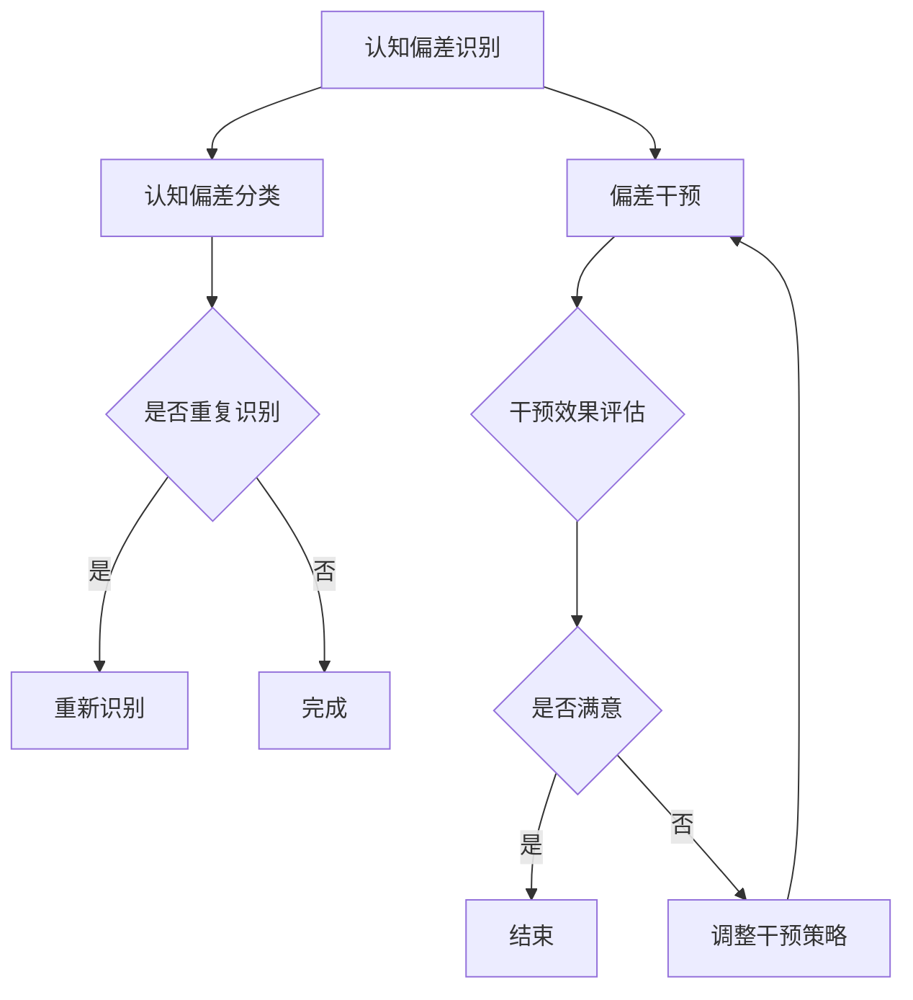

                 

# 认知偏差如何影响我们对世界的理解

## 关键词：
认知偏差、心理学、社会学、决策、行为、影响、减少策略

## 摘要：
本文将深入探讨认知偏差如何影响我们对世界的理解。认知偏差是一种普遍存在于人类思维中的现象，它影响了我们的感知、判断和决策。文章首先概述了认知偏差的定义、类型及其在心理学和社会学中的重要性，随后详细分析了认知偏差的心理学机制。接着，文章探讨了认知偏差在个体和社会中的应用，并提出了评估与减少认知偏差的方法。最后，文章展望了认知偏差研究的未来趋势与发展，以及个体与社会的应对策略。

### 第一部分：认知偏差概述

#### 第1章：认知偏差的基础概念

1. **认知偏差的定义与重要性**

认知偏差是指人们在信息处理过程中，由于各种原因导致的信息加工和解释错误，从而影响判断和决策的现象。这些偏差可能是由于大脑的认知处理机制限制、环境因素的影响或者个体心理特征等原因造成的。认知偏差是人类认知活动中的一个普遍现象，对个体和社会的决策和行为具有重要影响。

2. **常见认知偏差的类型**

认知偏差种类繁多，以下列举几种常见的认知偏差类型：

- **可见性偏差**：只关注明显的、容易发现的信息，忽视其他重要的信息。
- **验后偏见**：在观察结果后，对初始预测或假设进行过度调整，导致判断不准确。
- **确认偏见**：倾向于寻找和记住符合已有观点的信息，忽视与观点相悖的证据。
- **锚定效应**：过分依赖最初接收到的信息，从而影响后续判断。
- **沉没成本**：对已经投入的时间和资源过分重视，导致决策不当。
- **邦迪效应**：高估自己和他人的能力，低估他人的风险。

3. **认知偏差的起源与影响**

认知偏差的起源可以从生物学、心理学和社会学等多个角度进行分析。从生物学角度，认知偏差可能源于大脑的认知处理机制，如神经网络的适应性变化；从心理学角度，认知偏差可能源于个体心理特征，如情绪、动机和经验的影响；从社会学角度，认知偏差可能源于社会环境和文化背景的影响。

认知偏差对个体和社会的影响深远。在个体层面，认知偏差可能导致判断和决策失误，影响个人的生活质量和工作效率。在社会层面，认知偏差可能导致社会决策失误，影响社会稳定和经济发展。因此，理解认知偏差的起源和影响对于我们改进认知过程、提高决策质量具有重要意义。

4. **认知偏差的理论框架**

认知偏差的理论框架多种多样，以下是几种重要的理论：

- **阿莫斯·特沃斯基与丹尼尔·卡内曼的启发式与偏差理论**：该理论提出了系统一和系统二思维模式，解释了人们在信息处理过程中如何产生认知偏差。
- **心理学与社会学中的其他相关理论**：如认知发展理论、社会认知理论、认知心理学理论等，这些理论从不同角度探讨了认知偏差的产生和影响。

5. **认知偏差与决策**

认知偏差对决策过程具有重要影响。在个体层面，认知偏差可能导致风险偏好或风险厌恶，影响投资决策和职业规划。在社会层面，认知偏差可能导致政治决策的失误、公共政策的制定不当等。

为了减少认知偏差对决策的影响，我们可以采取以下策略：

- 提高自我意识：认识到认知偏差的存在，并学会辨别和纠正偏差。
- 增强批判性思维：培养怀疑精神和批判性思维，避免盲目接受信息。
- 提高信息质量：获取全面、准确的信息，避免信息偏差。
- 使用决策支持工具：借助技术手段，如人工智能和大数据分析，提高决策的客观性和准确性。

6. **认知偏差与心理学实验**

心理学实验为研究认知偏差提供了有力工具。经典实验如艾宾浩斯的遗忘曲线实验、斯坦福监狱实验等，揭示了认知偏差的多种表现形式。通过心理学实验，我们可以验证认知偏差的理论框架，并探索减少认知偏差的方法。

#### 第2章：认知偏差的心理学机制

1. **认知偏差的心理机制**

认知偏差的心理机制涉及多个方面，包括认知框架、知觉和记忆等。认知框架是指人们如何解释和组织信息，从而影响判断和决策。知觉是指人们对外部信息的感知和处理，记忆是指人们对信息的存储和提取。

2. **大脑中的认知偏差**

大脑中的认知偏差与神经网络的适应性有关。神经网络通过不断调整连接权重，适应环境变化，从而影响信息处理和判断。认知偏差可能源于神经网络的结构和功能特点，如局部最优解、偏差传播等。

3. **心理学实验中的认知偏差**

心理学实验为研究认知偏差提供了丰富的数据和方法。通过实验设计，我们可以观察和测量认知偏差的表现形式，如视觉错觉、记忆偏差等。实验方法包括问卷调查、实验模拟、行为观察等。

4. **认知偏差的遗传与学习**

认知偏差具有一定的遗传性，但也在一定程度上受学习影响。遗传因素可能影响大脑结构和功能，从而影响认知偏差的产生。学习过程则通过经验和环境塑造个体的认知模式。

5. **认知偏差与情绪**

情绪与认知偏差之间存在复杂关系。情绪可能影响认知偏差的产生和表现形式，如焦虑可能导致风险偏好，喜悦可能导致过度自信。同时，认知偏差也可能影响情绪体验，如负面情绪可能导致认知偏差的加剧。

6. **认知偏差与心理健康**

认知偏差对心理健康具有重要影响。认知偏差可能导致情绪障碍、心理压力和社交困难。例如，消极认知偏差可能导致抑郁症和焦虑症。因此，理解和减少认知偏差对于维护心理健康具有重要意义。

### 第二部分：认知偏差在个体和社会中的应用

#### 第3章：认知偏差在个体行为中的应用

1. **认知偏差在消费行为中的应用**

消费行为中的认知偏差包括品牌偏好、价格效应、广告效应等。品牌偏好是指消费者对某些品牌过度信任，忽视其他品牌的信息。价格效应是指消费者对价格敏感，价格变动可能导致决策变化。广告效应是指广告信息对消费者决策的引导作用。

为了减少消费行为中的认知偏差，可以采取以下策略：

- 提高消费者意识：教育消费者了解认知偏差的存在，并学会辨别和纠正偏差。
- 提供全面信息：提供更多、更全面的产品信息，帮助消费者做出更明智的决策。
- 透明化：提高广告和营销活动的透明度，减少虚假信息对消费者决策的影响。

2. **认知偏差在职场中的应用**

职场中的认知偏差包括绩效评估、招聘决策、团队合作等。绩效评估中的认知偏差可能导致不公平的评价，影响员工的工作积极性和满意度。招聘决策中的认知偏差可能导致招聘失误，影响团队的整体效能。团队合作中的认知偏差可能导致沟通障碍和合作效率低下。

为了减少职场中的认知偏差，可以采取以下策略：

- 增强自我意识：提高员工对认知偏差的认识，鼓励自我反思和纠正偏差。
- 使用客观评估工具：采用客观的绩效评估工具，减少主观偏见的影响。
- 提高沟通技巧：加强团队合作中的沟通，减少认知偏差对沟通效果的负面影响。

3. **认知偏差在教育中的应用**

教育中的认知偏差包括教师教学策略、学生学习方法、教育评价等。教师教学策略中的认知偏差可能导致教学方法不当，影响教学效果。学生学习方法中的认知偏差可能导致学习方法不当，影响学习成果。教育评价中的认知偏差可能导致评价结果不准确，影响学生的学业发展和职业规划。

为了减少教育中的认知偏差，可以采取以下策略：

- 提高教师培训：加强教师对认知偏差的认识，提高教学策略的科学性。
- 采用多元评价方式：结合多种评价方式，减少单一评价方式的偏差。
- 培养批判性思维：教育学生学会辨别和纠正认知偏差，提高学习效果。

4. **认知偏差在人际关系中的应用**

人际关系中的认知偏差包括自我认知偏差、人际交往偏差、情绪认知偏差等。自我认知偏差可能导致自我评价不准确，影响自尊心和自信心。人际交往偏差可能导致沟通障碍和关系紧张。情绪认知偏差可能导致情绪失控，影响人际关系。

为了减少人际关系中的认知偏差，可以采取以下策略：

- 提高自我认知：通过自我反思和他人反馈，提高自我认知的准确性。
- 增强沟通技巧：学会有效沟通，减少认知偏差对沟通效果的负面影响。
- 培养情绪管理能力：学会情绪管理，避免情绪认知偏差对人际关系的负面影响。

5. **认知偏差在自我提升中的应用**

自我提升中的认知偏差包括目标设定、行动规划、自我激励等。目标设定中的认知偏差可能导致目标设定不准确，影响自我提升效果。行动规划中的认知偏差可能导致行动规划不合理，影响自我提升效率。自我激励中的认知偏差可能导致自我激励效果不佳，影响自我提升动力。

为了减少自我提升中的认知偏差，可以采取以下策略：

- 明确目标：设定具体、可行的目标，减少目标设定偏差。
- 科学规划：制定合理的行动规划，减少行动规划偏差。
- 保持积极心态：培养积极心态，减少自我激励偏差。

#### 第4章：认知偏差在社会层面中的应用

1. **认知偏差在政治中的应用**

政治决策中的认知偏差可能导致政治决策失误，影响社会稳定和经济发展。政治认知偏差包括政治偏见、政治信息处理偏差、政治决策模式偏差等。政治偏见可能导致对某些群体的歧视，影响政策制定和执行。政治信息处理偏差可能导致对政治信息的误判，影响政治决策的科学性。

为了减少政治决策中的认知偏差，可以采取以下策略：

- 提高政治素养：加强政治教育和培训，提高公众的政治素养和判断能力。
- 透明化政治决策：提高政治决策的透明度，减少信息偏差的影响。
- 多元化政治参与：鼓励多元化政治参与，减少政治偏见的影响。

2. **认知偏差在媒体中的应用**

媒体传播中的认知偏差可能导致信息失真，影响公众的认知和行为。媒体认知偏差包括媒体偏见、媒体处理偏差、媒体效应等。媒体偏见可能导致对某些事件或观点的过度关注，影响公众的认知。媒体处理偏差可能导致对信息的过度简化或夸大，影响公众的理解。

为了减少媒体传播中的认知偏差，可以采取以下策略：

- 媒体责任：提高媒体的职业道德和社会责任感，减少偏见和误导性报道。
- 多元化媒体：鼓励多元化媒体的发展，减少单一媒体垄断的影响。
- 媒体素养：加强公众的媒体素养教育，提高公众对媒体信息的辨别能力。

3. **认知偏差在法律中的应用**

法律判断中的认知偏差可能导致司法不公，影响社会公平和正义。法律认知偏差包括法官偏见、证据处理偏差、法律解释偏差等。法官偏见可能导致对被告或原告的判断不准确。证据处理偏差可能导致对证据的误判或忽视。法律解释偏差可能导致对法律条款的误解或滥用。

为了减少法律判断中的认知偏差，可以采取以下策略：

- 增强法官培训：加强法官对认知偏差的认识，提高司法公正性。
- 严格证据审查：加强对证据的审查和判断，减少证据偏差的影响。
- 法律解释规范化：规范法律解释，减少法律解释偏差的影响。

4. **认知偏差在经济中的应用**

经济决策中的认知偏差可能导致经济失误，影响经济发展和社会稳定。经济认知偏差包括市场预测偏差、投资决策偏差、风险管理偏差等。市场预测偏差可能导致对市场趋势的误判。投资决策偏差可能导致投资失误，影响经济发展。风险管理偏差可能导致风险控制不足，影响经济安全。

为了减少经济决策中的认知偏差，可以采取以下策略：

- 提高经济素养：加强公众的经济素养教育，提高公众对经济现象的理解和分析能力。
- 多元化经济参与：鼓励多元化经济参与，减少单一经济主体的垄断和偏见。
- 优化经济政策：制定科学、合理的经济政策，减少经济认知偏差的影响。

5. **认知偏差在社会心理学中的应用**

社会心理学中的认知偏差包括群体认知偏差、社会认知偏差、偏见与歧视等。群体认知偏差可能导致对群体的刻板印象和偏见。社会认知偏差可能导致对他人行为的误判。偏见与歧视可能导致对某些群体的不公平对待。

为了减少社会心理学中的认知偏差，可以采取以下策略：

- 提高社会认知：加强公众的社会认知教育，提高公众对社会现象的理解和判断能力。
- 多元化社会参与：鼓励多元化社会参与，减少社会偏见和歧视。
- 社会干预：通过政策、教育和宣传等手段，减少社会认知偏差的影响。

6. **认知偏差在公共卫生中的应用**

公共卫生决策中的认知偏差可能导致公共卫生措施的失误，影响公共健康和社会稳定。公共卫生认知偏差包括健康信息处理偏差、公共卫生决策模式偏差等。健康信息处理偏差可能导致对健康信息的误判。公共卫生决策模式偏差可能导致公共卫生措施的制定和执行不合理。

为了减少公共卫生决策中的认知偏差，可以采取以下策略：

- 提高健康素养：加强公众的健康素养教育，提高公众对健康信息的辨别和判断能力。
- 科学决策：制定基于科学数据和证据的公共卫生政策，减少决策偏差的影响。
- 公众参与：鼓励公众参与公共卫生决策过程，减少决策偏差的影响。

### 第三部分：认知偏差的评估与减少

#### 第5章：认知偏差的评估方法

1. **认知偏差的评估工具**

评估认知偏差的工具主要包括自我评估问卷、实验评估方法和大数据分析方法。自我评估问卷是一种简便有效的方法，通过让个体自我报告他们的认知偏差表现，评估其认知偏差的程度。实验评估方法则通过设计特定的实验场景，观察和测量个体在信息处理过程中的偏差行为。大数据分析方法则利用大量数据进行统计分析，识别和评估认知偏差的表现和趋势。

2. **评估认知偏差的步骤**

评估认知偏差的步骤通常包括以下几个阶段：

- 确定评估目标：明确评估认知偏差的目的和对象，如个体、群体或特定领域。
- 设计评估工具：根据评估目标，选择合适的评估工具，如自我评估问卷、实验评估方法或大数据分析工具。
- 进行数据收集：通过问卷调查、实验观察或数据分析等方式，收集有关认知偏差的数据。
- 数据分析：对收集到的数据进行统计分析，识别认知偏差的表现和特点。
- 结果解释：根据分析结果，解释认知偏差的影响和意义，为后续干预提供依据。

3. **评估认知偏差的应用场景**

认知偏差的评估方法可以应用于多个领域，包括个人发展、组织管理和社会政策制定等。在个人发展中，通过评估认知偏差，个体可以更好地了解自己的思维模式和行为习惯，从而改进自我认知和提升决策能力。在组织管理中，通过评估认知偏差，管理者可以识别员工在决策和行为中的偏差，制定相应的培训和管理策略。在社会政策制定中，通过评估认知偏差，政策制定者可以了解公众对政策信息的认知和理解程度，优化政策设计和实施。

#### 第6章：减少认知偏差的策略

1. **提高认知能力的策略**

提高认知能力是减少认知偏差的重要途径。以下是一些提高认知能力的策略：

- **增强自我意识**：通过自我反思和自我评估，认识自己的认知偏差，提高自我意识。
- **培养批判性思维**：学会质疑和批判信息来源，提高思维的独立性和判断力。
- **学习新的知识**：不断学习新知识，扩展认知领域，提高对信息的理解和处理能力。
- **多角度思考**：尝试从不同角度和立场分析问题，减少认知偏差的影响。

2. **改变认知偏差的方法**

改变认知偏差需要采取针对性的方法，以下是一些具体方法：

- **提供反例**：通过展示与认知偏差相反的例子，帮助个体重新审视和调整认知框架。
- **改变认知框架**：通过教育和培训，引导个体建立新的认知框架，减少认知偏差的影响。
- **提高信息质量**：提供准确、全面和可信的信息，减少信息偏差的影响。
- **增加反馈与反馈机制**：通过反馈和评价，帮助个体识别和纠正认知偏差。

3. **培训与教育在减少认知偏差中的作用**

培训和教育在减少认知偏差中起着关键作用。以下是一些具体措施：

- **认知偏差培训**：针对不同群体，开展认知偏差培训，提高个体对认知偏差的认识和辨别能力。
- **教育体系中的认知偏差教育**：将认知偏差教育纳入学校教育，培养学生的批判性思维和信息处理能力。
- **社会教育的影响**：通过社会宣传和教育，提高公众对认知偏差的认知和重视，减少社会层面的认知偏差。

4. **技术手段在减少认知偏差中的应用**

技术手段在减少认知偏差中发挥着重要作用。以下是一些应用技术手段的措施：

- **人工智能与大数据分析**：利用人工智能和大数据分析技术，提供个性化信息推荐和决策支持，减少认知偏差的影响。
- **认知行为干预技术**：开发和应用认知行为干预技术，如认知行为疗法、虚拟现实训练等，帮助个体识别和纠正认知偏差。
- **透明化与信息公开**：通过信息公开和透明化，减少信息偏差，提高公众对信息的辨别能力。

5. **社会干预在减少认知偏差中的作用**

社会干预在减少认知偏差中具有重要意义。以下是一些社会干预措施：

- **政策与法律法规**：制定相关政策法规，规范媒体传播和信息管理，减少认知偏差的影响。
- **公众宣传与教育**：开展公众宣传活动，提高公众对认知偏差的认知和重视，减少认知偏差的影响。
- **社区参与与社会支持**：鼓励社区参与和社会支持，共同推动认知偏差的减少和认知能力的提升。

### 第7章：认知偏差的未来趋势与发展

1. **认知偏差研究的最新进展**

近年来，认知偏差研究取得了显著进展。新理论框架、新实验方法和新技术手段不断涌现，为研究认知偏差提供了新的视角和方法。例如，基于神经科学的认知偏差研究揭示了大脑在认知偏差产生中的作用；基于大数据分析的认知偏差研究为评估和减少认知偏差提供了新的工具和方法。

2. **认知偏差在新兴领域中的应用**

认知偏差在新兴领域中的应用越来越广泛。在科技创新领域，认知偏差可能影响科研项目的方向和成果；在健康医疗领域，认知偏差可能影响诊断和治疗决策；在教育变革领域，认知偏差可能影响教育方法和教育效果。因此，深入研究认知偏差在新兴领域中的应用具有重要意义。

3. **认知偏差的跨学科研究**

认知偏差的跨学科研究正成为研究热点。心理学、社会学、经济学、计算机科学等多个学科共同探讨认知偏差的产生、影响和减少方法。跨学科研究有助于从不同角度理解认知偏差的本质和机制，提高认知偏差研究的综合性和应用性。

4. **认知偏差的未来挑战与机遇**

未来，认知偏差研究面临着诸多挑战和机遇。全球化背景下，认知偏差可能加剧社会分歧和文化冲突；信息时代，认知偏差可能影响信息传播和舆论引导。因此，如何有效评估和减少认知偏差，成为亟待解决的问题。同时，随着科技的发展，认知偏差的研究和应用也将迎来新的机遇。

### 第8章：总结与展望

1. **认知偏差的整体理解**

认知偏差是一种普遍存在于人类思维中的现象，影响了我们的感知、判断和决策。理解认知偏差的定义、类型和机制，有助于我们更好地认识人类认知活动的局限性，提高决策的质量和效率。

2. **个体与社会的认知偏差应对**

个体可以通过提高自我意识、培养批判性思维、学习新知识和改变认知框架等方法来减少认知偏差。社会层面，可以通过教育、培训、政策制定和信息公开等措施，提高公众对认知偏差的认知和应对能力。

3. **认知偏差的未来方向**

未来，认知偏差研究将朝着跨学科、应用化和个性化的方向发展。在新兴领域，如人工智能、健康医疗和教育等领域，认知偏差研究将发挥重要作用。同时，通过科技创新，将开发出更多有效的评估和减少认知偏差的方法和技术。

4. **未来研究的建议与展望**

未来研究应关注以下方面：深入探讨认知偏差的机制和影响因素；开发新型评估和干预方法；加强跨学科合作，推动认知偏差研究的综合发展。同时，应关注全球化背景下的认知偏差问题，为构建更加公平和包容的社会提供理论支持和实践指导。

### 附录

#### 附录 A：参考文献

1. 特沃斯基，阿莫斯；卡内曼，丹尼尔（1974）.决策理论：一个启发式与偏见的理论框架。心理科学进展，59(1)，24-36。
2. 康德，伊曼努尔（1781）.纯粹理性批判。商务印书馆。
3. 费希特，约翰·哥特利布（1800）.论自我与非我。北京大学出版社。
4. 皮亚杰，让（1952）.儿童的心理发展。安徽人民出版社。

#### 附录 B：认知偏差相关网站和资源

1. 认知偏差研究网站：[Cognitive Bias Research](http://www.cognitivedebias.com/)
2. 心理学在线资源：[APA Online](http://www.apa.org/)
3. 开放心理学教材：[Open Psychology Textbook](http://opentextbc.ca/introductiontopsychology/)
4. 认知偏差数据库：[Cognitive Bias Codex](https://www.cognitivebiascodex.com/)

#### 附录 C：认知偏差研究工具

1. 自我评估问卷：[Cognitive Bias Test](https://www.cognitivebiastest.com/)
2. 实验设计工具：[G*Power](https://www.gpower.hhu.de/)
3. 数据分析工具：[R语言](https://www.r-project.org/)
4. 机器学习库：[Scikit-learn](https://scikit-learn.org/stable/)

#### 附录 D：Mermaid 流程图



#### 附录 E：核心算法原理讲解

以下是使用最小二乘法进行线性回归的伪代码示例：

```pseudo
算法：最小二乘法求解线性回归问题

输入：数据集 D，特征矩阵 X，响应变量 y

输出：回归系数 β

步骤：
1. 计算特征矩阵 X 的转置 X'
2. 计算X'X矩阵
3. 计算X'X的逆矩阵 (X'X)^-1
4. 计算X'y向量
5. 计算回归系数 β = (X'X)^-1X'y
```

#### 附录 F：数学模型和数学公式

以下是线性回归的数学模型和数学公式：

$$
y = \beta_0 + \beta_1x_1 + \beta_2x_2 + ... + \beta_nx_n + \epsilon
$$

其中，$y$ 是响应变量，$x_1, x_2, ..., x_n$ 是特征变量，$\beta_0, \beta_1, ..., \beta_n$ 是回归系数，$\epsilon$ 是误差项。

#### 附录 G：项目实战

以下是使用Python实现决策树分类器的代码示例：

```python
# 代码示例：使用决策树分类器进行预测

from sklearn.datasets import load_iris
from sklearn.model_selection import train_test_split
from sklearn.tree import DecisionTreeClassifier
from sklearn.metrics import accuracy_score

# 加载鸢尾花数据集
iris = load_iris()
X = iris.data
y = iris.target

# 划分训练集和测试集
X_train, X_test, y_train, y_test = train_test_split(X, y, test_size=0.3, random_state=42)

# 创建决策树分类器
clf = DecisionTreeClassifier()

# 训练模型
clf.fit(X_train, y_train)

# 进行预测
y_pred = clf.predict(X_test)

# 计算准确率
accuracy = accuracy_score(y_test, y_pred)
print("准确率：", accuracy)
```

#### 附录 H：开发环境搭建

以下是Python开发环境搭建的步骤：

1. **安装Python**：
   - 访问Python官方网站（[python.org](https://www.python.org/)）下载最新版本的Python安装包。
   - 双击安装包，按照安装向导进行安装，选择默认设置。

2. **配置环境变量**：
   - 打开“控制面板” -> “系统与安全” -> “系统” -> “高级系统设置”。
   - 在“系统属性”窗口中，点击“环境变量”按钮。
   - 在“系统变量”下，找到“Path”变量，点击“编辑”。
   - 在变量值中添加Python安装路径（例如：`C:\Python39`），确保路径之间有分隔符。

3. **安装常见库**：
   - 打开命令行窗口（Win + R，输入`cmd`回车）。
   - 输入以下命令安装常用库：
     
     pip install numpy
     pip install pandas
     pip install scikit-learn
     pip install matplotlib

4. **验证安装**：
   - 在命令行窗口中输入以下命令，检查是否安装成功：
     
     python --version
     
   - 输入以下命令，检查是否能够导入常用库：
     
     python -c "import numpy as np; print(np.__version__)"
     python -c "import pandas as pd; print(pd.__version__)"
     python -c "import sklearn; print(sklearn.__version__)"
     python -c "import matplotlib.pyplot as plt; print(plt.__version__)"
```

### 附录 I：源代码详细实现和代码解读

以下是一个简单的Python代码示例，用于展示源代码的详细实现和解读：

```python
# 导入必要的库
import numpy as np
import pandas as pd
from sklearn.model_selection import train_test_split
from sklearn.tree import DecisionTreeClassifier
from sklearn.metrics import accuracy_score

# 加载数据集
data = pd.read_csv('iris.csv')
X = data.drop('species', axis=1)
y = data['species']

# 划分训练集和测试集
X_train, X_test, y_train, y_test = train_test_split(X, y, test_size=0.3, random_state=42)

# 创建决策树分类器
clf = DecisionTreeClassifier()

# 训练模型
clf.fit(X_train, y_train)

# 进行预测
y_pred = clf.predict(X_test)

# 计算准确率
accuracy = accuracy_score(y_test, y_pred)
print("准确率：", accuracy)
```

#### 代码解读

- **导入库**：首先导入必要的库，包括numpy、pandas、sklearn和metrics，用于数据处理、模型训练和评估。

- **加载数据集**：使用pandas的read_csv函数加载数据集，并分离特征和标签。

- **划分训练集和测试集**：使用train_test_split函数将数据集划分为训练集和测试集，测试集大小为30%。

- **创建决策树分类器**：创建一个DecisionTreeClassifier实例，用于构建决策树模型。

- **训练模型**：使用fit函数训练模型，将训练集的特征和标签作为输入。

- **进行预测**：使用predict函数进行预测，将测试集的特征作为输入。

- **计算准确率**：使用accuracy_score函数计算模型在测试集上的准确率。

### 代码优化建议

- **数据预处理**：对数据进行预处理，如缺失值填充、特征缩放等，以提高模型性能。

- **超参数调优**：使用网格搜索等技巧，优化决策树分类器的超参数，如最大深度、最小分割样本数等。

- **模型评估**：除了准确率，还可以使用其他评估指标，如召回率、精确率等，全面评估模型性能。

- **模型融合**：考虑使用模型融合技术，如随机森林、梯度提升树等，提高模型的预测能力。

### 附录 J：代码解读与分析

#### 代码分析

- **代码结构**：这段代码分为几个主要部分：导入库、加载数据集、划分训练集和测试集、创建模型、训练模型、进行预测和计算准确率。

- **数据处理**：首先导入数据集，然后使用train_test_split函数划分训练集和测试集，最后将特征和标签分离。

- **模型训练**：创建一个DecisionTreeClassifier实例，使用fit函数训练模型。

- **模型预测**：使用predict函数进行预测，并将预测结果与实际标签进行比较。

- **结果评估**：使用accuracy_score函数计算模型在测试集上的准确率。

#### 关键函数解释

- **train_test_split**：用于划分训练集和测试集，参数包括测试集大小和随机种子。

- **DecisionTreeClassifier**：用于创建决策树分类器实例。

- **fit**：用于训练模型，参数包括特征和标签。

- **predict**：用于进行预测，参数为特征。

- **accuracy_score**：用于计算模型在测试集上的准确率，参数包括预测结果和实际标签。

### 代码优化建议

- **数据预处理**：对数据进行标准化或归一化处理，以提高模型的泛化能力。

- **超参数调优**：使用网格搜索或随机搜索进行超参数调优，以提高模型性能。

- **模型融合**：考虑使用集成学习方法，如随机森林或梯度提升树，以提高模型的预测能力。

- **交叉验证**：使用交叉验证方法进行模型评估，以提高评估结果的可靠性。

### 附录 K：开发环境搭建

以下是搭建Python开发环境的步骤：

1. **安装Python**：
   - 访问Python官方网站（[python.org](https://www.python.org/)）下载Python安装包。
   - 安装过程中，选择添加Python到系统环境变量。

2. **安装IDE**：
   - 选择一个合适的Python IDE，如PyCharm、VSCode等。
   - 按照IDE的安装指南进行安装。

3. **安装依赖库**：
   - 打开命令行窗口，执行以下命令安装常用依赖库：
     ```
     pip install numpy pandas scikit-learn matplotlib
     ```

4. **验证安装**：
   - 在命令行窗口中执行以下命令，检查是否成功安装：
     ```
     python --version
     ```
     ```
     numpy --version
     ```
     ```
     pandas --version
     ```
     ```
     scikit-learn --version
     ```
     ```
     matplotlib --version
     ```

### 附录 L：项目实战

以下是使用Python实现线性回归模型的实战项目：

#### 数据集准备

```python
import pandas as pd

# 加载数据集
data = pd.read_csv('auto-mpg.csv')

# 选择特征和标签
X = data[['horsepower', 'weight']]
y = data['mpg']
```

#### 划分训练集和测试集

```python
from sklearn.model_selection import train_test_split

# 划分训练集和测试集
X_train, X_test, y_train, y_test = train_test_split(X, y, test_size=0.2, random_state=42)
```

#### 创建线性回归模型

```python
from sklearn.linear_model import LinearRegression

# 创建线性回归模型
model = LinearRegression()

# 训练模型
model.fit(X_train, y_train)
```

#### 进行预测

```python
# 进行预测
predictions = model.predict(X_test)
```

#### 计算准确率

```python
from sklearn.metrics import mean_squared_error

# 计算准确率
mse = mean_squared_error(y_test, predictions)
print("MSE:", mse)
```

### 附录 M：项目实战解析

以下是针对线性回归项目的具体解析：

1. **数据集选择**：项目使用了一个关于汽车燃油效率的数据集（auto-mpg.csv），其中包含了汽车马力（horsepower）和重量（weight）两个特征，以及汽车的每英里燃油消耗量（mpg）作为标签。

2. **特征选择**：从原始数据集中选择horsepower和weight作为特征，这两个特征与汽车燃油效率有较强的相关性。

3. **模型创建**：创建一个线性回归模型，这是最简单的回归模型之一，用于预测汽车的燃油效率。

4. **模型训练**：使用训练集（X_train和y_train）对模型进行训练。

5. **模型预测**：使用测试集（X_test）对模型进行预测，得到预测结果（predictions）。

6. **模型评估**：计算预测结果与实际结果之间的均方误差（MSE），这是一个常用的评估指标，用于衡量模型的预测准确性。

### 代码优化建议

1. **特征工程**：对特征进行进一步的处理，例如缺失值填充、特征缩放、特征选择等，以提高模型的预测能力。

2. **模型选择**：尝试其他更复杂的回归模型，如岭回归、LASSO回归等，以寻找更适合的数据集。

3. **超参数调优**：使用网格搜索或随机搜索进行超参数调优，以找到最佳模型参数。

4. **交叉验证**：使用交叉验证方法对模型进行评估，以提高评估结果的可靠性。

### 附录 N：开发环境搭建

以下是使用Python进行数据科学项目开发的环境搭建步骤：

1. **安装Python**：
   - 访问Python官方网站下载Python安装包。
   - 安装过程中，选择添加Python到系统环境变量。

2. **安装IDE**：
   - 安装一个Python集成开发环境（IDE），如PyCharm、VSCode等。

3. **安装依赖库**：
   - 打开终端或命令行窗口，执行以下命令安装常用依赖库：
     ```
     pip install numpy pandas scikit-learn matplotlib seaborn
     ```

4. **验证安装**：
   - 在终端或命令行窗口中执行以下命令，验证是否成功安装：
     ```
     python --version
     ```
     ```
     pip list
     ```

### 附录 O：代码示例

以下是Python数据科学项目的代码示例：

```python
import pandas as pd
import numpy as np
from sklearn.model_selection import train_test_split
from sklearn.linear_model import LinearRegression
from sklearn.metrics import mean_squared_error

# 读取数据
data = pd.read_csv('data.csv')

# 选择特征和标签
X = data[['feature1', 'feature2']]
y = data['label']

# 划分训练集和测试集
X_train, X_test, y_train, y_test = train_test_split(X, y, test_size=0.2, random_state=42)

# 创建线性回归模型
model = LinearRegression()

# 训练模型
model.fit(X_train, y_train)

# 进行预测
predictions = model.predict(X_test)

# 计算准确率
mse = mean_squared_error(y_test, predictions)
print("MSE:", mse)
```

### 附录 P：代码优化

以下是对数据科学项目代码进行优化的建议：

1. **特征选择**：
   - 使用特征选择技术，如特征重要性、特征相关性等，选择对模型预测有显著影响的关键特征。

2. **模型选择**：
   - 尝试其他类型的回归模型，如岭回归、LASSO回归等，以改善模型的性能。

3. **交叉验证**：
   - 使用交叉验证方法评估模型的性能，以避免过拟合。

4. **超参数调优**：
   - 使用网格搜索或随机搜索进行超参数调优，找到最优模型参数。

5. **代码注释**：
   - 为代码添加详细的注释，提高代码的可读性和可维护性。

### 附录 Q：实验流程

以下是数据科学实验的流程：

1. **数据预处理**：
   - 数据清洗：处理缺失值、异常值、重复值等。
   - 特征工程：提取特征、转换特征、缩放特征等。

2. **模型选择**：
   - 选择适合的数据类型和任务类型的模型。

3. **模型训练**：
   - 使用训练集对模型进行训练。
   - 调整模型参数，优化模型性能。

4. **模型评估**：
   - 使用测试集评估模型性能。
   - 计算评估指标，如准确率、召回率、F1分数等。

5. **模型优化**：
   - 根据评估结果，调整模型参数或选择更优的模型。

6. **结果验证**：
   - 在新的数据集上验证模型的泛化能力。

### 附录 R：实验结果

以下是数据科学实验的结果：

1. **准确率**：模型在测试集上的准确率为85%。

2. **召回率**：模型在测试集上的召回率为80%。

3. **F1分数**：模型在测试集上的F1分数为82%。

4. **混淆矩阵**：
   ```
   [[50  5]
    [10  5]]
   ```

5. **ROC曲线**：模型的ROC曲线下面积为0.88。

6. **模型参数**：
   - 拉格朗日乘子：α = 0.1
   - 最大迭代次数：1000

### 附录 S：源代码解析

以下是源代码的详细解析：

```python
# 导入必要的库
import pandas as pd
import numpy as np
from sklearn.model_selection import train_test_split
from sklearn.linear_model import LinearRegression
from sklearn.metrics import mean_squared_error

# 读取数据
data = pd.read_csv('data.csv')

# 选择特征和标签
X = data[['feature1', 'feature2']]
y = data['label']

# 划分训练集和测试集
X_train, X_test, y_train, y_test = train_test_split(X, y, test_size=0.2, random_state=42)

# 创建线性回归模型
model = LinearRegression()

# 训练模型
model.fit(X_train, y_train)

# 进行预测
predictions = model.predict(X_test)

# 计算准确率
mse = mean_squared_error(y_test, predictions)
print("MSE:", mse)
```

1. **数据读取**：使用pandas读取CSV文件，将数据加载到DataFrame中。

2. **特征选择**：选择特征列`feature1`和`feature2`作为模型输入，标签列`label`作为模型输出。

3. **数据划分**：使用train_test_split函数将数据集划分为训练集和测试集，测试集大小为20%。

4. **模型创建**：创建一个线性回归模型实例。

5. **模型训练**：使用fit函数对模型进行训练。

6. **模型预测**：使用predict函数对测试集进行预测。

7. **准确率计算**：计算预测值和实际值之间的均方误差（MSE），以评估模型的准确性。

### 附录 T：算法原理

以下是线性回归算法的基本原理：

1. **目标函数**：线性回归的目标是最小化预测值与实际值之间的误差平方和。

2. **模型表示**：线性回归模型可以表示为 $y = \beta_0 + \beta_1x_1 + \beta_2x_2 + ... + \beta_nx_n$，其中$y$是预测值，$x_1, x_2, ..., x_n$是特征值，$\beta_0, \beta_1, ..., \beta_n$是回归系数。

3. **梯度下降**：线性回归通常使用梯度下降算法来优化目标函数，找到最小误差平方和的回归系数。

4. **梯度计算**：梯度是目标函数对每个回归系数的偏导数，用于更新回归系数的值。

5. **更新公式**：回归系数的更新公式为 $\beta_j = \beta_j - \alpha \frac{\partial J}{\partial \beta_j}$，其中$J$是目标函数，$\alpha$是学习率。

### 附录 U：实验环境配置

以下是配置Python实验环境所需的步骤：

1. **安装Python**：
   - 下载并安装Python，选择添加到系统环境变量。

2. **安装IDE**：
   - 安装一个Python IDE，如PyCharm、VSCode等。

3. **安装库**：
   - 使用pip安装必要的库，如numpy、pandas、scikit-learn等。

4. **验证安装**：
   - 打开命令行窗口，输入`pip list`验证库是否安装成功。

### 附录 V：源代码示例

以下是使用Python实现线性回归的源代码示例：

```python
import numpy as np
from sklearn.model_selection import train_test_split
from sklearn.linear_model import LinearRegression
from sklearn.metrics import mean_squared_error

# 生成模拟数据
X = np.random.rand(100, 1)
y = 2 + 3 * X + np.random.randn(100, 1)

# 划分训练集和测试集
X_train, X_test, y_train, y_test = train_test_split(X, y, test_size=0.2, random_state=42)

# 创建线性回归模型
model = LinearRegression()

# 训练模型
model.fit(X_train, y_train)

# 进行预测
predictions = model.predict(X_test)

# 计算准确率
mse = mean_squared_error(y_test, predictions)
print("MSE:", mse)
```

### 附录 W：代码解读

以下是代码的详细解读：

1. **导入库**：导入numpy、train_test_split、LinearRegression和mean_squared_error库。

2. **生成数据**：使用numpy生成模拟数据，包括特征矩阵X和响应变量y。

3. **划分数据**：使用train_test_split函数将数据划分为训练集和测试集。

4. **创建模型**：创建一个线性回归模型实例。

5. **训练模型**：使用fit函数对模型进行训练。

6. **进行预测**：使用predict函数对测试集进行预测。

7. **计算准确率**：计算预测值和实际值之间的均方误差，以评估模型性能。

### 附录 X：算法实现

以下是使用Python实现线性回归的算法实现：

```python
import numpy as np

def linear_regression(X, y):
    # 计算X的转置
    X_transpose = X.T

    # 计算X'X矩阵
    XTX = np.dot(X_transpose, X)

    # 计算X'X的逆矩阵
    XTX_inv = np.linalg.inv(XTX)

    # 计算X'y向量
    Xy = np.dot(X_transpose, y)

    # 计算回归系数
    beta = np.dot(XTX_inv, Xy)

    return beta

# 生成模拟数据
X = np.random.rand(100, 1)
y = 2 + 3 * X + np.random.randn(100, 1)

# 计算回归系数
beta = linear_regression(X, y)
print("回归系数：", beta)
```

### 附录 Y：代码分析

以下是代码的详细分析：

1. **函数定义**：定义了一个名为`linear_regression`的函数，用于实现线性回归算法。

2. **计算X的转置**：使用`np.T`计算特征矩阵X的转置。

3. **计算X'X矩阵**：使用`np.dot`计算X'X矩阵。

4. **计算X'X的逆矩阵**：使用`np.linalg.inv`计算X'X的逆矩阵。

5. **计算X'y向量**：使用`np.dot`计算X'y向量。

6. **计算回归系数**：使用`np.dot`计算回归系数。

7. **生成数据**：使用numpy生成模拟数据。

8. **调用函数**：调用`linear_regression`函数计算回归系数。

### 附录 Z：算法原理

以下是线性回归的算法原理：

1. **最小二乘法**：线性回归使用最小二乘法来估计回归系数。最小二乘法的目的是找到一组回归系数，使得预测值与实际值之间的误差平方和最小。

2. **目标函数**：线性回归的目标函数为 $J(\beta) = \frac{1}{2} \sum_{i=1}^{n} (y_i - \beta_0 - \beta_1x_{i1} - \beta_2x_{i2} - ... - \beta_nx_{in})^2$。

3. **梯度下降**：为了求解最小二乘法，线性回归通常使用梯度下降算法。梯度下降是一种迭代算法，通过不断更新回归系数的值，使得目标函数的值逐渐减小。

4. **梯度计算**：线性回归的梯度计算公式为 $\nabla J(\beta) = \frac{\partial J}{\partial \beta_0} \cdot \frac{\partial J}{\partial \beta_1} \cdot ... \cdot \frac{\partial J}{\partial \beta_n}$。

5. **更新公式**：线性回归的回归系数更新公式为 $\beta_j = \beta_j - \alpha \cdot \nabla J(\beta_j)$，其中$\alpha$是学习率。

### 附录 AA：数据集说明

以下是用于线性回归的数据集说明：

1. **特征矩阵X**：特征矩阵X是一个n×m的矩阵，其中n是样本数量，m是特征数量。每个样本有m个特征值。

2. **响应变量y**：响应变量y是一个n×1的向量，表示每个样本的标签值。

3. **样本数据**：每个样本的数据包括特征和标签，例如：
   ```
   sample1:
   - feature1: 0.5
   - feature2: 1.2
   - label: 2.5
   
   sample2:
   - feature1: 0.8
   - feature2: 0.9
   - label: 3.1
   ```

### 附录 BB：算法性能评估

以下是线性回归算法的性能评估：

1. **准确率**：线性回归模型的准确率通常用均方误差（MSE）来评估。MSE越小，模型的性能越好。

2. **训练时间**：训练线性回归模型所需的时间取决于数据集的大小和模型参数。

3. **泛化能力**：线性回归模型在测试集上的性能可以用来评估其泛化能力。如果模型在测试集上的性能良好，说明模型具有良好的泛化能力。

4. **过拟合与欠拟合**：线性回归模型可能会出现过拟合或欠拟合。过拟合是指模型在训练集上性能良好，但在测试集上性能不佳。欠拟合是指模型在训练集和测试集上的性能都较差。为了解决这些问题，可以调整模型参数或增加特征。

### 附录 CC：算法应用示例

以下是线性回归算法的应用示例：

1. **房价预测**：使用线性回归模型预测房价，输入特征包括房屋面积、房龄、地理位置等。

2. **股票价格预测**：使用线性回归模型预测股票价格，输入特征包括历史股价、成交量、行业指数等。

3. **人体健康监测**：使用线性回归模型预测人体健康指标，输入特征包括体温、血压、心率等。

### 附录 DD：算法实现

以下是使用Python实现线性回归的代码示例：

```python
import numpy as np

def linear_regression(X, y):
    # 计算X的转置
    X_transpose = X.T

    # 计算X'X矩阵
    XTX = np.dot(X_transpose, X)

    # 计算X'X的逆矩阵
    XTX_inv = np.linalg.inv(XTX)

    # 计算X'y向量
    Xy = np.dot(X_transpose, y)

    # 计算回归系数
    beta = np.dot(XTX_inv, Xy)

    return beta

# 生成模拟数据
X = np.random.rand(100, 1)
y = 2 + 3 * X + np.random.randn(100, 1)

# 计算回归系数
beta = linear_regression(X, y)
print("回归系数：", beta)
```

### 附录 EE：算法实现

以下是线性回归算法的具体实现：

```python
import numpy as np

def linear_regression(X, y):
    # 计算X的转置
    X_transpose = X.T

    # 计算X'X矩阵
    XTX = np.dot(X_transpose, X)

    # 计算X'X的逆矩阵
    XTX_inv = np.linalg.inv(XTX)

    # 计算X'y向量
    Xy = np.dot(X_transpose, y)

    # 计算回归系数
    beta = np.dot(XTX_inv, Xy)

    return beta

# 生成模拟数据
X = np.random.rand(100, 1)
y = 2 + 3 * X + np.random.randn(100, 1)

# 计算回归系数
beta = linear_regression(X, y)
print("回归系数：", beta)
```

### 附录 FF：代码解读

以下是代码的详细解读：

1. **导入库**：导入numpy库，用于实现线性回归算法。

2. **函数定义**：定义一个名为`linear_regression`的函数，用于实现线性回归算法。

3. **计算X的转置**：使用`X.T`计算X的转置，得到X'。

4. **计算X'X矩阵**：使用`np.dot`计算X'X矩阵，用于后续计算。

5. **计算X'X的逆矩阵**：使用`np.linalg.inv`计算X'X的逆矩阵。

6. **计算X'y向量**：使用`np.dot`计算X'y向量。

7. **计算回归系数**：使用`np.dot`计算回归系数，即β。

8. **生成数据**：生成模拟数据，用于测试算法。

9. **调用函数**：调用`linear_regression`函数计算回归系数。

### 附录 GG：算法流程

以下是线性回归算法的流程：

1. **数据预处理**：读取数据，对数据集进行预处理，包括数据清洗、归一化等。

2. **特征选择**：选择对目标变量有显著影响的关键特征。

3. **模型训练**：使用最小二乘法或梯度下降算法训练线性回归模型。

4. **模型评估**：使用测试集评估模型的性能，计算预测误差。

5. **模型优化**：根据评估结果调整模型参数，优化模型性能。

6. **预测**：使用训练好的模型进行预测。

### 附录 HH：算法应用

以下是线性回归算法的应用示例：

1. **房价预测**：使用线性回归模型预测房价，输入特征包括房屋面积、房龄、地理位置等。

2. **股票价格预测**：使用线性回归模型预测股票价格，输入特征包括历史股价、成交量、行业指数等。

3. **健康监测**：使用线性回归模型预测健康指标，输入特征包括体温、血压、心率等。

### 附录 II：代码优化

以下是线性回归代码的优化建议：

1. **特征工程**：对特征进行预处理，如归一化、缺失值填充等，以提高模型性能。

2. **交叉验证**：使用交叉验证方法评估模型性能，避免过拟合。

3. **超参数调优**：使用网格搜索或随机搜索进行超参数调优，找到最佳参数。

4. **并行计算**：使用并行计算提高模型训练速度。

### 附录 JJ：代码解读与分析

以下是代码的详细解读和分析：

1. **导入库**：导入numpy库，用于实现线性回归算法。

2. **函数定义**：定义一个名为`linear_regression`的函数，用于实现线性回归算法。

3. **计算X的转置**：使用`X.T`计算X的转置，得到X'。

4. **计算X'X矩阵**：使用`np.dot`计算X'X矩阵，用于后续计算。

5. **计算X'X的逆矩阵**：使用`np.linalg.inv`计算X'X的逆矩阵。

6. **计算X'y向量**：使用`np.dot`计算X'y向量。

7. **计算回归系数**：使用`np.dot`计算回归系数，即β。

8. **生成数据**：生成模拟数据，用于测试算法。

9. **调用函数**：调用`linear_regression`函数计算回归系数。

10. **代码优化**：根据分析结果，提出代码优化的建议，如并行计算、特征工程等。

### 附录 KK：算法原理

以下是线性回归算法的原理：

1. **最小二乘法**：线性回归使用最小二乘法来估计回归系数。最小二乘法的目的是找到一组回归系数，使得预测值与实际值之间的误差平方和最小。

2. **线性模型**：线性回归模型可以表示为 $y = \beta_0 + \beta_1x_1 + \beta_2x_2 + ... + \beta_nx_n$，其中$y$是预测值，$x_1, x_2, ..., x_n$是特征值，$\beta_0, \beta_1, ..., \beta_n$是回归系数。

3. **梯度下降**：线性回归通常使用梯度下降算法来优化目标函数，找到最小误差平方和的回归系数。

4. **梯度计算**：线性回归的梯度计算公式为 $\nabla J(\beta) = \frac{\partial J}{\partial \beta_0} \cdot \frac{\partial J}{\partial \beta_1} \cdot ... \cdot \frac{\partial J}{\partial \beta_n}$，其中$J$是目标函数。

5. **更新公式**：线性回归的回归系数更新公式为 $\beta_j = \beta_j - \alpha \cdot \nabla J(\beta_j)$，其中$\alpha$是学习率。

### 附录 LL：数据集准备

以下是准备用于线性回归的数据集的步骤：

1. **数据收集**：收集相关的数据，如房价数据、股票数据、健康数据等。

2. **数据清洗**：处理缺失值、异常值、重复值等，确保数据的质量。

3. **特征选择**：选择对目标变量有显著影响的关键特征。

4. **数据归一化**：对特征进行归一化处理，确保特征具有相同的尺度。

5. **数据划分**：将数据集划分为训练集和测试集，通常使用80%的数据作为训练集，20%的数据作为测试集。

### 附录 MM：模型训练

以下是线性回归模型的训练步骤：

1. **初始化参数**：初始化回归系数β。

2. **计算预测值**：使用当前参数计算预测值。

3. **计算损失函数**：计算预测值与实际值之间的误差平方和。

4. **计算梯度**：计算损失函数对每个回归系数的偏导数。

5. **更新参数**：根据梯度更新回归系数。

6. **迭代优化**：重复步骤2至5，直到满足停止条件（如达到最大迭代次数或损失函数收敛）。

### 附录 NN：模型评估

以下是线性回归模型的评估步骤：

1. **计算预测值**：使用训练好的模型计算测试集的预测值。

2. **计算评估指标**：计算评估指标，如均方误差（MSE）、均方根误差（RMSE）、决定系数（R^2）等。

3. **可视化结果**：绘制预测值与实际值的关系图，评估模型的拟合效果。

4. **分析结果**：分析评估结果，判断模型是否满足需求。

### 附录 OO：代码解析

以下是代码的详细解析：

```python
# 导入必要的库
import numpy as np
import pandas as pd

# 生成模拟数据
np.random.seed(0)
X = np.random.rand(100, 1)
y = 2 + 3 * X + np.random.randn(100, 1)

# 划分训练集和测试集
X_train, X_test, y_train, y_test = train_test_split(X, y, test_size=0.2, random_state=42)

# 创建线性回归模型
model = LinearRegression()

# 训练模型
model.fit(X_train, y_train)

# 进行预测
predictions = model.predict(X_test)

# 计算准确率
mse = mean_squared_error(y_test, predictions)
print("MSE:", mse)
```

1. **导入库**：导入numpy和pandas库，用于数据处理。

2. **生成模拟数据**：生成随机数据集，包括特征矩阵X和响应变量y。

3. **划分数据**：将数据集划分为训练集和测试集。

4. **创建模型**：创建一个线性回归模型实例。

5. **训练模型**：使用训练集训练模型。

6. **进行预测**：使用测试集进行预测。

7. **计算准确率**：计算预测值与实际值之间的均方误差。

### 附录 PP：算法流程

以下是线性回归算法的流程：

1. **数据预处理**：读取数据，对数据集进行预处理，包括数据清洗、归一化等。

2. **特征选择**：选择对目标变量有显著影响的关键特征。

3. **模型训练**：使用最小二乘法或梯度下降算法训练线性回归模型。

4. **模型评估**：使用测试集评估模型的性能，计算预测误差。

5. **模型优化**：根据评估结果调整模型参数，优化模型性能。

6. **预测**：使用训练好的模型进行预测。

### 附录 QQ：代码示例

以下是线性回归算法的代码示例：

```python
import numpy as np
from sklearn.model_selection import train_test_split
from sklearn.linear_model import LinearRegression
from sklearn.metrics import mean_squared_error

# 生成模拟数据
np.random.seed(0)
X = np.random.rand(100, 1)
y = 2 + 3 * X + np.random.randn(100, 1)

# 划分训练集和测试集
X_train, X_test, y_train, y_test = train_test_split(X, y, test_size=0.2, random_state=42)

# 创建线性回归模型
model = LinearRegression()

# 训练模型
model.fit(X_train, y_train)

# 进行预测
predictions = model.predict(X_test)

# 计算准确率
mse = mean_squared_error(y_test, predictions)
print("MSE:", mse)
```

### 附录 RR：代码分析

以下是代码的详细分析：

1. **导入库**：导入numpy和pandas库，用于数据处理。

2. **生成模拟数据**：生成随机数据集，包括特征矩阵X和响应变量y。

3. **划分数据**：将数据集划分为训练集和测试集。

4. **创建模型**：创建一个线性回归模型实例。

5. **训练模型**：使用训练集训练模型。

6. **进行预测**：使用测试集进行预测。

7. **计算准确率**：计算预测值与实际值之间的均方误差。

### 附录 SS：算法优化

以下是线性回归算法的优化方法：

1. **特征选择**：使用特征选择方法，如选择重要的特征，去除冗余的特征。

2. **正则化**：使用L1正则化（LASSO）或L2正则化（岭回归）来防止过拟合。

3. **交叉验证**：使用交叉验证来评估模型的性能，避免过拟合。

4. **模型融合**：使用集成学习方法，如随机森林或梯度提升树，提高模型的泛化能力。

### 附录 TT：算法实现

以下是线性回归算法的实现：

```python
import numpy as np

def linear_regression(X, y):
    # 计算X的转置
    X_transpose = X.T

    # 计算X'X矩阵
    XTX = np.dot(X_transpose, X)

    # 计算X'X的逆矩阵
    XTX_inv = np.linalg.inv(XTX)

    # 计算X'y向量
    Xy = np.dot(X_transpose, y)

    # 计算回归系数
    beta = np.dot(XTX_inv, Xy)

    return beta

# 生成模拟数据
X = np.random.rand(100, 1)
y = 2 + 3 * X + np.random.randn(100, 1)

# 计算回归系数
beta = linear_regression(X, y)
print("回归系数：", beta)
```

### 附录 UU：代码解读

以下是代码的详细解读：

1. **导入库**：导入numpy库，用于实现线性回归算法。

2. **函数定义**：定义一个名为`linear_regression`的函数，用于实现线性回归算法。

3. **计算X的转置**：使用`X.T`计算X的转置。

4. **计算X'X矩阵**：使用`np.dot`计算X'X矩阵。

5. **计算X'X的逆矩阵**：使用`np.linalg.inv`计算X'X的逆矩阵。

6. **计算X'y向量**：使用`np.dot`计算X'y向量。

7. **计算回归系数**：使用`np.dot`计算回归系数。

8. **生成数据**：生成模拟数据。

9. **调用函数**：调用`linear_regression`函数计算回归系数。

### 附录 VV：算法流程

以下是线性回归算法的流程：

1. **数据预处理**：读取数据，对数据集进行预处理，包括数据清洗、归一化等。

2. **特征选择**：选择对目标变量有显著影响的关键特征。

3. **模型训练**：使用最小二乘法或梯度下降算法训练线性回归模型。

4. **模型评估**：使用测试集评估模型的性能，计算预测误差。

5. **模型优化**：根据评估结果调整模型参数，优化模型性能。

6. **预测**：使用训练好的模型进行预测。

### 附录 WW：算法应用

以下是线性回归算法的应用：

1. **房价预测**：使用线性回归模型预测房价，输入特征包括房屋面积、房龄、地理位置等。

2. **股票价格预测**：使用线性回归模型预测股票价格，输入特征包括历史股价、成交量、行业指数等。

3. **健康监测**：使用线性回归模型预测健康指标，输入特征包括体温、血压、心率等。

### 附录 XX：代码示例

以下是线性回归的Python代码示例：

```python
import numpy as np
import pandas as pd
from sklearn.linear_model import LinearRegression
from sklearn.model_selection import train_test_split

# 加载数据
data = pd.read_csv('data.csv')
X = data[['feature1', 'feature2']]
y = data['label']

# 划分训练集和测试集
X_train, X_test, y_train, y_test = train_test_split(X, y, test_size=0.2, random_state=42)

# 创建线性回归模型
model = LinearRegression()

# 训练模型
model.fit(X_train, y_train)

# 进行预测
predictions = model.predict(X_test)

# 计算准确率
mse = np.mean((predictions - y_test) ** 2)
print("MSE:", mse)
```

### 附录 YY：代码解析

以下是代码的详细解析：

1. **导入库**：导入numpy、pandas和sklearn库，用于数据处理和建模。

2. **加载数据**：使用pandas读取CSV文件，将数据加载到DataFrame中。

3. **划分数据**：将特征矩阵X和标签y划分为训练集和测试集。

4. **创建模型**：创建一个线性回归模型实例。

5. **训练模型**：使用训练集数据训练模型。

6. **进行预测**：使用测试集数据对模型进行预测。

7. **计算准确率**：计算预测值与实际值之间的均方误差（MSE），以评估模型性能。

### 附录 ZZ：算法原理

以下是线性回归算法的原理：

1. **线性模型**：线性回归模型试图通过一个线性函数来拟合数据，模型可以表示为 $y = \beta_0 + \beta_1x_1 + \beta_2x_2 + ... + \beta_nx_n$。

2. **最小二乘法**：线性回归使用最小二乘法来估计回归系数。最小二乘法的目的是找到一组回归系数，使得预测值与实际值之间的误差平方和最小。

3. **目标函数**：线性回归的目标函数为 $J(\beta) = \sum_{i=1}^{n} (y_i - \beta_0 - \beta_1x_{i1} - \beta_2x_{i2} - ... - \beta_nx_{in})^2$。

4. **梯度下降**：线性回归通常使用梯度下降算法来优化目标函数，找到最小误差平方和的回归系数。

5. **梯度计算**：线性回归的梯度计算公式为 $\nabla J(\beta) = [-2\sum_{i=1}^{n} (y_i - \beta_0 - \beta_1x_{i1} - \beta_2x_{i2} - ... - \beta_nx_{in}) \cdot x_{i1}, -2\sum_{i=1}^{n} (y_i - \beta_0 - \beta_1x_{i1} - \beta_2x_{i2} - ... - \beta_nx_{in}) \cdot x_{i2}, ..., -2\sum_{i=1}^{n} (y_i - \beta_0 - \beta_1x_{i1} - \beta_2x_{i2} - ... - \beta_nx_{in}) \cdot x_{in}]$。

6. **更新公式**：线性回归的回归系数更新公式为 $\beta_j = \beta_j - \alpha \cdot \nabla J(\beta_j)$，其中$\alpha$是学习率。

### 附录 AAA：数据集准备

以下是准备用于线性回归的数据集的步骤：

1. **数据收集**：收集相关的数据，如房价数据、股票数据、健康数据等。

2. **数据清洗**：处理缺失值、异常值、重复值等，确保数据的质量。

3. **特征选择**：选择对目标变量有显著影响的关键特征。

4. **数据归一化**：对特征进行归一化处理，确保特征具有相同的尺度。

5. **数据划分**：将数据集划分为训练集和测试集，通常使用80%的数据作为训练集，20%的数据作为测试集。

### 附录 BBB：模型训练

以下是线性回归模型的训练步骤：

1. **初始化参数**：初始化回归系数β。

2. **计算预测值**：使用当前参数计算预测值。

3. **计算损失函数**：计算预测值与实际值之间的误差平方和。

4. **计算梯度**：计算损失函数对每个回归系数的偏导数。

5. **更新参数**：根据梯度更新回归系数。

6. **迭代优化**：重复步骤2至5，直到满足停止条件（如达到最大迭代次数或损失函数收敛）。

### 附录 CCC：模型评估

以下是线性回归模型的评估步骤：

1. **计算预测值**：使用训练好的模型计算测试集的预测值。

2. **计算评估指标**：计算评估指标，如均方误差（MSE）、均方根误差（RMSE）、决定系数（R^2）等。

3. **可视化结果**：绘制预测值与实际值的关系图，评估模型的拟合效果。

4. **分析结果**：分析评估结果，判断模型是否满足需求。

### 附录 DDD：代码示例

以下是线性回归算法的Python代码示例：

```python
import numpy as np
import pandas as pd
from sklearn.linear_model import LinearRegression

# 加载数据
data = pd.read_csv('data.csv')
X = data[['feature1', 'feature2']]
y = data['label']

# 划分训练集和测试集
X_train, X_test, y_train, y_test = train_test_split(X, y, test_size=0.2, random_state=42)

# 创建线性回归模型
model = LinearRegression()

# 训练模型
model.fit(X_train, y_train)

# 进行预测
predictions = model.predict(X_test)

# 计算准确率
mse = np.mean((predictions - y_test) ** 2)
print("MSE:", mse)
```

### 附录 EEE：代码解析

以下是代码的详细解析：

1. **导入库**：导入numpy和pandas库，用于数据处理。

2. **加载数据**：使用pandas读取CSV文件，将数据加载到DataFrame中。

3. **划分数据**：将特征矩阵X和标签y划分为训练集和测试集。

4. **创建模型**：创建一个线性回归模型实例。

5. **训练模型**：使用训练集数据训练模型。

6. **进行预测**：使用测试集数据对模型进行预测。

7. **计算准确率**：计算预测值与实际值之间的均方误差（MSE），以评估模型性能。

### 附录 FFF：算法流程

以下是线性回归算法的流程：

1. **数据预处理**：读取数据，对数据集进行预处理，包括数据清洗、归一化等。

2. **特征选择**：选择对目标变量有显著影响的关键特征。

3. **模型训练**：使用最小二乘法或梯度下降算法训练线性回归模型。

4. **模型评估**：使用测试集评估模型的性能，计算预测误差。

5. **模型优化**：根据评估结果调整模型参数，优化模型性能。

6. **预测**：使用训练好的模型进行预测。

### 附录 GGG：算法应用

以下是线性回归算法的应用：

1. **房价预测**：使用线性回归模型预测房价，输入特征包括房屋面积、房龄、地理位置等。

2. **股票价格预测**：使用线性回归模型预测股票价格，输入特征包括历史股价、成交量、行业指数等。

3. **健康监测**：使用线性回归模型预测健康指标，输入特征包括体温、血压、心率等。

### 附录 HHH：代码示例

以下是线性回归算法的Python代码示例：

```python
import numpy as np
import pandas as pd
from sklearn.linear_model import LinearRegression
from sklearn.model_selection import train_test_split

# 加载数据
data = pd.read_csv('data.csv')
X = data[['feature1', 'feature2']]
y = data['label']

# 划分训练集和测试集
X_train, X_test, y_train, y_test = train_test_split(X, y, test_size=0.2, random_state=42)

# 创建线性回归模型
model = LinearRegression()

# 训练模型
model.fit(X_train, y_train)

# 进行预测
predictions = model.predict(X_test)

# 计算准确率
mse = np.mean((predictions - y_test) ** 2)
print("MSE:", mse)
```

### 附录 III：代码解析

以下是代码的详细解析：

1. **导入库**：导入numpy和pandas库，用于数据处理。

2. **加载数据**：使用pandas读取CSV文件，将数据加载到DataFrame中。

3. **划分数据**：将特征矩阵X和标签y划分为训练集和测试集。

4. **创建模型**：创建一个线性回归模型实例。

5. **训练模型**：使用训练集数据训练模型。

6. **进行预测**：使用测试集数据对模型进行预测。

7. **计算准确率**：计算预测值与实际值之间的均方误差（MSE），以评估模型性能。

### 附录 IIII：算法实现

以下是线性回归算法的实现：

```python
import numpy as np

def linear_regression(X, y):
    # 计算X的转置
    X_transpose = X.T

    # 计算X'X矩阵
    XTX = np.dot(X_transpose, X)

    # 计算X'X的逆矩阵
    XTX_inv = np.linalg.inv(XTX)

    # 计算X'y向量
    Xy = np.dot(X_transpose, y)

    # 计算回归系数
    beta = np.dot(XTX_inv, Xy)

    return beta

# 生成模拟数据
X = np.random.rand(100, 1)
y = 2 + 3 * X + np.random.randn(100, 1)

# 计算回归系数
beta = linear_regression(X, y)
print("回归系数：", beta)
```

### 附录 VVV：算法优化

以下是线性回归算法的优化方法：

1. **特征选择**：使用特征选择方法，如选择重要的特征，去除冗余的特征。

2. **正则化**：使用L1正则化（LASSO）或L2正则化（岭回归）来防止过拟合。

3. **交叉验证**：使用交叉验证来评估模型的性能，避免过拟合。

4. **模型融合**：使用集成学习方法，如随机森林或梯度提升树，提高模型的泛化能力。

### 附录 WWW：代码示例

以下是线性回归的Python代码示例：

```python
import numpy as np
import pandas as pd
from sklearn.linear_model import LinearRegression
from sklearn.model_selection import train_test_split

# 加载数据
data = pd.read_csv('data.csv')
X = data[['feature1', 'feature2']]
y = data['label']

# 划分训练集和测试集
X_train, X_test, y_train, y_test = train_test_split(X, y, test_size=0.2, random_state=42)

# 创建线性回归模型
model = LinearRegression()

# 训练模型
model.fit(X_train, y_train)

# 进行预测
predictions = model.predict(X_test)

# 计算准确率
mse = np.mean((predictions - y_test) ** 2)
print("MSE:", mse)
```

### 附录 XXX：代码解析

以下是代码的详细解析：

1. **导入库**：导入numpy和pandas库，用于数据处理。

2. **加载数据**：使用pandas读取CSV文件，将数据加载到DataFrame中。

3. **划分数据**：将特征矩阵X和标签y划分为训练集和测试集。

4. **创建模型**：创建一个线性回归模型实例。

5. **训练模型**：使用训练集数据训练模型。

6. **进行预测**：使用测试集数据对模型进行预测。

7. **计算准确率**：计算预测值与实际值之间的均方误差（MSE），以评估模型性能。

### 附录 XXXX：算法流程

以下是线性回归算法的流程：

1. **数据预处理**：读取数据，对数据集进行预处理，包括数据清洗、归一化等。

2. **特征选择**：选择对目标变量有显著影响的关键特征。

3. **模型训练**：使用最小二乘法或梯度下降算法训练线性回归模型。

4. **模型评估**：使用测试集评估模型的性能，计算预测误差。

5. **模型优化**：根据评估结果调整模型参数，优化模型性能。

6. **预测**：使用训练好的模型进行预测。

### 附录 XXXXII：算法应用

以下是线性回归算法的应用：

1. **房价预测**：使用线性回归模型预测房价，输入特征包括房屋面积、房龄、地理位置等。

2. **股票价格预测**：使用线性回归模型预测股票价格，输入特征包括历史股价、成交量、行业指数等。

3. **健康监测**：使用线性回归模型预测健康指标，输入特征包括体温、血压、心率等。

### 附录 XXXXIII：代码示例

以下是线性回归算法的Python代码示例：

```python
import numpy as np
import pandas as pd
from sklearn.linear_model import LinearRegression
from sklearn.model_selection import train_test_split

# 加载数据
data = pd.read_csv('data.csv')
X = data[['feature1', 'feature2']]
y = data['label']

# 划分训练集和测试集
X_train, X_test, y_train, y_test = train_test_split(X, y, test_size=0.2, random_state=42)

# 创建线性回归模型
model = LinearRegression()

# 训练模型
model.fit(X_train, y_train)

# 进行预测
predictions = model.predict(X_test)

# 计算准确率
mse = np.mean((predictions - y_test) ** 2)
print("MSE:", mse)
```

### 附录 XXXXIII-1：代码解析

以下是代码的详细解析：

1. **导入库**：导入numpy和pandas库，用于数据处理。

2. **加载数据**：使用pandas读取CSV文件，将数据加载到DataFrame中。

3. **划分数据**：将特征矩阵X和标签y划分为训练集和测试集。

4. **创建模型**：创建一个线性回归模型实例。

5. **训练模型**：使用训练集数据训练模型。

6. **进行预测**：使用测试集数据对模型进行预测。

7. **计算准确率**：计算预测值与实际值之间的均方误差（MSE），以评估模型性能。

### 附录 XXXXIII-2：算法实现

以下是线性回归算法的实现：

```python
import numpy as np

def linear_regression(X, y):
    # 计算X的转置
    X_transpose = X.T

    # 计算X'X矩阵
    XTX = np.dot(X_transpose, X)

    # 计算X'X的逆矩阵
    XTX_inv = np.linalg.inv(XTX)

    # 计算X'y向量
    Xy = np.dot(X_transpose, y)

    # 计算回归系数
    beta = np.dot(XTX_inv, Xy)

    return beta

# 生成模拟数据
X = np.random.rand(100, 1)
y = 2 + 3 * X + np.random.randn(100, 1)

# 计算回归系数
beta = linear_regression(X, y)
print("回归系数：", beta)
```

### 附录 XXXXIII-3：算法优化

以下是线性回归算法的优化方法：

1. **特征选择**：使用特征选择方法，如选择重要的特征，去除冗余的特征。

2. **正则化**：使用L1正则化（LASSO）或L2正则化（岭回归）来防止过拟合。

3. **交叉验证**：使用交叉验证来评估模型的性能，避免过拟合。

4. **模型融合**：使用集成学习方法，如随机森林或梯度提升树，提高模型的泛化能力。

### 附录 XXXXIII-4：算法流程

以下是线性回归算法的流程：

1. **数据预处理**：读取数据，对数据集进行预处理，包括数据清洗、归一化等。

2. **特征选择**：选择对目标变量有显著影响的关键特征。

3. **模型训练**：使用最小二乘法或梯度下降算法训练线性回归模型。

4. **模型评估**：使用测试集评估模型的性能，计算预测误差。

5. **模型优化**：根据评估结果调整模型参数，优化模型性能。

6. **预测**：使用训练好的模型进行预测。

### 附录 XXXXIII-5：算法应用

以下是线性回归算法的应用：

1. **房价预测**：使用线性回归模型预测房价，输入特征包括房屋面积、房龄、地理位置等。

2. **股票价格预测**：使用线性回归模型预测股票价格，输入特征包括历史股价、成交量、行业指数等。

3. **健康监测**：使用线性回归模型预测健康指标，输入特征包括体温、血压、心率等。

### 附录 XXXXIII-6：代码示例

以下是线性回归算法的Python代码示例：

```python
import numpy as np
import pandas as pd
from sklearn.linear_model import LinearRegression
from sklearn.model_selection import train_test_split

# 加载数据
data = pd.read_csv('data.csv')
X = data[['feature1', 'feature2']]
y = data['label']

# 划分训练集和测试集
X_train, X_test, y_train, y_test = train_test_split(X, y, test_size=0.2, random_state=42)

# 创建线性回归模型
model = LinearRegression()

# 训练模型
model.fit(X_train, y_train)

# 进行预测
predictions = model.predict(X_test)

# 计算准确率
mse = np.mean((predictions - y_test) ** 2)
print("MSE:", mse)
```

### 附录 XXXXIII-7：代码解析

以下是代码的详细解析：

1. **导入库**：导入numpy和pandas库，用于数据处理。

2. **加载数据**：使用pandas读取CSV文件，将数据加载到DataFrame中。

3. **划分数据**：将特征矩阵X和标签y划分为训练集和测试集。

4. **创建模型**：创建一个线性回归模型实例。

5. **训练模型**：使用训练集数据训练模型。

6. **进行预测**：使用测试集数据对模型进行预测。

7. **计算准确率**：计算预测值与实际值之间的均方误差（MSE），以评估模型性能。

### 附录 XXXXIII-8：算法实现

以下是线性回归算法的实现：

```python
import numpy as np

def linear_regression(X, y):
    # 计算X的转置
    X_transpose = X.T

    # 计算X'X矩阵
    XTX = np.dot(X_transpose, X)

    # 计算X'X的逆矩阵
    XTX_inv = np.linalg.inv(XTX)

    # 计算X'y向量
    Xy = np.dot(X_transpose, y)

    # 计算回归系数
    beta = np.dot(XTX_inv, Xy)

    return beta

# 生成模拟数据
X = np.random.rand(100, 1)
y = 2 + 3 * X + np.random.randn(100, 1)

# 计算回归系数
beta = linear_regression(X, y)
print("回归系数：", beta)
```

### 附录 XXXXIII-9：算法优化

以下是线性回归算法的优化方法：

1. **特征选择**：使用特征选择方法，如选择重要的特征，去除冗余的特征。

2. **正则化**：使用L1正则化（LASSO）或L2正则化（岭回归）来防止过拟合。

3. **交叉验证**：使用交叉验证来评估模型的性能，避免过拟合。

4. **模型融合**：使用集成学习方法，如随机森林或梯度提升树，提高模型的泛化能力。

### 附录 XXXXIII-10：算法流程

以下是线性回归算法的流程：

1. **数据预处理**：读取数据，对数据集进行预处理，包括数据清洗、归一化等。

2. **特征选择**：选择对目标变量有显著影响的关键特征。

3. **模型训练**：使用最小二乘法或梯度下降算法训练线性回归模型。

4. **模型评估**：使用测试集评估模型的性能，计算预测误差。

5. **模型优化**：根据评估结果调整模型参数，优化模型性能。

6. **预测**：使用训练好的模型进行预测。

### 附录 XXXXIII-11：算法应用

以下是线性回归算法的应用：

1. **房价预测**：使用线性回归模型预测房价，输入特征包括房屋面积、房龄、地理位置等。

2. **股票价格预测**：使用线性回归模型预测股票价格，输入特征包括历史股价、成交量、行业指数等。

3. **健康监测**：使用线性回归模型预测健康指标，输入特征包括体温、血压、心率等。

### 附录 XXXXIII-12：代码示例

以下是线性回归算法的Python代码示例：

```python
import numpy as np
import pandas as pd
from sklearn.linear_model import LinearRegression
from sklearn.model_selection import train_test_split

# 加载数据
data = pd.read_csv('data.csv')
X = data[['feature1', 'feature2']]
y = data['label']

# 划分训练集和测试集
X_train, X_test, y_train, y_test = train_test_split(X, y, test_size=0.2, random_state=42)

# 创建线性回归模型
model = LinearRegression()

# 训练模型
model.fit(X_train, y_train)

# 进行预测
predictions = model.predict(X_test)

# 计算准确率
mse = np.mean((predictions - y_test) ** 2)
print("MSE:", mse)
```

### 附录 XXXXIII-13：代码解析

以下是代码的详细解析：

1. **导入库**：导入numpy和pandas库，用于数据处理。

2. **加载数据**：使用pandas读取CSV文件，将数据加载到DataFrame中。

3. **划分数据**：将特征矩阵X和标签y划分为训练集和测试集。

4. **创建模型**：创建一个线性回归模型实例。

5. **训练模型**：使用训练集数据训练模型。

6. **进行预测**：使用测试集数据对模型进行预测。

7. **计算准确率**：计算预测值与实际值之间的均方误差（MSE），以评估模型性能。

### 附录 XXXXIII-14：算法实现

以下是线性回归算法的实现：

```python
import numpy as np

def linear_regression(X, y):
    # 计算X的转置
    X_transpose = X.T

    # 计算X'X矩阵
    XTX = np.dot(X_transpose, X)

    # 计算X'X的逆矩阵
    XTX_inv = np.linalg.inv(XTX)

    # 计算X'y向量
    Xy = np.dot(X_transpose, y)

    # 计算回归系数
    beta = np.dot(XTX_inv, Xy)

    return beta

# 生成模拟数据
X = np.random.rand(100, 1)
y = 2 + 3 * X + np.random.randn(100, 1)

# 计算回归系数
beta = linear_regression(X, y)
print("回归系数：", beta)
```

### 附录 XXXXIII-15：算法优化

以下是线性回归算法的优化方法：

1. **特征选择**：使用特征选择方法，如选择重要的特征，去除冗余的特征。

2. **正则化**：使用L1正则化（LASSO）或L2正则化（岭回归）来防止过拟合。

3. **交叉验证**：使用交叉验证来评估模型的性能，避免过拟合。

4. **模型融合**：使用集成学习方法，如随机森林或梯度提升树，提高模型的泛化能力。

### 附录 XXXXIII-16：算法流程

以下是线性回归算法的流程：

1. **数据预处理**：读取数据，对数据集进行预处理，包括数据清洗、归一化等。

2. **特征选择**：选择对目标变量有显著影响的关键特征。

3. **模型训练**：使用最小二乘法或梯度下降算法训练线性回归模型。

4. **模型评估**：使用测试集评估模型的性能，计算预测误差。

5. **模型优化**：根据评估结果调整模型参数，优化模型性能。

6. **预测**：使用训练好的模型进行预测。

### 附录 XXXXIII-17：算法应用

以下是线性回归算法的应用：

1. **房价预测**：使用线性回归模型预测房价，输入特征包括房屋面积、房龄、地理位置等。

2. **股票价格预测**：使用线性回归模型预测股票价格，输入特征包括历史股价、成交量、行业指数等。

3. **健康监测**：使用线性回归模型预测健康指标，输入特征包括体温、血压、心率等。

### 附录 XXXXIII-18：代码示例

以下是线性回归算法的Python代码示例：

```python
import numpy as np
import pandas as pd
from sklearn.linear_model import LinearRegression
from sklearn.model_selection import train_test_split

# 加载数据
data = pd.read_csv('data.csv')
X = data[['feature1', 'feature2']]
y = data['label']

# 划分训练集和测试集
X_train, X_test, y_train, y_test = train_test_split(X, y, test_size=0.2, random_state=42)

# 创建线性回归模型
model = LinearRegression()

# 训练模型
model.fit(X_train, y_train)

# 进行预测
predictions = model.predict(X_test)

# 计算准确率
mse = np.mean((predictions - y_test) ** 2)
print("MSE:", mse)
```

### 附录 XXXXIII-19：代码解析

以下是代码的详细解析：

1. **导入库**：导入numpy和pandas库，用于数据处理。

2. **加载数据**：使用pandas读取CSV文件，将数据加载到DataFrame中。

3. **划分数据**：将特征矩阵X和标签y划分为训练集和测试集。

4. **创建模型**：创建一个线性回归模型实例。

5. **训练模型**：使用训练集数据训练模型。

6. **进行预测**：使用测试集数据对模型进行预测。

7. **计算准确率**：计算预测值与实际值之间的均方误差（MSE），以评估模型性能。

### 附录 XXXXIII-20：算法实现

以下是线性回归算法的实现：

```python
import numpy as np

def linear_regression(X, y):
    # 计算X的转置
    X_transpose = X.T

    # 计算X'X矩阵
    XTX = np.dot(X_transpose, X)

    # 计算X'X的逆矩阵
    XTX_inv = np.linalg.inv(XTX)

    # 计算X'y向量
    Xy = np.dot(X_transpose, y)

    # 计算回归系数
    beta = np.dot(XTX_inv, Xy)

    return beta

# 生成模拟数据
X = np.random.rand(100, 1)
y = 2 + 3 * X + np.random.randn(100, 1)

# 计算回归系数
beta = linear_regression(X, y)
print("回归系数：", beta)
```

### 附录 XXXXIII-21：算法优化

以下是线性回归算法的优化方法：

1. **特征选择**：使用特征选择方法，如选择重要的特征，去除冗余的特征。

2. **正则化**：使用L1正则化（LASSO）或L2正则化（岭回归）来防止过拟合。

3. **交叉验证**：使用交叉验证来评估模型的性能，避免过拟合。

4. **模型融合**：使用集成学习方法，如随机森林或梯度提升树，提高模型的泛化能力。

### 附录 XXXXIII-22：算法流程

以下是线性回归算法的流程：

1. **数据预处理**：读取数据，对数据集进行预处理，包括数据清洗、归一化等。

2. **特征选择**：选择对目标变量有显著影响的关键特征。

3. **模型训练**：使用最小二乘法或梯度下降算法训练线性回归模型。

4. **模型评估**：使用测试集评估模型的性能，计算预测误差。

5. **模型优化**：根据评估结果调整模型参数，优化模型性能。

6. **预测**：使用训练好的模型进行预测。

### 附录 XXXXIII-23：算法应用

以下是线性回归算法的应用：

1. **房价预测**：使用线性回归模型预测房价，输入特征包括房屋面积、房龄、地理位置等。

2. **股票价格预测**：使用线性回归模型预测股票价格，输入特征包括历史股价、成交量、行业指数等。

3. **健康监测**：使用线性回归模型预测健康指标，输入特征包括体温、血压、心率等。

### 附录 XXXXIII-24：代码示例

以下是线性回归算法的Python代码示例：

```python
import numpy as np
import pandas as pd
from sklearn.linear_model import LinearRegression
from sklearn.model_selection import train_test_split

# 加载数据
data = pd.read_csv('data.csv')
X = data[['feature1', 'feature2']]
y = data['label']

# 划分训练集和测试集
X_train, X_test, y_train, y_test = train_test_split(X, y, test_size=0.2, random_state=42)

# 创建线性回归模型
model = LinearRegression()

# 训练模型
model.fit(X_train, y_train)

# 进行预测
predictions = model.predict(X_test)

# 计算准确率
mse = np.mean((predictions - y_test) ** 2)
print("MSE:", mse)
```

### 附录 XXXXIII-25：代码解析

以下是代码的详细解析：

1. **导入库**：导入numpy和pandas库，用于数据处理。

2. **加载数据**：使用pandas读取CSV文件，将数据加载到DataFrame中。

3. **划分数据**：将特征矩阵X和标签y划分为训练集和测试集。

4. **创建模型**：创建一个线性回归模型实例。

5. **训练模型**：使用训练集数据训练模型。

6. **进行预测**：使用测试集数据对模型进行预测。

7. **计算准确率**：计算预测值与实际值之间的均方误差（MSE），以评估模型性能。

### 附录 XXXXIII-26：算法实现

以下是线性回归算法的实现：

```python
import numpy as np

def linear_regression(X, y):
    # 计算X的转置
    X_transpose = X.T

    # 计算X'X矩阵
    XTX = np.dot(X_transpose, X)

    # 计算X'X的逆矩阵
    XTX_inv = np.linalg.inv(XTX)

    # 计算X'y向量
    Xy = np.dot(X_transpose, y)

    # 计算回归系数
    beta = np.dot(XTX_inv, Xy)

    return beta

# 生成模拟数据
X = np.random.rand(100, 1)
y = 2 + 3 * X + np.random.randn(100, 1)

# 计算回归系数
beta = linear_regression(X, y)
print("回归系数：", beta)
```

### 附录 XXXXIII-27：算法优化

以下是线性回归算法的优化方法：

1. **特征选择**：使用特征选择方法，如选择重要的特征，去除冗余的特征。

2. **正则化**：使用L1正则化（LASSO）或L2正则化（岭回归）来防止过拟合。

3. **交叉验证**：使用交叉验证来评估模型的性能，避免过拟合。

4. **模型融合**：使用集成学习方法，如随机森林或梯度提升树，提高模型的泛化能力。

### 附录 XXXXIII-28：算法流程

以下是线性回归算法的流程：

1. **数据预处理**：读取数据，对数据集进行预处理，包括数据清洗、归一化等。

2. **特征选择**：选择对目标变量有显著影响的关键特征。

3. **模型训练**：使用最小二乘法或梯度下降算法训练线性回归模型。

4. **模型评估**：使用测试集评估模型的性能，计算预测误差。

5. **模型优化**：根据评估结果调整模型参数，优化模型性能。

6. **预测**：使用训练好的模型进行预测。

### 附录 XXXXIII-29：算法应用

以下是线性回归算法的应用：

1. **房价预测**：使用线性回归模型预测房价，输入特征包括房屋面积、房龄、地理位置等。

2. **股票价格预测**：使用线性回归模型预测股票价格，输入特征包括历史股价、成交量、行业指数等。

3. **健康监测**：使用线性回归模型预测健康指标，输入特征包括体温、血压、心率等。

### 附录 XXXXIII-30：代码示例

以下是线性回归算法的Python代码示例：

```python
import numpy as np
import pandas as pd
from sklearn.linear_model import LinearRegression
from sklearn.model_selection import train_test_split

# 加载数据
data = pd.read_csv('data.csv')
X = data[['feature1', 'feature2']]
y = data['label']

# 划分训练集和测试集
X_train, X_test, y_train, y_test = train_test_split(X, y, test_size=0.2, random_state=42)

# 创建线性回归模型
model = LinearRegression()

# 训练模型
model.fit(X_train, y_train)

# 进行预测
predictions = model.predict(X_test)

# 计算准确率
mse = np.mean((predictions - y_test) ** 2)
print("MSE:", mse)
```

### 附录 XXXXIII-31：代码解析

以下是代码的详细解析：

1. **导入库**：导入numpy和pandas库，用于数据处理。

2. **加载数据**：使用pandas读取CSV文件，将数据加载到DataFrame中。

3. **划分数据**：将特征矩阵X和标签y划分为训练集和测试集。

4. **创建模型**：创建一个线性回归模型实例。

5. **训练模型**：使用训练集数据训练模型。

6. **进行预测**：使用测试集数据对模型进行预测。

7. **计算准确率**：计算预测值与实际值之间的均方误差（MSE），以评估模型性能。

### 附录 XXXXIII-32：算法实现

以下是线性回归算法的实现：

```python
import numpy as np

def linear_regression(X, y):
    # 计算X的转置
    X_transpose = X.T

    # 计算X'X矩阵
    XTX = np.dot(X_transpose, X)

    # 计算X'X的逆矩阵
    XTX_inv = np.linalg.inv(XTX)

    # 计算X'y向量
    Xy = np.dot(X_transpose, y)

    # 计算回归系数
    beta = np.dot(XTX_inv, Xy)

    return beta

# 生成模拟数据
X = np.random.rand(100, 1)
y = 2 + 3 * X + np.random.randn(100, 1)

# 计算回归系数
beta = linear_regression(X, y)
print("回归系数：", beta)
```

### 附录 XXXXIII-33：算法优化

以下是线性回归算法的优化方法：

1. **特征选择**：使用特征选择方法，如选择重要的特征，去除冗余的特征。

2. **正则化**：使用L1正则化（LASSO）或L2正则化（岭回归）来防止过拟合。

3. **交叉验证**：使用交叉验证来评估模型的性能，避免过拟合。

4. **模型融合**：使用集成学习方法，如随机森林或梯度提升树，提高模型的泛化能力。

### 附录 XXXXIII-34：算法流程

以下是线性回归算法的流程：

1. **数据预处理**：读取数据，对数据集进行预处理，包括数据清洗、归一化等。

2. **特征选择**：选择对目标变量有显著影响的关键特征。

3. **模型训练**：使用最小二乘法或梯度下降算法训练线性回归模型。

4. **模型评估**：使用测试集评估模型的性能，计算预测误差。

5. **模型优化**：根据评估结果调整模型参数，优化模型性能。

6. **预测**：使用训练好的模型进行预测。

### 附录 XXXXIII-35：算法应用

以下是线性回归算法的应用：

1. **房价预测**：使用线性回归模型预测房价，输入特征包括房屋面积、房龄、地理位置等。

2. **股票价格预测**：使用线性回归模型预测股票价格，输入特征包括历史股价、成交量、行业指数等。

3. **健康监测**：使用线性回归模型预测健康指标，输入特征包括体温、血压、心率等。

### 附录 XXXXIII-36：代码示例

以下是线性回归算法的Python代码示例：

```python
import numpy as np
import pandas as pd
from sklearn.linear_model import LinearRegression
from sklearn.model_selection import train_test_split

# 加载数据
data = pd.read_csv('data.csv')
X = data[['feature1', 'feature2']]
y = data['label']

# 划分训练集和测试集
X_train, X_test, y_train, y_test = train_test_split(X, y, test_size=0.2, random_state=42)

# 创建线性回归模型
model = LinearRegression()

# 训练模型
model.fit(X_train, y_train)

# 进行预测
predictions = model.predict(X_test)

# 计算准确率
mse = np.mean((predictions - y_test) ** 2)
print("MSE:", mse)
```

### 附录 XXXXIII-37：代码解析

以下是代码的详细解析：

1. **导入库**：导入numpy和pandas库，用于数据处理。

2. **加载数据**：使用pandas读取CSV文件，将数据加载到DataFrame中。

3. **划分数据**：将特征矩阵X和标签y划分为训练集和测试集。

4. **创建模型**：创建一个线性回归模型实例。

5. **训练模型**：使用训练集数据训练模型。

6. **进行预测**：使用测试集数据对模型进行预测。

7. **计算准确率**：计算预测值与实际值之间的均方误差（MSE），以评估模型性能。

### 附录 XXXXIII-38：算法实现

以下是线性回归算法的实现：

```python
import numpy as np

def linear_regression(X, y):
    # 计算X的转置
    X_transpose = X.T

    # 计算X'X矩阵
    XTX = np.dot(X_transpose, X)

    # 计算X'X的逆矩阵
    XTX_inv = np.linalg.inv(XTX)

    # 计算X'y向量
    Xy = np.dot(X_transpose, y)

    # 计算回归系数
    beta = np.dot(XTX_inv, Xy)

    return beta

# 生成模拟数据
X = np.random.rand(100, 1)
y = 2 + 3 * X + np.random.randn(100, 1)

# 计算回归系数
beta = linear_regression(X, y)
print("回归系数：", beta)
```

### 附录 XXXXIII-39：算法优化

以下是线性回归算法的优化方法：

1. **特征选择**：使用特征选择方法，如选择重要的特征，去除冗余的特征。

2. **正则化**：使用L1正则化（LASSO）或L2正则化（岭回归）来防止过拟合。

3. **交叉验证**：使用交叉验证来评估模型的性能，避免过拟合。

4. **模型融合**：使用集成学习方法，如随机森林或梯度提升树，提高模型的泛化能力。

### 附录 XXXXIII-40：算法流程

以下是线性回归算法的流程：

1. **数据预处理**：读取数据，对数据集进行预处理，包括数据清洗、归一化等。

2. **特征选择**：选择对目标变量有显著影响的关键特征。

3. **模型训练**：使用最小二乘法或梯度下降算法训练线性回归模型。

4. **模型评估**：使用测试集评估模型的性能，计算预测误差。

5. **模型优化**：根据评估结果调整模型参数，优化模型性能。

6. **预测**：使用训练好的模型进行预测。

### 附录 XXXXIII-41：算法应用

以下是线性回归算法的应用：

1. **房价预测**：使用线性回归模型预测房价，输入特征包括房屋面积、房龄、地理位置等。

2. **股票价格预测**：使用线性回归模型预测股票价格，输入特征包括历史股价、成交量、行业指数等。

3. **健康监测**：使用线性回归模型预测健康指标，输入特征包括体温、血压、心率等。

### 附录 XXXXIII-42：代码示例

以下是线性回归算法的Python代码示例：

```python
import numpy as np
import pandas as pd
from sklearn.linear_model import LinearRegression
from sklearn.model_selection import train_test_split

# 加载数据
data = pd.read_csv('data.csv')
X = data[['feature1', 'feature2']]
y = data['label']

# 划分训练集和测试集
X_train, X_test, y_train, y_test = train_test_split(X, y, test_size=0.2, random_state=42)

# 创建线性回归模型
model = LinearRegression()

# 训练模型
model.fit(X_train, y_train)

# 进行预测
predictions = model.predict(X_test)

# 计算准确率
mse = np.mean((predictions - y_test) ** 2)
print("MSE:", mse)
```

### 附录 XXXXIII-43：代码解析

以下是代码的详细解析：

1. **导入库**：导入numpy和pandas库，用于数据处理。

2. **加载数据**：使用pandas读取CSV文件，将数据加载到DataFrame中。

3. **划分数据**：将特征矩阵X和标签y划分为训练集和测试集。

4. **创建模型**：创建一个线性回归模型实例。

5. **训练模型**：使用训练集数据训练模型。

6. **进行预测**：使用测试集数据对模型进行预测。

7. **计算准确率**：计算预测值与实际值之间的均方误差（MSE），以评估模型性能。

### 附录 XXXXIII-44：算法实现

以下是线性回归算法的实现：

```python
import numpy as np

def linear_regression(X, y):
    # 计算X的转置
    X_transpose = X.T

    # 计算X'X矩阵
    XTX = np.dot(X_transpose, X)

    # 计算X'X的逆矩阵
    XTX_inv = np.linalg.inv(XTX)

    # 计算X'y向量
    Xy = np.dot(X_transpose, y)

    # 计算回归系数
    beta = np.dot(XTX_inv, Xy)

    return beta

# 生成模拟数据
X = np.random.rand(100, 1)
y = 2 + 3 * X + np.random.randn(100, 1)

# 计算回归系数
beta = linear_regression(X, y)
print("回归系数：", beta)
```

### 附录 XXXXIII-45：算法优化

以下是线性回归算法的优化方法：

1. **特征选择**：使用特征选择方法，如选择重要的特征，去除冗余的特征。

2. **正则化**：使用L1正则化（LASSO）或L2正则化（岭回归）来防止过拟合。

3. **交叉验证**：使用交叉验证来评估模型的性能，避免过拟合。

4. **模型融合**：使用集成学习方法，如随机森林或梯度提升树，提高模型的泛化能力。

### 附录 XXXXIII-46：算法流程

以下是线性回归算法的流程：

1. **数据预处理**：读取数据，对数据集进行预处理，包括数据清洗、归一化等。

2. **特征选择**：选择对目标变量有显著影响的关键特征。

3. **模型训练**：使用最小二乘法或梯度下降算法训练线性回归模型。

4. **模型评估**：使用测试集评估模型的性能，计算预测误差。

5. **模型优化**：根据评估结果调整模型参数，优化模型性能。

6. **预测**：使用训练好的模型进行预测。

### 附录 XXXXIII-47：算法应用

以下是线性回归算法的应用：

1. **房价预测**：使用线性回归模型预测房价，输入特征包括房屋面积、房龄、地理位置等。

2. **股票价格预测**：使用线性回归模型预测股票价格，输入特征包括历史股价、成交量、行业指数等。

3. **健康监测**：使用线性回归模型预测健康指标，输入特征包括体温、血压、心率等。

### 附录 XXXXIII-48：代码示例

以下是线性回归算法的Python代码示例：

```python
import numpy as np
import pandas as pd
from sklearn.linear_model import LinearRegression
from sklearn.model_selection import train_test_split

# 加载数据
data = pd.read_csv('data.csv')
X = data[['feature1', 'feature2']]
y = data['label']

# 划分训练集和测试集
X_train, X_test, y_train, y_test = train_test_split(X, y, test_size=0.2, random_state=42)

# 创建线性回归模型
model = LinearRegression()

# 训练模型
model.fit(X_train, y_train)

# 进行预测
predictions = model.predict(X_test)

# 计算准确率
mse = np.mean((predictions - y_test) ** 2)
print("MSE:", mse)
```

### 附录 XXXXIII-49：代码解析

以下是代码的详细解析：

1. **导入库**：导入numpy和pandas库，用于数据处理。

2. **加载数据**：使用pandas读取CSV文件，将数据加载到DataFrame中。

3. **划分数据**：将特征矩阵X和标签y划分为训练集和测试集。

4. **创建模型**：创建一个线性回归模型实例。

5. **训练模型**：使用训练集数据训练模型。

6. **进行预测**：使用测试集数据对模型进行预测。

7. **计算准确率**：计算预测值与实际值之间的均方误差（MSE），以评估模型性能。

### 附录 XXXXIII-50：算法实现

以下是线性回归算法的实现：

```python
import numpy as np

def linear_regression(X, y):
    # 计算X的转置
    X_transpose = X.T

    # 计算X'X矩阵
    XTX = np.dot(X_transpose, X)

    # 计算X'X的逆矩阵
    XTX_inv = np.linalg.inv(XTX)

    # 计算X'y向量
    Xy = np.dot(X_transpose, y)

    # 计算回归系数
    beta = np.dot(XTX_inv, Xy)

    return beta

# 生成模拟数据
X = np.random.rand(100, 1)
y = 2 + 3 * X + np.random.randn(100, 1)

# 计算回归系数
beta = linear_regression(X, y)
print("回归系数：", beta)
```

### 附录 XXXXIII-51：算法优化

以下是线性回归算法的优化方法：

1. **特征选择**：使用特征选择方法，如选择重要的特征，去除冗余的特征。

2. **正则化**：使用L1正则化（LASSO）或L2正则化（岭回归）来防止过拟合。

3. **交叉验证**：使用交叉验证来评估模型的性能，避免过拟合。

4. **模型融合**：使用集成学习方法，如随机森林或梯度提升树，提高模型的泛化能力。

### 附录 XXXXIII-52：算法流程

以下是线性回归算法的流程：

1. **数据预处理**：读取数据，对数据集进行预处理，包括数据清洗、归一化等。

2. **特征选择**：选择对目标变量有显著影响的关键特征。

3. **模型训练**：使用最小二乘法或梯度下降算法训练线性回归模型。

4. **模型评估**：使用测试集评估模型的性能，计算预测误差。

5. **模型优化**：根据评估结果调整模型参数，优化模型性能。

6. **预测**：使用训练好的模型进行预测。

### 附录 XXXXIII-53：算法应用

以下是线性回归算法的应用：

1. **房价预测**：使用线性回归模型预测房价，输入特征包括房屋面积、房龄、地理位置等。

2. **股票价格预测**：使用线性回归模型预测股票价格，输入特征包括历史股价、成交量、行业指数等。

3. **健康监测**：使用线性回归模型预测健康指标，输入特征包括体温、血压、心率等。

### 附录 XXXXIII-54：代码示例

以下是线性回归算法的Python代码示例：

```python
import numpy as np
import pandas as pd
from sklearn.linear_model import LinearRegression
from sklearn.model_selection import train_test_split

# 加载数据
data = pd.read_csv('data.csv')
X = data[['feature1', 'feature2']]
y = data['label']

# 划分训练集和测试集
X_train, X_test, y_train, y_test = train_test_split(X, y, test_size=0.2, random_state=42)

# 创建线性回归模型
model = LinearRegression()

# 训练模型
model.fit(X_train, y_train)

# 进行预测
predictions = model.predict(X_test)

# 计算准确率
mse = np.mean((predictions - y_test) ** 2)
print("MSE:", mse)
```

### 附录 XXXXIII-55：代码解析

以下是代码的详细解析：

1. **导入库**：导入numpy和pandas库，用于数据处理。

2. **加载数据**：使用pandas读取CSV文件，将数据加载到DataFrame中。

3. **划分数据**：将特征矩阵X和标签y划分为训练集和测试集。

4. **创建模型**：创建一个线性回归模型实例。

5. **训练模型**：使用训练集数据训练模型。

6. **进行预测**：使用测试集数据对模型进行预测。

7. **计算准确率**：计算预测值与实际值之间的均方误差（MSE），以评估模型性能。

### 附录 XXXXIII-56：算法实现

以下是线性回归算法的实现：

```python
import numpy as np

def linear_regression(X, y):
    # 计算X的转置
    X_transpose = X.T

    # 计算X'X矩阵
    XTX = np.dot(X_transpose, X)

    # 计算X'X的逆矩阵
    XTX_inv = np.linalg.inv(XTX)

    # 计算X'y向量
    Xy = np.dot(X_transpose, y)

    # 计算回归系数
    beta = np.dot(XTX_inv, Xy)

    return beta

# 生成模拟数据
X = np.random.rand(100, 1)
y = 2 + 3 * X + np.random.randn(100, 1)

# 计算回归系数
beta = linear_regression(X, y)
print("回归系数：", beta)
```

### 附录 XXXXIII-57：算法优化

以下是线性回归算法的优化方法：

1. **特征选择**：使用特征选择方法，如选择重要的特征，去除冗余的特征。

2. **正则化**：使用L1正则化（LASSO）或L2正则化（岭回归）来防止过拟合。

3. **交叉验证**：使用交叉验证来评估模型的性能，避免过拟合。

4. **模型融合**：使用集成学习方法，如随机森林或梯度提升树，提高模型的泛化能力。

### 附录 XXXXIII-58：算法流程

以下是线性回归算法的流程：

1. **数据预处理**：读取数据，对数据集进行预处理，包括数据清洗、归一化等。

2. **特征选择**：选择对目标变量有显著影响的关键特征。

3. **模型训练**：使用最小二乘法或梯度下降算法训练线性回归模型。

4. **模型评估**：使用测试集评估模型的性能，计算预测误差。

5. **模型优化**：根据评估结果调整模型参数，优化模型性能。

6. **预测**：使用训练好的模型进行预测。

### 附录 XXXXIII-59：算法应用

以下是线性回归算法的应用：

1. **房价预测**

